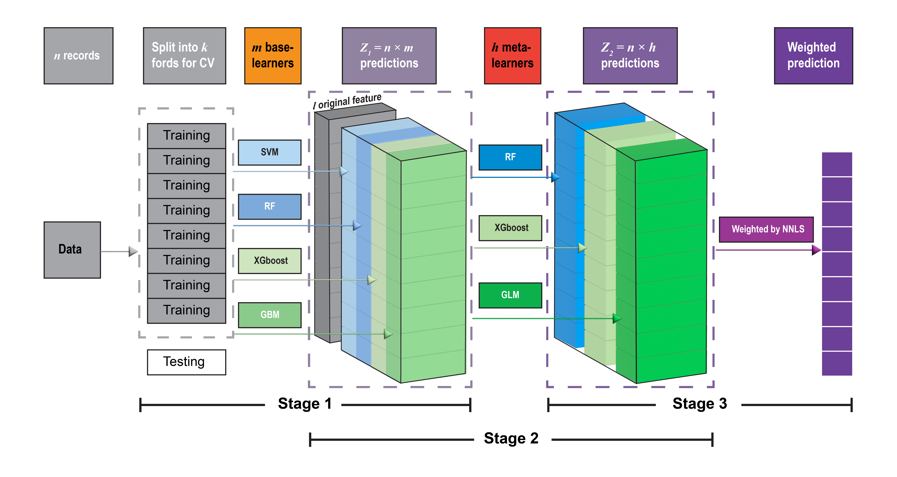
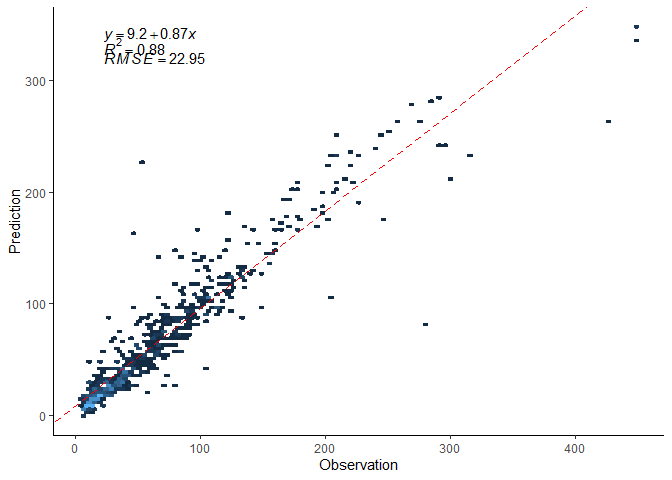

# R package ‘deeper’ install

Before installation, please make sure:

-   using R (&gt;= 3.5.0)

-   installed certain dependent R packages: devtools, SuperLearner(&gt;=
    2.0-28)

-   installed other suggested R packages: pacman, caret, skimr, CAST,
    ranger, gbm, xgboost, hexbin, (nnls, foreach, splines, gam)

<!-- -->

    # check the package installation
    #install.packages("pacman")
    library(pacman)
    p_load("devtools","SuperLearner","ranger","CAST","caret","skimr","gbm","xgboost","hexbin")

Using the following syntax to install deeper R package:

    library(devtools)
    install_github("Alven8816/deeper")

The developing version of deeper can be found from
[github](https://github.com/Alven8816/deeper).

## Activity

Install deeper R package.

# The advantage of DEML

-   Outstanding model performance. DEML is an extension of a
    SuperLearner(SL) ensemble algorithm (Naimi and Balzer 2018; Polley
    and Van Der Laan 2010; Van der Laan et al. 2007) by introducing the
    neural network hierarchy structure. Generally, it achieved higher
    estimation accuracy than SL and other single ML models.

-   Assessing constructed individual models simultaneously. DEML can
    evaluate the performance of all constructed individual models
    simultaneously and generate the optimal weights for each model.

-   Customizing diverse hierarchy structure and algorithms. You can
    modify the structure of DEML and achieve the best one for your
    tasks.

-   Minimizing errors from empirical experience. DEML not only evaluates
    the performance of all constructed models simultaneously but also
    automatically selects an optimal integration, as well as the
    selection of hyper-parameters.

-   Easy to use and extent. You do not need to have a high-steep
    learning curve to learn how it works.

The details about the DEML can be found
[here](https://ehp.niehs.nih.gov/doi/full/10.1289/EHP9752).

# The DEML framework

The DEML framework proposed above is a three-level stacked ensemble
approach. It is based on the SuperLearner(SL) ensemble algorithm (Naimi
and Balzer 2018; Polley and Van Der Laan 2010; Van der Laan et al. 2007)
introduced in the neural network hierarchy structure.

# Basic steps for DEML

-   **Step 1. Data preparation**

Including data collection, data clean, setting trianing and testing
dataset, and independent variables selection.

**Note: DEML could not directly deal with missing values and missing
value imputation technologies is recommended prior to the use of the
DEML model.**

-   **Step 2. Establish base models**

Using predictModel() or predictModel\_parallel() to establish the base
models. A tuningModel() function can be used to tuning the parameters to
get the best single base model.

-   **Step 3. Stacking meta models**

We use stack\_ensemble(),stack\_ensemble.fit(), or
stack\_ensemble\_parallel() function to stack the meta models to get a
DEML model.

-   **Step 4. Prediction based on new data set**

After establishment of DEML model, the predict() can be used predict the
unseen data set.

To assess the performance of the models, assess.plot() can be used by
comparing the original observations (y in test set) and the prediction.
The assess.plot() also return the point scatter plot.

# Algorithms selection

    # Our models are based on 'SuperLearner' R package
    data(model_list) # to get "model_details" file on the algorithms packages

<table class=" lightable-paper" style="font-family: &quot;Arial Narrow&quot;, arial, helvetica, sans-serif; margin-left: auto; margin-right: auto;">
<thead>
<tr>
<th style="text-align:left;position: sticky; top:0; background-color: #FFFFFF;">
parameter
</th>
<th style="text-align:left;position: sticky; top:0; background-color: #FFFFFF;">
algorithm
</th>
<th style="text-align:left;position: sticky; top:0; background-color: #FFFFFF;">
required package
</th>
<th style="text-align:left;position: sticky; top:0; background-color: #FFFFFF;">
types
</th>
</tr>
</thead>
<tbody>
<tr>
<td style="text-align:left;">
SL.bayesglm
</td>
<td style="text-align:left;">
Bayesian generalized linear regression
</td>
<td style="text-align:left;">
arm
</td>
<td style="text-align:left;">
R
</td>
</tr>
<tr>
<td style="text-align:left;">
SL.biglasso
</td>
<td style="text-align:left;">
Extending Lasso Model Fitting to Big Data
</td>
<td style="text-align:left;">
biglasso
</td>
<td style="text-align:left;">
R
</td>
</tr>
<tr>
<td style="text-align:left;">
SL.caret
</td>
<td style="text-align:left;">
random Forest as default
</td>
<td style="text-align:left;">
caret
</td>
<td style="text-align:left;">
R
</td>
</tr>
<tr>
<td style="text-align:left;">
SL.caret.rpart
</td>
<td style="text-align:left;">
decision trees as default
</td>
<td style="text-align:left;">
caret
</td>
<td style="text-align:left;">
R
</td>
</tr>
<tr>
<td style="text-align:left;">
SL.cforest
</td>
<td style="text-align:left;">
Breiman’s random forests
</td>
<td style="text-align:left;">
party
</td>
<td style="text-align:left;">
R
</td>
</tr>
<tr>
<td style="text-align:left;">
SL.earth
</td>
<td style="text-align:left;">
Multivariate Adaptive Regression Splines
</td>
<td style="text-align:left;">
earth
</td>
<td style="text-align:left;">
R
</td>
</tr>
<tr>
<td style="text-align:left;">
SL.gam
</td>
<td style="text-align:left;">
generalized additive models
</td>
<td style="text-align:left;">
gam
</td>
<td style="text-align:left;">
N
</td>
</tr>
<tr>
<td style="text-align:left;">
SL.gbm
</td>
<td style="text-align:left;">
generalized boosting algorithm
</td>
<td style="text-align:left;">
gbm
</td>
<td style="text-align:left;">
R
</td>
</tr>
<tr>
<td style="text-align:left;">
SL.glm
</td>
<td style="text-align:left;">
generalized linear models
</td>
<td style="text-align:left;">
NA
</td>
<td style="text-align:left;">
R
</td>
</tr>
<tr>
<td style="text-align:left;">
SL.glm.interaction
</td>
<td style="text-align:left;">
generalized linear models
</td>
<td style="text-align:left;">
NA
</td>
<td style="text-align:left;">
R
</td>
</tr>
<tr>
<td style="text-align:left;">
SL.ipredbagg
</td>
<td style="text-align:left;">
Bootstrap aggregation (bagging)
</td>
<td style="text-align:left;">
ipred
</td>
<td style="text-align:left;">
R
</td>
</tr>
<tr>
<td style="text-align:left;">
SL.kernelKnn
</td>
<td style="text-align:left;">
Kernel k Nearest Neighbors
</td>
<td style="text-align:left;">
kernelknn
</td>
<td style="text-align:left;">
C
</td>
</tr>
<tr>
<td style="text-align:left;">
SL.ksvm
</td>
<td style="text-align:left;">
Kernlab’s SVM Algorithm
</td>
<td style="text-align:left;">
kernlab
</td>
<td style="text-align:left;">
R
</td>
</tr>
<tr>
<td style="text-align:left;">
SL.lda
</td>
<td style="text-align:left;">
Linear discriminant analysis, used for classification
</td>
<td style="text-align:left;">
MASS
</td>
<td style="text-align:left;">
C
</td>
</tr>
<tr>
<td style="text-align:left;">
SL.lm
</td>
<td style="text-align:left;">
OLS via lm(),be faster than glm()
</td>
<td style="text-align:left;">
NA
</td>
<td style="text-align:left;">
R
</td>
</tr>
<tr>
<td style="text-align:left;">
SL.loess
</td>
<td style="text-align:left;">
Local Regression is a non-parametric approach that fits multiple
regressions in local neighborhood
</td>
<td style="text-align:left;">
loess
</td>
<td style="text-align:left;">
N
</td>
</tr>
<tr>
<td style="text-align:left;">
SL.logreg
</td>
<td style="text-align:left;">
Logic Regression
</td>
<td style="text-align:left;">
LogicReg
</td>
<td style="text-align:left;">
N
</td>
</tr>
<tr>
<td style="text-align:left;">
SL.mean
</td>
<td style="text-align:left;">
mean value
</td>
<td style="text-align:left;">
NA
</td>
<td style="text-align:left;">
R
</td>
</tr>
<tr>
<td style="text-align:left;">
SL.nnet
</td>
<td style="text-align:left;">
Feed-Forward Neural Networks and Multinomial Log-Linear Models
</td>
<td style="text-align:left;">
nnet
</td>
<td style="text-align:left;">
N
</td>
</tr>
<tr>
<td style="text-align:left;">
SL.nnls
</td>
<td style="text-align:left;">
Non-negative least squares algorithm
</td>
<td style="text-align:left;">
nnls
</td>
<td style="text-align:left;">
N
</td>
</tr>
<tr>
<td style="text-align:left;">
SL.polymars
</td>
<td style="text-align:left;">
Polynomial Spline Routines
</td>
<td style="text-align:left;">
polspline
</td>
<td style="text-align:left;">
R
</td>
</tr>
<tr>
<td style="text-align:left;">
SL.qda
</td>
<td style="text-align:left;">
Quadratic discriminant analysis, used for classification
</td>
<td style="text-align:left;">
MASS
</td>
<td style="text-align:left;">
C
</td>
</tr>
<tr>
<td style="text-align:left;">
SL.randomForest
</td>
<td style="text-align:left;">
random Forest
</td>
<td style="text-align:left;">
randomForest
</td>
<td style="text-align:left;">
R
</td>
</tr>
<tr>
<td style="text-align:left;">
SL.ranger
</td>
<td style="text-align:left;">
a fast implementation of Random Forest
</td>
<td style="text-align:left;">
ranger
</td>
<td style="text-align:left;">
R
</td>
</tr>
<tr>
<td style="text-align:left;">
SL.ridge
</td>
<td style="text-align:left;">
ridge regression
</td>
<td style="text-align:left;">
MASS
</td>
<td style="text-align:left;">
N
</td>
</tr>
<tr>
<td style="text-align:left;">
SL.rpart
</td>
<td style="text-align:left;">
Decision Trees
</td>
<td style="text-align:left;">
rpart
</td>
<td style="text-align:left;">
R
</td>
</tr>
<tr>
<td style="text-align:left;">
SL.rpartPrune
</td>
<td style="text-align:left;">
Decision Trees with prune
</td>
<td style="text-align:left;">
rpart
</td>
<td style="text-align:left;">
R
</td>
</tr>
<tr>
<td style="text-align:left;">
SL.speedglm
</td>
<td style="text-align:left;">
fast version of glm()
</td>
<td style="text-align:left;">
speedglm
</td>
<td style="text-align:left;">
N
</td>
</tr>
<tr>
<td style="text-align:left;">
SL.speedlm
</td>
<td style="text-align:left;">
fast version of lm()
</td>
<td style="text-align:left;">
speedglm
</td>
<td style="text-align:left;">
N
</td>
</tr>
<tr>
<td style="text-align:left;">
SL.step
</td>
<td style="text-align:left;">
regression with step
</td>
<td style="text-align:left;">
NA
</td>
<td style="text-align:left;">
R
</td>
</tr>
<tr>
<td style="text-align:left;">
SL.step.forward
</td>
<td style="text-align:left;">
regression with step forward
</td>
<td style="text-align:left;">
NA
</td>
<td style="text-align:left;">
R
</td>
</tr>
<tr>
<td style="text-align:left;">
SL.step.interaction
</td>
<td style="text-align:left;">
regression with step interaction
</td>
<td style="text-align:left;">
NA
</td>
<td style="text-align:left;">
R
</td>
</tr>
<tr>
<td style="text-align:left;">
SL.stepAIC
</td>
<td style="text-align:left;">
regression with stepAIC
</td>
<td style="text-align:left;">
MASS
</td>
<td style="text-align:left;">
R
</td>
</tr>
<tr>
<td style="text-align:left;">
SL.svm
</td>
<td style="text-align:left;">
svm
</td>
<td style="text-align:left;">
e1071
</td>
<td style="text-align:left;">
N
</td>
</tr>
<tr>
<td style="text-align:left;">
SL.xgboost
</td>
<td style="text-align:left;">
xgboost
</td>
<td style="text-align:left;">
xgboost
</td>
<td style="text-align:left;">
R
</td>
</tr>
</tbody>
</table>

In the ‘type’ column, “R”: can be used for regression or
classification;“N”: can be used for regression but variables require to
be numeric style; “C”: just used in classification.

# Example:

*To estimate the daily ambient PM2.5 in the northeast of China in
2015-2016*

## 1. Data preparation

    # load library
    library(ggplot2)
    library(caret)
    library(skimr)
    library(CAST)
    library(SuperLearner)
    library(hexbin)

    library(deeper)

    data("envir_example")

<table class=" lightable-paper" style="font-family: &quot;Arial Narrow&quot;, arial, helvetica, sans-serif; margin-left: auto; margin-right: auto;">
<thead>
<tr>
<th style="text-align:left;position: sticky; top:0; background-color: #FFFFFF;">
date
</th>
<th style="text-align:left;position: sticky; top:0; background-color: #FFFFFF;">
code
</th>
<th style="text-align:left;position: sticky; top:0; background-color: #FFFFFF;">
year
</th>
<th style="text-align:left;position: sticky; top:0; background-color: #FFFFFF;">
month
</th>
<th style="text-align:left;position: sticky; top:0; background-color: #FFFFFF;">
week
</th>
<th style="text-align:right;position: sticky; top:0; background-color: #FFFFFF;">
PM2.5
</th>
<th style="text-align:right;position: sticky; top:0; background-color: #FFFFFF;">
c\_AOD
</th>
<th style="text-align:right;position: sticky; top:0; background-color: #FFFFFF;">
TEMP
</th>
<th style="text-align:right;position: sticky; top:0; background-color: #FFFFFF;">
AP
</th>
<th style="text-align:right;position: sticky; top:0; background-color: #FFFFFF;">
RH
</th>
<th style="text-align:right;position: sticky; top:0; background-color: #FFFFFF;">
elevation
</th>
<th style="text-align:right;position: sticky; top:0; background-color: #FFFFFF;">
WS
</th>
<th style="text-align:right;position: sticky; top:0; background-color: #FFFFFF;">
a\_buffer10
</th>
</tr>
</thead>
<tbody>
<tr>
<td style="text-align:left;">
2/01/2015
</td>
<td style="text-align:left;">
1001A
</td>
<td style="text-align:left;">
2015
</td>
<td style="text-align:left;">
1
</td>
<td style="text-align:left;">
5
</td>
<td style="text-align:right;">
51.260870
</td>
<td style="text-align:right;">
0.2191133
</td>
<td style="text-align:right;">
-2.7578190
</td>
<td style="text-align:right;">
1012.1792
</td>
<td style="text-align:right;">
30.501541
</td>
<td style="text-align:right;">
45
</td>
<td style="text-align:right;">
1.6981146
</td>
<td style="text-align:right;">
68
</td>
</tr>
<tr>
<td style="text-align:left;">
3/01/2015
</td>
<td style="text-align:left;">
1001A
</td>
<td style="text-align:left;">
2015
</td>
<td style="text-align:left;">
1
</td>
<td style="text-align:left;">
6
</td>
<td style="text-align:right;">
154.041667
</td>
<td style="text-align:right;">
0.9245346
</td>
<td style="text-align:right;">
-3.7570234
</td>
<td style="text-align:right;">
1000.7333
</td>
<td style="text-align:right;">
43.591435
</td>
<td style="text-align:right;">
45
</td>
<td style="text-align:right;">
0.9536832
</td>
<td style="text-align:right;">
68
</td>
</tr>
<tr>
<td style="text-align:left;">
4/01/2015
</td>
<td style="text-align:left;">
1001A
</td>
<td style="text-align:left;">
2015
</td>
<td style="text-align:left;">
1
</td>
<td style="text-align:left;">
0
</td>
<td style="text-align:right;">
151.916667
</td>
<td style="text-align:right;">
0.3927248
</td>
<td style="text-align:right;">
-1.2981504
</td>
<td style="text-align:right;">
999.6592
</td>
<td style="text-align:right;">
43.221690
</td>
<td style="text-align:right;">
45
</td>
<td style="text-align:right;">
1.3580554
</td>
<td style="text-align:right;">
68
</td>
</tr>
<tr>
<td style="text-align:left;">
6/01/2015
</td>
<td style="text-align:left;">
1001A
</td>
<td style="text-align:left;">
2015
</td>
<td style="text-align:left;">
1
</td>
<td style="text-align:left;">
2
</td>
<td style="text-align:right;">
39.545455
</td>
<td style="text-align:right;">
0.3009302
</td>
<td style="text-align:right;">
-2.2188222
</td>
<td style="text-align:right;">
1010.8966
</td>
<td style="text-align:right;">
20.394366
</td>
<td style="text-align:right;">
45
</td>
<td style="text-align:right;">
2.7473587
</td>
<td style="text-align:right;">
68
</td>
</tr>
<tr>
<td style="text-align:left;">
8/01/2015
</td>
<td style="text-align:left;">
1001A
</td>
<td style="text-align:left;">
2015
</td>
<td style="text-align:left;">
1
</td>
<td style="text-align:left;">
4
</td>
<td style="text-align:right;">
148.380952
</td>
<td style="text-align:right;">
1.0532465
</td>
<td style="text-align:right;">
-3.5226464
</td>
<td style="text-align:right;">
1012.8126
</td>
<td style="text-align:right;">
54.778209
</td>
<td style="text-align:right;">
45
</td>
<td style="text-align:right;">
1.1803217
</td>
<td style="text-align:right;">
68
</td>
</tr>
<tr>
<td style="text-align:left;">
9/01/2015
</td>
<td style="text-align:left;">
1001A
</td>
<td style="text-align:left;">
2015
</td>
<td style="text-align:left;">
1
</td>
<td style="text-align:left;">
5
</td>
<td style="text-align:right;">
87.782609
</td>
<td style="text-align:right;">
0.1762094
</td>
<td style="text-align:right;">
-1.5934017
</td>
<td style="text-align:right;">
1011.9749
</td>
<td style="text-align:right;">
37.704168
</td>
<td style="text-align:right;">
45
</td>
<td style="text-align:right;">
2.1804410
</td>
<td style="text-align:right;">
68
</td>
</tr>
<tr>
<td style="text-align:left;">
10/01/2015
</td>
<td style="text-align:left;">
1001A
</td>
<td style="text-align:left;">
2015
</td>
<td style="text-align:left;">
1
</td>
<td style="text-align:left;">
6
</td>
<td style="text-align:right;">
258.166667
</td>
<td style="text-align:right;">
0.4545863
</td>
<td style="text-align:right;">
0.4196719
</td>
<td style="text-align:right;">
1006.0204
</td>
<td style="text-align:right;">
35.652642
</td>
<td style="text-align:right;">
45
</td>
<td style="text-align:right;">
1.9426563
</td>
<td style="text-align:right;">
68
</td>
</tr>
<tr>
<td style="text-align:left;">
11/01/2015
</td>
<td style="text-align:left;">
1001A
</td>
<td style="text-align:left;">
2015
</td>
<td style="text-align:left;">
1
</td>
<td style="text-align:left;">
0
</td>
<td style="text-align:right;">
41.913044
</td>
<td style="text-align:right;">
0.3188900
</td>
<td style="text-align:right;">
0.6478310
</td>
<td style="text-align:right;">
1015.1416
</td>
<td style="text-align:right;">
36.257478
</td>
<td style="text-align:right;">
45
</td>
<td style="text-align:right;">
2.0180428
</td>
<td style="text-align:right;">
68
</td>
</tr>
<tr>
<td style="text-align:left;">
12/01/2015
</td>
<td style="text-align:left;">
1001A
</td>
<td style="text-align:left;">
2015
</td>
<td style="text-align:left;">
1
</td>
<td style="text-align:left;">
1
</td>
<td style="text-align:right;">
102.210526
</td>
<td style="text-align:right;">
0.8257557
</td>
<td style="text-align:right;">
-3.2518236
</td>
<td style="text-align:right;">
1019.2709
</td>
<td style="text-align:right;">
57.227321
</td>
<td style="text-align:right;">
45
</td>
<td style="text-align:right;">
1.3070963
</td>
<td style="text-align:right;">
68
</td>
</tr>
<tr>
<td style="text-align:left;">
13/01/2015
</td>
<td style="text-align:left;">
1001A
</td>
<td style="text-align:left;">
2015
</td>
<td style="text-align:left;">
1
</td>
<td style="text-align:left;">
2
</td>
<td style="text-align:right;">
156.833333
</td>
<td style="text-align:right;">
2.1936942
</td>
<td style="text-align:right;">
-3.3905531
</td>
<td style="text-align:right;">
1014.7667
</td>
<td style="text-align:right;">
63.975585
</td>
<td style="text-align:right;">
45
</td>
<td style="text-align:right;">
1.1262513
</td>
<td style="text-align:right;">
68
</td>
</tr>
<tr>
<td style="text-align:left;">
16/01/2015
</td>
<td style="text-align:left;">
1001A
</td>
<td style="text-align:left;">
2015
</td>
<td style="text-align:left;">
1
</td>
<td style="text-align:left;">
5
</td>
<td style="text-align:right;">
116.590909
</td>
<td style="text-align:right;">
0.3079146
</td>
<td style="text-align:right;">
-2.1532049
</td>
<td style="text-align:right;">
1012.0368
</td>
<td style="text-align:right;">
49.540614
</td>
<td style="text-align:right;">
45
</td>
<td style="text-align:right;">
3.8807472
</td>
<td style="text-align:right;">
68
</td>
</tr>
<tr>
<td style="text-align:left;">
17/01/2015
</td>
<td style="text-align:left;">
1001A
</td>
<td style="text-align:left;">
2015
</td>
<td style="text-align:left;">
1
</td>
<td style="text-align:left;">
6
</td>
<td style="text-align:right;">
68.125000
</td>
<td style="text-align:right;">
0.8606775
</td>
<td style="text-align:right;">
-4.1322146
</td>
<td style="text-align:right;">
1014.9994
</td>
<td style="text-align:right;">
39.614220
</td>
<td style="text-align:right;">
45
</td>
<td style="text-align:right;">
1.9945184
</td>
<td style="text-align:right;">
68
</td>
</tr>
<tr>
<td style="text-align:left;">
19/01/2015
</td>
<td style="text-align:left;">
1001A
</td>
<td style="text-align:left;">
2015
</td>
<td style="text-align:left;">
1
</td>
<td style="text-align:left;">
1
</td>
<td style="text-align:right;">
47.217391
</td>
<td style="text-align:right;">
0.3827471
</td>
<td style="text-align:right;">
-0.9042627
</td>
<td style="text-align:right;">
1008.1785
</td>
<td style="text-align:right;">
37.912289
</td>
<td style="text-align:right;">
45
</td>
<td style="text-align:right;">
1.6696485
</td>
<td style="text-align:right;">
68
</td>
</tr>
<tr>
<td style="text-align:left;">
20/01/2015
</td>
<td style="text-align:left;">
1001A
</td>
<td style="text-align:left;">
2015
</td>
<td style="text-align:left;">
1
</td>
<td style="text-align:left;">
2
</td>
<td style="text-align:right;">
84.833333
</td>
<td style="text-align:right;">
0.7469321
</td>
<td style="text-align:right;">
-2.3398858
</td>
<td style="text-align:right;">
1005.2715
</td>
<td style="text-align:right;">
58.546365
</td>
<td style="text-align:right;">
45
</td>
<td style="text-align:right;">
1.7467501
</td>
<td style="text-align:right;">
68
</td>
</tr>
<tr>
<td style="text-align:left;">
21/01/2015
</td>
<td style="text-align:left;">
1001A
</td>
<td style="text-align:left;">
2015
</td>
<td style="text-align:left;">
1
</td>
<td style="text-align:left;">
3
</td>
<td style="text-align:right;">
15.565217
</td>
<td style="text-align:right;">
0.2071401
</td>
<td style="text-align:right;">
-0.6636745
</td>
<td style="text-align:right;">
1010.8518
</td>
<td style="text-align:right;">
39.960673
</td>
<td style="text-align:right;">
45
</td>
<td style="text-align:right;">
2.7599604
</td>
<td style="text-align:right;">
68
</td>
</tr>
<tr>
<td style="text-align:left;">
22/01/2015
</td>
<td style="text-align:left;">
1001A
</td>
<td style="text-align:left;">
2015
</td>
<td style="text-align:left;">
1
</td>
<td style="text-align:left;">
4
</td>
<td style="text-align:right;">
114.347826
</td>
<td style="text-align:right;">
0.4705506
</td>
<td style="text-align:right;">
-2.8899570
</td>
<td style="text-align:right;">
1007.8065
</td>
<td style="text-align:right;">
50.307533
</td>
<td style="text-align:right;">
45
</td>
<td style="text-align:right;">
1.5032883
</td>
<td style="text-align:right;">
68
</td>
</tr>
<tr>
<td style="text-align:left;">
27/01/2015
</td>
<td style="text-align:left;">
1001A
</td>
<td style="text-align:left;">
2015
</td>
<td style="text-align:left;">
1
</td>
<td style="text-align:left;">
2
</td>
<td style="text-align:right;">
18.583333
</td>
<td style="text-align:right;">
0.1891803
</td>
<td style="text-align:right;">
-5.6838047
</td>
<td style="text-align:right;">
1019.4059
</td>
<td style="text-align:right;">
29.233414
</td>
<td style="text-align:right;">
45
</td>
<td style="text-align:right;">
2.9240867
</td>
<td style="text-align:right;">
68
</td>
</tr>
<tr>
<td style="text-align:left;">
28/01/2015
</td>
<td style="text-align:left;">
1001A
</td>
<td style="text-align:left;">
2015
</td>
<td style="text-align:left;">
1
</td>
<td style="text-align:left;">
3
</td>
<td style="text-align:right;">
38.217391
</td>
<td style="text-align:right;">
0.7329633
</td>
<td style="text-align:right;">
-4.0320938
</td>
<td style="text-align:right;">
1016.7627
</td>
<td style="text-align:right;">
33.092514
</td>
<td style="text-align:right;">
45
</td>
<td style="text-align:right;">
1.4180907
</td>
<td style="text-align:right;">
68
</td>
</tr>
<tr>
<td style="text-align:left;">
29/01/2015
</td>
<td style="text-align:left;">
1001A
</td>
<td style="text-align:left;">
2015
</td>
<td style="text-align:left;">
1
</td>
<td style="text-align:left;">
4
</td>
<td style="text-align:right;">
70.380952
</td>
<td style="text-align:right;">
0.2989347
</td>
<td style="text-align:right;">
-2.2074631
</td>
<td style="text-align:right;">
1012.4569
</td>
<td style="text-align:right;">
42.289530
</td>
<td style="text-align:right;">
45
</td>
<td style="text-align:right;">
2.4448385
</td>
<td style="text-align:right;">
68
</td>
</tr>
<tr>
<td style="text-align:left;">
30/01/2015
</td>
<td style="text-align:left;">
1001A
</td>
<td style="text-align:left;">
2015
</td>
<td style="text-align:left;">
1
</td>
<td style="text-align:left;">
5
</td>
<td style="text-align:right;">
11.826087
</td>
<td style="text-align:right;">
0.1792027
</td>
<td style="text-align:right;">
-4.1416374
</td>
<td style="text-align:right;">
1018.4851
</td>
<td style="text-align:right;">
28.132200
</td>
<td style="text-align:right;">
45
</td>
<td style="text-align:right;">
2.6196466
</td>
<td style="text-align:right;">
68
</td>
</tr>
<tr>
<td style="text-align:left;">
31/01/2015
</td>
<td style="text-align:left;">
1001A
</td>
<td style="text-align:left;">
2015
</td>
<td style="text-align:left;">
1
</td>
<td style="text-align:left;">
6
</td>
<td style="text-align:right;">
34.791667
</td>
<td style="text-align:right;">
0.2690017
</td>
<td style="text-align:right;">
-4.9492986
</td>
<td style="text-align:right;">
1021.0109
</td>
<td style="text-align:right;">
29.049652
</td>
<td style="text-align:right;">
45
</td>
<td style="text-align:right;">
1.5139657
</td>
<td style="text-align:right;">
68
</td>
</tr>
<tr>
<td style="text-align:left;">
3/02/2015
</td>
<td style="text-align:left;">
1001A
</td>
<td style="text-align:left;">
2015
</td>
<td style="text-align:left;">
2
</td>
<td style="text-align:left;">
2
</td>
<td style="text-align:right;">
120.217391
</td>
<td style="text-align:right;">
1.2647731
</td>
<td style="text-align:right;">
-0.0178512
</td>
<td style="text-align:right;">
1014.6956
</td>
<td style="text-align:right;">
51.399182
</td>
<td style="text-align:right;">
45
</td>
<td style="text-align:right;">
2.0078487
</td>
<td style="text-align:right;">
67
</td>
</tr>
<tr>
<td style="text-align:left;">
5/02/2015
</td>
<td style="text-align:left;">
1001A
</td>
<td style="text-align:left;">
2015
</td>
<td style="text-align:left;">
2
</td>
<td style="text-align:left;">
4
</td>
<td style="text-align:right;">
32.869565
</td>
<td style="text-align:right;">
0.2500441
</td>
<td style="text-align:right;">
0.3710959
</td>
<td style="text-align:right;">
1015.1361
</td>
<td style="text-align:right;">
32.982877
</td>
<td style="text-align:right;">
45
</td>
<td style="text-align:right;">
2.6472091
</td>
<td style="text-align:right;">
67
</td>
</tr>
<tr>
<td style="text-align:left;">
8/02/2015
</td>
<td style="text-align:left;">
1001A
</td>
<td style="text-align:left;">
2015
</td>
<td style="text-align:left;">
2
</td>
<td style="text-align:left;">
0
</td>
<td style="text-align:right;">
27.458333
</td>
<td style="text-align:right;">
0.1821960
</td>
<td style="text-align:right;">
-5.3845520
</td>
<td style="text-align:right;">
1018.7470
</td>
<td style="text-align:right;">
19.360747
</td>
<td style="text-align:right;">
45
</td>
<td style="text-align:right;">
2.3645521
</td>
<td style="text-align:right;">
67
</td>
</tr>
<tr>
<td style="text-align:left;">
9/02/2015
</td>
<td style="text-align:left;">
1001A
</td>
<td style="text-align:left;">
2015
</td>
<td style="text-align:left;">
2
</td>
<td style="text-align:left;">
1
</td>
<td style="text-align:right;">
136.954545
</td>
<td style="text-align:right;">
0.6331866
</td>
<td style="text-align:right;">
-2.8905686
</td>
<td style="text-align:right;">
1011.3391
</td>
<td style="text-align:right;">
27.811638
</td>
<td style="text-align:right;">
45
</td>
<td style="text-align:right;">
1.6458455
</td>
<td style="text-align:right;">
67
</td>
</tr>
<tr>
<td style="text-align:left;">
11/02/2015
</td>
<td style="text-align:left;">
1001A
</td>
<td style="text-align:left;">
2015
</td>
<td style="text-align:left;">
2
</td>
<td style="text-align:left;">
3
</td>
<td style="text-align:right;">
48.739130
</td>
<td style="text-align:right;">
0.4037002
</td>
<td style="text-align:right;">
2.1861991
</td>
<td style="text-align:right;">
999.8991
</td>
<td style="text-align:right;">
29.706408
</td>
<td style="text-align:right;">
45
</td>
<td style="text-align:right;">
2.5165936
</td>
<td style="text-align:right;">
67
</td>
</tr>
<tr>
<td style="text-align:left;">
13/02/2015
</td>
<td style="text-align:left;">
1001A
</td>
<td style="text-align:left;">
2015
</td>
<td style="text-align:left;">
2
</td>
<td style="text-align:left;">
5
</td>
<td style="text-align:right;">
131.782609
</td>
<td style="text-align:right;">
0.8337378
</td>
<td style="text-align:right;">
-0.0395599
</td>
<td style="text-align:right;">
1000.5689
</td>
<td style="text-align:right;">
46.766896
</td>
<td style="text-align:right;">
45
</td>
<td style="text-align:right;">
1.6667486
</td>
<td style="text-align:right;">
67
</td>
</tr>
<tr>
<td style="text-align:left;">
14/02/2015
</td>
<td style="text-align:left;">
1001A
</td>
<td style="text-align:left;">
2015
</td>
<td style="text-align:left;">
2
</td>
<td style="text-align:left;">
6
</td>
<td style="text-align:right;">
263.130435
</td>
<td style="text-align:right;">
1.2787419
</td>
<td style="text-align:right;">
2.2909780
</td>
<td style="text-align:right;">
995.6102
</td>
<td style="text-align:right;">
44.661253
</td>
<td style="text-align:right;">
45
</td>
<td style="text-align:right;">
1.4949234
</td>
<td style="text-align:right;">
67
</td>
</tr>
<tr>
<td style="text-align:left;">
16/02/2015
</td>
<td style="text-align:left;">
1001A
</td>
<td style="text-align:left;">
2015
</td>
<td style="text-align:left;">
2
</td>
<td style="text-align:left;">
1
</td>
<td style="text-align:right;">
134.826087
</td>
<td style="text-align:right;">
0.4136779
</td>
<td style="text-align:right;">
3.2674555
</td>
<td style="text-align:right;">
1001.7397
</td>
<td style="text-align:right;">
46.669649
</td>
<td style="text-align:right;">
45
</td>
<td style="text-align:right;">
2.2726022
</td>
<td style="text-align:right;">
67
</td>
</tr>
<tr>
<td style="text-align:left;">
17/02/2015
</td>
<td style="text-align:left;">
1001A
</td>
<td style="text-align:left;">
2015
</td>
<td style="text-align:left;">
2
</td>
<td style="text-align:left;">
2
</td>
<td style="text-align:right;">
24.458333
</td>
<td style="text-align:right;">
0.3298655
</td>
<td style="text-align:right;">
3.2466585
</td>
<td style="text-align:right;">
1006.9600
</td>
<td style="text-align:right;">
36.982240
</td>
<td style="text-align:right;">
45
</td>
<td style="text-align:right;">
2.4130491
</td>
<td style="text-align:right;">
67
</td>
</tr>
<tr>
<td style="text-align:left;">
18/02/2015
</td>
<td style="text-align:left;">
1001A
</td>
<td style="text-align:left;">
2015
</td>
<td style="text-align:left;">
2
</td>
<td style="text-align:left;">
3
</td>
<td style="text-align:right;">
58.375000
</td>
<td style="text-align:right;">
0.2989347
</td>
<td style="text-align:right;">
1.7302565
</td>
<td style="text-align:right;">
1013.6470
</td>
<td style="text-align:right;">
44.257245
</td>
<td style="text-align:right;">
45
</td>
<td style="text-align:right;">
1.6140238
</td>
<td style="text-align:right;">
67
</td>
</tr>
<tr>
<td style="text-align:left;">
22/02/2015
</td>
<td style="text-align:left;">
1001A
</td>
<td style="text-align:left;">
2015
</td>
<td style="text-align:left;">
2
</td>
<td style="text-align:left;">
0
</td>
<td style="text-align:right;">
45.739130
</td>
<td style="text-align:right;">
0.7209901
</td>
<td style="text-align:right;">
-2.4690684
</td>
<td style="text-align:right;">
1006.4364
</td>
<td style="text-align:right;">
28.687770
</td>
<td style="text-align:right;">
45
</td>
<td style="text-align:right;">
3.8412131
</td>
<td style="text-align:right;">
67
</td>
</tr>
<tr>
<td style="text-align:left;">
23/02/2015
</td>
<td style="text-align:left;">
1001A
</td>
<td style="text-align:left;">
2015
</td>
<td style="text-align:left;">
2
</td>
<td style="text-align:left;">
1
</td>
<td style="text-align:right;">
70.454545
</td>
<td style="text-align:right;">
0.5533653
</td>
<td style="text-align:right;">
-1.3849348
</td>
<td style="text-align:right;">
1003.9417
</td>
<td style="text-align:right;">
41.191738
</td>
<td style="text-align:right;">
45
</td>
<td style="text-align:right;">
1.5336963
</td>
<td style="text-align:right;">
67
</td>
</tr>
<tr>
<td style="text-align:left;">
24/02/2015
</td>
<td style="text-align:left;">
1001A
</td>
<td style="text-align:left;">
2015
</td>
<td style="text-align:left;">
2
</td>
<td style="text-align:left;">
2
</td>
<td style="text-align:right;">
171.636364
</td>
<td style="text-align:right;">
1.4862774
</td>
<td style="text-align:right;">
-0.1206111
</td>
<td style="text-align:right;">
998.1008
</td>
<td style="text-align:right;">
61.642142
</td>
<td style="text-align:right;">
45
</td>
<td style="text-align:right;">
1.3097040
</td>
<td style="text-align:right;">
67
</td>
</tr>
<tr>
<td style="text-align:left;">
25/02/2015
</td>
<td style="text-align:left;">
1001A
</td>
<td style="text-align:left;">
2015
</td>
<td style="text-align:left;">
2
</td>
<td style="text-align:left;">
3
</td>
<td style="text-align:right;">
70.869565
</td>
<td style="text-align:right;">
0.3338565
</td>
<td style="text-align:right;">
1.8343405
</td>
<td style="text-align:right;">
1002.0941
</td>
<td style="text-align:right;">
37.793281
</td>
<td style="text-align:right;">
45
</td>
<td style="text-align:right;">
3.2692591
</td>
<td style="text-align:right;">
67
</td>
</tr>
<tr>
<td style="text-align:left;">
26/02/2015
</td>
<td style="text-align:left;">
1001A
</td>
<td style="text-align:left;">
2015
</td>
<td style="text-align:left;">
2
</td>
<td style="text-align:left;">
4
</td>
<td style="text-align:right;">
12.375000
</td>
<td style="text-align:right;">
0.3039235
</td>
<td style="text-align:right;">
-0.3742791
</td>
<td style="text-align:right;">
1008.8098
</td>
<td style="text-align:right;">
30.608379
</td>
<td style="text-align:right;">
45
</td>
<td style="text-align:right;">
2.2327197
</td>
<td style="text-align:right;">
67
</td>
</tr>
<tr>
<td style="text-align:left;">
1/03/2015
</td>
<td style="text-align:left;">
1001A
</td>
<td style="text-align:left;">
2015
</td>
<td style="text-align:left;">
3
</td>
<td style="text-align:left;">
0
</td>
<td style="text-align:right;">
47.041667
</td>
<td style="text-align:right;">
0.3168945
</td>
<td style="text-align:right;">
3.4589770
</td>
<td style="text-align:right;">
1004.0528
</td>
<td style="text-align:right;">
36.578990
</td>
<td style="text-align:right;">
45
</td>
<td style="text-align:right;">
2.6846265
</td>
<td style="text-align:right;">
65
</td>
</tr>
<tr>
<td style="text-align:left;">
2/03/2015
</td>
<td style="text-align:left;">
1001A
</td>
<td style="text-align:left;">
2015
</td>
<td style="text-align:left;">
3
</td>
<td style="text-align:left;">
1
</td>
<td style="text-align:right;">
60.478261
</td>
<td style="text-align:right;">
0.5224345
</td>
<td style="text-align:right;">
4.4084291
</td>
<td style="text-align:right;">
995.4668
</td>
<td style="text-align:right;">
36.363625
</td>
<td style="text-align:right;">
45
</td>
<td style="text-align:right;">
2.1842093
</td>
<td style="text-align:right;">
65
</td>
</tr>
<tr>
<td style="text-align:left;">
3/03/2015
</td>
<td style="text-align:left;">
1001A
</td>
<td style="text-align:left;">
2015
</td>
<td style="text-align:left;">
3
</td>
<td style="text-align:left;">
2
</td>
<td style="text-align:right;">
5.833333
</td>
<td style="text-align:right;">
0.1602451
</td>
<td style="text-align:right;">
0.9879780
</td>
<td style="text-align:right;">
1006.4706
</td>
<td style="text-align:right;">
15.638631
</td>
<td style="text-align:right;">
45
</td>
<td style="text-align:right;">
4.9468958
</td>
<td style="text-align:right;">
65
</td>
</tr>
<tr>
<td style="text-align:left;">
4/03/2015
</td>
<td style="text-align:left;">
1001A
</td>
<td style="text-align:left;">
2015
</td>
<td style="text-align:left;">
3
</td>
<td style="text-align:left;">
3
</td>
<td style="text-align:right;">
28.904762
</td>
<td style="text-align:right;">
0.3039235
</td>
<td style="text-align:right;">
-1.2363903
</td>
<td style="text-align:right;">
1011.2330
</td>
<td style="text-align:right;">
20.675009
</td>
<td style="text-align:right;">
45
</td>
<td style="text-align:right;">
1.7557908
</td>
<td style="text-align:right;">
65
</td>
</tr>
<tr>
<td style="text-align:left;">
6/03/2015
</td>
<td style="text-align:left;">
1001A
</td>
<td style="text-align:left;">
2015
</td>
<td style="text-align:left;">
3
</td>
<td style="text-align:left;">
5
</td>
<td style="text-align:right;">
202.208333
</td>
<td style="text-align:right;">
1.2986972
</td>
<td style="text-align:right;">
2.6290425
</td>
<td style="text-align:right;">
1002.2570
</td>
<td style="text-align:right;">
39.833272
</td>
<td style="text-align:right;">
45
</td>
<td style="text-align:right;">
1.9252842
</td>
<td style="text-align:right;">
65
</td>
</tr>
<tr>
<td style="text-align:left;">
9/03/2015
</td>
<td style="text-align:left;">
1001A
</td>
<td style="text-align:left;">
2015
</td>
<td style="text-align:left;">
3
</td>
<td style="text-align:left;">
1
</td>
<td style="text-align:right;">
6.250000
</td>
<td style="text-align:right;">
0.2350776
</td>
<td style="text-align:right;">
-0.5932202
</td>
<td style="text-align:right;">
1018.2900
</td>
<td style="text-align:right;">
15.353382
</td>
<td style="text-align:right;">
45
</td>
<td style="text-align:right;">
3.5181034
</td>
<td style="text-align:right;">
65
</td>
</tr>
<tr>
<td style="text-align:left;">
10/03/2015
</td>
<td style="text-align:left;">
1001A
</td>
<td style="text-align:left;">
2015
</td>
<td style="text-align:left;">
3
</td>
<td style="text-align:left;">
2
</td>
<td style="text-align:right;">
35.869565
</td>
<td style="text-align:right;">
0.5114591
</td>
<td style="text-align:right;">
0.4332038
</td>
<td style="text-align:right;">
1013.8273
</td>
<td style="text-align:right;">
20.899091
</td>
<td style="text-align:right;">
45
</td>
<td style="text-align:right;">
2.1624886
</td>
<td style="text-align:right;">
65
</td>
</tr>
<tr>
<td style="text-align:left;">
11/03/2015
</td>
<td style="text-align:left;">
1001A
</td>
<td style="text-align:left;">
2015
</td>
<td style="text-align:left;">
3
</td>
<td style="text-align:left;">
3
</td>
<td style="text-align:right;">
40.500000
</td>
<td style="text-align:right;">
0.2949436
</td>
<td style="text-align:right;">
3.5336775
</td>
<td style="text-align:right;">
1006.5052
</td>
<td style="text-align:right;">
21.930789
</td>
<td style="text-align:right;">
45
</td>
<td style="text-align:right;">
2.1012537
</td>
<td style="text-align:right;">
65
</td>
</tr>
<tr>
<td style="text-align:left;">
12/03/2015
</td>
<td style="text-align:left;">
1001A
</td>
<td style="text-align:left;">
2015
</td>
<td style="text-align:left;">
3
</td>
<td style="text-align:left;">
4
</td>
<td style="text-align:right;">
66.357143
</td>
<td style="text-align:right;">
0.5374010
</td>
<td style="text-align:right;">
4.5394769
</td>
<td style="text-align:right;">
999.9214
</td>
<td style="text-align:right;">
27.246590
</td>
<td style="text-align:right;">
45
</td>
<td style="text-align:right;">
1.8043423
</td>
<td style="text-align:right;">
65
</td>
</tr>
<tr>
<td style="text-align:left;">
13/03/2015
</td>
<td style="text-align:left;">
1001A
</td>
<td style="text-align:left;">
2015
</td>
<td style="text-align:left;">
3
</td>
<td style="text-align:left;">
5
</td>
<td style="text-align:right;">
66.958333
</td>
<td style="text-align:right;">
0.3657851
</td>
<td style="text-align:right;">
4.4962585
</td>
<td style="text-align:right;">
1004.7667
</td>
<td style="text-align:right;">
32.439938
</td>
<td style="text-align:right;">
45
</td>
<td style="text-align:right;">
1.9492221
</td>
<td style="text-align:right;">
65
</td>
</tr>
<tr>
<td style="text-align:left;">
14/03/2015
</td>
<td style="text-align:left;">
1001A
</td>
<td style="text-align:left;">
2015
</td>
<td style="text-align:left;">
3
</td>
<td style="text-align:left;">
6
</td>
<td style="text-align:right;">
95.416667
</td>
<td style="text-align:right;">
1.1141103
</td>
<td style="text-align:right;">
4.7740791
</td>
<td style="text-align:right;">
1003.7401
</td>
<td style="text-align:right;">
43.627339
</td>
<td style="text-align:right;">
45
</td>
<td style="text-align:right;">
1.9451003
</td>
<td style="text-align:right;">
65
</td>
</tr>
<tr>
<td style="text-align:left;">
15/03/2015
</td>
<td style="text-align:left;">
1001A
</td>
<td style="text-align:left;">
2015
</td>
<td style="text-align:left;">
3
</td>
<td style="text-align:left;">
0
</td>
<td style="text-align:right;">
108.608696
</td>
<td style="text-align:right;">
0.5803050
</td>
<td style="text-align:right;">
8.5010395
</td>
<td style="text-align:right;">
1000.4600
</td>
<td style="text-align:right;">
29.282040
</td>
<td style="text-align:right;">
45
</td>
<td style="text-align:right;">
2.1795222
</td>
<td style="text-align:right;">
65
</td>
</tr>
<tr>
<td style="text-align:left;">
16/03/2015
</td>
<td style="text-align:left;">
1001A
</td>
<td style="text-align:left;">
2015
</td>
<td style="text-align:left;">
3
</td>
<td style="text-align:left;">
1
</td>
<td style="text-align:right;">
215.304348
</td>
<td style="text-align:right;">
1.7456968
</td>
<td style="text-align:right;">
10.6673139
</td>
<td style="text-align:right;">
995.0334
</td>
<td style="text-align:right;">
53.434843
</td>
<td style="text-align:right;">
45
</td>
<td style="text-align:right;">
1.5447071
</td>
<td style="text-align:right;">
65
</td>
</tr>
<tr>
<td style="text-align:left;">
17/03/2015
</td>
<td style="text-align:left;">
1001A
</td>
<td style="text-align:left;">
2015
</td>
<td style="text-align:left;">
3
</td>
<td style="text-align:left;">
2
</td>
<td style="text-align:right;">
209.000000
</td>
<td style="text-align:right;">
1.3914896
</td>
<td style="text-align:right;">
10.1272166
</td>
<td style="text-align:right;">
1002.3554
</td>
<td style="text-align:right;">
47.671679
</td>
<td style="text-align:right;">
45
</td>
<td style="text-align:right;">
2.3425604
</td>
<td style="text-align:right;">
65
</td>
</tr>
<tr>
<td style="text-align:left;">
20/03/2015
</td>
<td style="text-align:left;">
1001A
</td>
<td style="text-align:left;">
2015
</td>
<td style="text-align:left;">
3
</td>
<td style="text-align:left;">
5
</td>
<td style="text-align:right;">
41.958333
</td>
<td style="text-align:right;">
0.7179968
</td>
<td style="text-align:right;">
12.1301625
</td>
<td style="text-align:right;">
1001.2187
</td>
<td style="text-align:right;">
21.965090
</td>
<td style="text-align:right;">
45
</td>
<td style="text-align:right;">
1.9469722
</td>
<td style="text-align:right;">
65
</td>
</tr>
<tr>
<td style="text-align:left;">
21/03/2015
</td>
<td style="text-align:left;">
1001A
</td>
<td style="text-align:left;">
2015
</td>
<td style="text-align:left;">
3
</td>
<td style="text-align:left;">
6
</td>
<td style="text-align:right;">
16.391304
</td>
<td style="text-align:right;">
0.2969392
</td>
<td style="text-align:right;">
13.3990114
</td>
<td style="text-align:right;">
1001.8233
</td>
<td style="text-align:right;">
11.307059
</td>
<td style="text-align:right;">
45
</td>
<td style="text-align:right;">
3.1208426
</td>
<td style="text-align:right;">
65
</td>
</tr>
<tr>
<td style="text-align:left;">
22/03/2015
</td>
<td style="text-align:left;">
1001A
</td>
<td style="text-align:left;">
2015
</td>
<td style="text-align:left;">
3
</td>
<td style="text-align:left;">
0
</td>
<td style="text-align:right;">
20.750000
</td>
<td style="text-align:right;">
0.4007069
</td>
<td style="text-align:right;">
8.7266188
</td>
<td style="text-align:right;">
1010.6463
</td>
<td style="text-align:right;">
17.534216
</td>
<td style="text-align:right;">
45
</td>
<td style="text-align:right;">
3.0059832
</td>
<td style="text-align:right;">
65
</td>
</tr>
<tr>
<td style="text-align:left;">
23/03/2015
</td>
<td style="text-align:left;">
1001A
</td>
<td style="text-align:left;">
2015
</td>
<td style="text-align:left;">
3
</td>
<td style="text-align:left;">
1
</td>
<td style="text-align:right;">
37.541667
</td>
<td style="text-align:right;">
0.2989347
</td>
<td style="text-align:right;">
8.2603393
</td>
<td style="text-align:right;">
1012.4088
</td>
<td style="text-align:right;">
24.568087
</td>
<td style="text-align:right;">
45
</td>
<td style="text-align:right;">
1.7208055
</td>
<td style="text-align:right;">
65
</td>
</tr>
<tr>
<td style="text-align:left;">
24/03/2015
</td>
<td style="text-align:left;">
1001A
</td>
<td style="text-align:left;">
2015
</td>
<td style="text-align:left;">
3
</td>
<td style="text-align:left;">
2
</td>
<td style="text-align:right;">
76.434783
</td>
<td style="text-align:right;">
0.6022559
</td>
<td style="text-align:right;">
8.6788668
</td>
<td style="text-align:right;">
1014.0625
</td>
<td style="text-align:right;">
31.138685
</td>
<td style="text-align:right;">
45
</td>
<td style="text-align:right;">
2.4635822
</td>
<td style="text-align:right;">
65
</td>
</tr>
<tr>
<td style="text-align:left;">
25/03/2015
</td>
<td style="text-align:left;">
1001A
</td>
<td style="text-align:left;">
2015
</td>
<td style="text-align:left;">
3
</td>
<td style="text-align:left;">
3
</td>
<td style="text-align:right;">
121.500000
</td>
<td style="text-align:right;">
1.1041327
</td>
<td style="text-align:right;">
10.0058838
</td>
<td style="text-align:right;">
1013.5237
</td>
<td style="text-align:right;">
44.094199
</td>
<td style="text-align:right;">
45
</td>
<td style="text-align:right;">
1.9235046
</td>
<td style="text-align:right;">
65
</td>
</tr>
<tr>
<td style="text-align:left;">
26/03/2015
</td>
<td style="text-align:left;">
1001A
</td>
<td style="text-align:left;">
2015
</td>
<td style="text-align:left;">
3
</td>
<td style="text-align:left;">
4
</td>
<td style="text-align:right;">
99.791667
</td>
<td style="text-align:right;">
0.9594564
</td>
<td style="text-align:right;">
12.6483488
</td>
<td style="text-align:right;">
1012.1091
</td>
<td style="text-align:right;">
38.303280
</td>
<td style="text-align:right;">
45
</td>
<td style="text-align:right;">
2.3763893
</td>
<td style="text-align:right;">
65
</td>
</tr>
<tr>
<td style="text-align:left;">
27/03/2015
</td>
<td style="text-align:left;">
1001A
</td>
<td style="text-align:left;">
2015
</td>
<td style="text-align:left;">
3
</td>
<td style="text-align:left;">
5
</td>
<td style="text-align:right;">
98.500000
</td>
<td style="text-align:right;">
1.3615565
</td>
<td style="text-align:right;">
13.1075518
</td>
<td style="text-align:right;">
1004.3666
</td>
<td style="text-align:right;">
39.244185
</td>
<td style="text-align:right;">
45
</td>
<td style="text-align:right;">
2.3411170
</td>
<td style="text-align:right;">
65
</td>
</tr>
<tr>
<td style="text-align:left;">
28/03/2015
</td>
<td style="text-align:left;">
1001A
</td>
<td style="text-align:left;">
2015
</td>
<td style="text-align:left;">
3
</td>
<td style="text-align:left;">
6
</td>
<td style="text-align:right;">
54.714286
</td>
<td style="text-align:right;">
1.0881684
</td>
<td style="text-align:right;">
16.4249967
</td>
<td style="text-align:right;">
997.0708
</td>
<td style="text-align:right;">
36.752134
</td>
<td style="text-align:right;">
45
</td>
<td style="text-align:right;">
3.1925194
</td>
<td style="text-align:right;">
65
</td>
</tr>
<tr>
<td style="text-align:left;">
2/04/2015
</td>
<td style="text-align:left;">
1001A
</td>
<td style="text-align:left;">
2015
</td>
<td style="text-align:left;">
4
</td>
<td style="text-align:left;">
4
</td>
<td style="text-align:right;">
34.666667
</td>
<td style="text-align:right;">
0.2350776
</td>
<td style="text-align:right;">
7.1317981
</td>
<td style="text-align:right;">
986.9407
</td>
<td style="text-align:right;">
77.743946
</td>
<td style="text-align:right;">
45
</td>
<td style="text-align:right;">
2.2431351
</td>
<td style="text-align:right;">
96
</td>
</tr>
<tr>
<td style="text-align:left;">
4/04/2015
</td>
<td style="text-align:left;">
1001A
</td>
<td style="text-align:left;">
2015
</td>
<td style="text-align:left;">
4
</td>
<td style="text-align:left;">
6
</td>
<td style="text-align:right;">
63.166667
</td>
<td style="text-align:right;">
1.3795163
</td>
<td style="text-align:right;">
10.9488784
</td>
<td style="text-align:right;">
995.9359
</td>
<td style="text-align:right;">
58.777771
</td>
<td style="text-align:right;">
45
</td>
<td style="text-align:right;">
1.6019415
</td>
<td style="text-align:right;">
96
</td>
</tr>
<tr>
<td style="text-align:left;">
7/04/2015
</td>
<td style="text-align:left;">
1001A
</td>
<td style="text-align:left;">
2015
</td>
<td style="text-align:left;">
4
</td>
<td style="text-align:left;">
2
</td>
<td style="text-align:right;">
25.416667
</td>
<td style="text-align:right;">
0.4156734
</td>
<td style="text-align:right;">
6.9263453
</td>
<td style="text-align:right;">
1014.2936
</td>
<td style="text-align:right;">
31.566222
</td>
<td style="text-align:right;">
45
</td>
<td style="text-align:right;">
2.0884137
</td>
<td style="text-align:right;">
96
</td>
</tr>
<tr>
<td style="text-align:left;">
8/04/2015
</td>
<td style="text-align:left;">
1001A
</td>
<td style="text-align:left;">
2015
</td>
<td style="text-align:left;">
4
</td>
<td style="text-align:left;">
3
</td>
<td style="text-align:right;">
105.045455
</td>
<td style="text-align:right;">
1.2667687
</td>
<td style="text-align:right;">
7.7419772
</td>
<td style="text-align:right;">
1007.6463
</td>
<td style="text-align:right;">
47.914405
</td>
<td style="text-align:right;">
45
</td>
<td style="text-align:right;">
2.2678974
</td>
<td style="text-align:right;">
96
</td>
</tr>
<tr>
<td style="text-align:left;">
10/04/2015
</td>
<td style="text-align:left;">
1001A
</td>
<td style="text-align:left;">
2015
</td>
<td style="text-align:left;">
4
</td>
<td style="text-align:left;">
5
</td>
<td style="text-align:right;">
167.095238
</td>
<td style="text-align:right;">
1.0891662
</td>
<td style="text-align:right;">
12.8743405
</td>
<td style="text-align:right;">
1002.6518
</td>
<td style="text-align:right;">
54.233962
</td>
<td style="text-align:right;">
45
</td>
<td style="text-align:right;">
1.9273488
</td>
<td style="text-align:right;">
96
</td>
</tr>
<tr>
<td style="text-align:left;">
13/04/2015
</td>
<td style="text-align:left;">
1001A
</td>
<td style="text-align:left;">
2015
</td>
<td style="text-align:left;">
4
</td>
<td style="text-align:left;">
1
</td>
<td style="text-align:right;">
19.937500
</td>
<td style="text-align:right;">
0.6591286
</td>
<td style="text-align:right;">
10.1281262
</td>
<td style="text-align:right;">
1008.5041
</td>
<td style="text-align:right;">
46.575101
</td>
<td style="text-align:right;">
45
</td>
<td style="text-align:right;">
2.8013003
</td>
<td style="text-align:right;">
96
</td>
</tr>
<tr>
<td style="text-align:left;">
14/04/2015
</td>
<td style="text-align:left;">
1001A
</td>
<td style="text-align:left;">
2015
</td>
<td style="text-align:left;">
4
</td>
<td style="text-align:left;">
2
</td>
<td style="text-align:right;">
60.210526
</td>
<td style="text-align:right;">
0.4825238
</td>
<td style="text-align:right;">
15.0722784
</td>
<td style="text-align:right;">
992.5982
</td>
<td style="text-align:right;">
42.136589
</td>
<td style="text-align:right;">
45
</td>
<td style="text-align:right;">
1.9367939
</td>
<td style="text-align:right;">
96
</td>
</tr>
<tr>
<td style="text-align:left;">
16/04/2015
</td>
<td style="text-align:left;">
1001A
</td>
<td style="text-align:left;">
2015
</td>
<td style="text-align:left;">
4
</td>
<td style="text-align:left;">
4
</td>
<td style="text-align:right;">
53.785714
</td>
<td style="text-align:right;">
0.4476020
</td>
<td style="text-align:right;">
15.3360204
</td>
<td style="text-align:right;">
995.2984
</td>
<td style="text-align:right;">
13.384441
</td>
<td style="text-align:right;">
45
</td>
<td style="text-align:right;">
4.3697977
</td>
<td style="text-align:right;">
96
</td>
</tr>
<tr>
<td style="text-align:left;">
17/04/2015
</td>
<td style="text-align:left;">
1001A
</td>
<td style="text-align:left;">
2015
</td>
<td style="text-align:left;">
4
</td>
<td style="text-align:left;">
5
</td>
<td style="text-align:right;">
65.739130
</td>
<td style="text-align:right;">
0.4114272
</td>
<td style="text-align:right;">
16.0839962
</td>
<td style="text-align:right;">
992.7204
</td>
<td style="text-align:right;">
30.580269
</td>
<td style="text-align:right;">
45
</td>
<td style="text-align:right;">
2.1913466
</td>
<td style="text-align:right;">
96
</td>
</tr>
<tr>
<td style="text-align:left;">
20/04/2015
</td>
<td style="text-align:left;">
1001A
</td>
<td style="text-align:left;">
2015
</td>
<td style="text-align:left;">
4
</td>
<td style="text-align:left;">
1
</td>
<td style="text-align:right;">
68.772727
</td>
<td style="text-align:right;">
0.5987648
</td>
<td style="text-align:right;">
14.3516553
</td>
<td style="text-align:right;">
998.4742
</td>
<td style="text-align:right;">
44.320103
</td>
<td style="text-align:right;">
45
</td>
<td style="text-align:right;">
1.9653635
</td>
<td style="text-align:right;">
96
</td>
</tr>
<tr>
<td style="text-align:left;">
22/04/2015
</td>
<td style="text-align:left;">
1001A
</td>
<td style="text-align:left;">
2015
</td>
<td style="text-align:left;">
4
</td>
<td style="text-align:left;">
3
</td>
<td style="text-align:right;">
39.571429
</td>
<td style="text-align:right;">
0.5177499
</td>
<td style="text-align:right;">
17.3310676
</td>
<td style="text-align:right;">
1000.8431
</td>
<td style="text-align:right;">
34.828513
</td>
<td style="text-align:right;">
45
</td>
<td style="text-align:right;">
2.3077731
</td>
<td style="text-align:right;">
96
</td>
</tr>
<tr>
<td style="text-align:left;">
23/04/2015
</td>
<td style="text-align:left;">
1001A
</td>
<td style="text-align:left;">
2015
</td>
<td style="text-align:left;">
4
</td>
<td style="text-align:left;">
4
</td>
<td style="text-align:right;">
63.916667
</td>
<td style="text-align:right;">
0.5133059
</td>
<td style="text-align:right;">
19.9378028
</td>
<td style="text-align:right;">
998.4316
</td>
<td style="text-align:right;">
34.675601
</td>
<td style="text-align:right;">
45
</td>
<td style="text-align:right;">
2.3921463
</td>
<td style="text-align:right;">
96
</td>
</tr>
<tr>
<td style="text-align:left;">
24/04/2015
</td>
<td style="text-align:left;">
1001A
</td>
<td style="text-align:left;">
2015
</td>
<td style="text-align:left;">
4
</td>
<td style="text-align:left;">
5
</td>
<td style="text-align:right;">
46.238095
</td>
<td style="text-align:right;">
0.4000410
</td>
<td style="text-align:right;">
17.9392491
</td>
<td style="text-align:right;">
1004.4569
</td>
<td style="text-align:right;">
31.607968
</td>
<td style="text-align:right;">
45
</td>
<td style="text-align:right;">
1.9465481
</td>
<td style="text-align:right;">
96
</td>
</tr>
<tr>
<td style="text-align:left;">
25/04/2015
</td>
<td style="text-align:left;">
1001A
</td>
<td style="text-align:left;">
2015
</td>
<td style="text-align:left;">
4
</td>
<td style="text-align:left;">
6
</td>
<td style="text-align:right;">
84.250000
</td>
<td style="text-align:right;">
0.5880148
</td>
<td style="text-align:right;">
21.1223650
</td>
<td style="text-align:right;">
998.6899
</td>
<td style="text-align:right;">
34.815205
</td>
<td style="text-align:right;">
45
</td>
<td style="text-align:right;">
2.0380920
</td>
<td style="text-align:right;">
96
</td>
</tr>
<tr>
<td style="text-align:left;">
26/04/2015
</td>
<td style="text-align:left;">
1001A
</td>
<td style="text-align:left;">
2015
</td>
<td style="text-align:left;">
4
</td>
<td style="text-align:left;">
0
</td>
<td style="text-align:right;">
100.909091
</td>
<td style="text-align:right;">
0.8277512
</td>
<td style="text-align:right;">
23.0583990
</td>
<td style="text-align:right;">
993.9251
</td>
<td style="text-align:right;">
42.578283
</td>
<td style="text-align:right;">
45
</td>
<td style="text-align:right;">
2.5801153
</td>
<td style="text-align:right;">
96
</td>
</tr>
<tr>
<td style="text-align:left;">
29/04/2015
</td>
<td style="text-align:left;">
1001A
</td>
<td style="text-align:left;">
2015
</td>
<td style="text-align:left;">
4
</td>
<td style="text-align:left;">
3
</td>
<td style="text-align:right;">
108.666667
</td>
<td style="text-align:right;">
1.5399869
</td>
<td style="text-align:right;">
20.2278931
</td>
<td style="text-align:right;">
996.7210
</td>
<td style="text-align:right;">
65.195791
</td>
<td style="text-align:right;">
45
</td>
<td style="text-align:right;">
1.9114356
</td>
<td style="text-align:right;">
96
</td>
</tr>
<tr>
<td style="text-align:left;">
30/04/2015
</td>
<td style="text-align:left;">
1001A
</td>
<td style="text-align:left;">
2015
</td>
<td style="text-align:left;">
4
</td>
<td style="text-align:left;">
4
</td>
<td style="text-align:right;">
100.545455
</td>
<td style="text-align:right;">
1.2868096
</td>
<td style="text-align:right;">
22.3361727
</td>
<td style="text-align:right;">
994.5791
</td>
<td style="text-align:right;">
61.601498
</td>
<td style="text-align:right;">
45
</td>
<td style="text-align:right;">
2.2605407
</td>
<td style="text-align:right;">
96
</td>
</tr>
<tr>
<td style="text-align:left;">
2/05/2015
</td>
<td style="text-align:left;">
1001A
</td>
<td style="text-align:left;">
2015
</td>
<td style="text-align:left;">
5
</td>
<td style="text-align:left;">
6
</td>
<td style="text-align:right;">
38.217391
</td>
<td style="text-align:right;">
0.7848472
</td>
<td style="text-align:right;">
17.9163012
</td>
<td style="text-align:right;">
994.0532
</td>
<td style="text-align:right;">
72.929654
</td>
<td style="text-align:right;">
45
</td>
<td style="text-align:right;">
1.7246053
</td>
<td style="text-align:right;">
106
</td>
</tr>
<tr>
<td style="text-align:left;">
3/05/2015
</td>
<td style="text-align:left;">
1001A
</td>
<td style="text-align:left;">
2015
</td>
<td style="text-align:left;">
5
</td>
<td style="text-align:left;">
0
</td>
<td style="text-align:right;">
37.409091
</td>
<td style="text-align:right;">
0.3787561
</td>
<td style="text-align:right;">
18.2200406
</td>
<td style="text-align:right;">
997.3531
</td>
<td style="text-align:right;">
34.913449
</td>
<td style="text-align:right;">
45
</td>
<td style="text-align:right;">
3.2732354
</td>
<td style="text-align:right;">
106
</td>
</tr>
<tr>
<td style="text-align:left;">
4/05/2015
</td>
<td style="text-align:left;">
1001A
</td>
<td style="text-align:left;">
2015
</td>
<td style="text-align:left;">
5
</td>
<td style="text-align:left;">
1
</td>
<td style="text-align:right;">
30.708333
</td>
<td style="text-align:right;">
0.2310865
</td>
<td style="text-align:right;">
17.2938454
</td>
<td style="text-align:right;">
998.8407
</td>
<td style="text-align:right;">
22.219923
</td>
<td style="text-align:right;">
45
</td>
<td style="text-align:right;">
2.9834772
</td>
<td style="text-align:right;">
106
</td>
</tr>
<tr>
<td style="text-align:left;">
5/05/2015
</td>
<td style="text-align:left;">
1001A
</td>
<td style="text-align:left;">
2015
</td>
<td style="text-align:left;">
5
</td>
<td style="text-align:left;">
2
</td>
<td style="text-align:right;">
46.052632
</td>
<td style="text-align:right;">
0.6870661
</td>
<td style="text-align:right;">
18.8514926
</td>
<td style="text-align:right;">
989.2592
</td>
<td style="text-align:right;">
37.330820
</td>
<td style="text-align:right;">
45
</td>
<td style="text-align:right;">
1.9403910
</td>
<td style="text-align:right;">
106
</td>
</tr>
<tr>
<td style="text-align:left;">
8/05/2015
</td>
<td style="text-align:left;">
1001A
</td>
<td style="text-align:left;">
2015
</td>
<td style="text-align:left;">
5
</td>
<td style="text-align:left;">
5
</td>
<td style="text-align:right;">
60.923077
</td>
<td style="text-align:right;">
1.0015167
</td>
<td style="text-align:right;">
17.6597296
</td>
<td style="text-align:right;">
993.2548
</td>
<td style="text-align:right;">
51.110959
</td>
<td style="text-align:right;">
45
</td>
<td style="text-align:right;">
2.0518910
</td>
<td style="text-align:right;">
106
</td>
</tr>
<tr>
<td style="text-align:left;">
13/05/2015
</td>
<td style="text-align:left;">
1001A
</td>
<td style="text-align:left;">
2015
</td>
<td style="text-align:left;">
5
</td>
<td style="text-align:left;">
3
</td>
<td style="text-align:right;">
49.636364
</td>
<td style="text-align:right;">
0.8796351
</td>
<td style="text-align:right;">
21.4206634
</td>
<td style="text-align:right;">
978.6730
</td>
<td style="text-align:right;">
45.736028
</td>
<td style="text-align:right;">
45
</td>
<td style="text-align:right;">
1.9872591
</td>
<td style="text-align:right;">
106
</td>
</tr>
<tr>
<td style="text-align:left;">
15/05/2015
</td>
<td style="text-align:left;">
1001A
</td>
<td style="text-align:left;">
2015
</td>
<td style="text-align:left;">
5
</td>
<td style="text-align:left;">
5
</td>
<td style="text-align:right;">
23.363636
</td>
<td style="text-align:right;">
0.5398302
</td>
<td style="text-align:right;">
20.0670516
</td>
<td style="text-align:right;">
998.0728
</td>
<td style="text-align:right;">
34.800087
</td>
<td style="text-align:right;">
45
</td>
<td style="text-align:right;">
2.4591033
</td>
<td style="text-align:right;">
106
</td>
</tr>
<tr>
<td style="text-align:left;">
16/05/2015
</td>
<td style="text-align:left;">
1001A
</td>
<td style="text-align:left;">
2015
</td>
<td style="text-align:left;">
5
</td>
<td style="text-align:left;">
6
</td>
<td style="text-align:right;">
49.136364
</td>
<td style="text-align:right;">
0.6076566
</td>
<td style="text-align:right;">
20.4598194
</td>
<td style="text-align:right;">
993.8858
</td>
<td style="text-align:right;">
40.334603
</td>
<td style="text-align:right;">
45
</td>
<td style="text-align:right;">
2.1532738
</td>
<td style="text-align:right;">
106
</td>
</tr>
<tr>
<td style="text-align:left;">
18/05/2015
</td>
<td style="text-align:left;">
1001A
</td>
<td style="text-align:left;">
2015
</td>
<td style="text-align:left;">
5
</td>
<td style="text-align:left;">
1
</td>
<td style="text-align:right;">
59.727273
</td>
<td style="text-align:right;">
0.5195074
</td>
<td style="text-align:right;">
21.9758756
</td>
<td style="text-align:right;">
985.4870
</td>
<td style="text-align:right;">
41.063803
</td>
<td style="text-align:right;">
45
</td>
<td style="text-align:right;">
3.1041851
</td>
<td style="text-align:right;">
106
</td>
</tr>
<tr>
<td style="text-align:left;">
19/05/2015
</td>
<td style="text-align:left;">
1001A
</td>
<td style="text-align:left;">
2015
</td>
<td style="text-align:left;">
5
</td>
<td style="text-align:left;">
2
</td>
<td style="text-align:right;">
9.173913
</td>
<td style="text-align:right;">
0.2181156
</td>
<td style="text-align:right;">
21.0153507
</td>
<td style="text-align:right;">
991.7722
</td>
<td style="text-align:right;">
19.915704
</td>
<td style="text-align:right;">
45
</td>
<td style="text-align:right;">
3.6031350
</td>
<td style="text-align:right;">
106
</td>
</tr>
<tr>
<td style="text-align:left;">
20/05/2015
</td>
<td style="text-align:left;">
1001A
</td>
<td style="text-align:left;">
2015
</td>
<td style="text-align:left;">
5
</td>
<td style="text-align:left;">
3
</td>
<td style="text-align:right;">
12.400000
</td>
<td style="text-align:right;">
0.3827471
</td>
<td style="text-align:right;">
21.9929486
</td>
<td style="text-align:right;">
999.0697
</td>
<td style="text-align:right;">
28.966390
</td>
<td style="text-align:right;">
45
</td>
<td style="text-align:right;">
2.8199421
</td>
<td style="text-align:right;">
106
</td>
</tr>
<tr>
<td style="text-align:left;">
22/05/2015
</td>
<td style="text-align:left;">
1001A
</td>
<td style="text-align:left;">
2015
</td>
<td style="text-align:left;">
5
</td>
<td style="text-align:left;">
5
</td>
<td style="text-align:right;">
46.733333
</td>
<td style="text-align:right;">
0.5443854
</td>
<td style="text-align:right;">
21.6766337
</td>
<td style="text-align:right;">
993.3537
</td>
<td style="text-align:right;">
43.139344
</td>
<td style="text-align:right;">
45
</td>
<td style="text-align:right;">
1.7491342
</td>
<td style="text-align:right;">
106
</td>
</tr>
<tr>
<td style="text-align:left;">
23/05/2015
</td>
<td style="text-align:left;">
1001A
</td>
<td style="text-align:left;">
2015
</td>
<td style="text-align:left;">
5
</td>
<td style="text-align:left;">
6
</td>
<td style="text-align:right;">
94.608696
</td>
<td style="text-align:right;">
0.8566864
</td>
<td style="text-align:right;">
23.5002057
</td>
<td style="text-align:right;">
992.0893
</td>
<td style="text-align:right;">
48.143308
</td>
<td style="text-align:right;">
45
</td>
<td style="text-align:right;">
1.7392998
</td>
<td style="text-align:right;">
106
</td>
</tr>
<tr>
<td style="text-align:left;">
24/05/2015
</td>
<td style="text-align:left;">
1001A
</td>
<td style="text-align:left;">
2015
</td>
<td style="text-align:left;">
5
</td>
<td style="text-align:left;">
0
</td>
<td style="text-align:right;">
109.608696
</td>
<td style="text-align:right;">
0.8335242
</td>
<td style="text-align:right;">
24.7987470
</td>
<td style="text-align:right;">
990.6647
</td>
<td style="text-align:right;">
47.236961
</td>
<td style="text-align:right;">
45
</td>
<td style="text-align:right;">
1.9607962
</td>
<td style="text-align:right;">
106
</td>
</tr>
<tr>
<td style="text-align:left;">
25/05/2015
</td>
<td style="text-align:left;">
1001A
</td>
<td style="text-align:left;">
2015
</td>
<td style="text-align:left;">
5
</td>
<td style="text-align:left;">
1
</td>
<td style="text-align:right;">
93.000000
</td>
<td style="text-align:right;">
1.1401529
</td>
<td style="text-align:right;">
26.0013812
</td>
<td style="text-align:right;">
989.7598
</td>
<td style="text-align:right;">
44.726083
</td>
<td style="text-align:right;">
45
</td>
<td style="text-align:right;">
2.1629453
</td>
<td style="text-align:right;">
106
</td>
</tr>
<tr>
<td style="text-align:left;">
26/05/2015
</td>
<td style="text-align:left;">
1001A
</td>
<td style="text-align:left;">
2015
</td>
<td style="text-align:left;">
5
</td>
<td style="text-align:left;">
2
</td>
<td style="text-align:right;">
96.562500
</td>
<td style="text-align:right;">
0.9637966
</td>
<td style="text-align:right;">
26.9838034
</td>
<td style="text-align:right;">
989.8560
</td>
<td style="text-align:right;">
44.315692
</td>
<td style="text-align:right;">
45
</td>
<td style="text-align:right;">
2.5222506
</td>
<td style="text-align:right;">
106
</td>
</tr>
<tr>
<td style="text-align:left;">
27/05/2015
</td>
<td style="text-align:left;">
1001A
</td>
<td style="text-align:left;">
2015
</td>
<td style="text-align:left;">
5
</td>
<td style="text-align:left;">
3
</td>
<td style="text-align:right;">
70.000000
</td>
<td style="text-align:right;">
1.4036436
</td>
<td style="text-align:right;">
25.2355775
</td>
<td style="text-align:right;">
988.8655
</td>
<td style="text-align:right;">
50.789759
</td>
<td style="text-align:right;">
45
</td>
<td style="text-align:right;">
1.9541233
</td>
<td style="text-align:right;">
106
</td>
</tr>
<tr>
<td style="text-align:left;">
30/05/2015
</td>
<td style="text-align:left;">
1001A
</td>
<td style="text-align:left;">
2015
</td>
<td style="text-align:left;">
5
</td>
<td style="text-align:left;">
6
</td>
<td style="text-align:right;">
58.227273
</td>
<td style="text-align:right;">
0.8034888
</td>
<td style="text-align:right;">
23.3737190
</td>
<td style="text-align:right;">
991.2177
</td>
<td style="text-align:right;">
50.314047
</td>
<td style="text-align:right;">
45
</td>
<td style="text-align:right;">
1.9750139
</td>
<td style="text-align:right;">
106
</td>
</tr>
<tr>
<td style="text-align:left;">
31/05/2015
</td>
<td style="text-align:left;">
1001A
</td>
<td style="text-align:left;">
2015
</td>
<td style="text-align:left;">
5
</td>
<td style="text-align:left;">
0
</td>
<td style="text-align:right;">
54.333333
</td>
<td style="text-align:right;">
0.8563917
</td>
<td style="text-align:right;">
26.0800157
</td>
<td style="text-align:right;">
985.2582
</td>
<td style="text-align:right;">
48.476599
</td>
<td style="text-align:right;">
45
</td>
<td style="text-align:right;">
2.3379093
</td>
<td style="text-align:right;">
106
</td>
</tr>
<tr>
<td style="text-align:left;">
2/06/2015
</td>
<td style="text-align:left;">
1001A
</td>
<td style="text-align:left;">
2015
</td>
<td style="text-align:left;">
6
</td>
<td style="text-align:left;">
2
</td>
<td style="text-align:right;">
29.304348
</td>
<td style="text-align:right;">
0.3218833
</td>
<td style="text-align:right;">
26.0817068
</td>
<td style="text-align:right;">
992.1940
</td>
<td style="text-align:right;">
30.889294
</td>
<td style="text-align:right;">
45
</td>
<td style="text-align:right;">
3.3387508
</td>
<td style="text-align:right;">
119
</td>
</tr>
<tr>
<td style="text-align:left;">
5/06/2015
</td>
<td style="text-align:left;">
1001A
</td>
<td style="text-align:left;">
2015
</td>
<td style="text-align:left;">
6
</td>
<td style="text-align:left;">
5
</td>
<td style="text-align:right;">
46.363636
</td>
<td style="text-align:right;">
0.1811982
</td>
<td style="text-align:right;">
22.6537927
</td>
<td style="text-align:right;">
982.5346
</td>
<td style="text-align:right;">
61.171947
</td>
<td style="text-align:right;">
45
</td>
<td style="text-align:right;">
1.7999022
</td>
<td style="text-align:right;">
119
</td>
</tr>
<tr>
<td style="text-align:left;">
6/06/2015
</td>
<td style="text-align:left;">
1001A
</td>
<td style="text-align:left;">
2015
</td>
<td style="text-align:left;">
6
</td>
<td style="text-align:left;">
6
</td>
<td style="text-align:right;">
31.800000
</td>
<td style="text-align:right;">
0.8397244
</td>
<td style="text-align:right;">
23.3094934
</td>
<td style="text-align:right;">
985.7026
</td>
<td style="text-align:right;">
55.581278
</td>
<td style="text-align:right;">
45
</td>
<td style="text-align:right;">
2.4930142
</td>
<td style="text-align:right;">
119
</td>
</tr>
<tr>
<td style="text-align:left;">
8/06/2015
</td>
<td style="text-align:left;">
1001A
</td>
<td style="text-align:left;">
2015
</td>
<td style="text-align:left;">
6
</td>
<td style="text-align:left;">
1
</td>
<td style="text-align:right;">
17.750000
</td>
<td style="text-align:right;">
0.3454906
</td>
<td style="text-align:right;">
21.6866725
</td>
<td style="text-align:right;">
988.9722
</td>
<td style="text-align:right;">
53.782350
</td>
<td style="text-align:right;">
45
</td>
<td style="text-align:right;">
1.6714952
</td>
<td style="text-align:right;">
119
</td>
</tr>
<tr>
<td style="text-align:left;">
9/06/2015
</td>
<td style="text-align:left;">
1001A
</td>
<td style="text-align:left;">
2015
</td>
<td style="text-align:left;">
6
</td>
<td style="text-align:left;">
2
</td>
<td style="text-align:right;">
51.736842
</td>
<td style="text-align:right;">
1.1949295
</td>
<td style="text-align:right;">
23.7603126
</td>
<td style="text-align:right;">
985.4319
</td>
<td style="text-align:right;">
53.132717
</td>
<td style="text-align:right;">
45
</td>
<td style="text-align:right;">
2.2841587
</td>
<td style="text-align:right;">
119
</td>
</tr>
<tr>
<td style="text-align:left;">
14/06/2015
</td>
<td style="text-align:left;">
1001A
</td>
<td style="text-align:left;">
2015
</td>
<td style="text-align:left;">
6
</td>
<td style="text-align:left;">
0
</td>
<td style="text-align:right;">
19.608696
</td>
<td style="text-align:right;">
0.3228811
</td>
<td style="text-align:right;">
24.4419272
</td>
<td style="text-align:right;">
992.3170
</td>
<td style="text-align:right;">
55.953608
</td>
<td style="text-align:right;">
45
</td>
<td style="text-align:right;">
1.7600144
</td>
<td style="text-align:right;">
119
</td>
</tr>
<tr>
<td style="text-align:left;">
15/06/2015
</td>
<td style="text-align:left;">
1001A
</td>
<td style="text-align:left;">
2015
</td>
<td style="text-align:left;">
6
</td>
<td style="text-align:left;">
1
</td>
<td style="text-align:right;">
85.050000
</td>
<td style="text-align:right;">
1.3066794
</td>
<td style="text-align:right;">
25.2975290
</td>
<td style="text-align:right;">
990.8853
</td>
<td style="text-align:right;">
56.159801
</td>
<td style="text-align:right;">
45
</td>
<td style="text-align:right;">
1.7780001
</td>
<td style="text-align:right;">
119
</td>
</tr>
<tr>
<td style="text-align:left;">
16/06/2015
</td>
<td style="text-align:left;">
1001A
</td>
<td style="text-align:left;">
2015
</td>
<td style="text-align:left;">
6
</td>
<td style="text-align:left;">
2
</td>
<td style="text-align:right;">
105.578947
</td>
<td style="text-align:right;">
1.2340634
</td>
<td style="text-align:right;">
25.7340908
</td>
<td style="text-align:right;">
987.9738
</td>
<td style="text-align:right;">
55.621346
</td>
<td style="text-align:right;">
45
</td>
<td style="text-align:right;">
1.7777652
</td>
<td style="text-align:right;">
119
</td>
</tr>
<tr>
<td style="text-align:left;">
18/06/2015
</td>
<td style="text-align:left;">
1001A
</td>
<td style="text-align:left;">
2015
</td>
<td style="text-align:left;">
6
</td>
<td style="text-align:left;">
4
</td>
<td style="text-align:right;">
19.388889
</td>
<td style="text-align:right;">
0.2330821
</td>
<td style="text-align:right;">
26.0229420
</td>
<td style="text-align:right;">
990.4234
</td>
<td style="text-align:right;">
38.252122
</td>
<td style="text-align:right;">
45
</td>
<td style="text-align:right;">
2.2184300
</td>
<td style="text-align:right;">
119
</td>
</tr>
<tr>
<td style="text-align:left;">
20/06/2015
</td>
<td style="text-align:left;">
1001A
</td>
<td style="text-align:left;">
2015
</td>
<td style="text-align:left;">
6
</td>
<td style="text-align:left;">
6
</td>
<td style="text-align:right;">
25.437500
</td>
<td style="text-align:right;">
0.4109347
</td>
<td style="text-align:right;">
23.7471048
</td>
<td style="text-align:right;">
995.5276
</td>
<td style="text-align:right;">
54.363934
</td>
<td style="text-align:right;">
45
</td>
<td style="text-align:right;">
1.5458389
</td>
<td style="text-align:right;">
119
</td>
</tr>
<tr>
<td style="text-align:left;">
22/06/2015
</td>
<td style="text-align:left;">
1001A
</td>
<td style="text-align:left;">
2015
</td>
<td style="text-align:left;">
6
</td>
<td style="text-align:left;">
1
</td>
<td style="text-align:right;">
88.304348
</td>
<td style="text-align:right;">
1.7536790
</td>
<td style="text-align:right;">
25.2820467
</td>
<td style="text-align:right;">
989.7123
</td>
<td style="text-align:right;">
54.440615
</td>
<td style="text-align:right;">
45
</td>
<td style="text-align:right;">
1.7889821
</td>
<td style="text-align:right;">
119
</td>
</tr>
<tr>
<td style="text-align:left;">
30/06/2015
</td>
<td style="text-align:left;">
1001A
</td>
<td style="text-align:left;">
2015
</td>
<td style="text-align:left;">
6
</td>
<td style="text-align:left;">
2
</td>
<td style="text-align:right;">
12.952381
</td>
<td style="text-align:right;">
0.1712205
</td>
<td style="text-align:right;">
21.4991385
</td>
<td style="text-align:right;">
987.3340
</td>
<td style="text-align:right;">
64.993280
</td>
<td style="text-align:right;">
45
</td>
<td style="text-align:right;">
2.1649992
</td>
<td style="text-align:right;">
119
</td>
</tr>
<tr>
<td style="text-align:left;">
2/07/2015
</td>
<td style="text-align:left;">
1001A
</td>
<td style="text-align:left;">
2015
</td>
<td style="text-align:left;">
7
</td>
<td style="text-align:left;">
4
</td>
<td style="text-align:right;">
7.375000
</td>
<td style="text-align:right;">
0.2440575
</td>
<td style="text-align:right;">
25.2494242
</td>
<td style="text-align:right;">
986.6231
</td>
<td style="text-align:right;">
42.355824
</td>
<td style="text-align:right;">
45
</td>
<td style="text-align:right;">
2.0563907
</td>
<td style="text-align:right;">
141
</td>
</tr>
<tr>
<td style="text-align:left;">
3/07/2015
</td>
<td style="text-align:left;">
1001A
</td>
<td style="text-align:left;">
2015
</td>
<td style="text-align:left;">
7
</td>
<td style="text-align:left;">
5
</td>
<td style="text-align:right;">
27.350000
</td>
<td style="text-align:right;">
0.5726473
</td>
<td style="text-align:right;">
24.8784167
</td>
<td style="text-align:right;">
991.8548
</td>
<td style="text-align:right;">
41.711326
</td>
<td style="text-align:right;">
45
</td>
<td style="text-align:right;">
2.3032246
</td>
<td style="text-align:right;">
141
</td>
</tr>
<tr>
<td style="text-align:left;">
5/07/2015
</td>
<td style="text-align:left;">
1001A
</td>
<td style="text-align:left;">
2015
</td>
<td style="text-align:left;">
7
</td>
<td style="text-align:left;">
0
</td>
<td style="text-align:right;">
62.291667
</td>
<td style="text-align:right;">
1.7495671
</td>
<td style="text-align:right;">
22.9538174
</td>
<td style="text-align:right;">
993.7297
</td>
<td style="text-align:right;">
63.032486
</td>
<td style="text-align:right;">
45
</td>
<td style="text-align:right;">
1.8998538
</td>
<td style="text-align:right;">
141
</td>
</tr>
<tr>
<td style="text-align:left;">
6/07/2015
</td>
<td style="text-align:left;">
1001A
</td>
<td style="text-align:left;">
2015
</td>
<td style="text-align:left;">
7
</td>
<td style="text-align:left;">
1
</td>
<td style="text-align:right;">
61.210526
</td>
<td style="text-align:right;">
2.2006786
</td>
<td style="text-align:right;">
24.6520996
</td>
<td style="text-align:right;">
994.2337
</td>
<td style="text-align:right;">
59.614223
</td>
<td style="text-align:right;">
45
</td>
<td style="text-align:right;">
1.8651692
</td>
<td style="text-align:right;">
141
</td>
</tr>
<tr>
<td style="text-align:left;">
7/07/2015
</td>
<td style="text-align:left;">
1001A
</td>
<td style="text-align:left;">
2015
</td>
<td style="text-align:left;">
7
</td>
<td style="text-align:left;">
2
</td>
<td style="text-align:right;">
60.750000
</td>
<td style="text-align:right;">
1.1499160
</td>
<td style="text-align:right;">
26.1737257
</td>
<td style="text-align:right;">
992.9491
</td>
<td style="text-align:right;">
56.882061
</td>
<td style="text-align:right;">
45
</td>
<td style="text-align:right;">
1.7730900
</td>
<td style="text-align:right;">
141
</td>
</tr>
<tr>
<td style="text-align:left;">
8/07/2015
</td>
<td style="text-align:left;">
1001A
</td>
<td style="text-align:left;">
2015
</td>
<td style="text-align:left;">
7
</td>
<td style="text-align:left;">
3
</td>
<td style="text-align:right;">
119.217391
</td>
<td style="text-align:right;">
2.3144240
</td>
<td style="text-align:right;">
26.9637473
</td>
<td style="text-align:right;">
994.0516
</td>
<td style="text-align:right;">
59.182902
</td>
<td style="text-align:right;">
45
</td>
<td style="text-align:right;">
1.9562954
</td>
<td style="text-align:right;">
141
</td>
</tr>
<tr>
<td style="text-align:left;">
9/07/2015
</td>
<td style="text-align:left;">
1001A
</td>
<td style="text-align:left;">
2015
</td>
<td style="text-align:left;">
7
</td>
<td style="text-align:left;">
4
</td>
<td style="text-align:right;">
66.000000
</td>
<td style="text-align:right;">
1.4672500
</td>
<td style="text-align:right;">
27.3940798
</td>
<td style="text-align:right;">
996.2729
</td>
<td style="text-align:right;">
52.273397
</td>
<td style="text-align:right;">
45
</td>
<td style="text-align:right;">
2.0753724
</td>
<td style="text-align:right;">
141
</td>
</tr>
<tr>
<td style="text-align:left;">
10/07/2015
</td>
<td style="text-align:left;">
1001A
</td>
<td style="text-align:left;">
2015
</td>
<td style="text-align:left;">
7
</td>
<td style="text-align:left;">
5
</td>
<td style="text-align:right;">
51.708333
</td>
<td style="text-align:right;">
2.2904776
</td>
<td style="text-align:right;">
27.4254939
</td>
<td style="text-align:right;">
994.5684
</td>
<td style="text-align:right;">
54.899338
</td>
<td style="text-align:right;">
45
</td>
<td style="text-align:right;">
2.0445353
</td>
<td style="text-align:right;">
141
</td>
</tr>
<tr>
<td style="text-align:left;">
12/07/2015
</td>
<td style="text-align:left;">
1001A
</td>
<td style="text-align:left;">
2015
</td>
<td style="text-align:left;">
7
</td>
<td style="text-align:left;">
0
</td>
<td style="text-align:right;">
113.541667
</td>
<td style="text-align:right;">
1.1314682
</td>
<td style="text-align:right;">
29.6785150
</td>
<td style="text-align:right;">
984.4462
</td>
<td style="text-align:right;">
55.752341
</td>
<td style="text-align:right;">
45
</td>
<td style="text-align:right;">
1.3525486
</td>
<td style="text-align:right;">
141
</td>
</tr>
<tr>
<td style="text-align:left;">
13/07/2015
</td>
<td style="text-align:left;">
1001A
</td>
<td style="text-align:left;">
2015
</td>
<td style="text-align:left;">
7
</td>
<td style="text-align:left;">
1
</td>
<td style="text-align:right;">
49.869565
</td>
<td style="text-align:right;">
0.4426131
</td>
<td style="text-align:right;">
31.0475573
</td>
<td style="text-align:right;">
982.1450
</td>
<td style="text-align:right;">
47.176441
</td>
<td style="text-align:right;">
45
</td>
<td style="text-align:right;">
1.4812077
</td>
<td style="text-align:right;">
141
</td>
</tr>
<tr>
<td style="text-align:left;">
23/07/2015
</td>
<td style="text-align:left;">
1001A
</td>
<td style="text-align:left;">
2015
</td>
<td style="text-align:left;">
7
</td>
<td style="text-align:left;">
4
</td>
<td style="text-align:right;">
35.714286
</td>
<td style="text-align:right;">
0.8912984
</td>
<td style="text-align:right;">
25.5587825
</td>
<td style="text-align:right;">
988.0376
</td>
<td style="text-align:right;">
75.653518
</td>
<td style="text-align:right;">
45
</td>
<td style="text-align:right;">
1.1108947
</td>
<td style="text-align:right;">
141
</td>
</tr>
<tr>
<td style="text-align:left;">
24/07/2015
</td>
<td style="text-align:left;">
1001A
</td>
<td style="text-align:left;">
2015
</td>
<td style="text-align:left;">
7
</td>
<td style="text-align:left;">
5
</td>
<td style="text-align:right;">
54.277778
</td>
<td style="text-align:right;">
0.7569097
</td>
<td style="text-align:right;">
25.8487927
</td>
<td style="text-align:right;">
985.8280
</td>
<td style="text-align:right;">
70.982329
</td>
<td style="text-align:right;">
45
</td>
<td style="text-align:right;">
1.5268483
</td>
<td style="text-align:right;">
141
</td>
</tr>
<tr>
<td style="text-align:left;">
25/07/2015
</td>
<td style="text-align:left;">
1001A
</td>
<td style="text-align:left;">
2015
</td>
<td style="text-align:left;">
7
</td>
<td style="text-align:left;">
6
</td>
<td style="text-align:right;">
89.500000
</td>
<td style="text-align:right;">
0.8525261
</td>
<td style="text-align:right;">
26.7069536
</td>
<td style="text-align:right;">
985.1203
</td>
<td style="text-align:right;">
71.686035
</td>
<td style="text-align:right;">
45
</td>
<td style="text-align:right;">
1.4122271
</td>
<td style="text-align:right;">
141
</td>
</tr>
<tr>
<td style="text-align:left;">
2/08/2015
</td>
<td style="text-align:left;">
1001A
</td>
<td style="text-align:left;">
2015
</td>
<td style="text-align:left;">
8
</td>
<td style="text-align:left;">
0
</td>
<td style="text-align:right;">
72.250000
</td>
<td style="text-align:right;">
1.1769696
</td>
<td style="text-align:right;">
25.6449382
</td>
<td style="text-align:right;">
986.8404
</td>
<td style="text-align:right;">
86.347493
</td>
<td style="text-align:right;">
45
</td>
<td style="text-align:right;">
1.0429941
</td>
<td style="text-align:right;">
127
</td>
</tr>
<tr>
<td style="text-align:left;">
4/08/2015
</td>
<td style="text-align:left;">
1001A
</td>
<td style="text-align:left;">
2015
</td>
<td style="text-align:left;">
8
</td>
<td style="text-align:left;">
2
</td>
<td style="text-align:right;">
17.772727
</td>
<td style="text-align:right;">
0.1293143
</td>
<td style="text-align:right;">
24.7006136
</td>
<td style="text-align:right;">
985.8381
</td>
<td style="text-align:right;">
66.176829
</td>
<td style="text-align:right;">
45
</td>
<td style="text-align:right;">
1.7417982
</td>
<td style="text-align:right;">
127
</td>
</tr>
<tr>
<td style="text-align:left;">
6/08/2015
</td>
<td style="text-align:left;">
1001A
</td>
<td style="text-align:left;">
2015
</td>
<td style="text-align:left;">
8
</td>
<td style="text-align:left;">
4
</td>
<td style="text-align:right;">
56.750000
</td>
<td style="text-align:right;">
2.4506832
</td>
<td style="text-align:right;">
25.0660462
</td>
<td style="text-align:right;">
990.6831
</td>
<td style="text-align:right;">
74.639690
</td>
<td style="text-align:right;">
45
</td>
<td style="text-align:right;">
1.2524977
</td>
<td style="text-align:right;">
127
</td>
</tr>
<tr>
<td style="text-align:left;">
8/08/2015
</td>
<td style="text-align:left;">
1001A
</td>
<td style="text-align:left;">
2015
</td>
<td style="text-align:left;">
8
</td>
<td style="text-align:left;">
6
</td>
<td style="text-align:right;">
42.000000
</td>
<td style="text-align:right;">
0.9215413
</td>
<td style="text-align:right;">
24.2571114
</td>
<td style="text-align:right;">
996.9899
</td>
<td style="text-align:right;">
78.284467
</td>
<td style="text-align:right;">
45
</td>
<td style="text-align:right;">
1.4409686
</td>
<td style="text-align:right;">
127
</td>
</tr>
<tr>
<td style="text-align:left;">
9/08/2015
</td>
<td style="text-align:left;">
1001A
</td>
<td style="text-align:left;">
2015
</td>
<td style="text-align:left;">
8
</td>
<td style="text-align:left;">
0
</td>
<td style="text-align:right;">
59.166667
</td>
<td style="text-align:right;">
0.7359566
</td>
<td style="text-align:right;">
26.6896165
</td>
<td style="text-align:right;">
994.8998
</td>
<td style="text-align:right;">
74.711359
</td>
<td style="text-align:right;">
45
</td>
<td style="text-align:right;">
1.1579686
</td>
<td style="text-align:right;">
127
</td>
</tr>
<tr>
<td style="text-align:left;">
10/08/2015
</td>
<td style="text-align:left;">
1001A
</td>
<td style="text-align:left;">
2015
</td>
<td style="text-align:left;">
8
</td>
<td style="text-align:left;">
1
</td>
<td style="text-align:right;">
45.500000
</td>
<td style="text-align:right;">
0.1802004
</td>
<td style="text-align:right;">
27.9116512
</td>
<td style="text-align:right;">
993.7888
</td>
<td style="text-align:right;">
65.118989
</td>
<td style="text-align:right;">
45
</td>
<td style="text-align:right;">
1.2705658
</td>
<td style="text-align:right;">
127
</td>
</tr>
<tr>
<td style="text-align:left;">
11/08/2015
</td>
<td style="text-align:left;">
1001A
</td>
<td style="text-align:left;">
2015
</td>
<td style="text-align:left;">
8
</td>
<td style="text-align:left;">
2
</td>
<td style="text-align:right;">
100.086956
</td>
<td style="text-align:right;">
1.1560165
</td>
<td style="text-align:right;">
27.8018647
</td>
<td style="text-align:right;">
992.8384
</td>
<td style="text-align:right;">
68.160146
</td>
<td style="text-align:right;">
45
</td>
<td style="text-align:right;">
1.2982078
</td>
<td style="text-align:right;">
127
</td>
</tr>
<tr>
<td style="text-align:left;">
12/08/2015
</td>
<td style="text-align:left;">
1001A
</td>
<td style="text-align:left;">
2015
</td>
<td style="text-align:left;">
8
</td>
<td style="text-align:left;">
3
</td>
<td style="text-align:right;">
85.173913
</td>
<td style="text-align:right;">
0.6540429
</td>
<td style="text-align:right;">
28.0937365
</td>
<td style="text-align:right;">
990.7915
</td>
<td style="text-align:right;">
67.066688
</td>
<td style="text-align:right;">
45
</td>
<td style="text-align:right;">
1.8632067
</td>
<td style="text-align:right;">
127
</td>
</tr>
<tr>
<td style="text-align:left;">
13/08/2015
</td>
<td style="text-align:left;">
1001A
</td>
<td style="text-align:left;">
2015
</td>
<td style="text-align:left;">
8
</td>
<td style="text-align:left;">
4
</td>
<td style="text-align:right;">
109.043478
</td>
<td style="text-align:right;">
1.1892891
</td>
<td style="text-align:right;">
28.3708620
</td>
<td style="text-align:right;">
988.2569
</td>
<td style="text-align:right;">
65.413172
</td>
<td style="text-align:right;">
45
</td>
<td style="text-align:right;">
1.7930088
</td>
<td style="text-align:right;">
127
</td>
</tr>
<tr>
<td style="text-align:left;">
15/08/2015
</td>
<td style="text-align:left;">
1001A
</td>
<td style="text-align:left;">
2015
</td>
<td style="text-align:left;">
8
</td>
<td style="text-align:left;">
6
</td>
<td style="text-align:right;">
26.391304
</td>
<td style="text-align:right;">
0.1372964
</td>
<td style="text-align:right;">
26.2710277
</td>
<td style="text-align:right;">
989.4087
</td>
<td style="text-align:right;">
56.888391
</td>
<td style="text-align:right;">
45
</td>
<td style="text-align:right;">
1.4090824
</td>
<td style="text-align:right;">
127
</td>
</tr>
<tr>
<td style="text-align:left;">
16/08/2015
</td>
<td style="text-align:left;">
1001A
</td>
<td style="text-align:left;">
2015
</td>
<td style="text-align:left;">
8
</td>
<td style="text-align:left;">
0
</td>
<td style="text-align:right;">
35.875000
</td>
<td style="text-align:right;">
0.4783115
</td>
<td style="text-align:right;">
27.0362755
</td>
<td style="text-align:right;">
989.7648
</td>
<td style="text-align:right;">
58.399044
</td>
<td style="text-align:right;">
45
</td>
<td style="text-align:right;">
1.4196189
</td>
<td style="text-align:right;">
127
</td>
</tr>
<tr>
<td style="text-align:left;">
19/08/2015
</td>
<td style="text-align:left;">
1001A
</td>
<td style="text-align:left;">
2015
</td>
<td style="text-align:left;">
8
</td>
<td style="text-align:left;">
3
</td>
<td style="text-align:right;">
51.041667
</td>
<td style="text-align:right;">
0.9404989
</td>
<td style="text-align:right;">
23.7547281
</td>
<td style="text-align:right;">
995.0752
</td>
<td style="text-align:right;">
74.496438
</td>
<td style="text-align:right;">
45
</td>
<td style="text-align:right;">
1.7612921
</td>
<td style="text-align:right;">
127
</td>
</tr>
<tr>
<td style="text-align:left;">
20/08/2015
</td>
<td style="text-align:left;">
1001A
</td>
<td style="text-align:left;">
2015
</td>
<td style="text-align:left;">
8
</td>
<td style="text-align:left;">
4
</td>
<td style="text-align:right;">
35.782609
</td>
<td style="text-align:right;">
0.2680039
</td>
<td style="text-align:right;">
24.7021407
</td>
<td style="text-align:right;">
992.3512
</td>
<td style="text-align:right;">
67.737745
</td>
<td style="text-align:right;">
45
</td>
<td style="text-align:right;">
1.5672692
</td>
<td style="text-align:right;">
127
</td>
</tr>
<tr>
<td style="text-align:left;">
21/08/2015
</td>
<td style="text-align:left;">
1001A
</td>
<td style="text-align:left;">
2015
</td>
<td style="text-align:left;">
8
</td>
<td style="text-align:left;">
5
</td>
<td style="text-align:right;">
14.764706
</td>
<td style="text-align:right;">
0.2874067
</td>
<td style="text-align:right;">
25.6069630
</td>
<td style="text-align:right;">
990.0946
</td>
<td style="text-align:right;">
53.884882
</td>
<td style="text-align:right;">
45
</td>
<td style="text-align:right;">
1.3600805
</td>
<td style="text-align:right;">
127
</td>
</tr>
<tr>
<td style="text-align:left;">
22/08/2015
</td>
<td style="text-align:left;">
1001A
</td>
<td style="text-align:left;">
2015
</td>
<td style="text-align:left;">
8
</td>
<td style="text-align:left;">
6
</td>
<td style="text-align:right;">
20.238095
</td>
<td style="text-align:right;">
0.1442808
</td>
<td style="text-align:right;">
25.5553259
</td>
<td style="text-align:right;">
989.5696
</td>
<td style="text-align:right;">
59.301200
</td>
<td style="text-align:right;">
45
</td>
<td style="text-align:right;">
1.6801471
</td>
<td style="text-align:right;">
127
</td>
</tr>
<tr>
<td style="text-align:left;">
25/08/2015
</td>
<td style="text-align:left;">
1001A
</td>
<td style="text-align:left;">
2015
</td>
<td style="text-align:left;">
8
</td>
<td style="text-align:left;">
2
</td>
<td style="text-align:right;">
14.272727
</td>
<td style="text-align:right;">
0.6461576
</td>
<td style="text-align:right;">
23.9132740
</td>
<td style="text-align:right;">
994.4031
</td>
<td style="text-align:right;">
67.998519
</td>
<td style="text-align:right;">
45
</td>
<td style="text-align:right;">
1.2657866
</td>
<td style="text-align:right;">
127
</td>
</tr>
<tr>
<td style="text-align:left;">
28/08/2015
</td>
<td style="text-align:left;">
1001A
</td>
<td style="text-align:left;">
2015
</td>
<td style="text-align:left;">
8
</td>
<td style="text-align:left;">
5
</td>
<td style="text-align:right;">
16.428571
</td>
<td style="text-align:right;">
0.4756678
</td>
<td style="text-align:right;">
24.5975666
</td>
<td style="text-align:right;">
992.0320
</td>
<td style="text-align:right;">
63.882156
</td>
<td style="text-align:right;">
45
</td>
<td style="text-align:right;">
1.7676824
</td>
<td style="text-align:right;">
127
</td>
</tr>
<tr>
<td style="text-align:left;">
2/09/2015
</td>
<td style="text-align:left;">
1001A
</td>
<td style="text-align:left;">
2015
</td>
<td style="text-align:left;">
9
</td>
<td style="text-align:left;">
3
</td>
<td style="text-align:right;">
10.368421
</td>
<td style="text-align:right;">
0.7279745
</td>
<td style="text-align:right;">
23.1792447
</td>
<td style="text-align:right;">
997.3115
</td>
<td style="text-align:right;">
72.231149
</td>
<td style="text-align:right;">
45
</td>
<td style="text-align:right;">
1.4054952
</td>
<td style="text-align:right;">
120
</td>
</tr>
<tr>
<td style="text-align:left;">
3/09/2015
</td>
<td style="text-align:left;">
1001A
</td>
<td style="text-align:left;">
2015
</td>
<td style="text-align:left;">
9
</td>
<td style="text-align:left;">
4
</td>
<td style="text-align:right;">
15.142857
</td>
<td style="text-align:right;">
0.3458297
</td>
<td style="text-align:right;">
24.2302991
</td>
<td style="text-align:right;">
998.0953
</td>
<td style="text-align:right;">
69.490586
</td>
<td style="text-align:right;">
45
</td>
<td style="text-align:right;">
1.3060050
</td>
<td style="text-align:right;">
120
</td>
</tr>
<tr>
<td style="text-align:left;">
7/09/2015
</td>
<td style="text-align:left;">
1001A
</td>
<td style="text-align:left;">
2015
</td>
<td style="text-align:left;">
9
</td>
<td style="text-align:left;">
1
</td>
<td style="text-align:right;">
23.304348
</td>
<td style="text-align:right;">
0.2749883
</td>
<td style="text-align:right;">
21.3073567
</td>
<td style="text-align:right;">
997.4383
</td>
<td style="text-align:right;">
72.012260
</td>
<td style="text-align:right;">
45
</td>
<td style="text-align:right;">
1.3017518
</td>
<td style="text-align:right;">
120
</td>
</tr>
<tr>
<td style="text-align:left;">
12/09/2015
</td>
<td style="text-align:left;">
1001A
</td>
<td style="text-align:left;">
2015
</td>
<td style="text-align:left;">
9
</td>
<td style="text-align:left;">
6
</td>
<td style="text-align:right;">
7.863636
</td>
<td style="text-align:right;">
0.1372964
</td>
<td style="text-align:right;">
18.2542064
</td>
<td style="text-align:right;">
1001.0926
</td>
<td style="text-align:right;">
50.181969
</td>
<td style="text-align:right;">
45
</td>
<td style="text-align:right;">
2.8048857
</td>
<td style="text-align:right;">
120
</td>
</tr>
<tr>
<td style="text-align:left;">
13/09/2015
</td>
<td style="text-align:left;">
1001A
</td>
<td style="text-align:left;">
2015
</td>
<td style="text-align:left;">
9
</td>
<td style="text-align:left;">
0
</td>
<td style="text-align:right;">
20.434783
</td>
<td style="text-align:right;">
0.2520396
</td>
<td style="text-align:right;">
19.7507444
</td>
<td style="text-align:right;">
1000.3719
</td>
<td style="text-align:right;">
58.559895
</td>
<td style="text-align:right;">
45
</td>
<td style="text-align:right;">
1.4494510
</td>
<td style="text-align:right;">
120
</td>
</tr>
<tr>
<td style="text-align:left;">
15/09/2015
</td>
<td style="text-align:left;">
1001A
</td>
<td style="text-align:left;">
2015
</td>
<td style="text-align:left;">
9
</td>
<td style="text-align:left;">
2
</td>
<td style="text-align:right;">
100.772727
</td>
<td style="text-align:right;">
1.5162104
</td>
<td style="text-align:right;">
18.8323900
</td>
<td style="text-align:right;">
1003.4330
</td>
<td style="text-align:right;">
71.087017
</td>
<td style="text-align:right;">
45
</td>
<td style="text-align:right;">
1.1338082
</td>
<td style="text-align:right;">
120
</td>
</tr>
<tr>
<td style="text-align:left;">
16/09/2015
</td>
<td style="text-align:left;">
1001A
</td>
<td style="text-align:left;">
2015
</td>
<td style="text-align:left;">
9
</td>
<td style="text-align:left;">
3
</td>
<td style="text-align:right;">
132.250000
</td>
<td style="text-align:right;">
1.5062328
</td>
<td style="text-align:right;">
19.3375305
</td>
<td style="text-align:right;">
1002.0955
</td>
<td style="text-align:right;">
75.577666
</td>
<td style="text-align:right;">
45
</td>
<td style="text-align:right;">
1.2526564
</td>
<td style="text-align:right;">
120
</td>
</tr>
<tr>
<td style="text-align:left;">
17/09/2015
</td>
<td style="text-align:left;">
1001A
</td>
<td style="text-align:left;">
2015
</td>
<td style="text-align:left;">
9
</td>
<td style="text-align:left;">
4
</td>
<td style="text-align:right;">
153.652174
</td>
<td style="text-align:right;">
2.2465759
</td>
<td style="text-align:right;">
20.7239103
</td>
<td style="text-align:right;">
1001.0305
</td>
<td style="text-align:right;">
77.293933
</td>
<td style="text-align:right;">
45
</td>
<td style="text-align:right;">
1.2050479
</td>
<td style="text-align:right;">
120
</td>
</tr>
<tr>
<td style="text-align:left;">
18/09/2015
</td>
<td style="text-align:left;">
1001A
</td>
<td style="text-align:left;">
2015
</td>
<td style="text-align:left;">
9
</td>
<td style="text-align:left;">
5
</td>
<td style="text-align:right;">
90.166667
</td>
<td style="text-align:right;">
0.3797538
</td>
<td style="text-align:right;">
22.0185858
</td>
<td style="text-align:right;">
1000.5727
</td>
<td style="text-align:right;">
71.229370
</td>
<td style="text-align:right;">
45
</td>
<td style="text-align:right;">
1.2859951
</td>
<td style="text-align:right;">
120
</td>
</tr>
<tr>
<td style="text-align:left;">
19/09/2015
</td>
<td style="text-align:left;">
1001A
</td>
<td style="text-align:left;">
2015
</td>
<td style="text-align:left;">
9
</td>
<td style="text-align:left;">
6
</td>
<td style="text-align:right;">
15.416667
</td>
<td style="text-align:right;">
0.2593339
</td>
<td style="text-align:right;">
20.6390589
</td>
<td style="text-align:right;">
1000.9560
</td>
<td style="text-align:right;">
60.623654
</td>
<td style="text-align:right;">
45
</td>
<td style="text-align:right;">
1.2700247
</td>
<td style="text-align:right;">
120
</td>
</tr>
<tr>
<td style="text-align:left;">
20/09/2015
</td>
<td style="text-align:left;">
1001A
</td>
<td style="text-align:left;">
2015
</td>
<td style="text-align:left;">
9
</td>
<td style="text-align:left;">
0
</td>
<td style="text-align:right;">
64.142857
</td>
<td style="text-align:right;">
1.5551233
</td>
<td style="text-align:right;">
20.4751283
</td>
<td style="text-align:right;">
997.1522
</td>
<td style="text-align:right;">
72.556907
</td>
<td style="text-align:right;">
45
</td>
<td style="text-align:right;">
1.4173885
</td>
<td style="text-align:right;">
120
</td>
</tr>
<tr>
<td style="text-align:left;">
21/09/2015
</td>
<td style="text-align:left;">
1001A
</td>
<td style="text-align:left;">
2015
</td>
<td style="text-align:left;">
9
</td>
<td style="text-align:left;">
1
</td>
<td style="text-align:right;">
93.458333
</td>
<td style="text-align:right;">
1.5690921
</td>
<td style="text-align:right;">
21.0548601
</td>
<td style="text-align:right;">
995.3752
</td>
<td style="text-align:right;">
66.716601
</td>
<td style="text-align:right;">
45
</td>
<td style="text-align:right;">
1.4037581
</td>
<td style="text-align:right;">
120
</td>
</tr>
<tr>
<td style="text-align:left;">
22/09/2015
</td>
<td style="text-align:left;">
1001A
</td>
<td style="text-align:left;">
2015
</td>
<td style="text-align:left;">
9
</td>
<td style="text-align:left;">
2
</td>
<td style="text-align:right;">
143.434783
</td>
<td style="text-align:right;">
3.0118631
</td>
<td style="text-align:right;">
20.4341283
</td>
<td style="text-align:right;">
993.6265
</td>
<td style="text-align:right;">
77.567476
</td>
<td style="text-align:right;">
45
</td>
<td style="text-align:right;">
1.8987041
</td>
<td style="text-align:right;">
120
</td>
</tr>
<tr>
<td style="text-align:left;">
24/09/2015
</td>
<td style="text-align:left;">
1001A
</td>
<td style="text-align:left;">
2015
</td>
<td style="text-align:left;">
9
</td>
<td style="text-align:left;">
4
</td>
<td style="text-align:right;">
115.045455
</td>
<td style="text-align:right;">
3.1735014
</td>
<td style="text-align:right;">
19.8197961
</td>
<td style="text-align:right;">
993.3758
</td>
<td style="text-align:right;">
81.068892
</td>
<td style="text-align:right;">
45
</td>
<td style="text-align:right;">
1.4148629
</td>
<td style="text-align:right;">
120
</td>
</tr>
<tr>
<td style="text-align:left;">
25/09/2015
</td>
<td style="text-align:left;">
1001A
</td>
<td style="text-align:left;">
2015
</td>
<td style="text-align:left;">
9
</td>
<td style="text-align:left;">
5
</td>
<td style="text-align:right;">
23.800000
</td>
<td style="text-align:right;">
0.1432830
</td>
<td style="text-align:right;">
18.1807449
</td>
<td style="text-align:right;">
995.2148
</td>
<td style="text-align:right;">
65.994338
</td>
<td style="text-align:right;">
45
</td>
<td style="text-align:right;">
1.6384407
</td>
<td style="text-align:right;">
120
</td>
</tr>
<tr>
<td style="text-align:left;">
26/09/2015
</td>
<td style="text-align:left;">
1001A
</td>
<td style="text-align:left;">
2015
</td>
<td style="text-align:left;">
9
</td>
<td style="text-align:left;">
6
</td>
<td style="text-align:right;">
33.208333
</td>
<td style="text-align:right;">
0.3745690
</td>
<td style="text-align:right;">
17.5281916
</td>
<td style="text-align:right;">
997.3904
</td>
<td style="text-align:right;">
63.251063
</td>
<td style="text-align:right;">
45
</td>
<td style="text-align:right;">
1.3519720
</td>
<td style="text-align:right;">
120
</td>
</tr>
<tr>
<td style="text-align:left;">
27/09/2015
</td>
<td style="text-align:left;">
1001A
</td>
<td style="text-align:left;">
2015
</td>
<td style="text-align:left;">
9
</td>
<td style="text-align:left;">
0
</td>
<td style="text-align:right;">
53.652174
</td>
<td style="text-align:right;">
0.4858899
</td>
<td style="text-align:right;">
19.9132165
</td>
<td style="text-align:right;">
998.1824
</td>
<td style="text-align:right;">
61.392551
</td>
<td style="text-align:right;">
45
</td>
<td style="text-align:right;">
1.2158252
</td>
<td style="text-align:right;">
120
</td>
</tr>
<tr>
<td style="text-align:left;">
1/10/2015
</td>
<td style="text-align:left;">
1001A
</td>
<td style="text-align:left;">
2015
</td>
<td style="text-align:left;">
10
</td>
<td style="text-align:left;">
4
</td>
<td style="text-align:right;">
16.400000
</td>
<td style="text-align:right;">
0.0981194
</td>
<td style="text-align:right;">
15.6076392
</td>
<td style="text-align:right;">
996.6577
</td>
<td style="text-align:right;">
52.804854
</td>
<td style="text-align:right;">
45
</td>
<td style="text-align:right;">
3.4221374
</td>
<td style="text-align:right;">
113
</td>
</tr>
<tr>
<td style="text-align:left;">
2/10/2015
</td>
<td style="text-align:left;">
1001A
</td>
<td style="text-align:left;">
2015
</td>
<td style="text-align:left;">
10
</td>
<td style="text-align:left;">
5
</td>
<td style="text-align:right;">
29.181818
</td>
<td style="text-align:right;">
0.1722183
</td>
<td style="text-align:right;">
16.8070556
</td>
<td style="text-align:right;">
995.3321
</td>
<td style="text-align:right;">
55.293976
</td>
<td style="text-align:right;">
45
</td>
<td style="text-align:right;">
1.9461031
</td>
<td style="text-align:right;">
113
</td>
</tr>
<tr>
<td style="text-align:left;">
3/10/2015
</td>
<td style="text-align:left;">
1001A
</td>
<td style="text-align:left;">
2015
</td>
<td style="text-align:left;">
10
</td>
<td style="text-align:left;">
6
</td>
<td style="text-align:right;">
27.583333
</td>
<td style="text-align:right;">
0.1890019
</td>
<td style="text-align:right;">
17.4036345
</td>
<td style="text-align:right;">
1003.3798
</td>
<td style="text-align:right;">
58.358914
</td>
<td style="text-align:right;">
45
</td>
<td style="text-align:right;">
1.5721861
</td>
<td style="text-align:right;">
113
</td>
</tr>
<tr>
<td style="text-align:left;">
4/10/2015
</td>
<td style="text-align:left;">
1001A
</td>
<td style="text-align:left;">
2015
</td>
<td style="text-align:left;">
10
</td>
<td style="text-align:left;">
0
</td>
<td style="text-align:right;">
123.363636
</td>
<td style="text-align:right;">
1.2667687
</td>
<td style="text-align:right;">
16.7964079
</td>
<td style="text-align:right;">
1006.0832
</td>
<td style="text-align:right;">
73.742945
</td>
<td style="text-align:right;">
45
</td>
<td style="text-align:right;">
0.9909162
</td>
<td style="text-align:right;">
113
</td>
</tr>
<tr>
<td style="text-align:left;">
5/10/2015
</td>
<td style="text-align:left;">
1001A
</td>
<td style="text-align:left;">
2015
</td>
<td style="text-align:left;">
10
</td>
<td style="text-align:left;">
1
</td>
<td style="text-align:right;">
224.916667
</td>
<td style="text-align:right;">
2.7065464
</td>
<td style="text-align:right;">
17.1732097
</td>
<td style="text-align:right;">
1002.3910
</td>
<td style="text-align:right;">
77.743032
</td>
<td style="text-align:right;">
45
</td>
<td style="text-align:right;">
1.2251013
</td>
<td style="text-align:right;">
113
</td>
</tr>
<tr>
<td style="text-align:left;">
6/10/2015
</td>
<td style="text-align:left;">
1001A
</td>
<td style="text-align:left;">
2015
</td>
<td style="text-align:left;">
10
</td>
<td style="text-align:left;">
2
</td>
<td style="text-align:right;">
316.136364
</td>
<td style="text-align:right;">
2.4870377
</td>
<td style="text-align:right;">
18.0890763
</td>
<td style="text-align:right;">
1000.5192
</td>
<td style="text-align:right;">
77.686536
</td>
<td style="text-align:right;">
45
</td>
<td style="text-align:right;">
1.2117621
</td>
<td style="text-align:right;">
113
</td>
</tr>
<tr>
<td style="text-align:left;">
7/10/2015
</td>
<td style="text-align:left;">
1001A
</td>
<td style="text-align:left;">
2015
</td>
<td style="text-align:left;">
10
</td>
<td style="text-align:left;">
3
</td>
<td style="text-align:right;">
274.636364
</td>
<td style="text-align:right;">
2.9599793
</td>
<td style="text-align:right;">
19.4691855
</td>
<td style="text-align:right;">
998.3251
</td>
<td style="text-align:right;">
74.022472
</td>
<td style="text-align:right;">
45
</td>
<td style="text-align:right;">
1.6480834
</td>
<td style="text-align:right;">
113
</td>
</tr>
<tr>
<td style="text-align:left;">
8/10/2015
</td>
<td style="text-align:left;">
1001A
</td>
<td style="text-align:left;">
2015
</td>
<td style="text-align:left;">
10
</td>
<td style="text-align:left;">
4
</td>
<td style="text-align:right;">
12.578947
</td>
<td style="text-align:right;">
0.1792027
</td>
<td style="text-align:right;">
14.8852036
</td>
<td style="text-align:right;">
1003.1927
</td>
<td style="text-align:right;">
29.263415
</td>
<td style="text-align:right;">
45
</td>
<td style="text-align:right;">
3.1636881
</td>
<td style="text-align:right;">
113
</td>
</tr>
<tr>
<td style="text-align:left;">
9/10/2015
</td>
<td style="text-align:left;">
1001A
</td>
<td style="text-align:left;">
2015
</td>
<td style="text-align:left;">
10
</td>
<td style="text-align:left;">
5
</td>
<td style="text-align:right;">
20.608696
</td>
<td style="text-align:right;">
0.2928190
</td>
<td style="text-align:right;">
13.2608988
</td>
<td style="text-align:right;">
995.3666
</td>
<td style="text-align:right;">
36.409842
</td>
<td style="text-align:right;">
45
</td>
<td style="text-align:right;">
3.5113776
</td>
<td style="text-align:right;">
113
</td>
</tr>
<tr>
<td style="text-align:left;">
11/10/2015
</td>
<td style="text-align:left;">
1001A
</td>
<td style="text-align:left;">
2015
</td>
<td style="text-align:left;">
10
</td>
<td style="text-align:left;">
0
</td>
<td style="text-align:right;">
11.375000
</td>
<td style="text-align:right;">
0.2011535
</td>
<td style="text-align:right;">
14.6324164
</td>
<td style="text-align:right;">
1001.3966
</td>
<td style="text-align:right;">
39.621819
</td>
<td style="text-align:right;">
45
</td>
<td style="text-align:right;">
2.8079421
</td>
<td style="text-align:right;">
113
</td>
</tr>
<tr>
<td style="text-align:left;">
12/10/2015
</td>
<td style="text-align:left;">
1001A
</td>
<td style="text-align:left;">
2015
</td>
<td style="text-align:left;">
10
</td>
<td style="text-align:left;">
1
</td>
<td style="text-align:right;">
18.904762
</td>
<td style="text-align:right;">
0.1470019
</td>
<td style="text-align:right;">
14.6715542
</td>
<td style="text-align:right;">
1004.9257
</td>
<td style="text-align:right;">
46.564242
</td>
<td style="text-align:right;">
45
</td>
<td style="text-align:right;">
1.4285334
</td>
<td style="text-align:right;">
113
</td>
</tr>
<tr>
<td style="text-align:left;">
13/10/2015
</td>
<td style="text-align:left;">
1001A
</td>
<td style="text-align:left;">
2015
</td>
<td style="text-align:left;">
10
</td>
<td style="text-align:left;">
2
</td>
<td style="text-align:right;">
35.058824
</td>
<td style="text-align:right;">
0.2039104
</td>
<td style="text-align:right;">
15.3050235
</td>
<td style="text-align:right;">
1004.0197
</td>
<td style="text-align:right;">
53.062654
</td>
<td style="text-align:right;">
45
</td>
<td style="text-align:right;">
0.9907482
</td>
<td style="text-align:right;">
113
</td>
</tr>
<tr>
<td style="text-align:left;">
15/10/2015
</td>
<td style="text-align:left;">
1001A
</td>
<td style="text-align:left;">
2015
</td>
<td style="text-align:left;">
10
</td>
<td style="text-align:left;">
4
</td>
<td style="text-align:right;">
125.166667
</td>
<td style="text-align:right;">
0.7006063
</td>
<td style="text-align:right;">
15.5414300
</td>
<td style="text-align:right;">
1000.9512
</td>
<td style="text-align:right;">
70.697147
</td>
<td style="text-align:right;">
45
</td>
<td style="text-align:right;">
1.0906127
</td>
<td style="text-align:right;">
113
</td>
</tr>
<tr>
<td style="text-align:left;">
16/10/2015
</td>
<td style="text-align:left;">
1001A
</td>
<td style="text-align:left;">
2015
</td>
<td style="text-align:left;">
10
</td>
<td style="text-align:left;">
5
</td>
<td style="text-align:right;">
170.833333
</td>
<td style="text-align:right;">
1.9322793
</td>
<td style="text-align:right;">
15.6201353
</td>
<td style="text-align:right;">
1001.5851
</td>
<td style="text-align:right;">
73.638332
</td>
<td style="text-align:right;">
45
</td>
<td style="text-align:right;">
1.1016286
</td>
<td style="text-align:right;">
113
</td>
</tr>
<tr>
<td style="text-align:left;">
17/10/2015
</td>
<td style="text-align:left;">
1001A
</td>
<td style="text-align:left;">
2015
</td>
<td style="text-align:left;">
10
</td>
<td style="text-align:left;">
6
</td>
<td style="text-align:right;">
309.363636
</td>
<td style="text-align:right;">
2.6915799
</td>
<td style="text-align:right;">
15.6465005
</td>
<td style="text-align:right;">
1000.9659
</td>
<td style="text-align:right;">
75.137311
</td>
<td style="text-align:right;">
45
</td>
<td style="text-align:right;">
1.0110342
</td>
<td style="text-align:right;">
113
</td>
</tr>
<tr>
<td style="text-align:left;">
19/10/2015
</td>
<td style="text-align:left;">
1001A
</td>
<td style="text-align:left;">
2015
</td>
<td style="text-align:left;">
10
</td>
<td style="text-align:left;">
1
</td>
<td style="text-align:right;">
55.666667
</td>
<td style="text-align:right;">
0.6581308
</td>
<td style="text-align:right;">
12.8401058
</td>
<td style="text-align:right;">
1000.5048
</td>
<td style="text-align:right;">
70.536606
</td>
<td style="text-align:right;">
45
</td>
<td style="text-align:right;">
1.1835024
</td>
<td style="text-align:right;">
113
</td>
</tr>
<tr>
<td style="text-align:left;">
23/10/2015
</td>
<td style="text-align:left;">
1001A
</td>
<td style="text-align:left;">
2015
</td>
<td style="text-align:left;">
10
</td>
<td style="text-align:left;">
5
</td>
<td style="text-align:right;">
52.272727
</td>
<td style="text-align:right;">
0.4216600
</td>
<td style="text-align:right;">
11.8269474
</td>
<td style="text-align:right;">
1002.2108
</td>
<td style="text-align:right;">
81.910886
</td>
<td style="text-align:right;">
45
</td>
<td style="text-align:right;">
1.3550186
</td>
<td style="text-align:right;">
113
</td>
</tr>
<tr>
<td style="text-align:left;">
27/10/2015
</td>
<td style="text-align:left;">
1001A
</td>
<td style="text-align:left;">
2015
</td>
<td style="text-align:left;">
10
</td>
<td style="text-align:left;">
2
</td>
<td style="text-align:right;">
14.909091
</td>
<td style="text-align:right;">
0.1752116
</td>
<td style="text-align:right;">
8.9907638
</td>
<td style="text-align:right;">
1000.1620
</td>
<td style="text-align:right;">
46.569729
</td>
<td style="text-align:right;">
45
</td>
<td style="text-align:right;">
2.0779818
</td>
<td style="text-align:right;">
113
</td>
</tr>
<tr>
<td style="text-align:left;">
28/10/2015
</td>
<td style="text-align:left;">
1001A
</td>
<td style="text-align:left;">
2015
</td>
<td style="text-align:left;">
10
</td>
<td style="text-align:left;">
3
</td>
<td style="text-align:right;">
7.130435
</td>
<td style="text-align:right;">
0.1201175
</td>
<td style="text-align:right;">
8.3676959
</td>
<td style="text-align:right;">
1006.1382
</td>
<td style="text-align:right;">
40.783045
</td>
<td style="text-align:right;">
45
</td>
<td style="text-align:right;">
2.2003154
</td>
<td style="text-align:right;">
113
</td>
</tr>
<tr>
<td style="text-align:left;">
29/10/2015
</td>
<td style="text-align:left;">
1001A
</td>
<td style="text-align:left;">
2015
</td>
<td style="text-align:left;">
10
</td>
<td style="text-align:left;">
4
</td>
<td style="text-align:right;">
5.590909
</td>
<td style="text-align:right;">
0.1941692
</td>
<td style="text-align:right;">
6.7056783
</td>
<td style="text-align:right;">
1010.3461
</td>
<td style="text-align:right;">
37.156596
</td>
<td style="text-align:right;">
45
</td>
<td style="text-align:right;">
2.6444840
</td>
<td style="text-align:right;">
113
</td>
</tr>
<tr>
<td style="text-align:left;">
30/10/2015
</td>
<td style="text-align:left;">
1001A
</td>
<td style="text-align:left;">
2015
</td>
<td style="text-align:left;">
10
</td>
<td style="text-align:left;">
5
</td>
<td style="text-align:right;">
22.652174
</td>
<td style="text-align:right;">
0.2051446
</td>
<td style="text-align:right;">
5.7539908
</td>
<td style="text-align:right;">
1014.3462
</td>
<td style="text-align:right;">
50.553656
</td>
<td style="text-align:right;">
45
</td>
<td style="text-align:right;">
1.4383242
</td>
<td style="text-align:right;">
113
</td>
</tr>
<tr>
<td style="text-align:left;">
31/10/2015
</td>
<td style="text-align:left;">
1001A
</td>
<td style="text-align:left;">
2015
</td>
<td style="text-align:left;">
10
</td>
<td style="text-align:left;">
6
</td>
<td style="text-align:right;">
40.500000
</td>
<td style="text-align:right;">
0.2670062
</td>
<td style="text-align:right;">
6.6050862
</td>
<td style="text-align:right;">
1014.5755
</td>
<td style="text-align:right;">
57.624398
</td>
<td style="text-align:right;">
45
</td>
<td style="text-align:right;">
1.1051130
</td>
<td style="text-align:right;">
113
</td>
</tr>
<tr>
<td style="text-align:left;">
1/11/2015
</td>
<td style="text-align:left;">
1001A
</td>
<td style="text-align:left;">
2015
</td>
<td style="text-align:left;">
11
</td>
<td style="text-align:left;">
0
</td>
<td style="text-align:right;">
78.066667
</td>
<td style="text-align:right;">
0.2370731
</td>
<td style="text-align:right;">
7.6741885
</td>
<td style="text-align:right;">
1007.5994
</td>
<td style="text-align:right;">
60.832611
</td>
<td style="text-align:right;">
45
</td>
<td style="text-align:right;">
1.3216984
</td>
<td style="text-align:right;">
70
</td>
</tr>
<tr>
<td style="text-align:left;">
2/11/2015
</td>
<td style="text-align:left;">
1001A
</td>
<td style="text-align:left;">
2015
</td>
<td style="text-align:left;">
11
</td>
<td style="text-align:left;">
1
</td>
<td style="text-align:right;">
96.181818
</td>
<td style="text-align:right;">
0.2660084
</td>
<td style="text-align:right;">
8.3691237
</td>
<td style="text-align:right;">
1005.0233
</td>
<td style="text-align:right;">
61.386637
</td>
<td style="text-align:right;">
45
</td>
<td style="text-align:right;">
1.0982730
</td>
<td style="text-align:right;">
70
</td>
</tr>
<tr>
<td style="text-align:left;">
3/11/2015
</td>
<td style="text-align:left;">
1001A
</td>
<td style="text-align:left;">
2015
</td>
<td style="text-align:left;">
11
</td>
<td style="text-align:left;">
2
</td>
<td style="text-align:right;">
157.130435
</td>
<td style="text-align:right;">
0.9365078
</td>
<td style="text-align:right;">
9.1546051
</td>
<td style="text-align:right;">
1005.9432
</td>
<td style="text-align:right;">
66.550467
</td>
<td style="text-align:right;">
45
</td>
<td style="text-align:right;">
1.3467519
</td>
<td style="text-align:right;">
70
</td>
</tr>
<tr>
<td style="text-align:left;">
4/11/2015
</td>
<td style="text-align:left;">
1001A
</td>
<td style="text-align:left;">
2015
</td>
<td style="text-align:left;">
11
</td>
<td style="text-align:left;">
3
</td>
<td style="text-align:right;">
198.047619
</td>
<td style="text-align:right;">
3.0118631
</td>
<td style="text-align:right;">
10.1056345
</td>
<td style="text-align:right;">
1006.3662
</td>
<td style="text-align:right;">
71.010441
</td>
<td style="text-align:right;">
45
</td>
<td style="text-align:right;">
1.0179886
</td>
<td style="text-align:right;">
70
</td>
</tr>
<tr>
<td style="text-align:left;">
26/11/2015
</td>
<td style="text-align:left;">
1001A
</td>
<td style="text-align:left;">
2015
</td>
<td style="text-align:left;">
11
</td>
<td style="text-align:left;">
4
</td>
<td style="text-align:right;">
35.052632
</td>
<td style="text-align:right;">
0.8207668
</td>
<td style="text-align:right;">
-8.1308176
</td>
<td style="text-align:right;">
1015.0357
</td>
<td style="text-align:right;">
47.095495
</td>
<td style="text-align:right;">
45
</td>
<td style="text-align:right;">
3.0921851
</td>
<td style="text-align:right;">
70
</td>
</tr>
<tr>
<td style="text-align:left;">
28/11/2015
</td>
<td style="text-align:left;">
1001A
</td>
<td style="text-align:left;">
2015
</td>
<td style="text-align:left;">
11
</td>
<td style="text-align:left;">
6
</td>
<td style="text-align:right;">
292.000000
</td>
<td style="text-align:right;">
3.0118631
</td>
<td style="text-align:right;">
-2.5514106
</td>
<td style="text-align:right;">
1011.4829
</td>
<td style="text-align:right;">
76.026471
</td>
<td style="text-align:right;">
45
</td>
<td style="text-align:right;">
1.0663970
</td>
<td style="text-align:right;">
70
</td>
</tr>
<tr>
<td style="text-align:left;">
30/11/2015
</td>
<td style="text-align:left;">
1001A
</td>
<td style="text-align:left;">
2015
</td>
<td style="text-align:left;">
11
</td>
<td style="text-align:left;">
1
</td>
<td style="text-align:right;">
441.333333
</td>
<td style="text-align:right;">
3.0437917
</td>
<td style="text-align:right;">
-2.5045966
</td>
<td style="text-align:right;">
1007.9901
</td>
<td style="text-align:right;">
83.733963
</td>
<td style="text-align:right;">
45
</td>
<td style="text-align:right;">
0.9429191
</td>
<td style="text-align:right;">
70
</td>
</tr>
<tr>
<td style="text-align:left;">
3/12/2015
</td>
<td style="text-align:left;">
1001A
</td>
<td style="text-align:left;">
2015
</td>
<td style="text-align:left;">
12
</td>
<td style="text-align:left;">
4
</td>
<td style="text-align:right;">
7.571429
</td>
<td style="text-align:right;">
0.3687784
</td>
<td style="text-align:right;">
-1.2374740
</td>
<td style="text-align:right;">
1007.0255
</td>
<td style="text-align:right;">
35.650898
</td>
<td style="text-align:right;">
45
</td>
<td style="text-align:right;">
4.6136703
</td>
<td style="text-align:right;">
99
</td>
</tr>
<tr>
<td style="text-align:left;">
4/12/2015
</td>
<td style="text-align:left;">
1001A
</td>
<td style="text-align:left;">
2015
</td>
<td style="text-align:left;">
12
</td>
<td style="text-align:left;">
5
</td>
<td style="text-align:right;">
39.173913
</td>
<td style="text-align:right;">
0.1851893
</td>
<td style="text-align:right;">
-0.8158447
</td>
<td style="text-align:right;">
1010.0495
</td>
<td style="text-align:right;">
44.844117
</td>
<td style="text-align:right;">
45
</td>
<td style="text-align:right;">
2.4838223
</td>
<td style="text-align:right;">
99
</td>
</tr>
<tr>
<td style="text-align:left;">
5/12/2015
</td>
<td style="text-align:left;">
1001A
</td>
<td style="text-align:left;">
2015
</td>
<td style="text-align:left;">
12
</td>
<td style="text-align:left;">
6
</td>
<td style="text-align:right;">
54.458333
</td>
<td style="text-align:right;">
0.1841915
</td>
<td style="text-align:right;">
-0.2667718
</td>
<td style="text-align:right;">
1012.1946
</td>
<td style="text-align:right;">
57.274999
</td>
<td style="text-align:right;">
45
</td>
<td style="text-align:right;">
1.6134087
</td>
<td style="text-align:right;">
99
</td>
</tr>
<tr>
<td style="text-align:left;">
6/12/2015
</td>
<td style="text-align:left;">
1001A
</td>
<td style="text-align:left;">
2015
</td>
<td style="text-align:left;">
12
</td>
<td style="text-align:left;">
0
</td>
<td style="text-align:right;">
151.652174
</td>
<td style="text-align:right;">
0.8267534
</td>
<td style="text-align:right;">
-0.5846616
</td>
<td style="text-align:right;">
1012.7156
</td>
<td style="text-align:right;">
69.792275
</td>
<td style="text-align:right;">
45
</td>
<td style="text-align:right;">
1.0592689
</td>
<td style="text-align:right;">
99
</td>
</tr>
<tr>
<td style="text-align:left;">
7/12/2015
</td>
<td style="text-align:left;">
1001A
</td>
<td style="text-align:left;">
2015
</td>
<td style="text-align:left;">
12
</td>
<td style="text-align:left;">
1
</td>
<td style="text-align:right;">
175.636364
</td>
<td style="text-align:right;">
2.9390262
</td>
<td style="text-align:right;">
0.6171448
</td>
<td style="text-align:right;">
1015.2549
</td>
<td style="text-align:right;">
76.159582
</td>
<td style="text-align:right;">
45
</td>
<td style="text-align:right;">
1.0456229
</td>
<td style="text-align:right;">
99
</td>
</tr>
<tr>
<td style="text-align:left;">
10/12/2015
</td>
<td style="text-align:left;">
1001A
</td>
<td style="text-align:left;">
2015
</td>
<td style="text-align:left;">
12
</td>
<td style="text-align:left;">
4
</td>
<td style="text-align:right;">
115.450000
</td>
<td style="text-align:right;">
0.1752116
</td>
<td style="text-align:right;">
2.2309127
</td>
<td style="text-align:right;">
1008.8271
</td>
<td style="text-align:right;">
64.414781
</td>
<td style="text-align:right;">
45
</td>
<td style="text-align:right;">
2.1444083
</td>
<td style="text-align:right;">
99
</td>
</tr>
<tr>
<td style="text-align:left;">
11/12/2015
</td>
<td style="text-align:left;">
1001A
</td>
<td style="text-align:left;">
2015
</td>
<td style="text-align:left;">
12
</td>
<td style="text-align:left;">
5
</td>
<td style="text-align:right;">
42.100000
</td>
<td style="text-align:right;">
0.2709972
</td>
<td style="text-align:right;">
-0.6014775
</td>
<td style="text-align:right;">
1011.9448
</td>
<td style="text-align:right;">
57.428074
</td>
<td style="text-align:right;">
45
</td>
<td style="text-align:right;">
1.0744170
</td>
<td style="text-align:right;">
99
</td>
</tr>
<tr>
<td style="text-align:left;">
12/12/2015
</td>
<td style="text-align:left;">
1001A
</td>
<td style="text-align:left;">
2015
</td>
<td style="text-align:left;">
12
</td>
<td style="text-align:left;">
6
</td>
<td style="text-align:right;">
178.954545
</td>
<td style="text-align:right;">
1.9043418
</td>
<td style="text-align:right;">
-0.4780269
</td>
<td style="text-align:right;">
1009.1274
</td>
<td style="text-align:right;">
70.192814
</td>
<td style="text-align:right;">
45
</td>
<td style="text-align:right;">
1.0082474
</td>
<td style="text-align:right;">
99
</td>
</tr>
<tr>
<td style="text-align:left;">
13/12/2015
</td>
<td style="text-align:left;">
1001A
</td>
<td style="text-align:left;">
2015
</td>
<td style="text-align:left;">
12
</td>
<td style="text-align:left;">
0
</td>
<td style="text-align:right;">
200.222222
</td>
<td style="text-align:right;">
1.1450411
</td>
<td style="text-align:right;">
-0.5347089
</td>
<td style="text-align:right;">
1009.7870
</td>
<td style="text-align:right;">
75.166652
</td>
<td style="text-align:right;">
45
</td>
<td style="text-align:right;">
1.0474613
</td>
<td style="text-align:right;">
99
</td>
</tr>
<tr>
<td style="text-align:left;">
15/12/2015
</td>
<td style="text-align:left;">
1001A
</td>
<td style="text-align:left;">
2015
</td>
<td style="text-align:left;">
12
</td>
<td style="text-align:left;">
2
</td>
<td style="text-align:right;">
7.291667
</td>
<td style="text-align:right;">
0.1502674
</td>
<td style="text-align:right;">
-0.3784291
</td>
<td style="text-align:right;">
1009.1498
</td>
<td style="text-align:right;">
39.921966
</td>
<td style="text-align:right;">
45
</td>
<td style="text-align:right;">
4.0543332
</td>
<td style="text-align:right;">
99
</td>
</tr>
<tr>
<td style="text-align:left;">
16/12/2015
</td>
<td style="text-align:left;">
1001A
</td>
<td style="text-align:left;">
2015
</td>
<td style="text-align:left;">
12
</td>
<td style="text-align:left;">
3
</td>
<td style="text-align:right;">
6.086957
</td>
<td style="text-align:right;">
0.1572518
</td>
<td style="text-align:right;">
-2.5455842
</td>
<td style="text-align:right;">
1014.3768
</td>
<td style="text-align:right;">
33.519939
</td>
<td style="text-align:right;">
45
</td>
<td style="text-align:right;">
4.1573620
</td>
<td style="text-align:right;">
99
</td>
</tr>
<tr>
<td style="text-align:left;">
17/12/2015
</td>
<td style="text-align:left;">
1001A
</td>
<td style="text-align:left;">
2015
</td>
<td style="text-align:left;">
12
</td>
<td style="text-align:left;">
4
</td>
<td style="text-align:right;">
56.210526
</td>
<td style="text-align:right;">
0.2809749
</td>
<td style="text-align:right;">
-3.6189048
</td>
<td style="text-align:right;">
1015.6314
</td>
<td style="text-align:right;">
45.609828
</td>
<td style="text-align:right;">
45
</td>
<td style="text-align:right;">
1.8275535
</td>
<td style="text-align:right;">
99
</td>
</tr>
<tr>
<td style="text-align:left;">
18/12/2015
</td>
<td style="text-align:left;">
1001A
</td>
<td style="text-align:left;">
2015
</td>
<td style="text-align:left;">
12
</td>
<td style="text-align:left;">
5
</td>
<td style="text-align:right;">
64.666667
</td>
<td style="text-align:right;">
0.2041468
</td>
<td style="text-align:right;">
-1.7971663
</td>
<td style="text-align:right;">
1016.5671
</td>
<td style="text-align:right;">
52.070970
</td>
<td style="text-align:right;">
45
</td>
<td style="text-align:right;">
1.6845874
</td>
<td style="text-align:right;">
99
</td>
</tr>
<tr>
<td style="text-align:left;">
22/12/2015
</td>
<td style="text-align:left;">
1001A
</td>
<td style="text-align:left;">
2015
</td>
<td style="text-align:left;">
12
</td>
<td style="text-align:left;">
2
</td>
<td style="text-align:right;">
323.541667
</td>
<td style="text-align:right;">
2.8941266
</td>
<td style="text-align:right;">
-2.8915867
</td>
<td style="text-align:right;">
1010.6573
</td>
<td style="text-align:right;">
84.034156
</td>
<td style="text-align:right;">
45
</td>
<td style="text-align:right;">
1.2314240
</td>
<td style="text-align:right;">
99
</td>
</tr>
<tr>
<td style="text-align:left;">
23/12/2015
</td>
<td style="text-align:left;">
1001A
</td>
<td style="text-align:left;">
2015
</td>
<td style="text-align:left;">
12
</td>
<td style="text-align:left;">
3
</td>
<td style="text-align:right;">
341.941176
</td>
<td style="text-align:right;">
1.4054583
</td>
<td style="text-align:right;">
-1.5150577
</td>
<td style="text-align:right;">
1009.6630
</td>
<td style="text-align:right;">
77.998897
</td>
<td style="text-align:right;">
45
</td>
<td style="text-align:right;">
1.1198107
</td>
<td style="text-align:right;">
99
</td>
</tr>
<tr>
<td style="text-align:left;">
28/12/2015
</td>
<td style="text-align:left;">
1001A
</td>
<td style="text-align:left;">
2015
</td>
<td style="text-align:left;">
12
</td>
<td style="text-align:left;">
1
</td>
<td style="text-align:right;">
117.000000
</td>
<td style="text-align:right;">
0.3817494
</td>
<td style="text-align:right;">
-4.4792517
</td>
<td style="text-align:right;">
1017.8832
</td>
<td style="text-align:right;">
62.918577
</td>
<td style="text-align:right;">
45
</td>
<td style="text-align:right;">
1.1932034
</td>
<td style="text-align:right;">
99
</td>
</tr>
<tr>
<td style="text-align:left;">
30/12/2015
</td>
<td style="text-align:left;">
1001A
</td>
<td style="text-align:left;">
2015
</td>
<td style="text-align:left;">
12
</td>
<td style="text-align:left;">
3
</td>
<td style="text-align:right;">
75.041667
</td>
<td style="text-align:right;">
0.1333054
</td>
<td style="text-align:right;">
-0.5917344
</td>
<td style="text-align:right;">
1013.4382
</td>
<td style="text-align:right;">
55.485186
</td>
<td style="text-align:right;">
45
</td>
<td style="text-align:right;">
2.5940667
</td>
<td style="text-align:right;">
99
</td>
</tr>
<tr>
<td style="text-align:left;">
31/12/2015
</td>
<td style="text-align:left;">
1001A
</td>
<td style="text-align:left;">
2015
</td>
<td style="text-align:left;">
12
</td>
<td style="text-align:left;">
4
</td>
<td style="text-align:right;">
59.272727
</td>
<td style="text-align:right;">
0.7319656
</td>
<td style="text-align:right;">
-3.1969778
</td>
<td style="text-align:right;">
1015.4216
</td>
<td style="text-align:right;">
61.799652
</td>
<td style="text-align:right;">
45
</td>
<td style="text-align:right;">
0.8508655
</td>
<td style="text-align:right;">
99
</td>
</tr>
<tr>
<td style="text-align:left;">
1/01/2016
</td>
<td style="text-align:left;">
1001A
</td>
<td style="text-align:left;">
2016
</td>
<td style="text-align:left;">
1
</td>
<td style="text-align:left;">
5
</td>
<td style="text-align:right;">
187.708333
</td>
<td style="text-align:right;">
0.9345123
</td>
<td style="text-align:right;">
-3.0205766
</td>
<td style="text-align:right;">
1006.9332
</td>
<td style="text-align:right;">
69.309596
</td>
<td style="text-align:right;">
45
</td>
<td style="text-align:right;">
0.7278412
</td>
<td style="text-align:right;">
78
</td>
</tr>
<tr>
<td style="text-align:left;">
2/01/2016
</td>
<td style="text-align:left;">
1001A
</td>
<td style="text-align:left;">
2016
</td>
<td style="text-align:left;">
1
</td>
<td style="text-align:left;">
6
</td>
<td style="text-align:right;">
292.291667
</td>
<td style="text-align:right;">
0.8916083
</td>
<td style="text-align:right;">
-1.5933034
</td>
<td style="text-align:right;">
1003.3135
</td>
<td style="text-align:right;">
70.665991
</td>
<td style="text-align:right;">
45
</td>
<td style="text-align:right;">
1.0631303
</td>
<td style="text-align:right;">
78
</td>
</tr>
<tr>
<td style="text-align:left;">
3/01/2016
</td>
<td style="text-align:left;">
1001A
</td>
<td style="text-align:left;">
2016
</td>
<td style="text-align:left;">
1
</td>
<td style="text-align:left;">
0
</td>
<td style="text-align:right;">
246.625000
</td>
<td style="text-align:right;">
1.3116682
</td>
<td style="text-align:right;">
-1.8780263
</td>
<td style="text-align:right;">
1005.4726
</td>
<td style="text-align:right;">
76.343012
</td>
<td style="text-align:right;">
45
</td>
<td style="text-align:right;">
1.4899589
</td>
<td style="text-align:right;">
78
</td>
</tr>
<tr>
<td style="text-align:left;">
5/01/2016
</td>
<td style="text-align:left;">
1001A
</td>
<td style="text-align:left;">
2016
</td>
<td style="text-align:left;">
1
</td>
<td style="text-align:left;">
2
</td>
<td style="text-align:right;">
40.750000
</td>
<td style="text-align:right;">
0.2101334
</td>
<td style="text-align:right;">
-5.0620562
</td>
<td style="text-align:right;">
1013.0653
</td>
<td style="text-align:right;">
34.761046
</td>
<td style="text-align:right;">
45
</td>
<td style="text-align:right;">
2.0821370
</td>
<td style="text-align:right;">
78
</td>
</tr>
<tr>
<td style="text-align:left;">
6/01/2016
</td>
<td style="text-align:left;">
1001A
</td>
<td style="text-align:left;">
2016
</td>
<td style="text-align:left;">
1
</td>
<td style="text-align:left;">
3
</td>
<td style="text-align:right;">
31.166667
</td>
<td style="text-align:right;">
0.1981602
</td>
<td style="text-align:right;">
-4.6855571
</td>
<td style="text-align:right;">
1013.6871
</td>
<td style="text-align:right;">
43.877597
</td>
<td style="text-align:right;">
45
</td>
<td style="text-align:right;">
2.5330375
</td>
<td style="text-align:right;">
78
</td>
</tr>
<tr>
<td style="text-align:left;">
7/01/2016
</td>
<td style="text-align:left;">
1001A
</td>
<td style="text-align:left;">
2016
</td>
<td style="text-align:left;">
1
</td>
<td style="text-align:left;">
4
</td>
<td style="text-align:right;">
10.166667
</td>
<td style="text-align:right;">
0.1552563
</td>
<td style="text-align:right;">
-5.0035918
</td>
<td style="text-align:right;">
1014.7001
</td>
<td style="text-align:right;">
37.069439
</td>
<td style="text-align:right;">
45
</td>
<td style="text-align:right;">
3.1826630
</td>
<td style="text-align:right;">
78
</td>
</tr>
<tr>
<td style="text-align:left;">
8/01/2016
</td>
<td style="text-align:left;">
1001A
</td>
<td style="text-align:left;">
2016
</td>
<td style="text-align:left;">
1
</td>
<td style="text-align:left;">
5
</td>
<td style="text-align:right;">
39.833333
</td>
<td style="text-align:right;">
0.1392920
</td>
<td style="text-align:right;">
-4.9509518
</td>
<td style="text-align:right;">
1010.8486
</td>
<td style="text-align:right;">
38.977020
</td>
<td style="text-align:right;">
45
</td>
<td style="text-align:right;">
2.3162552
</td>
<td style="text-align:right;">
78
</td>
</tr>
<tr>
<td style="text-align:left;">
9/01/2016
</td>
<td style="text-align:left;">
1001A
</td>
<td style="text-align:left;">
2016
</td>
<td style="text-align:left;">
1
</td>
<td style="text-align:left;">
6
</td>
<td style="text-align:right;">
93.000000
</td>
<td style="text-align:right;">
0.2919503
</td>
<td style="text-align:right;">
-4.7270273
</td>
<td style="text-align:right;">
1008.0782
</td>
<td style="text-align:right;">
48.215705
</td>
<td style="text-align:right;">
45
</td>
<td style="text-align:right;">
1.2784494
</td>
<td style="text-align:right;">
78
</td>
</tr>
<tr>
<td style="text-align:left;">
11/01/2016
</td>
<td style="text-align:left;">
1001A
</td>
<td style="text-align:left;">
2016
</td>
<td style="text-align:left;">
1
</td>
<td style="text-align:left;">
1
</td>
<td style="text-align:right;">
10.458333
</td>
<td style="text-align:right;">
0.1602451
</td>
<td style="text-align:right;">
-6.9054639
</td>
<td style="text-align:right;">
1018.7400
</td>
<td style="text-align:right;">
34.903426
</td>
<td style="text-align:right;">
45
</td>
<td style="text-align:right;">
3.2575720
</td>
<td style="text-align:right;">
78
</td>
</tr>
<tr>
<td style="text-align:left;">
12/01/2016
</td>
<td style="text-align:left;">
1001A
</td>
<td style="text-align:left;">
2016
</td>
<td style="text-align:left;">
1
</td>
<td style="text-align:left;">
2
</td>
<td style="text-align:right;">
12.636364
</td>
<td style="text-align:right;">
0.1901781
</td>
<td style="text-align:right;">
-7.7083592
</td>
<td style="text-align:right;">
1015.3842
</td>
<td style="text-align:right;">
33.580264
</td>
<td style="text-align:right;">
45
</td>
<td style="text-align:right;">
2.7446162
</td>
<td style="text-align:right;">
78
</td>
</tr>
<tr>
<td style="text-align:left;">
13/01/2016
</td>
<td style="text-align:left;">
1001A
</td>
<td style="text-align:left;">
2016
</td>
<td style="text-align:left;">
1
</td>
<td style="text-align:left;">
3
</td>
<td style="text-align:right;">
42.565217
</td>
<td style="text-align:right;">
0.1243255
</td>
<td style="text-align:right;">
-5.9543035
</td>
<td style="text-align:right;">
1007.4371
</td>
<td style="text-align:right;">
32.713819
</td>
<td style="text-align:right;">
45
</td>
<td style="text-align:right;">
2.0060055
</td>
<td style="text-align:right;">
78
</td>
</tr>
<tr>
<td style="text-align:left;">
14/01/2016
</td>
<td style="text-align:left;">
1001A
</td>
<td style="text-align:left;">
2016
</td>
<td style="text-align:left;">
1
</td>
<td style="text-align:left;">
4
</td>
<td style="text-align:right;">
100.416667
</td>
<td style="text-align:right;">
0.4446087
</td>
<td style="text-align:right;">
-4.1315092
</td>
<td style="text-align:right;">
1003.6524
</td>
<td style="text-align:right;">
37.236719
</td>
<td style="text-align:right;">
45
</td>
<td style="text-align:right;">
1.6776214
</td>
<td style="text-align:right;">
78
</td>
</tr>
<tr>
<td style="text-align:left;">
15/01/2016
</td>
<td style="text-align:left;">
1001A
</td>
<td style="text-align:left;">
2016
</td>
<td style="text-align:left;">
1
</td>
<td style="text-align:left;">
5
</td>
<td style="text-align:right;">
106.916667
</td>
<td style="text-align:right;">
0.3837449
</td>
<td style="text-align:right;">
-4.0264469
</td>
<td style="text-align:right;">
1000.8570
</td>
<td style="text-align:right;">
44.433430
</td>
<td style="text-align:right;">
45
</td>
<td style="text-align:right;">
1.1804051
</td>
<td style="text-align:right;">
78
</td>
</tr>
<tr>
<td style="text-align:left;">
17/01/2016
</td>
<td style="text-align:left;">
1001A
</td>
<td style="text-align:left;">
2016
</td>
<td style="text-align:left;">
1
</td>
<td style="text-align:left;">
0
</td>
<td style="text-align:right;">
36.000000
</td>
<td style="text-align:right;">
0.2131267
</td>
<td style="text-align:right;">
-7.3778099
</td>
<td style="text-align:right;">
1009.1308
</td>
<td style="text-align:right;">
51.726904
</td>
<td style="text-align:right;">
45
</td>
<td style="text-align:right;">
2.7704854
</td>
<td style="text-align:right;">
78
</td>
</tr>
<tr>
<td style="text-align:left;">
18/01/2016
</td>
<td style="text-align:left;">
1001A
</td>
<td style="text-align:left;">
2016
</td>
<td style="text-align:left;">
1
</td>
<td style="text-align:left;">
1
</td>
<td style="text-align:right;">
8.958333
</td>
<td style="text-align:right;">
0.2041468
</td>
<td style="text-align:right;">
-10.0261185
</td>
<td style="text-align:right;">
1009.8641
</td>
<td style="text-align:right;">
31.555864
</td>
<td style="text-align:right;">
45
</td>
<td style="text-align:right;">
3.4883701
</td>
<td style="text-align:right;">
78
</td>
</tr>
<tr>
<td style="text-align:left;">
19/01/2016
</td>
<td style="text-align:left;">
1001A
</td>
<td style="text-align:left;">
2016
</td>
<td style="text-align:left;">
1
</td>
<td style="text-align:left;">
2
</td>
<td style="text-align:right;">
74.541667
</td>
<td style="text-align:right;">
0.4386221
</td>
<td style="text-align:right;">
-9.3405176
</td>
<td style="text-align:right;">
1013.5287
</td>
<td style="text-align:right;">
40.187505
</td>
<td style="text-align:right;">
45
</td>
<td style="text-align:right;">
1.5498367
</td>
<td style="text-align:right;">
78
</td>
</tr>
<tr>
<td style="text-align:left;">
20/01/2016
</td>
<td style="text-align:left;">
1001A
</td>
<td style="text-align:left;">
2016
</td>
<td style="text-align:left;">
1
</td>
<td style="text-align:left;">
3
</td>
<td style="text-align:right;">
128.875000
</td>
<td style="text-align:right;">
0.3727695
</td>
<td style="text-align:right;">
-7.0272778
</td>
<td style="text-align:right;">
1016.7870
</td>
<td style="text-align:right;">
48.584788
</td>
<td style="text-align:right;">
45
</td>
<td style="text-align:right;">
1.5769106
</td>
<td style="text-align:right;">
78
</td>
</tr>
<tr>
<td style="text-align:left;">
21/01/2016
</td>
<td style="text-align:left;">
1001A
</td>
<td style="text-align:left;">
2016
</td>
<td style="text-align:left;">
1
</td>
<td style="text-align:left;">
4
</td>
<td style="text-align:right;">
130.583333
</td>
<td style="text-align:right;">
2.8172986
</td>
<td style="text-align:right;">
-6.2620360
</td>
<td style="text-align:right;">
1015.8505
</td>
<td style="text-align:right;">
70.119449
</td>
<td style="text-align:right;">
45
</td>
<td style="text-align:right;">
1.9272845
</td>
<td style="text-align:right;">
78
</td>
</tr>
<tr>
<td style="text-align:left;">
24/01/2016
</td>
<td style="text-align:left;">
1001A
</td>
<td style="text-align:left;">
2016
</td>
<td style="text-align:left;">
1
</td>
<td style="text-align:left;">
0
</td>
<td style="text-align:right;">
14.500000
</td>
<td style="text-align:right;">
0.2161200
</td>
<td style="text-align:right;">
-11.8545775
</td>
<td style="text-align:right;">
1022.7153
</td>
<td style="text-align:right;">
28.900526
</td>
<td style="text-align:right;">
45
</td>
<td style="text-align:right;">
4.4453755
</td>
<td style="text-align:right;">
78
</td>
</tr>
<tr>
<td style="text-align:left;">
25/01/2016
</td>
<td style="text-align:left;">
1001A
</td>
<td style="text-align:left;">
2016
</td>
<td style="text-align:left;">
1
</td>
<td style="text-align:left;">
1
</td>
<td style="text-align:right;">
41.083333
</td>
<td style="text-align:right;">
0.3198878
</td>
<td style="text-align:right;">
-6.5487877
</td>
<td style="text-align:right;">
1013.8108
</td>
<td style="text-align:right;">
30.579075
</td>
<td style="text-align:right;">
45
</td>
<td style="text-align:right;">
2.3664494
</td>
<td style="text-align:right;">
78
</td>
</tr>
<tr>
<td style="text-align:left;">
26/01/2016
</td>
<td style="text-align:left;">
1001A
</td>
<td style="text-align:left;">
2016
</td>
<td style="text-align:left;">
1
</td>
<td style="text-align:left;">
2
</td>
<td style="text-align:right;">
39.041667
</td>
<td style="text-align:right;">
0.2510419
</td>
<td style="text-align:right;">
-5.4478065
</td>
<td style="text-align:right;">
1010.8962
</td>
<td style="text-align:right;">
30.987008
</td>
<td style="text-align:right;">
45
</td>
<td style="text-align:right;">
2.7378468
</td>
<td style="text-align:right;">
78
</td>
</tr>
<tr>
<td style="text-align:left;">
27/01/2016
</td>
<td style="text-align:left;">
1001A
</td>
<td style="text-align:left;">
2016
</td>
<td style="text-align:left;">
1
</td>
<td style="text-align:left;">
3
</td>
<td style="text-align:right;">
104.791667
</td>
<td style="text-align:right;">
0.9834029
</td>
<td style="text-align:right;">
-6.0008361
</td>
<td style="text-align:right;">
1010.4085
</td>
<td style="text-align:right;">
40.473825
</td>
<td style="text-align:right;">
45
</td>
<td style="text-align:right;">
1.1527248
</td>
<td style="text-align:right;">
78
</td>
</tr>
<tr>
<td style="text-align:left;">
28/01/2016
</td>
<td style="text-align:left;">
1001A
</td>
<td style="text-align:left;">
2016
</td>
<td style="text-align:left;">
1
</td>
<td style="text-align:left;">
4
</td>
<td style="text-align:right;">
140.250000
</td>
<td style="text-align:right;">
0.7968204
</td>
<td style="text-align:right;">
-3.8225382
</td>
<td style="text-align:right;">
1012.3868
</td>
<td style="text-align:right;">
41.334488
</td>
<td style="text-align:right;">
45
</td>
<td style="text-align:right;">
1.6230995
</td>
<td style="text-align:right;">
78
</td>
</tr>
<tr>
<td style="text-align:left;">
29/01/2016
</td>
<td style="text-align:left;">
1001A
</td>
<td style="text-align:left;">
2016
</td>
<td style="text-align:left;">
1
</td>
<td style="text-align:left;">
5
</td>
<td style="text-align:right;">
56.375000
</td>
<td style="text-align:right;">
1.3924873
</td>
<td style="text-align:right;">
-6.1741566
</td>
<td style="text-align:right;">
1017.4090
</td>
<td style="text-align:right;">
45.321169
</td>
<td style="text-align:right;">
45
</td>
<td style="text-align:right;">
1.6952379
</td>
<td style="text-align:right;">
78
</td>
</tr>
<tr>
<td style="text-align:left;">
31/01/2016
</td>
<td style="text-align:left;">
1001A
</td>
<td style="text-align:left;">
2016
</td>
<td style="text-align:left;">
1
</td>
<td style="text-align:left;">
0
</td>
<td style="text-align:right;">
28.391304
</td>
<td style="text-align:right;">
0.1562540
</td>
<td style="text-align:right;">
-6.4443565
</td>
<td style="text-align:right;">
1020.1744
</td>
<td style="text-align:right;">
35.189831
</td>
<td style="text-align:right;">
45
</td>
<td style="text-align:right;">
2.9536429
</td>
<td style="text-align:right;">
78
</td>
</tr>
<tr>
<td style="text-align:left;">
1/02/2016
</td>
<td style="text-align:left;">
1001A
</td>
<td style="text-align:left;">
2016
</td>
<td style="text-align:left;">
2
</td>
<td style="text-align:left;">
1
</td>
<td style="text-align:right;">
12.208333
</td>
<td style="text-align:right;">
0.2779816
</td>
<td style="text-align:right;">
-4.7251219
</td>
<td style="text-align:right;">
1018.7721
</td>
<td style="text-align:right;">
37.190742
</td>
<td style="text-align:right;">
45
</td>
<td style="text-align:right;">
2.1626293
</td>
<td style="text-align:right;">
70
</td>
</tr>
<tr>
<td style="text-align:left;">
2/02/2016
</td>
<td style="text-align:left;">
1001A
</td>
<td style="text-align:left;">
2016
</td>
<td style="text-align:left;">
2
</td>
<td style="text-align:left;">
2
</td>
<td style="text-align:right;">
32.750000
</td>
<td style="text-align:right;">
0.3947203
</td>
<td style="text-align:right;">
-4.3702161
</td>
<td style="text-align:right;">
1014.1201
</td>
<td style="text-align:right;">
37.328873
</td>
<td style="text-align:right;">
45
</td>
<td style="text-align:right;">
1.4911848
</td>
<td style="text-align:right;">
70
</td>
</tr>
<tr>
<td style="text-align:left;">
3/02/2016
</td>
<td style="text-align:left;">
1001A
</td>
<td style="text-align:left;">
2016
</td>
<td style="text-align:left;">
2
</td>
<td style="text-align:left;">
3
</td>
<td style="text-align:right;">
37.041667
</td>
<td style="text-align:right;">
0.3997092
</td>
<td style="text-align:right;">
-3.6468640
</td>
<td style="text-align:right;">
1011.0666
</td>
<td style="text-align:right;">
38.521895
</td>
<td style="text-align:right;">
45
</td>
<td style="text-align:right;">
1.2672857
</td>
<td style="text-align:right;">
70
</td>
</tr>
<tr>
<td style="text-align:left;">
5/02/2016
</td>
<td style="text-align:left;">
1001A
</td>
<td style="text-align:left;">
2016
</td>
<td style="text-align:left;">
2
</td>
<td style="text-align:left;">
5
</td>
<td style="text-align:right;">
9.625000
</td>
<td style="text-align:right;">
0.2749883
</td>
<td style="text-align:right;">
-2.0087784
</td>
<td style="text-align:right;">
1013.7081
</td>
<td style="text-align:right;">
29.400413
</td>
<td style="text-align:right;">
45
</td>
<td style="text-align:right;">
3.3692286
</td>
<td style="text-align:right;">
70
</td>
</tr>
<tr>
<td style="text-align:left;">
6/02/2016
</td>
<td style="text-align:left;">
1001A
</td>
<td style="text-align:left;">
2016
</td>
<td style="text-align:left;">
2
</td>
<td style="text-align:left;">
6
</td>
<td style="text-align:right;">
42.333333
</td>
<td style="text-align:right;">
0.2979369
</td>
<td style="text-align:right;">
-1.8612578
</td>
<td style="text-align:right;">
1012.5432
</td>
<td style="text-align:right;">
32.320640
</td>
<td style="text-align:right;">
45
</td>
<td style="text-align:right;">
2.3931670
</td>
<td style="text-align:right;">
70
</td>
</tr>
<tr>
<td style="text-align:left;">
7/02/2016
</td>
<td style="text-align:left;">
1001A
</td>
<td style="text-align:left;">
2016
</td>
<td style="text-align:left;">
2
</td>
<td style="text-align:left;">
0
</td>
<td style="text-align:right;">
51.916667
</td>
<td style="text-align:right;">
0.4835216
</td>
<td style="text-align:right;">
-1.3635184
</td>
<td style="text-align:right;">
1003.6388
</td>
<td style="text-align:right;">
34.549450
</td>
<td style="text-align:right;">
45
</td>
<td style="text-align:right;">
2.1678986
</td>
<td style="text-align:right;">
70
</td>
</tr>
<tr>
<td style="text-align:left;">
8/02/2016
</td>
<td style="text-align:left;">
1001A
</td>
<td style="text-align:left;">
2016
</td>
<td style="text-align:left;">
2
</td>
<td style="text-align:left;">
1
</td>
<td style="text-align:right;">
278.625000
</td>
<td style="text-align:right;">
0.1931714
</td>
<td style="text-align:right;">
2.1405727
</td>
<td style="text-align:right;">
998.3982
</td>
<td style="text-align:right;">
29.934480
</td>
<td style="text-align:right;">
45
</td>
<td style="text-align:right;">
2.5132534
</td>
<td style="text-align:right;">
70
</td>
</tr>
<tr>
<td style="text-align:left;">
9/02/2016
</td>
<td style="text-align:left;">
1001A
</td>
<td style="text-align:left;">
2016
</td>
<td style="text-align:left;">
2
</td>
<td style="text-align:left;">
2
</td>
<td style="text-align:right;">
49.375000
</td>
<td style="text-align:right;">
0.5104613
</td>
<td style="text-align:right;">
1.4368075
</td>
<td style="text-align:right;">
1004.4652
</td>
<td style="text-align:right;">
39.579456
</td>
<td style="text-align:right;">
45
</td>
<td style="text-align:right;">
1.5309146
</td>
<td style="text-align:right;">
70
</td>
</tr>
<tr>
<td style="text-align:left;">
10/02/2016
</td>
<td style="text-align:left;">
1001A
</td>
<td style="text-align:left;">
2016
</td>
<td style="text-align:left;">
2
</td>
<td style="text-align:left;">
3
</td>
<td style="text-align:right;">
93.666667
</td>
<td style="text-align:right;">
1.1310724
</td>
<td style="text-align:right;">
1.1376326
</td>
<td style="text-align:right;">
1001.0246
</td>
<td style="text-align:right;">
42.250434
</td>
<td style="text-align:right;">
45
</td>
<td style="text-align:right;">
1.3852147
</td>
<td style="text-align:right;">
70
</td>
</tr>
<tr>
<td style="text-align:left;">
14/02/2016
</td>
<td style="text-align:left;">
1001A
</td>
<td style="text-align:left;">
2016
</td>
<td style="text-align:left;">
2
</td>
<td style="text-align:left;">
0
</td>
<td style="text-align:right;">
8.125000
</td>
<td style="text-align:right;">
0.1782049
</td>
<td style="text-align:right;">
-5.3547986
</td>
<td style="text-align:right;">
1014.6682
</td>
<td style="text-align:right;">
30.996306
</td>
<td style="text-align:right;">
45
</td>
<td style="text-align:right;">
4.5845698
</td>
<td style="text-align:right;">
70
</td>
</tr>
<tr>
<td style="text-align:left;">
15/02/2016
</td>
<td style="text-align:left;">
1001A
</td>
<td style="text-align:left;">
2016
</td>
<td style="text-align:left;">
2
</td>
<td style="text-align:left;">
1
</td>
<td style="text-align:right;">
8.416667
</td>
<td style="text-align:right;">
0.2250999
</td>
<td style="text-align:right;">
-2.5552444
</td>
<td style="text-align:right;">
1009.5539
</td>
<td style="text-align:right;">
35.717855
</td>
<td style="text-align:right;">
45
</td>
<td style="text-align:right;">
3.7073794
</td>
<td style="text-align:right;">
70
</td>
</tr>
<tr>
<td style="text-align:left;">
16/02/2016
</td>
<td style="text-align:left;">
1001A
</td>
<td style="text-align:left;">
2016
</td>
<td style="text-align:left;">
2
</td>
<td style="text-align:left;">
2
</td>
<td style="text-align:right;">
8.833333
</td>
<td style="text-align:right;">
0.1782049
</td>
<td style="text-align:right;">
1.1743001
</td>
<td style="text-align:right;">
1006.0991
</td>
<td style="text-align:right;">
38.109528
</td>
<td style="text-align:right;">
45
</td>
<td style="text-align:right;">
3.1747747
</td>
<td style="text-align:right;">
70
</td>
</tr>
<tr>
<td style="text-align:left;">
17/02/2016
</td>
<td style="text-align:left;">
1001A
</td>
<td style="text-align:left;">
2016
</td>
<td style="text-align:left;">
2
</td>
<td style="text-align:left;">
3
</td>
<td style="text-align:right;">
51.291667
</td>
<td style="text-align:right;">
0.3897315
</td>
<td style="text-align:right;">
1.7390044
</td>
<td style="text-align:right;">
1005.5827
</td>
<td style="text-align:right;">
44.420557
</td>
<td style="text-align:right;">
45
</td>
<td style="text-align:right;">
1.8856490
</td>
<td style="text-align:right;">
70
</td>
</tr>
<tr>
<td style="text-align:left;">
18/02/2016
</td>
<td style="text-align:left;">
1001A
</td>
<td style="text-align:left;">
2016
</td>
<td style="text-align:left;">
2
</td>
<td style="text-align:left;">
4
</td>
<td style="text-align:right;">
17.666667
</td>
<td style="text-align:right;">
0.2570285
</td>
<td style="text-align:right;">
3.1998873
</td>
<td style="text-align:right;">
1003.6069
</td>
<td style="text-align:right;">
30.151035
</td>
<td style="text-align:right;">
45
</td>
<td style="text-align:right;">
2.9518375
</td>
<td style="text-align:right;">
70
</td>
</tr>
<tr>
<td style="text-align:left;">
19/02/2016
</td>
<td style="text-align:left;">
1001A
</td>
<td style="text-align:left;">
2016
</td>
<td style="text-align:left;">
2
</td>
<td style="text-align:left;">
5
</td>
<td style="text-align:right;">
15.375000
</td>
<td style="text-align:right;">
0.2690017
</td>
<td style="text-align:right;">
1.4905283
</td>
<td style="text-align:right;">
1011.1915
</td>
<td style="text-align:right;">
32.715823
</td>
<td style="text-align:right;">
45
</td>
<td style="text-align:right;">
3.1137013
</td>
<td style="text-align:right;">
70
</td>
</tr>
<tr>
<td style="text-align:left;">
20/02/2016
</td>
<td style="text-align:left;">
1001A
</td>
<td style="text-align:left;">
2016
</td>
<td style="text-align:left;">
2
</td>
<td style="text-align:left;">
6
</td>
<td style="text-align:right;">
14.478261
</td>
<td style="text-align:right;">
0.2799771
</td>
<td style="text-align:right;">
-1.6747338
</td>
<td style="text-align:right;">
1013.3591
</td>
<td style="text-align:right;">
27.129814
</td>
<td style="text-align:right;">
45
</td>
<td style="text-align:right;">
2.6164007
</td>
<td style="text-align:right;">
70
</td>
</tr>
<tr>
<td style="text-align:left;">
22/02/2016
</td>
<td style="text-align:left;">
1001A
</td>
<td style="text-align:left;">
2016
</td>
<td style="text-align:left;">
2
</td>
<td style="text-align:left;">
1
</td>
<td style="text-align:right;">
70.666667
</td>
<td style="text-align:right;">
0.4934993
</td>
<td style="text-align:right;">
0.1135743
</td>
<td style="text-align:right;">
1010.3181
</td>
<td style="text-align:right;">
48.421708
</td>
<td style="text-align:right;">
45
</td>
<td style="text-align:right;">
2.6170481
</td>
<td style="text-align:right;">
70
</td>
</tr>
<tr>
<td style="text-align:left;">
23/02/2016
</td>
<td style="text-align:left;">
1001A
</td>
<td style="text-align:left;">
2016
</td>
<td style="text-align:left;">
2
</td>
<td style="text-align:left;">
2
</td>
<td style="text-align:right;">
11.500000
</td>
<td style="text-align:right;">
0.2979369
</td>
<td style="text-align:right;">
-1.5650620
</td>
<td style="text-align:right;">
1020.7214
</td>
<td style="text-align:right;">
26.664287
</td>
<td style="text-align:right;">
45
</td>
<td style="text-align:right;">
3.1622624
</td>
<td style="text-align:right;">
70
</td>
</tr>
<tr>
<td style="text-align:left;">
24/02/2016
</td>
<td style="text-align:left;">
1001A
</td>
<td style="text-align:left;">
2016
</td>
<td style="text-align:left;">
2
</td>
<td style="text-align:left;">
3
</td>
<td style="text-align:right;">
31.909091
</td>
<td style="text-align:right;">
0.3568052
</td>
<td style="text-align:right;">
-1.7639787
</td>
<td style="text-align:right;">
1017.8946
</td>
<td style="text-align:right;">
33.357958
</td>
<td style="text-align:right;">
45
</td>
<td style="text-align:right;">
2.0356528
</td>
<td style="text-align:right;">
70
</td>
</tr>
<tr>
<td style="text-align:left;">
26/02/2016
</td>
<td style="text-align:left;">
1001A
</td>
<td style="text-align:left;">
2016
</td>
<td style="text-align:left;">
2
</td>
<td style="text-align:left;">
5
</td>
<td style="text-align:right;">
36.666667
</td>
<td style="text-align:right;">
0.3727695
</td>
<td style="text-align:right;">
0.8179970
</td>
<td style="text-align:right;">
1009.0289
</td>
<td style="text-align:right;">
34.801229
</td>
<td style="text-align:right;">
45
</td>
<td style="text-align:right;">
2.2608089
</td>
<td style="text-align:right;">
70
</td>
</tr>
<tr>
<td style="text-align:left;">
27/02/2016
</td>
<td style="text-align:left;">
1001A
</td>
<td style="text-align:left;">
2016
</td>
<td style="text-align:left;">
2
</td>
<td style="text-align:left;">
6
</td>
<td style="text-align:right;">
21.750000
</td>
<td style="text-align:right;">
0.7509231
</td>
<td style="text-align:right;">
1.9478552
</td>
<td style="text-align:right;">
1007.5618
</td>
<td style="text-align:right;">
44.216894
</td>
<td style="text-align:right;">
45
</td>
<td style="text-align:right;">
2.0554695
</td>
<td style="text-align:right;">
70
</td>
</tr>
<tr>
<td style="text-align:left;">
29/02/2016
</td>
<td style="text-align:left;">
1001A
</td>
<td style="text-align:left;">
2016
</td>
<td style="text-align:left;">
2
</td>
<td style="text-align:left;">
1
</td>
<td style="text-align:right;">
33.434783
</td>
<td style="text-align:right;">
0.3707739
</td>
<td style="text-align:right;">
-1.4103698
</td>
<td style="text-align:right;">
1016.0771
</td>
<td style="text-align:right;">
31.318575
</td>
<td style="text-align:right;">
45
</td>
<td style="text-align:right;">
1.9010626
</td>
<td style="text-align:right;">
70
</td>
</tr>
<tr>
<td style="text-align:left;">
1/03/2016
</td>
<td style="text-align:left;">
1001A
</td>
<td style="text-align:left;">
2016
</td>
<td style="text-align:left;">
3
</td>
<td style="text-align:left;">
2
</td>
<td style="text-align:right;">
123.375000
</td>
<td style="text-align:right;">
0.5423898
</td>
<td style="text-align:right;">
2.1506075
</td>
<td style="text-align:right;">
1007.0040
</td>
<td style="text-align:right;">
42.325656
</td>
<td style="text-align:right;">
45
</td>
<td style="text-align:right;">
1.4913070
</td>
<td style="text-align:right;">
70
</td>
</tr>
<tr>
<td style="text-align:left;">
2/03/2016
</td>
<td style="text-align:left;">
1001A
</td>
<td style="text-align:left;">
2016
</td>
<td style="text-align:left;">
3
</td>
<td style="text-align:left;">
3
</td>
<td style="text-align:right;">
183.458333
</td>
<td style="text-align:right;">
0.5114591
</td>
<td style="text-align:right;">
7.6843672
</td>
<td style="text-align:right;">
999.7972
</td>
<td style="text-align:right;">
42.568207
</td>
<td style="text-align:right;">
45
</td>
<td style="text-align:right;">
1.5396421
</td>
<td style="text-align:right;">
70
</td>
</tr>
<tr>
<td style="text-align:left;">
5/03/2016
</td>
<td style="text-align:left;">
1001A
</td>
<td style="text-align:left;">
2016
</td>
<td style="text-align:left;">
3
</td>
<td style="text-align:left;">
6
</td>
<td style="text-align:right;">
75.916667
</td>
<td style="text-align:right;">
0.8217646
</td>
<td style="text-align:right;">
7.2174791
</td>
<td style="text-align:right;">
1003.2635
</td>
<td style="text-align:right;">
26.157743
</td>
<td style="text-align:right;">
45
</td>
<td style="text-align:right;">
3.1830980
</td>
<td style="text-align:right;">
70
</td>
</tr>
<tr>
<td style="text-align:left;">
7/03/2016
</td>
<td style="text-align:left;">
1001A
</td>
<td style="text-align:left;">
2016
</td>
<td style="text-align:left;">
3
</td>
<td style="text-align:left;">
1
</td>
<td style="text-align:right;">
39.478261
</td>
<td style="text-align:right;">
0.2031491
</td>
<td style="text-align:right;">
5.0289980
</td>
<td style="text-align:right;">
1004.6167
</td>
<td style="text-align:right;">
30.525207
</td>
<td style="text-align:right;">
45
</td>
<td style="text-align:right;">
3.2295478
</td>
<td style="text-align:right;">
70
</td>
</tr>
<tr>
<td style="text-align:left;">
8/03/2016
</td>
<td style="text-align:left;">
1001A
</td>
<td style="text-align:left;">
2016
</td>
<td style="text-align:left;">
3
</td>
<td style="text-align:left;">
2
</td>
<td style="text-align:right;">
12.347826
</td>
<td style="text-align:right;">
0.5443854
</td>
<td style="text-align:right;">
0.7076066
</td>
<td style="text-align:right;">
1013.3453
</td>
<td style="text-align:right;">
15.819682
</td>
<td style="text-align:right;">
45
</td>
<td style="text-align:right;">
3.6561695
</td>
<td style="text-align:right;">
70
</td>
</tr>
<tr>
<td style="text-align:left;">
9/03/2016
</td>
<td style="text-align:left;">
1001A
</td>
<td style="text-align:left;">
2016
</td>
<td style="text-align:left;">
3
</td>
<td style="text-align:left;">
3
</td>
<td style="text-align:right;">
11.041667
</td>
<td style="text-align:right;">
0.3119057
</td>
<td style="text-align:right;">
-0.2108219
</td>
<td style="text-align:right;">
1016.0944
</td>
<td style="text-align:right;">
20.231954
</td>
<td style="text-align:right;">
45
</td>
<td style="text-align:right;">
3.6183770
</td>
<td style="text-align:right;">
70
</td>
</tr>
<tr>
<td style="text-align:left;">
10/03/2016
</td>
<td style="text-align:left;">
1001A
</td>
<td style="text-align:left;">
2016
</td>
<td style="text-align:left;">
3
</td>
<td style="text-align:left;">
4
</td>
<td style="text-align:right;">
12.173913
</td>
<td style="text-align:right;">
0.3288677
</td>
<td style="text-align:right;">
1.0797230
</td>
<td style="text-align:right;">
1013.8573
</td>
<td style="text-align:right;">
20.254056
</td>
<td style="text-align:right;">
45
</td>
<td style="text-align:right;">
2.8832281
</td>
<td style="text-align:right;">
70
</td>
</tr>
<tr>
<td style="text-align:left;">
11/03/2016
</td>
<td style="text-align:left;">
1001A
</td>
<td style="text-align:left;">
2016
</td>
<td style="text-align:left;">
3
</td>
<td style="text-align:left;">
5
</td>
<td style="text-align:right;">
22.125000
</td>
<td style="text-align:right;">
0.2570285
</td>
<td style="text-align:right;">
1.1967563
</td>
<td style="text-align:right;">
1007.4592
</td>
<td style="text-align:right;">
27.742601
</td>
<td style="text-align:right;">
45
</td>
<td style="text-align:right;">
1.8202201
</td>
<td style="text-align:right;">
70
</td>
</tr>
<tr>
<td style="text-align:left;">
13/03/2016
</td>
<td style="text-align:left;">
1001A
</td>
<td style="text-align:left;">
2016
</td>
<td style="text-align:left;">
3
</td>
<td style="text-align:left;">
0
</td>
<td style="text-align:right;">
28.272727
</td>
<td style="text-align:right;">
0.1901781
</td>
<td style="text-align:right;">
5.0173545
</td>
<td style="text-align:right;">
1007.4020
</td>
<td style="text-align:right;">
29.517534
</td>
<td style="text-align:right;">
45
</td>
<td style="text-align:right;">
2.7339701
</td>
<td style="text-align:right;">
70
</td>
</tr>
<tr>
<td style="text-align:left;">
14/03/2016
</td>
<td style="text-align:left;">
1001A
</td>
<td style="text-align:left;">
2016
</td>
<td style="text-align:left;">
3
</td>
<td style="text-align:left;">
1
</td>
<td style="text-align:right;">
81.285714
</td>
<td style="text-align:right;">
0.4615707
</td>
<td style="text-align:right;">
6.3762069
</td>
<td style="text-align:right;">
1005.9680
</td>
<td style="text-align:right;">
33.708165
</td>
<td style="text-align:right;">
45
</td>
<td style="text-align:right;">
2.0740112
</td>
<td style="text-align:right;">
70
</td>
</tr>
<tr>
<td style="text-align:left;">
16/03/2016
</td>
<td style="text-align:left;">
1001A
</td>
<td style="text-align:left;">
2016
</td>
<td style="text-align:left;">
3
</td>
<td style="text-align:left;">
3
</td>
<td style="text-align:right;">
248.608696
</td>
<td style="text-align:right;">
1.6030162
</td>
<td style="text-align:right;">
8.5276550
</td>
<td style="text-align:right;">
999.5769
</td>
<td style="text-align:right;">
56.594427
</td>
<td style="text-align:right;">
45
</td>
<td style="text-align:right;">
1.6164613
</td>
<td style="text-align:right;">
70
</td>
</tr>
<tr>
<td style="text-align:left;">
18/03/2016
</td>
<td style="text-align:left;">
1001A
</td>
<td style="text-align:left;">
2016
</td>
<td style="text-align:left;">
3
</td>
<td style="text-align:left;">
5
</td>
<td style="text-align:right;">
189.304348
</td>
<td style="text-align:right;">
0.8936038
</td>
<td style="text-align:right;">
12.2359970
</td>
<td style="text-align:right;">
995.5194
</td>
<td style="text-align:right;">
46.134600
</td>
<td style="text-align:right;">
45
</td>
<td style="text-align:right;">
1.8373645
</td>
<td style="text-align:right;">
70
</td>
</tr>
<tr>
<td style="text-align:left;">
21/03/2016
</td>
<td style="text-align:left;">
1001A
</td>
<td style="text-align:left;">
2016
</td>
<td style="text-align:left;">
3
</td>
<td style="text-align:left;">
1
</td>
<td style="text-align:right;">
131.875000
</td>
<td style="text-align:right;">
1.1460389
</td>
<td style="text-align:right;">
10.9930027
</td>
<td style="text-align:right;">
1005.7982
</td>
<td style="text-align:right;">
40.550508
</td>
<td style="text-align:right;">
45
</td>
<td style="text-align:right;">
1.6159959
</td>
<td style="text-align:right;">
70
</td>
</tr>
<tr>
<td style="text-align:left;">
23/03/2016
</td>
<td style="text-align:left;">
1001A
</td>
<td style="text-align:left;">
2016
</td>
<td style="text-align:left;">
3
</td>
<td style="text-align:left;">
3
</td>
<td style="text-align:right;">
19.608696
</td>
<td style="text-align:right;">
0.3338565
</td>
<td style="text-align:right;">
8.6041189
</td>
<td style="text-align:right;">
1014.3820
</td>
<td style="text-align:right;">
27.483475
</td>
<td style="text-align:right;">
45
</td>
<td style="text-align:right;">
3.4304009
</td>
<td style="text-align:right;">
70
</td>
</tr>
<tr>
<td style="text-align:left;">
24/03/2016
</td>
<td style="text-align:left;">
1001A
</td>
<td style="text-align:left;">
2016
</td>
<td style="text-align:left;">
3
</td>
<td style="text-align:left;">
4
</td>
<td style="text-align:right;">
15.347826
</td>
<td style="text-align:right;">
0.3687784
</td>
<td style="text-align:right;">
7.5020423
</td>
<td style="text-align:right;">
1015.1974
</td>
<td style="text-align:right;">
23.870488
</td>
<td style="text-align:right;">
45
</td>
<td style="text-align:right;">
2.0615227
</td>
<td style="text-align:right;">
70
</td>
</tr>
<tr>
<td style="text-align:left;">
25/03/2016
</td>
<td style="text-align:left;">
1001A
</td>
<td style="text-align:left;">
2016
</td>
<td style="text-align:left;">
3
</td>
<td style="text-align:left;">
5
</td>
<td style="text-align:right;">
16.708333
</td>
<td style="text-align:right;">
0.2819727
</td>
<td style="text-align:right;">
7.7548458
</td>
<td style="text-align:right;">
1011.7705
</td>
<td style="text-align:right;">
28.065531
</td>
<td style="text-align:right;">
45
</td>
<td style="text-align:right;">
2.0719003
</td>
<td style="text-align:right;">
70
</td>
</tr>
<tr>
<td style="text-align:left;">
26/03/2016
</td>
<td style="text-align:left;">
1001A
</td>
<td style="text-align:left;">
2016
</td>
<td style="text-align:left;">
3
</td>
<td style="text-align:left;">
6
</td>
<td style="text-align:right;">
10.750000
</td>
<td style="text-align:right;">
0.3607963
</td>
<td style="text-align:right;">
10.4733377
</td>
<td style="text-align:right;">
1008.1655
</td>
<td style="text-align:right;">
24.737308
</td>
<td style="text-align:right;">
45
</td>
<td style="text-align:right;">
2.4332881
</td>
<td style="text-align:right;">
70
</td>
</tr>
<tr>
<td style="text-align:left;">
27/03/2016
</td>
<td style="text-align:left;">
1001A
</td>
<td style="text-align:left;">
2016
</td>
<td style="text-align:left;">
3
</td>
<td style="text-align:left;">
0
</td>
<td style="text-align:right;">
16.750000
</td>
<td style="text-align:right;">
0.2460530
</td>
<td style="text-align:right;">
12.7641537
</td>
<td style="text-align:right;">
1002.6417
</td>
<td style="text-align:right;">
20.941397
</td>
<td style="text-align:right;">
45
</td>
<td style="text-align:right;">
1.9749598
</td>
<td style="text-align:right;">
70
</td>
</tr>
<tr>
<td style="text-align:left;">
29/03/2016
</td>
<td style="text-align:left;">
1001A
</td>
<td style="text-align:left;">
2016
</td>
<td style="text-align:left;">
3
</td>
<td style="text-align:left;">
2
</td>
<td style="text-align:right;">
20.130435
</td>
<td style="text-align:right;">
0.4825238
</td>
<td style="text-align:right;">
15.1393669
</td>
<td style="text-align:right;">
999.7268
</td>
<td style="text-align:right;">
24.243441
</td>
<td style="text-align:right;">
45
</td>
<td style="text-align:right;">
2.5809078
</td>
<td style="text-align:right;">
70
</td>
</tr>
<tr>
<td style="text-align:left;">
30/03/2016
</td>
<td style="text-align:left;">
1001A
</td>
<td style="text-align:left;">
2016
</td>
<td style="text-align:left;">
3
</td>
<td style="text-align:left;">
3
</td>
<td style="text-align:right;">
26.791667
</td>
<td style="text-align:right;">
0.3228811
</td>
<td style="text-align:right;">
14.2614705
</td>
<td style="text-align:right;">
999.9690
</td>
<td style="text-align:right;">
27.206138
</td>
<td style="text-align:right;">
45
</td>
<td style="text-align:right;">
2.2937464
</td>
<td style="text-align:right;">
70
</td>
</tr>
<tr>
<td style="text-align:left;">
1/04/2016
</td>
<td style="text-align:left;">
1001A
</td>
<td style="text-align:left;">
2016
</td>
<td style="text-align:left;">
4
</td>
<td style="text-align:left;">
5
</td>
<td style="text-align:right;">
32.791667
</td>
<td style="text-align:right;">
0.3258744
</td>
<td style="text-align:right;">
16.8338855
</td>
<td style="text-align:right;">
991.8937
</td>
<td style="text-align:right;">
40.175722
</td>
<td style="text-align:right;">
45
</td>
<td style="text-align:right;">
3.3441522
</td>
<td style="text-align:right;">
96
</td>
</tr>
<tr>
<td style="text-align:left;">
2/04/2016
</td>
<td style="text-align:left;">
1001A
</td>
<td style="text-align:left;">
2016
</td>
<td style="text-align:left;">
4
</td>
<td style="text-align:left;">
6
</td>
<td style="text-align:right;">
7.500000
</td>
<td style="text-align:right;">
0.5763139
</td>
<td style="text-align:right;">
13.5302928
</td>
<td style="text-align:right;">
1003.2899
</td>
<td style="text-align:right;">
27.343730
</td>
<td style="text-align:right;">
45
</td>
<td style="text-align:right;">
3.1304591
</td>
<td style="text-align:right;">
96
</td>
</tr>
<tr>
<td style="text-align:left;">
3/04/2016
</td>
<td style="text-align:left;">
1001A
</td>
<td style="text-align:left;">
2016
</td>
<td style="text-align:left;">
4
</td>
<td style="text-align:left;">
0
</td>
<td style="text-align:right;">
15.818182
</td>
<td style="text-align:right;">
0.2211089
</td>
<td style="text-align:right;">
13.3769602
</td>
<td style="text-align:right;">
1005.0001
</td>
<td style="text-align:right;">
17.902401
</td>
<td style="text-align:right;">
45
</td>
<td style="text-align:right;">
1.9094542
</td>
<td style="text-align:right;">
96
</td>
</tr>
<tr>
<td style="text-align:left;">
4/04/2016
</td>
<td style="text-align:left;">
1001A
</td>
<td style="text-align:left;">
2016
</td>
<td style="text-align:left;">
4
</td>
<td style="text-align:left;">
1
</td>
<td style="text-align:right;">
71.416667
</td>
<td style="text-align:right;">
0.8626730
</td>
<td style="text-align:right;">
13.4187106
</td>
<td style="text-align:right;">
996.2931
</td>
<td style="text-align:right;">
39.339440
</td>
<td style="text-align:right;">
45
</td>
<td style="text-align:right;">
1.9934445
</td>
<td style="text-align:right;">
96
</td>
</tr>
<tr>
<td style="text-align:left;">
5/04/2016
</td>
<td style="text-align:left;">
1001A
</td>
<td style="text-align:left;">
2016
</td>
<td style="text-align:left;">
4
</td>
<td style="text-align:left;">
2
</td>
<td style="text-align:right;">
116.625000
</td>
<td style="text-align:right;">
1.3994717
</td>
<td style="text-align:right;">
14.7125781
</td>
<td style="text-align:right;">
995.6326
</td>
<td style="text-align:right;">
47.300295
</td>
<td style="text-align:right;">
45
</td>
<td style="text-align:right;">
2.4716017
</td>
<td style="text-align:right;">
96
</td>
</tr>
<tr>
<td style="text-align:left;">
7/04/2016
</td>
<td style="text-align:left;">
1001A
</td>
<td style="text-align:left;">
2016
</td>
<td style="text-align:left;">
4
</td>
<td style="text-align:left;">
4
</td>
<td style="text-align:right;">
89.541667
</td>
<td style="text-align:right;">
0.2440575
</td>
<td style="text-align:right;">
16.6948232
</td>
<td style="text-align:right;">
994.9442
</td>
<td style="text-align:right;">
39.964386
</td>
<td style="text-align:right;">
45
</td>
<td style="text-align:right;">
2.3321278
</td>
<td style="text-align:right;">
96
</td>
</tr>
<tr>
<td style="text-align:left;">
8/04/2016
</td>
<td style="text-align:left;">
1001A
</td>
<td style="text-align:left;">
2016
</td>
<td style="text-align:left;">
4
</td>
<td style="text-align:left;">
5
</td>
<td style="text-align:right;">
18.875000
</td>
<td style="text-align:right;">
0.2670062
</td>
<td style="text-align:right;">
16.6053806
</td>
<td style="text-align:right;">
998.0495
</td>
<td style="text-align:right;">
13.184560
</td>
<td style="text-align:right;">
45
</td>
<td style="text-align:right;">
3.4598301
</td>
<td style="text-align:right;">
96
</td>
</tr>
<tr>
<td style="text-align:left;">
9/04/2016
</td>
<td style="text-align:left;">
1001A
</td>
<td style="text-align:left;">
2016
</td>
<td style="text-align:left;">
4
</td>
<td style="text-align:left;">
6
</td>
<td style="text-align:right;">
68.708333
</td>
<td style="text-align:right;">
0.6341844
</td>
<td style="text-align:right;">
15.7950831
</td>
<td style="text-align:right;">
993.3968
</td>
<td style="text-align:right;">
31.675732
</td>
<td style="text-align:right;">
45
</td>
<td style="text-align:right;">
2.5972224
</td>
<td style="text-align:right;">
96
</td>
</tr>
<tr>
<td style="text-align:left;">
10/04/2016
</td>
<td style="text-align:left;">
1001A
</td>
<td style="text-align:left;">
2016
</td>
<td style="text-align:left;">
4
</td>
<td style="text-align:left;">
0
</td>
<td style="text-align:right;">
53.636364
</td>
<td style="text-align:right;">
0.4994859
</td>
<td style="text-align:right;">
12.3748678
</td>
<td style="text-align:right;">
1000.4737
</td>
<td style="text-align:right;">
26.098773
</td>
<td style="text-align:right;">
45
</td>
<td style="text-align:right;">
2.3573544
</td>
<td style="text-align:right;">
96
</td>
</tr>
<tr>
<td style="text-align:left;">
12/04/2016
</td>
<td style="text-align:left;">
1001A
</td>
<td style="text-align:left;">
2016
</td>
<td style="text-align:left;">
4
</td>
<td style="text-align:left;">
2
</td>
<td style="text-align:right;">
75.708333
</td>
<td style="text-align:right;">
0.5942737
</td>
<td style="text-align:right;">
11.1909889
</td>
<td style="text-align:right;">
991.2687
</td>
<td style="text-align:right;">
66.188733
</td>
<td style="text-align:right;">
45
</td>
<td style="text-align:right;">
1.5185630
</td>
<td style="text-align:right;">
96
</td>
</tr>
<tr>
<td style="text-align:left;">
13/04/2016
</td>
<td style="text-align:left;">
1001A
</td>
<td style="text-align:left;">
2016
</td>
<td style="text-align:left;">
4
</td>
<td style="text-align:left;">
3
</td>
<td style="text-align:right;">
127.208333
</td>
<td style="text-align:right;">
1.0153314
</td>
<td style="text-align:right;">
15.8005873
</td>
<td style="text-align:right;">
988.2529
</td>
<td style="text-align:right;">
55.404898
</td>
<td style="text-align:right;">
45
</td>
<td style="text-align:right;">
2.2264378
</td>
<td style="text-align:right;">
96
</td>
</tr>
<tr>
<td style="text-align:left;">
14/04/2016
</td>
<td style="text-align:left;">
1001A
</td>
<td style="text-align:left;">
2016
</td>
<td style="text-align:left;">
4
</td>
<td style="text-align:left;">
4
</td>
<td style="text-align:right;">
26.125000
</td>
<td style="text-align:right;">
0.4025392
</td>
<td style="text-align:right;">
16.7131632
</td>
<td style="text-align:right;">
997.8604
</td>
<td style="text-align:right;">
25.285174
</td>
<td style="text-align:right;">
45
</td>
<td style="text-align:right;">
3.0150953
</td>
<td style="text-align:right;">
96
</td>
</tr>
<tr>
<td style="text-align:left;">
17/04/2016
</td>
<td style="text-align:left;">
1001A
</td>
<td style="text-align:left;">
2016
</td>
<td style="text-align:left;">
4
</td>
<td style="text-align:left;">
0
</td>
<td style="text-align:right;">
10.500000
</td>
<td style="text-align:right;">
0.3059191
</td>
<td style="text-align:right;">
13.8168469
</td>
<td style="text-align:right;">
994.8833
</td>
<td style="text-align:right;">
24.149905
</td>
<td style="text-align:right;">
45
</td>
<td style="text-align:right;">
3.4205674
</td>
<td style="text-align:right;">
96
</td>
</tr>
<tr>
<td style="text-align:left;">
18/04/2016
</td>
<td style="text-align:left;">
1001A
</td>
<td style="text-align:left;">
2016
</td>
<td style="text-align:left;">
4
</td>
<td style="text-align:left;">
1
</td>
<td style="text-align:right;">
15.250000
</td>
<td style="text-align:right;">
0.2460530
</td>
<td style="text-align:right;">
13.6589300
</td>
<td style="text-align:right;">
996.7434
</td>
<td style="text-align:right;">
29.864859
</td>
<td style="text-align:right;">
45
</td>
<td style="text-align:right;">
2.3670523
</td>
<td style="text-align:right;">
96
</td>
</tr>
<tr>
<td style="text-align:left;">
20/04/2016
</td>
<td style="text-align:left;">
1001A
</td>
<td style="text-align:left;">
2016
</td>
<td style="text-align:left;">
4
</td>
<td style="text-align:left;">
3
</td>
<td style="text-align:right;">
69.409091
</td>
<td style="text-align:right;">
0.3069168
</td>
<td style="text-align:right;">
16.6413283
</td>
<td style="text-align:right;">
996.3371
</td>
<td style="text-align:right;">
45.378755
</td>
<td style="text-align:right;">
45
</td>
<td style="text-align:right;">
2.0383552
</td>
<td style="text-align:right;">
96
</td>
</tr>
<tr>
<td style="text-align:left;">
21/04/2016
</td>
<td style="text-align:left;">
1001A
</td>
<td style="text-align:left;">
2016
</td>
<td style="text-align:left;">
4
</td>
<td style="text-align:left;">
4
</td>
<td style="text-align:right;">
93.521739
</td>
<td style="text-align:right;">
0.4090168
</td>
<td style="text-align:right;">
19.4940967
</td>
<td style="text-align:right;">
987.7394
</td>
<td style="text-align:right;">
36.704465
</td>
<td style="text-align:right;">
45
</td>
<td style="text-align:right;">
2.6400092
</td>
<td style="text-align:right;">
96
</td>
</tr>
<tr>
<td style="text-align:left;">
22/04/2016
</td>
<td style="text-align:left;">
1001A
</td>
<td style="text-align:left;">
2016
</td>
<td style="text-align:left;">
4
</td>
<td style="text-align:left;">
5
</td>
<td style="text-align:right;">
29.086956
</td>
<td style="text-align:right;">
0.1841915
</td>
<td style="text-align:right;">
19.2223592
</td>
<td style="text-align:right;">
992.8858
</td>
<td style="text-align:right;">
12.827218
</td>
<td style="text-align:right;">
45
</td>
<td style="text-align:right;">
3.0795963
</td>
<td style="text-align:right;">
96
</td>
</tr>
<tr>
<td style="text-align:left;">
24/04/2016
</td>
<td style="text-align:left;">
1001A
</td>
<td style="text-align:left;">
2016
</td>
<td style="text-align:left;">
4
</td>
<td style="text-align:left;">
0
</td>
<td style="text-align:right;">
84.708333
</td>
<td style="text-align:right;">
0.9443301
</td>
<td style="text-align:right;">
16.6042024
</td>
<td style="text-align:right;">
994.5138
</td>
<td style="text-align:right;">
39.807320
</td>
<td style="text-align:right;">
45
</td>
<td style="text-align:right;">
1.9684325
</td>
<td style="text-align:right;">
96
</td>
</tr>
<tr>
<td style="text-align:left;">
25/04/2016
</td>
<td style="text-align:left;">
1001A
</td>
<td style="text-align:left;">
2016
</td>
<td style="text-align:left;">
4
</td>
<td style="text-align:left;">
1
</td>
<td style="text-align:right;">
90.625000
</td>
<td style="text-align:right;">
0.8582947
</td>
<td style="text-align:right;">
20.7174067
</td>
<td style="text-align:right;">
995.3679
</td>
<td style="text-align:right;">
48.685299
</td>
<td style="text-align:right;">
45
</td>
<td style="text-align:right;">
2.6719471
</td>
<td style="text-align:right;">
96
</td>
</tr>
<tr>
<td style="text-align:left;">
26/04/2016
</td>
<td style="text-align:left;">
1001A
</td>
<td style="text-align:left;">
2016
</td>
<td style="text-align:left;">
4
</td>
<td style="text-align:left;">
2
</td>
<td style="text-align:right;">
69.875000
</td>
<td style="text-align:right;">
1.2108937
</td>
<td style="text-align:right;">
17.3236544
</td>
<td style="text-align:right;">
999.1778
</td>
<td style="text-align:right;">
46.059910
</td>
<td style="text-align:right;">
45
</td>
<td style="text-align:right;">
2.3674190
</td>
<td style="text-align:right;">
96
</td>
</tr>
<tr>
<td style="text-align:left;">
28/04/2016
</td>
<td style="text-align:left;">
1001A
</td>
<td style="text-align:left;">
2016
</td>
<td style="text-align:left;">
4
</td>
<td style="text-align:left;">
4
</td>
<td style="text-align:right;">
85.833333
</td>
<td style="text-align:right;">
0.7710448
</td>
<td style="text-align:right;">
18.3323687
</td>
<td style="text-align:right;">
997.9512
</td>
<td style="text-align:right;">
53.116869
</td>
<td style="text-align:right;">
45
</td>
<td style="text-align:right;">
2.1688225
</td>
<td style="text-align:right;">
96
</td>
</tr>
<tr>
<td style="text-align:left;">
29/04/2016
</td>
<td style="text-align:left;">
1001A
</td>
<td style="text-align:left;">
2016
</td>
<td style="text-align:left;">
4
</td>
<td style="text-align:left;">
5
</td>
<td style="text-align:right;">
120.791667
</td>
<td style="text-align:right;">
1.7135037
</td>
<td style="text-align:right;">
19.1253128
</td>
<td style="text-align:right;">
991.4794
</td>
<td style="text-align:right;">
53.072469
</td>
<td style="text-align:right;">
45
</td>
<td style="text-align:right;">
2.2218441
</td>
<td style="text-align:right;">
96
</td>
</tr>
<tr>
<td style="text-align:left;">
30/04/2016
</td>
<td style="text-align:left;">
1001A
</td>
<td style="text-align:left;">
2016
</td>
<td style="text-align:left;">
4
</td>
<td style="text-align:left;">
6
</td>
<td style="text-align:right;">
167.916667
</td>
<td style="text-align:right;">
0.9873939
</td>
<td style="text-align:right;">
22.1040672
</td>
<td style="text-align:right;">
986.5442
</td>
<td style="text-align:right;">
56.351775
</td>
<td style="text-align:right;">
45
</td>
<td style="text-align:right;">
2.2277990
</td>
<td style="text-align:right;">
96
</td>
</tr>
<tr>
<td style="text-align:left;">
3/05/2016
</td>
<td style="text-align:left;">
1001A
</td>
<td style="text-align:left;">
2016
</td>
<td style="text-align:left;">
5
</td>
<td style="text-align:left;">
2
</td>
<td style="text-align:right;">
30.043478
</td>
<td style="text-align:right;">
0.2929832
</td>
<td style="text-align:right;">
17.4487945
</td>
<td style="text-align:right;">
985.9252
</td>
<td style="text-align:right;">
41.762749
</td>
<td style="text-align:right;">
45
</td>
<td style="text-align:right;">
3.3964397
</td>
<td style="text-align:right;">
108
</td>
</tr>
<tr>
<td style="text-align:left;">
5/05/2016
</td>
<td style="text-align:left;">
1001A
</td>
<td style="text-align:left;">
2016
</td>
<td style="text-align:left;">
5
</td>
<td style="text-align:left;">
4
</td>
<td style="text-align:right;">
63.000000
</td>
<td style="text-align:right;">
1.3515789
</td>
<td style="text-align:right;">
19.3267148
</td>
<td style="text-align:right;">
989.1643
</td>
<td style="text-align:right;">
41.797497
</td>
<td style="text-align:right;">
45
</td>
<td style="text-align:right;">
2.5111491
</td>
<td style="text-align:right;">
108
</td>
</tr>
<tr>
<td style="text-align:left;">
7/05/2016
</td>
<td style="text-align:left;">
1001A
</td>
<td style="text-align:left;">
2016
</td>
<td style="text-align:left;">
5
</td>
<td style="text-align:left;">
6
</td>
<td style="text-align:right;">
22.380952
</td>
<td style="text-align:right;">
0.1836865
</td>
<td style="text-align:right;">
19.3228279
</td>
<td style="text-align:right;">
1000.9833
</td>
<td style="text-align:right;">
22.874615
</td>
<td style="text-align:right;">
45
</td>
<td style="text-align:right;">
2.0165497
</td>
<td style="text-align:right;">
108
</td>
</tr>
<tr>
<td style="text-align:left;">
8/05/2016
</td>
<td style="text-align:left;">
1001A
</td>
<td style="text-align:left;">
2016
</td>
<td style="text-align:left;">
5
</td>
<td style="text-align:left;">
0
</td>
<td style="text-align:right;">
63.391304
</td>
<td style="text-align:right;">
0.7470708
</td>
<td style="text-align:right;">
19.2127843
</td>
<td style="text-align:right;">
996.5284
</td>
<td style="text-align:right;">
40.994378
</td>
<td style="text-align:right;">
45
</td>
<td style="text-align:right;">
2.3382366
</td>
<td style="text-align:right;">
108
</td>
</tr>
<tr>
<td style="text-align:left;">
10/05/2016
</td>
<td style="text-align:left;">
1001A
</td>
<td style="text-align:left;">
2016
</td>
<td style="text-align:left;">
5
</td>
<td style="text-align:left;">
2
</td>
<td style="text-align:right;">
40.458333
</td>
<td style="text-align:right;">
0.3558074
</td>
<td style="text-align:right;">
19.2691859
</td>
<td style="text-align:right;">
993.3249
</td>
<td style="text-align:right;">
56.208055
</td>
<td style="text-align:right;">
45
</td>
<td style="text-align:right;">
1.6105539
</td>
<td style="text-align:right;">
108
</td>
</tr>
<tr>
<td style="text-align:left;">
16/05/2016
</td>
<td style="text-align:left;">
1001A
</td>
<td style="text-align:left;">
2016
</td>
<td style="text-align:left;">
5
</td>
<td style="text-align:left;">
1
</td>
<td style="text-align:right;">
36.789474
</td>
<td style="text-align:right;">
0.1856287
</td>
<td style="text-align:right;">
20.9196672
</td>
<td style="text-align:right;">
992.5325
</td>
<td style="text-align:right;">
33.890684
</td>
<td style="text-align:right;">
45
</td>
<td style="text-align:right;">
2.6238170
</td>
<td style="text-align:right;">
108
</td>
</tr>
<tr>
<td style="text-align:left;">
17/05/2016
</td>
<td style="text-align:left;">
1001A
</td>
<td style="text-align:left;">
2016
</td>
<td style="text-align:left;">
5
</td>
<td style="text-align:left;">
2
</td>
<td style="text-align:right;">
57.782609
</td>
<td style="text-align:right;">
0.5124568
</td>
<td style="text-align:right;">
23.0257456
</td>
<td style="text-align:right;">
992.7871
</td>
<td style="text-align:right;">
41.656285
</td>
<td style="text-align:right;">
45
</td>
<td style="text-align:right;">
2.3498906
</td>
<td style="text-align:right;">
108
</td>
</tr>
<tr>
<td style="text-align:left;">
18/05/2016
</td>
<td style="text-align:left;">
1001A
</td>
<td style="text-align:left;">
2016
</td>
<td style="text-align:left;">
5
</td>
<td style="text-align:left;">
3
</td>
<td style="text-align:right;">
57.347826
</td>
<td style="text-align:right;">
0.8008115
</td>
<td style="text-align:right;">
23.2394728
</td>
<td style="text-align:right;">
996.1318
</td>
<td style="text-align:right;">
49.872837
</td>
<td style="text-align:right;">
45
</td>
<td style="text-align:right;">
2.3129855
</td>
<td style="text-align:right;">
108
</td>
</tr>
<tr>
<td style="text-align:left;">
19/05/2016
</td>
<td style="text-align:left;">
1001A
</td>
<td style="text-align:left;">
2016
</td>
<td style="text-align:left;">
5
</td>
<td style="text-align:left;">
4
</td>
<td style="text-align:right;">
82.521739
</td>
<td style="text-align:right;">
0.8397244
</td>
<td style="text-align:right;">
22.4158034
</td>
<td style="text-align:right;">
997.6800
</td>
<td style="text-align:right;">
47.970317
</td>
<td style="text-align:right;">
45
</td>
<td style="text-align:right;">
2.0287107
</td>
<td style="text-align:right;">
108
</td>
</tr>
<tr>
<td style="text-align:left;">
21/05/2016
</td>
<td style="text-align:left;">
1001A
</td>
<td style="text-align:left;">
2016
</td>
<td style="text-align:left;">
5
</td>
<td style="text-align:left;">
6
</td>
<td style="text-align:right;">
73.125000
</td>
<td style="text-align:right;">
0.9350783
</td>
<td style="text-align:right;">
21.9401400
</td>
<td style="text-align:right;">
1002.1046
</td>
<td style="text-align:right;">
44.708629
</td>
<td style="text-align:right;">
45
</td>
<td style="text-align:right;">
2.3540222
</td>
<td style="text-align:right;">
108
</td>
</tr>
<tr>
<td style="text-align:left;">
24/05/2016
</td>
<td style="text-align:left;">
1001A
</td>
<td style="text-align:left;">
2016
</td>
<td style="text-align:left;">
5
</td>
<td style="text-align:left;">
2
</td>
<td style="text-align:right;">
21.941177
</td>
<td style="text-align:right;">
0.3847427
</td>
<td style="text-align:right;">
19.7645475
</td>
<td style="text-align:right;">
987.6583
</td>
<td style="text-align:right;">
50.756364
</td>
<td style="text-align:right;">
45
</td>
<td style="text-align:right;">
2.8086406
</td>
<td style="text-align:right;">
108
</td>
</tr>
<tr>
<td style="text-align:left;">
26/05/2016
</td>
<td style="text-align:left;">
1001A
</td>
<td style="text-align:left;">
2016
</td>
<td style="text-align:left;">
5
</td>
<td style="text-align:left;">
4
</td>
<td style="text-align:right;">
17.541667
</td>
<td style="text-align:right;">
0.2929481
</td>
<td style="text-align:right;">
22.3390353
</td>
<td style="text-align:right;">
993.4172
</td>
<td style="text-align:right;">
36.022671
</td>
<td style="text-align:right;">
45
</td>
<td style="text-align:right;">
2.5229542
</td>
<td style="text-align:right;">
108
</td>
</tr>
<tr>
<td style="text-align:left;">
28/05/2016
</td>
<td style="text-align:left;">
1001A
</td>
<td style="text-align:left;">
2016
</td>
<td style="text-align:left;">
5
</td>
<td style="text-align:left;">
6
</td>
<td style="text-align:right;">
38.875000
</td>
<td style="text-align:right;">
0.5826902
</td>
<td style="text-align:right;">
22.7201194
</td>
<td style="text-align:right;">
990.0144
</td>
<td style="text-align:right;">
46.250149
</td>
<td style="text-align:right;">
45
</td>
<td style="text-align:right;">
2.0618691
</td>
<td style="text-align:right;">
108
</td>
</tr>
<tr>
<td style="text-align:left;">
29/05/2016
</td>
<td style="text-align:left;">
1001A
</td>
<td style="text-align:left;">
2016
</td>
<td style="text-align:left;">
5
</td>
<td style="text-align:left;">
0
</td>
<td style="text-align:right;">
34.541667
</td>
<td style="text-align:right;">
0.3218833
</td>
<td style="text-align:right;">
23.6564915
</td>
<td style="text-align:right;">
990.7288
</td>
<td style="text-align:right;">
35.267806
</td>
<td style="text-align:right;">
45
</td>
<td style="text-align:right;">
2.6607333
</td>
<td style="text-align:right;">
108
</td>
</tr>
<tr>
<td style="text-align:left;">
30/05/2016
</td>
<td style="text-align:left;">
1001A
</td>
<td style="text-align:left;">
2016
</td>
<td style="text-align:left;">
5
</td>
<td style="text-align:left;">
1
</td>
<td style="text-align:right;">
87.166667
</td>
<td style="text-align:right;">
0.9787350
</td>
<td style="text-align:right;">
25.4062653
</td>
<td style="text-align:right;">
987.1433
</td>
<td style="text-align:right;">
47.145645
</td>
<td style="text-align:right;">
45
</td>
<td style="text-align:right;">
1.9690833
</td>
<td style="text-align:right;">
108
</td>
</tr>
<tr>
<td style="text-align:left;">
2/06/2016
</td>
<td style="text-align:left;">
1001A
</td>
<td style="text-align:left;">
2016
</td>
<td style="text-align:left;">
6
</td>
<td style="text-align:left;">
4
</td>
<td style="text-align:right;">
42.333333
</td>
<td style="text-align:right;">
0.2709972
</td>
<td style="text-align:right;">
24.2163905
</td>
<td style="text-align:right;">
993.5102
</td>
<td style="text-align:right;">
37.245257
</td>
<td style="text-align:right;">
45
</td>
<td style="text-align:right;">
1.6407404
</td>
<td style="text-align:right;">
120
</td>
</tr>
<tr>
<td style="text-align:left;">
4/06/2016
</td>
<td style="text-align:left;">
1001A
</td>
<td style="text-align:left;">
2016
</td>
<td style="text-align:left;">
6
</td>
<td style="text-align:left;">
6
</td>
<td style="text-align:right;">
81.708333
</td>
<td style="text-align:right;">
1.7975807
</td>
<td style="text-align:right;">
24.7745656
</td>
<td style="text-align:right;">
990.1202
</td>
<td style="text-align:right;">
46.441364
</td>
<td style="text-align:right;">
45
</td>
<td style="text-align:right;">
1.9655079
</td>
<td style="text-align:right;">
120
</td>
</tr>
<tr>
<td style="text-align:left;">
5/06/2016
</td>
<td style="text-align:left;">
1001A
</td>
<td style="text-align:left;">
2016
</td>
<td style="text-align:left;">
6
</td>
<td style="text-align:left;">
0
</td>
<td style="text-align:right;">
69.750000
</td>
<td style="text-align:right;">
2.1777299
</td>
<td style="text-align:right;">
23.7329551
</td>
<td style="text-align:right;">
993.4716
</td>
<td style="text-align:right;">
53.297973
</td>
<td style="text-align:right;">
45
</td>
<td style="text-align:right;">
1.8795941
</td>
<td style="text-align:right;">
120
</td>
</tr>
<tr>
<td style="text-align:left;">
6/06/2016
</td>
<td style="text-align:left;">
1001A
</td>
<td style="text-align:left;">
2016
</td>
<td style="text-align:left;">
6
</td>
<td style="text-align:left;">
1
</td>
<td style="text-align:right;">
98.541667
</td>
<td style="text-align:right;">
2.1328304
</td>
<td style="text-align:right;">
23.4620979
</td>
<td style="text-align:right;">
993.2829
</td>
<td style="text-align:right;">
61.247401
</td>
<td style="text-align:right;">
45
</td>
<td style="text-align:right;">
1.6932330
</td>
<td style="text-align:right;">
120
</td>
</tr>
<tr>
<td style="text-align:left;">
7/06/2016
</td>
<td style="text-align:left;">
1001A
</td>
<td style="text-align:left;">
2016
</td>
<td style="text-align:left;">
6
</td>
<td style="text-align:left;">
2
</td>
<td style="text-align:right;">
63.666667
</td>
<td style="text-align:right;">
0.9175502
</td>
<td style="text-align:right;">
21.6092249
</td>
<td style="text-align:right;">
994.9457
</td>
<td style="text-align:right;">
72.857185
</td>
<td style="text-align:right;">
45
</td>
<td style="text-align:right;">
2.0186090
</td>
<td style="text-align:right;">
120
</td>
</tr>
<tr>
<td style="text-align:left;">
8/06/2016
</td>
<td style="text-align:left;">
1001A
</td>
<td style="text-align:left;">
2016
</td>
<td style="text-align:left;">
6
</td>
<td style="text-align:left;">
3
</td>
<td style="text-align:right;">
152.125000
</td>
<td style="text-align:right;">
1.4018693
</td>
<td style="text-align:right;">
23.4457286
</td>
<td style="text-align:right;">
992.2397
</td>
<td style="text-align:right;">
68.861359
</td>
<td style="text-align:right;">
45
</td>
<td style="text-align:right;">
1.6744598
</td>
<td style="text-align:right;">
120
</td>
</tr>
<tr>
<td style="text-align:left;">
9/06/2016
</td>
<td style="text-align:left;">
1001A
</td>
<td style="text-align:left;">
2016
</td>
<td style="text-align:left;">
6
</td>
<td style="text-align:left;">
4
</td>
<td style="text-align:right;">
93.500000
</td>
<td style="text-align:right;">
0.8277512
</td>
<td style="text-align:right;">
26.3852818
</td>
<td style="text-align:right;">
989.3945
</td>
<td style="text-align:right;">
54.862053
</td>
<td style="text-align:right;">
45
</td>
<td style="text-align:right;">
2.6480152
</td>
<td style="text-align:right;">
120
</td>
</tr>
<tr>
<td style="text-align:left;">
15/06/2016
</td>
<td style="text-align:left;">
1001A
</td>
<td style="text-align:left;">
2016
</td>
<td style="text-align:left;">
6
</td>
<td style="text-align:left;">
3
</td>
<td style="text-align:right;">
25.541667
</td>
<td style="text-align:right;">
0.3309701
</td>
<td style="text-align:right;">
23.2694342
</td>
<td style="text-align:right;">
986.2843
</td>
<td style="text-align:right;">
57.975801
</td>
<td style="text-align:right;">
45
</td>
<td style="text-align:right;">
2.0019848
</td>
<td style="text-align:right;">
120
</td>
</tr>
<tr>
<td style="text-align:left;">
16/06/2016
</td>
<td style="text-align:left;">
1001A
</td>
<td style="text-align:left;">
2016
</td>
<td style="text-align:left;">
6
</td>
<td style="text-align:left;">
4
</td>
<td style="text-align:right;">
32.000000
</td>
<td style="text-align:right;">
0.3198878
</td>
<td style="text-align:right;">
26.1031356
</td>
<td style="text-align:right;">
982.9575
</td>
<td style="text-align:right;">
49.692644
</td>
<td style="text-align:right;">
45
</td>
<td style="text-align:right;">
1.7305772
</td>
<td style="text-align:right;">
120
</td>
</tr>
<tr>
<td style="text-align:left;">
18/06/2016
</td>
<td style="text-align:left;">
1001A
</td>
<td style="text-align:left;">
2016
</td>
<td style="text-align:left;">
6
</td>
<td style="text-align:left;">
6
</td>
<td style="text-align:right;">
52.541667
</td>
<td style="text-align:right;">
0.6555242
</td>
<td style="text-align:right;">
25.3106433
</td>
<td style="text-align:right;">
988.5444
</td>
<td style="text-align:right;">
57.250164
</td>
<td style="text-align:right;">
45
</td>
<td style="text-align:right;">
1.8401547
</td>
<td style="text-align:right;">
120
</td>
</tr>
<tr>
<td style="text-align:left;">
19/06/2016
</td>
<td style="text-align:left;">
1001A
</td>
<td style="text-align:left;">
2016
</td>
<td style="text-align:left;">
6
</td>
<td style="text-align:left;">
0
</td>
<td style="text-align:right;">
69.130435
</td>
<td style="text-align:right;">
0.3747650
</td>
<td style="text-align:right;">
27.1095142
</td>
<td style="text-align:right;">
989.2509
</td>
<td style="text-align:right;">
50.606468
</td>
<td style="text-align:right;">
45
</td>
<td style="text-align:right;">
1.9472777
</td>
<td style="text-align:right;">
120
</td>
</tr>
<tr>
<td style="text-align:left;">
20/06/2016
</td>
<td style="text-align:left;">
1001A
</td>
<td style="text-align:left;">
2016
</td>
<td style="text-align:left;">
6
</td>
<td style="text-align:left;">
1
</td>
<td style="text-align:right;">
118.312500
</td>
<td style="text-align:right;">
1.4463667
</td>
<td style="text-align:right;">
27.3559811
</td>
<td style="text-align:right;">
986.5209
</td>
<td style="text-align:right;">
61.091077
</td>
<td style="text-align:right;">
45
</td>
<td style="text-align:right;">
1.8901872
</td>
<td style="text-align:right;">
120
</td>
</tr>
<tr>
<td style="text-align:left;">
22/06/2016
</td>
<td style="text-align:left;">
1001A
</td>
<td style="text-align:left;">
2016
</td>
<td style="text-align:left;">
6
</td>
<td style="text-align:left;">
3
</td>
<td style="text-align:right;">
53.458333
</td>
<td style="text-align:right;">
1.2691175
</td>
<td style="text-align:right;">
26.7103615
</td>
<td style="text-align:right;">
986.1820
</td>
<td style="text-align:right;">
67.709324
</td>
<td style="text-align:right;">
45
</td>
<td style="text-align:right;">
1.8082103
</td>
<td style="text-align:right;">
120
</td>
</tr>
<tr>
<td style="text-align:left;">
24/06/2016
</td>
<td style="text-align:left;">
1001A
</td>
<td style="text-align:left;">
2016
</td>
<td style="text-align:left;">
6
</td>
<td style="text-align:left;">
5
</td>
<td style="text-align:right;">
15.083333
</td>
<td style="text-align:right;">
0.2041468
</td>
<td style="text-align:right;">
25.9628742
</td>
<td style="text-align:right;">
989.9785
</td>
<td style="text-align:right;">
38.779778
</td>
<td style="text-align:right;">
45
</td>
<td style="text-align:right;">
2.2388191
</td>
<td style="text-align:right;">
120
</td>
</tr>
<tr>
<td style="text-align:left;">
25/06/2016
</td>
<td style="text-align:left;">
1001A
</td>
<td style="text-align:left;">
2016
</td>
<td style="text-align:left;">
6
</td>
<td style="text-align:left;">
6
</td>
<td style="text-align:right;">
11.882353
</td>
<td style="text-align:right;">
0.4837275
</td>
<td style="text-align:right;">
28.0954515
</td>
<td style="text-align:right;">
991.3873
</td>
<td style="text-align:right;">
32.166418
</td>
<td style="text-align:right;">
45
</td>
<td style="text-align:right;">
2.1737770
</td>
<td style="text-align:right;">
120
</td>
</tr>
<tr>
<td style="text-align:left;">
30/06/2016
</td>
<td style="text-align:left;">
1001A
</td>
<td style="text-align:left;">
2016
</td>
<td style="text-align:left;">
6
</td>
<td style="text-align:left;">
4
</td>
<td style="text-align:right;">
83.333333
</td>
<td style="text-align:right;">
0.6564551
</td>
<td style="text-align:right;">
24.7725721
</td>
<td style="text-align:right;">
987.5406
</td>
<td style="text-align:right;">
73.752525
</td>
<td style="text-align:right;">
45
</td>
<td style="text-align:right;">
1.5978906
</td>
<td style="text-align:right;">
120
</td>
</tr>
<tr>
<td style="text-align:left;">
2/07/2016
</td>
<td style="text-align:left;">
1001A
</td>
<td style="text-align:left;">
2016
</td>
<td style="text-align:left;">
7
</td>
<td style="text-align:left;">
6
</td>
<td style="text-align:right;">
49.083333
</td>
<td style="text-align:right;">
0.1921736
</td>
<td style="text-align:right;">
25.8993680
</td>
<td style="text-align:right;">
989.0848
</td>
<td style="text-align:right;">
60.340302
</td>
<td style="text-align:right;">
45
</td>
<td style="text-align:right;">
1.4523727
</td>
<td style="text-align:right;">
128
</td>
</tr>
<tr>
<td style="text-align:left;">
5/07/2016
</td>
<td style="text-align:left;">
1001A
</td>
<td style="text-align:left;">
2016
</td>
<td style="text-align:left;">
7
</td>
<td style="text-align:left;">
2
</td>
<td style="text-align:right;">
94.500000
</td>
<td style="text-align:right;">
1.9754347
</td>
<td style="text-align:right;">
26.2974168
</td>
<td style="text-align:right;">
994.2986
</td>
<td style="text-align:right;">
65.413198
</td>
<td style="text-align:right;">
45
</td>
<td style="text-align:right;">
1.7920570
</td>
<td style="text-align:right;">
128
</td>
</tr>
<tr>
<td style="text-align:left;">
6/07/2016
</td>
<td style="text-align:left;">
1001A
</td>
<td style="text-align:left;">
2016
</td>
<td style="text-align:left;">
7
</td>
<td style="text-align:left;">
3
</td>
<td style="text-align:right;">
67.875000
</td>
<td style="text-align:right;">
1.1230902
</td>
<td style="text-align:right;">
27.1531014
</td>
<td style="text-align:right;">
995.7081
</td>
<td style="text-align:right;">
58.705949
</td>
<td style="text-align:right;">
45
</td>
<td style="text-align:right;">
1.5287680
</td>
<td style="text-align:right;">
128
</td>
</tr>
<tr>
<td style="text-align:left;">
9/07/2016
</td>
<td style="text-align:left;">
1001A
</td>
<td style="text-align:left;">
2016
</td>
<td style="text-align:left;">
7
</td>
<td style="text-align:left;">
6
</td>
<td style="text-align:right;">
78.000000
</td>
<td style="text-align:right;">
1.3802686
</td>
<td style="text-align:right;">
29.1331315
</td>
<td style="text-align:right;">
989.1249
</td>
<td style="text-align:right;">
69.272595
</td>
<td style="text-align:right;">
45
</td>
<td style="text-align:right;">
1.7043316
</td>
<td style="text-align:right;">
128
</td>
</tr>
<tr>
<td style="text-align:left;">
10/07/2016
</td>
<td style="text-align:left;">
1001A
</td>
<td style="text-align:left;">
2016
</td>
<td style="text-align:left;">
7
</td>
<td style="text-align:left;">
0
</td>
<td style="text-align:right;">
86.750000
</td>
<td style="text-align:right;">
0.9718638
</td>
<td style="text-align:right;">
29.8647004
</td>
<td style="text-align:right;">
986.8798
</td>
<td style="text-align:right;">
64.485889
</td>
<td style="text-align:right;">
45
</td>
<td style="text-align:right;">
1.9528729
</td>
<td style="text-align:right;">
128
</td>
</tr>
<tr>
<td style="text-align:left;">
11/07/2016
</td>
<td style="text-align:left;">
1001A
</td>
<td style="text-align:left;">
2016
</td>
<td style="text-align:left;">
7
</td>
<td style="text-align:left;">
1
</td>
<td style="text-align:right;">
87.666667
</td>
<td style="text-align:right;">
1.7067839
</td>
<td style="text-align:right;">
30.1291187
</td>
<td style="text-align:right;">
984.1648
</td>
<td style="text-align:right;">
61.819270
</td>
<td style="text-align:right;">
45
</td>
<td style="text-align:right;">
2.2384017
</td>
<td style="text-align:right;">
128
</td>
</tr>
<tr>
<td style="text-align:left;">
13/07/2016
</td>
<td style="text-align:left;">
1001A
</td>
<td style="text-align:left;">
2016
</td>
<td style="text-align:left;">
7
</td>
<td style="text-align:left;">
3
</td>
<td style="text-align:right;">
23.333333
</td>
<td style="text-align:right;">
0.4399981
</td>
<td style="text-align:right;">
28.0884325
</td>
<td style="text-align:right;">
988.4220
</td>
<td style="text-align:right;">
61.968708
</td>
<td style="text-align:right;">
45
</td>
<td style="text-align:right;">
1.3888964
</td>
<td style="text-align:right;">
128
</td>
</tr>
<tr>
<td style="text-align:left;">
24/07/2016
</td>
<td style="text-align:left;">
1001A
</td>
<td style="text-align:left;">
2016
</td>
<td style="text-align:left;">
7
</td>
<td style="text-align:left;">
0
</td>
<td style="text-align:right;">
79.125000
</td>
<td style="text-align:right;">
2.8043276
</td>
<td style="text-align:right;">
27.9569565
</td>
<td style="text-align:right;">
988.1807
</td>
<td style="text-align:right;">
83.280282
</td>
<td style="text-align:right;">
45
</td>
<td style="text-align:right;">
1.3628767
</td>
<td style="text-align:right;">
128
</td>
</tr>
<tr>
<td style="text-align:left;">
26/07/2016
</td>
<td style="text-align:left;">
1001A
</td>
<td style="text-align:left;">
2016
</td>
<td style="text-align:left;">
7
</td>
<td style="text-align:left;">
2
</td>
<td style="text-align:right;">
26.428571
</td>
<td style="text-align:right;">
0.4708619
</td>
<td style="text-align:right;">
27.2622893
</td>
<td style="text-align:right;">
988.1488
</td>
<td style="text-align:right;">
68.932382
</td>
<td style="text-align:right;">
45
</td>
<td style="text-align:right;">
1.6777107
</td>
<td style="text-align:right;">
128
</td>
</tr>
<tr>
<td style="text-align:left;">
27/07/2016
</td>
<td style="text-align:left;">
1001A
</td>
<td style="text-align:left;">
2016
</td>
<td style="text-align:left;">
7
</td>
<td style="text-align:left;">
3
</td>
<td style="text-align:right;">
62.708333
</td>
<td style="text-align:right;">
0.9045793
</td>
<td style="text-align:right;">
27.2087227
</td>
<td style="text-align:right;">
986.5820
</td>
<td style="text-align:right;">
76.704050
</td>
<td style="text-align:right;">
45
</td>
<td style="text-align:right;">
1.8069772
</td>
<td style="text-align:right;">
128
</td>
</tr>
<tr>
<td style="text-align:left;">
28/07/2016
</td>
<td style="text-align:left;">
1001A
</td>
<td style="text-align:left;">
2016
</td>
<td style="text-align:left;">
7
</td>
<td style="text-align:left;">
4
</td>
<td style="text-align:right;">
58.150000
</td>
<td style="text-align:right;">
1.6419291
</td>
<td style="text-align:right;">
26.7073533
</td>
<td style="text-align:right;">
985.8805
</td>
<td style="text-align:right;">
77.785493
</td>
<td style="text-align:right;">
45
</td>
<td style="text-align:right;">
1.4375678
</td>
<td style="text-align:right;">
128
</td>
</tr>
<tr>
<td style="text-align:left;">
2/08/2016
</td>
<td style="text-align:left;">
1001A
</td>
<td style="text-align:left;">
2016
</td>
<td style="text-align:left;">
8
</td>
<td style="text-align:left;">
2
</td>
<td style="text-align:right;">
102.363636
</td>
<td style="text-align:right;">
0.4705506
</td>
<td style="text-align:right;">
27.8832279
</td>
<td style="text-align:right;">
993.5652
</td>
<td style="text-align:right;">
74.359240
</td>
<td style="text-align:right;">
45
</td>
<td style="text-align:right;">
1.2756633
</td>
<td style="text-align:right;">
128
</td>
</tr>
<tr>
<td style="text-align:left;">
8/08/2016
</td>
<td style="text-align:left;">
1001A
</td>
<td style="text-align:left;">
2016
</td>
<td style="text-align:left;">
8
</td>
<td style="text-align:left;">
1
</td>
<td style="text-align:right;">
37.541667
</td>
<td style="text-align:right;">
0.2051446
</td>
<td style="text-align:right;">
26.3129254
</td>
<td style="text-align:right;">
993.8356
</td>
<td style="text-align:right;">
70.065541
</td>
<td style="text-align:right;">
45
</td>
<td style="text-align:right;">
1.6514162
</td>
<td style="text-align:right;">
128
</td>
</tr>
<tr>
<td style="text-align:left;">
9/08/2016
</td>
<td style="text-align:left;">
1001A
</td>
<td style="text-align:left;">
2016
</td>
<td style="text-align:left;">
8
</td>
<td style="text-align:left;">
2
</td>
<td style="text-align:right;">
42.041667
</td>
<td style="text-align:right;">
0.7020326
</td>
<td style="text-align:right;">
26.1803436
</td>
<td style="text-align:right;">
992.4646
</td>
<td style="text-align:right;">
73.451043
</td>
<td style="text-align:right;">
45
</td>
<td style="text-align:right;">
1.5461254
</td>
<td style="text-align:right;">
128
</td>
</tr>
<tr>
<td style="text-align:left;">
11/08/2016
</td>
<td style="text-align:left;">
1001A
</td>
<td style="text-align:left;">
2016
</td>
<td style="text-align:left;">
8
</td>
<td style="text-align:left;">
4
</td>
<td style="text-align:right;">
84.458333
</td>
<td style="text-align:right;">
3.4728315
</td>
<td style="text-align:right;">
29.7929590
</td>
<td style="text-align:right;">
990.6262
</td>
<td style="text-align:right;">
78.501875
</td>
<td style="text-align:right;">
45
</td>
<td style="text-align:right;">
1.8828818
</td>
<td style="text-align:right;">
128
</td>
</tr>
<tr>
<td style="text-align:left;">
16/08/2016
</td>
<td style="text-align:left;">
1001A
</td>
<td style="text-align:left;">
2016
</td>
<td style="text-align:left;">
8
</td>
<td style="text-align:left;">
2
</td>
<td style="text-align:right;">
24.541667
</td>
<td style="text-align:right;">
0.4972891
</td>
<td style="text-align:right;">
24.5478821
</td>
<td style="text-align:right;">
989.7300
</td>
<td style="text-align:right;">
75.098871
</td>
<td style="text-align:right;">
45
</td>
<td style="text-align:right;">
1.3975474
</td>
<td style="text-align:right;">
128
</td>
</tr>
<tr>
<td style="text-align:left;">
19/08/2016
</td>
<td style="text-align:left;">
1001A
</td>
<td style="text-align:left;">
2016
</td>
<td style="text-align:left;">
8
</td>
<td style="text-align:left;">
5
</td>
<td style="text-align:right;">
21.875000
</td>
<td style="text-align:right;">
0.1193366
</td>
<td style="text-align:right;">
25.6779256
</td>
<td style="text-align:right;">
989.7107
</td>
<td style="text-align:right;">
77.096894
</td>
<td style="text-align:right;">
45
</td>
<td style="text-align:right;">
1.9570734
</td>
<td style="text-align:right;">
128
</td>
</tr>
<tr>
<td style="text-align:left;">
21/08/2016
</td>
<td style="text-align:left;">
1001A
</td>
<td style="text-align:left;">
2016
</td>
<td style="text-align:left;">
8
</td>
<td style="text-align:left;">
0
</td>
<td style="text-align:right;">
58.708333
</td>
<td style="text-align:right;">
1.0718432
</td>
<td style="text-align:right;">
27.1658459
</td>
<td style="text-align:right;">
993.5089
</td>
<td style="text-align:right;">
75.204337
</td>
<td style="text-align:right;">
45
</td>
<td style="text-align:right;">
1.2531779
</td>
<td style="text-align:right;">
128
</td>
</tr>
<tr>
<td style="text-align:left;">
22/08/2016
</td>
<td style="text-align:left;">
1001A
</td>
<td style="text-align:left;">
2016
</td>
<td style="text-align:left;">
8
</td>
<td style="text-align:left;">
1
</td>
<td style="text-align:right;">
46.086956
</td>
<td style="text-align:right;">
0.6661130
</td>
<td style="text-align:right;">
27.0288416
</td>
<td style="text-align:right;">
995.4791
</td>
<td style="text-align:right;">
71.866110
</td>
<td style="text-align:right;">
45
</td>
<td style="text-align:right;">
1.4265072
</td>
<td style="text-align:right;">
128
</td>
</tr>
<tr>
<td style="text-align:left;">
25/08/2016
</td>
<td style="text-align:left;">
1001A
</td>
<td style="text-align:left;">
2016
</td>
<td style="text-align:left;">
8
</td>
<td style="text-align:left;">
4
</td>
<td style="text-align:right;">
23.954545
</td>
<td style="text-align:right;">
0.2191133
</td>
<td style="text-align:right;">
25.1135182
</td>
<td style="text-align:right;">
994.6973
</td>
<td style="text-align:right;">
55.391661
</td>
<td style="text-align:right;">
45
</td>
<td style="text-align:right;">
2.9080087
</td>
<td style="text-align:right;">
128
</td>
</tr>
<tr>
<td style="text-align:left;">
26/08/2016
</td>
<td style="text-align:left;">
1001A
</td>
<td style="text-align:left;">
2016
</td>
<td style="text-align:left;">
8
</td>
<td style="text-align:left;">
5
</td>
<td style="text-align:right;">
11.875000
</td>
<td style="text-align:right;">
0.1233277
</td>
<td style="text-align:right;">
21.5570964
</td>
<td style="text-align:right;">
1000.4913
</td>
<td style="text-align:right;">
53.714090
</td>
<td style="text-align:right;">
45
</td>
<td style="text-align:right;">
1.3187355
</td>
<td style="text-align:right;">
128
</td>
</tr>
<tr>
<td style="text-align:left;">
27/08/2016
</td>
<td style="text-align:left;">
1001A
</td>
<td style="text-align:left;">
2016
</td>
<td style="text-align:left;">
8
</td>
<td style="text-align:left;">
6
</td>
<td style="text-align:right;">
16.708333
</td>
<td style="text-align:right;">
0.1253321
</td>
<td style="text-align:right;">
22.1768924
</td>
<td style="text-align:right;">
997.1610
</td>
<td style="text-align:right;">
56.531823
</td>
<td style="text-align:right;">
45
</td>
<td style="text-align:right;">
1.7802951
</td>
<td style="text-align:right;">
128
</td>
</tr>
<tr>
<td style="text-align:left;">
28/08/2016
</td>
<td style="text-align:left;">
1001A
</td>
<td style="text-align:left;">
2016
</td>
<td style="text-align:left;">
8
</td>
<td style="text-align:left;">
0
</td>
<td style="text-align:right;">
12.000000
</td>
<td style="text-align:right;">
0.1303121
</td>
<td style="text-align:right;">
22.9629645
</td>
<td style="text-align:right;">
996.3535
</td>
<td style="text-align:right;">
50.485633
</td>
<td style="text-align:right;">
45
</td>
<td style="text-align:right;">
1.5218750
</td>
<td style="text-align:right;">
128
</td>
</tr>
<tr>
<td style="text-align:left;">
29/08/2016
</td>
<td style="text-align:left;">
1001A
</td>
<td style="text-align:left;">
2016
</td>
<td style="text-align:left;">
8
</td>
<td style="text-align:left;">
1
</td>
<td style="text-align:right;">
19.166667
</td>
<td style="text-align:right;">
0.2829704
</td>
<td style="text-align:right;">
23.0710893
</td>
<td style="text-align:right;">
996.0091
</td>
<td style="text-align:right;">
56.250018
</td>
<td style="text-align:right;">
45
</td>
<td style="text-align:right;">
1.4502645
</td>
<td style="text-align:right;">
128
</td>
</tr>
<tr>
<td style="text-align:left;">
30/08/2016
</td>
<td style="text-align:left;">
1001A
</td>
<td style="text-align:left;">
2016
</td>
<td style="text-align:left;">
8
</td>
<td style="text-align:left;">
2
</td>
<td style="text-align:right;">
33.041667
</td>
<td style="text-align:right;">
0.4330783
</td>
<td style="text-align:right;">
24.1685727
</td>
<td style="text-align:right;">
990.6278
</td>
<td style="text-align:right;">
61.304161
</td>
<td style="text-align:right;">
45
</td>
<td style="text-align:right;">
1.5545967
</td>
<td style="text-align:right;">
128
</td>
</tr>
<tr>
<td style="text-align:left;">
31/08/2016
</td>
<td style="text-align:left;">
1001A
</td>
<td style="text-align:left;">
2016
</td>
<td style="text-align:left;">
8
</td>
<td style="text-align:left;">
3
</td>
<td style="text-align:right;">
20.166667
</td>
<td style="text-align:right;">
0.3188096
</td>
<td style="text-align:right;">
24.7826358
</td>
<td style="text-align:right;">
981.8920
</td>
<td style="text-align:right;">
46.687505
</td>
<td style="text-align:right;">
45
</td>
<td style="text-align:right;">
2.2827433
</td>
<td style="text-align:right;">
128
</td>
</tr>
<tr>
<td style="text-align:left;">
3/09/2016
</td>
<td style="text-align:left;">
1001A
</td>
<td style="text-align:left;">
2016
</td>
<td style="text-align:left;">
9
</td>
<td style="text-align:left;">
6
</td>
<td style="text-align:right;">
22.375000
</td>
<td style="text-align:right;">
0.4706623
</td>
<td style="text-align:right;">
23.6841903
</td>
<td style="text-align:right;">
991.2957
</td>
<td style="text-align:right;">
66.666012
</td>
<td style="text-align:right;">
45
</td>
<td style="text-align:right;">
1.1892132
</td>
<td style="text-align:right;">
125
</td>
</tr>
<tr>
<td style="text-align:left;">
4/09/2016
</td>
<td style="text-align:left;">
1001A
</td>
<td style="text-align:left;">
2016
</td>
<td style="text-align:left;">
9
</td>
<td style="text-align:left;">
0
</td>
<td style="text-align:right;">
73.166667
</td>
<td style="text-align:right;">
0.7529187
</td>
<td style="text-align:right;">
23.7055292
</td>
<td style="text-align:right;">
993.6856
</td>
<td style="text-align:right;">
73.585975
</td>
<td style="text-align:right;">
45
</td>
<td style="text-align:right;">
1.7679608
</td>
<td style="text-align:right;">
125
</td>
</tr>
<tr>
<td style="text-align:left;">
5/09/2016
</td>
<td style="text-align:left;">
1001A
</td>
<td style="text-align:left;">
2016
</td>
<td style="text-align:left;">
9
</td>
<td style="text-align:left;">
1
</td>
<td style="text-align:right;">
31.166667
</td>
<td style="text-align:right;">
0.3109079
</td>
<td style="text-align:right;">
23.1494179
</td>
<td style="text-align:right;">
994.5549
</td>
<td style="text-align:right;">
69.209528
</td>
<td style="text-align:right;">
45
</td>
<td style="text-align:right;">
1.5563256
</td>
<td style="text-align:right;">
125
</td>
</tr>
<tr>
<td style="text-align:left;">
7/09/2016
</td>
<td style="text-align:left;">
1001A
</td>
<td style="text-align:left;">
2016
</td>
<td style="text-align:left;">
9
</td>
<td style="text-align:left;">
3
</td>
<td style="text-align:right;">
43.250000
</td>
<td style="text-align:right;">
0.7737033
</td>
<td style="text-align:right;">
22.7871637
</td>
<td style="text-align:right;">
990.7064
</td>
<td style="text-align:right;">
65.671426
</td>
<td style="text-align:right;">
45
</td>
<td style="text-align:right;">
1.9309403
</td>
<td style="text-align:right;">
125
</td>
</tr>
<tr>
<td style="text-align:left;">
8/09/2016
</td>
<td style="text-align:left;">
1001A
</td>
<td style="text-align:left;">
2016
</td>
<td style="text-align:left;">
9
</td>
<td style="text-align:left;">
4
</td>
<td style="text-align:right;">
25.130435
</td>
<td style="text-align:right;">
0.2498395
</td>
<td style="text-align:right;">
21.7943240
</td>
<td style="text-align:right;">
991.0059
</td>
<td style="text-align:right;">
68.482306
</td>
<td style="text-align:right;">
45
</td>
<td style="text-align:right;">
1.1199993
</td>
<td style="text-align:right;">
125
</td>
</tr>
<tr>
<td style="text-align:left;">
9/09/2016
</td>
<td style="text-align:left;">
1001A
</td>
<td style="text-align:left;">
2016
</td>
<td style="text-align:left;">
9
</td>
<td style="text-align:left;">
5
</td>
<td style="text-align:right;">
20.208333
</td>
<td style="text-align:right;">
0.2290910
</td>
<td style="text-align:right;">
22.6667881
</td>
<td style="text-align:right;">
992.7101
</td>
<td style="text-align:right;">
59.620661
</td>
<td style="text-align:right;">
45
</td>
<td style="text-align:right;">
1.4524233
</td>
<td style="text-align:right;">
125
</td>
</tr>
<tr>
<td style="text-align:left;">
10/09/2016
</td>
<td style="text-align:left;">
1001A
</td>
<td style="text-align:left;">
2016
</td>
<td style="text-align:left;">
9
</td>
<td style="text-align:left;">
6
</td>
<td style="text-align:right;">
17.500000
</td>
<td style="text-align:right;">
0.3284384
</td>
<td style="text-align:right;">
22.3439172
</td>
<td style="text-align:right;">
994.1514
</td>
<td style="text-align:right;">
60.876046
</td>
<td style="text-align:right;">
45
</td>
<td style="text-align:right;">
1.4383497
</td>
<td style="text-align:right;">
125
</td>
</tr>
<tr>
<td style="text-align:left;">
12/09/2016
</td>
<td style="text-align:left;">
1001A
</td>
<td style="text-align:left;">
2016
</td>
<td style="text-align:left;">
9
</td>
<td style="text-align:left;">
1
</td>
<td style="text-align:right;">
36.083333
</td>
<td style="text-align:right;">
0.8058003
</td>
<td style="text-align:right;">
20.8590716
</td>
<td style="text-align:right;">
1001.0593
</td>
<td style="text-align:right;">
74.699653
</td>
<td style="text-align:right;">
45
</td>
<td style="text-align:right;">
1.0424945
</td>
<td style="text-align:right;">
125
</td>
</tr>
<tr>
<td style="text-align:left;">
14/09/2016
</td>
<td style="text-align:left;">
1001A
</td>
<td style="text-align:left;">
2016
</td>
<td style="text-align:left;">
9
</td>
<td style="text-align:left;">
3
</td>
<td style="text-align:right;">
105.521739
</td>
<td style="text-align:right;">
0.9858843
</td>
<td style="text-align:right;">
22.8130462
</td>
<td style="text-align:right;">
1000.3515
</td>
<td style="text-align:right;">
76.329184
</td>
<td style="text-align:right;">
45
</td>
<td style="text-align:right;">
1.4302739
</td>
<td style="text-align:right;">
125
</td>
</tr>
<tr>
<td style="text-align:left;">
15/09/2016
</td>
<td style="text-align:left;">
1001A
</td>
<td style="text-align:left;">
2016
</td>
<td style="text-align:left;">
9
</td>
<td style="text-align:left;">
4
</td>
<td style="text-align:right;">
85.833333
</td>
<td style="text-align:right;">
1.0312957
</td>
<td style="text-align:right;">
23.4380548
</td>
<td style="text-align:right;">
998.5103
</td>
<td style="text-align:right;">
73.549470
</td>
<td style="text-align:right;">
45
</td>
<td style="text-align:right;">
1.1102373
</td>
<td style="text-align:right;">
125
</td>
</tr>
<tr>
<td style="text-align:left;">
19/09/2016
</td>
<td style="text-align:left;">
1001A
</td>
<td style="text-align:left;">
2016
</td>
<td style="text-align:left;">
9
</td>
<td style="text-align:left;">
1
</td>
<td style="text-align:right;">
15.173913
</td>
<td style="text-align:right;">
0.1544963
</td>
<td style="text-align:right;">
17.7944085
</td>
<td style="text-align:right;">
1005.4231
</td>
<td style="text-align:right;">
63.101776
</td>
<td style="text-align:right;">
45
</td>
<td style="text-align:right;">
1.5397729
</td>
<td style="text-align:right;">
125
</td>
</tr>
<tr>
<td style="text-align:left;">
20/09/2016
</td>
<td style="text-align:left;">
1001A
</td>
<td style="text-align:left;">
2016
</td>
<td style="text-align:left;">
9
</td>
<td style="text-align:left;">
2
</td>
<td style="text-align:right;">
25.347826
</td>
<td style="text-align:right;">
0.2101334
</td>
<td style="text-align:right;">
17.7783422
</td>
<td style="text-align:right;">
1004.1161
</td>
<td style="text-align:right;">
64.358497
</td>
<td style="text-align:right;">
45
</td>
<td style="text-align:right;">
1.2285928
</td>
<td style="text-align:right;">
125
</td>
</tr>
<tr>
<td style="text-align:left;">
23/09/2016
</td>
<td style="text-align:left;">
1001A
</td>
<td style="text-align:left;">
2016
</td>
<td style="text-align:left;">
9
</td>
<td style="text-align:left;">
5
</td>
<td style="text-align:right;">
107.769231
</td>
<td style="text-align:right;">
1.6329492
</td>
<td style="text-align:right;">
20.2443659
</td>
<td style="text-align:right;">
995.6749
</td>
<td style="text-align:right;">
81.719640
</td>
<td style="text-align:right;">
45
</td>
<td style="text-align:right;">
1.0173552
</td>
<td style="text-align:right;">
125
</td>
</tr>
<tr>
<td style="text-align:left;">
24/09/2016
</td>
<td style="text-align:left;">
1001A
</td>
<td style="text-align:left;">
2016
</td>
<td style="text-align:left;">
9
</td>
<td style="text-align:left;">
6
</td>
<td style="text-align:right;">
128.739130
</td>
<td style="text-align:right;">
2.6616469
</td>
<td style="text-align:right;">
21.2439678
</td>
<td style="text-align:right;">
994.1391
</td>
<td style="text-align:right;">
80.169715
</td>
<td style="text-align:right;">
45
</td>
<td style="text-align:right;">
1.3304581
</td>
<td style="text-align:right;">
125
</td>
</tr>
<tr>
<td style="text-align:left;">
28/09/2016
</td>
<td style="text-align:left;">
1001A
</td>
<td style="text-align:left;">
2016
</td>
<td style="text-align:left;">
9
</td>
<td style="text-align:left;">
3
</td>
<td style="text-align:right;">
16.583333
</td>
<td style="text-align:right;">
0.1874030
</td>
<td style="text-align:right;">
13.9293156
</td>
<td style="text-align:right;">
1009.4770
</td>
<td style="text-align:right;">
48.173737
</td>
<td style="text-align:right;">
45
</td>
<td style="text-align:right;">
1.5450540
</td>
<td style="text-align:right;">
125
</td>
</tr>
<tr>
<td style="text-align:left;">
29/09/2016
</td>
<td style="text-align:left;">
1001A
</td>
<td style="text-align:left;">
2016
</td>
<td style="text-align:left;">
9
</td>
<td style="text-align:left;">
4
</td>
<td style="text-align:right;">
56.260870
</td>
<td style="text-align:right;">
0.7609008
</td>
<td style="text-align:right;">
13.7970561
</td>
<td style="text-align:right;">
1003.1098
</td>
<td style="text-align:right;">
63.607091
</td>
<td style="text-align:right;">
45
</td>
<td style="text-align:right;">
1.2356385
</td>
<td style="text-align:right;">
125
</td>
</tr>
<tr>
<td style="text-align:left;">
30/09/2016
</td>
<td style="text-align:left;">
1001A
</td>
<td style="text-align:left;">
2016
</td>
<td style="text-align:left;">
9
</td>
<td style="text-align:left;">
5
</td>
<td style="text-align:right;">
100.041667
</td>
<td style="text-align:right;">
1.0237201
</td>
<td style="text-align:right;">
16.7852781
</td>
<td style="text-align:right;">
999.0583
</td>
<td style="text-align:right;">
66.719113
</td>
<td style="text-align:right;">
45
</td>
<td style="text-align:right;">
1.2366511
</td>
<td style="text-align:right;">
125
</td>
</tr>
<tr>
<td style="text-align:left;">
2/10/2016
</td>
<td style="text-align:left;">
1001A
</td>
<td style="text-align:left;">
2016
</td>
<td style="text-align:left;">
10
</td>
<td style="text-align:left;">
0
</td>
<td style="text-align:right;">
186.625000
</td>
<td style="text-align:right;">
2.9829279
</td>
<td style="text-align:right;">
18.7704198
</td>
<td style="text-align:right;">
996.6050
</td>
<td style="text-align:right;">
75.122469
</td>
<td style="text-align:right;">
45
</td>
<td style="text-align:right;">
1.1246899
</td>
<td style="text-align:right;">
109
</td>
</tr>
<tr>
<td style="text-align:left;">
3/10/2016
</td>
<td style="text-align:left;">
1001A
</td>
<td style="text-align:left;">
2016
</td>
<td style="text-align:left;">
10
</td>
<td style="text-align:left;">
1
</td>
<td style="text-align:right;">
113.958333
</td>
<td style="text-align:right;">
0.8018093
</td>
<td style="text-align:right;">
20.8995614
</td>
<td style="text-align:right;">
994.6399
</td>
<td style="text-align:right;">
76.633816
</td>
<td style="text-align:right;">
45
</td>
<td style="text-align:right;">
1.4013704
</td>
<td style="text-align:right;">
109
</td>
</tr>
<tr>
<td style="text-align:left;">
5/10/2016
</td>
<td style="text-align:left;">
1001A
</td>
<td style="text-align:left;">
2016
</td>
<td style="text-align:left;">
10
</td>
<td style="text-align:left;">
3
</td>
<td style="text-align:right;">
57.739130
</td>
<td style="text-align:right;">
0.5895820
</td>
<td style="text-align:right;">
15.6103420
</td>
<td style="text-align:right;">
1001.9496
</td>
<td style="text-align:right;">
79.265297
</td>
<td style="text-align:right;">
45
</td>
<td style="text-align:right;">
1.4187092
</td>
<td style="text-align:right;">
109
</td>
</tr>
<tr>
<td style="text-align:left;">
8/10/2016
</td>
<td style="text-align:left;">
1001A
</td>
<td style="text-align:left;">
2016
</td>
<td style="text-align:left;">
10
</td>
<td style="text-align:left;">
6
</td>
<td style="text-align:right;">
11.041667
</td>
<td style="text-align:right;">
0.1981602
</td>
<td style="text-align:right;">
11.2502211
</td>
<td style="text-align:right;">
1005.3625
</td>
<td style="text-align:right;">
50.271334
</td>
<td style="text-align:right;">
45
</td>
<td style="text-align:right;">
2.8521005
</td>
<td style="text-align:right;">
109
</td>
</tr>
<tr>
<td style="text-align:left;">
10/10/2016
</td>
<td style="text-align:left;">
1001A
</td>
<td style="text-align:left;">
2016
</td>
<td style="text-align:left;">
10
</td>
<td style="text-align:left;">
1
</td>
<td style="text-align:right;">
91.583333
</td>
<td style="text-align:right;">
0.7858450
</td>
<td style="text-align:right;">
11.0296293
</td>
<td style="text-align:right;">
1001.5169
</td>
<td style="text-align:right;">
76.325678
</td>
<td style="text-align:right;">
45
</td>
<td style="text-align:right;">
1.1430376
</td>
<td style="text-align:right;">
109
</td>
</tr>
<tr>
<td style="text-align:left;">
11/10/2016
</td>
<td style="text-align:left;">
1001A
</td>
<td style="text-align:left;">
2016
</td>
<td style="text-align:left;">
10
</td>
<td style="text-align:left;">
2
</td>
<td style="text-align:right;">
118.708333
</td>
<td style="text-align:right;">
1.1530232
</td>
<td style="text-align:right;">
12.7621159
</td>
<td style="text-align:right;">
1004.8871
</td>
<td style="text-align:right;">
75.196670
</td>
<td style="text-align:right;">
45
</td>
<td style="text-align:right;">
1.6592341
</td>
<td style="text-align:right;">
109
</td>
</tr>
<tr>
<td style="text-align:left;">
13/10/2016
</td>
<td style="text-align:left;">
1001A
</td>
<td style="text-align:left;">
2016
</td>
<td style="text-align:left;">
10
</td>
<td style="text-align:left;">
4
</td>
<td style="text-align:right;">
156.208333
</td>
<td style="text-align:right;">
1.3685409
</td>
<td style="text-align:right;">
14.5164012
</td>
<td style="text-align:right;">
1003.1908
</td>
<td style="text-align:right;">
84.713104
</td>
<td style="text-align:right;">
45
</td>
<td style="text-align:right;">
0.8222752
</td>
<td style="text-align:right;">
109
</td>
</tr>
<tr>
<td style="text-align:left;">
14/10/2016
</td>
<td style="text-align:left;">
1001A
</td>
<td style="text-align:left;">
2016
</td>
<td style="text-align:left;">
10
</td>
<td style="text-align:left;">
5
</td>
<td style="text-align:right;">
224.600000
</td>
<td style="text-align:right;">
3.0118631
</td>
<td style="text-align:right;">
15.9413040
</td>
<td style="text-align:right;">
1004.2652
</td>
<td style="text-align:right;">
78.314747
</td>
<td style="text-align:right;">
45
</td>
<td style="text-align:right;">
1.2803986
</td>
<td style="text-align:right;">
109
</td>
</tr>
<tr>
<td style="text-align:left;">
17/10/2016
</td>
<td style="text-align:left;">
1001A
</td>
<td style="text-align:left;">
2016
</td>
<td style="text-align:left;">
10
</td>
<td style="text-align:left;">
1
</td>
<td style="text-align:right;">
66.166667
</td>
<td style="text-align:right;">
0.2690017
</td>
<td style="text-align:right;">
14.6325948
</td>
<td style="text-align:right;">
1004.0853
</td>
<td style="text-align:right;">
68.392628
</td>
<td style="text-align:right;">
45
</td>
<td style="text-align:right;">
1.3651343
</td>
<td style="text-align:right;">
109
</td>
</tr>
<tr>
<td style="text-align:left;">
19/10/2016
</td>
<td style="text-align:left;">
1001A
</td>
<td style="text-align:left;">
2016
</td>
<td style="text-align:left;">
10
</td>
<td style="text-align:left;">
3
</td>
<td style="text-align:right;">
222.652174
</td>
<td style="text-align:right;">
3.5626305
</td>
<td style="text-align:right;">
16.1236586
</td>
<td style="text-align:right;">
1000.1652
</td>
<td style="text-align:right;">
87.719971
</td>
<td style="text-align:right;">
45
</td>
<td style="text-align:right;">
1.0354417
</td>
<td style="text-align:right;">
109
</td>
</tr>
<tr>
<td style="text-align:left;">
23/10/2016
</td>
<td style="text-align:left;">
1001A
</td>
<td style="text-align:left;">
2016
</td>
<td style="text-align:left;">
10
</td>
<td style="text-align:left;">
0
</td>
<td style="text-align:right;">
32.583333
</td>
<td style="text-align:right;">
0.4180149
</td>
<td style="text-align:right;">
9.4057320
</td>
<td style="text-align:right;">
1006.5286
</td>
<td style="text-align:right;">
62.187800
</td>
<td style="text-align:right;">
45
</td>
<td style="text-align:right;">
0.7640825
</td>
<td style="text-align:right;">
109
</td>
</tr>
<tr>
<td style="text-align:left;">
26/10/2016
</td>
<td style="text-align:left;">
1001A
</td>
<td style="text-align:left;">
2016
</td>
<td style="text-align:left;">
10
</td>
<td style="text-align:left;">
3
</td>
<td style="text-align:right;">
40.315790
</td>
<td style="text-align:right;">
0.5982648
</td>
<td style="text-align:right;">
11.4436120
</td>
<td style="text-align:right;">
1006.7317
</td>
<td style="text-align:right;">
64.143857
</td>
<td style="text-align:right;">
45
</td>
<td style="text-align:right;">
1.7394081
</td>
<td style="text-align:right;">
109
</td>
</tr>
<tr>
<td style="text-align:left;">
28/10/2016
</td>
<td style="text-align:left;">
1001A
</td>
<td style="text-align:left;">
2016
</td>
<td style="text-align:left;">
10
</td>
<td style="text-align:left;">
5
</td>
<td style="text-align:right;">
12.681818
</td>
<td style="text-align:right;">
0.1792027
</td>
<td style="text-align:right;">
8.0098338
</td>
<td style="text-align:right;">
1012.9570
</td>
<td style="text-align:right;">
53.605338
</td>
<td style="text-align:right;">
45
</td>
<td style="text-align:right;">
2.2633742
</td>
<td style="text-align:right;">
109
</td>
</tr>
<tr>
<td style="text-align:left;">
29/10/2016
</td>
<td style="text-align:left;">
1001A
</td>
<td style="text-align:left;">
2016
</td>
<td style="text-align:left;">
10
</td>
<td style="text-align:left;">
6
</td>
<td style="text-align:right;">
23.000000
</td>
<td style="text-align:right;">
0.2330821
</td>
<td style="text-align:right;">
4.9875847
</td>
<td style="text-align:right;">
1014.2570
</td>
<td style="text-align:right;">
59.315566
</td>
<td style="text-align:right;">
45
</td>
<td style="text-align:right;">
1.6906698
</td>
<td style="text-align:right;">
109
</td>
</tr>
<tr>
<td style="text-align:left;">
31/10/2016
</td>
<td style="text-align:left;">
1001A
</td>
<td style="text-align:left;">
2016
</td>
<td style="text-align:left;">
10
</td>
<td style="text-align:left;">
1
</td>
<td style="text-align:right;">
8.166667
</td>
<td style="text-align:right;">
0.2161200
</td>
<td style="text-align:right;">
1.4334190
</td>
<td style="text-align:right;">
1020.1659
</td>
<td style="text-align:right;">
26.721695
</td>
<td style="text-align:right;">
45
</td>
<td style="text-align:right;">
3.7896529
</td>
<td style="text-align:right;">
109
</td>
</tr>
<tr>
<td style="text-align:left;">
1/11/2016
</td>
<td style="text-align:left;">
1001A
</td>
<td style="text-align:left;">
2016
</td>
<td style="text-align:left;">
11
</td>
<td style="text-align:left;">
2
</td>
<td style="text-align:right;">
47.875000
</td>
<td style="text-align:right;">
0.7459343
</td>
<td style="text-align:right;">
0.2021678
</td>
<td style="text-align:right;">
1017.2093
</td>
<td style="text-align:right;">
58.556549
</td>
<td style="text-align:right;">
45
</td>
<td style="text-align:right;">
1.0171866
</td>
<td style="text-align:right;">
96
</td>
</tr>
<tr>
<td style="text-align:left;">
2/11/2016
</td>
<td style="text-align:left;">
1001A
</td>
<td style="text-align:left;">
2016
</td>
<td style="text-align:left;">
11
</td>
<td style="text-align:left;">
3
</td>
<td style="text-align:right;">
120.750000
</td>
<td style="text-align:right;">
0.6790839
</td>
<td style="text-align:right;">
3.9492241
</td>
<td style="text-align:right;">
1009.4284
</td>
<td style="text-align:right;">
61.178570
</td>
<td style="text-align:right;">
45
</td>
<td style="text-align:right;">
1.3594699
</td>
<td style="text-align:right;">
96
</td>
</tr>
<tr>
<td style="text-align:left;">
3/11/2016
</td>
<td style="text-align:left;">
1001A
</td>
<td style="text-align:left;">
2016
</td>
<td style="text-align:left;">
11
</td>
<td style="text-align:left;">
4
</td>
<td style="text-align:right;">
203.041667
</td>
<td style="text-align:right;">
0.9814073
</td>
<td style="text-align:right;">
5.4116923
</td>
<td style="text-align:right;">
1001.8714
</td>
<td style="text-align:right;">
75.481956
</td>
<td style="text-align:right;">
45
</td>
<td style="text-align:right;">
1.3064257
</td>
<td style="text-align:right;">
96
</td>
</tr>
<tr>
<td style="text-align:left;">
4/11/2016
</td>
<td style="text-align:left;">
1001A
</td>
<td style="text-align:left;">
2016
</td>
<td style="text-align:left;">
11
</td>
<td style="text-align:left;">
5
</td>
<td style="text-align:right;">
242.541667
</td>
<td style="text-align:right;">
1.2637754
</td>
<td style="text-align:right;">
6.1216614
</td>
<td style="text-align:right;">
992.9964
</td>
<td style="text-align:right;">
84.679324
</td>
<td style="text-align:right;">
45
</td>
<td style="text-align:right;">
0.9725228
</td>
<td style="text-align:right;">
96
</td>
</tr>
<tr>
<td style="text-align:left;">
5/11/2016
</td>
<td style="text-align:left;">
1001A
</td>
<td style="text-align:left;">
2016
</td>
<td style="text-align:left;">
11
</td>
<td style="text-align:left;">
6
</td>
<td style="text-align:right;">
195.708333
</td>
<td style="text-align:right;">
1.1041327
</td>
<td style="text-align:right;">
8.3946085
</td>
<td style="text-align:right;">
997.5765
</td>
<td style="text-align:right;">
78.100905
</td>
<td style="text-align:right;">
45
</td>
<td style="text-align:right;">
1.7756641
</td>
<td style="text-align:right;">
96
</td>
</tr>
<tr>
<td style="text-align:left;">
8/11/2016
</td>
<td style="text-align:left;">
1001A
</td>
<td style="text-align:left;">
2016
</td>
<td style="text-align:left;">
11
</td>
<td style="text-align:left;">
2
</td>
<td style="text-align:right;">
38.130435
</td>
<td style="text-align:right;">
0.3448320
</td>
<td style="text-align:right;">
4.0980233
</td>
<td style="text-align:right;">
1017.0923
</td>
<td style="text-align:right;">
55.605448
</td>
<td style="text-align:right;">
45
</td>
<td style="text-align:right;">
1.3723134
</td>
<td style="text-align:right;">
96
</td>
</tr>
<tr>
<td style="text-align:left;">
10/11/2016
</td>
<td style="text-align:left;">
1001A
</td>
<td style="text-align:left;">
2016
</td>
<td style="text-align:left;">
11
</td>
<td style="text-align:left;">
4
</td>
<td style="text-align:right;">
154.214286
</td>
<td style="text-align:right;">
2.7404705
</td>
<td style="text-align:right;">
5.3623702
</td>
<td style="text-align:right;">
998.6836
</td>
<td style="text-align:right;">
72.820287
</td>
<td style="text-align:right;">
45
</td>
<td style="text-align:right;">
1.5679064
</td>
<td style="text-align:right;">
96
</td>
</tr>
<tr>
<td style="text-align:left;">
12/11/2016
</td>
<td style="text-align:left;">
1001A
</td>
<td style="text-align:left;">
2016
</td>
<td style="text-align:left;">
11
</td>
<td style="text-align:left;">
6
</td>
<td style="text-align:right;">
72.625000
</td>
<td style="text-align:right;">
0.7429410
</td>
<td style="text-align:right;">
5.8791131
</td>
<td style="text-align:right;">
1003.0146
</td>
<td style="text-align:right;">
67.193513
</td>
<td style="text-align:right;">
45
</td>
<td style="text-align:right;">
1.5158642
</td>
<td style="text-align:right;">
96
</td>
</tr>
<tr>
<td style="text-align:left;">
14/11/2016
</td>
<td style="text-align:left;">
1001A
</td>
<td style="text-align:left;">
2016
</td>
<td style="text-align:left;">
11
</td>
<td style="text-align:left;">
1
</td>
<td style="text-align:right;">
44.791667
</td>
<td style="text-align:right;">
0.1662317
</td>
<td style="text-align:right;">
7.7555507
</td>
<td style="text-align:right;">
1005.1571
</td>
<td style="text-align:right;">
39.933566
</td>
<td style="text-align:right;">
45
</td>
<td style="text-align:right;">
3.0281473
</td>
<td style="text-align:right;">
96
</td>
</tr>
<tr>
<td style="text-align:left;">
15/11/2016
</td>
<td style="text-align:left;">
1001A
</td>
<td style="text-align:left;">
2016
</td>
<td style="text-align:left;">
11
</td>
<td style="text-align:left;">
2
</td>
<td style="text-align:right;">
59.272727
</td>
<td style="text-align:right;">
0.7199924
</td>
<td style="text-align:right;">
3.2795387
</td>
<td style="text-align:right;">
1008.9521
</td>
<td style="text-align:right;">
49.108681
</td>
<td style="text-align:right;">
45
</td>
<td style="text-align:right;">
1.5092691
</td>
<td style="text-align:right;">
96
</td>
</tr>
<tr>
<td style="text-align:left;">
16/11/2016
</td>
<td style="text-align:left;">
1001A
</td>
<td style="text-align:left;">
2016
</td>
<td style="text-align:left;">
11
</td>
<td style="text-align:left;">
3
</td>
<td style="text-align:right;">
99.086956
</td>
<td style="text-align:right;">
0.9883917
</td>
<td style="text-align:right;">
4.0143222
</td>
<td style="text-align:right;">
1004.1841
</td>
<td style="text-align:right;">
70.866214
</td>
<td style="text-align:right;">
45
</td>
<td style="text-align:right;">
0.9820496
</td>
<td style="text-align:right;">
96
</td>
</tr>
<tr>
<td style="text-align:left;">
22/11/2016
</td>
<td style="text-align:left;">
1001A
</td>
<td style="text-align:left;">
2016
</td>
<td style="text-align:left;">
11
</td>
<td style="text-align:left;">
2
</td>
<td style="text-align:right;">
7.782609
</td>
<td style="text-align:right;">
0.2380709
</td>
<td style="text-align:right;">
-5.3239316
</td>
<td style="text-align:right;">
1021.7608
</td>
<td style="text-align:right;">
37.698542
</td>
<td style="text-align:right;">
45
</td>
<td style="text-align:right;">
3.3357414
</td>
<td style="text-align:right;">
96
</td>
</tr>
<tr>
<td style="text-align:left;">
23/11/2016
</td>
<td style="text-align:left;">
1001A
</td>
<td style="text-align:left;">
2016
</td>
<td style="text-align:left;">
11
</td>
<td style="text-align:left;">
3
</td>
<td style="text-align:right;">
30.272727
</td>
<td style="text-align:right;">
0.5563586
</td>
<td style="text-align:right;">
-3.9911695
</td>
<td style="text-align:right;">
1018.3977
</td>
<td style="text-align:right;">
48.167777
</td>
<td style="text-align:right;">
45
</td>
<td style="text-align:right;">
2.2629867
</td>
<td style="text-align:right;">
96
</td>
</tr>
<tr>
<td style="text-align:left;">
24/11/2016
</td>
<td style="text-align:left;">
1001A
</td>
<td style="text-align:left;">
2016
</td>
<td style="text-align:left;">
11
</td>
<td style="text-align:left;">
4
</td>
<td style="text-align:right;">
87.916667
</td>
<td style="text-align:right;">
0.5932760
</td>
<td style="text-align:right;">
-3.2013021
</td>
<td style="text-align:right;">
1012.5486
</td>
<td style="text-align:right;">
56.920956
</td>
<td style="text-align:right;">
45
</td>
<td style="text-align:right;">
1.0975188
</td>
<td style="text-align:right;">
96
</td>
</tr>
<tr>
<td style="text-align:left;">
26/11/2016
</td>
<td style="text-align:left;">
1001A
</td>
<td style="text-align:left;">
2016
</td>
<td style="text-align:left;">
11
</td>
<td style="text-align:left;">
6
</td>
<td style="text-align:right;">
318.000000
</td>
<td style="text-align:right;">
2.3014530
</td>
<td style="text-align:right;">
0.6246142
</td>
<td style="text-align:right;">
1003.9803
</td>
<td style="text-align:right;">
66.903051
</td>
<td style="text-align:right;">
45
</td>
<td style="text-align:right;">
1.1685159
</td>
<td style="text-align:right;">
96
</td>
</tr>
<tr>
<td style="text-align:left;">
27/11/2016
</td>
<td style="text-align:left;">
1001A
</td>
<td style="text-align:left;">
2016
</td>
<td style="text-align:left;">
11
</td>
<td style="text-align:left;">
0
</td>
<td style="text-align:right;">
57.083333
</td>
<td style="text-align:right;">
0.2031491
</td>
<td style="text-align:right;">
1.5050305
</td>
<td style="text-align:right;">
1010.3794
</td>
<td style="text-align:right;">
42.839582
</td>
<td style="text-align:right;">
45
</td>
<td style="text-align:right;">
2.6315802
</td>
<td style="text-align:right;">
96
</td>
</tr>
<tr>
<td style="text-align:left;">
28/11/2016
</td>
<td style="text-align:left;">
1001A
</td>
<td style="text-align:left;">
2016
</td>
<td style="text-align:left;">
11
</td>
<td style="text-align:left;">
1
</td>
<td style="text-align:right;">
76.791667
</td>
<td style="text-align:right;">
0.4625685
</td>
<td style="text-align:right;">
-0.6848534
</td>
<td style="text-align:right;">
1015.3587
</td>
<td style="text-align:right;">
55.344862
</td>
<td style="text-align:right;">
45
</td>
<td style="text-align:right;">
1.2287134
</td>
<td style="text-align:right;">
96
</td>
</tr>
<tr>
<td style="text-align:left;">
30/11/2016
</td>
<td style="text-align:left;">
1001A
</td>
<td style="text-align:left;">
2016
</td>
<td style="text-align:left;">
11
</td>
<td style="text-align:left;">
3
</td>
<td style="text-align:right;">
106.000000
</td>
<td style="text-align:right;">
0.8906105
</td>
<td style="text-align:right;">
2.9999756
</td>
<td style="text-align:right;">
1008.0559
</td>
<td style="text-align:right;">
66.001253
</td>
<td style="text-align:right;">
45
</td>
<td style="text-align:right;">
1.8019068
</td>
<td style="text-align:right;">
96
</td>
</tr>
<tr>
<td style="text-align:left;">
1/12/2016
</td>
<td style="text-align:left;">
1001A
</td>
<td style="text-align:left;">
2016
</td>
<td style="text-align:left;">
12
</td>
<td style="text-align:left;">
4
</td>
<td style="text-align:right;">
37.083333
</td>
<td style="text-align:right;">
0.2450553
</td>
<td style="text-align:right;">
2.1562110
</td>
<td style="text-align:right;">
1014.9632
</td>
<td style="text-align:right;">
45.973787
</td>
<td style="text-align:right;">
45
</td>
<td style="text-align:right;">
1.6481681
</td>
<td style="text-align:right;">
83
</td>
</tr>
<tr>
<td style="text-align:left;">
2/12/2016
</td>
<td style="text-align:left;">
1001A
</td>
<td style="text-align:left;">
2016
</td>
<td style="text-align:left;">
12
</td>
<td style="text-align:left;">
5
</td>
<td style="text-align:right;">
130.375000
</td>
<td style="text-align:right;">
0.3707739
</td>
<td style="text-align:right;">
0.6905666
</td>
<td style="text-align:right;">
1012.9493
</td>
<td style="text-align:right;">
58.598656
</td>
<td style="text-align:right;">
45
</td>
<td style="text-align:right;">
1.2908799
</td>
<td style="text-align:right;">
83
</td>
</tr>
<tr>
<td style="text-align:left;">
5/12/2016
</td>
<td style="text-align:left;">
1001A
</td>
<td style="text-align:left;">
2016
</td>
<td style="text-align:left;">
12
</td>
<td style="text-align:left;">
1
</td>
<td style="text-align:right;">
60.529412
</td>
<td style="text-align:right;">
0.1742138
</td>
<td style="text-align:right;">
1.2875364
</td>
<td style="text-align:right;">
1010.4797
</td>
<td style="text-align:right;">
47.913492
</td>
<td style="text-align:right;">
45
</td>
<td style="text-align:right;">
2.3125480
</td>
<td style="text-align:right;">
83
</td>
</tr>
<tr>
<td style="text-align:left;">
6/12/2016
</td>
<td style="text-align:left;">
1001A
</td>
<td style="text-align:left;">
2016
</td>
<td style="text-align:left;">
12
</td>
<td style="text-align:left;">
2
</td>
<td style="text-align:right;">
101.285714
</td>
<td style="text-align:right;">
0.4266489
</td>
<td style="text-align:right;">
-0.8323025
</td>
<td style="text-align:right;">
1006.2600
</td>
<td style="text-align:right;">
53.984895
</td>
<td style="text-align:right;">
45
</td>
<td style="text-align:right;">
1.1379244
</td>
<td style="text-align:right;">
83
</td>
</tr>
<tr>
<td style="text-align:left;">
7/12/2016
</td>
<td style="text-align:left;">
1001A
</td>
<td style="text-align:left;">
2016
</td>
<td style="text-align:left;">
12
</td>
<td style="text-align:left;">
3
</td>
<td style="text-align:right;">
150.636364
</td>
<td style="text-align:right;">
0.5653385
</td>
<td style="text-align:right;">
1.5951253
</td>
<td style="text-align:right;">
1006.6416
</td>
<td style="text-align:right;">
59.132850
</td>
<td style="text-align:right;">
45
</td>
<td style="text-align:right;">
1.6141679
</td>
<td style="text-align:right;">
83
</td>
</tr>
<tr>
<td style="text-align:left;">
8/12/2016
</td>
<td style="text-align:left;">
1001A
</td>
<td style="text-align:left;">
2016
</td>
<td style="text-align:left;">
12
</td>
<td style="text-align:left;">
4
</td>
<td style="text-align:right;">
106.750000
</td>
<td style="text-align:right;">
0.1612429
</td>
<td style="text-align:right;">
2.3200375
</td>
<td style="text-align:right;">
1001.5089
</td>
<td style="text-align:right;">
51.974558
</td>
<td style="text-align:right;">
45
</td>
<td style="text-align:right;">
3.1680857
</td>
<td style="text-align:right;">
83
</td>
</tr>
<tr>
<td style="text-align:left;">
9/12/2016
</td>
<td style="text-align:left;">
1001A
</td>
<td style="text-align:left;">
2016
</td>
<td style="text-align:left;">
12
</td>
<td style="text-align:left;">
5
</td>
<td style="text-align:right;">
25.833333
</td>
<td style="text-align:right;">
0.4206623
</td>
<td style="text-align:right;">
-1.3226469
</td>
<td style="text-align:right;">
1011.0491
</td>
<td style="text-align:right;">
45.010755
</td>
<td style="text-align:right;">
45
</td>
<td style="text-align:right;">
1.4601946
</td>
<td style="text-align:right;">
83
</td>
</tr>
<tr>
<td style="text-align:left;">
10/12/2016
</td>
<td style="text-align:left;">
1001A
</td>
<td style="text-align:left;">
2016
</td>
<td style="text-align:left;">
12
</td>
<td style="text-align:left;">
6
</td>
<td style="text-align:right;">
53.625000
</td>
<td style="text-align:right;">
0.3059191
</td>
<td style="text-align:right;">
-3.0293214
</td>
<td style="text-align:right;">
1012.3046
</td>
<td style="text-align:right;">
57.995886
</td>
<td style="text-align:right;">
45
</td>
<td style="text-align:right;">
0.9290609
</td>
<td style="text-align:right;">
83
</td>
</tr>
<tr>
<td style="text-align:left;">
12/12/2016
</td>
<td style="text-align:left;">
1001A
</td>
<td style="text-align:left;">
2016
</td>
<td style="text-align:left;">
12
</td>
<td style="text-align:left;">
1
</td>
<td style="text-align:right;">
225.722222
</td>
<td style="text-align:right;">
2.9649681
</td>
<td style="text-align:right;">
1.6712126
</td>
<td style="text-align:right;">
1007.1800
</td>
<td style="text-align:right;">
66.282021
</td>
<td style="text-align:right;">
45
</td>
<td style="text-align:right;">
1.6551044
</td>
<td style="text-align:right;">
83
</td>
</tr>
<tr>
<td style="text-align:left;">
14/12/2016
</td>
<td style="text-align:left;">
1001A
</td>
<td style="text-align:left;">
2016
</td>
<td style="text-align:left;">
12
</td>
<td style="text-align:left;">
3
</td>
<td style="text-align:right;">
30.750000
</td>
<td style="text-align:right;">
0.2061424
</td>
<td style="text-align:right;">
-3.2509905
</td>
<td style="text-align:right;">
1016.2711
</td>
<td style="text-align:right;">
37.746271
</td>
<td style="text-align:right;">
45
</td>
<td style="text-align:right;">
2.0024500
</td>
<td style="text-align:right;">
83
</td>
</tr>
<tr>
<td style="text-align:left;">
15/12/2016
</td>
<td style="text-align:left;">
1001A
</td>
<td style="text-align:left;">
2016
</td>
<td style="text-align:left;">
12
</td>
<td style="text-align:left;">
4
</td>
<td style="text-align:right;">
32.708333
</td>
<td style="text-align:right;">
0.1552563
</td>
<td style="text-align:right;">
-2.1821723
</td>
<td style="text-align:right;">
1015.6647
</td>
<td style="text-align:right;">
44.099593
</td>
<td style="text-align:right;">
45
</td>
<td style="text-align:right;">
2.5626739
</td>
<td style="text-align:right;">
83
</td>
</tr>
<tr>
<td style="text-align:left;">
16/12/2016
</td>
<td style="text-align:left;">
1001A
</td>
<td style="text-align:left;">
2016
</td>
<td style="text-align:left;">
12
</td>
<td style="text-align:left;">
5
</td>
<td style="text-align:right;">
190.142857
</td>
<td style="text-align:right;">
0.8506998
</td>
<td style="text-align:right;">
-1.5617929
</td>
<td style="text-align:right;">
1009.9721
</td>
<td style="text-align:right;">
53.439331
</td>
<td style="text-align:right;">
45
</td>
<td style="text-align:right;">
1.4891636
</td>
<td style="text-align:right;">
83
</td>
</tr>
<tr>
<td style="text-align:left;">
18/12/2016
</td>
<td style="text-align:left;">
1001A
</td>
<td style="text-align:left;">
2016
</td>
<td style="text-align:left;">
12
</td>
<td style="text-align:left;">
0
</td>
<td style="text-align:right;">
268.708333
</td>
<td style="text-align:right;">
1.1759719
</td>
<td style="text-align:right;">
-1.8815987
</td>
<td style="text-align:right;">
1007.1244
</td>
<td style="text-align:right;">
73.363417
</td>
<td style="text-align:right;">
45
</td>
<td style="text-align:right;">
0.7724536
</td>
<td style="text-align:right;">
83
</td>
</tr>
<tr>
<td style="text-align:left;">
19/12/2016
</td>
<td style="text-align:left;">
1001A
</td>
<td style="text-align:left;">
2016
</td>
<td style="text-align:left;">
12
</td>
<td style="text-align:left;">
1
</td>
<td style="text-align:right;">
284.565217
</td>
<td style="text-align:right;">
0.9165525
</td>
<td style="text-align:right;">
-1.8527806
</td>
<td style="text-align:right;">
1008.2391
</td>
<td style="text-align:right;">
77.337453
</td>
<td style="text-align:right;">
45
</td>
<td style="text-align:right;">
0.8835368
</td>
<td style="text-align:right;">
83
</td>
</tr>
<tr>
<td style="text-align:left;">
22/12/2016
</td>
<td style="text-align:left;">
1001A
</td>
<td style="text-align:left;">
2016
</td>
<td style="text-align:left;">
12
</td>
<td style="text-align:left;">
4
</td>
<td style="text-align:right;">
113.764706
</td>
<td style="text-align:right;">
0.2310865
</td>
<td style="text-align:right;">
0.6998839
</td>
<td style="text-align:right;">
1006.9199
</td>
<td style="text-align:right;">
52.858344
</td>
<td style="text-align:right;">
45
</td>
<td style="text-align:right;">
2.9668900
</td>
<td style="text-align:right;">
83
</td>
</tr>
<tr>
<td style="text-align:left;">
23/12/2016
</td>
<td style="text-align:left;">
1001A
</td>
<td style="text-align:left;">
2016
</td>
<td style="text-align:left;">
12
</td>
<td style="text-align:left;">
5
</td>
<td style="text-align:right;">
35.347826
</td>
<td style="text-align:right;">
0.1742138
</td>
<td style="text-align:right;">
-2.6068840
</td>
<td style="text-align:right;">
1012.8284
</td>
<td style="text-align:right;">
45.545895
</td>
<td style="text-align:right;">
45
</td>
<td style="text-align:right;">
1.9160294
</td>
<td style="text-align:right;">
83
</td>
</tr>
<tr>
<td style="text-align:left;">
24/12/2016
</td>
<td style="text-align:left;">
1001A
</td>
<td style="text-align:left;">
2016
</td>
<td style="text-align:left;">
12
</td>
<td style="text-align:left;">
6
</td>
<td style="text-align:right;">
121.833333
</td>
<td style="text-align:right;">
0.9983694
</td>
<td style="text-align:right;">
-3.0301842
</td>
<td style="text-align:right;">
1012.9847
</td>
<td style="text-align:right;">
61.967021
</td>
<td style="text-align:right;">
45
</td>
<td style="text-align:right;">
1.2512574
</td>
<td style="text-align:right;">
83
</td>
</tr>
<tr>
<td style="text-align:left;">
27/12/2016
</td>
<td style="text-align:left;">
1001A
</td>
<td style="text-align:left;">
2016
</td>
<td style="text-align:left;">
12
</td>
<td style="text-align:left;">
2
</td>
<td style="text-align:right;">
40.958333
</td>
<td style="text-align:right;">
0.1911759
</td>
<td style="text-align:right;">
-3.9675366
</td>
<td style="text-align:right;">
1017.2230
</td>
<td style="text-align:right;">
52.020396
</td>
<td style="text-align:right;">
45
</td>
<td style="text-align:right;">
1.7799390
</td>
<td style="text-align:right;">
83
</td>
</tr>
<tr>
<td style="text-align:left;">
29/12/2016
</td>
<td style="text-align:left;">
1001A
</td>
<td style="text-align:left;">
2016
</td>
<td style="text-align:left;">
12
</td>
<td style="text-align:left;">
4
</td>
<td style="text-align:right;">
74.818182
</td>
<td style="text-align:right;">
0.3238789
</td>
<td style="text-align:right;">
-5.3186872
</td>
<td style="text-align:right;">
1018.1875
</td>
<td style="text-align:right;">
47.109881
</td>
<td style="text-align:right;">
45
</td>
<td style="text-align:right;">
1.8565897
</td>
<td style="text-align:right;">
83
</td>
</tr>
<tr>
<td style="text-align:left;">
31/12/2016
</td>
<td style="text-align:left;">
1001A
</td>
<td style="text-align:left;">
2016
</td>
<td style="text-align:left;">
12
</td>
<td style="text-align:left;">
6
</td>
<td style="text-align:right;">
391.173913
</td>
<td style="text-align:right;">
1.2567910
</td>
<td style="text-align:right;">
-4.7724242
</td>
<td style="text-align:right;">
1010.1107
</td>
<td style="text-align:right;">
75.634174
</td>
<td style="text-align:right;">
45
</td>
<td style="text-align:right;">
0.8217844
</td>
<td style="text-align:right;">
83
</td>
</tr>
<tr>
<td style="text-align:left;">
2/01/2015
</td>
<td style="text-align:left;">
1002A
</td>
<td style="text-align:left;">
2015
</td>
<td style="text-align:left;">
1
</td>
<td style="text-align:left;">
5
</td>
<td style="text-align:right;">
48.260870
</td>
<td style="text-align:right;">
0.1123523
</td>
<td style="text-align:right;">
-4.2204941
</td>
<td style="text-align:right;">
964.6301
</td>
<td style="text-align:right;">
29.504320
</td>
<td style="text-align:right;">
362
</td>
<td style="text-align:right;">
2.1877332
</td>
<td style="text-align:right;">
85
</td>
</tr>
<tr>
<td style="text-align:left;">
3/01/2015
</td>
<td style="text-align:left;">
1002A
</td>
<td style="text-align:left;">
2015
</td>
<td style="text-align:left;">
1
</td>
<td style="text-align:left;">
6
</td>
<td style="text-align:right;">
159.958333
</td>
<td style="text-align:right;">
0.5593519
</td>
<td style="text-align:right;">
-5.0695971
</td>
<td style="text-align:right;">
953.8434
</td>
<td style="text-align:right;">
39.701448
</td>
<td style="text-align:right;">
362
</td>
<td style="text-align:right;">
1.2046318
</td>
<td style="text-align:right;">
85
</td>
</tr>
<tr>
<td style="text-align:left;">
6/01/2015
</td>
<td style="text-align:left;">
1002A
</td>
<td style="text-align:left;">
2015
</td>
<td style="text-align:left;">
1
</td>
<td style="text-align:left;">
2
</td>
<td style="text-align:right;">
21.909091
</td>
<td style="text-align:right;">
0.1422853
</td>
<td style="text-align:right;">
-4.3968993
</td>
<td style="text-align:right;">
963.6054
</td>
<td style="text-align:right;">
22.735536
</td>
<td style="text-align:right;">
362
</td>
<td style="text-align:right;">
2.8766705
</td>
<td style="text-align:right;">
85
</td>
</tr>
<tr>
<td style="text-align:left;">
8/01/2015
</td>
<td style="text-align:left;">
1002A
</td>
<td style="text-align:left;">
2015
</td>
<td style="text-align:left;">
1
</td>
<td style="text-align:left;">
4
</td>
<td style="text-align:right;">
104.631579
</td>
<td style="text-align:right;">
0.4775350
</td>
<td style="text-align:right;">
-5.0834255
</td>
<td style="text-align:right;">
965.1639
</td>
<td style="text-align:right;">
46.685200
</td>
<td style="text-align:right;">
362
</td>
<td style="text-align:right;">
1.7556105
</td>
<td style="text-align:right;">
85
</td>
</tr>
<tr>
<td style="text-align:left;">
9/01/2015
</td>
<td style="text-align:left;">
1002A
</td>
<td style="text-align:left;">
2015
</td>
<td style="text-align:left;">
1
</td>
<td style="text-align:left;">
5
</td>
<td style="text-align:right;">
27.130435
</td>
<td style="text-align:right;">
0.1622406
</td>
<td style="text-align:right;">
-3.3042185
</td>
<td style="text-align:right;">
964.9436
</td>
<td style="text-align:right;">
32.894204
</td>
<td style="text-align:right;">
362
</td>
<td style="text-align:right;">
2.8261575
</td>
<td style="text-align:right;">
85
</td>
</tr>
<tr>
<td style="text-align:left;">
10/01/2015
</td>
<td style="text-align:left;">
1002A
</td>
<td style="text-align:left;">
2015
</td>
<td style="text-align:left;">
1
</td>
<td style="text-align:left;">
6
</td>
<td style="text-align:right;">
33.750000
</td>
<td style="text-align:right;">
0.1422853
</td>
<td style="text-align:right;">
-1.3713345
</td>
<td style="text-align:right;">
959.3418
</td>
<td style="text-align:right;">
32.654818
</td>
<td style="text-align:right;">
362
</td>
<td style="text-align:right;">
2.4994938
</td>
<td style="text-align:right;">
85
</td>
</tr>
<tr>
<td style="text-align:left;">
11/01/2015
</td>
<td style="text-align:left;">
1002A
</td>
<td style="text-align:left;">
2015
</td>
<td style="text-align:left;">
1
</td>
<td style="text-align:left;">
0
</td>
<td style="text-align:right;">
40.217391
</td>
<td style="text-align:right;">
0.1792027
</td>
<td style="text-align:right;">
-1.4492980
</td>
<td style="text-align:right;">
967.8011
</td>
<td style="text-align:right;">
32.286182
</td>
<td style="text-align:right;">
362
</td>
<td style="text-align:right;">
2.0979786
</td>
<td style="text-align:right;">
85
</td>
</tr>
<tr>
<td style="text-align:left;">
12/01/2015
</td>
<td style="text-align:left;">
1002A
</td>
<td style="text-align:left;">
2015
</td>
<td style="text-align:left;">
1
</td>
<td style="text-align:left;">
1
</td>
<td style="text-align:right;">
144.200000
</td>
<td style="text-align:right;">
1.1240880
</td>
<td style="text-align:right;">
-5.3441941
</td>
<td style="text-align:right;">
971.2326
</td>
<td style="text-align:right;">
54.317764
</td>
<td style="text-align:right;">
362
</td>
<td style="text-align:right;">
1.5662584
</td>
<td style="text-align:right;">
85
</td>
</tr>
<tr>
<td style="text-align:left;">
13/01/2015
</td>
<td style="text-align:left;">
1002A
</td>
<td style="text-align:left;">
2015
</td>
<td style="text-align:left;">
1
</td>
<td style="text-align:left;">
2
</td>
<td style="text-align:right;">
131.208333
</td>
<td style="text-align:right;">
1.2587865
</td>
<td style="text-align:right;">
-5.5613534
</td>
<td style="text-align:right;">
967.0707
</td>
<td style="text-align:right;">
60.758702
</td>
<td style="text-align:right;">
362
</td>
<td style="text-align:right;">
1.2123951
</td>
<td style="text-align:right;">
85
</td>
</tr>
<tr>
<td style="text-align:left;">
16/01/2015
</td>
<td style="text-align:left;">
1002A
</td>
<td style="text-align:left;">
2015
</td>
<td style="text-align:left;">
1
</td>
<td style="text-align:left;">
5
</td>
<td style="text-align:right;">
76.772727
</td>
<td style="text-align:right;">
0.1572518
</td>
<td style="text-align:right;">
-5.1304890
</td>
<td style="text-align:right;">
965.0607
</td>
<td style="text-align:right;">
45.646985
</td>
<td style="text-align:right;">
362
</td>
<td style="text-align:right;">
4.6067268
</td>
<td style="text-align:right;">
85
</td>
</tr>
<tr>
<td style="text-align:left;">
18/01/2015
</td>
<td style="text-align:left;">
1002A
</td>
<td style="text-align:left;">
2015
</td>
<td style="text-align:left;">
1
</td>
<td style="text-align:left;">
0
</td>
<td style="text-align:right;">
65.750000
</td>
<td style="text-align:right;">
0.2670062
</td>
<td style="text-align:right;">
-3.0861711
</td>
<td style="text-align:right;">
956.5002
</td>
<td style="text-align:right;">
45.019545
</td>
<td style="text-align:right;">
362
</td>
<td style="text-align:right;">
3.2946508
</td>
<td style="text-align:right;">
85
</td>
</tr>
<tr>
<td style="text-align:left;">
19/01/2015
</td>
<td style="text-align:left;">
1002A
</td>
<td style="text-align:left;">
2015
</td>
<td style="text-align:left;">
1
</td>
<td style="text-align:left;">
1
</td>
<td style="text-align:right;">
43.608696
</td>
<td style="text-align:right;">
0.2540352
</td>
<td style="text-align:right;">
-3.3125355
</td>
<td style="text-align:right;">
960.7464
</td>
<td style="text-align:right;">
37.699894
</td>
<td style="text-align:right;">
362
</td>
<td style="text-align:right;">
2.0725067
</td>
<td style="text-align:right;">
85
</td>
</tr>
<tr>
<td style="text-align:left;">
20/01/2015
</td>
<td style="text-align:left;">
1002A
</td>
<td style="text-align:left;">
2015
</td>
<td style="text-align:left;">
1
</td>
<td style="text-align:left;">
2
</td>
<td style="text-align:right;">
80.166667
</td>
<td style="text-align:right;">
0.4605729
</td>
<td style="text-align:right;">
-4.6969578
</td>
<td style="text-align:right;">
958.4995
</td>
<td style="text-align:right;">
53.599569
</td>
<td style="text-align:right;">
362
</td>
<td style="text-align:right;">
1.8918190
</td>
<td style="text-align:right;">
85
</td>
</tr>
<tr>
<td style="text-align:left;">
21/01/2015
</td>
<td style="text-align:left;">
1002A
</td>
<td style="text-align:left;">
2015
</td>
<td style="text-align:left;">
1
</td>
<td style="text-align:left;">
3
</td>
<td style="text-align:right;">
11.909091
</td>
<td style="text-align:right;">
0.1512652
</td>
<td style="text-align:right;">
-3.5118299
</td>
<td style="text-align:right;">
964.1912
</td>
<td style="text-align:right;">
41.546285
</td>
<td style="text-align:right;">
362
</td>
<td style="text-align:right;">
2.8585567
</td>
<td style="text-align:right;">
85
</td>
</tr>
<tr>
<td style="text-align:left;">
22/01/2015
</td>
<td style="text-align:left;">
1002A
</td>
<td style="text-align:left;">
2015
</td>
<td style="text-align:left;">
1
</td>
<td style="text-align:left;">
4
</td>
<td style="text-align:right;">
64.875000
</td>
<td style="text-align:right;">
0.1792027
</td>
<td style="text-align:right;">
-5.7724830
</td>
<td style="text-align:right;">
960.3935
</td>
<td style="text-align:right;">
48.172930
</td>
<td style="text-align:right;">
362
</td>
<td style="text-align:right;">
1.4091963
</td>
<td style="text-align:right;">
85
</td>
</tr>
<tr>
<td style="text-align:left;">
23/01/2015
</td>
<td style="text-align:left;">
1002A
</td>
<td style="text-align:left;">
2015
</td>
<td style="text-align:left;">
1
</td>
<td style="text-align:left;">
5
</td>
<td style="text-align:right;">
205.947368
</td>
<td style="text-align:right;">
0.2949436
</td>
<td style="text-align:right;">
-4.3279207
</td>
<td style="text-align:right;">
955.6176
</td>
<td style="text-align:right;">
50.084376
</td>
<td style="text-align:right;">
362
</td>
<td style="text-align:right;">
1.3607765
</td>
<td style="text-align:right;">
85
</td>
</tr>
<tr>
<td style="text-align:left;">
28/01/2015
</td>
<td style="text-align:left;">
1002A
</td>
<td style="text-align:left;">
2015
</td>
<td style="text-align:left;">
1
</td>
<td style="text-align:left;">
3
</td>
<td style="text-align:right;">
33.772727
</td>
<td style="text-align:right;">
0.1203344
</td>
<td style="text-align:right;">
-6.7506929
</td>
<td style="text-align:right;">
968.4662
</td>
<td style="text-align:right;">
34.315473
</td>
<td style="text-align:right;">
362
</td>
<td style="text-align:right;">
1.4963413
</td>
<td style="text-align:right;">
85
</td>
</tr>
<tr>
<td style="text-align:left;">
29/01/2015
</td>
<td style="text-align:left;">
1002A
</td>
<td style="text-align:left;">
2015
</td>
<td style="text-align:left;">
1
</td>
<td style="text-align:left;">
4
</td>
<td style="text-align:right;">
43.727273
</td>
<td style="text-align:right;">
0.1642362
</td>
<td style="text-align:right;">
-5.0141153
</td>
<td style="text-align:right;">
964.6146
</td>
<td style="text-align:right;">
41.479858
</td>
<td style="text-align:right;">
362
</td>
<td style="text-align:right;">
2.6029741
</td>
<td style="text-align:right;">
85
</td>
</tr>
<tr>
<td style="text-align:left;">
30/01/2015
</td>
<td style="text-align:left;">
1002A
</td>
<td style="text-align:left;">
2015
</td>
<td style="text-align:left;">
1
</td>
<td style="text-align:left;">
5
</td>
<td style="text-align:right;">
8.086956
</td>
<td style="text-align:right;">
0.1512652
</td>
<td style="text-align:right;">
-7.2072885
</td>
<td style="text-align:right;">
970.5342
</td>
<td style="text-align:right;">
31.599564
</td>
<td style="text-align:right;">
362
</td>
<td style="text-align:right;">
3.0284957
</td>
<td style="text-align:right;">
85
</td>
</tr>
<tr>
<td style="text-align:left;">
31/01/2015
</td>
<td style="text-align:left;">
1002A
</td>
<td style="text-align:left;">
2015
</td>
<td style="text-align:left;">
1
</td>
<td style="text-align:left;">
6
</td>
<td style="text-align:right;">
12.875000
</td>
<td style="text-align:right;">
0.1333054
</td>
<td style="text-align:right;">
-7.8904734
</td>
<td style="text-align:right;">
972.8480
</td>
<td style="text-align:right;">
31.202306
</td>
<td style="text-align:right;">
362
</td>
<td style="text-align:right;">
1.8706553
</td>
<td style="text-align:right;">
85
</td>
</tr>
<tr>
<td style="text-align:left;">
3/02/2015
</td>
<td style="text-align:left;">
1002A
</td>
<td style="text-align:left;">
2015
</td>
<td style="text-align:left;">
2
</td>
<td style="text-align:left;">
2
</td>
<td style="text-align:right;">
106.521739
</td>
<td style="text-align:right;">
0.8576842
</td>
<td style="text-align:right;">
-2.0905207
</td>
<td style="text-align:right;">
967.3152
</td>
<td style="text-align:right;">
49.188290
</td>
<td style="text-align:right;">
362
</td>
<td style="text-align:right;">
2.5194047
</td>
<td style="text-align:right;">
82
</td>
</tr>
<tr>
<td style="text-align:left;">
4/02/2015
</td>
<td style="text-align:left;">
1002A
</td>
<td style="text-align:left;">
2015
</td>
<td style="text-align:left;">
2
</td>
<td style="text-align:left;">
3
</td>
<td style="text-align:right;">
8.173913
</td>
<td style="text-align:right;">
0.1293143
</td>
<td style="text-align:right;">
-3.2480713
</td>
<td style="text-align:right;">
967.7986
</td>
<td style="text-align:right;">
34.157028
</td>
<td style="text-align:right;">
362
</td>
<td style="text-align:right;">
4.7502762
</td>
<td style="text-align:right;">
82
</td>
</tr>
<tr>
<td style="text-align:left;">
5/02/2015
</td>
<td style="text-align:left;">
1002A
</td>
<td style="text-align:left;">
2015
</td>
<td style="text-align:left;">
2
</td>
<td style="text-align:left;">
4
</td>
<td style="text-align:right;">
15.260870
</td>
<td style="text-align:right;">
0.1442808
</td>
<td style="text-align:right;">
-2.2729019
</td>
<td style="text-align:right;">
967.6557
</td>
<td style="text-align:right;">
37.528379
</td>
<td style="text-align:right;">
362
</td>
<td style="text-align:right;">
3.1640096
</td>
<td style="text-align:right;">
82
</td>
</tr>
<tr>
<td style="text-align:left;">
7/02/2015
</td>
<td style="text-align:left;">
1002A
</td>
<td style="text-align:left;">
2015
</td>
<td style="text-align:left;">
2
</td>
<td style="text-align:left;">
6
</td>
<td style="text-align:right;">
5.217391
</td>
<td style="text-align:right;">
0.1033724
</td>
<td style="text-align:right;">
-3.3221621
</td>
<td style="text-align:right;">
965.7727
</td>
<td style="text-align:right;">
27.425746
</td>
<td style="text-align:right;">
362
</td>
<td style="text-align:right;">
4.1663788
</td>
<td style="text-align:right;">
82
</td>
</tr>
<tr>
<td style="text-align:left;">
8/02/2015
</td>
<td style="text-align:left;">
1002A
</td>
<td style="text-align:left;">
2015
</td>
<td style="text-align:left;">
2
</td>
<td style="text-align:left;">
0
</td>
<td style="text-align:right;">
16.791667
</td>
<td style="text-align:right;">
0.1313098
</td>
<td style="text-align:right;">
-8.5050770
</td>
<td style="text-align:right;">
970.4900
</td>
<td style="text-align:right;">
21.889634
</td>
<td style="text-align:right;">
362
</td>
<td style="text-align:right;">
2.5292959
</td>
<td style="text-align:right;">
82
</td>
</tr>
<tr>
<td style="text-align:left;">
9/02/2015
</td>
<td style="text-align:left;">
1002A
</td>
<td style="text-align:left;">
2015
</td>
<td style="text-align:left;">
2
</td>
<td style="text-align:left;">
1
</td>
<td style="text-align:right;">
77.125000
</td>
<td style="text-align:right;">
0.2849660
</td>
<td style="text-align:right;">
-5.3865254
</td>
<td style="text-align:right;">
963.6646
</td>
<td style="text-align:right;">
28.119679
</td>
<td style="text-align:right;">
362
</td>
<td style="text-align:right;">
1.6554394
</td>
<td style="text-align:right;">
82
</td>
</tr>
<tr>
<td style="text-align:left;">
11/02/2015
</td>
<td style="text-align:left;">
1002A
</td>
<td style="text-align:left;">
2015
</td>
<td style="text-align:left;">
2
</td>
<td style="text-align:left;">
3
</td>
<td style="text-align:right;">
17.043478
</td>
<td style="text-align:right;">
0.1392920
</td>
<td style="text-align:right;">
-0.2968732
</td>
<td style="text-align:right;">
953.8037
</td>
<td style="text-align:right;">
29.762908
</td>
<td style="text-align:right;">
362
</td>
<td style="text-align:right;">
3.0291696
</td>
<td style="text-align:right;">
82
</td>
</tr>
<tr>
<td style="text-align:left;">
13/02/2015
</td>
<td style="text-align:left;">
1002A
</td>
<td style="text-align:left;">
2015
</td>
<td style="text-align:left;">
2
</td>
<td style="text-align:left;">
5
</td>
<td style="text-align:right;">
101.826087
</td>
<td style="text-align:right;">
0.5783095
</td>
<td style="text-align:right;">
-2.2584414
</td>
<td style="text-align:right;">
953.9742
</td>
<td style="text-align:right;">
42.566422
</td>
<td style="text-align:right;">
362
</td>
<td style="text-align:right;">
1.9577024
</td>
<td style="text-align:right;">
82
</td>
</tr>
<tr>
<td style="text-align:left;">
14/02/2015
</td>
<td style="text-align:left;">
1002A
</td>
<td style="text-align:left;">
2015
</td>
<td style="text-align:left;">
2
</td>
<td style="text-align:left;">
6
</td>
<td style="text-align:right;">
212.652174
</td>
<td style="text-align:right;">
0.7748696
</td>
<td style="text-align:right;">
0.2469030
</td>
<td style="text-align:right;">
949.7076
</td>
<td style="text-align:right;">
40.255076
</td>
<td style="text-align:right;">
362
</td>
<td style="text-align:right;">
1.6170297
</td>
<td style="text-align:right;">
82
</td>
</tr>
<tr>
<td style="text-align:left;">
16/02/2015
</td>
<td style="text-align:left;">
1002A
</td>
<td style="text-align:left;">
2015
</td>
<td style="text-align:left;">
2
</td>
<td style="text-align:left;">
1
</td>
<td style="text-align:right;">
101.458333
</td>
<td style="text-align:right;">
0.2081379
</td>
<td style="text-align:right;">
1.1980294
</td>
<td style="text-align:right;">
955.5975
</td>
<td style="text-align:right;">
42.449093
</td>
<td style="text-align:right;">
362
</td>
<td style="text-align:right;">
2.9024771
</td>
<td style="text-align:right;">
82
</td>
</tr>
<tr>
<td style="text-align:left;">
17/02/2015
</td>
<td style="text-align:left;">
1002A
</td>
<td style="text-align:left;">
2015
</td>
<td style="text-align:left;">
2
</td>
<td style="text-align:left;">
2
</td>
<td style="text-align:right;">
20.458333
</td>
<td style="text-align:right;">
0.1562540
</td>
<td style="text-align:right;">
0.9462618
</td>
<td style="text-align:right;">
960.9640
</td>
<td style="text-align:right;">
38.389930
</td>
<td style="text-align:right;">
362
</td>
<td style="text-align:right;">
2.9600874
</td>
<td style="text-align:right;">
82
</td>
</tr>
<tr>
<td style="text-align:left;">
18/02/2015
</td>
<td style="text-align:left;">
1002A
</td>
<td style="text-align:left;">
2015
</td>
<td style="text-align:left;">
2
</td>
<td style="text-align:left;">
3
</td>
<td style="text-align:right;">
25.708333
</td>
<td style="text-align:right;">
0.1163433
</td>
<td style="text-align:right;">
-0.5330212
</td>
<td style="text-align:right;">
967.0670
</td>
<td style="text-align:right;">
41.929417
</td>
<td style="text-align:right;">
362
</td>
<td style="text-align:right;">
1.4705322
</td>
<td style="text-align:right;">
82
</td>
</tr>
<tr>
<td style="text-align:left;">
22/02/2015
</td>
<td style="text-align:left;">
1002A
</td>
<td style="text-align:left;">
2015
</td>
<td style="text-align:left;">
2
</td>
<td style="text-align:left;">
0
</td>
<td style="text-align:right;">
52.173913
</td>
<td style="text-align:right;">
0.1283165
</td>
<td style="text-align:right;">
-5.2661732
</td>
<td style="text-align:right;">
959.5971
</td>
<td style="text-align:right;">
28.615409
</td>
<td style="text-align:right;">
362
</td>
<td style="text-align:right;">
4.4789550
</td>
<td style="text-align:right;">
82
</td>
</tr>
<tr>
<td style="text-align:left;">
23/02/2015
</td>
<td style="text-align:left;">
1002A
</td>
<td style="text-align:left;">
2015
</td>
<td style="text-align:left;">
2
</td>
<td style="text-align:left;">
1
</td>
<td style="text-align:right;">
36.818182
</td>
<td style="text-align:right;">
0.1802004
</td>
<td style="text-align:right;">
-3.8022058
</td>
<td style="text-align:right;">
956.9149
</td>
<td style="text-align:right;">
37.859518
</td>
<td style="text-align:right;">
362
</td>
<td style="text-align:right;">
1.7678475
</td>
<td style="text-align:right;">
82
</td>
</tr>
<tr>
<td style="text-align:left;">
24/02/2015
</td>
<td style="text-align:left;">
1002A
</td>
<td style="text-align:left;">
2015
</td>
<td style="text-align:left;">
2
</td>
<td style="text-align:left;">
2
</td>
<td style="text-align:right;">
143.227273
</td>
<td style="text-align:right;">
0.7998137
</td>
<td style="text-align:right;">
-1.9380642
</td>
<td style="text-align:right;">
951.4722
</td>
<td style="text-align:right;">
50.877463
</td>
<td style="text-align:right;">
362
</td>
<td style="text-align:right;">
1.6577866
</td>
<td style="text-align:right;">
82
</td>
</tr>
<tr>
<td style="text-align:left;">
25/02/2015
</td>
<td style="text-align:left;">
1002A
</td>
<td style="text-align:left;">
2015
</td>
<td style="text-align:left;">
2
</td>
<td style="text-align:left;">
3
</td>
<td style="text-align:right;">
59.652174
</td>
<td style="text-align:right;">
0.1672295
</td>
<td style="text-align:right;">
-1.0057074
</td>
<td style="text-align:right;">
955.9390
</td>
<td style="text-align:right;">
31.358141
</td>
<td style="text-align:right;">
362
</td>
<td style="text-align:right;">
3.8089464
</td>
<td style="text-align:right;">
82
</td>
</tr>
<tr>
<td style="text-align:left;">
26/02/2015
</td>
<td style="text-align:left;">
1002A
</td>
<td style="text-align:left;">
2015
</td>
<td style="text-align:left;">
2
</td>
<td style="text-align:left;">
4
</td>
<td style="text-align:right;">
10.708333
</td>
<td style="text-align:right;">
0.2590240
</td>
<td style="text-align:right;">
-3.4470575
</td>
<td style="text-align:right;">
962.0230
</td>
<td style="text-align:right;">
27.695965
</td>
<td style="text-align:right;">
362
</td>
<td style="text-align:right;">
2.8157035
</td>
<td style="text-align:right;">
82
</td>
</tr>
<tr>
<td style="text-align:left;">
1/03/2015
</td>
<td style="text-align:left;">
1002A
</td>
<td style="text-align:left;">
2015
</td>
<td style="text-align:left;">
3
</td>
<td style="text-align:left;">
0
</td>
<td style="text-align:right;">
23.875000
</td>
<td style="text-align:right;">
0.1742138
</td>
<td style="text-align:right;">
1.1234262
</td>
<td style="text-align:right;">
956.8581
</td>
<td style="text-align:right;">
32.522911
</td>
<td style="text-align:right;">
362
</td>
<td style="text-align:right;">
3.0693308
</td>
<td style="text-align:right;">
79
</td>
</tr>
<tr>
<td style="text-align:left;">
2/03/2015
</td>
<td style="text-align:left;">
1002A
</td>
<td style="text-align:left;">
2015
</td>
<td style="text-align:left;">
3
</td>
<td style="text-align:left;">
1
</td>
<td style="text-align:right;">
28.130435
</td>
<td style="text-align:right;">
0.3258744
</td>
<td style="text-align:right;">
1.6746313
</td>
<td style="text-align:right;">
949.4954
</td>
<td style="text-align:right;">
34.200654
</td>
<td style="text-align:right;">
362
</td>
<td style="text-align:right;">
2.7243058
</td>
<td style="text-align:right;">
79
</td>
</tr>
<tr>
<td style="text-align:left;">
3/03/2015
</td>
<td style="text-align:left;">
1002A
</td>
<td style="text-align:left;">
2015
</td>
<td style="text-align:left;">
3
</td>
<td style="text-align:left;">
2
</td>
<td style="text-align:right;">
7.666667
</td>
<td style="text-align:right;">
0.2061424
</td>
<td style="text-align:right;">
-2.7489285
</td>
<td style="text-align:right;">
959.8870
</td>
<td style="text-align:right;">
18.391052
</td>
<td style="text-align:right;">
362
</td>
<td style="text-align:right;">
5.2794667
</td>
<td style="text-align:right;">
79
</td>
</tr>
<tr>
<td style="text-align:left;">
4/03/2015
</td>
<td style="text-align:left;">
1002A
</td>
<td style="text-align:left;">
2015
</td>
<td style="text-align:left;">
3
</td>
<td style="text-align:left;">
3
</td>
<td style="text-align:right;">
18.956522
</td>
<td style="text-align:right;">
0.1782049
</td>
<td style="text-align:right;">
-4.5294095
</td>
<td style="text-align:right;">
963.6704
</td>
<td style="text-align:right;">
21.913538
</td>
<td style="text-align:right;">
362
</td>
<td style="text-align:right;">
1.8735280
</td>
<td style="text-align:right;">
79
</td>
</tr>
<tr>
<td style="text-align:left;">
5/03/2015
</td>
<td style="text-align:left;">
1002A
</td>
<td style="text-align:left;">
2015
</td>
<td style="text-align:left;">
3
</td>
<td style="text-align:left;">
4
</td>
<td style="text-align:right;">
82.541667
</td>
<td style="text-align:right;">
0.7150035
</td>
<td style="text-align:right;">
-2.3025257
</td>
<td style="text-align:right;">
961.3467
</td>
<td style="text-align:right;">
25.365398
</td>
<td style="text-align:right;">
362
</td>
<td style="text-align:right;">
2.0373987
</td>
<td style="text-align:right;">
79
</td>
</tr>
<tr>
<td style="text-align:left;">
6/03/2015
</td>
<td style="text-align:left;">
1002A
</td>
<td style="text-align:left;">
2015
</td>
<td style="text-align:left;">
3
</td>
<td style="text-align:left;">
5
</td>
<td style="text-align:right;">
179.458333
</td>
<td style="text-align:right;">
0.9105659
</td>
<td style="text-align:right;">
0.1249843
</td>
<td style="text-align:right;">
955.1550
</td>
<td style="text-align:right;">
37.814736
</td>
<td style="text-align:right;">
362
</td>
<td style="text-align:right;">
1.9649763
</td>
<td style="text-align:right;">
79
</td>
</tr>
<tr>
<td style="text-align:left;">
8/03/2015
</td>
<td style="text-align:left;">
1002A
</td>
<td style="text-align:left;">
2015
</td>
<td style="text-align:left;">
3
</td>
<td style="text-align:left;">
0
</td>
<td style="text-align:right;">
111.304348
</td>
<td style="text-align:right;">
0.3238789
</td>
<td style="text-align:right;">
2.1221095
</td>
<td style="text-align:right;">
959.1658
</td>
<td style="text-align:right;">
44.692731
</td>
<td style="text-align:right;">
362
</td>
<td style="text-align:right;">
3.3905705
</td>
<td style="text-align:right;">
79
</td>
</tr>
<tr>
<td style="text-align:left;">
9/03/2015
</td>
<td style="text-align:left;">
1002A
</td>
<td style="text-align:left;">
2015
</td>
<td style="text-align:left;">
3
</td>
<td style="text-align:left;">
1
</td>
<td style="text-align:right;">
5.833333
</td>
<td style="text-align:right;">
0.1622406
</td>
<td style="text-align:right;">
-3.8833534
</td>
<td style="text-align:right;">
971.2123
</td>
<td style="text-align:right;">
14.540266
</td>
<td style="text-align:right;">
362
</td>
<td style="text-align:right;">
3.9890669
</td>
<td style="text-align:right;">
79
</td>
</tr>
<tr>
<td style="text-align:left;">
10/03/2015
</td>
<td style="text-align:left;">
1002A
</td>
<td style="text-align:left;">
2015
</td>
<td style="text-align:left;">
3
</td>
<td style="text-align:left;">
2
</td>
<td style="text-align:right;">
16.000000
</td>
<td style="text-align:right;">
0.2091357
</td>
<td style="text-align:right;">
-2.2707492
</td>
<td style="text-align:right;">
966.3560
</td>
<td style="text-align:right;">
20.234568
</td>
<td style="text-align:right;">
362
</td>
<td style="text-align:right;">
2.5565871
</td>
<td style="text-align:right;">
79
</td>
</tr>
<tr>
<td style="text-align:left;">
11/03/2015
</td>
<td style="text-align:left;">
1002A
</td>
<td style="text-align:left;">
2015
</td>
<td style="text-align:left;">
3
</td>
<td style="text-align:left;">
3
</td>
<td style="text-align:right;">
14.318182
</td>
<td style="text-align:right;">
0.1792027
</td>
<td style="text-align:right;">
0.9831877
</td>
<td style="text-align:right;">
959.7708
</td>
<td style="text-align:right;">
19.042890
</td>
<td style="text-align:right;">
362
</td>
<td style="text-align:right;">
2.4156423
</td>
<td style="text-align:right;">
79
</td>
</tr>
<tr>
<td style="text-align:left;">
12/03/2015
</td>
<td style="text-align:left;">
1002A
</td>
<td style="text-align:left;">
2015
</td>
<td style="text-align:left;">
3
</td>
<td style="text-align:left;">
4
</td>
<td style="text-align:right;">
55.928571
</td>
<td style="text-align:right;">
0.3059191
</td>
<td style="text-align:right;">
2.3823260
</td>
<td style="text-align:right;">
953.7024
</td>
<td style="text-align:right;">
20.977151
</td>
<td style="text-align:right;">
362
</td>
<td style="text-align:right;">
1.9592009
</td>
<td style="text-align:right;">
79
</td>
</tr>
<tr>
<td style="text-align:left;">
13/03/2015
</td>
<td style="text-align:left;">
1002A
</td>
<td style="text-align:left;">
2015
</td>
<td style="text-align:left;">
3
</td>
<td style="text-align:left;">
5
</td>
<td style="text-align:right;">
34.125000
</td>
<td style="text-align:right;">
0.2161200
</td>
<td style="text-align:right;">
2.3800309
</td>
<td style="text-align:right;">
958.7008
</td>
<td style="text-align:right;">
24.281650
</td>
<td style="text-align:right;">
362
</td>
<td style="text-align:right;">
2.3046458
</td>
<td style="text-align:right;">
79
</td>
</tr>
<tr>
<td style="text-align:left;">
15/03/2015
</td>
<td style="text-align:left;">
1002A
</td>
<td style="text-align:left;">
2015
</td>
<td style="text-align:left;">
3
</td>
<td style="text-align:left;">
0
</td>
<td style="text-align:right;">
73.956522
</td>
<td style="text-align:right;">
0.3767605
</td>
<td style="text-align:right;">
6.8354644
</td>
<td style="text-align:right;">
954.5314
</td>
<td style="text-align:right;">
22.692113
</td>
<td style="text-align:right;">
362
</td>
<td style="text-align:right;">
2.6636036
</td>
<td style="text-align:right;">
79
</td>
</tr>
<tr>
<td style="text-align:left;">
16/03/2015
</td>
<td style="text-align:left;">
1002A
</td>
<td style="text-align:left;">
2015
</td>
<td style="text-align:left;">
3
</td>
<td style="text-align:left;">
1
</td>
<td style="text-align:right;">
206.739130
</td>
<td style="text-align:right;">
1.3455923
</td>
<td style="text-align:right;">
8.8558307
</td>
<td style="text-align:right;">
949.6268
</td>
<td style="text-align:right;">
44.067263
</td>
<td style="text-align:right;">
362
</td>
<td style="text-align:right;">
1.8425238
</td>
<td style="text-align:right;">
79
</td>
</tr>
<tr>
<td style="text-align:left;">
17/03/2015
</td>
<td style="text-align:left;">
1002A
</td>
<td style="text-align:left;">
2015
</td>
<td style="text-align:left;">
3
</td>
<td style="text-align:left;">
2
</td>
<td style="text-align:right;">
112.625000
</td>
<td style="text-align:right;">
0.6601263
</td>
<td style="text-align:right;">
8.2890279
</td>
<td style="text-align:right;">
956.8962
</td>
<td style="text-align:right;">
40.926500
</td>
<td style="text-align:right;">
362
</td>
<td style="text-align:right;">
2.2441028
</td>
<td style="text-align:right;">
79
</td>
</tr>
<tr>
<td style="text-align:left;">
18/03/2015
</td>
<td style="text-align:left;">
1002A
</td>
<td style="text-align:left;">
2015
</td>
<td style="text-align:left;">
3
</td>
<td style="text-align:left;">
3
</td>
<td style="text-align:right;">
47.913044
</td>
<td style="text-align:right;">
1.1520255
</td>
<td style="text-align:right;">
6.9600480
</td>
<td style="text-align:right;">
953.8243
</td>
<td style="text-align:right;">
34.242519
</td>
<td style="text-align:right;">
362
</td>
<td style="text-align:right;">
1.7749318
</td>
<td style="text-align:right;">
79
</td>
</tr>
<tr>
<td style="text-align:left;">
20/03/2015
</td>
<td style="text-align:left;">
1002A
</td>
<td style="text-align:left;">
2015
</td>
<td style="text-align:left;">
3
</td>
<td style="text-align:left;">
5
</td>
<td style="text-align:right;">
35.291667
</td>
<td style="text-align:right;">
0.4426131
</td>
<td style="text-align:right;">
9.3947416
</td>
<td style="text-align:right;">
955.8012
</td>
<td style="text-align:right;">
18.169007
</td>
<td style="text-align:right;">
362
</td>
<td style="text-align:right;">
2.2935480
</td>
<td style="text-align:right;">
79
</td>
</tr>
<tr>
<td style="text-align:left;">
21/03/2015
</td>
<td style="text-align:left;">
1002A
</td>
<td style="text-align:left;">
2015
</td>
<td style="text-align:left;">
3
</td>
<td style="text-align:left;">
6
</td>
<td style="text-align:right;">
16.913044
</td>
<td style="text-align:right;">
0.2290910
</td>
<td style="text-align:right;">
10.6507844
</td>
<td style="text-align:right;">
956.5258
</td>
<td style="text-align:right;">
9.726535
</td>
<td style="text-align:right;">
362
</td>
<td style="text-align:right;">
3.7259351
</td>
<td style="text-align:right;">
79
</td>
</tr>
<tr>
<td style="text-align:left;">
22/03/2015
</td>
<td style="text-align:left;">
1002A
</td>
<td style="text-align:left;">
2015
</td>
<td style="text-align:left;">
3
</td>
<td style="text-align:left;">
0
</td>
<td style="text-align:right;">
17.291667
</td>
<td style="text-align:right;">
0.1712205
</td>
<td style="text-align:right;">
6.2995518
</td>
<td style="text-align:right;">
964.8033
</td>
<td style="text-align:right;">
15.010289
</td>
<td style="text-align:right;">
362
</td>
<td style="text-align:right;">
3.0843797
</td>
<td style="text-align:right;">
79
</td>
</tr>
<tr>
<td style="text-align:left;">
23/03/2015
</td>
<td style="text-align:left;">
1002A
</td>
<td style="text-align:left;">
2015
</td>
<td style="text-align:left;">
3
</td>
<td style="text-align:left;">
1
</td>
<td style="text-align:right;">
19.291667
</td>
<td style="text-align:right;">
0.1303121
</td>
<td style="text-align:right;">
5.9223682
</td>
<td style="text-align:right;">
966.3590
</td>
<td style="text-align:right;">
20.689553
</td>
<td style="text-align:right;">
362
</td>
<td style="text-align:right;">
2.0024684
</td>
<td style="text-align:right;">
79
</td>
</tr>
<tr>
<td style="text-align:left;">
24/03/2015
</td>
<td style="text-align:left;">
1002A
</td>
<td style="text-align:left;">
2015
</td>
<td style="text-align:left;">
3
</td>
<td style="text-align:left;">
2
</td>
<td style="text-align:right;">
59.818182
</td>
<td style="text-align:right;">
0.3198878
</td>
<td style="text-align:right;">
6.2326611
</td>
<td style="text-align:right;">
967.8244
</td>
<td style="text-align:right;">
27.102066
</td>
<td style="text-align:right;">
362
</td>
<td style="text-align:right;">
2.2343984
</td>
<td style="text-align:right;">
79
</td>
</tr>
<tr>
<td style="text-align:left;">
25/03/2015
</td>
<td style="text-align:left;">
1002A
</td>
<td style="text-align:left;">
2015
</td>
<td style="text-align:left;">
3
</td>
<td style="text-align:left;">
3
</td>
<td style="text-align:right;">
121.208333
</td>
<td style="text-align:right;">
1.1290768
</td>
<td style="text-align:right;">
7.5572110
</td>
<td style="text-align:right;">
967.3485
</td>
<td style="text-align:right;">
41.024453
</td>
<td style="text-align:right;">
362
</td>
<td style="text-align:right;">
1.9373988
</td>
<td style="text-align:right;">
79
</td>
</tr>
<tr>
<td style="text-align:left;">
26/03/2015
</td>
<td style="text-align:left;">
1002A
</td>
<td style="text-align:left;">
2015
</td>
<td style="text-align:left;">
3
</td>
<td style="text-align:left;">
4
</td>
<td style="text-align:right;">
112.500000
</td>
<td style="text-align:right;">
1.1769696
</td>
<td style="text-align:right;">
10.0051462
</td>
<td style="text-align:right;">
966.0582
</td>
<td style="text-align:right;">
41.445274
</td>
<td style="text-align:right;">
362
</td>
<td style="text-align:right;">
2.1066140
</td>
<td style="text-align:right;">
79
</td>
</tr>
<tr>
<td style="text-align:left;">
27/03/2015
</td>
<td style="text-align:left;">
1002A
</td>
<td style="text-align:left;">
2015
</td>
<td style="text-align:left;">
3
</td>
<td style="text-align:left;">
5
</td>
<td style="text-align:right;">
103.318182
</td>
<td style="text-align:right;">
1.0372823
</td>
<td style="text-align:right;">
10.8821752
</td>
<td style="text-align:right;">
958.3849
</td>
<td style="text-align:right;">
39.513181
</td>
<td style="text-align:right;">
362
</td>
<td style="text-align:right;">
2.2412614
</td>
<td style="text-align:right;">
79
</td>
</tr>
<tr>
<td style="text-align:left;">
28/03/2015
</td>
<td style="text-align:left;">
1002A
</td>
<td style="text-align:left;">
2015
</td>
<td style="text-align:left;">
3
</td>
<td style="text-align:left;">
6
</td>
<td style="text-align:right;">
69.952381
</td>
<td style="text-align:right;">
0.7628963
</td>
<td style="text-align:right;">
13.7349468
</td>
<td style="text-align:right;">
952.5662
</td>
<td style="text-align:right;">
36.655538
</td>
<td style="text-align:right;">
362
</td>
<td style="text-align:right;">
3.3297054
</td>
<td style="text-align:right;">
79
</td>
</tr>
<tr>
<td style="text-align:left;">
5/04/2015
</td>
<td style="text-align:left;">
1002A
</td>
<td style="text-align:left;">
2015
</td>
<td style="text-align:left;">
4
</td>
<td style="text-align:left;">
0
</td>
<td style="text-align:right;">
33.291667
</td>
<td style="text-align:right;">
0.4186667
</td>
<td style="text-align:right;">
8.8635028
</td>
<td style="text-align:right;">
956.5459
</td>
<td style="text-align:right;">
37.286102
</td>
<td style="text-align:right;">
362
</td>
<td style="text-align:right;">
4.4841133
</td>
<td style="text-align:right;">
123
</td>
</tr>
<tr>
<td style="text-align:left;">
6/04/2015
</td>
<td style="text-align:left;">
1002A
</td>
<td style="text-align:left;">
2015
</td>
<td style="text-align:left;">
4
</td>
<td style="text-align:left;">
1
</td>
<td style="text-align:right;">
17.333333
</td>
<td style="text-align:right;">
0.4076913
</td>
<td style="text-align:right;">
3.6879903
</td>
<td style="text-align:right;">
966.8545
</td>
<td style="text-align:right;">
27.881223
</td>
<td style="text-align:right;">
362
</td>
<td style="text-align:right;">
3.8824623
</td>
<td style="text-align:right;">
123
</td>
</tr>
<tr>
<td style="text-align:left;">
7/04/2015
</td>
<td style="text-align:left;">
1002A
</td>
<td style="text-align:left;">
2015
</td>
<td style="text-align:left;">
4
</td>
<td style="text-align:left;">
2
</td>
<td style="text-align:right;">
16.166667
</td>
<td style="text-align:right;">
0.1682272
</td>
<td style="text-align:right;">
4.3301855
</td>
<td style="text-align:right;">
967.5760
</td>
<td style="text-align:right;">
28.806669
</td>
<td style="text-align:right;">
362
</td>
<td style="text-align:right;">
2.3635930
</td>
<td style="text-align:right;">
123
</td>
</tr>
<tr>
<td style="text-align:left;">
8/04/2015
</td>
<td style="text-align:left;">
1002A
</td>
<td style="text-align:left;">
2015
</td>
<td style="text-align:left;">
4
</td>
<td style="text-align:left;">
3
</td>
<td style="text-align:right;">
74.909091
</td>
<td style="text-align:right;">
0.8287490
</td>
<td style="text-align:right;">
5.3717420
</td>
<td style="text-align:right;">
960.8880
</td>
<td style="text-align:right;">
43.892670
</td>
<td style="text-align:right;">
362
</td>
<td style="text-align:right;">
1.9782656
</td>
<td style="text-align:right;">
123
</td>
</tr>
<tr>
<td style="text-align:left;">
9/04/2015
</td>
<td style="text-align:left;">
1002A
</td>
<td style="text-align:left;">
2015
</td>
<td style="text-align:left;">
4
</td>
<td style="text-align:left;">
4
</td>
<td style="text-align:right;">
154.739130
</td>
<td style="text-align:right;">
1.4323980
</td>
<td style="text-align:right;">
8.4539307
</td>
<td style="text-align:right;">
957.4276
</td>
<td style="text-align:right;">
53.802826
</td>
<td style="text-align:right;">
362
</td>
<td style="text-align:right;">
2.0471350
</td>
<td style="text-align:right;">
123
</td>
</tr>
<tr>
<td style="text-align:left;">
13/04/2015
</td>
<td style="text-align:left;">
1002A
</td>
<td style="text-align:left;">
2015
</td>
<td style="text-align:left;">
4
</td>
<td style="text-align:left;">
1
</td>
<td style="text-align:right;">
23.150000
</td>
<td style="text-align:right;">
0.3541287
</td>
<td style="text-align:right;">
7.6607062
</td>
<td style="text-align:right;">
963.0542
</td>
<td style="text-align:right;">
43.992755
</td>
<td style="text-align:right;">
362
</td>
<td style="text-align:right;">
2.7266227
</td>
<td style="text-align:right;">
123
</td>
</tr>
<tr>
<td style="text-align:left;">
14/04/2015
</td>
<td style="text-align:left;">
1002A
</td>
<td style="text-align:left;">
2015
</td>
<td style="text-align:left;">
4
</td>
<td style="text-align:left;">
2
</td>
<td style="text-align:right;">
29.052632
</td>
<td style="text-align:right;">
0.1751754
</td>
<td style="text-align:right;">
13.0955959
</td>
<td style="text-align:right;">
947.9273
</td>
<td style="text-align:right;">
37.401186
</td>
<td style="text-align:right;">
362
</td>
<td style="text-align:right;">
2.2714479
</td>
<td style="text-align:right;">
123
</td>
</tr>
<tr>
<td style="text-align:left;">
16/04/2015
</td>
<td style="text-align:left;">
1002A
</td>
<td style="text-align:left;">
2015
</td>
<td style="text-align:left;">
4
</td>
<td style="text-align:left;">
4
</td>
<td style="text-align:right;">
19.043478
</td>
<td style="text-align:right;">
0.1303121
</td>
<td style="text-align:right;">
12.3111989
</td>
<td style="text-align:right;">
950.5534
</td>
<td style="text-align:right;">
14.459189
</td>
<td style="text-align:right;">
362
</td>
<td style="text-align:right;">
4.6042777
</td>
<td style="text-align:right;">
123
</td>
</tr>
<tr>
<td style="text-align:left;">
17/04/2015
</td>
<td style="text-align:left;">
1002A
</td>
<td style="text-align:left;">
2015
</td>
<td style="text-align:left;">
4
</td>
<td style="text-align:left;">
5
</td>
<td style="text-align:right;">
40.913044
</td>
<td style="text-align:right;">
0.0926940
</td>
<td style="text-align:right;">
13.7754696
</td>
<td style="text-align:right;">
948.1733
</td>
<td style="text-align:right;">
25.682839
</td>
<td style="text-align:right;">
362
</td>
<td style="text-align:right;">
2.5176746
</td>
<td style="text-align:right;">
123
</td>
</tr>
<tr>
<td style="text-align:left;">
20/04/2015
</td>
<td style="text-align:left;">
1002A
</td>
<td style="text-align:left;">
2015
</td>
<td style="text-align:left;">
4
</td>
<td style="text-align:left;">
1
</td>
<td style="text-align:right;">
30.090909
</td>
<td style="text-align:right;">
0.2290910
</td>
<td style="text-align:right;">
12.2914499
</td>
<td style="text-align:right;">
953.3380
</td>
<td style="text-align:right;">
33.443454
</td>
<td style="text-align:right;">
362
</td>
<td style="text-align:right;">
2.1236448
</td>
<td style="text-align:right;">
123
</td>
</tr>
<tr>
<td style="text-align:left;">
22/04/2015
</td>
<td style="text-align:left;">
1002A
</td>
<td style="text-align:left;">
2015
</td>
<td style="text-align:left;">
4
</td>
<td style="text-align:left;">
3
</td>
<td style="text-align:right;">
31.761905
</td>
<td style="text-align:right;">
0.1606362
</td>
<td style="text-align:right;">
14.8468450
</td>
<td style="text-align:right;">
955.7830
</td>
<td style="text-align:right;">
29.808986
</td>
<td style="text-align:right;">
362
</td>
<td style="text-align:right;">
2.2353293
</td>
<td style="text-align:right;">
123
</td>
</tr>
<tr>
<td style="text-align:left;">
23/04/2015
</td>
<td style="text-align:left;">
1002A
</td>
<td style="text-align:left;">
2015
</td>
<td style="text-align:left;">
4
</td>
<td style="text-align:left;">
4
</td>
<td style="text-align:right;">
43.958333
</td>
<td style="text-align:right;">
0.0688228
</td>
<td style="text-align:right;">
17.2499070
</td>
<td style="text-align:right;">
954.3171
</td>
<td style="text-align:right;">
30.442278
</td>
<td style="text-align:right;">
362
</td>
<td style="text-align:right;">
2.9513205
</td>
<td style="text-align:right;">
123
</td>
</tr>
<tr>
<td style="text-align:left;">
24/04/2015
</td>
<td style="text-align:left;">
1002A
</td>
<td style="text-align:left;">
2015
</td>
<td style="text-align:left;">
4
</td>
<td style="text-align:left;">
5
</td>
<td style="text-align:right;">
37.380952
</td>
<td style="text-align:right;">
0.0513414
</td>
<td style="text-align:right;">
15.7992277
</td>
<td style="text-align:right;">
959.7177
</td>
<td style="text-align:right;">
25.536459
</td>
<td style="text-align:right;">
362
</td>
<td style="text-align:right;">
2.1398886
</td>
<td style="text-align:right;">
123
</td>
</tr>
<tr>
<td style="text-align:left;">
25/04/2015
</td>
<td style="text-align:left;">
1002A
</td>
<td style="text-align:left;">
2015
</td>
<td style="text-align:left;">
4
</td>
<td style="text-align:left;">
6
</td>
<td style="text-align:right;">
54.863636
</td>
<td style="text-align:right;">
0.1203344
</td>
<td style="text-align:right;">
18.6917656
</td>
<td style="text-align:right;">
954.5325
</td>
<td style="text-align:right;">
28.572833
</td>
<td style="text-align:right;">
362
</td>
<td style="text-align:right;">
2.0105305
</td>
<td style="text-align:right;">
123
</td>
</tr>
<tr>
<td style="text-align:left;">
26/04/2015
</td>
<td style="text-align:left;">
1002A
</td>
<td style="text-align:left;">
2015
</td>
<td style="text-align:left;">
4
</td>
<td style="text-align:left;">
0
</td>
<td style="text-align:right;">
81.227273
</td>
<td style="text-align:right;">
0.4954478
</td>
<td style="text-align:right;">
20.6022304
</td>
<td style="text-align:right;">
949.9714
</td>
<td style="text-align:right;">
35.626660
</td>
<td style="text-align:right;">
362
</td>
<td style="text-align:right;">
2.2279794
</td>
<td style="text-align:right;">
123
</td>
</tr>
<tr>
<td style="text-align:left;">
28/04/2015
</td>
<td style="text-align:left;">
1002A
</td>
<td style="text-align:left;">
2015
</td>
<td style="text-align:left;">
4
</td>
<td style="text-align:left;">
2
</td>
<td style="text-align:right;">
39.761905
</td>
<td style="text-align:right;">
1.0143336
</td>
<td style="text-align:right;">
17.1801932
</td>
<td style="text-align:right;">
950.0952
</td>
<td style="text-align:right;">
61.603307
</td>
<td style="text-align:right;">
362
</td>
<td style="text-align:right;">
1.8919397
</td>
<td style="text-align:right;">
123
</td>
</tr>
<tr>
<td style="text-align:left;">
29/04/2015
</td>
<td style="text-align:left;">
1002A
</td>
<td style="text-align:left;">
2015
</td>
<td style="text-align:left;">
4
</td>
<td style="text-align:left;">
3
</td>
<td style="text-align:right;">
111.238095
</td>
<td style="text-align:right;">
0.8369067
</td>
<td style="text-align:right;">
18.7139377
</td>
<td style="text-align:right;">
952.3762
</td>
<td style="text-align:right;">
61.329920
</td>
<td style="text-align:right;">
362
</td>
<td style="text-align:right;">
2.0385774
</td>
<td style="text-align:right;">
123
</td>
</tr>
<tr>
<td style="text-align:left;">
30/04/2015
</td>
<td style="text-align:left;">
1002A
</td>
<td style="text-align:left;">
2015
</td>
<td style="text-align:left;">
4
</td>
<td style="text-align:left;">
4
</td>
<td style="text-align:right;">
121.272727
</td>
<td style="text-align:right;">
2.4012297
</td>
<td style="text-align:right;">
20.2222235
</td>
<td style="text-align:right;">
950.4227
</td>
<td style="text-align:right;">
61.632286
</td>
<td style="text-align:right;">
362
</td>
<td style="text-align:right;">
2.3729038
</td>
<td style="text-align:right;">
123
</td>
</tr>
<tr>
<td style="text-align:left;">
2/05/2015
</td>
<td style="text-align:left;">
1002A
</td>
<td style="text-align:left;">
2015
</td>
<td style="text-align:left;">
5
</td>
<td style="text-align:left;">
6
</td>
<td style="text-align:right;">
56.826087
</td>
<td style="text-align:right;">
0.6428974
</td>
<td style="text-align:right;">
15.7175839
</td>
<td style="text-align:right;">
949.8682
</td>
<td style="text-align:right;">
71.461904
</td>
<td style="text-align:right;">
362
</td>
<td style="text-align:right;">
1.9493784
</td>
<td style="text-align:right;">
158
</td>
</tr>
<tr>
<td style="text-align:left;">
3/05/2015
</td>
<td style="text-align:left;">
1002A
</td>
<td style="text-align:left;">
2015
</td>
<td style="text-align:left;">
5
</td>
<td style="text-align:left;">
0
</td>
<td style="text-align:right;">
33.318182
</td>
<td style="text-align:right;">
0.1871848
</td>
<td style="text-align:right;">
15.1419738
</td>
<td style="text-align:right;">
953.7196
</td>
<td style="text-align:right;">
31.850634
</td>
<td style="text-align:right;">
362
</td>
<td style="text-align:right;">
3.8126782
</td>
<td style="text-align:right;">
158
</td>
</tr>
<tr>
<td style="text-align:left;">
4/05/2015
</td>
<td style="text-align:left;">
1002A
</td>
<td style="text-align:left;">
2015
</td>
<td style="text-align:left;">
5
</td>
<td style="text-align:left;">
1
</td>
<td style="text-align:right;">
15.791667
</td>
<td style="text-align:right;">
0.0237164
</td>
<td style="text-align:right;">
14.6151252
</td>
<td style="text-align:right;">
954.0060
</td>
<td style="text-align:right;">
21.783555
</td>
<td style="text-align:right;">
362
</td>
<td style="text-align:right;">
3.2181274
</td>
<td style="text-align:right;">
158
</td>
</tr>
<tr>
<td style="text-align:left;">
5/05/2015
</td>
<td style="text-align:left;">
1002A
</td>
<td style="text-align:left;">
2015
</td>
<td style="text-align:left;">
5
</td>
<td style="text-align:left;">
2
</td>
<td style="text-align:right;">
34.590909
</td>
<td style="text-align:right;">
0.3258744
</td>
<td style="text-align:right;">
16.1260792
</td>
<td style="text-align:right;">
945.3565
</td>
<td style="text-align:right;">
33.595160
</td>
<td style="text-align:right;">
362
</td>
<td style="text-align:right;">
2.3661909
</td>
<td style="text-align:right;">
158
</td>
</tr>
<tr>
<td style="text-align:left;">
7/05/2015
</td>
<td style="text-align:left;">
1002A
</td>
<td style="text-align:left;">
2015
</td>
<td style="text-align:left;">
5
</td>
<td style="text-align:left;">
4
</td>
<td style="text-align:right;">
34.352941
</td>
<td style="text-align:right;">
0.3937226
</td>
<td style="text-align:right;">
14.8442080
</td>
<td style="text-align:right;">
950.5811
</td>
<td style="text-align:right;">
31.852572
</td>
<td style="text-align:right;">
362
</td>
<td style="text-align:right;">
2.7799069
</td>
<td style="text-align:right;">
158
</td>
</tr>
<tr>
<td style="text-align:left;">
8/05/2015
</td>
<td style="text-align:left;">
1002A
</td>
<td style="text-align:left;">
2015
</td>
<td style="text-align:left;">
5
</td>
<td style="text-align:left;">
5
</td>
<td style="text-align:right;">
31.846154
</td>
<td style="text-align:right;">
0.1502674
</td>
<td style="text-align:right;">
14.7648081
</td>
<td style="text-align:right;">
949.3808
</td>
<td style="text-align:right;">
45.206147
</td>
<td style="text-align:right;">
362
</td>
<td style="text-align:right;">
2.2749989
</td>
<td style="text-align:right;">
158
</td>
</tr>
<tr>
<td style="text-align:left;">
11/05/2015
</td>
<td style="text-align:left;">
1002A
</td>
<td style="text-align:left;">
2015
</td>
<td style="text-align:left;">
5
</td>
<td style="text-align:left;">
1
</td>
<td style="text-align:right;">
11.739130
</td>
<td style="text-align:right;">
0.4276466
</td>
<td style="text-align:right;">
9.9435337
</td>
<td style="text-align:right;">
946.7944
</td>
<td style="text-align:right;">
61.899462
</td>
<td style="text-align:right;">
362
</td>
<td style="text-align:right;">
3.1448635
</td>
<td style="text-align:right;">
158
</td>
</tr>
<tr>
<td style="text-align:left;">
15/05/2015
</td>
<td style="text-align:left;">
1002A
</td>
<td style="text-align:left;">
2015
</td>
<td style="text-align:left;">
5
</td>
<td style="text-align:left;">
5
</td>
<td style="text-align:right;">
13.727273
</td>
<td style="text-align:right;">
0.1423060
</td>
<td style="text-align:right;">
17.5039176
</td>
<td style="text-align:right;">
954.2998
</td>
<td style="text-align:right;">
32.947968
</td>
<td style="text-align:right;">
362
</td>
<td style="text-align:right;">
2.7962131
</td>
<td style="text-align:right;">
158
</td>
</tr>
<tr>
<td style="text-align:left;">
16/05/2015
</td>
<td style="text-align:left;">
1002A
</td>
<td style="text-align:left;">
2015
</td>
<td style="text-align:left;">
5
</td>
<td style="text-align:left;">
6
</td>
<td style="text-align:right;">
34.000000
</td>
<td style="text-align:right;">
0.0640354
</td>
<td style="text-align:right;">
17.7220036
</td>
<td style="text-align:right;">
949.8720
</td>
<td style="text-align:right;">
36.208381
</td>
<td style="text-align:right;">
362
</td>
<td style="text-align:right;">
2.1914443
</td>
<td style="text-align:right;">
158
</td>
</tr>
<tr>
<td style="text-align:left;">
19/05/2015
</td>
<td style="text-align:left;">
1002A
</td>
<td style="text-align:left;">
2015
</td>
<td style="text-align:left;">
5
</td>
<td style="text-align:left;">
2
</td>
<td style="text-align:right;">
10.130435
</td>
<td style="text-align:right;">
0.0824478
</td>
<td style="text-align:right;">
17.5317429
</td>
<td style="text-align:right;">
948.4412
</td>
<td style="text-align:right;">
22.157508
</td>
<td style="text-align:right;">
362
</td>
<td style="text-align:right;">
4.1380482
</td>
<td style="text-align:right;">
158
</td>
</tr>
<tr>
<td style="text-align:left;">
20/05/2015
</td>
<td style="text-align:left;">
1002A
</td>
<td style="text-align:left;">
2015
</td>
<td style="text-align:left;">
5
</td>
<td style="text-align:left;">
3
</td>
<td style="text-align:right;">
11.950000
</td>
<td style="text-align:right;">
0.1576735
</td>
<td style="text-align:right;">
19.0761366
</td>
<td style="text-align:right;">
955.4017
</td>
<td style="text-align:right;">
30.597021
</td>
<td style="text-align:right;">
362
</td>
<td style="text-align:right;">
2.9592039
</td>
<td style="text-align:right;">
158
</td>
</tr>
<tr>
<td style="text-align:left;">
22/05/2015
</td>
<td style="text-align:left;">
1002A
</td>
<td style="text-align:left;">
2015
</td>
<td style="text-align:left;">
5
</td>
<td style="text-align:left;">
5
</td>
<td style="text-align:right;">
42.866667
</td>
<td style="text-align:right;">
0.4186667
</td>
<td style="text-align:right;">
19.8590213
</td>
<td style="text-align:right;">
949.3604
</td>
<td style="text-align:right;">
41.373629
</td>
<td style="text-align:right;">
362
</td>
<td style="text-align:right;">
1.6732653
</td>
<td style="text-align:right;">
158
</td>
</tr>
<tr>
<td style="text-align:left;">
23/05/2015
</td>
<td style="text-align:left;">
1002A
</td>
<td style="text-align:left;">
2015
</td>
<td style="text-align:left;">
5
</td>
<td style="text-align:left;">
6
</td>
<td style="text-align:right;">
71.173913
</td>
<td style="text-align:right;">
0.5675765
</td>
<td style="text-align:right;">
21.5006569
</td>
<td style="text-align:right;">
948.4096
</td>
<td style="text-align:right;">
45.507447
</td>
<td style="text-align:right;">
362
</td>
<td style="text-align:right;">
1.7640904
</td>
<td style="text-align:right;">
158
</td>
</tr>
<tr>
<td style="text-align:left;">
24/05/2015
</td>
<td style="text-align:left;">
1002A
</td>
<td style="text-align:left;">
2015
</td>
<td style="text-align:left;">
5
</td>
<td style="text-align:left;">
0
</td>
<td style="text-align:right;">
103.043478
</td>
<td style="text-align:right;">
1.2327295
</td>
<td style="text-align:right;">
22.4209868
</td>
<td style="text-align:right;">
947.1493
</td>
<td style="text-align:right;">
47.129767
</td>
<td style="text-align:right;">
362
</td>
<td style="text-align:right;">
1.8889286
</td>
<td style="text-align:right;">
158
</td>
</tr>
<tr>
<td style="text-align:left;">
25/05/2015
</td>
<td style="text-align:left;">
1002A
</td>
<td style="text-align:left;">
2015
</td>
<td style="text-align:left;">
5
</td>
<td style="text-align:left;">
1
</td>
<td style="text-align:right;">
98.608696
</td>
<td style="text-align:right;">
0.7306828
</td>
<td style="text-align:right;">
23.7960465
</td>
<td style="text-align:right;">
946.1938
</td>
<td style="text-align:right;">
45.845095
</td>
<td style="text-align:right;">
362
</td>
<td style="text-align:right;">
2.0070137
</td>
<td style="text-align:right;">
158
</td>
</tr>
<tr>
<td style="text-align:left;">
26/05/2015
</td>
<td style="text-align:left;">
1002A
</td>
<td style="text-align:left;">
2015
</td>
<td style="text-align:left;">
5
</td>
<td style="text-align:left;">
2
</td>
<td style="text-align:right;">
93.200000
</td>
<td style="text-align:right;">
0.8894739
</td>
<td style="text-align:right;">
25.2967212
</td>
<td style="text-align:right;">
946.1831
</td>
<td style="text-align:right;">
45.332245
</td>
<td style="text-align:right;">
362
</td>
<td style="text-align:right;">
2.3537681
</td>
<td style="text-align:right;">
158
</td>
</tr>
<tr>
<td style="text-align:left;">
27/05/2015
</td>
<td style="text-align:left;">
1002A
</td>
<td style="text-align:left;">
2015
</td>
<td style="text-align:left;">
5
</td>
<td style="text-align:left;">
3
</td>
<td style="text-align:right;">
86.150000
</td>
<td style="text-align:right;">
1.1304384
</td>
<td style="text-align:right;">
23.2460602
</td>
<td style="text-align:right;">
945.3014
</td>
<td style="text-align:right;">
50.110529
</td>
<td style="text-align:right;">
362
</td>
<td style="text-align:right;">
2.2837837
</td>
<td style="text-align:right;">
158
</td>
</tr>
<tr>
<td style="text-align:left;">
30/05/2015
</td>
<td style="text-align:left;">
1002A
</td>
<td style="text-align:left;">
2015
</td>
<td style="text-align:left;">
5
</td>
<td style="text-align:left;">
6
</td>
<td style="text-align:right;">
31.227273
</td>
<td style="text-align:right;">
0.2485075
</td>
<td style="text-align:right;">
21.0453371
</td>
<td style="text-align:right;">
947.6228
</td>
<td style="text-align:right;">
40.602583
</td>
<td style="text-align:right;">
362
</td>
<td style="text-align:right;">
2.3388835
</td>
<td style="text-align:right;">
158
</td>
</tr>
<tr>
<td style="text-align:left;">
31/05/2015
</td>
<td style="text-align:left;">
1002A
</td>
<td style="text-align:left;">
2015
</td>
<td style="text-align:left;">
5
</td>
<td style="text-align:left;">
0
</td>
<td style="text-align:right;">
45.571429
</td>
<td style="text-align:right;">
0.4952630
</td>
<td style="text-align:right;">
23.8468531
</td>
<td style="text-align:right;">
941.6943
</td>
<td style="text-align:right;">
47.483754
</td>
<td style="text-align:right;">
362
</td>
<td style="text-align:right;">
2.4603520
</td>
<td style="text-align:right;">
158
</td>
</tr>
<tr>
<td style="text-align:left;">
2/06/2015
</td>
<td style="text-align:left;">
1002A
</td>
<td style="text-align:left;">
2015
</td>
<td style="text-align:left;">
6
</td>
<td style="text-align:left;">
2
</td>
<td style="text-align:right;">
20.434783
</td>
<td style="text-align:right;">
0.1223172
</td>
<td style="text-align:right;">
23.7052215
</td>
<td style="text-align:right;">
949.4012
</td>
<td style="text-align:right;">
25.262305
</td>
<td style="text-align:right;">
362
</td>
<td style="text-align:right;">
3.6686588
</td>
<td style="text-align:right;">
177
</td>
</tr>
<tr>
<td style="text-align:left;">
5/06/2015
</td>
<td style="text-align:left;">
1002A
</td>
<td style="text-align:left;">
2015
</td>
<td style="text-align:left;">
6
</td>
<td style="text-align:left;">
5
</td>
<td style="text-align:right;">
16.916667
</td>
<td style="text-align:right;">
0.3463787
</td>
<td style="text-align:right;">
19.7881679
</td>
<td style="text-align:right;">
939.3514
</td>
<td style="text-align:right;">
62.833833
</td>
<td style="text-align:right;">
362
</td>
<td style="text-align:right;">
1.8714083
</td>
<td style="text-align:right;">
177
</td>
</tr>
<tr>
<td style="text-align:left;">
6/06/2015
</td>
<td style="text-align:left;">
1002A
</td>
<td style="text-align:left;">
2015
</td>
<td style="text-align:left;">
6
</td>
<td style="text-align:left;">
6
</td>
<td style="text-align:right;">
9.400000
</td>
<td style="text-align:right;">
0.3697762
</td>
<td style="text-align:right;">
19.8854668
</td>
<td style="text-align:right;">
943.0596
</td>
<td style="text-align:right;">
58.182762
</td>
<td style="text-align:right;">
362
</td>
<td style="text-align:right;">
2.4479256
</td>
<td style="text-align:right;">
177
</td>
</tr>
<tr>
<td style="text-align:left;">
8/06/2015
</td>
<td style="text-align:left;">
1002A
</td>
<td style="text-align:left;">
2015
</td>
<td style="text-align:left;">
6
</td>
<td style="text-align:left;">
1
</td>
<td style="text-align:right;">
13.050000
</td>
<td style="text-align:right;">
0.0614329
</td>
<td style="text-align:right;">
18.6082200
</td>
<td style="text-align:right;">
945.7798
</td>
<td style="text-align:right;">
55.446064
</td>
<td style="text-align:right;">
362
</td>
<td style="text-align:right;">
1.7783203
</td>
<td style="text-align:right;">
177
</td>
</tr>
<tr>
<td style="text-align:left;">
9/06/2015
</td>
<td style="text-align:left;">
1002A
</td>
<td style="text-align:left;">
2015
</td>
<td style="text-align:left;">
6
</td>
<td style="text-align:left;">
2
</td>
<td style="text-align:right;">
35.000000
</td>
<td style="text-align:right;">
0.6651152
</td>
<td style="text-align:right;">
20.5012035
</td>
<td style="text-align:right;">
942.7069
</td>
<td style="text-align:right;">
57.654574
</td>
<td style="text-align:right;">
362
</td>
<td style="text-align:right;">
2.2311444
</td>
<td style="text-align:right;">
177
</td>
</tr>
<tr>
<td style="text-align:left;">
14/06/2015
</td>
<td style="text-align:left;">
1002A
</td>
<td style="text-align:left;">
2015
</td>
<td style="text-align:left;">
6
</td>
<td style="text-align:left;">
0
</td>
<td style="text-align:right;">
11.391304
</td>
<td style="text-align:right;">
0.5393965
</td>
<td style="text-align:right;">
21.7765334
</td>
<td style="text-align:right;">
949.2543
</td>
<td style="text-align:right;">
58.237259
</td>
<td style="text-align:right;">
362
</td>
<td style="text-align:right;">
1.7343123
</td>
<td style="text-align:right;">
177
</td>
</tr>
<tr>
<td style="text-align:left;">
16/06/2015
</td>
<td style="text-align:left;">
1002A
</td>
<td style="text-align:left;">
2015
</td>
<td style="text-align:left;">
6
</td>
<td style="text-align:left;">
2
</td>
<td style="text-align:right;">
85.823529
</td>
<td style="text-align:right;">
1.2082257
</td>
<td style="text-align:right;">
22.4712814
</td>
<td style="text-align:right;">
945.1080
</td>
<td style="text-align:right;">
62.036329
</td>
<td style="text-align:right;">
362
</td>
<td style="text-align:right;">
1.6831503
</td>
<td style="text-align:right;">
177
</td>
</tr>
<tr>
<td style="text-align:left;">
18/06/2015
</td>
<td style="text-align:left;">
1002A
</td>
<td style="text-align:left;">
2015
</td>
<td style="text-align:left;">
6
</td>
<td style="text-align:left;">
4
</td>
<td style="text-align:right;">
5.277778
</td>
<td style="text-align:right;">
0.2859637
</td>
<td style="text-align:right;">
22.9299040
</td>
<td style="text-align:right;">
947.5143
</td>
<td style="text-align:right;">
38.900697
</td>
<td style="text-align:right;">
362
</td>
<td style="text-align:right;">
2.5589267
</td>
<td style="text-align:right;">
177
</td>
</tr>
<tr>
<td style="text-align:left;">
20/06/2015
</td>
<td style="text-align:left;">
1002A
</td>
<td style="text-align:left;">
2015
</td>
<td style="text-align:left;">
6
</td>
<td style="text-align:left;">
6
</td>
<td style="text-align:right;">
11.625000
</td>
<td style="text-align:right;">
0.4076913
</td>
<td style="text-align:right;">
21.4914676
</td>
<td style="text-align:right;">
952.2110
</td>
<td style="text-align:right;">
56.218483
</td>
<td style="text-align:right;">
362
</td>
<td style="text-align:right;">
1.5938169
</td>
<td style="text-align:right;">
177
</td>
</tr>
<tr>
<td style="text-align:left;">
22/06/2015
</td>
<td style="text-align:left;">
1002A
</td>
<td style="text-align:left;">
2015
</td>
<td style="text-align:left;">
6
</td>
<td style="text-align:left;">
1
</td>
<td style="text-align:right;">
76.478261
</td>
<td style="text-align:right;">
1.6748554
</td>
<td style="text-align:right;">
22.9114462
</td>
<td style="text-align:right;">
946.5599
</td>
<td style="text-align:right;">
54.917316
</td>
<td style="text-align:right;">
362
</td>
<td style="text-align:right;">
1.9450039
</td>
<td style="text-align:right;">
177
</td>
</tr>
<tr>
<td style="text-align:left;">
30/06/2015
</td>
<td style="text-align:left;">
1002A
</td>
<td style="text-align:left;">
2015
</td>
<td style="text-align:left;">
6
</td>
<td style="text-align:left;">
2
</td>
<td style="text-align:right;">
9.500000
</td>
<td style="text-align:right;">
0.0440466
</td>
<td style="text-align:right;">
19.4124156
</td>
<td style="text-align:right;">
944.1717
</td>
<td style="text-align:right;">
66.487501
</td>
<td style="text-align:right;">
362
</td>
<td style="text-align:right;">
2.2598151
</td>
<td style="text-align:right;">
177
</td>
</tr>
<tr>
<td style="text-align:left;">
5/07/2015
</td>
<td style="text-align:left;">
1002A
</td>
<td style="text-align:left;">
2015
</td>
<td style="text-align:left;">
7
</td>
<td style="text-align:left;">
0
</td>
<td style="text-align:right;">
58.416667
</td>
<td style="text-align:right;">
0.5007183
</td>
<td style="text-align:right;">
20.6320374
</td>
<td style="text-align:right;">
950.2873
</td>
<td style="text-align:right;">
64.077338
</td>
<td style="text-align:right;">
362
</td>
<td style="text-align:right;">
2.2037499
</td>
<td style="text-align:right;">
181
</td>
</tr>
<tr>
<td style="text-align:left;">
7/07/2015
</td>
<td style="text-align:left;">
1002A
</td>
<td style="text-align:left;">
2015
</td>
<td style="text-align:left;">
7
</td>
<td style="text-align:left;">
2
</td>
<td style="text-align:right;">
66.916667
</td>
<td style="text-align:right;">
1.1426511
</td>
<td style="text-align:right;">
24.1689625
</td>
<td style="text-align:right;">
949.4989
</td>
<td style="text-align:right;">
58.797462
</td>
<td style="text-align:right;">
362
</td>
<td style="text-align:right;">
1.9411288
</td>
<td style="text-align:right;">
181
</td>
</tr>
<tr>
<td style="text-align:left;">
8/07/2015
</td>
<td style="text-align:left;">
1002A
</td>
<td style="text-align:left;">
2015
</td>
<td style="text-align:left;">
7
</td>
<td style="text-align:left;">
3
</td>
<td style="text-align:right;">
108.391304
</td>
<td style="text-align:right;">
2.0097782
</td>
<td style="text-align:right;">
25.0058930
</td>
<td style="text-align:right;">
950.7173
</td>
<td style="text-align:right;">
60.322337
</td>
<td style="text-align:right;">
362
</td>
<td style="text-align:right;">
2.2900035
</td>
<td style="text-align:right;">
181
</td>
</tr>
<tr>
<td style="text-align:left;">
9/07/2015
</td>
<td style="text-align:left;">
1002A
</td>
<td style="text-align:left;">
2015
</td>
<td style="text-align:left;">
7
</td>
<td style="text-align:left;">
4
</td>
<td style="text-align:right;">
72.090909
</td>
<td style="text-align:right;">
1.2510858
</td>
<td style="text-align:right;">
25.4942630
</td>
<td style="text-align:right;">
953.0462
</td>
<td style="text-align:right;">
54.279383
</td>
<td style="text-align:right;">
362
</td>
<td style="text-align:right;">
2.4963766
</td>
<td style="text-align:right;">
181
</td>
</tr>
<tr>
<td style="text-align:left;">
10/07/2015
</td>
<td style="text-align:left;">
1002A
</td>
<td style="text-align:left;">
2015
</td>
<td style="text-align:left;">
7
</td>
<td style="text-align:left;">
5
</td>
<td style="text-align:right;">
48.333333
</td>
<td style="text-align:right;">
2.9340373
</td>
<td style="text-align:right;">
24.8895086
</td>
<td style="text-align:right;">
951.4450
</td>
<td style="text-align:right;">
55.561045
</td>
<td style="text-align:right;">
362
</td>
<td style="text-align:right;">
2.4755261
</td>
<td style="text-align:right;">
181
</td>
</tr>
<tr>
<td style="text-align:left;">
11/07/2015
</td>
<td style="text-align:left;">
1002A
</td>
<td style="text-align:left;">
2015
</td>
<td style="text-align:left;">
7
</td>
<td style="text-align:left;">
6
</td>
<td style="text-align:right;">
92.125000
</td>
<td style="text-align:right;">
1.6859198
</td>
<td style="text-align:right;">
25.5692454
</td>
<td style="text-align:right;">
948.6509
</td>
<td style="text-align:right;">
61.550989
</td>
<td style="text-align:right;">
362
</td>
<td style="text-align:right;">
1.6979469
</td>
<td style="text-align:right;">
181
</td>
</tr>
<tr>
<td style="text-align:left;">
12/07/2015
</td>
<td style="text-align:left;">
1002A
</td>
<td style="text-align:left;">
2015
</td>
<td style="text-align:left;">
7
</td>
<td style="text-align:left;">
0
</td>
<td style="text-align:right;">
91.666667
</td>
<td style="text-align:right;">
0.9263358
</td>
<td style="text-align:right;">
27.2197178
</td>
<td style="text-align:right;">
942.0906
</td>
<td style="text-align:right;">
56.335440
</td>
<td style="text-align:right;">
362
</td>
<td style="text-align:right;">
1.7251790
</td>
<td style="text-align:right;">
181
</td>
</tr>
<tr>
<td style="text-align:left;">
13/07/2015
</td>
<td style="text-align:left;">
1002A
</td>
<td style="text-align:left;">
2015
</td>
<td style="text-align:left;">
7
</td>
<td style="text-align:left;">
1
</td>
<td style="text-align:right;">
43.782609
</td>
<td style="text-align:right;">
0.3398022
</td>
<td style="text-align:right;">
28.3613841
</td>
<td style="text-align:right;">
940.0671
</td>
<td style="text-align:right;">
47.845955
</td>
<td style="text-align:right;">
362
</td>
<td style="text-align:right;">
1.7512462
</td>
<td style="text-align:right;">
181
</td>
</tr>
<tr>
<td style="text-align:left;">
14/07/2015
</td>
<td style="text-align:left;">
1002A
</td>
<td style="text-align:left;">
2015
</td>
<td style="text-align:left;">
7
</td>
<td style="text-align:left;">
2
</td>
<td style="text-align:right;">
28.833333
</td>
<td style="text-align:right;">
1.0163292
</td>
<td style="text-align:right;">
25.7113460
</td>
<td style="text-align:right;">
945.1308
</td>
<td style="text-align:right;">
55.580690
</td>
<td style="text-align:right;">
362
</td>
<td style="text-align:right;">
2.2525399
</td>
<td style="text-align:right;">
181
</td>
</tr>
<tr>
<td style="text-align:left;">
23/07/2015
</td>
<td style="text-align:left;">
1002A
</td>
<td style="text-align:left;">
2015
</td>
<td style="text-align:left;">
7
</td>
<td style="text-align:left;">
4
</td>
<td style="text-align:right;">
19.285714
</td>
<td style="text-align:right;">
0.3516884
</td>
<td style="text-align:right;">
23.1160908
</td>
<td style="text-align:right;">
945.3371
</td>
<td style="text-align:right;">
74.875236
</td>
<td style="text-align:right;">
362
</td>
<td style="text-align:right;">
1.3462511
</td>
<td style="text-align:right;">
181
</td>
</tr>
<tr>
<td style="text-align:left;">
24/07/2015
</td>
<td style="text-align:left;">
1002A
</td>
<td style="text-align:left;">
2015
</td>
<td style="text-align:left;">
7
</td>
<td style="text-align:left;">
5
</td>
<td style="text-align:right;">
31.555556
</td>
<td style="text-align:right;">
0.3161884
</td>
<td style="text-align:right;">
23.3674748
</td>
<td style="text-align:right;">
943.3475
</td>
<td style="text-align:right;">
69.858546
</td>
<td style="text-align:right;">
362
</td>
<td style="text-align:right;">
1.6615645
</td>
<td style="text-align:right;">
181
</td>
</tr>
<tr>
<td style="text-align:left;">
26/07/2015
</td>
<td style="text-align:left;">
1002A
</td>
<td style="text-align:left;">
2015
</td>
<td style="text-align:left;">
7
</td>
<td style="text-align:left;">
0
</td>
<td style="text-align:right;">
56.833333
</td>
<td style="text-align:right;">
0.2877071
</td>
<td style="text-align:right;">
26.0031107
</td>
<td style="text-align:right;">
945.0722
</td>
<td style="text-align:right;">
66.312117
</td>
<td style="text-align:right;">
362
</td>
<td style="text-align:right;">
1.4452045
</td>
<td style="text-align:right;">
181
</td>
</tr>
<tr>
<td style="text-align:left;">
27/07/2015
</td>
<td style="text-align:left;">
1002A
</td>
<td style="text-align:left;">
2015
</td>
<td style="text-align:left;">
7
</td>
<td style="text-align:left;">
1
</td>
<td style="text-align:right;">
86.541667
</td>
<td style="text-align:right;">
3.5626305
</td>
<td style="text-align:right;">
24.7591014
</td>
<td style="text-align:right;">
945.9631
</td>
<td style="text-align:right;">
78.805882
</td>
<td style="text-align:right;">
362
</td>
<td style="text-align:right;">
1.9202595
</td>
<td style="text-align:right;">
181
</td>
</tr>
<tr>
<td style="text-align:left;">
2/08/2015
</td>
<td style="text-align:left;">
1002A
</td>
<td style="text-align:left;">
2015
</td>
<td style="text-align:left;">
8
</td>
<td style="text-align:left;">
0
</td>
<td style="text-align:right;">
48.583333
</td>
<td style="text-align:right;">
0.3237649
</td>
<td style="text-align:right;">
23.5455131
</td>
<td style="text-align:right;">
944.3041
</td>
<td style="text-align:right;">
83.180666
</td>
<td style="text-align:right;">
362
</td>
<td style="text-align:right;">
1.4052543
</td>
<td style="text-align:right;">
200
</td>
</tr>
<tr>
<td style="text-align:left;">
4/08/2015
</td>
<td style="text-align:left;">
1002A
</td>
<td style="text-align:left;">
2015
</td>
<td style="text-align:left;">
8
</td>
<td style="text-align:left;">
2
</td>
<td style="text-align:right;">
12.833333
</td>
<td style="text-align:right;">
0.0452817
</td>
<td style="text-align:right;">
22.0606477
</td>
<td style="text-align:right;">
943.3552
</td>
<td style="text-align:right;">
67.262231
</td>
<td style="text-align:right;">
362
</td>
<td style="text-align:right;">
2.0740978
</td>
<td style="text-align:right;">
200
</td>
</tr>
<tr>
<td style="text-align:left;">
6/08/2015
</td>
<td style="text-align:left;">
1002A
</td>
<td style="text-align:left;">
2015
</td>
<td style="text-align:left;">
8
</td>
<td style="text-align:left;">
4
</td>
<td style="text-align:right;">
38.500000
</td>
<td style="text-align:right;">
0.8790504
</td>
<td style="text-align:right;">
22.1112383
</td>
<td style="text-align:right;">
948.0384
</td>
<td style="text-align:right;">
76.110720
</td>
<td style="text-align:right;">
362
</td>
<td style="text-align:right;">
1.3657876
</td>
<td style="text-align:right;">
200
</td>
</tr>
<tr>
<td style="text-align:left;">
9/08/2015
</td>
<td style="text-align:left;">
1002A
</td>
<td style="text-align:left;">
2015
</td>
<td style="text-align:left;">
8
</td>
<td style="text-align:left;">
0
</td>
<td style="text-align:right;">
40.333333
</td>
<td style="text-align:right;">
0.3563787
</td>
<td style="text-align:right;">
23.9481065
</td>
<td style="text-align:right;">
952.3053
</td>
<td style="text-align:right;">
73.018106
</td>
<td style="text-align:right;">
362
</td>
<td style="text-align:right;">
1.4172835
</td>
<td style="text-align:right;">
200
</td>
</tr>
<tr>
<td style="text-align:left;">
10/08/2015
</td>
<td style="text-align:left;">
1002A
</td>
<td style="text-align:left;">
2015
</td>
<td style="text-align:left;">
8
</td>
<td style="text-align:left;">
1
</td>
<td style="text-align:right;">
23.583333
</td>
<td style="text-align:right;">
0.2102463
</td>
<td style="text-align:right;">
25.1764829
</td>
<td style="text-align:right;">
951.2440
</td>
<td style="text-align:right;">
61.802197
</td>
<td style="text-align:right;">
362
</td>
<td style="text-align:right;">
1.3318692
</td>
<td style="text-align:right;">
200
</td>
</tr>
<tr>
<td style="text-align:left;">
11/08/2015
</td>
<td style="text-align:left;">
1002A
</td>
<td style="text-align:left;">
2015
</td>
<td style="text-align:left;">
8
</td>
<td style="text-align:left;">
2
</td>
<td style="text-align:right;">
66.347826
</td>
<td style="text-align:right;">
0.8179813
</td>
<td style="text-align:right;">
25.1805200
</td>
<td style="text-align:right;">
950.1309
</td>
<td style="text-align:right;">
65.371661
</td>
<td style="text-align:right;">
362
</td>
<td style="text-align:right;">
1.3980866
</td>
<td style="text-align:right;">
200
</td>
</tr>
<tr>
<td style="text-align:left;">
12/08/2015
</td>
<td style="text-align:left;">
1002A
</td>
<td style="text-align:left;">
2015
</td>
<td style="text-align:left;">
8
</td>
<td style="text-align:left;">
3
</td>
<td style="text-align:right;">
55.130435
</td>
<td style="text-align:right;">
0.2628843
</td>
<td style="text-align:right;">
25.4713114
</td>
<td style="text-align:right;">
947.9957
</td>
<td style="text-align:right;">
66.228268
</td>
<td style="text-align:right;">
362
</td>
<td style="text-align:right;">
1.8291112
</td>
<td style="text-align:right;">
200
</td>
</tr>
<tr>
<td style="text-align:left;">
13/08/2015
</td>
<td style="text-align:left;">
1002A
</td>
<td style="text-align:left;">
2015
</td>
<td style="text-align:left;">
8
</td>
<td style="text-align:left;">
4
</td>
<td style="text-align:right;">
112.695652
</td>
<td style="text-align:right;">
1.1587761
</td>
<td style="text-align:right;">
26.0787562
</td>
<td style="text-align:right;">
945.4423
</td>
<td style="text-align:right;">
67.059209
</td>
<td style="text-align:right;">
362
</td>
<td style="text-align:right;">
1.5576903
</td>
<td style="text-align:right;">
200
</td>
</tr>
<tr>
<td style="text-align:left;">
15/08/2015
</td>
<td style="text-align:left;">
1002A
</td>
<td style="text-align:left;">
2015
</td>
<td style="text-align:left;">
8
</td>
<td style="text-align:left;">
6
</td>
<td style="text-align:right;">
14.571429
</td>
<td style="text-align:right;">
0.0252929
</td>
<td style="text-align:right;">
23.5511138
</td>
<td style="text-align:right;">
946.8561
</td>
<td style="text-align:right;">
54.114988
</td>
<td style="text-align:right;">
362
</td>
<td style="text-align:right;">
1.5477790
</td>
<td style="text-align:right;">
200
</td>
</tr>
<tr>
<td style="text-align:left;">
16/08/2015
</td>
<td style="text-align:left;">
1002A
</td>
<td style="text-align:left;">
2015
</td>
<td style="text-align:left;">
8
</td>
<td style="text-align:left;">
0
</td>
<td style="text-align:right;">
19.916667
</td>
<td style="text-align:right;">
0.1630709
</td>
<td style="text-align:right;">
24.4235061
</td>
<td style="text-align:right;">
946.9321
</td>
<td style="text-align:right;">
54.838298
</td>
<td style="text-align:right;">
362
</td>
<td style="text-align:right;">
1.3680451
</td>
<td style="text-align:right;">
200
</td>
</tr>
<tr>
<td style="text-align:left;">
20/08/2015
</td>
<td style="text-align:left;">
1002A
</td>
<td style="text-align:left;">
2015
</td>
<td style="text-align:left;">
8
</td>
<td style="text-align:left;">
4
</td>
<td style="text-align:right;">
34.173913
</td>
<td style="text-align:right;">
0.3907293
</td>
<td style="text-align:right;">
21.8635348
</td>
<td style="text-align:right;">
949.3917
</td>
<td style="text-align:right;">
65.094460
</td>
<td style="text-align:right;">
362
</td>
<td style="text-align:right;">
1.9182316
</td>
<td style="text-align:right;">
200
</td>
</tr>
<tr>
<td style="text-align:left;">
21/08/2015
</td>
<td style="text-align:left;">
1002A
</td>
<td style="text-align:left;">
2015
</td>
<td style="text-align:left;">
8
</td>
<td style="text-align:left;">
5
</td>
<td style="text-align:right;">
8.000000
</td>
<td style="text-align:right;">
0.2929481
</td>
<td style="text-align:right;">
22.5753361
</td>
<td style="text-align:right;">
947.4174
</td>
<td style="text-align:right;">
54.555456
</td>
<td style="text-align:right;">
362
</td>
<td style="text-align:right;">
1.4943104
</td>
<td style="text-align:right;">
200
</td>
</tr>
<tr>
<td style="text-align:left;">
26/08/2015
</td>
<td style="text-align:left;">
1002A
</td>
<td style="text-align:left;">
2015
</td>
<td style="text-align:left;">
8
</td>
<td style="text-align:left;">
3
</td>
<td style="text-align:right;">
6.857143
</td>
<td style="text-align:right;">
0.1502674
</td>
<td style="text-align:right;">
21.6300957
</td>
<td style="text-align:right;">
950.6354
</td>
<td style="text-align:right;">
69.312545
</td>
<td style="text-align:right;">
362
</td>
<td style="text-align:right;">
1.3161348
</td>
<td style="text-align:right;">
200
</td>
</tr>
<tr>
<td style="text-align:left;">
28/08/2015
</td>
<td style="text-align:left;">
1002A
</td>
<td style="text-align:left;">
2015
</td>
<td style="text-align:left;">
8
</td>
<td style="text-align:left;">
5
</td>
<td style="text-align:right;">
11.136364
</td>
<td style="text-align:right;">
0.2332836
</td>
<td style="text-align:right;">
21.8695088
</td>
<td style="text-align:right;">
948.9959
</td>
<td style="text-align:right;">
64.521486
</td>
<td style="text-align:right;">
362
</td>
<td style="text-align:right;">
1.6948965
</td>
<td style="text-align:right;">
200
</td>
</tr>
<tr>
<td style="text-align:left;">
29/08/2015
</td>
<td style="text-align:left;">
1002A
</td>
<td style="text-align:left;">
2015
</td>
<td style="text-align:left;">
8
</td>
<td style="text-align:left;">
6
</td>
<td style="text-align:right;">
25.500000
</td>
<td style="text-align:right;">
0.5264256
</td>
<td style="text-align:right;">
21.4153782
</td>
<td style="text-align:right;">
949.7237
</td>
<td style="text-align:right;">
66.866187
</td>
<td style="text-align:right;">
362
</td>
<td style="text-align:right;">
1.7157835
</td>
<td style="text-align:right;">
200
</td>
</tr>
<tr>
<td style="text-align:left;">
2/09/2015
</td>
<td style="text-align:left;">
1002A
</td>
<td style="text-align:left;">
2015
</td>
<td style="text-align:left;">
9
</td>
<td style="text-align:left;">
3
</td>
<td style="text-align:right;">
6.521739
</td>
<td style="text-align:right;">
0.2340798
</td>
<td style="text-align:right;">
20.5722438
</td>
<td style="text-align:right;">
954.1952
</td>
<td style="text-align:right;">
73.936997
</td>
<td style="text-align:right;">
362
</td>
<td style="text-align:right;">
1.3725164
</td>
<td style="text-align:right;">
190
</td>
</tr>
<tr>
<td style="text-align:left;">
3/09/2015
</td>
<td style="text-align:left;">
1002A
</td>
<td style="text-align:left;">
2015
</td>
<td style="text-align:left;">
9
</td>
<td style="text-align:left;">
4
</td>
<td style="text-align:right;">
10.238095
</td>
<td style="text-align:right;">
0.2989347
</td>
<td style="text-align:right;">
21.6932754
</td>
<td style="text-align:right;">
954.8132
</td>
<td style="text-align:right;">
69.076719
</td>
<td style="text-align:right;">
362
</td>
<td style="text-align:right;">
1.3267343
</td>
<td style="text-align:right;">
190
</td>
</tr>
<tr>
<td style="text-align:left;">
6/09/2015
</td>
<td style="text-align:left;">
1002A
</td>
<td style="text-align:left;">
2015
</td>
<td style="text-align:left;">
9
</td>
<td style="text-align:left;">
0
</td>
<td style="text-align:right;">
11.916667
</td>
<td style="text-align:right;">
0.4875127
</td>
<td style="text-align:right;">
18.4667475
</td>
<td style="text-align:right;">
953.6702
</td>
<td style="text-align:right;">
75.180132
</td>
<td style="text-align:right;">
362
</td>
<td style="text-align:right;">
1.1442742
</td>
<td style="text-align:right;">
190
</td>
</tr>
<tr>
<td style="text-align:left;">
7/09/2015
</td>
<td style="text-align:left;">
1002A
</td>
<td style="text-align:left;">
2015
</td>
<td style="text-align:left;">
9
</td>
<td style="text-align:left;">
1
</td>
<td style="text-align:right;">
16.391304
</td>
<td style="text-align:right;">
0.1194235
</td>
<td style="text-align:right;">
19.0161036
</td>
<td style="text-align:right;">
953.7506
</td>
<td style="text-align:right;">
74.178172
</td>
<td style="text-align:right;">
362
</td>
<td style="text-align:right;">
1.3723888
</td>
<td style="text-align:right;">
190
</td>
</tr>
<tr>
<td style="text-align:left;">
8/09/2015
</td>
<td style="text-align:left;">
1002A
</td>
<td style="text-align:left;">
2015
</td>
<td style="text-align:left;">
9
</td>
<td style="text-align:left;">
2
</td>
<td style="text-align:right;">
35.565217
</td>
<td style="text-align:right;">
0.3867382
</td>
<td style="text-align:right;">
19.3247527
</td>
<td style="text-align:right;">
954.9937
</td>
<td style="text-align:right;">
72.869655
</td>
<td style="text-align:right;">
362
</td>
<td style="text-align:right;">
1.5713565
</td>
<td style="text-align:right;">
190
</td>
</tr>
<tr>
<td style="text-align:left;">
12/09/2015
</td>
<td style="text-align:left;">
1002A
</td>
<td style="text-align:left;">
2015
</td>
<td style="text-align:left;">
9
</td>
<td style="text-align:left;">
6
</td>
<td style="text-align:right;">
5.869565
</td>
<td style="text-align:right;">
0.1762094
</td>
<td style="text-align:right;">
15.5112092
</td>
<td style="text-align:right;">
956.9527
</td>
<td style="text-align:right;">
51.933537
</td>
<td style="text-align:right;">
362
</td>
<td style="text-align:right;">
2.9646867
</td>
<td style="text-align:right;">
190
</td>
</tr>
<tr>
<td style="text-align:left;">
13/09/2015
</td>
<td style="text-align:left;">
1002A
</td>
<td style="text-align:left;">
2015
</td>
<td style="text-align:left;">
9
</td>
<td style="text-align:left;">
0
</td>
<td style="text-align:right;">
10.086956
</td>
<td style="text-align:right;">
0.0416231
</td>
<td style="text-align:right;">
17.1663354
</td>
<td style="text-align:right;">
956.5038
</td>
<td style="text-align:right;">
59.960959
</td>
<td style="text-align:right;">
362
</td>
<td style="text-align:right;">
1.5060913
</td>
<td style="text-align:right;">
190
</td>
</tr>
<tr>
<td style="text-align:left;">
15/09/2015
</td>
<td style="text-align:left;">
1002A
</td>
<td style="text-align:left;">
2015
</td>
<td style="text-align:left;">
9
</td>
<td style="text-align:left;">
2
</td>
<td style="text-align:right;">
88.666667
</td>
<td style="text-align:right;">
0.9744230
</td>
<td style="text-align:right;">
16.4535196
</td>
<td style="text-align:right;">
959.2141
</td>
<td style="text-align:right;">
71.718364
</td>
<td style="text-align:right;">
362
</td>
<td style="text-align:right;">
1.4140752
</td>
<td style="text-align:right;">
190
</td>
</tr>
<tr>
<td style="text-align:left;">
16/09/2015
</td>
<td style="text-align:left;">
1002A
</td>
<td style="text-align:left;">
2015
</td>
<td style="text-align:left;">
9
</td>
<td style="text-align:left;">
3
</td>
<td style="text-align:right;">
101.571429
</td>
<td style="text-align:right;">
1.2798676
</td>
<td style="text-align:right;">
16.8477327
</td>
<td style="text-align:right;">
957.9457
</td>
<td style="text-align:right;">
76.442029
</td>
<td style="text-align:right;">
362
</td>
<td style="text-align:right;">
1.4703055
</td>
<td style="text-align:right;">
190
</td>
</tr>
<tr>
<td style="text-align:left;">
18/09/2015
</td>
<td style="text-align:left;">
1002A
</td>
<td style="text-align:left;">
2015
</td>
<td style="text-align:left;">
9
</td>
<td style="text-align:left;">
5
</td>
<td style="text-align:right;">
42.041667
</td>
<td style="text-align:right;">
0.0802481
</td>
<td style="text-align:right;">
19.5017963
</td>
<td style="text-align:right;">
956.9855
</td>
<td style="text-align:right;">
69.748799
</td>
<td style="text-align:right;">
362
</td>
<td style="text-align:right;">
1.5485083
</td>
<td style="text-align:right;">
190
</td>
</tr>
<tr>
<td style="text-align:left;">
19/09/2015
</td>
<td style="text-align:left;">
1002A
</td>
<td style="text-align:left;">
2015
</td>
<td style="text-align:left;">
9
</td>
<td style="text-align:left;">
6
</td>
<td style="text-align:right;">
7.583333
</td>
<td style="text-align:right;">
0.0530578
</td>
<td style="text-align:right;">
17.6896766
</td>
<td style="text-align:right;">
957.2628
</td>
<td style="text-align:right;">
59.857059
</td>
<td style="text-align:right;">
362
</td>
<td style="text-align:right;">
1.3897005
</td>
<td style="text-align:right;">
190
</td>
</tr>
<tr>
<td style="text-align:left;">
20/09/2015
</td>
<td style="text-align:left;">
1002A
</td>
<td style="text-align:left;">
2015
</td>
<td style="text-align:left;">
9
</td>
<td style="text-align:left;">
0
</td>
<td style="text-align:right;">
114.285714
</td>
<td style="text-align:right;">
1.8745224
</td>
<td style="text-align:right;">
17.7933044
</td>
<td style="text-align:right;">
953.1256
</td>
<td style="text-align:right;">
72.952311
</td>
<td style="text-align:right;">
362
</td>
<td style="text-align:right;">
1.5329932
</td>
<td style="text-align:right;">
190
</td>
</tr>
<tr>
<td style="text-align:left;">
21/09/2015
</td>
<td style="text-align:left;">
1002A
</td>
<td style="text-align:left;">
2015
</td>
<td style="text-align:left;">
9
</td>
<td style="text-align:left;">
1
</td>
<td style="text-align:right;">
99.541667
</td>
<td style="text-align:right;">
1.5012439
</td>
<td style="text-align:right;">
18.7774949
</td>
<td style="text-align:right;">
951.3703
</td>
<td style="text-align:right;">
70.614706
</td>
<td style="text-align:right;">
362
</td>
<td style="text-align:right;">
1.6283433
</td>
<td style="text-align:right;">
190
</td>
</tr>
<tr>
<td style="text-align:left;">
24/09/2015
</td>
<td style="text-align:left;">
1002A
</td>
<td style="text-align:left;">
2015
</td>
<td style="text-align:left;">
9
</td>
<td style="text-align:left;">
4
</td>
<td style="text-align:right;">
75.521739
</td>
<td style="text-align:right;">
2.1517880
</td>
<td style="text-align:right;">
16.8024536
</td>
<td style="text-align:right;">
949.6512
</td>
<td style="text-align:right;">
80.762054
</td>
<td style="text-align:right;">
362
</td>
<td style="text-align:right;">
1.5170358
</td>
<td style="text-align:right;">
190
</td>
</tr>
<tr>
<td style="text-align:left;">
25/09/2015
</td>
<td style="text-align:left;">
1002A
</td>
<td style="text-align:left;">
2015
</td>
<td style="text-align:left;">
9
</td>
<td style="text-align:left;">
5
</td>
<td style="text-align:right;">
9.666667
</td>
<td style="text-align:right;">
0.1223299
</td>
<td style="text-align:right;">
15.3668240
</td>
<td style="text-align:right;">
951.4162
</td>
<td style="text-align:right;">
63.195205
</td>
<td style="text-align:right;">
362
</td>
<td style="text-align:right;">
1.8835348
</td>
<td style="text-align:right;">
190
</td>
</tr>
<tr>
<td style="text-align:left;">
26/09/2015
</td>
<td style="text-align:left;">
1002A
</td>
<td style="text-align:left;">
2015
</td>
<td style="text-align:left;">
9
</td>
<td style="text-align:left;">
6
</td>
<td style="text-align:right;">
18.458333
</td>
<td style="text-align:right;">
0.2176362
</td>
<td style="text-align:right;">
14.5929240
</td>
<td style="text-align:right;">
953.2682
</td>
<td style="text-align:right;">
62.245150
</td>
<td style="text-align:right;">
362
</td>
<td style="text-align:right;">
1.5895065
</td>
<td style="text-align:right;">
190
</td>
</tr>
<tr>
<td style="text-align:left;">
27/09/2015
</td>
<td style="text-align:left;">
1002A
</td>
<td style="text-align:left;">
2015
</td>
<td style="text-align:left;">
9
</td>
<td style="text-align:left;">
0
</td>
<td style="text-align:right;">
30.043478
</td>
<td style="text-align:right;">
0.2297313
</td>
<td style="text-align:right;">
17.0462854
</td>
<td style="text-align:right;">
954.4669
</td>
<td style="text-align:right;">
61.407992
</td>
<td style="text-align:right;">
362
</td>
<td style="text-align:right;">
1.4642943
</td>
<td style="text-align:right;">
190
</td>
</tr>
<tr>
<td style="text-align:left;">
1/10/2015
</td>
<td style="text-align:left;">
1002A
</td>
<td style="text-align:left;">
2015
</td>
<td style="text-align:left;">
10
</td>
<td style="text-align:left;">
4
</td>
<td style="text-align:right;">
8.470588
</td>
<td style="text-align:right;">
0.0212108
</td>
<td style="text-align:right;">
12.9285300
</td>
<td style="text-align:right;">
952.3560
</td>
<td style="text-align:right;">
52.761010
</td>
<td style="text-align:right;">
362
</td>
<td style="text-align:right;">
4.2702900
</td>
<td style="text-align:right;">
149
</td>
</tr>
<tr>
<td style="text-align:left;">
2/10/2015
</td>
<td style="text-align:left;">
1002A
</td>
<td style="text-align:left;">
2015
</td>
<td style="text-align:left;">
10
</td>
<td style="text-align:left;">
5
</td>
<td style="text-align:right;">
14.909090
</td>
<td style="text-align:right;">
0.0448582
</td>
<td style="text-align:right;">
14.5636800
</td>
<td style="text-align:right;">
950.9372
</td>
<td style="text-align:right;">
54.477780
</td>
<td style="text-align:right;">
362
</td>
<td style="text-align:right;">
2.3438860
</td>
<td style="text-align:right;">
149
</td>
</tr>
<tr>
<td style="text-align:left;">
3/10/2015
</td>
<td style="text-align:left;">
1002A
</td>
<td style="text-align:left;">
2015
</td>
<td style="text-align:left;">
10
</td>
<td style="text-align:left;">
6
</td>
<td style="text-align:right;">
13.208330
</td>
<td style="text-align:right;">
0.0586231
</td>
<td style="text-align:right;">
15.1116200
</td>
<td style="text-align:right;">
958.9219
</td>
<td style="text-align:right;">
55.966460
</td>
<td style="text-align:right;">
362
</td>
<td style="text-align:right;">
1.7362580
</td>
<td style="text-align:right;">
149
</td>
</tr>
<tr>
<td style="text-align:left;">
4/10/2015
</td>
<td style="text-align:left;">
1002A
</td>
<td style="text-align:left;">
2015
</td>
<td style="text-align:left;">
10
</td>
<td style="text-align:left;">
0
</td>
<td style="text-align:right;">
63.454550
</td>
<td style="text-align:right;">
0.5763078
</td>
<td style="text-align:right;">
14.4712200
</td>
<td style="text-align:right;">
961.5766
</td>
<td style="text-align:right;">
73.168370
</td>
<td style="text-align:right;">
362
</td>
<td style="text-align:right;">
1.0957730
</td>
<td style="text-align:right;">
149
</td>
</tr>
<tr>
<td style="text-align:left;">
5/10/2015
</td>
<td style="text-align:left;">
1002A
</td>
<td style="text-align:left;">
2015
</td>
<td style="text-align:left;">
10
</td>
<td style="text-align:left;">
1
</td>
<td style="text-align:right;">
175.041700
</td>
<td style="text-align:right;">
0.8787275
</td>
<td style="text-align:right;">
15.1527800
</td>
<td style="text-align:right;">
958.0399
</td>
<td style="text-align:right;">
74.949310
</td>
<td style="text-align:right;">
362
</td>
<td style="text-align:right;">
1.3003340
</td>
<td style="text-align:right;">
149
</td>
</tr>
<tr>
<td style="text-align:left;">
6/10/2015
</td>
<td style="text-align:left;">
1002A
</td>
<td style="text-align:left;">
2015
</td>
<td style="text-align:left;">
10
</td>
<td style="text-align:left;">
2
</td>
<td style="text-align:right;">
196.772700
</td>
<td style="text-align:right;">
1.0043560
</td>
<td style="text-align:right;">
15.8178300
</td>
<td style="text-align:right;">
956.3579
</td>
<td style="text-align:right;">
75.520230
</td>
<td style="text-align:right;">
362
</td>
<td style="text-align:right;">
1.3468420
</td>
<td style="text-align:right;">
149
</td>
</tr>
<tr>
<td style="text-align:left;">
7/10/2015
</td>
<td style="text-align:left;">
1002A
</td>
<td style="text-align:left;">
2015
</td>
<td style="text-align:left;">
10
</td>
<td style="text-align:left;">
3
</td>
<td style="text-align:right;">
238.600000
</td>
<td style="text-align:right;">
2.5548860
</td>
<td style="text-align:right;">
16.7893400
</td>
<td style="text-align:right;">
954.3110
</td>
<td style="text-align:right;">
70.809130
</td>
<td style="text-align:right;">
362
</td>
<td style="text-align:right;">
1.8680540
</td>
<td style="text-align:right;">
149
</td>
</tr>
<tr>
<td style="text-align:left;">
8/10/2015
</td>
<td style="text-align:left;">
1002A
</td>
<td style="text-align:left;">
2015
</td>
<td style="text-align:left;">
10
</td>
<td style="text-align:left;">
4
</td>
<td style="text-align:right;">
5.954545
</td>
<td style="text-align:right;">
0.1113545
</td>
<td style="text-align:right;">
11.9640100
</td>
<td style="text-align:right;">
958.5819
</td>
<td style="text-align:right;">
29.155680
</td>
<td style="text-align:right;">
362
</td>
<td style="text-align:right;">
3.5812580
</td>
<td style="text-align:right;">
149
</td>
</tr>
<tr>
<td style="text-align:left;">
9/10/2015
</td>
<td style="text-align:left;">
1002A
</td>
<td style="text-align:left;">
2015
</td>
<td style="text-align:left;">
10
</td>
<td style="text-align:left;">
5
</td>
<td style="text-align:right;">
5.950000
</td>
<td style="text-align:right;">
0.0678116
</td>
<td style="text-align:right;">
10.1457400
</td>
<td style="text-align:right;">
950.8474
</td>
<td style="text-align:right;">
37.607500
</td>
<td style="text-align:right;">
362
</td>
<td style="text-align:right;">
4.0031320
</td>
<td style="text-align:right;">
149
</td>
</tr>
<tr>
<td style="text-align:left;">
11/10/2015
</td>
<td style="text-align:left;">
1002A
</td>
<td style="text-align:left;">
2015
</td>
<td style="text-align:left;">
10
</td>
<td style="text-align:left;">
0
</td>
<td style="text-align:right;">
5.791667
</td>
<td style="text-align:right;">
0.0660448
</td>
<td style="text-align:right;">
12.1919400
</td>
<td style="text-align:right;">
956.9008
</td>
<td style="text-align:right;">
39.348160
</td>
<td style="text-align:right;">
362
</td>
<td style="text-align:right;">
3.4848610
</td>
<td style="text-align:right;">
149
</td>
</tr>
<tr>
<td style="text-align:left;">
12/10/2015
</td>
<td style="text-align:left;">
1002A
</td>
<td style="text-align:left;">
2015
</td>
<td style="text-align:left;">
10
</td>
<td style="text-align:left;">
1
</td>
<td style="text-align:right;">
9.857143
</td>
<td style="text-align:right;">
0.0293526
</td>
<td style="text-align:right;">
12.3192200
</td>
<td style="text-align:right;">
960.3380
</td>
<td style="text-align:right;">
44.979120
</td>
<td style="text-align:right;">
362
</td>
<td style="text-align:right;">
1.7486390
</td>
<td style="text-align:right;">
149
</td>
</tr>
<tr>
<td style="text-align:left;">
13/10/2015
</td>
<td style="text-align:left;">
1002A
</td>
<td style="text-align:left;">
2015
</td>
<td style="text-align:left;">
10
</td>
<td style="text-align:left;">
2
</td>
<td style="text-align:right;">
14.000000
</td>
<td style="text-align:right;">
0.0247873
</td>
<td style="text-align:right;">
12.5614500
</td>
<td style="text-align:right;">
959.6430
</td>
<td style="text-align:right;">
52.048900
</td>
<td style="text-align:right;">
362
</td>
<td style="text-align:right;">
1.1599590
</td>
<td style="text-align:right;">
149
</td>
</tr>
<tr>
<td style="text-align:left;">
15/10/2015
</td>
<td style="text-align:left;">
1002A
</td>
<td style="text-align:left;">
2015
</td>
<td style="text-align:left;">
10
</td>
<td style="text-align:left;">
4
</td>
<td style="text-align:right;">
65.583330
</td>
<td style="text-align:right;">
0.1974590
</td>
<td style="text-align:right;">
13.2042700
</td>
<td style="text-align:right;">
956.7276
</td>
<td style="text-align:right;">
66.565860
</td>
<td style="text-align:right;">
362
</td>
<td style="text-align:right;">
1.2349410
</td>
<td style="text-align:right;">
149
</td>
</tr>
<tr>
<td style="text-align:left;">
16/10/2015
</td>
<td style="text-align:left;">
1002A
</td>
<td style="text-align:left;">
2015
</td>
<td style="text-align:left;">
10
</td>
<td style="text-align:left;">
5
</td>
<td style="text-align:right;">
132.041700
</td>
<td style="text-align:right;">
0.5929385
</td>
<td style="text-align:right;">
13.3292600
</td>
<td style="text-align:right;">
957.1329
</td>
<td style="text-align:right;">
69.659900
</td>
<td style="text-align:right;">
362
</td>
<td style="text-align:right;">
1.3052690
</td>
<td style="text-align:right;">
149
</td>
</tr>
<tr>
<td style="text-align:left;">
18/10/2015
</td>
<td style="text-align:left;">
1002A
</td>
<td style="text-align:left;">
2015
</td>
<td style="text-align:left;">
10
</td>
<td style="text-align:left;">
0
</td>
<td style="text-align:right;">
19.391300
</td>
<td style="text-align:right;">
0.5753993
</td>
<td style="text-align:right;">
12.4995700
</td>
<td style="text-align:right;">
962.6474
</td>
<td style="text-align:right;">
51.347910
</td>
<td style="text-align:right;">
362
</td>
<td style="text-align:right;">
2.4909980
</td>
<td style="text-align:right;">
149
</td>
</tr>
<tr>
<td style="text-align:left;">
19/10/2015
</td>
<td style="text-align:left;">
1002A
</td>
<td style="text-align:left;">
2015
</td>
<td style="text-align:left;">
10
</td>
<td style="text-align:left;">
1
</td>
<td style="text-align:right;">
35.913040
</td>
<td style="text-align:right;">
0.4125914
</td>
<td style="text-align:right;">
10.7170700
</td>
<td style="text-align:right;">
955.5428
</td>
<td style="text-align:right;">
69.965730
</td>
<td style="text-align:right;">
362
</td>
<td style="text-align:right;">
1.5856240
</td>
<td style="text-align:right;">
149
</td>
</tr>
<tr>
<td style="text-align:left;">
23/10/2015
</td>
<td style="text-align:left;">
1002A
</td>
<td style="text-align:left;">
2015
</td>
<td style="text-align:left;">
10
</td>
<td style="text-align:left;">
5
</td>
<td style="text-align:right;">
36.681820
</td>
<td style="text-align:right;">
0.2270821
</td>
<td style="text-align:right;">
9.8346230
</td>
<td style="text-align:right;">
956.7914
</td>
<td style="text-align:right;">
79.596070
</td>
<td style="text-align:right;">
362
</td>
<td style="text-align:right;">
1.4585800
</td>
<td style="text-align:right;">
149
</td>
</tr>
<tr>
<td style="text-align:left;">
27/10/2015
</td>
<td style="text-align:left;">
1002A
</td>
<td style="text-align:left;">
2015
</td>
<td style="text-align:left;">
10
</td>
<td style="text-align:left;">
2
</td>
<td style="text-align:right;">
11.727270
</td>
<td style="text-align:right;">
0.1431996
</td>
<td style="text-align:right;">
6.8173210
</td>
<td style="text-align:right;">
954.6173
</td>
<td style="text-align:right;">
41.634340
</td>
<td style="text-align:right;">
362
</td>
<td style="text-align:right;">
2.7363490
</td>
<td style="text-align:right;">
149
</td>
</tr>
<tr>
<td style="text-align:left;">
28/10/2015
</td>
<td style="text-align:left;">
1002A
</td>
<td style="text-align:left;">
2015
</td>
<td style="text-align:left;">
10
</td>
<td style="text-align:left;">
3
</td>
<td style="text-align:right;">
4.913043
</td>
<td style="text-align:right;">
0.1981602
</td>
<td style="text-align:right;">
5.4634350
</td>
<td style="text-align:right;">
960.6321
</td>
<td style="text-align:right;">
40.307960
</td>
<td style="text-align:right;">
362
</td>
<td style="text-align:right;">
2.6622000
</td>
<td style="text-align:right;">
149
</td>
</tr>
<tr>
<td style="text-align:left;">
29/10/2015
</td>
<td style="text-align:left;">
1002A
</td>
<td style="text-align:left;">
2015
</td>
<td style="text-align:left;">
10
</td>
<td style="text-align:left;">
4
</td>
<td style="text-align:right;">
5.954545
</td>
<td style="text-align:right;">
0.1193366
</td>
<td style="text-align:right;">
4.0149700
</td>
<td style="text-align:right;">
964.6162
</td>
<td style="text-align:right;">
35.477800
</td>
<td style="text-align:right;">
362
</td>
<td style="text-align:right;">
3.2242600
</td>
<td style="text-align:right;">
149
</td>
</tr>
<tr>
<td style="text-align:left;">
30/10/2015
</td>
<td style="text-align:left;">
1002A
</td>
<td style="text-align:left;">
2015
</td>
<td style="text-align:left;">
10
</td>
<td style="text-align:left;">
5
</td>
<td style="text-align:right;">
12.739130
</td>
<td style="text-align:right;">
0.1353009
</td>
<td style="text-align:right;">
3.5073240
</td>
<td style="text-align:right;">
968.0563
</td>
<td style="text-align:right;">
48.986140
</td>
<td style="text-align:right;">
362
</td>
<td style="text-align:right;">
1.9222780
</td>
<td style="text-align:right;">
149
</td>
</tr>
<tr>
<td style="text-align:left;">
31/10/2015
</td>
<td style="text-align:left;">
1002A
</td>
<td style="text-align:left;">
2015
</td>
<td style="text-align:left;">
10
</td>
<td style="text-align:left;">
6
</td>
<td style="text-align:right;">
24.125000
</td>
<td style="text-align:right;">
0.0606940
</td>
<td style="text-align:right;">
4.3629310
</td>
<td style="text-align:right;">
968.3956
</td>
<td style="text-align:right;">
52.499660
</td>
<td style="text-align:right;">
362
</td>
<td style="text-align:right;">
1.3802870
</td>
<td style="text-align:right;">
149
</td>
</tr>
<tr>
<td style="text-align:left;">
1/11/2015
</td>
<td style="text-align:left;">
1002A
</td>
<td style="text-align:left;">
2015
</td>
<td style="text-align:left;">
11
</td>
<td style="text-align:left;">
0
</td>
<td style="text-align:right;">
28.062500
</td>
<td style="text-align:right;">
0.1243255
</td>
<td style="text-align:right;">
5.2721110
</td>
<td style="text-align:right;">
961.9039
</td>
<td style="text-align:right;">
54.909780
</td>
<td style="text-align:right;">
362
</td>
<td style="text-align:right;">
1.5025980
</td>
<td style="text-align:right;">
90
</td>
</tr>
<tr>
<td style="text-align:left;">
2/11/2015
</td>
<td style="text-align:left;">
1002A
</td>
<td style="text-align:left;">
2015
</td>
<td style="text-align:left;">
11
</td>
<td style="text-align:left;">
1
</td>
<td style="text-align:right;">
33.476190
</td>
<td style="text-align:right;">
0.1373414
</td>
<td style="text-align:right;">
6.2214680
</td>
<td style="text-align:right;">
959.6572
</td>
<td style="text-align:right;">
54.603020
</td>
<td style="text-align:right;">
362
</td>
<td style="text-align:right;">
1.2926140
</td>
<td style="text-align:right;">
90
</td>
</tr>
<tr>
<td style="text-align:left;">
3/11/2015
</td>
<td style="text-align:left;">
1002A
</td>
<td style="text-align:left;">
2015
</td>
<td style="text-align:left;">
11
</td>
<td style="text-align:left;">
2
</td>
<td style="text-align:right;">
121.000000
</td>
<td style="text-align:right;">
1.5072310
</td>
<td style="text-align:right;">
7.0645990
</td>
<td style="text-align:right;">
960.0446
</td>
<td style="text-align:right;">
62.322590
</td>
<td style="text-align:right;">
362
</td>
<td style="text-align:right;">
1.6301370
</td>
<td style="text-align:right;">
90
</td>
</tr>
<tr>
<td style="text-align:left;">
29/11/2015
</td>
<td style="text-align:left;">
1002A
</td>
<td style="text-align:left;">
2015
</td>
<td style="text-align:left;">
11
</td>
<td style="text-align:left;">
0
</td>
<td style="text-align:right;">
127.904800
</td>
<td style="text-align:right;">
0.7798584
</td>
<td style="text-align:right;">
-2.3920300
</td>
<td style="text-align:right;">
962.7731
</td>
<td style="text-align:right;">
75.623060
</td>
<td style="text-align:right;">
362
</td>
<td style="text-align:right;">
1.4637480
</td>
<td style="text-align:right;">
90
</td>
</tr>
<tr>
<td style="text-align:left;">
1/12/2015
</td>
<td style="text-align:left;">
1002A
</td>
<td style="text-align:left;">
2015
</td>
<td style="text-align:left;">
12
</td>
<td style="text-align:left;">
2
</td>
<td style="text-align:right;">
427.761900
</td>
<td style="text-align:right;">
3.0118630
</td>
<td style="text-align:right;">
-2.1124620
</td>
<td style="text-align:right;">
955.8682
</td>
<td style="text-align:right;">
84.927690
</td>
<td style="text-align:right;">
362
</td>
<td style="text-align:right;">
1.6836870
</td>
<td style="text-align:right;">
96
</td>
</tr>
<tr>
<td style="text-align:left;">
4/12/2015
</td>
<td style="text-align:left;">
1002A
</td>
<td style="text-align:left;">
2015
</td>
<td style="text-align:left;">
12
</td>
<td style="text-align:left;">
5
</td>
<td style="text-align:right;">
12.652170
</td>
<td style="text-align:right;">
0.1462763
</td>
<td style="text-align:right;">
-3.5162420
</td>
<td style="text-align:right;">
963.2385
</td>
<td style="text-align:right;">
46.760310
</td>
<td style="text-align:right;">
362
</td>
<td style="text-align:right;">
3.2082470
</td>
<td style="text-align:right;">
96
</td>
</tr>
<tr>
<td style="text-align:left;">
5/12/2015
</td>
<td style="text-align:left;">
1002A
</td>
<td style="text-align:left;">
2015
</td>
<td style="text-align:left;">
12
</td>
<td style="text-align:left;">
6
</td>
<td style="text-align:right;">
18.833330
</td>
<td style="text-align:right;">
0.1283165
</td>
<td style="text-align:right;">
-2.5607030
</td>
<td style="text-align:right;">
965.3016
</td>
<td style="text-align:right;">
57.952320
</td>
<td style="text-align:right;">
362
</td>
<td style="text-align:right;">
2.0134690
</td>
<td style="text-align:right;">
96
</td>
</tr>
<tr>
<td style="text-align:left;">
7/12/2015
</td>
<td style="text-align:left;">
1002A
</td>
<td style="text-align:left;">
2015
</td>
<td style="text-align:left;">
12
</td>
<td style="text-align:left;">
1
</td>
<td style="text-align:right;">
173.500000
</td>
<td style="text-align:right;">
3.0028830
</td>
<td style="text-align:right;">
-2.1276060
</td>
<td style="text-align:right;">
968.0068
</td>
<td style="text-align:right;">
76.811640
</td>
<td style="text-align:right;">
362
</td>
<td style="text-align:right;">
1.1782970
</td>
<td style="text-align:right;">
96
</td>
</tr>
<tr>
<td style="text-align:left;">
9/12/2015
</td>
<td style="text-align:left;">
1002A
</td>
<td style="text-align:left;">
2015
</td>
<td style="text-align:left;">
12
</td>
<td style="text-align:left;">
3
</td>
<td style="text-align:right;">
189.550000
</td>
<td style="text-align:right;">
2.9659660
</td>
<td style="text-align:right;">
-0.4166522
</td>
<td style="text-align:right;">
961.7223
</td>
<td style="text-align:right;">
88.113980
</td>
<td style="text-align:right;">
362
</td>
<td style="text-align:right;">
1.1192980
</td>
<td style="text-align:right;">
96
</td>
</tr>
<tr>
<td style="text-align:left;">
10/12/2015
</td>
<td style="text-align:left;">
1002A
</td>
<td style="text-align:left;">
2015
</td>
<td style="text-align:left;">
12
</td>
<td style="text-align:left;">
4
</td>
<td style="text-align:right;">
78.550000
</td>
<td style="text-align:right;">
0.1233277
</td>
<td style="text-align:right;">
-0.3169200
</td>
<td style="text-align:right;">
962.8822
</td>
<td style="text-align:right;">
64.212150
</td>
<td style="text-align:right;">
362
</td>
<td style="text-align:right;">
2.1852200
</td>
<td style="text-align:right;">
96
</td>
</tr>
<tr>
<td style="text-align:left;">
11/12/2015
</td>
<td style="text-align:left;">
1002A
</td>
<td style="text-align:left;">
2015
</td>
<td style="text-align:left;">
12
</td>
<td style="text-align:left;">
5
</td>
<td style="text-align:right;">
37.300000
</td>
<td style="text-align:right;">
0.3707739
</td>
<td style="text-align:right;">
-3.7160850
</td>
<td style="text-align:right;">
965.0309
</td>
<td style="text-align:right;">
61.015180
</td>
<td style="text-align:right;">
362
</td>
<td style="text-align:right;">
1.0929400
</td>
<td style="text-align:right;">
96
</td>
</tr>
<tr>
<td style="text-align:left;">
12/12/2015
</td>
<td style="text-align:left;">
1002A
</td>
<td style="text-align:left;">
2015
</td>
<td style="text-align:left;">
12
</td>
<td style="text-align:left;">
6
</td>
<td style="text-align:right;">
85.500000
</td>
<td style="text-align:right;">
0.5583541
</td>
<td style="text-align:right;">
-2.8476890
</td>
<td style="text-align:right;">
962.1300
</td>
<td style="text-align:right;">
70.084480
</td>
<td style="text-align:right;">
362
</td>
<td style="text-align:right;">
1.0226510
</td>
<td style="text-align:right;">
96
</td>
</tr>
<tr>
<td style="text-align:left;">
14/12/2015
</td>
<td style="text-align:left;">
1002A
</td>
<td style="text-align:left;">
2015
</td>
<td style="text-align:left;">
12
</td>
<td style="text-align:left;">
1
</td>
<td style="text-align:right;">
49.846150
</td>
<td style="text-align:right;">
0.1811982
</td>
<td style="text-align:right;">
-1.4023630
</td>
<td style="text-align:right;">
959.3036
</td>
<td style="text-align:right;">
75.775470
</td>
<td style="text-align:right;">
362
</td>
<td style="text-align:right;">
2.4919130
</td>
<td style="text-align:right;">
96
</td>
</tr>
<tr>
<td style="text-align:left;">
15/12/2015
</td>
<td style="text-align:left;">
1002A
</td>
<td style="text-align:left;">
2015
</td>
<td style="text-align:left;">
12
</td>
<td style="text-align:left;">
2
</td>
<td style="text-align:right;">
4.958333
</td>
<td style="text-align:right;">
0.1522629
</td>
<td style="text-align:right;">
-3.5251290
</td>
<td style="text-align:right;">
961.7713
</td>
<td style="text-align:right;">
41.211110
</td>
<td style="text-align:right;">
362
</td>
<td style="text-align:right;">
4.6229320
</td>
<td style="text-align:right;">
96
</td>
</tr>
<tr>
<td style="text-align:left;">
17/12/2015
</td>
<td style="text-align:left;">
1002A
</td>
<td style="text-align:left;">
2015
</td>
<td style="text-align:left;">
12
</td>
<td style="text-align:left;">
4
</td>
<td style="text-align:right;">
36.478260
</td>
<td style="text-align:right;">
0.1333054
</td>
<td style="text-align:right;">
-6.2374390
</td>
<td style="text-align:right;">
967.7082
</td>
<td style="text-align:right;">
46.769190
</td>
<td style="text-align:right;">
362
</td>
<td style="text-align:right;">
2.1342930
</td>
<td style="text-align:right;">
96
</td>
</tr>
<tr>
<td style="text-align:left;">
18/12/2015
</td>
<td style="text-align:left;">
1002A
</td>
<td style="text-align:left;">
2015
</td>
<td style="text-align:left;">
12
</td>
<td style="text-align:left;">
5
</td>
<td style="text-align:right;">
29.363640
</td>
<td style="text-align:right;">
0.1263210
</td>
<td style="text-align:right;">
-4.2751770
</td>
<td style="text-align:right;">
969.2026
</td>
<td style="text-align:right;">
52.903030
</td>
<td style="text-align:right;">
362
</td>
<td style="text-align:right;">
1.7805750
</td>
<td style="text-align:right;">
96
</td>
</tr>
<tr>
<td style="text-align:left;">
21/12/2015
</td>
<td style="text-align:left;">
1002A
</td>
<td style="text-align:left;">
2015
</td>
<td style="text-align:left;">
12
</td>
<td style="text-align:left;">
1
</td>
<td style="text-align:right;">
200.458300
</td>
<td style="text-align:right;">
0.5952715
</td>
<td style="text-align:right;">
-5.4021240
</td>
<td style="text-align:right;">
963.0629
</td>
<td style="text-align:right;">
77.395910
</td>
<td style="text-align:right;">
362
</td>
<td style="text-align:right;">
0.9403137
</td>
<td style="text-align:right;">
96
</td>
</tr>
<tr>
<td style="text-align:left;">
22/12/2015
</td>
<td style="text-align:left;">
1002A
</td>
<td style="text-align:left;">
2015
</td>
<td style="text-align:left;">
12
</td>
<td style="text-align:left;">
2
</td>
<td style="text-align:right;">
213.791700
</td>
<td style="text-align:right;">
2.2775070
</td>
<td style="text-align:right;">
-5.4202030
</td>
<td style="text-align:right;">
963.5366
</td>
<td style="text-align:right;">
79.673250
</td>
<td style="text-align:right;">
362
</td>
<td style="text-align:right;">
1.2330000
</td>
<td style="text-align:right;">
96
</td>
</tr>
<tr>
<td style="text-align:left;">
24/12/2015
</td>
<td style="text-align:left;">
1002A
</td>
<td style="text-align:left;">
2015
</td>
<td style="text-align:left;">
12
</td>
<td style="text-align:left;">
4
</td>
<td style="text-align:right;">
52.500000
</td>
<td style="text-align:right;">
0.1921736
</td>
<td style="text-align:right;">
-3.4141780
</td>
<td style="text-align:right;">
963.0390
</td>
<td style="text-align:right;">
60.400160
</td>
<td style="text-align:right;">
362
</td>
<td style="text-align:right;">
1.8965870
</td>
<td style="text-align:right;">
96
</td>
</tr>
<tr>
<td style="text-align:left;">
28/12/2015
</td>
<td style="text-align:left;">
1002A
</td>
<td style="text-align:left;">
2015
</td>
<td style="text-align:left;">
12
</td>
<td style="text-align:left;">
1
</td>
<td style="text-align:right;">
109.583300
</td>
<td style="text-align:right;">
0.3597985
</td>
<td style="text-align:right;">
-6.7910770
</td>
<td style="text-align:right;">
969.9242
</td>
<td style="text-align:right;">
59.980750
</td>
<td style="text-align:right;">
362
</td>
<td style="text-align:right;">
1.2280620
</td>
<td style="text-align:right;">
96
</td>
</tr>
<tr>
<td style="text-align:left;">
30/12/2015
</td>
<td style="text-align:left;">
1002A
</td>
<td style="text-align:left;">
2015
</td>
<td style="text-align:left;">
12
</td>
<td style="text-align:left;">
3
</td>
<td style="text-align:right;">
38.000000
</td>
<td style="text-align:right;">
0.1233277
</td>
<td style="text-align:right;">
-2.4280640
</td>
<td style="text-align:right;">
966.3965
</td>
<td style="text-align:right;">
51.411100
</td>
<td style="text-align:right;">
362
</td>
<td style="text-align:right;">
3.2150970
</td>
<td style="text-align:right;">
96
</td>
</tr>
<tr>
<td style="text-align:left;">
31/12/2015
</td>
<td style="text-align:left;">
1002A
</td>
<td style="text-align:left;">
2015
</td>
<td style="text-align:left;">
12
</td>
<td style="text-align:left;">
4
</td>
<td style="text-align:right;">
45.476190
</td>
<td style="text-align:right;">
0.2161200
</td>
<td style="text-align:right;">
-5.6339620
</td>
<td style="text-align:right;">
967.8972
</td>
<td style="text-align:right;">
59.322020
</td>
<td style="text-align:right;">
362
</td>
<td style="text-align:right;">
1.0843280
</td>
<td style="text-align:right;">
96
</td>
</tr>
<tr>
<td style="text-align:left;">
2/01/2016
</td>
<td style="text-align:left;">
1002A
</td>
<td style="text-align:left;">
2016
</td>
<td style="text-align:left;">
1
</td>
<td style="text-align:left;">
6
</td>
<td style="text-align:right;">
204.208300
</td>
<td style="text-align:right;">
0.5593519
</td>
<td style="text-align:right;">
-2.7155730
</td>
<td style="text-align:right;">
957.0517
</td>
<td style="text-align:right;">
65.287010
</td>
<td style="text-align:right;">
362
</td>
<td style="text-align:right;">
1.3159520
</td>
<td style="text-align:right;">
84
</td>
</tr>
<tr>
<td style="text-align:left;">
5/01/2016
</td>
<td style="text-align:left;">
1002A
</td>
<td style="text-align:left;">
2016
</td>
<td style="text-align:left;">
1
</td>
<td style="text-align:left;">
2
</td>
<td style="text-align:right;">
9.791667
</td>
<td style="text-align:right;">
0.1123523
</td>
<td style="text-align:right;">
-7.9699600
</td>
<td style="text-align:right;">
965.7953
</td>
<td style="text-align:right;">
37.518740
</td>
<td style="text-align:right;">
362
</td>
<td style="text-align:right;">
2.4228580
</td>
<td style="text-align:right;">
84
</td>
</tr>
<tr>
<td style="text-align:left;">
6/01/2016
</td>
<td style="text-align:left;">
1002A
</td>
<td style="text-align:left;">
2016
</td>
<td style="text-align:left;">
1
</td>
<td style="text-align:left;">
3
</td>
<td style="text-align:right;">
15.583330
</td>
<td style="text-align:right;">
0.1213322
</td>
<td style="text-align:right;">
-7.5931170
</td>
<td style="text-align:right;">
966.6407
</td>
<td style="text-align:right;">
45.451730
</td>
<td style="text-align:right;">
362
</td>
<td style="text-align:right;">
2.8231440
</td>
<td style="text-align:right;">
84
</td>
</tr>
<tr>
<td style="text-align:left;">
7/01/2016
</td>
<td style="text-align:left;">
1002A
</td>
<td style="text-align:left;">
2016
</td>
<td style="text-align:left;">
1
</td>
<td style="text-align:left;">
4
</td>
<td style="text-align:right;">
9.631579
</td>
<td style="text-align:right;">
0.1153456
</td>
<td style="text-align:right;">
-8.2693310
</td>
<td style="text-align:right;">
967.3955
</td>
<td style="text-align:right;">
42.006690
</td>
<td style="text-align:right;">
362
</td>
<td style="text-align:right;">
3.4643690
</td>
<td style="text-align:right;">
84
</td>
</tr>
<tr>
<td style="text-align:left;">
8/01/2016
</td>
<td style="text-align:left;">
1002A
</td>
<td style="text-align:left;">
2016
</td>
<td style="text-align:left;">
1
</td>
<td style="text-align:left;">
5
</td>
<td style="text-align:right;">
9.454545
</td>
<td style="text-align:right;">
0.1253232
</td>
<td style="text-align:right;">
-7.4962720
</td>
<td style="text-align:right;">
963.5048
</td>
<td style="text-align:right;">
39.847910
</td>
<td style="text-align:right;">
362
</td>
<td style="text-align:right;">
2.8433180
</td>
<td style="text-align:right;">
84
</td>
</tr>
<tr>
<td style="text-align:left;">
9/01/2016
</td>
<td style="text-align:left;">
1002A
</td>
<td style="text-align:left;">
2016
</td>
<td style="text-align:left;">
1
</td>
<td style="text-align:left;">
6
</td>
<td style="text-align:right;">
46.208330
</td>
<td style="text-align:right;">
0.2320843
</td>
<td style="text-align:right;">
-7.4268610
</td>
<td style="text-align:right;">
960.7491
</td>
<td style="text-align:right;">
48.261610
</td>
<td style="text-align:right;">
362
</td>
<td style="text-align:right;">
1.5499930
</td>
<td style="text-align:right;">
84
</td>
</tr>
<tr>
<td style="text-align:left;">
10/01/2016
</td>
<td style="text-align:left;">
1002A
</td>
<td style="text-align:left;">
2016
</td>
<td style="text-align:left;">
1
</td>
<td style="text-align:left;">
0
</td>
<td style="text-align:right;">
40.875000
</td>
<td style="text-align:right;">
0.3119057
</td>
<td style="text-align:right;">
-7.1599700
</td>
<td style="text-align:right;">
965.6018
</td>
<td style="text-align:right;">
49.497680
</td>
<td style="text-align:right;">
362
</td>
<td style="text-align:right;">
2.0091670
</td>
<td style="text-align:right;">
84
</td>
</tr>
<tr>
<td style="text-align:left;">
11/01/2016
</td>
<td style="text-align:left;">
1002A
</td>
<td style="text-align:left;">
2016
</td>
<td style="text-align:left;">
1
</td>
<td style="text-align:left;">
1
</td>
<td style="text-align:right;">
10.041670
</td>
<td style="text-align:right;">
0.1143478
</td>
<td style="text-align:right;">
-10.3467900
</td>
<td style="text-align:right;">
971.2121
</td>
<td style="text-align:right;">
38.497230
</td>
<td style="text-align:right;">
362
</td>
<td style="text-align:right;">
3.7197680
</td>
<td style="text-align:right;">
84
</td>
</tr>
<tr>
<td style="text-align:left;">
13/01/2016
</td>
<td style="text-align:left;">
1002A
</td>
<td style="text-align:left;">
2016
</td>
<td style="text-align:left;">
1
</td>
<td style="text-align:left;">
3
</td>
<td style="text-align:right;">
8.833333
</td>
<td style="text-align:right;">
0.1103567
</td>
<td style="text-align:right;">
-8.3206340
</td>
<td style="text-align:right;">
959.8064
</td>
<td style="text-align:right;">
32.483650
</td>
<td style="text-align:right;">
362
</td>
<td style="text-align:right;">
2.8072080
</td>
<td style="text-align:right;">
84
</td>
</tr>
<tr>
<td style="text-align:left;">
14/01/2016
</td>
<td style="text-align:left;">
1002A
</td>
<td style="text-align:left;">
2016
</td>
<td style="text-align:left;">
1
</td>
<td style="text-align:left;">
4
</td>
<td style="text-align:right;">
21.956520
</td>
<td style="text-align:right;">
0.1193366
</td>
<td style="text-align:right;">
-5.8150050
</td>
<td style="text-align:right;">
956.1167
</td>
<td style="text-align:right;">
35.230920
</td>
<td style="text-align:right;">
362
</td>
<td style="text-align:right;">
2.4378270
</td>
<td style="text-align:right;">
84
</td>
</tr>
<tr>
<td style="text-align:left;">
15/01/2016
</td>
<td style="text-align:left;">
1002A
</td>
<td style="text-align:left;">
2016
</td>
<td style="text-align:left;">
1
</td>
<td style="text-align:left;">
5
</td>
<td style="text-align:right;">
66.291670
</td>
<td style="text-align:right;">
0.3847427
</td>
<td style="text-align:right;">
-6.0271920
</td>
<td style="text-align:right;">
953.6947
</td>
<td style="text-align:right;">
43.393960
</td>
<td style="text-align:right;">
362
</td>
<td style="text-align:right;">
1.3252710
</td>
<td style="text-align:right;">
84
</td>
</tr>
<tr>
<td style="text-align:left;">
19/01/2016
</td>
<td style="text-align:left;">
1002A
</td>
<td style="text-align:left;">
2016
</td>
<td style="text-align:left;">
1
</td>
<td style="text-align:left;">
2
</td>
<td style="text-align:right;">
40.500000
</td>
<td style="text-align:right;">
0.2470508
</td>
<td style="text-align:right;">
-11.6148800
</td>
<td style="text-align:right;">
965.0720
</td>
<td style="text-align:right;">
42.231460
</td>
<td style="text-align:right;">
362
</td>
<td style="text-align:right;">
1.9370750
</td>
<td style="text-align:right;">
84
</td>
</tr>
<tr>
<td style="text-align:left;">
20/01/2016
</td>
<td style="text-align:left;">
1002A
</td>
<td style="text-align:left;">
2016
</td>
<td style="text-align:left;">
1
</td>
<td style="text-align:left;">
3
</td>
<td style="text-align:right;">
96.541670
</td>
<td style="text-align:right;">
0.3927248
</td>
<td style="text-align:right;">
-9.5571280
</td>
<td style="text-align:right;">
968.2780
</td>
<td style="text-align:right;">
49.858550
</td>
<td style="text-align:right;">
362
</td>
<td style="text-align:right;">
1.4657140
</td>
<td style="text-align:right;">
84
</td>
</tr>
<tr>
<td style="text-align:left;">
21/01/2016
</td>
<td style="text-align:left;">
1002A
</td>
<td style="text-align:left;">
2016
</td>
<td style="text-align:left;">
1
</td>
<td style="text-align:left;">
4
</td>
<td style="text-align:right;">
135.900000
</td>
<td style="text-align:right;">
1.5182060
</td>
<td style="text-align:right;">
-9.0050210
</td>
<td style="text-align:right;">
967.4876
</td>
<td style="text-align:right;">
66.450020
</td>
<td style="text-align:right;">
362
</td>
<td style="text-align:right;">
1.8535120
</td>
<td style="text-align:right;">
84
</td>
</tr>
<tr>
<td style="text-align:left;">
25/01/2016
</td>
<td style="text-align:left;">
1002A
</td>
<td style="text-align:left;">
2016
</td>
<td style="text-align:left;">
1
</td>
<td style="text-align:left;">
1
</td>
<td style="text-align:right;">
16.625000
</td>
<td style="text-align:right;">
0.1273188
</td>
<td style="text-align:right;">
-9.0157420
</td>
<td style="text-align:right;">
965.8634
</td>
<td style="text-align:right;">
32.372830
</td>
<td style="text-align:right;">
362
</td>
<td style="text-align:right;">
3.1282750
</td>
<td style="text-align:right;">
84
</td>
</tr>
<tr>
<td style="text-align:left;">
26/01/2016
</td>
<td style="text-align:left;">
1002A
</td>
<td style="text-align:left;">
2016
</td>
<td style="text-align:left;">
1
</td>
<td style="text-align:left;">
2
</td>
<td style="text-align:right;">
23.208330
</td>
<td style="text-align:right;">
0.2081379
</td>
<td style="text-align:right;">
-7.9085580
</td>
<td style="text-align:right;">
963.0263
</td>
<td style="text-align:right;">
32.852670
</td>
<td style="text-align:right;">
362
</td>
<td style="text-align:right;">
3.1656910
</td>
<td style="text-align:right;">
84
</td>
</tr>
<tr>
<td style="text-align:left;">
27/01/2016
</td>
<td style="text-align:left;">
1002A
</td>
<td style="text-align:left;">
2016
</td>
<td style="text-align:left;">
1
</td>
<td style="text-align:left;">
3
</td>
<td style="text-align:right;">
56.750000
</td>
<td style="text-align:right;">
0.3727695
</td>
<td style="text-align:right;">
-8.2992960
</td>
<td style="text-align:right;">
962.5520
</td>
<td style="text-align:right;">
42.630630
</td>
<td style="text-align:right;">
362
</td>
<td style="text-align:right;">
1.3857820
</td>
<td style="text-align:right;">
84
</td>
</tr>
<tr>
<td style="text-align:left;">
28/01/2016
</td>
<td style="text-align:left;">
1002A
</td>
<td style="text-align:left;">
2016
</td>
<td style="text-align:left;">
1
</td>
<td style="text-align:left;">
4
</td>
<td style="text-align:right;">
84.913040
</td>
<td style="text-align:right;">
0.2809749
</td>
<td style="text-align:right;">
-6.4987770
</td>
<td style="text-align:right;">
965.1133
</td>
<td style="text-align:right;">
42.199950
</td>
<td style="text-align:right;">
362
</td>
<td style="text-align:right;">
1.6502660
</td>
<td style="text-align:right;">
84
</td>
</tr>
<tr>
<td style="text-align:left;">
29/01/2016
</td>
<td style="text-align:left;">
1002A
</td>
<td style="text-align:left;">
2016
</td>
<td style="text-align:left;">
1
</td>
<td style="text-align:left;">
5
</td>
<td style="text-align:right;">
81.958330
</td>
<td style="text-align:right;">
1.4703130
</td>
<td style="text-align:right;">
-8.6166970
</td>
<td style="text-align:right;">
968.9987
</td>
<td style="text-align:right;">
47.159330
</td>
<td style="text-align:right;">
362
</td>
<td style="text-align:right;">
1.6476750
</td>
<td style="text-align:right;">
84
</td>
</tr>
<tr>
<td style="text-align:left;">
31/01/2016
</td>
<td style="text-align:left;">
1002A
</td>
<td style="text-align:left;">
2016
</td>
<td style="text-align:left;">
1
</td>
<td style="text-align:left;">
0
</td>
<td style="text-align:right;">
9.000000
</td>
<td style="text-align:right;">
0.1263210
</td>
<td style="text-align:right;">
-9.2444530
</td>
<td style="text-align:right;">
972.0042
</td>
<td style="text-align:right;">
35.642610
</td>
<td style="text-align:right;">
362
</td>
<td style="text-align:right;">
3.3910390
</td>
<td style="text-align:right;">
84
</td>
</tr>
<tr>
<td style="text-align:left;">
1/02/2016
</td>
<td style="text-align:left;">
1002A
</td>
<td style="text-align:left;">
2016
</td>
<td style="text-align:left;">
2
</td>
<td style="text-align:left;">
1
</td>
<td style="text-align:right;">
7.363636
</td>
<td style="text-align:right;">
0.1313098
</td>
<td style="text-align:right;">
-7.3470100
</td>
<td style="text-align:right;">
970.7972
</td>
<td style="text-align:right;">
38.842410
</td>
<td style="text-align:right;">
362
</td>
<td style="text-align:right;">
2.4666430
</td>
<td style="text-align:right;">
80
</td>
</tr>
<tr>
<td style="text-align:left;">
3/02/2016
</td>
<td style="text-align:left;">
1002A
</td>
<td style="text-align:left;">
2016
</td>
<td style="text-align:left;">
2
</td>
<td style="text-align:left;">
3
</td>
<td style="text-align:right;">
25.416670
</td>
<td style="text-align:right;">
0.2111312
</td>
<td style="text-align:right;">
-6.1058840
</td>
<td style="text-align:right;">
963.7148
</td>
<td style="text-align:right;">
39.551630
</td>
<td style="text-align:right;">
362
</td>
<td style="text-align:right;">
1.5914870
</td>
<td style="text-align:right;">
80
</td>
</tr>
<tr>
<td style="text-align:left;">
5/02/2016
</td>
<td style="text-align:left;">
1002A
</td>
<td style="text-align:left;">
2016
</td>
<td style="text-align:left;">
2
</td>
<td style="text-align:left;">
5
</td>
<td style="text-align:right;">
9.000000
</td>
<td style="text-align:right;">
0.1263210
</td>
<td style="text-align:right;">
-5.2119470
</td>
<td style="text-align:right;">
966.4777
</td>
<td style="text-align:right;">
33.120990
</td>
<td style="text-align:right;">
362
</td>
<td style="text-align:right;">
4.0589790
</td>
<td style="text-align:right;">
80
</td>
</tr>
<tr>
<td style="text-align:left;">
6/02/2016
</td>
<td style="text-align:left;">
1002A
</td>
<td style="text-align:left;">
2016
</td>
<td style="text-align:left;">
2
</td>
<td style="text-align:left;">
6
</td>
<td style="text-align:right;">
21.875000
</td>
<td style="text-align:right;">
0.1313098
</td>
<td style="text-align:right;">
-4.1542030
</td>
<td style="text-align:right;">
964.9075
</td>
<td style="text-align:right;">
34.049960
</td>
<td style="text-align:right;">
362
</td>
<td style="text-align:right;">
3.1738830
</td>
<td style="text-align:right;">
80
</td>
</tr>
<tr>
<td style="text-align:left;">
7/02/2016
</td>
<td style="text-align:left;">
1002A
</td>
<td style="text-align:left;">
2016
</td>
<td style="text-align:left;">
2
</td>
<td style="text-align:left;">
0
</td>
<td style="text-align:right;">
28.708330
</td>
<td style="text-align:right;">
0.1442808
</td>
<td style="text-align:right;">
-3.5702360
</td>
<td style="text-align:right;">
956.6629
</td>
<td style="text-align:right;">
35.628350
</td>
<td style="text-align:right;">
362
</td>
<td style="text-align:right;">
2.8627880
</td>
<td style="text-align:right;">
80
</td>
</tr>
<tr>
<td style="text-align:left;">
8/02/2016
</td>
<td style="text-align:left;">
1002A
</td>
<td style="text-align:left;">
2016
</td>
<td style="text-align:left;">
2
</td>
<td style="text-align:left;">
1
</td>
<td style="text-align:right;">
87.708330
</td>
<td style="text-align:right;">
0.1183389
</td>
<td style="text-align:right;">
0.2982223
</td>
<td style="text-align:right;">
952.1502
</td>
<td style="text-align:right;">
31.010880
</td>
<td style="text-align:right;">
362
</td>
<td style="text-align:right;">
3.2242500
</td>
<td style="text-align:right;">
80
</td>
</tr>
<tr>
<td style="text-align:left;">
9/02/2016
</td>
<td style="text-align:left;">
1002A
</td>
<td style="text-align:left;">
2016
</td>
<td style="text-align:left;">
2
</td>
<td style="text-align:left;">
2
</td>
<td style="text-align:right;">
37.000000
</td>
<td style="text-align:right;">
0.2769838
</td>
<td style="text-align:right;">
-0.4985008
</td>
<td style="text-align:right;">
957.9647
</td>
<td style="text-align:right;">
41.652640
</td>
<td style="text-align:right;">
362
</td>
<td style="text-align:right;">
1.6659590
</td>
<td style="text-align:right;">
80
</td>
</tr>
<tr>
<td style="text-align:left;">
10/02/2016
</td>
<td style="text-align:left;">
1002A
</td>
<td style="text-align:left;">
2016
</td>
<td style="text-align:left;">
2
</td>
<td style="text-align:left;">
3
</td>
<td style="text-align:right;">
80.666670
</td>
<td style="text-align:right;">
0.6142291
</td>
<td style="text-align:right;">
-0.5970650
</td>
<td style="text-align:right;">
954.8343
</td>
<td style="text-align:right;">
42.733300
</td>
<td style="text-align:right;">
362
</td>
<td style="text-align:right;">
1.6495290
</td>
<td style="text-align:right;">
80
</td>
</tr>
<tr>
<td style="text-align:left;">
14/02/2016
</td>
<td style="text-align:left;">
1002A
</td>
<td style="text-align:left;">
2016
</td>
<td style="text-align:left;">
2
</td>
<td style="text-align:left;">
0
</td>
<td style="text-align:right;">
7.458333
</td>
<td style="text-align:right;">
0.2051446
</td>
<td style="text-align:right;">
-9.1993820
</td>
<td style="text-align:right;">
966.8905
</td>
<td style="text-align:right;">
36.955360
</td>
<td style="text-align:right;">
362
</td>
<td style="text-align:right;">
4.8959730
</td>
<td style="text-align:right;">
80
</td>
</tr>
<tr>
<td style="text-align:left;">
15/02/2016
</td>
<td style="text-align:left;">
1002A
</td>
<td style="text-align:left;">
2016
</td>
<td style="text-align:left;">
2
</td>
<td style="text-align:left;">
1
</td>
<td style="text-align:right;">
6.625000
</td>
<td style="text-align:right;">
0.1033724
</td>
<td style="text-align:right;">
-5.9424170
</td>
<td style="text-align:right;">
961.7638
</td>
<td style="text-align:right;">
39.903710
</td>
<td style="text-align:right;">
362
</td>
<td style="text-align:right;">
4.4192090
</td>
<td style="text-align:right;">
80
</td>
</tr>
<tr>
<td style="text-align:left;">
16/02/2016
</td>
<td style="text-align:left;">
1002A
</td>
<td style="text-align:left;">
2016
</td>
<td style="text-align:left;">
2
</td>
<td style="text-align:left;">
2
</td>
<td style="text-align:right;">
7.416667
</td>
<td style="text-align:right;">
0.1233277
</td>
<td style="text-align:right;">
-1.7594340
</td>
<td style="text-align:right;">
959.0608
</td>
<td style="text-align:right;">
40.201220
</td>
<td style="text-align:right;">
362
</td>
<td style="text-align:right;">
4.3740560
</td>
<td style="text-align:right;">
80
</td>
</tr>
<tr>
<td style="text-align:left;">
17/02/2016
</td>
<td style="text-align:left;">
1002A
</td>
<td style="text-align:left;">
2016
</td>
<td style="text-align:left;">
2
</td>
<td style="text-align:left;">
3
</td>
<td style="text-align:right;">
20.333330
</td>
<td style="text-align:right;">
0.1911759
</td>
<td style="text-align:right;">
-0.8582964
</td>
<td style="text-align:right;">
958.5694
</td>
<td style="text-align:right;">
44.877470
</td>
<td style="text-align:right;">
362
</td>
<td style="text-align:right;">
2.1181240
</td>
<td style="text-align:right;">
80
</td>
</tr>
<tr>
<td style="text-align:left;">
18/02/2016
</td>
<td style="text-align:left;">
1002A
</td>
<td style="text-align:left;">
2016
</td>
<td style="text-align:left;">
2
</td>
<td style="text-align:left;">
4
</td>
<td style="text-align:right;">
12.333330
</td>
<td style="text-align:right;">
0.1103567
</td>
<td style="text-align:right;">
0.3158286
</td>
<td style="text-align:right;">
957.1042
</td>
<td style="text-align:right;">
30.310010
</td>
<td style="text-align:right;">
362
</td>
<td style="text-align:right;">
3.4816300
</td>
<td style="text-align:right;">
80
</td>
</tr>
<tr>
<td style="text-align:left;">
19/02/2016
</td>
<td style="text-align:left;">
1002A
</td>
<td style="text-align:left;">
2016
</td>
<td style="text-align:left;">
2
</td>
<td style="text-align:left;">
5
</td>
<td style="text-align:right;">
13.791670
</td>
<td style="text-align:right;">
0.1293143
</td>
<td style="text-align:right;">
-2.1856580
</td>
<td style="text-align:right;">
964.4678
</td>
<td style="text-align:right;">
37.418200
</td>
<td style="text-align:right;">
362
</td>
<td style="text-align:right;">
3.3519400
</td>
<td style="text-align:right;">
80
</td>
</tr>
<tr>
<td style="text-align:left;">
22/02/2016
</td>
<td style="text-align:left;">
1002A
</td>
<td style="text-align:left;">
2016
</td>
<td style="text-align:left;">
2
</td>
<td style="text-align:left;">
1
</td>
<td style="text-align:right;">
67.708330
</td>
<td style="text-align:right;">
0.2560307
</td>
<td style="text-align:right;">
-2.8262170
</td>
<td style="text-align:right;">
963.4487
</td>
<td style="text-align:right;">
48.223690
</td>
<td style="text-align:right;">
362
</td>
<td style="text-align:right;">
3.1381440
</td>
<td style="text-align:right;">
80
</td>
</tr>
<tr>
<td style="text-align:left;">
23/02/2016
</td>
<td style="text-align:left;">
1002A
</td>
<td style="text-align:left;">
2016
</td>
<td style="text-align:left;">
2
</td>
<td style="text-align:left;">
2
</td>
<td style="text-align:right;">
9.521739
</td>
<td style="text-align:right;">
0.1323076
</td>
<td style="text-align:right;">
-4.9837310
</td>
<td style="text-align:right;">
973.0671
</td>
<td style="text-align:right;">
30.220800
</td>
<td style="text-align:right;">
362
</td>
<td style="text-align:right;">
3.3689080
</td>
<td style="text-align:right;">
80
</td>
</tr>
<tr>
<td style="text-align:left;">
24/02/2016
</td>
<td style="text-align:left;">
1002A
</td>
<td style="text-align:left;">
2016
</td>
<td style="text-align:left;">
2
</td>
<td style="text-align:left;">
3
</td>
<td style="text-align:right;">
19.583330
</td>
<td style="text-align:right;">
0.1941692
</td>
<td style="text-align:right;">
-5.0618980
</td>
<td style="text-align:right;">
970.0161
</td>
<td style="text-align:right;">
36.150690
</td>
<td style="text-align:right;">
362
</td>
<td style="text-align:right;">
2.5007570
</td>
<td style="text-align:right;">
80
</td>
</tr>
<tr>
<td style="text-align:left;">
28/02/2016
</td>
<td style="text-align:left;">
1002A
</td>
<td style="text-align:left;">
2016
</td>
<td style="text-align:left;">
2
</td>
<td style="text-align:left;">
0
</td>
<td style="text-align:right;">
16.521740
</td>
<td style="text-align:right;">
0.2699995
</td>
<td style="text-align:right;">
-3.2403340
</td>
<td style="text-align:right;">
966.2569
</td>
<td style="text-align:right;">
44.907170
</td>
<td style="text-align:right;">
362
</td>
<td style="text-align:right;">
3.4133720
</td>
<td style="text-align:right;">
80
</td>
</tr>
<tr>
<td style="text-align:left;">
29/02/2016
</td>
<td style="text-align:left;">
1002A
</td>
<td style="text-align:left;">
2016
</td>
<td style="text-align:left;">
2
</td>
<td style="text-align:left;">
1
</td>
<td style="text-align:right;">
29.761900
</td>
<td style="text-align:right;">
0.2630151
</td>
<td style="text-align:right;">
-4.0696510
</td>
<td style="text-align:right;">
968.4408
</td>
<td style="text-align:right;">
34.671220
</td>
<td style="text-align:right;">
362
</td>
<td style="text-align:right;">
2.1266040
</td>
<td style="text-align:right;">
80
</td>
</tr>
<tr>
<td style="text-align:left;">
1/03/2016
</td>
<td style="text-align:left;">
1002A
</td>
<td style="text-align:left;">
2016
</td>
<td style="text-align:left;">
3
</td>
<td style="text-align:left;">
2
</td>
<td style="text-align:right;">
101.791700
</td>
<td style="text-align:right;">
0.4086891
</td>
<td style="text-align:right;">
0.1731785
</td>
<td style="text-align:right;">
960.2004
</td>
<td style="text-align:right;">
41.048560
</td>
<td style="text-align:right;">
362
</td>
<td style="text-align:right;">
1.6138550
</td>
<td style="text-align:right;">
80
</td>
</tr>
<tr>
<td style="text-align:left;">
2/03/2016
</td>
<td style="text-align:left;">
1002A
</td>
<td style="text-align:left;">
2016
</td>
<td style="text-align:left;">
3
</td>
<td style="text-align:left;">
3
</td>
<td style="text-align:right;">
133.583300
</td>
<td style="text-align:right;">
0.2021513
</td>
<td style="text-align:right;">
5.3556080
</td>
<td style="text-align:right;">
954.0851
</td>
<td style="text-align:right;">
42.214730
</td>
<td style="text-align:right;">
362
</td>
<td style="text-align:right;">
1.7716470
</td>
<td style="text-align:right;">
80
</td>
</tr>
<tr>
<td style="text-align:left;">
5/03/2016
</td>
<td style="text-align:left;">
1002A
</td>
<td style="text-align:left;">
2016
</td>
<td style="text-align:left;">
3
</td>
<td style="text-align:left;">
6
</td>
<td style="text-align:right;">
56.416670
</td>
<td style="text-align:right;">
0.4485997
</td>
<td style="text-align:right;">
4.4836730
</td>
<td style="text-align:right;">
957.4869
</td>
<td style="text-align:right;">
25.096010
</td>
<td style="text-align:right;">
362
</td>
<td style="text-align:right;">
3.6942070
</td>
<td style="text-align:right;">
80
</td>
</tr>
<tr>
<td style="text-align:left;">
7/03/2016
</td>
<td style="text-align:left;">
1002A
</td>
<td style="text-align:left;">
2016
</td>
<td style="text-align:left;">
3
</td>
<td style="text-align:left;">
1
</td>
<td style="text-align:right;">
22.428570
</td>
<td style="text-align:right;">
0.1362987
</td>
<td style="text-align:right;">
1.5235010
</td>
<td style="text-align:right;">
959.2703
</td>
<td style="text-align:right;">
32.080260
</td>
<td style="text-align:right;">
362
</td>
<td style="text-align:right;">
3.5938920
</td>
<td style="text-align:right;">
80
</td>
</tr>
<tr>
<td style="text-align:left;">
8/03/2016
</td>
<td style="text-align:left;">
1002A
</td>
<td style="text-align:left;">
2016
</td>
<td style="text-align:left;">
3
</td>
<td style="text-align:left;">
2
</td>
<td style="text-align:right;">
7.869565
</td>
<td style="text-align:right;">
0.1442808
</td>
<td style="text-align:right;">
-2.4379590
</td>
<td style="text-align:right;">
966.9438
</td>
<td style="text-align:right;">
18.645850
</td>
<td style="text-align:right;">
362
</td>
<td style="text-align:right;">
3.8648880
</td>
<td style="text-align:right;">
80
</td>
</tr>
<tr>
<td style="text-align:left;">
9/03/2016
</td>
<td style="text-align:left;">
1002A
</td>
<td style="text-align:left;">
2016
</td>
<td style="text-align:left;">
3
</td>
<td style="text-align:left;">
3
</td>
<td style="text-align:right;">
7.166667
</td>
<td style="text-align:right;">
0.1891803
</td>
<td style="text-align:right;">
-3.2749090
</td>
<td style="text-align:right;">
968.7790
</td>
<td style="text-align:right;">
22.758650
</td>
<td style="text-align:right;">
362
</td>
<td style="text-align:right;">
3.7438520
</td>
<td style="text-align:right;">
80
</td>
</tr>
<tr>
<td style="text-align:left;">
10/03/2016
</td>
<td style="text-align:left;">
1002A
</td>
<td style="text-align:left;">
2016
</td>
<td style="text-align:left;">
3
</td>
<td style="text-align:left;">
4
</td>
<td style="text-align:right;">
10.782610
</td>
<td style="text-align:right;">
0.1782049
</td>
<td style="text-align:right;">
-2.0630040
</td>
<td style="text-align:right;">
966.2965
</td>
<td style="text-align:right;">
24.028750
</td>
<td style="text-align:right;">
362
</td>
<td style="text-align:right;">
3.4745980
</td>
<td style="text-align:right;">
80
</td>
</tr>
<tr>
<td style="text-align:left;">
11/03/2016
</td>
<td style="text-align:left;">
1002A
</td>
<td style="text-align:left;">
2016
</td>
<td style="text-align:left;">
3
</td>
<td style="text-align:left;">
5
</td>
<td style="text-align:right;">
20.083330
</td>
<td style="text-align:right;">
0.1562540
</td>
<td style="text-align:right;">
-1.5710830
</td>
<td style="text-align:right;">
960.3005
</td>
<td style="text-align:right;">
29.051620
</td>
<td style="text-align:right;">
362
</td>
<td style="text-align:right;">
2.0303930
</td>
<td style="text-align:right;">
80
</td>
</tr>
<tr>
<td style="text-align:left;">
12/03/2016
</td>
<td style="text-align:left;">
1002A
</td>
<td style="text-align:left;">
2016
</td>
<td style="text-align:left;">
3
</td>
<td style="text-align:left;">
6
</td>
<td style="text-align:right;">
97.304350
</td>
<td style="text-align:right;">
0.4865149
</td>
<td style="text-align:right;">
-0.2841598
</td>
<td style="text-align:right;">
954.2895
</td>
<td style="text-align:right;">
40.678600
</td>
<td style="text-align:right;">
362
</td>
<td style="text-align:right;">
1.5936460
</td>
<td style="text-align:right;">
80
</td>
</tr>
<tr>
<td style="text-align:left;">
13/03/2016
</td>
<td style="text-align:left;">
1002A
</td>
<td style="text-align:left;">
2016
</td>
<td style="text-align:left;">
3
</td>
<td style="text-align:left;">
0
</td>
<td style="text-align:right;">
12.772730
</td>
<td style="text-align:right;">
0.1482719
</td>
<td style="text-align:right;">
2.5732450
</td>
<td style="text-align:right;">
961.0742
</td>
<td style="text-align:right;">
29.194090
</td>
<td style="text-align:right;">
362
</td>
<td style="text-align:right;">
3.0210240
</td>
<td style="text-align:right;">
80
</td>
</tr>
<tr>
<td style="text-align:left;">
14/03/2016
</td>
<td style="text-align:left;">
1002A
</td>
<td style="text-align:left;">
2016
</td>
<td style="text-align:left;">
3
</td>
<td style="text-align:left;">
1
</td>
<td style="text-align:right;">
54.809520
</td>
<td style="text-align:right;">
0.1911759
</td>
<td style="text-align:right;">
3.7729230
</td>
<td style="text-align:right;">
959.6244
</td>
<td style="text-align:right;">
32.713820
</td>
<td style="text-align:right;">
362
</td>
<td style="text-align:right;">
2.0894980
</td>
<td style="text-align:right;">
80
</td>
</tr>
<tr>
<td style="text-align:left;">
16/03/2016
</td>
<td style="text-align:left;">
1002A
</td>
<td style="text-align:left;">
2016
</td>
<td style="text-align:left;">
3
</td>
<td style="text-align:left;">
3
</td>
<td style="text-align:right;">
232.043500
</td>
<td style="text-align:right;">
1.0941550
</td>
<td style="text-align:right;">
6.1698100
</td>
<td style="text-align:right;">
953.7839
</td>
<td style="text-align:right;">
54.359340
</td>
<td style="text-align:right;">
362
</td>
<td style="text-align:right;">
1.5799650
</td>
<td style="text-align:right;">
80
</td>
</tr>
<tr>
<td style="text-align:left;">
18/03/2016
</td>
<td style="text-align:left;">
1002A
</td>
<td style="text-align:left;">
2016
</td>
<td style="text-align:left;">
3
</td>
<td style="text-align:left;">
5
</td>
<td style="text-align:right;">
147.913000
</td>
<td style="text-align:right;">
0.4037002
</td>
<td style="text-align:right;">
9.6408070
</td>
<td style="text-align:right;">
951.1656
</td>
<td style="text-align:right;">
44.423280
</td>
<td style="text-align:right;">
362
</td>
<td style="text-align:right;">
2.1864960
</td>
<td style="text-align:right;">
80
</td>
</tr>
<tr>
<td style="text-align:left;">
20/03/2016
</td>
<td style="text-align:left;">
1002A
</td>
<td style="text-align:left;">
2016
</td>
<td style="text-align:left;">
3
</td>
<td style="text-align:left;">
0
</td>
<td style="text-align:right;">
55.375000
</td>
<td style="text-align:right;">
0.3837449
</td>
<td style="text-align:right;">
8.0963520
</td>
<td style="text-align:right;">
963.3626
</td>
<td style="text-align:right;">
42.364320
</td>
<td style="text-align:right;">
362
</td>
<td style="text-align:right;">
1.1408590
</td>
<td style="text-align:right;">
80
</td>
</tr>
<tr>
<td style="text-align:left;">
21/03/2016
</td>
<td style="text-align:left;">
1002A
</td>
<td style="text-align:left;">
2016
</td>
<td style="text-align:left;">
3
</td>
<td style="text-align:left;">
1
</td>
<td style="text-align:right;">
98.583330
</td>
<td style="text-align:right;">
0.8137825
</td>
<td style="text-align:right;">
8.8900230
</td>
<td style="text-align:right;">
960.2359
</td>
<td style="text-align:right;">
41.000650
</td>
<td style="text-align:right;">
362
</td>
<td style="text-align:right;">
1.4882170
</td>
<td style="text-align:right;">
80
</td>
</tr>
<tr>
<td style="text-align:left;">
23/03/2016
</td>
<td style="text-align:left;">
1002A
</td>
<td style="text-align:left;">
2016
</td>
<td style="text-align:left;">
3
</td>
<td style="text-align:left;">
3
</td>
<td style="text-align:right;">
5.434783
</td>
<td style="text-align:right;">
0.1712205
</td>
<td style="text-align:right;">
5.8429480
</td>
<td style="text-align:right;">
968.5632
</td>
<td style="text-align:right;">
25.975230
</td>
<td style="text-align:right;">
362
</td>
<td style="text-align:right;">
3.7960140
</td>
<td style="text-align:right;">
80
</td>
</tr>
<tr>
<td style="text-align:left;">
24/03/2016
</td>
<td style="text-align:left;">
1002A
</td>
<td style="text-align:left;">
2016
</td>
<td style="text-align:left;">
3
</td>
<td style="text-align:left;">
4
</td>
<td style="text-align:right;">
7.250000
</td>
<td style="text-align:right;">
0.2081379
</td>
<td style="text-align:right;">
4.2498030
</td>
<td style="text-align:right;">
968.9669
</td>
<td style="text-align:right;">
27.233290
</td>
<td style="text-align:right;">
362
</td>
<td style="text-align:right;">
2.2268460
</td>
<td style="text-align:right;">
80
</td>
</tr>
<tr>
<td style="text-align:left;">
25/03/2016
</td>
<td style="text-align:left;">
1002A
</td>
<td style="text-align:left;">
2016
</td>
<td style="text-align:left;">
3
</td>
<td style="text-align:left;">
5
</td>
<td style="text-align:right;">
7.375000
</td>
<td style="text-align:right;">
0.2450553
</td>
<td style="text-align:right;">
4.7951640
</td>
<td style="text-align:right;">
965.6864
</td>
<td style="text-align:right;">
30.038180
</td>
<td style="text-align:right;">
362
</td>
<td style="text-align:right;">
2.1624440
</td>
<td style="text-align:right;">
80
</td>
</tr>
<tr>
<td style="text-align:left;">
26/03/2016
</td>
<td style="text-align:left;">
1002A
</td>
<td style="text-align:left;">
2016
</td>
<td style="text-align:left;">
3
</td>
<td style="text-align:left;">
6
</td>
<td style="text-align:right;">
8.565217
</td>
<td style="text-align:right;">
0.3558074
</td>
<td style="text-align:right;">
7.7349570
</td>
<td style="text-align:right;">
962.6506
</td>
<td style="text-align:right;">
25.791030
</td>
<td style="text-align:right;">
362
</td>
<td style="text-align:right;">
2.5610190
</td>
<td style="text-align:right;">
80
</td>
</tr>
<tr>
<td style="text-align:left;">
27/03/2016
</td>
<td style="text-align:left;">
1002A
</td>
<td style="text-align:left;">
2016
</td>
<td style="text-align:left;">
3
</td>
<td style="text-align:left;">
0
</td>
<td style="text-align:right;">
9.750000
</td>
<td style="text-align:right;">
0.1632384
</td>
<td style="text-align:right;">
9.5446420
</td>
<td style="text-align:right;">
957.2084
</td>
<td style="text-align:right;">
23.571210
</td>
<td style="text-align:right;">
362
</td>
<td style="text-align:right;">
1.8822080
</td>
<td style="text-align:right;">
80
</td>
</tr>
<tr>
<td style="text-align:left;">
29/03/2016
</td>
<td style="text-align:left;">
1002A
</td>
<td style="text-align:left;">
2016
</td>
<td style="text-align:left;">
3
</td>
<td style="text-align:left;">
2
</td>
<td style="text-align:right;">
9.333333
</td>
<td style="text-align:right;">
0.2979369
</td>
<td style="text-align:right;">
11.6472500
</td>
<td style="text-align:right;">
954.7223
</td>
<td style="text-align:right;">
27.532540
</td>
<td style="text-align:right;">
362
</td>
<td style="text-align:right;">
2.8567330
</td>
<td style="text-align:right;">
80
</td>
</tr>
<tr>
<td style="text-align:left;">
30/03/2016
</td>
<td style="text-align:left;">
1002A
</td>
<td style="text-align:left;">
2016
</td>
<td style="text-align:left;">
3
</td>
<td style="text-align:left;">
3
</td>
<td style="text-align:right;">
21.826090
</td>
<td style="text-align:right;">
0.1392463
</td>
<td style="text-align:right;">
11.5778900
</td>
<td style="text-align:right;">
954.8379
</td>
<td style="text-align:right;">
25.886210
</td>
<td style="text-align:right;">
362
</td>
<td style="text-align:right;">
2.5055090
</td>
<td style="text-align:right;">
80
</td>
</tr>
<tr>
<td style="text-align:left;">
31/03/2016
</td>
<td style="text-align:left;">
1002A
</td>
<td style="text-align:left;">
2016
</td>
<td style="text-align:left;">
3
</td>
<td style="text-align:left;">
4
</td>
<td style="text-align:right;">
134.904800
</td>
<td style="text-align:right;">
1.3126660
</td>
<td style="text-align:right;">
13.0693000
</td>
<td style="text-align:right;">
946.1571
</td>
<td style="text-align:right;">
43.400180
</td>
<td style="text-align:right;">
362
</td>
<td style="text-align:right;">
2.4829450
</td>
<td style="text-align:right;">
80
</td>
</tr>
<tr>
<td style="text-align:left;">
3/04/2016
</td>
<td style="text-align:left;">
1002A
</td>
<td style="text-align:left;">
2016
</td>
<td style="text-align:left;">
4
</td>
<td style="text-align:left;">
0
</td>
<td style="text-align:right;">
14.833330
</td>
<td style="text-align:right;">
0.0983835
</td>
<td style="text-align:right;">
10.3331700
</td>
<td style="text-align:right;">
959.7329
</td>
<td style="text-align:right;">
18.871580
</td>
<td style="text-align:right;">
362
</td>
<td style="text-align:right;">
1.8846490
</td>
<td style="text-align:right;">
144
</td>
</tr>
<tr>
<td style="text-align:left;">
4/04/2016
</td>
<td style="text-align:left;">
1002A
</td>
<td style="text-align:left;">
2016
</td>
<td style="text-align:left;">
4
</td>
<td style="text-align:left;">
1
</td>
<td style="text-align:right;">
53.750000
</td>
<td style="text-align:right;">
0.3283899
</td>
<td style="text-align:right;">
10.7747300
</td>
<td style="text-align:right;">
951.1922
</td>
<td style="text-align:right;">
35.743080
</td>
<td style="text-align:right;">
362
</td>
<td style="text-align:right;">
1.8113720
</td>
<td style="text-align:right;">
144
</td>
</tr>
<tr>
<td style="text-align:left;">
5/04/2016
</td>
<td style="text-align:left;">
1002A
</td>
<td style="text-align:left;">
2016
</td>
<td style="text-align:left;">
4
</td>
<td style="text-align:left;">
2
</td>
<td style="text-align:right;">
93.666670
</td>
<td style="text-align:right;">
1.7067840
</td>
<td style="text-align:right;">
12.2373800
</td>
<td style="text-align:right;">
950.9020
</td>
<td style="text-align:right;">
45.176480
</td>
<td style="text-align:right;">
362
</td>
<td style="text-align:right;">
2.2767170
</td>
<td style="text-align:right;">
144
</td>
</tr>
<tr>
<td style="text-align:left;">
7/04/2016
</td>
<td style="text-align:left;">
1002A
</td>
<td style="text-align:left;">
2016
</td>
<td style="text-align:left;">
4
</td>
<td style="text-align:left;">
4
</td>
<td style="text-align:right;">
53.583330
</td>
<td style="text-align:right;">
0.1672295
</td>
<td style="text-align:right;">
13.6746000
</td>
<td style="text-align:right;">
950.9083
</td>
<td style="text-align:right;">
34.460790
</td>
<td style="text-align:right;">
362
</td>
<td style="text-align:right;">
3.1784990
</td>
<td style="text-align:right;">
144
</td>
</tr>
<tr>
<td style="text-align:left;">
8/04/2016
</td>
<td style="text-align:left;">
1002A
</td>
<td style="text-align:left;">
2016
</td>
<td style="text-align:left;">
4
</td>
<td style="text-align:left;">
5
</td>
<td style="text-align:right;">
18.318180
</td>
<td style="text-align:right;">
0.2181156
</td>
<td style="text-align:right;">
13.6425000
</td>
<td style="text-align:right;">
953.1189
</td>
<td style="text-align:right;">
12.201770
</td>
<td style="text-align:right;">
362
</td>
<td style="text-align:right;">
3.4821650
</td>
<td style="text-align:right;">
144
</td>
</tr>
<tr>
<td style="text-align:left;">
9/04/2016
</td>
<td style="text-align:left;">
1002A
</td>
<td style="text-align:left;">
2016
</td>
<td style="text-align:left;">
4
</td>
<td style="text-align:left;">
6
</td>
<td style="text-align:right;">
51.625000
</td>
<td style="text-align:right;">
0.1881826
</td>
<td style="text-align:right;">
14.4611600
</td>
<td style="text-align:right;">
948.6734
</td>
<td style="text-align:right;">
25.114570
</td>
<td style="text-align:right;">
362
</td>
<td style="text-align:right;">
2.3130970
</td>
<td style="text-align:right;">
144
</td>
</tr>
<tr>
<td style="text-align:left;">
10/04/2016
</td>
<td style="text-align:left;">
1002A
</td>
<td style="text-align:left;">
2016
</td>
<td style="text-align:left;">
4
</td>
<td style="text-align:left;">
0
</td>
<td style="text-align:right;">
59.095240
</td>
<td style="text-align:right;">
0.3811903
</td>
<td style="text-align:right;">
10.8950800
</td>
<td style="text-align:right;">
955.0269
</td>
<td style="text-align:right;">
27.435250
</td>
<td style="text-align:right;">
362
</td>
<td style="text-align:right;">
2.2705030
</td>
<td style="text-align:right;">
144
</td>
</tr>
<tr>
<td style="text-align:left;">
11/04/2016
</td>
<td style="text-align:left;">
1002A
</td>
<td style="text-align:left;">
2016
</td>
<td style="text-align:left;">
4
</td>
<td style="text-align:left;">
1
</td>
<td style="text-align:right;">
39.590910
</td>
<td style="text-align:right;">
0.6730973
</td>
<td style="text-align:right;">
8.1651260
</td>
<td style="text-align:right;">
955.3637
</td>
<td style="text-align:right;">
33.786640
</td>
<td style="text-align:right;">
362
</td>
<td style="text-align:right;">
3.2382110
</td>
<td style="text-align:right;">
144
</td>
</tr>
<tr>
<td style="text-align:left;">
12/04/2016
</td>
<td style="text-align:left;">
1002A
</td>
<td style="text-align:left;">
2016
</td>
<td style="text-align:left;">
4
</td>
<td style="text-align:left;">
2
</td>
<td style="text-align:right;">
75.916670
</td>
<td style="text-align:right;">
0.5074680
</td>
<td style="text-align:right;">
9.0959670
</td>
<td style="text-align:right;">
946.3882
</td>
<td style="text-align:right;">
67.979420
</td>
<td style="text-align:right;">
362
</td>
<td style="text-align:right;">
1.9988330
</td>
<td style="text-align:right;">
144
</td>
</tr>
<tr>
<td style="text-align:left;">
13/04/2016
</td>
<td style="text-align:left;">
1002A
</td>
<td style="text-align:left;">
2016
</td>
<td style="text-align:left;">
4
</td>
<td style="text-align:left;">
3
</td>
<td style="text-align:right;">
74.416670
</td>
<td style="text-align:right;">
0.0419403
</td>
<td style="text-align:right;">
13.2968500
</td>
<td style="text-align:right;">
944.1728
</td>
<td style="text-align:right;">
51.370470
</td>
<td style="text-align:right;">
362
</td>
<td style="text-align:right;">
2.9966400
</td>
<td style="text-align:right;">
144
</td>
</tr>
<tr>
<td style="text-align:left;">
14/04/2016
</td>
<td style="text-align:left;">
1002A
</td>
<td style="text-align:left;">
2016
</td>
<td style="text-align:left;">
4
</td>
<td style="text-align:left;">
4
</td>
<td style="text-align:right;">
26.318180
</td>
<td style="text-align:right;">
0.2028937
</td>
<td style="text-align:right;">
14.2605900
</td>
<td style="text-align:right;">
953.2249
</td>
<td style="text-align:right;">
25.793560
</td>
<td style="text-align:right;">
362
</td>
<td style="text-align:right;">
3.0261460
</td>
<td style="text-align:right;">
144
</td>
</tr>
<tr>
<td style="text-align:left;">
17/04/2016
</td>
<td style="text-align:left;">
1002A
</td>
<td style="text-align:left;">
2016
</td>
<td style="text-align:left;">
4
</td>
<td style="text-align:left;">
0
</td>
<td style="text-align:right;">
7.857143
</td>
<td style="text-align:right;">
0.1921736
</td>
<td style="text-align:right;">
10.7392100
</td>
<td style="text-align:right;">
950.0131
</td>
<td style="text-align:right;">
26.213900
</td>
<td style="text-align:right;">
362
</td>
<td style="text-align:right;">
4.0401100
</td>
<td style="text-align:right;">
144
</td>
</tr>
<tr>
<td style="text-align:left;">
18/04/2016
</td>
<td style="text-align:left;">
1002A
</td>
<td style="text-align:left;">
2016
</td>
<td style="text-align:left;">
4
</td>
<td style="text-align:left;">
1
</td>
<td style="text-align:right;">
11.050000
</td>
<td style="text-align:right;">
0.1103567
</td>
<td style="text-align:right;">
10.6455600
</td>
<td style="text-align:right;">
951.7282
</td>
<td style="text-align:right;">
31.306210
</td>
<td style="text-align:right;">
362
</td>
<td style="text-align:right;">
2.4189920
</td>
<td style="text-align:right;">
144
</td>
</tr>
<tr>
<td style="text-align:left;">
20/04/2016
</td>
<td style="text-align:left;">
1002A
</td>
<td style="text-align:left;">
2016
</td>
<td style="text-align:left;">
4
</td>
<td style="text-align:left;">
3
</td>
<td style="text-align:right;">
64.409090
</td>
<td style="text-align:right;">
0.2570285
</td>
<td style="text-align:right;">
13.9069400
</td>
<td style="text-align:right;">
952.0767
</td>
<td style="text-align:right;">
45.998890
</td>
<td style="text-align:right;">
362
</td>
<td style="text-align:right;">
2.2922990
</td>
<td style="text-align:right;">
144
</td>
</tr>
<tr>
<td style="text-align:left;">
21/04/2016
</td>
<td style="text-align:left;">
1002A
</td>
<td style="text-align:left;">
2016
</td>
<td style="text-align:left;">
4
</td>
<td style="text-align:left;">
4
</td>
<td style="text-align:right;">
73.391300
</td>
<td style="text-align:right;">
0.1125056
</td>
<td style="text-align:right;">
16.3851600
</td>
<td style="text-align:right;">
944.1113
</td>
<td style="text-align:right;">
32.617940
</td>
<td style="text-align:right;">
362
</td>
<td style="text-align:right;">
3.0618750
</td>
<td style="text-align:right;">
144
</td>
</tr>
<tr>
<td style="text-align:left;">
22/04/2016
</td>
<td style="text-align:left;">
1002A
</td>
<td style="text-align:left;">
2016
</td>
<td style="text-align:left;">
4
</td>
<td style="text-align:left;">
5
</td>
<td style="text-align:right;">
32.304350
</td>
<td style="text-align:right;">
0.0538470
</td>
<td style="text-align:right;">
15.6336000
</td>
<td style="text-align:right;">
949.0985
</td>
<td style="text-align:right;">
12.710560
</td>
<td style="text-align:right;">
362
</td>
<td style="text-align:right;">
3.8899590
</td>
<td style="text-align:right;">
144
</td>
</tr>
<tr>
<td style="text-align:left;">
24/04/2016
</td>
<td style="text-align:left;">
1002A
</td>
<td style="text-align:left;">
2016
</td>
<td style="text-align:left;">
4
</td>
<td style="text-align:left;">
0
</td>
<td style="text-align:right;">
92.666670
</td>
<td style="text-align:right;">
0.4586735
</td>
<td style="text-align:right;">
14.6416900
</td>
<td style="text-align:right;">
949.6251
</td>
<td style="text-align:right;">
34.927760
</td>
<td style="text-align:right;">
362
</td>
<td style="text-align:right;">
2.1006490
</td>
<td style="text-align:right;">
144
</td>
</tr>
<tr>
<td style="text-align:left;">
25/04/2016
</td>
<td style="text-align:left;">
1002A
</td>
<td style="text-align:left;">
2016
</td>
<td style="text-align:left;">
4
</td>
<td style="text-align:left;">
1
</td>
<td style="text-align:right;">
112.500000
</td>
<td style="text-align:right;">
1.2016320
</td>
<td style="text-align:right;">
18.4221500
</td>
<td style="text-align:right;">
950.5820
</td>
<td style="text-align:right;">
48.871420
</td>
<td style="text-align:right;">
362
</td>
<td style="text-align:right;">
2.7751030
</td>
<td style="text-align:right;">
144
</td>
</tr>
<tr>
<td style="text-align:left;">
26/04/2016
</td>
<td style="text-align:left;">
1002A
</td>
<td style="text-align:left;">
2016
</td>
<td style="text-align:left;">
4
</td>
<td style="text-align:left;">
2
</td>
<td style="text-align:right;">
91.550000
</td>
<td style="text-align:right;">
1.1967430
</td>
<td style="text-align:right;">
15.7529900
</td>
<td style="text-align:right;">
954.4928
</td>
<td style="text-align:right;">
47.987250
</td>
<td style="text-align:right;">
362
</td>
<td style="text-align:right;">
2.5037090
</td>
<td style="text-align:right;">
144
</td>
</tr>
<tr>
<td style="text-align:left;">
28/04/2016
</td>
<td style="text-align:left;">
1002A
</td>
<td style="text-align:left;">
2016
</td>
<td style="text-align:left;">
4
</td>
<td style="text-align:left;">
4
</td>
<td style="text-align:right;">
86.166670
</td>
<td style="text-align:right;">
0.6556977
</td>
<td style="text-align:right;">
15.9744600
</td>
<td style="text-align:right;">
953.3783
</td>
<td style="text-align:right;">
54.478730
</td>
<td style="text-align:right;">
362
</td>
<td style="text-align:right;">
2.1857040
</td>
<td style="text-align:right;">
144
</td>
</tr>
<tr>
<td style="text-align:left;">
29/04/2016
</td>
<td style="text-align:left;">
1002A
</td>
<td style="text-align:left;">
2016
</td>
<td style="text-align:left;">
4
</td>
<td style="text-align:left;">
5
</td>
<td style="text-align:right;">
128.250000
</td>
<td style="text-align:right;">
0.7038153
</td>
<td style="text-align:right;">
16.6761200
</td>
<td style="text-align:right;">
947.0169
</td>
<td style="text-align:right;">
53.274110
</td>
<td style="text-align:right;">
362
</td>
<td style="text-align:right;">
2.1956140
</td>
<td style="text-align:right;">
144
</td>
</tr>
<tr>
<td style="text-align:left;">
30/04/2016
</td>
<td style="text-align:left;">
1002A
</td>
<td style="text-align:left;">
2016
</td>
<td style="text-align:left;">
4
</td>
<td style="text-align:left;">
6
</td>
<td style="text-align:right;">
146.904800
</td>
<td style="text-align:right;">
0.4562388
</td>
<td style="text-align:right;">
19.5840900
</td>
<td style="text-align:right;">
942.7472
</td>
<td style="text-align:right;">
52.204040
</td>
<td style="text-align:right;">
362
</td>
<td style="text-align:right;">
2.3786380
</td>
<td style="text-align:right;">
144
</td>
</tr>
<tr>
<td style="text-align:left;">
3/05/2016
</td>
<td style="text-align:left;">
1002A
</td>
<td style="text-align:left;">
2016
</td>
<td style="text-align:left;">
5
</td>
<td style="text-align:left;">
2
</td>
<td style="text-align:right;">
33.608700
</td>
<td style="text-align:right;">
0.0965653
</td>
<td style="text-align:right;">
14.7932500
</td>
<td style="text-align:right;">
942.1731
</td>
<td style="text-align:right;">
40.318460
</td>
<td style="text-align:right;">
362
</td>
<td style="text-align:right;">
3.9904260
</td>
<td style="text-align:right;">
177
</td>
</tr>
<tr>
<td style="text-align:left;">
5/05/2016
</td>
<td style="text-align:left;">
1002A
</td>
<td style="text-align:left;">
2016
</td>
<td style="text-align:left;">
5
</td>
<td style="text-align:left;">
4
</td>
<td style="text-align:right;">
59.900000
</td>
<td style="text-align:right;">
0.5740634
</td>
<td style="text-align:right;">
17.3568400
</td>
<td style="text-align:right;">
945.7220
</td>
<td style="text-align:right;">
38.233590
</td>
<td style="text-align:right;">
362
</td>
<td style="text-align:right;">
3.0470430
</td>
<td style="text-align:right;">
177
</td>
</tr>
<tr>
<td style="text-align:left;">
6/05/2016
</td>
<td style="text-align:left;">
1002A
</td>
<td style="text-align:left;">
2016
</td>
<td style="text-align:left;">
5
</td>
<td style="text-align:left;">
5
</td>
<td style="text-align:right;">
61.166670
</td>
<td style="text-align:right;">
0.1562540
</td>
<td style="text-align:right;">
15.4687000
</td>
<td style="text-align:right;">
951.6861
</td>
<td style="text-align:right;">
24.702620
</td>
<td style="text-align:right;">
362
</td>
<td style="text-align:right;">
4.7398980
</td>
<td style="text-align:right;">
177
</td>
</tr>
<tr>
<td style="text-align:left;">
7/05/2016
</td>
<td style="text-align:left;">
1002A
</td>
<td style="text-align:left;">
2016
</td>
<td style="text-align:left;">
5
</td>
<td style="text-align:left;">
6
</td>
<td style="text-align:right;">
11.304350
</td>
<td style="text-align:right;">
0.0351642
</td>
<td style="text-align:right;">
16.6114000
</td>
<td style="text-align:right;">
956.6394
</td>
<td style="text-align:right;">
22.767150
</td>
<td style="text-align:right;">
362
</td>
<td style="text-align:right;">
2.0644980
</td>
<td style="text-align:right;">
177
</td>
</tr>
<tr>
<td style="text-align:left;">
8/05/2016
</td>
<td style="text-align:left;">
1002A
</td>
<td style="text-align:left;">
2016
</td>
<td style="text-align:left;">
5
</td>
<td style="text-align:left;">
0
</td>
<td style="text-align:right;">
55.083330
</td>
<td style="text-align:right;">
0.4777313
</td>
<td style="text-align:right;">
17.4881900
</td>
<td style="text-align:right;">
951.7835
</td>
<td style="text-align:right;">
39.212440
</td>
<td style="text-align:right;">
362
</td>
<td style="text-align:right;">
2.1537830
</td>
<td style="text-align:right;">
177
</td>
</tr>
<tr>
<td style="text-align:left;">
10/05/2016
</td>
<td style="text-align:left;">
1002A
</td>
<td style="text-align:left;">
2016
</td>
<td style="text-align:left;">
5
</td>
<td style="text-align:left;">
2
</td>
<td style="text-align:right;">
29.166670
</td>
<td style="text-align:right;">
0.0881660
</td>
<td style="text-align:right;">
16.3646700
</td>
<td style="text-align:right;">
949.4018
</td>
<td style="text-align:right;">
58.491580
</td>
<td style="text-align:right;">
362
</td>
<td style="text-align:right;">
1.8147720
</td>
<td style="text-align:right;">
177
</td>
</tr>
<tr>
<td style="text-align:left;">
15/05/2016
</td>
<td style="text-align:left;">
1002A
</td>
<td style="text-align:left;">
2016
</td>
<td style="text-align:left;">
5
</td>
<td style="text-align:left;">
0
</td>
<td style="text-align:right;">
16.380950
</td>
<td style="text-align:right;">
0.1652339
</td>
<td style="text-align:right;">
13.8903300
</td>
<td style="text-align:right;">
952.8086
</td>
<td style="text-align:right;">
48.712680
</td>
<td style="text-align:right;">
362
</td>
<td style="text-align:right;">
2.6639470
</td>
<td style="text-align:right;">
177
</td>
</tr>
<tr>
<td style="text-align:left;">
16/05/2016
</td>
<td style="text-align:left;">
1002A
</td>
<td style="text-align:left;">
2016
</td>
<td style="text-align:left;">
5
</td>
<td style="text-align:left;">
1
</td>
<td style="text-align:right;">
11.857140
</td>
<td style="text-align:right;">
0.0277873
</td>
<td style="text-align:right;">
18.2361700
</td>
<td style="text-align:right;">
948.4076
</td>
<td style="text-align:right;">
33.874760
</td>
<td style="text-align:right;">
362
</td>
<td style="text-align:right;">
2.7493120
</td>
<td style="text-align:right;">
177
</td>
</tr>
<tr>
<td style="text-align:left;">
17/05/2016
</td>
<td style="text-align:left;">
1002A
</td>
<td style="text-align:left;">
2016
</td>
<td style="text-align:left;">
5
</td>
<td style="text-align:left;">
2
</td>
<td style="text-align:right;">
41.428570
</td>
<td style="text-align:right;">
0.1897089
</td>
<td style="text-align:right;">
20.6693900
</td>
<td style="text-align:right;">
948.8595
</td>
<td style="text-align:right;">
39.758410
</td>
<td style="text-align:right;">
362
</td>
<td style="text-align:right;">
2.3889780
</td>
<td style="text-align:right;">
177
</td>
</tr>
<tr>
<td style="text-align:left;">
20/05/2016
</td>
<td style="text-align:left;">
1002A
</td>
<td style="text-align:left;">
2016
</td>
<td style="text-align:left;">
5
</td>
<td style="text-align:left;">
5
</td>
<td style="text-align:right;">
82.166670
</td>
<td style="text-align:right;">
1.0302980
</td>
<td style="text-align:right;">
19.7497600
</td>
<td style="text-align:right;">
955.0861
</td>
<td style="text-align:right;">
47.535520
</td>
<td style="text-align:right;">
362
</td>
<td style="text-align:right;">
2.4276350
</td>
<td style="text-align:right;">
177
</td>
</tr>
<tr>
<td style="text-align:left;">
21/05/2016
</td>
<td style="text-align:left;">
1002A
</td>
<td style="text-align:left;">
2016
</td>
<td style="text-align:left;">
5
</td>
<td style="text-align:left;">
6
</td>
<td style="text-align:right;">
58.875000
</td>
<td style="text-align:right;">
0.4206250
</td>
<td style="text-align:right;">
19.9514100
</td>
<td style="text-align:right;">
957.9711
</td>
<td style="text-align:right;">
43.817610
</td>
<td style="text-align:right;">
362
</td>
<td style="text-align:right;">
2.4786300
</td>
<td style="text-align:right;">
177
</td>
</tr>
<tr>
<td style="text-align:left;">
24/05/2016
</td>
<td style="text-align:left;">
1002A
</td>
<td style="text-align:left;">
2016
</td>
<td style="text-align:left;">
5
</td>
<td style="text-align:left;">
2
</td>
<td style="text-align:right;">
14.294120
</td>
<td style="text-align:right;">
0.1323076
</td>
<td style="text-align:right;">
16.7373000
</td>
<td style="text-align:right;">
943.7906
</td>
<td style="text-align:right;">
53.804460
</td>
<td style="text-align:right;">
362
</td>
<td style="text-align:right;">
3.2147360
</td>
<td style="text-align:right;">
177
</td>
</tr>
<tr>
<td style="text-align:left;">
26/05/2016
</td>
<td style="text-align:left;">
1002A
</td>
<td style="text-align:left;">
2016
</td>
<td style="text-align:left;">
5
</td>
<td style="text-align:left;">
4
</td>
<td style="text-align:right;">
15.208330
</td>
<td style="text-align:right;">
0.0594590
</td>
<td style="text-align:right;">
19.8918300
</td>
<td style="text-align:right;">
949.8485
</td>
<td style="text-align:right;">
36.246240
</td>
<td style="text-align:right;">
362
</td>
<td style="text-align:right;">
2.8158340
</td>
<td style="text-align:right;">
177
</td>
</tr>
<tr>
<td style="text-align:left;">
28/05/2016
</td>
<td style="text-align:left;">
1002A
</td>
<td style="text-align:left;">
2016
</td>
<td style="text-align:left;">
5
</td>
<td style="text-align:left;">
6
</td>
<td style="text-align:right;">
63.041670
</td>
<td style="text-align:right;">
0.4334160
</td>
<td style="text-align:right;">
20.9630000
</td>
<td style="text-align:right;">
946.1787
</td>
<td style="text-align:right;">
45.829510
</td>
<td style="text-align:right;">
362
</td>
<td style="text-align:right;">
2.0270960
</td>
<td style="text-align:right;">
177
</td>
</tr>
<tr>
<td style="text-align:left;">
29/05/2016
</td>
<td style="text-align:left;">
1002A
</td>
<td style="text-align:left;">
2016
</td>
<td style="text-align:left;">
5
</td>
<td style="text-align:left;">
0
</td>
<td style="text-align:right;">
19.333330
</td>
<td style="text-align:right;">
0.1632384
</td>
<td style="text-align:right;">
21.3707400
</td>
<td style="text-align:right;">
947.4027
</td>
<td style="text-align:right;">
29.990010
</td>
<td style="text-align:right;">
362
</td>
<td style="text-align:right;">
2.7467030
</td>
<td style="text-align:right;">
177
</td>
</tr>
<tr>
<td style="text-align:left;">
30/05/2016
</td>
<td style="text-align:left;">
1002A
</td>
<td style="text-align:left;">
2016
</td>
<td style="text-align:left;">
5
</td>
<td style="text-align:left;">
1
</td>
<td style="text-align:right;">
67.833330
</td>
<td style="text-align:right;">
0.9275279
</td>
<td style="text-align:right;">
23.2388000
</td>
<td style="text-align:right;">
943.8897
</td>
<td style="text-align:right;">
42.279100
</td>
<td style="text-align:right;">
362
</td>
<td style="text-align:right;">
2.0071850
</td>
<td style="text-align:right;">
177
</td>
</tr>
<tr>
<td style="text-align:left;">
1/06/2016
</td>
<td style="text-align:left;">
1002A
</td>
<td style="text-align:left;">
2016
</td>
<td style="text-align:left;">
6
</td>
<td style="text-align:left;">
3
</td>
<td style="text-align:right;">
31.250000
</td>
<td style="text-align:right;">
0.4715484
</td>
<td style="text-align:right;">
20.9509400
</td>
<td style="text-align:right;">
952.6632
</td>
<td style="text-align:right;">
41.987740
</td>
<td style="text-align:right;">
362
</td>
<td style="text-align:right;">
1.6078960
</td>
<td style="text-align:right;">
189
</td>
</tr>
<tr>
<td style="text-align:left;">
2/06/2016
</td>
<td style="text-align:left;">
1002A
</td>
<td style="text-align:left;">
2016
</td>
<td style="text-align:left;">
6
</td>
<td style="text-align:left;">
4
</td>
<td style="text-align:right;">
47.333330
</td>
<td style="text-align:right;">
0.6192724
</td>
<td style="text-align:right;">
22.3298400
</td>
<td style="text-align:right;">
949.9198
</td>
<td style="text-align:right;">
39.332440
</td>
<td style="text-align:right;">
362
</td>
<td style="text-align:right;">
1.8313620
</td>
<td style="text-align:right;">
189
</td>
</tr>
<tr>
<td style="text-align:left;">
5/06/2016
</td>
<td style="text-align:left;">
1002A
</td>
<td style="text-align:left;">
2016
</td>
<td style="text-align:left;">
6
</td>
<td style="text-align:left;">
0
</td>
<td style="text-align:right;">
87.500000
</td>
<td style="text-align:right;">
1.1123970
</td>
<td style="text-align:right;">
21.8621400
</td>
<td style="text-align:right;">
949.9738
</td>
<td style="text-align:right;">
49.931600
</td>
<td style="text-align:right;">
362
</td>
<td style="text-align:right;">
1.8987970
</td>
<td style="text-align:right;">
189
</td>
</tr>
<tr>
<td style="text-align:left;">
6/06/2016
</td>
<td style="text-align:left;">
1002A
</td>
<td style="text-align:left;">
2016
</td>
<td style="text-align:left;">
6
</td>
<td style="text-align:left;">
1
</td>
<td style="text-align:right;">
77.125000
</td>
<td style="text-align:right;">
1.2204090
</td>
<td style="text-align:right;">
21.0605800
</td>
<td style="text-align:right;">
949.9411
</td>
<td style="text-align:right;">
60.606200
</td>
<td style="text-align:right;">
362
</td>
<td style="text-align:right;">
1.6172780
</td>
<td style="text-align:right;">
189
</td>
</tr>
<tr>
<td style="text-align:left;">
8/06/2016
</td>
<td style="text-align:left;">
1002A
</td>
<td style="text-align:left;">
2016
</td>
<td style="text-align:left;">
6
</td>
<td style="text-align:left;">
3
</td>
<td style="text-align:right;">
92.625000
</td>
<td style="text-align:right;">
0.7779646
</td>
<td style="text-align:right;">
21.4301800
</td>
<td style="text-align:right;">
948.8607
</td>
<td style="text-align:right;">
63.402710
</td>
<td style="text-align:right;">
362
</td>
<td style="text-align:right;">
1.7683570
</td>
<td style="text-align:right;">
189
</td>
</tr>
<tr>
<td style="text-align:left;">
11/06/2016
</td>
<td style="text-align:left;">
1002A
</td>
<td style="text-align:left;">
2016
</td>
<td style="text-align:left;">
6
</td>
<td style="text-align:left;">
6
</td>
<td style="text-align:right;">
5.666667
</td>
<td style="text-align:right;">
0.0578825
</td>
<td style="text-align:right;">
21.8252200
</td>
<td style="text-align:right;">
948.6224
</td>
<td style="text-align:right;">
41.342850
</td>
<td style="text-align:right;">
362
</td>
<td style="text-align:right;">
2.2703150
</td>
<td style="text-align:right;">
189
</td>
</tr>
<tr>
<td style="text-align:left;">
16/06/2016
</td>
<td style="text-align:left;">
1002A
</td>
<td style="text-align:left;">
2016
</td>
<td style="text-align:left;">
6
</td>
<td style="text-align:left;">
4
</td>
<td style="text-align:right;">
14.208330
</td>
<td style="text-align:right;">
0.3208856
</td>
<td style="text-align:right;">
23.0137300
</td>
<td style="text-align:right;">
940.2485
</td>
<td style="text-align:right;">
52.707140
</td>
<td style="text-align:right;">
362
</td>
<td style="text-align:right;">
1.8854420
</td>
<td style="text-align:right;">
189
</td>
</tr>
<tr>
<td style="text-align:left;">
19/06/2016
</td>
<td style="text-align:left;">
1002A
</td>
<td style="text-align:left;">
2016
</td>
<td style="text-align:left;">
6
</td>
<td style="text-align:left;">
0
</td>
<td style="text-align:right;">
34.217390
</td>
<td style="text-align:right;">
0.3747650
</td>
<td style="text-align:right;">
24.5751500
</td>
<td style="text-align:right;">
946.4542
</td>
<td style="text-align:right;">
47.288030
</td>
<td style="text-align:right;">
362
</td>
<td style="text-align:right;">
1.7784820
</td>
<td style="text-align:right;">
189
</td>
</tr>
<tr>
<td style="text-align:left;">
20/06/2016
</td>
<td style="text-align:left;">
1002A
</td>
<td style="text-align:left;">
2016
</td>
<td style="text-align:left;">
6
</td>
<td style="text-align:left;">
1
</td>
<td style="text-align:right;">
80.958330
</td>
<td style="text-align:right;">
1.4925650
</td>
<td style="text-align:right;">
24.5178800
</td>
<td style="text-align:right;">
943.7526
</td>
<td style="text-align:right;">
60.881100
</td>
<td style="text-align:right;">
362
</td>
<td style="text-align:right;">
2.0467660
</td>
<td style="text-align:right;">
189
</td>
</tr>
<tr>
<td style="text-align:left;">
22/06/2016
</td>
<td style="text-align:left;">
1002A
</td>
<td style="text-align:left;">
2016
</td>
<td style="text-align:left;">
6
</td>
<td style="text-align:left;">
3
</td>
<td style="text-align:right;">
53.875000
</td>
<td style="text-align:right;">
0.8097914
</td>
<td style="text-align:right;">
24.2690200
</td>
<td style="text-align:right;">
943.4181
</td>
<td style="text-align:right;">
69.284560
</td>
<td style="text-align:right;">
362
</td>
<td style="text-align:right;">
1.7084200
</td>
<td style="text-align:right;">
189
</td>
</tr>
<tr>
<td style="text-align:left;">
25/06/2016
</td>
<td style="text-align:left;">
1002A
</td>
<td style="text-align:left;">
2016
</td>
<td style="text-align:left;">
6
</td>
<td style="text-align:left;">
6
</td>
<td style="text-align:right;">
15.875000
</td>
<td style="text-align:right;">
0.3139310
</td>
<td style="text-align:right;">
25.2466100
</td>
<td style="text-align:right;">
948.6841
</td>
<td style="text-align:right;">
34.798540
</td>
<td style="text-align:right;">
362
</td>
<td style="text-align:right;">
2.2375610
</td>
<td style="text-align:right;">
189
</td>
</tr>
<tr>
<td style="text-align:left;">
26/06/2016
</td>
<td style="text-align:left;">
1002A
</td>
<td style="text-align:left;">
2016
</td>
<td style="text-align:left;">
6
</td>
<td style="text-align:left;">
0
</td>
<td style="text-align:right;">
35.250000
</td>
<td style="text-align:right;">
0.7658896
</td>
<td style="text-align:right;">
26.0708000
</td>
<td style="text-align:right;">
946.6626
</td>
<td style="text-align:right;">
37.046990
</td>
<td style="text-align:right;">
362
</td>
<td style="text-align:right;">
2.3737190
</td>
<td style="text-align:right;">
189
</td>
</tr>
<tr>
<td style="text-align:left;">
30/06/2016
</td>
<td style="text-align:left;">
1002A
</td>
<td style="text-align:left;">
2016
</td>
<td style="text-align:left;">
6
</td>
<td style="text-align:left;">
4
</td>
<td style="text-align:right;">
41.416670
</td>
<td style="text-align:right;">
0.1193366
</td>
<td style="text-align:right;">
22.3312000
</td>
<td style="text-align:right;">
945.0867
</td>
<td style="text-align:right;">
71.040470
</td>
<td style="text-align:right;">
362
</td>
<td style="text-align:right;">
2.0291980
</td>
<td style="text-align:right;">
189
</td>
</tr>
<tr>
<td style="text-align:left;">
2/07/2016
</td>
<td style="text-align:left;">
1002A
</td>
<td style="text-align:left;">
2016
</td>
<td style="text-align:left;">
7
</td>
<td style="text-align:left;">
6
</td>
<td style="text-align:right;">
20.333330
</td>
<td style="text-align:right;">
0.3611361
</td>
<td style="text-align:right;">
23.3374400
</td>
<td style="text-align:right;">
946.3099
</td>
<td style="text-align:right;">
57.671850
</td>
<td style="text-align:right;">
362
</td>
<td style="text-align:right;">
1.5861030
</td>
<td style="text-align:right;">
197
</td>
</tr>
<tr>
<td style="text-align:left;">
5/07/2016
</td>
<td style="text-align:left;">
1002A
</td>
<td style="text-align:left;">
2016
</td>
<td style="text-align:left;">
7
</td>
<td style="text-align:left;">
2
</td>
<td style="text-align:right;">
82.208330
</td>
<td style="text-align:right;">
2.0949150
</td>
<td style="text-align:right;">
24.2776500
</td>
<td style="text-align:right;">
951.2006
</td>
<td style="text-align:right;">
66.646220
</td>
<td style="text-align:right;">
362
</td>
<td style="text-align:right;">
2.0302160
</td>
<td style="text-align:right;">
197
</td>
</tr>
<tr>
<td style="text-align:left;">
6/07/2016
</td>
<td style="text-align:left;">
1002A
</td>
<td style="text-align:left;">
2016
</td>
<td style="text-align:left;">
7
</td>
<td style="text-align:left;">
3
</td>
<td style="text-align:right;">
81.625000
</td>
<td style="text-align:right;">
0.6222112
</td>
<td style="text-align:right;">
24.9730400
</td>
<td style="text-align:right;">
952.6416
</td>
<td style="text-align:right;">
60.483220
</td>
<td style="text-align:right;">
362
</td>
<td style="text-align:right;">
1.7560120
</td>
<td style="text-align:right;">
197
</td>
</tr>
<tr>
<td style="text-align:left;">
8/07/2016
</td>
<td style="text-align:left;">
1002A
</td>
<td style="text-align:left;">
2016
</td>
<td style="text-align:left;">
7
</td>
<td style="text-align:left;">
5
</td>
<td style="text-align:right;">
98.875000
</td>
<td style="text-align:right;">
3.5626310
</td>
<td style="text-align:right;">
25.2813500
</td>
<td style="text-align:right;">
949.4730
</td>
<td style="text-align:right;">
70.187350
</td>
<td style="text-align:right;">
362
</td>
<td style="text-align:right;">
1.9489030
</td>
<td style="text-align:right;">
197
</td>
</tr>
<tr>
<td style="text-align:left;">
9/07/2016
</td>
<td style="text-align:left;">
1002A
</td>
<td style="text-align:left;">
2016
</td>
<td style="text-align:left;">
7
</td>
<td style="text-align:left;">
6
</td>
<td style="text-align:right;">
78.875000
</td>
<td style="text-align:right;">
1.2610090
</td>
<td style="text-align:right;">
27.1459200
</td>
<td style="text-align:right;">
946.4916
</td>
<td style="text-align:right;">
68.385830
</td>
<td style="text-align:right;">
362
</td>
<td style="text-align:right;">
1.7638460
</td>
<td style="text-align:right;">
197
</td>
</tr>
<tr>
<td style="text-align:left;">
10/07/2016
</td>
<td style="text-align:left;">
1002A
</td>
<td style="text-align:left;">
2016
</td>
<td style="text-align:left;">
7
</td>
<td style="text-align:left;">
0
</td>
<td style="text-align:right;">
92.375000
</td>
<td style="text-align:right;">
1.2996950
</td>
<td style="text-align:right;">
27.7392300
</td>
<td style="text-align:right;">
944.2665
</td>
<td style="text-align:right;">
65.645860
</td>
<td style="text-align:right;">
362
</td>
<td style="text-align:right;">
2.0967400
</td>
<td style="text-align:right;">
197
</td>
</tr>
<tr>
<td style="text-align:left;">
11/07/2016
</td>
<td style="text-align:left;">
1002A
</td>
<td style="text-align:left;">
2016
</td>
<td style="text-align:left;">
7
</td>
<td style="text-align:left;">
1
</td>
<td style="text-align:right;">
83.625000
</td>
<td style="text-align:right;">
1.2757490
</td>
<td style="text-align:right;">
27.7535500
</td>
<td style="text-align:right;">
941.5891
</td>
<td style="text-align:right;">
63.812770
</td>
<td style="text-align:right;">
362
</td>
<td style="text-align:right;">
2.2618140
</td>
<td style="text-align:right;">
197
</td>
</tr>
<tr>
<td style="text-align:left;">
13/07/2016
</td>
<td style="text-align:left;">
1002A
</td>
<td style="text-align:left;">
2016
</td>
<td style="text-align:left;">
7
</td>
<td style="text-align:left;">
3
</td>
<td style="text-align:right;">
10.458330
</td>
<td style="text-align:right;">
0.2028713
</td>
<td style="text-align:right;">
25.5279000
</td>
<td style="text-align:right;">
945.9876
</td>
<td style="text-align:right;">
63.902550
</td>
<td style="text-align:right;">
362
</td>
<td style="text-align:right;">
1.4999650
</td>
<td style="text-align:right;">
197
</td>
</tr>
<tr>
<td style="text-align:left;">
17/07/2016
</td>
<td style="text-align:left;">
1002A
</td>
<td style="text-align:left;">
2016
</td>
<td style="text-align:left;">
7
</td>
<td style="text-align:left;">
0
</td>
<td style="text-align:right;">
62.416670
</td>
<td style="text-align:right;">
1.8734110
</td>
<td style="text-align:right;">
22.6406700
</td>
<td style="text-align:right;">
947.7701
</td>
<td style="text-align:right;">
70.931360
</td>
<td style="text-align:right;">
362
</td>
<td style="text-align:right;">
1.2160740
</td>
<td style="text-align:right;">
197
</td>
</tr>
<tr>
<td style="text-align:left;">
27/07/2016
</td>
<td style="text-align:left;">
1002A
</td>
<td style="text-align:left;">
2016
</td>
<td style="text-align:left;">
7
</td>
<td style="text-align:left;">
3
</td>
<td style="text-align:right;">
27.458330
</td>
<td style="text-align:right;">
0.3103097
</td>
<td style="text-align:right;">
24.3800500
</td>
<td style="text-align:right;">
944.3417
</td>
<td style="text-align:right;">
75.942690
</td>
<td style="text-align:right;">
362
</td>
<td style="text-align:right;">
1.6485130
</td>
<td style="text-align:right;">
197
</td>
</tr>
<tr>
<td style="text-align:left;">
28/07/2016
</td>
<td style="text-align:left;">
1002A
</td>
<td style="text-align:left;">
2016
</td>
<td style="text-align:left;">
7
</td>
<td style="text-align:left;">
4
</td>
<td style="text-align:right;">
36.000000
</td>
<td style="text-align:right;">
0.3017668
</td>
<td style="text-align:right;">
23.7239400
</td>
<td style="text-align:right;">
943.5854
</td>
<td style="text-align:right;">
79.025570
</td>
<td style="text-align:right;">
362
</td>
<td style="text-align:right;">
1.3867940
</td>
<td style="text-align:right;">
197
</td>
</tr>
<tr>
<td style="text-align:left;">
29/07/2016
</td>
<td style="text-align:left;">
1002A
</td>
<td style="text-align:left;">
2016
</td>
<td style="text-align:left;">
7
</td>
<td style="text-align:left;">
5
</td>
<td style="text-align:right;">
120.950000
</td>
<td style="text-align:right;">
2.1368210
</td>
<td style="text-align:right;">
25.8627900
</td>
<td style="text-align:right;">
946.1225
</td>
<td style="text-align:right;">
81.312820
</td>
<td style="text-align:right;">
362
</td>
<td style="text-align:right;">
1.4852130
</td>
<td style="text-align:right;">
197
</td>
</tr>
<tr>
<td style="text-align:left;">
2/08/2016
</td>
<td style="text-align:left;">
1002A
</td>
<td style="text-align:left;">
2016
</td>
<td style="text-align:left;">
8
</td>
<td style="text-align:left;">
2
</td>
<td style="text-align:right;">
42.818180
</td>
<td style="text-align:right;">
0.4286444
</td>
<td style="text-align:right;">
25.7196900
</td>
<td style="text-align:right;">
951.2702
</td>
<td style="text-align:right;">
73.113670
</td>
<td style="text-align:right;">
362
</td>
<td style="text-align:right;">
1.2344430
</td>
<td style="text-align:right;">
201
</td>
</tr>
<tr>
<td style="text-align:left;">
3/08/2016
</td>
<td style="text-align:left;">
1002A
</td>
<td style="text-align:left;">
2016
</td>
<td style="text-align:left;">
8
</td>
<td style="text-align:left;">
3
</td>
<td style="text-align:right;">
29.263160
</td>
<td style="text-align:right;">
0.2610196
</td>
<td style="text-align:right;">
26.2462200
</td>
<td style="text-align:right;">
951.2040
</td>
<td style="text-align:right;">
72.909060
</td>
<td style="text-align:right;">
362
</td>
<td style="text-align:right;">
1.2377550
</td>
<td style="text-align:right;">
201
</td>
</tr>
<tr>
<td style="text-align:left;">
6/08/2016
</td>
<td style="text-align:left;">
1002A
</td>
<td style="text-align:left;">
2016
</td>
<td style="text-align:left;">
8
</td>
<td style="text-align:left;">
6
</td>
<td style="text-align:right;">
89.875000
</td>
<td style="text-align:right;">
1.1699850
</td>
<td style="text-align:right;">
26.0007400
</td>
<td style="text-align:right;">
947.4722
</td>
<td style="text-align:right;">
81.209740
</td>
<td style="text-align:right;">
362
</td>
<td style="text-align:right;">
1.4131580
</td>
<td style="text-align:right;">
201
</td>
</tr>
<tr>
<td style="text-align:left;">
7/08/2016
</td>
<td style="text-align:left;">
1002A
</td>
<td style="text-align:left;">
2016
</td>
<td style="text-align:left;">
8
</td>
<td style="text-align:left;">
0
</td>
<td style="text-align:right;">
13.833330
</td>
<td style="text-align:right;">
0.2191133
</td>
<td style="text-align:right;">
24.3430000
</td>
<td style="text-align:right;">
949.3425
</td>
<td style="text-align:right;">
77.906880
</td>
<td style="text-align:right;">
362
</td>
<td style="text-align:right;">
1.5333590
</td>
<td style="text-align:right;">
201
</td>
</tr>
<tr>
<td style="text-align:left;">
8/08/2016
</td>
<td style="text-align:left;">
1002A
</td>
<td style="text-align:left;">
2016
</td>
<td style="text-align:left;">
8
</td>
<td style="text-align:left;">
1
</td>
<td style="text-align:right;">
22.000000
</td>
<td style="text-align:right;">
0.3987114
</td>
<td style="text-align:right;">
24.1115200
</td>
<td style="text-align:right;">
951.0586
</td>
<td style="text-align:right;">
69.617510
</td>
<td style="text-align:right;">
362
</td>
<td style="text-align:right;">
1.5310540
</td>
<td style="text-align:right;">
201
</td>
</tr>
<tr>
<td style="text-align:left;">
9/08/2016
</td>
<td style="text-align:left;">
1002A
</td>
<td style="text-align:left;">
2016
</td>
<td style="text-align:left;">
8
</td>
<td style="text-align:left;">
2
</td>
<td style="text-align:right;">
41.166670
</td>
<td style="text-align:right;">
0.1434832
</td>
<td style="text-align:right;">
24.2300500
</td>
<td style="text-align:right;">
949.4257
</td>
<td style="text-align:right;">
71.261530
</td>
<td style="text-align:right;">
362
</td>
<td style="text-align:right;">
1.8569820
</td>
<td style="text-align:right;">
201
</td>
</tr>
<tr>
<td style="text-align:left;">
11/08/2016
</td>
<td style="text-align:left;">
1002A
</td>
<td style="text-align:left;">
2016
</td>
<td style="text-align:left;">
8
</td>
<td style="text-align:left;">
4
</td>
<td style="text-align:right;">
93.208330
</td>
<td style="text-align:right;">
3.5626310
</td>
<td style="text-align:right;">
27.2716000
</td>
<td style="text-align:right;">
947.9055
</td>
<td style="text-align:right;">
80.678460
</td>
<td style="text-align:right;">
362
</td>
<td style="text-align:right;">
1.9027620
</td>
<td style="text-align:right;">
201
</td>
</tr>
<tr>
<td style="text-align:left;">
16/08/2016
</td>
<td style="text-align:left;">
1002A
</td>
<td style="text-align:left;">
2016
</td>
<td style="text-align:left;">
8
</td>
<td style="text-align:left;">
2
</td>
<td style="text-align:right;">
19.260870
</td>
<td style="text-align:right;">
0.1637649
</td>
<td style="text-align:right;">
22.2373900
</td>
<td style="text-align:right;">
946.8286
</td>
<td style="text-align:right;">
76.353470
</td>
<td style="text-align:right;">
362
</td>
<td style="text-align:right;">
1.6458840
</td>
<td style="text-align:right;">
201
</td>
</tr>
<tr>
<td style="text-align:left;">
19/08/2016
</td>
<td style="text-align:left;">
1002A
</td>
<td style="text-align:left;">
2016
</td>
<td style="text-align:left;">
8
</td>
<td style="text-align:left;">
5
</td>
<td style="text-align:right;">
7.958333
</td>
<td style="text-align:right;">
0.0378582
</td>
<td style="text-align:right;">
23.5859300
</td>
<td style="text-align:right;">
947.3109
</td>
<td style="text-align:right;">
76.963030
</td>
<td style="text-align:right;">
362
</td>
<td style="text-align:right;">
1.5504040
</td>
<td style="text-align:right;">
201
</td>
</tr>
<tr>
<td style="text-align:left;">
20/08/2016
</td>
<td style="text-align:left;">
1002A
</td>
<td style="text-align:left;">
2016
</td>
<td style="text-align:left;">
8
</td>
<td style="text-align:left;">
6
</td>
<td style="text-align:right;">
37.833330
</td>
<td style="text-align:right;">
0.6132313
</td>
<td style="text-align:right;">
23.7224300
</td>
<td style="text-align:right;">
950.0503
</td>
<td style="text-align:right;">
76.158890
</td>
<td style="text-align:right;">
362
</td>
<td style="text-align:right;">
0.9789624
</td>
<td style="text-align:right;">
201
</td>
</tr>
<tr>
<td style="text-align:left;">
21/08/2016
</td>
<td style="text-align:left;">
1002A
</td>
<td style="text-align:left;">
2016
</td>
<td style="text-align:left;">
8
</td>
<td style="text-align:left;">
0
</td>
<td style="text-align:right;">
42.583330
</td>
<td style="text-align:right;">
0.5412985
</td>
<td style="text-align:right;">
24.9472400
</td>
<td style="text-align:right;">
950.6874
</td>
<td style="text-align:right;">
76.422590
</td>
<td style="text-align:right;">
362
</td>
<td style="text-align:right;">
1.3129920
</td>
<td style="text-align:right;">
201
</td>
</tr>
<tr>
<td style="text-align:left;">
25/08/2016
</td>
<td style="text-align:left;">
1002A
</td>
<td style="text-align:left;">
2016
</td>
<td style="text-align:left;">
8
</td>
<td style="text-align:left;">
4
</td>
<td style="text-align:right;">
8.136364
</td>
<td style="text-align:right;">
0.2051446
</td>
<td style="text-align:right;">
22.1978500
</td>
<td style="text-align:right;">
952.3361
</td>
<td style="text-align:right;">
54.201880
</td>
<td style="text-align:right;">
362
</td>
<td style="text-align:right;">
3.2464890
</td>
<td style="text-align:right;">
201
</td>
</tr>
<tr>
<td style="text-align:left;">
26/08/2016
</td>
<td style="text-align:left;">
1002A
</td>
<td style="text-align:left;">
2016
</td>
<td style="text-align:left;">
8
</td>
<td style="text-align:left;">
5
</td>
<td style="text-align:right;">
7.458333
</td>
<td style="text-align:right;">
0.1682272
</td>
<td style="text-align:right;">
18.7651700
</td>
<td style="text-align:right;">
957.2168
</td>
<td style="text-align:right;">
54.815430
</td>
<td style="text-align:right;">
362
</td>
<td style="text-align:right;">
1.4804410
</td>
<td style="text-align:right;">
201
</td>
</tr>
<tr>
<td style="text-align:left;">
27/08/2016
</td>
<td style="text-align:left;">
1002A
</td>
<td style="text-align:left;">
2016
</td>
<td style="text-align:left;">
8
</td>
<td style="text-align:left;">
6
</td>
<td style="text-align:right;">
9.666667
</td>
<td style="text-align:right;">
0.1452786
</td>
<td style="text-align:right;">
19.4027900
</td>
<td style="text-align:right;">
953.9762
</td>
<td style="text-align:right;">
57.077550
</td>
<td style="text-align:right;">
362
</td>
<td style="text-align:right;">
1.9996300
</td>
<td style="text-align:right;">
201
</td>
</tr>
<tr>
<td style="text-align:left;">
28/08/2016
</td>
<td style="text-align:left;">
1002A
</td>
<td style="text-align:left;">
2016
</td>
<td style="text-align:left;">
8
</td>
<td style="text-align:left;">
0
</td>
<td style="text-align:right;">
8.083333
</td>
<td style="text-align:right;">
0.0322817
</td>
<td style="text-align:right;">
20.1412900
</td>
<td style="text-align:right;">
953.2119
</td>
<td style="text-align:right;">
51.197330
</td>
<td style="text-align:right;">
362
</td>
<td style="text-align:right;">
1.7007170
</td>
<td style="text-align:right;">
201
</td>
</tr>
<tr>
<td style="text-align:left;">
30/08/2016
</td>
<td style="text-align:left;">
1002A
</td>
<td style="text-align:left;">
2016
</td>
<td style="text-align:left;">
8
</td>
<td style="text-align:left;">
2
</td>
<td style="text-align:right;">
20.166670
</td>
<td style="text-align:right;">
0.1512239
</td>
<td style="text-align:right;">
21.2747900
</td>
<td style="text-align:right;">
947.4313
</td>
<td style="text-align:right;">
61.577950
</td>
<td style="text-align:right;">
362
</td>
<td style="text-align:right;">
1.6470280
</td>
<td style="text-align:right;">
201
</td>
</tr>
<tr>
<td style="text-align:left;">
31/08/2016
</td>
<td style="text-align:left;">
1002A
</td>
<td style="text-align:left;">
2016
</td>
<td style="text-align:left;">
8
</td>
<td style="text-align:left;">
3
</td>
<td style="text-align:right;">
9.875000
</td>
<td style="text-align:right;">
0.0416231
</td>
<td style="text-align:right;">
21.6251500
</td>
<td style="text-align:right;">
939.4464
</td>
<td style="text-align:right;">
45.093630
</td>
<td style="text-align:right;">
362
</td>
<td style="text-align:right;">
2.6018410
</td>
<td style="text-align:right;">
201
</td>
</tr>
<tr>
<td style="text-align:left;">
3/09/2016
</td>
<td style="text-align:left;">
1002A
</td>
<td style="text-align:left;">
2016
</td>
<td style="text-align:left;">
9
</td>
<td style="text-align:left;">
6
</td>
<td style="text-align:right;">
11.833330
</td>
<td style="text-align:right;">
0.2027519
</td>
<td style="text-align:right;">
21.1453900
</td>
<td style="text-align:right;">
948.1340
</td>
<td style="text-align:right;">
67.400640
</td>
<td style="text-align:right;">
362
</td>
<td style="text-align:right;">
1.2546510
</td>
<td style="text-align:right;">
187
</td>
</tr>
<tr>
<td style="text-align:left;">
7/09/2016
</td>
<td style="text-align:left;">
1002A
</td>
<td style="text-align:left;">
2016
</td>
<td style="text-align:left;">
9
</td>
<td style="text-align:left;">
3
</td>
<td style="text-align:right;">
35.833330
</td>
<td style="text-align:right;">
0.5154501
</td>
<td style="text-align:right;">
20.1156700
</td>
<td style="text-align:right;">
947.3358
</td>
<td style="text-align:right;">
65.986940
</td>
<td style="text-align:right;">
362
</td>
<td style="text-align:right;">
1.8641580
</td>
<td style="text-align:right;">
187
</td>
</tr>
<tr>
<td style="text-align:left;">
8/09/2016
</td>
<td style="text-align:left;">
1002A
</td>
<td style="text-align:left;">
2016
</td>
<td style="text-align:left;">
9
</td>
<td style="text-align:left;">
4
</td>
<td style="text-align:right;">
12.473680
</td>
<td style="text-align:right;">
0.0732239
</td>
<td style="text-align:right;">
18.9361300
</td>
<td style="text-align:right;">
947.8861
</td>
<td style="text-align:right;">
67.605890
</td>
<td style="text-align:right;">
362
</td>
<td style="text-align:right;">
1.2439130
</td>
<td style="text-align:right;">
187
</td>
</tr>
<tr>
<td style="text-align:left;">
14/09/2016
</td>
<td style="text-align:left;">
1002A
</td>
<td style="text-align:left;">
2016
</td>
<td style="text-align:left;">
9
</td>
<td style="text-align:left;">
3
</td>
<td style="text-align:right;">
92.782610
</td>
<td style="text-align:right;">
0.7318762
</td>
<td style="text-align:right;">
20.0298800
</td>
<td style="text-align:right;">
956.7464
</td>
<td style="text-align:right;">
77.123530
</td>
<td style="text-align:right;">
362
</td>
<td style="text-align:right;">
1.4611080
</td>
<td style="text-align:right;">
187
</td>
</tr>
<tr>
<td style="text-align:left;">
15/09/2016
</td>
<td style="text-align:left;">
1002A
</td>
<td style="text-align:left;">
2016
</td>
<td style="text-align:left;">
9
</td>
<td style="text-align:left;">
4
</td>
<td style="text-align:right;">
32.041670
</td>
<td style="text-align:right;">
0.2276940
</td>
<td style="text-align:right;">
20.4775700
</td>
<td style="text-align:right;">
955.2348
</td>
<td style="text-align:right;">
72.218510
</td>
<td style="text-align:right;">
362
</td>
<td style="text-align:right;">
1.1839380
</td>
<td style="text-align:right;">
187
</td>
</tr>
<tr>
<td style="text-align:left;">
19/09/2016
</td>
<td style="text-align:left;">
1002A
</td>
<td style="text-align:left;">
2016
</td>
<td style="text-align:left;">
9
</td>
<td style="text-align:left;">
1
</td>
<td style="text-align:right;">
5.818182
</td>
<td style="text-align:right;">
0.0417052
</td>
<td style="text-align:right;">
14.8039300
</td>
<td style="text-align:right;">
961.5388
</td>
<td style="text-align:right;">
64.451870
</td>
<td style="text-align:right;">
362
</td>
<td style="text-align:right;">
1.5795460
</td>
<td style="text-align:right;">
187
</td>
</tr>
<tr>
<td style="text-align:left;">
20/09/2016
</td>
<td style="text-align:left;">
1002A
</td>
<td style="text-align:left;">
2016
</td>
<td style="text-align:left;">
9
</td>
<td style="text-align:left;">
2
</td>
<td style="text-align:right;">
10.000000
</td>
<td style="text-align:right;">
0.0739534
</td>
<td style="text-align:right;">
14.9280600
</td>
<td style="text-align:right;">
959.9812
</td>
<td style="text-align:right;">
65.531970
</td>
<td style="text-align:right;">
362
</td>
<td style="text-align:right;">
1.4617350
</td>
<td style="text-align:right;">
187
</td>
</tr>
<tr>
<td style="text-align:left;">
23/09/2016
</td>
<td style="text-align:left;">
1002A
</td>
<td style="text-align:left;">
2016
</td>
<td style="text-align:left;">
9
</td>
<td style="text-align:left;">
5
</td>
<td style="text-align:right;">
95.142860
</td>
<td style="text-align:right;">
0.2389664
</td>
<td style="text-align:right;">
17.5152700
</td>
<td style="text-align:right;">
951.9274
</td>
<td style="text-align:right;">
84.776570
</td>
<td style="text-align:right;">
362
</td>
<td style="text-align:right;">
1.1570760
</td>
<td style="text-align:right;">
187
</td>
</tr>
<tr>
<td style="text-align:left;">
24/09/2016
</td>
<td style="text-align:left;">
1002A
</td>
<td style="text-align:left;">
2016
</td>
<td style="text-align:left;">
9
</td>
<td style="text-align:left;">
6
</td>
<td style="text-align:right;">
71.916670
</td>
<td style="text-align:right;">
0.5992836
</td>
<td style="text-align:right;">
18.7606800
</td>
<td style="text-align:right;">
950.5377
</td>
<td style="text-align:right;">
80.973660
</td>
<td style="text-align:right;">
362
</td>
<td style="text-align:right;">
1.5071320
</td>
<td style="text-align:right;">
187
</td>
</tr>
<tr>
<td style="text-align:left;">
28/09/2016
</td>
<td style="text-align:left;">
1002A
</td>
<td style="text-align:left;">
2016
</td>
<td style="text-align:left;">
9
</td>
<td style="text-align:left;">
3
</td>
<td style="text-align:right;">
8.666667
</td>
<td style="text-align:right;">
0.0609646
</td>
<td style="text-align:right;">
10.8683600
</td>
<td style="text-align:right;">
965.0074
</td>
<td style="text-align:right;">
51.766040
</td>
<td style="text-align:right;">
362
</td>
<td style="text-align:right;">
1.4625090
</td>
<td style="text-align:right;">
187
</td>
</tr>
<tr>
<td style="text-align:left;">
29/09/2016
</td>
<td style="text-align:left;">
1002A
</td>
<td style="text-align:left;">
2016
</td>
<td style="text-align:left;">
9
</td>
<td style="text-align:left;">
4
</td>
<td style="text-align:right;">
33.000000
</td>
<td style="text-align:right;">
0.5356586
</td>
<td style="text-align:right;">
11.5489900
</td>
<td style="text-align:right;">
958.4568
</td>
<td style="text-align:right;">
63.962770
</td>
<td style="text-align:right;">
362
</td>
<td style="text-align:right;">
1.5907560
</td>
<td style="text-align:right;">
187
</td>
</tr>
<tr>
<td style="text-align:left;">
30/09/2016
</td>
<td style="text-align:left;">
1002A
</td>
<td style="text-align:left;">
2016
</td>
<td style="text-align:left;">
9
</td>
<td style="text-align:left;">
5
</td>
<td style="text-align:right;">
81.791670
</td>
<td style="text-align:right;">
0.6618713
</td>
<td style="text-align:right;">
14.6209100
</td>
<td style="text-align:right;">
954.8298
</td>
<td style="text-align:right;">
67.866430
</td>
<td style="text-align:right;">
362
</td>
<td style="text-align:right;">
1.3909770
</td>
<td style="text-align:right;">
187
</td>
</tr>
<tr>
<td style="text-align:left;">
1/10/2016
</td>
<td style="text-align:left;">
1002A
</td>
<td style="text-align:left;">
2016
</td>
<td style="text-align:left;">
10
</td>
<td style="text-align:left;">
6
</td>
<td style="text-align:right;">
151.708300
</td>
<td style="text-align:right;">
1.1443710
</td>
<td style="text-align:right;">
16.3442400
</td>
<td style="text-align:right;">
954.3673
</td>
<td style="text-align:right;">
69.866050
</td>
<td style="text-align:right;">
362
</td>
<td style="text-align:right;">
1.6207560
</td>
<td style="text-align:right;">
158
</td>
</tr>
<tr>
<td style="text-align:left;">
2/10/2016
</td>
<td style="text-align:left;">
1002A
</td>
<td style="text-align:left;">
2016
</td>
<td style="text-align:left;">
10
</td>
<td style="text-align:left;">
0
</td>
<td style="text-align:right;">
163.208300
</td>
<td style="text-align:right;">
1.0200370
</td>
<td style="text-align:right;">
16.3251200
</td>
<td style="text-align:right;">
952.6799
</td>
<td style="text-align:right;">
75.659090
</td>
<td style="text-align:right;">
362
</td>
<td style="text-align:right;">
1.2614360
</td>
<td style="text-align:right;">
158
</td>
</tr>
<tr>
<td style="text-align:left;">
5/10/2016
</td>
<td style="text-align:left;">
1002A
</td>
<td style="text-align:left;">
2016
</td>
<td style="text-align:left;">
10
</td>
<td style="text-align:left;">
3
</td>
<td style="text-align:right;">
41.782610
</td>
<td style="text-align:right;">
0.3438342
</td>
<td style="text-align:right;">
13.0219500
</td>
<td style="text-align:right;">
957.3769
</td>
<td style="text-align:right;">
76.698120
</td>
<td style="text-align:right;">
362
</td>
<td style="text-align:right;">
1.8070060
</td>
<td style="text-align:right;">
158
</td>
</tr>
<tr>
<td style="text-align:left;">
8/10/2016
</td>
<td style="text-align:left;">
1002A
</td>
<td style="text-align:left;">
2016
</td>
<td style="text-align:left;">
10
</td>
<td style="text-align:left;">
6
</td>
<td style="text-align:right;">
10.142860
</td>
<td style="text-align:right;">
0.1204459
</td>
<td style="text-align:right;">
8.1944490
</td>
<td style="text-align:right;">
960.5333
</td>
<td style="text-align:right;">
50.288290
</td>
<td style="text-align:right;">
362
</td>
<td style="text-align:right;">
3.2950650
</td>
<td style="text-align:right;">
158
</td>
</tr>
<tr>
<td style="text-align:left;">
10/10/2016
</td>
<td style="text-align:left;">
1002A
</td>
<td style="text-align:left;">
2016
</td>
<td style="text-align:left;">
10
</td>
<td style="text-align:left;">
1
</td>
<td style="text-align:right;">
196.333300
</td>
<td style="text-align:right;">
0.4505953
</td>
<td style="text-align:right;">
8.7699490
</td>
<td style="text-align:right;">
956.3250
</td>
<td style="text-align:right;">
76.065110
</td>
<td style="text-align:right;">
362
</td>
<td style="text-align:right;">
1.3855050
</td>
<td style="text-align:right;">
158
</td>
</tr>
<tr>
<td style="text-align:left;">
13/10/2016
</td>
<td style="text-align:left;">
1002A
</td>
<td style="text-align:left;">
2016
</td>
<td style="text-align:left;">
10
</td>
<td style="text-align:left;">
4
</td>
<td style="text-align:right;">
137.333300
</td>
<td style="text-align:right;">
0.6934272
</td>
<td style="text-align:right;">
12.5515800
</td>
<td style="text-align:right;">
958.3979
</td>
<td style="text-align:right;">
82.904750
</td>
<td style="text-align:right;">
362
</td>
<td style="text-align:right;">
1.2210700
</td>
<td style="text-align:right;">
158
</td>
</tr>
<tr>
<td style="text-align:left;">
14/10/2016
</td>
<td style="text-align:left;">
1002A
</td>
<td style="text-align:left;">
2016
</td>
<td style="text-align:left;">
10
</td>
<td style="text-align:left;">
5
</td>
<td style="text-align:right;">
227.250000
</td>
<td style="text-align:right;">
2.9270530
</td>
<td style="text-align:right;">
13.6308200
</td>
<td style="text-align:right;">
959.4592
</td>
<td style="text-align:right;">
81.881040
</td>
<td style="text-align:right;">
362
</td>
<td style="text-align:right;">
1.3660920
</td>
<td style="text-align:right;">
158
</td>
</tr>
<tr>
<td style="text-align:left;">
17/10/2016
</td>
<td style="text-align:left;">
1002A
</td>
<td style="text-align:left;">
2016
</td>
<td style="text-align:left;">
10
</td>
<td style="text-align:left;">
1
</td>
<td style="text-align:right;">
25.208330
</td>
<td style="text-align:right;">
0.0763526
</td>
<td style="text-align:right;">
12.2762700
</td>
<td style="text-align:right;">
959.4095
</td>
<td style="text-align:right;">
62.000200
</td>
<td style="text-align:right;">
362
</td>
<td style="text-align:right;">
1.7075610
</td>
<td style="text-align:right;">
158
</td>
</tr>
<tr>
<td style="text-align:left;">
19/10/2016
</td>
<td style="text-align:left;">
1002A
</td>
<td style="text-align:left;">
2016
</td>
<td style="text-align:left;">
10
</td>
<td style="text-align:left;">
3
</td>
<td style="text-align:right;">
193.739100
</td>
<td style="text-align:right;">
0.7948249
</td>
<td style="text-align:right;">
14.4148300
</td>
<td style="text-align:right;">
955.6768
</td>
<td style="text-align:right;">
83.265650
</td>
<td style="text-align:right;">
362
</td>
<td style="text-align:right;">
1.2050190
</td>
<td style="text-align:right;">
158
</td>
</tr>
<tr>
<td style="text-align:left;">
25/10/2016
</td>
<td style="text-align:left;">
1002A
</td>
<td style="text-align:left;">
2016
</td>
<td style="text-align:left;">
10
</td>
<td style="text-align:left;">
2
</td>
<td style="text-align:right;">
70.782610
</td>
<td style="text-align:right;">
0.4234608
</td>
<td style="text-align:right;">
8.5250370
</td>
<td style="text-align:right;">
952.9468
</td>
<td style="text-align:right;">
79.571130
</td>
<td style="text-align:right;">
362
</td>
<td style="text-align:right;">
1.5943820
</td>
<td style="text-align:right;">
158
</td>
</tr>
<tr>
<td style="text-align:left;">
26/10/2016
</td>
<td style="text-align:left;">
1002A
</td>
<td style="text-align:left;">
2016
</td>
<td style="text-align:left;">
10
</td>
<td style="text-align:left;">
3
</td>
<td style="text-align:right;">
30.842110
</td>
<td style="text-align:right;">
0.3777583
</td>
<td style="text-align:right;">
9.4184660
</td>
<td style="text-align:right;">
961.4213
</td>
<td style="text-align:right;">
57.559360
</td>
<td style="text-align:right;">
362
</td>
<td style="text-align:right;">
1.9066230
</td>
<td style="text-align:right;">
158
</td>
</tr>
<tr>
<td style="text-align:left;">
29/10/2016
</td>
<td style="text-align:left;">
1002A
</td>
<td style="text-align:left;">
2016
</td>
<td style="text-align:left;">
10
</td>
<td style="text-align:left;">
6
</td>
<td style="text-align:right;">
18.238100
</td>
<td style="text-align:right;">
0.2270955
</td>
<td style="text-align:right;">
2.3261980
</td>
<td style="text-align:right;">
967.4520
</td>
<td style="text-align:right;">
58.024620
</td>
<td style="text-align:right;">
362
</td>
<td style="text-align:right;">
1.8144220
</td>
<td style="text-align:right;">
158
</td>
</tr>
<tr>
<td style="text-align:left;">
1/11/2016
</td>
<td style="text-align:left;">
1002A
</td>
<td style="text-align:left;">
2016
</td>
<td style="text-align:left;">
11
</td>
<td style="text-align:left;">
2
</td>
<td style="text-align:right;">
33.958330
</td>
<td style="text-align:right;">
0.3877360
</td>
<td style="text-align:right;">
-2.4277070
</td>
<td style="text-align:right;">
970.0958
</td>
<td style="text-align:right;">
58.482000
</td>
<td style="text-align:right;">
362
</td>
<td style="text-align:right;">
1.1295680
</td>
<td style="text-align:right;">
118
</td>
</tr>
<tr>
<td style="text-align:left;">
2/11/2016
</td>
<td style="text-align:left;">
1002A
</td>
<td style="text-align:left;">
2016
</td>
<td style="text-align:left;">
11
</td>
<td style="text-align:left;">
3
</td>
<td style="text-align:right;">
50.166670
</td>
<td style="text-align:right;">
0.3278699
</td>
<td style="text-align:right;">
1.7740670
</td>
<td style="text-align:right;">
963.0528
</td>
<td style="text-align:right;">
58.001550
</td>
<td style="text-align:right;">
362
</td>
<td style="text-align:right;">
1.8309890
</td>
<td style="text-align:right;">
118
</td>
</tr>
<tr>
<td style="text-align:left;">
3/11/2016
</td>
<td style="text-align:left;">
1002A
</td>
<td style="text-align:left;">
2016
</td>
<td style="text-align:left;">
11
</td>
<td style="text-align:left;">
4
</td>
<td style="text-align:right;">
112.416700
</td>
<td style="text-align:right;">
0.1661269
</td>
<td style="text-align:right;">
4.0293630
</td>
<td style="text-align:right;">
956.0208
</td>
<td style="text-align:right;">
63.916920
</td>
<td style="text-align:right;">
362
</td>
<td style="text-align:right;">
1.5634240
</td>
<td style="text-align:right;">
118
</td>
</tr>
<tr>
<td style="text-align:left;">
4/11/2016
</td>
<td style="text-align:left;">
1002A
</td>
<td style="text-align:left;">
2016
</td>
<td style="text-align:left;">
11
</td>
<td style="text-align:left;">
5
</td>
<td style="text-align:right;">
229.125000
</td>
<td style="text-align:right;">
0.8097914
</td>
<td style="text-align:right;">
5.5757560
</td>
<td style="text-align:right;">
947.7760
</td>
<td style="text-align:right;">
72.089270
</td>
<td style="text-align:right;">
362
</td>
<td style="text-align:right;">
1.3241960
</td>
<td style="text-align:right;">
118
</td>
</tr>
<tr>
<td style="text-align:left;">
5/11/2016
</td>
<td style="text-align:left;">
1002A
</td>
<td style="text-align:left;">
2016
</td>
<td style="text-align:left;">
11
</td>
<td style="text-align:left;">
6
</td>
<td style="text-align:right;">
147.750000
</td>
<td style="text-align:right;">
1.1001420
</td>
<td style="text-align:right;">
7.3304180
</td>
<td style="text-align:right;">
952.5431
</td>
<td style="text-align:right;">
69.673680
</td>
<td style="text-align:right;">
362
</td>
<td style="text-align:right;">
1.9334040
</td>
<td style="text-align:right;">
118
</td>
</tr>
<tr>
<td style="text-align:left;">
8/11/2016
</td>
<td style="text-align:left;">
1002A
</td>
<td style="text-align:left;">
2016
</td>
<td style="text-align:left;">
11
</td>
<td style="text-align:left;">
2
</td>
<td style="text-align:right;">
25.875000
</td>
<td style="text-align:right;">
0.2151223
</td>
<td style="text-align:right;">
1.5805190
</td>
<td style="text-align:right;">
970.2458
</td>
<td style="text-align:right;">
54.838560
</td>
<td style="text-align:right;">
362
</td>
<td style="text-align:right;">
1.7249100
</td>
<td style="text-align:right;">
118
</td>
</tr>
<tr>
<td style="text-align:left;">
10/11/2016
</td>
<td style="text-align:left;">
1002A
</td>
<td style="text-align:left;">
2016
</td>
<td style="text-align:left;">
11
</td>
<td style="text-align:left;">
4
</td>
<td style="text-align:right;">
102.307700
</td>
<td style="text-align:right;">
0.6351822
</td>
<td style="text-align:right;">
3.1011340
</td>
<td style="text-align:right;">
952.3138
</td>
<td style="text-align:right;">
70.048220
</td>
<td style="text-align:right;">
362
</td>
<td style="text-align:right;">
1.8520030
</td>
<td style="text-align:right;">
118
</td>
</tr>
<tr>
<td style="text-align:left;">
11/11/2016
</td>
<td style="text-align:left;">
1002A
</td>
<td style="text-align:left;">
2016
</td>
<td style="text-align:left;">
11
</td>
<td style="text-align:left;">
5
</td>
<td style="text-align:right;">
39.375000
</td>
<td style="text-align:right;">
0.6122335
</td>
<td style="text-align:right;">
1.8943360
</td>
<td style="text-align:right;">
951.7840
</td>
<td style="text-align:right;">
60.787050
</td>
<td style="text-align:right;">
362
</td>
<td style="text-align:right;">
1.5339080
</td>
<td style="text-align:right;">
118
</td>
</tr>
<tr>
<td style="text-align:left;">
12/11/2016
</td>
<td style="text-align:left;">
1002A
</td>
<td style="text-align:left;">
2016
</td>
<td style="text-align:left;">
11
</td>
<td style="text-align:left;">
6
</td>
<td style="text-align:right;">
66.083330
</td>
<td style="text-align:right;">
0.4505953
</td>
<td style="text-align:right;">
3.6598050
</td>
<td style="text-align:right;">
957.2082
</td>
<td style="text-align:right;">
62.610220
</td>
<td style="text-align:right;">
362
</td>
<td style="text-align:right;">
1.7482370
</td>
<td style="text-align:right;">
118
</td>
</tr>
<tr>
<td style="text-align:left;">
14/11/2016
</td>
<td style="text-align:left;">
1002A
</td>
<td style="text-align:left;">
2016
</td>
<td style="text-align:left;">
11
</td>
<td style="text-align:left;">
1
</td>
<td style="text-align:right;">
33.954550
</td>
<td style="text-align:right;">
0.1093590
</td>
<td style="text-align:right;">
5.0383590
</td>
<td style="text-align:right;">
960.1129
</td>
<td style="text-align:right;">
33.890250
</td>
<td style="text-align:right;">
362
</td>
<td style="text-align:right;">
3.5781410
</td>
<td style="text-align:right;">
118
</td>
</tr>
<tr>
<td style="text-align:left;">
15/11/2016
</td>
<td style="text-align:left;">
1002A
</td>
<td style="text-align:left;">
2016
</td>
<td style="text-align:left;">
11
</td>
<td style="text-align:left;">
2
</td>
<td style="text-align:right;">
47.545450
</td>
<td style="text-align:right;">
0.3468275
</td>
<td style="text-align:right;">
0.7839491
</td>
<td style="text-align:right;">
962.6089
</td>
<td style="text-align:right;">
44.849020
</td>
<td style="text-align:right;">
362
</td>
<td style="text-align:right;">
1.6828480
</td>
<td style="text-align:right;">
118
</td>
</tr>
<tr>
<td style="text-align:left;">
16/11/2016
</td>
<td style="text-align:left;">
1002A
</td>
<td style="text-align:left;">
2016
</td>
<td style="text-align:left;">
11
</td>
<td style="text-align:left;">
3
</td>
<td style="text-align:right;">
87.173910
</td>
<td style="text-align:right;">
0.7040281
</td>
<td style="text-align:right;">
1.9169130
</td>
<td style="text-align:right;">
958.5190
</td>
<td style="text-align:right;">
64.439010
</td>
<td style="text-align:right;">
362
</td>
<td style="text-align:right;">
1.0246910
</td>
<td style="text-align:right;">
118
</td>
</tr>
<tr>
<td style="text-align:left;">
19/11/2016
</td>
<td style="text-align:left;">
1002A
</td>
<td style="text-align:left;">
2016
</td>
<td style="text-align:left;">
11
</td>
<td style="text-align:left;">
6
</td>
<td style="text-align:right;">
75.250000
</td>
<td style="text-align:right;">
0.1702228
</td>
<td style="text-align:right;">
6.0118240
</td>
<td style="text-align:right;">
955.9065
</td>
<td style="text-align:right;">
58.138240
</td>
<td style="text-align:right;">
362
</td>
<td style="text-align:right;">
2.6071380
</td>
<td style="text-align:right;">
118
</td>
</tr>
<tr>
<td style="text-align:left;">
22/11/2016
</td>
<td style="text-align:left;">
1002A
</td>
<td style="text-align:left;">
2016
</td>
<td style="text-align:left;">
11
</td>
<td style="text-align:left;">
2
</td>
<td style="text-align:right;">
6.916667
</td>
<td style="text-align:right;">
0.1762094
</td>
<td style="text-align:right;">
-8.5180990
</td>
<td style="text-align:right;">
974.1921
</td>
<td style="text-align:right;">
40.564860
</td>
<td style="text-align:right;">
362
</td>
<td style="text-align:right;">
3.5523360
</td>
<td style="text-align:right;">
118
</td>
</tr>
<tr>
<td style="text-align:left;">
23/11/2016
</td>
<td style="text-align:left;">
1002A
</td>
<td style="text-align:left;">
2016
</td>
<td style="text-align:left;">
11
</td>
<td style="text-align:left;">
3
</td>
<td style="text-align:right;">
9.173913
</td>
<td style="text-align:right;">
0.1243255
</td>
<td style="text-align:right;">
-7.0254240
</td>
<td style="text-align:right;">
970.4575
</td>
<td style="text-align:right;">
47.817700
</td>
<td style="text-align:right;">
362
</td>
<td style="text-align:right;">
2.5681060
</td>
<td style="text-align:right;">
118
</td>
</tr>
<tr>
<td style="text-align:left;">
24/11/2016
</td>
<td style="text-align:left;">
1002A
</td>
<td style="text-align:left;">
2016
</td>
<td style="text-align:left;">
11
</td>
<td style="text-align:left;">
4
</td>
<td style="text-align:right;">
44.625000
</td>
<td style="text-align:right;">
0.2260977
</td>
<td style="text-align:right;">
-5.8058990
</td>
<td style="text-align:right;">
964.7587
</td>
<td style="text-align:right;">
55.076530
</td>
<td style="text-align:right;">
362
</td>
<td style="text-align:right;">
1.2093950
</td>
<td style="text-align:right;">
118
</td>
</tr>
<tr>
<td style="text-align:left;">
26/11/2016
</td>
<td style="text-align:left;">
1002A
</td>
<td style="text-align:left;">
2016
</td>
<td style="text-align:left;">
11
</td>
<td style="text-align:left;">
6
</td>
<td style="text-align:right;">
147.458300
</td>
<td style="text-align:right;">
0.9335145
</td>
<td style="text-align:right;">
-1.4879960
</td>
<td style="text-align:right;">
957.1342
</td>
<td style="text-align:right;">
60.876560
</td>
<td style="text-align:right;">
362
</td>
<td style="text-align:right;">
1.6324340
</td>
<td style="text-align:right;">
118
</td>
</tr>
<tr>
<td style="text-align:left;">
27/11/2016
</td>
<td style="text-align:left;">
1002A
</td>
<td style="text-align:left;">
2016
</td>
<td style="text-align:left;">
11
</td>
<td style="text-align:left;">
0
</td>
<td style="text-align:right;">
26.833330
</td>
<td style="text-align:right;">
0.1063657
</td>
<td style="text-align:right;">
-0.8006047
</td>
<td style="text-align:right;">
963.8959
</td>
<td style="text-align:right;">
39.189740
</td>
<td style="text-align:right;">
362
</td>
<td style="text-align:right;">
3.0907190
</td>
<td style="text-align:right;">
118
</td>
</tr>
<tr>
<td style="text-align:left;">
28/11/2016
</td>
<td style="text-align:left;">
1002A
</td>
<td style="text-align:left;">
2016
</td>
<td style="text-align:left;">
11
</td>
<td style="text-align:left;">
1
</td>
<td style="text-align:right;">
46.666670
</td>
<td style="text-align:right;">
0.3528141
</td>
<td style="text-align:right;">
-3.0945820
</td>
<td style="text-align:right;">
968.2845
</td>
<td style="text-align:right;">
54.443050
</td>
<td style="text-align:right;">
362
</td>
<td style="text-align:right;">
1.4153200
</td>
<td style="text-align:right;">
118
</td>
</tr>
<tr>
<td style="text-align:left;">
30/11/2016
</td>
<td style="text-align:left;">
1002A
</td>
<td style="text-align:left;">
2016
</td>
<td style="text-align:left;">
11
</td>
<td style="text-align:left;">
3
</td>
<td style="text-align:right;">
67.000000
</td>
<td style="text-align:right;">
0.2899548
</td>
<td style="text-align:right;">
0.6246677
</td>
<td style="text-align:right;">
961.2612
</td>
<td style="text-align:right;">
64.362750
</td>
<td style="text-align:right;">
362
</td>
<td style="text-align:right;">
2.4594390
</td>
<td style="text-align:right;">
118
</td>
</tr>
<tr>
<td style="text-align:left;">
1/12/2016
</td>
<td style="text-align:left;">
1002A
</td>
<td style="text-align:left;">
2016
</td>
<td style="text-align:left;">
12
</td>
<td style="text-align:left;">
4
</td>
<td style="text-align:right;">
16.125000
</td>
<td style="text-align:right;">
0.1193366
</td>
<td style="text-align:right;">
-0.0315884
</td>
<td style="text-align:right;">
968.1518
</td>
<td style="text-align:right;">
43.221110
</td>
<td style="text-align:right;">
362
</td>
<td style="text-align:right;">
2.2307900
</td>
<td style="text-align:right;">
89
</td>
</tr>
<tr>
<td style="text-align:left;">
2/12/2016
</td>
<td style="text-align:left;">
1002A
</td>
<td style="text-align:left;">
2016
</td>
<td style="text-align:left;">
12
</td>
<td style="text-align:left;">
5
</td>
<td style="text-align:right;">
65.958330
</td>
<td style="text-align:right;">
0.1063657
</td>
<td style="text-align:right;">
-1.8265620
</td>
<td style="text-align:right;">
966.2790
</td>
<td style="text-align:right;">
57.294110
</td>
<td style="text-align:right;">
362
</td>
<td style="text-align:right;">
1.3699570
</td>
<td style="text-align:right;">
89
</td>
</tr>
<tr>
<td style="text-align:left;">
3/12/2016
</td>
<td style="text-align:left;">
1002A
</td>
<td style="text-align:left;">
2016
</td>
<td style="text-align:left;">
12
</td>
<td style="text-align:left;">
6
</td>
<td style="text-align:right;">
117.736800
</td>
<td style="text-align:right;">
0.6012581
</td>
<td style="text-align:right;">
-1.0523100
</td>
<td style="text-align:right;">
958.1974
</td>
<td style="text-align:right;">
66.855480
</td>
<td style="text-align:right;">
362
</td>
<td style="text-align:right;">
0.9181224
</td>
<td style="text-align:right;">
89
</td>
</tr>
<tr>
<td style="text-align:left;">
5/12/2016
</td>
<td style="text-align:left;">
1002A
</td>
<td style="text-align:left;">
2016
</td>
<td style="text-align:left;">
12
</td>
<td style="text-align:left;">
1
</td>
<td style="text-align:right;">
62.705880
</td>
<td style="text-align:right;">
0.1402897
</td>
<td style="text-align:right;">
-1.3959930
</td>
<td style="text-align:right;">
964.1071
</td>
<td style="text-align:right;">
44.989820
</td>
<td style="text-align:right;">
362
</td>
<td style="text-align:right;">
2.8767430
</td>
<td style="text-align:right;">
89
</td>
</tr>
<tr>
<td style="text-align:left;">
6/12/2016
</td>
<td style="text-align:left;">
1002A
</td>
<td style="text-align:left;">
2016
</td>
<td style="text-align:left;">
12
</td>
<td style="text-align:left;">
2
</td>
<td style="text-align:right;">
45.714290
</td>
<td style="text-align:right;">
0.1951669
</td>
<td style="text-align:right;">
-2.5382740
</td>
<td style="text-align:right;">
959.2150
</td>
<td style="text-align:right;">
47.235230
</td>
<td style="text-align:right;">
362
</td>
<td style="text-align:right;">
1.5871970
</td>
<td style="text-align:right;">
89
</td>
</tr>
<tr>
<td style="text-align:left;">
7/12/2016
</td>
<td style="text-align:left;">
1002A
</td>
<td style="text-align:left;">
2016
</td>
<td style="text-align:left;">
12
</td>
<td style="text-align:left;">
3
</td>
<td style="text-align:right;">
56.500000
</td>
<td style="text-align:right;">
0.1163433
</td>
<td style="text-align:right;">
0.5962455
</td>
<td style="text-align:right;">
960.0789
</td>
<td style="text-align:right;">
50.566040
</td>
<td style="text-align:right;">
362
</td>
<td style="text-align:right;">
2.1734050
</td>
<td style="text-align:right;">
89
</td>
</tr>
<tr>
<td style="text-align:left;">
8/12/2016
</td>
<td style="text-align:left;">
1002A
</td>
<td style="text-align:left;">
2016
</td>
<td style="text-align:left;">
12
</td>
<td style="text-align:left;">
4
</td>
<td style="text-align:right;">
69.750000
</td>
<td style="text-align:right;">
0.1323076
</td>
<td style="text-align:right;">
0.1347920
</td>
<td style="text-align:right;">
955.6812
</td>
<td style="text-align:right;">
46.548400
</td>
<td style="text-align:right;">
362
</td>
<td style="text-align:right;">
3.7598240
</td>
<td style="text-align:right;">
89
</td>
</tr>
<tr>
<td style="text-align:left;">
10/12/2016
</td>
<td style="text-align:left;">
1002A
</td>
<td style="text-align:left;">
2016
</td>
<td style="text-align:left;">
12
</td>
<td style="text-align:left;">
6
</td>
<td style="text-align:right;">
54.750000
</td>
<td style="text-align:right;">
0.1702228
</td>
<td style="text-align:right;">
-5.6034700
</td>
<td style="text-align:right;">
965.4004
</td>
<td style="text-align:right;">
55.467290
</td>
<td style="text-align:right;">
362
</td>
<td style="text-align:right;">
0.9932130
</td>
<td style="text-align:right;">
89
</td>
</tr>
<tr>
<td style="text-align:left;">
12/12/2016
</td>
<td style="text-align:left;">
1002A
</td>
<td style="text-align:left;">
2016
</td>
<td style="text-align:left;">
12
</td>
<td style="text-align:left;">
1
</td>
<td style="text-align:right;">
218.368400
</td>
<td style="text-align:right;">
1.2747510
</td>
<td style="text-align:right;">
-0.7182793
</td>
<td style="text-align:right;">
960.8317
</td>
<td style="text-align:right;">
64.354880
</td>
<td style="text-align:right;">
362
</td>
<td style="text-align:right;">
1.9321270
</td>
<td style="text-align:right;">
89
</td>
</tr>
<tr>
<td style="text-align:left;">
14/12/2016
</td>
<td style="text-align:left;">
1002A
</td>
<td style="text-align:left;">
2016
</td>
<td style="text-align:left;">
12
</td>
<td style="text-align:left;">
3
</td>
<td style="text-align:right;">
18.208330
</td>
<td style="text-align:right;">
0.1522629
</td>
<td style="text-align:right;">
-6.0115390
</td>
<td style="text-align:right;">
968.7030
</td>
<td style="text-align:right;">
39.240400
</td>
<td style="text-align:right;">
362
</td>
<td style="text-align:right;">
2.2740580
</td>
<td style="text-align:right;">
89
</td>
</tr>
<tr>
<td style="text-align:left;">
15/12/2016
</td>
<td style="text-align:left;">
1002A
</td>
<td style="text-align:left;">
2016
</td>
<td style="text-align:left;">
12
</td>
<td style="text-align:left;">
4
</td>
<td style="text-align:right;">
10.727270
</td>
<td style="text-align:right;">
0.1472741
</td>
<td style="text-align:right;">
-4.5783710
</td>
<td style="text-align:right;">
968.5355
</td>
<td style="text-align:right;">
44.058830
</td>
<td style="text-align:right;">
362
</td>
<td style="text-align:right;">
3.2996460
</td>
<td style="text-align:right;">
89
</td>
</tr>
<tr>
<td style="text-align:left;">
17/12/2016
</td>
<td style="text-align:left;">
1002A
</td>
<td style="text-align:left;">
2016
</td>
<td style="text-align:left;">
12
</td>
<td style="text-align:left;">
6
</td>
<td style="text-align:right;">
110.916700
</td>
<td style="text-align:right;">
0.5034769
</td>
<td style="text-align:right;">
-3.3847070
</td>
<td style="text-align:right;">
959.0289
</td>
<td style="text-align:right;">
58.193850
</td>
<td style="text-align:right;">
362
</td>
<td style="text-align:right;">
1.1919560
</td>
<td style="text-align:right;">
89
</td>
</tr>
<tr>
<td style="text-align:left;">
18/12/2016
</td>
<td style="text-align:left;">
1002A
</td>
<td style="text-align:left;">
2016
</td>
<td style="text-align:left;">
12
</td>
<td style="text-align:left;">
0
</td>
<td style="text-align:right;">
185.125000
</td>
<td style="text-align:right;">
0.8876172
</td>
<td style="text-align:right;">
-3.5595120
</td>
<td style="text-align:right;">
960.7151
</td>
<td style="text-align:right;">
65.669560
</td>
<td style="text-align:right;">
362
</td>
<td style="text-align:right;">
0.8937975
</td>
<td style="text-align:right;">
89
</td>
</tr>
<tr>
<td style="text-align:left;">
19/12/2016
</td>
<td style="text-align:left;">
1002A
</td>
<td style="text-align:left;">
2016
</td>
<td style="text-align:left;">
12
</td>
<td style="text-align:left;">
1
</td>
<td style="text-align:right;">
167.826100
</td>
<td style="text-align:right;">
0.3448320
</td>
<td style="text-align:right;">
-3.0355900
</td>
<td style="text-align:right;">
961.9539
</td>
<td style="text-align:right;">
67.901370
</td>
<td style="text-align:right;">
362
</td>
<td style="text-align:right;">
1.0587910
</td>
<td style="text-align:right;">
89
</td>
</tr>
<tr>
<td style="text-align:left;">
23/12/2016
</td>
<td style="text-align:left;">
1002A
</td>
<td style="text-align:left;">
2016
</td>
<td style="text-align:left;">
12
</td>
<td style="text-align:left;">
5
</td>
<td style="text-align:right;">
26.695650
</td>
<td style="text-align:right;">
0.1273188
</td>
<td style="text-align:right;">
-5.2318350
</td>
<td style="text-align:right;">
965.4684
</td>
<td style="text-align:right;">
47.692520
</td>
<td style="text-align:right;">
362
</td>
<td style="text-align:right;">
2.0764920
</td>
<td style="text-align:right;">
89
</td>
</tr>
<tr>
<td style="text-align:left;">
24/12/2016
</td>
<td style="text-align:left;">
1002A
</td>
<td style="text-align:left;">
2016
</td>
<td style="text-align:left;">
12
</td>
<td style="text-align:left;">
6
</td>
<td style="text-align:right;">
108.166700
</td>
<td style="text-align:right;">
2.1697480
</td>
<td style="text-align:right;">
-5.6457600
</td>
<td style="text-align:right;">
965.4486
</td>
<td style="text-align:right;">
62.353260
</td>
<td style="text-align:right;">
362
</td>
<td style="text-align:right;">
1.3817200
</td>
<td style="text-align:right;">
89
</td>
</tr>
<tr>
<td style="text-align:left;">
27/12/2016
</td>
<td style="text-align:left;">
1002A
</td>
<td style="text-align:left;">
2016
</td>
<td style="text-align:left;">
12
</td>
<td style="text-align:left;">
2
</td>
<td style="text-align:right;">
28.958330
</td>
<td style="text-align:right;">
0.1901781
</td>
<td style="text-align:right;">
-6.9609230
</td>
<td style="text-align:right;">
969.2071
</td>
<td style="text-align:right;">
48.938960
</td>
<td style="text-align:right;">
362
</td>
<td style="text-align:right;">
2.2435290
</td>
<td style="text-align:right;">
89
</td>
</tr>
<tr>
<td style="text-align:left;">
29/12/2016
</td>
<td style="text-align:left;">
1002A
</td>
<td style="text-align:left;">
2016
</td>
<td style="text-align:left;">
12
</td>
<td style="text-align:left;">
4
</td>
<td style="text-align:right;">
33.409090
</td>
<td style="text-align:right;">
0.1073634
</td>
<td style="text-align:right;">
-7.9831960
</td>
<td style="text-align:right;">
970.1499
</td>
<td style="text-align:right;">
44.117850
</td>
<td style="text-align:right;">
362
</td>
<td style="text-align:right;">
2.0594690
</td>
<td style="text-align:right;">
89
</td>
</tr>
<tr>
<td style="text-align:left;">
31/12/2016
</td>
<td style="text-align:left;">
1002A
</td>
<td style="text-align:left;">
2016
</td>
<td style="text-align:left;">
12
</td>
<td style="text-align:left;">
6
</td>
<td style="text-align:right;">
201.391300
</td>
<td style="text-align:right;">
0.7768651
</td>
<td style="text-align:right;">
-5.8746120
</td>
<td style="text-align:right;">
962.7287
</td>
<td style="text-align:right;">
62.394270
</td>
<td style="text-align:right;">
362
</td>
<td style="text-align:right;">
0.9849117
</td>
<td style="text-align:right;">
89
</td>
</tr>
<tr>
<td style="text-align:left;">
2/01/2015
</td>
<td style="text-align:left;">
1003A
</td>
<td style="text-align:left;">
2015
</td>
<td style="text-align:left;">
1
</td>
<td style="text-align:left;">
5
</td>
<td style="text-align:right;">
43.142860
</td>
<td style="text-align:right;">
0.1752116
</td>
<td style="text-align:right;">
-2.8107500
</td>
<td style="text-align:right;">
1010.9270
</td>
<td style="text-align:right;">
30.398200
</td>
<td style="text-align:right;">
49
</td>
<td style="text-align:right;">
1.7541690
</td>
<td style="text-align:right;">
69
</td>
</tr>
<tr>
<td style="text-align:left;">
3/01/2015
</td>
<td style="text-align:left;">
1003A
</td>
<td style="text-align:left;">
2015
</td>
<td style="text-align:left;">
1
</td>
<td style="text-align:left;">
6
</td>
<td style="text-align:right;">
201.416700
</td>
<td style="text-align:right;">
0.8058003
</td>
<td style="text-align:right;">
-3.9029960
</td>
<td style="text-align:right;">
999.5070
</td>
<td style="text-align:right;">
43.710970
</td>
<td style="text-align:right;">
49
</td>
<td style="text-align:right;">
0.9438136
</td>
<td style="text-align:right;">
69
</td>
</tr>
<tr>
<td style="text-align:left;">
4/01/2015
</td>
<td style="text-align:left;">
1003A
</td>
<td style="text-align:left;">
2015
</td>
<td style="text-align:left;">
1
</td>
<td style="text-align:left;">
0
</td>
<td style="text-align:right;">
216.416700
</td>
<td style="text-align:right;">
0.3168945
</td>
<td style="text-align:right;">
-1.3236610
</td>
<td style="text-align:right;">
998.4769
</td>
<td style="text-align:right;">
42.847070
</td>
<td style="text-align:right;">
49
</td>
<td style="text-align:right;">
1.4033600
</td>
<td style="text-align:right;">
69
</td>
</tr>
<tr>
<td style="text-align:left;">
6/01/2015
</td>
<td style="text-align:left;">
1003A
</td>
<td style="text-align:left;">
2015
</td>
<td style="text-align:left;">
1
</td>
<td style="text-align:left;">
2
</td>
<td style="text-align:right;">
33.590910
</td>
<td style="text-align:right;">
0.2430597
</td>
<td style="text-align:right;">
-2.3274050
</td>
<td style="text-align:right;">
1009.6190
</td>
<td style="text-align:right;">
20.323680
</td>
<td style="text-align:right;">
49
</td>
<td style="text-align:right;">
2.7231480
</td>
<td style="text-align:right;">
69
</td>
</tr>
<tr>
<td style="text-align:left;">
8/01/2015
</td>
<td style="text-align:left;">
1003A
</td>
<td style="text-align:left;">
2015
</td>
<td style="text-align:left;">
1
</td>
<td style="text-align:left;">
4
</td>
<td style="text-align:right;">
130.142900
</td>
<td style="text-align:right;">
0.8397244
</td>
<td style="text-align:right;">
-3.6127710
</td>
<td style="text-align:right;">
1011.5610
</td>
<td style="text-align:right;">
54.386520
</td>
<td style="text-align:right;">
49
</td>
<td style="text-align:right;">
1.2058260
</td>
<td style="text-align:right;">
69
</td>
</tr>
<tr>
<td style="text-align:left;">
9/01/2015
</td>
<td style="text-align:left;">
1003A
</td>
<td style="text-align:left;">
2015
</td>
<td style="text-align:left;">
1
</td>
<td style="text-align:left;">
5
</td>
<td style="text-align:right;">
86.956520
</td>
<td style="text-align:right;">
0.1362987
</td>
<td style="text-align:right;">
-1.6882730
</td>
<td style="text-align:right;">
1010.7290
</td>
<td style="text-align:right;">
37.256980
</td>
<td style="text-align:right;">
49
</td>
<td style="text-align:right;">
2.2075690
</td>
<td style="text-align:right;">
69
</td>
</tr>
<tr>
<td style="text-align:left;">
10/01/2015
</td>
<td style="text-align:left;">
1003A
</td>
<td style="text-align:left;">
2015
</td>
<td style="text-align:left;">
1
</td>
<td style="text-align:left;">
6
</td>
<td style="text-align:right;">
206.958300
</td>
<td style="text-align:right;">
0.3009302
</td>
<td style="text-align:right;">
0.1402811
</td>
<td style="text-align:right;">
1004.7770
</td>
<td style="text-align:right;">
36.039850
</td>
<td style="text-align:right;">
49
</td>
<td style="text-align:right;">
1.9319420
</td>
<td style="text-align:right;">
69
</td>
</tr>
<tr>
<td style="text-align:left;">
11/01/2015
</td>
<td style="text-align:left;">
1003A
</td>
<td style="text-align:left;">
2015
</td>
<td style="text-align:left;">
1
</td>
<td style="text-align:left;">
0
</td>
<td style="text-align:right;">
31.956520
</td>
<td style="text-align:right;">
0.2520396
</td>
<td style="text-align:right;">
0.4662339
</td>
<td style="text-align:right;">
1013.9440
</td>
<td style="text-align:right;">
35.923220
</td>
<td style="text-align:right;">
49
</td>
<td style="text-align:right;">
2.0300270
</td>
<td style="text-align:right;">
69
</td>
</tr>
<tr>
<td style="text-align:left;">
12/01/2015
</td>
<td style="text-align:left;">
1003A
</td>
<td style="text-align:left;">
2015
</td>
<td style="text-align:left;">
1
</td>
<td style="text-align:left;">
1
</td>
<td style="text-align:right;">
97.000000
</td>
<td style="text-align:right;">
0.7858450
</td>
<td style="text-align:right;">
-3.4478970
</td>
<td style="text-align:right;">
1018.0470
</td>
<td style="text-align:right;">
57.337330
</td>
<td style="text-align:right;">
49
</td>
<td style="text-align:right;">
1.3098400
</td>
<td style="text-align:right;">
69
</td>
</tr>
<tr>
<td style="text-align:left;">
13/01/2015
</td>
<td style="text-align:left;">
1003A
</td>
<td style="text-align:left;">
2015
</td>
<td style="text-align:left;">
1
</td>
<td style="text-align:left;">
2
</td>
<td style="text-align:right;">
162.333300
</td>
<td style="text-align:right;">
2.1877080
</td>
<td style="text-align:right;">
-3.5540740
</td>
<td style="text-align:right;">
1013.5650
</td>
<td style="text-align:right;">
64.080940
</td>
<td style="text-align:right;">
49
</td>
<td style="text-align:right;">
1.1266550
</td>
<td style="text-align:right;">
69
</td>
</tr>
<tr>
<td style="text-align:left;">
16/01/2015
</td>
<td style="text-align:left;">
1003A
</td>
<td style="text-align:left;">
2015
</td>
<td style="text-align:left;">
1
</td>
<td style="text-align:left;">
5
</td>
<td style="text-align:right;">
101.363600
</td>
<td style="text-align:right;">
0.2500441
</td>
<td style="text-align:right;">
-2.3940710
</td>
<td style="text-align:right;">
1010.7840
</td>
<td style="text-align:right;">
49.243100
</td>
<td style="text-align:right;">
49
</td>
<td style="text-align:right;">
3.8963750
</td>
<td style="text-align:right;">
69
</td>
</tr>
<tr>
<td style="text-align:left;">
17/01/2015
</td>
<td style="text-align:left;">
1003A
</td>
<td style="text-align:left;">
2015
</td>
<td style="text-align:left;">
1
</td>
<td style="text-align:left;">
6
</td>
<td style="text-align:right;">
62.375000
</td>
<td style="text-align:right;">
0.9085703
</td>
<td style="text-align:right;">
-4.3103940
</td>
<td style="text-align:right;">
1013.7320
</td>
<td style="text-align:right;">
39.371700
</td>
<td style="text-align:right;">
49
</td>
<td style="text-align:right;">
1.9749600
</td>
<td style="text-align:right;">
69
</td>
</tr>
<tr>
<td style="text-align:left;">
19/01/2015
</td>
<td style="text-align:left;">
1003A
</td>
<td style="text-align:left;">
2015
</td>
<td style="text-align:left;">
1
</td>
<td style="text-align:left;">
1
</td>
<td style="text-align:right;">
40.739130
</td>
<td style="text-align:right;">
0.2670062
</td>
<td style="text-align:right;">
-1.0993160
</td>
<td style="text-align:right;">
1006.9560
</td>
<td style="text-align:right;">
37.867940
</td>
<td style="text-align:right;">
49
</td>
<td style="text-align:right;">
1.6870910
</td>
<td style="text-align:right;">
69
</td>
</tr>
<tr>
<td style="text-align:left;">
20/01/2015
</td>
<td style="text-align:left;">
1003A
</td>
<td style="text-align:left;">
2015
</td>
<td style="text-align:left;">
1
</td>
<td style="text-align:left;">
2
</td>
<td style="text-align:right;">
82.583330
</td>
<td style="text-align:right;">
0.7519209
</td>
<td style="text-align:right;">
-2.5308330
</td>
<td style="text-align:right;">
1004.1070
</td>
<td style="text-align:right;">
58.422290
</td>
<td style="text-align:right;">
49
</td>
<td style="text-align:right;">
1.7114530
</td>
<td style="text-align:right;">
69
</td>
</tr>
<tr>
<td style="text-align:left;">
21/01/2015
</td>
<td style="text-align:left;">
1003A
</td>
<td style="text-align:left;">
2015
</td>
<td style="text-align:left;">
1
</td>
<td style="text-align:left;">
3
</td>
<td style="text-align:right;">
14.818180
</td>
<td style="text-align:right;">
0.1263210
</td>
<td style="text-align:right;">
-0.7640922
</td>
<td style="text-align:right;">
1009.6350
</td>
<td style="text-align:right;">
39.634420
</td>
<td style="text-align:right;">
49
</td>
<td style="text-align:right;">
2.7466180
</td>
<td style="text-align:right;">
69
</td>
</tr>
<tr>
<td style="text-align:left;">
22/01/2015
</td>
<td style="text-align:left;">
1003A
</td>
<td style="text-align:left;">
2015
</td>
<td style="text-align:left;">
1
</td>
<td style="text-align:left;">
4
</td>
<td style="text-align:right;">
112.454500
</td>
<td style="text-align:right;">
0.8187713
</td>
<td style="text-align:right;">
-3.1379000
</td>
<td style="text-align:right;">
1006.5630
</td>
<td style="text-align:right;">
49.961170
</td>
<td style="text-align:right;">
49
</td>
<td style="text-align:right;">
1.4515700
</td>
<td style="text-align:right;">
69
</td>
</tr>
<tr>
<td style="text-align:left;">
25/01/2015
</td>
<td style="text-align:left;">
1003A
</td>
<td style="text-align:left;">
2015
</td>
<td style="text-align:left;">
1
</td>
<td style="text-align:left;">
0
</td>
<td style="text-align:right;">
136.625000
</td>
<td style="text-align:right;">
2.4391450
</td>
<td style="text-align:right;">
-1.3582900
</td>
<td style="text-align:right;">
1006.8590
</td>
<td style="text-align:right;">
82.435430
</td>
<td style="text-align:right;">
49
</td>
<td style="text-align:right;">
1.2817050
</td>
<td style="text-align:right;">
69
</td>
</tr>
<tr>
<td style="text-align:left;">
27/01/2015
</td>
<td style="text-align:left;">
1003A
</td>
<td style="text-align:left;">
2015
</td>
<td style="text-align:left;">
1
</td>
<td style="text-align:left;">
2
</td>
<td style="text-align:right;">
18.391300
</td>
<td style="text-align:right;">
0.1652339
</td>
<td style="text-align:right;">
-5.8273920
</td>
<td style="text-align:right;">
1018.1400
</td>
<td style="text-align:right;">
29.108320
</td>
<td style="text-align:right;">
49
</td>
<td style="text-align:right;">
2.9596230
</td>
<td style="text-align:right;">
69
</td>
</tr>
<tr>
<td style="text-align:left;">
28/01/2015
</td>
<td style="text-align:left;">
1003A
</td>
<td style="text-align:left;">
2015
</td>
<td style="text-align:left;">
1
</td>
<td style="text-align:left;">
3
</td>
<td style="text-align:right;">
31.666670
</td>
<td style="text-align:right;">
0.5433876
</td>
<td style="text-align:right;">
-4.1777330
</td>
<td style="text-align:right;">
1015.5370
</td>
<td style="text-align:right;">
32.914060
</td>
<td style="text-align:right;">
49
</td>
<td style="text-align:right;">
1.4456730
</td>
<td style="text-align:right;">
69
</td>
</tr>
<tr>
<td style="text-align:left;">
29/01/2015
</td>
<td style="text-align:left;">
1003A
</td>
<td style="text-align:left;">
2015
</td>
<td style="text-align:left;">
1
</td>
<td style="text-align:left;">
4
</td>
<td style="text-align:right;">
58.888890
</td>
<td style="text-align:right;">
0.2360754
</td>
<td style="text-align:right;">
-2.3811760
</td>
<td style="text-align:right;">
1011.1850
</td>
<td style="text-align:right;">
41.830860
</td>
<td style="text-align:right;">
49
</td>
<td style="text-align:right;">
2.4620240
</td>
<td style="text-align:right;">
69
</td>
</tr>
<tr>
<td style="text-align:left;">
30/01/2015
</td>
<td style="text-align:left;">
1003A
</td>
<td style="text-align:left;">
2015
</td>
<td style="text-align:left;">
1
</td>
<td style="text-align:left;">
5
</td>
<td style="text-align:right;">
12.318180
</td>
<td style="text-align:right;">
0.1382942
</td>
<td style="text-align:right;">
-4.2902830
</td>
<td style="text-align:right;">
1017.2230
</td>
<td style="text-align:right;">
27.801180
</td>
<td style="text-align:right;">
49
</td>
<td style="text-align:right;">
2.6859420
</td>
<td style="text-align:right;">
69
</td>
</tr>
<tr>
<td style="text-align:left;">
31/01/2015
</td>
<td style="text-align:left;">
1003A
</td>
<td style="text-align:left;">
2015
</td>
<td style="text-align:left;">
1
</td>
<td style="text-align:left;">
6
</td>
<td style="text-align:right;">
29.608700
</td>
<td style="text-align:right;">
0.2270955
</td>
<td style="text-align:right;">
-5.0392000
</td>
<td style="text-align:right;">
1019.7430
</td>
<td style="text-align:right;">
28.617570
</td>
<td style="text-align:right;">
49
</td>
<td style="text-align:right;">
1.5422840
</td>
<td style="text-align:right;">
69
</td>
</tr>
<tr>
<td style="text-align:left;">
3/02/2015
</td>
<td style="text-align:left;">
1003A
</td>
<td style="text-align:left;">
2015
</td>
<td style="text-align:left;">
2
</td>
<td style="text-align:left;">
2
</td>
<td style="text-align:right;">
123.260900
</td>
<td style="text-align:right;">
0.8985927
</td>
<td style="text-align:right;">
-0.0181595
</td>
<td style="text-align:right;">
1013.4270
</td>
<td style="text-align:right;">
50.436070
</td>
<td style="text-align:right;">
49
</td>
<td style="text-align:right;">
2.0670360
</td>
<td style="text-align:right;">
70
</td>
</tr>
<tr>
<td style="text-align:left;">
5/02/2015
</td>
<td style="text-align:left;">
1003A
</td>
<td style="text-align:left;">
2015
</td>
<td style="text-align:left;">
2
</td>
<td style="text-align:left;">
4
</td>
<td style="text-align:right;">
30.727270
</td>
<td style="text-align:right;">
0.2211089
</td>
<td style="text-align:right;">
0.2558961
</td>
<td style="text-align:right;">
1013.8430
</td>
<td style="text-align:right;">
33.104440
</td>
<td style="text-align:right;">
49
</td>
<td style="text-align:right;">
2.6662690
</td>
<td style="text-align:right;">
70
</td>
</tr>
<tr>
<td style="text-align:left;">
7/02/2015
</td>
<td style="text-align:left;">
1003A
</td>
<td style="text-align:left;">
2015
</td>
<td style="text-align:left;">
2
</td>
<td style="text-align:left;">
6
</td>
<td style="text-align:right;">
14.956520
</td>
<td style="text-align:right;">
0.1941692
</td>
<td style="text-align:right;">
-0.0999171
</td>
<td style="text-align:right;">
1011.3780
</td>
<td style="text-align:right;">
24.792030
</td>
<td style="text-align:right;">
49
</td>
<td style="text-align:right;">
3.7861130
</td>
<td style="text-align:right;">
70
</td>
</tr>
<tr>
<td style="text-align:left;">
8/02/2015
</td>
<td style="text-align:left;">
1003A
</td>
<td style="text-align:left;">
2015
</td>
<td style="text-align:left;">
2
</td>
<td style="text-align:left;">
0
</td>
<td style="text-align:right;">
26.791670
</td>
<td style="text-align:right;">
0.1502674
</td>
<td style="text-align:right;">
-5.5843240
</td>
<td style="text-align:right;">
1017.4690
</td>
<td style="text-align:right;">
19.184130
</td>
<td style="text-align:right;">
49
</td>
<td style="text-align:right;">
2.3581350
</td>
<td style="text-align:right;">
70
</td>
</tr>
<tr>
<td style="text-align:left;">
9/02/2015
</td>
<td style="text-align:left;">
1003A
</td>
<td style="text-align:left;">
2015
</td>
<td style="text-align:left;">
2
</td>
<td style="text-align:left;">
1
</td>
<td style="text-align:right;">
137.000000
</td>
<td style="text-align:right;">
0.4266489
</td>
<td style="text-align:right;">
-3.1314330
</td>
<td style="text-align:right;">
1010.0660
</td>
<td style="text-align:right;">
27.744030
</td>
<td style="text-align:right;">
49
</td>
<td style="text-align:right;">
1.6140490
</td>
<td style="text-align:right;">
70
</td>
</tr>
<tr>
<td style="text-align:left;">
11/02/2015
</td>
<td style="text-align:left;">
1003A
</td>
<td style="text-align:left;">
2015
</td>
<td style="text-align:left;">
2
</td>
<td style="text-align:left;">
3
</td>
<td style="text-align:right;">
58.695650
</td>
<td style="text-align:right;">
0.2610196
</td>
<td style="text-align:right;">
2.0661970
</td>
<td style="text-align:right;">
998.7451
</td>
<td style="text-align:right;">
29.656580
</td>
<td style="text-align:right;">
49
</td>
<td style="text-align:right;">
2.5488790
</td>
<td style="text-align:right;">
70
</td>
</tr>
<tr>
<td style="text-align:left;">
13/02/2015
</td>
<td style="text-align:left;">
1003A
</td>
<td style="text-align:left;">
2015
</td>
<td style="text-align:left;">
2
</td>
<td style="text-align:left;">
5
</td>
<td style="text-align:right;">
149.809500
</td>
<td style="text-align:right;">
0.6182201
</td>
<td style="text-align:right;">
-0.3045822
</td>
<td style="text-align:right;">
999.3428
</td>
<td style="text-align:right;">
47.168440
</td>
<td style="text-align:right;">
49
</td>
<td style="text-align:right;">
1.6532730
</td>
<td style="text-align:right;">
70
</td>
</tr>
<tr>
<td style="text-align:left;">
14/02/2015
</td>
<td style="text-align:left;">
1003A
</td>
<td style="text-align:left;">
2015
</td>
<td style="text-align:left;">
2
</td>
<td style="text-align:left;">
6
</td>
<td style="text-align:right;">
301.739100
</td>
<td style="text-align:right;">
1.1141100
</td>
<td style="text-align:right;">
1.9920020
</td>
<td style="text-align:right;">
994.4582
</td>
<td style="text-align:right;">
45.176270
</td>
<td style="text-align:right;">
49
</td>
<td style="text-align:right;">
1.4648930
</td>
<td style="text-align:right;">
70
</td>
</tr>
<tr>
<td style="text-align:left;">
16/02/2015
</td>
<td style="text-align:left;">
1003A
</td>
<td style="text-align:left;">
2015
</td>
<td style="text-align:left;">
2
</td>
<td style="text-align:left;">
1
</td>
<td style="text-align:right;">
135.083300
</td>
<td style="text-align:right;">
0.4086891
</td>
<td style="text-align:right;">
3.1338120
</td>
<td style="text-align:right;">
1000.5150
</td>
<td style="text-align:right;">
46.659670
</td>
<td style="text-align:right;">
49
</td>
<td style="text-align:right;">
2.2792270
</td>
<td style="text-align:right;">
70
</td>
</tr>
<tr>
<td style="text-align:left;">
17/02/2015
</td>
<td style="text-align:left;">
1003A
</td>
<td style="text-align:left;">
2015
</td>
<td style="text-align:left;">
2
</td>
<td style="text-align:left;">
2
</td>
<td style="text-align:right;">
34.291670
</td>
<td style="text-align:right;">
0.2749883
</td>
<td style="text-align:right;">
3.1578460
</td>
<td style="text-align:right;">
1005.7810
</td>
<td style="text-align:right;">
37.015200
</td>
<td style="text-align:right;">
49
</td>
<td style="text-align:right;">
2.4468760
</td>
<td style="text-align:right;">
70
</td>
</tr>
<tr>
<td style="text-align:left;">
18/02/2015
</td>
<td style="text-align:left;">
1003A
</td>
<td style="text-align:left;">
2015
</td>
<td style="text-align:left;">
2
</td>
<td style="text-align:left;">
3
</td>
<td style="text-align:right;">
59.458330
</td>
<td style="text-align:right;">
0.2280932
</td>
<td style="text-align:right;">
1.6331770
</td>
<td style="text-align:right;">
1012.4430
</td>
<td style="text-align:right;">
43.657200
</td>
<td style="text-align:right;">
49
</td>
<td style="text-align:right;">
1.6130940
</td>
<td style="text-align:right;">
70
</td>
</tr>
<tr>
<td style="text-align:left;">
22/02/2015
</td>
<td style="text-align:left;">
1003A
</td>
<td style="text-align:left;">
2015
</td>
<td style="text-align:left;">
2
</td>
<td style="text-align:left;">
0
</td>
<td style="text-align:right;">
41.695650
</td>
<td style="text-align:right;">
0.2999325
</td>
<td style="text-align:right;">
-2.5982780
</td>
<td style="text-align:right;">
1005.1080
</td>
<td style="text-align:right;">
28.680340
</td>
<td style="text-align:right;">
49
</td>
<td style="text-align:right;">
3.9203420
</td>
<td style="text-align:right;">
70
</td>
</tr>
<tr>
<td style="text-align:left;">
23/02/2015
</td>
<td style="text-align:left;">
1003A
</td>
<td style="text-align:left;">
2015
</td>
<td style="text-align:left;">
2
</td>
<td style="text-align:left;">
1
</td>
<td style="text-align:right;">
59.333330
</td>
<td style="text-align:right;">
0.4645640
</td>
<td style="text-align:right;">
-1.5578200
</td>
<td style="text-align:right;">
1002.6950
</td>
<td style="text-align:right;">
40.628460
</td>
<td style="text-align:right;">
49
</td>
<td style="text-align:right;">
1.5248040
</td>
<td style="text-align:right;">
70
</td>
</tr>
<tr>
<td style="text-align:left;">
24/02/2015
</td>
<td style="text-align:left;">
1003A
</td>
<td style="text-align:left;">
2015
</td>
<td style="text-align:left;">
2
</td>
<td style="text-align:left;">
2
</td>
<td style="text-align:right;">
179.590900
</td>
<td style="text-align:right;">
1.2827330
</td>
<td style="text-align:right;">
-0.2882013
</td>
<td style="text-align:right;">
996.9263
</td>
<td style="text-align:right;">
60.920250
</td>
<td style="text-align:right;">
49
</td>
<td style="text-align:right;">
1.3074000
</td>
<td style="text-align:right;">
70
</td>
</tr>
<tr>
<td style="text-align:left;">
25/02/2015
</td>
<td style="text-align:left;">
1003A
</td>
<td style="text-align:left;">
2015
</td>
<td style="text-align:left;">
2
</td>
<td style="text-align:left;">
3
</td>
<td style="text-align:right;">
78.260870
</td>
<td style="text-align:right;">
0.2929481
</td>
<td style="text-align:right;">
1.6912710
</td>
<td style="text-align:right;">
1000.8910
</td>
<td style="text-align:right;">
37.048760
</td>
<td style="text-align:right;">
49
</td>
<td style="text-align:right;">
3.3062470
</td>
<td style="text-align:right;">
70
</td>
</tr>
<tr>
<td style="text-align:left;">
26/02/2015
</td>
<td style="text-align:left;">
1003A
</td>
<td style="text-align:left;">
2015
</td>
<td style="text-align:left;">
2
</td>
<td style="text-align:left;">
4
</td>
<td style="text-align:right;">
13.708330
</td>
<td style="text-align:right;">
0.2709972
</td>
<td style="text-align:right;">
-0.5970868
</td>
<td style="text-align:right;">
1007.5860
</td>
<td style="text-align:right;">
30.719030
</td>
<td style="text-align:right;">
49
</td>
<td style="text-align:right;">
2.2533210
</td>
<td style="text-align:right;">
70
</td>
</tr>
<tr>
<td style="text-align:left;">
1/03/2015
</td>
<td style="text-align:left;">
1003A
</td>
<td style="text-align:left;">
2015
</td>
<td style="text-align:left;">
3
</td>
<td style="text-align:left;">
0
</td>
<td style="text-align:right;">
43.739130
</td>
<td style="text-align:right;">
0.2390687
</td>
<td style="text-align:right;">
3.3125230
</td>
<td style="text-align:right;">
1002.7320
</td>
<td style="text-align:right;">
36.846570
</td>
<td style="text-align:right;">
49
</td>
<td style="text-align:right;">
2.6878870
</td>
<td style="text-align:right;">
66
</td>
</tr>
<tr>
<td style="text-align:left;">
2/03/2015
</td>
<td style="text-align:left;">
1003A
</td>
<td style="text-align:left;">
2015
</td>
<td style="text-align:left;">
3
</td>
<td style="text-align:left;">
1
</td>
<td style="text-align:right;">
71.869570
</td>
<td style="text-align:right;">
0.4186667
</td>
<td style="text-align:right;">
4.2605080
</td>
<td style="text-align:right;">
994.2778
</td>
<td style="text-align:right;">
36.188750
</td>
<td style="text-align:right;">
49
</td>
<td style="text-align:right;">
2.2284090
</td>
<td style="text-align:right;">
66
</td>
</tr>
<tr>
<td style="text-align:left;">
3/03/2015
</td>
<td style="text-align:left;">
1003A
</td>
<td style="text-align:left;">
2015
</td>
<td style="text-align:left;">
3
</td>
<td style="text-align:left;">
2
</td>
<td style="text-align:right;">
9.391304
</td>
<td style="text-align:right;">
0.1702228
</td>
<td style="text-align:right;">
0.7869910
</td>
<td style="text-align:right;">
1005.2140
</td>
<td style="text-align:right;">
15.686650
</td>
<td style="text-align:right;">
49
</td>
<td style="text-align:right;">
4.9329570
</td>
<td style="text-align:right;">
66
</td>
</tr>
<tr>
<td style="text-align:left;">
4/03/2015
</td>
<td style="text-align:left;">
1003A
</td>
<td style="text-align:left;">
2015
</td>
<td style="text-align:left;">
3
</td>
<td style="text-align:left;">
3
</td>
<td style="text-align:right;">
28.347830
</td>
<td style="text-align:right;">
0.3288677
</td>
<td style="text-align:right;">
-1.4458070
</td>
<td style="text-align:right;">
1009.9570
</td>
<td style="text-align:right;">
20.768120
</td>
<td style="text-align:right;">
49
</td>
<td style="text-align:right;">
1.7501690
</td>
<td style="text-align:right;">
66
</td>
</tr>
<tr>
<td style="text-align:left;">
5/03/2015
</td>
<td style="text-align:left;">
1003A
</td>
<td style="text-align:left;">
2015
</td>
<td style="text-align:left;">
3
</td>
<td style="text-align:left;">
4
</td>
<td style="text-align:right;">
133.625000
</td>
<td style="text-align:right;">
0.6411688
</td>
<td style="text-align:right;">
0.2659949
</td>
<td style="text-align:right;">
1007.7250
</td>
<td style="text-align:right;">
27.673850
</td>
<td style="text-align:right;">
49
</td>
<td style="text-align:right;">
2.1089290
</td>
<td style="text-align:right;">
66
</td>
</tr>
<tr>
<td style="text-align:left;">
6/03/2015
</td>
<td style="text-align:left;">
1003A
</td>
<td style="text-align:left;">
2015
</td>
<td style="text-align:left;">
3
</td>
<td style="text-align:left;">
5
</td>
<td style="text-align:right;">
226.521700
</td>
<td style="text-align:right;">
1.2837310
</td>
<td style="text-align:right;">
2.3510420
</td>
<td style="text-align:right;">
1001.0420
</td>
<td style="text-align:right;">
40.179300
</td>
<td style="text-align:right;">
49
</td>
<td style="text-align:right;">
1.8924410
</td>
<td style="text-align:right;">
66
</td>
</tr>
<tr>
<td style="text-align:left;">
9/03/2015
</td>
<td style="text-align:left;">
1003A
</td>
<td style="text-align:left;">
2015
</td>
<td style="text-align:left;">
3
</td>
<td style="text-align:left;">
1
</td>
<td style="text-align:right;">
8.833333
</td>
<td style="text-align:right;">
0.2231044
</td>
<td style="text-align:right;">
-0.8322882
</td>
<td style="text-align:right;">
1017.0880
</td>
<td style="text-align:right;">
14.865310
</td>
<td style="text-align:right;">
49
</td>
<td style="text-align:right;">
3.5505580
</td>
<td style="text-align:right;">
66
</td>
</tr>
<tr>
<td style="text-align:left;">
10/03/2015
</td>
<td style="text-align:left;">
1003A
</td>
<td style="text-align:left;">
2015
</td>
<td style="text-align:left;">
3
</td>
<td style="text-align:left;">
2
</td>
<td style="text-align:right;">
34.565220
</td>
<td style="text-align:right;">
0.3139012
</td>
<td style="text-align:right;">
0.2381029
</td>
<td style="text-align:right;">
1012.5300
</td>
<td style="text-align:right;">
20.657380
</td>
<td style="text-align:right;">
49
</td>
<td style="text-align:right;">
2.1829530
</td>
<td style="text-align:right;">
66
</td>
</tr>
<tr>
<td style="text-align:left;">
11/03/2015
</td>
<td style="text-align:left;">
1003A
</td>
<td style="text-align:left;">
2015
</td>
<td style="text-align:left;">
3
</td>
<td style="text-align:left;">
3
</td>
<td style="text-align:right;">
51.500000
</td>
<td style="text-align:right;">
0.2221066
</td>
<td style="text-align:right;">
3.3230330
</td>
<td style="text-align:right;">
1005.2830
</td>
<td style="text-align:right;">
21.517290
</td>
<td style="text-align:right;">
49
</td>
<td style="text-align:right;">
2.1131490
</td>
<td style="text-align:right;">
66
</td>
</tr>
<tr>
<td style="text-align:left;">
12/03/2015
</td>
<td style="text-align:left;">
1003A
</td>
<td style="text-align:left;">
2015
</td>
<td style="text-align:left;">
3
</td>
<td style="text-align:left;">
4
</td>
<td style="text-align:right;">
70.500000
</td>
<td style="text-align:right;">
0.3707739
</td>
<td style="text-align:right;">
4.3663160
</td>
<td style="text-align:right;">
998.7567
</td>
<td style="text-align:right;">
27.055800
</td>
<td style="text-align:right;">
49
</td>
<td style="text-align:right;">
1.8056340
</td>
<td style="text-align:right;">
66
</td>
</tr>
<tr>
<td style="text-align:left;">
13/03/2015
</td>
<td style="text-align:left;">
1003A
</td>
<td style="text-align:left;">
2015
</td>
<td style="text-align:left;">
3
</td>
<td style="text-align:left;">
5
</td>
<td style="text-align:right;">
67.583330
</td>
<td style="text-align:right;">
0.3188900
</td>
<td style="text-align:right;">
4.3495710
</td>
<td style="text-align:right;">
1003.5950
</td>
<td style="text-align:right;">
31.896650
</td>
<td style="text-align:right;">
49
</td>
<td style="text-align:right;">
2.0109610
</td>
<td style="text-align:right;">
66
</td>
</tr>
<tr>
<td style="text-align:left;">
14/03/2015
</td>
<td style="text-align:left;">
1003A
</td>
<td style="text-align:left;">
2015
</td>
<td style="text-align:left;">
3
</td>
<td style="text-align:left;">
6
</td>
<td style="text-align:right;">
101.666700
</td>
<td style="text-align:right;">
1.1210950
</td>
<td style="text-align:right;">
4.5249390
</td>
<td style="text-align:right;">
1002.5640
</td>
<td style="text-align:right;">
43.517230
</td>
<td style="text-align:right;">
49
</td>
<td style="text-align:right;">
1.9232730
</td>
<td style="text-align:right;">
66
</td>
</tr>
<tr>
<td style="text-align:left;">
15/03/2015
</td>
<td style="text-align:left;">
1003A
</td>
<td style="text-align:left;">
2015
</td>
<td style="text-align:left;">
3
</td>
<td style="text-align:left;">
0
</td>
<td style="text-align:right;">
104.478300
</td>
<td style="text-align:right;">
0.5274233
</td>
<td style="text-align:right;">
8.3611500
</td>
<td style="text-align:right;">
999.2330
</td>
<td style="text-align:right;">
28.878950
</td>
<td style="text-align:right;">
49
</td>
<td style="text-align:right;">
2.1985950
</td>
<td style="text-align:right;">
66
</td>
</tr>
<tr>
<td style="text-align:left;">
17/03/2015
</td>
<td style="text-align:left;">
1003A
</td>
<td style="text-align:left;">
2015
</td>
<td style="text-align:left;">
3
</td>
<td style="text-align:left;">
2
</td>
<td style="text-align:right;">
214.541700
</td>
<td style="text-align:right;">
1.1320700
</td>
<td style="text-align:right;">
10.0341900
</td>
<td style="text-align:right;">
1001.1890
</td>
<td style="text-align:right;">
47.232440
</td>
<td style="text-align:right;">
49
</td>
<td style="text-align:right;">
2.2621660
</td>
<td style="text-align:right;">
66
</td>
</tr>
<tr>
<td style="text-align:left;">
20/03/2015
</td>
<td style="text-align:left;">
1003A
</td>
<td style="text-align:left;">
2015
</td>
<td style="text-align:left;">
3
</td>
<td style="text-align:left;">
5
</td>
<td style="text-align:right;">
43.500000
</td>
<td style="text-align:right;">
0.6830750
</td>
<td style="text-align:right;">
11.9478800
</td>
<td style="text-align:right;">
1000.0310
</td>
<td style="text-align:right;">
21.470800
</td>
<td style="text-align:right;">
49
</td>
<td style="text-align:right;">
1.9334560
</td>
<td style="text-align:right;">
66
</td>
</tr>
<tr>
<td style="text-align:left;">
21/03/2015
</td>
<td style="text-align:left;">
1003A
</td>
<td style="text-align:left;">
2015
</td>
<td style="text-align:left;">
3
</td>
<td style="text-align:left;">
6
</td>
<td style="text-align:right;">
25.000000
</td>
<td style="text-align:right;">
0.2021513
</td>
<td style="text-align:right;">
13.2865400
</td>
<td style="text-align:right;">
1000.5950
</td>
<td style="text-align:right;">
10.991590
</td>
<td style="text-align:right;">
49
</td>
<td style="text-align:right;">
3.1802860
</td>
<td style="text-align:right;">
66
</td>
</tr>
<tr>
<td style="text-align:left;">
22/03/2015
</td>
<td style="text-align:left;">
1003A
</td>
<td style="text-align:left;">
2015
</td>
<td style="text-align:left;">
3
</td>
<td style="text-align:left;">
0
</td>
<td style="text-align:right;">
20.250000
</td>
<td style="text-align:right;">
0.2510419
</td>
<td style="text-align:right;">
8.6341660
</td>
<td style="text-align:right;">
1009.4630
</td>
<td style="text-align:right;">
17.159250
</td>
<td style="text-align:right;">
49
</td>
<td style="text-align:right;">
2.9781390
</td>
<td style="text-align:right;">
66
</td>
</tr>
<tr>
<td style="text-align:left;">
23/03/2015
</td>
<td style="text-align:left;">
1003A
</td>
<td style="text-align:left;">
2015
</td>
<td style="text-align:left;">
3
</td>
<td style="text-align:left;">
1
</td>
<td style="text-align:right;">
35.458330
</td>
<td style="text-align:right;">
0.2660084
</td>
<td style="text-align:right;">
8.1462120
</td>
<td style="text-align:right;">
1011.1660
</td>
<td style="text-align:right;">
24.480280
</td>
<td style="text-align:right;">
49
</td>
<td style="text-align:right;">
1.7206110
</td>
<td style="text-align:right;">
66
</td>
</tr>
<tr>
<td style="text-align:left;">
24/03/2015
</td>
<td style="text-align:left;">
1003A
</td>
<td style="text-align:left;">
2015
</td>
<td style="text-align:left;">
3
</td>
<td style="text-align:left;">
2
</td>
<td style="text-align:right;">
85.782610
</td>
<td style="text-align:right;">
0.3877360
</td>
<td style="text-align:right;">
8.4998100
</td>
<td style="text-align:right;">
1012.9030
</td>
<td style="text-align:right;">
30.651210
</td>
<td style="text-align:right;">
49
</td>
<td style="text-align:right;">
2.4352990
</td>
<td style="text-align:right;">
66
</td>
</tr>
<tr>
<td style="text-align:left;">
25/03/2015
</td>
<td style="text-align:left;">
1003A
</td>
<td style="text-align:left;">
2015
</td>
<td style="text-align:left;">
3
</td>
<td style="text-align:left;">
3
</td>
<td style="text-align:right;">
123.750000
</td>
<td style="text-align:right;">
1.0881680
</td>
<td style="text-align:right;">
9.8717210
</td>
<td style="text-align:right;">
1012.3420
</td>
<td style="text-align:right;">
43.585120
</td>
<td style="text-align:right;">
49
</td>
<td style="text-align:right;">
1.9149340
</td>
<td style="text-align:right;">
66
</td>
</tr>
<tr>
<td style="text-align:left;">
26/03/2015
</td>
<td style="text-align:left;">
1003A
</td>
<td style="text-align:left;">
2015
</td>
<td style="text-align:left;">
3
</td>
<td style="text-align:left;">
4
</td>
<td style="text-align:right;">
101.583300
</td>
<td style="text-align:right;">
0.8985927
</td>
<td style="text-align:right;">
12.5437900
</td>
<td style="text-align:right;">
1010.8880
</td>
<td style="text-align:right;">
38.410400
</td>
<td style="text-align:right;">
49
</td>
<td style="text-align:right;">
2.3374110
</td>
<td style="text-align:right;">
66
</td>
</tr>
<tr>
<td style="text-align:left;">
27/03/2015
</td>
<td style="text-align:left;">
1003A
</td>
<td style="text-align:left;">
2015
</td>
<td style="text-align:left;">
3
</td>
<td style="text-align:left;">
5
</td>
<td style="text-align:right;">
97.818180
</td>
<td style="text-align:right;">
1.3775210
</td>
<td style="text-align:right;">
12.9947800
</td>
<td style="text-align:right;">
1003.1490
</td>
<td style="text-align:right;">
39.301750
</td>
<td style="text-align:right;">
49
</td>
<td style="text-align:right;">
2.2905410
</td>
<td style="text-align:right;">
66
</td>
</tr>
<tr>
<td style="text-align:left;">
28/03/2015
</td>
<td style="text-align:left;">
1003A
</td>
<td style="text-align:left;">
2015
</td>
<td style="text-align:left;">
3
</td>
<td style="text-align:left;">
6
</td>
<td style="text-align:right;">
58.809520
</td>
<td style="text-align:right;">
1.1739760
</td>
<td style="text-align:right;">
16.3094800
</td>
<td style="text-align:right;">
995.8869
</td>
<td style="text-align:right;">
36.645740
</td>
<td style="text-align:right;">
49
</td>
<td style="text-align:right;">
3.1495340
</td>
<td style="text-align:right;">
66
</td>
</tr>
<tr>
<td style="text-align:left;">
2/04/2015
</td>
<td style="text-align:left;">
1003A
</td>
<td style="text-align:left;">
2015
</td>
<td style="text-align:left;">
4
</td>
<td style="text-align:left;">
4
</td>
<td style="text-align:right;">
38.958330
</td>
<td style="text-align:right;">
0.2889570
</td>
<td style="text-align:right;">
7.0615690
</td>
<td style="text-align:right;">
985.7546
</td>
<td style="text-align:right;">
77.734320
</td>
<td style="text-align:right;">
49
</td>
<td style="text-align:right;">
2.2057660
</td>
<td style="text-align:right;">
100
</td>
</tr>
<tr>
<td style="text-align:left;">
3/04/2015
</td>
<td style="text-align:left;">
1003A
</td>
<td style="text-align:left;">
2015
</td>
<td style="text-align:left;">
4
</td>
<td style="text-align:left;">
5
</td>
<td style="text-align:right;">
30.958330
</td>
<td style="text-align:right;">
0.5623452
</td>
<td style="text-align:right;">
10.7373700
</td>
<td style="text-align:right;">
993.9194
</td>
<td style="text-align:right;">
55.927420
</td>
<td style="text-align:right;">
49
</td>
<td style="text-align:right;">
2.5371050
</td>
<td style="text-align:right;">
100
</td>
</tr>
<tr>
<td style="text-align:left;">
4/04/2015
</td>
<td style="text-align:left;">
1003A
</td>
<td style="text-align:left;">
2015
</td>
<td style="text-align:left;">
4
</td>
<td style="text-align:left;">
6
</td>
<td style="text-align:right;">
68.750000
</td>
<td style="text-align:right;">
1.3685410
</td>
<td style="text-align:right;">
10.9395400
</td>
<td style="text-align:right;">
994.7504
</td>
<td style="text-align:right;">
58.441920
</td>
<td style="text-align:right;">
49
</td>
<td style="text-align:right;">
1.6158280
</td>
<td style="text-align:right;">
100
</td>
</tr>
<tr>
<td style="text-align:left;">
7/04/2015
</td>
<td style="text-align:left;">
1003A
</td>
<td style="text-align:left;">
2015
</td>
<td style="text-align:left;">
4
</td>
<td style="text-align:left;">
2
</td>
<td style="text-align:right;">
25.958330
</td>
<td style="text-align:right;">
0.2660084
</td>
<td style="text-align:right;">
6.8500360
</td>
<td style="text-align:right;">
1013.0530
</td>
<td style="text-align:right;">
30.820470
</td>
<td style="text-align:right;">
49
</td>
<td style="text-align:right;">
2.0979840
</td>
<td style="text-align:right;">
100
</td>
</tr>
<tr>
<td style="text-align:left;">
8/04/2015
</td>
<td style="text-align:left;">
1003A
</td>
<td style="text-align:left;">
2015
</td>
<td style="text-align:left;">
4
</td>
<td style="text-align:left;">
3
</td>
<td style="text-align:right;">
106.590900
</td>
<td style="text-align:right;">
1.0881680
</td>
<td style="text-align:right;">
7.6665340
</td>
<td style="text-align:right;">
1006.4150
</td>
<td style="text-align:right;">
47.184190
</td>
<td style="text-align:right;">
49
</td>
<td style="text-align:right;">
2.2349300
</td>
<td style="text-align:right;">
100
</td>
</tr>
<tr>
<td style="text-align:left;">
9/04/2015
</td>
<td style="text-align:left;">
1003A
</td>
<td style="text-align:left;">
2015
</td>
<td style="text-align:left;">
4
</td>
<td style="text-align:left;">
4
</td>
<td style="text-align:right;">
170.956500
</td>
<td style="text-align:right;">
1.5451460
</td>
<td style="text-align:right;">
10.4998400
</td>
<td style="text-align:right;">
1002.2900
</td>
<td style="text-align:right;">
57.327970
</td>
<td style="text-align:right;">
49
</td>
<td style="text-align:right;">
1.8696010
</td>
<td style="text-align:right;">
100
</td>
</tr>
<tr>
<td style="text-align:left;">
10/04/2015
</td>
<td style="text-align:left;">
1003A
</td>
<td style="text-align:left;">
2015
</td>
<td style="text-align:left;">
4
</td>
<td style="text-align:left;">
5
</td>
<td style="text-align:right;">
178.333300
</td>
<td style="text-align:right;">
1.0891660
</td>
<td style="text-align:right;">
12.7030900
</td>
<td style="text-align:right;">
1001.5020
</td>
<td style="text-align:right;">
53.975740
</td>
<td style="text-align:right;">
49
</td>
<td style="text-align:right;">
1.9046560
</td>
<td style="text-align:right;">
100
</td>
</tr>
<tr>
<td style="text-align:left;">
13/04/2015
</td>
<td style="text-align:left;">
1003A
</td>
<td style="text-align:left;">
2015
</td>
<td style="text-align:left;">
4
</td>
<td style="text-align:left;">
1
</td>
<td style="text-align:right;">
29.700000
</td>
<td style="text-align:right;">
0.6192179
</td>
<td style="text-align:right;">
10.1058800
</td>
<td style="text-align:right;">
1007.3010
</td>
<td style="text-align:right;">
45.934810
</td>
<td style="text-align:right;">
49
</td>
<td style="text-align:right;">
2.7670470
</td>
<td style="text-align:right;">
100
</td>
</tr>
<tr>
<td style="text-align:left;">
14/04/2015
</td>
<td style="text-align:left;">
1003A
</td>
<td style="text-align:left;">
2015
</td>
<td style="text-align:left;">
4
</td>
<td style="text-align:left;">
2
</td>
<td style="text-align:right;">
61.578950
</td>
<td style="text-align:right;">
0.3568052
</td>
<td style="text-align:right;">
15.0062000
</td>
<td style="text-align:right;">
991.3932
</td>
<td style="text-align:right;">
42.018140
</td>
<td style="text-align:right;">
49
</td>
<td style="text-align:right;">
1.9193310
</td>
<td style="text-align:right;">
100
</td>
</tr>
<tr>
<td style="text-align:left;">
16/04/2015
</td>
<td style="text-align:left;">
1003A
</td>
<td style="text-align:left;">
2015
</td>
<td style="text-align:left;">
4
</td>
<td style="text-align:left;">
4
</td>
<td style="text-align:right;">
25.565220
</td>
<td style="text-align:right;">
0.2530374
</td>
<td style="text-align:right;">
15.2238400
</td>
<td style="text-align:right;">
994.0137
</td>
<td style="text-align:right;">
13.359720
</td>
<td style="text-align:right;">
49
</td>
<td style="text-align:right;">
4.3522390
</td>
<td style="text-align:right;">
100
</td>
</tr>
<tr>
<td style="text-align:left;">
17/04/2015
</td>
<td style="text-align:left;">
1003A
</td>
<td style="text-align:left;">
2015
</td>
<td style="text-align:left;">
4
</td>
<td style="text-align:left;">
5
</td>
<td style="text-align:right;">
78.000000
</td>
<td style="text-align:right;">
0.3790037
</td>
<td style="text-align:right;">
15.9842800
</td>
<td style="text-align:right;">
991.5277
</td>
<td style="text-align:right;">
30.143850
</td>
<td style="text-align:right;">
49
</td>
<td style="text-align:right;">
2.1478900
</td>
<td style="text-align:right;">
100
</td>
</tr>
<tr>
<td style="text-align:left;">
20/04/2015
</td>
<td style="text-align:left;">
1003A
</td>
<td style="text-align:left;">
2015
</td>
<td style="text-align:left;">
4
</td>
<td style="text-align:left;">
1
</td>
<td style="text-align:right;">
77.090910
</td>
<td style="text-align:right;">
0.5098245
</td>
<td style="text-align:right;">
14.3087700
</td>
<td style="text-align:right;">
997.2585
</td>
<td style="text-align:right;">
43.180490
</td>
<td style="text-align:right;">
49
</td>
<td style="text-align:right;">
1.9463550
</td>
<td style="text-align:right;">
100
</td>
</tr>
<tr>
<td style="text-align:left;">
22/04/2015
</td>
<td style="text-align:left;">
1003A
</td>
<td style="text-align:left;">
2015
</td>
<td style="text-align:left;">
4
</td>
<td style="text-align:left;">
3
</td>
<td style="text-align:right;">
48.047620
</td>
<td style="text-align:right;">
0.4480802
</td>
<td style="text-align:right;">
17.1703000
</td>
<td style="text-align:right;">
999.6256
</td>
<td style="text-align:right;">
34.532830
</td>
<td style="text-align:right;">
49
</td>
<td style="text-align:right;">
2.2672050
</td>
<td style="text-align:right;">
100
</td>
</tr>
<tr>
<td style="text-align:left;">
23/04/2015
</td>
<td style="text-align:left;">
1003A
</td>
<td style="text-align:left;">
2015
</td>
<td style="text-align:left;">
4
</td>
<td style="text-align:left;">
4
</td>
<td style="text-align:right;">
62.166670
</td>
<td style="text-align:right;">
0.4877051
</td>
<td style="text-align:right;">
19.7702200
</td>
<td style="text-align:right;">
997.3165
</td>
<td style="text-align:right;">
34.289680
</td>
<td style="text-align:right;">
49
</td>
<td style="text-align:right;">
2.4371030
</td>
<td style="text-align:right;">
100
</td>
</tr>
<tr>
<td style="text-align:left;">
24/04/2015
</td>
<td style="text-align:left;">
1003A
</td>
<td style="text-align:left;">
2015
</td>
<td style="text-align:left;">
4
</td>
<td style="text-align:left;">
5
</td>
<td style="text-align:right;">
54.350000
</td>
<td style="text-align:right;">
0.3412649
</td>
<td style="text-align:right;">
17.8341100
</td>
<td style="text-align:right;">
1003.2550
</td>
<td style="text-align:right;">
31.118740
</td>
<td style="text-align:right;">
49
</td>
<td style="text-align:right;">
1.9566720
</td>
<td style="text-align:right;">
100
</td>
</tr>
<tr>
<td style="text-align:left;">
25/04/2015
</td>
<td style="text-align:left;">
1003A
</td>
<td style="text-align:left;">
2015
</td>
<td style="text-align:left;">
4
</td>
<td style="text-align:left;">
6
</td>
<td style="text-align:right;">
74.863640
</td>
<td style="text-align:right;">
0.5609197
</td>
<td style="text-align:right;">
21.0277900
</td>
<td style="text-align:right;">
997.5071
</td>
<td style="text-align:right;">
34.142560
</td>
<td style="text-align:right;">
49
</td>
<td style="text-align:right;">
2.0019480
</td>
<td style="text-align:right;">
100
</td>
</tr>
<tr>
<td style="text-align:left;">
26/04/2015
</td>
<td style="text-align:left;">
1003A
</td>
<td style="text-align:left;">
2015
</td>
<td style="text-align:left;">
4
</td>
<td style="text-align:left;">
0
</td>
<td style="text-align:right;">
103.363600
</td>
<td style="text-align:right;">
0.7928294
</td>
<td style="text-align:right;">
22.9665500
</td>
<td style="text-align:right;">
992.7569
</td>
<td style="text-align:right;">
41.967930
</td>
<td style="text-align:right;">
49
</td>
<td style="text-align:right;">
2.5194980
</td>
<td style="text-align:right;">
100
</td>
</tr>
<tr>
<td style="text-align:left;">
29/04/2015
</td>
<td style="text-align:left;">
1003A
</td>
<td style="text-align:left;">
2015
</td>
<td style="text-align:left;">
4
</td>
<td style="text-align:left;">
3
</td>
<td style="text-align:right;">
121.857100
</td>
<td style="text-align:right;">
1.4074700
</td>
<td style="text-align:right;">
20.1758900
</td>
<td style="text-align:right;">
995.5783
</td>
<td style="text-align:right;">
65.151140
</td>
<td style="text-align:right;">
49
</td>
<td style="text-align:right;">
1.9056070
</td>
<td style="text-align:right;">
100
</td>
</tr>
<tr>
<td style="text-align:left;">
30/04/2015
</td>
<td style="text-align:left;">
1003A
</td>
<td style="text-align:left;">
2015
</td>
<td style="text-align:left;">
4
</td>
<td style="text-align:left;">
4
</td>
<td style="text-align:right;">
109.136400
</td>
<td style="text-align:right;">
1.2438100
</td>
<td style="text-align:right;">
22.2147400
</td>
<td style="text-align:right;">
993.4776
</td>
<td style="text-align:right;">
61.845400
</td>
<td style="text-align:right;">
49
</td>
<td style="text-align:right;">
2.2403330
</td>
<td style="text-align:right;">
100
</td>
</tr>
<tr>
<td style="text-align:left;">
2/05/2015
</td>
<td style="text-align:left;">
1003A
</td>
<td style="text-align:left;">
2015
</td>
<td style="text-align:left;">
5
</td>
<td style="text-align:left;">
6
</td>
<td style="text-align:right;">
43.043480
</td>
<td style="text-align:right;">
0.8926061
</td>
<td style="text-align:right;">
17.8605600
</td>
<td style="text-align:right;">
992.8934
</td>
<td style="text-align:right;">
72.605860
</td>
<td style="text-align:right;">
49
</td>
<td style="text-align:right;">
1.7533280
</td>
<td style="text-align:right;">
113
</td>
</tr>
<tr>
<td style="text-align:left;">
3/05/2015
</td>
<td style="text-align:left;">
1003A
</td>
<td style="text-align:left;">
2015
</td>
<td style="text-align:left;">
5
</td>
<td style="text-align:left;">
0
</td>
<td style="text-align:right;">
46.181820
</td>
<td style="text-align:right;">
0.3188900
</td>
<td style="text-align:right;">
18.1057000
</td>
<td style="text-align:right;">
996.2229
</td>
<td style="text-align:right;">
34.164570
</td>
<td style="text-align:right;">
49
</td>
<td style="text-align:right;">
3.3176510
</td>
<td style="text-align:right;">
113
</td>
</tr>
<tr>
<td style="text-align:left;">
4/05/2015
</td>
<td style="text-align:left;">
1003A
</td>
<td style="text-align:left;">
2015
</td>
<td style="text-align:left;">
5
</td>
<td style="text-align:left;">
1
</td>
<td style="text-align:right;">
20.125000
</td>
<td style="text-align:right;">
0.4126249
</td>
<td style="text-align:right;">
17.2117800
</td>
<td style="text-align:right;">
997.6190
</td>
<td style="text-align:right;">
21.637710
</td>
<td style="text-align:right;">
49
</td>
<td style="text-align:right;">
3.0085520
</td>
<td style="text-align:right;">
113
</td>
</tr>
<tr>
<td style="text-align:left;">
5/05/2015
</td>
<td style="text-align:left;">
1003A
</td>
<td style="text-align:left;">
2015
</td>
<td style="text-align:left;">
5
</td>
<td style="text-align:left;">
2
</td>
<td style="text-align:right;">
51.590910
</td>
<td style="text-align:right;">
0.7100147
</td>
<td style="text-align:right;">
18.7494300
</td>
<td style="text-align:right;">
988.1321
</td>
<td style="text-align:right;">
36.630520
</td>
<td style="text-align:right;">
49
</td>
<td style="text-align:right;">
1.9401100
</td>
<td style="text-align:right;">
113
</td>
</tr>
<tr>
<td style="text-align:left;">
8/05/2015
</td>
<td style="text-align:left;">
1003A
</td>
<td style="text-align:left;">
2015
</td>
<td style="text-align:left;">
5
</td>
<td style="text-align:left;">
5
</td>
<td style="text-align:right;">
64.416670
</td>
<td style="text-align:right;">
0.9108488
</td>
<td style="text-align:right;">
17.4450000
</td>
<td style="text-align:right;">
992.1907
</td>
<td style="text-align:right;">
50.339850
</td>
<td style="text-align:right;">
49
</td>
<td style="text-align:right;">
2.0549290
</td>
<td style="text-align:right;">
113
</td>
</tr>
<tr>
<td style="text-align:left;">
15/05/2015
</td>
<td style="text-align:left;">
1003A
</td>
<td style="text-align:left;">
2015
</td>
<td style="text-align:left;">
5
</td>
<td style="text-align:left;">
5
</td>
<td style="text-align:right;">
25.363640
</td>
<td style="text-align:right;">
0.5450242
</td>
<td style="text-align:right;">
19.9809800
</td>
<td style="text-align:right;">
996.9298
</td>
<td style="text-align:right;">
34.313420
</td>
<td style="text-align:right;">
49
</td>
<td style="text-align:right;">
2.4322730
</td>
<td style="text-align:right;">
113
</td>
</tr>
<tr>
<td style="text-align:left;">
16/05/2015
</td>
<td style="text-align:left;">
1003A
</td>
<td style="text-align:left;">
2015
</td>
<td style="text-align:left;">
5
</td>
<td style="text-align:left;">
6
</td>
<td style="text-align:right;">
59.619050
</td>
<td style="text-align:right;">
0.4730111
</td>
<td style="text-align:right;">
20.3224800
</td>
<td style="text-align:right;">
992.6953
</td>
<td style="text-align:right;">
39.966720
</td>
<td style="text-align:right;">
49
</td>
<td style="text-align:right;">
2.1233050
</td>
<td style="text-align:right;">
113
</td>
</tr>
<tr>
<td style="text-align:left;">
18/05/2015
</td>
<td style="text-align:left;">
1003A
</td>
<td style="text-align:left;">
2015
</td>
<td style="text-align:left;">
5
</td>
<td style="text-align:left;">
1
</td>
<td style="text-align:right;">
90.000000
</td>
<td style="text-align:right;">
0.4533656
</td>
<td style="text-align:right;">
21.7782700
</td>
<td style="text-align:right;">
984.3787
</td>
<td style="text-align:right;">
40.530600
</td>
<td style="text-align:right;">
49
</td>
<td style="text-align:right;">
3.1794760
</td>
<td style="text-align:right;">
113
</td>
</tr>
<tr>
<td style="text-align:left;">
19/05/2015
</td>
<td style="text-align:left;">
1003A
</td>
<td style="text-align:left;">
2015
</td>
<td style="text-align:left;">
5
</td>
<td style="text-align:left;">
2
</td>
<td style="text-align:right;">
16.809520
</td>
<td style="text-align:right;">
0.2467462
</td>
<td style="text-align:right;">
20.7676300
</td>
<td style="text-align:right;">
990.5894
</td>
<td style="text-align:right;">
20.114450
</td>
<td style="text-align:right;">
49
</td>
<td style="text-align:right;">
3.6346280
</td>
<td style="text-align:right;">
113
</td>
</tr>
<tr>
<td style="text-align:left;">
20/05/2015
</td>
<td style="text-align:left;">
1003A
</td>
<td style="text-align:left;">
2015
</td>
<td style="text-align:left;">
5
</td>
<td style="text-align:left;">
3
</td>
<td style="text-align:right;">
20.750000
</td>
<td style="text-align:right;">
0.5686044
</td>
<td style="text-align:right;">
21.8537300
</td>
<td style="text-align:right;">
997.8826
</td>
<td style="text-align:right;">
29.278960
</td>
<td style="text-align:right;">
49
</td>
<td style="text-align:right;">
2.7903030
</td>
<td style="text-align:right;">
113
</td>
</tr>
<tr>
<td style="text-align:left;">
22/05/2015
</td>
<td style="text-align:left;">
1003A
</td>
<td style="text-align:left;">
2015
</td>
<td style="text-align:left;">
5
</td>
<td style="text-align:left;">
5
</td>
<td style="text-align:right;">
51.533330
</td>
<td style="text-align:right;">
0.7473525
</td>
<td style="text-align:right;">
21.5826300
</td>
<td style="text-align:right;">
992.2176
</td>
<td style="text-align:right;">
43.123490
</td>
<td style="text-align:right;">
49
</td>
<td style="text-align:right;">
1.7574480
</td>
<td style="text-align:right;">
113
</td>
</tr>
<tr>
<td style="text-align:left;">
23/05/2015
</td>
<td style="text-align:left;">
1003A
</td>
<td style="text-align:left;">
2015
</td>
<td style="text-align:left;">
5
</td>
<td style="text-align:left;">
6
</td>
<td style="text-align:right;">
96.478260
</td>
<td style="text-align:right;">
0.8028070
</td>
<td style="text-align:right;">
23.3816200
</td>
<td style="text-align:right;">
990.9712
</td>
<td style="text-align:right;">
48.020830
</td>
<td style="text-align:right;">
49
</td>
<td style="text-align:right;">
1.7458640
</td>
<td style="text-align:right;">
113
</td>
</tr>
<tr>
<td style="text-align:left;">
24/05/2015
</td>
<td style="text-align:left;">
1003A
</td>
<td style="text-align:left;">
2015
</td>
<td style="text-align:left;">
5
</td>
<td style="text-align:left;">
0
</td>
<td style="text-align:right;">
119.434800
</td>
<td style="text-align:right;">
0.9441511
</td>
<td style="text-align:right;">
24.6569000
</td>
<td style="text-align:right;">
989.5503
</td>
<td style="text-align:right;">
47.190070
</td>
<td style="text-align:right;">
49
</td>
<td style="text-align:right;">
1.9145540
</td>
<td style="text-align:right;">
113
</td>
</tr>
<tr>
<td style="text-align:left;">
25/05/2015
</td>
<td style="text-align:left;">
1003A
</td>
<td style="text-align:left;">
2015
</td>
<td style="text-align:left;">
5
</td>
<td style="text-align:left;">
1
</td>
<td style="text-align:right;">
102.695700
</td>
<td style="text-align:right;">
1.0684350
</td>
<td style="text-align:right;">
25.9309700
</td>
<td style="text-align:right;">
988.6171
</td>
<td style="text-align:right;">
44.708970
</td>
<td style="text-align:right;">
49
</td>
<td style="text-align:right;">
2.1412760
</td>
<td style="text-align:right;">
113
</td>
</tr>
<tr>
<td style="text-align:left;">
26/05/2015
</td>
<td style="text-align:left;">
1003A
</td>
<td style="text-align:left;">
2015
</td>
<td style="text-align:left;">
5
</td>
<td style="text-align:left;">
2
</td>
<td style="text-align:right;">
94.150000
</td>
<td style="text-align:right;">
1.0396570
</td>
<td style="text-align:right;">
26.9843200
</td>
<td style="text-align:right;">
988.7061
</td>
<td style="text-align:right;">
44.055090
</td>
<td style="text-align:right;">
49
</td>
<td style="text-align:right;">
2.4943250
</td>
<td style="text-align:right;">
113
</td>
</tr>
<tr>
<td style="text-align:left;">
27/05/2015
</td>
<td style="text-align:left;">
1003A
</td>
<td style="text-align:left;">
2015
</td>
<td style="text-align:left;">
5
</td>
<td style="text-align:left;">
3
</td>
<td style="text-align:right;">
105.600000
</td>
<td style="text-align:right;">
1.3544550
</td>
<td style="text-align:right;">
25.2140000
</td>
<td style="text-align:right;">
987.7671
</td>
<td style="text-align:right;">
50.322830
</td>
<td style="text-align:right;">
49
</td>
<td style="text-align:right;">
1.9602880
</td>
<td style="text-align:right;">
113
</td>
</tr>
<tr>
<td style="text-align:left;">
30/05/2015
</td>
<td style="text-align:left;">
1003A
</td>
<td style="text-align:left;">
2015
</td>
<td style="text-align:left;">
5
</td>
<td style="text-align:left;">
6
</td>
<td style="text-align:right;">
64.272730
</td>
<td style="text-align:right;">
0.7612891
</td>
<td style="text-align:right;">
23.2655400
</td>
<td style="text-align:right;">
990.1045
</td>
<td style="text-align:right;">
49.411440
</td>
<td style="text-align:right;">
49
</td>
<td style="text-align:right;">
2.0275540
</td>
<td style="text-align:right;">
113
</td>
</tr>
<tr>
<td style="text-align:left;">
31/05/2015
</td>
<td style="text-align:left;">
1003A
</td>
<td style="text-align:left;">
2015
</td>
<td style="text-align:left;">
5
</td>
<td style="text-align:left;">
0
</td>
<td style="text-align:right;">
56.333330
</td>
<td style="text-align:right;">
0.8212723
</td>
<td style="text-align:right;">
25.9542900
</td>
<td style="text-align:right;">
984.1115
</td>
<td style="text-align:right;">
48.448530
</td>
<td style="text-align:right;">
49
</td>
<td style="text-align:right;">
2.3135240
</td>
<td style="text-align:right;">
113
</td>
</tr>
<tr>
<td style="text-align:left;">
2/06/2015
</td>
<td style="text-align:left;">
1003A
</td>
<td style="text-align:left;">
2015
</td>
<td style="text-align:left;">
6
</td>
<td style="text-align:left;">
2
</td>
<td style="text-align:right;">
31.043480
</td>
<td style="text-align:right;">
0.2131267
</td>
<td style="text-align:right;">
26.0317000
</td>
<td style="text-align:right;">
991.1038
</td>
<td style="text-align:right;">
30.368200
</td>
<td style="text-align:right;">
49
</td>
<td style="text-align:right;">
3.3374500
</td>
<td style="text-align:right;">
122
</td>
</tr>
<tr>
<td style="text-align:left;">
5/06/2015
</td>
<td style="text-align:left;">
1003A
</td>
<td style="text-align:left;">
2015
</td>
<td style="text-align:left;">
6
</td>
<td style="text-align:left;">
5
</td>
<td style="text-align:right;">
54.333330
</td>
<td style="text-align:right;">
0.6467331
</td>
<td style="text-align:right;">
22.4200500
</td>
<td style="text-align:right;">
981.4516
</td>
<td style="text-align:right;">
62.087240
</td>
<td style="text-align:right;">
49
</td>
<td style="text-align:right;">
1.7555450
</td>
<td style="text-align:right;">
122
</td>
</tr>
<tr>
<td style="text-align:left;">
6/06/2015
</td>
<td style="text-align:left;">
1003A
</td>
<td style="text-align:left;">
2015
</td>
<td style="text-align:left;">
6
</td>
<td style="text-align:left;">
6
</td>
<td style="text-align:right;">
36.300000
</td>
<td style="text-align:right;">
0.6651152
</td>
<td style="text-align:right;">
23.0801700
</td>
<td style="text-align:right;">
984.6814
</td>
<td style="text-align:right;">
56.200180
</td>
<td style="text-align:right;">
49
</td>
<td style="text-align:right;">
2.4497720
</td>
<td style="text-align:right;">
122
</td>
</tr>
<tr>
<td style="text-align:left;">
8/06/2015
</td>
<td style="text-align:left;">
1003A
</td>
<td style="text-align:left;">
2015
</td>
<td style="text-align:left;">
6
</td>
<td style="text-align:left;">
1
</td>
<td style="text-align:right;">
22.350000
</td>
<td style="text-align:right;">
0.3069141
</td>
<td style="text-align:right;">
21.5712300
</td>
<td style="text-align:right;">
987.8315
</td>
<td style="text-align:right;">
53.392260
</td>
<td style="text-align:right;">
49
</td>
<td style="text-align:right;">
1.6706650
</td>
<td style="text-align:right;">
122
</td>
</tr>
<tr>
<td style="text-align:left;">
9/06/2015
</td>
<td style="text-align:left;">
1003A
</td>
<td style="text-align:left;">
2015
</td>
<td style="text-align:left;">
6
</td>
<td style="text-align:left;">
2
</td>
<td style="text-align:right;">
59.000000
</td>
<td style="text-align:right;">
1.6049660
</td>
<td style="text-align:right;">
23.5250000
</td>
<td style="text-align:right;">
984.4651
</td>
<td style="text-align:right;">
53.457430
</td>
<td style="text-align:right;">
49
</td>
<td style="text-align:right;">
2.2900420
</td>
<td style="text-align:right;">
122
</td>
</tr>
<tr>
<td style="text-align:left;">
13/06/2015
</td>
<td style="text-align:left;">
1003A
</td>
<td style="text-align:left;">
2015
</td>
<td style="text-align:left;">
6
</td>
<td style="text-align:left;">
6
</td>
<td style="text-align:right;">
13.545450
</td>
<td style="text-align:right;">
0.3588007
</td>
<td style="text-align:right;">
22.2264300
</td>
<td style="text-align:right;">
987.1714
</td>
<td style="text-align:right;">
62.063630
</td>
<td style="text-align:right;">
49
</td>
<td style="text-align:right;">
2.1693430
</td>
<td style="text-align:right;">
122
</td>
</tr>
<tr>
<td style="text-align:left;">
14/06/2015
</td>
<td style="text-align:left;">
1003A
</td>
<td style="text-align:left;">
2015
</td>
<td style="text-align:left;">
6
</td>
<td style="text-align:left;">
0
</td>
<td style="text-align:right;">
22.608700
</td>
<td style="text-align:right;">
0.4166712
</td>
<td style="text-align:right;">
24.2984800
</td>
<td style="text-align:right;">
991.1990
</td>
<td style="text-align:right;">
56.472660
</td>
<td style="text-align:right;">
49
</td>
<td style="text-align:right;">
1.7507740
</td>
<td style="text-align:right;">
122
</td>
</tr>
<tr>
<td style="text-align:left;">
16/06/2015
</td>
<td style="text-align:left;">
1003A
</td>
<td style="text-align:left;">
2015
</td>
<td style="text-align:left;">
6
</td>
<td style="text-align:left;">
2
</td>
<td style="text-align:right;">
124.375000
</td>
<td style="text-align:right;">
1.7011060
</td>
<td style="text-align:right;">
25.5184000
</td>
<td style="text-align:right;">
986.9006
</td>
<td style="text-align:right;">
56.555710
</td>
<td style="text-align:right;">
49
</td>
<td style="text-align:right;">
1.7320610
</td>
<td style="text-align:right;">
122
</td>
</tr>
<tr>
<td style="text-align:left;">
18/06/2015
</td>
<td style="text-align:left;">
1003A
</td>
<td style="text-align:left;">
2015
</td>
<td style="text-align:left;">
6
</td>
<td style="text-align:left;">
4
</td>
<td style="text-align:right;">
26.722220
</td>
<td style="text-align:right;">
0.3211492
</td>
<td style="text-align:right;">
25.8290000
</td>
<td style="text-align:right;">
989.3031
</td>
<td style="text-align:right;">
38.464050
</td>
<td style="text-align:right;">
49
</td>
<td style="text-align:right;">
2.2286370
</td>
<td style="text-align:right;">
122
</td>
</tr>
<tr>
<td style="text-align:left;">
20/06/2015
</td>
<td style="text-align:left;">
1003A
</td>
<td style="text-align:left;">
2015
</td>
<td style="text-align:left;">
6
</td>
<td style="text-align:left;">
6
</td>
<td style="text-align:right;">
29.375000
</td>
<td style="text-align:right;">
0.3789944
</td>
<td style="text-align:right;">
23.6798900
</td>
<td style="text-align:right;">
994.3950
</td>
<td style="text-align:right;">
54.639860
</td>
<td style="text-align:right;">
49
</td>
<td style="text-align:right;">
1.5220550
</td>
<td style="text-align:right;">
122
</td>
</tr>
<tr>
<td style="text-align:left;">
22/06/2015
</td>
<td style="text-align:left;">
1003A
</td>
<td style="text-align:left;">
2015
</td>
<td style="text-align:left;">
6
</td>
<td style="text-align:left;">
1
</td>
<td style="text-align:right;">
98.826090
</td>
<td style="text-align:right;">
1.6199780
</td>
<td style="text-align:right;">
25.2051300
</td>
<td style="text-align:right;">
988.6176
</td>
<td style="text-align:right;">
54.513430
</td>
<td style="text-align:right;">
49
</td>
<td style="text-align:right;">
1.8077150
</td>
<td style="text-align:right;">
122
</td>
</tr>
<tr>
<td style="text-align:left;">
30/06/2015
</td>
<td style="text-align:left;">
1003A
</td>
<td style="text-align:left;">
2015
</td>
<td style="text-align:left;">
6
</td>
<td style="text-align:left;">
2
</td>
<td style="text-align:right;">
16.714290
</td>
<td style="text-align:right;">
0.1382942
</td>
<td style="text-align:right;">
21.5070800
</td>
<td style="text-align:right;">
986.1587
</td>
<td style="text-align:right;">
64.616160
</td>
<td style="text-align:right;">
49
</td>
<td style="text-align:right;">
2.1424400
</td>
<td style="text-align:right;">
122
</td>
</tr>
<tr>
<td style="text-align:left;">
1/07/2015
</td>
<td style="text-align:left;">
1003A
</td>
<td style="text-align:left;">
2015
</td>
<td style="text-align:left;">
7
</td>
<td style="text-align:left;">
3
</td>
<td style="text-align:right;">
24.058820
</td>
<td style="text-align:right;">
0.2200709
</td>
<td style="text-align:right;">
23.9713200
</td>
<td style="text-align:right;">
980.9169
</td>
<td style="text-align:right;">
55.305120
</td>
<td style="text-align:right;">
49
</td>
<td style="text-align:right;">
1.7955960
</td>
<td style="text-align:right;">
126
</td>
</tr>
<tr>
<td style="text-align:left;">
2/07/2015
</td>
<td style="text-align:left;">
1003A
</td>
<td style="text-align:left;">
2015
</td>
<td style="text-align:left;">
7
</td>
<td style="text-align:left;">
4
</td>
<td style="text-align:right;">
7.875000
</td>
<td style="text-align:right;">
0.4732462
</td>
<td style="text-align:right;">
25.0546000
</td>
<td style="text-align:right;">
985.5041
</td>
<td style="text-align:right;">
42.387570
</td>
<td style="text-align:right;">
49
</td>
<td style="text-align:right;">
2.0346510
</td>
<td style="text-align:right;">
126
</td>
</tr>
<tr>
<td style="text-align:left;">
3/07/2015
</td>
<td style="text-align:left;">
1003A
</td>
<td style="text-align:left;">
2015
</td>
<td style="text-align:left;">
7
</td>
<td style="text-align:left;">
5
</td>
<td style="text-align:right;">
25.350000
</td>
<td style="text-align:right;">
0.6172499
</td>
<td style="text-align:right;">
24.7154700
</td>
<td style="text-align:right;">
990.7811
</td>
<td style="text-align:right;">
41.706460
</td>
<td style="text-align:right;">
49
</td>
<td style="text-align:right;">
2.3000420
</td>
<td style="text-align:right;">
126
</td>
</tr>
<tr>
<td style="text-align:left;">
5/07/2015
</td>
<td style="text-align:left;">
1003A
</td>
<td style="text-align:left;">
2015
</td>
<td style="text-align:left;">
7
</td>
<td style="text-align:left;">
0
</td>
<td style="text-align:right;">
67.875000
</td>
<td style="text-align:right;">
1.4128170
</td>
<td style="text-align:right;">
22.8793700
</td>
<td style="text-align:right;">
992.6443
</td>
<td style="text-align:right;">
62.605330
</td>
<td style="text-align:right;">
49
</td>
<td style="text-align:right;">
1.8850960
</td>
<td style="text-align:right;">
126
</td>
</tr>
<tr>
<td style="text-align:left;">
6/07/2015
</td>
<td style="text-align:left;">
1003A
</td>
<td style="text-align:left;">
2015
</td>
<td style="text-align:left;">
7
</td>
<td style="text-align:left;">
1
</td>
<td style="text-align:right;">
70.166670
</td>
<td style="text-align:right;">
2.3194130
</td>
<td style="text-align:right;">
24.5633800
</td>
<td style="text-align:right;">
993.1466
</td>
<td style="text-align:right;">
59.318460
</td>
<td style="text-align:right;">
49
</td>
<td style="text-align:right;">
1.8711950
</td>
<td style="text-align:right;">
126
</td>
</tr>
<tr>
<td style="text-align:left;">
7/07/2015
</td>
<td style="text-align:left;">
1003A
</td>
<td style="text-align:left;">
2015
</td>
<td style="text-align:left;">
7
</td>
<td style="text-align:left;">
2
</td>
<td style="text-align:right;">
70.375000
</td>
<td style="text-align:right;">
1.2530060
</td>
<td style="text-align:right;">
26.1039300
</td>
<td style="text-align:right;">
991.8469
</td>
<td style="text-align:right;">
56.715000
</td>
<td style="text-align:right;">
49
</td>
<td style="text-align:right;">
1.7797080
</td>
<td style="text-align:right;">
126
</td>
</tr>
<tr>
<td style="text-align:left;">
8/07/2015
</td>
<td style="text-align:left;">
1003A
</td>
<td style="text-align:left;">
2015
</td>
<td style="text-align:left;">
7
</td>
<td style="text-align:left;">
3
</td>
<td style="text-align:right;">
135.130400
</td>
<td style="text-align:right;">
2.2765090
</td>
<td style="text-align:right;">
26.8604800
</td>
<td style="text-align:right;">
992.9663
</td>
<td style="text-align:right;">
59.248520
</td>
<td style="text-align:right;">
49
</td>
<td style="text-align:right;">
1.9699100
</td>
<td style="text-align:right;">
126
</td>
</tr>
<tr>
<td style="text-align:left;">
9/07/2015
</td>
<td style="text-align:left;">
1003A
</td>
<td style="text-align:left;">
2015
</td>
<td style="text-align:left;">
7
</td>
<td style="text-align:left;">
4
</td>
<td style="text-align:right;">
76.125000
</td>
<td style="text-align:right;">
1.5669910
</td>
<td style="text-align:right;">
27.3242700
</td>
<td style="text-align:right;">
995.1977
</td>
<td style="text-align:right;">
52.218590
</td>
<td style="text-align:right;">
49
</td>
<td style="text-align:right;">
2.0744340
</td>
<td style="text-align:right;">
126
</td>
</tr>
<tr>
<td style="text-align:left;">
10/07/2015
</td>
<td style="text-align:left;">
1003A
</td>
<td style="text-align:left;">
2015
</td>
<td style="text-align:left;">
7
</td>
<td style="text-align:left;">
5
</td>
<td style="text-align:right;">
52.041670
</td>
<td style="text-align:right;">
2.1737390
</td>
<td style="text-align:right;">
27.3037700
</td>
<td style="text-align:right;">
993.4865
</td>
<td style="text-align:right;">
54.762800
</td>
<td style="text-align:right;">
49
</td>
<td style="text-align:right;">
2.0834660
</td>
<td style="text-align:right;">
126
</td>
</tr>
<tr>
<td style="text-align:left;">
11/07/2015
</td>
<td style="text-align:left;">
1003A
</td>
<td style="text-align:left;">
2015
</td>
<td style="text-align:left;">
7
</td>
<td style="text-align:left;">
6
</td>
<td style="text-align:right;">
114.208300
</td>
<td style="text-align:right;">
2.4750650
</td>
<td style="text-align:right;">
28.1336700
</td>
<td style="text-align:right;">
990.3111
</td>
<td style="text-align:right;">
58.804600
</td>
<td style="text-align:right;">
49
</td>
<td style="text-align:right;">
1.4395840
</td>
<td style="text-align:right;">
126
</td>
</tr>
<tr>
<td style="text-align:left;">
12/07/2015
</td>
<td style="text-align:left;">
1003A
</td>
<td style="text-align:left;">
2015
</td>
<td style="text-align:left;">
7
</td>
<td style="text-align:left;">
0
</td>
<td style="text-align:right;">
124.083300
</td>
<td style="text-align:right;">
0.9654570
</td>
<td style="text-align:right;">
29.5791100
</td>
<td style="text-align:right;">
983.3731
</td>
<td style="text-align:right;">
55.621470
</td>
<td style="text-align:right;">
49
</td>
<td style="text-align:right;">
1.3697360
</td>
<td style="text-align:right;">
126
</td>
</tr>
<tr>
<td style="text-align:left;">
13/07/2015
</td>
<td style="text-align:left;">
1003A
</td>
<td style="text-align:left;">
2015
</td>
<td style="text-align:left;">
7
</td>
<td style="text-align:left;">
1
</td>
<td style="text-align:right;">
53.173910
</td>
<td style="text-align:right;">
0.5973152
</td>
<td style="text-align:right;">
30.9686700
</td>
<td style="text-align:right;">
981.0876
</td>
<td style="text-align:right;">
46.750270
</td>
<td style="text-align:right;">
49
</td>
<td style="text-align:right;">
1.5330400
</td>
<td style="text-align:right;">
126
</td>
</tr>
<tr>
<td style="text-align:left;">
23/07/2015
</td>
<td style="text-align:left;">
1003A
</td>
<td style="text-align:left;">
2015
</td>
<td style="text-align:left;">
7
</td>
<td style="text-align:left;">
4
</td>
<td style="text-align:right;">
49.476190
</td>
<td style="text-align:right;">
0.9474719
</td>
<td style="text-align:right;">
25.4646700
</td>
<td style="text-align:right;">
986.9367
</td>
<td style="text-align:right;">
75.502140
</td>
<td style="text-align:right;">
49
</td>
<td style="text-align:right;">
1.1097070
</td>
<td style="text-align:right;">
126
</td>
</tr>
<tr>
<td style="text-align:left;">
24/07/2015
</td>
<td style="text-align:left;">
1003A
</td>
<td style="text-align:left;">
2015
</td>
<td style="text-align:left;">
7
</td>
<td style="text-align:left;">
5
</td>
<td style="text-align:right;">
60.388890
</td>
<td style="text-align:right;">
0.7089851
</td>
<td style="text-align:right;">
25.7602200
</td>
<td style="text-align:right;">
984.7331
</td>
<td style="text-align:right;">
70.883510
</td>
<td style="text-align:right;">
49
</td>
<td style="text-align:right;">
1.5229230
</td>
<td style="text-align:right;">
126
</td>
</tr>
<tr>
<td style="text-align:left;">
25/07/2015
</td>
<td style="text-align:left;">
1003A
</td>
<td style="text-align:left;">
2015
</td>
<td style="text-align:left;">
7
</td>
<td style="text-align:left;">
6
</td>
<td style="text-align:right;">
104.500000
</td>
<td style="text-align:right;">
0.9846175
</td>
<td style="text-align:right;">
26.6115000
</td>
<td style="text-align:right;">
984.0112
</td>
<td style="text-align:right;">
71.559500
</td>
<td style="text-align:right;">
49
</td>
<td style="text-align:right;">
1.4144570
</td>
<td style="text-align:right;">
126
</td>
</tr>
<tr>
<td style="text-align:left;">
26/07/2015
</td>
<td style="text-align:left;">
1003A
</td>
<td style="text-align:left;">
2015
</td>
<td style="text-align:left;">
7
</td>
<td style="text-align:left;">
0
</td>
<td style="text-align:right;">
126.541700
</td>
<td style="text-align:right;">
0.5743184
</td>
<td style="text-align:right;">
28.6738800
</td>
<td style="text-align:right;">
986.2600
</td>
<td style="text-align:right;">
66.755420
</td>
<td style="text-align:right;">
49
</td>
<td style="text-align:right;">
1.2695860
</td>
<td style="text-align:right;">
126
</td>
</tr>
<tr>
<td style="text-align:left;">
2/08/2015
</td>
<td style="text-align:left;">
1003A
</td>
<td style="text-align:left;">
2015
</td>
<td style="text-align:left;">
8
</td>
<td style="text-align:left;">
0
</td>
<td style="text-align:right;">
78.347830
</td>
<td style="text-align:right;">
1.0143340
</td>
<td style="text-align:right;">
25.5945300
</td>
<td style="text-align:right;">
985.7504
</td>
<td style="text-align:right;">
85.704560
</td>
<td style="text-align:right;">
49
</td>
<td style="text-align:right;">
1.0668980
</td>
<td style="text-align:right;">
122
</td>
</tr>
<tr>
<td style="text-align:left;">
4/08/2015
</td>
<td style="text-align:left;">
1003A
</td>
<td style="text-align:left;">
2015
</td>
<td style="text-align:left;">
8
</td>
<td style="text-align:left;">
2
</td>
<td style="text-align:right;">
20.454550
</td>
<td style="text-align:right;">
0.2719496
</td>
<td style="text-align:right;">
24.6441100
</td>
<td style="text-align:right;">
984.7095
</td>
<td style="text-align:right;">
65.809810
</td>
<td style="text-align:right;">
49
</td>
<td style="text-align:right;">
1.7367300
</td>
<td style="text-align:right;">
122
</td>
</tr>
<tr>
<td style="text-align:left;">
9/08/2015
</td>
<td style="text-align:left;">
1003A
</td>
<td style="text-align:left;">
2015
</td>
<td style="text-align:left;">
8
</td>
<td style="text-align:left;">
0
</td>
<td style="text-align:right;">
61.791670
</td>
<td style="text-align:right;">
0.8576842
</td>
<td style="text-align:right;">
26.5753000
</td>
<td style="text-align:right;">
993.7950
</td>
<td style="text-align:right;">
74.311370
</td>
<td style="text-align:right;">
49
</td>
<td style="text-align:right;">
1.1784270
</td>
<td style="text-align:right;">
122
</td>
</tr>
<tr>
<td style="text-align:left;">
10/08/2015
</td>
<td style="text-align:left;">
1003A
</td>
<td style="text-align:left;">
2015
</td>
<td style="text-align:left;">
8
</td>
<td style="text-align:left;">
1
</td>
<td style="text-align:right;">
47.541670
</td>
<td style="text-align:right;">
0.4166809
</td>
<td style="text-align:right;">
27.8184500
</td>
<td style="text-align:right;">
992.7099
</td>
<td style="text-align:right;">
64.471500
</td>
<td style="text-align:right;">
49
</td>
<td style="text-align:right;">
1.2899870
</td>
<td style="text-align:right;">
122
</td>
</tr>
<tr>
<td style="text-align:left;">
12/08/2015
</td>
<td style="text-align:left;">
1003A
</td>
<td style="text-align:left;">
2015
</td>
<td style="text-align:left;">
8
</td>
<td style="text-align:left;">
3
</td>
<td style="text-align:right;">
87.695650
</td>
<td style="text-align:right;">
0.6636231
</td>
<td style="text-align:right;">
27.9742600
</td>
<td style="text-align:right;">
989.6689
</td>
<td style="text-align:right;">
67.075220
</td>
<td style="text-align:right;">
49
</td>
<td style="text-align:right;">
1.8507970
</td>
<td style="text-align:right;">
122
</td>
</tr>
<tr>
<td style="text-align:left;">
13/08/2015
</td>
<td style="text-align:left;">
1003A
</td>
<td style="text-align:left;">
2015
</td>
<td style="text-align:left;">
8
</td>
<td style="text-align:left;">
4
</td>
<td style="text-align:right;">
124.000000
</td>
<td style="text-align:right;">
1.4543490
</td>
<td style="text-align:right;">
28.3036600
</td>
<td style="text-align:right;">
987.1580
</td>
<td style="text-align:right;">
65.718260
</td>
<td style="text-align:right;">
49
</td>
<td style="text-align:right;">
1.7580180
</td>
<td style="text-align:right;">
122
</td>
</tr>
<tr>
<td style="text-align:left;">
15/08/2015
</td>
<td style="text-align:left;">
1003A
</td>
<td style="text-align:left;">
2015
</td>
<td style="text-align:left;">
8
</td>
<td style="text-align:left;">
6
</td>
<td style="text-align:right;">
26.565220
</td>
<td style="text-align:right;">
0.3485522
</td>
<td style="text-align:right;">
26.1585300
</td>
<td style="text-align:right;">
988.3059
</td>
<td style="text-align:right;">
56.177170
</td>
<td style="text-align:right;">
49
</td>
<td style="text-align:right;">
1.4388950
</td>
<td style="text-align:right;">
122
</td>
</tr>
<tr>
<td style="text-align:left;">
16/08/2015
</td>
<td style="text-align:left;">
1003A
</td>
<td style="text-align:left;">
2015
</td>
<td style="text-align:left;">
8
</td>
<td style="text-align:left;">
0
</td>
<td style="text-align:right;">
40.375000
</td>
<td style="text-align:right;">
0.4184645
</td>
<td style="text-align:right;">
26.8930300
</td>
<td style="text-align:right;">
988.6660
</td>
<td style="text-align:right;">
58.091270
</td>
<td style="text-align:right;">
49
</td>
<td style="text-align:right;">
1.4081320
</td>
<td style="text-align:right;">
122
</td>
</tr>
<tr>
<td style="text-align:left;">
19/08/2015
</td>
<td style="text-align:left;">
1003A
</td>
<td style="text-align:left;">
2015
</td>
<td style="text-align:left;">
8
</td>
<td style="text-align:left;">
3
</td>
<td style="text-align:right;">
57.391300
</td>
<td style="text-align:right;">
0.8985927
</td>
<td style="text-align:right;">
23.6264800
</td>
<td style="text-align:right;">
993.9789
</td>
<td style="text-align:right;">
74.296800
</td>
<td style="text-align:right;">
49
</td>
<td style="text-align:right;">
1.7919410
</td>
<td style="text-align:right;">
122
</td>
</tr>
<tr>
<td style="text-align:left;">
20/08/2015
</td>
<td style="text-align:left;">
1003A
</td>
<td style="text-align:left;">
2015
</td>
<td style="text-align:left;">
8
</td>
<td style="text-align:left;">
4
</td>
<td style="text-align:right;">
33.304350
</td>
<td style="text-align:right;">
0.2480486
</td>
<td style="text-align:right;">
24.5399500
</td>
<td style="text-align:right;">
991.2425
</td>
<td style="text-align:right;">
67.280810
</td>
<td style="text-align:right;">
49
</td>
<td style="text-align:right;">
1.6140600
</td>
<td style="text-align:right;">
122
</td>
</tr>
<tr>
<td style="text-align:left;">
21/08/2015
</td>
<td style="text-align:left;">
1003A
</td>
<td style="text-align:left;">
2015
</td>
<td style="text-align:left;">
8
</td>
<td style="text-align:left;">
5
</td>
<td style="text-align:right;">
14.434780
</td>
<td style="text-align:right;">
0.2847593
</td>
<td style="text-align:right;">
25.4585000
</td>
<td style="text-align:right;">
988.9859
</td>
<td style="text-align:right;">
53.630500
</td>
<td style="text-align:right;">
49
</td>
<td style="text-align:right;">
1.3358340
</td>
<td style="text-align:right;">
122
</td>
</tr>
<tr>
<td style="text-align:left;">
22/08/2015
</td>
<td style="text-align:left;">
1003A
</td>
<td style="text-align:left;">
2015
</td>
<td style="text-align:left;">
8
</td>
<td style="text-align:left;">
6
</td>
<td style="text-align:right;">
18.045450
</td>
<td style="text-align:right;">
0.1522629
</td>
<td style="text-align:right;">
25.4025300
</td>
<td style="text-align:right;">
988.5110
</td>
<td style="text-align:right;">
59.458890
</td>
<td style="text-align:right;">
49
</td>
<td style="text-align:right;">
1.6907840
</td>
<td style="text-align:right;">
122
</td>
</tr>
<tr>
<td style="text-align:left;">
23/08/2015
</td>
<td style="text-align:left;">
1003A
</td>
<td style="text-align:left;">
2015
</td>
<td style="text-align:left;">
8
</td>
<td style="text-align:left;">
0
</td>
<td style="text-align:right;">
25.260870
</td>
<td style="text-align:right;">
0.5992626
</td>
<td style="text-align:right;">
22.6008900
</td>
<td style="text-align:right;">
992.1195
</td>
<td style="text-align:right;">
75.073780
</td>
<td style="text-align:right;">
49
</td>
<td style="text-align:right;">
1.3994190
</td>
<td style="text-align:right;">
122
</td>
</tr>
<tr>
<td style="text-align:left;">
25/08/2015
</td>
<td style="text-align:left;">
1003A
</td>
<td style="text-align:left;">
2015
</td>
<td style="text-align:left;">
8
</td>
<td style="text-align:left;">
2
</td>
<td style="text-align:right;">
15.500000
</td>
<td style="text-align:right;">
0.7140058
</td>
<td style="text-align:right;">
23.8447200
</td>
<td style="text-align:right;">
993.3182
</td>
<td style="text-align:right;">
67.894720
</td>
<td style="text-align:right;">
49
</td>
<td style="text-align:right;">
1.2634000
</td>
<td style="text-align:right;">
122
</td>
</tr>
<tr>
<td style="text-align:left;">
26/08/2015
</td>
<td style="text-align:left;">
1003A
</td>
<td style="text-align:left;">
2015
</td>
<td style="text-align:left;">
8
</td>
<td style="text-align:left;">
3
</td>
<td style="text-align:right;">
11.476190
</td>
<td style="text-align:right;">
0.1712205
</td>
<td style="text-align:right;">
24.4043100
</td>
<td style="text-align:right;">
992.5161
</td>
<td style="text-align:right;">
66.310450
</td>
<td style="text-align:right;">
49
</td>
<td style="text-align:right;">
1.3073060
</td>
<td style="text-align:right;">
122
</td>
</tr>
<tr>
<td style="text-align:left;">
27/08/2015
</td>
<td style="text-align:left;">
1003A
</td>
<td style="text-align:left;">
2015
</td>
<td style="text-align:left;">
8
</td>
<td style="text-align:left;">
4
</td>
<td style="text-align:right;">
10.789470
</td>
<td style="text-align:right;">
0.4495975
</td>
<td style="text-align:right;">
24.4726600
</td>
<td style="text-align:right;">
992.5222
</td>
<td style="text-align:right;">
64.713090
</td>
<td style="text-align:right;">
49
</td>
<td style="text-align:right;">
1.2635800
</td>
<td style="text-align:right;">
122
</td>
</tr>
<tr>
<td style="text-align:left;">
28/08/2015
</td>
<td style="text-align:left;">
1003A
</td>
<td style="text-align:left;">
2015
</td>
<td style="text-align:left;">
8
</td>
<td style="text-align:left;">
5
</td>
<td style="text-align:right;">
17.409090
</td>
<td style="text-align:right;">
0.4132201
</td>
<td style="text-align:right;">
24.5371600
</td>
<td style="text-align:right;">
990.9251
</td>
<td style="text-align:right;">
63.443990
</td>
<td style="text-align:right;">
49
</td>
<td style="text-align:right;">
1.7824880
</td>
<td style="text-align:right;">
122
</td>
</tr>
<tr>
<td style="text-align:left;">
2/09/2015
</td>
<td style="text-align:left;">
1003A
</td>
<td style="text-align:left;">
2015
</td>
<td style="text-align:left;">
9
</td>
<td style="text-align:left;">
3
</td>
<td style="text-align:right;">
8.869565
</td>
<td style="text-align:right;">
0.1362987
</td>
<td style="text-align:right;">
23.1255300
</td>
<td style="text-align:right;">
996.1956
</td>
<td style="text-align:right;">
71.948200
</td>
<td style="text-align:right;">
49
</td>
<td style="text-align:right;">
1.3779580
</td>
<td style="text-align:right;">
117
</td>
</tr>
<tr>
<td style="text-align:left;">
3/09/2015
</td>
<td style="text-align:left;">
1003A
</td>
<td style="text-align:left;">
2015
</td>
<td style="text-align:left;">
9
</td>
<td style="text-align:left;">
4
</td>
<td style="text-align:right;">
15.047620
</td>
<td style="text-align:right;">
0.4356288
</td>
<td style="text-align:right;">
24.1519400
</td>
<td style="text-align:right;">
996.9997
</td>
<td style="text-align:right;">
68.929390
</td>
<td style="text-align:right;">
49
</td>
<td style="text-align:right;">
1.3156550
</td>
<td style="text-align:right;">
117
</td>
</tr>
<tr>
<td style="text-align:left;">
6/09/2015
</td>
<td style="text-align:left;">
1003A
</td>
<td style="text-align:left;">
2015
</td>
<td style="text-align:left;">
9
</td>
<td style="text-align:left;">
0
</td>
<td style="text-align:right;">
19.166670
</td>
<td style="text-align:right;">
0.4485997
</td>
<td style="text-align:right;">
20.9495400
</td>
<td style="text-align:right;">
996.0245
</td>
<td style="text-align:right;">
71.753840
</td>
<td style="text-align:right;">
49
</td>
<td style="text-align:right;">
1.1345270
</td>
<td style="text-align:right;">
117
</td>
</tr>
<tr>
<td style="text-align:left;">
7/09/2015
</td>
<td style="text-align:left;">
1003A
</td>
<td style="text-align:left;">
2015
</td>
<td style="text-align:left;">
9
</td>
<td style="text-align:left;">
1
</td>
<td style="text-align:right;">
28.347830
</td>
<td style="text-align:right;">
0.5236231
</td>
<td style="text-align:right;">
21.2509800
</td>
<td style="text-align:right;">
996.2951
</td>
<td style="text-align:right;">
72.101370
</td>
<td style="text-align:right;">
49
</td>
<td style="text-align:right;">
1.2972230
</td>
<td style="text-align:right;">
117
</td>
</tr>
<tr>
<td style="text-align:left;">
11/09/2015
</td>
<td style="text-align:left;">
1003A
</td>
<td style="text-align:left;">
2015
</td>
<td style="text-align:left;">
9
</td>
<td style="text-align:left;">
5
</td>
<td style="text-align:right;">
10.523810
</td>
<td style="text-align:right;">
0.3847427
</td>
<td style="text-align:right;">
16.0068400
</td>
<td style="text-align:right;">
998.9548
</td>
<td style="text-align:right;">
76.783790
</td>
<td style="text-align:right;">
49
</td>
<td style="text-align:right;">
1.7448450
</td>
<td style="text-align:right;">
117
</td>
</tr>
<tr>
<td style="text-align:left;">
12/09/2015
</td>
<td style="text-align:left;">
1003A
</td>
<td style="text-align:left;">
2015
</td>
<td style="text-align:left;">
9
</td>
<td style="text-align:left;">
6
</td>
<td style="text-align:right;">
7.695652
</td>
<td style="text-align:right;">
0.2159944
</td>
<td style="text-align:right;">
18.1700300
</td>
<td style="text-align:right;">
999.8695
</td>
<td style="text-align:right;">
50.175900
</td>
<td style="text-align:right;">
49
</td>
<td style="text-align:right;">
2.7859950
</td>
<td style="text-align:right;">
117
</td>
</tr>
<tr>
<td style="text-align:left;">
13/09/2015
</td>
<td style="text-align:left;">
1003A
</td>
<td style="text-align:left;">
2015
</td>
<td style="text-align:left;">
9
</td>
<td style="text-align:left;">
0
</td>
<td style="text-align:right;">
21.652170
</td>
<td style="text-align:right;">
0.2459701
</td>
<td style="text-align:right;">
19.6510900
</td>
<td style="text-align:right;">
999.2025
</td>
<td style="text-align:right;">
58.719070
</td>
<td style="text-align:right;">
49
</td>
<td style="text-align:right;">
1.4510300
</td>
<td style="text-align:right;">
117
</td>
</tr>
<tr>
<td style="text-align:left;">
15/09/2015
</td>
<td style="text-align:left;">
1003A
</td>
<td style="text-align:left;">
2015
</td>
<td style="text-align:left;">
9
</td>
<td style="text-align:left;">
2
</td>
<td style="text-align:right;">
112.954500
</td>
<td style="text-align:right;">
1.8005740
</td>
<td style="text-align:right;">
18.7531800
</td>
<td style="text-align:right;">
1002.3180
</td>
<td style="text-align:right;">
70.919960
</td>
<td style="text-align:right;">
49
</td>
<td style="text-align:right;">
1.1862840
</td>
<td style="text-align:right;">
117
</td>
</tr>
<tr>
<td style="text-align:left;">
16/09/2015
</td>
<td style="text-align:left;">
1003A
</td>
<td style="text-align:left;">
2015
</td>
<td style="text-align:left;">
9
</td>
<td style="text-align:left;">
3
</td>
<td style="text-align:right;">
141.476200
</td>
<td style="text-align:right;">
1.5541260
</td>
<td style="text-align:right;">
19.2255400
</td>
<td style="text-align:right;">
1000.9750
</td>
<td style="text-align:right;">
75.520850
</td>
<td style="text-align:right;">
49
</td>
<td style="text-align:right;">
1.2776040
</td>
<td style="text-align:right;">
117
</td>
</tr>
<tr>
<td style="text-align:left;">
17/09/2015
</td>
<td style="text-align:left;">
1003A
</td>
<td style="text-align:left;">
2015
</td>
<td style="text-align:left;">
9
</td>
<td style="text-align:left;">
4
</td>
<td style="text-align:right;">
154.727300
</td>
<td style="text-align:right;">
2.0310580
</td>
<td style="text-align:right;">
20.6098500
</td>
<td style="text-align:right;">
999.9120
</td>
<td style="text-align:right;">
77.348380
</td>
<td style="text-align:right;">
49
</td>
<td style="text-align:right;">
1.2187110
</td>
<td style="text-align:right;">
117
</td>
</tr>
<tr>
<td style="text-align:left;">
18/09/2015
</td>
<td style="text-align:left;">
1003A
</td>
<td style="text-align:left;">
2015
</td>
<td style="text-align:left;">
9
</td>
<td style="text-align:left;">
5
</td>
<td style="text-align:right;">
92.958330
</td>
<td style="text-align:right;">
0.3663264
</td>
<td style="text-align:right;">
21.9058000
</td>
<td style="text-align:right;">
999.4514
</td>
<td style="text-align:right;">
70.954900
</td>
<td style="text-align:right;">
49
</td>
<td style="text-align:right;">
1.3082090
</td>
<td style="text-align:right;">
117
</td>
</tr>
<tr>
<td style="text-align:left;">
19/09/2015
</td>
<td style="text-align:left;">
1003A
</td>
<td style="text-align:left;">
2015
</td>
<td style="text-align:left;">
9
</td>
<td style="text-align:left;">
6
</td>
<td style="text-align:right;">
19.416670
</td>
<td style="text-align:right;">
0.2467817
</td>
<td style="text-align:right;">
20.4743100
</td>
<td style="text-align:right;">
999.8638
</td>
<td style="text-align:right;">
60.120530
</td>
<td style="text-align:right;">
49
</td>
<td style="text-align:right;">
1.2612090
</td>
<td style="text-align:right;">
117
</td>
</tr>
<tr>
<td style="text-align:left;">
20/09/2015
</td>
<td style="text-align:left;">
1003A
</td>
<td style="text-align:left;">
2015
</td>
<td style="text-align:left;">
9
</td>
<td style="text-align:left;">
0
</td>
<td style="text-align:right;">
66.428570
</td>
<td style="text-align:right;">
1.9582210
</td>
<td style="text-align:right;">
20.3014200
</td>
<td style="text-align:right;">
996.0329
</td>
<td style="text-align:right;">
72.313760
</td>
<td style="text-align:right;">
49
</td>
<td style="text-align:right;">
1.4272300
</td>
<td style="text-align:right;">
117
</td>
</tr>
<tr>
<td style="text-align:left;">
21/09/2015
</td>
<td style="text-align:left;">
1003A
</td>
<td style="text-align:left;">
2015
</td>
<td style="text-align:left;">
9
</td>
<td style="text-align:left;">
1
</td>
<td style="text-align:right;">
94.541670
</td>
<td style="text-align:right;">
1.5880500
</td>
<td style="text-align:right;">
20.9589800
</td>
<td style="text-align:right;">
994.2652
</td>
<td style="text-align:right;">
66.792300
</td>
<td style="text-align:right;">
49
</td>
<td style="text-align:right;">
1.4024800
</td>
<td style="text-align:right;">
117
</td>
</tr>
<tr>
<td style="text-align:left;">
22/09/2015
</td>
<td style="text-align:left;">
1003A
</td>
<td style="text-align:left;">
2015
</td>
<td style="text-align:left;">
9
</td>
<td style="text-align:left;">
2
</td>
<td style="text-align:right;">
142.260900
</td>
<td style="text-align:right;">
3.0118630
</td>
<td style="text-align:right;">
20.3078000
</td>
<td style="text-align:right;">
992.5106
</td>
<td style="text-align:right;">
77.584970
</td>
<td style="text-align:right;">
49
</td>
<td style="text-align:right;">
1.8982770
</td>
<td style="text-align:right;">
117
</td>
</tr>
<tr>
<td style="text-align:left;">
24/09/2015
</td>
<td style="text-align:left;">
1003A
</td>
<td style="text-align:left;">
2015
</td>
<td style="text-align:left;">
9
</td>
<td style="text-align:left;">
4
</td>
<td style="text-align:right;">
114.043500
</td>
<td style="text-align:right;">
3.2642980
</td>
<td style="text-align:right;">
19.5846200
</td>
<td style="text-align:right;">
992.2948
</td>
<td style="text-align:right;">
81.172870
</td>
<td style="text-align:right;">
49
</td>
<td style="text-align:right;">
1.4634180
</td>
<td style="text-align:right;">
117
</td>
</tr>
<tr>
<td style="text-align:left;">
25/09/2015
</td>
<td style="text-align:left;">
1003A
</td>
<td style="text-align:left;">
2015
</td>
<td style="text-align:left;">
9
</td>
<td style="text-align:left;">
5
</td>
<td style="text-align:right;">
26.571430
</td>
<td style="text-align:right;">
0.1323076
</td>
<td style="text-align:right;">
17.9935400
</td>
<td style="text-align:right;">
994.0719
</td>
<td style="text-align:right;">
65.782530
</td>
<td style="text-align:right;">
49
</td>
<td style="text-align:right;">
1.6574920
</td>
<td style="text-align:right;">
117
</td>
</tr>
<tr>
<td style="text-align:left;">
26/09/2015
</td>
<td style="text-align:left;">
1003A
</td>
<td style="text-align:left;">
2015
</td>
<td style="text-align:left;">
9
</td>
<td style="text-align:left;">
6
</td>
<td style="text-align:right;">
33.916670
</td>
<td style="text-align:right;">
0.3629813
</td>
<td style="text-align:right;">
17.3365900
</td>
<td style="text-align:right;">
996.2499
</td>
<td style="text-align:right;">
63.055200
</td>
<td style="text-align:right;">
49
</td>
<td style="text-align:right;">
1.3969310
</td>
<td style="text-align:right;">
117
</td>
</tr>
<tr>
<td style="text-align:left;">
27/09/2015
</td>
<td style="text-align:left;">
1003A
</td>
<td style="text-align:left;">
2015
</td>
<td style="text-align:left;">
9
</td>
<td style="text-align:left;">
0
</td>
<td style="text-align:right;">
59.136360
</td>
<td style="text-align:right;">
0.4430429
</td>
<td style="text-align:right;">
19.6994000
</td>
<td style="text-align:right;">
997.0959
</td>
<td style="text-align:right;">
61.543360
</td>
<td style="text-align:right;">
49
</td>
<td style="text-align:right;">
1.2163520
</td>
<td style="text-align:right;">
117
</td>
</tr>
<tr>
<td style="text-align:left;">
1/10/2015
</td>
<td style="text-align:left;">
1003A
</td>
<td style="text-align:left;">
2015
</td>
<td style="text-align:left;">
10
</td>
<td style="text-align:left;">
4
</td>
<td style="text-align:right;">
14.750000
</td>
<td style="text-align:right;">
0.1238377
</td>
<td style="text-align:right;">
15.4654200
</td>
<td style="text-align:right;">
995.4015
</td>
<td style="text-align:right;">
52.699250
</td>
<td style="text-align:right;">
49
</td>
<td style="text-align:right;">
3.4688940
</td>
<td style="text-align:right;">
116
</td>
</tr>
<tr>
<td style="text-align:left;">
2/10/2015
</td>
<td style="text-align:left;">
1003A
</td>
<td style="text-align:left;">
2015
</td>
<td style="text-align:left;">
10
</td>
<td style="text-align:left;">
5
</td>
<td style="text-align:right;">
30.181820
</td>
<td style="text-align:right;">
0.2594552
</td>
<td style="text-align:right;">
16.6408800
</td>
<td style="text-align:right;">
994.0936
</td>
<td style="text-align:right;">
55.713170
</td>
<td style="text-align:right;">
49
</td>
<td style="text-align:right;">
1.9366280
</td>
<td style="text-align:right;">
116
</td>
</tr>
<tr>
<td style="text-align:left;">
3/10/2015
</td>
<td style="text-align:left;">
1003A
</td>
<td style="text-align:left;">
2015
</td>
<td style="text-align:left;">
10
</td>
<td style="text-align:left;">
6
</td>
<td style="text-align:right;">
25.000000
</td>
<td style="text-align:right;">
0.1708022
</td>
<td style="text-align:right;">
17.2809500
</td>
<td style="text-align:right;">
1002.2270
</td>
<td style="text-align:right;">
57.890350
</td>
<td style="text-align:right;">
49
</td>
<td style="text-align:right;">
1.5926540
</td>
<td style="text-align:right;">
116
</td>
</tr>
<tr>
<td style="text-align:left;">
5/10/2015
</td>
<td style="text-align:left;">
1003A
</td>
<td style="text-align:left;">
2015
</td>
<td style="text-align:left;">
10
</td>
<td style="text-align:left;">
1
</td>
<td style="text-align:right;">
225.416700
</td>
<td style="text-align:right;">
2.7714010
</td>
<td style="text-align:right;">
17.0344400
</td>
<td style="text-align:right;">
1001.2450
</td>
<td style="text-align:right;">
77.898820
</td>
<td style="text-align:right;">
49
</td>
<td style="text-align:right;">
1.2154230
</td>
<td style="text-align:right;">
116
</td>
</tr>
<tr>
<td style="text-align:left;">
7/10/2015
</td>
<td style="text-align:left;">
1003A
</td>
<td style="text-align:left;">
2015
</td>
<td style="text-align:left;">
10
</td>
<td style="text-align:left;">
3
</td>
<td style="text-align:right;">
285.045500
</td>
<td style="text-align:right;">
3.0118630
</td>
<td style="text-align:right;">
19.2608000
</td>
<td style="text-align:right;">
997.1934
</td>
<td style="text-align:right;">
74.402220
</td>
<td style="text-align:right;">
49
</td>
<td style="text-align:right;">
1.6282240
</td>
<td style="text-align:right;">
116
</td>
</tr>
<tr>
<td style="text-align:left;">
8/10/2015
</td>
<td style="text-align:left;">
1003A
</td>
<td style="text-align:left;">
2015
</td>
<td style="text-align:left;">
10
</td>
<td style="text-align:left;">
4
</td>
<td style="text-align:right;">
8.304348
</td>
<td style="text-align:right;">
0.1388265
</td>
<td style="text-align:right;">
14.7536200
</td>
<td style="text-align:right;">
1001.9780
</td>
<td style="text-align:right;">
28.934690
</td>
<td style="text-align:right;">
49
</td>
<td style="text-align:right;">
3.1612140
</td>
<td style="text-align:right;">
116
</td>
</tr>
<tr>
<td style="text-align:left;">
9/10/2015
</td>
<td style="text-align:left;">
1003A
</td>
<td style="text-align:left;">
2015
</td>
<td style="text-align:left;">
10
</td>
<td style="text-align:left;">
5
</td>
<td style="text-align:right;">
15.695650
</td>
<td style="text-align:right;">
0.1412875
</td>
<td style="text-align:right;">
12.9002300
</td>
<td style="text-align:right;">
994.2065
</td>
<td style="text-align:right;">
37.365250
</td>
<td style="text-align:right;">
49
</td>
<td style="text-align:right;">
3.4814370
</td>
<td style="text-align:right;">
116
</td>
</tr>
<tr>
<td style="text-align:left;">
11/10/2015
</td>
<td style="text-align:left;">
1003A
</td>
<td style="text-align:left;">
2015
</td>
<td style="text-align:left;">
10
</td>
<td style="text-align:left;">
0
</td>
<td style="text-align:right;">
7.833333
</td>
<td style="text-align:right;">
0.2444309
</td>
<td style="text-align:right;">
14.4605100
</td>
<td style="text-align:right;">
1000.1440
</td>
<td style="text-align:right;">
40.368170
</td>
<td style="text-align:right;">
49
</td>
<td style="text-align:right;">
2.8137940
</td>
<td style="text-align:right;">
116
</td>
</tr>
<tr>
<td style="text-align:left;">
12/10/2015
</td>
<td style="text-align:left;">
1003A
</td>
<td style="text-align:left;">
2015
</td>
<td style="text-align:left;">
10
</td>
<td style="text-align:left;">
1
</td>
<td style="text-align:right;">
13.476190
</td>
<td style="text-align:right;">
0.1417556
</td>
<td style="text-align:right;">
14.5525300
</td>
<td style="text-align:right;">
1003.7200
</td>
<td style="text-align:right;">
46.594080
</td>
<td style="text-align:right;">
49
</td>
<td style="text-align:right;">
1.4407370
</td>
<td style="text-align:right;">
116
</td>
</tr>
<tr>
<td style="text-align:left;">
13/10/2015
</td>
<td style="text-align:left;">
1003A
</td>
<td style="text-align:left;">
2015
</td>
<td style="text-align:left;">
10
</td>
<td style="text-align:left;">
2
</td>
<td style="text-align:right;">
33.444440
</td>
<td style="text-align:right;">
0.2039104
</td>
<td style="text-align:right;">
15.1623900
</td>
<td style="text-align:right;">
1002.8650
</td>
<td style="text-align:right;">
53.032450
</td>
<td style="text-align:right;">
49
</td>
<td style="text-align:right;">
0.9952881
</td>
<td style="text-align:right;">
116
</td>
</tr>
<tr>
<td style="text-align:left;">
15/10/2015
</td>
<td style="text-align:left;">
1003A
</td>
<td style="text-align:left;">
2015
</td>
<td style="text-align:left;">
10
</td>
<td style="text-align:left;">
4
</td>
<td style="text-align:right;">
122.666700
</td>
<td style="text-align:right;">
0.4994859
</td>
<td style="text-align:right;">
15.4270400
</td>
<td style="text-align:right;">
999.7999
</td>
<td style="text-align:right;">
70.343510
</td>
<td style="text-align:right;">
49
</td>
<td style="text-align:right;">
1.0986350
</td>
<td style="text-align:right;">
116
</td>
</tr>
<tr>
<td style="text-align:left;">
16/10/2015
</td>
<td style="text-align:left;">
1003A
</td>
<td style="text-align:left;">
2015
</td>
<td style="text-align:left;">
10
</td>
<td style="text-align:left;">
5
</td>
<td style="text-align:right;">
235.166700
</td>
<td style="text-align:right;">
2.1647590
</td>
<td style="text-align:right;">
15.4936200
</td>
<td style="text-align:right;">
1000.4540
</td>
<td style="text-align:right;">
73.626050
</td>
<td style="text-align:right;">
49
</td>
<td style="text-align:right;">
1.1270020
</td>
<td style="text-align:right;">
116
</td>
</tr>
<tr>
<td style="text-align:left;">
17/10/2015
</td>
<td style="text-align:left;">
1003A
</td>
<td style="text-align:left;">
2015
</td>
<td style="text-align:left;">
10
</td>
<td style="text-align:left;">
6
</td>
<td style="text-align:right;">
325.772700
</td>
<td style="text-align:right;">
2.3114310
</td>
<td style="text-align:right;">
15.4785800
</td>
<td style="text-align:right;">
999.8443
</td>
<td style="text-align:right;">
75.589470
</td>
<td style="text-align:right;">
49
</td>
<td style="text-align:right;">
1.0015380
</td>
<td style="text-align:right;">
116
</td>
</tr>
<tr>
<td style="text-align:left;">
19/10/2015
</td>
<td style="text-align:left;">
1003A
</td>
<td style="text-align:left;">
2015
</td>
<td style="text-align:left;">
10
</td>
<td style="text-align:left;">
1
</td>
<td style="text-align:right;">
57.000000
</td>
<td style="text-align:right;">
0.6262023
</td>
<td style="text-align:right;">
12.6866300
</td>
<td style="text-align:right;">
999.3394
</td>
<td style="text-align:right;">
70.123590
</td>
<td style="text-align:right;">
49
</td>
<td style="text-align:right;">
1.2201850
</td>
<td style="text-align:right;">
116
</td>
</tr>
<tr>
<td style="text-align:left;">
23/10/2015
</td>
<td style="text-align:left;">
1003A
</td>
<td style="text-align:left;">
2015
</td>
<td style="text-align:left;">
10
</td>
<td style="text-align:left;">
5
</td>
<td style="text-align:right;">
55.227270
</td>
<td style="text-align:right;">
0.3807516
</td>
<td style="text-align:right;">
11.7539700
</td>
<td style="text-align:right;">
1001.0010
</td>
<td style="text-align:right;">
81.441470
</td>
<td style="text-align:right;">
49
</td>
<td style="text-align:right;">
1.3490530
</td>
<td style="text-align:right;">
116
</td>
</tr>
<tr>
<td style="text-align:left;">
27/10/2015
</td>
<td style="text-align:left;">
1003A
</td>
<td style="text-align:left;">
2015
</td>
<td style="text-align:left;">
10
</td>
<td style="text-align:left;">
2
</td>
<td style="text-align:right;">
17.000000
</td>
<td style="text-align:right;">
0.2362891
</td>
<td style="text-align:right;">
8.8497650
</td>
<td style="text-align:right;">
998.9300
</td>
<td style="text-align:right;">
45.977550
</td>
<td style="text-align:right;">
49
</td>
<td style="text-align:right;">
2.0702550
</td>
<td style="text-align:right;">
116
</td>
</tr>
<tr>
<td style="text-align:left;">
28/10/2015
</td>
<td style="text-align:left;">
1003A
</td>
<td style="text-align:left;">
2015
</td>
<td style="text-align:left;">
10
</td>
<td style="text-align:left;">
3
</td>
<td style="text-align:right;">
8.043478
</td>
<td style="text-align:right;">
0.1752116
</td>
<td style="text-align:right;">
8.1682050
</td>
<td style="text-align:right;">
1004.9510
</td>
<td style="text-align:right;">
40.545110
</td>
<td style="text-align:right;">
49
</td>
<td style="text-align:right;">
2.2150590
</td>
<td style="text-align:right;">
116
</td>
</tr>
<tr>
<td style="text-align:left;">
29/10/2015
</td>
<td style="text-align:left;">
1003A
</td>
<td style="text-align:left;">
2015
</td>
<td style="text-align:left;">
10
</td>
<td style="text-align:left;">
4
</td>
<td style="text-align:right;">
7.818182
</td>
<td style="text-align:right;">
0.1263210
</td>
<td style="text-align:right;">
6.5591330
</td>
<td style="text-align:right;">
1009.1360
</td>
<td style="text-align:right;">
36.251030
</td>
<td style="text-align:right;">
49
</td>
<td style="text-align:right;">
2.6706730
</td>
<td style="text-align:right;">
116
</td>
</tr>
<tr>
<td style="text-align:left;">
30/10/2015
</td>
<td style="text-align:left;">
1003A
</td>
<td style="text-align:left;">
2015
</td>
<td style="text-align:left;">
10
</td>
<td style="text-align:left;">
5
</td>
<td style="text-align:right;">
22.782610
</td>
<td style="text-align:right;">
0.1871848
</td>
<td style="text-align:right;">
5.5873540
</td>
<td style="text-align:right;">
1013.1040
</td>
<td style="text-align:right;">
50.340180
</td>
<td style="text-align:right;">
49
</td>
<td style="text-align:right;">
1.4382790
</td>
<td style="text-align:right;">
116
</td>
</tr>
<tr>
<td style="text-align:left;">
31/10/2015
</td>
<td style="text-align:left;">
1003A
</td>
<td style="text-align:left;">
2015
</td>
<td style="text-align:left;">
10
</td>
<td style="text-align:left;">
6
</td>
<td style="text-align:right;">
44.260870
</td>
<td style="text-align:right;">
0.2191133
</td>
<td style="text-align:right;">
6.4472030
</td>
<td style="text-align:right;">
1013.3610
</td>
<td style="text-align:right;">
57.096170
</td>
<td style="text-align:right;">
49
</td>
<td style="text-align:right;">
1.0962760
</td>
<td style="text-align:right;">
116
</td>
</tr>
<tr>
<td style="text-align:left;">
1/11/2015
</td>
<td style="text-align:left;">
1003A
</td>
<td style="text-align:left;">
2015
</td>
<td style="text-align:left;">
11
</td>
<td style="text-align:left;">
0
</td>
<td style="text-align:right;">
80.375000
</td>
<td style="text-align:right;">
0.1881826
</td>
<td style="text-align:right;">
7.4854930
</td>
<td style="text-align:right;">
1006.3890
</td>
<td style="text-align:right;">
60.157870
</td>
<td style="text-align:right;">
49
</td>
<td style="text-align:right;">
1.3192410
</td>
<td style="text-align:right;">
74
</td>
</tr>
<tr>
<td style="text-align:left;">
2/11/2015
</td>
<td style="text-align:left;">
1003A
</td>
<td style="text-align:left;">
2015
</td>
<td style="text-align:left;">
11
</td>
<td style="text-align:left;">
1
</td>
<td style="text-align:right;">
91.136360
</td>
<td style="text-align:right;">
0.2410642
</td>
<td style="text-align:right;">
8.2765230
</td>
<td style="text-align:right;">
1003.8420
</td>
<td style="text-align:right;">
60.617950
</td>
<td style="text-align:right;">
49
</td>
<td style="text-align:right;">
1.1058930
</td>
<td style="text-align:right;">
74
</td>
</tr>
<tr>
<td style="text-align:left;">
3/11/2015
</td>
<td style="text-align:left;">
1003A
</td>
<td style="text-align:left;">
2015
</td>
<td style="text-align:left;">
11
</td>
<td style="text-align:left;">
2
</td>
<td style="text-align:right;">
159.608700
</td>
<td style="text-align:right;">
1.1679900
</td>
<td style="text-align:right;">
9.0049900
</td>
<td style="text-align:right;">
1004.7940
</td>
<td style="text-align:right;">
66.361240
</td>
<td style="text-align:right;">
49
</td>
<td style="text-align:right;">
1.3412930
</td>
<td style="text-align:right;">
74
</td>
</tr>
<tr>
<td style="text-align:left;">
4/11/2015
</td>
<td style="text-align:left;">
1003A
</td>
<td style="text-align:left;">
2015
</td>
<td style="text-align:left;">
11
</td>
<td style="text-align:left;">
3
</td>
<td style="text-align:right;">
205.190500
</td>
<td style="text-align:right;">
3.0118630
</td>
<td style="text-align:right;">
9.8874020
</td>
<td style="text-align:right;">
1005.2270
</td>
<td style="text-align:right;">
71.522080
</td>
<td style="text-align:right;">
49
</td>
<td style="text-align:right;">
0.9790744
</td>
<td style="text-align:right;">
74
</td>
</tr>
<tr>
<td style="text-align:left;">
26/11/2015
</td>
<td style="text-align:left;">
1003A
</td>
<td style="text-align:left;">
2015
</td>
<td style="text-align:left;">
11
</td>
<td style="text-align:left;">
4
</td>
<td style="text-align:right;">
31.789470
</td>
<td style="text-align:right;">
0.8107892
</td>
<td style="text-align:right;">
-8.2645990
</td>
<td style="text-align:right;">
1013.7370
</td>
<td style="text-align:right;">
46.712850
</td>
<td style="text-align:right;">
49
</td>
<td style="text-align:right;">
3.1235970
</td>
<td style="text-align:right;">
74
</td>
</tr>
<tr>
<td style="text-align:left;">
29/11/2015
</td>
<td style="text-align:left;">
1003A
</td>
<td style="text-align:left;">
2015
</td>
<td style="text-align:left;">
11
</td>
<td style="text-align:left;">
0
</td>
<td style="text-align:right;">
273.238100
</td>
<td style="text-align:right;">
0.9873939
</td>
<td style="text-align:right;">
-0.7734836
</td>
<td style="text-align:right;">
1008.3530
</td>
<td style="text-align:right;">
77.025830
</td>
<td style="text-align:right;">
49
</td>
<td style="text-align:right;">
1.1658320
</td>
<td style="text-align:right;">
74
</td>
</tr>
<tr>
<td style="text-align:left;">
2/12/2015
</td>
<td style="text-align:left;">
1003A
</td>
<td style="text-align:left;">
2015
</td>
<td style="text-align:left;">
12
</td>
<td style="text-align:left;">
3
</td>
<td style="text-align:right;">
10.000000
</td>
<td style="text-align:right;">
0.1452786
</td>
<td style="text-align:right;">
0.1138706
</td>
<td style="text-align:right;">
1002.4970
</td>
<td style="text-align:right;">
45.367480
</td>
<td style="text-align:right;">
49
</td>
<td style="text-align:right;">
4.1943930
</td>
<td style="text-align:right;">
73
</td>
</tr>
<tr>
<td style="text-align:left;">
3/12/2015
</td>
<td style="text-align:left;">
1003A
</td>
<td style="text-align:left;">
2015
</td>
<td style="text-align:left;">
12
</td>
<td style="text-align:left;">
4
</td>
<td style="text-align:right;">
10.434780
</td>
<td style="text-align:right;">
0.3687784
</td>
<td style="text-align:right;">
-1.3977910
</td>
<td style="text-align:right;">
1005.6630
</td>
<td style="text-align:right;">
35.423380
</td>
<td style="text-align:right;">
49
</td>
<td style="text-align:right;">
4.6918560
</td>
<td style="text-align:right;">
73
</td>
</tr>
<tr>
<td style="text-align:left;">
4/12/2015
</td>
<td style="text-align:left;">
1003A
</td>
<td style="text-align:left;">
2015
</td>
<td style="text-align:left;">
12
</td>
<td style="text-align:left;">
5
</td>
<td style="text-align:right;">
31.681820
</td>
<td style="text-align:right;">
0.1283165
</td>
<td style="text-align:right;">
-0.9172709
</td>
<td style="text-align:right;">
1008.7420
</td>
<td style="text-align:right;">
44.640520
</td>
<td style="text-align:right;">
49
</td>
<td style="text-align:right;">
2.4965270
</td>
<td style="text-align:right;">
73
</td>
</tr>
<tr>
<td style="text-align:left;">
5/12/2015
</td>
<td style="text-align:left;">
1003A
</td>
<td style="text-align:left;">
2015
</td>
<td style="text-align:left;">
12
</td>
<td style="text-align:left;">
6
</td>
<td style="text-align:right;">
53.695650
</td>
<td style="text-align:right;">
0.1203344
</td>
<td style="text-align:right;">
-0.3520330
</td>
<td style="text-align:right;">
1010.9770
</td>
<td style="text-align:right;">
57.167140
</td>
<td style="text-align:right;">
49
</td>
<td style="text-align:right;">
1.6313710
</td>
<td style="text-align:right;">
73
</td>
</tr>
<tr>
<td style="text-align:left;">
6/12/2015
</td>
<td style="text-align:left;">
1003A
</td>
<td style="text-align:left;">
2015
</td>
<td style="text-align:left;">
12
</td>
<td style="text-align:left;">
0
</td>
<td style="text-align:right;">
153.869600
</td>
<td style="text-align:right;">
1.8744090
</td>
<td style="text-align:right;">
-0.7801699
</td>
<td style="text-align:right;">
1011.5260
</td>
<td style="text-align:right;">
69.726580
</td>
<td style="text-align:right;">
49
</td>
<td style="text-align:right;">
1.0700970
</td>
<td style="text-align:right;">
73
</td>
</tr>
<tr>
<td style="text-align:left;">
7/12/2015
</td>
<td style="text-align:left;">
1003A
</td>
<td style="text-align:left;">
2015
</td>
<td style="text-align:left;">
12
</td>
<td style="text-align:left;">
1
</td>
<td style="text-align:right;">
175.500000
</td>
<td style="text-align:right;">
3.0118630
</td>
<td style="text-align:right;">
0.3783600
</td>
<td style="text-align:right;">
1014.0540
</td>
<td style="text-align:right;">
76.283740
</td>
<td style="text-align:right;">
49
</td>
<td style="text-align:right;">
1.0565670
</td>
<td style="text-align:right;">
73
</td>
</tr>
<tr>
<td style="text-align:left;">
10/12/2015
</td>
<td style="text-align:left;">
1003A
</td>
<td style="text-align:left;">
2015
</td>
<td style="text-align:left;">
12
</td>
<td style="text-align:left;">
4
</td>
<td style="text-align:right;">
123.450000
</td>
<td style="text-align:right;">
0.1402897
</td>
<td style="text-align:right;">
2.1335070
</td>
<td style="text-align:right;">
1007.6520
</td>
<td style="text-align:right;">
64.260930
</td>
<td style="text-align:right;">
49
</td>
<td style="text-align:right;">
2.1615790
</td>
<td style="text-align:right;">
73
</td>
</tr>
<tr>
<td style="text-align:left;">
11/12/2015
</td>
<td style="text-align:left;">
1003A
</td>
<td style="text-align:left;">
2015
</td>
<td style="text-align:left;">
12
</td>
<td style="text-align:left;">
5
</td>
<td style="text-align:right;">
39.800000
</td>
<td style="text-align:right;">
0.2440575
</td>
<td style="text-align:right;">
-0.7932297
</td>
<td style="text-align:right;">
1010.7330
</td>
<td style="text-align:right;">
57.452680
</td>
<td style="text-align:right;">
49
</td>
<td style="text-align:right;">
1.0562000
</td>
<td style="text-align:right;">
73
</td>
</tr>
<tr>
<td style="text-align:left;">
12/12/2015
</td>
<td style="text-align:left;">
1003A
</td>
<td style="text-align:left;">
2015
</td>
<td style="text-align:left;">
12
</td>
<td style="text-align:left;">
6
</td>
<td style="text-align:right;">
140.909100
</td>
<td style="text-align:right;">
1.0692110
</td>
<td style="text-align:right;">
-0.6486959
</td>
<td style="text-align:right;">
1007.9150
</td>
<td style="text-align:right;">
70.029930
</td>
<td style="text-align:right;">
49
</td>
<td style="text-align:right;">
0.9995124
</td>
<td style="text-align:right;">
73
</td>
</tr>
<tr>
<td style="text-align:left;">
13/12/2015
</td>
<td style="text-align:left;">
1003A
</td>
<td style="text-align:left;">
2015
</td>
<td style="text-align:left;">
12
</td>
<td style="text-align:left;">
0
</td>
<td style="text-align:right;">
197.222200
</td>
<td style="text-align:right;">
0.9424944
</td>
<td style="text-align:right;">
-0.6600987
</td>
<td style="text-align:right;">
1008.5790
</td>
<td style="text-align:right;">
74.849190
</td>
<td style="text-align:right;">
49
</td>
<td style="text-align:right;">
1.0647420
</td>
<td style="text-align:right;">
73
</td>
</tr>
<tr>
<td style="text-align:left;">
14/12/2015
</td>
<td style="text-align:left;">
1003A
</td>
<td style="text-align:left;">
2015
</td>
<td style="text-align:left;">
12
</td>
<td style="text-align:left;">
1
</td>
<td style="text-align:right;">
68.769230
</td>
<td style="text-align:right;">
0.2201111
</td>
<td style="text-align:right;">
0.6044343
</td>
<td style="text-align:right;">
1005.3070
</td>
<td style="text-align:right;">
80.330320
</td>
<td style="text-align:right;">
49
</td>
<td style="text-align:right;">
1.7027040
</td>
<td style="text-align:right;">
73
</td>
</tr>
<tr>
<td style="text-align:left;">
15/12/2015
</td>
<td style="text-align:left;">
1003A
</td>
<td style="text-align:left;">
2015
</td>
<td style="text-align:left;">
12
</td>
<td style="text-align:left;">
2
</td>
<td style="text-align:right;">
6.695652
</td>
<td style="text-align:right;">
0.1402897
</td>
<td style="text-align:right;">
-0.5363530
</td>
<td style="text-align:right;">
1007.8150
</td>
<td style="text-align:right;">
39.676050
</td>
<td style="text-align:right;">
49
</td>
<td style="text-align:right;">
4.0129090
</td>
<td style="text-align:right;">
73
</td>
</tr>
<tr>
<td style="text-align:left;">
16/12/2015
</td>
<td style="text-align:left;">
1003A
</td>
<td style="text-align:left;">
2015
</td>
<td style="text-align:left;">
12
</td>
<td style="text-align:left;">
3
</td>
<td style="text-align:right;">
6.565217
</td>
<td style="text-align:right;">
0.1123523
</td>
<td style="text-align:right;">
-2.7160670
</td>
<td style="text-align:right;">
1013.0580
</td>
<td style="text-align:right;">
33.645880
</td>
<td style="text-align:right;">
49
</td>
<td style="text-align:right;">
4.1865300
</td>
<td style="text-align:right;">
73
</td>
</tr>
<tr>
<td style="text-align:left;">
17/12/2015
</td>
<td style="text-align:left;">
1003A
</td>
<td style="text-align:left;">
2015
</td>
<td style="text-align:left;">
12
</td>
<td style="text-align:left;">
4
</td>
<td style="text-align:right;">
55.521740
</td>
<td style="text-align:right;">
0.2620173
</td>
<td style="text-align:right;">
-3.7670340
</td>
<td style="text-align:right;">
1014.3390
</td>
<td style="text-align:right;">
45.544340
</td>
<td style="text-align:right;">
49
</td>
<td style="text-align:right;">
1.8108130
</td>
<td style="text-align:right;">
73
</td>
</tr>
<tr>
<td style="text-align:left;">
18/12/2015
</td>
<td style="text-align:left;">
1003A
</td>
<td style="text-align:left;">
2015
</td>
<td style="text-align:left;">
12
</td>
<td style="text-align:left;">
5
</td>
<td style="text-align:right;">
65.083330
</td>
<td style="text-align:right;">
0.1602451
</td>
<td style="text-align:right;">
-1.9201380
</td>
<td style="text-align:right;">
1015.3460
</td>
<td style="text-align:right;">
52.365850
</td>
<td style="text-align:right;">
49
</td>
<td style="text-align:right;">
1.6759320
</td>
<td style="text-align:right;">
73
</td>
</tr>
<tr>
<td style="text-align:left;">
22/12/2015
</td>
<td style="text-align:left;">
1003A
</td>
<td style="text-align:left;">
2015
</td>
<td style="text-align:left;">
12
</td>
<td style="text-align:left;">
2
</td>
<td style="text-align:right;">
332.333300
</td>
<td style="text-align:right;">
2.7404710
</td>
<td style="text-align:right;">
-3.0906960
</td>
<td style="text-align:right;">
1009.4610
</td>
<td style="text-align:right;">
83.707960
</td>
<td style="text-align:right;">
49
</td>
<td style="text-align:right;">
1.2260650
</td>
<td style="text-align:right;">
73
</td>
</tr>
<tr>
<td style="text-align:left;">
23/12/2015
</td>
<td style="text-align:left;">
1003A
</td>
<td style="text-align:left;">
2015
</td>
<td style="text-align:left;">
12
</td>
<td style="text-align:left;">
3
</td>
<td style="text-align:right;">
285.125000
</td>
<td style="text-align:right;">
0.7968204
</td>
<td style="text-align:right;">
-1.6987270
</td>
<td style="text-align:right;">
1008.4420
</td>
<td style="text-align:right;">
77.067290
</td>
<td style="text-align:right;">
49
</td>
<td style="text-align:right;">
1.1241740
</td>
<td style="text-align:right;">
73
</td>
</tr>
<tr>
<td style="text-align:left;">
24/12/2015
</td>
<td style="text-align:left;">
1003A
</td>
<td style="text-align:left;">
2015
</td>
<td style="text-align:left;">
12
</td>
<td style="text-align:left;">
4
</td>
<td style="text-align:right;">
106.608700
</td>
<td style="text-align:right;">
1.1520250
</td>
<td style="text-align:right;">
-1.4675750
</td>
<td style="text-align:right;">
1009.0360
</td>
<td style="text-align:right;">
68.571300
</td>
<td style="text-align:right;">
49
</td>
<td style="text-align:right;">
1.3805110
</td>
<td style="text-align:right;">
73
</td>
</tr>
<tr>
<td style="text-align:left;">
25/12/2015
</td>
<td style="text-align:left;">
1003A
</td>
<td style="text-align:left;">
2015
</td>
<td style="text-align:left;">
12
</td>
<td style="text-align:left;">
5
</td>
<td style="text-align:right;">
450.000000
</td>
<td style="text-align:right;">
2.4002320
</td>
<td style="text-align:right;">
-3.5957010
</td>
<td style="text-align:right;">
1001.0840
</td>
<td style="text-align:right;">
81.879940
</td>
<td style="text-align:right;">
49
</td>
<td style="text-align:right;">
1.5313580
</td>
<td style="text-align:right;">
73
</td>
</tr>
<tr>
<td style="text-align:left;">
28/12/2015
</td>
<td style="text-align:left;">
1003A
</td>
<td style="text-align:left;">
2015
</td>
<td style="text-align:left;">
12
</td>
<td style="text-align:left;">
1
</td>
<td style="text-align:right;">
109.875000
</td>
<td style="text-align:right;">
0.2759861
</td>
<td style="text-align:right;">
-4.6835600
</td>
<td style="text-align:right;">
1016.6180
</td>
<td style="text-align:right;">
62.507750
</td>
<td style="text-align:right;">
49
</td>
<td style="text-align:right;">
1.1800670
</td>
<td style="text-align:right;">
73
</td>
</tr>
<tr>
<td style="text-align:left;">
30/12/2015
</td>
<td style="text-align:left;">
1003A
</td>
<td style="text-align:left;">
2015
</td>
<td style="text-align:left;">
12
</td>
<td style="text-align:left;">
3
</td>
<td style="text-align:right;">
70.041670
</td>
<td style="text-align:right;">
0.1163433
</td>
<td style="text-align:right;">
-0.7175042
</td>
<td style="text-align:right;">
1012.1990
</td>
<td style="text-align:right;">
55.410450
</td>
<td style="text-align:right;">
49
</td>
<td style="text-align:right;">
2.6207780
</td>
<td style="text-align:right;">
73
</td>
</tr>
<tr>
<td style="text-align:left;">
31/12/2015
</td>
<td style="text-align:left;">
1003A
</td>
<td style="text-align:left;">
2015
</td>
<td style="text-align:left;">
12
</td>
<td style="text-align:left;">
4
</td>
<td style="text-align:right;">
62.708330
</td>
<td style="text-align:right;">
0.4964926
</td>
<td style="text-align:right;">
-3.3907710
</td>
<td style="text-align:right;">
1014.1930
</td>
<td style="text-align:right;">
61.690750
</td>
<td style="text-align:right;">
49
</td>
<td style="text-align:right;">
0.8546824
</td>
<td style="text-align:right;">
73
</td>
</tr>
<tr>
<td style="text-align:left;">
1/01/2016
</td>
<td style="text-align:left;">
1003A
</td>
<td style="text-align:left;">
2016
</td>
<td style="text-align:left;">
1
</td>
<td style="text-align:left;">
5
</td>
<td style="text-align:right;">
178.833300
</td>
<td style="text-align:right;">
0.7778629
</td>
<td style="text-align:right;">
-3.2003850
</td>
<td style="text-align:right;">
1005.7240
</td>
<td style="text-align:right;">
69.221060
</td>
<td style="text-align:right;">
49
</td>
<td style="text-align:right;">
0.7163808
</td>
<td style="text-align:right;">
84
</td>
</tr>
<tr>
<td style="text-align:left;">
2/01/2016
</td>
<td style="text-align:left;">
1003A
</td>
<td style="text-align:left;">
2016
</td>
<td style="text-align:left;">
1
</td>
<td style="text-align:left;">
6
</td>
<td style="text-align:right;">
278.125000
</td>
<td style="text-align:right;">
0.9424944
</td>
<td style="text-align:right;">
-1.6758410
</td>
<td style="text-align:right;">
1002.1190
</td>
<td style="text-align:right;">
70.337120
</td>
<td style="text-align:right;">
49
</td>
<td style="text-align:right;">
1.0765120
</td>
<td style="text-align:right;">
84
</td>
</tr>
<tr>
<td style="text-align:left;">
3/01/2016
</td>
<td style="text-align:left;">
1003A
</td>
<td style="text-align:left;">
2016
</td>
<td style="text-align:left;">
1
</td>
<td style="text-align:left;">
0
</td>
<td style="text-align:right;">
245.625000
</td>
<td style="text-align:right;">
1.1350630
</td>
<td style="text-align:right;">
-2.1039280
</td>
<td style="text-align:right;">
1004.2600
</td>
<td style="text-align:right;">
75.799440
</td>
<td style="text-align:right;">
49
</td>
<td style="text-align:right;">
1.4730210
</td>
<td style="text-align:right;">
84
</td>
</tr>
<tr>
<td style="text-align:left;">
5/01/2016
</td>
<td style="text-align:left;">
1003A
</td>
<td style="text-align:left;">
2016
</td>
<td style="text-align:left;">
1
</td>
<td style="text-align:left;">
2
</td>
<td style="text-align:right;">
36.458330
</td>
<td style="text-align:right;">
0.1702228
</td>
<td style="text-align:right;">
-5.3244980
</td>
<td style="text-align:right;">
1011.7980
</td>
<td style="text-align:right;">
34.823670
</td>
<td style="text-align:right;">
49
</td>
<td style="text-align:right;">
2.0906530
</td>
<td style="text-align:right;">
84
</td>
</tr>
<tr>
<td style="text-align:left;">
6/01/2016
</td>
<td style="text-align:left;">
1003A
</td>
<td style="text-align:left;">
2016
</td>
<td style="text-align:left;">
1
</td>
<td style="text-align:left;">
3
</td>
<td style="text-align:right;">
25.583330
</td>
<td style="text-align:right;">
0.1382942
</td>
<td style="text-align:right;">
-4.8549900
</td>
<td style="text-align:right;">
1012.4480
</td>
<td style="text-align:right;">
43.521130
</td>
<td style="text-align:right;">
49
</td>
<td style="text-align:right;">
2.5654870
</td>
<td style="text-align:right;">
84
</td>
</tr>
<tr>
<td style="text-align:left;">
7/01/2016
</td>
<td style="text-align:left;">
1003A
</td>
<td style="text-align:left;">
2016
</td>
<td style="text-align:left;">
1
</td>
<td style="text-align:left;">
4
</td>
<td style="text-align:right;">
11.333330
</td>
<td style="text-align:right;">
0.1382942
</td>
<td style="text-align:right;">
-5.1423410
</td>
<td style="text-align:right;">
1013.4250
</td>
<td style="text-align:right;">
36.889130
</td>
<td style="text-align:right;">
49
</td>
<td style="text-align:right;">
3.2084950
</td>
<td style="text-align:right;">
84
</td>
</tr>
<tr>
<td style="text-align:left;">
8/01/2016
</td>
<td style="text-align:left;">
1003A
</td>
<td style="text-align:left;">
2016
</td>
<td style="text-align:left;">
1
</td>
<td style="text-align:left;">
5
</td>
<td style="text-align:right;">
34.875000
</td>
<td style="text-align:right;">
0.1133500
</td>
<td style="text-align:right;">
-5.0169720
</td>
<td style="text-align:right;">
1009.5930
</td>
<td style="text-align:right;">
38.202050
</td>
<td style="text-align:right;">
49
</td>
<td style="text-align:right;">
2.3772470
</td>
<td style="text-align:right;">
84
</td>
</tr>
<tr>
<td style="text-align:left;">
9/01/2016
</td>
<td style="text-align:left;">
1003A
</td>
<td style="text-align:left;">
2016
</td>
<td style="text-align:left;">
1
</td>
<td style="text-align:left;">
6
</td>
<td style="text-align:right;">
81.083330
</td>
<td style="text-align:right;">
0.2540352
</td>
<td style="text-align:right;">
-4.9625970
</td>
<td style="text-align:right;">
1006.8350
</td>
<td style="text-align:right;">
48.026140
</td>
<td style="text-align:right;">
49
</td>
<td style="text-align:right;">
1.3031380
</td>
<td style="text-align:right;">
84
</td>
</tr>
<tr>
<td style="text-align:left;">
11/01/2016
</td>
<td style="text-align:left;">
1003A
</td>
<td style="text-align:left;">
2016
</td>
<td style="text-align:left;">
1
</td>
<td style="text-align:left;">
1
</td>
<td style="text-align:right;">
11.541670
</td>
<td style="text-align:right;">
0.1502674
</td>
<td style="text-align:right;">
-7.0888910
</td>
<td style="text-align:right;">
1017.5020
</td>
<td style="text-align:right;">
34.598560
</td>
<td style="text-align:right;">
49
</td>
<td style="text-align:right;">
3.2774490
</td>
<td style="text-align:right;">
84
</td>
</tr>
<tr>
<td style="text-align:left;">
12/01/2016
</td>
<td style="text-align:left;">
1003A
</td>
<td style="text-align:left;">
2016
</td>
<td style="text-align:left;">
1
</td>
<td style="text-align:left;">
2
</td>
<td style="text-align:right;">
12.608700
</td>
<td style="text-align:right;">
0.1372964
</td>
<td style="text-align:right;">
-7.8553780
</td>
<td style="text-align:right;">
1014.0970
</td>
<td style="text-align:right;">
33.208480
</td>
<td style="text-align:right;">
49
</td>
<td style="text-align:right;">
2.8018590
</td>
<td style="text-align:right;">
84
</td>
</tr>
<tr>
<td style="text-align:left;">
13/01/2016
</td>
<td style="text-align:left;">
1003A
</td>
<td style="text-align:left;">
2016
</td>
<td style="text-align:left;">
1
</td>
<td style="text-align:left;">
3
</td>
<td style="text-align:right;">
20.521740
</td>
<td style="text-align:right;">
0.1233277
</td>
<td style="text-align:right;">
-6.0812570
</td>
<td style="text-align:right;">
1006.1720
</td>
<td style="text-align:right;">
32.366530
</td>
<td style="text-align:right;">
49
</td>
<td style="text-align:right;">
2.0560510
</td>
<td style="text-align:right;">
84
</td>
</tr>
<tr>
<td style="text-align:left;">
14/01/2016
</td>
<td style="text-align:left;">
1003A
</td>
<td style="text-align:left;">
2016
</td>
<td style="text-align:left;">
1
</td>
<td style="text-align:left;">
4
</td>
<td style="text-align:right;">
74.125000
</td>
<td style="text-align:right;">
0.4096868
</td>
<td style="text-align:right;">
-4.2651910
</td>
<td style="text-align:right;">
1002.3890
</td>
<td style="text-align:right;">
37.541060
</td>
<td style="text-align:right;">
49
</td>
<td style="text-align:right;">
1.6826630
</td>
<td style="text-align:right;">
84
</td>
</tr>
<tr>
<td style="text-align:left;">
15/01/2016
</td>
<td style="text-align:left;">
1003A
</td>
<td style="text-align:left;">
2016
</td>
<td style="text-align:left;">
1
</td>
<td style="text-align:left;">
5
</td>
<td style="text-align:right;">
106.958300
</td>
<td style="text-align:right;">
0.2400664
</td>
<td style="text-align:right;">
-4.1033110
</td>
<td style="text-align:right;">
999.6554
</td>
<td style="text-align:right;">
44.696490
</td>
<td style="text-align:right;">
49
</td>
<td style="text-align:right;">
1.2067200
</td>
<td style="text-align:right;">
84
</td>
</tr>
<tr>
<td style="text-align:left;">
17/01/2016
</td>
<td style="text-align:left;">
1003A
</td>
<td style="text-align:left;">
2016
</td>
<td style="text-align:left;">
1
</td>
<td style="text-align:left;">
0
</td>
<td style="text-align:right;">
39.791670
</td>
<td style="text-align:right;">
0.2550329
</td>
<td style="text-align:right;">
-7.6305450
</td>
<td style="text-align:right;">
1007.8900
</td>
<td style="text-align:right;">
51.678810
</td>
<td style="text-align:right;">
49
</td>
<td style="text-align:right;">
2.7631580
</td>
<td style="text-align:right;">
84
</td>
</tr>
<tr>
<td style="text-align:left;">
19/01/2016
</td>
<td style="text-align:left;">
1003A
</td>
<td style="text-align:left;">
2016
</td>
<td style="text-align:left;">
1
</td>
<td style="text-align:left;">
2
</td>
<td style="text-align:right;">
58.958330
</td>
<td style="text-align:right;">
0.4186667
</td>
<td style="text-align:right;">
-9.5574290
</td>
<td style="text-align:right;">
1012.2460
</td>
<td style="text-align:right;">
40.528000
</td>
<td style="text-align:right;">
49
</td>
<td style="text-align:right;">
1.5408530
</td>
<td style="text-align:right;">
84
</td>
</tr>
<tr>
<td style="text-align:left;">
20/01/2016
</td>
<td style="text-align:left;">
1003A
</td>
<td style="text-align:left;">
2016
</td>
<td style="text-align:left;">
1
</td>
<td style="text-align:left;">
3
</td>
<td style="text-align:right;">
132.750000
</td>
<td style="text-align:right;">
0.8097914
</td>
<td style="text-align:right;">
-7.2760580
</td>
<td style="text-align:right;">
1015.5560
</td>
<td style="text-align:right;">
49.027250
</td>
<td style="text-align:right;">
49
</td>
<td style="text-align:right;">
1.5767490
</td>
<td style="text-align:right;">
84
</td>
</tr>
<tr>
<td style="text-align:left;">
24/01/2016
</td>
<td style="text-align:left;">
1003A
</td>
<td style="text-align:left;">
2016
</td>
<td style="text-align:left;">
1
</td>
<td style="text-align:left;">
0
</td>
<td style="text-align:right;">
12.958330
</td>
<td style="text-align:right;">
0.1991580
</td>
<td style="text-align:right;">
-11.9900800
</td>
<td style="text-align:right;">
1021.3240
</td>
<td style="text-align:right;">
28.936830
</td>
<td style="text-align:right;">
49
</td>
<td style="text-align:right;">
4.5648080
</td>
<td style="text-align:right;">
84
</td>
</tr>
<tr>
<td style="text-align:left;">
25/01/2016
</td>
<td style="text-align:left;">
1003A
</td>
<td style="text-align:left;">
2016
</td>
<td style="text-align:left;">
1
</td>
<td style="text-align:left;">
1
</td>
<td style="text-align:right;">
27.291670
</td>
<td style="text-align:right;">
0.2151223
</td>
<td style="text-align:right;">
-6.5830120
</td>
<td style="text-align:right;">
1012.5040
</td>
<td style="text-align:right;">
30.373610
</td>
<td style="text-align:right;">
49
</td>
<td style="text-align:right;">
2.4493340
</td>
<td style="text-align:right;">
84
</td>
</tr>
<tr>
<td style="text-align:left;">
26/01/2016
</td>
<td style="text-align:left;">
1003A
</td>
<td style="text-align:left;">
2016
</td>
<td style="text-align:left;">
1
</td>
<td style="text-align:left;">
2
</td>
<td style="text-align:right;">
35.000000
</td>
<td style="text-align:right;">
0.1722183
</td>
<td style="text-align:right;">
-5.5903420
</td>
<td style="text-align:right;">
1009.6310
</td>
<td style="text-align:right;">
31.258590
</td>
<td style="text-align:right;">
49
</td>
<td style="text-align:right;">
2.7665190
</td>
<td style="text-align:right;">
84
</td>
</tr>
<tr>
<td style="text-align:left;">
27/01/2016
</td>
<td style="text-align:left;">
1003A
</td>
<td style="text-align:left;">
2016
</td>
<td style="text-align:left;">
1
</td>
<td style="text-align:left;">
3
</td>
<td style="text-align:right;">
94.583330
</td>
<td style="text-align:right;">
0.7898361
</td>
<td style="text-align:right;">
-6.1854410
</td>
<td style="text-align:right;">
1009.1800
</td>
<td style="text-align:right;">
40.841910
</td>
<td style="text-align:right;">
49
</td>
<td style="text-align:right;">
1.1601060
</td>
<td style="text-align:right;">
84
</td>
</tr>
<tr>
<td style="text-align:left;">
28/01/2016
</td>
<td style="text-align:left;">
1003A
</td>
<td style="text-align:left;">
2016
</td>
<td style="text-align:left;">
1
</td>
<td style="text-align:left;">
4
</td>
<td style="text-align:right;">
138.708300
</td>
<td style="text-align:right;">
0.7160013
</td>
<td style="text-align:right;">
-4.0748330
</td>
<td style="text-align:right;">
1011.2120
</td>
<td style="text-align:right;">
41.472820
</td>
<td style="text-align:right;">
49
</td>
<td style="text-align:right;">
1.5987900
</td>
<td style="text-align:right;">
84
</td>
</tr>
<tr>
<td style="text-align:left;">
29/01/2016
</td>
<td style="text-align:left;">
1003A
</td>
<td style="text-align:left;">
2016
</td>
<td style="text-align:left;">
1
</td>
<td style="text-align:left;">
5
</td>
<td style="text-align:right;">
53.875000
</td>
<td style="text-align:right;">
1.3725320
</td>
<td style="text-align:right;">
-6.4051400
</td>
<td style="text-align:right;">
1016.1830
</td>
<td style="text-align:right;">
44.756410
</td>
<td style="text-align:right;">
49
</td>
<td style="text-align:right;">
1.6400770
</td>
<td style="text-align:right;">
84
</td>
</tr>
<tr>
<td style="text-align:left;">
31/01/2016
</td>
<td style="text-align:left;">
1003A
</td>
<td style="text-align:left;">
2016
</td>
<td style="text-align:left;">
1
</td>
<td style="text-align:left;">
0
</td>
<td style="text-align:right;">
16.416670
</td>
<td style="text-align:right;">
0.1153456
</td>
<td style="text-align:right;">
-6.5802070
</td>
<td style="text-align:right;">
1018.8710
</td>
<td style="text-align:right;">
34.007550
</td>
<td style="text-align:right;">
49
</td>
<td style="text-align:right;">
2.9868830
</td>
<td style="text-align:right;">
84
</td>
</tr>
<tr>
<td style="text-align:left;">
1/02/2016
</td>
<td style="text-align:left;">
1003A
</td>
<td style="text-align:left;">
2016
</td>
<td style="text-align:left;">
2
</td>
<td style="text-align:left;">
1
</td>
<td style="text-align:right;">
10.125000
</td>
<td style="text-align:right;">
0.1921736
</td>
<td style="text-align:right;">
-4.8191630
</td>
<td style="text-align:right;">
1017.4920
</td>
<td style="text-align:right;">
36.754640
</td>
<td style="text-align:right;">
49
</td>
<td style="text-align:right;">
2.1847130
</td>
<td style="text-align:right;">
71
</td>
</tr>
<tr>
<td style="text-align:left;">
2/02/2016
</td>
<td style="text-align:left;">
1003A
</td>
<td style="text-align:left;">
2016
</td>
<td style="text-align:left;">
2
</td>
<td style="text-align:left;">
2
</td>
<td style="text-align:right;">
27.750000
</td>
<td style="text-align:right;">
0.2191133
</td>
<td style="text-align:right;">
-4.4629730
</td>
<td style="text-align:right;">
1012.8640
</td>
<td style="text-align:right;">
37.101350
</td>
<td style="text-align:right;">
49
</td>
<td style="text-align:right;">
1.5245890
</td>
<td style="text-align:right;">
71
</td>
</tr>
<tr>
<td style="text-align:left;">
3/02/2016
</td>
<td style="text-align:left;">
1003A
</td>
<td style="text-align:left;">
2016
</td>
<td style="text-align:left;">
2
</td>
<td style="text-align:left;">
3
</td>
<td style="text-align:right;">
33.500000
</td>
<td style="text-align:right;">
0.3717717
</td>
<td style="text-align:right;">
-3.8296720
</td>
<td style="text-align:right;">
1009.8390
</td>
<td style="text-align:right;">
38.435640
</td>
<td style="text-align:right;">
49
</td>
<td style="text-align:right;">
1.3245970
</td>
<td style="text-align:right;">
71
</td>
</tr>
<tr>
<td style="text-align:left;">
6/02/2016
</td>
<td style="text-align:left;">
1003A
</td>
<td style="text-align:left;">
2016
</td>
<td style="text-align:left;">
2
</td>
<td style="text-align:left;">
6
</td>
<td style="text-align:right;">
31.083330
</td>
<td style="text-align:right;">
0.2171178
</td>
<td style="text-align:right;">
-1.9952720
</td>
<td style="text-align:right;">
1011.2730
</td>
<td style="text-align:right;">
32.444620
</td>
<td style="text-align:right;">
49
</td>
<td style="text-align:right;">
2.4018650
</td>
<td style="text-align:right;">
71
</td>
</tr>
<tr>
<td style="text-align:left;">
7/02/2016
</td>
<td style="text-align:left;">
1003A
</td>
<td style="text-align:left;">
2016
</td>
<td style="text-align:left;">
2
</td>
<td style="text-align:left;">
0
</td>
<td style="text-align:right;">
40.083330
</td>
<td style="text-align:right;">
0.2909526
</td>
<td style="text-align:right;">
-1.4822910
</td>
<td style="text-align:right;">
1002.3770
</td>
<td style="text-align:right;">
34.831510
</td>
<td style="text-align:right;">
49
</td>
<td style="text-align:right;">
2.1657150
</td>
<td style="text-align:right;">
71
</td>
</tr>
<tr>
<td style="text-align:left;">
8/02/2016
</td>
<td style="text-align:left;">
1003A
</td>
<td style="text-align:left;">
2016
</td>
<td style="text-align:left;">
2
</td>
<td style="text-align:left;">
1
</td>
<td style="text-align:right;">
221.125000
</td>
<td style="text-align:right;">
0.1642362
</td>
<td style="text-align:right;">
1.8927300
</td>
<td style="text-align:right;">
997.1722
</td>
<td style="text-align:right;">
30.309580
</td>
<td style="text-align:right;">
49
</td>
<td style="text-align:right;">
2.5370650
</td>
<td style="text-align:right;">
71
</td>
</tr>
<tr>
<td style="text-align:left;">
9/02/2016
</td>
<td style="text-align:left;">
1003A
</td>
<td style="text-align:left;">
2016
</td>
<td style="text-align:left;">
2
</td>
<td style="text-align:left;">
2
</td>
<td style="text-align:right;">
37.458330
</td>
<td style="text-align:right;">
0.3438342
</td>
<td style="text-align:right;">
1.3121130
</td>
<td style="text-align:right;">
1003.2840
</td>
<td style="text-align:right;">
39.710120
</td>
<td style="text-align:right;">
49
</td>
<td style="text-align:right;">
1.5435500
</td>
<td style="text-align:right;">
71
</td>
</tr>
<tr>
<td style="text-align:left;">
10/02/2016
</td>
<td style="text-align:left;">
1003A
</td>
<td style="text-align:left;">
2016
</td>
<td style="text-align:left;">
2
</td>
<td style="text-align:left;">
3
</td>
<td style="text-align:right;">
98.625000
</td>
<td style="text-align:right;">
0.9734252
</td>
<td style="text-align:right;">
0.9683851
</td>
<td style="text-align:right;">
999.8800
</td>
<td style="text-align:right;">
42.493290
</td>
<td style="text-align:right;">
49
</td>
<td style="text-align:right;">
1.3880070
</td>
<td style="text-align:right;">
71
</td>
</tr>
<tr>
<td style="text-align:left;">
14/02/2016
</td>
<td style="text-align:left;">
1003A
</td>
<td style="text-align:left;">
2016
</td>
<td style="text-align:left;">
2
</td>
<td style="text-align:left;">
0
</td>
<td style="text-align:right;">
7.500000
</td>
<td style="text-align:right;">
0.1193366
</td>
<td style="text-align:right;">
-5.5753600
</td>
<td style="text-align:right;">
1013.3590
</td>
<td style="text-align:right;">
30.869870
</td>
<td style="text-align:right;">
49
</td>
<td style="text-align:right;">
4.6165100
</td>
<td style="text-align:right;">
71
</td>
</tr>
<tr>
<td style="text-align:left;">
15/02/2016
</td>
<td style="text-align:left;">
1003A
</td>
<td style="text-align:left;">
2016
</td>
<td style="text-align:left;">
2
</td>
<td style="text-align:left;">
1
</td>
<td style="text-align:right;">
5.782609
</td>
<td style="text-align:right;">
0.1811982
</td>
<td style="text-align:right;">
-2.7749380
</td>
<td style="text-align:right;">
1008.2040
</td>
<td style="text-align:right;">
35.639750
</td>
<td style="text-align:right;">
49
</td>
<td style="text-align:right;">
3.7157560
</td>
<td style="text-align:right;">
71
</td>
</tr>
<tr>
<td style="text-align:left;">
16/02/2016
</td>
<td style="text-align:left;">
1003A
</td>
<td style="text-align:left;">
2016
</td>
<td style="text-align:left;">
2
</td>
<td style="text-align:left;">
2
</td>
<td style="text-align:right;">
5.750000
</td>
<td style="text-align:right;">
0.1203344
</td>
<td style="text-align:right;">
1.0009300
</td>
<td style="text-align:right;">
1004.8120
</td>
<td style="text-align:right;">
38.139350
</td>
<td style="text-align:right;">
49
</td>
<td style="text-align:right;">
3.2578180
</td>
<td style="text-align:right;">
71
</td>
</tr>
<tr>
<td style="text-align:left;">
17/02/2016
</td>
<td style="text-align:left;">
1003A
</td>
<td style="text-align:left;">
2016
</td>
<td style="text-align:left;">
2
</td>
<td style="text-align:left;">
3
</td>
<td style="text-align:right;">
42.666670
</td>
<td style="text-align:right;">
0.3897315
</td>
<td style="text-align:right;">
1.5960560
</td>
<td style="text-align:right;">
1004.3070
</td>
<td style="text-align:right;">
44.253870
</td>
<td style="text-align:right;">
49
</td>
<td style="text-align:right;">
1.8750160
</td>
<td style="text-align:right;">
71
</td>
</tr>
<tr>
<td style="text-align:left;">
18/02/2016
</td>
<td style="text-align:left;">
1003A
</td>
<td style="text-align:left;">
2016
</td>
<td style="text-align:left;">
2
</td>
<td style="text-align:left;">
4
</td>
<td style="text-align:right;">
14.458330
</td>
<td style="text-align:right;">
0.1353009
</td>
<td style="text-align:right;">
2.9927260
</td>
<td style="text-align:right;">
1002.3720
</td>
<td style="text-align:right;">
30.162410
</td>
<td style="text-align:right;">
49
</td>
<td style="text-align:right;">
2.9753830
</td>
<td style="text-align:right;">
71
</td>
</tr>
<tr>
<td style="text-align:left;">
19/02/2016
</td>
<td style="text-align:left;">
1003A
</td>
<td style="text-align:left;">
2016
</td>
<td style="text-align:left;">
2
</td>
<td style="text-align:left;">
5
</td>
<td style="text-align:right;">
12.041670
</td>
<td style="text-align:right;">
0.2859637
</td>
<td style="text-align:right;">
1.2068090
</td>
<td style="text-align:right;">
1010.0020
</td>
<td style="text-align:right;">
32.676270
</td>
<td style="text-align:right;">
49
</td>
<td style="text-align:right;">
3.0817260
</td>
<td style="text-align:right;">
71
</td>
</tr>
<tr>
<td style="text-align:left;">
20/02/2016
</td>
<td style="text-align:left;">
1003A
</td>
<td style="text-align:left;">
2016
</td>
<td style="text-align:left;">
2
</td>
<td style="text-align:left;">
6
</td>
<td style="text-align:right;">
13.086960
</td>
<td style="text-align:right;">
0.2031491
</td>
<td style="text-align:right;">
-1.9138950
</td>
<td style="text-align:right;">
1012.0630
</td>
<td style="text-align:right;">
27.383190
</td>
<td style="text-align:right;">
49
</td>
<td style="text-align:right;">
2.5890320
</td>
<td style="text-align:right;">
71
</td>
</tr>
<tr>
<td style="text-align:left;">
22/02/2016
</td>
<td style="text-align:left;">
1003A
</td>
<td style="text-align:left;">
2016
</td>
<td style="text-align:left;">
2
</td>
<td style="text-align:left;">
1
</td>
<td style="text-align:right;">
65.666670
</td>
<td style="text-align:right;">
0.4934993
</td>
<td style="text-align:right;">
-0.0362341
</td>
<td style="text-align:right;">
1009.1050
</td>
<td style="text-align:right;">
48.037030
</td>
<td style="text-align:right;">
49
</td>
<td style="text-align:right;">
2.6507910
</td>
<td style="text-align:right;">
71
</td>
</tr>
<tr>
<td style="text-align:left;">
23/02/2016
</td>
<td style="text-align:left;">
1003A
</td>
<td style="text-align:left;">
2016
</td>
<td style="text-align:left;">
2
</td>
<td style="text-align:left;">
2
</td>
<td style="text-align:right;">
11.958330
</td>
<td style="text-align:right;">
0.1742138
</td>
<td style="text-align:right;">
-1.8127480
</td>
<td style="text-align:right;">
1019.4760
</td>
<td style="text-align:right;">
26.673430
</td>
<td style="text-align:right;">
49
</td>
<td style="text-align:right;">
3.1285910
</td>
<td style="text-align:right;">
71
</td>
</tr>
<tr>
<td style="text-align:left;">
24/02/2016
</td>
<td style="text-align:left;">
1003A
</td>
<td style="text-align:left;">
2016
</td>
<td style="text-align:left;">
2
</td>
<td style="text-align:left;">
3
</td>
<td style="text-align:right;">
26.666670
</td>
<td style="text-align:right;">
0.3847427
</td>
<td style="text-align:right;">
-1.9899110
</td>
<td style="text-align:right;">
1016.5990
</td>
<td style="text-align:right;">
33.416670
</td>
<td style="text-align:right;">
49
</td>
<td style="text-align:right;">
2.0419430
</td>
<td style="text-align:right;">
71
</td>
</tr>
<tr>
<td style="text-align:left;">
26/02/2016
</td>
<td style="text-align:left;">
1003A
</td>
<td style="text-align:left;">
2016
</td>
<td style="text-align:left;">
2
</td>
<td style="text-align:left;">
5
</td>
<td style="text-align:right;">
34.083330
</td>
<td style="text-align:right;">
0.4126801
</td>
<td style="text-align:right;">
0.5948709
</td>
<td style="text-align:right;">
1007.7860
</td>
<td style="text-align:right;">
34.910620
</td>
<td style="text-align:right;">
49
</td>
<td style="text-align:right;">
2.2188650
</td>
<td style="text-align:right;">
71
</td>
</tr>
<tr>
<td style="text-align:left;">
27/02/2016
</td>
<td style="text-align:left;">
1003A
</td>
<td style="text-align:left;">
2016
</td>
<td style="text-align:left;">
2
</td>
<td style="text-align:left;">
6
</td>
<td style="text-align:right;">
19.083330
</td>
<td style="text-align:right;">
0.7718763
</td>
<td style="text-align:right;">
1.7469560
</td>
<td style="text-align:right;">
1006.3730
</td>
<td style="text-align:right;">
44.005290
</td>
<td style="text-align:right;">
49
</td>
<td style="text-align:right;">
2.0444670
</td>
<td style="text-align:right;">
71
</td>
</tr>
<tr>
<td style="text-align:left;">
29/02/2016
</td>
<td style="text-align:left;">
1003A
</td>
<td style="text-align:left;">
2016
</td>
<td style="text-align:left;">
2
</td>
<td style="text-align:left;">
1
</td>
<td style="text-align:right;">
30.826090
</td>
<td style="text-align:right;">
0.3697762
</td>
<td style="text-align:right;">
-1.5515820
</td>
<td style="text-align:right;">
1014.8160
</td>
<td style="text-align:right;">
30.834510
</td>
<td style="text-align:right;">
49
</td>
<td style="text-align:right;">
1.9243880
</td>
<td style="text-align:right;">
71
</td>
</tr>
<tr>
<td style="text-align:left;">
1/03/2016
</td>
<td style="text-align:left;">
1003A
</td>
<td style="text-align:left;">
2016
</td>
<td style="text-align:left;">
3
</td>
<td style="text-align:left;">
2
</td>
<td style="text-align:right;">
118.250000
</td>
<td style="text-align:right;">
0.5184434
</td>
<td style="text-align:right;">
2.0065160
</td>
<td style="text-align:right;">
1005.7640
</td>
<td style="text-align:right;">
42.075900
</td>
<td style="text-align:right;">
49
</td>
<td style="text-align:right;">
1.4870060
</td>
<td style="text-align:right;">
71
</td>
</tr>
<tr>
<td style="text-align:left;">
2/03/2016
</td>
<td style="text-align:left;">
1003A
</td>
<td style="text-align:left;">
2016
</td>
<td style="text-align:left;">
3
</td>
<td style="text-align:left;">
3
</td>
<td style="text-align:right;">
172.833300
</td>
<td style="text-align:right;">
0.4386221
</td>
<td style="text-align:right;">
7.4086610
</td>
<td style="text-align:right;">
998.5906
</td>
<td style="text-align:right;">
42.639150
</td>
<td style="text-align:right;">
49
</td>
<td style="text-align:right;">
1.4839750
</td>
<td style="text-align:right;">
71
</td>
</tr>
<tr>
<td style="text-align:left;">
5/03/2016
</td>
<td style="text-align:left;">
1003A
</td>
<td style="text-align:left;">
2016
</td>
<td style="text-align:left;">
3
</td>
<td style="text-align:left;">
6
</td>
<td style="text-align:right;">
59.333330
</td>
<td style="text-align:right;">
0.6661129
</td>
<td style="text-align:right;">
7.1971780
</td>
<td style="text-align:right;">
1002.0260
</td>
<td style="text-align:right;">
25.330030
</td>
<td style="text-align:right;">
49
</td>
<td style="text-align:right;">
3.2279700
</td>
<td style="text-align:right;">
71
</td>
</tr>
<tr>
<td style="text-align:left;">
7/03/2016
</td>
<td style="text-align:left;">
1003A
</td>
<td style="text-align:left;">
2016
</td>
<td style="text-align:left;">
3
</td>
<td style="text-align:left;">
1
</td>
<td style="text-align:right;">
48.769230
</td>
<td style="text-align:right;">
0.1831937
</td>
<td style="text-align:right;">
4.7442690
</td>
<td style="text-align:right;">
1003.4730
</td>
<td style="text-align:right;">
30.764420
</td>
<td style="text-align:right;">
49
</td>
<td style="text-align:right;">
3.2242650
</td>
<td style="text-align:right;">
71
</td>
</tr>
<tr>
<td style="text-align:left;">
8/03/2016
</td>
<td style="text-align:left;">
1003A
</td>
<td style="text-align:left;">
2016
</td>
<td style="text-align:left;">
3
</td>
<td style="text-align:left;">
2
</td>
<td style="text-align:right;">
11.000000
</td>
<td style="text-align:right;">
0.2560307
</td>
<td style="text-align:right;">
0.5295940
</td>
<td style="text-align:right;">
1012.1460
</td>
<td style="text-align:right;">
15.840190
</td>
<td style="text-align:right;">
49
</td>
<td style="text-align:right;">
3.6641530
</td>
<td style="text-align:right;">
71
</td>
</tr>
<tr>
<td style="text-align:left;">
9/03/2016
</td>
<td style="text-align:left;">
1003A
</td>
<td style="text-align:left;">
2016
</td>
<td style="text-align:left;">
3
</td>
<td style="text-align:left;">
3
</td>
<td style="text-align:right;">
9.652174
</td>
<td style="text-align:right;">
0.2949436
</td>
<td style="text-align:right;">
-0.3795213
</td>
<td style="text-align:right;">
1014.8360
</td>
<td style="text-align:right;">
20.247150
</td>
<td style="text-align:right;">
49
</td>
<td style="text-align:right;">
3.6285990
</td>
<td style="text-align:right;">
71
</td>
</tr>
<tr>
<td style="text-align:left;">
10/03/2016
</td>
<td style="text-align:left;">
1003A
</td>
<td style="text-align:left;">
2016
</td>
<td style="text-align:left;">
3
</td>
<td style="text-align:left;">
4
</td>
<td style="text-align:right;">
10.521740
</td>
<td style="text-align:right;">
0.1802004
</td>
<td style="text-align:right;">
0.9329898
</td>
<td style="text-align:right;">
1012.5730
</td>
<td style="text-align:right;">
20.414340
</td>
<td style="text-align:right;">
49
</td>
<td style="text-align:right;">
2.9100630
</td>
<td style="text-align:right;">
71
</td>
</tr>
<tr>
<td style="text-align:left;">
11/03/2016
</td>
<td style="text-align:left;">
1003A
</td>
<td style="text-align:left;">
2016
</td>
<td style="text-align:left;">
3
</td>
<td style="text-align:left;">
5
</td>
<td style="text-align:right;">
22.545450
</td>
<td style="text-align:right;">
0.2360754
</td>
<td style="text-align:right;">
1.0311410
</td>
<td style="text-align:right;">
1006.2300
</td>
<td style="text-align:right;">
27.578290
</td>
<td style="text-align:right;">
49
</td>
<td style="text-align:right;">
1.8161950
</td>
<td style="text-align:right;">
71
</td>
</tr>
<tr>
<td style="text-align:left;">
13/03/2016
</td>
<td style="text-align:left;">
1003A
</td>
<td style="text-align:left;">
2016
</td>
<td style="text-align:left;">
3
</td>
<td style="text-align:left;">
0
</td>
<td style="text-align:right;">
27.681820
</td>
<td style="text-align:right;">
0.1652339
</td>
<td style="text-align:right;">
4.8864950
</td>
<td style="text-align:right;">
1006.1580
</td>
<td style="text-align:right;">
29.720550
</td>
<td style="text-align:right;">
49
</td>
<td style="text-align:right;">
2.6978300
</td>
<td style="text-align:right;">
71
</td>
</tr>
<tr>
<td style="text-align:left;">
14/03/2016
</td>
<td style="text-align:left;">
1003A
</td>
<td style="text-align:left;">
2016
</td>
<td style="text-align:left;">
3
</td>
<td style="text-align:left;">
1
</td>
<td style="text-align:right;">
86.380950
</td>
<td style="text-align:right;">
0.3508186
</td>
<td style="text-align:right;">
6.1607220
</td>
<td style="text-align:right;">
1004.7510
</td>
<td style="text-align:right;">
34.049430
</td>
<td style="text-align:right;">
49
</td>
<td style="text-align:right;">
2.0116490
</td>
<td style="text-align:right;">
71
</td>
</tr>
<tr>
<td style="text-align:left;">
16/03/2016
</td>
<td style="text-align:left;">
1003A
</td>
<td style="text-align:left;">
2016
</td>
<td style="text-align:left;">
3
</td>
<td style="text-align:left;">
3
</td>
<td style="text-align:right;">
264.217400
</td>
<td style="text-align:right;">
1.4553470
</td>
<td style="text-align:right;">
8.3355200
</td>
<td style="text-align:right;">
998.3941
</td>
<td style="text-align:right;">
56.689220
</td>
<td style="text-align:right;">
49
</td>
<td style="text-align:right;">
1.6073030
</td>
<td style="text-align:right;">
71
</td>
</tr>
<tr>
<td style="text-align:left;">
17/03/2016
</td>
<td style="text-align:left;">
1003A
</td>
<td style="text-align:left;">
2016
</td>
<td style="text-align:left;">
3
</td>
<td style="text-align:left;">
4
</td>
<td style="text-align:right;">
295.652200
</td>
<td style="text-align:right;">
2.0689730
</td>
<td style="text-align:right;">
10.1593200
</td>
<td style="text-align:right;">
994.3756
</td>
<td style="text-align:right;">
56.852010
</td>
<td style="text-align:right;">
49
</td>
<td style="text-align:right;">
1.2707290
</td>
<td style="text-align:right;">
71
</td>
</tr>
<tr>
<td style="text-align:left;">
18/03/2016
</td>
<td style="text-align:left;">
1003A
</td>
<td style="text-align:left;">
2016
</td>
<td style="text-align:left;">
3
</td>
<td style="text-align:left;">
5
</td>
<td style="text-align:right;">
203.260900
</td>
<td style="text-align:right;">
0.8067981
</td>
<td style="text-align:right;">
12.0086100
</td>
<td style="text-align:right;">
994.4293
</td>
<td style="text-align:right;">
46.216660
</td>
<td style="text-align:right;">
49
</td>
<td style="text-align:right;">
1.8546890
</td>
<td style="text-align:right;">
71
</td>
</tr>
<tr>
<td style="text-align:left;">
20/03/2016
</td>
<td style="text-align:left;">
1003A
</td>
<td style="text-align:left;">
2016
</td>
<td style="text-align:left;">
3
</td>
<td style="text-align:left;">
0
</td>
<td style="text-align:right;">
66.625000
</td>
<td style="text-align:right;">
0.4216600
</td>
<td style="text-align:right;">
9.8582380
</td>
<td style="text-align:right;">
1007.7470
</td>
<td style="text-align:right;">
41.188130
</td>
<td style="text-align:right;">
49
</td>
<td style="text-align:right;">
1.1261120
</td>
<td style="text-align:right;">
71
</td>
</tr>
<tr>
<td style="text-align:left;">
21/03/2016
</td>
<td style="text-align:left;">
1003A
</td>
<td style="text-align:left;">
2016
</td>
<td style="text-align:left;">
3
</td>
<td style="text-align:left;">
1
</td>
<td style="text-align:right;">
141.260900
</td>
<td style="text-align:right;">
1.0462620
</td>
<td style="text-align:right;">
10.8785500
</td>
<td style="text-align:right;">
1004.6060
</td>
<td style="text-align:right;">
40.479890
</td>
<td style="text-align:right;">
49
</td>
<td style="text-align:right;">
1.6040820
</td>
<td style="text-align:right;">
71
</td>
</tr>
<tr>
<td style="text-align:left;">
23/03/2016
</td>
<td style="text-align:left;">
1003A
</td>
<td style="text-align:left;">
2016
</td>
<td style="text-align:left;">
3
</td>
<td style="text-align:left;">
3
</td>
<td style="text-align:right;">
23.304350
</td>
<td style="text-align:right;">
0.2739905
</td>
<td style="text-align:right;">
8.5321600
</td>
<td style="text-align:right;">
1013.2060
</td>
<td style="text-align:right;">
26.878830
</td>
<td style="text-align:right;">
49
</td>
<td style="text-align:right;">
3.4685950
</td>
<td style="text-align:right;">
71
</td>
</tr>
<tr>
<td style="text-align:left;">
24/03/2016
</td>
<td style="text-align:left;">
1003A
</td>
<td style="text-align:left;">
2016
</td>
<td style="text-align:left;">
3
</td>
<td style="text-align:left;">
4
</td>
<td style="text-align:right;">
13.260870
</td>
<td style="text-align:right;">
0.2480486
</td>
<td style="text-align:right;">
7.3456600
</td>
<td style="text-align:right;">
1013.9840
</td>
<td style="text-align:right;">
24.053180
</td>
<td style="text-align:right;">
49
</td>
<td style="text-align:right;">
2.0400980
</td>
<td style="text-align:right;">
71
</td>
</tr>
<tr>
<td style="text-align:left;">
25/03/2016
</td>
<td style="text-align:left;">
1003A
</td>
<td style="text-align:left;">
2016
</td>
<td style="text-align:left;">
3
</td>
<td style="text-align:left;">
5
</td>
<td style="text-align:right;">
19.291670
</td>
<td style="text-align:right;">
0.2460530
</td>
<td style="text-align:right;">
7.6542500
</td>
<td style="text-align:right;">
1010.5750
</td>
<td style="text-align:right;">
28.187600
</td>
<td style="text-align:right;">
49
</td>
<td style="text-align:right;">
2.0681050
</td>
<td style="text-align:right;">
71
</td>
</tr>
<tr>
<td style="text-align:left;">
26/03/2016
</td>
<td style="text-align:left;">
1003A
</td>
<td style="text-align:left;">
2016
</td>
<td style="text-align:left;">
3
</td>
<td style="text-align:left;">
6
</td>
<td style="text-align:right;">
12.375000
</td>
<td style="text-align:right;">
0.2500441
</td>
<td style="text-align:right;">
10.4358100
</td>
<td style="text-align:right;">
1006.9380
</td>
<td style="text-align:right;">
24.606960
</td>
<td style="text-align:right;">
49
</td>
<td style="text-align:right;">
2.4368450
</td>
<td style="text-align:right;">
71
</td>
</tr>
<tr>
<td style="text-align:left;">
27/03/2016
</td>
<td style="text-align:left;">
1003A
</td>
<td style="text-align:left;">
2016
</td>
<td style="text-align:left;">
3
</td>
<td style="text-align:left;">
0
</td>
<td style="text-align:right;">
15.833330
</td>
<td style="text-align:right;">
0.2111312
</td>
<td style="text-align:right;">
12.6814900
</td>
<td style="text-align:right;">
1001.4090
</td>
<td style="text-align:right;">
20.926870
</td>
<td style="text-align:right;">
49
</td>
<td style="text-align:right;">
1.9662420
</td>
<td style="text-align:right;">
71
</td>
</tr>
<tr>
<td style="text-align:left;">
29/03/2016
</td>
<td style="text-align:left;">
1003A
</td>
<td style="text-align:left;">
2016
</td>
<td style="text-align:left;">
3
</td>
<td style="text-align:left;">
2
</td>
<td style="text-align:right;">
21.500000
</td>
<td style="text-align:right;">
0.4326355
</td>
<td style="text-align:right;">
14.9163600
</td>
<td style="text-align:right;">
998.5322
</td>
<td style="text-align:right;">
24.221780
</td>
<td style="text-align:right;">
49
</td>
<td style="text-align:right;">
2.5593340
</td>
<td style="text-align:right;">
71
</td>
</tr>
<tr>
<td style="text-align:left;">
30/03/2016
</td>
<td style="text-align:left;">
1003A
</td>
<td style="text-align:left;">
2016
</td>
<td style="text-align:left;">
3
</td>
<td style="text-align:left;">
3
</td>
<td style="text-align:right;">
30.583330
</td>
<td style="text-align:right;">
0.2470508
</td>
<td style="text-align:right;">
14.1125900
</td>
<td style="text-align:right;">
998.8339
</td>
<td style="text-align:right;">
26.635720
</td>
<td style="text-align:right;">
49
</td>
<td style="text-align:right;">
2.2997070
</td>
<td style="text-align:right;">
71
</td>
</tr>
<tr>
<td style="text-align:left;">
1/04/2016
</td>
<td style="text-align:left;">
1003A
</td>
<td style="text-align:left;">
2016
</td>
<td style="text-align:left;">
4
</td>
<td style="text-align:left;">
5
</td>
<td style="text-align:right;">
39.458330
</td>
<td style="text-align:right;">
0.2430597
</td>
<td style="text-align:right;">
16.6189000
</td>
<td style="text-align:right;">
990.8230
</td>
<td style="text-align:right;">
40.277080
</td>
<td style="text-align:right;">
49
</td>
<td style="text-align:right;">
3.3266130
</td>
<td style="text-align:right;">
106
</td>
</tr>
<tr>
<td style="text-align:left;">
3/04/2016
</td>
<td style="text-align:left;">
1003A
</td>
<td style="text-align:left;">
2016
</td>
<td style="text-align:left;">
4
</td>
<td style="text-align:left;">
0
</td>
<td style="text-align:right;">
21.782610
</td>
<td style="text-align:right;">
0.1712205
</td>
<td style="text-align:right;">
13.2171100
</td>
<td style="text-align:right;">
1003.7870
</td>
<td style="text-align:right;">
17.818570
</td>
<td style="text-align:right;">
49
</td>
<td style="text-align:right;">
1.8811440
</td>
<td style="text-align:right;">
106
</td>
</tr>
<tr>
<td style="text-align:left;">
4/04/2016
</td>
<td style="text-align:left;">
1003A
</td>
<td style="text-align:left;">
2016
</td>
<td style="text-align:left;">
4
</td>
<td style="text-align:left;">
1
</td>
<td style="text-align:right;">
82.125000
</td>
<td style="text-align:right;">
1.0562400
</td>
<td style="text-align:right;">
13.2873300
</td>
<td style="text-align:right;">
995.0857
</td>
<td style="text-align:right;">
38.525220
</td>
<td style="text-align:right;">
49
</td>
<td style="text-align:right;">
1.9598790
</td>
<td style="text-align:right;">
106
</td>
</tr>
<tr>
<td style="text-align:left;">
5/04/2016
</td>
<td style="text-align:left;">
1003A
</td>
<td style="text-align:left;">
2016
</td>
<td style="text-align:left;">
4
</td>
<td style="text-align:left;">
2
</td>
<td style="text-align:right;">
134.217400
</td>
<td style="text-align:right;">
1.4633290
</td>
<td style="text-align:right;">
14.4999100
</td>
<td style="text-align:right;">
994.5238
</td>
<td style="text-align:right;">
47.068750
</td>
<td style="text-align:right;">
49
</td>
<td style="text-align:right;">
2.4459450
</td>
<td style="text-align:right;">
106
</td>
</tr>
<tr>
<td style="text-align:left;">
7/04/2016
</td>
<td style="text-align:left;">
1003A
</td>
<td style="text-align:left;">
2016
</td>
<td style="text-align:left;">
4
</td>
<td style="text-align:left;">
4
</td>
<td style="text-align:right;">
101.708300
</td>
<td style="text-align:right;">
0.2171178
</td>
<td style="text-align:right;">
16.4864800
</td>
<td style="text-align:right;">
993.8017
</td>
<td style="text-align:right;">
39.405770
</td>
<td style="text-align:right;">
49
</td>
<td style="text-align:right;">
2.3849610
</td>
<td style="text-align:right;">
106
</td>
</tr>
<tr>
<td style="text-align:left;">
8/04/2016
</td>
<td style="text-align:left;">
1003A
</td>
<td style="text-align:left;">
2016
</td>
<td style="text-align:left;">
4
</td>
<td style="text-align:left;">
5
</td>
<td style="text-align:right;">
31.565220
</td>
<td style="text-align:right;">
0.1582496
</td>
<td style="text-align:right;">
16.3902000
</td>
<td style="text-align:right;">
996.7918
</td>
<td style="text-align:right;">
13.106690
</td>
<td style="text-align:right;">
49
</td>
<td style="text-align:right;">
3.4218490
</td>
<td style="text-align:right;">
106
</td>
</tr>
<tr>
<td style="text-align:left;">
9/04/2016
</td>
<td style="text-align:left;">
1003A
</td>
<td style="text-align:left;">
2016
</td>
<td style="text-align:left;">
4
</td>
<td style="text-align:left;">
6
</td>
<td style="text-align:right;">
105.958300
</td>
<td style="text-align:right;">
0.6252045
</td>
<td style="text-align:right;">
15.6645500
</td>
<td style="text-align:right;">
992.2308
</td>
<td style="text-align:right;">
30.893560
</td>
<td style="text-align:right;">
49
</td>
<td style="text-align:right;">
2.5688060
</td>
<td style="text-align:right;">
106
</td>
</tr>
<tr>
<td style="text-align:left;">
10/04/2016
</td>
<td style="text-align:left;">
1003A
</td>
<td style="text-align:left;">
2016
</td>
<td style="text-align:left;">
4
</td>
<td style="text-align:left;">
0
</td>
<td style="text-align:right;">
58.416670
</td>
<td style="text-align:right;">
0.4905060
</td>
<td style="text-align:right;">
12.3291500
</td>
<td style="text-align:right;">
999.3042
</td>
<td style="text-align:right;">
25.924030
</td>
<td style="text-align:right;">
49
</td>
<td style="text-align:right;">
2.3055270
</td>
<td style="text-align:right;">
106
</td>
</tr>
<tr>
<td style="text-align:left;">
11/04/2016
</td>
<td style="text-align:left;">
1003A
</td>
<td style="text-align:left;">
2016
</td>
<td style="text-align:left;">
4
</td>
<td style="text-align:left;">
1
</td>
<td style="text-align:right;">
48.833330
</td>
<td style="text-align:right;">
0.9744229
</td>
<td style="text-align:right;">
9.7728650
</td>
<td style="text-align:right;">
1000.1330
</td>
<td style="text-align:right;">
35.813470
</td>
<td style="text-align:right;">
49
</td>
<td style="text-align:right;">
2.6327650
</td>
<td style="text-align:right;">
106
</td>
</tr>
<tr>
<td style="text-align:left;">
12/04/2016
</td>
<td style="text-align:left;">
1003A
</td>
<td style="text-align:left;">
2016
</td>
<td style="text-align:left;">
4
</td>
<td style="text-align:left;">
2
</td>
<td style="text-align:right;">
82.260870
</td>
<td style="text-align:right;">
0.7279745
</td>
<td style="text-align:right;">
11.0317000
</td>
<td style="text-align:right;">
990.0940
</td>
<td style="text-align:right;">
66.421480
</td>
<td style="text-align:right;">
49
</td>
<td style="text-align:right;">
1.5437910
</td>
<td style="text-align:right;">
106
</td>
</tr>
<tr>
<td style="text-align:left;">
13/04/2016
</td>
<td style="text-align:left;">
1003A
</td>
<td style="text-align:left;">
2016
</td>
<td style="text-align:left;">
4
</td>
<td style="text-align:left;">
3
</td>
<td style="text-align:right;">
130.791700
</td>
<td style="text-align:right;">
0.7748696
</td>
<td style="text-align:right;">
15.6343800
</td>
<td style="text-align:right;">
987.1107
</td>
<td style="text-align:right;">
55.278570
</td>
<td style="text-align:right;">
49
</td>
<td style="text-align:right;">
2.2394440
</td>
<td style="text-align:right;">
106
</td>
</tr>
<tr>
<td style="text-align:left;">
14/04/2016
</td>
<td style="text-align:left;">
1003A
</td>
<td style="text-align:left;">
2016
</td>
<td style="text-align:left;">
4
</td>
<td style="text-align:left;">
4
</td>
<td style="text-align:right;">
34.166670
</td>
<td style="text-align:right;">
0.3790448
</td>
<td style="text-align:right;">
16.6279200
</td>
<td style="text-align:right;">
996.7279
</td>
<td style="text-align:right;">
25.023830
</td>
<td style="text-align:right;">
49
</td>
<td style="text-align:right;">
3.0206540
</td>
<td style="text-align:right;">
106
</td>
</tr>
<tr>
<td style="text-align:left;">
17/04/2016
</td>
<td style="text-align:left;">
1003A
</td>
<td style="text-align:left;">
2016
</td>
<td style="text-align:left;">
4
</td>
<td style="text-align:left;">
0
</td>
<td style="text-align:right;">
13.500000
</td>
<td style="text-align:right;">
0.2400664
</td>
<td style="text-align:right;">
13.7676500
</td>
<td style="text-align:right;">
993.5984
</td>
<td style="text-align:right;">
23.621500
</td>
<td style="text-align:right;">
49
</td>
<td style="text-align:right;">
3.4694020
</td>
<td style="text-align:right;">
106
</td>
</tr>
<tr>
<td style="text-align:left;">
18/04/2016
</td>
<td style="text-align:left;">
1003A
</td>
<td style="text-align:left;">
2016
</td>
<td style="text-align:left;">
4
</td>
<td style="text-align:left;">
1
</td>
<td style="text-align:right;">
15.200000
</td>
<td style="text-align:right;">
0.2300888
</td>
<td style="text-align:right;">
13.5382400
</td>
<td style="text-align:right;">
995.5178
</td>
<td style="text-align:right;">
29.958110
</td>
<td style="text-align:right;">
49
</td>
<td style="text-align:right;">
2.3370790
</td>
<td style="text-align:right;">
106
</td>
</tr>
<tr>
<td style="text-align:left;">
20/04/2016
</td>
<td style="text-align:left;">
1003A
</td>
<td style="text-align:left;">
2016
</td>
<td style="text-align:left;">
4
</td>
<td style="text-align:left;">
3
</td>
<td style="text-align:right;">
71.045450
</td>
<td style="text-align:right;">
0.5324159
</td>
<td style="text-align:right;">
16.5407700
</td>
<td style="text-align:right;">
995.1744
</td>
<td style="text-align:right;">
45.081130
</td>
<td style="text-align:right;">
49
</td>
<td style="text-align:right;">
2.0289370
</td>
<td style="text-align:right;">
106
</td>
</tr>
<tr>
<td style="text-align:left;">
21/04/2016
</td>
<td style="text-align:left;">
1003A
</td>
<td style="text-align:left;">
2016
</td>
<td style="text-align:left;">
4
</td>
<td style="text-align:left;">
4
</td>
<td style="text-align:right;">
118.913000
</td>
<td style="text-align:right;">
0.4742873
</td>
<td style="text-align:right;">
19.2896600
</td>
<td style="text-align:right;">
986.5990
</td>
<td style="text-align:right;">
36.598220
</td>
<td style="text-align:right;">
49
</td>
<td style="text-align:right;">
2.6203110
</td>
<td style="text-align:right;">
106
</td>
</tr>
<tr>
<td style="text-align:left;">
22/04/2016
</td>
<td style="text-align:left;">
1003A
</td>
<td style="text-align:left;">
2016
</td>
<td style="text-align:left;">
4
</td>
<td style="text-align:left;">
5
</td>
<td style="text-align:right;">
37.173910
</td>
<td style="text-align:right;">
0.3541044
</td>
<td style="text-align:right;">
19.0300100
</td>
<td style="text-align:right;">
991.7545
</td>
<td style="text-align:right;">
12.181120
</td>
<td style="text-align:right;">
49
</td>
<td style="text-align:right;">
3.1685710
</td>
<td style="text-align:right;">
106
</td>
</tr>
<tr>
<td style="text-align:left;">
24/04/2016
</td>
<td style="text-align:left;">
1003A
</td>
<td style="text-align:left;">
2016
</td>
<td style="text-align:left;">
4
</td>
<td style="text-align:left;">
0
</td>
<td style="text-align:right;">
90.409090
</td>
<td style="text-align:right;">
0.8972126
</td>
<td style="text-align:right;">
16.4617800
</td>
<td style="text-align:right;">
993.3412
</td>
<td style="text-align:right;">
39.196400
</td>
<td style="text-align:right;">
49
</td>
<td style="text-align:right;">
1.9407620
</td>
<td style="text-align:right;">
106
</td>
</tr>
<tr>
<td style="text-align:left;">
25/04/2016
</td>
<td style="text-align:left;">
1003A
</td>
<td style="text-align:left;">
2016
</td>
<td style="text-align:left;">
4
</td>
<td style="text-align:left;">
1
</td>
<td style="text-align:right;">
105.833300
</td>
<td style="text-align:right;">
0.9416473
</td>
<td style="text-align:right;">
20.6025500
</td>
<td style="text-align:right;">
994.2454
</td>
<td style="text-align:right;">
48.587950
</td>
<td style="text-align:right;">
49
</td>
<td style="text-align:right;">
2.6433770
</td>
<td style="text-align:right;">
106
</td>
</tr>
<tr>
<td style="text-align:left;">
26/04/2016
</td>
<td style="text-align:left;">
1003A
</td>
<td style="text-align:left;">
2016
</td>
<td style="text-align:left;">
4
</td>
<td style="text-align:left;">
2
</td>
<td style="text-align:right;">
79.941180
</td>
<td style="text-align:right;">
1.2817350
</td>
<td style="text-align:right;">
17.2668600
</td>
<td style="text-align:right;">
998.0812
</td>
<td style="text-align:right;">
45.557540
</td>
<td style="text-align:right;">
49
</td>
<td style="text-align:right;">
2.3510380
</td>
<td style="text-align:right;">
106
</td>
</tr>
<tr>
<td style="text-align:left;">
28/04/2016
</td>
<td style="text-align:left;">
1003A
</td>
<td style="text-align:left;">
2016
</td>
<td style="text-align:left;">
4
</td>
<td style="text-align:left;">
4
</td>
<td style="text-align:right;">
98.666670
</td>
<td style="text-align:right;">
0.7056437
</td>
<td style="text-align:right;">
18.1966200
</td>
<td style="text-align:right;">
996.7874
</td>
<td style="text-align:right;">
52.689070
</td>
<td style="text-align:right;">
49
</td>
<td style="text-align:right;">
2.1712700
</td>
<td style="text-align:right;">
106
</td>
</tr>
<tr>
<td style="text-align:left;">
29/04/2016
</td>
<td style="text-align:left;">
1003A
</td>
<td style="text-align:left;">
2016
</td>
<td style="text-align:left;">
4
</td>
<td style="text-align:left;">
5
</td>
<td style="text-align:right;">
138.500000
</td>
<td style="text-align:right;">
1.5132170
</td>
<td style="text-align:right;">
18.9210400
</td>
<td style="text-align:right;">
990.3473
</td>
<td style="text-align:right;">
52.968550
</td>
<td style="text-align:right;">
49
</td>
<td style="text-align:right;">
2.1791960
</td>
<td style="text-align:right;">
106
</td>
</tr>
<tr>
<td style="text-align:left;">
30/04/2016
</td>
<td style="text-align:left;">
1003A
</td>
<td style="text-align:left;">
2016
</td>
<td style="text-align:left;">
4
</td>
<td style="text-align:left;">
6
</td>
<td style="text-align:right;">
202.428600
</td>
<td style="text-align:right;">
1.0352870
</td>
<td style="text-align:right;">
21.9368300
</td>
<td style="text-align:right;">
985.4377
</td>
<td style="text-align:right;">
56.162490
</td>
<td style="text-align:right;">
49
</td>
<td style="text-align:right;">
2.2559940
</td>
<td style="text-align:right;">
106
</td>
</tr>
<tr>
<td style="text-align:left;">
3/05/2016
</td>
<td style="text-align:left;">
1003A
</td>
<td style="text-align:left;">
2016
</td>
<td style="text-align:left;">
5
</td>
<td style="text-align:left;">
2
</td>
<td style="text-align:right;">
38.333330
</td>
<td style="text-align:right;">
0.2381361
</td>
<td style="text-align:right;">
17.3313700
</td>
<td style="text-align:right;">
984.6760
</td>
<td style="text-align:right;">
41.868330
</td>
<td style="text-align:right;">
49
</td>
<td style="text-align:right;">
3.3622470
</td>
<td style="text-align:right;">
118
</td>
</tr>
<tr>
<td style="text-align:left;">
5/05/2016
</td>
<td style="text-align:left;">
1003A
</td>
<td style="text-align:left;">
2016
</td>
<td style="text-align:left;">
5
</td>
<td style="text-align:left;">
4
</td>
<td style="text-align:right;">
68.347830
</td>
<td style="text-align:right;">
1.1136440
</td>
<td style="text-align:right;">
19.2104300
</td>
<td style="text-align:right;">
988.0882
</td>
<td style="text-align:right;">
41.414240
</td>
<td style="text-align:right;">
49
</td>
<td style="text-align:right;">
2.4907900
</td>
<td style="text-align:right;">
118
</td>
</tr>
<tr>
<td style="text-align:left;">
6/05/2016
</td>
<td style="text-align:left;">
1003A
</td>
<td style="text-align:left;">
2016
</td>
<td style="text-align:left;">
5
</td>
<td style="text-align:left;">
5
</td>
<td style="text-align:right;">
113.363600
</td>
<td style="text-align:right;">
0.2141245
</td>
<td style="text-align:right;">
18.4453200
</td>
<td style="text-align:right;">
994.0923
</td>
<td style="text-align:right;">
22.896870
</td>
<td style="text-align:right;">
49
</td>
<td style="text-align:right;">
4.0996240
</td>
<td style="text-align:right;">
118
</td>
</tr>
<tr>
<td style="text-align:left;">
7/05/2016
</td>
<td style="text-align:left;">
1003A
</td>
<td style="text-align:left;">
2016
</td>
<td style="text-align:left;">
5
</td>
<td style="text-align:left;">
6
</td>
<td style="text-align:right;">
33.416670
</td>
<td style="text-align:right;">
0.1817462
</td>
<td style="text-align:right;">
19.1975100
</td>
<td style="text-align:right;">
999.8132
</td>
<td style="text-align:right;">
22.802310
</td>
<td style="text-align:right;">
49
</td>
<td style="text-align:right;">
2.0443730
</td>
<td style="text-align:right;">
118
</td>
</tr>
<tr>
<td style="text-align:left;">
8/05/2016
</td>
<td style="text-align:left;">
1003A
</td>
<td style="text-align:left;">
2016
</td>
<td style="text-align:left;">
5
</td>
<td style="text-align:left;">
0
</td>
<td style="text-align:right;">
77.458330
</td>
<td style="text-align:right;">
0.6769906
</td>
<td style="text-align:right;">
19.1463900
</td>
<td style="text-align:right;">
995.3472
</td>
<td style="text-align:right;">
40.801710
</td>
<td style="text-align:right;">
49
</td>
<td style="text-align:right;">
2.3063550
</td>
<td style="text-align:right;">
118
</td>
</tr>
<tr>
<td style="text-align:left;">
10/05/2016
</td>
<td style="text-align:left;">
1003A
</td>
<td style="text-align:left;">
2016
</td>
<td style="text-align:left;">
5
</td>
<td style="text-align:left;">
2
</td>
<td style="text-align:right;">
60.875000
</td>
<td style="text-align:right;">
0.4381044
</td>
<td style="text-align:right;">
19.1892800
</td>
<td style="text-align:right;">
992.1728
</td>
<td style="text-align:right;">
55.703360
</td>
<td style="text-align:right;">
49
</td>
<td style="text-align:right;">
1.6298640
</td>
<td style="text-align:right;">
118
</td>
</tr>
<tr>
<td style="text-align:left;">
15/05/2016
</td>
<td style="text-align:left;">
1003A
</td>
<td style="text-align:left;">
2016
</td>
<td style="text-align:left;">
5
</td>
<td style="text-align:left;">
0
</td>
<td style="text-align:right;">
43.200000
</td>
<td style="text-align:right;">
0.3388454
</td>
<td style="text-align:right;">
16.1833300
</td>
<td style="text-align:right;">
995.9957
</td>
<td style="text-align:right;">
52.942200
</td>
<td style="text-align:right;">
49
</td>
<td style="text-align:right;">
2.2124810
</td>
<td style="text-align:right;">
118
</td>
</tr>
<tr>
<td style="text-align:left;">
16/05/2016
</td>
<td style="text-align:left;">
1003A
</td>
<td style="text-align:left;">
2016
</td>
<td style="text-align:left;">
5
</td>
<td style="text-align:left;">
1
</td>
<td style="text-align:right;">
35.950000
</td>
<td style="text-align:right;">
0.1827462
</td>
<td style="text-align:right;">
20.8023100
</td>
<td style="text-align:right;">
991.2994
</td>
<td style="text-align:right;">
33.946170
</td>
<td style="text-align:right;">
49
</td>
<td style="text-align:right;">
2.6083230
</td>
<td style="text-align:right;">
118
</td>
</tr>
<tr>
<td style="text-align:left;">
17/05/2016
</td>
<td style="text-align:left;">
1003A
</td>
<td style="text-align:left;">
2016
</td>
<td style="text-align:left;">
5
</td>
<td style="text-align:left;">
2
</td>
<td style="text-align:right;">
65.652170
</td>
<td style="text-align:right;">
0.6420932
</td>
<td style="text-align:right;">
22.9160700
</td>
<td style="text-align:right;">
991.6427
</td>
<td style="text-align:right;">
41.540960
</td>
<td style="text-align:right;">
49
</td>
<td style="text-align:right;">
2.2982500
</td>
<td style="text-align:right;">
118
</td>
</tr>
<tr>
<td style="text-align:left;">
19/05/2016
</td>
<td style="text-align:left;">
1003A
</td>
<td style="text-align:left;">
2016
</td>
<td style="text-align:left;">
5
</td>
<td style="text-align:left;">
4
</td>
<td style="text-align:right;">
89.956520
</td>
<td style="text-align:right;">
0.7818539
</td>
<td style="text-align:right;">
22.3816500
</td>
<td style="text-align:right;">
996.5547
</td>
<td style="text-align:right;">
48.113700
</td>
<td style="text-align:right;">
49
</td>
<td style="text-align:right;">
2.0381660
</td>
<td style="text-align:right;">
118
</td>
</tr>
<tr>
<td style="text-align:left;">
21/05/2016
</td>
<td style="text-align:left;">
1003A
</td>
<td style="text-align:left;">
2016
</td>
<td style="text-align:left;">
5
</td>
<td style="text-align:left;">
6
</td>
<td style="text-align:right;">
74.875000
</td>
<td style="text-align:right;">
0.8046660
</td>
<td style="text-align:right;">
21.8693700
</td>
<td style="text-align:right;">
1001.0200
</td>
<td style="text-align:right;">
44.291410
</td>
<td style="text-align:right;">
49
</td>
<td style="text-align:right;">
2.3471320
</td>
<td style="text-align:right;">
118
</td>
</tr>
<tr>
<td style="text-align:left;">
22/05/2016
</td>
<td style="text-align:left;">
1003A
</td>
<td style="text-align:left;">
2016
</td>
<td style="text-align:left;">
5
</td>
<td style="text-align:left;">
0
</td>
<td style="text-align:right;">
50.950000
</td>
<td style="text-align:right;">
0.7998137
</td>
<td style="text-align:right;">
22.1958800
</td>
<td style="text-align:right;">
1000.2110
</td>
<td style="text-align:right;">
39.397010
</td>
<td style="text-align:right;">
49
</td>
<td style="text-align:right;">
1.5772580
</td>
<td style="text-align:right;">
118
</td>
</tr>
<tr>
<td style="text-align:left;">
24/05/2016
</td>
<td style="text-align:left;">
1003A
</td>
<td style="text-align:left;">
2016
</td>
<td style="text-align:left;">
5
</td>
<td style="text-align:left;">
2
</td>
<td style="text-align:right;">
22.882350
</td>
<td style="text-align:right;">
0.2480486
</td>
<td style="text-align:right;">
19.6581400
</td>
<td style="text-align:right;">
986.4363
</td>
<td style="text-align:right;">
50.980290
</td>
<td style="text-align:right;">
49
</td>
<td style="text-align:right;">
2.8117190
</td>
<td style="text-align:right;">
118
</td>
</tr>
<tr>
<td style="text-align:left;">
26/05/2016
</td>
<td style="text-align:left;">
1003A
</td>
<td style="text-align:left;">
2016
</td>
<td style="text-align:left;">
5
</td>
<td style="text-align:left;">
4
</td>
<td style="text-align:right;">
25.208330
</td>
<td style="text-align:right;">
0.3369626
</td>
<td style="text-align:right;">
22.2517500
</td>
<td style="text-align:right;">
992.2469
</td>
<td style="text-align:right;">
36.089930
</td>
<td style="text-align:right;">
49
</td>
<td style="text-align:right;">
2.5412120
</td>
<td style="text-align:right;">
118
</td>
</tr>
<tr>
<td style="text-align:left;">
28/05/2016
</td>
<td style="text-align:left;">
1003A
</td>
<td style="text-align:left;">
2016
</td>
<td style="text-align:left;">
5
</td>
<td style="text-align:left;">
6
</td>
<td style="text-align:right;">
41.608700
</td>
<td style="text-align:right;">
0.4845194
</td>
<td style="text-align:right;">
22.6761800
</td>
<td style="text-align:right;">
988.8449
</td>
<td style="text-align:right;">
46.043590
</td>
<td style="text-align:right;">
49
</td>
<td style="text-align:right;">
2.0426180
</td>
<td style="text-align:right;">
118
</td>
</tr>
<tr>
<td style="text-align:left;">
29/05/2016
</td>
<td style="text-align:left;">
1003A
</td>
<td style="text-align:left;">
2016
</td>
<td style="text-align:left;">
5
</td>
<td style="text-align:left;">
0
</td>
<td style="text-align:right;">
42.791670
</td>
<td style="text-align:right;">
0.4601790
</td>
<td style="text-align:right;">
23.5633900
</td>
<td style="text-align:right;">
989.6178
</td>
<td style="text-align:right;">
34.289280
</td>
<td style="text-align:right;">
49
</td>
<td style="text-align:right;">
2.6731760
</td>
<td style="text-align:right;">
118
</td>
</tr>
<tr>
<td style="text-align:left;">
30/05/2016
</td>
<td style="text-align:left;">
1003A
</td>
<td style="text-align:left;">
2016
</td>
<td style="text-align:left;">
5
</td>
<td style="text-align:left;">
1
</td>
<td style="text-align:right;">
85.291670
</td>
<td style="text-align:right;">
0.8087936
</td>
<td style="text-align:right;">
25.1913400
</td>
<td style="text-align:right;">
986.0398
</td>
<td style="text-align:right;">
46.731660
</td>
<td style="text-align:right;">
49
</td>
<td style="text-align:right;">
1.9102590
</td>
<td style="text-align:right;">
118
</td>
</tr>
<tr>
<td style="text-align:left;">
2/06/2016
</td>
<td style="text-align:left;">
1003A
</td>
<td style="text-align:left;">
2016
</td>
<td style="text-align:left;">
6
</td>
<td style="text-align:left;">
4
</td>
<td style="text-align:right;">
48.958330
</td>
<td style="text-align:right;">
0.6431436
</td>
<td style="text-align:right;">
24.1591200
</td>
<td style="text-align:right;">
992.3848
</td>
<td style="text-align:right;">
37.262980
</td>
<td style="text-align:right;">
49
</td>
<td style="text-align:right;">
1.6485500
</td>
<td style="text-align:right;">
122
</td>
</tr>
<tr>
<td style="text-align:left;">
6/06/2016
</td>
<td style="text-align:left;">
1003A
</td>
<td style="text-align:left;">
2016
</td>
<td style="text-align:left;">
6
</td>
<td style="text-align:left;">
1
</td>
<td style="text-align:right;">
107.400000
</td>
<td style="text-align:right;">
2.1837170
</td>
<td style="text-align:right;">
23.3363200
</td>
<td style="text-align:right;">
992.1811
</td>
<td style="text-align:right;">
61.504300
</td>
<td style="text-align:right;">
49
</td>
<td style="text-align:right;">
1.6769980
</td>
<td style="text-align:right;">
122
</td>
</tr>
<tr>
<td style="text-align:left;">
7/06/2016
</td>
<td style="text-align:left;">
1003A
</td>
<td style="text-align:left;">
2016
</td>
<td style="text-align:left;">
6
</td>
<td style="text-align:left;">
2
</td>
<td style="text-align:right;">
61.791670
</td>
<td style="text-align:right;">
0.7279745
</td>
<td style="text-align:right;">
21.6407600
</td>
<td style="text-align:right;">
993.8211
</td>
<td style="text-align:right;">
71.818030
</td>
<td style="text-align:right;">
49
</td>
<td style="text-align:right;">
2.0518600
</td>
<td style="text-align:right;">
122
</td>
</tr>
<tr>
<td style="text-align:left;">
8/06/2016
</td>
<td style="text-align:left;">
1003A
</td>
<td style="text-align:left;">
2016
</td>
<td style="text-align:left;">
6
</td>
<td style="text-align:left;">
3
</td>
<td style="text-align:right;">
136.227300
</td>
<td style="text-align:right;">
0.8806044
</td>
<td style="text-align:right;">
23.3803800
</td>
<td style="text-align:right;">
991.1276
</td>
<td style="text-align:right;">
68.522340
</td>
<td style="text-align:right;">
49
</td>
<td style="text-align:right;">
1.6830510
</td>
<td style="text-align:right;">
122
</td>
</tr>
<tr>
<td style="text-align:left;">
9/06/2016
</td>
<td style="text-align:left;">
1003A
</td>
<td style="text-align:left;">
2016
</td>
<td style="text-align:left;">
6
</td>
<td style="text-align:left;">
4
</td>
<td style="text-align:right;">
100.800000
</td>
<td style="text-align:right;">
0.8643134
</td>
<td style="text-align:right;">
26.2386400
</td>
<td style="text-align:right;">
988.2935
</td>
<td style="text-align:right;">
55.478720
</td>
<td style="text-align:right;">
49
</td>
<td style="text-align:right;">
2.6496660
</td>
<td style="text-align:right;">
122
</td>
</tr>
<tr>
<td style="text-align:left;">
10/06/2016
</td>
<td style="text-align:left;">
1003A
</td>
<td style="text-align:left;">
2016
</td>
<td style="text-align:left;">
6
</td>
<td style="text-align:left;">
5
</td>
<td style="text-align:right;">
56.875000
</td>
<td style="text-align:right;">
1.5461430
</td>
<td style="text-align:right;">
24.3780300
</td>
<td style="text-align:right;">
986.2345
</td>
<td style="text-align:right;">
65.518240
</td>
<td style="text-align:right;">
49
</td>
<td style="text-align:right;">
2.2058380
</td>
<td style="text-align:right;">
122
</td>
</tr>
<tr>
<td style="text-align:left;">
15/06/2016
</td>
<td style="text-align:left;">
1003A
</td>
<td style="text-align:left;">
2016
</td>
<td style="text-align:left;">
6
</td>
<td style="text-align:left;">
3
</td>
<td style="text-align:right;">
20.625000
</td>
<td style="text-align:right;">
0.3110522
</td>
<td style="text-align:right;">
23.1499000
</td>
<td style="text-align:right;">
985.1439
</td>
<td style="text-align:right;">
58.007240
</td>
<td style="text-align:right;">
49
</td>
<td style="text-align:right;">
2.0298310
</td>
<td style="text-align:right;">
122
</td>
</tr>
<tr>
<td style="text-align:left;">
16/06/2016
</td>
<td style="text-align:left;">
1003A
</td>
<td style="text-align:left;">
2016
</td>
<td style="text-align:left;">
6
</td>
<td style="text-align:left;">
4
</td>
<td style="text-align:right;">
27.625000
</td>
<td style="text-align:right;">
0.7412853
</td>
<td style="text-align:right;">
25.8410700
</td>
<td style="text-align:right;">
981.8317
</td>
<td style="text-align:right;">
50.624250
</td>
<td style="text-align:right;">
49
</td>
<td style="text-align:right;">
1.6989780
</td>
<td style="text-align:right;">
122
</td>
</tr>
<tr>
<td style="text-align:left;">
18/06/2016
</td>
<td style="text-align:left;">
1003A
</td>
<td style="text-align:left;">
2016
</td>
<td style="text-align:left;">
6
</td>
<td style="text-align:left;">
6
</td>
<td style="text-align:right;">
46.375000
</td>
<td style="text-align:right;">
0.6257760
</td>
<td style="text-align:right;">
25.2213900
</td>
<td style="text-align:right;">
987.4420
</td>
<td style="text-align:right;">
57.070910
</td>
<td style="text-align:right;">
49
</td>
<td style="text-align:right;">
1.8069740
</td>
<td style="text-align:right;">
122
</td>
</tr>
<tr>
<td style="text-align:left;">
19/06/2016
</td>
<td style="text-align:left;">
1003A
</td>
<td style="text-align:left;">
2016
</td>
<td style="text-align:left;">
6
</td>
<td style="text-align:left;">
0
</td>
<td style="text-align:right;">
66.304350
</td>
<td style="text-align:right;">
0.4086891
</td>
<td style="text-align:right;">
27.0405800
</td>
<td style="text-align:right;">
988.1359
</td>
<td style="text-align:right;">
50.288070
</td>
<td style="text-align:right;">
49
</td>
<td style="text-align:right;">
1.9361930
</td>
<td style="text-align:right;">
122
</td>
</tr>
<tr>
<td style="text-align:left;">
20/06/2016
</td>
<td style="text-align:left;">
1003A
</td>
<td style="text-align:left;">
2016
</td>
<td style="text-align:left;">
6
</td>
<td style="text-align:left;">
1
</td>
<td style="text-align:right;">
91.708330
</td>
<td style="text-align:right;">
1.5511320
</td>
<td style="text-align:right;">
27.1943200
</td>
<td style="text-align:right;">
985.4349
</td>
<td style="text-align:right;">
61.323440
</td>
<td style="text-align:right;">
49
</td>
<td style="text-align:right;">
1.9172080
</td>
<td style="text-align:right;">
122
</td>
</tr>
<tr>
<td style="text-align:left;">
21/06/2016
</td>
<td style="text-align:left;">
1003A
</td>
<td style="text-align:left;">
2016
</td>
<td style="text-align:left;">
6
</td>
<td style="text-align:left;">
2
</td>
<td style="text-align:right;">
107.208300
</td>
<td style="text-align:right;">
1.6369400
</td>
<td style="text-align:right;">
27.2248600
</td>
<td style="text-align:right;">
984.7089
</td>
<td style="text-align:right;">
68.337600
</td>
<td style="text-align:right;">
49
</td>
<td style="text-align:right;">
1.8376410
</td>
<td style="text-align:right;">
122
</td>
</tr>
<tr>
<td style="text-align:left;">
22/06/2016
</td>
<td style="text-align:left;">
1003A
</td>
<td style="text-align:left;">
2016
</td>
<td style="text-align:left;">
6
</td>
<td style="text-align:left;">
3
</td>
<td style="text-align:right;">
56.125000
</td>
<td style="text-align:right;">
1.2784610
</td>
<td style="text-align:right;">
26.4953000
</td>
<td style="text-align:right;">
985.0912
</td>
<td style="text-align:right;">
68.553510
</td>
<td style="text-align:right;">
49
</td>
<td style="text-align:right;">
1.7862800
</td>
<td style="text-align:right;">
122
</td>
</tr>
<tr>
<td style="text-align:left;">
24/06/2016
</td>
<td style="text-align:left;">
1003A
</td>
<td style="text-align:left;">
2016
</td>
<td style="text-align:left;">
6
</td>
<td style="text-align:left;">
5
</td>
<td style="text-align:right;">
18.500000
</td>
<td style="text-align:right;">
0.1911759
</td>
<td style="text-align:right;">
25.7357000
</td>
<td style="text-align:right;">
988.8604
</td>
<td style="text-align:right;">
39.424880
</td>
<td style="text-align:right;">
49
</td>
<td style="text-align:right;">
2.2678430
</td>
<td style="text-align:right;">
122
</td>
</tr>
<tr>
<td style="text-align:left;">
25/06/2016
</td>
<td style="text-align:left;">
1003A
</td>
<td style="text-align:left;">
2016
</td>
<td style="text-align:left;">
6
</td>
<td style="text-align:left;">
6
</td>
<td style="text-align:right;">
16.958330
</td>
<td style="text-align:right;">
0.5043134
</td>
<td style="text-align:right;">
27.9120600
</td>
<td style="text-align:right;">
990.2448
</td>
<td style="text-align:right;">
33.011080
</td>
<td style="text-align:right;">
49
</td>
<td style="text-align:right;">
2.1428830
</td>
<td style="text-align:right;">
122
</td>
</tr>
<tr>
<td style="text-align:left;">
30/06/2016
</td>
<td style="text-align:left;">
1003A
</td>
<td style="text-align:left;">
2016
</td>
<td style="text-align:left;">
6
</td>
<td style="text-align:left;">
4
</td>
<td style="text-align:right;">
74.166670
</td>
<td style="text-align:right;">
0.7399197
</td>
<td style="text-align:right;">
24.6425200
</td>
<td style="text-align:right;">
986.4750
</td>
<td style="text-align:right;">
73.645860
</td>
<td style="text-align:right;">
49
</td>
<td style="text-align:right;">
1.5960990
</td>
<td style="text-align:right;">
122
</td>
</tr>
<tr>
<td style="text-align:left;">
2/07/2016
</td>
<td style="text-align:left;">
1003A
</td>
<td style="text-align:left;">
2016
</td>
<td style="text-align:left;">
7
</td>
<td style="text-align:left;">
6
</td>
<td style="text-align:right;">
53.000000
</td>
<td style="text-align:right;">
0.6526828
</td>
<td style="text-align:right;">
25.8175500
</td>
<td style="text-align:right;">
987.9682
</td>
<td style="text-align:right;">
60.125910
</td>
<td style="text-align:right;">
49
</td>
<td style="text-align:right;">
1.4546200
</td>
<td style="text-align:right;">
124
</td>
</tr>
<tr>
<td style="text-align:left;">
5/07/2016
</td>
<td style="text-align:left;">
1003A
</td>
<td style="text-align:left;">
2016
</td>
<td style="text-align:left;">
7
</td>
<td style="text-align:left;">
2
</td>
<td style="text-align:right;">
98.583330
</td>
<td style="text-align:right;">
1.6156720
</td>
<td style="text-align:right;">
26.2895600
</td>
<td style="text-align:right;">
993.1854
</td>
<td style="text-align:right;">
65.038630
</td>
<td style="text-align:right;">
49
</td>
<td style="text-align:right;">
1.8097000
</td>
<td style="text-align:right;">
124
</td>
</tr>
<tr>
<td style="text-align:left;">
6/07/2016
</td>
<td style="text-align:left;">
1003A
</td>
<td style="text-align:left;">
2016
</td>
<td style="text-align:left;">
7
</td>
<td style="text-align:left;">
3
</td>
<td style="text-align:right;">
68.666670
</td>
<td style="text-align:right;">
1.2208710
</td>
<td style="text-align:right;">
27.1067700
</td>
<td style="text-align:right;">
994.6017
</td>
<td style="text-align:right;">
58.792170
</td>
<td style="text-align:right;">
49
</td>
<td style="text-align:right;">
1.5467730
</td>
<td style="text-align:right;">
124
</td>
</tr>
<tr>
<td style="text-align:left;">
8/07/2016
</td>
<td style="text-align:left;">
1003A
</td>
<td style="text-align:left;">
2016
</td>
<td style="text-align:left;">
7
</td>
<td style="text-align:left;">
5
</td>
<td style="text-align:right;">
111.291700
</td>
<td style="text-align:right;">
3.5626310
</td>
<td style="text-align:right;">
27.4636500
</td>
<td style="text-align:right;">
991.2495
</td>
<td style="text-align:right;">
70.483590
</td>
<td style="text-align:right;">
49
</td>
<td style="text-align:right;">
1.8476170
</td>
<td style="text-align:right;">
124
</td>
</tr>
<tr>
<td style="text-align:left;">
9/07/2016
</td>
<td style="text-align:left;">
1003A
</td>
<td style="text-align:left;">
2016
</td>
<td style="text-align:left;">
7
</td>
<td style="text-align:left;">
6
</td>
<td style="text-align:right;">
111.958300
</td>
<td style="text-align:right;">
1.5065600
</td>
<td style="text-align:right;">
29.1110300
</td>
<td style="text-align:right;">
988.0254
</td>
<td style="text-align:right;">
69.000350
</td>
<td style="text-align:right;">
49
</td>
<td style="text-align:right;">
1.7292290
</td>
<td style="text-align:right;">
124
</td>
</tr>
<tr>
<td style="text-align:left;">
10/07/2016
</td>
<td style="text-align:left;">
1003A
</td>
<td style="text-align:left;">
2016
</td>
<td style="text-align:left;">
7
</td>
<td style="text-align:left;">
0
</td>
<td style="text-align:right;">
125.458300
</td>
<td style="text-align:right;">
0.8934067
</td>
<td style="text-align:right;">
29.8533400
</td>
<td style="text-align:right;">
985.7716
</td>
<td style="text-align:right;">
64.460410
</td>
<td style="text-align:right;">
49
</td>
<td style="text-align:right;">
1.9471720
</td>
<td style="text-align:right;">
124
</td>
</tr>
<tr>
<td style="text-align:left;">
11/07/2016
</td>
<td style="text-align:left;">
1003A
</td>
<td style="text-align:left;">
2016
</td>
<td style="text-align:left;">
7
</td>
<td style="text-align:left;">
1
</td>
<td style="text-align:right;">
133.500000
</td>
<td style="text-align:right;">
1.7257410
</td>
<td style="text-align:right;">
30.0802300
</td>
<td style="text-align:right;">
983.0605
</td>
<td style="text-align:right;">
61.803550
</td>
<td style="text-align:right;">
49
</td>
<td style="text-align:right;">
2.2379180
</td>
<td style="text-align:right;">
124
</td>
</tr>
<tr>
<td style="text-align:left;">
13/07/2016
</td>
<td style="text-align:left;">
1003A
</td>
<td style="text-align:left;">
2016
</td>
<td style="text-align:left;">
7
</td>
<td style="text-align:left;">
3
</td>
<td style="text-align:right;">
22.666670
</td>
<td style="text-align:right;">
0.4654925
</td>
<td style="text-align:right;">
28.0666300
</td>
<td style="text-align:right;">
987.3160
</td>
<td style="text-align:right;">
61.522690
</td>
<td style="text-align:right;">
49
</td>
<td style="text-align:right;">
1.3728680
</td>
<td style="text-align:right;">
124
</td>
</tr>
<tr>
<td style="text-align:left;">
26/07/2016
</td>
<td style="text-align:left;">
1003A
</td>
<td style="text-align:left;">
2016
</td>
<td style="text-align:left;">
7
</td>
<td style="text-align:left;">
2
</td>
<td style="text-align:right;">
19.750000
</td>
<td style="text-align:right;">
0.4017047
</td>
<td style="text-align:right;">
27.1769300
</td>
<td style="text-align:right;">
987.0599
</td>
<td style="text-align:right;">
68.410430
</td>
<td style="text-align:right;">
49
</td>
<td style="text-align:right;">
1.6598380
</td>
<td style="text-align:right;">
124
</td>
</tr>
<tr>
<td style="text-align:left;">
29/07/2016
</td>
<td style="text-align:left;">
1003A
</td>
<td style="text-align:left;">
2016
</td>
<td style="text-align:left;">
7
</td>
<td style="text-align:left;">
5
</td>
<td style="text-align:right;">
133.833300
</td>
<td style="text-align:right;">
2.8063230
</td>
<td style="text-align:right;">
28.4376400
</td>
<td style="text-align:right;">
987.3532
</td>
<td style="text-align:right;">
80.613500
</td>
<td style="text-align:right;">
49
</td>
<td style="text-align:right;">
1.4413860
</td>
<td style="text-align:right;">
124
</td>
</tr>
<tr>
<td style="text-align:left;">
1/08/2016
</td>
<td style="text-align:left;">
1003A
</td>
<td style="text-align:left;">
2016
</td>
<td style="text-align:left;">
8
</td>
<td style="text-align:left;">
1
</td>
<td style="text-align:right;">
74.750000
</td>
<td style="text-align:right;">
1.2826170
</td>
<td style="text-align:right;">
27.5630700
</td>
<td style="text-align:right;">
991.7871
</td>
<td style="text-align:right;">
79.905420
</td>
<td style="text-align:right;">
49
</td>
<td style="text-align:right;">
1.4769990
</td>
<td style="text-align:right;">
123
</td>
</tr>
<tr>
<td style="text-align:left;">
2/08/2016
</td>
<td style="text-align:left;">
1003A
</td>
<td style="text-align:left;">
2016
</td>
<td style="text-align:left;">
8
</td>
<td style="text-align:left;">
2
</td>
<td style="text-align:right;">
91.454550
</td>
<td style="text-align:right;">
0.4027025
</td>
<td style="text-align:right;">
27.8406400
</td>
<td style="text-align:right;">
992.4618
</td>
<td style="text-align:right;">
74.079790
</td>
<td style="text-align:right;">
49
</td>
<td style="text-align:right;">
1.2559380
</td>
<td style="text-align:right;">
123
</td>
</tr>
<tr>
<td style="text-align:left;">
8/08/2016
</td>
<td style="text-align:left;">
1003A
</td>
<td style="text-align:left;">
2016
</td>
<td style="text-align:left;">
8
</td>
<td style="text-align:left;">
1
</td>
<td style="text-align:right;">
37.291670
</td>
<td style="text-align:right;">
0.3099101
</td>
<td style="text-align:right;">
26.3099300
</td>
<td style="text-align:right;">
992.7663
</td>
<td style="text-align:right;">
69.461730
</td>
<td style="text-align:right;">
49
</td>
<td style="text-align:right;">
1.6217830
</td>
<td style="text-align:right;">
123
</td>
</tr>
<tr>
<td style="text-align:left;">
9/08/2016
</td>
<td style="text-align:left;">
1003A
</td>
<td style="text-align:left;">
2016
</td>
<td style="text-align:left;">
8
</td>
<td style="text-align:left;">
2
</td>
<td style="text-align:right;">
47.833330
</td>
<td style="text-align:right;">
0.6471585
</td>
<td style="text-align:right;">
26.1374000
</td>
<td style="text-align:right;">
991.3755
</td>
<td style="text-align:right;">
72.997050
</td>
<td style="text-align:right;">
49
</td>
<td style="text-align:right;">
1.5687140
</td>
<td style="text-align:right;">
123
</td>
</tr>
<tr>
<td style="text-align:left;">
11/08/2016
</td>
<td style="text-align:left;">
1003A
</td>
<td style="text-align:left;">
2016
</td>
<td style="text-align:left;">
8
</td>
<td style="text-align:left;">
4
</td>
<td style="text-align:right;">
82.791670
</td>
<td style="text-align:right;">
3.3570910
</td>
<td style="text-align:right;">
29.7105600
</td>
<td style="text-align:right;">
989.5360
</td>
<td style="text-align:right;">
78.659880
</td>
<td style="text-align:right;">
49
</td>
<td style="text-align:right;">
1.8753370
</td>
<td style="text-align:right;">
123
</td>
</tr>
<tr>
<td style="text-align:left;">
16/08/2016
</td>
<td style="text-align:left;">
1003A
</td>
<td style="text-align:left;">
2016
</td>
<td style="text-align:left;">
8
</td>
<td style="text-align:left;">
2
</td>
<td style="text-align:right;">
26.458330
</td>
<td style="text-align:right;">
0.4978656
</td>
<td style="text-align:right;">
24.5503800
</td>
<td style="text-align:right;">
988.5972
</td>
<td style="text-align:right;">
74.768120
</td>
<td style="text-align:right;">
49
</td>
<td style="text-align:right;">
1.4425030
</td>
<td style="text-align:right;">
123
</td>
</tr>
<tr>
<td style="text-align:left;">
19/08/2016
</td>
<td style="text-align:left;">
1003A
</td>
<td style="text-align:left;">
2016
</td>
<td style="text-align:left;">
8
</td>
<td style="text-align:left;">
5
</td>
<td style="text-align:right;">
21.250000
</td>
<td style="text-align:right;">
0.3766231
</td>
<td style="text-align:right;">
25.6497900
</td>
<td style="text-align:right;">
988.6453
</td>
<td style="text-align:right;">
76.758440
</td>
<td style="text-align:right;">
49
</td>
<td style="text-align:right;">
1.8961000
</td>
<td style="text-align:right;">
123
</td>
</tr>
<tr>
<td style="text-align:left;">
21/08/2016
</td>
<td style="text-align:left;">
1003A
</td>
<td style="text-align:left;">
2016
</td>
<td style="text-align:left;">
8
</td>
<td style="text-align:left;">
0
</td>
<td style="text-align:right;">
63.291670
</td>
<td style="text-align:right;">
1.1200970
</td>
<td style="text-align:right;">
27.1176800
</td>
<td style="text-align:right;">
992.4073
</td>
<td style="text-align:right;">
75.063420
</td>
<td style="text-align:right;">
49
</td>
<td style="text-align:right;">
1.2893280
</td>
<td style="text-align:right;">
123
</td>
</tr>
<tr>
<td style="text-align:left;">
22/08/2016
</td>
<td style="text-align:left;">
1003A
</td>
<td style="text-align:left;">
2016
</td>
<td style="text-align:left;">
8
</td>
<td style="text-align:left;">
1
</td>
<td style="text-align:right;">
46.217390
</td>
<td style="text-align:right;">
0.9115636
</td>
<td style="text-align:right;">
26.9851900
</td>
<td style="text-align:right;">
994.3792
</td>
<td style="text-align:right;">
71.998580
</td>
<td style="text-align:right;">
49
</td>
<td style="text-align:right;">
1.4487710
</td>
<td style="text-align:right;">
123
</td>
</tr>
<tr>
<td style="text-align:left;">
25/08/2016
</td>
<td style="text-align:left;">
1003A
</td>
<td style="text-align:left;">
2016
</td>
<td style="text-align:left;">
8
</td>
<td style="text-align:left;">
4
</td>
<td style="text-align:right;">
22.954550
</td>
<td style="text-align:right;">
0.2137574
</td>
<td style="text-align:right;">
25.0034100
</td>
<td style="text-align:right;">
993.6341
</td>
<td style="text-align:right;">
54.997750
</td>
<td style="text-align:right;">
49
</td>
<td style="text-align:right;">
2.9176200
</td>
<td style="text-align:right;">
123
</td>
</tr>
<tr>
<td style="text-align:left;">
26/08/2016
</td>
<td style="text-align:left;">
1003A
</td>
<td style="text-align:left;">
2016
</td>
<td style="text-align:left;">
8
</td>
<td style="text-align:left;">
5
</td>
<td style="text-align:right;">
12.666670
</td>
<td style="text-align:right;">
0.3399048
</td>
<td style="text-align:right;">
21.4655400
</td>
<td style="text-align:right;">
999.3681
</td>
<td style="text-align:right;">
53.628550
</td>
<td style="text-align:right;">
49
</td>
<td style="text-align:right;">
1.3112090
</td>
<td style="text-align:right;">
123
</td>
</tr>
<tr>
<td style="text-align:left;">
27/08/2016
</td>
<td style="text-align:left;">
1003A
</td>
<td style="text-align:left;">
2016
</td>
<td style="text-align:left;">
8
</td>
<td style="text-align:left;">
6
</td>
<td style="text-align:right;">
18.041670
</td>
<td style="text-align:right;">
0.0980951
</td>
<td style="text-align:right;">
22.0615500
</td>
<td style="text-align:right;">
996.0221
</td>
<td style="text-align:right;">
56.601390
</td>
<td style="text-align:right;">
49
</td>
<td style="text-align:right;">
1.7746670
</td>
<td style="text-align:right;">
123
</td>
</tr>
<tr>
<td style="text-align:left;">
28/08/2016
</td>
<td style="text-align:left;">
1003A
</td>
<td style="text-align:left;">
2016
</td>
<td style="text-align:left;">
8
</td>
<td style="text-align:left;">
0
</td>
<td style="text-align:right;">
13.875000
</td>
<td style="text-align:right;">
0.2708432
</td>
<td style="text-align:right;">
22.8570200
</td>
<td style="text-align:right;">
995.2264
</td>
<td style="text-align:right;">
50.689930
</td>
<td style="text-align:right;">
49
</td>
<td style="text-align:right;">
1.5008050
</td>
<td style="text-align:right;">
123
</td>
</tr>
<tr>
<td style="text-align:left;">
29/08/2016
</td>
<td style="text-align:left;">
1003A
</td>
<td style="text-align:left;">
2016
</td>
<td style="text-align:left;">
8
</td>
<td style="text-align:left;">
1
</td>
<td style="text-align:right;">
21.000000
</td>
<td style="text-align:right;">
0.2560307
</td>
<td style="text-align:right;">
22.9879300
</td>
<td style="text-align:right;">
994.9316
</td>
<td style="text-align:right;">
55.937220
</td>
<td style="text-align:right;">
49
</td>
<td style="text-align:right;">
1.4352080
</td>
<td style="text-align:right;">
123
</td>
</tr>
<tr>
<td style="text-align:left;">
30/08/2016
</td>
<td style="text-align:left;">
1003A
</td>
<td style="text-align:left;">
2016
</td>
<td style="text-align:left;">
8
</td>
<td style="text-align:left;">
2
</td>
<td style="text-align:right;">
34.166670
</td>
<td style="text-align:right;">
0.3882667
</td>
<td style="text-align:right;">
24.0386300
</td>
<td style="text-align:right;">
989.5086
</td>
<td style="text-align:right;">
61.327550
</td>
<td style="text-align:right;">
49
</td>
<td style="text-align:right;">
1.5573910
</td>
<td style="text-align:right;">
123
</td>
</tr>
<tr>
<td style="text-align:left;">
31/08/2016
</td>
<td style="text-align:left;">
1003A
</td>
<td style="text-align:left;">
2016
</td>
<td style="text-align:left;">
8
</td>
<td style="text-align:left;">
3
</td>
<td style="text-align:right;">
18.458330
</td>
<td style="text-align:right;">
0.2892555
</td>
<td style="text-align:right;">
24.5994700
</td>
<td style="text-align:right;">
980.7694
</td>
<td style="text-align:right;">
46.514400
</td>
<td style="text-align:right;">
49
</td>
<td style="text-align:right;">
2.2749200
</td>
<td style="text-align:right;">
123
</td>
</tr>
<tr>
<td style="text-align:left;">
3/09/2016
</td>
<td style="text-align:left;">
1003A
</td>
<td style="text-align:left;">
2016
</td>
<td style="text-align:left;">
9
</td>
<td style="text-align:left;">
6
</td>
<td style="text-align:right;">
21.208330
</td>
<td style="text-align:right;">
0.3954384
</td>
<td style="text-align:right;">
23.6480500
</td>
<td style="text-align:right;">
990.1743
</td>
<td style="text-align:right;">
67.012250
</td>
<td style="text-align:right;">
49
</td>
<td style="text-align:right;">
1.1992520
</td>
<td style="text-align:right;">
123
</td>
</tr>
<tr>
<td style="text-align:left;">
5/09/2016
</td>
<td style="text-align:left;">
1003A
</td>
<td style="text-align:left;">
2016
</td>
<td style="text-align:left;">
9
</td>
<td style="text-align:left;">
1
</td>
<td style="text-align:right;">
29.500000
</td>
<td style="text-align:right;">
0.2250999
</td>
<td style="text-align:right;">
22.9331500
</td>
<td style="text-align:right;">
993.4428
</td>
<td style="text-align:right;">
69.442620
</td>
<td style="text-align:right;">
49
</td>
<td style="text-align:right;">
1.5486590
</td>
<td style="text-align:right;">
123
</td>
</tr>
<tr>
<td style="text-align:left;">
7/09/2016
</td>
<td style="text-align:left;">
1003A
</td>
<td style="text-align:left;">
2016
</td>
<td style="text-align:left;">
9
</td>
<td style="text-align:left;">
3
</td>
<td style="text-align:right;">
44.750000
</td>
<td style="text-align:right;">
0.8059272
</td>
<td style="text-align:right;">
22.6563100
</td>
<td style="text-align:right;">
989.5637
</td>
<td style="text-align:right;">
66.205620
</td>
<td style="text-align:right;">
49
</td>
<td style="text-align:right;">
1.8607390
</td>
<td style="text-align:right;">
123
</td>
</tr>
<tr>
<td style="text-align:left;">
8/09/2016
</td>
<td style="text-align:left;">
1003A
</td>
<td style="text-align:left;">
2016
</td>
<td style="text-align:left;">
9
</td>
<td style="text-align:left;">
4
</td>
<td style="text-align:right;">
27.086960
</td>
<td style="text-align:right;">
0.1996399
</td>
<td style="text-align:right;">
21.6890700
</td>
<td style="text-align:right;">
989.8692
</td>
<td style="text-align:right;">
68.537250
</td>
<td style="text-align:right;">
49
</td>
<td style="text-align:right;">
1.1151470
</td>
<td style="text-align:right;">
123
</td>
</tr>
<tr>
<td style="text-align:left;">
9/09/2016
</td>
<td style="text-align:left;">
1003A
</td>
<td style="text-align:left;">
2016
</td>
<td style="text-align:left;">
9
</td>
<td style="text-align:left;">
5
</td>
<td style="text-align:right;">
22.791670
</td>
<td style="text-align:right;">
0.3713040
</td>
<td style="text-align:right;">
22.5551100
</td>
<td style="text-align:right;">
991.5974
</td>
<td style="text-align:right;">
59.910080
</td>
<td style="text-align:right;">
49
</td>
<td style="text-align:right;">
1.4427140
</td>
<td style="text-align:right;">
123
</td>
</tr>
<tr>
<td style="text-align:left;">
10/09/2016
</td>
<td style="text-align:left;">
1003A
</td>
<td style="text-align:left;">
2016
</td>
<td style="text-align:left;">
9
</td>
<td style="text-align:left;">
6
</td>
<td style="text-align:right;">
18.416670
</td>
<td style="text-align:right;">
0.2976511
</td>
<td style="text-align:right;">
22.2070800
</td>
<td style="text-align:right;">
993.0651
</td>
<td style="text-align:right;">
60.919540
</td>
<td style="text-align:right;">
49
</td>
<td style="text-align:right;">
1.4342130
</td>
<td style="text-align:right;">
123
</td>
</tr>
<tr>
<td style="text-align:left;">
14/09/2016
</td>
<td style="text-align:left;">
1003A
</td>
<td style="text-align:left;">
2016
</td>
<td style="text-align:left;">
9
</td>
<td style="text-align:left;">
3
</td>
<td style="text-align:right;">
107.347800
</td>
<td style="text-align:right;">
0.9213675
</td>
<td style="text-align:right;">
22.7262100
</td>
<td style="text-align:right;">
999.2210
</td>
<td style="text-align:right;">
76.593590
</td>
<td style="text-align:right;">
49
</td>
<td style="text-align:right;">
1.4378630
</td>
<td style="text-align:right;">
123
</td>
</tr>
<tr>
<td style="text-align:left;">
15/09/2016
</td>
<td style="text-align:left;">
1003A
</td>
<td style="text-align:left;">
2016
</td>
<td style="text-align:left;">
9
</td>
<td style="text-align:left;">
4
</td>
<td style="text-align:right;">
86.416670
</td>
<td style="text-align:right;">
0.7449365
</td>
<td style="text-align:right;">
23.2956400
</td>
<td style="text-align:right;">
997.3997
</td>
<td style="text-align:right;">
73.661660
</td>
<td style="text-align:right;">
49
</td>
<td style="text-align:right;">
1.0931510
</td>
<td style="text-align:right;">
123
</td>
</tr>
<tr>
<td style="text-align:left;">
19/09/2016
</td>
<td style="text-align:left;">
1003A
</td>
<td style="text-align:left;">
2016
</td>
<td style="text-align:left;">
9
</td>
<td style="text-align:left;">
1
</td>
<td style="text-align:right;">
14.652170
</td>
<td style="text-align:right;">
0.1268731
</td>
<td style="text-align:right;">
17.6641900
</td>
<td style="text-align:right;">
1004.2930
</td>
<td style="text-align:right;">
63.262970
</td>
<td style="text-align:right;">
49
</td>
<td style="text-align:right;">
1.5483040
</td>
<td style="text-align:right;">
123
</td>
</tr>
<tr>
<td style="text-align:left;">
20/09/2016
</td>
<td style="text-align:left;">
1003A
</td>
<td style="text-align:left;">
2016
</td>
<td style="text-align:left;">
9
</td>
<td style="text-align:left;">
2
</td>
<td style="text-align:right;">
21.782610
</td>
<td style="text-align:right;">
0.3153843
</td>
<td style="text-align:right;">
17.6631400
</td>
<td style="text-align:right;">
1002.9830
</td>
<td style="text-align:right;">
64.297640
</td>
<td style="text-align:right;">
49
</td>
<td style="text-align:right;">
1.2525680
</td>
<td style="text-align:right;">
123
</td>
</tr>
<tr>
<td style="text-align:left;">
23/09/2016
</td>
<td style="text-align:left;">
1003A
</td>
<td style="text-align:left;">
2016
</td>
<td style="text-align:left;">
9
</td>
<td style="text-align:left;">
5
</td>
<td style="text-align:right;">
135.272700
</td>
<td style="text-align:right;">
2.0919220
</td>
<td style="text-align:right;">
20.1067600
</td>
<td style="text-align:right;">
994.5675
</td>
<td style="text-align:right;">
82.203640
</td>
<td style="text-align:right;">
49
</td>
<td style="text-align:right;">
1.0187290
</td>
<td style="text-align:right;">
123
</td>
</tr>
<tr>
<td style="text-align:left;">
24/09/2016
</td>
<td style="text-align:left;">
1003A
</td>
<td style="text-align:left;">
2016
</td>
<td style="text-align:left;">
9
</td>
<td style="text-align:left;">
6
</td>
<td style="text-align:right;">
131.333300
</td>
<td style="text-align:right;">
2.0709690
</td>
<td style="text-align:right;">
21.1416900
</td>
<td style="text-align:right;">
993.0197
</td>
<td style="text-align:right;">
80.550470
</td>
<td style="text-align:right;">
49
</td>
<td style="text-align:right;">
1.3361190
</td>
<td style="text-align:right;">
123
</td>
</tr>
<tr>
<td style="text-align:left;">
28/09/2016
</td>
<td style="text-align:left;">
1003A
</td>
<td style="text-align:left;">
2016
</td>
<td style="text-align:left;">
9
</td>
<td style="text-align:left;">
3
</td>
<td style="text-align:right;">
17.250000
</td>
<td style="text-align:right;">
0.1864272
</td>
<td style="text-align:right;">
13.7164400
</td>
<td style="text-align:right;">
1008.3240
</td>
<td style="text-align:right;">
48.832740
</td>
<td style="text-align:right;">
49
</td>
<td style="text-align:right;">
1.4979420
</td>
<td style="text-align:right;">
123
</td>
</tr>
<tr>
<td style="text-align:left;">
29/09/2016
</td>
<td style="text-align:left;">
1003A
</td>
<td style="text-align:left;">
2016
</td>
<td style="text-align:left;">
9
</td>
<td style="text-align:left;">
4
</td>
<td style="text-align:right;">
61.086960
</td>
<td style="text-align:right;">
0.7684906
</td>
<td style="text-align:right;">
13.6504500
</td>
<td style="text-align:right;">
1001.9590
</td>
<td style="text-align:right;">
63.760020
</td>
<td style="text-align:right;">
49
</td>
<td style="text-align:right;">
1.2832200
</td>
<td style="text-align:right;">
123
</td>
</tr>
<tr>
<td style="text-align:left;">
30/09/2016
</td>
<td style="text-align:left;">
1003A
</td>
<td style="text-align:left;">
2016
</td>
<td style="text-align:left;">
9
</td>
<td style="text-align:left;">
5
</td>
<td style="text-align:right;">
105.750000
</td>
<td style="text-align:right;">
1.0841770
</td>
<td style="text-align:right;">
16.6159200
</td>
<td style="text-align:right;">
997.9214
</td>
<td style="text-align:right;">
66.977130
</td>
<td style="text-align:right;">
49
</td>
<td style="text-align:right;">
1.2631800
</td>
<td style="text-align:right;">
123
</td>
</tr>
<tr>
<td style="text-align:left;">
1/10/2016
</td>
<td style="text-align:left;">
1003A
</td>
<td style="text-align:left;">
2016
</td>
<td style="text-align:left;">
10
</td>
<td style="text-align:left;">
6
</td>
<td style="text-align:right;">
176.458300
</td>
<td style="text-align:right;">
1.7367170
</td>
<td style="text-align:right;">
17.8230800
</td>
<td style="text-align:right;">
997.2988
</td>
<td style="text-align:right;">
69.562700
</td>
<td style="text-align:right;">
49
</td>
<td style="text-align:right;">
1.3924160
</td>
<td style="text-align:right;">
111
</td>
</tr>
<tr>
<td style="text-align:left;">
2/10/2016
</td>
<td style="text-align:left;">
1003A
</td>
<td style="text-align:left;">
2016
</td>
<td style="text-align:left;">
10
</td>
<td style="text-align:left;">
0
</td>
<td style="text-align:right;">
199.583300
</td>
<td style="text-align:right;">
2.7983410
</td>
<td style="text-align:right;">
18.5963900
</td>
<td style="text-align:right;">
995.5060
</td>
<td style="text-align:right;">
75.229540
</td>
<td style="text-align:right;">
49
</td>
<td style="text-align:right;">
1.1470130
</td>
<td style="text-align:right;">
111
</td>
</tr>
<tr>
<td style="text-align:left;">
3/10/2016
</td>
<td style="text-align:left;">
1003A
</td>
<td style="text-align:left;">
2016
</td>
<td style="text-align:left;">
10
</td>
<td style="text-align:left;">
1
</td>
<td style="text-align:right;">
119.916700
</td>
<td style="text-align:right;">
0.8287490
</td>
<td style="text-align:right;">
20.8534200
</td>
<td style="text-align:right;">
993.5543
</td>
<td style="text-align:right;">
76.124770
</td>
<td style="text-align:right;">
49
</td>
<td style="text-align:right;">
1.3884640
</td>
<td style="text-align:right;">
111
</td>
</tr>
<tr>
<td style="text-align:left;">
5/10/2016
</td>
<td style="text-align:left;">
1003A
</td>
<td style="text-align:left;">
2016
</td>
<td style="text-align:left;">
10
</td>
<td style="text-align:left;">
3
</td>
<td style="text-align:right;">
81.000000
</td>
<td style="text-align:right;">
0.5124568
</td>
<td style="text-align:right;">
15.4049100
</td>
<td style="text-align:right;">
1000.7950
</td>
<td style="text-align:right;">
79.613100
</td>
<td style="text-align:right;">
49
</td>
<td style="text-align:right;">
1.4404220
</td>
<td style="text-align:right;">
111
</td>
</tr>
<tr>
<td style="text-align:left;">
8/10/2016
</td>
<td style="text-align:left;">
1003A
</td>
<td style="text-align:left;">
2016
</td>
<td style="text-align:left;">
10
</td>
<td style="text-align:left;">
6
</td>
<td style="text-align:right;">
11.291670
</td>
<td style="text-align:right;">
0.2366175
</td>
<td style="text-align:right;">
11.0415300
</td>
<td style="text-align:right;">
1004.1670
</td>
<td style="text-align:right;">
50.278080
</td>
<td style="text-align:right;">
49
</td>
<td style="text-align:right;">
2.8985880
</td>
<td style="text-align:right;">
111
</td>
</tr>
<tr>
<td style="text-align:left;">
10/10/2016
</td>
<td style="text-align:left;">
1003A
</td>
<td style="text-align:left;">
2016
</td>
<td style="text-align:left;">
10
</td>
<td style="text-align:left;">
1
</td>
<td style="text-align:right;">
100.125000
</td>
<td style="text-align:right;">
0.8157780
</td>
<td style="text-align:right;">
10.8269200
</td>
<td style="text-align:right;">
1000.3470
</td>
<td style="text-align:right;">
76.643540
</td>
<td style="text-align:right;">
49
</td>
<td style="text-align:right;">
1.1506980
</td>
<td style="text-align:right;">
111
</td>
</tr>
<tr>
<td style="text-align:left;">
11/10/2016
</td>
<td style="text-align:left;">
1003A
</td>
<td style="text-align:left;">
2016
</td>
<td style="text-align:left;">
10
</td>
<td style="text-align:left;">
2
</td>
<td style="text-align:right;">
128.541700
</td>
<td style="text-align:right;">
1.2398290
</td>
<td style="text-align:right;">
12.5747700
</td>
<td style="text-align:right;">
1003.7630
</td>
<td style="text-align:right;">
75.358990
</td>
<td style="text-align:right;">
49
</td>
<td style="text-align:right;">
1.6345270
</td>
<td style="text-align:right;">
111
</td>
</tr>
<tr>
<td style="text-align:left;">
13/10/2016
</td>
<td style="text-align:left;">
1003A
</td>
<td style="text-align:left;">
2016
</td>
<td style="text-align:left;">
10
</td>
<td style="text-align:left;">
4
</td>
<td style="text-align:right;">
177.250000
</td>
<td style="text-align:right;">
1.3924870
</td>
<td style="text-align:right;">
14.4698800
</td>
<td style="text-align:right;">
1002.0230
</td>
<td style="text-align:right;">
84.689700
</td>
<td style="text-align:right;">
49
</td>
<td style="text-align:right;">
0.8460356
</td>
<td style="text-align:right;">
111
</td>
</tr>
<tr>
<td style="text-align:left;">
14/10/2016
</td>
<td style="text-align:left;">
1003A
</td>
<td style="text-align:left;">
2016
</td>
<td style="text-align:left;">
10
</td>
<td style="text-align:left;">
5
</td>
<td style="text-align:right;">
260.772700
</td>
<td style="text-align:right;">
2.9549900
</td>
<td style="text-align:right;">
15.7621800
</td>
<td style="text-align:right;">
1003.0990
</td>
<td style="text-align:right;">
79.420790
</td>
<td style="text-align:right;">
49
</td>
<td style="text-align:right;">
1.2547680
</td>
<td style="text-align:right;">
111
</td>
</tr>
<tr>
<td style="text-align:left;">
17/10/2016
</td>
<td style="text-align:left;">
1003A
</td>
<td style="text-align:left;">
2016
</td>
<td style="text-align:left;">
10
</td>
<td style="text-align:left;">
1
</td>
<td style="text-align:right;">
77.041670
</td>
<td style="text-align:right;">
0.2360754
</td>
<td style="text-align:right;">
14.4980000
</td>
<td style="text-align:right;">
1002.9400
</td>
<td style="text-align:right;">
68.059870
</td>
<td style="text-align:right;">
49
</td>
<td style="text-align:right;">
1.3892470
</td>
<td style="text-align:right;">
111
</td>
</tr>
<tr>
<td style="text-align:left;">
19/10/2016
</td>
<td style="text-align:left;">
1003A
</td>
<td style="text-align:left;">
2016
</td>
<td style="text-align:left;">
10
</td>
<td style="text-align:left;">
3
</td>
<td style="text-align:right;">
253.708300
</td>
<td style="text-align:right;">
3.0996670
</td>
<td style="text-align:right;">
16.0970200
</td>
<td style="text-align:right;">
999.0190
</td>
<td style="text-align:right;">
87.542350
</td>
<td style="text-align:right;">
49
</td>
<td style="text-align:right;">
1.0392330
</td>
<td style="text-align:right;">
111
</td>
</tr>
<tr>
<td style="text-align:left;">
23/10/2016
</td>
<td style="text-align:left;">
1003A
</td>
<td style="text-align:left;">
2016
</td>
<td style="text-align:left;">
10
</td>
<td style="text-align:left;">
0
</td>
<td style="text-align:right;">
32.166670
</td>
<td style="text-align:right;">
0.4515930
</td>
<td style="text-align:right;">
9.2922740
</td>
<td style="text-align:right;">
1005.3390
</td>
<td style="text-align:right;">
61.696130
</td>
<td style="text-align:right;">
49
</td>
<td style="text-align:right;">
0.7626956
</td>
<td style="text-align:right;">
111
</td>
</tr>
<tr>
<td style="text-align:left;">
26/10/2016
</td>
<td style="text-align:left;">
1003A
</td>
<td style="text-align:left;">
2016
</td>
<td style="text-align:left;">
10
</td>
<td style="text-align:left;">
3
</td>
<td style="text-align:right;">
41.947370
</td>
<td style="text-align:right;">
0.4615707
</td>
<td style="text-align:right;">
11.3492000
</td>
<td style="text-align:right;">
1005.6030
</td>
<td style="text-align:right;">
62.436120
</td>
<td style="text-align:right;">
49
</td>
<td style="text-align:right;">
1.7257930
</td>
<td style="text-align:right;">
111
</td>
</tr>
<tr>
<td style="text-align:left;">
28/10/2016
</td>
<td style="text-align:left;">
1003A
</td>
<td style="text-align:left;">
2016
</td>
<td style="text-align:left;">
10
</td>
<td style="text-align:left;">
5
</td>
<td style="text-align:right;">
12.357140
</td>
<td style="text-align:right;">
0.1802004
</td>
<td style="text-align:right;">
7.8324110
</td>
<td style="text-align:right;">
1011.7460
</td>
<td style="text-align:right;">
53.573680
</td>
<td style="text-align:right;">
49
</td>
<td style="text-align:right;">
2.2617980
</td>
<td style="text-align:right;">
111
</td>
</tr>
<tr>
<td style="text-align:left;">
29/10/2016
</td>
<td style="text-align:left;">
1003A
</td>
<td style="text-align:left;">
2016
</td>
<td style="text-align:left;">
10
</td>
<td style="text-align:left;">
6
</td>
<td style="text-align:right;">
23.761900
</td>
<td style="text-align:right;">
0.3273843
</td>
<td style="text-align:right;">
4.7933060
</td>
<td style="text-align:right;">
1013.0160
</td>
<td style="text-align:right;">
59.186840
</td>
<td style="text-align:right;">
49
</td>
<td style="text-align:right;">
1.7029010
</td>
<td style="text-align:right;">
111
</td>
</tr>
<tr>
<td style="text-align:left;">
31/10/2016
</td>
<td style="text-align:left;">
1003A
</td>
<td style="text-align:left;">
2016
</td>
<td style="text-align:left;">
10
</td>
<td style="text-align:left;">
1
</td>
<td style="text-align:right;">
9.916667
</td>
<td style="text-align:right;">
0.1283165
</td>
<td style="text-align:right;">
1.2669410
</td>
<td style="text-align:right;">
1018.9300
</td>
<td style="text-align:right;">
26.486780
</td>
<td style="text-align:right;">
49
</td>
<td style="text-align:right;">
3.7349740
</td>
<td style="text-align:right;">
111
</td>
</tr>
<tr>
<td style="text-align:left;">
1/11/2016
</td>
<td style="text-align:left;">
1003A
</td>
<td style="text-align:left;">
2016
</td>
<td style="text-align:left;">
11
</td>
<td style="text-align:left;">
2
</td>
<td style="text-align:right;">
43.375000
</td>
<td style="text-align:right;">
0.7209901
</td>
<td style="text-align:right;">
0.0495869
</td>
<td style="text-align:right;">
1015.9480
</td>
<td style="text-align:right;">
58.369680
</td>
<td style="text-align:right;">
49
</td>
<td style="text-align:right;">
1.0298010
</td>
<td style="text-align:right;">
101
</td>
</tr>
<tr>
<td style="text-align:left;">
2/11/2016
</td>
<td style="text-align:left;">
1003A
</td>
<td style="text-align:left;">
2016
</td>
<td style="text-align:left;">
11
</td>
<td style="text-align:left;">
3
</td>
<td style="text-align:right;">
123.583300
</td>
<td style="text-align:right;">
0.6631196
</td>
<td style="text-align:right;">
3.6909250
</td>
<td style="text-align:right;">
1008.1820
</td>
<td style="text-align:right;">
61.267590
</td>
<td style="text-align:right;">
49
</td>
<td style="text-align:right;">
1.3712060
</td>
<td style="text-align:right;">
101
</td>
</tr>
<tr>
<td style="text-align:left;">
3/11/2016
</td>
<td style="text-align:left;">
1003A
</td>
<td style="text-align:left;">
2016
</td>
<td style="text-align:left;">
11
</td>
<td style="text-align:left;">
4
</td>
<td style="text-align:right;">
214.125000
</td>
<td style="text-align:right;">
0.7828517
</td>
<td style="text-align:right;">
5.1573000
</td>
<td style="text-align:right;">
1000.6660
</td>
<td style="text-align:right;">
75.111380
</td>
<td style="text-align:right;">
49
</td>
<td style="text-align:right;">
1.2772760
</td>
<td style="text-align:right;">
101
</td>
</tr>
<tr>
<td style="text-align:left;">
4/11/2016
</td>
<td style="text-align:left;">
1003A
</td>
<td style="text-align:left;">
2016
</td>
<td style="text-align:left;">
11
</td>
<td style="text-align:left;">
5
</td>
<td style="text-align:right;">
277.875000
</td>
<td style="text-align:right;">
1.0901640
</td>
<td style="text-align:right;">
6.0149470
</td>
<td style="text-align:right;">
991.8146
</td>
<td style="text-align:right;">
84.218180
</td>
<td style="text-align:right;">
49
</td>
<td style="text-align:right;">
0.9964390
</td>
<td style="text-align:right;">
101
</td>
</tr>
<tr>
<td style="text-align:left;">
5/11/2016
</td>
<td style="text-align:left;">
1003A
</td>
<td style="text-align:left;">
2016
</td>
<td style="text-align:left;">
11
</td>
<td style="text-align:left;">
6
</td>
<td style="text-align:right;">
195.916700
</td>
<td style="text-align:right;">
1.1111170
</td>
<td style="text-align:right;">
8.3313640
</td>
<td style="text-align:right;">
996.4345
</td>
<td style="text-align:right;">
77.478070
</td>
<td style="text-align:right;">
49
</td>
<td style="text-align:right;">
1.7549840
</td>
<td style="text-align:right;">
101
</td>
</tr>
<tr>
<td style="text-align:left;">
8/11/2016
</td>
<td style="text-align:left;">
1003A
</td>
<td style="text-align:left;">
2016
</td>
<td style="text-align:left;">
11
</td>
<td style="text-align:left;">
2
</td>
<td style="text-align:right;">
37.478260
</td>
<td style="text-align:right;">
0.2889570
</td>
<td style="text-align:right;">
3.9043170
</td>
<td style="text-align:right;">
1015.8530
</td>
<td style="text-align:right;">
55.644360
</td>
<td style="text-align:right;">
49
</td>
<td style="text-align:right;">
1.3448810
</td>
<td style="text-align:right;">
101
</td>
</tr>
<tr>
<td style="text-align:left;">
10/11/2016
</td>
<td style="text-align:left;">
1003A
</td>
<td style="text-align:left;">
2016
</td>
<td style="text-align:left;">
11
</td>
<td style="text-align:left;">
4
</td>
<td style="text-align:right;">
147.714300
</td>
<td style="text-align:right;">
2.7434640
</td>
<td style="text-align:right;">
5.2637180
</td>
<td style="text-align:right;">
997.4688
</td>
<td style="text-align:right;">
73.144180
</td>
<td style="text-align:right;">
49
</td>
<td style="text-align:right;">
1.5402240
</td>
<td style="text-align:right;">
101
</td>
</tr>
<tr>
<td style="text-align:left;">
12/11/2016
</td>
<td style="text-align:left;">
1003A
</td>
<td style="text-align:left;">
2016
</td>
<td style="text-align:left;">
11
</td>
<td style="text-align:left;">
6
</td>
<td style="text-align:right;">
76.208330
</td>
<td style="text-align:right;">
0.7429410
</td>
<td style="text-align:right;">
5.7314660
</td>
<td style="text-align:right;">
1001.8440
</td>
<td style="text-align:right;">
66.803320
</td>
<td style="text-align:right;">
49
</td>
<td style="text-align:right;">
1.5440980
</td>
<td style="text-align:right;">
101
</td>
</tr>
<tr>
<td style="text-align:left;">
14/11/2016
</td>
<td style="text-align:left;">
1003A
</td>
<td style="text-align:left;">
2016
</td>
<td style="text-align:left;">
11
</td>
<td style="text-align:left;">
1
</td>
<td style="text-align:right;">
46.791670
</td>
<td style="text-align:right;">
0.1203344
</td>
<td style="text-align:right;">
7.6380650
</td>
<td style="text-align:right;">
1004.0080
</td>
<td style="text-align:right;">
38.798550
</td>
<td style="text-align:right;">
49
</td>
<td style="text-align:right;">
3.0703640
</td>
<td style="text-align:right;">
101
</td>
</tr>
<tr>
<td style="text-align:left;">
15/11/2016
</td>
<td style="text-align:left;">
1003A
</td>
<td style="text-align:left;">
2016
</td>
<td style="text-align:left;">
11
</td>
<td style="text-align:left;">
2
</td>
<td style="text-align:right;">
70.181820
</td>
<td style="text-align:right;">
0.5463809
</td>
<td style="text-align:right;">
3.1116380
</td>
<td style="text-align:right;">
1007.7760
</td>
<td style="text-align:right;">
48.726250
</td>
<td style="text-align:right;">
49
</td>
<td style="text-align:right;">
1.5397580
</td>
<td style="text-align:right;">
101
</td>
</tr>
<tr>
<td style="text-align:left;">
16/11/2016
</td>
<td style="text-align:left;">
1003A
</td>
<td style="text-align:left;">
2016
</td>
<td style="text-align:left;">
11
</td>
<td style="text-align:left;">
3
</td>
<td style="text-align:right;">
106.739100
</td>
<td style="text-align:right;">
0.9305212
</td>
<td style="text-align:right;">
3.9053240
</td>
<td style="text-align:right;">
1003.0200
</td>
<td style="text-align:right;">
70.557470
</td>
<td style="text-align:right;">
49
</td>
<td style="text-align:right;">
0.9712081
</td>
<td style="text-align:right;">
101
</td>
</tr>
<tr>
<td style="text-align:left;">
22/11/2016
</td>
<td style="text-align:left;">
1003A
</td>
<td style="text-align:left;">
2016
</td>
<td style="text-align:left;">
11
</td>
<td style="text-align:left;">
2
</td>
<td style="text-align:right;">
11.541670
</td>
<td style="text-align:right;">
0.1981602
</td>
<td style="text-align:right;">
-5.4906670
</td>
<td style="text-align:right;">
1020.4690
</td>
<td style="text-align:right;">
37.502310
</td>
<td style="text-align:right;">
49
</td>
<td style="text-align:right;">
3.3691760
</td>
<td style="text-align:right;">
101
</td>
</tr>
<tr>
<td style="text-align:left;">
23/11/2016
</td>
<td style="text-align:left;">
1003A
</td>
<td style="text-align:left;">
2016
</td>
<td style="text-align:left;">
11
</td>
<td style="text-align:left;">
3
</td>
<td style="text-align:right;">
16.363640
</td>
<td style="text-align:right;">
0.3009302
</td>
<td style="text-align:right;">
-4.1824760
</td>
<td style="text-align:right;">
1017.1090
</td>
<td style="text-align:right;">
47.512230
</td>
<td style="text-align:right;">
49
</td>
<td style="text-align:right;">
2.2604570
</td>
<td style="text-align:right;">
101
</td>
</tr>
<tr>
<td style="text-align:left;">
24/11/2016
</td>
<td style="text-align:left;">
1003A
</td>
<td style="text-align:left;">
2016
</td>
<td style="text-align:left;">
11
</td>
<td style="text-align:left;">
4
</td>
<td style="text-align:right;">
83.083330
</td>
<td style="text-align:right;">
0.5393965
</td>
<td style="text-align:right;">
-3.4136660
</td>
<td style="text-align:right;">
1011.2930
</td>
<td style="text-align:right;">
56.779670
</td>
<td style="text-align:right;">
49
</td>
<td style="text-align:right;">
1.1013050
</td>
<td style="text-align:right;">
101
</td>
</tr>
<tr>
<td style="text-align:left;">
26/11/2016
</td>
<td style="text-align:left;">
1003A
</td>
<td style="text-align:left;">
2016
</td>
<td style="text-align:left;">
11
</td>
<td style="text-align:left;">
6
</td>
<td style="text-align:right;">
303.583300
</td>
<td style="text-align:right;">
2.5538880
</td>
<td style="text-align:right;">
0.3952131
</td>
<td style="text-align:right;">
1002.7440
</td>
<td style="text-align:right;">
67.198570
</td>
<td style="text-align:right;">
49
</td>
<td style="text-align:right;">
1.1441730
</td>
<td style="text-align:right;">
101
</td>
</tr>
<tr>
<td style="text-align:left;">
27/11/2016
</td>
<td style="text-align:left;">
1003A
</td>
<td style="text-align:left;">
2016
</td>
<td style="text-align:left;">
11
</td>
<td style="text-align:left;">
0
</td>
<td style="text-align:right;">
69.333330
</td>
<td style="text-align:right;">
0.1682272
</td>
<td style="text-align:right;">
1.3223520
</td>
<td style="text-align:right;">
1009.1820
</td>
<td style="text-align:right;">
42.899520
</td>
<td style="text-align:right;">
49
</td>
<td style="text-align:right;">
2.6350300
</td>
<td style="text-align:right;">
101
</td>
</tr>
<tr>
<td style="text-align:left;">
28/11/2016
</td>
<td style="text-align:left;">
1003A
</td>
<td style="text-align:left;">
2016
</td>
<td style="text-align:left;">
11
</td>
<td style="text-align:left;">
1
</td>
<td style="text-align:right;">
67.875000
</td>
<td style="text-align:right;">
0.3657851
</td>
<td style="text-align:right;">
-0.8587116
</td>
<td style="text-align:right;">
1014.1280
</td>
<td style="text-align:right;">
55.517060
</td>
<td style="text-align:right;">
49
</td>
<td style="text-align:right;">
1.2105550
</td>
<td style="text-align:right;">
101
</td>
</tr>
<tr>
<td style="text-align:left;">
30/11/2016
</td>
<td style="text-align:left;">
1003A
</td>
<td style="text-align:left;">
2016
</td>
<td style="text-align:left;">
11
</td>
<td style="text-align:left;">
3
</td>
<td style="text-align:right;">
90.500000
</td>
<td style="text-align:right;">
0.8207668
</td>
<td style="text-align:right;">
2.9275750
</td>
<td style="text-align:right;">
1006.7920
</td>
<td style="text-align:right;">
65.780340
</td>
<td style="text-align:right;">
49
</td>
<td style="text-align:right;">
1.8412210
</td>
<td style="text-align:right;">
101
</td>
</tr>
<tr>
<td style="text-align:left;">
1/12/2016
</td>
<td style="text-align:left;">
1003A
</td>
<td style="text-align:left;">
2016
</td>
<td style="text-align:left;">
12
</td>
<td style="text-align:left;">
4
</td>
<td style="text-align:right;">
32.458330
</td>
<td style="text-align:right;">
0.1851893
</td>
<td style="text-align:right;">
1.9734480
</td>
<td style="text-align:right;">
1013.7130
</td>
<td style="text-align:right;">
45.984420
</td>
<td style="text-align:right;">
49
</td>
<td style="text-align:right;">
1.6698820
</td>
<td style="text-align:right;">
85
</td>
</tr>
<tr>
<td style="text-align:left;">
2/12/2016
</td>
<td style="text-align:left;">
1003A
</td>
<td style="text-align:left;">
2016
</td>
<td style="text-align:left;">
12
</td>
<td style="text-align:left;">
5
</td>
<td style="text-align:right;">
113.666700
</td>
<td style="text-align:right;">
0.1871848
</td>
<td style="text-align:right;">
0.4533102
</td>
<td style="text-align:right;">
1011.7270
</td>
<td style="text-align:right;">
58.980560
</td>
<td style="text-align:right;">
49
</td>
<td style="text-align:right;">
1.2715640
</td>
<td style="text-align:right;">
85
</td>
</tr>
<tr>
<td style="text-align:left;">
5/12/2016
</td>
<td style="text-align:left;">
1003A
</td>
<td style="text-align:left;">
2016
</td>
<td style="text-align:left;">
12
</td>
<td style="text-align:left;">
1
</td>
<td style="text-align:right;">
49.470590
</td>
<td style="text-align:right;">
0.1293143
</td>
<td style="text-align:right;">
1.0695390
</td>
<td style="text-align:right;">
1009.2610
</td>
<td style="text-align:right;">
47.777090
</td>
<td style="text-align:right;">
49
</td>
<td style="text-align:right;">
2.3195870
</td>
<td style="text-align:right;">
85
</td>
</tr>
<tr>
<td style="text-align:left;">
6/12/2016
</td>
<td style="text-align:left;">
1003A
</td>
<td style="text-align:left;">
2016
</td>
<td style="text-align:left;">
12
</td>
<td style="text-align:left;">
2
</td>
<td style="text-align:right;">
104.428600
</td>
<td style="text-align:right;">
0.3657851
</td>
<td style="text-align:right;">
-1.1069070
</td>
<td style="text-align:right;">
1005.0120
</td>
<td style="text-align:right;">
53.604500
</td>
<td style="text-align:right;">
49
</td>
<td style="text-align:right;">
1.1148630
</td>
<td style="text-align:right;">
85
</td>
</tr>
<tr>
<td style="text-align:left;">
7/12/2016
</td>
<td style="text-align:left;">
1003A
</td>
<td style="text-align:left;">
2016
</td>
<td style="text-align:left;">
12
</td>
<td style="text-align:left;">
3
</td>
<td style="text-align:right;">
145.363600
</td>
<td style="text-align:right;">
0.5354055
</td>
<td style="text-align:right;">
1.4431660
</td>
<td style="text-align:right;">
1005.4180
</td>
<td style="text-align:right;">
59.086620
</td>
<td style="text-align:right;">
49
</td>
<td style="text-align:right;">
1.6199890
</td>
<td style="text-align:right;">
85
</td>
</tr>
<tr>
<td style="text-align:left;">
8/12/2016
</td>
<td style="text-align:left;">
1003A
</td>
<td style="text-align:left;">
2016
</td>
<td style="text-align:left;">
12
</td>
<td style="text-align:left;">
4
</td>
<td style="text-align:right;">
105.541700
</td>
<td style="text-align:right;">
0.1482719
</td>
<td style="text-align:right;">
2.1519490
</td>
<td style="text-align:right;">
1000.3060
</td>
<td style="text-align:right;">
52.054840
</td>
<td style="text-align:right;">
49
</td>
<td style="text-align:right;">
3.2151110
</td>
<td style="text-align:right;">
85
</td>
</tr>
<tr>
<td style="text-align:left;">
10/12/2016
</td>
<td style="text-align:left;">
1003A
</td>
<td style="text-align:left;">
2016
</td>
<td style="text-align:left;">
12
</td>
<td style="text-align:left;">
6
</td>
<td style="text-align:right;">
52.041670
</td>
<td style="text-align:right;">
0.2460530
</td>
<td style="text-align:right;">
-3.2118020
</td>
<td style="text-align:right;">
1011.0750
</td>
<td style="text-align:right;">
57.472190
</td>
<td style="text-align:right;">
49
</td>
<td style="text-align:right;">
0.9697291
</td>
<td style="text-align:right;">
85
</td>
</tr>
<tr>
<td style="text-align:left;">
12/12/2016
</td>
<td style="text-align:left;">
1003A
</td>
<td style="text-align:left;">
2016
</td>
<td style="text-align:left;">
12
</td>
<td style="text-align:left;">
1
</td>
<td style="text-align:right;">
228.421100
</td>
<td style="text-align:right;">
1.8424800
</td>
<td style="text-align:right;">
1.4856870
</td>
<td style="text-align:right;">
1006.0030
</td>
<td style="text-align:right;">
66.341840
</td>
<td style="text-align:right;">
49
</td>
<td style="text-align:right;">
1.6463510
</td>
<td style="text-align:right;">
85
</td>
</tr>
<tr>
<td style="text-align:left;">
14/12/2016
</td>
<td style="text-align:left;">
1003A
</td>
<td style="text-align:left;">
2016
</td>
<td style="text-align:left;">
12
</td>
<td style="text-align:left;">
3
</td>
<td style="text-align:right;">
27.625000
</td>
<td style="text-align:right;">
0.1542585
</td>
<td style="text-align:right;">
-3.4268800
</td>
<td style="text-align:right;">
1015.0090
</td>
<td style="text-align:right;">
37.641980
</td>
<td style="text-align:right;">
49
</td>
<td style="text-align:right;">
1.9971820
</td>
<td style="text-align:right;">
85
</td>
</tr>
<tr>
<td style="text-align:left;">
15/12/2016
</td>
<td style="text-align:left;">
1003A
</td>
<td style="text-align:left;">
2016
</td>
<td style="text-align:left;">
12
</td>
<td style="text-align:left;">
4
</td>
<td style="text-align:right;">
27.958330
</td>
<td style="text-align:right;">
0.1552563
</td>
<td style="text-align:right;">
-2.3135190
</td>
<td style="text-align:right;">
1014.4110
</td>
<td style="text-align:right;">
43.809060
</td>
<td style="text-align:right;">
49
</td>
<td style="text-align:right;">
2.6112260
</td>
<td style="text-align:right;">
85
</td>
</tr>
<tr>
<td style="text-align:left;">
16/12/2016
</td>
<td style="text-align:left;">
1003A
</td>
<td style="text-align:left;">
2016
</td>
<td style="text-align:left;">
12
</td>
<td style="text-align:left;">
5
</td>
<td style="text-align:right;">
139.750000
</td>
<td style="text-align:right;">
0.6750929
</td>
<td style="text-align:right;">
-1.8581960
</td>
<td style="text-align:right;">
1008.7110
</td>
<td style="text-align:right;">
53.317680
</td>
<td style="text-align:right;">
49
</td>
<td style="text-align:right;">
1.4277400
</td>
<td style="text-align:right;">
85
</td>
</tr>
<tr>
<td style="text-align:left;">
18/12/2016
</td>
<td style="text-align:left;">
1003A
</td>
<td style="text-align:left;">
2016
</td>
<td style="text-align:left;">
12
</td>
<td style="text-align:left;">
0
</td>
<td style="text-align:right;">
260.375000
</td>
<td style="text-align:right;">
0.9075726
</td>
<td style="text-align:right;">
-1.9362750
</td>
<td style="text-align:right;">
1005.9160
</td>
<td style="text-align:right;">
72.866100
</td>
<td style="text-align:right;">
49
</td>
<td style="text-align:right;">
0.7832198
</td>
<td style="text-align:right;">
85
</td>
</tr>
<tr>
<td style="text-align:left;">
19/12/2016
</td>
<td style="text-align:left;">
1003A
</td>
<td style="text-align:left;">
2016
</td>
<td style="text-align:left;">
12
</td>
<td style="text-align:left;">
1
</td>
<td style="text-align:right;">
246.869600
</td>
<td style="text-align:right;">
0.7439388
</td>
<td style="text-align:right;">
-1.8481170
</td>
<td style="text-align:right;">
1007.0180
</td>
<td style="text-align:right;">
76.443460
</td>
<td style="text-align:right;">
49
</td>
<td style="text-align:right;">
0.8972400
</td>
<td style="text-align:right;">
85
</td>
</tr>
<tr>
<td style="text-align:left;">
22/12/2016
</td>
<td style="text-align:left;">
1003A
</td>
<td style="text-align:left;">
2016
</td>
<td style="text-align:left;">
12
</td>
<td style="text-align:left;">
4
</td>
<td style="text-align:right;">
102.588200
</td>
<td style="text-align:right;">
0.1991580
</td>
<td style="text-align:right;">
0.5836846
</td>
<td style="text-align:right;">
1005.6920
</td>
<td style="text-align:right;">
51.693540
</td>
<td style="text-align:right;">
49
</td>
<td style="text-align:right;">
3.0522170
</td>
<td style="text-align:right;">
85
</td>
</tr>
<tr>
<td style="text-align:left;">
23/12/2016
</td>
<td style="text-align:left;">
1003A
</td>
<td style="text-align:left;">
2016
</td>
<td style="text-align:left;">
12
</td>
<td style="text-align:left;">
5
</td>
<td style="text-align:right;">
37.608700
</td>
<td style="text-align:right;">
0.1273188
</td>
<td style="text-align:right;">
-2.7827720
</td>
<td style="text-align:right;">
1011.5880
</td>
<td style="text-align:right;">
45.201710
</td>
<td style="text-align:right;">
49
</td>
<td style="text-align:right;">
1.9200990
</td>
<td style="text-align:right;">
85
</td>
</tr>
<tr>
<td style="text-align:left;">
24/12/2016
</td>
<td style="text-align:left;">
1003A
</td>
<td style="text-align:left;">
2016
</td>
<td style="text-align:left;">
12
</td>
<td style="text-align:left;">
6
</td>
<td style="text-align:right;">
136.500000
</td>
<td style="text-align:right;">
1.8933660
</td>
<td style="text-align:right;">
-3.2801650
</td>
<td style="text-align:right;">
1011.7740
</td>
<td style="text-align:right;">
62.101960
</td>
<td style="text-align:right;">
49
</td>
<td style="text-align:right;">
1.2562920
</td>
<td style="text-align:right;">
85
</td>
</tr>
<tr>
<td style="text-align:left;">
27/12/2016
</td>
<td style="text-align:left;">
1003A
</td>
<td style="text-align:left;">
2016
</td>
<td style="text-align:left;">
12
</td>
<td style="text-align:left;">
2
</td>
<td style="text-align:right;">
40.666670
</td>
<td style="text-align:right;">
0.1572518
</td>
<td style="text-align:right;">
-4.1673190
</td>
<td style="text-align:right;">
1015.9430
</td>
<td style="text-align:right;">
50.731760
</td>
<td style="text-align:right;">
49
</td>
<td style="text-align:right;">
1.7950670
</td>
<td style="text-align:right;">
85
</td>
</tr>
<tr>
<td style="text-align:left;">
29/12/2016
</td>
<td style="text-align:left;">
1003A
</td>
<td style="text-align:left;">
2016
</td>
<td style="text-align:left;">
12
</td>
<td style="text-align:left;">
4
</td>
<td style="text-align:right;">
67.761900
</td>
<td style="text-align:right;">
0.2460530
</td>
<td style="text-align:right;">
-5.4321220
</td>
<td style="text-align:right;">
1016.8890
</td>
<td style="text-align:right;">
45.844740
</td>
<td style="text-align:right;">
49
</td>
<td style="text-align:right;">
1.8439030
</td>
<td style="text-align:right;">
85
</td>
</tr>
<tr>
<td style="text-align:left;">
31/12/2016
</td>
<td style="text-align:left;">
1003A
</td>
<td style="text-align:left;">
2016
</td>
<td style="text-align:left;">
12
</td>
<td style="text-align:left;">
6
</td>
<td style="text-align:right;">
353.391300
</td>
<td style="text-align:right;">
1.0901640
</td>
<td style="text-align:right;">
-4.8607020
</td>
<td style="text-align:right;">
1008.8440
</td>
<td style="text-align:right;">
74.438560
</td>
<td style="text-align:right;">
49
</td>
<td style="text-align:right;">
0.8453652
</td>
<td style="text-align:right;">
85
</td>
</tr>
<tr>
<td style="text-align:left;">
2/01/2015
</td>
<td style="text-align:left;">
1004A
</td>
<td style="text-align:left;">
2015
</td>
<td style="text-align:left;">
1
</td>
<td style="text-align:left;">
5
</td>
<td style="text-align:right;">
57.086960
</td>
<td style="text-align:right;">
0.1752116
</td>
<td style="text-align:right;">
-2.7524010
</td>
<td style="text-align:right;">
1011.7600
</td>
<td style="text-align:right;">
30.397310
</td>
<td style="text-align:right;">
45
</td>
<td style="text-align:right;">
1.7197830
</td>
<td style="text-align:right;">
67
</td>
</tr>
<tr>
<td style="text-align:left;">
3/01/2015
</td>
<td style="text-align:left;">
1004A
</td>
<td style="text-align:left;">
2015
</td>
<td style="text-align:left;">
1
</td>
<td style="text-align:left;">
6
</td>
<td style="text-align:right;">
173.208300
</td>
<td style="text-align:right;">
0.8058003
</td>
<td style="text-align:right;">
-3.7875490
</td>
<td style="text-align:right;">
1000.3320
</td>
<td style="text-align:right;">
43.807220
</td>
<td style="text-align:right;">
45
</td>
<td style="text-align:right;">
0.9768227
</td>
<td style="text-align:right;">
67
</td>
</tr>
<tr>
<td style="text-align:left;">
4/01/2015
</td>
<td style="text-align:left;">
1004A
</td>
<td style="text-align:left;">
2015
</td>
<td style="text-align:left;">
1
</td>
<td style="text-align:left;">
0
</td>
<td style="text-align:right;">
176.666700
</td>
<td style="text-align:right;">
0.3168945
</td>
<td style="text-align:right;">
-1.3239280
</td>
<td style="text-align:right;">
999.2540
</td>
<td style="text-align:right;">
43.416410
</td>
<td style="text-align:right;">
45
</td>
<td style="text-align:right;">
1.3887640
</td>
<td style="text-align:right;">
67
</td>
</tr>
<tr>
<td style="text-align:left;">
6/01/2015
</td>
<td style="text-align:left;">
1004A
</td>
<td style="text-align:left;">
2015
</td>
<td style="text-align:left;">
1
</td>
<td style="text-align:left;">
2
</td>
<td style="text-align:right;">
35.454550
</td>
<td style="text-align:right;">
0.2430597
</td>
<td style="text-align:right;">
-2.2197450
</td>
<td style="text-align:right;">
1010.4550
</td>
<td style="text-align:right;">
20.147950
</td>
<td style="text-align:right;">
45
</td>
<td style="text-align:right;">
2.7722500
</td>
<td style="text-align:right;">
67
</td>
</tr>
<tr>
<td style="text-align:left;">
8/01/2015
</td>
<td style="text-align:left;">
1004A
</td>
<td style="text-align:left;">
2015
</td>
<td style="text-align:left;">
1
</td>
<td style="text-align:left;">
4
</td>
<td style="text-align:right;">
136.238100
</td>
<td style="text-align:right;">
0.8397244
</td>
<td style="text-align:right;">
-3.5923740
</td>
<td style="text-align:right;">
1012.3880
</td>
<td style="text-align:right;">
55.330330
</td>
<td style="text-align:right;">
45
</td>
<td style="text-align:right;">
1.1935260
</td>
<td style="text-align:right;">
67
</td>
</tr>
<tr>
<td style="text-align:left;">
9/01/2015
</td>
<td style="text-align:left;">
1004A
</td>
<td style="text-align:left;">
2015
</td>
<td style="text-align:left;">
1
</td>
<td style="text-align:left;">
5
</td>
<td style="text-align:right;">
90.130430
</td>
<td style="text-align:right;">
0.1362987
</td>
<td style="text-align:right;">
-1.6466520
</td>
<td style="text-align:right;">
1011.5150
</td>
<td style="text-align:right;">
37.689360
</td>
<td style="text-align:right;">
45
</td>
<td style="text-align:right;">
2.1777200
</td>
<td style="text-align:right;">
67
</td>
</tr>
<tr>
<td style="text-align:left;">
10/01/2015
</td>
<td style="text-align:left;">
1004A
</td>
<td style="text-align:left;">
2015
</td>
<td style="text-align:left;">
1
</td>
<td style="text-align:left;">
6
</td>
<td style="text-align:right;">
248.083300
</td>
<td style="text-align:right;">
0.3009302
</td>
<td style="text-align:right;">
0.2688117
</td>
<td style="text-align:right;">
1005.5530
</td>
<td style="text-align:right;">
35.940810
</td>
<td style="text-align:right;">
45
</td>
<td style="text-align:right;">
1.9188610
</td>
<td style="text-align:right;">
67
</td>
</tr>
<tr>
<td style="text-align:left;">
11/01/2015
</td>
<td style="text-align:left;">
1004A
</td>
<td style="text-align:left;">
2015
</td>
<td style="text-align:left;">
1
</td>
<td style="text-align:left;">
0
</td>
<td style="text-align:right;">
37.826090
</td>
<td style="text-align:right;">
0.2520396
</td>
<td style="text-align:right;">
0.5678462
</td>
<td style="text-align:right;">
1014.7660
</td>
<td style="text-align:right;">
36.306100
</td>
<td style="text-align:right;">
45
</td>
<td style="text-align:right;">
2.0364270
</td>
<td style="text-align:right;">
67
</td>
</tr>
<tr>
<td style="text-align:left;">
12/01/2015
</td>
<td style="text-align:left;">
1004A
</td>
<td style="text-align:left;">
2015
</td>
<td style="text-align:left;">
1
</td>
<td style="text-align:left;">
1
</td>
<td style="text-align:right;">
99.700000
</td>
<td style="text-align:right;">
0.7858450
</td>
<td style="text-align:right;">
-3.3301160
</td>
<td style="text-align:right;">
1018.9420
</td>
<td style="text-align:right;">
57.386760
</td>
<td style="text-align:right;">
45
</td>
<td style="text-align:right;">
1.3289970
</td>
<td style="text-align:right;">
67
</td>
</tr>
<tr>
<td style="text-align:left;">
13/01/2015
</td>
<td style="text-align:left;">
1004A
</td>
<td style="text-align:left;">
2015
</td>
<td style="text-align:left;">
1
</td>
<td style="text-align:left;">
2
</td>
<td style="text-align:right;">
157.416700
</td>
<td style="text-align:right;">
2.1877080
</td>
<td style="text-align:right;">
-3.4315560
</td>
<td style="text-align:right;">
1014.4130
</td>
<td style="text-align:right;">
64.276040
</td>
<td style="text-align:right;">
45
</td>
<td style="text-align:right;">
1.1397710
</td>
<td style="text-align:right;">
67
</td>
</tr>
<tr>
<td style="text-align:left;">
16/01/2015
</td>
<td style="text-align:left;">
1004A
</td>
<td style="text-align:left;">
2015
</td>
<td style="text-align:left;">
1
</td>
<td style="text-align:left;">
5
</td>
<td style="text-align:right;">
115.181800
</td>
<td style="text-align:right;">
0.2500441
</td>
<td style="text-align:right;">
-2.2249870
</td>
<td style="text-align:right;">
1011.5590
</td>
<td style="text-align:right;">
49.774180
</td>
<td style="text-align:right;">
45
</td>
<td style="text-align:right;">
3.8755400
</td>
<td style="text-align:right;">
67
</td>
</tr>
<tr>
<td style="text-align:left;">
17/01/2015
</td>
<td style="text-align:left;">
1004A
</td>
<td style="text-align:left;">
2015
</td>
<td style="text-align:left;">
1
</td>
<td style="text-align:left;">
6
</td>
<td style="text-align:right;">
64.875000
</td>
<td style="text-align:right;">
0.9085703
</td>
<td style="text-align:right;">
-4.1746090
</td>
<td style="text-align:right;">
1014.5850
</td>
<td style="text-align:right;">
39.151120
</td>
<td style="text-align:right;">
45
</td>
<td style="text-align:right;">
2.0179370
</td>
<td style="text-align:right;">
67
</td>
</tr>
<tr>
<td style="text-align:left;">
19/01/2015
</td>
<td style="text-align:left;">
1004A
</td>
<td style="text-align:left;">
2015
</td>
<td style="text-align:left;">
1
</td>
<td style="text-align:left;">
1
</td>
<td style="text-align:right;">
43.434780
</td>
<td style="text-align:right;">
0.2670062
</td>
<td style="text-align:right;">
-0.9736670
</td>
<td style="text-align:right;">
1007.7930
</td>
<td style="text-align:right;">
37.772270
</td>
<td style="text-align:right;">
45
</td>
<td style="text-align:right;">
1.7001330
</td>
<td style="text-align:right;">
67
</td>
</tr>
<tr>
<td style="text-align:left;">
20/01/2015
</td>
<td style="text-align:left;">
1004A
</td>
<td style="text-align:left;">
2015
</td>
<td style="text-align:left;">
1
</td>
<td style="text-align:left;">
2
</td>
<td style="text-align:right;">
79.666670
</td>
<td style="text-align:right;">
0.7519209
</td>
<td style="text-align:right;">
-2.3869930
</td>
<td style="text-align:right;">
1004.8720
</td>
<td style="text-align:right;">
58.845160
</td>
<td style="text-align:right;">
45
</td>
<td style="text-align:right;">
1.7542130
</td>
<td style="text-align:right;">
67
</td>
</tr>
<tr>
<td style="text-align:left;">
21/01/2015
</td>
<td style="text-align:left;">
1004A
</td>
<td style="text-align:left;">
2015
</td>
<td style="text-align:left;">
1
</td>
<td style="text-align:left;">
3
</td>
<td style="text-align:right;">
18.428570
</td>
<td style="text-align:right;">
0.1263210
</td>
<td style="text-align:right;">
-0.6590979
</td>
<td style="text-align:right;">
1010.4090
</td>
<td style="text-align:right;">
39.675510
</td>
<td style="text-align:right;">
45
</td>
<td style="text-align:right;">
2.7725630
</td>
<td style="text-align:right;">
67
</td>
</tr>
<tr>
<td style="text-align:left;">
22/01/2015
</td>
<td style="text-align:left;">
1004A
</td>
<td style="text-align:left;">
2015
</td>
<td style="text-align:left;">
1
</td>
<td style="text-align:left;">
4
</td>
<td style="text-align:right;">
116.545500
</td>
<td style="text-align:right;">
0.8187713
</td>
<td style="text-align:right;">
-2.9395360
</td>
<td style="text-align:right;">
1007.4190
</td>
<td style="text-align:right;">
50.249610
</td>
<td style="text-align:right;">
45
</td>
<td style="text-align:right;">
1.5289760
</td>
<td style="text-align:right;">
67
</td>
</tr>
<tr>
<td style="text-align:left;">
25/01/2015
</td>
<td style="text-align:left;">
1004A
</td>
<td style="text-align:left;">
2015
</td>
<td style="text-align:left;">
1
</td>
<td style="text-align:left;">
0
</td>
<td style="text-align:right;">
124.000000
</td>
<td style="text-align:right;">
2.4391450
</td>
<td style="text-align:right;">
-1.3307560
</td>
<td style="text-align:right;">
1007.7340
</td>
<td style="text-align:right;">
82.400120
</td>
<td style="text-align:right;">
45
</td>
<td style="text-align:right;">
1.3110680
</td>
<td style="text-align:right;">
67
</td>
</tr>
<tr>
<td style="text-align:left;">
27/01/2015
</td>
<td style="text-align:left;">
1004A
</td>
<td style="text-align:left;">
2015
</td>
<td style="text-align:left;">
1
</td>
<td style="text-align:left;">
2
</td>
<td style="text-align:right;">
15.916670
</td>
<td style="text-align:right;">
0.1652339
</td>
<td style="text-align:right;">
-5.6709340
</td>
<td style="text-align:right;">
1018.9750
</td>
<td style="text-align:right;">
28.818530
</td>
<td style="text-align:right;">
45
</td>
<td style="text-align:right;">
2.9607370
</td>
<td style="text-align:right;">
67
</td>
</tr>
<tr>
<td style="text-align:left;">
28/01/2015
</td>
<td style="text-align:left;">
1004A
</td>
<td style="text-align:left;">
2015
</td>
<td style="text-align:left;">
1
</td>
<td style="text-align:left;">
3
</td>
<td style="text-align:right;">
34.260870
</td>
<td style="text-align:right;">
0.5433876
</td>
<td style="text-align:right;">
-4.0476030
</td>
<td style="text-align:right;">
1016.3930
</td>
<td style="text-align:right;">
33.074000
</td>
<td style="text-align:right;">
45
</td>
<td style="text-align:right;">
1.4395430
</td>
<td style="text-align:right;">
67
</td>
</tr>
<tr>
<td style="text-align:left;">
29/01/2015
</td>
<td style="text-align:left;">
1004A
</td>
<td style="text-align:left;">
2015
</td>
<td style="text-align:left;">
1
</td>
<td style="text-align:left;">
4
</td>
<td style="text-align:right;">
63.954550
</td>
<td style="text-align:right;">
0.2360754
</td>
<td style="text-align:right;">
-2.2110640
</td>
<td style="text-align:right;">
1011.9930
</td>
<td style="text-align:right;">
42.194880
</td>
<td style="text-align:right;">
45
</td>
<td style="text-align:right;">
2.4714080
</td>
<td style="text-align:right;">
67
</td>
</tr>
<tr>
<td style="text-align:left;">
30/01/2015
</td>
<td style="text-align:left;">
1004A
</td>
<td style="text-align:left;">
2015
</td>
<td style="text-align:left;">
1
</td>
<td style="text-align:left;">
5
</td>
<td style="text-align:right;">
11.695650
</td>
<td style="text-align:right;">
0.1382942
</td>
<td style="text-align:right;">
-4.1315870
</td>
<td style="text-align:right;">
1018.0210
</td>
<td style="text-align:right;">
27.577460
</td>
<td style="text-align:right;">
45
</td>
<td style="text-align:right;">
2.6647210
</td>
<td style="text-align:right;">
67
</td>
</tr>
<tr>
<td style="text-align:left;">
31/01/2015
</td>
<td style="text-align:left;">
1004A
</td>
<td style="text-align:left;">
2015
</td>
<td style="text-align:left;">
1
</td>
<td style="text-align:left;">
6
</td>
<td style="text-align:right;">
31.375000
</td>
<td style="text-align:right;">
0.2270955
</td>
<td style="text-align:right;">
-4.9280040
</td>
<td style="text-align:right;">
1020.5660
</td>
<td style="text-align:right;">
28.695390
</td>
<td style="text-align:right;">
45
</td>
<td style="text-align:right;">
1.5267330
</td>
<td style="text-align:right;">
67
</td>
</tr>
<tr>
<td style="text-align:left;">
3/02/2015
</td>
<td style="text-align:left;">
1004A
</td>
<td style="text-align:left;">
2015
</td>
<td style="text-align:left;">
2
</td>
<td style="text-align:left;">
2
</td>
<td style="text-align:right;">
102.826100
</td>
<td style="text-align:right;">
0.8985927
</td>
<td style="text-align:right;">
0.0333119
</td>
<td style="text-align:right;">
1014.2040
</td>
<td style="text-align:right;">
50.975960
</td>
<td style="text-align:right;">
45
</td>
<td style="text-align:right;">
2.0338050
</td>
<td style="text-align:right;">
72
</td>
</tr>
<tr>
<td style="text-align:left;">
5/02/2015
</td>
<td style="text-align:left;">
1004A
</td>
<td style="text-align:left;">
2015
</td>
<td style="text-align:left;">
2
</td>
<td style="text-align:left;">
4
</td>
<td style="text-align:right;">
28.086960
</td>
<td style="text-align:right;">
0.2211089
</td>
<td style="text-align:right;">
0.3216497
</td>
<td style="text-align:right;">
1014.6440
</td>
<td style="text-align:right;">
32.824600
</td>
<td style="text-align:right;">
45
</td>
<td style="text-align:right;">
2.6512230
</td>
<td style="text-align:right;">
72
</td>
</tr>
<tr>
<td style="text-align:left;">
7/02/2015
</td>
<td style="text-align:left;">
1004A
</td>
<td style="text-align:left;">
2015
</td>
<td style="text-align:left;">
2
</td>
<td style="text-align:left;">
6
</td>
<td style="text-align:right;">
14.869570
</td>
<td style="text-align:right;">
0.1941692
</td>
<td style="text-align:right;">
0.0850044
</td>
<td style="text-align:right;">
1012.0980
</td>
<td style="text-align:right;">
24.764580
</td>
<td style="text-align:right;">
45
</td>
<td style="text-align:right;">
3.7710660
</td>
<td style="text-align:right;">
72
</td>
</tr>
<tr>
<td style="text-align:left;">
8/02/2015
</td>
<td style="text-align:left;">
1004A
</td>
<td style="text-align:left;">
2015
</td>
<td style="text-align:left;">
2
</td>
<td style="text-align:left;">
0
</td>
<td style="text-align:right;">
24.875000
</td>
<td style="text-align:right;">
0.1502674
</td>
<td style="text-align:right;">
-5.4460900
</td>
<td style="text-align:right;">
1018.3530
</td>
<td style="text-align:right;">
19.118130
</td>
<td style="text-align:right;">
45
</td>
<td style="text-align:right;">
2.3997790
</td>
<td style="text-align:right;">
72
</td>
</tr>
<tr>
<td style="text-align:left;">
9/02/2015
</td>
<td style="text-align:left;">
1004A
</td>
<td style="text-align:left;">
2015
</td>
<td style="text-align:left;">
2
</td>
<td style="text-align:left;">
1
</td>
<td style="text-align:right;">
134.000000
</td>
<td style="text-align:right;">
0.4266489
</td>
<td style="text-align:right;">
-2.9780430
</td>
<td style="text-align:right;">
1010.9040
</td>
<td style="text-align:right;">
27.867040
</td>
<td style="text-align:right;">
45
</td>
<td style="text-align:right;">
1.6640710
</td>
<td style="text-align:right;">
72
</td>
</tr>
<tr>
<td style="text-align:left;">
11/02/2015
</td>
<td style="text-align:left;">
1004A
</td>
<td style="text-align:left;">
2015
</td>
<td style="text-align:left;">
2
</td>
<td style="text-align:left;">
3
</td>
<td style="text-align:right;">
50.130430
</td>
<td style="text-align:right;">
0.2610196
</td>
<td style="text-align:right;">
2.1456970
</td>
<td style="text-align:right;">
999.4691
</td>
<td style="text-align:right;">
29.783110
</td>
<td style="text-align:right;">
45
</td>
<td style="text-align:right;">
2.5142800
</td>
<td style="text-align:right;">
72
</td>
</tr>
<tr>
<td style="text-align:left;">
13/02/2015
</td>
<td style="text-align:left;">
1004A
</td>
<td style="text-align:left;">
2015
</td>
<td style="text-align:left;">
2
</td>
<td style="text-align:left;">
5
</td>
<td style="text-align:right;">
119.478300
</td>
<td style="text-align:right;">
0.6182201
</td>
<td style="text-align:right;">
-0.1546701
</td>
<td style="text-align:right;">
1000.1990
</td>
<td style="text-align:right;">
47.275340
</td>
<td style="text-align:right;">
45
</td>
<td style="text-align:right;">
1.6802800
</td>
<td style="text-align:right;">
72
</td>
</tr>
<tr>
<td style="text-align:left;">
14/02/2015
</td>
<td style="text-align:left;">
1004A
</td>
<td style="text-align:left;">
2015
</td>
<td style="text-align:left;">
2
</td>
<td style="text-align:left;">
6
</td>
<td style="text-align:right;">
260.130400
</td>
<td style="text-align:right;">
1.1141100
</td>
<td style="text-align:right;">
2.1599550
</td>
<td style="text-align:right;">
995.2297
</td>
<td style="text-align:right;">
45.348500
</td>
<td style="text-align:right;">
45
</td>
<td style="text-align:right;">
1.5170230
</td>
<td style="text-align:right;">
72
</td>
</tr>
<tr>
<td style="text-align:left;">
16/02/2015
</td>
<td style="text-align:left;">
1004A
</td>
<td style="text-align:left;">
2015
</td>
<td style="text-align:left;">
2
</td>
<td style="text-align:left;">
1
</td>
<td style="text-align:right;">
108.304300
</td>
<td style="text-align:right;">
0.4086891
</td>
<td style="text-align:right;">
3.1870130
</td>
<td style="text-align:right;">
1001.3140
</td>
<td style="text-align:right;">
47.242560
</td>
<td style="text-align:right;">
45
</td>
<td style="text-align:right;">
2.2579600
</td>
<td style="text-align:right;">
72
</td>
</tr>
<tr>
<td style="text-align:left;">
17/02/2015
</td>
<td style="text-align:left;">
1004A
</td>
<td style="text-align:left;">
2015
</td>
<td style="text-align:left;">
2
</td>
<td style="text-align:left;">
2
</td>
<td style="text-align:right;">
20.125000
</td>
<td style="text-align:right;">
0.2749883
</td>
<td style="text-align:right;">
3.2117070
</td>
<td style="text-align:right;">
1006.5590
</td>
<td style="text-align:right;">
37.046820
</td>
<td style="text-align:right;">
45
</td>
<td style="text-align:right;">
2.4078270
</td>
<td style="text-align:right;">
72
</td>
</tr>
<tr>
<td style="text-align:left;">
18/02/2015
</td>
<td style="text-align:left;">
1004A
</td>
<td style="text-align:left;">
2015
</td>
<td style="text-align:left;">
2
</td>
<td style="text-align:left;">
3
</td>
<td style="text-align:right;">
50.000000
</td>
<td style="text-align:right;">
0.2280932
</td>
<td style="text-align:right;">
1.6769980
</td>
<td style="text-align:right;">
1013.2760
</td>
<td style="text-align:right;">
44.486960
</td>
<td style="text-align:right;">
45
</td>
<td style="text-align:right;">
1.6479890
</td>
<td style="text-align:right;">
72
</td>
</tr>
<tr>
<td style="text-align:left;">
22/02/2015
</td>
<td style="text-align:left;">
1004A
</td>
<td style="text-align:left;">
2015
</td>
<td style="text-align:left;">
2
</td>
<td style="text-align:left;">
0
</td>
<td style="text-align:right;">
39.782610
</td>
<td style="text-align:right;">
0.2999325
</td>
<td style="text-align:right;">
-2.4635340
</td>
<td style="text-align:right;">
1005.9600
</td>
<td style="text-align:right;">
28.830130
</td>
<td style="text-align:right;">
45
</td>
<td style="text-align:right;">
3.8785540
</td>
<td style="text-align:right;">
72
</td>
</tr>
<tr>
<td style="text-align:left;">
23/02/2015
</td>
<td style="text-align:left;">
1004A
</td>
<td style="text-align:left;">
2015
</td>
<td style="text-align:left;">
2
</td>
<td style="text-align:left;">
1
</td>
<td style="text-align:right;">
59.045450
</td>
<td style="text-align:right;">
0.4645640
</td>
<td style="text-align:right;">
-1.4003390
</td>
<td style="text-align:right;">
1003.5520
</td>
<td style="text-align:right;">
41.218210
</td>
<td style="text-align:right;">
45
</td>
<td style="text-align:right;">
1.5422260
</td>
<td style="text-align:right;">
72
</td>
</tr>
<tr>
<td style="text-align:left;">
24/02/2015
</td>
<td style="text-align:left;">
1004A
</td>
<td style="text-align:left;">
2015
</td>
<td style="text-align:left;">
2
</td>
<td style="text-align:left;">
2
</td>
<td style="text-align:right;">
157.454500
</td>
<td style="text-align:right;">
1.2827330
</td>
<td style="text-align:right;">
-0.1773598
</td>
<td style="text-align:right;">
997.7421
</td>
<td style="text-align:right;">
62.200140
</td>
<td style="text-align:right;">
45
</td>
<td style="text-align:right;">
1.3234890
</td>
<td style="text-align:right;">
72
</td>
</tr>
<tr>
<td style="text-align:left;">
25/02/2015
</td>
<td style="text-align:left;">
1004A
</td>
<td style="text-align:left;">
2015
</td>
<td style="text-align:left;">
2
</td>
<td style="text-align:left;">
3
</td>
<td style="text-align:right;">
69.478260
</td>
<td style="text-align:right;">
0.2929481
</td>
<td style="text-align:right;">
1.8437680
</td>
<td style="text-align:right;">
1001.6650
</td>
<td style="text-align:right;">
38.086600
</td>
<td style="text-align:right;">
45
</td>
<td style="text-align:right;">
3.2879010
</td>
<td style="text-align:right;">
72
</td>
</tr>
<tr>
<td style="text-align:left;">
26/02/2015
</td>
<td style="text-align:left;">
1004A
</td>
<td style="text-align:left;">
2015
</td>
<td style="text-align:left;">
2
</td>
<td style="text-align:left;">
4
</td>
<td style="text-align:right;">
13.666670
</td>
<td style="text-align:right;">
0.2709972
</td>
<td style="text-align:right;">
-0.4179949
</td>
<td style="text-align:right;">
1008.4230
</td>
<td style="text-align:right;">
31.230570
</td>
<td style="text-align:right;">
45
</td>
<td style="text-align:right;">
2.2316410
</td>
<td style="text-align:right;">
72
</td>
</tr>
<tr>
<td style="text-align:left;">
1/03/2015
</td>
<td style="text-align:left;">
1004A
</td>
<td style="text-align:left;">
2015
</td>
<td style="text-align:left;">
3
</td>
<td style="text-align:left;">
0
</td>
<td style="text-align:right;">
42.208330
</td>
<td style="text-align:right;">
0.2390687
</td>
<td style="text-align:right;">
3.3801250
</td>
<td style="text-align:right;">
1003.5870
</td>
<td style="text-align:right;">
37.120470
</td>
<td style="text-align:right;">
45
</td>
<td style="text-align:right;">
2.6919560
</td>
<td style="text-align:right;">
64
</td>
</tr>
<tr>
<td style="text-align:left;">
2/03/2015
</td>
<td style="text-align:left;">
1004A
</td>
<td style="text-align:left;">
2015
</td>
<td style="text-align:left;">
3
</td>
<td style="text-align:left;">
1
</td>
<td style="text-align:right;">
64.608700
</td>
<td style="text-align:right;">
0.4186667
</td>
<td style="text-align:right;">
4.3976660
</td>
<td style="text-align:right;">
995.0011
</td>
<td style="text-align:right;">
36.499250
</td>
<td style="text-align:right;">
45
</td>
<td style="text-align:right;">
2.1880590
</td>
<td style="text-align:right;">
64
</td>
</tr>
<tr>
<td style="text-align:left;">
3/03/2015
</td>
<td style="text-align:left;">
1004A
</td>
<td style="text-align:left;">
2015
</td>
<td style="text-align:left;">
3
</td>
<td style="text-align:left;">
2
</td>
<td style="text-align:right;">
8.583333
</td>
<td style="text-align:right;">
0.1702228
</td>
<td style="text-align:right;">
0.9860211
</td>
<td style="text-align:right;">
1005.9980
</td>
<td style="text-align:right;">
15.707840
</td>
<td style="text-align:right;">
45
</td>
<td style="text-align:right;">
4.9746620
</td>
<td style="text-align:right;">
64
</td>
</tr>
<tr>
<td style="text-align:left;">
4/03/2015
</td>
<td style="text-align:left;">
1004A
</td>
<td style="text-align:left;">
2015
</td>
<td style="text-align:left;">
3
</td>
<td style="text-align:left;">
3
</td>
<td style="text-align:right;">
25.523810
</td>
<td style="text-align:right;">
0.3288677
</td>
<td style="text-align:right;">
-1.2728840
</td>
<td style="text-align:right;">
1010.8330
</td>
<td style="text-align:right;">
20.819510
</td>
<td style="text-align:right;">
45
</td>
<td style="text-align:right;">
1.7792420
</td>
<td style="text-align:right;">
64
</td>
</tr>
<tr>
<td style="text-align:left;">
5/03/2015
</td>
<td style="text-align:left;">
1004A
</td>
<td style="text-align:left;">
2015
</td>
<td style="text-align:left;">
3
</td>
<td style="text-align:left;">
4
</td>
<td style="text-align:right;">
122.791700
</td>
<td style="text-align:right;">
0.6411688
</td>
<td style="text-align:right;">
0.4571813
</td>
<td style="text-align:right;">
1008.5890
</td>
<td style="text-align:right;">
27.830020
</td>
<td style="text-align:right;">
45
</td>
<td style="text-align:right;">
2.1439470
</td>
<td style="text-align:right;">
64
</td>
</tr>
<tr>
<td style="text-align:left;">
6/03/2015
</td>
<td style="text-align:left;">
1004A
</td>
<td style="text-align:left;">
2015
</td>
<td style="text-align:left;">
3
</td>
<td style="text-align:left;">
5
</td>
<td style="text-align:right;">
193.791700
</td>
<td style="text-align:right;">
1.2837310
</td>
<td style="text-align:right;">
2.5271190
</td>
<td style="text-align:right;">
1001.8760
</td>
<td style="text-align:right;">
40.305570
</td>
<td style="text-align:right;">
45
</td>
<td style="text-align:right;">
1.9446360
</td>
<td style="text-align:right;">
64
</td>
</tr>
<tr>
<td style="text-align:left;">
9/03/2015
</td>
<td style="text-align:left;">
1004A
</td>
<td style="text-align:left;">
2015
</td>
<td style="text-align:left;">
3
</td>
<td style="text-align:left;">
1
</td>
<td style="text-align:right;">
8.333333
</td>
<td style="text-align:right;">
0.2231044
</td>
<td style="text-align:right;">
-0.6555983
</td>
<td style="text-align:right;">
1017.9060
</td>
<td style="text-align:right;">
15.367440
</td>
<td style="text-align:right;">
45
</td>
<td style="text-align:right;">
3.5430780
</td>
<td style="text-align:right;">
64
</td>
</tr>
<tr>
<td style="text-align:left;">
10/03/2015
</td>
<td style="text-align:left;">
1004A
</td>
<td style="text-align:left;">
2015
</td>
<td style="text-align:left;">
3
</td>
<td style="text-align:left;">
2
</td>
<td style="text-align:right;">
34.043480
</td>
<td style="text-align:right;">
0.3139012
</td>
<td style="text-align:right;">
0.3471854
</td>
<td style="text-align:right;">
1013.4070
</td>
<td style="text-align:right;">
21.096910
</td>
<td style="text-align:right;">
45
</td>
<td style="text-align:right;">
2.1695110
</td>
<td style="text-align:right;">
64
</td>
</tr>
<tr>
<td style="text-align:left;">
11/03/2015
</td>
<td style="text-align:left;">
1004A
</td>
<td style="text-align:left;">
2015
</td>
<td style="text-align:left;">
3
</td>
<td style="text-align:left;">
3
</td>
<td style="text-align:right;">
44.650000
</td>
<td style="text-align:right;">
0.2221066
</td>
<td style="text-align:right;">
3.4428160
</td>
<td style="text-align:right;">
1006.0850
</td>
<td style="text-align:right;">
22.063520
</td>
<td style="text-align:right;">
45
</td>
<td style="text-align:right;">
2.1174820
</td>
<td style="text-align:right;">
64
</td>
</tr>
<tr>
<td style="text-align:left;">
12/03/2015
</td>
<td style="text-align:left;">
1004A
</td>
<td style="text-align:left;">
2015
</td>
<td style="text-align:left;">
3
</td>
<td style="text-align:left;">
4
</td>
<td style="text-align:right;">
66.071430
</td>
<td style="text-align:right;">
0.3707739
</td>
<td style="text-align:right;">
4.4291240
</td>
<td style="text-align:right;">
999.5379
</td>
<td style="text-align:right;">
27.847030
</td>
<td style="text-align:right;">
45
</td>
<td style="text-align:right;">
1.8350750
</td>
<td style="text-align:right;">
64
</td>
</tr>
<tr>
<td style="text-align:left;">
13/03/2015
</td>
<td style="text-align:left;">
1004A
</td>
<td style="text-align:left;">
2015
</td>
<td style="text-align:left;">
3
</td>
<td style="text-align:left;">
5
</td>
<td style="text-align:right;">
63.416670
</td>
<td style="text-align:right;">
0.3188900
</td>
<td style="text-align:right;">
4.4012080
</td>
<td style="text-align:right;">
1004.3770
</td>
<td style="text-align:right;">
33.000450
</td>
<td style="text-align:right;">
45
</td>
<td style="text-align:right;">
1.9835660
</td>
<td style="text-align:right;">
64
</td>
</tr>
<tr>
<td style="text-align:left;">
14/03/2015
</td>
<td style="text-align:left;">
1004A
</td>
<td style="text-align:left;">
2015
</td>
<td style="text-align:left;">
3
</td>
<td style="text-align:left;">
6
</td>
<td style="text-align:right;">
95.500000
</td>
<td style="text-align:right;">
1.1210950
</td>
<td style="text-align:right;">
4.6387880
</td>
<td style="text-align:right;">
1003.4130
</td>
<td style="text-align:right;">
44.115000
</td>
<td style="text-align:right;">
45
</td>
<td style="text-align:right;">
1.9502150
</td>
<td style="text-align:right;">
64
</td>
</tr>
<tr>
<td style="text-align:left;">
15/03/2015
</td>
<td style="text-align:left;">
1004A
</td>
<td style="text-align:left;">
2015
</td>
<td style="text-align:left;">
3
</td>
<td style="text-align:left;">
0
</td>
<td style="text-align:right;">
109.652200
</td>
<td style="text-align:right;">
0.5274233
</td>
<td style="text-align:right;">
8.4312350
</td>
<td style="text-align:right;">
1000.0710
</td>
<td style="text-align:right;">
29.683500
</td>
<td style="text-align:right;">
45
</td>
<td style="text-align:right;">
2.1947680
</td>
<td style="text-align:right;">
64
</td>
</tr>
<tr>
<td style="text-align:left;">
17/03/2015
</td>
<td style="text-align:left;">
1004A
</td>
<td style="text-align:left;">
2015
</td>
<td style="text-align:left;">
3
</td>
<td style="text-align:left;">
2
</td>
<td style="text-align:right;">
220.583300
</td>
<td style="text-align:right;">
1.1320700
</td>
<td style="text-align:right;">
10.0336900
</td>
<td style="text-align:right;">
1002.0010
</td>
<td style="text-align:right;">
48.233150
</td>
<td style="text-align:right;">
45
</td>
<td style="text-align:right;">
2.3470570
</td>
<td style="text-align:right;">
64
</td>
</tr>
<tr>
<td style="text-align:left;">
20/03/2015
</td>
<td style="text-align:left;">
1004A
</td>
<td style="text-align:left;">
2015
</td>
<td style="text-align:left;">
3
</td>
<td style="text-align:left;">
5
</td>
<td style="text-align:right;">
42.458330
</td>
<td style="text-align:right;">
0.6830750
</td>
<td style="text-align:right;">
12.1047700
</td>
<td style="text-align:right;">
1000.7770
</td>
<td style="text-align:right;">
22.046460
</td>
<td style="text-align:right;">
45
</td>
<td style="text-align:right;">
1.9315540
</td>
<td style="text-align:right;">
64
</td>
</tr>
<tr>
<td style="text-align:left;">
21/03/2015
</td>
<td style="text-align:left;">
1004A
</td>
<td style="text-align:left;">
2015
</td>
<td style="text-align:left;">
3
</td>
<td style="text-align:left;">
6
</td>
<td style="text-align:right;">
18.043480
</td>
<td style="text-align:right;">
0.2021513
</td>
<td style="text-align:right;">
13.3919500
</td>
<td style="text-align:right;">
1001.3520
</td>
<td style="text-align:right;">
11.191330
</td>
<td style="text-align:right;">
45
</td>
<td style="text-align:right;">
3.1635800
</td>
<td style="text-align:right;">
64
</td>
</tr>
<tr>
<td style="text-align:left;">
22/03/2015
</td>
<td style="text-align:left;">
1004A
</td>
<td style="text-align:left;">
2015
</td>
<td style="text-align:left;">
3
</td>
<td style="text-align:left;">
0
</td>
<td style="text-align:right;">
19.750000
</td>
<td style="text-align:right;">
0.2510419
</td>
<td style="text-align:right;">
8.6705420
</td>
<td style="text-align:right;">
1010.2590
</td>
<td style="text-align:right;">
17.671250
</td>
<td style="text-align:right;">
45
</td>
<td style="text-align:right;">
3.0123510
</td>
<td style="text-align:right;">
64
</td>
</tr>
<tr>
<td style="text-align:left;">
23/03/2015
</td>
<td style="text-align:left;">
1004A
</td>
<td style="text-align:left;">
2015
</td>
<td style="text-align:left;">
3
</td>
<td style="text-align:left;">
1
</td>
<td style="text-align:right;">
36.041670
</td>
<td style="text-align:right;">
0.2660084
</td>
<td style="text-align:right;">
8.1851640
</td>
<td style="text-align:right;">
1011.9950
</td>
<td style="text-align:right;">
25.031500
</td>
<td style="text-align:right;">
45
</td>
<td style="text-align:right;">
1.7140060
</td>
<td style="text-align:right;">
64
</td>
</tr>
<tr>
<td style="text-align:left;">
24/03/2015
</td>
<td style="text-align:left;">
1004A
</td>
<td style="text-align:left;">
2015
</td>
<td style="text-align:left;">
3
</td>
<td style="text-align:left;">
2
</td>
<td style="text-align:right;">
79.217390
</td>
<td style="text-align:right;">
0.3877360
</td>
<td style="text-align:right;">
8.5733980
</td>
<td style="text-align:right;">
1013.7120
</td>
<td style="text-align:right;">
31.470100
</td>
<td style="text-align:right;">
45
</td>
<td style="text-align:right;">
2.4983640
</td>
<td style="text-align:right;">
64
</td>
</tr>
<tr>
<td style="text-align:left;">
25/03/2015
</td>
<td style="text-align:left;">
1004A
</td>
<td style="text-align:left;">
2015
</td>
<td style="text-align:left;">
3
</td>
<td style="text-align:left;">
3
</td>
<td style="text-align:right;">
119.583300
</td>
<td style="text-align:right;">
1.0881680
</td>
<td style="text-align:right;">
9.9324770
</td>
<td style="text-align:right;">
1013.1710
</td>
<td style="text-align:right;">
44.303910
</td>
<td style="text-align:right;">
45
</td>
<td style="text-align:right;">
1.9339060
</td>
<td style="text-align:right;">
64
</td>
</tr>
<tr>
<td style="text-align:left;">
26/03/2015
</td>
<td style="text-align:left;">
1004A
</td>
<td style="text-align:left;">
2015
</td>
<td style="text-align:left;">
3
</td>
<td style="text-align:left;">
4
</td>
<td style="text-align:right;">
93.227270
</td>
<td style="text-align:right;">
0.8985927
</td>
<td style="text-align:right;">
12.6245200
</td>
<td style="text-align:right;">
1011.7230
</td>
<td style="text-align:right;">
38.183810
</td>
<td style="text-align:right;">
45
</td>
<td style="text-align:right;">
2.3923530
</td>
<td style="text-align:right;">
64
</td>
</tr>
<tr>
<td style="text-align:left;">
27/03/2015
</td>
<td style="text-align:left;">
1004A
</td>
<td style="text-align:left;">
2015
</td>
<td style="text-align:left;">
3
</td>
<td style="text-align:left;">
5
</td>
<td style="text-align:right;">
98.000000
</td>
<td style="text-align:right;">
1.3775210
</td>
<td style="text-align:right;">
13.0594600
</td>
<td style="text-align:right;">
1003.9750
</td>
<td style="text-align:right;">
39.223320
</td>
<td style="text-align:right;">
45
</td>
<td style="text-align:right;">
2.3565980
</td>
<td style="text-align:right;">
64
</td>
</tr>
<tr>
<td style="text-align:left;">
28/03/2015
</td>
<td style="text-align:left;">
1004A
</td>
<td style="text-align:left;">
2015
</td>
<td style="text-align:left;">
3
</td>
<td style="text-align:left;">
6
</td>
<td style="text-align:right;">
57.714290
</td>
<td style="text-align:right;">
1.1739760
</td>
<td style="text-align:right;">
16.4031600
</td>
<td style="text-align:right;">
996.5956
</td>
<td style="text-align:right;">
36.784060
</td>
<td style="text-align:right;">
45
</td>
<td style="text-align:right;">
3.1907630
</td>
<td style="text-align:right;">
64
</td>
</tr>
<tr>
<td style="text-align:left;">
2/04/2015
</td>
<td style="text-align:left;">
1004A
</td>
<td style="text-align:left;">
2015
</td>
<td style="text-align:left;">
4
</td>
<td style="text-align:left;">
4
</td>
<td style="text-align:right;">
37.416670
</td>
<td style="text-align:right;">
0.2889570
</td>
<td style="text-align:right;">
7.0756530
</td>
<td style="text-align:right;">
986.5387
</td>
<td style="text-align:right;">
78.008970
</td>
<td style="text-align:right;">
45
</td>
<td style="text-align:right;">
2.2362420
</td>
<td style="text-align:right;">
96
</td>
</tr>
<tr>
<td style="text-align:left;">
3/04/2015
</td>
<td style="text-align:left;">
1004A
</td>
<td style="text-align:left;">
2015
</td>
<td style="text-align:left;">
4
</td>
<td style="text-align:left;">
5
</td>
<td style="text-align:right;">
28.083330
</td>
<td style="text-align:right;">
0.5623452
</td>
<td style="text-align:right;">
10.6947100
</td>
<td style="text-align:right;">
994.7378
</td>
<td style="text-align:right;">
56.764120
</td>
<td style="text-align:right;">
45
</td>
<td style="text-align:right;">
2.5264890
</td>
<td style="text-align:right;">
96
</td>
</tr>
<tr>
<td style="text-align:left;">
4/04/2015
</td>
<td style="text-align:left;">
1004A
</td>
<td style="text-align:left;">
2015
</td>
<td style="text-align:left;">
4
</td>
<td style="text-align:left;">
6
</td>
<td style="text-align:right;">
64.250000
</td>
<td style="text-align:right;">
1.3685410
</td>
<td style="text-align:right;">
10.9189800
</td>
<td style="text-align:right;">
995.5768
</td>
<td style="text-align:right;">
58.698390
</td>
<td style="text-align:right;">
45
</td>
<td style="text-align:right;">
1.6089890
</td>
<td style="text-align:right;">
96
</td>
</tr>
<tr>
<td style="text-align:left;">
7/04/2015
</td>
<td style="text-align:left;">
1004A
</td>
<td style="text-align:left;">
2015
</td>
<td style="text-align:left;">
4
</td>
<td style="text-align:left;">
2
</td>
<td style="text-align:right;">
24.791670
</td>
<td style="text-align:right;">
0.2660084
</td>
<td style="text-align:right;">
6.8865340
</td>
<td style="text-align:right;">
1013.9080
</td>
<td style="text-align:right;">
31.710990
</td>
<td style="text-align:right;">
45
</td>
<td style="text-align:right;">
2.0973580
</td>
<td style="text-align:right;">
96
</td>
</tr>
<tr>
<td style="text-align:left;">
8/04/2015
</td>
<td style="text-align:left;">
1004A
</td>
<td style="text-align:left;">
2015
</td>
<td style="text-align:left;">
4
</td>
<td style="text-align:left;">
3
</td>
<td style="text-align:right;">
105.545500
</td>
<td style="text-align:right;">
1.0881680
</td>
<td style="text-align:right;">
7.6886550
</td>
<td style="text-align:right;">
1007.2730
</td>
<td style="text-align:right;">
48.116010
</td>
<td style="text-align:right;">
45
</td>
<td style="text-align:right;">
2.3018610
</td>
<td style="text-align:right;">
96
</td>
</tr>
<tr>
<td style="text-align:left;">
9/04/2015
</td>
<td style="text-align:left;">
1004A
</td>
<td style="text-align:left;">
2015
</td>
<td style="text-align:left;">
4
</td>
<td style="text-align:left;">
4
</td>
<td style="text-align:right;">
161.000000
</td>
<td style="text-align:right;">
1.5451460
</td>
<td style="text-align:right;">
10.5216600
</td>
<td style="text-align:right;">
1003.1040
</td>
<td style="text-align:right;">
58.199980
</td>
<td style="text-align:right;">
45
</td>
<td style="text-align:right;">
1.8852000
</td>
<td style="text-align:right;">
96
</td>
</tr>
<tr>
<td style="text-align:left;">
10/04/2015
</td>
<td style="text-align:left;">
1004A
</td>
<td style="text-align:left;">
2015
</td>
<td style="text-align:left;">
4
</td>
<td style="text-align:left;">
5
</td>
<td style="text-align:right;">
163.809500
</td>
<td style="text-align:right;">
1.0891660
</td>
<td style="text-align:right;">
12.8134400
</td>
<td style="text-align:right;">
1002.2580
</td>
<td style="text-align:right;">
54.898580
</td>
<td style="text-align:right;">
45
</td>
<td style="text-align:right;">
1.9426190
</td>
<td style="text-align:right;">
96
</td>
</tr>
<tr>
<td style="text-align:left;">
13/04/2015
</td>
<td style="text-align:left;">
1004A
</td>
<td style="text-align:left;">
2015
</td>
<td style="text-align:left;">
4
</td>
<td style="text-align:left;">
1
</td>
<td style="text-align:right;">
27.000000
</td>
<td style="text-align:right;">
0.6192179
</td>
<td style="text-align:right;">
10.0700400
</td>
<td style="text-align:right;">
1008.0700
</td>
<td style="text-align:right;">
46.790140
</td>
<td style="text-align:right;">
45
</td>
<td style="text-align:right;">
2.8361020
</td>
<td style="text-align:right;">
96
</td>
</tr>
<tr>
<td style="text-align:left;">
14/04/2015
</td>
<td style="text-align:left;">
1004A
</td>
<td style="text-align:left;">
2015
</td>
<td style="text-align:left;">
4
</td>
<td style="text-align:left;">
2
</td>
<td style="text-align:right;">
59.947370
</td>
<td style="text-align:right;">
0.3568052
</td>
<td style="text-align:right;">
14.9803500
</td>
<td style="text-align:right;">
992.1459
</td>
<td style="text-align:right;">
42.695820
</td>
<td style="text-align:right;">
45
</td>
<td style="text-align:right;">
1.9370150
</td>
<td style="text-align:right;">
96
</td>
</tr>
<tr>
<td style="text-align:left;">
16/04/2015
</td>
<td style="text-align:left;">
1004A
</td>
<td style="text-align:left;">
2015
</td>
<td style="text-align:left;">
4
</td>
<td style="text-align:left;">
4
</td>
<td style="text-align:right;">
23.714290
</td>
<td style="text-align:right;">
0.2530374
</td>
<td style="text-align:right;">
15.3132400
</td>
<td style="text-align:right;">
994.8513
</td>
<td style="text-align:right;">
13.451170
</td>
<td style="text-align:right;">
45
</td>
<td style="text-align:right;">
4.3885940
</td>
<td style="text-align:right;">
96
</td>
</tr>
<tr>
<td style="text-align:left;">
17/04/2015
</td>
<td style="text-align:left;">
1004A
</td>
<td style="text-align:left;">
2015
</td>
<td style="text-align:left;">
4
</td>
<td style="text-align:left;">
5
</td>
<td style="text-align:right;">
73.619050
</td>
<td style="text-align:right;">
0.3790037
</td>
<td style="text-align:right;">
16.0258100
</td>
<td style="text-align:right;">
992.3336
</td>
<td style="text-align:right;">
30.786120
</td>
<td style="text-align:right;">
45
</td>
<td style="text-align:right;">
2.1926140
</td>
<td style="text-align:right;">
96
</td>
</tr>
<tr>
<td style="text-align:left;">
20/04/2015
</td>
<td style="text-align:left;">
1004A
</td>
<td style="text-align:left;">
2015
</td>
<td style="text-align:left;">
4
</td>
<td style="text-align:left;">
1
</td>
<td style="text-align:right;">
76.000000
</td>
<td style="text-align:right;">
0.5098245
</td>
<td style="text-align:right;">
14.2971900
</td>
<td style="text-align:right;">
998.0577
</td>
<td style="text-align:right;">
44.745110
</td>
<td style="text-align:right;">
45
</td>
<td style="text-align:right;">
1.9821430
</td>
<td style="text-align:right;">
96
</td>
</tr>
<tr>
<td style="text-align:left;">
22/04/2015
</td>
<td style="text-align:left;">
1004A
</td>
<td style="text-align:left;">
2015
</td>
<td style="text-align:left;">
4
</td>
<td style="text-align:left;">
3
</td>
<td style="text-align:right;">
50.571430
</td>
<td style="text-align:right;">
0.4480802
</td>
<td style="text-align:right;">
17.2543800
</td>
<td style="text-align:right;">
1000.4290
</td>
<td style="text-align:right;">
35.243700
</td>
<td style="text-align:right;">
45
</td>
<td style="text-align:right;">
2.3119120
</td>
<td style="text-align:right;">
96
</td>
</tr>
<tr>
<td style="text-align:left;">
23/04/2015
</td>
<td style="text-align:left;">
1004A
</td>
<td style="text-align:left;">
2015
</td>
<td style="text-align:left;">
4
</td>
<td style="text-align:left;">
4
</td>
<td style="text-align:right;">
58.619050
</td>
<td style="text-align:right;">
0.4877051
</td>
<td style="text-align:right;">
19.8492200
</td>
<td style="text-align:right;">
998.0046
</td>
<td style="text-align:right;">
35.002820
</td>
<td style="text-align:right;">
45
</td>
<td style="text-align:right;">
2.4043460
</td>
<td style="text-align:right;">
96
</td>
</tr>
<tr>
<td style="text-align:left;">
24/04/2015
</td>
<td style="text-align:left;">
1004A
</td>
<td style="text-align:left;">
2015
</td>
<td style="text-align:left;">
4
</td>
<td style="text-align:left;">
5
</td>
<td style="text-align:right;">
57.050000
</td>
<td style="text-align:right;">
0.3412649
</td>
<td style="text-align:right;">
17.8671000
</td>
<td style="text-align:right;">
1004.0430
</td>
<td style="text-align:right;">
31.892430
</td>
<td style="text-align:right;">
45
</td>
<td style="text-align:right;">
1.9572960
</td>
<td style="text-align:right;">
96
</td>
</tr>
<tr>
<td style="text-align:left;">
25/04/2015
</td>
<td style="text-align:left;">
1004A
</td>
<td style="text-align:left;">
2015
</td>
<td style="text-align:left;">
4
</td>
<td style="text-align:left;">
6
</td>
<td style="text-align:right;">
71.863640
</td>
<td style="text-align:right;">
0.5609197
</td>
<td style="text-align:right;">
21.0749400
</td>
<td style="text-align:right;">
998.2564
</td>
<td style="text-align:right;">
35.030210
</td>
<td style="text-align:right;">
45
</td>
<td style="text-align:right;">
2.0498600
</td>
<td style="text-align:right;">
96
</td>
</tr>
<tr>
<td style="text-align:left;">
26/04/2015
</td>
<td style="text-align:left;">
1004A
</td>
<td style="text-align:left;">
2015
</td>
<td style="text-align:left;">
4
</td>
<td style="text-align:left;">
0
</td>
<td style="text-align:right;">
103.000000
</td>
<td style="text-align:right;">
0.7928294
</td>
<td style="text-align:right;">
23.0088300
</td>
<td style="text-align:right;">
993.5143
</td>
<td style="text-align:right;">
43.015010
</td>
<td style="text-align:right;">
45
</td>
<td style="text-align:right;">
2.6147290
</td>
<td style="text-align:right;">
96
</td>
</tr>
<tr>
<td style="text-align:left;">
29/04/2015
</td>
<td style="text-align:left;">
1004A
</td>
<td style="text-align:left;">
2015
</td>
<td style="text-align:left;">
4
</td>
<td style="text-align:left;">
3
</td>
<td style="text-align:right;">
106.142900
</td>
<td style="text-align:right;">
1.4074700
</td>
<td style="text-align:right;">
20.1057900
</td>
<td style="text-align:right;">
996.3561
</td>
<td style="text-align:right;">
65.555970
</td>
<td style="text-align:right;">
45
</td>
<td style="text-align:right;">
1.9161170
</td>
<td style="text-align:right;">
96
</td>
</tr>
<tr>
<td style="text-align:left;">
30/04/2015
</td>
<td style="text-align:left;">
1004A
</td>
<td style="text-align:left;">
2015
</td>
<td style="text-align:left;">
4
</td>
<td style="text-align:left;">
4
</td>
<td style="text-align:right;">
94.909090
</td>
<td style="text-align:right;">
1.2438100
</td>
<td style="text-align:right;">
22.2424000
</td>
<td style="text-align:right;">
994.2296
</td>
<td style="text-align:right;">
61.776920
</td>
<td style="text-align:right;">
45
</td>
<td style="text-align:right;">
2.2481240
</td>
<td style="text-align:right;">
96
</td>
</tr>
<tr>
<td style="text-align:left;">
2/05/2015
</td>
<td style="text-align:left;">
1004A
</td>
<td style="text-align:left;">
2015
</td>
<td style="text-align:left;">
5
</td>
<td style="text-align:left;">
6
</td>
<td style="text-align:right;">
36.130430
</td>
<td style="text-align:right;">
0.8926061
</td>
<td style="text-align:right;">
17.8548800
</td>
<td style="text-align:right;">
993.6634
</td>
<td style="text-align:right;">
73.046710
</td>
<td style="text-align:right;">
45
</td>
<td style="text-align:right;">
1.7604410
</td>
<td style="text-align:right;">
105
</td>
</tr>
<tr>
<td style="text-align:left;">
3/05/2015
</td>
<td style="text-align:left;">
1004A
</td>
<td style="text-align:left;">
2015
</td>
<td style="text-align:left;">
5
</td>
<td style="text-align:left;">
0
</td>
<td style="text-align:right;">
37.136360
</td>
<td style="text-align:right;">
0.3188900
</td>
<td style="text-align:right;">
18.1920400
</td>
<td style="text-align:right;">
996.9071
</td>
<td style="text-align:right;">
34.870310
</td>
<td style="text-align:right;">
45
</td>
<td style="text-align:right;">
3.2738580
</td>
<td style="text-align:right;">
105
</td>
</tr>
<tr>
<td style="text-align:left;">
4/05/2015
</td>
<td style="text-align:left;">
1004A
</td>
<td style="text-align:left;">
2015
</td>
<td style="text-align:left;">
5
</td>
<td style="text-align:left;">
1
</td>
<td style="text-align:right;">
16.500000
</td>
<td style="text-align:right;">
0.4126249
</td>
<td style="text-align:right;">
17.2393900
</td>
<td style="text-align:right;">
998.4462
</td>
<td style="text-align:right;">
22.038690
</td>
<td style="text-align:right;">
45
</td>
<td style="text-align:right;">
3.0186710
</td>
<td style="text-align:right;">
105
</td>
</tr>
<tr>
<td style="text-align:left;">
5/05/2015
</td>
<td style="text-align:left;">
1004A
</td>
<td style="text-align:left;">
2015
</td>
<td style="text-align:left;">
5
</td>
<td style="text-align:left;">
2
</td>
<td style="text-align:right;">
42.050000
</td>
<td style="text-align:right;">
0.7100147
</td>
<td style="text-align:right;">
18.7956100
</td>
<td style="text-align:right;">
988.8475
</td>
<td style="text-align:right;">
37.493230
</td>
<td style="text-align:right;">
45
</td>
<td style="text-align:right;">
1.9296850
</td>
<td style="text-align:right;">
105
</td>
</tr>
<tr>
<td style="text-align:left;">
8/05/2015
</td>
<td style="text-align:left;">
1004A
</td>
<td style="text-align:left;">
2015
</td>
<td style="text-align:left;">
5
</td>
<td style="text-align:left;">
5
</td>
<td style="text-align:right;">
58.846150
</td>
<td style="text-align:right;">
0.9108488
</td>
<td style="text-align:right;">
17.5575000
</td>
<td style="text-align:right;">
992.9123
</td>
<td style="text-align:right;">
51.450980
</td>
<td style="text-align:right;">
45
</td>
<td style="text-align:right;">
2.0815840
</td>
<td style="text-align:right;">
105
</td>
</tr>
<tr>
<td style="text-align:left;">
15/05/2015
</td>
<td style="text-align:left;">
1004A
</td>
<td style="text-align:left;">
2015
</td>
<td style="text-align:left;">
5
</td>
<td style="text-align:left;">
5
</td>
<td style="text-align:right;">
22.136360
</td>
<td style="text-align:right;">
0.5450242
</td>
<td style="text-align:right;">
20.0147200
</td>
<td style="text-align:right;">
997.6842
</td>
<td style="text-align:right;">
34.853530
</td>
<td style="text-align:right;">
45
</td>
<td style="text-align:right;">
2.4582580
</td>
<td style="text-align:right;">
105
</td>
</tr>
<tr>
<td style="text-align:left;">
16/05/2015
</td>
<td style="text-align:left;">
1004A
</td>
<td style="text-align:left;">
2015
</td>
<td style="text-align:left;">
5
</td>
<td style="text-align:left;">
6
</td>
<td style="text-align:right;">
51.545450
</td>
<td style="text-align:right;">
0.4730111
</td>
<td style="text-align:right;">
20.4122800
</td>
<td style="text-align:right;">
993.4876
</td>
<td style="text-align:right;">
40.528240
</td>
<td style="text-align:right;">
45
</td>
<td style="text-align:right;">
2.1630110
</td>
<td style="text-align:right;">
105
</td>
</tr>
<tr>
<td style="text-align:left;">
18/05/2015
</td>
<td style="text-align:left;">
1004A
</td>
<td style="text-align:left;">
2015
</td>
<td style="text-align:left;">
5
</td>
<td style="text-align:left;">
1
</td>
<td style="text-align:right;">
62.681820
</td>
<td style="text-align:right;">
0.4533656
</td>
<td style="text-align:right;">
21.9224200
</td>
<td style="text-align:right;">
985.0585
</td>
<td style="text-align:right;">
41.306530
</td>
<td style="text-align:right;">
45
</td>
<td style="text-align:right;">
3.0983160
</td>
<td style="text-align:right;">
105
</td>
</tr>
<tr>
<td style="text-align:left;">
19/05/2015
</td>
<td style="text-align:left;">
1004A
</td>
<td style="text-align:left;">
2015
</td>
<td style="text-align:left;">
5
</td>
<td style="text-align:left;">
2
</td>
<td style="text-align:right;">
8.478261
</td>
<td style="text-align:right;">
0.2467462
</td>
<td style="text-align:right;">
20.9536100
</td>
<td style="text-align:right;">
991.3199
</td>
<td style="text-align:right;">
19.922610
</td>
<td style="text-align:right;">
45
</td>
<td style="text-align:right;">
3.5995830
</td>
<td style="text-align:right;">
105
</td>
</tr>
<tr>
<td style="text-align:left;">
20/05/2015
</td>
<td style="text-align:left;">
1004A
</td>
<td style="text-align:left;">
2015
</td>
<td style="text-align:left;">
5
</td>
<td style="text-align:left;">
3
</td>
<td style="text-align:right;">
13.700000
</td>
<td style="text-align:right;">
0.5686044
</td>
<td style="text-align:right;">
21.9262000
</td>
<td style="text-align:right;">
998.6312
</td>
<td style="text-align:right;">
29.180300
</td>
<td style="text-align:right;">
45
</td>
<td style="text-align:right;">
2.8304360
</td>
<td style="text-align:right;">
105
</td>
</tr>
<tr>
<td style="text-align:left;">
22/05/2015
</td>
<td style="text-align:left;">
1004A
</td>
<td style="text-align:left;">
2015
</td>
<td style="text-align:left;">
5
</td>
<td style="text-align:left;">
5
</td>
<td style="text-align:right;">
47.133330
</td>
<td style="text-align:right;">
0.7473525
</td>
<td style="text-align:right;">
21.5888000
</td>
<td style="text-align:right;">
992.9766
</td>
<td style="text-align:right;">
43.363580
</td>
<td style="text-align:right;">
45
</td>
<td style="text-align:right;">
1.7712970
</td>
<td style="text-align:right;">
105
</td>
</tr>
<tr>
<td style="text-align:left;">
23/05/2015
</td>
<td style="text-align:left;">
1004A
</td>
<td style="text-align:left;">
2015
</td>
<td style="text-align:left;">
5
</td>
<td style="text-align:left;">
6
</td>
<td style="text-align:right;">
88.695650
</td>
<td style="text-align:right;">
0.8028070
</td>
<td style="text-align:right;">
23.4166900
</td>
<td style="text-align:right;">
991.7104
</td>
<td style="text-align:right;">
48.360930
</td>
<td style="text-align:right;">
45
</td>
<td style="text-align:right;">
1.7491660
</td>
<td style="text-align:right;">
105
</td>
</tr>
<tr>
<td style="text-align:left;">
24/05/2015
</td>
<td style="text-align:left;">
1004A
</td>
<td style="text-align:left;">
2015
</td>
<td style="text-align:left;">
5
</td>
<td style="text-align:left;">
0
</td>
<td style="text-align:right;">
109.695700
</td>
<td style="text-align:right;">
0.9441511
</td>
<td style="text-align:right;">
24.7304300
</td>
<td style="text-align:right;">
990.2798
</td>
<td style="text-align:right;">
47.289640
</td>
<td style="text-align:right;">
45
</td>
<td style="text-align:right;">
1.9521480
</td>
<td style="text-align:right;">
105
</td>
</tr>
<tr>
<td style="text-align:left;">
25/05/2015
</td>
<td style="text-align:left;">
1004A
</td>
<td style="text-align:left;">
2015
</td>
<td style="text-align:left;">
5
</td>
<td style="text-align:left;">
1
</td>
<td style="text-align:right;">
93.130430
</td>
<td style="text-align:right;">
1.0684350
</td>
<td style="text-align:right;">
25.9597000
</td>
<td style="text-align:right;">
989.3660
</td>
<td style="text-align:right;">
44.719630
</td>
<td style="text-align:right;">
45
</td>
<td style="text-align:right;">
2.1822650
</td>
<td style="text-align:right;">
105
</td>
</tr>
<tr>
<td style="text-align:left;">
26/05/2015
</td>
<td style="text-align:left;">
1004A
</td>
<td style="text-align:left;">
2015
</td>
<td style="text-align:left;">
5
</td>
<td style="text-align:left;">
2
</td>
<td style="text-align:right;">
81.250000
</td>
<td style="text-align:right;">
1.0396570
</td>
<td style="text-align:right;">
26.9319100
</td>
<td style="text-align:right;">
989.4684
</td>
<td style="text-align:right;">
44.218960
</td>
<td style="text-align:right;">
45
</td>
<td style="text-align:right;">
2.5465390
</td>
<td style="text-align:right;">
105
</td>
</tr>
<tr>
<td style="text-align:left;">
27/05/2015
</td>
<td style="text-align:left;">
1004A
</td>
<td style="text-align:left;">
2015
</td>
<td style="text-align:left;">
5
</td>
<td style="text-align:left;">
3
</td>
<td style="text-align:right;">
79.631580
</td>
<td style="text-align:right;">
1.3544550
</td>
<td style="text-align:right;">
25.1969600
</td>
<td style="text-align:right;">
988.5116
</td>
<td style="text-align:right;">
50.735990
</td>
<td style="text-align:right;">
45
</td>
<td style="text-align:right;">
1.9599860
</td>
<td style="text-align:right;">
105
</td>
</tr>
<tr>
<td style="text-align:left;">
30/05/2015
</td>
<td style="text-align:left;">
1004A
</td>
<td style="text-align:left;">
2015
</td>
<td style="text-align:left;">
5
</td>
<td style="text-align:left;">
6
</td>
<td style="text-align:right;">
56.227270
</td>
<td style="text-align:right;">
0.7612891
</td>
<td style="text-align:right;">
23.2927800
</td>
<td style="text-align:right;">
990.8481
</td>
<td style="text-align:right;">
50.891380
</td>
<td style="text-align:right;">
45
</td>
<td style="text-align:right;">
1.9974910
</td>
<td style="text-align:right;">
105
</td>
</tr>
<tr>
<td style="text-align:left;">
31/05/2015
</td>
<td style="text-align:left;">
1004A
</td>
<td style="text-align:left;">
2015
</td>
<td style="text-align:left;">
5
</td>
<td style="text-align:left;">
0
</td>
<td style="text-align:right;">
54.857140
</td>
<td style="text-align:right;">
0.8212723
</td>
<td style="text-align:right;">
25.9845800
</td>
<td style="text-align:right;">
984.8746
</td>
<td style="text-align:right;">
48.727770
</td>
<td style="text-align:right;">
45
</td>
<td style="text-align:right;">
2.3551210
</td>
<td style="text-align:right;">
105
</td>
</tr>
<tr>
<td style="text-align:left;">
2/06/2015
</td>
<td style="text-align:left;">
1004A
</td>
<td style="text-align:left;">
2015
</td>
<td style="text-align:left;">
6
</td>
<td style="text-align:left;">
2
</td>
<td style="text-align:right;">
29.695650
</td>
<td style="text-align:right;">
0.2131267
</td>
<td style="text-align:right;">
26.0071500
</td>
<td style="text-align:right;">
991.7568
</td>
<td style="text-align:right;">
31.492570
</td>
<td style="text-align:right;">
45
</td>
<td style="text-align:right;">
3.3577520
</td>
<td style="text-align:right;">
123
</td>
</tr>
<tr>
<td style="text-align:left;">
5/06/2015
</td>
<td style="text-align:left;">
1004A
</td>
<td style="text-align:left;">
2015
</td>
<td style="text-align:left;">
6
</td>
<td style="text-align:left;">
5
</td>
<td style="text-align:right;">
50.666670
</td>
<td style="text-align:right;">
0.6467331
</td>
<td style="text-align:right;">
22.5440900
</td>
<td style="text-align:right;">
982.1453
</td>
<td style="text-align:right;">
61.716730
</td>
<td style="text-align:right;">
45
</td>
<td style="text-align:right;">
1.8006430
</td>
<td style="text-align:right;">
123
</td>
</tr>
<tr>
<td style="text-align:left;">
6/06/2015
</td>
<td style="text-align:left;">
1004A
</td>
<td style="text-align:left;">
2015
</td>
<td style="text-align:left;">
6
</td>
<td style="text-align:left;">
6
</td>
<td style="text-align:right;">
27.700000
</td>
<td style="text-align:right;">
0.6651152
</td>
<td style="text-align:right;">
23.2332300
</td>
<td style="text-align:right;">
985.3035
</td>
<td style="text-align:right;">
55.972660
</td>
<td style="text-align:right;">
45
</td>
<td style="text-align:right;">
2.5103550
</td>
<td style="text-align:right;">
123
</td>
</tr>
<tr>
<td style="text-align:left;">
8/06/2015
</td>
<td style="text-align:left;">
1004A
</td>
<td style="text-align:left;">
2015
</td>
<td style="text-align:left;">
6
</td>
<td style="text-align:left;">
1
</td>
<td style="text-align:right;">
18.500000
</td>
<td style="text-align:right;">
0.3069141
</td>
<td style="text-align:right;">
21.6849600
</td>
<td style="text-align:right;">
988.5666
</td>
<td style="text-align:right;">
53.458460
</td>
<td style="text-align:right;">
45
</td>
<td style="text-align:right;">
1.6888120
</td>
<td style="text-align:right;">
123
</td>
</tr>
<tr>
<td style="text-align:left;">
9/06/2015
</td>
<td style="text-align:left;">
1004A
</td>
<td style="text-align:left;">
2015
</td>
<td style="text-align:left;">
6
</td>
<td style="text-align:left;">
2
</td>
<td style="text-align:right;">
58.529410
</td>
<td style="text-align:right;">
1.6049660
</td>
<td style="text-align:right;">
23.7032900
</td>
<td style="text-align:right;">
985.0893
</td>
<td style="text-align:right;">
53.049410
</td>
<td style="text-align:right;">
45
</td>
<td style="text-align:right;">
2.3265650
</td>
<td style="text-align:right;">
123
</td>
</tr>
<tr>
<td style="text-align:left;">
13/06/2015
</td>
<td style="text-align:left;">
1004A
</td>
<td style="text-align:left;">
2015
</td>
<td style="text-align:left;">
6
</td>
<td style="text-align:left;">
6
</td>
<td style="text-align:right;">
13.590910
</td>
<td style="text-align:right;">
0.3588007
</td>
<td style="text-align:right;">
22.3208100
</td>
<td style="text-align:right;">
987.8424
</td>
<td style="text-align:right;">
61.444380
</td>
<td style="text-align:right;">
45
</td>
<td style="text-align:right;">
2.2066460
</td>
<td style="text-align:right;">
123
</td>
</tr>
<tr>
<td style="text-align:left;">
14/06/2015
</td>
<td style="text-align:left;">
1004A
</td>
<td style="text-align:left;">
2015
</td>
<td style="text-align:left;">
6
</td>
<td style="text-align:left;">
0
</td>
<td style="text-align:right;">
19.695650
</td>
<td style="text-align:right;">
0.4166712
</td>
<td style="text-align:right;">
24.3589400
</td>
<td style="text-align:right;">
991.9259
</td>
<td style="text-align:right;">
56.257440
</td>
<td style="text-align:right;">
45
</td>
<td style="text-align:right;">
1.7784160
</td>
<td style="text-align:right;">
123
</td>
</tr>
<tr>
<td style="text-align:left;">
16/06/2015
</td>
<td style="text-align:left;">
1004A
</td>
<td style="text-align:left;">
2015
</td>
<td style="text-align:left;">
6
</td>
<td style="text-align:left;">
2
</td>
<td style="text-align:right;">
108.058800
</td>
<td style="text-align:right;">
1.7011060
</td>
<td style="text-align:right;">
25.6859100
</td>
<td style="text-align:right;">
987.5808
</td>
<td style="text-align:right;">
55.850260
</td>
<td style="text-align:right;">
45
</td>
<td style="text-align:right;">
1.7933690
</td>
<td style="text-align:right;">
123
</td>
</tr>
<tr>
<td style="text-align:left;">
18/06/2015
</td>
<td style="text-align:left;">
1004A
</td>
<td style="text-align:left;">
2015
</td>
<td style="text-align:left;">
6
</td>
<td style="text-align:left;">
4
</td>
<td style="text-align:right;">
24.000000
</td>
<td style="text-align:right;">
0.3211492
</td>
<td style="text-align:right;">
25.9514100
</td>
<td style="text-align:right;">
989.9893
</td>
<td style="text-align:right;">
38.600070
</td>
<td style="text-align:right;">
45
</td>
<td style="text-align:right;">
2.2197860
</td>
<td style="text-align:right;">
123
</td>
</tr>
<tr>
<td style="text-align:left;">
20/06/2015
</td>
<td style="text-align:left;">
1004A
</td>
<td style="text-align:left;">
2015
</td>
<td style="text-align:left;">
6
</td>
<td style="text-align:left;">
6
</td>
<td style="text-align:right;">
28.375000
</td>
<td style="text-align:right;">
0.3789944
</td>
<td style="text-align:right;">
23.6765300
</td>
<td style="text-align:right;">
995.1266
</td>
<td style="text-align:right;">
54.635040
</td>
<td style="text-align:right;">
45
</td>
<td style="text-align:right;">
1.5461850
</td>
<td style="text-align:right;">
123
</td>
</tr>
<tr>
<td style="text-align:left;">
22/06/2015
</td>
<td style="text-align:left;">
1004A
</td>
<td style="text-align:left;">
2015
</td>
<td style="text-align:left;">
6
</td>
<td style="text-align:left;">
1
</td>
<td style="text-align:right;">
90.913040
</td>
<td style="text-align:right;">
1.6199780
</td>
<td style="text-align:right;">
25.2381900
</td>
<td style="text-align:right;">
989.3454
</td>
<td style="text-align:right;">
54.715410
</td>
<td style="text-align:right;">
45
</td>
<td style="text-align:right;">
1.8191950
</td>
<td style="text-align:right;">
123
</td>
</tr>
<tr>
<td style="text-align:left;">
30/06/2015
</td>
<td style="text-align:left;">
1004A
</td>
<td style="text-align:left;">
2015
</td>
<td style="text-align:left;">
6
</td>
<td style="text-align:left;">
2
</td>
<td style="text-align:right;">
14.142860
</td>
<td style="text-align:right;">
0.1382942
</td>
<td style="text-align:right;">
21.4568300
</td>
<td style="text-align:right;">
986.9275
</td>
<td style="text-align:right;">
64.886070
</td>
<td style="text-align:right;">
45
</td>
<td style="text-align:right;">
2.1683550
</td>
<td style="text-align:right;">
123
</td>
</tr>
<tr>
<td style="text-align:left;">
1/07/2015
</td>
<td style="text-align:left;">
1004A
</td>
<td style="text-align:left;">
2015
</td>
<td style="text-align:left;">
7
</td>
<td style="text-align:left;">
3
</td>
<td style="text-align:right;">
18.437500
</td>
<td style="text-align:right;">
0.2200709
</td>
<td style="text-align:right;">
24.0563800
</td>
<td style="text-align:right;">
981.6046
</td>
<td style="text-align:right;">
55.623960
</td>
<td style="text-align:right;">
45
</td>
<td style="text-align:right;">
1.7992800
</td>
<td style="text-align:right;">
138
</td>
</tr>
<tr>
<td style="text-align:left;">
2/07/2015
</td>
<td style="text-align:left;">
1004A
</td>
<td style="text-align:left;">
2015
</td>
<td style="text-align:left;">
7
</td>
<td style="text-align:left;">
4
</td>
<td style="text-align:right;">
7.562500
</td>
<td style="text-align:right;">
0.4732462
</td>
<td style="text-align:right;">
25.1955000
</td>
<td style="text-align:right;">
986.1959
</td>
<td style="text-align:right;">
42.213200
</td>
<td style="text-align:right;">
45
</td>
<td style="text-align:right;">
2.0623470
</td>
<td style="text-align:right;">
138
</td>
</tr>
<tr>
<td style="text-align:left;">
3/07/2015
</td>
<td style="text-align:left;">
1004A
</td>
<td style="text-align:left;">
2015
</td>
<td style="text-align:left;">
7
</td>
<td style="text-align:left;">
5
</td>
<td style="text-align:right;">
26.500000
</td>
<td style="text-align:right;">
0.6172499
</td>
<td style="text-align:right;">
24.7895100
</td>
<td style="text-align:right;">
991.5087
</td>
<td style="text-align:right;">
41.746550
</td>
<td style="text-align:right;">
45
</td>
<td style="text-align:right;">
2.3477550
</td>
<td style="text-align:right;">
138
</td>
</tr>
<tr>
<td style="text-align:left;">
5/07/2015
</td>
<td style="text-align:left;">
1004A
</td>
<td style="text-align:left;">
2015
</td>
<td style="text-align:left;">
7
</td>
<td style="text-align:left;">
0
</td>
<td style="text-align:right;">
60.375000
</td>
<td style="text-align:right;">
1.4128170
</td>
<td style="text-align:right;">
22.9059900
</td>
<td style="text-align:right;">
993.3737
</td>
<td style="text-align:right;">
62.916480
</td>
<td style="text-align:right;">
45
</td>
<td style="text-align:right;">
1.9032690
</td>
<td style="text-align:right;">
138
</td>
</tr>
<tr>
<td style="text-align:left;">
6/07/2015
</td>
<td style="text-align:left;">
1004A
</td>
<td style="text-align:left;">
2015
</td>
<td style="text-align:left;">
7
</td>
<td style="text-align:left;">
1
</td>
<td style="text-align:right;">
64.916670
</td>
<td style="text-align:right;">
2.3194130
</td>
<td style="text-align:right;">
24.5874000
</td>
<td style="text-align:right;">
993.8680
</td>
<td style="text-align:right;">
59.584000
</td>
<td style="text-align:right;">
45
</td>
<td style="text-align:right;">
1.8883560
</td>
<td style="text-align:right;">
138
</td>
</tr>
<tr>
<td style="text-align:left;">
7/07/2015
</td>
<td style="text-align:left;">
1004A
</td>
<td style="text-align:left;">
2015
</td>
<td style="text-align:left;">
7
</td>
<td style="text-align:left;">
2
</td>
<td style="text-align:right;">
61.541670
</td>
<td style="text-align:right;">
1.2530060
</td>
<td style="text-align:right;">
26.0801700
</td>
<td style="text-align:right;">
992.5772
</td>
<td style="text-align:right;">
56.950890
</td>
<td style="text-align:right;">
45
</td>
<td style="text-align:right;">
1.8002140
</td>
<td style="text-align:right;">
138
</td>
</tr>
<tr>
<td style="text-align:left;">
8/07/2015
</td>
<td style="text-align:left;">
1004A
</td>
<td style="text-align:left;">
2015
</td>
<td style="text-align:left;">
7
</td>
<td style="text-align:left;">
3
</td>
<td style="text-align:right;">
129.913000
</td>
<td style="text-align:right;">
2.2765090
</td>
<td style="text-align:right;">
26.8565000
</td>
<td style="text-align:right;">
993.6936
</td>
<td style="text-align:right;">
59.396320
</td>
<td style="text-align:right;">
45
</td>
<td style="text-align:right;">
1.9859980
</td>
<td style="text-align:right;">
138
</td>
</tr>
<tr>
<td style="text-align:left;">
9/07/2015
</td>
<td style="text-align:left;">
1004A
</td>
<td style="text-align:left;">
2015
</td>
<td style="text-align:left;">
7
</td>
<td style="text-align:left;">
4
</td>
<td style="text-align:right;">
70.166670
</td>
<td style="text-align:right;">
1.5669910
</td>
<td style="text-align:right;">
27.2982100
</td>
<td style="text-align:right;">
995.9272
</td>
<td style="text-align:right;">
52.303970
</td>
<td style="text-align:right;">
45
</td>
<td style="text-align:right;">
2.0918030
</td>
<td style="text-align:right;">
138
</td>
</tr>
<tr>
<td style="text-align:left;">
10/07/2015
</td>
<td style="text-align:left;">
1004A
</td>
<td style="text-align:left;">
2015
</td>
<td style="text-align:left;">
7
</td>
<td style="text-align:left;">
5
</td>
<td style="text-align:right;">
50.708330
</td>
<td style="text-align:right;">
2.1737390
</td>
<td style="text-align:right;">
27.3341100
</td>
<td style="text-align:right;">
994.2255
</td>
<td style="text-align:right;">
55.179150
</td>
<td style="text-align:right;">
45
</td>
<td style="text-align:right;">
2.0804880
</td>
<td style="text-align:right;">
138
</td>
</tr>
<tr>
<td style="text-align:left;">
11/07/2015
</td>
<td style="text-align:left;">
1004A
</td>
<td style="text-align:left;">
2015
</td>
<td style="text-align:left;">
7
</td>
<td style="text-align:left;">
6
</td>
<td style="text-align:right;">
108.541700
</td>
<td style="text-align:right;">
2.4750650
</td>
<td style="text-align:right;">
28.1497100
</td>
<td style="text-align:right;">
991.0345
</td>
<td style="text-align:right;">
58.953300
</td>
<td style="text-align:right;">
45
</td>
<td style="text-align:right;">
1.4581870
</td>
<td style="text-align:right;">
138
</td>
</tr>
<tr>
<td style="text-align:left;">
12/07/2015
</td>
<td style="text-align:left;">
1004A
</td>
<td style="text-align:left;">
2015
</td>
<td style="text-align:left;">
7
</td>
<td style="text-align:left;">
0
</td>
<td style="text-align:right;">
118.625000
</td>
<td style="text-align:right;">
0.9654570
</td>
<td style="text-align:right;">
29.5836100
</td>
<td style="text-align:right;">
984.0322
</td>
<td style="text-align:right;">
56.035130
</td>
<td style="text-align:right;">
45
</td>
<td style="text-align:right;">
1.3783650
</td>
<td style="text-align:right;">
138
</td>
</tr>
<tr>
<td style="text-align:left;">
13/07/2015
</td>
<td style="text-align:left;">
1004A
</td>
<td style="text-align:left;">
2015
</td>
<td style="text-align:left;">
7
</td>
<td style="text-align:left;">
1
</td>
<td style="text-align:right;">
53.434780
</td>
<td style="text-align:right;">
0.5973152
</td>
<td style="text-align:right;">
31.0036800
</td>
<td style="text-align:right;">
981.7380
</td>
<td style="text-align:right;">
47.112700
</td>
<td style="text-align:right;">
45
</td>
<td style="text-align:right;">
1.5035770
</td>
<td style="text-align:right;">
138
</td>
</tr>
<tr>
<td style="text-align:left;">
23/07/2015
</td>
<td style="text-align:left;">
1004A
</td>
<td style="text-align:left;">
2015
</td>
<td style="text-align:left;">
7
</td>
<td style="text-align:left;">
4
</td>
<td style="text-align:right;">
41.904760
</td>
<td style="text-align:right;">
0.9474719
</td>
<td style="text-align:right;">
25.5051800
</td>
<td style="text-align:right;">
987.6580
</td>
<td style="text-align:right;">
75.831180
</td>
<td style="text-align:right;">
45
</td>
<td style="text-align:right;">
1.1222410
</td>
<td style="text-align:right;">
138
</td>
</tr>
<tr>
<td style="text-align:left;">
24/07/2015
</td>
<td style="text-align:left;">
1004A
</td>
<td style="text-align:left;">
2015
</td>
<td style="text-align:left;">
7
</td>
<td style="text-align:left;">
5
</td>
<td style="text-align:right;">
55.944440
</td>
<td style="text-align:right;">
0.7089851
</td>
<td style="text-align:right;">
25.7879300
</td>
<td style="text-align:right;">
985.4419
</td>
<td style="text-align:right;">
71.261580
</td>
<td style="text-align:right;">
45
</td>
<td style="text-align:right;">
1.5440520
</td>
<td style="text-align:right;">
138
</td>
</tr>
<tr>
<td style="text-align:left;">
25/07/2015
</td>
<td style="text-align:left;">
1004A
</td>
<td style="text-align:left;">
2015
</td>
<td style="text-align:left;">
7
</td>
<td style="text-align:left;">
6
</td>
<td style="text-align:right;">
99.250000
</td>
<td style="text-align:right;">
0.9846175
</td>
<td style="text-align:right;">
26.6416100
</td>
<td style="text-align:right;">
984.7366
</td>
<td style="text-align:right;">
71.792450
</td>
<td style="text-align:right;">
45
</td>
<td style="text-align:right;">
1.4339370
</td>
<td style="text-align:right;">
138
</td>
</tr>
<tr>
<td style="text-align:left;">
26/07/2015
</td>
<td style="text-align:left;">
1004A
</td>
<td style="text-align:left;">
2015
</td>
<td style="text-align:left;">
7
</td>
<td style="text-align:left;">
0
</td>
<td style="text-align:right;">
116.833300
</td>
<td style="text-align:right;">
0.5743184
</td>
<td style="text-align:right;">
28.7044300
</td>
<td style="text-align:right;">
986.9471
</td>
<td style="text-align:right;">
67.211320
</td>
<td style="text-align:right;">
45
</td>
<td style="text-align:right;">
1.2994350
</td>
<td style="text-align:right;">
138
</td>
</tr>
<tr>
<td style="text-align:left;">
2/08/2015
</td>
<td style="text-align:left;">
1004A
</td>
<td style="text-align:left;">
2015
</td>
<td style="text-align:left;">
8
</td>
<td style="text-align:left;">
0
</td>
<td style="text-align:right;">
71.708330
</td>
<td style="text-align:right;">
1.0143340
</td>
<td style="text-align:right;">
25.5537500
</td>
<td style="text-align:right;">
986.4589
</td>
<td style="text-align:right;">
86.614980
</td>
<td style="text-align:right;">
45
</td>
<td style="text-align:right;">
1.0512650
</td>
<td style="text-align:right;">
122
</td>
</tr>
<tr>
<td style="text-align:left;">
4/08/2015
</td>
<td style="text-align:left;">
1004A
</td>
<td style="text-align:left;">
2015
</td>
<td style="text-align:left;">
8
</td>
<td style="text-align:left;">
2
</td>
<td style="text-align:right;">
18.083330
</td>
<td style="text-align:right;">
0.2719496
</td>
<td style="text-align:right;">
24.6858500
</td>
<td style="text-align:right;">
985.4115
</td>
<td style="text-align:right;">
66.061810
</td>
<td style="text-align:right;">
45
</td>
<td style="text-align:right;">
1.7326470
</td>
<td style="text-align:right;">
122
</td>
</tr>
<tr>
<td style="text-align:left;">
9/08/2015
</td>
<td style="text-align:left;">
1004A
</td>
<td style="text-align:left;">
2015
</td>
<td style="text-align:left;">
8
</td>
<td style="text-align:left;">
0
</td>
<td style="text-align:right;">
60.333330
</td>
<td style="text-align:right;">
0.8576842
</td>
<td style="text-align:right;">
26.6460300
</td>
<td style="text-align:right;">
994.5064
</td>
<td style="text-align:right;">
74.850430
</td>
<td style="text-align:right;">
45
</td>
<td style="text-align:right;">
1.1724660
</td>
<td style="text-align:right;">
122
</td>
</tr>
<tr>
<td style="text-align:left;">
10/08/2015
</td>
<td style="text-align:left;">
1004A
</td>
<td style="text-align:left;">
2015
</td>
<td style="text-align:left;">
8
</td>
<td style="text-align:left;">
1
</td>
<td style="text-align:right;">
47.250000
</td>
<td style="text-align:right;">
0.4166809
</td>
<td style="text-align:right;">
27.8838400
</td>
<td style="text-align:right;">
993.3864
</td>
<td style="text-align:right;">
65.275900
</td>
<td style="text-align:right;">
45
</td>
<td style="text-align:right;">
1.2983180
</td>
<td style="text-align:right;">
122
</td>
</tr>
<tr>
<td style="text-align:left;">
12/08/2015
</td>
<td style="text-align:left;">
1004A
</td>
<td style="text-align:left;">
2015
</td>
<td style="text-align:left;">
8
</td>
<td style="text-align:left;">
3
</td>
<td style="text-align:right;">
86.217390
</td>
<td style="text-align:right;">
0.6636231
</td>
<td style="text-align:right;">
28.0339100
</td>
<td style="text-align:right;">
990.3713
</td>
<td style="text-align:right;">
67.306330
</td>
<td style="text-align:right;">
45
</td>
<td style="text-align:right;">
1.8806570
</td>
<td style="text-align:right;">
122
</td>
</tr>
<tr>
<td style="text-align:left;">
13/08/2015
</td>
<td style="text-align:left;">
1004A
</td>
<td style="text-align:left;">
2015
</td>
<td style="text-align:left;">
8
</td>
<td style="text-align:left;">
4
</td>
<td style="text-align:right;">
116.217400
</td>
<td style="text-align:right;">
1.4543490
</td>
<td style="text-align:right;">
28.3199300
</td>
<td style="text-align:right;">
987.8646
</td>
<td style="text-align:right;">
65.596300
</td>
<td style="text-align:right;">
45
</td>
<td style="text-align:right;">
1.8139490
</td>
<td style="text-align:right;">
122
</td>
</tr>
<tr>
<td style="text-align:left;">
15/08/2015
</td>
<td style="text-align:left;">
1004A
</td>
<td style="text-align:left;">
2015
</td>
<td style="text-align:left;">
8
</td>
<td style="text-align:left;">
6
</td>
<td style="text-align:right;">
26.695650
</td>
<td style="text-align:right;">
0.3485522
</td>
<td style="text-align:right;">
26.2350300
</td>
<td style="text-align:right;">
988.9768
</td>
<td style="text-align:right;">
56.897110
</td>
<td style="text-align:right;">
45
</td>
<td style="text-align:right;">
1.4287760
</td>
<td style="text-align:right;">
122
</td>
</tr>
<tr>
<td style="text-align:left;">
16/08/2015
</td>
<td style="text-align:left;">
1004A
</td>
<td style="text-align:left;">
2015
</td>
<td style="text-align:left;">
8
</td>
<td style="text-align:left;">
0
</td>
<td style="text-align:right;">
38.541670
</td>
<td style="text-align:right;">
0.4184645
</td>
<td style="text-align:right;">
26.9857800
</td>
<td style="text-align:right;">
989.3529
</td>
<td style="text-align:right;">
58.692650
</td>
<td style="text-align:right;">
45
</td>
<td style="text-align:right;">
1.4297410
</td>
<td style="text-align:right;">
122
</td>
</tr>
<tr>
<td style="text-align:left;">
19/08/2015
</td>
<td style="text-align:left;">
1004A
</td>
<td style="text-align:left;">
2015
</td>
<td style="text-align:left;">
8
</td>
<td style="text-align:left;">
3
</td>
<td style="text-align:right;">
53.833330
</td>
<td style="text-align:right;">
0.8985927
</td>
<td style="text-align:right;">
23.6982000
</td>
<td style="text-align:right;">
994.7078
</td>
<td style="text-align:right;">
74.549160
</td>
<td style="text-align:right;">
45
</td>
<td style="text-align:right;">
1.7763530
</td>
<td style="text-align:right;">
122
</td>
</tr>
<tr>
<td style="text-align:left;">
20/08/2015
</td>
<td style="text-align:left;">
1004A
</td>
<td style="text-align:left;">
2015
</td>
<td style="text-align:left;">
8
</td>
<td style="text-align:left;">
4
</td>
<td style="text-align:right;">
35.913040
</td>
<td style="text-align:right;">
0.2480486
</td>
<td style="text-align:right;">
24.6530300
</td>
<td style="text-align:right;">
991.9425
</td>
<td style="text-align:right;">
67.842630
</td>
<td style="text-align:right;">
45
</td>
<td style="text-align:right;">
1.5857070
</td>
<td style="text-align:right;">
122
</td>
</tr>
<tr>
<td style="text-align:left;">
21/08/2015
</td>
<td style="text-align:left;">
1004A
</td>
<td style="text-align:left;">
2015
</td>
<td style="text-align:left;">
8
</td>
<td style="text-align:left;">
5
</td>
<td style="text-align:right;">
12.909090
</td>
<td style="text-align:right;">
0.2847593
</td>
<td style="text-align:right;">
25.5788600
</td>
<td style="text-align:right;">
989.6766
</td>
<td style="text-align:right;">
53.746510
</td>
<td style="text-align:right;">
45
</td>
<td style="text-align:right;">
1.3621680
</td>
<td style="text-align:right;">
122
</td>
</tr>
<tr>
<td style="text-align:left;">
22/08/2015
</td>
<td style="text-align:left;">
1004A
</td>
<td style="text-align:left;">
2015
</td>
<td style="text-align:left;">
8
</td>
<td style="text-align:left;">
6
</td>
<td style="text-align:right;">
19.631580
</td>
<td style="text-align:right;">
0.1522629
</td>
<td style="text-align:right;">
25.4999200
</td>
<td style="text-align:right;">
989.1820
</td>
<td style="text-align:right;">
59.389720
</td>
<td style="text-align:right;">
45
</td>
<td style="text-align:right;">
1.7150700
</td>
<td style="text-align:right;">
122
</td>
</tr>
<tr>
<td style="text-align:left;">
23/08/2015
</td>
<td style="text-align:left;">
1004A
</td>
<td style="text-align:left;">
2015
</td>
<td style="text-align:left;">
8
</td>
<td style="text-align:left;">
0
</td>
<td style="text-align:right;">
26.130430
</td>
<td style="text-align:right;">
0.5992626
</td>
<td style="text-align:right;">
22.7014900
</td>
<td style="text-align:right;">
992.8137
</td>
<td style="text-align:right;">
74.817340
</td>
<td style="text-align:right;">
45
</td>
<td style="text-align:right;">
1.4387220
</td>
<td style="text-align:right;">
122
</td>
</tr>
<tr>
<td style="text-align:left;">
25/08/2015
</td>
<td style="text-align:left;">
1004A
</td>
<td style="text-align:left;">
2015
</td>
<td style="text-align:left;">
8
</td>
<td style="text-align:left;">
2
</td>
<td style="text-align:right;">
15.454550
</td>
<td style="text-align:right;">
0.7140058
</td>
<td style="text-align:right;">
23.8821000
</td>
<td style="text-align:right;">
994.0029
</td>
<td style="text-align:right;">
68.019950
</td>
<td style="text-align:right;">
45
</td>
<td style="text-align:right;">
1.2943990
</td>
<td style="text-align:right;">
122
</td>
</tr>
<tr>
<td style="text-align:left;">
26/08/2015
</td>
<td style="text-align:left;">
1004A
</td>
<td style="text-align:left;">
2015
</td>
<td style="text-align:left;">
8
</td>
<td style="text-align:left;">
3
</td>
<td style="text-align:right;">
11.428570
</td>
<td style="text-align:right;">
0.1712205
</td>
<td style="text-align:right;">
24.4794800
</td>
<td style="text-align:right;">
993.2027
</td>
<td style="text-align:right;">
66.352570
</td>
<td style="text-align:right;">
45
</td>
<td style="text-align:right;">
1.3246570
</td>
<td style="text-align:right;">
122
</td>
</tr>
<tr>
<td style="text-align:left;">
27/08/2015
</td>
<td style="text-align:left;">
1004A
</td>
<td style="text-align:left;">
2015
</td>
<td style="text-align:left;">
8
</td>
<td style="text-align:left;">
4
</td>
<td style="text-align:right;">
9.842105
</td>
<td style="text-align:right;">
0.4495975
</td>
<td style="text-align:right;">
24.5828900
</td>
<td style="text-align:right;">
993.2072
</td>
<td style="text-align:right;">
64.696620
</td>
<td style="text-align:right;">
45
</td>
<td style="text-align:right;">
1.2826420
</td>
<td style="text-align:right;">
122
</td>
</tr>
<tr>
<td style="text-align:left;">
28/08/2015
</td>
<td style="text-align:left;">
1004A
</td>
<td style="text-align:left;">
2015
</td>
<td style="text-align:left;">
8
</td>
<td style="text-align:left;">
5
</td>
<td style="text-align:right;">
17.954550
</td>
<td style="text-align:right;">
0.4132201
</td>
<td style="text-align:right;">
24.5819900
</td>
<td style="text-align:right;">
991.6290
</td>
<td style="text-align:right;">
63.725560
</td>
<td style="text-align:right;">
45
</td>
<td style="text-align:right;">
1.7925720
</td>
<td style="text-align:right;">
122
</td>
</tr>
<tr>
<td style="text-align:left;">
2/09/2015
</td>
<td style="text-align:left;">
1004A
</td>
<td style="text-align:left;">
2015
</td>
<td style="text-align:left;">
9
</td>
<td style="text-align:left;">
3
</td>
<td style="text-align:right;">
9.272727
</td>
<td style="text-align:right;">
0.1362987
</td>
<td style="text-align:right;">
23.1645700
</td>
<td style="text-align:right;">
996.8737
</td>
<td style="text-align:right;">
72.125060
</td>
<td style="text-align:right;">
45
</td>
<td style="text-align:right;">
1.4145790
</td>
<td style="text-align:right;">
117
</td>
</tr>
<tr>
<td style="text-align:left;">
3/09/2015
</td>
<td style="text-align:left;">
1004A
</td>
<td style="text-align:left;">
2015
</td>
<td style="text-align:left;">
9
</td>
<td style="text-align:left;">
4
</td>
<td style="text-align:right;">
15.523810
</td>
<td style="text-align:right;">
0.4356288
</td>
<td style="text-align:right;">
24.2035600
</td>
<td style="text-align:right;">
997.6961
</td>
<td style="text-align:right;">
69.342290
</td>
<td style="text-align:right;">
45
</td>
<td style="text-align:right;">
1.3281810
</td>
<td style="text-align:right;">
117
</td>
</tr>
<tr>
<td style="text-align:left;">
6/09/2015
</td>
<td style="text-align:left;">
1004A
</td>
<td style="text-align:left;">
2015
</td>
<td style="text-align:left;">
9
</td>
<td style="text-align:left;">
0
</td>
<td style="text-align:right;">
17.750000
</td>
<td style="text-align:right;">
0.4485997
</td>
<td style="text-align:right;">
20.9576000
</td>
<td style="text-align:right;">
996.7520
</td>
<td style="text-align:right;">
71.663880
</td>
<td style="text-align:right;">
45
</td>
<td style="text-align:right;">
1.1682070
</td>
<td style="text-align:right;">
117
</td>
</tr>
<tr>
<td style="text-align:left;">
7/09/2015
</td>
<td style="text-align:left;">
1004A
</td>
<td style="text-align:left;">
2015
</td>
<td style="text-align:left;">
9
</td>
<td style="text-align:left;">
1
</td>
<td style="text-align:right;">
24.913040
</td>
<td style="text-align:right;">
0.5236231
</td>
<td style="text-align:right;">
21.2659100
</td>
<td style="text-align:right;">
997.0418
</td>
<td style="text-align:right;">
71.960220
</td>
<td style="text-align:right;">
45
</td>
<td style="text-align:right;">
1.3131970
</td>
<td style="text-align:right;">
117
</td>
</tr>
<tr>
<td style="text-align:left;">
11/09/2015
</td>
<td style="text-align:left;">
1004A
</td>
<td style="text-align:left;">
2015
</td>
<td style="text-align:left;">
9
</td>
<td style="text-align:left;">
5
</td>
<td style="text-align:right;">
10.727270
</td>
<td style="text-align:right;">
0.3847427
</td>
<td style="text-align:right;">
16.0411500
</td>
<td style="text-align:right;">
999.7111
</td>
<td style="text-align:right;">
76.875930
</td>
<td style="text-align:right;">
45
</td>
<td style="text-align:right;">
1.7648430
</td>
<td style="text-align:right;">
117
</td>
</tr>
<tr>
<td style="text-align:left;">
12/09/2015
</td>
<td style="text-align:left;">
1004A
</td>
<td style="text-align:left;">
2015
</td>
<td style="text-align:left;">
9
</td>
<td style="text-align:left;">
6
</td>
<td style="text-align:right;">
8.476190
</td>
<td style="text-align:right;">
0.2159944
</td>
<td style="text-align:right;">
18.2121700
</td>
<td style="text-align:right;">
1000.6240
</td>
<td style="text-align:right;">
50.285740
</td>
<td style="text-align:right;">
45
</td>
<td style="text-align:right;">
2.8287550
</td>
<td style="text-align:right;">
117
</td>
</tr>
<tr>
<td style="text-align:left;">
13/09/2015
</td>
<td style="text-align:left;">
1004A
</td>
<td style="text-align:left;">
2015
</td>
<td style="text-align:left;">
9
</td>
<td style="text-align:left;">
0
</td>
<td style="text-align:right;">
16.869570
</td>
<td style="text-align:right;">
0.2459701
</td>
<td style="text-align:right;">
19.7141200
</td>
<td style="text-align:right;">
999.9305
</td>
<td style="text-align:right;">
58.654320
</td>
<td style="text-align:right;">
45
</td>
<td style="text-align:right;">
1.4746090
</td>
<td style="text-align:right;">
117
</td>
</tr>
<tr>
<td style="text-align:left;">
15/09/2015
</td>
<td style="text-align:left;">
1004A
</td>
<td style="text-align:left;">
2015
</td>
<td style="text-align:left;">
9
</td>
<td style="text-align:left;">
2
</td>
<td style="text-align:right;">
95.238100
</td>
<td style="text-align:right;">
1.8005740
</td>
<td style="text-align:right;">
18.8038600
</td>
<td style="text-align:right;">
1003.0580
</td>
<td style="text-align:right;">
71.214560
</td>
<td style="text-align:right;">
45
</td>
<td style="text-align:right;">
1.1540600
</td>
<td style="text-align:right;">
117
</td>
</tr>
<tr>
<td style="text-align:left;">
16/09/2015
</td>
<td style="text-align:left;">
1004A
</td>
<td style="text-align:left;">
2015
</td>
<td style="text-align:left;">
9
</td>
<td style="text-align:left;">
3
</td>
<td style="text-align:right;">
127.095200
</td>
<td style="text-align:right;">
1.5541260
</td>
<td style="text-align:right;">
19.3003100
</td>
<td style="text-align:right;">
1001.7060
</td>
<td style="text-align:right;">
75.711930
</td>
<td style="text-align:right;">
45
</td>
<td style="text-align:right;">
1.2638030
</td>
<td style="text-align:right;">
117
</td>
</tr>
<tr>
<td style="text-align:left;">
17/09/2015
</td>
<td style="text-align:left;">
1004A
</td>
<td style="text-align:left;">
2015
</td>
<td style="text-align:left;">
9
</td>
<td style="text-align:left;">
4
</td>
<td style="text-align:right;">
140.826100
</td>
<td style="text-align:right;">
2.0310580
</td>
<td style="text-align:right;">
20.6748300
</td>
<td style="text-align:right;">
1000.6340
</td>
<td style="text-align:right;">
77.360120
</td>
<td style="text-align:right;">
45
</td>
<td style="text-align:right;">
1.2211340
</td>
<td style="text-align:right;">
117
</td>
</tr>
<tr>
<td style="text-align:left;">
18/09/2015
</td>
<td style="text-align:left;">
1004A
</td>
<td style="text-align:left;">
2015
</td>
<td style="text-align:left;">
9
</td>
<td style="text-align:left;">
5
</td>
<td style="text-align:right;">
80.333330
</td>
<td style="text-align:right;">
0.3663264
</td>
<td style="text-align:right;">
21.9804000
</td>
<td style="text-align:right;">
1000.1360
</td>
<td style="text-align:right;">
71.342950
</td>
<td style="text-align:right;">
45
</td>
<td style="text-align:right;">
1.2956690
</td>
<td style="text-align:right;">
117
</td>
</tr>
<tr>
<td style="text-align:left;">
19/09/2015
</td>
<td style="text-align:left;">
1004A
</td>
<td style="text-align:left;">
2015
</td>
<td style="text-align:left;">
9
</td>
<td style="text-align:left;">
6
</td>
<td style="text-align:right;">
17.916670
</td>
<td style="text-align:right;">
0.2467817
</td>
<td style="text-align:right;">
20.6153300
</td>
<td style="text-align:right;">
1000.5580
</td>
<td style="text-align:right;">
60.576250
</td>
<td style="text-align:right;">
45
</td>
<td style="text-align:right;">
1.2816360
</td>
<td style="text-align:right;">
117
</td>
</tr>
<tr>
<td style="text-align:left;">
20/09/2015
</td>
<td style="text-align:left;">
1004A
</td>
<td style="text-align:left;">
2015
</td>
<td style="text-align:left;">
9
</td>
<td style="text-align:left;">
0
</td>
<td style="text-align:right;">
60.857140
</td>
<td style="text-align:right;">
1.9582210
</td>
<td style="text-align:right;">
20.4107300
</td>
<td style="text-align:right;">
996.7876
</td>
<td style="text-align:right;">
72.452170
</td>
<td style="text-align:right;">
45
</td>
<td style="text-align:right;">
1.4454650
</td>
<td style="text-align:right;">
117
</td>
</tr>
<tr>
<td style="text-align:left;">
21/09/2015
</td>
<td style="text-align:left;">
1004A
</td>
<td style="text-align:left;">
2015
</td>
<td style="text-align:left;">
9
</td>
<td style="text-align:left;">
1
</td>
<td style="text-align:right;">
81.958330
</td>
<td style="text-align:right;">
1.5880500
</td>
<td style="text-align:right;">
21.0035000
</td>
<td style="text-align:right;">
995.0107
</td>
<td style="text-align:right;">
66.452340
</td>
<td style="text-align:right;">
45
</td>
<td style="text-align:right;">
1.4154930
</td>
<td style="text-align:right;">
117
</td>
</tr>
<tr>
<td style="text-align:left;">
22/09/2015
</td>
<td style="text-align:left;">
1004A
</td>
<td style="text-align:left;">
2015
</td>
<td style="text-align:left;">
9
</td>
<td style="text-align:left;">
2
</td>
<td style="text-align:right;">
129.333300
</td>
<td style="text-align:right;">
3.0118630
</td>
<td style="text-align:right;">
20.4387100
</td>
<td style="text-align:right;">
993.2546
</td>
<td style="text-align:right;">
77.432770
</td>
<td style="text-align:right;">
45
</td>
<td style="text-align:right;">
1.9310090
</td>
<td style="text-align:right;">
117
</td>
</tr>
<tr>
<td style="text-align:left;">
24/09/2015
</td>
<td style="text-align:left;">
1004A
</td>
<td style="text-align:left;">
2015
</td>
<td style="text-align:left;">
9
</td>
<td style="text-align:left;">
4
</td>
<td style="text-align:right;">
100.904800
</td>
<td style="text-align:right;">
3.2642980
</td>
<td style="text-align:right;">
19.7746500
</td>
<td style="text-align:right;">
992.9939
</td>
<td style="text-align:right;">
81.256800
</td>
<td style="text-align:right;">
45
</td>
<td style="text-align:right;">
1.4584640
</td>
<td style="text-align:right;">
117
</td>
</tr>
<tr>
<td style="text-align:left;">
25/09/2015
</td>
<td style="text-align:left;">
1004A
</td>
<td style="text-align:left;">
2015
</td>
<td style="text-align:left;">
9
</td>
<td style="text-align:left;">
5
</td>
<td style="text-align:right;">
20.095240
</td>
<td style="text-align:right;">
0.1323076
</td>
<td style="text-align:right;">
18.1184800
</td>
<td style="text-align:right;">
994.7976
</td>
<td style="text-align:right;">
66.248830
</td>
<td style="text-align:right;">
45
</td>
<td style="text-align:right;">
1.6562140
</td>
<td style="text-align:right;">
117
</td>
</tr>
<tr>
<td style="text-align:left;">
26/09/2015
</td>
<td style="text-align:left;">
1004A
</td>
<td style="text-align:left;">
2015
</td>
<td style="text-align:left;">
9
</td>
<td style="text-align:left;">
6
</td>
<td style="text-align:right;">
31.541670
</td>
<td style="text-align:right;">
0.3629813
</td>
<td style="text-align:right;">
17.4867500
</td>
<td style="text-align:right;">
996.9949
</td>
<td style="text-align:right;">
63.315990
</td>
<td style="text-align:right;">
45
</td>
<td style="text-align:right;">
1.3891100
</td>
<td style="text-align:right;">
117
</td>
</tr>
<tr>
<td style="text-align:left;">
27/09/2015
</td>
<td style="text-align:left;">
1004A
</td>
<td style="text-align:left;">
2015
</td>
<td style="text-align:left;">
9
</td>
<td style="text-align:left;">
0
</td>
<td style="text-align:right;">
48.304350
</td>
<td style="text-align:right;">
0.4430429
</td>
<td style="text-align:right;">
19.8340100
</td>
<td style="text-align:right;">
997.7857
</td>
<td style="text-align:right;">
61.605550
</td>
<td style="text-align:right;">
45
</td>
<td style="text-align:right;">
1.2280460
</td>
<td style="text-align:right;">
117
</td>
</tr>
<tr>
<td style="text-align:left;">
1/10/2015
</td>
<td style="text-align:left;">
1004A
</td>
<td style="text-align:left;">
2015
</td>
<td style="text-align:left;">
10
</td>
<td style="text-align:left;">
4
</td>
<td style="text-align:right;">
13.550000
</td>
<td style="text-align:right;">
0.1238377
</td>
<td style="text-align:right;">
15.5569600
</td>
<td style="text-align:right;">
996.1317
</td>
<td style="text-align:right;">
53.032940
</td>
<td style="text-align:right;">
45
</td>
<td style="text-align:right;">
3.4432160
</td>
<td style="text-align:right;">
111
</td>
</tr>
<tr>
<td style="text-align:left;">
2/10/2015
</td>
<td style="text-align:left;">
1004A
</td>
<td style="text-align:left;">
2015
</td>
<td style="text-align:left;">
10
</td>
<td style="text-align:left;">
5
</td>
<td style="text-align:right;">
27.000000
</td>
<td style="text-align:right;">
0.2594552
</td>
<td style="text-align:right;">
16.7373000
</td>
<td style="text-align:right;">
994.8581
</td>
<td style="text-align:right;">
55.616220
</td>
<td style="text-align:right;">
45
</td>
<td style="text-align:right;">
1.9479950
</td>
<td style="text-align:right;">
111
</td>
</tr>
<tr>
<td style="text-align:left;">
3/10/2015
</td>
<td style="text-align:left;">
1004A
</td>
<td style="text-align:left;">
2015
</td>
<td style="text-align:left;">
10
</td>
<td style="text-align:left;">
6
</td>
<td style="text-align:right;">
26.173910
</td>
<td style="text-align:right;">
0.1708022
</td>
<td style="text-align:right;">
17.3628700
</td>
<td style="text-align:right;">
1002.9790
</td>
<td style="text-align:right;">
58.291130
</td>
<td style="text-align:right;">
45
</td>
<td style="text-align:right;">
1.5976980
</td>
<td style="text-align:right;">
111
</td>
</tr>
<tr>
<td style="text-align:left;">
5/10/2015
</td>
<td style="text-align:left;">
1004A
</td>
<td style="text-align:left;">
2015
</td>
<td style="text-align:left;">
10
</td>
<td style="text-align:left;">
1
</td>
<td style="text-align:right;">
203.666700
</td>
<td style="text-align:right;">
2.7714010
</td>
<td style="text-align:right;">
17.1293100
</td>
<td style="text-align:right;">
1001.9980
</td>
<td style="text-align:right;">
78.013880
</td>
<td style="text-align:right;">
45
</td>
<td style="text-align:right;">
1.2428100
</td>
<td style="text-align:right;">
111
</td>
</tr>
<tr>
<td style="text-align:left;">
7/10/2015
</td>
<td style="text-align:left;">
1004A
</td>
<td style="text-align:left;">
2015
</td>
<td style="text-align:left;">
10
</td>
<td style="text-align:left;">
3
</td>
<td style="text-align:right;">
239.772700
</td>
<td style="text-align:right;">
3.0118630
</td>
<td style="text-align:right;">
19.4024400
</td>
<td style="text-align:right;">
997.9025
</td>
<td style="text-align:right;">
74.607510
</td>
<td style="text-align:right;">
45
</td>
<td style="text-align:right;">
1.6409860
</td>
<td style="text-align:right;">
111
</td>
</tr>
<tr>
<td style="text-align:left;">
8/10/2015
</td>
<td style="text-align:left;">
1004A
</td>
<td style="text-align:left;">
2015
</td>
<td style="text-align:left;">
10
</td>
<td style="text-align:left;">
4
</td>
<td style="text-align:right;">
8.347826
</td>
<td style="text-align:right;">
0.1388265
</td>
<td style="text-align:right;">
14.8634000
</td>
<td style="text-align:right;">
1002.7350
</td>
<td style="text-align:right;">
29.194040
</td>
<td style="text-align:right;">
45
</td>
<td style="text-align:right;">
3.1754640
</td>
<td style="text-align:right;">
111
</td>
</tr>
<tr>
<td style="text-align:left;">
9/10/2015
</td>
<td style="text-align:left;">
1004A
</td>
<td style="text-align:left;">
2015
</td>
<td style="text-align:left;">
10
</td>
<td style="text-align:left;">
5
</td>
<td style="text-align:right;">
18.434780
</td>
<td style="text-align:right;">
0.1412875
</td>
<td style="text-align:right;">
13.1135700
</td>
<td style="text-align:right;">
994.9265
</td>
<td style="text-align:right;">
36.965020
</td>
<td style="text-align:right;">
45
</td>
<td style="text-align:right;">
3.4911270
</td>
<td style="text-align:right;">
111
</td>
</tr>
<tr>
<td style="text-align:left;">
11/10/2015
</td>
<td style="text-align:left;">
1004A
</td>
<td style="text-align:left;">
2015
</td>
<td style="text-align:left;">
10
</td>
<td style="text-align:left;">
0
</td>
<td style="text-align:right;">
8.083333
</td>
<td style="text-align:right;">
0.2444309
</td>
<td style="text-align:right;">
14.5162400
</td>
<td style="text-align:right;">
1000.8800
</td>
<td style="text-align:right;">
40.118550
</td>
<td style="text-align:right;">
45
</td>
<td style="text-align:right;">
2.8112330
</td>
<td style="text-align:right;">
111
</td>
</tr>
<tr>
<td style="text-align:left;">
12/10/2015
</td>
<td style="text-align:left;">
1004A
</td>
<td style="text-align:left;">
2015
</td>
<td style="text-align:left;">
10
</td>
<td style="text-align:left;">
1
</td>
<td style="text-align:right;">
11.904760
</td>
<td style="text-align:right;">
0.1417556
</td>
<td style="text-align:right;">
14.6126800
</td>
<td style="text-align:right;">
1004.4650
</td>
<td style="text-align:right;">
46.718810
</td>
<td style="text-align:right;">
45
</td>
<td style="text-align:right;">
1.4375090
</td>
<td style="text-align:right;">
111
</td>
</tr>
<tr>
<td style="text-align:left;">
13/10/2015
</td>
<td style="text-align:left;">
1004A
</td>
<td style="text-align:left;">
2015
</td>
<td style="text-align:left;">
10
</td>
<td style="text-align:left;">
2
</td>
<td style="text-align:right;">
29.944440
</td>
<td style="text-align:right;">
0.2039104
</td>
<td style="text-align:right;">
15.2935200
</td>
<td style="text-align:right;">
1003.5790
</td>
<td style="text-align:right;">
53.075430
</td>
<td style="text-align:right;">
45
</td>
<td style="text-align:right;">
1.0058600
</td>
<td style="text-align:right;">
111
</td>
</tr>
<tr>
<td style="text-align:left;">
15/10/2015
</td>
<td style="text-align:left;">
1004A
</td>
<td style="text-align:left;">
2015
</td>
<td style="text-align:left;">
10
</td>
<td style="text-align:left;">
4
</td>
<td style="text-align:right;">
107.833300
</td>
<td style="text-align:right;">
0.4994859
</td>
<td style="text-align:right;">
15.5188700
</td>
<td style="text-align:right;">
1000.5280
</td>
<td style="text-align:right;">
70.791890
</td>
<td style="text-align:right;">
45
</td>
<td style="text-align:right;">
1.1090490
</td>
<td style="text-align:right;">
111
</td>
</tr>
<tr>
<td style="text-align:left;">
16/10/2015
</td>
<td style="text-align:left;">
1004A
</td>
<td style="text-align:left;">
2015
</td>
<td style="text-align:left;">
10
</td>
<td style="text-align:left;">
5
</td>
<td style="text-align:right;">
208.958300
</td>
<td style="text-align:right;">
2.1647590
</td>
<td style="text-align:right;">
15.5797700
</td>
<td style="text-align:right;">
1001.1900
</td>
<td style="text-align:right;">
73.832300
</td>
<td style="text-align:right;">
45
</td>
<td style="text-align:right;">
1.1426180
</td>
<td style="text-align:right;">
111
</td>
</tr>
<tr>
<td style="text-align:left;">
17/10/2015
</td>
<td style="text-align:left;">
1004A
</td>
<td style="text-align:left;">
2015
</td>
<td style="text-align:left;">
10
</td>
<td style="text-align:left;">
6
</td>
<td style="text-align:right;">
287.590900
</td>
<td style="text-align:right;">
2.3114310
</td>
<td style="text-align:right;">
15.5791500
</td>
<td style="text-align:right;">
1000.5580
</td>
<td style="text-align:right;">
75.491960
</td>
<td style="text-align:right;">
45
</td>
<td style="text-align:right;">
1.0200450
</td>
<td style="text-align:right;">
111
</td>
</tr>
<tr>
<td style="text-align:left;">
19/10/2015
</td>
<td style="text-align:left;">
1004A
</td>
<td style="text-align:left;">
2015
</td>
<td style="text-align:left;">
10
</td>
<td style="text-align:left;">
1
</td>
<td style="text-align:right;">
50.833330
</td>
<td style="text-align:right;">
0.6262023
</td>
<td style="text-align:right;">
12.7428200
</td>
<td style="text-align:right;">
1000.1440
</td>
<td style="text-align:right;">
70.428670
</td>
<td style="text-align:right;">
45
</td>
<td style="text-align:right;">
1.2101660
</td>
<td style="text-align:right;">
111
</td>
</tr>
<tr>
<td style="text-align:left;">
23/10/2015
</td>
<td style="text-align:left;">
1004A
</td>
<td style="text-align:left;">
2015
</td>
<td style="text-align:left;">
10
</td>
<td style="text-align:left;">
5
</td>
<td style="text-align:right;">
46.863640
</td>
<td style="text-align:right;">
0.3807516
</td>
<td style="text-align:right;">
11.7465200
</td>
<td style="text-align:right;">
1001.7740
</td>
<td style="text-align:right;">
82.050710
</td>
<td style="text-align:right;">
45
</td>
<td style="text-align:right;">
1.3709680
</td>
<td style="text-align:right;">
111
</td>
</tr>
<tr>
<td style="text-align:left;">
27/10/2015
</td>
<td style="text-align:left;">
1004A
</td>
<td style="text-align:left;">
2015
</td>
<td style="text-align:left;">
10
</td>
<td style="text-align:left;">
2
</td>
<td style="text-align:right;">
15.136360
</td>
<td style="text-align:right;">
0.2362891
</td>
<td style="text-align:right;">
8.9352560
</td>
<td style="text-align:right;">
999.7253
</td>
<td style="text-align:right;">
46.671210
</td>
<td style="text-align:right;">
45
</td>
<td style="text-align:right;">
2.0535730
</td>
<td style="text-align:right;">
111
</td>
</tr>
<tr>
<td style="text-align:left;">
28/10/2015
</td>
<td style="text-align:left;">
1004A
</td>
<td style="text-align:left;">
2015
</td>
<td style="text-align:left;">
10
</td>
<td style="text-align:left;">
3
</td>
<td style="text-align:right;">
8.695652
</td>
<td style="text-align:right;">
0.1752116
</td>
<td style="text-align:right;">
8.3319430
</td>
<td style="text-align:right;">
1005.7270
</td>
<td style="text-align:right;">
40.732370
</td>
<td style="text-align:right;">
45
</td>
<td style="text-align:right;">
2.1950110
</td>
<td style="text-align:right;">
111
</td>
</tr>
<tr>
<td style="text-align:left;">
29/10/2015
</td>
<td style="text-align:left;">
1004A
</td>
<td style="text-align:left;">
2015
</td>
<td style="text-align:left;">
10
</td>
<td style="text-align:left;">
4
</td>
<td style="text-align:right;">
9.136364
</td>
<td style="text-align:right;">
0.1263210
</td>
<td style="text-align:right;">
6.6852720
</td>
<td style="text-align:right;">
1009.9260
</td>
<td style="text-align:right;">
36.881150
</td>
<td style="text-align:right;">
45
</td>
<td style="text-align:right;">
2.6394440
</td>
<td style="text-align:right;">
111
</td>
</tr>
<tr>
<td style="text-align:left;">
30/10/2015
</td>
<td style="text-align:left;">
1004A
</td>
<td style="text-align:left;">
2015
</td>
<td style="text-align:left;">
10
</td>
<td style="text-align:left;">
5
</td>
<td style="text-align:right;">
21.478260
</td>
<td style="text-align:right;">
0.1871848
</td>
<td style="text-align:right;">
5.6666640
</td>
<td style="text-align:right;">
1013.9280
</td>
<td style="text-align:right;">
50.580650
</td>
<td style="text-align:right;">
45
</td>
<td style="text-align:right;">
1.4446580
</td>
<td style="text-align:right;">
111
</td>
</tr>
<tr>
<td style="text-align:left;">
31/10/2015
</td>
<td style="text-align:left;">
1004A
</td>
<td style="text-align:left;">
2015
</td>
<td style="text-align:left;">
10
</td>
<td style="text-align:left;">
6
</td>
<td style="text-align:right;">
40.916670
</td>
<td style="text-align:right;">
0.2191133
</td>
<td style="text-align:right;">
6.5222340
</td>
<td style="text-align:right;">
1014.1490
</td>
<td style="text-align:right;">
57.841190
</td>
<td style="text-align:right;">
45
</td>
<td style="text-align:right;">
1.1031850
</td>
<td style="text-align:right;">
111
</td>
</tr>
<tr>
<td style="text-align:left;">
1/11/2015
</td>
<td style="text-align:left;">
1004A
</td>
<td style="text-align:left;">
2015
</td>
<td style="text-align:left;">
11
</td>
<td style="text-align:left;">
0
</td>
<td style="text-align:right;">
78.000000
</td>
<td style="text-align:right;">
0.1881826
</td>
<td style="text-align:right;">
7.5866890
</td>
<td style="text-align:right;">
1007.1520
</td>
<td style="text-align:right;">
61.155600
</td>
<td style="text-align:right;">
45
</td>
<td style="text-align:right;">
1.3260970
</td>
<td style="text-align:right;">
67
</td>
</tr>
<tr>
<td style="text-align:left;">
2/11/2015
</td>
<td style="text-align:left;">
1004A
</td>
<td style="text-align:left;">
2015
</td>
<td style="text-align:left;">
11
</td>
<td style="text-align:left;">
1
</td>
<td style="text-align:right;">
81.545450
</td>
<td style="text-align:right;">
0.2410642
</td>
<td style="text-align:right;">
8.3407880
</td>
<td style="text-align:right;">
1004.5920
</td>
<td style="text-align:right;">
61.552020
</td>
<td style="text-align:right;">
45
</td>
<td style="text-align:right;">
1.1170470
</td>
<td style="text-align:right;">
67
</td>
</tr>
<tr>
<td style="text-align:left;">
3/11/2015
</td>
<td style="text-align:left;">
1004A
</td>
<td style="text-align:left;">
2015
</td>
<td style="text-align:left;">
11
</td>
<td style="text-align:left;">
2
</td>
<td style="text-align:right;">
141.260900
</td>
<td style="text-align:right;">
1.1679900
</td>
<td style="text-align:right;">
9.0991770
</td>
<td style="text-align:right;">
1005.5880
</td>
<td style="text-align:right;">
66.735310
</td>
<td style="text-align:right;">
45
</td>
<td style="text-align:right;">
1.3595870
</td>
<td style="text-align:right;">
67
</td>
</tr>
<tr>
<td style="text-align:left;">
4/11/2015
</td>
<td style="text-align:left;">
1004A
</td>
<td style="text-align:left;">
2015
</td>
<td style="text-align:left;">
11
</td>
<td style="text-align:left;">
3
</td>
<td style="text-align:right;">
190.428600
</td>
<td style="text-align:right;">
3.0118630
</td>
<td style="text-align:right;">
10.0382400
</td>
<td style="text-align:right;">
1005.9880
</td>
<td style="text-align:right;">
71.201190
</td>
<td style="text-align:right;">
45
</td>
<td style="text-align:right;">
1.0236410
</td>
<td style="text-align:right;">
67
</td>
</tr>
<tr>
<td style="text-align:left;">
26/11/2015
</td>
<td style="text-align:left;">
1004A
</td>
<td style="text-align:left;">
2015
</td>
<td style="text-align:left;">
11
</td>
<td style="text-align:left;">
4
</td>
<td style="text-align:right;">
33.052630
</td>
<td style="text-align:right;">
0.8107892
</td>
<td style="text-align:right;">
-8.1328710
</td>
<td style="text-align:right;">
1014.6100
</td>
<td style="text-align:right;">
46.787460
</td>
<td style="text-align:right;">
45
</td>
<td style="text-align:right;">
3.1589380
</td>
<td style="text-align:right;">
67
</td>
</tr>
<tr>
<td style="text-align:left;">
29/11/2015
</td>
<td style="text-align:left;">
1004A
</td>
<td style="text-align:left;">
2015
</td>
<td style="text-align:left;">
11
</td>
<td style="text-align:left;">
0
</td>
<td style="text-align:right;">
257.476200
</td>
<td style="text-align:right;">
0.9873939
</td>
<td style="text-align:right;">
-0.7203160
</td>
<td style="text-align:right;">
1009.1950
</td>
<td style="text-align:right;">
77.087750
</td>
<td style="text-align:right;">
45
</td>
<td style="text-align:right;">
1.1585130
</td>
<td style="text-align:right;">
67
</td>
</tr>
<tr>
<td style="text-align:left;">
2/12/2015
</td>
<td style="text-align:left;">
1004A
</td>
<td style="text-align:left;">
2015
</td>
<td style="text-align:left;">
12
</td>
<td style="text-align:left;">
3
</td>
<td style="text-align:right;">
13.941180
</td>
<td style="text-align:right;">
0.1452786
</td>
<td style="text-align:right;">
0.2193922
</td>
<td style="text-align:right;">
1003.3800
</td>
<td style="text-align:right;">
45.783530
</td>
<td style="text-align:right;">
45
</td>
<td style="text-align:right;">
4.1665430
</td>
<td style="text-align:right;">
99
</td>
</tr>
<tr>
<td style="text-align:left;">
3/12/2015
</td>
<td style="text-align:left;">
1004A
</td>
<td style="text-align:left;">
2015
</td>
<td style="text-align:left;">
12
</td>
<td style="text-align:left;">
4
</td>
<td style="text-align:right;">
10.521740
</td>
<td style="text-align:right;">
0.3687784
</td>
<td style="text-align:right;">
-1.2418390
</td>
<td style="text-align:right;">
1006.4900
</td>
<td style="text-align:right;">
35.225610
</td>
<td style="text-align:right;">
45
</td>
<td style="text-align:right;">
4.6372410
</td>
<td style="text-align:right;">
99
</td>
</tr>
<tr>
<td style="text-align:left;">
4/12/2015
</td>
<td style="text-align:left;">
1004A
</td>
<td style="text-align:left;">
2015
</td>
<td style="text-align:left;">
12
</td>
<td style="text-align:left;">
5
</td>
<td style="text-align:right;">
35.000000
</td>
<td style="text-align:right;">
0.1283165
</td>
<td style="text-align:right;">
-0.8168106
</td>
<td style="text-align:right;">
1009.5540
</td>
<td style="text-align:right;">
44.501870
</td>
<td style="text-align:right;">
45
</td>
<td style="text-align:right;">
2.4754210
</td>
<td style="text-align:right;">
99
</td>
</tr>
<tr>
<td style="text-align:left;">
5/12/2015
</td>
<td style="text-align:left;">
1004A
</td>
<td style="text-align:left;">
2015
</td>
<td style="text-align:left;">
12
</td>
<td style="text-align:left;">
6
</td>
<td style="text-align:right;">
56.652170
</td>
<td style="text-align:right;">
0.1203344
</td>
<td style="text-align:right;">
-0.2615095
</td>
<td style="text-align:right;">
1011.7700
</td>
<td style="text-align:right;">
57.165310
</td>
<td style="text-align:right;">
45
</td>
<td style="text-align:right;">
1.6161340
</td>
<td style="text-align:right;">
99
</td>
</tr>
<tr>
<td style="text-align:left;">
6/12/2015
</td>
<td style="text-align:left;">
1004A
</td>
<td style="text-align:left;">
2015
</td>
<td style="text-align:left;">
12
</td>
<td style="text-align:left;">
0
</td>
<td style="text-align:right;">
148.217400
</td>
<td style="text-align:right;">
1.8744090
</td>
<td style="text-align:right;">
-0.5984395
</td>
<td style="text-align:right;">
1012.3440
</td>
<td style="text-align:right;">
69.695490
</td>
<td style="text-align:right;">
45
</td>
<td style="text-align:right;">
1.0972380
</td>
<td style="text-align:right;">
99
</td>
</tr>
<tr>
<td style="text-align:left;">
7/12/2015
</td>
<td style="text-align:left;">
1004A
</td>
<td style="text-align:left;">
2015
</td>
<td style="text-align:left;">
12
</td>
<td style="text-align:left;">
1
</td>
<td style="text-align:right;">
165.954500
</td>
<td style="text-align:right;">
3.0118630
</td>
<td style="text-align:right;">
0.5802413
</td>
<td style="text-align:right;">
1014.8800
</td>
<td style="text-align:right;">
76.111520
</td>
<td style="text-align:right;">
45
</td>
<td style="text-align:right;">
1.0675410
</td>
<td style="text-align:right;">
99
</td>
</tr>
<tr>
<td style="text-align:left;">
10/12/2015
</td>
<td style="text-align:left;">
1004A
</td>
<td style="text-align:left;">
2015
</td>
<td style="text-align:left;">
12
</td>
<td style="text-align:left;">
4
</td>
<td style="text-align:right;">
113.500000
</td>
<td style="text-align:right;">
0.1402897
</td>
<td style="text-align:right;">
2.2502840
</td>
<td style="text-align:right;">
1008.3890
</td>
<td style="text-align:right;">
64.406780
</td>
<td style="text-align:right;">
45
</td>
<td style="text-align:right;">
2.1866730
</td>
<td style="text-align:right;">
99
</td>
</tr>
<tr>
<td style="text-align:left;">
11/12/2015
</td>
<td style="text-align:left;">
1004A
</td>
<td style="text-align:left;">
2015
</td>
<td style="text-align:left;">
12
</td>
<td style="text-align:left;">
5
</td>
<td style="text-align:right;">
36.400000
</td>
<td style="text-align:right;">
0.2440575
</td>
<td style="text-align:right;">
-0.6400458
</td>
<td style="text-align:right;">
1011.5580
</td>
<td style="text-align:right;">
57.346660
</td>
<td style="text-align:right;">
45
</td>
<td style="text-align:right;">
1.0854750
</td>
<td style="text-align:right;">
99
</td>
</tr>
<tr>
<td style="text-align:left;">
12/12/2015
</td>
<td style="text-align:left;">
1004A
</td>
<td style="text-align:left;">
2015
</td>
<td style="text-align:left;">
12
</td>
<td style="text-align:left;">
6
</td>
<td style="text-align:right;">
153.409100
</td>
<td style="text-align:right;">
1.0692110
</td>
<td style="text-align:right;">
-0.5524015
</td>
<td style="text-align:right;">
1008.7320
</td>
<td style="text-align:right;">
70.245210
</td>
<td style="text-align:right;">
45
</td>
<td style="text-align:right;">
1.0124660
</td>
<td style="text-align:right;">
99
</td>
</tr>
<tr>
<td style="text-align:left;">
13/12/2015
</td>
<td style="text-align:left;">
1004A
</td>
<td style="text-align:left;">
2015
</td>
<td style="text-align:left;">
12
</td>
<td style="text-align:left;">
0
</td>
<td style="text-align:right;">
188.111100
</td>
<td style="text-align:right;">
0.9424944
</td>
<td style="text-align:right;">
-0.5925980
</td>
<td style="text-align:right;">
1009.3820
</td>
<td style="text-align:right;">
74.944190
</td>
<td style="text-align:right;">
45
</td>
<td style="text-align:right;">
1.0789760
</td>
<td style="text-align:right;">
99
</td>
</tr>
<tr>
<td style="text-align:left;">
14/12/2015
</td>
<td style="text-align:left;">
1004A
</td>
<td style="text-align:left;">
2015
</td>
<td style="text-align:left;">
12
</td>
<td style="text-align:left;">
1
</td>
<td style="text-align:right;">
141.923100
</td>
<td style="text-align:right;">
0.2201111
</td>
<td style="text-align:right;">
0.6853810
</td>
<td style="text-align:right;">
1006.1220
</td>
<td style="text-align:right;">
80.940880
</td>
<td style="text-align:right;">
45
</td>
<td style="text-align:right;">
1.6703260
</td>
<td style="text-align:right;">
99
</td>
</tr>
<tr>
<td style="text-align:left;">
15/12/2015
</td>
<td style="text-align:left;">
1004A
</td>
<td style="text-align:left;">
2015
</td>
<td style="text-align:left;">
12
</td>
<td style="text-align:left;">
2
</td>
<td style="text-align:right;">
7.416667
</td>
<td style="text-align:right;">
0.1402897
</td>
<td style="text-align:right;">
-0.4235434
</td>
<td style="text-align:right;">
1008.6340
</td>
<td style="text-align:right;">
40.019700
</td>
<td style="text-align:right;">
45
</td>
<td style="text-align:right;">
4.0234970
</td>
<td style="text-align:right;">
99
</td>
</tr>
<tr>
<td style="text-align:left;">
16/12/2015
</td>
<td style="text-align:left;">
1004A
</td>
<td style="text-align:left;">
2015
</td>
<td style="text-align:left;">
12
</td>
<td style="text-align:left;">
3
</td>
<td style="text-align:right;">
6.000000
</td>
<td style="text-align:right;">
0.1123523
</td>
<td style="text-align:right;">
-2.5656240
</td>
<td style="text-align:right;">
1013.8400
</td>
<td style="text-align:right;">
33.374450
</td>
<td style="text-align:right;">
45
</td>
<td style="text-align:right;">
4.1846490
</td>
<td style="text-align:right;">
99
</td>
</tr>
<tr>
<td style="text-align:left;">
17/12/2015
</td>
<td style="text-align:left;">
1004A
</td>
<td style="text-align:left;">
2015
</td>
<td style="text-align:left;">
12
</td>
<td style="text-align:left;">
4
</td>
<td style="text-align:right;">
56.095240
</td>
<td style="text-align:right;">
0.2620173
</td>
<td style="text-align:right;">
-3.6733320
</td>
<td style="text-align:right;">
1015.1530
</td>
<td style="text-align:right;">
45.506060
</td>
<td style="text-align:right;">
45
</td>
<td style="text-align:right;">
1.8379650
</td>
<td style="text-align:right;">
99
</td>
</tr>
<tr>
<td style="text-align:left;">
18/12/2015
</td>
<td style="text-align:left;">
1004A
</td>
<td style="text-align:left;">
2015
</td>
<td style="text-align:left;">
12
</td>
<td style="text-align:left;">
5
</td>
<td style="text-align:right;">
64.583330
</td>
<td style="text-align:right;">
0.1602451
</td>
<td style="text-align:right;">
-1.8106350
</td>
<td style="text-align:right;">
1016.1000
</td>
<td style="text-align:right;">
52.085000
</td>
<td style="text-align:right;">
45
</td>
<td style="text-align:right;">
1.6893270
</td>
<td style="text-align:right;">
99
</td>
</tr>
<tr>
<td style="text-align:left;">
22/12/2015
</td>
<td style="text-align:left;">
1004A
</td>
<td style="text-align:left;">
2015
</td>
<td style="text-align:left;">
12
</td>
<td style="text-align:left;">
2
</td>
<td style="text-align:right;">
337.958300
</td>
<td style="text-align:right;">
2.7404710
</td>
<td style="text-align:right;">
-2.8722000
</td>
<td style="text-align:right;">
1010.2570
</td>
<td style="text-align:right;">
84.181520
</td>
<td style="text-align:right;">
45
</td>
<td style="text-align:right;">
1.2606090
</td>
<td style="text-align:right;">
99
</td>
</tr>
<tr>
<td style="text-align:left;">
23/12/2015
</td>
<td style="text-align:left;">
1004A
</td>
<td style="text-align:left;">
2015
</td>
<td style="text-align:left;">
12
</td>
<td style="text-align:left;">
3
</td>
<td style="text-align:right;">
275.500000
</td>
<td style="text-align:right;">
0.7968204
</td>
<td style="text-align:right;">
-1.5021470
</td>
<td style="text-align:right;">
1009.2190
</td>
<td style="text-align:right;">
77.997140
</td>
<td style="text-align:right;">
45
</td>
<td style="text-align:right;">
1.1376540
</td>
<td style="text-align:right;">
99
</td>
</tr>
<tr>
<td style="text-align:left;">
24/12/2015
</td>
<td style="text-align:left;">
1004A
</td>
<td style="text-align:left;">
2015
</td>
<td style="text-align:left;">
12
</td>
<td style="text-align:left;">
4
</td>
<td style="text-align:right;">
185.869600
</td>
<td style="text-align:right;">
1.1520250
</td>
<td style="text-align:right;">
-1.3662080
</td>
<td style="text-align:right;">
1009.8360
</td>
<td style="text-align:right;">
69.910960
</td>
<td style="text-align:right;">
45
</td>
<td style="text-align:right;">
1.3886070
</td>
<td style="text-align:right;">
99
</td>
</tr>
<tr>
<td style="text-align:left;">
25/12/2015
</td>
<td style="text-align:left;">
1004A
</td>
<td style="text-align:left;">
2015
</td>
<td style="text-align:left;">
12
</td>
<td style="text-align:left;">
5
</td>
<td style="text-align:right;">
450.000000
</td>
<td style="text-align:right;">
2.4002320
</td>
<td style="text-align:right;">
-3.5892430
</td>
<td style="text-align:right;">
1001.9340
</td>
<td style="text-align:right;">
83.132630
</td>
<td style="text-align:right;">
45
</td>
<td style="text-align:right;">
1.5578020
</td>
<td style="text-align:right;">
99
</td>
</tr>
<tr>
<td style="text-align:left;">
28/12/2015
</td>
<td style="text-align:left;">
1004A
</td>
<td style="text-align:left;">
2015
</td>
<td style="text-align:left;">
12
</td>
<td style="text-align:left;">
1
</td>
<td style="text-align:right;">
106.208300
</td>
<td style="text-align:right;">
0.2759861
</td>
<td style="text-align:right;">
-4.5444150
</td>
<td style="text-align:right;">
1017.4680
</td>
<td style="text-align:right;">
62.800100
</td>
<td style="text-align:right;">
45
</td>
<td style="text-align:right;">
1.2104970
</td>
<td style="text-align:right;">
99
</td>
</tr>
<tr>
<td style="text-align:left;">
30/12/2015
</td>
<td style="text-align:left;">
1004A
</td>
<td style="text-align:left;">
2015
</td>
<td style="text-align:left;">
12
</td>
<td style="text-align:left;">
3
</td>
<td style="text-align:right;">
80.666670
</td>
<td style="text-align:right;">
0.1163433
</td>
<td style="text-align:right;">
-0.6663435
</td>
<td style="text-align:right;">
1012.9810
</td>
<td style="text-align:right;">
55.751540
</td>
<td style="text-align:right;">
45
</td>
<td style="text-align:right;">
2.5806960
</td>
<td style="text-align:right;">
99
</td>
</tr>
<tr>
<td style="text-align:left;">
31/12/2015
</td>
<td style="text-align:left;">
1004A
</td>
<td style="text-align:left;">
2015
</td>
<td style="text-align:left;">
12
</td>
<td style="text-align:left;">
4
</td>
<td style="text-align:right;">
56.636360
</td>
<td style="text-align:right;">
0.4964926
</td>
<td style="text-align:right;">
-3.2190470
</td>
<td style="text-align:right;">
1015.0230
</td>
<td style="text-align:right;">
61.646100
</td>
<td style="text-align:right;">
45
</td>
<td style="text-align:right;">
0.8811144
</td>
<td style="text-align:right;">
99
</td>
</tr>
<tr>
<td style="text-align:left;">
1/01/2016
</td>
<td style="text-align:left;">
1004A
</td>
<td style="text-align:left;">
2016
</td>
<td style="text-align:left;">
1
</td>
<td style="text-align:left;">
5
</td>
<td style="text-align:right;">
176.791700
</td>
<td style="text-align:right;">
0.7778629
</td>
<td style="text-align:right;">
-3.0659990
</td>
<td style="text-align:right;">
1006.5200
</td>
<td style="text-align:right;">
69.376510
</td>
<td style="text-align:right;">
45
</td>
<td style="text-align:right;">
0.7497357
</td>
<td style="text-align:right;">
82
</td>
</tr>
<tr>
<td style="text-align:left;">
2/01/2016
</td>
<td style="text-align:left;">
1004A
</td>
<td style="text-align:left;">
2016
</td>
<td style="text-align:left;">
1
</td>
<td style="text-align:left;">
6
</td>
<td style="text-align:right;">
274.125000
</td>
<td style="text-align:right;">
0.9424944
</td>
<td style="text-align:right;">
-1.6340220
</td>
<td style="text-align:right;">
1002.8940
</td>
<td style="text-align:right;">
70.867090
</td>
<td style="text-align:right;">
45
</td>
<td style="text-align:right;">
1.0829430
</td>
<td style="text-align:right;">
82
</td>
</tr>
<tr>
<td style="text-align:left;">
3/01/2016
</td>
<td style="text-align:left;">
1004A
</td>
<td style="text-align:left;">
2016
</td>
<td style="text-align:left;">
1
</td>
<td style="text-align:left;">
0
</td>
<td style="text-align:right;">
228.375000
</td>
<td style="text-align:right;">
1.1350630
</td>
<td style="text-align:right;">
-1.9738760
</td>
<td style="text-align:right;">
1005.0970
</td>
<td style="text-align:right;">
76.598360
</td>
<td style="text-align:right;">
45
</td>
<td style="text-align:right;">
1.4750040
</td>
<td style="text-align:right;">
82
</td>
</tr>
<tr>
<td style="text-align:left;">
5/01/2016
</td>
<td style="text-align:left;">
1004A
</td>
<td style="text-align:left;">
2016
</td>
<td style="text-align:left;">
1
</td>
<td style="text-align:left;">
2
</td>
<td style="text-align:right;">
37.041670
</td>
<td style="text-align:right;">
0.1702228
</td>
<td style="text-align:right;">
-5.0884150
</td>
<td style="text-align:right;">
1012.6630
</td>
<td style="text-align:right;">
34.540430
</td>
<td style="text-align:right;">
45
</td>
<td style="text-align:right;">
2.0827500
</td>
<td style="text-align:right;">
82
</td>
</tr>
<tr>
<td style="text-align:left;">
6/01/2016
</td>
<td style="text-align:left;">
1004A
</td>
<td style="text-align:left;">
2016
</td>
<td style="text-align:left;">
1
</td>
<td style="text-align:left;">
3
</td>
<td style="text-align:right;">
34.666670
</td>
<td style="text-align:right;">
0.1382942
</td>
<td style="text-align:right;">
-4.6681900
</td>
<td style="text-align:right;">
1013.2380
</td>
<td style="text-align:right;">
43.503340
</td>
<td style="text-align:right;">
45
</td>
<td style="text-align:right;">
2.5504010
</td>
<td style="text-align:right;">
82
</td>
</tr>
<tr>
<td style="text-align:left;">
7/01/2016
</td>
<td style="text-align:left;">
1004A
</td>
<td style="text-align:left;">
2016
</td>
<td style="text-align:left;">
1
</td>
<td style="text-align:left;">
4
</td>
<td style="text-align:right;">
11.666670
</td>
<td style="text-align:right;">
0.1382942
</td>
<td style="text-align:right;">
-4.9697600
</td>
<td style="text-align:right;">
1014.2380
</td>
<td style="text-align:right;">
36.592680
</td>
<td style="text-align:right;">
45
</td>
<td style="text-align:right;">
3.2056010
</td>
<td style="text-align:right;">
82
</td>
</tr>
<tr>
<td style="text-align:left;">
8/01/2016
</td>
<td style="text-align:left;">
1004A
</td>
<td style="text-align:left;">
2016
</td>
<td style="text-align:left;">
1
</td>
<td style="text-align:left;">
5
</td>
<td style="text-align:right;">
34.333330
</td>
<td style="text-align:right;">
0.1133500
</td>
<td style="text-align:right;">
-4.9271950
</td>
<td style="text-align:right;">
1010.4020
</td>
<td style="text-align:right;">
38.454530
</td>
<td style="text-align:right;">
45
</td>
<td style="text-align:right;">
2.3410430
</td>
<td style="text-align:right;">
82
</td>
</tr>
<tr>
<td style="text-align:left;">
9/01/2016
</td>
<td style="text-align:left;">
1004A
</td>
<td style="text-align:left;">
2016
</td>
<td style="text-align:left;">
1
</td>
<td style="text-align:left;">
6
</td>
<td style="text-align:right;">
88.083330
</td>
<td style="text-align:right;">
0.2540352
</td>
<td style="text-align:right;">
-4.7571070
</td>
<td style="text-align:right;">
1007.6640
</td>
<td style="text-align:right;">
48.084490
</td>
<td style="text-align:right;">
45
</td>
<td style="text-align:right;">
1.3003560
</td>
<td style="text-align:right;">
82
</td>
</tr>
<tr>
<td style="text-align:left;">
11/01/2016
</td>
<td style="text-align:left;">
1004A
</td>
<td style="text-align:left;">
2016
</td>
<td style="text-align:left;">
1
</td>
<td style="text-align:left;">
1
</td>
<td style="text-align:right;">
11.416670
</td>
<td style="text-align:right;">
0.1502674
</td>
<td style="text-align:right;">
-6.9026500
</td>
<td style="text-align:right;">
1018.3230
</td>
<td style="text-align:right;">
34.567470
</td>
<td style="text-align:right;">
45
</td>
<td style="text-align:right;">
3.2389680
</td>
<td style="text-align:right;">
82
</td>
</tr>
<tr>
<td style="text-align:left;">
12/01/2016
</td>
<td style="text-align:left;">
1004A
</td>
<td style="text-align:left;">
2016
</td>
<td style="text-align:left;">
1
</td>
<td style="text-align:left;">
2
</td>
<td style="text-align:right;">
12.541670
</td>
<td style="text-align:right;">
0.1372964
</td>
<td style="text-align:right;">
-7.6908910
</td>
<td style="text-align:right;">
1014.9070
</td>
<td style="text-align:right;">
33.018140
</td>
<td style="text-align:right;">
45
</td>
<td style="text-align:right;">
2.7726900
</td>
<td style="text-align:right;">
82
</td>
</tr>
<tr>
<td style="text-align:left;">
13/01/2016
</td>
<td style="text-align:left;">
1004A
</td>
<td style="text-align:left;">
2016
</td>
<td style="text-align:left;">
1
</td>
<td style="text-align:left;">
3
</td>
<td style="text-align:right;">
39.260870
</td>
<td style="text-align:right;">
0.1233277
</td>
<td style="text-align:right;">
-6.0160650
</td>
<td style="text-align:right;">
1006.9820
</td>
<td style="text-align:right;">
32.671890
</td>
<td style="text-align:right;">
45
</td>
<td style="text-align:right;">
1.9950920
</td>
<td style="text-align:right;">
82
</td>
</tr>
<tr>
<td style="text-align:left;">
14/01/2016
</td>
<td style="text-align:left;">
1004A
</td>
<td style="text-align:left;">
2016
</td>
<td style="text-align:left;">
1
</td>
<td style="text-align:left;">
4
</td>
<td style="text-align:right;">
85.958330
</td>
<td style="text-align:right;">
0.4096868
</td>
<td style="text-align:right;">
-4.2333650
</td>
<td style="text-align:right;">
1003.2160
</td>
<td style="text-align:right;">
37.600820
</td>
<td style="text-align:right;">
45
</td>
<td style="text-align:right;">
1.6445960
</td>
<td style="text-align:right;">
82
</td>
</tr>
<tr>
<td style="text-align:left;">
15/01/2016
</td>
<td style="text-align:left;">
1004A
</td>
<td style="text-align:left;">
2016
</td>
<td style="text-align:left;">
1
</td>
<td style="text-align:left;">
5
</td>
<td style="text-align:right;">
122.521700
</td>
<td style="text-align:right;">
0.2400664
</td>
<td style="text-align:right;">
-4.0277160
</td>
<td style="text-align:right;">
1000.4570
</td>
<td style="text-align:right;">
44.680580
</td>
<td style="text-align:right;">
45
</td>
<td style="text-align:right;">
1.2124910
</td>
<td style="text-align:right;">
82
</td>
</tr>
<tr>
<td style="text-align:left;">
17/01/2016
</td>
<td style="text-align:left;">
1004A
</td>
<td style="text-align:left;">
2016
</td>
<td style="text-align:left;">
1
</td>
<td style="text-align:left;">
0
</td>
<td style="text-align:right;">
34.791670
</td>
<td style="text-align:right;">
0.2550329
</td>
<td style="text-align:right;">
-7.4015130
</td>
<td style="text-align:right;">
1008.7320
</td>
<td style="text-align:right;">
51.908350
</td>
<td style="text-align:right;">
45
</td>
<td style="text-align:right;">
2.7535370
</td>
<td style="text-align:right;">
82
</td>
</tr>
<tr>
<td style="text-align:left;">
19/01/2016
</td>
<td style="text-align:left;">
1004A
</td>
<td style="text-align:left;">
2016
</td>
<td style="text-align:left;">
1
</td>
<td style="text-align:left;">
2
</td>
<td style="text-align:right;">
64.791670
</td>
<td style="text-align:right;">
0.4186667
</td>
<td style="text-align:right;">
-9.4633920
</td>
<td style="text-align:right;">
1013.1440
</td>
<td style="text-align:right;">
40.372460
</td>
<td style="text-align:right;">
45
</td>
<td style="text-align:right;">
1.5324710
</td>
<td style="text-align:right;">
82
</td>
</tr>
<tr>
<td style="text-align:left;">
20/01/2016
</td>
<td style="text-align:left;">
1004A
</td>
<td style="text-align:left;">
2016
</td>
<td style="text-align:left;">
1
</td>
<td style="text-align:left;">
3
</td>
<td style="text-align:right;">
129.041700
</td>
<td style="text-align:right;">
0.8097914
</td>
<td style="text-align:right;">
-7.1217160
</td>
<td style="text-align:right;">
1016.4350
</td>
<td style="text-align:right;">
48.933190
</td>
<td style="text-align:right;">
45
</td>
<td style="text-align:right;">
1.6094070
</td>
<td style="text-align:right;">
82
</td>
</tr>
<tr>
<td style="text-align:left;">
24/01/2016
</td>
<td style="text-align:left;">
1004A
</td>
<td style="text-align:left;">
2016
</td>
<td style="text-align:left;">
1
</td>
<td style="text-align:left;">
0
</td>
<td style="text-align:right;">
10.750000
</td>
<td style="text-align:right;">
0.1991580
</td>
<td style="text-align:right;">
-11.9087200
</td>
<td style="text-align:right;">
1022.0980
</td>
<td style="text-align:right;">
28.902700
</td>
<td style="text-align:right;">
45
</td>
<td style="text-align:right;">
4.4513680
</td>
<td style="text-align:right;">
82
</td>
</tr>
<tr>
<td style="text-align:left;">
25/01/2016
</td>
<td style="text-align:left;">
1004A
</td>
<td style="text-align:left;">
2016
</td>
<td style="text-align:left;">
1
</td>
<td style="text-align:left;">
1
</td>
<td style="text-align:right;">
37.208330
</td>
<td style="text-align:right;">
0.2151223
</td>
<td style="text-align:right;">
-6.5337200
</td>
<td style="text-align:right;">
1013.2450
</td>
<td style="text-align:right;">
30.345400
</td>
<td style="text-align:right;">
45
</td>
<td style="text-align:right;">
2.3622800
</td>
<td style="text-align:right;">
82
</td>
</tr>
<tr>
<td style="text-align:left;">
26/01/2016
</td>
<td style="text-align:left;">
1004A
</td>
<td style="text-align:left;">
2016
</td>
<td style="text-align:left;">
1
</td>
<td style="text-align:left;">
2
</td>
<td style="text-align:right;">
32.833330
</td>
<td style="text-align:right;">
0.1722183
</td>
<td style="text-align:right;">
-5.4531260
</td>
<td style="text-align:right;">
1010.4230
</td>
<td style="text-align:right;">
30.923650
</td>
<td style="text-align:right;">
45
</td>
<td style="text-align:right;">
2.7318540
</td>
<td style="text-align:right;">
82
</td>
</tr>
<tr>
<td style="text-align:left;">
27/01/2016
</td>
<td style="text-align:left;">
1004A
</td>
<td style="text-align:left;">
2016
</td>
<td style="text-align:left;">
1
</td>
<td style="text-align:left;">
3
</td>
<td style="text-align:right;">
103.083300
</td>
<td style="text-align:right;">
0.7898361
</td>
<td style="text-align:right;">
-5.9939520
</td>
<td style="text-align:right;">
1010.0140
</td>
<td style="text-align:right;">
40.496660
</td>
<td style="text-align:right;">
45
</td>
<td style="text-align:right;">
1.1807170
</td>
<td style="text-align:right;">
82
</td>
</tr>
<tr>
<td style="text-align:left;">
28/01/2016
</td>
<td style="text-align:left;">
1004A
</td>
<td style="text-align:left;">
2016
</td>
<td style="text-align:left;">
1
</td>
<td style="text-align:left;">
4
</td>
<td style="text-align:right;">
136.333300
</td>
<td style="text-align:right;">
0.7160013
</td>
<td style="text-align:right;">
-3.8015210
</td>
<td style="text-align:right;">
1012.0010
</td>
<td style="text-align:right;">
41.437080
</td>
<td style="text-align:right;">
45
</td>
<td style="text-align:right;">
1.6327460
</td>
<td style="text-align:right;">
82
</td>
</tr>
<tr>
<td style="text-align:left;">
29/01/2016
</td>
<td style="text-align:left;">
1004A
</td>
<td style="text-align:left;">
2016
</td>
<td style="text-align:left;">
1
</td>
<td style="text-align:left;">
5
</td>
<td style="text-align:right;">
52.708330
</td>
<td style="text-align:right;">
1.3725320
</td>
<td style="text-align:right;">
-6.2282520
</td>
<td style="text-align:right;">
1017.0840
</td>
<td style="text-align:right;">
44.933940
</td>
<td style="text-align:right;">
45
</td>
<td style="text-align:right;">
1.6990900
</td>
<td style="text-align:right;">
82
</td>
</tr>
<tr>
<td style="text-align:left;">
31/01/2016
</td>
<td style="text-align:left;">
1004A
</td>
<td style="text-align:left;">
2016
</td>
<td style="text-align:left;">
1
</td>
<td style="text-align:left;">
0
</td>
<td style="text-align:right;">
23.954550
</td>
<td style="text-align:right;">
0.1153456
</td>
<td style="text-align:right;">
-6.4400810
</td>
<td style="text-align:right;">
1019.7140
</td>
<td style="text-align:right;">
34.586460
</td>
<td style="text-align:right;">
45
</td>
<td style="text-align:right;">
2.9590030
</td>
<td style="text-align:right;">
82
</td>
</tr>
<tr>
<td style="text-align:left;">
1/02/2016
</td>
<td style="text-align:left;">
1004A
</td>
<td style="text-align:left;">
2016
</td>
<td style="text-align:left;">
2
</td>
<td style="text-align:left;">
1
</td>
<td style="text-align:right;">
11.833330
</td>
<td style="text-align:right;">
0.1921736
</td>
<td style="text-align:right;">
-4.7359010
</td>
<td style="text-align:right;">
1018.2890
</td>
<td style="text-align:right;">
36.828880
</td>
<td style="text-align:right;">
45
</td>
<td style="text-align:right;">
2.1766330
</td>
<td style="text-align:right;">
73
</td>
</tr>
<tr>
<td style="text-align:left;">
2/02/2016
</td>
<td style="text-align:left;">
1004A
</td>
<td style="text-align:left;">
2016
</td>
<td style="text-align:left;">
2
</td>
<td style="text-align:left;">
2
</td>
<td style="text-align:right;">
30.166670
</td>
<td style="text-align:right;">
0.2191133
</td>
<td style="text-align:right;">
-4.3660460
</td>
<td style="text-align:right;">
1013.6430
</td>
<td style="text-align:right;">
36.924420
</td>
<td style="text-align:right;">
45
</td>
<td style="text-align:right;">
1.4940280
</td>
<td style="text-align:right;">
73
</td>
</tr>
<tr>
<td style="text-align:left;">
3/02/2016
</td>
<td style="text-align:left;">
1004A
</td>
<td style="text-align:left;">
2016
</td>
<td style="text-align:left;">
2
</td>
<td style="text-align:left;">
3
</td>
<td style="text-align:right;">
36.000000
</td>
<td style="text-align:right;">
0.3717717
</td>
<td style="text-align:right;">
-3.6833610
</td>
<td style="text-align:right;">
1010.6100
</td>
<td style="text-align:right;">
38.295500
</td>
<td style="text-align:right;">
45
</td>
<td style="text-align:right;">
1.2987820
</td>
<td style="text-align:right;">
73
</td>
</tr>
<tr>
<td style="text-align:left;">
6/02/2016
</td>
<td style="text-align:left;">
1004A
</td>
<td style="text-align:left;">
2016
</td>
<td style="text-align:left;">
2
</td>
<td style="text-align:left;">
6
</td>
<td style="text-align:right;">
37.000000
</td>
<td style="text-align:right;">
0.2171178
</td>
<td style="text-align:right;">
-1.9572500
</td>
<td style="text-align:right;">
1012.0760
</td>
<td style="text-align:right;">
32.432370
</td>
<td style="text-align:right;">
45
</td>
<td style="text-align:right;">
2.3738130
</td>
<td style="text-align:right;">
73
</td>
</tr>
<tr>
<td style="text-align:left;">
7/02/2016
</td>
<td style="text-align:left;">
1004A
</td>
<td style="text-align:left;">
2016
</td>
<td style="text-align:left;">
2
</td>
<td style="text-align:left;">
0
</td>
<td style="text-align:right;">
44.958330
</td>
<td style="text-align:right;">
0.2909526
</td>
<td style="text-align:right;">
-1.4288810
</td>
<td style="text-align:right;">
1003.1620
</td>
<td style="text-align:right;">
34.543710
</td>
<td style="text-align:right;">
45
</td>
<td style="text-align:right;">
2.1436410
</td>
<td style="text-align:right;">
73
</td>
</tr>
<tr>
<td style="text-align:left;">
8/02/2016
</td>
<td style="text-align:left;">
1004A
</td>
<td style="text-align:left;">
2016
</td>
<td style="text-align:left;">
2
</td>
<td style="text-align:left;">
1
</td>
<td style="text-align:right;">
246.958300
</td>
<td style="text-align:right;">
0.1642362
</td>
<td style="text-align:right;">
2.0053080
</td>
<td style="text-align:right;">
997.9370
</td>
<td style="text-align:right;">
29.823930
</td>
<td style="text-align:right;">
45
</td>
<td style="text-align:right;">
2.5210030
</td>
<td style="text-align:right;">
73
</td>
</tr>
<tr>
<td style="text-align:left;">
9/02/2016
</td>
<td style="text-align:left;">
1004A
</td>
<td style="text-align:left;">
2016
</td>
<td style="text-align:left;">
2
</td>
<td style="text-align:left;">
2
</td>
<td style="text-align:right;">
43.416670
</td>
<td style="text-align:right;">
0.3438342
</td>
<td style="text-align:right;">
1.4151890
</td>
<td style="text-align:right;">
1004.1050
</td>
<td style="text-align:right;">
39.202360
</td>
<td style="text-align:right;">
45
</td>
<td style="text-align:right;">
1.5578780
</td>
<td style="text-align:right;">
73
</td>
</tr>
<tr>
<td style="text-align:left;">
10/02/2016
</td>
<td style="text-align:left;">
1004A
</td>
<td style="text-align:left;">
2016
</td>
<td style="text-align:left;">
2
</td>
<td style="text-align:left;">
3
</td>
<td style="text-align:right;">
90.333330
</td>
<td style="text-align:right;">
0.9734252
</td>
<td style="text-align:right;">
1.0360740
</td>
<td style="text-align:right;">
1000.6870
</td>
<td style="text-align:right;">
42.520270
</td>
<td style="text-align:right;">
45
</td>
<td style="text-align:right;">
1.4185020
</td>
<td style="text-align:right;">
73
</td>
</tr>
<tr>
<td style="text-align:left;">
14/02/2016
</td>
<td style="text-align:left;">
1004A
</td>
<td style="text-align:left;">
2016
</td>
<td style="text-align:left;">
2
</td>
<td style="text-align:left;">
0
</td>
<td style="text-align:right;">
7.833333
</td>
<td style="text-align:right;">
0.1193366
</td>
<td style="text-align:right;">
-5.3691150
</td>
<td style="text-align:right;">
1014.1610
</td>
<td style="text-align:right;">
30.700300
</td>
<td style="text-align:right;">
45
</td>
<td style="text-align:right;">
4.6145490
</td>
<td style="text-align:right;">
73
</td>
</tr>
<tr>
<td style="text-align:left;">
15/02/2016
</td>
<td style="text-align:left;">
1004A
</td>
<td style="text-align:left;">
2016
</td>
<td style="text-align:left;">
2
</td>
<td style="text-align:left;">
1
</td>
<td style="text-align:right;">
6.125000
</td>
<td style="text-align:right;">
0.1811982
</td>
<td style="text-align:right;">
-2.6272080
</td>
<td style="text-align:right;">
1009.0180
</td>
<td style="text-align:right;">
35.691220
</td>
<td style="text-align:right;">
45
</td>
<td style="text-align:right;">
3.6747340
</td>
<td style="text-align:right;">
73
</td>
</tr>
<tr>
<td style="text-align:left;">
16/02/2016
</td>
<td style="text-align:left;">
1004A
</td>
<td style="text-align:left;">
2016
</td>
<td style="text-align:left;">
2
</td>
<td style="text-align:left;">
2
</td>
<td style="text-align:right;">
7.458333
</td>
<td style="text-align:right;">
0.1203344
</td>
<td style="text-align:right;">
1.1227830
</td>
<td style="text-align:right;">
1005.5740
</td>
<td style="text-align:right;">
38.130910
</td>
<td style="text-align:right;">
45
</td>
<td style="text-align:right;">
3.1417650
</td>
<td style="text-align:right;">
73
</td>
</tr>
<tr>
<td style="text-align:left;">
17/02/2016
</td>
<td style="text-align:left;">
1004A
</td>
<td style="text-align:left;">
2016
</td>
<td style="text-align:left;">
2
</td>
<td style="text-align:left;">
3
</td>
<td style="text-align:right;">
46.250000
</td>
<td style="text-align:right;">
0.3897315
</td>
<td style="text-align:right;">
1.7013950
</td>
<td style="text-align:right;">
1005.1180
</td>
<td style="text-align:right;">
44.409160
</td>
<td style="text-align:right;">
45
</td>
<td style="text-align:right;">
1.8917990
</td>
<td style="text-align:right;">
73
</td>
</tr>
<tr>
<td style="text-align:left;">
18/02/2016
</td>
<td style="text-align:left;">
1004A
</td>
<td style="text-align:left;">
2016
</td>
<td style="text-align:left;">
2
</td>
<td style="text-align:left;">
4
</td>
<td style="text-align:right;">
14.500000
</td>
<td style="text-align:right;">
0.1353009
</td>
<td style="text-align:right;">
3.1417980
</td>
<td style="text-align:right;">
1003.1360
</td>
<td style="text-align:right;">
30.212880
</td>
<td style="text-align:right;">
45
</td>
<td style="text-align:right;">
2.9530260
</td>
<td style="text-align:right;">
73
</td>
</tr>
<tr>
<td style="text-align:left;">
19/02/2016
</td>
<td style="text-align:left;">
1004A
</td>
<td style="text-align:left;">
2016
</td>
<td style="text-align:left;">
2
</td>
<td style="text-align:left;">
5
</td>
<td style="text-align:right;">
11.625000
</td>
<td style="text-align:right;">
0.2859637
</td>
<td style="text-align:right;">
1.4422630
</td>
<td style="text-align:right;">
1010.7590
</td>
<td style="text-align:right;">
32.376060
</td>
<td style="text-align:right;">
45
</td>
<td style="text-align:right;">
3.1145800
</td>
<td style="text-align:right;">
73
</td>
</tr>
<tr>
<td style="text-align:left;">
20/02/2016
</td>
<td style="text-align:left;">
1004A
</td>
<td style="text-align:left;">
2016
</td>
<td style="text-align:left;">
2
</td>
<td style="text-align:left;">
6
</td>
<td style="text-align:right;">
11.782610
</td>
<td style="text-align:right;">
0.2031491
</td>
<td style="text-align:right;">
-1.7425760
</td>
<td style="text-align:right;">
1012.9360
</td>
<td style="text-align:right;">
27.087690
</td>
<td style="text-align:right;">
45
</td>
<td style="text-align:right;">
2.6223520
</td>
<td style="text-align:right;">
73
</td>
</tr>
<tr>
<td style="text-align:left;">
22/02/2016
</td>
<td style="text-align:left;">
1004A
</td>
<td style="text-align:left;">
2016
</td>
<td style="text-align:left;">
2
</td>
<td style="text-align:left;">
1
</td>
<td style="text-align:right;">
67.291670
</td>
<td style="text-align:right;">
0.4934993
</td>
<td style="text-align:right;">
0.1372244
</td>
<td style="text-align:right;">
1009.8740
</td>
<td style="text-align:right;">
48.317630
</td>
<td style="text-align:right;">
45
</td>
<td style="text-align:right;">
2.6314010
</td>
<td style="text-align:right;">
73
</td>
</tr>
<tr>
<td style="text-align:left;">
23/02/2016
</td>
<td style="text-align:left;">
1004A
</td>
<td style="text-align:left;">
2016
</td>
<td style="text-align:left;">
2
</td>
<td style="text-align:left;">
2
</td>
<td style="text-align:right;">
11.666670
</td>
<td style="text-align:right;">
0.1742138
</td>
<td style="text-align:right;">
-1.6088340
</td>
<td style="text-align:right;">
1020.3060
</td>
<td style="text-align:right;">
26.574340
</td>
<td style="text-align:right;">
45
</td>
<td style="text-align:right;">
3.1654710
</td>
<td style="text-align:right;">
73
</td>
</tr>
<tr>
<td style="text-align:left;">
24/02/2016
</td>
<td style="text-align:left;">
1004A
</td>
<td style="text-align:left;">
2016
</td>
<td style="text-align:left;">
2
</td>
<td style="text-align:left;">
3
</td>
<td style="text-align:right;">
27.913040
</td>
<td style="text-align:right;">
0.3847427
</td>
<td style="text-align:right;">
-1.8057790
</td>
<td style="text-align:right;">
1017.4700
</td>
<td style="text-align:right;">
33.257210
</td>
<td style="text-align:right;">
45
</td>
<td style="text-align:right;">
2.0254710
</td>
<td style="text-align:right;">
73
</td>
</tr>
<tr>
<td style="text-align:left;">
26/02/2016
</td>
<td style="text-align:left;">
1004A
</td>
<td style="text-align:left;">
2016
</td>
<td style="text-align:left;">
2
</td>
<td style="text-align:left;">
5
</td>
<td style="text-align:right;">
32.083330
</td>
<td style="text-align:right;">
0.4126801
</td>
<td style="text-align:right;">
0.7444480
</td>
<td style="text-align:right;">
1008.6290
</td>
<td style="text-align:right;">
34.831840
</td>
<td style="text-align:right;">
45
</td>
<td style="text-align:right;">
2.2549230
</td>
<td style="text-align:right;">
73
</td>
</tr>
<tr>
<td style="text-align:left;">
27/02/2016
</td>
<td style="text-align:left;">
1004A
</td>
<td style="text-align:left;">
2016
</td>
<td style="text-align:left;">
2
</td>
<td style="text-align:left;">
6
</td>
<td style="text-align:right;">
19.083330
</td>
<td style="text-align:right;">
0.7718763
</td>
<td style="text-align:right;">
1.9106960
</td>
<td style="text-align:right;">
1007.1810
</td>
<td style="text-align:right;">
43.819360
</td>
<td style="text-align:right;">
45
</td>
<td style="text-align:right;">
2.0735760
</td>
<td style="text-align:right;">
73
</td>
</tr>
<tr>
<td style="text-align:left;">
29/02/2016
</td>
<td style="text-align:left;">
1004A
</td>
<td style="text-align:left;">
2016
</td>
<td style="text-align:left;">
2
</td>
<td style="text-align:left;">
1
</td>
<td style="text-align:right;">
31.956520
</td>
<td style="text-align:right;">
0.3697762
</td>
<td style="text-align:right;">
-1.4756050
</td>
<td style="text-align:right;">
1015.7350
</td>
<td style="text-align:right;">
30.853710
</td>
<td style="text-align:right;">
45
</td>
<td style="text-align:right;">
1.9377150
</td>
<td style="text-align:right;">
73
</td>
</tr>
<tr>
<td style="text-align:left;">
1/03/2016
</td>
<td style="text-align:left;">
1004A
</td>
<td style="text-align:left;">
2016
</td>
<td style="text-align:left;">
3
</td>
<td style="text-align:left;">
2
</td>
<td style="text-align:right;">
114.666700
</td>
<td style="text-align:right;">
0.5184434
</td>
<td style="text-align:right;">
2.0654620
</td>
<td style="text-align:right;">
1006.6270
</td>
<td style="text-align:right;">
42.365660
</td>
<td style="text-align:right;">
45
</td>
<td style="text-align:right;">
1.5064010
</td>
<td style="text-align:right;">
70
</td>
</tr>
<tr>
<td style="text-align:left;">
2/03/2016
</td>
<td style="text-align:left;">
1004A
</td>
<td style="text-align:left;">
2016
</td>
<td style="text-align:left;">
3
</td>
<td style="text-align:left;">
3
</td>
<td style="text-align:right;">
173.916700
</td>
<td style="text-align:right;">
0.4386221
</td>
<td style="text-align:right;">
7.5638040
</td>
<td style="text-align:right;">
999.3917
</td>
<td style="text-align:right;">
42.648800
</td>
<td style="text-align:right;">
45
</td>
<td style="text-align:right;">
1.5350120
</td>
<td style="text-align:right;">
70
</td>
</tr>
<tr>
<td style="text-align:left;">
5/03/2016
</td>
<td style="text-align:left;">
1004A
</td>
<td style="text-align:left;">
2016
</td>
<td style="text-align:left;">
3
</td>
<td style="text-align:left;">
6
</td>
<td style="text-align:right;">
66.625000
</td>
<td style="text-align:right;">
0.6661129
</td>
<td style="text-align:right;">
7.2576070
</td>
<td style="text-align:right;">
1002.8260
</td>
<td style="text-align:right;">
25.977840
</td>
<td style="text-align:right;">
45
</td>
<td style="text-align:right;">
3.1864260
</td>
<td style="text-align:right;">
70
</td>
</tr>
<tr>
<td style="text-align:left;">
7/03/2016
</td>
<td style="text-align:left;">
1004A
</td>
<td style="text-align:left;">
2016
</td>
<td style="text-align:left;">
3
</td>
<td style="text-align:left;">
1
</td>
<td style="text-align:right;">
34.782610
</td>
<td style="text-align:right;">
0.1831937
</td>
<td style="text-align:right;">
5.0012620
</td>
<td style="text-align:right;">
1004.2270
</td>
<td style="text-align:right;">
30.640200
</td>
<td style="text-align:right;">
45
</td>
<td style="text-align:right;">
3.2242170
</td>
<td style="text-align:right;">
70
</td>
</tr>
<tr>
<td style="text-align:left;">
8/03/2016
</td>
<td style="text-align:left;">
1004A
</td>
<td style="text-align:left;">
2016
</td>
<td style="text-align:left;">
3
</td>
<td style="text-align:left;">
2
</td>
<td style="text-align:right;">
10.043480
</td>
<td style="text-align:right;">
0.2560307
</td>
<td style="text-align:right;">
0.6932155
</td>
<td style="text-align:right;">
1012.9860
</td>
<td style="text-align:right;">
15.775990
</td>
<td style="text-align:right;">
45
</td>
<td style="text-align:right;">
3.6650350
</td>
<td style="text-align:right;">
70
</td>
</tr>
<tr>
<td style="text-align:left;">
9/03/2016
</td>
<td style="text-align:left;">
1004A
</td>
<td style="text-align:left;">
2016
</td>
<td style="text-align:left;">
3
</td>
<td style="text-align:left;">
3
</td>
<td style="text-align:right;">
9.041667
</td>
<td style="text-align:right;">
0.2949436
</td>
<td style="text-align:right;">
-0.2358524
</td>
<td style="text-align:right;">
1015.6730
</td>
<td style="text-align:right;">
20.233430
</td>
<td style="text-align:right;">
45
</td>
<td style="text-align:right;">
3.6265020
</td>
<td style="text-align:right;">
70
</td>
</tr>
<tr>
<td style="text-align:left;">
10/03/2016
</td>
<td style="text-align:left;">
1004A
</td>
<td style="text-align:left;">
2016
</td>
<td style="text-align:left;">
3
</td>
<td style="text-align:left;">
4
</td>
<td style="text-align:right;">
9.956522
</td>
<td style="text-align:right;">
0.1802004
</td>
<td style="text-align:right;">
1.0455280
</td>
<td style="text-align:right;">
1013.4040
</td>
<td style="text-align:right;">
20.264720
</td>
<td style="text-align:right;">
45
</td>
<td style="text-align:right;">
2.8689820
</td>
<td style="text-align:right;">
70
</td>
</tr>
<tr>
<td style="text-align:left;">
11/03/2016
</td>
<td style="text-align:left;">
1004A
</td>
<td style="text-align:left;">
2016
</td>
<td style="text-align:left;">
3
</td>
<td style="text-align:left;">
5
</td>
<td style="text-align:right;">
19.291670
</td>
<td style="text-align:right;">
0.2360754
</td>
<td style="text-align:right;">
1.1584450
</td>
<td style="text-align:right;">
1007.0550
</td>
<td style="text-align:right;">
27.800050
</td>
<td style="text-align:right;">
45
</td>
<td style="text-align:right;">
1.8181950
</td>
<td style="text-align:right;">
70
</td>
</tr>
<tr>
<td style="text-align:left;">
13/03/2016
</td>
<td style="text-align:left;">
1004A
</td>
<td style="text-align:left;">
2016
</td>
<td style="text-align:left;">
3
</td>
<td style="text-align:left;">
0
</td>
<td style="text-align:right;">
27.545450
</td>
<td style="text-align:right;">
0.1652339
</td>
<td style="text-align:right;">
4.9777170
</td>
<td style="text-align:right;">
1006.9640
</td>
<td style="text-align:right;">
29.879950
</td>
<td style="text-align:right;">
45
</td>
<td style="text-align:right;">
2.7464370
</td>
<td style="text-align:right;">
70
</td>
</tr>
<tr>
<td style="text-align:left;">
14/03/2016
</td>
<td style="text-align:left;">
1004A
</td>
<td style="text-align:left;">
2016
</td>
<td style="text-align:left;">
3
</td>
<td style="text-align:left;">
1
</td>
<td style="text-align:right;">
75.142860
</td>
<td style="text-align:right;">
0.3508186
</td>
<td style="text-align:right;">
6.2797970
</td>
<td style="text-align:right;">
1005.5670
</td>
<td style="text-align:right;">
34.230540
</td>
<td style="text-align:right;">
45
</td>
<td style="text-align:right;">
2.0790680
</td>
<td style="text-align:right;">
70
</td>
</tr>
<tr>
<td style="text-align:left;">
16/03/2016
</td>
<td style="text-align:left;">
1004A
</td>
<td style="text-align:left;">
2016
</td>
<td style="text-align:left;">
3
</td>
<td style="text-align:left;">
3
</td>
<td style="text-align:right;">
231.478300
</td>
<td style="text-align:right;">
1.4553470
</td>
<td style="text-align:right;">
8.4724030
</td>
<td style="text-align:right;">
999.1980
</td>
<td style="text-align:right;">
56.938190
</td>
<td style="text-align:right;">
45
</td>
<td style="text-align:right;">
1.6388120
</td>
<td style="text-align:right;">
70
</td>
</tr>
<tr>
<td style="text-align:left;">
17/03/2016
</td>
<td style="text-align:left;">
1004A
</td>
<td style="text-align:left;">
2016
</td>
<td style="text-align:left;">
3
</td>
<td style="text-align:left;">
4
</td>
<td style="text-align:right;">
257.695700
</td>
<td style="text-align:right;">
2.0689730
</td>
<td style="text-align:right;">
10.2875200
</td>
<td style="text-align:right;">
995.1759
</td>
<td style="text-align:right;">
56.701340
</td>
<td style="text-align:right;">
45
</td>
<td style="text-align:right;">
1.2947740
</td>
<td style="text-align:right;">
70
</td>
</tr>
<tr>
<td style="text-align:left;">
18/03/2016
</td>
<td style="text-align:left;">
1004A
</td>
<td style="text-align:left;">
2016
</td>
<td style="text-align:left;">
3
</td>
<td style="text-align:left;">
5
</td>
<td style="text-align:right;">
177.608700
</td>
<td style="text-align:right;">
0.8067981
</td>
<td style="text-align:right;">
12.1993300
</td>
<td style="text-align:right;">
995.1121
</td>
<td style="text-align:right;">
46.394650
</td>
<td style="text-align:right;">
45
</td>
<td style="text-align:right;">
1.8392370
</td>
<td style="text-align:right;">
70
</td>
</tr>
<tr>
<td style="text-align:left;">
20/03/2016
</td>
<td style="text-align:left;">
1004A
</td>
<td style="text-align:left;">
2016
</td>
<td style="text-align:left;">
3
</td>
<td style="text-align:left;">
0
</td>
<td style="text-align:right;">
58.500000
</td>
<td style="text-align:right;">
0.4216600
</td>
<td style="text-align:right;">
9.8512690
</td>
<td style="text-align:right;">
1008.5820
</td>
<td style="text-align:right;">
41.360340
</td>
<td style="text-align:right;">
45
</td>
<td style="text-align:right;">
1.1501880
</td>
<td style="text-align:right;">
70
</td>
</tr>
<tr>
<td style="text-align:left;">
21/03/2016
</td>
<td style="text-align:left;">
1004A
</td>
<td style="text-align:left;">
2016
</td>
<td style="text-align:left;">
3
</td>
<td style="text-align:left;">
1
</td>
<td style="text-align:right;">
124.833300
</td>
<td style="text-align:right;">
1.0462620
</td>
<td style="text-align:right;">
10.9358400
</td>
<td style="text-align:right;">
1005.4140
</td>
<td style="text-align:right;">
40.572410
</td>
<td style="text-align:right;">
45
</td>
<td style="text-align:right;">
1.6405180
</td>
<td style="text-align:right;">
70
</td>
</tr>
<tr>
<td style="text-align:left;">
23/03/2016
</td>
<td style="text-align:left;">
1004A
</td>
<td style="text-align:left;">
2016
</td>
<td style="text-align:left;">
3
</td>
<td style="text-align:left;">
3
</td>
<td style="text-align:right;">
18.608700
</td>
<td style="text-align:right;">
0.2739905
</td>
<td style="text-align:right;">
8.5819920
</td>
<td style="text-align:right;">
1013.9700
</td>
<td style="text-align:right;">
27.517540
</td>
<td style="text-align:right;">
45
</td>
<td style="text-align:right;">
3.4542400
</td>
<td style="text-align:right;">
70
</td>
</tr>
<tr>
<td style="text-align:left;">
24/03/2016
</td>
<td style="text-align:left;">
1004A
</td>
<td style="text-align:left;">
2016
</td>
<td style="text-align:left;">
3
</td>
<td style="text-align:left;">
4
</td>
<td style="text-align:right;">
10.291670
</td>
<td style="text-align:right;">
0.2480486
</td>
<td style="text-align:right;">
7.4500940
</td>
<td style="text-align:right;">
1014.7690
</td>
<td style="text-align:right;">
24.044800
</td>
<td style="text-align:right;">
45
</td>
<td style="text-align:right;">
2.0697890
</td>
<td style="text-align:right;">
70
</td>
</tr>
<tr>
<td style="text-align:left;">
25/03/2016
</td>
<td style="text-align:left;">
1004A
</td>
<td style="text-align:left;">
2016
</td>
<td style="text-align:left;">
3
</td>
<td style="text-align:left;">
5
</td>
<td style="text-align:right;">
18.791670
</td>
<td style="text-align:right;">
0.2460530
</td>
<td style="text-align:right;">
7.7200470
</td>
<td style="text-align:right;">
1011.3460
</td>
<td style="text-align:right;">
28.205650
</td>
<td style="text-align:right;">
45
</td>
<td style="text-align:right;">
2.0850610
</td>
<td style="text-align:right;">
70
</td>
</tr>
<tr>
<td style="text-align:left;">
26/03/2016
</td>
<td style="text-align:left;">
1004A
</td>
<td style="text-align:left;">
2016
</td>
<td style="text-align:left;">
3
</td>
<td style="text-align:left;">
6
</td>
<td style="text-align:right;">
12.782610
</td>
<td style="text-align:right;">
0.2500441
</td>
<td style="text-align:right;">
10.4604500
</td>
<td style="text-align:right;">
1007.6770
</td>
<td style="text-align:right;">
24.692410
</td>
<td style="text-align:right;">
45
</td>
<td style="text-align:right;">
2.4387140
</td>
<td style="text-align:right;">
70
</td>
</tr>
<tr>
<td style="text-align:left;">
27/03/2016
</td>
<td style="text-align:left;">
1004A
</td>
<td style="text-align:left;">
2016
</td>
<td style="text-align:left;">
3
</td>
<td style="text-align:left;">
0
</td>
<td style="text-align:right;">
14.250000
</td>
<td style="text-align:right;">
0.2111312
</td>
<td style="text-align:right;">
12.7910500
</td>
<td style="text-align:right;">
1002.1590
</td>
<td style="text-align:right;">
20.770130
</td>
<td style="text-align:right;">
45
</td>
<td style="text-align:right;">
1.9902450
</td>
<td style="text-align:right;">
70
</td>
</tr>
<tr>
<td style="text-align:left;">
29/03/2016
</td>
<td style="text-align:left;">
1004A
</td>
<td style="text-align:left;">
2016
</td>
<td style="text-align:left;">
3
</td>
<td style="text-align:left;">
2
</td>
<td style="text-align:right;">
17.695650
</td>
<td style="text-align:right;">
0.4326355
</td>
<td style="text-align:right;">
15.1068700
</td>
<td style="text-align:right;">
999.2889
</td>
<td style="text-align:right;">
24.084490
</td>
<td style="text-align:right;">
45
</td>
<td style="text-align:right;">
2.5771830
</td>
<td style="text-align:right;">
70
</td>
</tr>
<tr>
<td style="text-align:left;">
30/03/2016
</td>
<td style="text-align:left;">
1004A
</td>
<td style="text-align:left;">
2016
</td>
<td style="text-align:left;">
3
</td>
<td style="text-align:left;">
3
</td>
<td style="text-align:right;">
29.250000
</td>
<td style="text-align:right;">
0.2470508
</td>
<td style="text-align:right;">
14.2172300
</td>
<td style="text-align:right;">
999.5979
</td>
<td style="text-align:right;">
27.137030
</td>
<td style="text-align:right;">
45
</td>
<td style="text-align:right;">
2.3287950
</td>
<td style="text-align:right;">
70
</td>
</tr>
<tr>
<td style="text-align:left;">
1/04/2016
</td>
<td style="text-align:left;">
1004A
</td>
<td style="text-align:left;">
2016
</td>
<td style="text-align:left;">
4
</td>
<td style="text-align:left;">
5
</td>
<td style="text-align:right;">
38.041670
</td>
<td style="text-align:right;">
0.2430597
</td>
<td style="text-align:right;">
16.8476100
</td>
<td style="text-align:right;">
991.4864
</td>
<td style="text-align:right;">
39.942620
</td>
<td style="text-align:right;">
45
</td>
<td style="text-align:right;">
3.3519390
</td>
<td style="text-align:right;">
95
</td>
</tr>
<tr>
<td style="text-align:left;">
3/04/2016
</td>
<td style="text-align:left;">
1004A
</td>
<td style="text-align:left;">
2016
</td>
<td style="text-align:left;">
4
</td>
<td style="text-align:left;">
0
</td>
<td style="text-align:right;">
15.458330
</td>
<td style="text-align:right;">
0.1712205
</td>
<td style="text-align:right;">
13.3645700
</td>
<td style="text-align:right;">
1004.6180
</td>
<td style="text-align:right;">
17.938180
</td>
<td style="text-align:right;">
45
</td>
<td style="text-align:right;">
1.9189570
</td>
<td style="text-align:right;">
95
</td>
</tr>
<tr>
<td style="text-align:left;">
4/04/2016
</td>
<td style="text-align:left;">
1004A
</td>
<td style="text-align:left;">
2016
</td>
<td style="text-align:left;">
4
</td>
<td style="text-align:left;">
1
</td>
<td style="text-align:right;">
74.916670
</td>
<td style="text-align:right;">
1.0562400
</td>
<td style="text-align:right;">
13.4214700
</td>
<td style="text-align:right;">
995.8973
</td>
<td style="text-align:right;">
39.360200
</td>
<td style="text-align:right;">
45
</td>
<td style="text-align:right;">
2.0172680
</td>
<td style="text-align:right;">
95
</td>
</tr>
<tr>
<td style="text-align:left;">
5/04/2016
</td>
<td style="text-align:left;">
1004A
</td>
<td style="text-align:left;">
2016
</td>
<td style="text-align:left;">
4
</td>
<td style="text-align:left;">
2
</td>
<td style="text-align:right;">
122.173900
</td>
<td style="text-align:right;">
1.4633290
</td>
<td style="text-align:right;">
14.6235100
</td>
<td style="text-align:right;">
995.2821
</td>
<td style="text-align:right;">
47.540530
</td>
<td style="text-align:right;">
45
</td>
<td style="text-align:right;">
2.5124850
</td>
<td style="text-align:right;">
95
</td>
</tr>
<tr>
<td style="text-align:left;">
7/04/2016
</td>
<td style="text-align:left;">
1004A
</td>
<td style="text-align:left;">
2016
</td>
<td style="text-align:left;">
4
</td>
<td style="text-align:left;">
4
</td>
<td style="text-align:right;">
96.916670
</td>
<td style="text-align:right;">
0.2171178
</td>
<td style="text-align:right;">
16.6597000
</td>
<td style="text-align:right;">
994.4973
</td>
<td style="text-align:right;">
40.084730
</td>
<td style="text-align:right;">
45
</td>
<td style="text-align:right;">
2.3153700
</td>
<td style="text-align:right;">
95
</td>
</tr>
<tr>
<td style="text-align:left;">
8/04/2016
</td>
<td style="text-align:left;">
1004A
</td>
<td style="text-align:left;">
2016
</td>
<td style="text-align:left;">
4
</td>
<td style="text-align:left;">
5
</td>
<td style="text-align:right;">
27.750000
</td>
<td style="text-align:right;">
0.1582496
</td>
<td style="text-align:right;">
16.5812700
</td>
<td style="text-align:right;">
997.6109
</td>
<td style="text-align:right;">
13.077710
</td>
<td style="text-align:right;">
45
</td>
<td style="text-align:right;">
3.4692880
</td>
<td style="text-align:right;">
95
</td>
</tr>
<tr>
<td style="text-align:left;">
9/04/2016
</td>
<td style="text-align:left;">
1004A
</td>
<td style="text-align:left;">
2016
</td>
<td style="text-align:left;">
4
</td>
<td style="text-align:left;">
6
</td>
<td style="text-align:right;">
76.083330
</td>
<td style="text-align:right;">
0.6252045
</td>
<td style="text-align:right;">
15.6357000
</td>
<td style="text-align:right;">
993.0201
</td>
<td style="text-align:right;">
31.719200
</td>
<td style="text-align:right;">
45
</td>
<td style="text-align:right;">
2.6410780
</td>
<td style="text-align:right;">
95
</td>
</tr>
<tr>
<td style="text-align:left;">
10/04/2016
</td>
<td style="text-align:left;">
1004A
</td>
<td style="text-align:left;">
2016
</td>
<td style="text-align:left;">
4
</td>
<td style="text-align:left;">
0
</td>
<td style="text-align:right;">
59.916670
</td>
<td style="text-align:right;">
0.4905060
</td>
<td style="text-align:right;">
12.2665500
</td>
<td style="text-align:right;">
1000.1650
</td>
<td style="text-align:right;">
25.857310
</td>
<td style="text-align:right;">
45
</td>
<td style="text-align:right;">
2.3728100
</td>
<td style="text-align:right;">
95
</td>
</tr>
<tr>
<td style="text-align:left;">
11/04/2016
</td>
<td style="text-align:left;">
1004A
</td>
<td style="text-align:left;">
2016
</td>
<td style="text-align:left;">
4
</td>
<td style="text-align:left;">
1
</td>
<td style="text-align:right;">
39.291670
</td>
<td style="text-align:right;">
0.9744229
</td>
<td style="text-align:right;">
9.7344420
</td>
<td style="text-align:right;">
1001.0120
</td>
<td style="text-align:right;">
36.581330
</td>
<td style="text-align:right;">
45
</td>
<td style="text-align:right;">
2.5994090
</td>
<td style="text-align:right;">
95
</td>
</tr>
<tr>
<td style="text-align:left;">
12/04/2016
</td>
<td style="text-align:left;">
1004A
</td>
<td style="text-align:left;">
2016
</td>
<td style="text-align:left;">
4
</td>
<td style="text-align:left;">
2
</td>
<td style="text-align:right;">
71.416670
</td>
<td style="text-align:right;">
0.7279745
</td>
<td style="text-align:right;">
11.0885100
</td>
<td style="text-align:right;">
990.8990
</td>
<td style="text-align:right;">
66.189100
</td>
<td style="text-align:right;">
45
</td>
<td style="text-align:right;">
1.5195690
</td>
<td style="text-align:right;">
95
</td>
</tr>
<tr>
<td style="text-align:left;">
13/04/2016
</td>
<td style="text-align:left;">
1004A
</td>
<td style="text-align:left;">
2016
</td>
<td style="text-align:left;">
4
</td>
<td style="text-align:left;">
3
</td>
<td style="text-align:right;">
130.708300
</td>
<td style="text-align:right;">
0.7748696
</td>
<td style="text-align:right;">
15.7104800
</td>
<td style="text-align:right;">
987.8518
</td>
<td style="text-align:right;">
55.827080
</td>
<td style="text-align:right;">
45
</td>
<td style="text-align:right;">
2.1908990
</td>
<td style="text-align:right;">
95
</td>
</tr>
<tr>
<td style="text-align:left;">
14/04/2016
</td>
<td style="text-align:left;">
1004A
</td>
<td style="text-align:left;">
2016
</td>
<td style="text-align:left;">
4
</td>
<td style="text-align:left;">
4
</td>
<td style="text-align:right;">
29.541670
</td>
<td style="text-align:right;">
0.3790448
</td>
<td style="text-align:right;">
16.6625800
</td>
<td style="text-align:right;">
997.5073
</td>
<td style="text-align:right;">
25.175200
</td>
<td style="text-align:right;">
45
</td>
<td style="text-align:right;">
3.0488900
</td>
<td style="text-align:right;">
95
</td>
</tr>
<tr>
<td style="text-align:left;">
17/04/2016
</td>
<td style="text-align:left;">
1004A
</td>
<td style="text-align:left;">
2016
</td>
<td style="text-align:left;">
4
</td>
<td style="text-align:left;">
0
</td>
<td style="text-align:right;">
20.785710
</td>
<td style="text-align:right;">
0.2400664
</td>
<td style="text-align:right;">
13.8357300
</td>
<td style="text-align:right;">
994.3933
</td>
<td style="text-align:right;">
23.706100
</td>
<td style="text-align:right;">
45
</td>
<td style="text-align:right;">
3.4441560
</td>
<td style="text-align:right;">
95
</td>
</tr>
<tr>
<td style="text-align:left;">
18/04/2016
</td>
<td style="text-align:left;">
1004A
</td>
<td style="text-align:left;">
2016
</td>
<td style="text-align:left;">
4
</td>
<td style="text-align:left;">
1
</td>
<td style="text-align:right;">
28.800000
</td>
<td style="text-align:right;">
0.2300888
</td>
<td style="text-align:right;">
13.6445600
</td>
<td style="text-align:right;">
996.3183
</td>
<td style="text-align:right;">
29.848950
</td>
<td style="text-align:right;">
45
</td>
<td style="text-align:right;">
2.3849580
</td>
<td style="text-align:right;">
95
</td>
</tr>
<tr>
<td style="text-align:left;">
20/04/2016
</td>
<td style="text-align:left;">
1004A
</td>
<td style="text-align:left;">
2016
</td>
<td style="text-align:left;">
4
</td>
<td style="text-align:left;">
3
</td>
<td style="text-align:right;">
77.909090
</td>
<td style="text-align:right;">
0.5324159
</td>
<td style="text-align:right;">
16.6197500
</td>
<td style="text-align:right;">
995.9253
</td>
<td style="text-align:right;">
45.310190
</td>
<td style="text-align:right;">
45
</td>
<td style="text-align:right;">
2.0582980
</td>
<td style="text-align:right;">
95
</td>
</tr>
<tr>
<td style="text-align:left;">
21/04/2016
</td>
<td style="text-align:left;">
1004A
</td>
<td style="text-align:left;">
2016
</td>
<td style="text-align:left;">
4
</td>
<td style="text-align:left;">
4
</td>
<td style="text-align:right;">
143.214300
</td>
<td style="text-align:right;">
0.4742873
</td>
<td style="text-align:right;">
19.4489800
</td>
<td style="text-align:right;">
987.2898
</td>
<td style="text-align:right;">
37.104580
</td>
<td style="text-align:right;">
45
</td>
<td style="text-align:right;">
2.6393100
</td>
<td style="text-align:right;">
95
</td>
</tr>
<tr>
<td style="text-align:left;">
22/04/2016
</td>
<td style="text-align:left;">
1004A
</td>
<td style="text-align:left;">
2016
</td>
<td style="text-align:left;">
4
</td>
<td style="text-align:left;">
5
</td>
<td style="text-align:right;">
27.533330
</td>
<td style="text-align:right;">
0.3541044
</td>
<td style="text-align:right;">
19.2038500
</td>
<td style="text-align:right;">
992.4629
</td>
<td style="text-align:right;">
12.579270
</td>
<td style="text-align:right;">
45
</td>
<td style="text-align:right;">
3.0827100
</td>
<td style="text-align:right;">
95
</td>
</tr>
<tr>
<td style="text-align:left;">
24/04/2016
</td>
<td style="text-align:left;">
1004A
</td>
<td style="text-align:left;">
2016
</td>
<td style="text-align:left;">
4
</td>
<td style="text-align:left;">
0
</td>
<td style="text-align:right;">
66.666670
</td>
<td style="text-align:right;">
0.8972126
</td>
<td style="text-align:right;">
16.4969700
</td>
<td style="text-align:right;">
994.1584
</td>
<td style="text-align:right;">
40.022180
</td>
<td style="text-align:right;">
45
</td>
<td style="text-align:right;">
1.9803790
</td>
<td style="text-align:right;">
95
</td>
</tr>
<tr>
<td style="text-align:left;">
25/04/2016
</td>
<td style="text-align:left;">
1004A
</td>
<td style="text-align:left;">
2016
</td>
<td style="text-align:left;">
4
</td>
<td style="text-align:left;">
1
</td>
<td style="text-align:right;">
64.750000
</td>
<td style="text-align:right;">
0.9416473
</td>
<td style="text-align:right;">
20.6591700
</td>
<td style="text-align:right;">
995.0311
</td>
<td style="text-align:right;">
48.732710
</td>
<td style="text-align:right;">
45
</td>
<td style="text-align:right;">
2.6797060
</td>
<td style="text-align:right;">
95
</td>
</tr>
<tr>
<td style="text-align:left;">
26/04/2016
</td>
<td style="text-align:left;">
1004A
</td>
<td style="text-align:left;">
2016
</td>
<td style="text-align:left;">
4
</td>
<td style="text-align:left;">
2
</td>
<td style="text-align:right;">
62.238100
</td>
<td style="text-align:right;">
1.2817350
</td>
<td style="text-align:right;">
17.2189800
</td>
<td style="text-align:right;">
998.8483
</td>
<td style="text-align:right;">
45.794610
</td>
<td style="text-align:right;">
45
</td>
<td style="text-align:right;">
2.3755030
</td>
<td style="text-align:right;">
95
</td>
</tr>
<tr>
<td style="text-align:left;">
28/04/2016
</td>
<td style="text-align:left;">
1004A
</td>
<td style="text-align:left;">
2016
</td>
<td style="text-align:left;">
4
</td>
<td style="text-align:left;">
4
</td>
<td style="text-align:right;">
72.250000
</td>
<td style="text-align:right;">
0.7056437
</td>
<td style="text-align:right;">
18.2277400
</td>
<td style="text-align:right;">
997.5686
</td>
<td style="text-align:right;">
52.762430
</td>
<td style="text-align:right;">
45
</td>
<td style="text-align:right;">
2.1974230
</td>
<td style="text-align:right;">
95
</td>
</tr>
<tr>
<td style="text-align:left;">
29/04/2016
</td>
<td style="text-align:left;">
1004A
</td>
<td style="text-align:left;">
2016
</td>
<td style="text-align:left;">
4
</td>
<td style="text-align:left;">
5
</td>
<td style="text-align:right;">
101.958300
</td>
<td style="text-align:right;">
1.5132170
</td>
<td style="text-align:right;">
19.0045500
</td>
<td style="text-align:right;">
991.1214
</td>
<td style="text-align:right;">
53.137200
</td>
<td style="text-align:right;">
45
</td>
<td style="text-align:right;">
2.2364190
</td>
<td style="text-align:right;">
95
</td>
</tr>
<tr>
<td style="text-align:left;">
30/04/2016
</td>
<td style="text-align:left;">
1004A
</td>
<td style="text-align:left;">
2016
</td>
<td style="text-align:left;">
4
</td>
<td style="text-align:left;">
6
</td>
<td style="text-align:right;">
131.272700
</td>
<td style="text-align:right;">
1.0352870
</td>
<td style="text-align:right;">
22.0221400
</td>
<td style="text-align:right;">
986.1558
</td>
<td style="text-align:right;">
56.773290
</td>
<td style="text-align:right;">
45
</td>
<td style="text-align:right;">
2.2649470
</td>
<td style="text-align:right;">
95
</td>
</tr>
<tr>
<td style="text-align:left;">
3/05/2016
</td>
<td style="text-align:left;">
1004A
</td>
<td style="text-align:left;">
2016
</td>
<td style="text-align:left;">
5
</td>
<td style="text-align:left;">
2
</td>
<td style="text-align:right;">
17.833330
</td>
<td style="text-align:right;">
0.2381361
</td>
<td style="text-align:right;">
17.3715700
</td>
<td style="text-align:right;">
985.4161
</td>
<td style="text-align:right;">
42.196950
</td>
<td style="text-align:right;">
45
</td>
<td style="text-align:right;">
3.3792250
</td>
<td style="text-align:right;">
107
</td>
</tr>
<tr>
<td style="text-align:left;">
5/05/2016
</td>
<td style="text-align:left;">
1004A
</td>
<td style="text-align:left;">
2016
</td>
<td style="text-align:left;">
5
</td>
<td style="text-align:left;">
4
</td>
<td style="text-align:right;">
46.000000
</td>
<td style="text-align:right;">
1.1136440
</td>
<td style="text-align:right;">
19.1851700
</td>
<td style="text-align:right;">
988.7932
</td>
<td style="text-align:right;">
42.206980
</td>
<td style="text-align:right;">
45
</td>
<td style="text-align:right;">
2.5092690
</td>
<td style="text-align:right;">
107
</td>
</tr>
<tr>
<td style="text-align:left;">
6/05/2016
</td>
<td style="text-align:left;">
1004A
</td>
<td style="text-align:left;">
2016
</td>
<td style="text-align:left;">
5
</td>
<td style="text-align:left;">
5
</td>
<td style="text-align:right;">
65.166670
</td>
<td style="text-align:right;">
0.2141245
</td>
<td style="text-align:right;">
18.4826700
</td>
<td style="text-align:right;">
994.8608
</td>
<td style="text-align:right;">
23.177170
</td>
<td style="text-align:right;">
45
</td>
<td style="text-align:right;">
4.0669190
</td>
<td style="text-align:right;">
107
</td>
</tr>
<tr>
<td style="text-align:left;">
7/05/2016
</td>
<td style="text-align:left;">
1004A
</td>
<td style="text-align:left;">
2016
</td>
<td style="text-align:left;">
5
</td>
<td style="text-align:left;">
6
</td>
<td style="text-align:right;">
19.708330
</td>
<td style="text-align:right;">
0.1817462
</td>
<td style="text-align:right;">
19.3004400
</td>
<td style="text-align:right;">
1000.6010
</td>
<td style="text-align:right;">
22.872990
</td>
<td style="text-align:right;">
45
</td>
<td style="text-align:right;">
2.0439280
</td>
<td style="text-align:right;">
107
</td>
</tr>
<tr>
<td style="text-align:left;">
8/05/2016
</td>
<td style="text-align:left;">
1004A
</td>
<td style="text-align:left;">
2016
</td>
<td style="text-align:left;">
5
</td>
<td style="text-align:left;">
0
</td>
<td style="text-align:right;">
52.375000
</td>
<td style="text-align:right;">
0.6769906
</td>
<td style="text-align:right;">
19.1652600
</td>
<td style="text-align:right;">
996.1602
</td>
<td style="text-align:right;">
41.063210
</td>
<td style="text-align:right;">
45
</td>
<td style="text-align:right;">
2.3586340
</td>
<td style="text-align:right;">
107
</td>
</tr>
<tr>
<td style="text-align:left;">
10/05/2016
</td>
<td style="text-align:left;">
1004A
</td>
<td style="text-align:left;">
2016
</td>
<td style="text-align:left;">
5
</td>
<td style="text-align:left;">
2
</td>
<td style="text-align:right;">
33.041670
</td>
<td style="text-align:right;">
0.4381044
</td>
<td style="text-align:right;">
19.2829500
</td>
<td style="text-align:right;">
992.9267
</td>
<td style="text-align:right;">
55.728300
</td>
<td style="text-align:right;">
45
</td>
<td style="text-align:right;">
1.6430180
</td>
<td style="text-align:right;">
107
</td>
</tr>
<tr>
<td style="text-align:left;">
15/05/2016
</td>
<td style="text-align:left;">
1004A
</td>
<td style="text-align:left;">
2016
</td>
<td style="text-align:left;">
5
</td>
<td style="text-align:left;">
0
</td>
<td style="text-align:right;">
31.619050
</td>
<td style="text-align:right;">
0.3388454
</td>
<td style="text-align:right;">
16.2354100
</td>
<td style="text-align:right;">
996.7506
</td>
<td style="text-align:right;">
53.418370
</td>
<td style="text-align:right;">
45
</td>
<td style="text-align:right;">
2.2203740
</td>
<td style="text-align:right;">
107
</td>
</tr>
<tr>
<td style="text-align:left;">
16/05/2016
</td>
<td style="text-align:left;">
1004A
</td>
<td style="text-align:left;">
2016
</td>
<td style="text-align:left;">
5
</td>
<td style="text-align:left;">
1
</td>
<td style="text-align:right;">
20.904760
</td>
<td style="text-align:right;">
0.1827462
</td>
<td style="text-align:right;">
20.8687000
</td>
<td style="text-align:right;">
992.0724
</td>
<td style="text-align:right;">
33.943470
</td>
<td style="text-align:right;">
45
</td>
<td style="text-align:right;">
2.6465770
</td>
<td style="text-align:right;">
107
</td>
</tr>
<tr>
<td style="text-align:left;">
17/05/2016
</td>
<td style="text-align:left;">
1004A
</td>
<td style="text-align:left;">
2016
</td>
<td style="text-align:left;">
5
</td>
<td style="text-align:left;">
2
</td>
<td style="text-align:right;">
55.608700
</td>
<td style="text-align:right;">
0.6420932
</td>
<td style="text-align:right;">
22.9709700
</td>
<td style="text-align:right;">
992.3984
</td>
<td style="text-align:right;">
41.887640
</td>
<td style="text-align:right;">
45
</td>
<td style="text-align:right;">
2.3436100
</td>
<td style="text-align:right;">
107
</td>
</tr>
<tr>
<td style="text-align:left;">
19/05/2016
</td>
<td style="text-align:left;">
1004A
</td>
<td style="text-align:left;">
2016
</td>
<td style="text-align:left;">
5
</td>
<td style="text-align:left;">
4
</td>
<td style="text-align:right;">
74.043480
</td>
<td style="text-align:right;">
0.7818539
</td>
<td style="text-align:right;">
22.3825100
</td>
<td style="text-align:right;">
997.3248
</td>
<td style="text-align:right;">
47.907550
</td>
<td style="text-align:right;">
45
</td>
<td style="text-align:right;">
2.0398210
</td>
<td style="text-align:right;">
107
</td>
</tr>
<tr>
<td style="text-align:left;">
21/05/2016
</td>
<td style="text-align:left;">
1004A
</td>
<td style="text-align:left;">
2016
</td>
<td style="text-align:left;">
5
</td>
<td style="text-align:left;">
6
</td>
<td style="text-align:right;">
69.500000
</td>
<td style="text-align:right;">
0.8046660
</td>
<td style="text-align:right;">
21.8765300
</td>
<td style="text-align:right;">
1001.7410
</td>
<td style="text-align:right;">
44.650030
</td>
<td style="text-align:right;">
45
</td>
<td style="text-align:right;">
2.3600320
</td>
<td style="text-align:right;">
107
</td>
</tr>
<tr>
<td style="text-align:left;">
22/05/2016
</td>
<td style="text-align:left;">
1004A
</td>
<td style="text-align:left;">
2016
</td>
<td style="text-align:left;">
5
</td>
<td style="text-align:left;">
0
</td>
<td style="text-align:right;">
41.600000
</td>
<td style="text-align:right;">
0.7998137
</td>
<td style="text-align:right;">
22.2049500
</td>
<td style="text-align:right;">
1000.9250
</td>
<td style="text-align:right;">
39.526780
</td>
<td style="text-align:right;">
45
</td>
<td style="text-align:right;">
1.5895930
</td>
<td style="text-align:right;">
107
</td>
</tr>
<tr>
<td style="text-align:left;">
24/05/2016
</td>
<td style="text-align:left;">
1004A
</td>
<td style="text-align:left;">
2016
</td>
<td style="text-align:left;">
5
</td>
<td style="text-align:left;">
2
</td>
<td style="text-align:right;">
22.000000
</td>
<td style="text-align:right;">
0.2480486
</td>
<td style="text-align:right;">
19.7616500
</td>
<td style="text-align:right;">
987.1984
</td>
<td style="text-align:right;">
50.797290
</td>
<td style="text-align:right;">
45
</td>
<td style="text-align:right;">
2.8012990
</td>
<td style="text-align:right;">
107
</td>
</tr>
<tr>
<td style="text-align:left;">
26/05/2016
</td>
<td style="text-align:left;">
1004A
</td>
<td style="text-align:left;">
2016
</td>
<td style="text-align:left;">
5
</td>
<td style="text-align:left;">
4
</td>
<td style="text-align:right;">
29.333330
</td>
<td style="text-align:right;">
0.3369626
</td>
<td style="text-align:right;">
22.3122100
</td>
<td style="text-align:right;">
992.9794
</td>
<td style="text-align:right;">
36.090760
</td>
<td style="text-align:right;">
45
</td>
<td style="text-align:right;">
2.5273640
</td>
<td style="text-align:right;">
107
</td>
</tr>
<tr>
<td style="text-align:left;">
28/05/2016
</td>
<td style="text-align:left;">
1004A
</td>
<td style="text-align:left;">
2016
</td>
<td style="text-align:left;">
5
</td>
<td style="text-align:left;">
6
</td>
<td style="text-align:right;">
42.791670
</td>
<td style="text-align:right;">
0.4845194
</td>
<td style="text-align:right;">
22.6422300
</td>
<td style="text-align:right;">
989.6297
</td>
<td style="text-align:right;">
46.387640
</td>
<td style="text-align:right;">
45
</td>
<td style="text-align:right;">
2.0808900
</td>
<td style="text-align:right;">
107
</td>
</tr>
<tr>
<td style="text-align:left;">
29/05/2016
</td>
<td style="text-align:left;">
1004A
</td>
<td style="text-align:left;">
2016
</td>
<td style="text-align:left;">
5
</td>
<td style="text-align:left;">
0
</td>
<td style="text-align:right;">
41.791670
</td>
<td style="text-align:right;">
0.4601790
</td>
<td style="text-align:right;">
23.5846400
</td>
<td style="text-align:right;">
990.3312
</td>
<td style="text-align:right;">
35.459250
</td>
<td style="text-align:right;">
45
</td>
<td style="text-align:right;">
2.6787150
</td>
<td style="text-align:right;">
107
</td>
</tr>
<tr>
<td style="text-align:left;">
30/05/2016
</td>
<td style="text-align:left;">
1004A
</td>
<td style="text-align:left;">
2016
</td>
<td style="text-align:left;">
5
</td>
<td style="text-align:left;">
1
</td>
<td style="text-align:right;">
85.625000
</td>
<td style="text-align:right;">
0.8087936
</td>
<td style="text-align:right;">
25.2800400
</td>
<td style="text-align:right;">
986.7610
</td>
<td style="text-align:right;">
47.415030
</td>
<td style="text-align:right;">
45
</td>
<td style="text-align:right;">
1.9617820
</td>
<td style="text-align:right;">
107
</td>
</tr>
<tr>
<td style="text-align:left;">
2/06/2016
</td>
<td style="text-align:left;">
1004A
</td>
<td style="text-align:left;">
2016
</td>
<td style="text-align:left;">
6
</td>
<td style="text-align:left;">
4
</td>
<td style="text-align:right;">
48.041670
</td>
<td style="text-align:right;">
0.6431436
</td>
<td style="text-align:right;">
24.1699100
</td>
<td style="text-align:right;">
993.1433
</td>
<td style="text-align:right;">
37.073300
</td>
<td style="text-align:right;">
45
</td>
<td style="text-align:right;">
1.6319080
</td>
<td style="text-align:right;">
116
</td>
</tr>
<tr>
<td style="text-align:left;">
5/06/2016
</td>
<td style="text-align:left;">
1004A
</td>
<td style="text-align:left;">
2016
</td>
<td style="text-align:left;">
6
</td>
<td style="text-align:left;">
0
</td>
<td style="text-align:right;">
71.208330
</td>
<td style="text-align:right;">
2.1487950
</td>
<td style="text-align:right;">
23.6364900
</td>
<td style="text-align:right;">
993.1276
</td>
<td style="text-align:right;">
53.673600
</td>
<td style="text-align:right;">
45
</td>
<td style="text-align:right;">
1.8983140
</td>
<td style="text-align:right;">
116
</td>
</tr>
<tr>
<td style="text-align:left;">
6/06/2016
</td>
<td style="text-align:left;">
1004A
</td>
<td style="text-align:left;">
2016
</td>
<td style="text-align:left;">
6
</td>
<td style="text-align:left;">
1
</td>
<td style="text-align:right;">
95.916670
</td>
<td style="text-align:right;">
2.1837170
</td>
<td style="text-align:right;">
23.3750900
</td>
<td style="text-align:right;">
992.9195
</td>
<td style="text-align:right;">
61.676140
</td>
<td style="text-align:right;">
45
</td>
<td style="text-align:right;">
1.6957070
</td>
<td style="text-align:right;">
116
</td>
</tr>
<tr>
<td style="text-align:left;">
7/06/2016
</td>
<td style="text-align:left;">
1004A
</td>
<td style="text-align:left;">
2016
</td>
<td style="text-align:left;">
6
</td>
<td style="text-align:left;">
2
</td>
<td style="text-align:right;">
62.458330
</td>
<td style="text-align:right;">
0.7279745
</td>
<td style="text-align:right;">
21.4990300
</td>
<td style="text-align:right;">
994.6003
</td>
<td style="text-align:right;">
72.927820
</td>
<td style="text-align:right;">
45
</td>
<td style="text-align:right;">
2.0418720
</td>
<td style="text-align:right;">
116
</td>
</tr>
<tr>
<td style="text-align:left;">
8/06/2016
</td>
<td style="text-align:left;">
1004A
</td>
<td style="text-align:left;">
2016
</td>
<td style="text-align:left;">
6
</td>
<td style="text-align:left;">
3
</td>
<td style="text-align:right;">
137.125000
</td>
<td style="text-align:right;">
0.8806044
</td>
<td style="text-align:right;">
23.3338300
</td>
<td style="text-align:right;">
991.8851
</td>
<td style="text-align:right;">
69.325150
</td>
<td style="text-align:right;">
45
</td>
<td style="text-align:right;">
1.6848320
</td>
<td style="text-align:right;">
116
</td>
</tr>
<tr>
<td style="text-align:left;">
9/06/2016
</td>
<td style="text-align:left;">
1004A
</td>
<td style="text-align:left;">
2016
</td>
<td style="text-align:left;">
6
</td>
<td style="text-align:left;">
4
</td>
<td style="text-align:right;">
100.200000
</td>
<td style="text-align:right;">
0.8643134
</td>
<td style="text-align:right;">
26.3359100
</td>
<td style="text-align:right;">
989.0361
</td>
<td style="text-align:right;">
54.975920
</td>
<td style="text-align:right;">
45
</td>
<td style="text-align:right;">
2.6745640
</td>
<td style="text-align:right;">
116
</td>
</tr>
<tr>
<td style="text-align:left;">
10/06/2016
</td>
<td style="text-align:left;">
1004A
</td>
<td style="text-align:left;">
2016
</td>
<td style="text-align:left;">
6
</td>
<td style="text-align:left;">
5
</td>
<td style="text-align:right;">
55.750000
</td>
<td style="text-align:right;">
1.5461430
</td>
<td style="text-align:right;">
24.5117900
</td>
<td style="text-align:right;">
986.9234
</td>
<td style="text-align:right;">
65.367610
</td>
<td style="text-align:right;">
45
</td>
<td style="text-align:right;">
2.2206430
</td>
<td style="text-align:right;">
116
</td>
</tr>
<tr>
<td style="text-align:left;">
15/06/2016
</td>
<td style="text-align:left;">
1004A
</td>
<td style="text-align:left;">
2016
</td>
<td style="text-align:left;">
6
</td>
<td style="text-align:left;">
3
</td>
<td style="text-align:right;">
21.125000
</td>
<td style="text-align:right;">
0.3110522
</td>
<td style="text-align:right;">
23.1488600
</td>
<td style="text-align:right;">
985.8674
</td>
<td style="text-align:right;">
58.305440
</td>
<td style="text-align:right;">
45
</td>
<td style="text-align:right;">
2.0239070
</td>
<td style="text-align:right;">
116
</td>
</tr>
<tr>
<td style="text-align:left;">
16/06/2016
</td>
<td style="text-align:left;">
1004A
</td>
<td style="text-align:left;">
2016
</td>
<td style="text-align:left;">
6
</td>
<td style="text-align:left;">
4
</td>
<td style="text-align:right;">
30.347830
</td>
<td style="text-align:right;">
0.7412853
</td>
<td style="text-align:right;">
25.9778900
</td>
<td style="text-align:right;">
982.5348
</td>
<td style="text-align:right;">
50.231170
</td>
<td style="text-align:right;">
45
</td>
<td style="text-align:right;">
1.7320170
</td>
<td style="text-align:right;">
116
</td>
</tr>
<tr>
<td style="text-align:left;">
18/06/2016
</td>
<td style="text-align:left;">
1004A
</td>
<td style="text-align:left;">
2016
</td>
<td style="text-align:left;">
6
</td>
<td style="text-align:left;">
6
</td>
<td style="text-align:right;">
48.375000
</td>
<td style="text-align:right;">
0.6257760
</td>
<td style="text-align:right;">
25.2183400
</td>
<td style="text-align:right;">
988.1578
</td>
<td style="text-align:right;">
57.643660
</td>
<td style="text-align:right;">
45
</td>
<td style="text-align:right;">
1.8293670
</td>
<td style="text-align:right;">
116
</td>
</tr>
<tr>
<td style="text-align:left;">
19/06/2016
</td>
<td style="text-align:left;">
1004A
</td>
<td style="text-align:left;">
2016
</td>
<td style="text-align:left;">
6
</td>
<td style="text-align:left;">
0
</td>
<td style="text-align:right;">
66.782610
</td>
<td style="text-align:right;">
0.4086891
</td>
<td style="text-align:right;">
27.0578500
</td>
<td style="text-align:right;">
988.8539
</td>
<td style="text-align:right;">
51.078380
</td>
<td style="text-align:right;">
45
</td>
<td style="text-align:right;">
1.9790030
</td>
<td style="text-align:right;">
116
</td>
</tr>
<tr>
<td style="text-align:left;">
20/06/2016
</td>
<td style="text-align:left;">
1004A
</td>
<td style="text-align:left;">
2016
</td>
<td style="text-align:left;">
6
</td>
<td style="text-align:left;">
1
</td>
<td style="text-align:right;">
88.238100
</td>
<td style="text-align:right;">
1.5511320
</td>
<td style="text-align:right;">
27.2746500
</td>
<td style="text-align:right;">
986.1459
</td>
<td style="text-align:right;">
61.569290
</td>
<td style="text-align:right;">
45
</td>
<td style="text-align:right;">
1.9375830
</td>
<td style="text-align:right;">
116
</td>
</tr>
<tr>
<td style="text-align:left;">
21/06/2016
</td>
<td style="text-align:left;">
1004A
</td>
<td style="text-align:left;">
2016
</td>
<td style="text-align:left;">
6
</td>
<td style="text-align:left;">
2
</td>
<td style="text-align:right;">
105.333300
</td>
<td style="text-align:right;">
1.6369400
</td>
<td style="text-align:right;">
27.3705500
</td>
<td style="text-align:right;">
985.4058
</td>
<td style="text-align:right;">
68.263990
</td>
<td style="text-align:right;">
45
</td>
<td style="text-align:right;">
1.8546710
</td>
<td style="text-align:right;">
116
</td>
</tr>
<tr>
<td style="text-align:left;">
22/06/2016
</td>
<td style="text-align:left;">
1004A
</td>
<td style="text-align:left;">
2016
</td>
<td style="text-align:left;">
6
</td>
<td style="text-align:left;">
3
</td>
<td style="text-align:right;">
52.375000
</td>
<td style="text-align:right;">
1.2784610
</td>
<td style="text-align:right;">
26.5539300
</td>
<td style="text-align:right;">
985.8137
</td>
<td style="text-align:right;">
68.341910
</td>
<td style="text-align:right;">
45
</td>
<td style="text-align:right;">
1.8274110
</td>
<td style="text-align:right;">
116
</td>
</tr>
<tr>
<td style="text-align:left;">
24/06/2016
</td>
<td style="text-align:left;">
1004A
</td>
<td style="text-align:left;">
2016
</td>
<td style="text-align:left;">
6
</td>
<td style="text-align:left;">
5
</td>
<td style="text-align:right;">
17.500000
</td>
<td style="text-align:right;">
0.1911759
</td>
<td style="text-align:right;">
25.8638600
</td>
<td style="text-align:right;">
989.5405
</td>
<td style="text-align:right;">
39.603780
</td>
<td style="text-align:right;">
45
</td>
<td style="text-align:right;">
2.2378190
</td>
<td style="text-align:right;">
116
</td>
</tr>
<tr>
<td style="text-align:left;">
25/06/2016
</td>
<td style="text-align:left;">
1004A
</td>
<td style="text-align:left;">
2016
</td>
<td style="text-align:left;">
6
</td>
<td style="text-align:left;">
6
</td>
<td style="text-align:right;">
16.312500
</td>
<td style="text-align:right;">
0.5043134
</td>
<td style="text-align:right;">
28.0248000
</td>
<td style="text-align:right;">
990.9188
</td>
<td style="text-align:right;">
32.631870
</td>
<td style="text-align:right;">
45
</td>
<td style="text-align:right;">
2.1663980
</td>
<td style="text-align:right;">
116
</td>
</tr>
<tr>
<td style="text-align:left;">
30/06/2016
</td>
<td style="text-align:left;">
1004A
</td>
<td style="text-align:left;">
2016
</td>
<td style="text-align:left;">
6
</td>
<td style="text-align:left;">
4
</td>
<td style="text-align:right;">
77.083330
</td>
<td style="text-align:right;">
0.7399197
</td>
<td style="text-align:right;">
24.6736900
</td>
<td style="text-align:right;">
987.1471
</td>
<td style="text-align:right;">
74.176050
</td>
<td style="text-align:right;">
45
</td>
<td style="text-align:right;">
1.5956820
</td>
<td style="text-align:right;">
116
</td>
</tr>
<tr>
<td style="text-align:left;">
2/07/2016
</td>
<td style="text-align:left;">
1004A
</td>
<td style="text-align:left;">
2016
</td>
<td style="text-align:left;">
7
</td>
<td style="text-align:left;">
6
</td>
<td style="text-align:right;">
51.041670
</td>
<td style="text-align:right;">
0.6526828
</td>
<td style="text-align:right;">
25.8399500
</td>
<td style="text-align:right;">
988.7100
</td>
<td style="text-align:right;">
60.726090
</td>
<td style="text-align:right;">
45
</td>
<td style="text-align:right;">
1.4783170
</td>
<td style="text-align:right;">
123
</td>
</tr>
<tr>
<td style="text-align:left;">
5/07/2016
</td>
<td style="text-align:left;">
1004A
</td>
<td style="text-align:left;">
2016
</td>
<td style="text-align:left;">
7
</td>
<td style="text-align:left;">
2
</td>
<td style="text-align:right;">
93.208330
</td>
<td style="text-align:right;">
1.6156720
</td>
<td style="text-align:right;">
26.2250800
</td>
<td style="text-align:right;">
993.9412
</td>
<td style="text-align:right;">
65.378510
</td>
<td style="text-align:right;">
45
</td>
<td style="text-align:right;">
1.8037940
</td>
<td style="text-align:right;">
123
</td>
</tr>
<tr>
<td style="text-align:left;">
6/07/2016
</td>
<td style="text-align:left;">
1004A
</td>
<td style="text-align:left;">
2016
</td>
<td style="text-align:left;">
7
</td>
<td style="text-align:left;">
3
</td>
<td style="text-align:right;">
64.208330
</td>
<td style="text-align:right;">
1.2208710
</td>
<td style="text-align:right;">
27.0908200
</td>
<td style="text-align:right;">
995.3513
</td>
<td style="text-align:right;">
58.893160
</td>
<td style="text-align:right;">
45
</td>
<td style="text-align:right;">
1.5343580
</td>
<td style="text-align:right;">
123
</td>
</tr>
<tr>
<td style="text-align:left;">
8/07/2016
</td>
<td style="text-align:left;">
1004A
</td>
<td style="text-align:left;">
2016
</td>
<td style="text-align:left;">
7
</td>
<td style="text-align:left;">
5
</td>
<td style="text-align:right;">
86.541670
</td>
<td style="text-align:right;">
3.5626310
</td>
<td style="text-align:right;">
27.4612300
</td>
<td style="text-align:right;">
991.9750
</td>
<td style="text-align:right;">
71.004040
</td>
<td style="text-align:right;">
45
</td>
<td style="text-align:right;">
1.8658610
</td>
<td style="text-align:right;">
123
</td>
</tr>
<tr>
<td style="text-align:left;">
9/07/2016
</td>
<td style="text-align:left;">
1004A
</td>
<td style="text-align:left;">
2016
</td>
<td style="text-align:left;">
7
</td>
<td style="text-align:left;">
6
</td>
<td style="text-align:right;">
77.291670
</td>
<td style="text-align:right;">
1.5065600
</td>
<td style="text-align:right;">
29.0659800
</td>
<td style="text-align:right;">
988.7518
</td>
<td style="text-align:right;">
69.505190
</td>
<td style="text-align:right;">
45
</td>
<td style="text-align:right;">
1.7332940
</td>
<td style="text-align:right;">
123
</td>
</tr>
<tr>
<td style="text-align:left;">
10/07/2016
</td>
<td style="text-align:left;">
1004A
</td>
<td style="text-align:left;">
2016
</td>
<td style="text-align:left;">
7
</td>
<td style="text-align:left;">
0
</td>
<td style="text-align:right;">
80.916670
</td>
<td style="text-align:right;">
0.8934067
</td>
<td style="text-align:right;">
29.8212100
</td>
<td style="text-align:right;">
986.5056
</td>
<td style="text-align:right;">
64.634510
</td>
<td style="text-align:right;">
45
</td>
<td style="text-align:right;">
1.9589130
</td>
<td style="text-align:right;">
123
</td>
</tr>
<tr>
<td style="text-align:left;">
11/07/2016
</td>
<td style="text-align:left;">
1004A
</td>
<td style="text-align:left;">
2016
</td>
<td style="text-align:left;">
7
</td>
<td style="text-align:left;">
1
</td>
<td style="text-align:right;">
84.291670
</td>
<td style="text-align:right;">
1.7257410
</td>
<td style="text-align:right;">
30.0838200
</td>
<td style="text-align:right;">
983.7897
</td>
<td style="text-align:right;">
61.916270
</td>
<td style="text-align:right;">
45
</td>
<td style="text-align:right;">
2.2562930
</td>
<td style="text-align:right;">
123
</td>
</tr>
<tr>
<td style="text-align:left;">
13/07/2016
</td>
<td style="text-align:left;">
1004A
</td>
<td style="text-align:left;">
2016
</td>
<td style="text-align:left;">
7
</td>
<td style="text-align:left;">
3
</td>
<td style="text-align:right;">
21.250000
</td>
<td style="text-align:right;">
0.4654925
</td>
<td style="text-align:right;">
28.0694000
</td>
<td style="text-align:right;">
988.0201
</td>
<td style="text-align:right;">
61.784070
</td>
<td style="text-align:right;">
45
</td>
<td style="text-align:right;">
1.3989540
</td>
<td style="text-align:right;">
123
</td>
</tr>
<tr>
<td style="text-align:left;">
26/07/2016
</td>
<td style="text-align:left;">
1004A
</td>
<td style="text-align:left;">
2016
</td>
<td style="text-align:left;">
7
</td>
<td style="text-align:left;">
2
</td>
<td style="text-align:right;">
21.166670
</td>
<td style="text-align:right;">
0.4017047
</td>
<td style="text-align:right;">
27.1672600
</td>
<td style="text-align:right;">
987.7575
</td>
<td style="text-align:right;">
69.030390
</td>
<td style="text-align:right;">
45
</td>
<td style="text-align:right;">
1.7027990
</td>
<td style="text-align:right;">
123
</td>
</tr>
<tr>
<td style="text-align:left;">
29/07/2016
</td>
<td style="text-align:left;">
1004A
</td>
<td style="text-align:left;">
2016
</td>
<td style="text-align:left;">
7
</td>
<td style="text-align:left;">
5
</td>
<td style="text-align:right;">
129.650000
</td>
<td style="text-align:right;">
2.8063230
</td>
<td style="text-align:right;">
28.4817900
</td>
<td style="text-align:right;">
988.0442
</td>
<td style="text-align:right;">
80.784240
</td>
<td style="text-align:right;">
45
</td>
<td style="text-align:right;">
1.4637050
</td>
<td style="text-align:right;">
123
</td>
</tr>
<tr>
<td style="text-align:left;">
1/08/2016
</td>
<td style="text-align:left;">
1004A
</td>
<td style="text-align:left;">
2016
</td>
<td style="text-align:left;">
8
</td>
<td style="text-align:left;">
1
</td>
<td style="text-align:right;">
76.458330
</td>
<td style="text-align:right;">
1.2826170
</td>
<td style="text-align:right;">
27.5398100
</td>
<td style="text-align:right;">
992.5197
</td>
<td style="text-align:right;">
80.425570
</td>
<td style="text-align:right;">
45
</td>
<td style="text-align:right;">
1.5036220
</td>
<td style="text-align:right;">
124
</td>
</tr>
<tr>
<td style="text-align:left;">
2/08/2016
</td>
<td style="text-align:left;">
1004A
</td>
<td style="text-align:left;">
2016
</td>
<td style="text-align:left;">
8
</td>
<td style="text-align:left;">
2
</td>
<td style="text-align:right;">
89.363640
</td>
<td style="text-align:right;">
0.4027025
</td>
<td style="text-align:right;">
27.7999200
</td>
<td style="text-align:right;">
993.1946
</td>
<td style="text-align:right;">
74.678270
</td>
<td style="text-align:right;">
45
</td>
<td style="text-align:right;">
1.2793540
</td>
<td style="text-align:right;">
124
</td>
</tr>
<tr>
<td style="text-align:left;">
8/08/2016
</td>
<td style="text-align:left;">
1004A
</td>
<td style="text-align:left;">
2016
</td>
<td style="text-align:left;">
8
</td>
<td style="text-align:left;">
1
</td>
<td style="text-align:right;">
34.583330
</td>
<td style="text-align:right;">
0.3099101
</td>
<td style="text-align:right;">
26.2631500
</td>
<td style="text-align:right;">
993.4549
</td>
<td style="text-align:right;">
70.136210
</td>
<td style="text-align:right;">
45
</td>
<td style="text-align:right;">
1.6498290
</td>
<td style="text-align:right;">
124
</td>
</tr>
<tr>
<td style="text-align:left;">
9/08/2016
</td>
<td style="text-align:left;">
1004A
</td>
<td style="text-align:left;">
2016
</td>
<td style="text-align:left;">
8
</td>
<td style="text-align:left;">
2
</td>
<td style="text-align:right;">
42.777780
</td>
<td style="text-align:right;">
0.6471585
</td>
<td style="text-align:right;">
26.1061400
</td>
<td style="text-align:right;">
992.0910
</td>
<td style="text-align:right;">
73.726500
</td>
<td style="text-align:right;">
45
</td>
<td style="text-align:right;">
1.5480390
</td>
<td style="text-align:right;">
124
</td>
</tr>
<tr>
<td style="text-align:left;">
11/08/2016
</td>
<td style="text-align:left;">
1004A
</td>
<td style="text-align:left;">
2016
</td>
<td style="text-align:left;">
8
</td>
<td style="text-align:left;">
4
</td>
<td style="text-align:right;">
76.666670
</td>
<td style="text-align:right;">
3.3570910
</td>
<td style="text-align:right;">
29.7372500
</td>
<td style="text-align:right;">
990.2466
</td>
<td style="text-align:right;">
78.655010
</td>
<td style="text-align:right;">
45
</td>
<td style="text-align:right;">
1.9030810
</td>
<td style="text-align:right;">
124
</td>
</tr>
<tr>
<td style="text-align:left;">
16/08/2016
</td>
<td style="text-align:left;">
1004A
</td>
<td style="text-align:left;">
2016
</td>
<td style="text-align:left;">
8
</td>
<td style="text-align:left;">
2
</td>
<td style="text-align:right;">
24.791670
</td>
<td style="text-align:right;">
0.4978656
</td>
<td style="text-align:right;">
24.5282700
</td>
<td style="text-align:right;">
989.3497
</td>
<td style="text-align:right;">
75.068020
</td>
<td style="text-align:right;">
45
</td>
<td style="text-align:right;">
1.4129430
</td>
<td style="text-align:right;">
124
</td>
</tr>
<tr>
<td style="text-align:left;">
19/08/2016
</td>
<td style="text-align:left;">
1004A
</td>
<td style="text-align:left;">
2016
</td>
<td style="text-align:left;">
8
</td>
<td style="text-align:left;">
5
</td>
<td style="text-align:right;">
20.458330
</td>
<td style="text-align:right;">
0.3766231
</td>
<td style="text-align:right;">
25.5814900
</td>
<td style="text-align:right;">
989.3117
</td>
<td style="text-align:right;">
77.409310
</td>
<td style="text-align:right;">
45
</td>
<td style="text-align:right;">
1.9685440
</td>
<td style="text-align:right;">
124
</td>
</tr>
<tr>
<td style="text-align:left;">
21/08/2016
</td>
<td style="text-align:left;">
1004A
</td>
<td style="text-align:left;">
2016
</td>
<td style="text-align:left;">
8
</td>
<td style="text-align:left;">
0
</td>
<td style="text-align:right;">
59.500000
</td>
<td style="text-align:right;">
1.1200970
</td>
<td style="text-align:right;">
27.0989800
</td>
<td style="text-align:right;">
993.1248
</td>
<td style="text-align:right;">
75.326700
</td>
<td style="text-align:right;">
45
</td>
<td style="text-align:right;">
1.2791570
</td>
<td style="text-align:right;">
124
</td>
</tr>
<tr>
<td style="text-align:left;">
22/08/2016
</td>
<td style="text-align:left;">
1004A
</td>
<td style="text-align:left;">
2016
</td>
<td style="text-align:left;">
8
</td>
<td style="text-align:left;">
1
</td>
<td style="text-align:right;">
43.608700
</td>
<td style="text-align:right;">
0.9115636
</td>
<td style="text-align:right;">
26.9733100
</td>
<td style="text-align:right;">
995.1106
</td>
<td style="text-align:right;">
71.944010
</td>
<td style="text-align:right;">
45
</td>
<td style="text-align:right;">
1.4354460
</td>
<td style="text-align:right;">
124
</td>
</tr>
<tr>
<td style="text-align:left;">
25/08/2016
</td>
<td style="text-align:left;">
1004A
</td>
<td style="text-align:left;">
2016
</td>
<td style="text-align:left;">
8
</td>
<td style="text-align:left;">
4
</td>
<td style="text-align:right;">
21.954550
</td>
<td style="text-align:right;">
0.2137574
</td>
<td style="text-align:right;">
25.0524000
</td>
<td style="text-align:right;">
994.2616
</td>
<td style="text-align:right;">
55.798450
</td>
<td style="text-align:right;">
45
</td>
<td style="text-align:right;">
2.8978940
</td>
<td style="text-align:right;">
124
</td>
</tr>
<tr>
<td style="text-align:left;">
26/08/2016
</td>
<td style="text-align:left;">
1004A
</td>
<td style="text-align:left;">
2016
</td>
<td style="text-align:left;">
8
</td>
<td style="text-align:left;">
5
</td>
<td style="text-align:right;">
11.045450
</td>
<td style="text-align:right;">
0.3399048
</td>
<td style="text-align:right;">
21.5233500
</td>
<td style="text-align:right;">
1000.0780
</td>
<td style="text-align:right;">
53.849130
</td>
<td style="text-align:right;">
45
</td>
<td style="text-align:right;">
1.3335200
</td>
<td style="text-align:right;">
124
</td>
</tr>
<tr>
<td style="text-align:left;">
27/08/2016
</td>
<td style="text-align:left;">
1004A
</td>
<td style="text-align:left;">
2016
</td>
<td style="text-align:left;">
8
</td>
<td style="text-align:left;">
6
</td>
<td style="text-align:right;">
19.208330
</td>
<td style="text-align:right;">
0.0980951
</td>
<td style="text-align:right;">
22.1356500
</td>
<td style="text-align:right;">
996.7148
</td>
<td style="text-align:right;">
56.739170
</td>
<td style="text-align:right;">
45
</td>
<td style="text-align:right;">
1.7791210
</td>
<td style="text-align:right;">
124
</td>
</tr>
<tr>
<td style="text-align:left;">
28/08/2016
</td>
<td style="text-align:left;">
1004A
</td>
<td style="text-align:left;">
2016
</td>
<td style="text-align:left;">
8
</td>
<td style="text-align:left;">
0
</td>
<td style="text-align:right;">
9.217391
</td>
<td style="text-align:right;">
0.2708432
</td>
<td style="text-align:right;">
22.9062900
</td>
<td style="text-align:right;">
995.9071
</td>
<td style="text-align:right;">
50.861910
</td>
<td style="text-align:right;">
45
</td>
<td style="text-align:right;">
1.5295930
</td>
<td style="text-align:right;">
124
</td>
</tr>
<tr>
<td style="text-align:left;">
29/08/2016
</td>
<td style="text-align:left;">
1004A
</td>
<td style="text-align:left;">
2016
</td>
<td style="text-align:left;">
8
</td>
<td style="text-align:left;">
1
</td>
<td style="text-align:right;">
16.791670
</td>
<td style="text-align:right;">
0.2560307
</td>
<td style="text-align:right;">
23.0589600
</td>
<td style="text-align:right;">
995.5971
</td>
<td style="text-align:right;">
56.253180
</td>
<td style="text-align:right;">
45
</td>
<td style="text-align:right;">
1.4702080
</td>
<td style="text-align:right;">
124
</td>
</tr>
<tr>
<td style="text-align:left;">
30/08/2016
</td>
<td style="text-align:left;">
1004A
</td>
<td style="text-align:left;">
2016
</td>
<td style="text-align:left;">
8
</td>
<td style="text-align:left;">
2
</td>
<td style="text-align:right;">
33.041670
</td>
<td style="text-align:right;">
0.3882667
</td>
<td style="text-align:right;">
24.1187100
</td>
<td style="text-align:right;">
990.1948
</td>
<td style="text-align:right;">
61.530940
</td>
<td style="text-align:right;">
45
</td>
<td style="text-align:right;">
1.5723010
</td>
<td style="text-align:right;">
124
</td>
</tr>
<tr>
<td style="text-align:left;">
31/08/2016
</td>
<td style="text-align:left;">
1004A
</td>
<td style="text-align:left;">
2016
</td>
<td style="text-align:left;">
8
</td>
<td style="text-align:left;">
3
</td>
<td style="text-align:right;">
21.541670
</td>
<td style="text-align:right;">
0.2892555
</td>
<td style="text-align:right;">
24.7236400
</td>
<td style="text-align:right;">
981.3981
</td>
<td style="text-align:right;">
46.907500
</td>
<td style="text-align:right;">
45
</td>
<td style="text-align:right;">
2.2799860
</td>
<td style="text-align:right;">
124
</td>
</tr>
<tr>
<td style="text-align:left;">
3/09/2016
</td>
<td style="text-align:left;">
1004A
</td>
<td style="text-align:left;">
2016
</td>
<td style="text-align:left;">
9
</td>
<td style="text-align:left;">
6
</td>
<td style="text-align:right;">
19.833330
</td>
<td style="text-align:right;">
0.3954384
</td>
<td style="text-align:right;">
23.6763200
</td>
<td style="text-align:right;">
990.9104
</td>
<td style="text-align:right;">
66.926290
</td>
<td style="text-align:right;">
45
</td>
<td style="text-align:right;">
1.2163520
</td>
<td style="text-align:right;">
122
</td>
</tr>
<tr>
<td style="text-align:left;">
5/09/2016
</td>
<td style="text-align:left;">
1004A
</td>
<td style="text-align:left;">
2016
</td>
<td style="text-align:left;">
9
</td>
<td style="text-align:left;">
1
</td>
<td style="text-align:right;">
28.500000
</td>
<td style="text-align:right;">
0.2250999
</td>
<td style="text-align:right;">
23.0892300
</td>
<td style="text-align:right;">
994.1522
</td>
<td style="text-align:right;">
69.338700
</td>
<td style="text-align:right;">
45
</td>
<td style="text-align:right;">
1.5897200
</td>
<td style="text-align:right;">
122
</td>
</tr>
<tr>
<td style="text-align:left;">
7/09/2016
</td>
<td style="text-align:left;">
1004A
</td>
<td style="text-align:left;">
2016
</td>
<td style="text-align:left;">
9
</td>
<td style="text-align:left;">
3
</td>
<td style="text-align:right;">
39.750000
</td>
<td style="text-align:right;">
0.8059272
</td>
<td style="text-align:right;">
22.7234300
</td>
<td style="text-align:right;">
990.3047
</td>
<td style="text-align:right;">
66.188920
</td>
<td style="text-align:right;">
45
</td>
<td style="text-align:right;">
1.9139880
</td>
<td style="text-align:right;">
122
</td>
</tr>
<tr>
<td style="text-align:left;">
8/09/2016
</td>
<td style="text-align:left;">
1004A
</td>
<td style="text-align:left;">
2016
</td>
<td style="text-align:left;">
9
</td>
<td style="text-align:left;">
4
</td>
<td style="text-align:right;">
21.523810
</td>
<td style="text-align:right;">
0.1996399
</td>
<td style="text-align:right;">
21.7656900
</td>
<td style="text-align:right;">
990.5868
</td>
<td style="text-align:right;">
68.728800
</td>
<td style="text-align:right;">
45
</td>
<td style="text-align:right;">
1.1221720
</td>
<td style="text-align:right;">
122
</td>
</tr>
<tr>
<td style="text-align:left;">
9/09/2016
</td>
<td style="text-align:left;">
1004A
</td>
<td style="text-align:left;">
2016
</td>
<td style="text-align:left;">
9
</td>
<td style="text-align:left;">
5
</td>
<td style="text-align:right;">
20.666670
</td>
<td style="text-align:right;">
0.3713040
</td>
<td style="text-align:right;">
22.6548700
</td>
<td style="text-align:right;">
992.2913
</td>
<td style="text-align:right;">
59.961120
</td>
<td style="text-align:right;">
45
</td>
<td style="text-align:right;">
1.4527640
</td>
<td style="text-align:right;">
122
</td>
</tr>
<tr>
<td style="text-align:left;">
10/09/2016
</td>
<td style="text-align:left;">
1004A
</td>
<td style="text-align:left;">
2016
</td>
<td style="text-align:left;">
9
</td>
<td style="text-align:left;">
6
</td>
<td style="text-align:right;">
16.458330
</td>
<td style="text-align:right;">
0.2976511
</td>
<td style="text-align:right;">
22.3341400
</td>
<td style="text-align:right;">
993.7524
</td>
<td style="text-align:right;">
61.091470
</td>
<td style="text-align:right;">
45
</td>
<td style="text-align:right;">
1.4511800
</td>
<td style="text-align:right;">
122
</td>
</tr>
<tr>
<td style="text-align:left;">
14/09/2016
</td>
<td style="text-align:left;">
1004A
</td>
<td style="text-align:left;">
2016
</td>
<td style="text-align:left;">
9
</td>
<td style="text-align:left;">
3
</td>
<td style="text-align:right;">
99.217390
</td>
<td style="text-align:right;">
0.9213675
</td>
<td style="text-align:right;">
22.7854800
</td>
<td style="text-align:right;">
999.9782
</td>
<td style="text-align:right;">
76.711420
</td>
<td style="text-align:right;">
45
</td>
<td style="text-align:right;">
1.4631270
</td>
<td style="text-align:right;">
122
</td>
</tr>
<tr>
<td style="text-align:left;">
15/09/2016
</td>
<td style="text-align:left;">
1004A
</td>
<td style="text-align:left;">
2016
</td>
<td style="text-align:left;">
9
</td>
<td style="text-align:left;">
4
</td>
<td style="text-align:right;">
82.291670
</td>
<td style="text-align:right;">
0.7449365
</td>
<td style="text-align:right;">
23.4074500
</td>
<td style="text-align:right;">
998.1211
</td>
<td style="text-align:right;">
73.937130
</td>
<td style="text-align:right;">
45
</td>
<td style="text-align:right;">
1.1290840
</td>
<td style="text-align:right;">
122
</td>
</tr>
<tr>
<td style="text-align:left;">
19/09/2016
</td>
<td style="text-align:left;">
1004A
</td>
<td style="text-align:left;">
2016
</td>
<td style="text-align:left;">
9
</td>
<td style="text-align:left;">
1
</td>
<td style="text-align:right;">
10.826090
</td>
<td style="text-align:right;">
0.1268731
</td>
<td style="text-align:right;">
17.7401900
</td>
<td style="text-align:right;">
1005.0290
</td>
<td style="text-align:right;">
63.362060
</td>
<td style="text-align:right;">
45
</td>
<td style="text-align:right;">
1.5848260
</td>
<td style="text-align:right;">
122
</td>
</tr>
<tr>
<td style="text-align:left;">
20/09/2016
</td>
<td style="text-align:left;">
1004A
</td>
<td style="text-align:left;">
2016
</td>
<td style="text-align:left;">
9
</td>
<td style="text-align:left;">
2
</td>
<td style="text-align:right;">
18.086960
</td>
<td style="text-align:right;">
0.3153843
</td>
<td style="text-align:right;">
17.7342900
</td>
<td style="text-align:right;">
1003.7350
</td>
<td style="text-align:right;">
64.432000
</td>
<td style="text-align:right;">
45
</td>
<td style="text-align:right;">
1.2438570
</td>
<td style="text-align:right;">
122
</td>
</tr>
<tr>
<td style="text-align:left;">
23/09/2016
</td>
<td style="text-align:left;">
1004A
</td>
<td style="text-align:left;">
2016
</td>
<td style="text-align:left;">
9
</td>
<td style="text-align:left;">
5
</td>
<td style="text-align:right;">
123.166700
</td>
<td style="text-align:right;">
2.0919220
</td>
<td style="text-align:right;">
20.2060100
</td>
<td style="text-align:right;">
995.3093
</td>
<td style="text-align:right;">
81.787800
</td>
<td style="text-align:right;">
45
</td>
<td style="text-align:right;">
1.0338010
</td>
<td style="text-align:right;">
122
</td>
</tr>
<tr>
<td style="text-align:left;">
24/09/2016
</td>
<td style="text-align:left;">
1004A
</td>
<td style="text-align:left;">
2016
</td>
<td style="text-align:left;">
9
</td>
<td style="text-align:left;">
6
</td>
<td style="text-align:right;">
124.708300
</td>
<td style="text-align:right;">
2.0709690
</td>
<td style="text-align:right;">
21.1963400
</td>
<td style="text-align:right;">
993.7611
</td>
<td style="text-align:right;">
80.382620
</td>
<td style="text-align:right;">
45
</td>
<td style="text-align:right;">
1.3534450
</td>
<td style="text-align:right;">
122
</td>
</tr>
<tr>
<td style="text-align:left;">
28/09/2016
</td>
<td style="text-align:left;">
1004A
</td>
<td style="text-align:left;">
2016
</td>
<td style="text-align:left;">
9
</td>
<td style="text-align:left;">
3
</td>
<td style="text-align:right;">
15.375000
</td>
<td style="text-align:right;">
0.1864272
</td>
<td style="text-align:right;">
13.8614700
</td>
<td style="text-align:right;">
1009.1270
</td>
<td style="text-align:right;">
48.426490
</td>
<td style="text-align:right;">
45
</td>
<td style="text-align:right;">
1.5689990
</td>
<td style="text-align:right;">
122
</td>
</tr>
<tr>
<td style="text-align:left;">
29/09/2016
</td>
<td style="text-align:left;">
1004A
</td>
<td style="text-align:left;">
2016
</td>
<td style="text-align:left;">
9
</td>
<td style="text-align:left;">
4
</td>
<td style="text-align:right;">
54.391300
</td>
<td style="text-align:right;">
0.7684906
</td>
<td style="text-align:right;">
13.7376000
</td>
<td style="text-align:right;">
1002.7700
</td>
<td style="text-align:right;">
63.688210
</td>
<td style="text-align:right;">
45
</td>
<td style="text-align:right;">
1.2721180
</td>
<td style="text-align:right;">
122
</td>
</tr>
<tr>
<td style="text-align:left;">
30/09/2016
</td>
<td style="text-align:left;">
1004A
</td>
<td style="text-align:left;">
2016
</td>
<td style="text-align:left;">
9
</td>
<td style="text-align:left;">
5
</td>
<td style="text-align:right;">
94.291670
</td>
<td style="text-align:right;">
1.0841770
</td>
<td style="text-align:right;">
16.7312600
</td>
<td style="text-align:right;">
998.7012
</td>
<td style="text-align:right;">
66.737980
</td>
<td style="text-align:right;">
45
</td>
<td style="text-align:right;">
1.2582650
</td>
<td style="text-align:right;">
122
</td>
</tr>
<tr>
<td style="text-align:left;">
1/10/2016
</td>
<td style="text-align:left;">
1004A
</td>
<td style="text-align:left;">
2016
</td>
<td style="text-align:left;">
10
</td>
<td style="text-align:left;">
6
</td>
<td style="text-align:right;">
150.750000
</td>
<td style="text-align:right;">
1.7367170
</td>
<td style="text-align:right;">
17.8231500
</td>
<td style="text-align:right;">
998.0588
</td>
<td style="text-align:right;">
69.495170
</td>
<td style="text-align:right;">
45
</td>
<td style="text-align:right;">
1.3715620
</td>
<td style="text-align:right;">
109
</td>
</tr>
<tr>
<td style="text-align:left;">
2/10/2016
</td>
<td style="text-align:left;">
1004A
</td>
<td style="text-align:left;">
2016
</td>
<td style="text-align:left;">
10
</td>
<td style="text-align:left;">
0
</td>
<td style="text-align:right;">
178.333300
</td>
<td style="text-align:right;">
2.7983410
</td>
<td style="text-align:right;">
18.7115300
</td>
<td style="text-align:right;">
996.2522
</td>
<td style="text-align:right;">
75.210140
</td>
<td style="text-align:right;">
45
</td>
<td style="text-align:right;">
1.1526760
</td>
<td style="text-align:right;">
109
</td>
</tr>
<tr>
<td style="text-align:left;">
3/10/2016
</td>
<td style="text-align:left;">
1004A
</td>
<td style="text-align:left;">
2016
</td>
<td style="text-align:left;">
10
</td>
<td style="text-align:left;">
1
</td>
<td style="text-align:right;">
109.333300
</td>
<td style="text-align:right;">
0.8287490
</td>
<td style="text-align:right;">
20.8917900
</td>
<td style="text-align:right;">
994.2605
</td>
<td style="text-align:right;">
76.727710
</td>
<td style="text-align:right;">
45
</td>
<td style="text-align:right;">
1.4256080
</td>
<td style="text-align:right;">
109
</td>
</tr>
<tr>
<td style="text-align:left;">
5/10/2016
</td>
<td style="text-align:left;">
1004A
</td>
<td style="text-align:left;">
2016
</td>
<td style="text-align:left;">
10
</td>
<td style="text-align:left;">
3
</td>
<td style="text-align:right;">
55.652170
</td>
<td style="text-align:right;">
0.5124568
</td>
<td style="text-align:right;">
15.4925300
</td>
<td style="text-align:right;">
1001.5690
</td>
<td style="text-align:right;">
79.902510
</td>
<td style="text-align:right;">
45
</td>
<td style="text-align:right;">
1.4365560
</td>
<td style="text-align:right;">
109
</td>
</tr>
<tr>
<td style="text-align:left;">
8/10/2016
</td>
<td style="text-align:left;">
1004A
</td>
<td style="text-align:left;">
2016
</td>
<td style="text-align:left;">
10
</td>
<td style="text-align:left;">
6
</td>
<td style="text-align:right;">
11.333330
</td>
<td style="text-align:right;">
0.2366175
</td>
<td style="text-align:right;">
11.1866900
</td>
<td style="text-align:right;">
1004.9520
</td>
<td style="text-align:right;">
50.433760
</td>
<td style="text-align:right;">
45
</td>
<td style="text-align:right;">
2.9086680
</td>
<td style="text-align:right;">
109
</td>
</tr>
<tr>
<td style="text-align:left;">
10/10/2016
</td>
<td style="text-align:left;">
1004A
</td>
<td style="text-align:left;">
2016
</td>
<td style="text-align:left;">
10
</td>
<td style="text-align:left;">
1
</td>
<td style="text-align:right;">
85.208330
</td>
<td style="text-align:right;">
0.8157780
</td>
<td style="text-align:right;">
10.9187800
</td>
<td style="text-align:right;">
1001.1470
</td>
<td style="text-align:right;">
76.654470
</td>
<td style="text-align:right;">
45
</td>
<td style="text-align:right;">
1.1676720
</td>
<td style="text-align:right;">
109
</td>
</tr>
<tr>
<td style="text-align:left;">
11/10/2016
</td>
<td style="text-align:left;">
1004A
</td>
<td style="text-align:left;">
2016
</td>
<td style="text-align:left;">
10
</td>
<td style="text-align:left;">
2
</td>
<td style="text-align:right;">
122.125000
</td>
<td style="text-align:right;">
1.2398290
</td>
<td style="text-align:right;">
12.6706300
</td>
<td style="text-align:right;">
1004.5050
</td>
<td style="text-align:right;">
75.792320
</td>
<td style="text-align:right;">
45
</td>
<td style="text-align:right;">
1.6669720
</td>
<td style="text-align:right;">
109
</td>
</tr>
<tr>
<td style="text-align:left;">
13/10/2016
</td>
<td style="text-align:left;">
1004A
</td>
<td style="text-align:left;">
2016
</td>
<td style="text-align:left;">
10
</td>
<td style="text-align:left;">
4
</td>
<td style="text-align:right;">
150.041700
</td>
<td style="text-align:right;">
1.3924870
</td>
<td style="text-align:right;">
14.4698400
</td>
<td style="text-align:right;">
1002.7990
</td>
<td style="text-align:right;">
84.955520
</td>
<td style="text-align:right;">
45
</td>
<td style="text-align:right;">
0.8388060
</td>
<td style="text-align:right;">
109
</td>
</tr>
<tr>
<td style="text-align:left;">
14/10/2016
</td>
<td style="text-align:left;">
1004A
</td>
<td style="text-align:left;">
2016
</td>
<td style="text-align:left;">
10
</td>
<td style="text-align:left;">
5
</td>
<td style="text-align:right;">
207.818200
</td>
<td style="text-align:right;">
2.9549900
</td>
<td style="text-align:right;">
15.8483300
</td>
<td style="text-align:right;">
1003.8860
</td>
<td style="text-align:right;">
78.753210
</td>
<td style="text-align:right;">
45
</td>
<td style="text-align:right;">
1.2962650
</td>
<td style="text-align:right;">
109
</td>
</tr>
<tr>
<td style="text-align:left;">
17/10/2016
</td>
<td style="text-align:left;">
1004A
</td>
<td style="text-align:left;">
2016
</td>
<td style="text-align:left;">
10
</td>
<td style="text-align:left;">
1
</td>
<td style="text-align:right;">
65.791670
</td>
<td style="text-align:right;">
0.2360754
</td>
<td style="text-align:right;">
14.5767000
</td>
<td style="text-align:right;">
1003.7120
</td>
<td style="text-align:right;">
68.981790
</td>
<td style="text-align:right;">
45
</td>
<td style="text-align:right;">
1.3834540
</td>
<td style="text-align:right;">
109
</td>
</tr>
<tr>
<td style="text-align:left;">
19/10/2016
</td>
<td style="text-align:left;">
1004A
</td>
<td style="text-align:left;">
2016
</td>
<td style="text-align:left;">
10
</td>
<td style="text-align:left;">
3
</td>
<td style="text-align:right;">
210.625000
</td>
<td style="text-align:right;">
3.0996670
</td>
<td style="text-align:right;">
16.0844400
</td>
<td style="text-align:right;">
999.7945
</td>
<td style="text-align:right;">
88.031720
</td>
<td style="text-align:right;">
45
</td>
<td style="text-align:right;">
1.0479400
</td>
<td style="text-align:right;">
109
</td>
</tr>
<tr>
<td style="text-align:left;">
23/10/2016
</td>
<td style="text-align:left;">
1004A
</td>
<td style="text-align:left;">
2016
</td>
<td style="text-align:left;">
10
</td>
<td style="text-align:left;">
0
</td>
<td style="text-align:right;">
27.875000
</td>
<td style="text-align:right;">
0.4515930
</td>
<td style="text-align:right;">
9.3243650
</td>
<td style="text-align:right;">
1006.1680
</td>
<td style="text-align:right;">
61.760210
</td>
<td style="text-align:right;">
45
</td>
<td style="text-align:right;">
0.7778798
</td>
<td style="text-align:right;">
109
</td>
</tr>
<tr>
<td style="text-align:left;">
26/10/2016
</td>
<td style="text-align:left;">
1004A
</td>
<td style="text-align:left;">
2016
</td>
<td style="text-align:left;">
10
</td>
<td style="text-align:left;">
3
</td>
<td style="text-align:right;">
36.210530
</td>
<td style="text-align:right;">
0.4615707
</td>
<td style="text-align:right;">
11.3892900
</td>
<td style="text-align:right;">
1006.3760
</td>
<td style="text-align:right;">
63.877830
</td>
<td style="text-align:right;">
45
</td>
<td style="text-align:right;">
1.7542630
</td>
<td style="text-align:right;">
109
</td>
</tr>
<tr>
<td style="text-align:left;">
28/10/2016
</td>
<td style="text-align:left;">
1004A
</td>
<td style="text-align:left;">
2016
</td>
<td style="text-align:left;">
10
</td>
<td style="text-align:left;">
5
</td>
<td style="text-align:right;">
10.608700
</td>
<td style="text-align:right;">
0.1802004
</td>
<td style="text-align:right;">
7.9955950
</td>
<td style="text-align:right;">
1012.5090
</td>
<td style="text-align:right;">
53.637180
</td>
<td style="text-align:right;">
45
</td>
<td style="text-align:right;">
2.3090680
</td>
<td style="text-align:right;">
109
</td>
</tr>
<tr>
<td style="text-align:left;">
29/10/2016
</td>
<td style="text-align:left;">
1004A
</td>
<td style="text-align:left;">
2016
</td>
<td style="text-align:left;">
10
</td>
<td style="text-align:left;">
6
</td>
<td style="text-align:right;">
20.857140
</td>
<td style="text-align:right;">
0.3273843
</td>
<td style="text-align:right;">
4.9252130
</td>
<td style="text-align:right;">
1013.8670
</td>
<td style="text-align:right;">
59.370970
</td>
<td style="text-align:right;">
45
</td>
<td style="text-align:right;">
1.7118320
</td>
<td style="text-align:right;">
109
</td>
</tr>
<tr>
<td style="text-align:left;">
31/10/2016
</td>
<td style="text-align:left;">
1004A
</td>
<td style="text-align:left;">
2016
</td>
<td style="text-align:left;">
10
</td>
<td style="text-align:left;">
1
</td>
<td style="text-align:right;">
7.714286
</td>
<td style="text-align:right;">
0.1283165
</td>
<td style="text-align:right;">
1.4299520
</td>
<td style="text-align:right;">
1019.7630
</td>
<td style="text-align:right;">
26.642210
</td>
<td style="text-align:right;">
45
</td>
<td style="text-align:right;">
3.8102620
</td>
<td style="text-align:right;">
109
</td>
</tr>
<tr>
<td style="text-align:left;">
1/11/2016
</td>
<td style="text-align:left;">
1004A
</td>
<td style="text-align:left;">
2016
</td>
<td style="text-align:left;">
11
</td>
<td style="text-align:left;">
2
</td>
<td style="text-align:right;">
40.458330
</td>
<td style="text-align:right;">
0.7209901
</td>
<td style="text-align:right;">
0.1673283
</td>
<td style="text-align:right;">
1016.8390
</td>
<td style="text-align:right;">
58.551930
</td>
<td style="text-align:right;">
45
</td>
<td style="text-align:right;">
1.0604380
</td>
<td style="text-align:right;">
97
</td>
</tr>
<tr>
<td style="text-align:left;">
2/11/2016
</td>
<td style="text-align:left;">
1004A
</td>
<td style="text-align:left;">
2016
</td>
<td style="text-align:left;">
11
</td>
<td style="text-align:left;">
3
</td>
<td style="text-align:right;">
112.083300
</td>
<td style="text-align:right;">
0.6631196
</td>
<td style="text-align:right;">
3.8256290
</td>
<td style="text-align:right;">
1009.0220
</td>
<td style="text-align:right;">
61.606130
</td>
<td style="text-align:right;">
45
</td>
<td style="text-align:right;">
1.3530650
</td>
<td style="text-align:right;">
97
</td>
</tr>
<tr>
<td style="text-align:left;">
3/11/2016
</td>
<td style="text-align:left;">
1004A
</td>
<td style="text-align:left;">
2016
</td>
<td style="text-align:left;">
11
</td>
<td style="text-align:left;">
4
</td>
<td style="text-align:right;">
196.083300
</td>
<td style="text-align:right;">
0.7828517
</td>
<td style="text-align:right;">
5.2580850
</td>
<td style="text-align:right;">
1001.4800
</td>
<td style="text-align:right;">
76.166930
</td>
<td style="text-align:right;">
45
</td>
<td style="text-align:right;">
1.3138510
</td>
<td style="text-align:right;">
97
</td>
</tr>
<tr>
<td style="text-align:left;">
4/11/2016
</td>
<td style="text-align:left;">
1004A
</td>
<td style="text-align:left;">
2016
</td>
<td style="text-align:left;">
11
</td>
<td style="text-align:left;">
5
</td>
<td style="text-align:right;">
231.333300
</td>
<td style="text-align:right;">
1.0901640
</td>
<td style="text-align:right;">
5.9873220
</td>
<td style="text-align:right;">
992.6097
</td>
<td style="text-align:right;">
85.391400
</td>
<td style="text-align:right;">
45
</td>
<td style="text-align:right;">
0.9899350
</td>
<td style="text-align:right;">
97
</td>
</tr>
<tr>
<td style="text-align:left;">
5/11/2016
</td>
<td style="text-align:left;">
1004A
</td>
<td style="text-align:left;">
2016
</td>
<td style="text-align:left;">
11
</td>
<td style="text-align:left;">
6
</td>
<td style="text-align:right;">
191.666700
</td>
<td style="text-align:right;">
1.1111170
</td>
<td style="text-align:right;">
8.2904050
</td>
<td style="text-align:right;">
997.2024
</td>
<td style="text-align:right;">
78.354910
</td>
<td style="text-align:right;">
45
</td>
<td style="text-align:right;">
1.7732750
</td>
<td style="text-align:right;">
97
</td>
</tr>
<tr>
<td style="text-align:left;">
8/11/2016
</td>
<td style="text-align:left;">
1004A
</td>
<td style="text-align:left;">
2016
</td>
<td style="text-align:left;">
11
</td>
<td style="text-align:left;">
2
</td>
<td style="text-align:right;">
34.875000
</td>
<td style="text-align:right;">
0.2889570
</td>
<td style="text-align:right;">
4.0108640
</td>
<td style="text-align:right;">
1016.6960
</td>
<td style="text-align:right;">
55.643080
</td>
<td style="text-align:right;">
45
</td>
<td style="text-align:right;">
1.3721310
</td>
<td style="text-align:right;">
97
</td>
</tr>
<tr>
<td style="text-align:left;">
10/11/2016
</td>
<td style="text-align:left;">
1004A
</td>
<td style="text-align:left;">
2016
</td>
<td style="text-align:left;">
11
</td>
<td style="text-align:left;">
4
</td>
<td style="text-align:right;">
151.642900
</td>
<td style="text-align:right;">
2.7434640
</td>
<td style="text-align:right;">
5.3241820
</td>
<td style="text-align:right;">
998.2772
</td>
<td style="text-align:right;">
73.295700
</td>
<td style="text-align:right;">
45
</td>
<td style="text-align:right;">
1.5756290
</td>
<td style="text-align:right;">
97
</td>
</tr>
<tr>
<td style="text-align:left;">
12/11/2016
</td>
<td style="text-align:left;">
1004A
</td>
<td style="text-align:left;">
2016
</td>
<td style="text-align:left;">
11
</td>
<td style="text-align:left;">
6
</td>
<td style="text-align:right;">
70.666670
</td>
<td style="text-align:right;">
0.7429410
</td>
<td style="text-align:right;">
5.8737930
</td>
<td style="text-align:right;">
1002.6490
</td>
<td style="text-align:right;">
67.345670
</td>
<td style="text-align:right;">
45
</td>
<td style="text-align:right;">
1.5487030
</td>
<td style="text-align:right;">
97
</td>
</tr>
<tr>
<td style="text-align:left;">
14/11/2016
</td>
<td style="text-align:left;">
1004A
</td>
<td style="text-align:left;">
2016
</td>
<td style="text-align:left;">
11
</td>
<td style="text-align:left;">
1
</td>
<td style="text-align:right;">
46.125000
</td>
<td style="text-align:right;">
0.1203344
</td>
<td style="text-align:right;">
7.7766040
</td>
<td style="text-align:right;">
1004.7400
</td>
<td style="text-align:right;">
39.745440
</td>
<td style="text-align:right;">
45
</td>
<td style="text-align:right;">
3.0434090
</td>
<td style="text-align:right;">
97
</td>
</tr>
<tr>
<td style="text-align:left;">
15/11/2016
</td>
<td style="text-align:left;">
1004A
</td>
<td style="text-align:left;">
2016
</td>
<td style="text-align:left;">
11
</td>
<td style="text-align:left;">
2
</td>
<td style="text-align:right;">
53.818180
</td>
<td style="text-align:right;">
0.5463809
</td>
<td style="text-align:right;">
3.2614300
</td>
<td style="text-align:right;">
1008.6310
</td>
<td style="text-align:right;">
49.333800
</td>
<td style="text-align:right;">
45
</td>
<td style="text-align:right;">
1.5551070
</td>
<td style="text-align:right;">
97
</td>
</tr>
<tr>
<td style="text-align:left;">
16/11/2016
</td>
<td style="text-align:left;">
1004A
</td>
<td style="text-align:left;">
2016
</td>
<td style="text-align:left;">
11
</td>
<td style="text-align:left;">
3
</td>
<td style="text-align:right;">
99.950000
</td>
<td style="text-align:right;">
0.9305212
</td>
<td style="text-align:right;">
4.0146530
</td>
<td style="text-align:right;">
1003.8120
</td>
<td style="text-align:right;">
71.300540
</td>
<td style="text-align:right;">
45
</td>
<td style="text-align:right;">
0.9961692
</td>
<td style="text-align:right;">
97
</td>
</tr>
<tr>
<td style="text-align:left;">
22/11/2016
</td>
<td style="text-align:left;">
1004A
</td>
<td style="text-align:left;">
2016
</td>
<td style="text-align:left;">
11
</td>
<td style="text-align:left;">
2
</td>
<td style="text-align:right;">
8.130435
</td>
<td style="text-align:right;">
0.1981602
</td>
<td style="text-align:right;">
-5.3091180
</td>
<td style="text-align:right;">
1021.3330
</td>
<td style="text-align:right;">
37.402500
</td>
<td style="text-align:right;">
45
</td>
<td style="text-align:right;">
3.3762440
</td>
<td style="text-align:right;">
97
</td>
</tr>
<tr>
<td style="text-align:left;">
23/11/2016
</td>
<td style="text-align:left;">
1004A
</td>
<td style="text-align:left;">
2016
</td>
<td style="text-align:left;">
11
</td>
<td style="text-align:left;">
3
</td>
<td style="text-align:right;">
26.166670
</td>
<td style="text-align:right;">
0.3009302
</td>
<td style="text-align:right;">
-3.9864930
</td>
<td style="text-align:right;">
1017.9550
</td>
<td style="text-align:right;">
47.829150
</td>
<td style="text-align:right;">
45
</td>
<td style="text-align:right;">
2.2546400
</td>
<td style="text-align:right;">
97
</td>
</tr>
<tr>
<td style="text-align:left;">
24/11/2016
</td>
<td style="text-align:left;">
1004A
</td>
<td style="text-align:left;">
2016
</td>
<td style="text-align:left;">
11
</td>
<td style="text-align:left;">
4
</td>
<td style="text-align:right;">
70.416670
</td>
<td style="text-align:right;">
0.5393965
</td>
<td style="text-align:right;">
-3.2464170
</td>
<td style="text-align:right;">
1012.1350
</td>
<td style="text-align:right;">
57.170720
</td>
<td style="text-align:right;">
45
</td>
<td style="text-align:right;">
1.1030360
</td>
<td style="text-align:right;">
97
</td>
</tr>
<tr>
<td style="text-align:left;">
26/11/2016
</td>
<td style="text-align:left;">
1004A
</td>
<td style="text-align:left;">
2016
</td>
<td style="text-align:left;">
11
</td>
<td style="text-align:left;">
6
</td>
<td style="text-align:right;">
277.125000
</td>
<td style="text-align:right;">
2.5538880
</td>
<td style="text-align:right;">
0.5390604
</td>
<td style="text-align:right;">
1003.5550
</td>
<td style="text-align:right;">
67.596490
</td>
<td style="text-align:right;">
45
</td>
<td style="text-align:right;">
1.1578760
</td>
<td style="text-align:right;">
97
</td>
</tr>
<tr>
<td style="text-align:left;">
27/11/2016
</td>
<td style="text-align:left;">
1004A
</td>
<td style="text-align:left;">
2016
</td>
<td style="text-align:left;">
11
</td>
<td style="text-align:left;">
0
</td>
<td style="text-align:right;">
52.333330
</td>
<td style="text-align:right;">
0.1682272
</td>
<td style="text-align:right;">
1.4528570
</td>
<td style="text-align:right;">
1009.9450
</td>
<td style="text-align:right;">
43.073950
</td>
<td style="text-align:right;">
45
</td>
<td style="text-align:right;">
2.6500040
</td>
<td style="text-align:right;">
97
</td>
</tr>
<tr>
<td style="text-align:left;">
28/11/2016
</td>
<td style="text-align:left;">
1004A
</td>
<td style="text-align:left;">
2016
</td>
<td style="text-align:left;">
11
</td>
<td style="text-align:left;">
1
</td>
<td style="text-align:right;">
65.208330
</td>
<td style="text-align:right;">
0.3657851
</td>
<td style="text-align:right;">
-0.7362920
</td>
<td style="text-align:right;">
1014.9530
</td>
<td style="text-align:right;">
55.498970
</td>
<td style="text-align:right;">
45
</td>
<td style="text-align:right;">
1.2484680
</td>
<td style="text-align:right;">
97
</td>
</tr>
<tr>
<td style="text-align:left;">
30/11/2016
</td>
<td style="text-align:left;">
1004A
</td>
<td style="text-align:left;">
2016
</td>
<td style="text-align:left;">
11
</td>
<td style="text-align:left;">
3
</td>
<td style="text-align:right;">
94.083330
</td>
<td style="text-align:right;">
0.8207668
</td>
<td style="text-align:right;">
3.0078240
</td>
<td style="text-align:right;">
1007.6070
</td>
<td style="text-align:right;">
66.136580
</td>
<td style="text-align:right;">
45
</td>
<td style="text-align:right;">
1.8031480
</td>
<td style="text-align:right;">
97
</td>
</tr>
<tr>
<td style="text-align:left;">
1/12/2016
</td>
<td style="text-align:left;">
1004A
</td>
<td style="text-align:left;">
2016
</td>
<td style="text-align:left;">
12
</td>
<td style="text-align:left;">
4
</td>
<td style="text-align:right;">
27.125000
</td>
<td style="text-align:right;">
0.1851893
</td>
<td style="text-align:right;">
2.0958370
</td>
<td style="text-align:right;">
1014.5250
</td>
<td style="text-align:right;">
46.058640
</td>
<td style="text-align:right;">
45
</td>
<td style="text-align:right;">
1.6487260
</td>
<td style="text-align:right;">
85
</td>
</tr>
<tr>
<td style="text-align:left;">
2/12/2016
</td>
<td style="text-align:left;">
1004A
</td>
<td style="text-align:left;">
2016
</td>
<td style="text-align:left;">
12
</td>
<td style="text-align:left;">
5
</td>
<td style="text-align:right;">
114.041700
</td>
<td style="text-align:right;">
0.1871848
</td>
<td style="text-align:right;">
0.6591262
</td>
<td style="text-align:right;">
1012.5290
</td>
<td style="text-align:right;">
58.728000
</td>
<td style="text-align:right;">
45
</td>
<td style="text-align:right;">
1.3018570
</td>
<td style="text-align:right;">
85
</td>
</tr>
<tr>
<td style="text-align:left;">
5/12/2016
</td>
<td style="text-align:left;">
1004A
</td>
<td style="text-align:left;">
2016
</td>
<td style="text-align:left;">
12
</td>
<td style="text-align:left;">
1
</td>
<td style="text-align:right;">
55.117650
</td>
<td style="text-align:right;">
0.1293143
</td>
<td style="text-align:right;">
1.2367340
</td>
<td style="text-align:right;">
1010.0540
</td>
<td style="text-align:right;">
47.947520
</td>
<td style="text-align:right;">
45
</td>
<td style="text-align:right;">
2.3185660
</td>
<td style="text-align:right;">
85
</td>
</tr>
<tr>
<td style="text-align:left;">
6/12/2016
</td>
<td style="text-align:left;">
1004A
</td>
<td style="text-align:left;">
2016
</td>
<td style="text-align:left;">
12
</td>
<td style="text-align:left;">
2
</td>
<td style="text-align:right;">
85.142860
</td>
<td style="text-align:right;">
0.3657851
</td>
<td style="text-align:right;">
-0.9859636
</td>
<td style="text-align:right;">
1005.8640
</td>
<td style="text-align:right;">
54.375270
</td>
<td style="text-align:right;">
45
</td>
<td style="text-align:right;">
1.1415400
</td>
<td style="text-align:right;">
85
</td>
</tr>
<tr>
<td style="text-align:left;">
7/12/2016
</td>
<td style="text-align:left;">
1004A
</td>
<td style="text-align:left;">
2016
</td>
<td style="text-align:left;">
12
</td>
<td style="text-align:left;">
3
</td>
<td style="text-align:right;">
141.863600
</td>
<td style="text-align:right;">
0.5354055
</td>
<td style="text-align:right;">
1.4762600
</td>
<td style="text-align:right;">
1006.2350
</td>
<td style="text-align:right;">
59.709690
</td>
<td style="text-align:right;">
45
</td>
<td style="text-align:right;">
1.6040590
</td>
<td style="text-align:right;">
85
</td>
</tr>
<tr>
<td style="text-align:left;">
8/12/2016
</td>
<td style="text-align:left;">
1004A
</td>
<td style="text-align:left;">
2016
</td>
<td style="text-align:left;">
12
</td>
<td style="text-align:left;">
4
</td>
<td style="text-align:right;">
98.125000
</td>
<td style="text-align:right;">
0.1482719
</td>
<td style="text-align:right;">
2.2999270
</td>
<td style="text-align:right;">
1001.0710
</td>
<td style="text-align:right;">
52.228140
</td>
<td style="text-align:right;">
45
</td>
<td style="text-align:right;">
3.1941240
</td>
<td style="text-align:right;">
85
</td>
</tr>
<tr>
<td style="text-align:left;">
10/12/2016
</td>
<td style="text-align:left;">
1004A
</td>
<td style="text-align:left;">
2016
</td>
<td style="text-align:left;">
12
</td>
<td style="text-align:left;">
6
</td>
<td style="text-align:right;">
46.500000
</td>
<td style="text-align:right;">
0.2460530
</td>
<td style="text-align:right;">
-3.0545310
</td>
<td style="text-align:right;">
1011.9410
</td>
<td style="text-align:right;">
57.953330
</td>
<td style="text-align:right;">
45
</td>
<td style="text-align:right;">
0.9564749
</td>
<td style="text-align:right;">
85
</td>
</tr>
<tr>
<td style="text-align:left;">
12/12/2016
</td>
<td style="text-align:left;">
1004A
</td>
<td style="text-align:left;">
2016
</td>
<td style="text-align:left;">
12
</td>
<td style="text-align:left;">
1
</td>
<td style="text-align:right;">
217.578900
</td>
<td style="text-align:right;">
1.8424800
</td>
<td style="text-align:right;">
1.6329180
</td>
<td style="text-align:right;">
1006.7970
</td>
<td style="text-align:right;">
66.661620
</td>
<td style="text-align:right;">
45
</td>
<td style="text-align:right;">
1.6452570
</td>
<td style="text-align:right;">
85
</td>
</tr>
<tr>
<td style="text-align:left;">
14/12/2016
</td>
<td style="text-align:left;">
1004A
</td>
<td style="text-align:left;">
2016
</td>
<td style="text-align:left;">
12
</td>
<td style="text-align:left;">
3
</td>
<td style="text-align:right;">
27.041670
</td>
<td style="text-align:right;">
0.1542585
</td>
<td style="text-align:right;">
-3.3134960
</td>
<td style="text-align:right;">
1015.8640
</td>
<td style="text-align:right;">
37.725520
</td>
<td style="text-align:right;">
45
</td>
<td style="text-align:right;">
2.0134860
</td>
<td style="text-align:right;">
85
</td>
</tr>
<tr>
<td style="text-align:left;">
15/12/2016
</td>
<td style="text-align:left;">
1004A
</td>
<td style="text-align:left;">
2016
</td>
<td style="text-align:left;">
12
</td>
<td style="text-align:left;">
4
</td>
<td style="text-align:right;">
27.625000
</td>
<td style="text-align:right;">
0.1552563
</td>
<td style="text-align:right;">
-2.2554700
</td>
<td style="text-align:right;">
1015.2040
</td>
<td style="text-align:right;">
43.980950
</td>
<td style="text-align:right;">
45
</td>
<td style="text-align:right;">
2.5732630
</td>
<td style="text-align:right;">
85
</td>
</tr>
<tr>
<td style="text-align:left;">
16/12/2016
</td>
<td style="text-align:left;">
1004A
</td>
<td style="text-align:left;">
2016
</td>
<td style="text-align:left;">
12
</td>
<td style="text-align:left;">
5
</td>
<td style="text-align:right;">
156.500000
</td>
<td style="text-align:right;">
0.6750929
</td>
<td style="text-align:right;">
-1.6903470
</td>
<td style="text-align:right;">
1009.5460
</td>
<td style="text-align:right;">
53.586630
</td>
<td style="text-align:right;">
45
</td>
<td style="text-align:right;">
1.4893420
</td>
<td style="text-align:right;">
85
</td>
</tr>
<tr>
<td style="text-align:left;">
18/12/2016
</td>
<td style="text-align:left;">
1004A
</td>
<td style="text-align:left;">
2016
</td>
<td style="text-align:left;">
12
</td>
<td style="text-align:left;">
0
</td>
<td style="text-align:right;">
243.958300
</td>
<td style="text-align:right;">
0.9075726
</td>
<td style="text-align:right;">
-1.8843080
</td>
<td style="text-align:right;">
1006.7190
</td>
<td style="text-align:right;">
73.779380
</td>
<td style="text-align:right;">
45
</td>
<td style="text-align:right;">
0.8001878
</td>
<td style="text-align:right;">
85
</td>
</tr>
<tr>
<td style="text-align:left;">
19/12/2016
</td>
<td style="text-align:left;">
1004A
</td>
<td style="text-align:left;">
2016
</td>
<td style="text-align:left;">
12
</td>
<td style="text-align:left;">
1
</td>
<td style="text-align:right;">
238.869600
</td>
<td style="text-align:right;">
0.7439388
</td>
<td style="text-align:right;">
-1.8872540
</td>
<td style="text-align:right;">
1007.8280
</td>
<td style="text-align:right;">
77.834300
</td>
<td style="text-align:right;">
45
</td>
<td style="text-align:right;">
0.9014116
</td>
<td style="text-align:right;">
85
</td>
</tr>
<tr>
<td style="text-align:left;">
22/12/2016
</td>
<td style="text-align:left;">
1004A
</td>
<td style="text-align:left;">
2016
</td>
<td style="text-align:left;">
12
</td>
<td style="text-align:left;">
4
</td>
<td style="text-align:right;">
101.235300
</td>
<td style="text-align:right;">
0.1991580
</td>
<td style="text-align:right;">
0.6871843
</td>
<td style="text-align:right;">
1006.4520
</td>
<td style="text-align:right;">
52.736080
</td>
<td style="text-align:right;">
45
</td>
<td style="text-align:right;">
3.0036330
</td>
<td style="text-align:right;">
85
</td>
</tr>
<tr>
<td style="text-align:left;">
23/12/2016
</td>
<td style="text-align:left;">
1004A
</td>
<td style="text-align:left;">
2016
</td>
<td style="text-align:left;">
12
</td>
<td style="text-align:left;">
5
</td>
<td style="text-align:right;">
30.739130
</td>
<td style="text-align:right;">
0.1273188
</td>
<td style="text-align:right;">
-2.6400950
</td>
<td style="text-align:right;">
1012.4420
</td>
<td style="text-align:right;">
44.933040
</td>
<td style="text-align:right;">
45
</td>
<td style="text-align:right;">
1.9556130
</td>
<td style="text-align:right;">
85
</td>
</tr>
<tr>
<td style="text-align:left;">
24/12/2016
</td>
<td style="text-align:left;">
1004A
</td>
<td style="text-align:left;">
2016
</td>
<td style="text-align:left;">
12
</td>
<td style="text-align:left;">
6
</td>
<td style="text-align:right;">
110.250000
</td>
<td style="text-align:right;">
1.8933660
</td>
<td style="text-align:right;">
-3.0872710
</td>
<td style="text-align:right;">
1012.6560
</td>
<td style="text-align:right;">
62.014940
</td>
<td style="text-align:right;">
45
</td>
<td style="text-align:right;">
1.2708380
</td>
<td style="text-align:right;">
85
</td>
</tr>
<tr>
<td style="text-align:left;">
27/12/2016
</td>
<td style="text-align:left;">
1004A
</td>
<td style="text-align:left;">
2016
</td>
<td style="text-align:left;">
12
</td>
<td style="text-align:left;">
2
</td>
<td style="text-align:right;">
39.708330
</td>
<td style="text-align:right;">
0.1572518
</td>
<td style="text-align:right;">
-4.0442100
</td>
<td style="text-align:right;">
1016.8050
</td>
<td style="text-align:right;">
51.853170
</td>
<td style="text-align:right;">
45
</td>
<td style="text-align:right;">
1.7855690
</td>
<td style="text-align:right;">
85
</td>
</tr>
<tr>
<td style="text-align:left;">
29/12/2016
</td>
<td style="text-align:left;">
1004A
</td>
<td style="text-align:left;">
2016
</td>
<td style="text-align:left;">
12
</td>
<td style="text-align:left;">
4
</td>
<td style="text-align:right;">
70.454550
</td>
<td style="text-align:right;">
0.2460530
</td>
<td style="text-align:right;">
-5.3075250
</td>
<td style="text-align:right;">
1017.7610
</td>
<td style="text-align:right;">
46.600430
</td>
<td style="text-align:right;">
45
</td>
<td style="text-align:right;">
1.8735370
</td>
<td style="text-align:right;">
85
</td>
</tr>
<tr>
<td style="text-align:left;">
31/12/2016
</td>
<td style="text-align:left;">
1004A
</td>
<td style="text-align:left;">
2016
</td>
<td style="text-align:left;">
12
</td>
<td style="text-align:left;">
6
</td>
<td style="text-align:right;">
341.782600
</td>
<td style="text-align:right;">
1.0901640
</td>
<td style="text-align:right;">
-4.8444710
</td>
<td style="text-align:right;">
1009.7110
</td>
<td style="text-align:right;">
76.117960
</td>
<td style="text-align:right;">
45
</td>
<td style="text-align:right;">
0.8436413
</td>
<td style="text-align:right;">
85
</td>
</tr>
<tr>
<td style="text-align:left;">
2/01/2015
</td>
<td style="text-align:left;">
1005A
</td>
<td style="text-align:left;">
2015
</td>
<td style="text-align:left;">
1
</td>
<td style="text-align:left;">
5
</td>
<td style="text-align:right;">
53.260870
</td>
<td style="text-align:right;">
0.1941692
</td>
<td style="text-align:right;">
-2.6160770
</td>
<td style="text-align:right;">
1019.3450
</td>
<td style="text-align:right;">
30.777210
</td>
<td style="text-align:right;">
35
</td>
<td style="text-align:right;">
1.6986810
</td>
<td style="text-align:right;">
69
</td>
</tr>
<tr>
<td style="text-align:left;">
3/01/2015
</td>
<td style="text-align:left;">
1005A
</td>
<td style="text-align:left;">
2015
</td>
<td style="text-align:left;">
1
</td>
<td style="text-align:left;">
6
</td>
<td style="text-align:right;">
178.541700
</td>
<td style="text-align:right;">
0.8856217
</td>
<td style="text-align:right;">
-3.7595000
</td>
<td style="text-align:right;">
1007.8040
</td>
<td style="text-align:right;">
44.486350
</td>
<td style="text-align:right;">
35
</td>
<td style="text-align:right;">
0.8697258
</td>
<td style="text-align:right;">
69
</td>
</tr>
<tr>
<td style="text-align:left;">
4/01/2015
</td>
<td style="text-align:left;">
1005A
</td>
<td style="text-align:left;">
2015
</td>
<td style="text-align:left;">
1
</td>
<td style="text-align:left;">
0
</td>
<td style="text-align:right;">
243.333300
</td>
<td style="text-align:right;">
0.3039235
</td>
<td style="text-align:right;">
-1.1672890
</td>
<td style="text-align:right;">
1006.7140
</td>
<td style="text-align:right;">
43.269050
</td>
<td style="text-align:right;">
35
</td>
<td style="text-align:right;">
1.3390350
</td>
<td style="text-align:right;">
69
</td>
</tr>
<tr>
<td style="text-align:left;">
6/01/2015
</td>
<td style="text-align:left;">
1005A
</td>
<td style="text-align:left;">
2015
</td>
<td style="text-align:left;">
1
</td>
<td style="text-align:left;">
2
</td>
<td style="text-align:right;">
34.909090
</td>
<td style="text-align:right;">
0.2131267
</td>
<td style="text-align:right;">
-2.0479260
</td>
<td style="text-align:right;">
1017.9800
</td>
<td style="text-align:right;">
20.205970
</td>
<td style="text-align:right;">
35
</td>
<td style="text-align:right;">
2.6415410
</td>
<td style="text-align:right;">
69
</td>
</tr>
<tr>
<td style="text-align:left;">
8/01/2015
</td>
<td style="text-align:left;">
1005A
</td>
<td style="text-align:left;">
2015
</td>
<td style="text-align:left;">
1
</td>
<td style="text-align:left;">
4
</td>
<td style="text-align:right;">
147.952400
</td>
<td style="text-align:right;">
0.6631196
</td>
<td style="text-align:right;">
-3.3186690
</td>
<td style="text-align:right;">
1020.0120
</td>
<td style="text-align:right;">
54.758800
</td>
<td style="text-align:right;">
35
</td>
<td style="text-align:right;">
1.1113210
</td>
<td style="text-align:right;">
69
</td>
</tr>
<tr>
<td style="text-align:left;">
9/01/2015
</td>
<td style="text-align:left;">
1005A
</td>
<td style="text-align:left;">
2015
</td>
<td style="text-align:left;">
1
</td>
<td style="text-align:left;">
5
</td>
<td style="text-align:right;">
108.521700
</td>
<td style="text-align:right;">
0.1602451
</td>
<td style="text-align:right;">
-1.4139430
</td>
<td style="text-align:right;">
1019.1140
</td>
<td style="text-align:right;">
37.799330
</td>
<td style="text-align:right;">
35
</td>
<td style="text-align:right;">
2.1313070
</td>
<td style="text-align:right;">
69
</td>
</tr>
<tr>
<td style="text-align:left;">
10/01/2015
</td>
<td style="text-align:left;">
1005A
</td>
<td style="text-align:left;">
2015
</td>
<td style="text-align:left;">
1
</td>
<td style="text-align:left;">
6
</td>
<td style="text-align:right;">
204.583300
</td>
<td style="text-align:right;">
0.3508186
</td>
<td style="text-align:right;">
0.3478929
</td>
<td style="text-align:right;">
1013.1220
</td>
<td style="text-align:right;">
36.826080
</td>
<td style="text-align:right;">
35
</td>
<td style="text-align:right;">
1.8523610
</td>
<td style="text-align:right;">
69
</td>
</tr>
<tr>
<td style="text-align:left;">
11/01/2015
</td>
<td style="text-align:left;">
1005A
</td>
<td style="text-align:left;">
2015
</td>
<td style="text-align:left;">
1
</td>
<td style="text-align:left;">
0
</td>
<td style="text-align:right;">
33.782610
</td>
<td style="text-align:right;">
0.2470508
</td>
<td style="text-align:right;">
0.7105299
</td>
<td style="text-align:right;">
1022.3310
</td>
<td style="text-align:right;">
36.597130
</td>
<td style="text-align:right;">
35
</td>
<td style="text-align:right;">
2.0015690
</td>
<td style="text-align:right;">
69
</td>
</tr>
<tr>
<td style="text-align:left;">
12/01/2015
</td>
<td style="text-align:left;">
1005A
</td>
<td style="text-align:left;">
2015
</td>
<td style="text-align:left;">
1
</td>
<td style="text-align:left;">
1
</td>
<td style="text-align:right;">
99.900000
</td>
<td style="text-align:right;">
0.9774163
</td>
<td style="text-align:right;">
-3.1765850
</td>
<td style="text-align:right;">
1026.4550
</td>
<td style="text-align:right;">
58.062410
</td>
<td style="text-align:right;">
35
</td>
<td style="text-align:right;">
1.2349340
</td>
<td style="text-align:right;">
69
</td>
</tr>
<tr>
<td style="text-align:left;">
13/01/2015
</td>
<td style="text-align:left;">
1005A
</td>
<td style="text-align:left;">
2015
</td>
<td style="text-align:left;">
1
</td>
<td style="text-align:left;">
2
</td>
<td style="text-align:right;">
186.916700
</td>
<td style="text-align:right;">
2.0330540
</td>
<td style="text-align:right;">
-3.2736460
</td>
<td style="text-align:right;">
1021.9750
</td>
<td style="text-align:right;">
64.530120
</td>
<td style="text-align:right;">
35
</td>
<td style="text-align:right;">
1.0925990
</td>
<td style="text-align:right;">
69
</td>
</tr>
<tr>
<td style="text-align:left;">
16/01/2015
</td>
<td style="text-align:left;">
1005A
</td>
<td style="text-align:left;">
2015
</td>
<td style="text-align:left;">
1
</td>
<td style="text-align:left;">
5
</td>
<td style="text-align:right;">
130.136400
</td>
<td style="text-align:right;">
0.2560307
</td>
<td style="text-align:right;">
-2.0454390
</td>
<td style="text-align:right;">
1019.1670
</td>
<td style="text-align:right;">
49.533360
</td>
<td style="text-align:right;">
35
</td>
<td style="text-align:right;">
3.7894920
</td>
<td style="text-align:right;">
69
</td>
</tr>
<tr>
<td style="text-align:left;">
17/01/2015
</td>
<td style="text-align:left;">
1005A
</td>
<td style="text-align:left;">
2015
</td>
<td style="text-align:left;">
1
</td>
<td style="text-align:left;">
6
</td>
<td style="text-align:right;">
60.043480
</td>
<td style="text-align:right;">
0.7359566
</td>
<td style="text-align:right;">
-3.9318870
</td>
<td style="text-align:right;">
1022.1750
</td>
<td style="text-align:right;">
39.474330
</td>
<td style="text-align:right;">
35
</td>
<td style="text-align:right;">
1.8923650
</td>
<td style="text-align:right;">
69
</td>
</tr>
<tr>
<td style="text-align:left;">
19/01/2015
</td>
<td style="text-align:left;">
1005A
</td>
<td style="text-align:left;">
2015
</td>
<td style="text-align:left;">
1
</td>
<td style="text-align:left;">
1
</td>
<td style="text-align:right;">
50.000000
</td>
<td style="text-align:right;">
0.3548096
</td>
<td style="text-align:right;">
-0.8091538
</td>
<td style="text-align:right;">
1015.3410
</td>
<td style="text-align:right;">
38.323380
</td>
<td style="text-align:right;">
35
</td>
<td style="text-align:right;">
1.5882700
</td>
<td style="text-align:right;">
69
</td>
</tr>
<tr>
<td style="text-align:left;">
20/01/2015
</td>
<td style="text-align:left;">
1005A
</td>
<td style="text-align:left;">
2015
</td>
<td style="text-align:left;">
1
</td>
<td style="text-align:left;">
2
</td>
<td style="text-align:right;">
89.750000
</td>
<td style="text-align:right;">
0.7110125
</td>
<td style="text-align:right;">
-2.2397140
</td>
<td style="text-align:right;">
1012.4570
</td>
<td style="text-align:right;">
59.011280
</td>
<td style="text-align:right;">
35
</td>
<td style="text-align:right;">
1.6325980
</td>
<td style="text-align:right;">
69
</td>
</tr>
<tr>
<td style="text-align:left;">
21/01/2015
</td>
<td style="text-align:left;">
1005A
</td>
<td style="text-align:left;">
2015
</td>
<td style="text-align:left;">
1
</td>
<td style="text-align:left;">
3
</td>
<td style="text-align:right;">
16.272730
</td>
<td style="text-align:right;">
0.2061424
</td>
<td style="text-align:right;">
-0.3837244
</td>
<td style="text-align:right;">
1017.9530
</td>
<td style="text-align:right;">
39.739160
</td>
<td style="text-align:right;">
35
</td>
<td style="text-align:right;">
2.6796870
</td>
<td style="text-align:right;">
69
</td>
</tr>
<tr>
<td style="text-align:left;">
22/01/2015
</td>
<td style="text-align:left;">
1005A
</td>
<td style="text-align:left;">
2015
</td>
<td style="text-align:left;">
1
</td>
<td style="text-align:left;">
4
</td>
<td style="text-align:right;">
122.166700
</td>
<td style="text-align:right;">
0.7169991
</td>
<td style="text-align:right;">
-2.8336200
</td>
<td style="text-align:right;">
1014.9210
</td>
<td style="text-align:right;">
50.310010
</td>
<td style="text-align:right;">
35
</td>
<td style="text-align:right;">
1.3654260
</td>
<td style="text-align:right;">
69
</td>
</tr>
<tr>
<td style="text-align:left;">
25/01/2015
</td>
<td style="text-align:left;">
1005A
</td>
<td style="text-align:left;">
2015
</td>
<td style="text-align:left;">
1
</td>
<td style="text-align:left;">
0
</td>
<td style="text-align:right;">
122.875000
</td>
<td style="text-align:right;">
2.2545580
</td>
<td style="text-align:right;">
-1.0830490
</td>
<td style="text-align:right;">
1015.1610
</td>
<td style="text-align:right;">
82.329250
</td>
<td style="text-align:right;">
35
</td>
<td style="text-align:right;">
1.2250910
</td>
<td style="text-align:right;">
69
</td>
</tr>
<tr>
<td style="text-align:left;">
27/01/2015
</td>
<td style="text-align:left;">
1005A
</td>
<td style="text-align:left;">
2015
</td>
<td style="text-align:left;">
1
</td>
<td style="text-align:left;">
2
</td>
<td style="text-align:right;">
18.304350
</td>
<td style="text-align:right;">
0.1622406
</td>
<td style="text-align:right;">
-5.4880880
</td>
<td style="text-align:right;">
1026.5620
</td>
<td style="text-align:right;">
28.925170
</td>
<td style="text-align:right;">
35
</td>
<td style="text-align:right;">
2.9120050
</td>
<td style="text-align:right;">
69
</td>
</tr>
<tr>
<td style="text-align:left;">
28/01/2015
</td>
<td style="text-align:left;">
1005A
</td>
<td style="text-align:left;">
2015
</td>
<td style="text-align:left;">
1
</td>
<td style="text-align:left;">
3
</td>
<td style="text-align:right;">
42.652170
</td>
<td style="text-align:right;">
0.4815261
</td>
<td style="text-align:right;">
-3.8438030
</td>
<td style="text-align:right;">
1024.0620
</td>
<td style="text-align:right;">
32.793720
</td>
<td style="text-align:right;">
35
</td>
<td style="text-align:right;">
1.4382170
</td>
<td style="text-align:right;">
69
</td>
</tr>
<tr>
<td style="text-align:left;">
29/01/2015
</td>
<td style="text-align:left;">
1005A
</td>
<td style="text-align:left;">
2015
</td>
<td style="text-align:left;">
1
</td>
<td style="text-align:left;">
4
</td>
<td style="text-align:right;">
62.545450
</td>
<td style="text-align:right;">
0.4765372
</td>
<td style="text-align:right;">
-2.0812230
</td>
<td style="text-align:right;">
1019.7060
</td>
<td style="text-align:right;">
41.779120
</td>
<td style="text-align:right;">
35
</td>
<td style="text-align:right;">
2.4218610
</td>
<td style="text-align:right;">
69
</td>
</tr>
<tr>
<td style="text-align:left;">
30/01/2015
</td>
<td style="text-align:left;">
1005A
</td>
<td style="text-align:left;">
2015
</td>
<td style="text-align:left;">
1
</td>
<td style="text-align:left;">
5
</td>
<td style="text-align:right;">
10.818180
</td>
<td style="text-align:right;">
0.2221066
</td>
<td style="text-align:right;">
-3.9280430
</td>
<td style="text-align:right;">
1025.7710
</td>
<td style="text-align:right;">
27.588270
</td>
<td style="text-align:right;">
35
</td>
<td style="text-align:right;">
2.6422290
</td>
<td style="text-align:right;">
69
</td>
</tr>
<tr>
<td style="text-align:left;">
31/01/2015
</td>
<td style="text-align:left;">
1005A
</td>
<td style="text-align:left;">
2015
</td>
<td style="text-align:left;">
1
</td>
<td style="text-align:left;">
6
</td>
<td style="text-align:right;">
33.250000
</td>
<td style="text-align:right;">
0.2031491
</td>
<td style="text-align:right;">
-4.6372300
</td>
<td style="text-align:right;">
1028.3010
</td>
<td style="text-align:right;">
28.332840
</td>
<td style="text-align:right;">
35
</td>
<td style="text-align:right;">
1.4858250
</td>
<td style="text-align:right;">
69
</td>
</tr>
<tr>
<td style="text-align:left;">
3/02/2015
</td>
<td style="text-align:left;">
1005A
</td>
<td style="text-align:left;">
2015
</td>
<td style="text-align:left;">
2
</td>
<td style="text-align:left;">
2
</td>
<td style="text-align:right;">
113.565200
</td>
<td style="text-align:right;">
1.1041330
</td>
<td style="text-align:right;">
0.2915978
</td>
<td style="text-align:right;">
1021.9080
</td>
<td style="text-align:right;">
50.242500
</td>
<td style="text-align:right;">
35
</td>
<td style="text-align:right;">
2.0172920
</td>
<td style="text-align:right;">
70
</td>
</tr>
<tr>
<td style="text-align:left;">
4/02/2015
</td>
<td style="text-align:left;">
1005A
</td>
<td style="text-align:left;">
2015
</td>
<td style="text-align:left;">
2
</td>
<td style="text-align:left;">
3
</td>
<td style="text-align:right;">
10.000000
</td>
<td style="text-align:right;">
0.3957181
</td>
<td style="text-align:right;">
0.0479320
</td>
<td style="text-align:right;">
1022.1920
</td>
<td style="text-align:right;">
28.502930
</td>
<td style="text-align:right;">
35
</td>
<td style="text-align:right;">
4.2971910
</td>
<td style="text-align:right;">
70
</td>
</tr>
<tr>
<td style="text-align:left;">
5/02/2015
</td>
<td style="text-align:left;">
1005A
</td>
<td style="text-align:left;">
2015
</td>
<td style="text-align:left;">
2
</td>
<td style="text-align:left;">
4
</td>
<td style="text-align:right;">
25.695650
</td>
<td style="text-align:right;">
0.1991580
</td>
<td style="text-align:right;">
0.6879806
</td>
<td style="text-align:right;">
1022.3070
</td>
<td style="text-align:right;">
32.715540
</td>
<td style="text-align:right;">
35
</td>
<td style="text-align:right;">
2.5997000
</td>
<td style="text-align:right;">
70
</td>
</tr>
<tr>
<td style="text-align:left;">
8/02/2015
</td>
<td style="text-align:left;">
1005A
</td>
<td style="text-align:left;">
2015
</td>
<td style="text-align:left;">
2
</td>
<td style="text-align:left;">
0
</td>
<td style="text-align:right;">
25.250000
</td>
<td style="text-align:right;">
0.1592473
</td>
<td style="text-align:right;">
-5.1484430
</td>
<td style="text-align:right;">
1025.9420
</td>
<td style="text-align:right;">
18.901220
</td>
<td style="text-align:right;">
35
</td>
<td style="text-align:right;">
2.2680170
</td>
<td style="text-align:right;">
70
</td>
</tr>
<tr>
<td style="text-align:left;">
9/02/2015
</td>
<td style="text-align:left;">
1005A
</td>
<td style="text-align:left;">
2015
</td>
<td style="text-align:left;">
2
</td>
<td style="text-align:left;">
1
</td>
<td style="text-align:right;">
127.583300
</td>
<td style="text-align:right;">
0.3907293
</td>
<td style="text-align:right;">
-2.8097750
</td>
<td style="text-align:right;">
1018.5140
</td>
<td style="text-align:right;">
27.575080
</td>
<td style="text-align:right;">
35
</td>
<td style="text-align:right;">
1.5516680
</td>
<td style="text-align:right;">
70
</td>
</tr>
<tr>
<td style="text-align:left;">
11/02/2015
</td>
<td style="text-align:left;">
1005A
</td>
<td style="text-align:left;">
2015
</td>
<td style="text-align:left;">
2
</td>
<td style="text-align:left;">
3
</td>
<td style="text-align:right;">
63.869570
</td>
<td style="text-align:right;">
0.3498208
</td>
<td style="text-align:right;">
2.3891910
</td>
<td style="text-align:right;">
1007.0290
</td>
<td style="text-align:right;">
29.853900
</td>
<td style="text-align:right;">
35
</td>
<td style="text-align:right;">
2.4821310
</td>
<td style="text-align:right;">
70
</td>
</tr>
<tr>
<td style="text-align:left;">
13/02/2015
</td>
<td style="text-align:left;">
1005A
</td>
<td style="text-align:left;">
2015
</td>
<td style="text-align:left;">
2
</td>
<td style="text-align:left;">
5
</td>
<td style="text-align:right;">
127.190500
</td>
<td style="text-align:right;">
0.7140058
</td>
<td style="text-align:right;">
-0.0358453
</td>
<td style="text-align:right;">
1007.5300
</td>
<td style="text-align:right;">
47.890330
</td>
<td style="text-align:right;">
35
</td>
<td style="text-align:right;">
1.5683380
</td>
<td style="text-align:right;">
70
</td>
</tr>
<tr>
<td style="text-align:left;">
14/02/2015
</td>
<td style="text-align:left;">
1005A
</td>
<td style="text-align:left;">
2015
</td>
<td style="text-align:left;">
2
</td>
<td style="text-align:left;">
6
</td>
<td style="text-align:right;">
286.043500
</td>
<td style="text-align:right;">
0.9634475
</td>
<td style="text-align:right;">
2.2479700
</td>
<td style="text-align:right;">
1002.6300
</td>
<td style="text-align:right;">
45.754090
</td>
<td style="text-align:right;">
35
</td>
<td style="text-align:right;">
1.3721900
</td>
<td style="text-align:right;">
70
</td>
</tr>
<tr>
<td style="text-align:left;">
16/02/2015
</td>
<td style="text-align:left;">
1005A
</td>
<td style="text-align:left;">
2015
</td>
<td style="text-align:left;">
2
</td>
<td style="text-align:left;">
1
</td>
<td style="text-align:right;">
120.958300
</td>
<td style="text-align:right;">
0.4086891
</td>
<td style="text-align:right;">
3.4687570
</td>
<td style="text-align:right;">
1008.7050
</td>
<td style="text-align:right;">
47.041410
</td>
<td style="text-align:right;">
35
</td>
<td style="text-align:right;">
2.1853640
</td>
<td style="text-align:right;">
70
</td>
</tr>
<tr>
<td style="text-align:left;">
17/02/2015
</td>
<td style="text-align:left;">
1005A
</td>
<td style="text-align:left;">
2015
</td>
<td style="text-align:left;">
2
</td>
<td style="text-align:left;">
2
</td>
<td style="text-align:right;">
22.666670
</td>
<td style="text-align:right;">
0.2490463
</td>
<td style="text-align:right;">
3.5048630
</td>
<td style="text-align:right;">
1013.9610
</td>
<td style="text-align:right;">
37.125910
</td>
<td style="text-align:right;">
35
</td>
<td style="text-align:right;">
2.3957990
</td>
<td style="text-align:right;">
70
</td>
</tr>
<tr>
<td style="text-align:left;">
18/02/2015
</td>
<td style="text-align:left;">
1005A
</td>
<td style="text-align:left;">
2015
</td>
<td style="text-align:left;">
2
</td>
<td style="text-align:left;">
3
</td>
<td style="text-align:right;">
48.500000
</td>
<td style="text-align:right;">
0.2061424
</td>
<td style="text-align:right;">
1.9892710
</td>
<td style="text-align:right;">
1020.6600
</td>
<td style="text-align:right;">
43.345620
</td>
<td style="text-align:right;">
35
</td>
<td style="text-align:right;">
1.5855690
</td>
<td style="text-align:right;">
70
</td>
</tr>
<tr>
<td style="text-align:left;">
22/02/2015
</td>
<td style="text-align:left;">
1005A
</td>
<td style="text-align:left;">
2015
</td>
<td style="text-align:left;">
2
</td>
<td style="text-align:left;">
0
</td>
<td style="text-align:right;">
42.304350
</td>
<td style="text-align:right;">
0.3548096
</td>
<td style="text-align:right;">
-2.2631590
</td>
<td style="text-align:right;">
1013.3550
</td>
<td style="text-align:right;">
28.705570
</td>
<td style="text-align:right;">
35
</td>
<td style="text-align:right;">
3.8711250
</td>
<td style="text-align:right;">
70
</td>
</tr>
<tr>
<td style="text-align:left;">
23/02/2015
</td>
<td style="text-align:left;">
1005A
</td>
<td style="text-align:left;">
2015
</td>
<td style="text-align:left;">
2
</td>
<td style="text-align:left;">
1
</td>
<td style="text-align:right;">
54.318180
</td>
<td style="text-align:right;">
0.4116824
</td>
<td style="text-align:right;">
-1.3131800
</td>
<td style="text-align:right;">
1010.9670
</td>
<td style="text-align:right;">
40.657720
</td>
<td style="text-align:right;">
35
</td>
<td style="text-align:right;">
1.4566230
</td>
<td style="text-align:right;">
70
</td>
</tr>
<tr>
<td style="text-align:left;">
24/02/2015
</td>
<td style="text-align:left;">
1005A
</td>
<td style="text-align:left;">
2015
</td>
<td style="text-align:left;">
2
</td>
<td style="text-align:left;">
2
</td>
<td style="text-align:right;">
172.590900
</td>
<td style="text-align:right;">
1.3126660
</td>
<td style="text-align:right;">
-0.0619966
</td>
<td style="text-align:right;">
1005.1730
</td>
<td style="text-align:right;">
61.235010
</td>
<td style="text-align:right;">
35
</td>
<td style="text-align:right;">
1.2240120
</td>
<td style="text-align:right;">
70
</td>
</tr>
<tr>
<td style="text-align:left;">
25/02/2015
</td>
<td style="text-align:left;">
1005A
</td>
<td style="text-align:left;">
2015
</td>
<td style="text-align:left;">
2
</td>
<td style="text-align:left;">
3
</td>
<td style="text-align:right;">
76.086960
</td>
<td style="text-align:right;">
0.2929481
</td>
<td style="text-align:right;">
2.0075710
</td>
<td style="text-align:right;">
1009.1050
</td>
<td style="text-align:right;">
37.157850
</td>
<td style="text-align:right;">
35
</td>
<td style="text-align:right;">
3.2255710
</td>
<td style="text-align:right;">
70
</td>
</tr>
<tr>
<td style="text-align:left;">
26/02/2015
</td>
<td style="text-align:left;">
1005A
</td>
<td style="text-align:left;">
2015
</td>
<td style="text-align:left;">
2
</td>
<td style="text-align:left;">
4
</td>
<td style="text-align:right;">
15.833330
</td>
<td style="text-align:right;">
0.2709972
</td>
<td style="text-align:right;">
-0.2634202
</td>
<td style="text-align:right;">
1015.8290
</td>
<td style="text-align:right;">
31.017980
</td>
<td style="text-align:right;">
35
</td>
<td style="text-align:right;">
2.1711400
</td>
<td style="text-align:right;">
70
</td>
</tr>
<tr>
<td style="text-align:left;">
1/03/2015
</td>
<td style="text-align:left;">
1005A
</td>
<td style="text-align:left;">
2015
</td>
<td style="text-align:left;">
3
</td>
<td style="text-align:left;">
0
</td>
<td style="text-align:right;">
43.750000
</td>
<td style="text-align:right;">
0.2989347
</td>
<td style="text-align:right;">
3.6881660
</td>
<td style="text-align:right;">
1011.0680
</td>
<td style="text-align:right;">
37.249930
</td>
<td style="text-align:right;">
35
</td>
<td style="text-align:right;">
2.6161740
</td>
<td style="text-align:right;">
66
</td>
</tr>
<tr>
<td style="text-align:left;">
2/03/2015
</td>
<td style="text-align:left;">
1005A
</td>
<td style="text-align:left;">
2015
</td>
<td style="text-align:left;">
3
</td>
<td style="text-align:left;">
1
</td>
<td style="text-align:right;">
74.695650
</td>
<td style="text-align:right;">
0.3667829
</td>
<td style="text-align:right;">
4.6117540
</td>
<td style="text-align:right;">
1002.5510
</td>
<td style="text-align:right;">
36.261450
</td>
<td style="text-align:right;">
35
</td>
<td style="text-align:right;">
2.1785680
</td>
<td style="text-align:right;">
66
</td>
</tr>
<tr>
<td style="text-align:left;">
3/03/2015
</td>
<td style="text-align:left;">
1005A
</td>
<td style="text-align:left;">
2015
</td>
<td style="text-align:left;">
3
</td>
<td style="text-align:left;">
2
</td>
<td style="text-align:right;">
7.782609
</td>
<td style="text-align:right;">
0.1802004
</td>
<td style="text-align:right;">
1.2339870
</td>
<td style="text-align:right;">
1013.4930
</td>
<td style="text-align:right;">
15.281960
</td>
<td style="text-align:right;">
35
</td>
<td style="text-align:right;">
4.8232400
</td>
<td style="text-align:right;">
66
</td>
</tr>
<tr>
<td style="text-align:left;">
4/03/2015
</td>
<td style="text-align:left;">
1005A
</td>
<td style="text-align:left;">
2015
</td>
<td style="text-align:left;">
3
</td>
<td style="text-align:left;">
3
</td>
<td style="text-align:right;">
21.590910
</td>
<td style="text-align:right;">
0.2690017
</td>
<td style="text-align:right;">
-1.0197610
</td>
<td style="text-align:right;">
1018.3110
</td>
<td style="text-align:right;">
20.429150
</td>
<td style="text-align:right;">
35
</td>
<td style="text-align:right;">
1.6922850
</td>
<td style="text-align:right;">
66
</td>
</tr>
<tr>
<td style="text-align:left;">
5/03/2015
</td>
<td style="text-align:left;">
1005A
</td>
<td style="text-align:left;">
2015
</td>
<td style="text-align:left;">
3
</td>
<td style="text-align:left;">
4
</td>
<td style="text-align:right;">
111.166700
</td>
<td style="text-align:right;">
0.7549142
</td>
<td style="text-align:right;">
0.5834075
</td>
<td style="text-align:right;">
1016.1080
</td>
<td style="text-align:right;">
27.937400
</td>
<td style="text-align:right;">
35
</td>
<td style="text-align:right;">
2.0810340
</td>
<td style="text-align:right;">
66
</td>
</tr>
<tr>
<td style="text-align:left;">
6/03/2015
</td>
<td style="text-align:left;">
1005A
</td>
<td style="text-align:left;">
2015
</td>
<td style="text-align:left;">
3
</td>
<td style="text-align:left;">
5
</td>
<td style="text-align:right;">
200.125000
</td>
<td style="text-align:right;">
1.2917130
</td>
<td style="text-align:right;">
2.6541100
</td>
<td style="text-align:right;">
1009.3700
</td>
<td style="text-align:right;">
40.375580
</td>
<td style="text-align:right;">
35
</td>
<td style="text-align:right;">
1.8371730
</td>
<td style="text-align:right;">
66
</td>
</tr>
<tr>
<td style="text-align:left;">
9/03/2015
</td>
<td style="text-align:left;">
1005A
</td>
<td style="text-align:left;">
2015
</td>
<td style="text-align:left;">
3
</td>
<td style="text-align:left;">
1
</td>
<td style="text-align:right;">
7.791667
</td>
<td style="text-align:right;">
0.2231044
</td>
<td style="text-align:right;">
-0.4580757
</td>
<td style="text-align:right;">
1025.4120
</td>
<td style="text-align:right;">
14.627310
</td>
<td style="text-align:right;">
35
</td>
<td style="text-align:right;">
3.4669810
</td>
<td style="text-align:right;">
66
</td>
</tr>
<tr>
<td style="text-align:left;">
10/03/2015
</td>
<td style="text-align:left;">
1005A
</td>
<td style="text-align:left;">
2015
</td>
<td style="text-align:left;">
3
</td>
<td style="text-align:left;">
2
</td>
<td style="text-align:right;">
26.913040
</td>
<td style="text-align:right;">
0.2909526
</td>
<td style="text-align:right;">
0.6303853
</td>
<td style="text-align:right;">
1020.8730
</td>
<td style="text-align:right;">
20.250780
</td>
<td style="text-align:right;">
35
</td>
<td style="text-align:right;">
2.1351720
</td>
<td style="text-align:right;">
66
</td>
</tr>
<tr>
<td style="text-align:left;">
11/03/2015
</td>
<td style="text-align:left;">
1005A
</td>
<td style="text-align:left;">
2015
</td>
<td style="text-align:left;">
3
</td>
<td style="text-align:left;">
3
</td>
<td style="text-align:right;">
52.500000
</td>
<td style="text-align:right;">
0.2919503
</td>
<td style="text-align:right;">
3.6725260
</td>
<td style="text-align:right;">
1013.5870
</td>
<td style="text-align:right;">
21.427980
</td>
<td style="text-align:right;">
35
</td>
<td style="text-align:right;">
2.0584040
</td>
<td style="text-align:right;">
66
</td>
</tr>
<tr>
<td style="text-align:left;">
12/03/2015
</td>
<td style="text-align:left;">
1005A
</td>
<td style="text-align:left;">
2015
</td>
<td style="text-align:left;">
3
</td>
<td style="text-align:left;">
4
</td>
<td style="text-align:right;">
72.928570
</td>
<td style="text-align:right;">
0.4206623
</td>
<td style="text-align:right;">
4.6850880
</td>
<td style="text-align:right;">
1006.9880
</td>
<td style="text-align:right;">
27.479010
</td>
<td style="text-align:right;">
35
</td>
<td style="text-align:right;">
1.7377380
</td>
<td style="text-align:right;">
66
</td>
</tr>
<tr>
<td style="text-align:left;">
13/03/2015
</td>
<td style="text-align:left;">
1005A
</td>
<td style="text-align:left;">
2015
</td>
<td style="text-align:left;">
3
</td>
<td style="text-align:left;">
5
</td>
<td style="text-align:right;">
68.750000
</td>
<td style="text-align:right;">
0.2560307
</td>
<td style="text-align:right;">
4.6682440
</td>
<td style="text-align:right;">
1011.7870
</td>
<td style="text-align:right;">
32.212790
</td>
<td style="text-align:right;">
35
</td>
<td style="text-align:right;">
1.9960410
</td>
<td style="text-align:right;">
66
</td>
</tr>
<tr>
<td style="text-align:left;">
14/03/2015
</td>
<td style="text-align:left;">
1005A
</td>
<td style="text-align:left;">
2015
</td>
<td style="text-align:left;">
3
</td>
<td style="text-align:left;">
6
</td>
<td style="text-align:right;">
95.958330
</td>
<td style="text-align:right;">
1.1639990
</td>
<td style="text-align:right;">
4.8173790
</td>
<td style="text-align:right;">
1010.7410
</td>
<td style="text-align:right;">
43.714440
</td>
<td style="text-align:right;">
35
</td>
<td style="text-align:right;">
1.8533550
</td>
<td style="text-align:right;">
66
</td>
</tr>
<tr>
<td style="text-align:left;">
15/03/2015
</td>
<td style="text-align:left;">
1005A
</td>
<td style="text-align:left;">
2015
</td>
<td style="text-align:left;">
3
</td>
<td style="text-align:left;">
0
</td>
<td style="text-align:right;">
119.087000
</td>
<td style="text-align:right;">
0.5643407
</td>
<td style="text-align:right;">
8.6083920
</td>
<td style="text-align:right;">
1007.3140
</td>
<td style="text-align:right;">
29.087870
</td>
<td style="text-align:right;">
35
</td>
<td style="text-align:right;">
2.1283850
</td>
<td style="text-align:right;">
66
</td>
</tr>
<tr>
<td style="text-align:left;">
17/03/2015
</td>
<td style="text-align:left;">
1005A
</td>
<td style="text-align:left;">
2015
</td>
<td style="text-align:left;">
3
</td>
<td style="text-align:left;">
2
</td>
<td style="text-align:right;">
222.958300
</td>
<td style="text-align:right;">
1.0183250
</td>
<td style="text-align:right;">
10.3675100
</td>
<td style="text-align:right;">
1009.2080
</td>
<td style="text-align:right;">
47.115790
</td>
<td style="text-align:right;">
35
</td>
<td style="text-align:right;">
2.1775840
</td>
<td style="text-align:right;">
66
</td>
</tr>
<tr>
<td style="text-align:left;">
20/03/2015
</td>
<td style="text-align:left;">
1005A
</td>
<td style="text-align:left;">
2015
</td>
<td style="text-align:left;">
3
</td>
<td style="text-align:left;">
5
</td>
<td style="text-align:right;">
51.291670
</td>
<td style="text-align:right;">
0.7459343
</td>
<td style="text-align:right;">
12.2457900
</td>
<td style="text-align:right;">
1008.1540
</td>
<td style="text-align:right;">
21.624170
</td>
<td style="text-align:right;">
35
</td>
<td style="text-align:right;">
1.8828950
</td>
<td style="text-align:right;">
66
</td>
</tr>
<tr>
<td style="text-align:left;">
21/03/2015
</td>
<td style="text-align:left;">
1005A
</td>
<td style="text-align:left;">
2015
</td>
<td style="text-align:left;">
3
</td>
<td style="text-align:left;">
6
</td>
<td style="text-align:right;">
21.782610
</td>
<td style="text-align:right;">
0.2520396
</td>
<td style="text-align:right;">
13.6373700
</td>
<td style="text-align:right;">
1008.6790
</td>
<td style="text-align:right;">
11.207480
</td>
<td style="text-align:right;">
35
</td>
<td style="text-align:right;">
3.1080260
</td>
<td style="text-align:right;">
66
</td>
</tr>
<tr>
<td style="text-align:left;">
22/03/2015
</td>
<td style="text-align:left;">
1005A
</td>
<td style="text-align:left;">
2015
</td>
<td style="text-align:left;">
3
</td>
<td style="text-align:left;">
0
</td>
<td style="text-align:right;">
22.666670
</td>
<td style="text-align:right;">
0.3188900
</td>
<td style="text-align:right;">
9.0195850
</td>
<td style="text-align:right;">
1017.5900
</td>
<td style="text-align:right;">
17.201070
</td>
<td style="text-align:right;">
35
</td>
<td style="text-align:right;">
2.9227000
</td>
<td style="text-align:right;">
66
</td>
</tr>
<tr>
<td style="text-align:left;">
23/03/2015
</td>
<td style="text-align:left;">
1005A
</td>
<td style="text-align:left;">
2015
</td>
<td style="text-align:left;">
3
</td>
<td style="text-align:left;">
1
</td>
<td style="text-align:right;">
38.666670
</td>
<td style="text-align:right;">
0.2520396
</td>
<td style="text-align:right;">
8.5610570
</td>
<td style="text-align:right;">
1019.2980
</td>
<td style="text-align:right;">
24.451440
</td>
<td style="text-align:right;">
35
</td>
<td style="text-align:right;">
1.6822580
</td>
<td style="text-align:right;">
66
</td>
</tr>
<tr>
<td style="text-align:left;">
24/03/2015
</td>
<td style="text-align:left;">
1005A
</td>
<td style="text-align:left;">
2015
</td>
<td style="text-align:left;">
3
</td>
<td style="text-align:left;">
2
</td>
<td style="text-align:right;">
82.652170
</td>
<td style="text-align:right;">
0.3937226
</td>
<td style="text-align:right;">
8.9032640
</td>
<td style="text-align:right;">
1021.0820
</td>
<td style="text-align:right;">
30.436090
</td>
<td style="text-align:right;">
35
</td>
<td style="text-align:right;">
2.3942740
</td>
<td style="text-align:right;">
66
</td>
</tr>
<tr>
<td style="text-align:left;">
25/03/2015
</td>
<td style="text-align:left;">
1005A
</td>
<td style="text-align:left;">
2015
</td>
<td style="text-align:left;">
3
</td>
<td style="text-align:left;">
3
</td>
<td style="text-align:right;">
124.875000
</td>
<td style="text-align:right;">
1.1021370
</td>
<td style="text-align:right;">
10.3024000
</td>
<td style="text-align:right;">
1020.4790
</td>
<td style="text-align:right;">
43.102950
</td>
<td style="text-align:right;">
35
</td>
<td style="text-align:right;">
1.8889360
</td>
<td style="text-align:right;">
66
</td>
</tr>
<tr>
<td style="text-align:left;">
26/03/2015
</td>
<td style="text-align:left;">
1005A
</td>
<td style="text-align:left;">
2015
</td>
<td style="text-align:left;">
3
</td>
<td style="text-align:left;">
4
</td>
<td style="text-align:right;">
120.142900
</td>
<td style="text-align:right;">
0.8626730
</td>
<td style="text-align:right;">
12.9735000
</td>
<td style="text-align:right;">
1019.0100
</td>
<td style="text-align:right;">
37.973130
</td>
<td style="text-align:right;">
35
</td>
<td style="text-align:right;">
2.3232280
</td>
<td style="text-align:right;">
66
</td>
</tr>
<tr>
<td style="text-align:left;">
27/03/2015
</td>
<td style="text-align:left;">
1005A
</td>
<td style="text-align:left;">
2015
</td>
<td style="text-align:left;">
3
</td>
<td style="text-align:left;">
5
</td>
<td style="text-align:right;">
134.000000
</td>
<td style="text-align:right;">
1.2777440
</td>
<td style="text-align:right;">
13.3722000
</td>
<td style="text-align:right;">
1011.2750
</td>
<td style="text-align:right;">
39.212220
</td>
<td style="text-align:right;">
35
</td>
<td style="text-align:right;">
2.2427450
</td>
<td style="text-align:right;">
66
</td>
</tr>
<tr>
<td style="text-align:left;">
28/03/2015
</td>
<td style="text-align:left;">
1005A
</td>
<td style="text-align:left;">
2015
</td>
<td style="text-align:left;">
3
</td>
<td style="text-align:left;">
6
</td>
<td style="text-align:right;">
64.428570
</td>
<td style="text-align:right;">
1.3515790
</td>
<td style="text-align:right;">
16.6858400
</td>
<td style="text-align:right;">
1003.8850
</td>
<td style="text-align:right;">
36.690630
</td>
<td style="text-align:right;">
35
</td>
<td style="text-align:right;">
3.0831700
</td>
<td style="text-align:right;">
66
</td>
</tr>
<tr>
<td style="text-align:left;">
2/04/2015
</td>
<td style="text-align:left;">
1005A
</td>
<td style="text-align:left;">
2015
</td>
<td style="text-align:left;">
4
</td>
<td style="text-align:left;">
4
</td>
<td style="text-align:right;">
40.333330
</td>
<td style="text-align:right;">
0.2889570
</td>
<td style="text-align:right;">
7.4396110
</td>
<td style="text-align:right;">
993.6816
</td>
<td style="text-align:right;">
77.537420
</td>
<td style="text-align:right;">
35
</td>
<td style="text-align:right;">
2.0848560
</td>
<td style="text-align:right;">
100
</td>
</tr>
<tr>
<td style="text-align:left;">
3/04/2015
</td>
<td style="text-align:left;">
1005A
</td>
<td style="text-align:left;">
2015
</td>
<td style="text-align:left;">
4
</td>
<td style="text-align:left;">
5
</td>
<td style="text-align:right;">
30.291670
</td>
<td style="text-align:right;">
0.4206623
</td>
<td style="text-align:right;">
11.1363000
</td>
<td style="text-align:right;">
1001.8940
</td>
<td style="text-align:right;">
55.527120
</td>
<td style="text-align:right;">
35
</td>
<td style="text-align:right;">
2.4486070
</td>
<td style="text-align:right;">
100
</td>
</tr>
<tr>
<td style="text-align:left;">
4/04/2015
</td>
<td style="text-align:left;">
1005A
</td>
<td style="text-align:left;">
2015
</td>
<td style="text-align:left;">
4
</td>
<td style="text-align:left;">
6
</td>
<td style="text-align:right;">
67.041670
</td>
<td style="text-align:right;">
1.5890470
</td>
<td style="text-align:right;">
11.2879000
</td>
<td style="text-align:right;">
1002.7600
</td>
<td style="text-align:right;">
58.118230
</td>
<td style="text-align:right;">
35
</td>
<td style="text-align:right;">
1.5732760
</td>
<td style="text-align:right;">
100
</td>
</tr>
<tr>
<td style="text-align:left;">
5/04/2015
</td>
<td style="text-align:left;">
1005A
</td>
<td style="text-align:left;">
2015
</td>
<td style="text-align:left;">
4
</td>
<td style="text-align:left;">
0
</td>
<td style="text-align:right;">
61.791670
</td>
<td style="text-align:right;">
0.6760906
</td>
<td style="text-align:right;">
12.1908600
</td>
<td style="text-align:right;">
1008.0730
</td>
<td style="text-align:right;">
37.432170
</td>
<td style="text-align:right;">
35
</td>
<td style="text-align:right;">
3.8743060
</td>
<td style="text-align:right;">
100
</td>
</tr>
<tr>
<td style="text-align:left;">
6/04/2015
</td>
<td style="text-align:left;">
1005A
</td>
<td style="text-align:left;">
2015
</td>
<td style="text-align:left;">
4
</td>
<td style="text-align:left;">
1
</td>
<td style="text-align:right;">
21.291670
</td>
<td style="text-align:right;">
0.6511464
</td>
<td style="text-align:right;">
6.7477030
</td>
<td style="text-align:right;">
1019.9800
</td>
<td style="text-align:right;">
25.202240
</td>
<td style="text-align:right;">
35
</td>
<td style="text-align:right;">
3.4583060
</td>
<td style="text-align:right;">
100
</td>
</tr>
<tr>
<td style="text-align:left;">
7/04/2015
</td>
<td style="text-align:left;">
1005A
</td>
<td style="text-align:left;">
2015
</td>
<td style="text-align:left;">
4
</td>
<td style="text-align:left;">
2
</td>
<td style="text-align:right;">
28.166670
</td>
<td style="text-align:right;">
0.2799771
</td>
<td style="text-align:right;">
7.2888590
</td>
<td style="text-align:right;">
1021.2720
</td>
<td style="text-align:right;">
30.438720
</td>
<td style="text-align:right;">
35
</td>
<td style="text-align:right;">
2.0402670
</td>
<td style="text-align:right;">
100
</td>
</tr>
<tr>
<td style="text-align:left;">
8/04/2015
</td>
<td style="text-align:left;">
1005A
</td>
<td style="text-align:left;">
2015
</td>
<td style="text-align:left;">
4
</td>
<td style="text-align:left;">
3
</td>
<td style="text-align:right;">
105.636400
</td>
<td style="text-align:right;">
1.0881680
</td>
<td style="text-align:right;">
8.1183600
</td>
<td style="text-align:right;">
1014.6440
</td>
<td style="text-align:right;">
46.607640
</td>
<td style="text-align:right;">
35
</td>
<td style="text-align:right;">
2.2078980
</td>
<td style="text-align:right;">
100
</td>
</tr>
<tr>
<td style="text-align:left;">
10/04/2015
</td>
<td style="text-align:left;">
1005A
</td>
<td style="text-align:left;">
2015
</td>
<td style="text-align:left;">
4
</td>
<td style="text-align:left;">
5
</td>
<td style="text-align:right;">
173.857100
</td>
<td style="text-align:right;">
1.0452640
</td>
<td style="text-align:right;">
13.0999400
</td>
<td style="text-align:right;">
1009.6260
</td>
<td style="text-align:right;">
54.095140
</td>
<td style="text-align:right;">
35
</td>
<td style="text-align:right;">
1.8387620
</td>
<td style="text-align:right;">
100
</td>
</tr>
<tr>
<td style="text-align:left;">
13/04/2015
</td>
<td style="text-align:left;">
1005A
</td>
<td style="text-align:left;">
2015
</td>
<td style="text-align:left;">
4
</td>
<td style="text-align:left;">
1
</td>
<td style="text-align:right;">
28.950000
</td>
<td style="text-align:right;">
0.7808563
</td>
<td style="text-align:right;">
10.6281600
</td>
<td style="text-align:right;">
1015.3800
</td>
<td style="text-align:right;">
45.465640
</td>
<td style="text-align:right;">
35
</td>
<td style="text-align:right;">
2.6978510
</td>
<td style="text-align:right;">
100
</td>
</tr>
<tr>
<td style="text-align:left;">
14/04/2015
</td>
<td style="text-align:left;">
1005A
</td>
<td style="text-align:left;">
2015
</td>
<td style="text-align:left;">
4
</td>
<td style="text-align:left;">
2
</td>
<td style="text-align:right;">
65.631580
</td>
<td style="text-align:right;">
0.4465970
</td>
<td style="text-align:right;">
15.4424400
</td>
<td style="text-align:right;">
999.3698
</td>
<td style="text-align:right;">
41.992100
</td>
<td style="text-align:right;">
35
</td>
<td style="text-align:right;">
1.8318940
</td>
<td style="text-align:right;">
100
</td>
</tr>
<tr>
<td style="text-align:left;">
16/04/2015
</td>
<td style="text-align:left;">
1005A
</td>
<td style="text-align:left;">
2015
</td>
<td style="text-align:left;">
4
</td>
<td style="text-align:left;">
4
</td>
<td style="text-align:right;">
25.466670
</td>
<td style="text-align:right;">
0.3997518
</td>
<td style="text-align:right;">
15.6860500
</td>
<td style="text-align:right;">
1001.8650
</td>
<td style="text-align:right;">
13.110970
</td>
<td style="text-align:right;">
35
</td>
<td style="text-align:right;">
4.2692090
</td>
<td style="text-align:right;">
100
</td>
</tr>
<tr>
<td style="text-align:left;">
17/04/2015
</td>
<td style="text-align:left;">
1005A
</td>
<td style="text-align:left;">
2015
</td>
<td style="text-align:left;">
4
</td>
<td style="text-align:left;">
5
</td>
<td style="text-align:right;">
84.428570
</td>
<td style="text-align:right;">
0.3498208
</td>
<td style="text-align:right;">
16.4030100
</td>
<td style="text-align:right;">
999.3937
</td>
<td style="text-align:right;">
30.197400
</td>
<td style="text-align:right;">
35
</td>
<td style="text-align:right;">
2.0383760
</td>
<td style="text-align:right;">
100
</td>
</tr>
<tr>
<td style="text-align:left;">
20/04/2015
</td>
<td style="text-align:left;">
1005A
</td>
<td style="text-align:left;">
2015
</td>
<td style="text-align:left;">
4
</td>
<td style="text-align:left;">
1
</td>
<td style="text-align:right;">
76.818180
</td>
<td style="text-align:right;">
0.2440575
</td>
<td style="text-align:right;">
14.7232300
</td>
<td style="text-align:right;">
1005.2520
</td>
<td style="text-align:right;">
43.119460
</td>
<td style="text-align:right;">
35
</td>
<td style="text-align:right;">
1.8629340
</td>
<td style="text-align:right;">
100
</td>
</tr>
<tr>
<td style="text-align:left;">
22/04/2015
</td>
<td style="text-align:left;">
1005A
</td>
<td style="text-align:left;">
2015
</td>
<td style="text-align:left;">
4
</td>
<td style="text-align:left;">
3
</td>
<td style="text-align:right;">
53.190480
</td>
<td style="text-align:right;">
0.3926436
</td>
<td style="text-align:right;">
17.5618200
</td>
<td style="text-align:right;">
1007.5940
</td>
<td style="text-align:right;">
34.584180
</td>
<td style="text-align:right;">
35
</td>
<td style="text-align:right;">
2.2263850
</td>
<td style="text-align:right;">
100
</td>
</tr>
<tr>
<td style="text-align:left;">
23/04/2015
</td>
<td style="text-align:left;">
1005A
</td>
<td style="text-align:left;">
2015
</td>
<td style="text-align:left;">
4
</td>
<td style="text-align:left;">
4
</td>
<td style="text-align:right;">
53.363640
</td>
<td style="text-align:right;">
0.4351865
</td>
<td style="text-align:right;">
20.1884500
</td>
<td style="text-align:right;">
1005.2710
</td>
<td style="text-align:right;">
34.238180
</td>
<td style="text-align:right;">
35
</td>
<td style="text-align:right;">
2.3914520
</td>
<td style="text-align:right;">
100
</td>
</tr>
<tr>
<td style="text-align:left;">
24/04/2015
</td>
<td style="text-align:left;">
1005A
</td>
<td style="text-align:left;">
2015
</td>
<td style="text-align:left;">
4
</td>
<td style="text-align:left;">
5
</td>
<td style="text-align:right;">
45.809520
</td>
<td style="text-align:right;">
0.3027332
</td>
<td style="text-align:right;">
18.2291000
</td>
<td style="text-align:right;">
1011.1800
</td>
<td style="text-align:right;">
31.251440
</td>
<td style="text-align:right;">
35
</td>
<td style="text-align:right;">
1.9233430
</td>
<td style="text-align:right;">
100
</td>
</tr>
<tr>
<td style="text-align:left;">
25/04/2015
</td>
<td style="text-align:left;">
1005A
</td>
<td style="text-align:left;">
2015
</td>
<td style="text-align:left;">
4
</td>
<td style="text-align:left;">
6
</td>
<td style="text-align:right;">
74.611110
</td>
<td style="text-align:right;">
0.5519663
</td>
<td style="text-align:right;">
21.4691100
</td>
<td style="text-align:right;">
1005.3800
</td>
<td style="text-align:right;">
34.170480
</td>
<td style="text-align:right;">
35
</td>
<td style="text-align:right;">
1.9561480
</td>
<td style="text-align:right;">
100
</td>
</tr>
<tr>
<td style="text-align:left;">
26/04/2015
</td>
<td style="text-align:left;">
1005A
</td>
<td style="text-align:left;">
2015
</td>
<td style="text-align:left;">
4
</td>
<td style="text-align:left;">
0
</td>
<td style="text-align:right;">
103.681800
</td>
<td style="text-align:right;">
0.6751045
</td>
<td style="text-align:right;">
23.4176000
</td>
<td style="text-align:right;">
1000.5830
</td>
<td style="text-align:right;">
41.743470
</td>
<td style="text-align:right;">
35
</td>
<td style="text-align:right;">
2.4763810
</td>
<td style="text-align:right;">
100
</td>
</tr>
<tr>
<td style="text-align:left;">
29/04/2015
</td>
<td style="text-align:left;">
1005A
</td>
<td style="text-align:left;">
2015
</td>
<td style="text-align:left;">
4
</td>
<td style="text-align:left;">
3
</td>
<td style="text-align:right;">
120.571400
</td>
<td style="text-align:right;">
1.4669640
</td>
<td style="text-align:right;">
20.5808000
</td>
<td style="text-align:right;">
1003.4310
</td>
<td style="text-align:right;">
65.263430
</td>
<td style="text-align:right;">
35
</td>
<td style="text-align:right;">
1.8606120
</td>
<td style="text-align:right;">
100
</td>
</tr>
<tr>
<td style="text-align:left;">
30/04/2015
</td>
<td style="text-align:left;">
1005A
</td>
<td style="text-align:left;">
2015
</td>
<td style="text-align:left;">
4
</td>
<td style="text-align:left;">
4
</td>
<td style="text-align:right;">
113.136400
</td>
<td style="text-align:right;">
1.2304920
</td>
<td style="text-align:right;">
22.6137400
</td>
<td style="text-align:right;">
1001.3280
</td>
<td style="text-align:right;">
61.874880
</td>
<td style="text-align:right;">
35
</td>
<td style="text-align:right;">
2.2197060
</td>
<td style="text-align:right;">
100
</td>
</tr>
<tr>
<td style="text-align:left;">
2/05/2015
</td>
<td style="text-align:left;">
1005A
</td>
<td style="text-align:left;">
2015
</td>
<td style="text-align:left;">
5
</td>
<td style="text-align:left;">
6
</td>
<td style="text-align:right;">
43.434780
</td>
<td style="text-align:right;">
0.8397244
</td>
<td style="text-align:right;">
18.3055800
</td>
<td style="text-align:right;">
1000.7260
</td>
<td style="text-align:right;">
72.340790
</td>
<td style="text-align:right;">
35
</td>
<td style="text-align:right;">
1.7032530
</td>
<td style="text-align:right;">
113
</td>
</tr>
<tr>
<td style="text-align:left;">
3/05/2015
</td>
<td style="text-align:left;">
1005A
</td>
<td style="text-align:left;">
2015
</td>
<td style="text-align:left;">
5
</td>
<td style="text-align:left;">
0
</td>
<td style="text-align:right;">
45.272730
</td>
<td style="text-align:right;">
0.2540352
</td>
<td style="text-align:right;">
18.5733600
</td>
<td style="text-align:right;">
1004.0660
</td>
<td style="text-align:right;">
33.911130
</td>
<td style="text-align:right;">
35
</td>
<td style="text-align:right;">
3.2825700
</td>
<td style="text-align:right;">
113
</td>
</tr>
<tr>
<td style="text-align:left;">
4/05/2015
</td>
<td style="text-align:left;">
1005A
</td>
<td style="text-align:left;">
2015
</td>
<td style="text-align:left;">
5
</td>
<td style="text-align:left;">
1
</td>
<td style="text-align:right;">
21.708330
</td>
<td style="text-align:right;">
0.4150484
</td>
<td style="text-align:right;">
17.7106500
</td>
<td style="text-align:right;">
1005.4960
</td>
<td style="text-align:right;">
21.175360
</td>
<td style="text-align:right;">
35
</td>
<td style="text-align:right;">
2.9600600
</td>
<td style="text-align:right;">
113
</td>
</tr>
<tr>
<td style="text-align:left;">
5/05/2015
</td>
<td style="text-align:left;">
1005A
</td>
<td style="text-align:left;">
2015
</td>
<td style="text-align:left;">
5
</td>
<td style="text-align:left;">
2
</td>
<td style="text-align:right;">
41.045450
</td>
<td style="text-align:right;">
0.4934993
</td>
<td style="text-align:right;">
19.2222500
</td>
<td style="text-align:right;">
996.0030
</td>
<td style="text-align:right;">
36.234930
</td>
<td style="text-align:right;">
35
</td>
<td style="text-align:right;">
1.8947720
</td>
<td style="text-align:right;">
113
</td>
</tr>
<tr>
<td style="text-align:left;">
8/05/2015
</td>
<td style="text-align:left;">
1005A
</td>
<td style="text-align:left;">
2015
</td>
<td style="text-align:left;">
5
</td>
<td style="text-align:left;">
5
</td>
<td style="text-align:right;">
64.538460
</td>
<td style="text-align:right;">
0.7005298
</td>
<td style="text-align:right;">
17.8525500
</td>
<td style="text-align:right;">
1000.0230
</td>
<td style="text-align:right;">
50.218030
</td>
<td style="text-align:right;">
35
</td>
<td style="text-align:right;">
2.0018460
</td>
<td style="text-align:right;">
113
</td>
</tr>
<tr>
<td style="text-align:left;">
11/05/2015
</td>
<td style="text-align:left;">
1005A
</td>
<td style="text-align:left;">
2015
</td>
<td style="text-align:left;">
5
</td>
<td style="text-align:left;">
1
</td>
<td style="text-align:right;">
30.739130
</td>
<td style="text-align:right;">
0.5114591
</td>
<td style="text-align:right;">
12.6283300
</td>
<td style="text-align:right;">
998.2136
</td>
<td style="text-align:right;">
65.224610
</td>
<td style="text-align:right;">
35
</td>
<td style="text-align:right;">
2.2299640
</td>
<td style="text-align:right;">
113
</td>
</tr>
<tr>
<td style="text-align:left;">
15/05/2015
</td>
<td style="text-align:left;">
1005A
</td>
<td style="text-align:left;">
2015
</td>
<td style="text-align:left;">
5
</td>
<td style="text-align:left;">
5
</td>
<td style="text-align:right;">
29.818180
</td>
<td style="text-align:right;">
0.2560307
</td>
<td style="text-align:right;">
20.4212200
</td>
<td style="text-align:right;">
1004.6990
</td>
<td style="text-align:right;">
34.078100
</td>
<td style="text-align:right;">
35
</td>
<td style="text-align:right;">
2.3298700
</td>
<td style="text-align:right;">
113
</td>
</tr>
<tr>
<td style="text-align:left;">
16/05/2015
</td>
<td style="text-align:left;">
1005A
</td>
<td style="text-align:left;">
2015
</td>
<td style="text-align:left;">
5
</td>
<td style="text-align:left;">
6
</td>
<td style="text-align:right;">
53.090910
</td>
<td style="text-align:right;">
0.4730111
</td>
<td style="text-align:right;">
20.7612800
</td>
<td style="text-align:right;">
1000.4650
</td>
<td style="text-align:right;">
39.873470
</td>
<td style="text-align:right;">
35
</td>
<td style="text-align:right;">
2.0687350
</td>
<td style="text-align:right;">
113
</td>
</tr>
<tr>
<td style="text-align:left;">
18/05/2015
</td>
<td style="text-align:left;">
1005A
</td>
<td style="text-align:left;">
2015
</td>
<td style="text-align:left;">
5
</td>
<td style="text-align:left;">
1
</td>
<td style="text-align:right;">
70.727270
</td>
<td style="text-align:right;">
0.1851893
</td>
<td style="text-align:right;">
22.2404400
</td>
<td style="text-align:right;">
992.0878
</td>
<td style="text-align:right;">
40.392030
</td>
<td style="text-align:right;">
35
</td>
<td style="text-align:right;">
3.1171330
</td>
<td style="text-align:right;">
113
</td>
</tr>
<tr>
<td style="text-align:left;">
19/05/2015
</td>
<td style="text-align:left;">
1005A
</td>
<td style="text-align:left;">
2015
</td>
<td style="text-align:left;">
5
</td>
<td style="text-align:left;">
2
</td>
<td style="text-align:right;">
13.588240
</td>
<td style="text-align:right;">
0.2211455
</td>
<td style="text-align:right;">
21.1972400
</td>
<td style="text-align:right;">
998.3087
</td>
<td style="text-align:right;">
20.073870
</td>
<td style="text-align:right;">
35
</td>
<td style="text-align:right;">
3.6022190
</td>
<td style="text-align:right;">
113
</td>
</tr>
<tr>
<td style="text-align:left;">
20/05/2015
</td>
<td style="text-align:left;">
1005A
</td>
<td style="text-align:left;">
2015
</td>
<td style="text-align:left;">
5
</td>
<td style="text-align:left;">
3
</td>
<td style="text-align:right;">
19.909090
</td>
<td style="text-align:right;">
0.2680039
</td>
<td style="text-align:right;">
22.3286800
</td>
<td style="text-align:right;">
1005.6450
</td>
<td style="text-align:right;">
29.136730
</td>
<td style="text-align:right;">
35
</td>
<td style="text-align:right;">
2.7115380
</td>
<td style="text-align:right;">
113
</td>
</tr>
<tr>
<td style="text-align:left;">
22/05/2015
</td>
<td style="text-align:left;">
1005A
</td>
<td style="text-align:left;">
2015
</td>
<td style="text-align:left;">
5
</td>
<td style="text-align:left;">
5
</td>
<td style="text-align:right;">
49.466670
</td>
<td style="text-align:right;">
0.6904719
</td>
<td style="text-align:right;">
21.9566700
</td>
<td style="text-align:right;">
1000.0370
</td>
<td style="text-align:right;">
43.033340
</td>
<td style="text-align:right;">
35
</td>
<td style="text-align:right;">
1.7623280
</td>
<td style="text-align:right;">
113
</td>
</tr>
<tr>
<td style="text-align:left;">
23/05/2015
</td>
<td style="text-align:left;">
1005A
</td>
<td style="text-align:left;">
2015
</td>
<td style="text-align:left;">
5
</td>
<td style="text-align:left;">
6
</td>
<td style="text-align:right;">
95.434780
</td>
<td style="text-align:right;">
0.8080298
</td>
<td style="text-align:right;">
23.7508100
</td>
<td style="text-align:right;">
998.7534
</td>
<td style="text-align:right;">
47.941730
</td>
<td style="text-align:right;">
35
</td>
<td style="text-align:right;">
1.7466190
</td>
<td style="text-align:right;">
113
</td>
</tr>
<tr>
<td style="text-align:left;">
24/05/2015
</td>
<td style="text-align:left;">
1005A
</td>
<td style="text-align:left;">
2015
</td>
<td style="text-align:left;">
5
</td>
<td style="text-align:left;">
0
</td>
<td style="text-align:right;">
114.260900
</td>
<td style="text-align:right;">
0.9941026
</td>
<td style="text-align:right;">
25.0553500
</td>
<td style="text-align:right;">
997.3118
</td>
<td style="text-align:right;">
46.909700
</td>
<td style="text-align:right;">
35
</td>
<td style="text-align:right;">
1.8930440
</td>
<td style="text-align:right;">
113
</td>
</tr>
<tr>
<td style="text-align:left;">
25/05/2015
</td>
<td style="text-align:left;">
1005A
</td>
<td style="text-align:left;">
2015
</td>
<td style="text-align:left;">
5
</td>
<td style="text-align:left;">
1
</td>
<td style="text-align:right;">
94.173910
</td>
<td style="text-align:right;">
1.0013380
</td>
<td style="text-align:right;">
26.3615700
</td>
<td style="text-align:right;">
996.3654
</td>
<td style="text-align:right;">
44.304620
</td>
<td style="text-align:right;">
35
</td>
<td style="text-align:right;">
2.1293370
</td>
<td style="text-align:right;">
113
</td>
</tr>
<tr>
<td style="text-align:left;">
26/05/2015
</td>
<td style="text-align:left;">
1005A
</td>
<td style="text-align:left;">
2015
</td>
<td style="text-align:left;">
5
</td>
<td style="text-align:left;">
2
</td>
<td style="text-align:right;">
80.111110
</td>
<td style="text-align:right;">
1.0396570
</td>
<td style="text-align:right;">
27.4133000
</td>
<td style="text-align:right;">
996.4615
</td>
<td style="text-align:right;">
43.563390
</td>
<td style="text-align:right;">
35
</td>
<td style="text-align:right;">
2.4676470
</td>
<td style="text-align:right;">
113
</td>
</tr>
<tr>
<td style="text-align:left;">
27/05/2015
</td>
<td style="text-align:left;">
1005A
</td>
<td style="text-align:left;">
2015
</td>
<td style="text-align:left;">
5
</td>
<td style="text-align:left;">
3
</td>
<td style="text-align:right;">
94.150000
</td>
<td style="text-align:right;">
1.5353560
</td>
<td style="text-align:right;">
25.6479200
</td>
<td style="text-align:right;">
995.5115
</td>
<td style="text-align:right;">
49.864850
</td>
<td style="text-align:right;">
35
</td>
<td style="text-align:right;">
1.9179480
</td>
<td style="text-align:right;">
113
</td>
</tr>
<tr>
<td style="text-align:left;">
29/05/2015
</td>
<td style="text-align:left;">
1005A
</td>
<td style="text-align:left;">
2015
</td>
<td style="text-align:left;">
5
</td>
<td style="text-align:left;">
5
</td>
<td style="text-align:right;">
67.347830
</td>
<td style="text-align:right;">
0.6521442
</td>
<td style="text-align:right;">
24.2100400
</td>
<td style="text-align:right;">
996.2444
</td>
<td style="text-align:right;">
56.912500
</td>
<td style="text-align:right;">
35
</td>
<td style="text-align:right;">
1.6881740
</td>
<td style="text-align:right;">
113
</td>
</tr>
<tr>
<td style="text-align:left;">
30/05/2015
</td>
<td style="text-align:left;">
1005A
</td>
<td style="text-align:left;">
2015
</td>
<td style="text-align:left;">
5
</td>
<td style="text-align:left;">
6
</td>
<td style="text-align:right;">
68.909090
</td>
<td style="text-align:right;">
0.8923321
</td>
<td style="text-align:right;">
23.6830000
</td>
<td style="text-align:right;">
997.8536
</td>
<td style="text-align:right;">
49.334440
</td>
<td style="text-align:right;">
35
</td>
<td style="text-align:right;">
1.9992710
</td>
<td style="text-align:right;">
113
</td>
</tr>
<tr>
<td style="text-align:left;">
31/05/2015
</td>
<td style="text-align:left;">
1005A
</td>
<td style="text-align:left;">
2015
</td>
<td style="text-align:left;">
5
</td>
<td style="text-align:left;">
0
</td>
<td style="text-align:right;">
57.380950
</td>
<td style="text-align:right;">
0.7988245
</td>
<td style="text-align:right;">
26.3856400
</td>
<td style="text-align:right;">
991.8349
</td>
<td style="text-align:right;">
48.208800
</td>
<td style="text-align:right;">
35
</td>
<td style="text-align:right;">
2.2698190
</td>
<td style="text-align:right;">
113
</td>
</tr>
<tr>
<td style="text-align:left;">
2/06/2015
</td>
<td style="text-align:left;">
1005A
</td>
<td style="text-align:left;">
2015
</td>
<td style="text-align:left;">
6
</td>
<td style="text-align:left;">
2
</td>
<td style="text-align:right;">
36.565220
</td>
<td style="text-align:right;">
0.2151223
</td>
<td style="text-align:right;">
26.5058900
</td>
<td style="text-align:right;">
998.8299
</td>
<td style="text-align:right;">
30.183010
</td>
<td style="text-align:right;">
35
</td>
<td style="text-align:right;">
3.2492390
</td>
<td style="text-align:right;">
122
</td>
</tr>
<tr>
<td style="text-align:left;">
3/06/2015
</td>
<td style="text-align:left;">
1005A
</td>
<td style="text-align:left;">
2015
</td>
<td style="text-align:left;">
6
</td>
<td style="text-align:left;">
3
</td>
<td style="text-align:right;">
35.217390
</td>
<td style="text-align:right;">
0.3528141
</td>
<td style="text-align:right;">
24.6415600
</td>
<td style="text-align:right;">
1003.5170
</td>
<td style="text-align:right;">
34.032020
</td>
<td style="text-align:right;">
35
</td>
<td style="text-align:right;">
1.5922170
</td>
<td style="text-align:right;">
122
</td>
</tr>
<tr>
<td style="text-align:left;">
5/06/2015
</td>
<td style="text-align:left;">
1005A
</td>
<td style="text-align:left;">
2015
</td>
<td style="text-align:left;">
6
</td>
<td style="text-align:left;">
5
</td>
<td style="text-align:right;">
57.500000
</td>
<td style="text-align:right;">
0.2201111
</td>
<td style="text-align:right;">
22.8371900
</td>
<td style="text-align:right;">
989.1972
</td>
<td style="text-align:right;">
62.132250
</td>
<td style="text-align:right;">
35
</td>
<td style="text-align:right;">
1.6852820
</td>
<td style="text-align:right;">
122
</td>
</tr>
<tr>
<td style="text-align:left;">
6/06/2015
</td>
<td style="text-align:left;">
1005A
</td>
<td style="text-align:left;">
2015
</td>
<td style="text-align:left;">
6
</td>
<td style="text-align:left;">
6
</td>
<td style="text-align:right;">
30.300000
</td>
<td style="text-align:right;">
0.7698807
</td>
<td style="text-align:right;">
23.5572000
</td>
<td style="text-align:right;">
992.4054
</td>
<td style="text-align:right;">
55.954090
</td>
<td style="text-align:right;">
35
</td>
<td style="text-align:right;">
2.3867800
</td>
<td style="text-align:right;">
122
</td>
</tr>
<tr>
<td style="text-align:left;">
8/06/2015
</td>
<td style="text-align:left;">
1005A
</td>
<td style="text-align:left;">
2015
</td>
<td style="text-align:left;">
6
</td>
<td style="text-align:left;">
1
</td>
<td style="text-align:right;">
18.400000
</td>
<td style="text-align:right;">
0.2755485
</td>
<td style="text-align:right;">
22.0443000
</td>
<td style="text-align:right;">
995.5149
</td>
<td style="text-align:right;">
52.916490
</td>
<td style="text-align:right;">
35
</td>
<td style="text-align:right;">
1.6300280
</td>
<td style="text-align:right;">
122
</td>
</tr>
<tr>
<td style="text-align:left;">
14/06/2015
</td>
<td style="text-align:left;">
1005A
</td>
<td style="text-align:left;">
2015
</td>
<td style="text-align:left;">
6
</td>
<td style="text-align:left;">
0
</td>
<td style="text-align:right;">
23.434780
</td>
<td style="text-align:right;">
0.1961647
</td>
<td style="text-align:right;">
24.7461000
</td>
<td style="text-align:right;">
998.8721
</td>
<td style="text-align:right;">
56.362480
</td>
<td style="text-align:right;">
35
</td>
<td style="text-align:right;">
1.7155070
</td>
<td style="text-align:right;">
122
</td>
</tr>
<tr>
<td style="text-align:left;">
15/06/2015
</td>
<td style="text-align:left;">
1005A
</td>
<td style="text-align:left;">
2015
</td>
<td style="text-align:left;">
6
</td>
<td style="text-align:left;">
1
</td>
<td style="text-align:right;">
96.500000
</td>
<td style="text-align:right;">
1.1824830
</td>
<td style="text-align:right;">
25.6190700
</td>
<td style="text-align:right;">
997.4699
</td>
<td style="text-align:right;">
56.340010
</td>
<td style="text-align:right;">
35
</td>
<td style="text-align:right;">
1.7537210
</td>
<td style="text-align:right;">
122
</td>
</tr>
<tr>
<td style="text-align:left;">
16/06/2015
</td>
<td style="text-align:left;">
1005A
</td>
<td style="text-align:left;">
2015
</td>
<td style="text-align:left;">
6
</td>
<td style="text-align:left;">
2
</td>
<td style="text-align:right;">
120.375000
</td>
<td style="text-align:right;">
1.9174380
</td>
<td style="text-align:right;">
25.9661700
</td>
<td style="text-align:right;">
994.5967
</td>
<td style="text-align:right;">
56.146180
</td>
<td style="text-align:right;">
35
</td>
<td style="text-align:right;">
1.6718090
</td>
<td style="text-align:right;">
122
</td>
</tr>
<tr>
<td style="text-align:left;">
20/06/2015
</td>
<td style="text-align:left;">
1005A
</td>
<td style="text-align:left;">
2015
</td>
<td style="text-align:left;">
6
</td>
<td style="text-align:left;">
6
</td>
<td style="text-align:right;">
26.937500
</td>
<td style="text-align:right;">
0.3448302
</td>
<td style="text-align:right;">
24.1366000
</td>
<td style="text-align:right;">
1002.1090
</td>
<td style="text-align:right;">
54.318650
</td>
<td style="text-align:right;">
35
</td>
<td style="text-align:right;">
1.4796970
</td>
<td style="text-align:right;">
122
</td>
</tr>
<tr>
<td style="text-align:left;">
22/06/2015
</td>
<td style="text-align:left;">
1005A
</td>
<td style="text-align:left;">
2015
</td>
<td style="text-align:left;">
6
</td>
<td style="text-align:left;">
1
</td>
<td style="text-align:right;">
93.000000
</td>
<td style="text-align:right;">
1.3715340
</td>
<td style="text-align:right;">
25.6437000
</td>
<td style="text-align:right;">
996.2982
</td>
<td style="text-align:right;">
54.145060
</td>
<td style="text-align:right;">
35
</td>
<td style="text-align:right;">
1.7668890
</td>
<td style="text-align:right;">
122
</td>
</tr>
<tr>
<td style="text-align:left;">
30/06/2015
</td>
<td style="text-align:left;">
1005A
</td>
<td style="text-align:left;">
2015
</td>
<td style="text-align:left;">
6
</td>
<td style="text-align:left;">
2
</td>
<td style="text-align:right;">
19.809520
</td>
<td style="text-align:right;">
0.1263210
</td>
<td style="text-align:right;">
22.0024200
</td>
<td style="text-align:right;">
993.7865
</td>
<td style="text-align:right;">
63.980910
</td>
<td style="text-align:right;">
35
</td>
<td style="text-align:right;">
2.0896260
</td>
<td style="text-align:right;">
122
</td>
</tr>
<tr>
<td style="text-align:left;">
1/07/2015
</td>
<td style="text-align:left;">
1005A
</td>
<td style="text-align:left;">
2015
</td>
<td style="text-align:left;">
7
</td>
<td style="text-align:left;">
3
</td>
<td style="text-align:right;">
26.470590
</td>
<td style="text-align:right;">
0.2749883
</td>
<td style="text-align:right;">
24.3981200
</td>
<td style="text-align:right;">
988.5350
</td>
<td style="text-align:right;">
55.028660
</td>
<td style="text-align:right;">
35
</td>
<td style="text-align:right;">
1.7371600
</td>
<td style="text-align:right;">
126
</td>
</tr>
<tr>
<td style="text-align:left;">
3/07/2015
</td>
<td style="text-align:left;">
1005A
</td>
<td style="text-align:left;">
2015
</td>
<td style="text-align:left;">
7
</td>
<td style="text-align:left;">
5
</td>
<td style="text-align:right;">
27.800000
</td>
<td style="text-align:right;">
0.5520484
</td>
<td style="text-align:right;">
25.1256600
</td>
<td style="text-align:right;">
998.4739
</td>
<td style="text-align:right;">
41.707530
</td>
<td style="text-align:right;">
35
</td>
<td style="text-align:right;">
2.2440800
</td>
<td style="text-align:right;">
126
</td>
</tr>
<tr>
<td style="text-align:left;">
5/07/2015
</td>
<td style="text-align:left;">
1005A
</td>
<td style="text-align:left;">
2015
</td>
<td style="text-align:left;">
7
</td>
<td style="text-align:left;">
0
</td>
<td style="text-align:right;">
65.375000
</td>
<td style="text-align:right;">
1.2983000
</td>
<td style="text-align:right;">
23.3186200
</td>
<td style="text-align:right;">
1000.3680
</td>
<td style="text-align:right;">
62.045010
</td>
<td style="text-align:right;">
35
</td>
<td style="text-align:right;">
1.8077850
</td>
<td style="text-align:right;">
126
</td>
</tr>
<tr>
<td style="text-align:left;">
6/07/2015
</td>
<td style="text-align:left;">
1005A
</td>
<td style="text-align:left;">
2015
</td>
<td style="text-align:left;">
7
</td>
<td style="text-align:left;">
1
</td>
<td style="text-align:right;">
67.666670
</td>
<td style="text-align:right;">
2.2146470
</td>
<td style="text-align:right;">
25.0197900
</td>
<td style="text-align:right;">
1000.8730
</td>
<td style="text-align:right;">
58.703210
</td>
<td style="text-align:right;">
35
</td>
<td style="text-align:right;">
1.8139430
</td>
<td style="text-align:right;">
126
</td>
</tr>
<tr>
<td style="text-align:left;">
7/07/2015
</td>
<td style="text-align:left;">
1005A
</td>
<td style="text-align:left;">
2015
</td>
<td style="text-align:left;">
7
</td>
<td style="text-align:left;">
2
</td>
<td style="text-align:right;">
70.083330
</td>
<td style="text-align:right;">
1.1605950
</td>
<td style="text-align:right;">
26.5345500
</td>
<td style="text-align:right;">
999.5877
</td>
<td style="text-align:right;">
56.138450
</td>
<td style="text-align:right;">
35
</td>
<td style="text-align:right;">
1.7194000
</td>
<td style="text-align:right;">
126
</td>
</tr>
<tr>
<td style="text-align:left;">
8/07/2015
</td>
<td style="text-align:left;">
1005A
</td>
<td style="text-align:left;">
2015
</td>
<td style="text-align:left;">
7
</td>
<td style="text-align:left;">
3
</td>
<td style="text-align:right;">
123.478300
</td>
<td style="text-align:right;">
2.2705220
</td>
<td style="text-align:right;">
27.2735600
</td>
<td style="text-align:right;">
1000.6860
</td>
<td style="text-align:right;">
58.807200
</td>
<td style="text-align:right;">
35
</td>
<td style="text-align:right;">
1.8831990
</td>
<td style="text-align:right;">
126
</td>
</tr>
<tr>
<td style="text-align:left;">
9/07/2015
</td>
<td style="text-align:left;">
1005A
</td>
<td style="text-align:left;">
2015
</td>
<td style="text-align:left;">
7
</td>
<td style="text-align:left;">
4
</td>
<td style="text-align:right;">
62.208330
</td>
<td style="text-align:right;">
1.4015470
</td>
<td style="text-align:right;">
27.7526000
</td>
<td style="text-align:right;">
1002.8850
</td>
<td style="text-align:right;">
51.778970
</td>
<td style="text-align:right;">
35
</td>
<td style="text-align:right;">
1.9725820
</td>
<td style="text-align:right;">
126
</td>
</tr>
<tr>
<td style="text-align:left;">
10/07/2015
</td>
<td style="text-align:left;">
1005A
</td>
<td style="text-align:left;">
2015
</td>
<td style="text-align:left;">
7
</td>
<td style="text-align:left;">
5
</td>
<td style="text-align:right;">
40.500000
</td>
<td style="text-align:right;">
1.7690560
</td>
<td style="text-align:right;">
27.7788600
</td>
<td style="text-align:right;">
1001.1400
</td>
<td style="text-align:right;">
54.183550
</td>
<td style="text-align:right;">
35
</td>
<td style="text-align:right;">
2.0020950
</td>
<td style="text-align:right;">
126
</td>
</tr>
<tr>
<td style="text-align:left;">
11/07/2015
</td>
<td style="text-align:left;">
1005A
</td>
<td style="text-align:left;">
2015
</td>
<td style="text-align:left;">
7
</td>
<td style="text-align:left;">
6
</td>
<td style="text-align:right;">
97.625000
</td>
<td style="text-align:right;">
2.8472320
</td>
<td style="text-align:right;">
28.6513600
</td>
<td style="text-align:right;">
997.9189
</td>
<td style="text-align:right;">
58.054530
</td>
<td style="text-align:right;">
35
</td>
<td style="text-align:right;">
1.3608510
</td>
<td style="text-align:right;">
126
</td>
</tr>
<tr>
<td style="text-align:left;">
12/07/2015
</td>
<td style="text-align:left;">
1005A
</td>
<td style="text-align:left;">
2015
</td>
<td style="text-align:left;">
7
</td>
<td style="text-align:left;">
0
</td>
<td style="text-align:right;">
95.666670
</td>
<td style="text-align:right;">
0.6744104
</td>
<td style="text-align:right;">
30.0744200
</td>
<td style="text-align:right;">
991.0094
</td>
<td style="text-align:right;">
54.943380
</td>
<td style="text-align:right;">
35
</td>
<td style="text-align:right;">
1.2802900
</td>
<td style="text-align:right;">
126
</td>
</tr>
<tr>
<td style="text-align:left;">
13/07/2015
</td>
<td style="text-align:left;">
1005A
</td>
<td style="text-align:left;">
2015
</td>
<td style="text-align:left;">
7
</td>
<td style="text-align:left;">
1
</td>
<td style="text-align:right;">
27.947370
</td>
<td style="text-align:right;">
0.4126801
</td>
<td style="text-align:right;">
31.4572400
</td>
<td style="text-align:right;">
988.6768
</td>
<td style="text-align:right;">
46.136420
</td>
<td style="text-align:right;">
35
</td>
<td style="text-align:right;">
1.5192980
</td>
<td style="text-align:right;">
126
</td>
</tr>
<tr>
<td style="text-align:left;">
23/07/2015
</td>
<td style="text-align:left;">
1005A
</td>
<td style="text-align:left;">
2015
</td>
<td style="text-align:left;">
7
</td>
<td style="text-align:left;">
4
</td>
<td style="text-align:right;">
34.761900
</td>
<td style="text-align:right;">
0.1492696
</td>
<td style="text-align:right;">
25.9167700
</td>
<td style="text-align:right;">
994.5384
</td>
<td style="text-align:right;">
75.154980
</td>
<td style="text-align:right;">
35
</td>
<td style="text-align:right;">
1.0508390
</td>
<td style="text-align:right;">
126
</td>
</tr>
<tr>
<td style="text-align:left;">
24/07/2015
</td>
<td style="text-align:left;">
1005A
</td>
<td style="text-align:left;">
2015
</td>
<td style="text-align:left;">
7
</td>
<td style="text-align:left;">
5
</td>
<td style="text-align:right;">
46.111110
</td>
<td style="text-align:right;">
0.7209901
</td>
<td style="text-align:right;">
26.2199300
</td>
<td style="text-align:right;">
992.3117
</td>
<td style="text-align:right;">
70.632830
</td>
<td style="text-align:right;">
35
</td>
<td style="text-align:right;">
1.4653380
</td>
<td style="text-align:right;">
126
</td>
</tr>
<tr>
<td style="text-align:left;">
25/07/2015
</td>
<td style="text-align:left;">
1005A
</td>
<td style="text-align:left;">
2015
</td>
<td style="text-align:left;">
7
</td>
<td style="text-align:left;">
6
</td>
<td style="text-align:right;">
89.250000
</td>
<td style="text-align:right;">
1.2354200
</td>
<td style="text-align:right;">
27.0692100
</td>
<td style="text-align:right;">
991.5820
</td>
<td style="text-align:right;">
71.320610
</td>
<td style="text-align:right;">
35
</td>
<td style="text-align:right;">
1.3446730
</td>
<td style="text-align:right;">
126
</td>
</tr>
<tr>
<td style="text-align:left;">
26/07/2015
</td>
<td style="text-align:left;">
1005A
</td>
<td style="text-align:left;">
2015
</td>
<td style="text-align:left;">
7
</td>
<td style="text-align:left;">
0
</td>
<td style="text-align:right;">
115.875000
</td>
<td style="text-align:right;">
1.0552420
</td>
<td style="text-align:right;">
29.1823300
</td>
<td style="text-align:right;">
993.8281
</td>
<td style="text-align:right;">
66.284070
</td>
<td style="text-align:right;">
35
</td>
<td style="text-align:right;">
1.2008240
</td>
<td style="text-align:right;">
126
</td>
</tr>
<tr>
<td style="text-align:left;">
27/07/2015
</td>
<td style="text-align:left;">
1005A
</td>
<td style="text-align:left;">
2015
</td>
<td style="text-align:left;">
7
</td>
<td style="text-align:left;">
1
</td>
<td style="text-align:right;">
57.217390
</td>
<td style="text-align:right;">
2.5150090
</td>
<td style="text-align:right;">
28.2417700
</td>
<td style="text-align:right;">
994.8676
</td>
<td style="text-align:right;">
75.299290
</td>
<td style="text-align:right;">
35
</td>
<td style="text-align:right;">
1.9040760
</td>
<td style="text-align:right;">
126
</td>
</tr>
<tr>
<td style="text-align:left;">
2/08/2015
</td>
<td style="text-align:left;">
1005A
</td>
<td style="text-align:left;">
2015
</td>
<td style="text-align:left;">
8
</td>
<td style="text-align:left;">
0
</td>
<td style="text-align:right;">
65.125000
</td>
<td style="text-align:right;">
1.0023600
</td>
<td style="text-align:right;">
26.0983900
</td>
<td style="text-align:right;">
993.3341
</td>
<td style="text-align:right;">
84.903270
</td>
<td style="text-align:right;">
35
</td>
<td style="text-align:right;">
1.0389220
</td>
<td style="text-align:right;">
122
</td>
</tr>
<tr>
<td style="text-align:left;">
4/08/2015
</td>
<td style="text-align:left;">
1005A
</td>
<td style="text-align:left;">
2015
</td>
<td style="text-align:left;">
8
</td>
<td style="text-align:left;">
2
</td>
<td style="text-align:right;">
16.894740
</td>
<td style="text-align:right;">
0.1243255
</td>
<td style="text-align:right;">
25.1266100
</td>
<td style="text-align:right;">
992.2978
</td>
<td style="text-align:right;">
65.294080
</td>
<td style="text-align:right;">
35
</td>
<td style="text-align:right;">
1.6857930
</td>
<td style="text-align:right;">
122
</td>
</tr>
<tr>
<td style="text-align:left;">
6/08/2015
</td>
<td style="text-align:left;">
1005A
</td>
<td style="text-align:left;">
2015
</td>
<td style="text-align:left;">
8
</td>
<td style="text-align:left;">
4
</td>
<td style="text-align:right;">
47.434780
</td>
<td style="text-align:right;">
2.5310360
</td>
<td style="text-align:right;">
25.3661700
</td>
<td style="text-align:right;">
997.1911
</td>
<td style="text-align:right;">
74.240870
</td>
<td style="text-align:right;">
35
</td>
<td style="text-align:right;">
1.2339810
</td>
<td style="text-align:right;">
122
</td>
</tr>
<tr>
<td style="text-align:left;">
7/08/2015
</td>
<td style="text-align:left;">
1005A
</td>
<td style="text-align:left;">
2015
</td>
<td style="text-align:left;">
8
</td>
<td style="text-align:left;">
5
</td>
<td style="text-align:right;">
86.250000
</td>
<td style="text-align:right;">
3.4478870
</td>
<td style="text-align:right;">
25.5269600
</td>
<td style="text-align:right;">
1002.5150
</td>
<td style="text-align:right;">
80.795950
</td>
<td style="text-align:right;">
35
</td>
<td style="text-align:right;">
1.4146790
</td>
<td style="text-align:right;">
122
</td>
</tr>
<tr>
<td style="text-align:left;">
9/08/2015
</td>
<td style="text-align:left;">
1005A
</td>
<td style="text-align:left;">
2015
</td>
<td style="text-align:left;">
8
</td>
<td style="text-align:left;">
0
</td>
<td style="text-align:right;">
54.083330
</td>
<td style="text-align:right;">
0.4515930
</td>
<td style="text-align:right;">
27.0489100
</td>
<td style="text-align:right;">
1001.3920
</td>
<td style="text-align:right;">
73.841920
</td>
<td style="text-align:right;">
35
</td>
<td style="text-align:right;">
1.1301280
</td>
<td style="text-align:right;">
122
</td>
</tr>
<tr>
<td style="text-align:left;">
10/08/2015
</td>
<td style="text-align:left;">
1005A
</td>
<td style="text-align:left;">
2015
</td>
<td style="text-align:left;">
8
</td>
<td style="text-align:left;">
1
</td>
<td style="text-align:right;">
40.750000
</td>
<td style="text-align:right;">
0.1303121
</td>
<td style="text-align:right;">
28.2739100
</td>
<td style="text-align:right;">
1000.3510
</td>
<td style="text-align:right;">
64.071520
</td>
<td style="text-align:right;">
35
</td>
<td style="text-align:right;">
1.2595090
</td>
<td style="text-align:right;">
122
</td>
</tr>
<tr>
<td style="text-align:left;">
11/08/2015
</td>
<td style="text-align:left;">
1005A
</td>
<td style="text-align:left;">
2015
</td>
<td style="text-align:left;">
8
</td>
<td style="text-align:left;">
2
</td>
<td style="text-align:right;">
92.086960
</td>
<td style="text-align:right;">
0.9065748
</td>
<td style="text-align:right;">
28.1873800
</td>
<td style="text-align:right;">
999.4152
</td>
<td style="text-align:right;">
66.746670
</td>
<td style="text-align:right;">
35
</td>
<td style="text-align:right;">
1.2700410
</td>
<td style="text-align:right;">
122
</td>
</tr>
<tr>
<td style="text-align:left;">
12/08/2015
</td>
<td style="text-align:left;">
1005A
</td>
<td style="text-align:left;">
2015
</td>
<td style="text-align:left;">
8
</td>
<td style="text-align:left;">
3
</td>
<td style="text-align:right;">
81.347830
</td>
<td style="text-align:right;">
0.7568096
</td>
<td style="text-align:right;">
28.4405600
</td>
<td style="text-align:right;">
997.3320
</td>
<td style="text-align:right;">
66.762670
</td>
<td style="text-align:right;">
35
</td>
<td style="text-align:right;">
1.8162820
</td>
<td style="text-align:right;">
122
</td>
</tr>
<tr>
<td style="text-align:left;">
13/08/2015
</td>
<td style="text-align:left;">
1005A
</td>
<td style="text-align:left;">
2015
</td>
<td style="text-align:left;">
8
</td>
<td style="text-align:left;">
4
</td>
<td style="text-align:right;">
114.565200
</td>
<td style="text-align:right;">
2.0488660
</td>
<td style="text-align:right;">
28.7588300
</td>
<td style="text-align:right;">
994.8180
</td>
<td style="text-align:right;">
65.402500
</td>
<td style="text-align:right;">
35
</td>
<td style="text-align:right;">
1.7367060
</td>
<td style="text-align:right;">
122
</td>
</tr>
<tr>
<td style="text-align:left;">
15/08/2015
</td>
<td style="text-align:left;">
1005A
</td>
<td style="text-align:left;">
2015
</td>
<td style="text-align:left;">
8
</td>
<td style="text-align:left;">
6
</td>
<td style="text-align:right;">
19.136360
</td>
<td style="text-align:right;">
0.1223299
</td>
<td style="text-align:right;">
26.6013500
</td>
<td style="text-align:right;">
995.9575
</td>
<td style="text-align:right;">
55.811170
</td>
<td style="text-align:right;">
35
</td>
<td style="text-align:right;">
1.4262070
</td>
<td style="text-align:right;">
122
</td>
</tr>
<tr>
<td style="text-align:left;">
16/08/2015
</td>
<td style="text-align:left;">
1005A
</td>
<td style="text-align:left;">
2015
</td>
<td style="text-align:left;">
8
</td>
<td style="text-align:left;">
0
</td>
<td style="text-align:right;">
35.833330
</td>
<td style="text-align:right;">
0.4184645
</td>
<td style="text-align:right;">
27.3058900
</td>
<td style="text-align:right;">
996.3557
</td>
<td style="text-align:right;">
57.945780
</td>
<td style="text-align:right;">
35
</td>
<td style="text-align:right;">
1.3934320
</td>
<td style="text-align:right;">
122
</td>
</tr>
<tr>
<td style="text-align:left;">
18/08/2015
</td>
<td style="text-align:left;">
1005A
</td>
<td style="text-align:left;">
2015
</td>
<td style="text-align:left;">
8
</td>
<td style="text-align:left;">
2
</td>
<td style="text-align:right;">
39.086960
</td>
<td style="text-align:right;">
0.9265301
</td>
<td style="text-align:right;">
25.1554800
</td>
<td style="text-align:right;">
1000.7630
</td>
<td style="text-align:right;">
70.646200
</td>
<td style="text-align:right;">
35
</td>
<td style="text-align:right;">
1.6138850
</td>
<td style="text-align:right;">
122
</td>
</tr>
<tr>
<td style="text-align:left;">
19/08/2015
</td>
<td style="text-align:left;">
1005A
</td>
<td style="text-align:left;">
2015
</td>
<td style="text-align:left;">
8
</td>
<td style="text-align:left;">
3
</td>
<td style="text-align:right;">
49.583330
</td>
<td style="text-align:right;">
0.8208115
</td>
<td style="text-align:right;">
24.0239300
</td>
<td style="text-align:right;">
1001.6970
</td>
<td style="text-align:right;">
74.111340
</td>
<td style="text-align:right;">
35
</td>
<td style="text-align:right;">
1.7869950
</td>
<td style="text-align:right;">
122
</td>
</tr>
<tr>
<td style="text-align:left;">
20/08/2015
</td>
<td style="text-align:left;">
1005A
</td>
<td style="text-align:left;">
2015
</td>
<td style="text-align:left;">
8
</td>
<td style="text-align:left;">
4
</td>
<td style="text-align:right;">
28.000000
</td>
<td style="text-align:right;">
0.1742138
</td>
<td style="text-align:right;">
24.9524400
</td>
<td style="text-align:right;">
998.9328
</td>
<td style="text-align:right;">
67.094870
</td>
<td style="text-align:right;">
35
</td>
<td style="text-align:right;">
1.5912380
</td>
<td style="text-align:right;">
122
</td>
</tr>
<tr>
<td style="text-align:left;">
21/08/2015
</td>
<td style="text-align:left;">
1005A
</td>
<td style="text-align:left;">
2015
</td>
<td style="text-align:left;">
8
</td>
<td style="text-align:left;">
5
</td>
<td style="text-align:right;">
13.111110
</td>
<td style="text-align:right;">
0.2681716
</td>
<td style="text-align:right;">
25.8964700
</td>
<td style="text-align:right;">
996.6303
</td>
<td style="text-align:right;">
53.464880
</td>
<td style="text-align:right;">
35
</td>
<td style="text-align:right;">
1.2769970
</td>
<td style="text-align:right;">
122
</td>
</tr>
<tr>
<td style="text-align:left;">
22/08/2015
</td>
<td style="text-align:left;">
1005A
</td>
<td style="text-align:left;">
2015
</td>
<td style="text-align:left;">
8
</td>
<td style="text-align:left;">
6
</td>
<td style="text-align:right;">
14.727270
</td>
<td style="text-align:right;">
0.1372964
</td>
<td style="text-align:right;">
25.8680000
</td>
<td style="text-align:right;">
996.1291
</td>
<td style="text-align:right;">
59.233500
</td>
<td style="text-align:right;">
35
</td>
<td style="text-align:right;">
1.6527280
</td>
<td style="text-align:right;">
122
</td>
</tr>
<tr>
<td style="text-align:left;">
24/08/2015
</td>
<td style="text-align:left;">
1005A
</td>
<td style="text-align:left;">
2015
</td>
<td style="text-align:left;">
8
</td>
<td style="text-align:left;">
1
</td>
<td style="text-align:right;">
10.166670
</td>
<td style="text-align:right;">
0.6361799
</td>
<td style="text-align:right;">
23.5780800
</td>
<td style="text-align:right;">
1001.8470
</td>
<td style="text-align:right;">
71.198890
</td>
<td style="text-align:right;">
35
</td>
<td style="text-align:right;">
1.2887370
</td>
<td style="text-align:right;">
122
</td>
</tr>
<tr>
<td style="text-align:left;">
25/08/2015
</td>
<td style="text-align:left;">
1005A
</td>
<td style="text-align:left;">
2015
</td>
<td style="text-align:left;">
8
</td>
<td style="text-align:left;">
2
</td>
<td style="text-align:right;">
12.181820
</td>
<td style="text-align:right;">
0.6281978
</td>
<td style="text-align:right;">
24.3383200
</td>
<td style="text-align:right;">
1001.0280
</td>
<td style="text-align:right;">
67.259910
</td>
<td style="text-align:right;">
35
</td>
<td style="text-align:right;">
1.2237640
</td>
<td style="text-align:right;">
122
</td>
</tr>
<tr>
<td style="text-align:left;">
26/08/2015
</td>
<td style="text-align:left;">
1005A
</td>
<td style="text-align:left;">
2015
</td>
<td style="text-align:left;">
8
</td>
<td style="text-align:left;">
3
</td>
<td style="text-align:right;">
7.571429
</td>
<td style="text-align:right;">
0.1891803
</td>
<td style="text-align:right;">
24.8707000
</td>
<td style="text-align:right;">
1000.2250
</td>
<td style="text-align:right;">
65.799990
</td>
<td style="text-align:right;">
35
</td>
<td style="text-align:right;">
1.2872470
</td>
<td style="text-align:right;">
122
</td>
</tr>
<tr>
<td style="text-align:left;">
28/08/2015
</td>
<td style="text-align:left;">
1005A
</td>
<td style="text-align:left;">
2015
</td>
<td style="text-align:left;">
8
</td>
<td style="text-align:left;">
5
</td>
<td style="text-align:right;">
12.090910
</td>
<td style="text-align:right;">
0.1752116
</td>
<td style="text-align:right;">
25.0081400
</td>
<td style="text-align:right;">
998.6293
</td>
<td style="text-align:right;">
63.022040
</td>
<td style="text-align:right;">
35
</td>
<td style="text-align:right;">
1.7753800
</td>
<td style="text-align:right;">
122
</td>
</tr>
<tr>
<td style="text-align:left;">
29/08/2015
</td>
<td style="text-align:left;">
1005A
</td>
<td style="text-align:left;">
2015
</td>
<td style="text-align:left;">
8
</td>
<td style="text-align:left;">
6
</td>
<td style="text-align:right;">
20.545450
</td>
<td style="text-align:right;">
0.9345123
</td>
<td style="text-align:right;">
24.3717900
</td>
<td style="text-align:right;">
999.6322
</td>
<td style="text-align:right;">
64.482320
</td>
<td style="text-align:right;">
35
</td>
<td style="text-align:right;">
1.7706520
</td>
<td style="text-align:right;">
122
</td>
</tr>
<tr>
<td style="text-align:left;">
2/09/2015
</td>
<td style="text-align:left;">
1005A
</td>
<td style="text-align:left;">
2015
</td>
<td style="text-align:left;">
9
</td>
<td style="text-align:left;">
3
</td>
<td style="text-align:right;">
5.521739
</td>
<td style="text-align:right;">
0.1522629
</td>
<td style="text-align:right;">
23.5862300
</td>
<td style="text-align:right;">
1003.9460
</td>
<td style="text-align:right;">
71.475950
</td>
<td style="text-align:right;">
35
</td>
<td style="text-align:right;">
1.3397520
</td>
<td style="text-align:right;">
117
</td>
</tr>
<tr>
<td style="text-align:left;">
3/09/2015
</td>
<td style="text-align:left;">
1005A
</td>
<td style="text-align:left;">
2015
</td>
<td style="text-align:left;">
9
</td>
<td style="text-align:left;">
4
</td>
<td style="text-align:right;">
13.142860
</td>
<td style="text-align:right;">
0.3438342
</td>
<td style="text-align:right;">
24.5815800
</td>
<td style="text-align:right;">
1004.7590
</td>
<td style="text-align:right;">
68.493650
</td>
<td style="text-align:right;">
35
</td>
<td style="text-align:right;">
1.2944830
</td>
<td style="text-align:right;">
117
</td>
</tr>
<tr>
<td style="text-align:left;">
6/09/2015
</td>
<td style="text-align:left;">
1005A
</td>
<td style="text-align:left;">
2015
</td>
<td style="text-align:left;">
9
</td>
<td style="text-align:left;">
0
</td>
<td style="text-align:right;">
12.375000
</td>
<td style="text-align:right;">
0.3458297
</td>
<td style="text-align:right;">
21.4366700
</td>
<td style="text-align:right;">
1003.7700
</td>
<td style="text-align:right;">
71.237860
</td>
<td style="text-align:right;">
35
</td>
<td style="text-align:right;">
1.0949170
</td>
<td style="text-align:right;">
117
</td>
</tr>
<tr>
<td style="text-align:left;">
7/09/2015
</td>
<td style="text-align:left;">
1005A
</td>
<td style="text-align:left;">
2015
</td>
<td style="text-align:left;">
9
</td>
<td style="text-align:left;">
1
</td>
<td style="text-align:right;">
22.173910
</td>
<td style="text-align:right;">
0.2510419
</td>
<td style="text-align:right;">
21.6982700
</td>
<td style="text-align:right;">
1004.0650
</td>
<td style="text-align:right;">
71.765570
</td>
<td style="text-align:right;">
35
</td>
<td style="text-align:right;">
1.2615600
</td>
<td style="text-align:right;">
117
</td>
</tr>
<tr>
<td style="text-align:left;">
12/09/2015
</td>
<td style="text-align:left;">
1005A
</td>
<td style="text-align:left;">
2015
</td>
<td style="text-align:left;">
9
</td>
<td style="text-align:left;">
6
</td>
<td style="text-align:right;">
6.500000
</td>
<td style="text-align:right;">
0.1263210
</td>
<td style="text-align:right;">
18.6529800
</td>
<td style="text-align:right;">
1007.7200
</td>
<td style="text-align:right;">
49.763030
</td>
<td style="text-align:right;">
35
</td>
<td style="text-align:right;">
2.7039050
</td>
<td style="text-align:right;">
117
</td>
</tr>
<tr>
<td style="text-align:left;">
13/09/2015
</td>
<td style="text-align:left;">
1005A
</td>
<td style="text-align:left;">
2015
</td>
<td style="text-align:left;">
9
</td>
<td style="text-align:left;">
0
</td>
<td style="text-align:right;">
16.043480
</td>
<td style="text-align:right;">
0.1562540
</td>
<td style="text-align:right;">
20.1024200
</td>
<td style="text-align:right;">
1007.0420
</td>
<td style="text-align:right;">
58.356330
</td>
<td style="text-align:right;">
35
</td>
<td style="text-align:right;">
1.4161340
</td>
<td style="text-align:right;">
117
</td>
</tr>
<tr>
<td style="text-align:left;">
15/09/2015
</td>
<td style="text-align:left;">
1005A
</td>
<td style="text-align:left;">
2015
</td>
<td style="text-align:left;">
9
</td>
<td style="text-align:left;">
2
</td>
<td style="text-align:right;">
107.142900
</td>
<td style="text-align:right;">
1.3366120
</td>
<td style="text-align:right;">
19.1934600
</td>
<td style="text-align:right;">
1010.1860
</td>
<td style="text-align:right;">
70.331800
</td>
<td style="text-align:right;">
35
</td>
<td style="text-align:right;">
1.1837950
</td>
<td style="text-align:right;">
117
</td>
</tr>
<tr>
<td style="text-align:left;">
16/09/2015
</td>
<td style="text-align:left;">
1005A
</td>
<td style="text-align:left;">
2015
</td>
<td style="text-align:left;">
9
</td>
<td style="text-align:left;">
3
</td>
<td style="text-align:right;">
141.312500
</td>
<td style="text-align:right;">
1.7213810
</td>
<td style="text-align:right;">
19.6596600
</td>
<td style="text-align:right;">
1008.8490
</td>
<td style="text-align:right;">
75.022750
</td>
<td style="text-align:right;">
35
</td>
<td style="text-align:right;">
1.2525970
</td>
<td style="text-align:right;">
117
</td>
</tr>
<tr>
<td style="text-align:left;">
17/09/2015
</td>
<td style="text-align:left;">
1005A
</td>
<td style="text-align:left;">
2015
</td>
<td style="text-align:left;">
9
</td>
<td style="text-align:left;">
4
</td>
<td style="text-align:right;">
155.782600
</td>
<td style="text-align:right;">
1.7955850
</td>
<td style="text-align:right;">
21.0127000
</td>
<td style="text-align:right;">
1007.7930
</td>
<td style="text-align:right;">
77.129620
</td>
<td style="text-align:right;">
35
</td>
<td style="text-align:right;">
1.2035950
</td>
<td style="text-align:right;">
117
</td>
</tr>
<tr>
<td style="text-align:left;">
18/09/2015
</td>
<td style="text-align:left;">
1005A
</td>
<td style="text-align:left;">
2015
</td>
<td style="text-align:left;">
9
</td>
<td style="text-align:left;">
5
</td>
<td style="text-align:right;">
91.083330
</td>
<td style="text-align:right;">
0.2699995
</td>
<td style="text-align:right;">
22.3018000
</td>
<td style="text-align:right;">
1007.2930
</td>
<td style="text-align:right;">
70.700290
</td>
<td style="text-align:right;">
35
</td>
<td style="text-align:right;">
1.2756980
</td>
<td style="text-align:right;">
117
</td>
</tr>
<tr>
<td style="text-align:left;">
19/09/2015
</td>
<td style="text-align:left;">
1005A
</td>
<td style="text-align:left;">
2015
</td>
<td style="text-align:left;">
9
</td>
<td style="text-align:left;">
6
</td>
<td style="text-align:right;">
19.750000
</td>
<td style="text-align:right;">
0.1133657
</td>
<td style="text-align:right;">
20.8711200
</td>
<td style="text-align:right;">
1007.7000
</td>
<td style="text-align:right;">
59.796900
</td>
<td style="text-align:right;">
35
</td>
<td style="text-align:right;">
1.2101640
</td>
<td style="text-align:right;">
117
</td>
</tr>
<tr>
<td style="text-align:left;">
20/09/2015
</td>
<td style="text-align:left;">
1005A
</td>
<td style="text-align:left;">
2015
</td>
<td style="text-align:left;">
9
</td>
<td style="text-align:left;">
0
</td>
<td style="text-align:right;">
62.571430
</td>
<td style="text-align:right;">
1.6399340
</td>
<td style="text-align:right;">
20.7110900
</td>
<td style="text-align:right;">
1003.8510
</td>
<td style="text-align:right;">
71.953410
</td>
<td style="text-align:right;">
35
</td>
<td style="text-align:right;">
1.3877050
</td>
<td style="text-align:right;">
117
</td>
</tr>
<tr>
<td style="text-align:left;">
21/09/2015
</td>
<td style="text-align:left;">
1005A
</td>
<td style="text-align:left;">
2015
</td>
<td style="text-align:left;">
9
</td>
<td style="text-align:left;">
1
</td>
<td style="text-align:right;">
90.625000
</td>
<td style="text-align:right;">
1.3056820
</td>
<td style="text-align:right;">
21.3838200
</td>
<td style="text-align:right;">
1002.0910
</td>
<td style="text-align:right;">
66.443770
</td>
<td style="text-align:right;">
35
</td>
<td style="text-align:right;">
1.3579440
</td>
<td style="text-align:right;">
117
</td>
</tr>
<tr>
<td style="text-align:left;">
24/09/2015
</td>
<td style="text-align:left;">
1005A
</td>
<td style="text-align:left;">
2015
</td>
<td style="text-align:left;">
9
</td>
<td style="text-align:left;">
4
</td>
<td style="text-align:right;">
110.478300
</td>
<td style="text-align:right;">
2.7753920
</td>
<td style="text-align:right;">
19.9532400
</td>
<td style="text-align:right;">
1000.1290
</td>
<td style="text-align:right;">
81.078190
</td>
<td style="text-align:right;">
35
</td>
<td style="text-align:right;">
1.4640270
</td>
<td style="text-align:right;">
117
</td>
</tr>
<tr>
<td style="text-align:left;">
25/09/2015
</td>
<td style="text-align:left;">
1005A
</td>
<td style="text-align:left;">
2015
</td>
<td style="text-align:left;">
9
</td>
<td style="text-align:left;">
5
</td>
<td style="text-align:right;">
23.904760
</td>
<td style="text-align:right;">
0.1273188
</td>
<td style="text-align:right;">
18.3858300
</td>
<td style="text-align:right;">
1001.8860
</td>
<td style="text-align:right;">
65.563530
</td>
<td style="text-align:right;">
35
</td>
<td style="text-align:right;">
1.6191440
</td>
<td style="text-align:right;">
117
</td>
</tr>
<tr>
<td style="text-align:left;">
26/09/2015
</td>
<td style="text-align:left;">
1005A
</td>
<td style="text-align:left;">
2015
</td>
<td style="text-align:left;">
9
</td>
<td style="text-align:left;">
6
</td>
<td style="text-align:right;">
32.166670
</td>
<td style="text-align:right;">
0.3411343
</td>
<td style="text-align:right;">
17.7428600
</td>
<td style="text-align:right;">
1004.1020
</td>
<td style="text-align:right;">
62.773730
</td>
<td style="text-align:right;">
35
</td>
<td style="text-align:right;">
1.3563850
</td>
<td style="text-align:right;">
117
</td>
</tr>
<tr>
<td style="text-align:left;">
27/09/2015
</td>
<td style="text-align:left;">
1005A
</td>
<td style="text-align:left;">
2015
</td>
<td style="text-align:left;">
9
</td>
<td style="text-align:left;">
0
</td>
<td style="text-align:right;">
53.391300
</td>
<td style="text-align:right;">
0.4281958
</td>
<td style="text-align:right;">
20.0972800
</td>
<td style="text-align:right;">
1004.9530
</td>
<td style="text-align:right;">
61.383410
</td>
<td style="text-align:right;">
35
</td>
<td style="text-align:right;">
1.1532320
</td>
<td style="text-align:right;">
117
</td>
</tr>
<tr>
<td style="text-align:left;">
1/10/2015
</td>
<td style="text-align:left;">
1005A
</td>
<td style="text-align:left;">
2015
</td>
<td style="text-align:left;">
10
</td>
<td style="text-align:left;">
4
</td>
<td style="text-align:right;">
14.736840
</td>
<td style="text-align:right;">
0.1124496
</td>
<td style="text-align:right;">
15.8646000
</td>
<td style="text-align:right;">
1003.3300
</td>
<td style="text-align:right;">
52.320830
</td>
<td style="text-align:right;">
35
</td>
<td style="text-align:right;">
3.3647450
</td>
<td style="text-align:right;">
116
</td>
</tr>
<tr>
<td style="text-align:left;">
2/10/2015
</td>
<td style="text-align:left;">
1005A
</td>
<td style="text-align:left;">
2015
</td>
<td style="text-align:left;">
10
</td>
<td style="text-align:left;">
5
</td>
<td style="text-align:right;">
25.681820
</td>
<td style="text-align:right;">
0.1382942
</td>
<td style="text-align:right;">
16.9765400
</td>
<td style="text-align:right;">
1001.9940
</td>
<td style="text-align:right;">
55.875970
</td>
<td style="text-align:right;">
35
</td>
<td style="text-align:right;">
1.8606990
</td>
<td style="text-align:right;">
116
</td>
</tr>
<tr>
<td style="text-align:left;">
3/10/2015
</td>
<td style="text-align:left;">
1005A
</td>
<td style="text-align:left;">
2015
</td>
<td style="text-align:left;">
10
</td>
<td style="text-align:left;">
6
</td>
<td style="text-align:right;">
25.500000
</td>
<td style="text-align:right;">
0.1489552
</td>
<td style="text-align:right;">
17.6321300
</td>
<td style="text-align:right;">
1010.1360
</td>
<td style="text-align:right;">
57.821860
</td>
<td style="text-align:right;">
35
</td>
<td style="text-align:right;">
1.5562580
</td>
<td style="text-align:right;">
116
</td>
</tr>
<tr>
<td style="text-align:left;">
4/10/2015
</td>
<td style="text-align:left;">
1005A
</td>
<td style="text-align:left;">
2015
</td>
<td style="text-align:left;">
10
</td>
<td style="text-align:left;">
0
</td>
<td style="text-align:right;">
114.318200
</td>
<td style="text-align:right;">
0.9985858
</td>
<td style="text-align:right;">
17.0307900
</td>
<td style="text-align:right;">
1012.8680
</td>
<td style="text-align:right;">
73.564670
</td>
<td style="text-align:right;">
35
</td>
<td style="text-align:right;">
1.0240270
</td>
<td style="text-align:right;">
116
</td>
</tr>
<tr>
<td style="text-align:left;">
5/10/2015
</td>
<td style="text-align:left;">
1005A
</td>
<td style="text-align:left;">
2015
</td>
<td style="text-align:left;">
10
</td>
<td style="text-align:left;">
1
</td>
<td style="text-align:right;">
226.458300
</td>
<td style="text-align:right;">
2.4122050
</td>
<td style="text-align:right;">
17.3400700
</td>
<td style="text-align:right;">
1009.1370
</td>
<td style="text-align:right;">
78.028870
</td>
<td style="text-align:right;">
35
</td>
<td style="text-align:right;">
1.1816370
</td>
<td style="text-align:right;">
116
</td>
</tr>
<tr>
<td style="text-align:left;">
7/10/2015
</td>
<td style="text-align:left;">
1005A
</td>
<td style="text-align:left;">
2015
</td>
<td style="text-align:left;">
10
</td>
<td style="text-align:left;">
3
</td>
<td style="text-align:right;">
254.727300
</td>
<td style="text-align:right;">
3.0118630
</td>
<td style="text-align:right;">
19.6122900
</td>
<td style="text-align:right;">
1005.0910
</td>
<td style="text-align:right;">
74.462390
</td>
<td style="text-align:right;">
35
</td>
<td style="text-align:right;">
1.5845570
</td>
<td style="text-align:right;">
116
</td>
</tr>
<tr>
<td style="text-align:left;">
8/10/2015
</td>
<td style="text-align:left;">
1005A
</td>
<td style="text-align:left;">
2015
</td>
<td style="text-align:left;">
10
</td>
<td style="text-align:left;">
4
</td>
<td style="text-align:right;">
6.000000
</td>
<td style="text-align:right;">
0.1336026
</td>
<td style="text-align:right;">
15.1770200
</td>
<td style="text-align:right;">
1009.9090
</td>
<td style="text-align:right;">
28.678230
</td>
<td style="text-align:right;">
35
</td>
<td style="text-align:right;">
3.0871710
</td>
<td style="text-align:right;">
116
</td>
</tr>
<tr>
<td style="text-align:left;">
10/10/2015
</td>
<td style="text-align:left;">
1005A
</td>
<td style="text-align:left;">
2015
</td>
<td style="text-align:left;">
10
</td>
<td style="text-align:left;">
6
</td>
<td style="text-align:right;">
4.833333
</td>
<td style="text-align:right;">
0.2789794
</td>
<td style="text-align:right;">
11.1998400
</td>
<td style="text-align:right;">
1007.1630
</td>
<td style="text-align:right;">
35.583320
</td>
<td style="text-align:right;">
35
</td>
<td style="text-align:right;">
3.6497170
</td>
<td style="text-align:right;">
116
</td>
</tr>
<tr>
<td style="text-align:left;">
11/10/2015
</td>
<td style="text-align:left;">
1005A
</td>
<td style="text-align:left;">
2015
</td>
<td style="text-align:left;">
10
</td>
<td style="text-align:left;">
0
</td>
<td style="text-align:right;">
8.000000
</td>
<td style="text-align:right;">
0.1472741
</td>
<td style="text-align:right;">
14.8740100
</td>
<td style="text-align:right;">
1008.1030
</td>
<td style="text-align:right;">
40.748580
</td>
<td style="text-align:right;">
35
</td>
<td style="text-align:right;">
2.7090440
</td>
<td style="text-align:right;">
116
</td>
</tr>
<tr>
<td style="text-align:left;">
12/10/2015
</td>
<td style="text-align:left;">
1005A
</td>
<td style="text-align:left;">
2015
</td>
<td style="text-align:left;">
10
</td>
<td style="text-align:left;">
1
</td>
<td style="text-align:right;">
13.650000
</td>
<td style="text-align:right;">
0.1295205
</td>
<td style="text-align:right;">
14.9607000
</td>
<td style="text-align:right;">
1011.6820
</td>
<td style="text-align:right;">
46.640210
</td>
<td style="text-align:right;">
35
</td>
<td style="text-align:right;">
1.3973880
</td>
<td style="text-align:right;">
116
</td>
</tr>
<tr>
<td style="text-align:left;">
13/10/2015
</td>
<td style="text-align:left;">
1005A
</td>
<td style="text-align:left;">
2015
</td>
<td style="text-align:left;">
10
</td>
<td style="text-align:left;">
2
</td>
<td style="text-align:right;">
33.333330
</td>
<td style="text-align:right;">
0.1770280
</td>
<td style="text-align:right;">
15.5519500
</td>
<td style="text-align:right;">
1010.8230
</td>
<td style="text-align:right;">
53.001760
</td>
<td style="text-align:right;">
35
</td>
<td style="text-align:right;">
0.9512456
</td>
<td style="text-align:right;">
116
</td>
</tr>
<tr>
<td style="text-align:left;">
15/10/2015
</td>
<td style="text-align:left;">
1005A
</td>
<td style="text-align:left;">
2015
</td>
<td style="text-align:left;">
10
</td>
<td style="text-align:left;">
4
</td>
<td style="text-align:right;">
124.708300
</td>
<td style="text-align:right;">
0.5033582
</td>
<td style="text-align:right;">
15.7760500
</td>
<td style="text-align:right;">
1007.7020
</td>
<td style="text-align:right;">
70.491610
</td>
<td style="text-align:right;">
35
</td>
<td style="text-align:right;">
1.0505030
</td>
<td style="text-align:right;">
116
</td>
</tr>
<tr>
<td style="text-align:left;">
16/10/2015
</td>
<td style="text-align:left;">
1005A
</td>
<td style="text-align:left;">
2015
</td>
<td style="text-align:left;">
10
</td>
<td style="text-align:left;">
5
</td>
<td style="text-align:right;">
238.750000
</td>
<td style="text-align:right;">
1.6429270
</td>
<td style="text-align:right;">
15.8647800
</td>
<td style="text-align:right;">
1008.3900
</td>
<td style="text-align:right;">
73.931160
</td>
<td style="text-align:right;">
35
</td>
<td style="text-align:right;">
1.0678680
</td>
<td style="text-align:right;">
116
</td>
</tr>
<tr>
<td style="text-align:left;">
17/10/2015
</td>
<td style="text-align:left;">
1005A
</td>
<td style="text-align:left;">
2015
</td>
<td style="text-align:left;">
10
</td>
<td style="text-align:left;">
6
</td>
<td style="text-align:right;">
335.727300
</td>
<td style="text-align:right;">
2.3004550
</td>
<td style="text-align:right;">
15.8645000
</td>
<td style="text-align:right;">
1007.7620
</td>
<td style="text-align:right;">
75.779620
</td>
<td style="text-align:right;">
35
</td>
<td style="text-align:right;">
0.9361716
</td>
<td style="text-align:right;">
116
</td>
</tr>
<tr>
<td style="text-align:left;">
18/10/2015
</td>
<td style="text-align:left;">
1005A
</td>
<td style="text-align:left;">
2015
</td>
<td style="text-align:left;">
10
</td>
<td style="text-align:left;">
0
</td>
<td style="text-align:right;">
73.913040
</td>
<td style="text-align:right;">
0.6930527
</td>
<td style="text-align:right;">
15.3997700
</td>
<td style="text-align:right;">
1014.3780
</td>
<td style="text-align:right;">
51.549180
</td>
<td style="text-align:right;">
35
</td>
<td style="text-align:right;">
2.3090640
</td>
<td style="text-align:right;">
116
</td>
</tr>
<tr>
<td style="text-align:left;">
19/10/2015
</td>
<td style="text-align:left;">
1005A
</td>
<td style="text-align:left;">
2015
</td>
<td style="text-align:left;">
10
</td>
<td style="text-align:left;">
1
</td>
<td style="text-align:right;">
60.125000
</td>
<td style="text-align:right;">
0.5344077
</td>
<td style="text-align:right;">
13.0763000
</td>
<td style="text-align:right;">
1007.2680
</td>
<td style="text-align:right;">
69.722070
</td>
<td style="text-align:right;">
35
</td>
<td style="text-align:right;">
1.1541800
</td>
<td style="text-align:right;">
116
</td>
</tr>
<tr>
<td style="text-align:left;">
23/10/2015
</td>
<td style="text-align:left;">
1005A
</td>
<td style="text-align:left;">
2015
</td>
<td style="text-align:left;">
10
</td>
<td style="text-align:left;">
5
</td>
<td style="text-align:right;">
55.045450
</td>
<td style="text-align:right;">
0.3928992
</td>
<td style="text-align:right;">
12.1568200
</td>
<td style="text-align:right;">
1009.0910
</td>
<td style="text-align:right;">
81.064380
</td>
<td style="text-align:right;">
35
</td>
<td style="text-align:right;">
1.2978960
</td>
<td style="text-align:right;">
116
</td>
</tr>
<tr>
<td style="text-align:left;">
24/10/2015
</td>
<td style="text-align:left;">
1005A
</td>
<td style="text-align:left;">
2015
</td>
<td style="text-align:left;">
10
</td>
<td style="text-align:left;">
6
</td>
<td style="text-align:right;">
60.636360
</td>
<td style="text-align:right;">
0.5034769
</td>
<td style="text-align:right;">
12.3994100
</td>
<td style="text-align:right;">
1014.7340
</td>
<td style="text-align:right;">
73.169830
</td>
<td style="text-align:right;">
35
</td>
<td style="text-align:right;">
1.4632890
</td>
<td style="text-align:right;">
116
</td>
</tr>
<tr>
<td style="text-align:left;">
27/10/2015
</td>
<td style="text-align:left;">
1005A
</td>
<td style="text-align:left;">
2015
</td>
<td style="text-align:left;">
10
</td>
<td style="text-align:left;">
2
</td>
<td style="text-align:right;">
14.500000
</td>
<td style="text-align:right;">
0.2115466
</td>
<td style="text-align:right;">
9.1550810
</td>
<td style="text-align:right;">
1007.0070
</td>
<td style="text-align:right;">
46.074400
</td>
<td style="text-align:right;">
35
</td>
<td style="text-align:right;">
1.9797470
</td>
<td style="text-align:right;">
116
</td>
</tr>
<tr>
<td style="text-align:left;">
28/10/2015
</td>
<td style="text-align:left;">
1005A
</td>
<td style="text-align:left;">
2015
</td>
<td style="text-align:left;">
10
</td>
<td style="text-align:left;">
3
</td>
<td style="text-align:right;">
7.869565
</td>
<td style="text-align:right;">
0.1223299
</td>
<td style="text-align:right;">
8.4930800
</td>
<td style="text-align:right;">
1013.0320
</td>
<td style="text-align:right;">
40.556340
</td>
<td style="text-align:right;">
35
</td>
<td style="text-align:right;">
2.1535160
</td>
<td style="text-align:right;">
116
</td>
</tr>
<tr>
<td style="text-align:left;">
29/10/2015
</td>
<td style="text-align:left;">
1005A
</td>
<td style="text-align:left;">
2015
</td>
<td style="text-align:left;">
10
</td>
<td style="text-align:left;">
4
</td>
<td style="text-align:right;">
7.000000
</td>
<td style="text-align:right;">
0.1512652
</td>
<td style="text-align:right;">
6.8918970
</td>
<td style="text-align:right;">
1017.2380
</td>
<td style="text-align:right;">
35.880060
</td>
<td style="text-align:right;">
35
</td>
<td style="text-align:right;">
2.6183900
</td>
<td style="text-align:right;">
116
</td>
</tr>
<tr>
<td style="text-align:left;">
30/10/2015
</td>
<td style="text-align:left;">
1005A
</td>
<td style="text-align:left;">
2015
</td>
<td style="text-align:left;">
10
</td>
<td style="text-align:left;">
5
</td>
<td style="text-align:right;">
20.956520
</td>
<td style="text-align:right;">
0.1632384
</td>
<td style="text-align:right;">
5.9419540
</td>
<td style="text-align:right;">
1021.2830
</td>
<td style="text-align:right;">
50.221300
</td>
<td style="text-align:right;">
35
</td>
<td style="text-align:right;">
1.3441730
</td>
<td style="text-align:right;">
116
</td>
</tr>
<tr>
<td style="text-align:left;">
31/10/2015
</td>
<td style="text-align:left;">
1005A
</td>
<td style="text-align:left;">
2015
</td>
<td style="text-align:left;">
10
</td>
<td style="text-align:left;">
6
</td>
<td style="text-align:right;">
46.666670
</td>
<td style="text-align:right;">
0.1666380
</td>
<td style="text-align:right;">
6.8080600
</td>
<td style="text-align:right;">
1021.5760
</td>
<td style="text-align:right;">
57.018000
</td>
<td style="text-align:right;">
35
</td>
<td style="text-align:right;">
1.0411040
</td>
<td style="text-align:right;">
116
</td>
</tr>
<tr>
<td style="text-align:left;">
1/11/2015
</td>
<td style="text-align:left;">
1005A
</td>
<td style="text-align:left;">
2015
</td>
<td style="text-align:left;">
11
</td>
<td style="text-align:left;">
0
</td>
<td style="text-align:right;">
77.812500
</td>
<td style="text-align:right;">
0.1482719
</td>
<td style="text-align:right;">
7.8420510
</td>
<td style="text-align:right;">
1014.5520
</td>
<td style="text-align:right;">
59.963340
</td>
<td style="text-align:right;">
35
</td>
<td style="text-align:right;">
1.2822670
</td>
<td style="text-align:right;">
74
</td>
</tr>
<tr>
<td style="text-align:left;">
2/11/2015
</td>
<td style="text-align:left;">
1005A
</td>
<td style="text-align:left;">
2015
</td>
<td style="text-align:left;">
11
</td>
<td style="text-align:left;">
1
</td>
<td style="text-align:right;">
92.454550
</td>
<td style="text-align:right;">
0.2240131
</td>
<td style="text-align:right;">
8.6323380
</td>
<td style="text-align:right;">
1011.9450
</td>
<td style="text-align:right;">
60.685770
</td>
<td style="text-align:right;">
35
</td>
<td style="text-align:right;">
1.0547770
</td>
<td style="text-align:right;">
74
</td>
</tr>
<tr>
<td style="text-align:left;">
3/11/2015
</td>
<td style="text-align:left;">
1005A
</td>
<td style="text-align:left;">
2015
</td>
<td style="text-align:left;">
11
</td>
<td style="text-align:left;">
2
</td>
<td style="text-align:right;">
171.478300
</td>
<td style="text-align:right;">
0.9055770
</td>
<td style="text-align:right;">
9.3474820
</td>
<td style="text-align:right;">
1012.9310
</td>
<td style="text-align:right;">
66.439650
</td>
<td style="text-align:right;">
35
</td>
<td style="text-align:right;">
1.2832360
</td>
<td style="text-align:right;">
74
</td>
</tr>
<tr>
<td style="text-align:left;">
4/11/2015
</td>
<td style="text-align:left;">
1005A
</td>
<td style="text-align:left;">
2015
</td>
<td style="text-align:left;">
11
</td>
<td style="text-align:left;">
3
</td>
<td style="text-align:right;">
203.238100
</td>
<td style="text-align:right;">
3.2054300
</td>
<td style="text-align:right;">
10.1649000
</td>
<td style="text-align:right;">
1013.3380
</td>
<td style="text-align:right;">
71.528120
</td>
<td style="text-align:right;">
35
</td>
<td style="text-align:right;">
0.9078848
</td>
<td style="text-align:right;">
74
</td>
</tr>
<tr>
<td style="text-align:left;">
8/11/2015
</td>
<td style="text-align:left;">
1005A
</td>
<td style="text-align:left;">
2015
</td>
<td style="text-align:left;">
11
</td>
<td style="text-align:left;">
0
</td>
<td style="text-align:right;">
54.333330
</td>
<td style="text-align:right;">
3.0118630
</td>
<td style="text-align:right;">
3.6088360
</td>
<td style="text-align:right;">
1015.5190
</td>
<td style="text-align:right;">
82.675880
</td>
<td style="text-align:right;">
35
</td>
<td style="text-align:right;">
1.0983480
</td>
<td style="text-align:right;">
74
</td>
</tr>
<tr>
<td style="text-align:left;">
26/11/2015
</td>
<td style="text-align:left;">
1005A
</td>
<td style="text-align:left;">
2015
</td>
<td style="text-align:left;">
11
</td>
<td style="text-align:left;">
4
</td>
<td style="text-align:right;">
28.421050
</td>
<td style="text-align:right;">
0.7549142
</td>
<td style="text-align:right;">
-7.8386170
</td>
<td style="text-align:right;">
1022.1590
</td>
<td style="text-align:right;">
46.301340
</td>
<td style="text-align:right;">
35
</td>
<td style="text-align:right;">
3.0354700
</td>
<td style="text-align:right;">
74
</td>
</tr>
<tr>
<td style="text-align:left;">
29/11/2015
</td>
<td style="text-align:left;">
1005A
</td>
<td style="text-align:left;">
2015
</td>
<td style="text-align:left;">
11
</td>
<td style="text-align:left;">
0
</td>
<td style="text-align:right;">
239.190500
</td>
<td style="text-align:right;">
0.7678852
</td>
<td style="text-align:right;">
-0.5353558
</td>
<td style="text-align:right;">
1016.6110
</td>
<td style="text-align:right;">
77.326900
</td>
<td style="text-align:right;">
35
</td>
<td style="text-align:right;">
1.1220480
</td>
<td style="text-align:right;">
74
</td>
</tr>
<tr>
<td style="text-align:left;">
30/11/2015
</td>
<td style="text-align:left;">
1005A
</td>
<td style="text-align:left;">
2015
</td>
<td style="text-align:left;">
11
</td>
<td style="text-align:left;">
1
</td>
<td style="text-align:right;">
428.095200
</td>
<td style="text-align:right;">
3.0118630
</td>
<td style="text-align:right;">
-2.4095970
</td>
<td style="text-align:right;">
1015.0510
</td>
<td style="text-align:right;">
83.735350
</td>
<td style="text-align:right;">
35
</td>
<td style="text-align:right;">
0.8760615
</td>
<td style="text-align:right;">
74
</td>
</tr>
<tr>
<td style="text-align:left;">
2/12/2015
</td>
<td style="text-align:left;">
1005A
</td>
<td style="text-align:left;">
2015
</td>
<td style="text-align:left;">
12
</td>
<td style="text-align:left;">
3
</td>
<td style="text-align:right;">
9.352941
</td>
<td style="text-align:right;">
0.2360754
</td>
<td style="text-align:right;">
0.5004676
</td>
<td style="text-align:right;">
1010.7230
</td>
<td style="text-align:right;">
45.569910
</td>
<td style="text-align:right;">
35
</td>
<td style="text-align:right;">
4.0860310
</td>
<td style="text-align:right;">
73
</td>
</tr>
<tr>
<td style="text-align:left;">
3/12/2015
</td>
<td style="text-align:left;">
1005A
</td>
<td style="text-align:left;">
2015
</td>
<td style="text-align:left;">
12
</td>
<td style="text-align:left;">
4
</td>
<td style="text-align:right;">
9.652174
</td>
<td style="text-align:right;">
0.3318610
</td>
<td style="text-align:right;">
-0.9543570
</td>
<td style="text-align:right;">
1013.9400
</td>
<td style="text-align:right;">
35.268840
</td>
<td style="text-align:right;">
35
</td>
<td style="text-align:right;">
4.5886310
</td>
<td style="text-align:right;">
73
</td>
</tr>
<tr>
<td style="text-align:left;">
4/12/2015
</td>
<td style="text-align:left;">
1005A
</td>
<td style="text-align:left;">
2015
</td>
<td style="text-align:left;">
12
</td>
<td style="text-align:left;">
5
</td>
<td style="text-align:right;">
25.086960
</td>
<td style="text-align:right;">
0.1323076
</td>
<td style="text-align:right;">
-0.5374953
</td>
<td style="text-align:right;">
1017.0490
</td>
<td style="text-align:right;">
44.627060
</td>
<td style="text-align:right;">
35
</td>
<td style="text-align:right;">
2.4108860
</td>
<td style="text-align:right;">
73
</td>
</tr>
<tr>
<td style="text-align:left;">
5/12/2015
</td>
<td style="text-align:left;">
1005A
</td>
<td style="text-align:left;">
2015
</td>
<td style="text-align:left;">
12
</td>
<td style="text-align:left;">
6
</td>
<td style="text-align:right;">
46.636360
</td>
<td style="text-align:right;">
0.1263210
</td>
<td style="text-align:right;">
-0.0406706
</td>
<td style="text-align:right;">
1019.3230
</td>
<td style="text-align:right;">
57.131440
</td>
<td style="text-align:right;">
35
</td>
<td style="text-align:right;">
1.5706550
</td>
<td style="text-align:right;">
73
</td>
</tr>
<tr>
<td style="text-align:left;">
6/12/2015
</td>
<td style="text-align:left;">
1005A
</td>
<td style="text-align:left;">
2015
</td>
<td style="text-align:left;">
12
</td>
<td style="text-align:left;">
0
</td>
<td style="text-align:right;">
158.869600
</td>
<td style="text-align:right;">
1.7207530
</td>
<td style="text-align:right;">
-0.4857055
</td>
<td style="text-align:right;">
1019.8850
</td>
<td style="text-align:right;">
69.848400
</td>
<td style="text-align:right;">
35
</td>
<td style="text-align:right;">
1.0227120
</td>
<td style="text-align:right;">
73
</td>
</tr>
<tr>
<td style="text-align:left;">
7/12/2015
</td>
<td style="text-align:left;">
1005A
</td>
<td style="text-align:left;">
2015
</td>
<td style="text-align:left;">
12
</td>
<td style="text-align:left;">
1
</td>
<td style="text-align:right;">
184.772700
</td>
<td style="text-align:right;">
3.0118630
</td>
<td style="text-align:right;">
0.6382607
</td>
<td style="text-align:right;">
1022.4040
</td>
<td style="text-align:right;">
76.482550
</td>
<td style="text-align:right;">
35
</td>
<td style="text-align:right;">
1.0117260
</td>
<td style="text-align:right;">
73
</td>
</tr>
<tr>
<td style="text-align:left;">
9/12/2015
</td>
<td style="text-align:left;">
1005A
</td>
<td style="text-align:left;">
2015
</td>
<td style="text-align:left;">
12
</td>
<td style="text-align:left;">
3
</td>
<td style="text-align:right;">
278.381000
</td>
<td style="text-align:right;">
3.0118630
</td>
<td style="text-align:right;">
1.8186780
</td>
<td style="text-align:right;">
1015.4410
</td>
<td style="text-align:right;">
88.755170
</td>
<td style="text-align:right;">
35
</td>
<td style="text-align:right;">
0.9835866
</td>
<td style="text-align:right;">
73
</td>
</tr>
<tr>
<td style="text-align:left;">
10/12/2015
</td>
<td style="text-align:left;">
1005A
</td>
<td style="text-align:left;">
2015
</td>
<td style="text-align:left;">
12
</td>
<td style="text-align:left;">
4
</td>
<td style="text-align:right;">
123.650000
</td>
<td style="text-align:right;">
0.1303121
</td>
<td style="text-align:right;">
2.4486480
</td>
<td style="text-align:right;">
1015.8780
</td>
<td style="text-align:right;">
64.253910
</td>
<td style="text-align:right;">
35
</td>
<td style="text-align:right;">
2.1231110
</td>
<td style="text-align:right;">
73
</td>
</tr>
<tr>
<td style="text-align:left;">
11/12/2015
</td>
<td style="text-align:left;">
1005A
</td>
<td style="text-align:left;">
2015
</td>
<td style="text-align:left;">
12
</td>
<td style="text-align:left;">
5
</td>
<td style="text-align:right;">
36.350000
</td>
<td style="text-align:right;">
0.2410642
</td>
<td style="text-align:right;">
-0.4112282
</td>
<td style="text-align:right;">
1019.0230
</td>
<td style="text-align:right;">
57.058140
</td>
<td style="text-align:right;">
35
</td>
<td style="text-align:right;">
1.0103800
</td>
<td style="text-align:right;">
73
</td>
</tr>
<tr>
<td style="text-align:left;">
13/12/2015
</td>
<td style="text-align:left;">
1005A
</td>
<td style="text-align:left;">
2015
</td>
<td style="text-align:left;">
12
</td>
<td style="text-align:left;">
0
</td>
<td style="text-align:right;">
196.666700
</td>
<td style="text-align:right;">
0.8955994
</td>
<td style="text-align:right;">
-0.3850796
</td>
<td style="text-align:right;">
1016.9600
</td>
<td style="text-align:right;">
74.771290
</td>
<td style="text-align:right;">
35
</td>
<td style="text-align:right;">
1.0450960
</td>
<td style="text-align:right;">
73
</td>
</tr>
<tr>
<td style="text-align:left;">
14/12/2015
</td>
<td style="text-align:left;">
1005A
</td>
<td style="text-align:left;">
2015
</td>
<td style="text-align:left;">
12
</td>
<td style="text-align:left;">
1
</td>
<td style="text-align:right;">
78.846150
</td>
<td style="text-align:right;">
0.1911759
</td>
<td style="text-align:right;">
0.9225170
</td>
<td style="text-align:right;">
1013.7050
</td>
<td style="text-align:right;">
80.278990
</td>
<td style="text-align:right;">
35
</td>
<td style="text-align:right;">
1.6009060
</td>
<td style="text-align:right;">
73
</td>
</tr>
<tr>
<td style="text-align:left;">
15/12/2015
</td>
<td style="text-align:left;">
1005A
</td>
<td style="text-align:left;">
2015
</td>
<td style="text-align:left;">
12
</td>
<td style="text-align:left;">
2
</td>
<td style="text-align:right;">
5.958333
</td>
<td style="text-align:right;">
0.1333054
</td>
<td style="text-align:right;">
-0.1040574
</td>
<td style="text-align:right;">
1016.2240
</td>
<td style="text-align:right;">
39.330510
</td>
<td style="text-align:right;">
35
</td>
<td style="text-align:right;">
3.8989420
</td>
<td style="text-align:right;">
73
</td>
</tr>
<tr>
<td style="text-align:left;">
16/12/2015
</td>
<td style="text-align:left;">
1005A
</td>
<td style="text-align:left;">
2015
</td>
<td style="text-align:left;">
12
</td>
<td style="text-align:left;">
3
</td>
<td style="text-align:right;">
7.173913
</td>
<td style="text-align:right;">
0.1283165
</td>
<td style="text-align:right;">
-2.2170680
</td>
<td style="text-align:right;">
1021.5480
</td>
<td style="text-align:right;">
32.908360
</td>
<td style="text-align:right;">
35
</td>
<td style="text-align:right;">
4.0943650
</td>
<td style="text-align:right;">
73
</td>
</tr>
<tr>
<td style="text-align:left;">
17/12/2015
</td>
<td style="text-align:left;">
1005A
</td>
<td style="text-align:left;">
2015
</td>
<td style="text-align:left;">
12
</td>
<td style="text-align:left;">
4
</td>
<td style="text-align:right;">
50.782610
</td>
<td style="text-align:right;">
0.2280932
</td>
<td style="text-align:right;">
-3.3791500
</td>
<td style="text-align:right;">
1022.8690
</td>
<td style="text-align:right;">
45.441650
</td>
<td style="text-align:right;">
35
</td>
<td style="text-align:right;">
1.7204310
</td>
<td style="text-align:right;">
73
</td>
</tr>
<tr>
<td style="text-align:left;">
18/12/2015
</td>
<td style="text-align:left;">
1005A
</td>
<td style="text-align:left;">
2015
</td>
<td style="text-align:left;">
12
</td>
<td style="text-align:left;">
5
</td>
<td style="text-align:right;">
72.500000
</td>
<td style="text-align:right;">
0.1662317
</td>
<td style="text-align:right;">
-1.5844190
</td>
<td style="text-align:right;">
1023.8490
</td>
<td style="text-align:right;">
52.616760
</td>
<td style="text-align:right;">
35
</td>
<td style="text-align:right;">
1.6466670
</td>
<td style="text-align:right;">
73
</td>
</tr>
<tr>
<td style="text-align:left;">
22/12/2015
</td>
<td style="text-align:left;">
1005A
</td>
<td style="text-align:left;">
2015
</td>
<td style="text-align:left;">
12
</td>
<td style="text-align:left;">
2
</td>
<td style="text-align:right;">
331.791700
</td>
<td style="text-align:right;">
3.0118630
</td>
<td style="text-align:right;">
-2.8969410
</td>
<td style="text-align:right;">
1017.8360
</td>
<td style="text-align:right;">
83.979330
</td>
<td style="text-align:right;">
35
</td>
<td style="text-align:right;">
1.1675950
</td>
<td style="text-align:right;">
73
</td>
</tr>
<tr>
<td style="text-align:left;">
23/12/2015
</td>
<td style="text-align:left;">
1005A
</td>
<td style="text-align:left;">
2015
</td>
<td style="text-align:left;">
12
</td>
<td style="text-align:left;">
3
</td>
<td style="text-align:right;">
256.416700
</td>
<td style="text-align:right;">
0.6581308
</td>
<td style="text-align:right;">
-1.5403630
</td>
<td style="text-align:right;">
1016.7930
</td>
<td style="text-align:right;">
77.294560
</td>
<td style="text-align:right;">
35
</td>
<td style="text-align:right;">
1.0822900
</td>
<td style="text-align:right;">
73
</td>
</tr>
<tr>
<td style="text-align:left;">
25/12/2015
</td>
<td style="text-align:left;">
1005A
</td>
<td style="text-align:left;">
2015
</td>
<td style="text-align:left;">
12
</td>
<td style="text-align:left;">
5
</td>
<td style="text-align:right;">
450.000000
</td>
<td style="text-align:right;">
2.2425850
</td>
<td style="text-align:right;">
-3.3200860
</td>
<td style="text-align:right;">
1009.4680
</td>
<td style="text-align:right;">
82.679800
</td>
<td style="text-align:right;">
35
</td>
<td style="text-align:right;">
1.4165190
</td>
<td style="text-align:right;">
73
</td>
</tr>
<tr>
<td style="text-align:left;">
28/12/2015
</td>
<td style="text-align:left;">
1005A
</td>
<td style="text-align:left;">
2015
</td>
<td style="text-align:left;">
12
</td>
<td style="text-align:left;">
1
</td>
<td style="text-align:right;">
105.416700
</td>
<td style="text-align:right;">
0.3268722
</td>
<td style="text-align:right;">
-4.4126930
</td>
<td style="text-align:right;">
1025.0940
</td>
<td style="text-align:right;">
62.821000
</td>
<td style="text-align:right;">
35
</td>
<td style="text-align:right;">
1.1307520
</td>
<td style="text-align:right;">
73
</td>
</tr>
<tr>
<td style="text-align:left;">
30/12/2015
</td>
<td style="text-align:left;">
1005A
</td>
<td style="text-align:left;">
2015
</td>
<td style="text-align:left;">
12
</td>
<td style="text-align:left;">
3
</td>
<td style="text-align:right;">
111.833300
</td>
<td style="text-align:right;">
0.1402897
</td>
<td style="text-align:right;">
-0.4637996
</td>
<td style="text-align:right;">
1020.5900
</td>
<td style="text-align:right;">
56.082910
</td>
<td style="text-align:right;">
35
</td>
<td style="text-align:right;">
2.5476120
</td>
<td style="text-align:right;">
73
</td>
</tr>
<tr>
<td style="text-align:left;">
31/12/2015
</td>
<td style="text-align:left;">
1005A
</td>
<td style="text-align:left;">
2015
</td>
<td style="text-align:left;">
12
</td>
<td style="text-align:left;">
4
</td>
<td style="text-align:right;">
59.833330
</td>
<td style="text-align:right;">
0.3538119
</td>
<td style="text-align:right;">
-3.1428160
</td>
<td style="text-align:right;">
1022.6040
</td>
<td style="text-align:right;">
62.461980
</td>
<td style="text-align:right;">
35
</td>
<td style="text-align:right;">
0.7744687
</td>
<td style="text-align:right;">
73
</td>
</tr>
<tr>
<td style="text-align:left;">
1/01/2016
</td>
<td style="text-align:left;">
1005A
</td>
<td style="text-align:left;">
2016
</td>
<td style="text-align:left;">
1
</td>
<td style="text-align:left;">
5
</td>
<td style="text-align:right;">
199.916700
</td>
<td style="text-align:right;">
0.8686596
</td>
<td style="text-align:right;">
-3.0069720
</td>
<td style="text-align:right;">
1014.0390
</td>
<td style="text-align:right;">
69.808760
</td>
<td style="text-align:right;">
35
</td>
<td style="text-align:right;">
0.6544928
</td>
<td style="text-align:right;">
84
</td>
</tr>
<tr>
<td style="text-align:left;">
2/01/2016
</td>
<td style="text-align:left;">
1005A
</td>
<td style="text-align:left;">
2016
</td>
<td style="text-align:left;">
1
</td>
<td style="text-align:left;">
6
</td>
<td style="text-align:right;">
299.541700
</td>
<td style="text-align:right;">
0.8985927
</td>
<td style="text-align:right;">
-1.5261590
</td>
<td style="text-align:right;">
1010.3650
</td>
<td style="text-align:right;">
70.815260
</td>
<td style="text-align:right;">
35
</td>
<td style="text-align:right;">
1.0176690
</td>
<td style="text-align:right;">
84
</td>
</tr>
<tr>
<td style="text-align:left;">
3/01/2016
</td>
<td style="text-align:left;">
1005A
</td>
<td style="text-align:left;">
2016
</td>
<td style="text-align:left;">
1
</td>
<td style="text-align:left;">
0
</td>
<td style="text-align:right;">
229.250000
</td>
<td style="text-align:right;">
1.3256370
</td>
<td style="text-align:right;">
-1.9812410
</td>
<td style="text-align:right;">
1012.5140
</td>
<td style="text-align:right;">
76.286150
</td>
<td style="text-align:right;">
35
</td>
<td style="text-align:right;">
1.4066680
</td>
<td style="text-align:right;">
84
</td>
</tr>
<tr>
<td style="text-align:left;">
5/01/2016
</td>
<td style="text-align:left;">
1005A
</td>
<td style="text-align:left;">
2016
</td>
<td style="text-align:left;">
1
</td>
<td style="text-align:left;">
2
</td>
<td style="text-align:right;">
30.916670
</td>
<td style="text-align:right;">
0.1702228
</td>
<td style="text-align:right;">
-5.0831830
</td>
<td style="text-align:right;">
1020.0970
</td>
<td style="text-align:right;">
34.854380
</td>
<td style="text-align:right;">
35
</td>
<td style="text-align:right;">
2.0414330
</td>
<td style="text-align:right;">
84
</td>
</tr>
<tr>
<td style="text-align:left;">
6/01/2016
</td>
<td style="text-align:left;">
1005A
</td>
<td style="text-align:left;">
2016
</td>
<td style="text-align:left;">
1
</td>
<td style="text-align:left;">
3
</td>
<td style="text-align:right;">
24.208330
</td>
<td style="text-align:right;">
0.1622406
</td>
<td style="text-align:right;">
-4.5614840
</td>
<td style="text-align:right;">
1020.8190
</td>
<td style="text-align:right;">
43.429800
</td>
<td style="text-align:right;">
35
</td>
<td style="text-align:right;">
2.5204050
</td>
<td style="text-align:right;">
84
</td>
</tr>
<tr>
<td style="text-align:left;">
7/01/2016
</td>
<td style="text-align:left;">
1005A
</td>
<td style="text-align:left;">
2016
</td>
<td style="text-align:left;">
1
</td>
<td style="text-align:left;">
4
</td>
<td style="text-align:right;">
10.291670
</td>
<td style="text-align:right;">
0.1293143
</td>
<td style="text-align:right;">
-4.7576670
</td>
<td style="text-align:right;">
1021.8100
</td>
<td style="text-align:right;">
36.509660
</td>
<td style="text-align:right;">
35
</td>
<td style="text-align:right;">
3.1711220
</td>
<td style="text-align:right;">
84
</td>
</tr>
<tr>
<td style="text-align:left;">
8/01/2016
</td>
<td style="text-align:left;">
1005A
</td>
<td style="text-align:left;">
2016
</td>
<td style="text-align:left;">
1
</td>
<td style="text-align:left;">
5
</td>
<td style="text-align:right;">
33.458330
</td>
<td style="text-align:right;">
0.1283165
</td>
<td style="text-align:right;">
-4.6813350
</td>
<td style="text-align:right;">
1018.0010
</td>
<td style="text-align:right;">
37.999420
</td>
<td style="text-align:right;">
35
</td>
<td style="text-align:right;">
2.3153700
</td>
<td style="text-align:right;">
84
</td>
</tr>
<tr>
<td style="text-align:left;">
9/01/2016
</td>
<td style="text-align:left;">
1005A
</td>
<td style="text-align:left;">
2016
</td>
<td style="text-align:left;">
1
</td>
<td style="text-align:left;">
6
</td>
<td style="text-align:right;">
78.083330
</td>
<td style="text-align:right;">
0.2849660
</td>
<td style="text-align:right;">
-4.7173790
</td>
<td style="text-align:right;">
1015.2130
</td>
<td style="text-align:right;">
48.127070
</td>
<td style="text-align:right;">
35
</td>
<td style="text-align:right;">
1.2554720
</td>
<td style="text-align:right;">
84
</td>
</tr>
<tr>
<td style="text-align:left;">
11/01/2016
</td>
<td style="text-align:left;">
1005A
</td>
<td style="text-align:left;">
2016
</td>
<td style="text-align:left;">
1
</td>
<td style="text-align:left;">
1
</td>
<td style="text-align:right;">
10.041670
</td>
<td style="text-align:right;">
0.1502674
</td>
<td style="text-align:right;">
-6.7123680
</td>
<td style="text-align:right;">
1025.9130
</td>
<td style="text-align:right;">
34.323030
</td>
<td style="text-align:right;">
35
</td>
<td style="text-align:right;">
3.2312760
</td>
<td style="text-align:right;">
84
</td>
</tr>
<tr>
<td style="text-align:left;">
12/01/2016
</td>
<td style="text-align:left;">
1005A
</td>
<td style="text-align:left;">
2016
</td>
<td style="text-align:left;">
1
</td>
<td style="text-align:left;">
2
</td>
<td style="text-align:right;">
13.272730
</td>
<td style="text-align:right;">
0.1382942
</td>
<td style="text-align:right;">
-7.4343700
</td>
<td style="text-align:right;">
1022.5510
</td>
<td style="text-align:right;">
32.699000
</td>
<td style="text-align:right;">
35
</td>
<td style="text-align:right;">
2.7827070
</td>
<td style="text-align:right;">
84
</td>
</tr>
<tr>
<td style="text-align:left;">
13/01/2016
</td>
<td style="text-align:left;">
1005A
</td>
<td style="text-align:left;">
2016
</td>
<td style="text-align:left;">
1
</td>
<td style="text-align:left;">
3
</td>
<td style="text-align:right;">
18.782610
</td>
<td style="text-align:right;">
0.1582496
</td>
<td style="text-align:right;">
-5.7086190
</td>
<td style="text-align:right;">
1014.6420
</td>
<td style="text-align:right;">
32.174360
</td>
<td style="text-align:right;">
35
</td>
<td style="text-align:right;">
2.0022250
</td>
<td style="text-align:right;">
84
</td>
</tr>
<tr>
<td style="text-align:left;">
14/01/2016
</td>
<td style="text-align:left;">
1005A
</td>
<td style="text-align:left;">
2016
</td>
<td style="text-align:left;">
1
</td>
<td style="text-align:left;">
4
</td>
<td style="text-align:right;">
65.333330
</td>
<td style="text-align:right;">
0.2759861
</td>
<td style="text-align:right;">
-3.9895000
</td>
<td style="text-align:right;">
1010.8180
</td>
<td style="text-align:right;">
38.074970
</td>
<td style="text-align:right;">
35
</td>
<td style="text-align:right;">
1.5928290
</td>
<td style="text-align:right;">
84
</td>
</tr>
<tr>
<td style="text-align:left;">
15/01/2016
</td>
<td style="text-align:left;">
1005A
</td>
<td style="text-align:left;">
2016
</td>
<td style="text-align:left;">
1
</td>
<td style="text-align:left;">
5
</td>
<td style="text-align:right;">
123.708300
</td>
<td style="text-align:right;">
0.3348543
</td>
<td style="text-align:right;">
-3.8160070
</td>
<td style="text-align:right;">
1008.0310
</td>
<td style="text-align:right;">
45.217180
</td>
<td style="text-align:right;">
35
</td>
<td style="text-align:right;">
1.1770300
</td>
<td style="text-align:right;">
84
</td>
</tr>
<tr>
<td style="text-align:left;">
17/01/2016
</td>
<td style="text-align:left;">
1005A
</td>
<td style="text-align:left;">
2016
</td>
<td style="text-align:left;">
1
</td>
<td style="text-align:left;">
0
</td>
<td style="text-align:right;">
37.666670
</td>
<td style="text-align:right;">
0.3578029
</td>
<td style="text-align:right;">
-7.3263330
</td>
<td style="text-align:right;">
1016.2850
</td>
<td style="text-align:right;">
51.784990
</td>
<td style="text-align:right;">
35
</td>
<td style="text-align:right;">
2.6681870
</td>
<td style="text-align:right;">
84
</td>
</tr>
<tr>
<td style="text-align:left;">
19/01/2016
</td>
<td style="text-align:left;">
1005A
</td>
<td style="text-align:left;">
2016
</td>
<td style="text-align:left;">
1
</td>
<td style="text-align:left;">
2
</td>
<td style="text-align:right;">
56.791670
</td>
<td style="text-align:right;">
0.4585774
</td>
<td style="text-align:right;">
-9.2499430
</td>
<td style="text-align:right;">
1020.7450
</td>
<td style="text-align:right;">
40.449210
</td>
<td style="text-align:right;">
35
</td>
<td style="text-align:right;">
1.4785860
</td>
<td style="text-align:right;">
84
</td>
</tr>
<tr>
<td style="text-align:left;">
20/01/2016
</td>
<td style="text-align:left;">
1005A
</td>
<td style="text-align:left;">
2016
</td>
<td style="text-align:left;">
1
</td>
<td style="text-align:left;">
3
</td>
<td style="text-align:right;">
139.791700
</td>
<td style="text-align:right;">
1.1081240
</td>
<td style="text-align:right;">
-6.9849830
</td>
<td style="text-align:right;">
1024.0850
</td>
<td style="text-align:right;">
49.093380
</td>
<td style="text-align:right;">
35
</td>
<td style="text-align:right;">
1.5551360
</td>
<td style="text-align:right;">
84
</td>
</tr>
<tr>
<td style="text-align:left;">
25/01/2016
</td>
<td style="text-align:left;">
1005A
</td>
<td style="text-align:left;">
2016
</td>
<td style="text-align:left;">
1
</td>
<td style="text-align:left;">
1
</td>
<td style="text-align:right;">
18.375000
</td>
<td style="text-align:right;">
0.2021513
</td>
<td style="text-align:right;">
-6.1747690
</td>
<td style="text-align:right;">
1021.1560
</td>
<td style="text-align:right;">
30.203350
</td>
<td style="text-align:right;">
35
</td>
<td style="text-align:right;">
2.4413940
</td>
<td style="text-align:right;">
84
</td>
</tr>
<tr>
<td style="text-align:left;">
26/01/2016
</td>
<td style="text-align:left;">
1005A
</td>
<td style="text-align:left;">
2016
</td>
<td style="text-align:left;">
1
</td>
<td style="text-align:left;">
2
</td>
<td style="text-align:right;">
29.250000
</td>
<td style="text-align:right;">
0.2011535
</td>
<td style="text-align:right;">
-5.3100130
</td>
<td style="text-align:right;">
1018.1730
</td>
<td style="text-align:right;">
31.499340
</td>
<td style="text-align:right;">
35
</td>
<td style="text-align:right;">
2.7346790
</td>
<td style="text-align:right;">
84
</td>
</tr>
<tr>
<td style="text-align:left;">
27/01/2016
</td>
<td style="text-align:left;">
1005A
</td>
<td style="text-align:left;">
2016
</td>
<td style="text-align:left;">
1
</td>
<td style="text-align:left;">
3
</td>
<td style="text-align:right;">
102.666700
</td>
<td style="text-align:right;">
0.5932760
</td>
<td style="text-align:right;">
-5.9989230
</td>
<td style="text-align:right;">
1017.6520
</td>
<td style="text-align:right;">
40.997690
</td>
<td style="text-align:right;">
35
</td>
<td style="text-align:right;">
1.0882840
</td>
<td style="text-align:right;">
84
</td>
</tr>
<tr>
<td style="text-align:left;">
28/01/2016
</td>
<td style="text-align:left;">
1005A
</td>
<td style="text-align:left;">
2016
</td>
<td style="text-align:left;">
1
</td>
<td style="text-align:left;">
4
</td>
<td style="text-align:right;">
150.500000
</td>
<td style="text-align:right;">
0.6890616
</td>
<td style="text-align:right;">
-3.9512410
</td>
<td style="text-align:right;">
1019.6230
</td>
<td style="text-align:right;">
41.698360
</td>
<td style="text-align:right;">
35
</td>
<td style="text-align:right;">
1.5498630
</td>
<td style="text-align:right;">
84
</td>
</tr>
<tr>
<td style="text-align:left;">
29/01/2016
</td>
<td style="text-align:left;">
1005A
</td>
<td style="text-align:left;">
2016
</td>
<td style="text-align:left;">
1
</td>
<td style="text-align:left;">
5
</td>
<td style="text-align:right;">
54.708330
</td>
<td style="text-align:right;">
1.5062330
</td>
<td style="text-align:right;">
-6.2016780
</td>
<td style="text-align:right;">
1024.6590
</td>
<td style="text-align:right;">
44.366310
</td>
<td style="text-align:right;">
35
</td>
<td style="text-align:right;">
1.5888640
</td>
<td style="text-align:right;">
84
</td>
</tr>
<tr>
<td style="text-align:left;">
31/01/2016
</td>
<td style="text-align:left;">
1005A
</td>
<td style="text-align:left;">
2016
</td>
<td style="text-align:left;">
1
</td>
<td style="text-align:left;">
0
</td>
<td style="text-align:right;">
14.958330
</td>
<td style="text-align:right;">
0.1522629
</td>
<td style="text-align:right;">
-6.2451590
</td>
<td style="text-align:right;">
1027.3970
</td>
<td style="text-align:right;">
33.446880
</td>
<td style="text-align:right;">
35
</td>
<td style="text-align:right;">
2.9419700
</td>
<td style="text-align:right;">
84
</td>
</tr>
<tr>
<td style="text-align:left;">
1/02/2016
</td>
<td style="text-align:left;">
1005A
</td>
<td style="text-align:left;">
2016
</td>
<td style="text-align:left;">
2
</td>
<td style="text-align:left;">
1
</td>
<td style="text-align:right;">
11.750000
</td>
<td style="text-align:right;">
0.1552563
</td>
<td style="text-align:right;">
-4.4420190
</td>
<td style="text-align:right;">
1026.0530
</td>
<td style="text-align:right;">
36.546490
</td>
<td style="text-align:right;">
35
</td>
<td style="text-align:right;">
2.1465480
</td>
<td style="text-align:right;">
71
</td>
</tr>
<tr>
<td style="text-align:left;">
2/02/2016
</td>
<td style="text-align:left;">
1005A
</td>
<td style="text-align:left;">
2016
</td>
<td style="text-align:left;">
2
</td>
<td style="text-align:left;">
2
</td>
<td style="text-align:right;">
25.291670
</td>
<td style="text-align:right;">
0.2420620
</td>
<td style="text-align:right;">
-4.1287320
</td>
<td style="text-align:right;">
1021.3860
</td>
<td style="text-align:right;">
37.070680
</td>
<td style="text-align:right;">
35
</td>
<td style="text-align:right;">
1.5076010
</td>
<td style="text-align:right;">
71
</td>
</tr>
<tr>
<td style="text-align:left;">
3/02/2016
</td>
<td style="text-align:left;">
1005A
</td>
<td style="text-align:left;">
2016
</td>
<td style="text-align:left;">
2
</td>
<td style="text-align:left;">
3
</td>
<td style="text-align:right;">
34.166670
</td>
<td style="text-align:right;">
0.2680039
</td>
<td style="text-align:right;">
-3.5617500
</td>
<td style="text-align:right;">
1018.3110
</td>
<td style="text-align:right;">
38.613150
</td>
<td style="text-align:right;">
35
</td>
<td style="text-align:right;">
1.3000780
</td>
<td style="text-align:right;">
71
</td>
</tr>
<tr>
<td style="text-align:left;">
6/02/2016
</td>
<td style="text-align:left;">
1005A
</td>
<td style="text-align:left;">
2016
</td>
<td style="text-align:left;">
2
</td>
<td style="text-align:left;">
6
</td>
<td style="text-align:right;">
27.791670
</td>
<td style="text-align:right;">
0.2171178
</td>
<td style="text-align:right;">
-1.6010070
</td>
<td style="text-align:right;">
1019.7570
</td>
<td style="text-align:right;">
32.233730
</td>
<td style="text-align:right;">
35
</td>
<td style="text-align:right;">
2.2941810
</td>
<td style="text-align:right;">
71
</td>
</tr>
<tr>
<td style="text-align:left;">
7/02/2016
</td>
<td style="text-align:left;">
1005A
</td>
<td style="text-align:left;">
2016
</td>
<td style="text-align:left;">
2
</td>
<td style="text-align:left;">
0
</td>
<td style="text-align:right;">
44.333330
</td>
<td style="text-align:right;">
0.2630151
</td>
<td style="text-align:right;">
-1.1144080
</td>
<td style="text-align:right;">
1010.7560
</td>
<td style="text-align:right;">
35.110250
</td>
<td style="text-align:right;">
35
</td>
<td style="text-align:right;">
2.0760530
</td>
<td style="text-align:right;">
71
</td>
</tr>
<tr>
<td style="text-align:left;">
8/02/2016
</td>
<td style="text-align:left;">
1005A
</td>
<td style="text-align:left;">
2016
</td>
<td style="text-align:left;">
2
</td>
<td style="text-align:left;">
1
</td>
<td style="text-align:right;">
187.166700
</td>
<td style="text-align:right;">
0.1482719
</td>
<td style="text-align:right;">
2.0987310
</td>
<td style="text-align:right;">
1005.4350
</td>
<td style="text-align:right;">
30.930550
</td>
<td style="text-align:right;">
35
</td>
<td style="text-align:right;">
2.4323870
</td>
<td style="text-align:right;">
71
</td>
</tr>
<tr>
<td style="text-align:left;">
9/02/2016
</td>
<td style="text-align:left;">
1005A
</td>
<td style="text-align:left;">
2016
</td>
<td style="text-align:left;">
2
</td>
<td style="text-align:left;">
2
</td>
<td style="text-align:right;">
43.208330
</td>
<td style="text-align:right;">
0.4495975
</td>
<td style="text-align:right;">
1.5330780
</td>
<td style="text-align:right;">
1011.4950
</td>
<td style="text-align:right;">
40.186660
</td>
<td style="text-align:right;">
35
</td>
<td style="text-align:right;">
1.5077840
</td>
<td style="text-align:right;">
71
</td>
</tr>
<tr>
<td style="text-align:left;">
10/02/2016
</td>
<td style="text-align:left;">
1005A
</td>
<td style="text-align:left;">
2016
</td>
<td style="text-align:left;">
2
</td>
<td style="text-align:left;">
3
</td>
<td style="text-align:right;">
106.541700
</td>
<td style="text-align:right;">
0.9734252
</td>
<td style="text-align:right;">
1.2534490
</td>
<td style="text-align:right;">
1008.0330
</td>
<td style="text-align:right;">
42.528890
</td>
<td style="text-align:right;">
35
</td>
<td style="text-align:right;">
1.2946390
</td>
<td style="text-align:right;">
71
</td>
</tr>
<tr>
<td style="text-align:left;">
12/02/2016
</td>
<td style="text-align:left;">
1005A
</td>
<td style="text-align:left;">
2016
</td>
<td style="text-align:left;">
2
</td>
<td style="text-align:left;">
5
</td>
<td style="text-align:right;">
152.583300
</td>
<td style="text-align:right;">
2.9529950
</td>
<td style="text-align:right;">
4.0784780
</td>
<td style="text-align:right;">
1006.4860
</td>
<td style="text-align:right;">
82.323250
</td>
<td style="text-align:right;">
35
</td>
<td style="text-align:right;">
1.1254740
</td>
<td style="text-align:right;">
71
</td>
</tr>
<tr>
<td style="text-align:left;">
14/02/2016
</td>
<td style="text-align:left;">
1005A
</td>
<td style="text-align:left;">
2016
</td>
<td style="text-align:left;">
2
</td>
<td style="text-align:left;">
0
</td>
<td style="text-align:right;">
7.583333
</td>
<td style="text-align:right;">
0.1343031
</td>
<td style="text-align:right;">
-5.1226490
</td>
<td style="text-align:right;">
1021.8630
</td>
<td style="text-align:right;">
30.200480
</td>
<td style="text-align:right;">
35
</td>
<td style="text-align:right;">
4.5704970
</td>
<td style="text-align:right;">
71
</td>
</tr>
<tr>
<td style="text-align:left;">
15/02/2016
</td>
<td style="text-align:left;">
1005A
</td>
<td style="text-align:left;">
2016
</td>
<td style="text-align:left;">
2
</td>
<td style="text-align:left;">
1
</td>
<td style="text-align:right;">
7.208333
</td>
<td style="text-align:right;">
0.1911759
</td>
<td style="text-align:right;">
-2.3218480
</td>
<td style="text-align:right;">
1016.7150
</td>
<td style="text-align:right;">
34.928960
</td>
<td style="text-align:right;">
35
</td>
<td style="text-align:right;">
3.6527900
</td>
<td style="text-align:right;">
71
</td>
</tr>
<tr>
<td style="text-align:left;">
16/02/2016
</td>
<td style="text-align:left;">
1005A
</td>
<td style="text-align:left;">
2016
</td>
<td style="text-align:left;">
2
</td>
<td style="text-align:left;">
2
</td>
<td style="text-align:right;">
7.000000
</td>
<td style="text-align:right;">
0.1592473
</td>
<td style="text-align:right;">
1.3980720
</td>
<td style="text-align:right;">
1013.2460
</td>
<td style="text-align:right;">
37.932330
</td>
<td style="text-align:right;">
35
</td>
<td style="text-align:right;">
3.2048180
</td>
<td style="text-align:right;">
71
</td>
</tr>
<tr>
<td style="text-align:left;">
17/02/2016
</td>
<td style="text-align:left;">
1005A
</td>
<td style="text-align:left;">
2016
</td>
<td style="text-align:left;">
2
</td>
<td style="text-align:left;">
3
</td>
<td style="text-align:right;">
42.666670
</td>
<td style="text-align:right;">
0.3268722
</td>
<td style="text-align:right;">
1.9655080
</td>
<td style="text-align:right;">
1012.6580
</td>
<td style="text-align:right;">
44.035830
</td>
<td style="text-align:right;">
35
</td>
<td style="text-align:right;">
1.8112970
</td>
<td style="text-align:right;">
71
</td>
</tr>
<tr>
<td style="text-align:left;">
18/02/2016
</td>
<td style="text-align:left;">
1005A
</td>
<td style="text-align:left;">
2016
</td>
<td style="text-align:left;">
2
</td>
<td style="text-align:left;">
4
</td>
<td style="text-align:right;">
15.666670
</td>
<td style="text-align:right;">
0.1991580
</td>
<td style="text-align:right;">
3.3425350
</td>
<td style="text-align:right;">
1010.6820
</td>
<td style="text-align:right;">
30.252390
</td>
<td style="text-align:right;">
35
</td>
<td style="text-align:right;">
2.9149710
</td>
<td style="text-align:right;">
71
</td>
</tr>
<tr>
<td style="text-align:left;">
19/02/2016
</td>
<td style="text-align:left;">
1005A
</td>
<td style="text-align:left;">
2016
</td>
<td style="text-align:left;">
2
</td>
<td style="text-align:left;">
5
</td>
<td style="text-align:right;">
14.333330
</td>
<td style="text-align:right;">
0.2490463
</td>
<td style="text-align:right;">
1.5894730
</td>
<td style="text-align:right;">
1018.3500
</td>
<td style="text-align:right;">
32.413090
</td>
<td style="text-align:right;">
35
</td>
<td style="text-align:right;">
3.0013130
</td>
<td style="text-align:right;">
71
</td>
</tr>
<tr>
<td style="text-align:left;">
20/02/2016
</td>
<td style="text-align:left;">
1005A
</td>
<td style="text-align:left;">
2016
</td>
<td style="text-align:left;">
2
</td>
<td style="text-align:left;">
6
</td>
<td style="text-align:right;">
12.434780
</td>
<td style="text-align:right;">
0.2430597
</td>
<td style="text-align:right;">
-1.4943080
</td>
<td style="text-align:right;">
1020.4370
</td>
<td style="text-align:right;">
27.093880
</td>
<td style="text-align:right;">
35
</td>
<td style="text-align:right;">
2.4921740
</td>
<td style="text-align:right;">
71
</td>
</tr>
<tr>
<td style="text-align:left;">
22/02/2016
</td>
<td style="text-align:left;">
1005A
</td>
<td style="text-align:left;">
2016
</td>
<td style="text-align:left;">
2
</td>
<td style="text-align:left;">
1
</td>
<td style="text-align:right;">
66.000000
</td>
<td style="text-align:right;">
0.4046980
</td>
<td style="text-align:right;">
0.2957164
</td>
<td style="text-align:right;">
1017.4740
</td>
<td style="text-align:right;">
47.833420
</td>
<td style="text-align:right;">
35
</td>
<td style="text-align:right;">
2.5681700
</td>
<td style="text-align:right;">
71
</td>
</tr>
<tr>
<td style="text-align:left;">
23/02/2016
</td>
<td style="text-align:left;">
1005A
</td>
<td style="text-align:left;">
2016
</td>
<td style="text-align:left;">
2
</td>
<td style="text-align:left;">
2
</td>
<td style="text-align:right;">
11.958330
</td>
<td style="text-align:right;">
0.1542585
</td>
<td style="text-align:right;">
-1.4428070
</td>
<td style="text-align:right;">
1027.9080
</td>
<td style="text-align:right;">
26.422490
</td>
<td style="text-align:right;">
35
</td>
<td style="text-align:right;">
3.0444350
</td>
<td style="text-align:right;">
71
</td>
</tr>
<tr>
<td style="text-align:left;">
24/02/2016
</td>
<td style="text-align:left;">
1005A
</td>
<td style="text-align:left;">
2016
</td>
<td style="text-align:left;">
2
</td>
<td style="text-align:left;">
3
</td>
<td style="text-align:right;">
25.416670
</td>
<td style="text-align:right;">
0.3288677
</td>
<td style="text-align:right;">
-1.6073940
</td>
<td style="text-align:right;">
1025.0260
</td>
<td style="text-align:right;">
33.310240
</td>
<td style="text-align:right;">
35
</td>
<td style="text-align:right;">
1.9781030
</td>
<td style="text-align:right;">
71
</td>
</tr>
<tr>
<td style="text-align:left;">
26/02/2016
</td>
<td style="text-align:left;">
1005A
</td>
<td style="text-align:left;">
2016
</td>
<td style="text-align:left;">
2
</td>
<td style="text-align:left;">
5
</td>
<td style="text-align:right;">
32.625000
</td>
<td style="text-align:right;">
0.3647873
</td>
<td style="text-align:right;">
0.9189192
</td>
<td style="text-align:right;">
1016.1240
</td>
<td style="text-align:right;">
35.244760
</td>
<td style="text-align:right;">
35
</td>
<td style="text-align:right;">
2.1605850
</td>
<td style="text-align:right;">
71
</td>
</tr>
<tr>
<td style="text-align:left;">
28/02/2016
</td>
<td style="text-align:left;">
1005A
</td>
<td style="text-align:left;">
2016
</td>
<td style="text-align:left;">
2
</td>
<td style="text-align:left;">
0
</td>
<td style="text-align:right;">
29.478260
</td>
<td style="text-align:right;">
0.3268722
</td>
<td style="text-align:right;">
0.1383801
</td>
<td style="text-align:right;">
1019.8700
</td>
<td style="text-align:right;">
45.956640
</td>
<td style="text-align:right;">
35
</td>
<td style="text-align:right;">
3.0521890
</td>
<td style="text-align:right;">
71
</td>
</tr>
<tr>
<td style="text-align:left;">
29/02/2016
</td>
<td style="text-align:left;">
1005A
</td>
<td style="text-align:left;">
2016
</td>
<td style="text-align:left;">
2
</td>
<td style="text-align:left;">
1
</td>
<td style="text-align:right;">
31.217390
</td>
<td style="text-align:right;">
0.3667829
</td>
<td style="text-align:right;">
-1.1333820
</td>
<td style="text-align:right;">
1023.1110
</td>
<td style="text-align:right;">
30.410620
</td>
<td style="text-align:right;">
35
</td>
<td style="text-align:right;">
1.8583890
</td>
<td style="text-align:right;">
71
</td>
</tr>
<tr>
<td style="text-align:left;">
1/03/2016
</td>
<td style="text-align:left;">
1005A
</td>
<td style="text-align:left;">
2016
</td>
<td style="text-align:left;">
3
</td>
<td style="text-align:left;">
2
</td>
<td style="text-align:right;">
115.458300
</td>
<td style="text-align:right;">
0.5094635
</td>
<td style="text-align:right;">
2.3379130
</td>
<td style="text-align:right;">
1013.9850
</td>
<td style="text-align:right;">
42.191350
</td>
<td style="text-align:right;">
35
</td>
<td style="text-align:right;">
1.4425480
</td>
<td style="text-align:right;">
71
</td>
</tr>
<tr>
<td style="text-align:left;">
2/03/2016
</td>
<td style="text-align:left;">
1005A
</td>
<td style="text-align:left;">
2016
</td>
<td style="text-align:left;">
3
</td>
<td style="text-align:left;">
3
</td>
<td style="text-align:right;">
175.625000
</td>
<td style="text-align:right;">
0.4056958
</td>
<td style="text-align:right;">
7.6918710
</td>
<td style="text-align:right;">
1006.6930
</td>
<td style="text-align:right;">
42.830030
</td>
<td style="text-align:right;">
35
</td>
<td style="text-align:right;">
1.3963950
</td>
<td style="text-align:right;">
71
</td>
</tr>
<tr>
<td style="text-align:left;">
5/03/2016
</td>
<td style="text-align:left;">
1005A
</td>
<td style="text-align:left;">
2016
</td>
<td style="text-align:left;">
3
</td>
<td style="text-align:left;">
6
</td>
<td style="text-align:right;">
58.791670
</td>
<td style="text-align:right;">
0.6431643
</td>
<td style="text-align:right;">
7.6001030
</td>
<td style="text-align:right;">
1010.1290
</td>
<td style="text-align:right;">
25.097740
</td>
<td style="text-align:right;">
35
</td>
<td style="text-align:right;">
3.1849430
</td>
<td style="text-align:right;">
71
</td>
</tr>
<tr>
<td style="text-align:left;">
7/03/2016
</td>
<td style="text-align:left;">
1005A
</td>
<td style="text-align:left;">
2016
</td>
<td style="text-align:left;">
3
</td>
<td style="text-align:left;">
1
</td>
<td style="text-align:right;">
34.521740
</td>
<td style="text-align:right;">
0.2410642
</td>
<td style="text-align:right;">
5.0731200
</td>
<td style="text-align:right;">
1011.5340
</td>
<td style="text-align:right;">
30.854470
</td>
<td style="text-align:right;">
35
</td>
<td style="text-align:right;">
3.1673130
</td>
<td style="text-align:right;">
71
</td>
</tr>
<tr>
<td style="text-align:left;">
8/03/2016
</td>
<td style="text-align:left;">
1005A
</td>
<td style="text-align:left;">
2016
</td>
<td style="text-align:left;">
3
</td>
<td style="text-align:left;">
2
</td>
<td style="text-align:right;">
9.130435
</td>
<td style="text-align:right;">
0.2440575
</td>
<td style="text-align:right;">
0.8970706
</td>
<td style="text-align:right;">
1020.2960
</td>
<td style="text-align:right;">
15.585260
</td>
<td style="text-align:right;">
35
</td>
<td style="text-align:right;">
3.6217460
</td>
<td style="text-align:right;">
71
</td>
</tr>
<tr>
<td style="text-align:left;">
9/03/2016
</td>
<td style="text-align:left;">
1005A
</td>
<td style="text-align:left;">
2016
</td>
<td style="text-align:left;">
3
</td>
<td style="text-align:left;">
3
</td>
<td style="text-align:right;">
7.541667
</td>
<td style="text-align:right;">
0.3119057
</td>
<td style="text-align:right;">
0.0029269
</td>
<td style="text-align:right;">
1023.1920
</td>
<td style="text-align:right;">
19.970580
</td>
<td style="text-align:right;">
35
</td>
<td style="text-align:right;">
3.6075090
</td>
<td style="text-align:right;">
71
</td>
</tr>
<tr>
<td style="text-align:left;">
10/03/2016
</td>
<td style="text-align:left;">
1005A
</td>
<td style="text-align:left;">
2016
</td>
<td style="text-align:left;">
3
</td>
<td style="text-align:left;">
4
</td>
<td style="text-align:right;">
9.900000
</td>
<td style="text-align:right;">
0.2131267
</td>
<td style="text-align:right;">
1.3772920
</td>
<td style="text-align:right;">
1020.9990
</td>
<td style="text-align:right;">
20.031920
</td>
<td style="text-align:right;">
35
</td>
<td style="text-align:right;">
2.8724000
</td>
<td style="text-align:right;">
71
</td>
</tr>
<tr>
<td style="text-align:left;">
11/03/2016
</td>
<td style="text-align:left;">
1005A
</td>
<td style="text-align:left;">
2016
</td>
<td style="text-align:left;">
3
</td>
<td style="text-align:left;">
5
</td>
<td style="text-align:right;">
20.333330
</td>
<td style="text-align:right;">
0.2101334
</td>
<td style="text-align:right;">
1.3946820
</td>
<td style="text-align:right;">
1014.5800
</td>
<td style="text-align:right;">
27.197780
</td>
<td style="text-align:right;">
35
</td>
<td style="text-align:right;">
1.7735700
</td>
<td style="text-align:right;">
71
</td>
</tr>
<tr>
<td style="text-align:left;">
13/03/2016
</td>
<td style="text-align:left;">
1005A
</td>
<td style="text-align:left;">
2016
</td>
<td style="text-align:left;">
3
</td>
<td style="text-align:left;">
0
</td>
<td style="text-align:right;">
23.454550
</td>
<td style="text-align:right;">
0.2300888
</td>
<td style="text-align:right;">
5.2220120
</td>
<td style="text-align:right;">
1014.3680
</td>
<td style="text-align:right;">
29.886480
</td>
<td style="text-align:right;">
35
</td>
<td style="text-align:right;">
2.5849490
</td>
<td style="text-align:right;">
71
</td>
</tr>
<tr>
<td style="text-align:left;">
14/03/2016
</td>
<td style="text-align:left;">
1005A
</td>
<td style="text-align:left;">
2016
</td>
<td style="text-align:left;">
3
</td>
<td style="text-align:left;">
1
</td>
<td style="text-align:right;">
78.523810
</td>
<td style="text-align:right;">
0.3787561
</td>
<td style="text-align:right;">
6.5188950
</td>
<td style="text-align:right;">
1012.9580
</td>
<td style="text-align:right;">
34.160230
</td>
<td style="text-align:right;">
35
</td>
<td style="text-align:right;">
1.9179750
</td>
<td style="text-align:right;">
71
</td>
</tr>
<tr>
<td style="text-align:left;">
16/03/2016
</td>
<td style="text-align:left;">
1005A
</td>
<td style="text-align:left;">
2016
</td>
<td style="text-align:left;">
3
</td>
<td style="text-align:left;">
3
</td>
<td style="text-align:right;">
244.695700
</td>
<td style="text-align:right;">
1.5331720
</td>
<td style="text-align:right;">
8.6532040
</td>
<td style="text-align:right;">
1006.5010
</td>
<td style="text-align:right;">
56.673450
</td>
<td style="text-align:right;">
35
</td>
<td style="text-align:right;">
1.5906080
</td>
<td style="text-align:right;">
71
</td>
</tr>
<tr>
<td style="text-align:left;">
17/03/2016
</td>
<td style="text-align:left;">
1005A
</td>
<td style="text-align:left;">
2016
</td>
<td style="text-align:left;">
3
</td>
<td style="text-align:left;">
4
</td>
<td style="text-align:right;">
262.652200
</td>
<td style="text-align:right;">
2.1288390
</td>
<td style="text-align:right;">
10.4621100
</td>
<td style="text-align:right;">
1002.4180
</td>
<td style="text-align:right;">
56.734440
</td>
<td style="text-align:right;">
35
</td>
<td style="text-align:right;">
1.2144840
</td>
<td style="text-align:right;">
71
</td>
</tr>
<tr>
<td style="text-align:left;">
18/03/2016
</td>
<td style="text-align:left;">
1005A
</td>
<td style="text-align:left;">
2016
</td>
<td style="text-align:left;">
3
</td>
<td style="text-align:left;">
5
</td>
<td style="text-align:right;">
190.347800
</td>
<td style="text-align:right;">
0.7808562
</td>
<td style="text-align:right;">
12.2501500
</td>
<td style="text-align:right;">
1002.4190
</td>
<td style="text-align:right;">
46.460950
</td>
<td style="text-align:right;">
35
</td>
<td style="text-align:right;">
1.8026470
</td>
<td style="text-align:right;">
71
</td>
</tr>
<tr>
<td style="text-align:left;">
20/03/2016
</td>
<td style="text-align:left;">
1005A
</td>
<td style="text-align:left;">
2016
</td>
<td style="text-align:left;">
3
</td>
<td style="text-align:left;">
0
</td>
<td style="text-align:right;">
62.227270
</td>
<td style="text-align:right;">
0.4076913
</td>
<td style="text-align:right;">
10.2148500
</td>
<td style="text-align:right;">
1015.7660
</td>
<td style="text-align:right;">
40.834980
</td>
<td style="text-align:right;">
35
</td>
<td style="text-align:right;">
1.0921290
</td>
<td style="text-align:right;">
71
</td>
</tr>
<tr>
<td style="text-align:left;">
21/03/2016
</td>
<td style="text-align:left;">
1005A
</td>
<td style="text-align:left;">
2016
</td>
<td style="text-align:left;">
3
</td>
<td style="text-align:left;">
1
</td>
<td style="text-align:right;">
129.916700
</td>
<td style="text-align:right;">
0.9155547
</td>
<td style="text-align:right;">
11.2373600
</td>
<td style="text-align:right;">
1012.6670
</td>
<td style="text-align:right;">
40.306940
</td>
<td style="text-align:right;">
35
</td>
<td style="text-align:right;">
1.5796930
</td>
<td style="text-align:right;">
71
</td>
</tr>
<tr>
<td style="text-align:left;">
23/03/2016
</td>
<td style="text-align:left;">
1005A
</td>
<td style="text-align:left;">
2016
</td>
<td style="text-align:left;">
3
</td>
<td style="text-align:left;">
3
</td>
<td style="text-align:right;">
24.047620
</td>
<td style="text-align:right;">
0.2460530
</td>
<td style="text-align:right;">
8.9795290
</td>
<td style="text-align:right;">
1021.3670
</td>
<td style="text-align:right;">
26.577640
</td>
<td style="text-align:right;">
35
</td>
<td style="text-align:right;">
3.3978720
</td>
<td style="text-align:right;">
71
</td>
</tr>
<tr>
<td style="text-align:left;">
24/03/2016
</td>
<td style="text-align:left;">
1005A
</td>
<td style="text-align:left;">
2016
</td>
<td style="text-align:left;">
3
</td>
<td style="text-align:left;">
4
</td>
<td style="text-align:right;">
11.958330
</td>
<td style="text-align:right;">
0.2360754
</td>
<td style="text-align:right;">
7.8291630
</td>
<td style="text-align:right;">
1022.2050
</td>
<td style="text-align:right;">
23.630350
</td>
<td style="text-align:right;">
35
</td>
<td style="text-align:right;">
1.9754140
</td>
<td style="text-align:right;">
71
</td>
</tr>
<tr>
<td style="text-align:left;">
25/03/2016
</td>
<td style="text-align:left;">
1005A
</td>
<td style="text-align:left;">
2016
</td>
<td style="text-align:left;">
3
</td>
<td style="text-align:left;">
5
</td>
<td style="text-align:right;">
21.333330
</td>
<td style="text-align:right;">
0.2670062
</td>
<td style="text-align:right;">
8.1285830
</td>
<td style="text-align:right;">
1018.7900
</td>
<td style="text-align:right;">
28.015800
</td>
<td style="text-align:right;">
35
</td>
<td style="text-align:right;">
2.0227950
</td>
<td style="text-align:right;">
71
</td>
</tr>
<tr>
<td style="text-align:left;">
26/03/2016
</td>
<td style="text-align:left;">
1005A
</td>
<td style="text-align:left;">
2016
</td>
<td style="text-align:left;">
3
</td>
<td style="text-align:left;">
6
</td>
<td style="text-align:right;">
12.208330
</td>
<td style="text-align:right;">
0.2370731
</td>
<td style="text-align:right;">
10.9351900
</td>
<td style="text-align:right;">
1015.0950
</td>
<td style="text-align:right;">
24.396700
</td>
<td style="text-align:right;">
35
</td>
<td style="text-align:right;">
2.4181380
</td>
<td style="text-align:right;">
71
</td>
</tr>
<tr>
<td style="text-align:left;">
27/03/2016
</td>
<td style="text-align:left;">
1005A
</td>
<td style="text-align:left;">
2016
</td>
<td style="text-align:left;">
3
</td>
<td style="text-align:left;">
0
</td>
<td style="text-align:right;">
15.208330
</td>
<td style="text-align:right;">
0.2270955
</td>
<td style="text-align:right;">
13.1712700
</td>
<td style="text-align:right;">
1009.5350
</td>
<td style="text-align:right;">
20.659980
</td>
<td style="text-align:right;">
35
</td>
<td style="text-align:right;">
1.9639960
</td>
<td style="text-align:right;">
71
</td>
</tr>
<tr>
<td style="text-align:left;">
29/03/2016
</td>
<td style="text-align:left;">
1005A
</td>
<td style="text-align:left;">
2016
</td>
<td style="text-align:left;">
3
</td>
<td style="text-align:left;">
2
</td>
<td style="text-align:right;">
18.416670
</td>
<td style="text-align:right;">
0.4356288
</td>
<td style="text-align:right;">
15.3326800
</td>
<td style="text-align:right;">
1006.5520
</td>
<td style="text-align:right;">
23.859170
</td>
<td style="text-align:right;">
35
</td>
<td style="text-align:right;">
2.5023300
</td>
<td style="text-align:right;">
71
</td>
</tr>
<tr>
<td style="text-align:left;">
30/03/2016
</td>
<td style="text-align:left;">
1005A
</td>
<td style="text-align:left;">
2016
</td>
<td style="text-align:left;">
3
</td>
<td style="text-align:left;">
3
</td>
<td style="text-align:right;">
26.916670
</td>
<td style="text-align:right;">
0.2640129
</td>
<td style="text-align:right;">
14.4946700
</td>
<td style="text-align:right;">
1006.8520
</td>
<td style="text-align:right;">
26.426250
</td>
<td style="text-align:right;">
35
</td>
<td style="text-align:right;">
2.2296630
</td>
<td style="text-align:right;">
71
</td>
</tr>
<tr>
<td style="text-align:left;">
1/04/2016
</td>
<td style="text-align:left;">
1005A
</td>
<td style="text-align:left;">
2016
</td>
<td style="text-align:left;">
4
</td>
<td style="text-align:left;">
5
</td>
<td style="text-align:right;">
37.166670
</td>
<td style="text-align:right;">
0.2380709
</td>
<td style="text-align:right;">
16.9945600
</td>
<td style="text-align:right;">
998.7282
</td>
<td style="text-align:right;">
40.173370
</td>
<td style="text-align:right;">
35
</td>
<td style="text-align:right;">
3.2473710
</td>
<td style="text-align:right;">
106
</td>
</tr>
<tr>
<td style="text-align:left;">
3/04/2016
</td>
<td style="text-align:left;">
1005A
</td>
<td style="text-align:left;">
2016
</td>
<td style="text-align:left;">
4
</td>
<td style="text-align:left;">
0
</td>
<td style="text-align:right;">
15.208330
</td>
<td style="text-align:right;">
0.1786380
</td>
<td style="text-align:right;">
13.6013200
</td>
<td style="text-align:right;">
1011.7380
</td>
<td style="text-align:right;">
17.617190
</td>
<td style="text-align:right;">
35
</td>
<td style="text-align:right;">
1.8384190
</td>
<td style="text-align:right;">
106
</td>
</tr>
<tr>
<td style="text-align:left;">
4/04/2016
</td>
<td style="text-align:left;">
1005A
</td>
<td style="text-align:left;">
2016
</td>
<td style="text-align:left;">
4
</td>
<td style="text-align:left;">
1
</td>
<td style="text-align:right;">
72.958330
</td>
<td style="text-align:right;">
0.4865149
</td>
<td style="text-align:right;">
13.6276000
</td>
<td style="text-align:right;">
1003.0520
</td>
<td style="text-align:right;">
38.077290
</td>
<td style="text-align:right;">
35
</td>
<td style="text-align:right;">
1.9303070
</td>
<td style="text-align:right;">
106
</td>
</tr>
<tr>
<td style="text-align:left;">
5/04/2016
</td>
<td style="text-align:left;">
1005A
</td>
<td style="text-align:left;">
2016
</td>
<td style="text-align:left;">
4
</td>
<td style="text-align:left;">
2
</td>
<td style="text-align:right;">
134.478300
</td>
<td style="text-align:right;">
1.2258600
</td>
<td style="text-align:right;">
14.8012700
</td>
<td style="text-align:right;">
1002.4810
</td>
<td style="text-align:right;">
46.869390
</td>
<td style="text-align:right;">
35
</td>
<td style="text-align:right;">
2.4064310
</td>
<td style="text-align:right;">
106
</td>
</tr>
<tr>
<td style="text-align:left;">
7/04/2016
</td>
<td style="text-align:left;">
1005A
</td>
<td style="text-align:left;">
2016
</td>
<td style="text-align:left;">
4
</td>
<td style="text-align:left;">
4
</td>
<td style="text-align:right;">
95.458330
</td>
<td style="text-align:right;">
0.2630151
</td>
<td style="text-align:right;">
16.8264900
</td>
<td style="text-align:right;">
1001.7140
</td>
<td style="text-align:right;">
39.511610
</td>
<td style="text-align:right;">
35
</td>
<td style="text-align:right;">
2.3168100
</td>
<td style="text-align:right;">
106
</td>
</tr>
<tr>
<td style="text-align:left;">
8/04/2016
</td>
<td style="text-align:left;">
1005A
</td>
<td style="text-align:left;">
2016
</td>
<td style="text-align:left;">
4
</td>
<td style="text-align:left;">
5
</td>
<td style="text-align:right;">
21.750000
</td>
<td style="text-align:right;">
0.1961647
</td>
<td style="text-align:right;">
16.7204200
</td>
<td style="text-align:right;">
1004.7080
</td>
<td style="text-align:right;">
13.442800
</td>
<td style="text-align:right;">
35
</td>
<td style="text-align:right;">
3.3633210
</td>
<td style="text-align:right;">
106
</td>
</tr>
<tr>
<td style="text-align:left;">
9/04/2016
</td>
<td style="text-align:left;">
1005A
</td>
<td style="text-align:left;">
2016
</td>
<td style="text-align:left;">
4
</td>
<td style="text-align:left;">
6
</td>
<td style="text-align:right;">
85.125000
</td>
<td style="text-align:right;">
0.6120765
</td>
<td style="text-align:right;">
15.9606700
</td>
<td style="text-align:right;">
1000.1570
</td>
<td style="text-align:right;">
31.156070
</td>
<td style="text-align:right;">
35
</td>
<td style="text-align:right;">
2.5470430
</td>
<td style="text-align:right;">
106
</td>
</tr>
<tr>
<td style="text-align:left;">
10/04/2016
</td>
<td style="text-align:left;">
1005A
</td>
<td style="text-align:left;">
2016
</td>
<td style="text-align:left;">
4
</td>
<td style="text-align:left;">
0
</td>
<td style="text-align:right;">
47.541670
</td>
<td style="text-align:right;">
0.4905060
</td>
<td style="text-align:right;">
12.7019600
</td>
<td style="text-align:right;">
1007.2460
</td>
<td style="text-align:right;">
25.882360
</td>
<td style="text-align:right;">
35
</td>
<td style="text-align:right;">
2.2599770
</td>
<td style="text-align:right;">
106
</td>
</tr>
<tr>
<td style="text-align:left;">
11/04/2016
</td>
<td style="text-align:left;">
1005A
</td>
<td style="text-align:left;">
2016
</td>
<td style="text-align:left;">
4
</td>
<td style="text-align:left;">
1
</td>
<td style="text-align:right;">
37.375000
</td>
<td style="text-align:right;">
0.9434922
</td>
<td style="text-align:right;">
10.1743900
</td>
<td style="text-align:right;">
1008.1170
</td>
<td style="text-align:right;">
35.543170
</td>
<td style="text-align:right;">
35
</td>
<td style="text-align:right;">
2.5664920
</td>
<td style="text-align:right;">
106
</td>
</tr>
<tr>
<td style="text-align:left;">
13/04/2016
</td>
<td style="text-align:left;">
1005A
</td>
<td style="text-align:left;">
2016
</td>
<td style="text-align:left;">
4
</td>
<td style="text-align:left;">
3
</td>
<td style="text-align:right;">
140.250000
</td>
<td style="text-align:right;">
0.8975949
</td>
<td style="text-align:right;">
16.0218200
</td>
<td style="text-align:right;">
994.9625
</td>
<td style="text-align:right;">
55.366880
</td>
<td style="text-align:right;">
35
</td>
<td style="text-align:right;">
2.1738210
</td>
<td style="text-align:right;">
106
</td>
</tr>
<tr>
<td style="text-align:left;">
14/04/2016
</td>
<td style="text-align:left;">
1005A
</td>
<td style="text-align:left;">
2016
</td>
<td style="text-align:left;">
4
</td>
<td style="text-align:left;">
4
</td>
<td style="text-align:right;">
29.916670
</td>
<td style="text-align:right;">
0.3248358
</td>
<td style="text-align:right;">
17.0361800
</td>
<td style="text-align:right;">
1004.6230
</td>
<td style="text-align:right;">
24.945440
</td>
<td style="text-align:right;">
35
</td>
<td style="text-align:right;">
2.9817800
</td>
<td style="text-align:right;">
106
</td>
</tr>
<tr>
<td style="text-align:left;">
17/04/2016
</td>
<td style="text-align:left;">
1005A
</td>
<td style="text-align:left;">
2016
</td>
<td style="text-align:left;">
4
</td>
<td style="text-align:left;">
0
</td>
<td style="text-align:right;">
9.928571
</td>
<td style="text-align:right;">
0.1821960
</td>
<td style="text-align:right;">
14.2452700
</td>
<td style="text-align:right;">
1001.5450
</td>
<td style="text-align:right;">
23.372370
</td>
<td style="text-align:right;">
35
</td>
<td style="text-align:right;">
3.3957980
</td>
<td style="text-align:right;">
106
</td>
</tr>
<tr>
<td style="text-align:left;">
18/04/2016
</td>
<td style="text-align:left;">
1005A
</td>
<td style="text-align:left;">
2016
</td>
<td style="text-align:left;">
4
</td>
<td style="text-align:left;">
1
</td>
<td style="text-align:right;">
15.150000
</td>
<td style="text-align:right;">
0.1811982
</td>
<td style="text-align:right;">
13.9684700
</td>
<td style="text-align:right;">
1003.4750
</td>
<td style="text-align:right;">
30.009830
</td>
<td style="text-align:right;">
35
</td>
<td style="text-align:right;">
2.2752290
</td>
<td style="text-align:right;">
106
</td>
</tr>
<tr>
<td style="text-align:left;">
20/04/2016
</td>
<td style="text-align:left;">
1005A
</td>
<td style="text-align:left;">
2016
</td>
<td style="text-align:left;">
4
</td>
<td style="text-align:left;">
3
</td>
<td style="text-align:right;">
59.090910
</td>
<td style="text-align:right;">
0.4706137
</td>
<td style="text-align:right;">
16.9613800
</td>
<td style="text-align:right;">
1003.0450
</td>
<td style="text-align:right;">
44.814550
</td>
<td style="text-align:right;">
35
</td>
<td style="text-align:right;">
1.9306530
</td>
<td style="text-align:right;">
106
</td>
</tr>
<tr>
<td style="text-align:left;">
21/04/2016
</td>
<td style="text-align:left;">
1005A
</td>
<td style="text-align:left;">
2016
</td>
<td style="text-align:left;">
4
</td>
<td style="text-align:left;">
4
</td>
<td style="text-align:right;">
122.608700
</td>
<td style="text-align:right;">
0.4979347
</td>
<td style="text-align:right;">
19.6966700
</td>
<td style="text-align:right;">
994.4464
</td>
<td style="text-align:right;">
36.701480
</td>
<td style="text-align:right;">
35
</td>
<td style="text-align:right;">
2.5384130
</td>
<td style="text-align:right;">
106
</td>
</tr>
<tr>
<td style="text-align:left;">
22/04/2016
</td>
<td style="text-align:left;">
1005A
</td>
<td style="text-align:left;">
2016
</td>
<td style="text-align:left;">
4
</td>
<td style="text-align:left;">
5
</td>
<td style="text-align:right;">
40.608700
</td>
<td style="text-align:right;">
0.1881826
</td>
<td style="text-align:right;">
19.4705200
</td>
<td style="text-align:right;">
999.5933
</td>
<td style="text-align:right;">
11.749900
</td>
<td style="text-align:right;">
35
</td>
<td style="text-align:right;">
3.1390460
</td>
<td style="text-align:right;">
106
</td>
</tr>
<tr>
<td style="text-align:left;">
24/04/2016
</td>
<td style="text-align:left;">
1005A
</td>
<td style="text-align:left;">
2016
</td>
<td style="text-align:left;">
4
</td>
<td style="text-align:left;">
0
</td>
<td style="text-align:right;">
104.916700
</td>
<td style="text-align:right;">
0.9013059
</td>
<td style="text-align:right;">
16.8505500
</td>
<td style="text-align:right;">
1001.2410
</td>
<td style="text-align:right;">
39.029900
</td>
<td style="text-align:right;">
35
</td>
<td style="text-align:right;">
1.8886560
</td>
<td style="text-align:right;">
106
</td>
</tr>
<tr>
<td style="text-align:left;">
25/04/2016
</td>
<td style="text-align:left;">
1005A
</td>
<td style="text-align:left;">
2016
</td>
<td style="text-align:left;">
4
</td>
<td style="text-align:left;">
1
</td>
<td style="text-align:right;">
103.458300
</td>
<td style="text-align:right;">
0.8673003
</td>
<td style="text-align:right;">
20.9612000
</td>
<td style="text-align:right;">
1002.1830
</td>
<td style="text-align:right;">
48.325760
</td>
<td style="text-align:right;">
35
</td>
<td style="text-align:right;">
2.5942850
</td>
<td style="text-align:right;">
106
</td>
</tr>
<tr>
<td style="text-align:left;">
26/04/2016
</td>
<td style="text-align:left;">
1005A
</td>
<td style="text-align:left;">
2016
</td>
<td style="text-align:left;">
4
</td>
<td style="text-align:left;">
2
</td>
<td style="text-align:right;">
103.000000
</td>
<td style="text-align:right;">
1.3575650
</td>
<td style="text-align:right;">
17.6366600
</td>
<td style="text-align:right;">
1006.0010
</td>
<td style="text-align:right;">
45.086210
</td>
<td style="text-align:right;">
35
</td>
<td style="text-align:right;">
2.3226490
</td>
<td style="text-align:right;">
106
</td>
</tr>
<tr>
<td style="text-align:left;">
28/04/2016
</td>
<td style="text-align:left;">
1005A
</td>
<td style="text-align:left;">
2016
</td>
<td style="text-align:left;">
4
</td>
<td style="text-align:left;">
4
</td>
<td style="text-align:right;">
93.565220
</td>
<td style="text-align:right;">
0.9610765
</td>
<td style="text-align:right;">
18.6299600
</td>
<td style="text-align:right;">
1004.6850
</td>
<td style="text-align:right;">
52.262260
</td>
<td style="text-align:right;">
35
</td>
<td style="text-align:right;">
2.1336590
</td>
<td style="text-align:right;">
106
</td>
</tr>
<tr>
<td style="text-align:left;">
29/04/2016
</td>
<td style="text-align:left;">
1005A
</td>
<td style="text-align:left;">
2016
</td>
<td style="text-align:left;">
4
</td>
<td style="text-align:left;">
5
</td>
<td style="text-align:right;">
124.727300
</td>
<td style="text-align:right;">
1.3236410
</td>
<td style="text-align:right;">
19.3533500
</td>
<td style="text-align:right;">
998.2289
</td>
<td style="text-align:right;">
52.612580
</td>
<td style="text-align:right;">
35
</td>
<td style="text-align:right;">
2.1341950
</td>
<td style="text-align:right;">
106
</td>
</tr>
<tr>
<td style="text-align:left;">
30/04/2016
</td>
<td style="text-align:left;">
1005A
</td>
<td style="text-align:left;">
2016
</td>
<td style="text-align:left;">
4
</td>
<td style="text-align:left;">
6
</td>
<td style="text-align:right;">
167.041700
</td>
<td style="text-align:right;">
1.0901640
</td>
<td style="text-align:right;">
22.3420900
</td>
<td style="text-align:right;">
993.2698
</td>
<td style="text-align:right;">
55.980690
</td>
<td style="text-align:right;">
35
</td>
<td style="text-align:right;">
2.2306950
</td>
<td style="text-align:right;">
106
</td>
</tr>
<tr>
<td style="text-align:left;">
3/05/2016
</td>
<td style="text-align:left;">
1005A
</td>
<td style="text-align:left;">
2016
</td>
<td style="text-align:left;">
5
</td>
<td style="text-align:left;">
2
</td>
<td style="text-align:right;">
19.458330
</td>
<td style="text-align:right;">
0.2067350
</td>
<td style="text-align:right;">
17.8015800
</td>
<td style="text-align:right;">
992.4822
</td>
<td style="text-align:right;">
41.625200
</td>
<td style="text-align:right;">
35
</td>
<td style="text-align:right;">
3.2476870
</td>
<td style="text-align:right;">
118
</td>
</tr>
<tr>
<td style="text-align:left;">
5/05/2016
</td>
<td style="text-align:left;">
1005A
</td>
<td style="text-align:left;">
2016
</td>
<td style="text-align:left;">
5
</td>
<td style="text-align:left;">
4
</td>
<td style="text-align:right;">
56.826090
</td>
<td style="text-align:right;">
0.9746566
</td>
<td style="text-align:right;">
19.6302000
</td>
<td style="text-align:right;">
995.8475
</td>
<td style="text-align:right;">
41.183690
</td>
<td style="text-align:right;">
35
</td>
<td style="text-align:right;">
2.3861550
</td>
<td style="text-align:right;">
118
</td>
</tr>
<tr>
<td style="text-align:left;">
6/05/2016
</td>
<td style="text-align:left;">
1005A
</td>
<td style="text-align:left;">
2016
</td>
<td style="text-align:left;">
5
</td>
<td style="text-align:left;">
5
</td>
<td style="text-align:right;">
53.625000
</td>
<td style="text-align:right;">
0.2201111
</td>
<td style="text-align:right;">
18.9555400
</td>
<td style="text-align:right;">
1001.8150
</td>
<td style="text-align:right;">
22.438190
</td>
<td style="text-align:right;">
35
</td>
<td style="text-align:right;">
4.0411010
</td>
<td style="text-align:right;">
118
</td>
</tr>
<tr>
<td style="text-align:left;">
7/05/2016
</td>
<td style="text-align:left;">
1005A
</td>
<td style="text-align:left;">
2016
</td>
<td style="text-align:left;">
5
</td>
<td style="text-align:left;">
6
</td>
<td style="text-align:right;">
22.318180
</td>
<td style="text-align:right;">
0.1804739
</td>
<td style="text-align:right;">
19.5841500
</td>
<td style="text-align:right;">
1007.6450
</td>
<td style="text-align:right;">
22.777930
</td>
<td style="text-align:right;">
35
</td>
<td style="text-align:right;">
2.0517510
</td>
<td style="text-align:right;">
118
</td>
</tr>
<tr>
<td style="text-align:left;">
8/05/2016
</td>
<td style="text-align:left;">
1005A
</td>
<td style="text-align:left;">
2016
</td>
<td style="text-align:left;">
5
</td>
<td style="text-align:left;">
0
</td>
<td style="text-align:right;">
67.350000
</td>
<td style="text-align:right;">
0.6428954
</td>
<td style="text-align:right;">
19.4760400
</td>
<td style="text-align:right;">
1003.2380
</td>
<td style="text-align:right;">
40.788200
</td>
<td style="text-align:right;">
35
</td>
<td style="text-align:right;">
2.2827420
</td>
<td style="text-align:right;">
118
</td>
</tr>
<tr>
<td style="text-align:left;">
10/05/2016
</td>
<td style="text-align:left;">
1005A
</td>
<td style="text-align:left;">
2016
</td>
<td style="text-align:left;">
5
</td>
<td style="text-align:left;">
2
</td>
<td style="text-align:right;">
38.913040
</td>
<td style="text-align:right;">
0.3764570
</td>
<td style="text-align:right;">
19.6567500
</td>
<td style="text-align:right;">
999.9699
</td>
<td style="text-align:right;">
55.169000
</td>
<td style="text-align:right;">
35
</td>
<td style="text-align:right;">
1.5731670
</td>
<td style="text-align:right;">
118
</td>
</tr>
<tr>
<td style="text-align:left;">
16/05/2016
</td>
<td style="text-align:left;">
1005A
</td>
<td style="text-align:left;">
2016
</td>
<td style="text-align:left;">
5
</td>
<td style="text-align:left;">
1
</td>
<td style="text-align:right;">
24.857140
</td>
<td style="text-align:right;">
0.1388265
</td>
<td style="text-align:right;">
21.2728600
</td>
<td style="text-align:right;">
999.1337
</td>
<td style="text-align:right;">
33.833700
</td>
<td style="text-align:right;">
35
</td>
<td style="text-align:right;">
2.5465220
</td>
<td style="text-align:right;">
118
</td>
</tr>
<tr>
<td style="text-align:left;">
17/05/2016
</td>
<td style="text-align:left;">
1005A
</td>
<td style="text-align:left;">
2016
</td>
<td style="text-align:left;">
5
</td>
<td style="text-align:left;">
2
</td>
<td style="text-align:right;">
59.913040
</td>
<td style="text-align:right;">
0.6477984
</td>
<td style="text-align:right;">
23.3342700
</td>
<td style="text-align:right;">
999.4545
</td>
<td style="text-align:right;">
41.305350
</td>
<td style="text-align:right;">
35
</td>
<td style="text-align:right;">
2.2559170
</td>
<td style="text-align:right;">
118
</td>
</tr>
<tr>
<td style="text-align:left;">
19/05/2016
</td>
<td style="text-align:left;">
1005A
</td>
<td style="text-align:left;">
2016
</td>
<td style="text-align:left;">
5
</td>
<td style="text-align:left;">
4
</td>
<td style="text-align:right;">
83.043480
</td>
<td style="text-align:right;">
1.0083470
</td>
<td style="text-align:right;">
22.8186000
</td>
<td style="text-align:right;">
1004.3850
</td>
<td style="text-align:right;">
47.888780
</td>
<td style="text-align:right;">
35
</td>
<td style="text-align:right;">
2.0072390
</td>
<td style="text-align:right;">
118
</td>
</tr>
<tr>
<td style="text-align:left;">
21/05/2016
</td>
<td style="text-align:left;">
1005A
</td>
<td style="text-align:left;">
2016
</td>
<td style="text-align:left;">
5
</td>
<td style="text-align:left;">
6
</td>
<td style="text-align:right;">
71.541670
</td>
<td style="text-align:right;">
0.8469944
</td>
<td style="text-align:right;">
22.2646700
</td>
<td style="text-align:right;">
1008.9050
</td>
<td style="text-align:right;">
44.028920
</td>
<td style="text-align:right;">
35
</td>
<td style="text-align:right;">
2.3187610
</td>
<td style="text-align:right;">
118
</td>
</tr>
<tr>
<td style="text-align:left;">
22/05/2016
</td>
<td style="text-align:left;">
1005A
</td>
<td style="text-align:left;">
2016
</td>
<td style="text-align:left;">
5
</td>
<td style="text-align:left;">
0
</td>
<td style="text-align:right;">
47.050000
</td>
<td style="text-align:right;">
0.4835216
</td>
<td style="text-align:right;">
22.5787600
</td>
<td style="text-align:right;">
1008.1070
</td>
<td style="text-align:right;">
39.388750
</td>
<td style="text-align:right;">
35
</td>
<td style="text-align:right;">
1.5296950
</td>
<td style="text-align:right;">
118
</td>
</tr>
<tr>
<td style="text-align:left;">
24/05/2016
</td>
<td style="text-align:left;">
1005A
</td>
<td style="text-align:left;">
2016
</td>
<td style="text-align:left;">
5
</td>
<td style="text-align:left;">
2
</td>
<td style="text-align:right;">
19.941180
</td>
<td style="text-align:right;">
0.2370731
</td>
<td style="text-align:right;">
20.1189500
</td>
<td style="text-align:right;">
994.2286
</td>
<td style="text-align:right;">
50.633210
</td>
<td style="text-align:right;">
35
</td>
<td style="text-align:right;">
2.7644820
</td>
<td style="text-align:right;">
118
</td>
</tr>
<tr>
<td style="text-align:left;">
26/05/2016
</td>
<td style="text-align:left;">
1005A
</td>
<td style="text-align:left;">
2016
</td>
<td style="text-align:left;">
5
</td>
<td style="text-align:left;">
4
</td>
<td style="text-align:right;">
22.625000
</td>
<td style="text-align:right;">
0.1502674
</td>
<td style="text-align:right;">
22.6369800
</td>
<td style="text-align:right;">
1000.0130
</td>
<td style="text-align:right;">
36.125390
</td>
<td style="text-align:right;">
35
</td>
<td style="text-align:right;">
2.5152390
</td>
<td style="text-align:right;">
118
</td>
</tr>
<tr>
<td style="text-align:left;">
28/05/2016
</td>
<td style="text-align:left;">
1005A
</td>
<td style="text-align:left;">
2016
</td>
<td style="text-align:left;">
5
</td>
<td style="text-align:left;">
6
</td>
<td style="text-align:right;">
38.625000
</td>
<td style="text-align:right;">
0.4635663
</td>
<td style="text-align:right;">
23.0841800
</td>
<td style="text-align:right;">
996.5964
</td>
<td style="text-align:right;">
45.644480
</td>
<td style="text-align:right;">
35
</td>
<td style="text-align:right;">
2.0143550
</td>
<td style="text-align:right;">
118
</td>
</tr>
<tr>
<td style="text-align:left;">
29/05/2016
</td>
<td style="text-align:left;">
1005A
</td>
<td style="text-align:left;">
2016
</td>
<td style="text-align:left;">
5
</td>
<td style="text-align:left;">
0
</td>
<td style="text-align:right;">
35.041670
</td>
<td style="text-align:right;">
0.1742138
</td>
<td style="text-align:right;">
23.9614700
</td>
<td style="text-align:right;">
997.3630
</td>
<td style="text-align:right;">
33.867730
</td>
<td style="text-align:right;">
35
</td>
<td style="text-align:right;">
2.6580030
</td>
<td style="text-align:right;">
118
</td>
</tr>
<tr>
<td style="text-align:left;">
30/05/2016
</td>
<td style="text-align:left;">
1005A
</td>
<td style="text-align:left;">
2016
</td>
<td style="text-align:left;">
5
</td>
<td style="text-align:left;">
1
</td>
<td style="text-align:right;">
80.875000
</td>
<td style="text-align:right;">
0.7678852
</td>
<td style="text-align:right;">
25.5282800
</td>
<td style="text-align:right;">
993.7625
</td>
<td style="text-align:right;">
46.680900
</td>
<td style="text-align:right;">
35
</td>
<td style="text-align:right;">
1.8563150
</td>
<td style="text-align:right;">
118
</td>
</tr>
<tr>
<td style="text-align:left;">
1/06/2016
</td>
<td style="text-align:left;">
1005A
</td>
<td style="text-align:left;">
2016
</td>
<td style="text-align:left;">
6
</td>
<td style="text-align:left;">
3
</td>
<td style="text-align:right;">
31.083330
</td>
<td style="text-align:right;">
0.7184123
</td>
<td style="text-align:right;">
23.6144200
</td>
<td style="text-align:right;">
1002.7700
</td>
<td style="text-align:right;">
37.025490
</td>
<td style="text-align:right;">
35
</td>
<td style="text-align:right;">
1.4262730
</td>
<td style="text-align:right;">
122
</td>
</tr>
<tr>
<td style="text-align:left;">
2/06/2016
</td>
<td style="text-align:left;">
1005A
</td>
<td style="text-align:left;">
2016
</td>
<td style="text-align:left;">
6
</td>
<td style="text-align:left;">
4
</td>
<td style="text-align:right;">
46.875000
</td>
<td style="text-align:right;">
0.6315876
</td>
<td style="text-align:right;">
24.5214900
</td>
<td style="text-align:right;">
1000.1120
</td>
<td style="text-align:right;">
37.144520
</td>
<td style="text-align:right;">
35
</td>
<td style="text-align:right;">
1.6452730
</td>
<td style="text-align:right;">
122
</td>
</tr>
<tr>
<td style="text-align:left;">
5/06/2016
</td>
<td style="text-align:left;">
1005A
</td>
<td style="text-align:left;">
2016
</td>
<td style="text-align:left;">
6
</td>
<td style="text-align:left;">
0
</td>
<td style="text-align:right;">
70.083330
</td>
<td style="text-align:right;">
1.9392640
</td>
<td style="text-align:right;">
24.0876300
</td>
<td style="text-align:right;">
1000.0880
</td>
<td style="text-align:right;">
53.228430
</td>
<td style="text-align:right;">
35
</td>
<td style="text-align:right;">
1.8644580
</td>
<td style="text-align:right;">
122
</td>
</tr>
<tr>
<td style="text-align:left;">
6/06/2016
</td>
<td style="text-align:left;">
1005A
</td>
<td style="text-align:left;">
2016
</td>
<td style="text-align:left;">
6
</td>
<td style="text-align:left;">
1
</td>
<td style="text-align:right;">
95.041670
</td>
<td style="text-align:right;">
2.1837170
</td>
<td style="text-align:right;">
23.7714900
</td>
<td style="text-align:right;">
999.8858
</td>
<td style="text-align:right;">
61.411700
</td>
<td style="text-align:right;">
35
</td>
<td style="text-align:right;">
1.6756140
</td>
<td style="text-align:right;">
122
</td>
</tr>
<tr>
<td style="text-align:left;">
7/06/2016
</td>
<td style="text-align:left;">
1005A
</td>
<td style="text-align:left;">
2016
</td>
<td style="text-align:left;">
6
</td>
<td style="text-align:left;">
2
</td>
<td style="text-align:right;">
58.916670
</td>
<td style="text-align:right;">
0.4076913
</td>
<td style="text-align:right;">
22.1277600
</td>
<td style="text-align:right;">
1001.5330
</td>
<td style="text-align:right;">
71.089480
</td>
<td style="text-align:right;">
35
</td>
<td style="text-align:right;">
2.0686260
</td>
<td style="text-align:right;">
122
</td>
</tr>
<tr>
<td style="text-align:left;">
8/06/2016
</td>
<td style="text-align:left;">
1005A
</td>
<td style="text-align:left;">
2016
</td>
<td style="text-align:left;">
6
</td>
<td style="text-align:left;">
3
</td>
<td style="text-align:right;">
133.125000
</td>
<td style="text-align:right;">
0.8233936
</td>
<td style="text-align:right;">
23.8565700
</td>
<td style="text-align:right;">
998.8167
</td>
<td style="text-align:right;">
68.308440
</td>
<td style="text-align:right;">
35
</td>
<td style="text-align:right;">
1.6678430
</td>
<td style="text-align:right;">
122
</td>
</tr>
<tr>
<td style="text-align:left;">
9/06/2016
</td>
<td style="text-align:left;">
1005A
</td>
<td style="text-align:left;">
2016
</td>
<td style="text-align:left;">
6
</td>
<td style="text-align:left;">
4
</td>
<td style="text-align:right;">
98.350000
</td>
<td style="text-align:right;">
0.9155547
</td>
<td style="text-align:right;">
26.7332400
</td>
<td style="text-align:right;">
995.9686
</td>
<td style="text-align:right;">
55.077520
</td>
<td style="text-align:right;">
35
</td>
<td style="text-align:right;">
2.6452770
</td>
<td style="text-align:right;">
122
</td>
</tr>
<tr>
<td style="text-align:left;">
10/06/2016
</td>
<td style="text-align:left;">
1005A
</td>
<td style="text-align:left;">
2016
</td>
<td style="text-align:left;">
6
</td>
<td style="text-align:left;">
5
</td>
<td style="text-align:right;">
55.833330
</td>
<td style="text-align:right;">
1.7836120
</td>
<td style="text-align:right;">
24.8319700
</td>
<td style="text-align:right;">
993.8778
</td>
<td style="text-align:right;">
65.416990
</td>
<td style="text-align:right;">
35
</td>
<td style="text-align:right;">
2.1590920
</td>
<td style="text-align:right;">
122
</td>
</tr>
<tr>
<td style="text-align:left;">
11/06/2016
</td>
<td style="text-align:left;">
1005A
</td>
<td style="text-align:left;">
2016
</td>
<td style="text-align:left;">
6
</td>
<td style="text-align:left;">
6
</td>
<td style="text-align:right;">
11.250000
</td>
<td style="text-align:right;">
0.2041468
</td>
<td style="text-align:right;">
24.9142600
</td>
<td style="text-align:right;">
997.9456
</td>
<td style="text-align:right;">
40.208230
</td>
<td style="text-align:right;">
35
</td>
<td style="text-align:right;">
2.1842200
</td>
<td style="text-align:right;">
122
</td>
</tr>
<tr>
<td style="text-align:left;">
15/06/2016
</td>
<td style="text-align:left;">
1005A
</td>
<td style="text-align:left;">
2016
</td>
<td style="text-align:left;">
6
</td>
<td style="text-align:left;">
3
</td>
<td style="text-align:right;">
20.208330
</td>
<td style="text-align:right;">
0.3091231
</td>
<td style="text-align:right;">
23.6341600
</td>
<td style="text-align:right;">
992.7983
</td>
<td style="text-align:right;">
57.576090
</td>
<td style="text-align:right;">
35
</td>
<td style="text-align:right;">
1.9949610
</td>
<td style="text-align:right;">
122
</td>
</tr>
<tr>
<td style="text-align:left;">
18/06/2016
</td>
<td style="text-align:left;">
1005A
</td>
<td style="text-align:left;">
2016
</td>
<td style="text-align:left;">
6
</td>
<td style="text-align:left;">
6
</td>
<td style="text-align:right;">
46.833330
</td>
<td style="text-align:right;">
0.5250932
</td>
<td style="text-align:right;">
25.7069600
</td>
<td style="text-align:right;">
995.0671
</td>
<td style="text-align:right;">
56.447720
</td>
<td style="text-align:right;">
35
</td>
<td style="text-align:right;">
1.7533760
</td>
<td style="text-align:right;">
122
</td>
</tr>
<tr>
<td style="text-align:left;">
19/06/2016
</td>
<td style="text-align:left;">
1005A
</td>
<td style="text-align:left;">
2016
</td>
<td style="text-align:left;">
6
</td>
<td style="text-align:left;">
0
</td>
<td style="text-align:right;">
64.260870
</td>
<td style="text-align:right;">
0.4266489
</td>
<td style="text-align:right;">
27.5083100
</td>
<td style="text-align:right;">
995.7654
</td>
<td style="text-align:right;">
49.956070
</td>
<td style="text-align:right;">
35
</td>
<td style="text-align:right;">
1.9034660
</td>
<td style="text-align:right;">
122
</td>
</tr>
<tr>
<td style="text-align:left;">
20/06/2016
</td>
<td style="text-align:left;">
1005A
</td>
<td style="text-align:left;">
2016
</td>
<td style="text-align:left;">
6
</td>
<td style="text-align:left;">
1
</td>
<td style="text-align:right;">
82.750000
</td>
<td style="text-align:right;">
1.5511320
</td>
<td style="text-align:right;">
27.6427800
</td>
<td style="text-align:right;">
993.0720
</td>
<td style="text-align:right;">
61.007340
</td>
<td style="text-align:right;">
35
</td>
<td style="text-align:right;">
1.8776600
</td>
<td style="text-align:right;">
122
</td>
</tr>
<tr>
<td style="text-align:left;">
21/06/2016
</td>
<td style="text-align:left;">
1005A
</td>
<td style="text-align:left;">
2016
</td>
<td style="text-align:left;">
6
</td>
<td style="text-align:left;">
2
</td>
<td style="text-align:right;">
104.916700
</td>
<td style="text-align:right;">
1.7711470
</td>
<td style="text-align:right;">
27.6984500
</td>
<td style="text-align:right;">
992.3223
</td>
<td style="text-align:right;">
68.001110
</td>
<td style="text-align:right;">
35
</td>
<td style="text-align:right;">
1.8139320
</td>
<td style="text-align:right;">
122
</td>
</tr>
<tr>
<td style="text-align:left;">
22/06/2016
</td>
<td style="text-align:left;">
1005A
</td>
<td style="text-align:left;">
2016
</td>
<td style="text-align:left;">
6
</td>
<td style="text-align:left;">
3
</td>
<td style="text-align:right;">
56.416670
</td>
<td style="text-align:right;">
1.0129270
</td>
<td style="text-align:right;">
26.9178300
</td>
<td style="text-align:right;">
992.7043
</td>
<td style="text-align:right;">
68.376990
</td>
<td style="text-align:right;">
35
</td>
<td style="text-align:right;">
1.7546940
</td>
<td style="text-align:right;">
122
</td>
</tr>
<tr>
<td style="text-align:left;">
24/06/2016
</td>
<td style="text-align:left;">
1005A
</td>
<td style="text-align:left;">
2016
</td>
<td style="text-align:left;">
6
</td>
<td style="text-align:left;">
5
</td>
<td style="text-align:right;">
20.083330
</td>
<td style="text-align:right;">
0.2151223
</td>
<td style="text-align:right;">
26.1809900
</td>
<td style="text-align:right;">
996.5064
</td>
<td style="text-align:right;">
39.295660
</td>
<td style="text-align:right;">
35
</td>
<td style="text-align:right;">
2.2338380
</td>
<td style="text-align:right;">
122
</td>
</tr>
<tr>
<td style="text-align:left;">
25/06/2016
</td>
<td style="text-align:left;">
1005A
</td>
<td style="text-align:left;">
2016
</td>
<td style="text-align:left;">
6
</td>
<td style="text-align:left;">
6
</td>
<td style="text-align:right;">
17.541670
</td>
<td style="text-align:right;">
0.2300888
</td>
<td style="text-align:right;">
28.3131500
</td>
<td style="text-align:right;">
997.9313
</td>
<td style="text-align:right;">
33.016020
</td>
<td style="text-align:right;">
35
</td>
<td style="text-align:right;">
2.1088380
</td>
<td style="text-align:right;">
122
</td>
</tr>
<tr>
<td style="text-align:left;">
26/06/2016
</td>
<td style="text-align:left;">
1005A
</td>
<td style="text-align:left;">
2016
</td>
<td style="text-align:left;">
6
</td>
<td style="text-align:left;">
0
</td>
<td style="text-align:right;">
43.458330
</td>
<td style="text-align:right;">
0.7638941
</td>
<td style="text-align:right;">
29.1689400
</td>
<td style="text-align:right;">
996.2297
</td>
<td style="text-align:right;">
35.246390
</td>
<td style="text-align:right;">
35
</td>
<td style="text-align:right;">
2.2729730
</td>
<td style="text-align:right;">
122
</td>
</tr>
<tr>
<td style="text-align:left;">
27/06/2016
</td>
<td style="text-align:left;">
1005A
</td>
<td style="text-align:left;">
2016
</td>
<td style="text-align:left;">
6
</td>
<td style="text-align:left;">
1
</td>
<td style="text-align:right;">
61.041670
</td>
<td style="text-align:right;">
1.4346530
</td>
<td style="text-align:right;">
25.4457100
</td>
<td style="text-align:right;">
994.0250
</td>
<td style="text-align:right;">
54.879450
</td>
<td style="text-align:right;">
35
</td>
<td style="text-align:right;">
2.1304420
</td>
<td style="text-align:right;">
122
</td>
</tr>
<tr>
<td style="text-align:left;">
30/06/2016
</td>
<td style="text-align:left;">
1005A
</td>
<td style="text-align:left;">
2016
</td>
<td style="text-align:left;">
6
</td>
<td style="text-align:left;">
4
</td>
<td style="text-align:right;">
65.625000
</td>
<td style="text-align:right;">
0.7399197
</td>
<td style="text-align:right;">
25.0783600
</td>
<td style="text-align:right;">
994.0996
</td>
<td style="text-align:right;">
73.503650
</td>
<td style="text-align:right;">
35
</td>
<td style="text-align:right;">
1.5240880
</td>
<td style="text-align:right;">
122
</td>
</tr>
<tr>
<td style="text-align:left;">
2/07/2016
</td>
<td style="text-align:left;">
1005A
</td>
<td style="text-align:left;">
2016
</td>
<td style="text-align:left;">
7
</td>
<td style="text-align:left;">
6
</td>
<td style="text-align:right;">
50.000000
</td>
<td style="text-align:right;">
0.2699995
</td>
<td style="text-align:right;">
26.3000600
</td>
<td style="text-align:right;">
995.5568
</td>
<td style="text-align:right;">
59.783390
</td>
<td style="text-align:right;">
35
</td>
<td style="text-align:right;">
1.3930830
</td>
<td style="text-align:right;">
124
</td>
</tr>
<tr>
<td style="text-align:left;">
5/07/2016
</td>
<td style="text-align:left;">
1005A
</td>
<td style="text-align:left;">
2016
</td>
<td style="text-align:left;">
7
</td>
<td style="text-align:left;">
2
</td>
<td style="text-align:right;">
97.208330
</td>
<td style="text-align:right;">
1.5910020
</td>
<td style="text-align:right;">
26.7840300
</td>
<td style="text-align:right;">
1000.8120
</td>
<td style="text-align:right;">
64.411550
</td>
<td style="text-align:right;">
35
</td>
<td style="text-align:right;">
1.7725410
</td>
<td style="text-align:right;">
124
</td>
</tr>
<tr>
<td style="text-align:left;">
8/07/2016
</td>
<td style="text-align:left;">
1005A
</td>
<td style="text-align:left;">
2016
</td>
<td style="text-align:left;">
7
</td>
<td style="text-align:left;">
5
</td>
<td style="text-align:right;">
86.166670
</td>
<td style="text-align:right;">
3.5626310
</td>
<td style="text-align:right;">
27.9333800
</td>
<td style="text-align:right;">
998.8614
</td>
<td style="text-align:right;">
69.854560
</td>
<td style="text-align:right;">
35
</td>
<td style="text-align:right;">
1.8136110
</td>
<td style="text-align:right;">
124
</td>
</tr>
<tr>
<td style="text-align:left;">
9/07/2016
</td>
<td style="text-align:left;">
1005A
</td>
<td style="text-align:left;">
2016
</td>
<td style="text-align:left;">
7
</td>
<td style="text-align:left;">
6
</td>
<td style="text-align:right;">
78.708330
</td>
<td style="text-align:right;">
1.2508040
</td>
<td style="text-align:right;">
29.5717200
</td>
<td style="text-align:right;">
995.6079
</td>
<td style="text-align:right;">
68.510930
</td>
<td style="text-align:right;">
35
</td>
<td style="text-align:right;">
1.7147590
</td>
<td style="text-align:right;">
124
</td>
</tr>
<tr>
<td style="text-align:left;">
10/07/2016
</td>
<td style="text-align:left;">
1005A
</td>
<td style="text-align:left;">
2016
</td>
<td style="text-align:left;">
7
</td>
<td style="text-align:left;">
0
</td>
<td style="text-align:right;">
82.000000
</td>
<td style="text-align:right;">
0.9202070
</td>
<td style="text-align:right;">
30.3296300
</td>
<td style="text-align:right;">
993.3434
</td>
<td style="text-align:right;">
63.954230
</td>
<td style="text-align:right;">
35
</td>
<td style="text-align:right;">
1.9134350
</td>
<td style="text-align:right;">
124
</td>
</tr>
<tr>
<td style="text-align:left;">
13/07/2016
</td>
<td style="text-align:left;">
1005A
</td>
<td style="text-align:left;">
2016
</td>
<td style="text-align:left;">
7
</td>
<td style="text-align:left;">
3
</td>
<td style="text-align:right;">
20.791670
</td>
<td style="text-align:right;">
0.1961647
</td>
<td style="text-align:right;">
28.5607000
</td>
<td style="text-align:right;">
994.8936
</td>
<td style="text-align:right;">
60.903720
</td>
<td style="text-align:right;">
35
</td>
<td style="text-align:right;">
1.3115950
</td>
<td style="text-align:right;">
124
</td>
</tr>
<tr>
<td style="text-align:left;">
26/07/2016
</td>
<td style="text-align:left;">
1005A
</td>
<td style="text-align:left;">
2016
</td>
<td style="text-align:left;">
7
</td>
<td style="text-align:left;">
2
</td>
<td style="text-align:right;">
17.208330
</td>
<td style="text-align:right;">
0.2859637
</td>
<td style="text-align:right;">
27.6675300
</td>
<td style="text-align:right;">
994.6284
</td>
<td style="text-align:right;">
67.724890
</td>
<td style="text-align:right;">
35
</td>
<td style="text-align:right;">
1.6604170
</td>
<td style="text-align:right;">
124
</td>
</tr>
<tr>
<td style="text-align:left;">
29/07/2016
</td>
<td style="text-align:left;">
1005A
</td>
<td style="text-align:left;">
2016
</td>
<td style="text-align:left;">
7
</td>
<td style="text-align:left;">
5
</td>
<td style="text-align:right;">
125.850000
</td>
<td style="text-align:right;">
2.6395500
</td>
<td style="text-align:right;">
28.9423100
</td>
<td style="text-align:right;">
994.9050
</td>
<td style="text-align:right;">
80.074230
</td>
<td style="text-align:right;">
35
</td>
<td style="text-align:right;">
1.4128540
</td>
<td style="text-align:right;">
124
</td>
</tr>
<tr>
<td style="text-align:left;">
1/08/2016
</td>
<td style="text-align:left;">
1005A
</td>
<td style="text-align:left;">
2016
</td>
<td style="text-align:left;">
8
</td>
<td style="text-align:left;">
1
</td>
<td style="text-align:right;">
69.416670
</td>
<td style="text-align:right;">
0.8866195
</td>
<td style="text-align:right;">
28.0429100
</td>
<td style="text-align:right;">
999.2704
</td>
<td style="text-align:right;">
79.288620
</td>
<td style="text-align:right;">
35
</td>
<td style="text-align:right;">
1.4264600
</td>
<td style="text-align:right;">
123
</td>
</tr>
<tr>
<td style="text-align:left;">
2/08/2016
</td>
<td style="text-align:left;">
1005A
</td>
<td style="text-align:left;">
2016
</td>
<td style="text-align:left;">
8
</td>
<td style="text-align:left;">
2
</td>
<td style="text-align:right;">
84.363640
</td>
<td style="text-align:right;">
0.3539104
</td>
<td style="text-align:right;">
28.3168500
</td>
<td style="text-align:right;">
999.9555
</td>
<td style="text-align:right;">
73.584910
</td>
<td style="text-align:right;">
35
</td>
<td style="text-align:right;">
1.2431340
</td>
<td style="text-align:right;">
123
</td>
</tr>
<tr>
<td style="text-align:left;">
3/08/2016
</td>
<td style="text-align:left;">
1005A
</td>
<td style="text-align:left;">
2016
</td>
<td style="text-align:left;">
8
</td>
<td style="text-align:left;">
3
</td>
<td style="text-align:right;">
67.833330
</td>
<td style="text-align:right;">
0.2620173
</td>
<td style="text-align:right;">
29.0239200
</td>
<td style="text-align:right;">
1000.4700
</td>
<td style="text-align:right;">
72.986910
</td>
<td style="text-align:right;">
35
</td>
<td style="text-align:right;">
1.0880700
</td>
<td style="text-align:right;">
123
</td>
</tr>
<tr>
<td style="text-align:left;">
4/08/2016
</td>
<td style="text-align:left;">
1005A
</td>
<td style="text-align:left;">
2016
</td>
<td style="text-align:left;">
8
</td>
<td style="text-align:left;">
4
</td>
<td style="text-align:right;">
108.666700
</td>
<td style="text-align:right;">
3.0028830
</td>
<td style="text-align:right;">
28.8532700
</td>
<td style="text-align:right;">
1000.5060
</td>
<td style="text-align:right;">
76.308660
</td>
<td style="text-align:right;">
35
</td>
<td style="text-align:right;">
1.4185620
</td>
<td style="text-align:right;">
123
</td>
</tr>
<tr>
<td style="text-align:left;">
8/08/2016
</td>
<td style="text-align:left;">
1005A
</td>
<td style="text-align:left;">
2016
</td>
<td style="text-align:left;">
8
</td>
<td style="text-align:left;">
1
</td>
<td style="text-align:right;">
37.541670
</td>
<td style="text-align:right;">
0.1542585
</td>
<td style="text-align:right;">
26.8049700
</td>
<td style="text-align:right;">
1000.4170
</td>
<td style="text-align:right;">
68.667250
</td>
<td style="text-align:right;">
35
</td>
<td style="text-align:right;">
1.6298640
</td>
<td style="text-align:right;">
123
</td>
</tr>
<tr>
<td style="text-align:left;">
9/08/2016
</td>
<td style="text-align:left;">
1005A
</td>
<td style="text-align:left;">
2016
</td>
<td style="text-align:left;">
8
</td>
<td style="text-align:left;">
2
</td>
<td style="text-align:right;">
52.958330
</td>
<td style="text-align:right;">
0.5379459
</td>
<td style="text-align:right;">
26.5786800
</td>
<td style="text-align:right;">
999.0429
</td>
<td style="text-align:right;">
72.557140
</td>
<td style="text-align:right;">
35
</td>
<td style="text-align:right;">
1.5453920
</td>
<td style="text-align:right;">
123
</td>
</tr>
<tr>
<td style="text-align:left;">
11/08/2016
</td>
<td style="text-align:left;">
1005A
</td>
<td style="text-align:left;">
2016
</td>
<td style="text-align:left;">
8
</td>
<td style="text-align:left;">
4
</td>
<td style="text-align:right;">
78.608700
</td>
<td style="text-align:right;">
3.4828090
</td>
<td style="text-align:right;">
30.1895800
</td>
<td style="text-align:right;">
997.1663
</td>
<td style="text-align:right;">
78.145730
</td>
<td style="text-align:right;">
35
</td>
<td style="text-align:right;">
1.8345250
</td>
<td style="text-align:right;">
123
</td>
</tr>
<tr>
<td style="text-align:left;">
16/08/2016
</td>
<td style="text-align:left;">
1005A
</td>
<td style="text-align:left;">
2016
</td>
<td style="text-align:left;">
8
</td>
<td style="text-align:left;">
2
</td>
<td style="text-align:right;">
24.041670
</td>
<td style="text-align:right;">
0.4317014
</td>
<td style="text-align:right;">
25.0645900
</td>
<td style="text-align:right;">
996.1906
</td>
<td style="text-align:right;">
74.018030
</td>
<td style="text-align:right;">
35
</td>
<td style="text-align:right;">
1.4347510
</td>
<td style="text-align:right;">
123
</td>
</tr>
<tr>
<td style="text-align:left;">
19/08/2016
</td>
<td style="text-align:left;">
1005A
</td>
<td style="text-align:left;">
2016
</td>
<td style="text-align:left;">
8
</td>
<td style="text-align:left;">
5
</td>
<td style="text-align:right;">
20.500000
</td>
<td style="text-align:right;">
0.1243255
</td>
<td style="text-align:right;">
26.1403100
</td>
<td style="text-align:right;">
996.2645
</td>
<td style="text-align:right;">
76.029070
</td>
<td style="text-align:right;">
35
</td>
<td style="text-align:right;">
1.8837650
</td>
<td style="text-align:right;">
123
</td>
</tr>
<tr>
<td style="text-align:left;">
21/08/2016
</td>
<td style="text-align:left;">
1005A
</td>
<td style="text-align:left;">
2016
</td>
<td style="text-align:left;">
8
</td>
<td style="text-align:left;">
0
</td>
<td style="text-align:right;">
60.958330
</td>
<td style="text-align:right;">
0.3717717
</td>
<td style="text-align:right;">
27.5761900
</td>
<td style="text-align:right;">
1000.0440
</td>
<td style="text-align:right;">
74.402130
</td>
<td style="text-align:right;">
35
</td>
<td style="text-align:right;">
1.2903920
</td>
<td style="text-align:right;">
123
</td>
</tr>
<tr>
<td style="text-align:left;">
22/08/2016
</td>
<td style="text-align:left;">
1005A
</td>
<td style="text-align:left;">
2016
</td>
<td style="text-align:left;">
8
</td>
<td style="text-align:left;">
1
</td>
<td style="text-align:right;">
47.347830
</td>
<td style="text-align:right;">
1.0193220
</td>
<td style="text-align:right;">
27.4489500
</td>
<td style="text-align:right;">
1002.0540
</td>
<td style="text-align:right;">
71.549370
</td>
<td style="text-align:right;">
35
</td>
<td style="text-align:right;">
1.4152030
</td>
<td style="text-align:right;">
123
</td>
</tr>
<tr>
<td style="text-align:left;">
25/08/2016
</td>
<td style="text-align:left;">
1005A
</td>
<td style="text-align:left;">
2016
</td>
<td style="text-align:left;">
8
</td>
<td style="text-align:left;">
4
</td>
<td style="text-align:right;">
18.772730
</td>
<td style="text-align:right;">
0.1622500
</td>
<td style="text-align:right;">
25.4853000
</td>
<td style="text-align:right;">
1001.3070
</td>
<td style="text-align:right;">
54.379080
</td>
<td style="text-align:right;">
35
</td>
<td style="text-align:right;">
2.8852220
</td>
<td style="text-align:right;">
123
</td>
</tr>
<tr>
<td style="text-align:left;">
26/08/2016
</td>
<td style="text-align:left;">
1005A
</td>
<td style="text-align:left;">
2016
</td>
<td style="text-align:left;">
8
</td>
<td style="text-align:left;">
5
</td>
<td style="text-align:right;">
11.041670
</td>
<td style="text-align:right;">
0.1233277
</td>
<td style="text-align:right;">
21.9402400
</td>
<td style="text-align:right;">
1007.0960
</td>
<td style="text-align:right;">
53.258400
</td>
<td style="text-align:right;">
35
</td>
<td style="text-align:right;">
1.2473860
</td>
<td style="text-align:right;">
123
</td>
</tr>
<tr>
<td style="text-align:left;">
27/08/2016
</td>
<td style="text-align:left;">
1005A
</td>
<td style="text-align:left;">
2016
</td>
<td style="text-align:left;">
8
</td>
<td style="text-align:left;">
6
</td>
<td style="text-align:right;">
16.041670
</td>
<td style="text-align:right;">
0.0991306
</td>
<td style="text-align:right;">
22.5125600
</td>
<td style="text-align:right;">
1003.7680
</td>
<td style="text-align:right;">
56.278710
</td>
<td style="text-align:right;">
35
</td>
<td style="text-align:right;">
1.7323870
</td>
<td style="text-align:right;">
123
</td>
</tr>
<tr>
<td style="text-align:left;">
28/08/2016
</td>
<td style="text-align:left;">
1005A
</td>
<td style="text-align:left;">
2016
</td>
<td style="text-align:left;">
8
</td>
<td style="text-align:left;">
0
</td>
<td style="text-align:right;">
12.166670
</td>
<td style="text-align:right;">
0.1263210
</td>
<td style="text-align:right;">
23.3507200
</td>
<td style="text-align:right;">
1002.9810
</td>
<td style="text-align:right;">
50.335240
</td>
<td style="text-align:right;">
35
</td>
<td style="text-align:right;">
1.4273850
</td>
<td style="text-align:right;">
123
</td>
</tr>
<tr>
<td style="text-align:left;">
30/08/2016
</td>
<td style="text-align:left;">
1005A
</td>
<td style="text-align:left;">
2016
</td>
<td style="text-align:left;">
8
</td>
<td style="text-align:left;">
2
</td>
<td style="text-align:right;">
34.541670
</td>
<td style="text-align:right;">
0.1572518
</td>
<td style="text-align:right;">
24.5147700
</td>
<td style="text-align:right;">
997.2735
</td>
<td style="text-align:right;">
60.935990
</td>
<td style="text-align:right;">
35
</td>
<td style="text-align:right;">
1.5127690
</td>
<td style="text-align:right;">
123
</td>
</tr>
<tr>
<td style="text-align:left;">
31/08/2016
</td>
<td style="text-align:left;">
1005A
</td>
<td style="text-align:left;">
2016
</td>
<td style="text-align:left;">
8
</td>
<td style="text-align:left;">
3
</td>
<td style="text-align:right;">
19.708330
</td>
<td style="text-align:right;">
0.1412875
</td>
<td style="text-align:right;">
25.0568700
</td>
<td style="text-align:right;">
988.4708
</td>
<td style="text-align:right;">
46.282620
</td>
<td style="text-align:right;">
35
</td>
<td style="text-align:right;">
2.2267450
</td>
<td style="text-align:right;">
123
</td>
</tr>
<tr>
<td style="text-align:left;">
3/09/2016
</td>
<td style="text-align:left;">
1005A
</td>
<td style="text-align:left;">
2016
</td>
<td style="text-align:left;">
9
</td>
<td style="text-align:left;">
6
</td>
<td style="text-align:right;">
20.500000
</td>
<td style="text-align:right;">
0.3030504
</td>
<td style="text-align:right;">
24.1175000
</td>
<td style="text-align:right;">
997.8447
</td>
<td style="text-align:right;">
67.018430
</td>
<td style="text-align:right;">
35
</td>
<td style="text-align:right;">
1.1664460
</td>
<td style="text-align:right;">
123
</td>
</tr>
<tr>
<td style="text-align:left;">
5/09/2016
</td>
<td style="text-align:left;">
1005A
</td>
<td style="text-align:left;">
2016
</td>
<td style="text-align:left;">
9
</td>
<td style="text-align:left;">
1
</td>
<td style="text-align:right;">
29.375000
</td>
<td style="text-align:right;">
0.2500441
</td>
<td style="text-align:right;">
23.3652000
</td>
<td style="text-align:right;">
1001.1330
</td>
<td style="text-align:right;">
69.206510
</td>
<td style="text-align:right;">
35
</td>
<td style="text-align:right;">
1.5079650
</td>
<td style="text-align:right;">
123
</td>
</tr>
<tr>
<td style="text-align:left;">
7/09/2016
</td>
<td style="text-align:left;">
1005A
</td>
<td style="text-align:left;">
2016
</td>
<td style="text-align:left;">
9
</td>
<td style="text-align:left;">
3
</td>
<td style="text-align:right;">
40.583330
</td>
<td style="text-align:right;">
0.6901492
</td>
<td style="text-align:right;">
23.1009400
</td>
<td style="text-align:right;">
997.2789
</td>
<td style="text-align:right;">
66.039640
</td>
<td style="text-align:right;">
35
</td>
<td style="text-align:right;">
1.8046220
</td>
<td style="text-align:right;">
123
</td>
</tr>
<tr>
<td style="text-align:left;">
8/09/2016
</td>
<td style="text-align:left;">
1005A
</td>
<td style="text-align:left;">
2016
</td>
<td style="text-align:left;">
9
</td>
<td style="text-align:left;">
4
</td>
<td style="text-align:right;">
24.391300
</td>
<td style="text-align:right;">
0.1996399
</td>
<td style="text-align:right;">
22.1597400
</td>
<td style="text-align:right;">
997.5645
</td>
<td style="text-align:right;">
68.348610
</td>
<td style="text-align:right;">
35
</td>
<td style="text-align:right;">
1.0878990
</td>
<td style="text-align:right;">
123
</td>
</tr>
<tr>
<td style="text-align:left;">
9/09/2016
</td>
<td style="text-align:left;">
1005A
</td>
<td style="text-align:left;">
2016
</td>
<td style="text-align:left;">
9
</td>
<td style="text-align:left;">
5
</td>
<td style="text-align:right;">
19.521740
</td>
<td style="text-align:right;">
0.2051446
</td>
<td style="text-align:right;">
23.0462900
</td>
<td style="text-align:right;">
999.2860
</td>
<td style="text-align:right;">
59.698360
</td>
<td style="text-align:right;">
35
</td>
<td style="text-align:right;">
1.4209380
</td>
<td style="text-align:right;">
123
</td>
</tr>
<tr>
<td style="text-align:left;">
10/09/2016
</td>
<td style="text-align:left;">
1005A
</td>
<td style="text-align:left;">
2016
</td>
<td style="text-align:left;">
9
</td>
<td style="text-align:left;">
6
</td>
<td style="text-align:right;">
16.708330
</td>
<td style="text-align:right;">
0.2306156
</td>
<td style="text-align:right;">
22.6833900
</td>
<td style="text-align:right;">
1000.7900
</td>
<td style="text-align:right;">
60.745610
</td>
<td style="text-align:right;">
35
</td>
<td style="text-align:right;">
1.4251540
</td>
<td style="text-align:right;">
123
</td>
</tr>
<tr>
<td style="text-align:left;">
12/09/2016
</td>
<td style="text-align:left;">
1005A
</td>
<td style="text-align:left;">
2016
</td>
<td style="text-align:left;">
9
</td>
<td style="text-align:left;">
1
</td>
<td style="text-align:right;">
35.833330
</td>
<td style="text-align:right;">
0.6152268
</td>
<td style="text-align:right;">
21.1926500
</td>
<td style="text-align:right;">
1007.6910
</td>
<td style="text-align:right;">
74.559910
</td>
<td style="text-align:right;">
35
</td>
<td style="text-align:right;">
1.0252940
</td>
<td style="text-align:right;">
123
</td>
</tr>
<tr>
<td style="text-align:left;">
14/09/2016
</td>
<td style="text-align:left;">
1005A
</td>
<td style="text-align:left;">
2016
</td>
<td style="text-align:left;">
9
</td>
<td style="text-align:left;">
3
</td>
<td style="text-align:right;">
104.434800
</td>
<td style="text-align:right;">
1.1233640
</td>
<td style="text-align:right;">
23.2012400
</td>
<td style="text-align:right;">
1006.9510
</td>
<td style="text-align:right;">
76.209190
</td>
<td style="text-align:right;">
35
</td>
<td style="text-align:right;">
1.3918940
</td>
<td style="text-align:right;">
123
</td>
</tr>
<tr>
<td style="text-align:left;">
15/09/2016
</td>
<td style="text-align:left;">
1005A
</td>
<td style="text-align:left;">
2016
</td>
<td style="text-align:left;">
9
</td>
<td style="text-align:left;">
4
</td>
<td style="text-align:right;">
89.791670
</td>
<td style="text-align:right;">
0.9694341
</td>
<td style="text-align:right;">
23.7399100
</td>
<td style="text-align:right;">
1005.1180
</td>
<td style="text-align:right;">
73.483850
</td>
<td style="text-align:right;">
35
</td>
<td style="text-align:right;">
1.0308480
</td>
<td style="text-align:right;">
123
</td>
</tr>
<tr>
<td style="text-align:left;">
19/09/2016
</td>
<td style="text-align:left;">
1005A
</td>
<td style="text-align:left;">
2016
</td>
<td style="text-align:left;">
9
</td>
<td style="text-align:left;">
1
</td>
<td style="text-align:right;">
11.826090
</td>
<td style="text-align:right;">
0.1268731
</td>
<td style="text-align:right;">
18.1576100
</td>
<td style="text-align:right;">
1012.0990
</td>
<td style="text-align:right;">
62.850590
</td>
<td style="text-align:right;">
35
</td>
<td style="text-align:right;">
1.4856010
</td>
<td style="text-align:right;">
123
</td>
</tr>
<tr>
<td style="text-align:left;">
20/09/2016
</td>
<td style="text-align:left;">
1005A
</td>
<td style="text-align:left;">
2016
</td>
<td style="text-align:left;">
9
</td>
<td style="text-align:left;">
2
</td>
<td style="text-align:right;">
23.947370
</td>
<td style="text-align:right;">
0.1452786
</td>
<td style="text-align:right;">
18.1496200
</td>
<td style="text-align:right;">
1010.8190
</td>
<td style="text-align:right;">
63.776320
</td>
<td style="text-align:right;">
35
</td>
<td style="text-align:right;">
1.2145570
</td>
<td style="text-align:right;">
123
</td>
</tr>
<tr>
<td style="text-align:left;">
23/09/2016
</td>
<td style="text-align:left;">
1005A
</td>
<td style="text-align:left;">
2016
</td>
<td style="text-align:left;">
9
</td>
<td style="text-align:left;">
5
</td>
<td style="text-align:right;">
137.181800
</td>
<td style="text-align:right;">
1.7476920
</td>
<td style="text-align:right;">
20.5399400
</td>
<td style="text-align:right;">
1002.3450
</td>
<td style="text-align:right;">
81.914700
</td>
<td style="text-align:right;">
35
</td>
<td style="text-align:right;">
0.9872694
</td>
<td style="text-align:right;">
123
</td>
</tr>
<tr>
<td style="text-align:left;">
24/09/2016
</td>
<td style="text-align:left;">
1005A
</td>
<td style="text-align:left;">
2016
</td>
<td style="text-align:left;">
9
</td>
<td style="text-align:left;">
6
</td>
<td style="text-align:right;">
126.666700
</td>
<td style="text-align:right;">
1.6339470
</td>
<td style="text-align:right;">
21.5846400
</td>
<td style="text-align:right;">
1000.7680
</td>
<td style="text-align:right;">
80.352540
</td>
<td style="text-align:right;">
35
</td>
<td style="text-align:right;">
1.3001390
</td>
<td style="text-align:right;">
123
</td>
</tr>
<tr>
<td style="text-align:left;">
28/09/2016
</td>
<td style="text-align:left;">
1005A
</td>
<td style="text-align:left;">
2016
</td>
<td style="text-align:left;">
9
</td>
<td style="text-align:left;">
3
</td>
<td style="text-align:right;">
12.833330
</td>
<td style="text-align:right;">
0.1675802
</td>
<td style="text-align:right;">
14.1336900
</td>
<td style="text-align:right;">
1016.1430
</td>
<td style="text-align:right;">
48.620400
</td>
<td style="text-align:right;">
35
</td>
<td style="text-align:right;">
1.4210370
</td>
<td style="text-align:right;">
123
</td>
</tr>
<tr>
<td style="text-align:left;">
29/09/2016
</td>
<td style="text-align:left;">
1005A
</td>
<td style="text-align:left;">
2016
</td>
<td style="text-align:left;">
9
</td>
<td style="text-align:left;">
4
</td>
<td style="text-align:right;">
60.391300
</td>
<td style="text-align:right;">
0.8019011
</td>
<td style="text-align:right;">
13.9989800
</td>
<td style="text-align:right;">
1009.8090
</td>
<td style="text-align:right;">
63.724630
</td>
<td style="text-align:right;">
35
</td>
<td style="text-align:right;">
1.2235920
</td>
<td style="text-align:right;">
123
</td>
</tr>
<tr>
<td style="text-align:left;">
30/09/2016
</td>
<td style="text-align:left;">
1005A
</td>
<td style="text-align:left;">
2016
</td>
<td style="text-align:left;">
9
</td>
<td style="text-align:left;">
5
</td>
<td style="text-align:right;">
105.333300
</td>
<td style="text-align:right;">
1.0163540
</td>
<td style="text-align:right;">
16.9177300
</td>
<td style="text-align:right;">
1005.7370
</td>
<td style="text-align:right;">
67.061500
</td>
<td style="text-align:right;">
35
</td>
<td style="text-align:right;">
1.2447620
</td>
<td style="text-align:right;">
123
</td>
</tr>
<tr>
<td style="text-align:left;">
1/10/2016
</td>
<td style="text-align:left;">
1005A
</td>
<td style="text-align:left;">
2016
</td>
<td style="text-align:left;">
10
</td>
<td style="text-align:left;">
6
</td>
<td style="text-align:right;">
166.166700
</td>
<td style="text-align:right;">
2.0240740
</td>
<td style="text-align:right;">
18.1570700
</td>
<td style="text-align:right;">
1005.1050
</td>
<td style="text-align:right;">
69.427090
</td>
<td style="text-align:right;">
35
</td>
<td style="text-align:right;">
1.3781140
</td>
<td style="text-align:right;">
111
</td>
</tr>
<tr>
<td style="text-align:left;">
2/10/2016
</td>
<td style="text-align:left;">
1005A
</td>
<td style="text-align:left;">
2016
</td>
<td style="text-align:left;">
10
</td>
<td style="text-align:left;">
0
</td>
<td style="text-align:right;">
192.333300
</td>
<td style="text-align:right;">
2.2316090
</td>
<td style="text-align:right;">
18.9632000
</td>
<td style="text-align:right;">
1003.3030
</td>
<td style="text-align:right;">
75.108030
</td>
<td style="text-align:right;">
35
</td>
<td style="text-align:right;">
1.1346880
</td>
<td style="text-align:right;">
111
</td>
</tr>
<tr>
<td style="text-align:left;">
3/10/2016
</td>
<td style="text-align:left;">
1005A
</td>
<td style="text-align:left;">
2016
</td>
<td style="text-align:left;">
10
</td>
<td style="text-align:left;">
1
</td>
<td style="text-align:right;">
111.458300
</td>
<td style="text-align:right;">
0.8347356
</td>
<td style="text-align:right;">
21.2868300
</td>
<td style="text-align:right;">
1001.3580
</td>
<td style="text-align:right;">
75.928430
</td>
<td style="text-align:right;">
35
</td>
<td style="text-align:right;">
1.3631270
</td>
<td style="text-align:right;">
111
</td>
</tr>
<tr>
<td style="text-align:left;">
5/10/2016
</td>
<td style="text-align:left;">
1005A
</td>
<td style="text-align:left;">
2016
</td>
<td style="text-align:left;">
10
</td>
<td style="text-align:left;">
3
</td>
<td style="text-align:right;">
60.956520
</td>
<td style="text-align:right;">
0.5344077
</td>
<td style="text-align:right;">
15.8246500
</td>
<td style="text-align:right;">
1008.6930
</td>
<td style="text-align:right;">
79.544390
</td>
<td style="text-align:right;">
35
</td>
<td style="text-align:right;">
1.3841700
</td>
<td style="text-align:right;">
111
</td>
</tr>
<tr>
<td style="text-align:left;">
8/10/2016
</td>
<td style="text-align:left;">
1005A
</td>
<td style="text-align:left;">
2016
</td>
<td style="text-align:left;">
10
</td>
<td style="text-align:left;">
6
</td>
<td style="text-align:right;">
10.250000
</td>
<td style="text-align:right;">
0.1582496
</td>
<td style="text-align:right;">
11.4538100
</td>
<td style="text-align:right;">
1012.0950
</td>
<td style="text-align:right;">
50.117040
</td>
<td style="text-align:right;">
35
</td>
<td style="text-align:right;">
2.8217160
</td>
<td style="text-align:right;">
111
</td>
</tr>
<tr>
<td style="text-align:left;">
10/10/2016
</td>
<td style="text-align:left;">
1005A
</td>
<td style="text-align:left;">
2016
</td>
<td style="text-align:left;">
10
</td>
<td style="text-align:left;">
1
</td>
<td style="text-align:right;">
97.958330
</td>
<td style="text-align:right;">
0.7618986
</td>
<td style="text-align:right;">
11.2149800
</td>
<td style="text-align:right;">
1008.3310
</td>
<td style="text-align:right;">
76.380570
</td>
<td style="text-align:right;">
35
</td>
<td style="text-align:right;">
1.0992460
</td>
<td style="text-align:right;">
111
</td>
</tr>
<tr>
<td style="text-align:left;">
11/10/2016
</td>
<td style="text-align:left;">
1005A
</td>
<td style="text-align:left;">
2016
</td>
<td style="text-align:left;">
10
</td>
<td style="text-align:left;">
2
</td>
<td style="text-align:right;">
129.250000
</td>
<td style="text-align:right;">
0.9105659
</td>
<td style="text-align:right;">
12.9497600
</td>
<td style="text-align:right;">
1011.7500
</td>
<td style="text-align:right;">
75.187110
</td>
<td style="text-align:right;">
35
</td>
<td style="text-align:right;">
1.5884890
</td>
<td style="text-align:right;">
111
</td>
</tr>
<tr>
<td style="text-align:left;">
12/10/2016
</td>
<td style="text-align:left;">
1005A
</td>
<td style="text-align:left;">
2016
</td>
<td style="text-align:left;">
10
</td>
<td style="text-align:left;">
3
</td>
<td style="text-align:right;">
79.458330
</td>
<td style="text-align:right;">
2.9400240
</td>
<td style="text-align:right;">
13.5145100
</td>
<td style="text-align:right;">
1014.3980
</td>
<td style="text-align:right;">
78.492360
</td>
<td style="text-align:right;">
35
</td>
<td style="text-align:right;">
1.0252580
</td>
<td style="text-align:right;">
111
</td>
</tr>
<tr>
<td style="text-align:left;">
13/10/2016
</td>
<td style="text-align:left;">
1005A
</td>
<td style="text-align:left;">
2016
</td>
<td style="text-align:left;">
10
</td>
<td style="text-align:left;">
4
</td>
<td style="text-align:right;">
169.125000
</td>
<td style="text-align:right;">
1.1602670
</td>
<td style="text-align:right;">
14.8838900
</td>
<td style="text-align:right;">
1009.9670
</td>
<td style="text-align:right;">
84.459720
</td>
<td style="text-align:right;">
35
</td>
<td style="text-align:right;">
0.7885494
</td>
<td style="text-align:right;">
111
</td>
</tr>
<tr>
<td style="text-align:left;">
14/10/2016
</td>
<td style="text-align:left;">
1005A
</td>
<td style="text-align:left;">
2016
</td>
<td style="text-align:left;">
10
</td>
<td style="text-align:left;">
5
</td>
<td style="text-align:right;">
228.285700
</td>
<td style="text-align:right;">
3.0118630
</td>
<td style="text-align:right;">
16.1605200
</td>
<td style="text-align:right;">
1011.0350
</td>
<td style="text-align:right;">
79.115280
</td>
<td style="text-align:right;">
35
</td>
<td style="text-align:right;">
1.2053310
</td>
<td style="text-align:right;">
111
</td>
</tr>
<tr>
<td style="text-align:left;">
17/10/2016
</td>
<td style="text-align:left;">
1005A
</td>
<td style="text-align:left;">
2016
</td>
<td style="text-align:left;">
10
</td>
<td style="text-align:left;">
1
</td>
<td style="text-align:right;">
69.958330
</td>
<td style="text-align:right;">
0.2267332
</td>
<td style="text-align:right;">
14.8658700
</td>
<td style="text-align:right;">
1010.8560
</td>
<td style="text-align:right;">
68.048380
</td>
<td style="text-align:right;">
35
</td>
<td style="text-align:right;">
1.3346960
</td>
<td style="text-align:right;">
111
</td>
</tr>
<tr>
<td style="text-align:left;">
19/10/2016
</td>
<td style="text-align:left;">
1005A
</td>
<td style="text-align:left;">
2016
</td>
<td style="text-align:left;">
10
</td>
<td style="text-align:left;">
3
</td>
<td style="text-align:right;">
220.583300
</td>
<td style="text-align:right;">
3.0996670
</td>
<td style="text-align:right;">
16.4772700
</td>
<td style="text-align:right;">
1006.9000
</td>
<td style="text-align:right;">
87.513210
</td>
<td style="text-align:right;">
35
</td>
<td style="text-align:right;">
1.0025200
</td>
<td style="text-align:right;">
111
</td>
</tr>
<tr>
<td style="text-align:left;">
23/10/2016
</td>
<td style="text-align:left;">
1005A
</td>
<td style="text-align:left;">
2016
</td>
<td style="text-align:left;">
10
</td>
<td style="text-align:left;">
0
</td>
<td style="text-align:right;">
31.916670
</td>
<td style="text-align:right;">
0.2957425
</td>
<td style="text-align:right;">
9.6433760
</td>
<td style="text-align:right;">
1013.3390
</td>
<td style="text-align:right;">
61.133030
</td>
<td style="text-align:right;">
35
</td>
<td style="text-align:right;">
0.7414928
</td>
<td style="text-align:right;">
111
</td>
</tr>
<tr>
<td style="text-align:left;">
26/10/2016
</td>
<td style="text-align:left;">
1005A
</td>
<td style="text-align:left;">
2016
</td>
<td style="text-align:left;">
10
</td>
<td style="text-align:left;">
3
</td>
<td style="text-align:right;">
37.578950
</td>
<td style="text-align:right;">
0.4525578
</td>
<td style="text-align:right;">
11.6694900
</td>
<td style="text-align:right;">
1013.6430
</td>
<td style="text-align:right;">
61.908210
</td>
<td style="text-align:right;">
35
</td>
<td style="text-align:right;">
1.6639980
</td>
<td style="text-align:right;">
111
</td>
</tr>
<tr>
<td style="text-align:left;">
28/10/2016
</td>
<td style="text-align:left;">
1005A
</td>
<td style="text-align:left;">
2016
</td>
<td style="text-align:left;">
10
</td>
<td style="text-align:left;">
5
</td>
<td style="text-align:right;">
10.458330
</td>
<td style="text-align:right;">
0.2330821
</td>
<td style="text-align:right;">
8.2438140
</td>
<td style="text-align:right;">
1019.8970
</td>
<td style="text-align:right;">
53.410570
</td>
<td style="text-align:right;">
35
</td>
<td style="text-align:right;">
2.2209570
</td>
<td style="text-align:right;">
111
</td>
</tr>
<tr>
<td style="text-align:left;">
29/10/2016
</td>
<td style="text-align:left;">
1005A
</td>
<td style="text-align:left;">
2016
</td>
<td style="text-align:left;">
10
</td>
<td style="text-align:left;">
6
</td>
<td style="text-align:right;">
27.714290
</td>
<td style="text-align:right;">
0.1921736
</td>
<td style="text-align:right;">
5.1493310
</td>
<td style="text-align:right;">
1021.2530
</td>
<td style="text-align:right;">
59.050190
</td>
<td style="text-align:right;">
35
</td>
<td style="text-align:right;">
1.6646390
</td>
<td style="text-align:right;">
111
</td>
</tr>
<tr>
<td style="text-align:left;">
31/10/2016
</td>
<td style="text-align:left;">
1005A
</td>
<td style="text-align:left;">
2016
</td>
<td style="text-align:left;">
10
</td>
<td style="text-align:left;">
1
</td>
<td style="text-align:right;">
7.041667
</td>
<td style="text-align:right;">
0.1323076
</td>
<td style="text-align:right;">
1.6530630
</td>
<td style="text-align:right;">
1027.1420
</td>
<td style="text-align:right;">
25.972680
</td>
<td style="text-align:right;">
35
</td>
<td style="text-align:right;">
3.6710720
</td>
<td style="text-align:right;">
111
</td>
</tr>
<tr>
<td style="text-align:left;">
1/11/2016
</td>
<td style="text-align:left;">
1005A
</td>
<td style="text-align:left;">
2016
</td>
<td style="text-align:left;">
11
</td>
<td style="text-align:left;">
2
</td>
<td style="text-align:right;">
41.500000
</td>
<td style="text-align:right;">
0.6222112
</td>
<td style="text-align:right;">
0.4279282
</td>
<td style="text-align:right;">
1024.1810
</td>
<td style="text-align:right;">
57.987160
</td>
<td style="text-align:right;">
35
</td>
<td style="text-align:right;">
0.9707540
</td>
<td style="text-align:right;">
101
</td>
</tr>
<tr>
<td style="text-align:left;">
2/11/2016
</td>
<td style="text-align:left;">
1005A
</td>
<td style="text-align:left;">
2016
</td>
<td style="text-align:left;">
11
</td>
<td style="text-align:left;">
3
</td>
<td style="text-align:right;">
120.708300
</td>
<td style="text-align:right;">
0.5374010
</td>
<td style="text-align:right;">
3.9630340
</td>
<td style="text-align:right;">
1016.3560
</td>
<td style="text-align:right;">
61.309390
</td>
<td style="text-align:right;">
35
</td>
<td style="text-align:right;">
1.3168440
</td>
<td style="text-align:right;">
101
</td>
</tr>
<tr>
<td style="text-align:left;">
3/11/2016
</td>
<td style="text-align:left;">
1005A
</td>
<td style="text-align:left;">
2016
</td>
<td style="text-align:left;">
11
</td>
<td style="text-align:left;">
4
</td>
<td style="text-align:right;">
209.791700
</td>
<td style="text-align:right;">
0.6341844
</td>
<td style="text-align:right;">
5.3540800
</td>
<td style="text-align:right;">
1008.7690
</td>
<td style="text-align:right;">
75.865620
</td>
<td style="text-align:right;">
35
</td>
<td style="text-align:right;">
1.1922970
</td>
<td style="text-align:right;">
101
</td>
</tr>
<tr>
<td style="text-align:left;">
4/11/2016
</td>
<td style="text-align:left;">
1005A
</td>
<td style="text-align:left;">
2016
</td>
<td style="text-align:left;">
11
</td>
<td style="text-align:left;">
5
</td>
<td style="text-align:right;">
255.583300
</td>
<td style="text-align:right;">
1.1729790
</td>
<td style="text-align:right;">
6.2249990
</td>
<td style="text-align:right;">
999.8173
</td>
<td style="text-align:right;">
85.023560
</td>
<td style="text-align:right;">
35
</td>
<td style="text-align:right;">
0.9461707
</td>
<td style="text-align:right;">
101
</td>
</tr>
<tr>
<td style="text-align:left;">
5/11/2016
</td>
<td style="text-align:left;">
1005A
</td>
<td style="text-align:left;">
2016
</td>
<td style="text-align:left;">
11
</td>
<td style="text-align:left;">
6
</td>
<td style="text-align:right;">
188.583300
</td>
<td style="text-align:right;">
0.9604542
</td>
<td style="text-align:right;">
8.6249110
</td>
<td style="text-align:right;">
1004.4360
</td>
<td style="text-align:right;">
77.795920
</td>
<td style="text-align:right;">
35
</td>
<td style="text-align:right;">
1.7233640
</td>
<td style="text-align:right;">
101
</td>
</tr>
<tr>
<td style="text-align:left;">
8/11/2016
</td>
<td style="text-align:left;">
1005A
</td>
<td style="text-align:left;">
2016
</td>
<td style="text-align:left;">
11
</td>
<td style="text-align:left;">
2
</td>
<td style="text-align:right;">
31.090910
</td>
<td style="text-align:right;">
0.3069168
</td>
<td style="text-align:right;">
4.2756020
</td>
<td style="text-align:right;">
1024.1100
</td>
<td style="text-align:right;">
55.817790
</td>
<td style="text-align:right;">
35
</td>
<td style="text-align:right;">
1.2332730
</td>
<td style="text-align:right;">
101
</td>
</tr>
<tr>
<td style="text-align:left;">
11/11/2016
</td>
<td style="text-align:left;">
1005A
</td>
<td style="text-align:left;">
2016
</td>
<td style="text-align:left;">
11
</td>
<td style="text-align:left;">
5
</td>
<td style="text-align:right;">
81.375000
</td>
<td style="text-align:right;">
0.9953761
</td>
<td style="text-align:right;">
3.9862470
</td>
<td style="text-align:right;">
1004.5210
</td>
<td style="text-align:right;">
70.332850
</td>
<td style="text-align:right;">
35
</td>
<td style="text-align:right;">
1.2051900
</td>
<td style="text-align:right;">
101
</td>
</tr>
<tr>
<td style="text-align:left;">
12/11/2016
</td>
<td style="text-align:left;">
1005A
</td>
<td style="text-align:left;">
2016
</td>
<td style="text-align:left;">
11
</td>
<td style="text-align:left;">
6
</td>
<td style="text-align:right;">
72.791670
</td>
<td style="text-align:right;">
0.6112358
</td>
<td style="text-align:right;">
5.9782670
</td>
<td style="text-align:right;">
1009.9280
</td>
<td style="text-align:right;">
67.050660
</td>
<td style="text-align:right;">
35
</td>
<td style="text-align:right;">
1.4986270
</td>
<td style="text-align:right;">
101
</td>
</tr>
<tr>
<td style="text-align:left;">
14/11/2016
</td>
<td style="text-align:left;">
1005A
</td>
<td style="text-align:left;">
2016
</td>
<td style="text-align:left;">
11
</td>
<td style="text-align:left;">
1
</td>
<td style="text-align:right;">
50.250000
</td>
<td style="text-align:right;">
0.1353009
</td>
<td style="text-align:right;">
7.9569220
</td>
<td style="text-align:right;">
1012.0540
</td>
<td style="text-align:right;">
38.904580
</td>
<td style="text-align:right;">
35
</td>
<td style="text-align:right;">
3.0041950
</td>
<td style="text-align:right;">
101
</td>
</tr>
<tr>
<td style="text-align:left;">
15/11/2016
</td>
<td style="text-align:left;">
1005A
</td>
<td style="text-align:left;">
2016
</td>
<td style="text-align:left;">
11
</td>
<td style="text-align:left;">
2
</td>
<td style="text-align:right;">
77.272730
</td>
<td style="text-align:right;">
0.4166712
</td>
<td style="text-align:right;">
3.4231990
</td>
<td style="text-align:right;">
1015.8880
</td>
<td style="text-align:right;">
48.841420
</td>
<td style="text-align:right;">
35
</td>
<td style="text-align:right;">
1.4949820
</td>
<td style="text-align:right;">
101
</td>
</tr>
<tr>
<td style="text-align:left;">
16/11/2016
</td>
<td style="text-align:left;">
1005A
</td>
<td style="text-align:left;">
2016
</td>
<td style="text-align:left;">
11
</td>
<td style="text-align:left;">
3
</td>
<td style="text-align:right;">
113.250000
</td>
<td style="text-align:right;">
0.8407222
</td>
<td style="text-align:right;">
4.2022400
</td>
<td style="text-align:right;">
1011.1060
</td>
<td style="text-align:right;">
70.735190
</td>
<td style="text-align:right;">
35
</td>
<td style="text-align:right;">
0.9349214
</td>
<td style="text-align:right;">
101
</td>
</tr>
<tr>
<td style="text-align:left;">
22/11/2016
</td>
<td style="text-align:left;">
1005A
</td>
<td style="text-align:left;">
2016
</td>
<td style="text-align:left;">
11
</td>
<td style="text-align:left;">
2
</td>
<td style="text-align:right;">
7.708333
</td>
<td style="text-align:right;">
0.1981602
</td>
<td style="text-align:right;">
-5.1429780
</td>
<td style="text-align:right;">
1028.8260
</td>
<td style="text-align:right;">
37.293920
</td>
<td style="text-align:right;">
35
</td>
<td style="text-align:right;">
3.3282900
</td>
<td style="text-align:right;">
101
</td>
</tr>
<tr>
<td style="text-align:left;">
23/11/2016
</td>
<td style="text-align:left;">
1005A
</td>
<td style="text-align:left;">
2016
</td>
<td style="text-align:left;">
11
</td>
<td style="text-align:left;">
3
</td>
<td style="text-align:right;">
14.000000
</td>
<td style="text-align:right;">
0.1782049
</td>
<td style="text-align:right;">
-3.8779200
</td>
<td style="text-align:right;">
1025.5830
</td>
<td style="text-align:right;">
47.284580
</td>
<td style="text-align:right;">
35
</td>
<td style="text-align:right;">
2.2253470
</td>
<td style="text-align:right;">
101
</td>
</tr>
<tr>
<td style="text-align:left;">
24/11/2016
</td>
<td style="text-align:left;">
1005A
</td>
<td style="text-align:left;">
2016
</td>
<td style="text-align:left;">
11
</td>
<td style="text-align:left;">
4
</td>
<td style="text-align:right;">
72.208330
</td>
<td style="text-align:right;">
0.5014814
</td>
<td style="text-align:right;">
-3.1226850
</td>
<td style="text-align:right;">
1019.7450
</td>
<td style="text-align:right;">
56.594340
</td>
<td style="text-align:right;">
35
</td>
<td style="text-align:right;">
1.0883490
</td>
<td style="text-align:right;">
101
</td>
</tr>
<tr>
<td style="text-align:left;">
26/11/2016
</td>
<td style="text-align:left;">
1005A
</td>
<td style="text-align:left;">
2016
</td>
<td style="text-align:left;">
11
</td>
<td style="text-align:left;">
6
</td>
<td style="text-align:right;">
288.625000
</td>
<td style="text-align:right;">
1.8344980
</td>
<td style="text-align:right;">
0.6377454
</td>
<td style="text-align:right;">
1011.0520
</td>
<td style="text-align:right;">
67.692930
</td>
<td style="text-align:right;">
35
</td>
<td style="text-align:right;">
1.0480250
</td>
<td style="text-align:right;">
101
</td>
</tr>
<tr>
<td style="text-align:left;">
27/11/2016
</td>
<td style="text-align:left;">
1005A
</td>
<td style="text-align:left;">
2016
</td>
<td style="text-align:left;">
11
</td>
<td style="text-align:left;">
0
</td>
<td style="text-align:right;">
95.916670
</td>
<td style="text-align:right;">
0.1572518
</td>
<td style="text-align:right;">
1.5828050
</td>
<td style="text-align:right;">
1017.4780
</td>
<td style="text-align:right;">
43.454230
</td>
<td style="text-align:right;">
35
</td>
<td style="text-align:right;">
2.5397770
</td>
<td style="text-align:right;">
101
</td>
</tr>
<tr>
<td style="text-align:left;">
28/11/2016
</td>
<td style="text-align:left;">
1005A
</td>
<td style="text-align:left;">
2016
</td>
<td style="text-align:left;">
11
</td>
<td style="text-align:left;">
1
</td>
<td style="text-align:right;">
71.375000
</td>
<td style="text-align:right;">
0.2989347
</td>
<td style="text-align:right;">
-0.5398166
</td>
<td style="text-align:right;">
1022.4600
</td>
<td style="text-align:right;">
55.740840
</td>
<td style="text-align:right;">
35
</td>
<td style="text-align:right;">
1.1197340
</td>
<td style="text-align:right;">
101
</td>
</tr>
<tr>
<td style="text-align:left;">
30/11/2016
</td>
<td style="text-align:left;">
1005A
</td>
<td style="text-align:left;">
2016
</td>
<td style="text-align:left;">
11
</td>
<td style="text-align:left;">
3
</td>
<td style="text-align:right;">
76.791670
</td>
<td style="text-align:right;">
0.9115636
</td>
<td style="text-align:right;">
3.2685020
</td>
<td style="text-align:right;">
1015.0870
</td>
<td style="text-align:right;">
65.859090
</td>
<td style="text-align:right;">
35
</td>
<td style="text-align:right;">
1.7820110
</td>
<td style="text-align:right;">
101
</td>
</tr>
<tr>
<td style="text-align:left;">
1/12/2016
</td>
<td style="text-align:left;">
1005A
</td>
<td style="text-align:left;">
2016
</td>
<td style="text-align:left;">
12
</td>
<td style="text-align:left;">
4
</td>
<td style="text-align:right;">
28.375000
</td>
<td style="text-align:right;">
0.1382942
</td>
<td style="text-align:right;">
2.2193510
</td>
<td style="text-align:right;">
1022.0130
</td>
<td style="text-align:right;">
46.606510
</td>
<td style="text-align:right;">
35
</td>
<td style="text-align:right;">
1.6008220
</td>
<td style="text-align:right;">
85
</td>
</tr>
<tr>
<td style="text-align:left;">
2/12/2016
</td>
<td style="text-align:left;">
1005A
</td>
<td style="text-align:left;">
2016
</td>
<td style="text-align:left;">
12
</td>
<td style="text-align:left;">
5
</td>
<td style="text-align:right;">
117.428600
</td>
<td style="text-align:right;">
0.2101334
</td>
<td style="text-align:right;">
0.7057859
</td>
<td style="text-align:right;">
1020.0120
</td>
<td style="text-align:right;">
59.542500
</td>
<td style="text-align:right;">
35
</td>
<td style="text-align:right;">
1.2226300
</td>
<td style="text-align:right;">
85
</td>
</tr>
<tr>
<td style="text-align:left;">
5/12/2016
</td>
<td style="text-align:left;">
1005A
</td>
<td style="text-align:left;">
2016
</td>
<td style="text-align:left;">
12
</td>
<td style="text-align:left;">
1
</td>
<td style="text-align:right;">
56.882350
</td>
<td style="text-align:right;">
0.1492696
</td>
<td style="text-align:right;">
1.3450850
</td>
<td style="text-align:right;">
1017.4890
</td>
<td style="text-align:right;">
48.215820
</td>
<td style="text-align:right;">
35
</td>
<td style="text-align:right;">
2.2324260
</td>
<td style="text-align:right;">
85
</td>
</tr>
<tr>
<td style="text-align:left;">
6/12/2016
</td>
<td style="text-align:left;">
1005A
</td>
<td style="text-align:left;">
2016
</td>
<td style="text-align:left;">
12
</td>
<td style="text-align:left;">
2
</td>
<td style="text-align:right;">
101.428600
</td>
<td style="text-align:right;">
0.3089124
</td>
<td style="text-align:right;">
-0.8928954
</td>
<td style="text-align:right;">
1013.3000
</td>
<td style="text-align:right;">
54.121920
</td>
<td style="text-align:right;">
35
</td>
<td style="text-align:right;">
1.0107980
</td>
<td style="text-align:right;">
85
</td>
</tr>
<tr>
<td style="text-align:left;">
7/12/2016
</td>
<td style="text-align:left;">
1005A
</td>
<td style="text-align:left;">
2016
</td>
<td style="text-align:left;">
12
</td>
<td style="text-align:left;">
3
</td>
<td style="text-align:right;">
141.750000
</td>
<td style="text-align:right;">
0.4815261
</td>
<td style="text-align:right;">
1.5955740
</td>
<td style="text-align:right;">
1013.6590
</td>
<td style="text-align:right;">
60.214760
</td>
<td style="text-align:right;">
35
</td>
<td style="text-align:right;">
1.5403790
</td>
<td style="text-align:right;">
85
</td>
</tr>
<tr>
<td style="text-align:left;">
8/12/2016
</td>
<td style="text-align:left;">
1005A
</td>
<td style="text-align:left;">
2016
</td>
<td style="text-align:left;">
12
</td>
<td style="text-align:left;">
4
</td>
<td style="text-align:right;">
100.416700
</td>
<td style="text-align:right;">
0.1482719
</td>
<td style="text-align:right;">
2.3692350
</td>
<td style="text-align:right;">
1008.4610
</td>
<td style="text-align:right;">
53.046720
</td>
<td style="text-align:right;">
35
</td>
<td style="text-align:right;">
3.1507790
</td>
<td style="text-align:right;">
85
</td>
</tr>
<tr>
<td style="text-align:left;">
10/12/2016
</td>
<td style="text-align:left;">
1005A
</td>
<td style="text-align:left;">
2016
</td>
<td style="text-align:left;">
12
</td>
<td style="text-align:left;">
6
</td>
<td style="text-align:right;">
51.125000
</td>
<td style="text-align:right;">
0.1991580
</td>
<td style="text-align:right;">
-2.9328030
</td>
<td style="text-align:right;">
1019.3000
</td>
<td style="text-align:right;">
57.492960
</td>
<td style="text-align:right;">
35
</td>
<td style="text-align:right;">
0.9714727
</td>
<td style="text-align:right;">
85
</td>
</tr>
<tr>
<td style="text-align:left;">
12/12/2016
</td>
<td style="text-align:left;">
1005A
</td>
<td style="text-align:left;">
2016
</td>
<td style="text-align:left;">
12
</td>
<td style="text-align:left;">
1
</td>
<td style="text-align:right;">
224.789500
</td>
<td style="text-align:right;">
2.1537840
</td>
<td style="text-align:right;">
1.7500550
</td>
<td style="text-align:right;">
1014.2290
</td>
<td style="text-align:right;">
66.432990
</td>
<td style="text-align:right;">
35
</td>
<td style="text-align:right;">
1.6045120
</td>
<td style="text-align:right;">
85
</td>
</tr>
<tr>
<td style="text-align:left;">
14/12/2016
</td>
<td style="text-align:left;">
1005A
</td>
<td style="text-align:left;">
2016
</td>
<td style="text-align:left;">
12
</td>
<td style="text-align:left;">
3
</td>
<td style="text-align:right;">
24.708330
</td>
<td style="text-align:right;">
0.1462763
</td>
<td style="text-align:right;">
-3.0505930
</td>
<td style="text-align:right;">
1023.3900
</td>
<td style="text-align:right;">
37.470290
</td>
<td style="text-align:right;">
35
</td>
<td style="text-align:right;">
1.9151080
</td>
<td style="text-align:right;">
85
</td>
</tr>
<tr>
<td style="text-align:left;">
15/12/2016
</td>
<td style="text-align:left;">
1005A
</td>
<td style="text-align:left;">
2016
</td>
<td style="text-align:left;">
12
</td>
<td style="text-align:left;">
4
</td>
<td style="text-align:right;">
28.363640
</td>
<td style="text-align:right;">
0.1881826
</td>
<td style="text-align:right;">
-1.9285710
</td>
<td style="text-align:right;">
1022.8030
</td>
<td style="text-align:right;">
43.748020
</td>
<td style="text-align:right;">
35
</td>
<td style="text-align:right;">
2.5276260
</td>
<td style="text-align:right;">
85
</td>
</tr>
<tr>
<td style="text-align:left;">
18/12/2016
</td>
<td style="text-align:left;">
1005A
</td>
<td style="text-align:left;">
2016
</td>
<td style="text-align:left;">
12
</td>
<td style="text-align:left;">
0
</td>
<td style="text-align:right;">
257.708300
</td>
<td style="text-align:right;">
0.8307445
</td>
<td style="text-align:right;">
-1.6841270
</td>
<td style="text-align:right;">
1014.1430
</td>
<td style="text-align:right;">
73.290990
</td>
<td style="text-align:right;">
35
</td>
<td style="text-align:right;">
0.7293798
</td>
<td style="text-align:right;">
85
</td>
</tr>
<tr>
<td style="text-align:left;">
19/12/2016
</td>
<td style="text-align:left;">
1005A
</td>
<td style="text-align:left;">
2016
</td>
<td style="text-align:left;">
12
</td>
<td style="text-align:left;">
1
</td>
<td style="text-align:right;">
229.478300
</td>
<td style="text-align:right;">
0.6541397
</td>
<td style="text-align:right;">
-1.5941210
</td>
<td style="text-align:right;">
1015.2210
</td>
<td style="text-align:right;">
76.715050
</td>
<td style="text-align:right;">
35
</td>
<td style="text-align:right;">
0.8542989
</td>
<td style="text-align:right;">
85
</td>
</tr>
<tr>
<td style="text-align:left;">
22/12/2016
</td>
<td style="text-align:left;">
1005A
</td>
<td style="text-align:left;">
2016
</td>
<td style="text-align:left;">
12
</td>
<td style="text-align:left;">
4
</td>
<td style="text-align:right;">
103.529400
</td>
<td style="text-align:right;">
0.2001558
</td>
<td style="text-align:right;">
0.9498967
</td>
<td style="text-align:right;">
1013.9870
</td>
<td style="text-align:right;">
51.576840
</td>
<td style="text-align:right;">
35
</td>
<td style="text-align:right;">
2.9542970
</td>
<td style="text-align:right;">
85
</td>
</tr>
<tr>
<td style="text-align:left;">
23/12/2016
</td>
<td style="text-align:left;">
1005A
</td>
<td style="text-align:left;">
2016
</td>
<td style="text-align:left;">
12
</td>
<td style="text-align:left;">
5
</td>
<td style="text-align:right;">
33.476190
</td>
<td style="text-align:right;">
0.1722183
</td>
<td style="text-align:right;">
-2.4736130
</td>
<td style="text-align:right;">
1019.9250
</td>
<td style="text-align:right;">
45.381110
</td>
<td style="text-align:right;">
35
</td>
<td style="text-align:right;">
1.8322570
</td>
<td style="text-align:right;">
85
</td>
</tr>
<tr>
<td style="text-align:left;">
24/12/2016
</td>
<td style="text-align:left;">
1005A
</td>
<td style="text-align:left;">
2016
</td>
<td style="text-align:left;">
12
</td>
<td style="text-align:left;">
6
</td>
<td style="text-align:right;">
128.666700
</td>
<td style="text-align:right;">
1.9941410
</td>
<td style="text-align:right;">
-3.0074870
</td>
<td style="text-align:right;">
1020.0970
</td>
<td style="text-align:right;">
62.194100
</td>
<td style="text-align:right;">
35
</td>
<td style="text-align:right;">
1.2116670
</td>
<td style="text-align:right;">
85
</td>
</tr>
<tr>
<td style="text-align:left;">
27/12/2016
</td>
<td style="text-align:left;">
1005A
</td>
<td style="text-align:left;">
2016
</td>
<td style="text-align:left;">
12
</td>
<td style="text-align:left;">
2
</td>
<td style="text-align:right;">
36.826090
</td>
<td style="text-align:right;">
0.1931714
</td>
<td style="text-align:right;">
-3.7678540
</td>
<td style="text-align:right;">
1024.4090
</td>
<td style="text-align:right;">
50.267390
</td>
<td style="text-align:right;">
35
</td>
<td style="text-align:right;">
1.7073880
</td>
<td style="text-align:right;">
85
</td>
</tr>
<tr>
<td style="text-align:left;">
29/12/2016
</td>
<td style="text-align:left;">
1005A
</td>
<td style="text-align:left;">
2016
</td>
<td style="text-align:left;">
12
</td>
<td style="text-align:left;">
4
</td>
<td style="text-align:right;">
72.000000
</td>
<td style="text-align:right;">
0.2270955
</td>
<td style="text-align:right;">
-5.0821170
</td>
<td style="text-align:right;">
1025.3450
</td>
<td style="text-align:right;">
45.623330
</td>
<td style="text-align:right;">
35
</td>
<td style="text-align:right;">
1.7622090
</td>
<td style="text-align:right;">
85
</td>
</tr>
<tr>
<td style="text-align:left;">
31/12/2016
</td>
<td style="text-align:left;">
1005A
</td>
<td style="text-align:left;">
2016
</td>
<td style="text-align:left;">
12
</td>
<td style="text-align:left;">
6
</td>
<td style="text-align:right;">
329.521700
</td>
<td style="text-align:right;">
0.7599030
</td>
<td style="text-align:right;">
-4.6369490
</td>
<td style="text-align:right;">
1017.1770
</td>
<td style="text-align:right;">
74.957780
</td>
<td style="text-align:right;">
35
</td>
<td style="text-align:right;">
0.8210657
</td>
<td style="text-align:right;">
85
</td>
</tr>
<tr>
<td style="text-align:left;">
2/01/2015
</td>
<td style="text-align:left;">
1006A
</td>
<td style="text-align:left;">
2015
</td>
<td style="text-align:left;">
1
</td>
<td style="text-align:left;">
5
</td>
<td style="text-align:right;">
52.913040
</td>
<td style="text-align:right;">
0.1752116
</td>
<td style="text-align:right;">
-2.8790310
</td>
<td style="text-align:right;">
1008.3870
</td>
<td style="text-align:right;">
30.355410
</td>
<td style="text-align:right;">
55
</td>
<td style="text-align:right;">
1.7554850
</td>
<td style="text-align:right;">
70
</td>
</tr>
<tr>
<td style="text-align:left;">
3/01/2015
</td>
<td style="text-align:left;">
1006A
</td>
<td style="text-align:left;">
2015
</td>
<td style="text-align:left;">
1
</td>
<td style="text-align:left;">
6
</td>
<td style="text-align:right;">
139.625000
</td>
<td style="text-align:right;">
0.8058003
</td>
<td style="text-align:right;">
-3.9212970
</td>
<td style="text-align:right;">
996.9931
</td>
<td style="text-align:right;">
43.253010
</td>
<td style="text-align:right;">
55
</td>
<td style="text-align:right;">
0.9506213
</td>
<td style="text-align:right;">
70
</td>
</tr>
<tr>
<td style="text-align:left;">
4/01/2015
</td>
<td style="text-align:left;">
1006A
</td>
<td style="text-align:left;">
2015
</td>
<td style="text-align:left;">
1
</td>
<td style="text-align:left;">
0
</td>
<td style="text-align:right;">
157.833300
</td>
<td style="text-align:right;">
0.3168945
</td>
<td style="text-align:right;">
-1.3500920
</td>
<td style="text-align:right;">
995.9886
</td>
<td style="text-align:right;">
42.507890
</td>
<td style="text-align:right;">
55
</td>
<td style="text-align:right;">
1.3981130
</td>
<td style="text-align:right;">
70
</td>
</tr>
<tr>
<td style="text-align:left;">
6/01/2015
</td>
<td style="text-align:left;">
1006A
</td>
<td style="text-align:left;">
2015
</td>
<td style="text-align:left;">
1
</td>
<td style="text-align:left;">
2
</td>
<td style="text-align:right;">
35.000000
</td>
<td style="text-align:right;">
0.2430597
</td>
<td style="text-align:right;">
-2.4218380
</td>
<td style="text-align:right;">
1007.1180
</td>
<td style="text-align:right;">
20.586610
</td>
<td style="text-align:right;">
55
</td>
<td style="text-align:right;">
2.7301940
</td>
<td style="text-align:right;">
70
</td>
</tr>
<tr>
<td style="text-align:left;">
8/01/2015
</td>
<td style="text-align:left;">
1006A
</td>
<td style="text-align:left;">
2015
</td>
<td style="text-align:left;">
1
</td>
<td style="text-align:left;">
4
</td>
<td style="text-align:right;">
131.050000
</td>
<td style="text-align:right;">
0.8397244
</td>
<td style="text-align:right;">
-3.6464680
</td>
<td style="text-align:right;">
1009.0150
</td>
<td style="text-align:right;">
53.744050
</td>
<td style="text-align:right;">
55
</td>
<td style="text-align:right;">
1.2289370
</td>
<td style="text-align:right;">
70
</td>
</tr>
<tr>
<td style="text-align:left;">
9/01/2015
</td>
<td style="text-align:left;">
1006A
</td>
<td style="text-align:left;">
2015
</td>
<td style="text-align:left;">
1
</td>
<td style="text-align:left;">
5
</td>
<td style="text-align:right;">
85.130430
</td>
<td style="text-align:right;">
0.1362987
</td>
<td style="text-align:right;">
-1.7289310
</td>
<td style="text-align:right;">
1008.2390
</td>
<td style="text-align:right;">
37.046290
</td>
<td style="text-align:right;">
55
</td>
<td style="text-align:right;">
2.2410480
</td>
<td style="text-align:right;">
70
</td>
</tr>
<tr>
<td style="text-align:left;">
10/01/2015
</td>
<td style="text-align:left;">
1006A
</td>
<td style="text-align:left;">
2015
</td>
<td style="text-align:left;">
1
</td>
<td style="text-align:left;">
6
</td>
<td style="text-align:right;">
188.166700
</td>
<td style="text-align:right;">
0.3009302
</td>
<td style="text-align:right;">
0.2049350
</td>
<td style="text-align:right;">
1002.3090
</td>
<td style="text-align:right;">
35.507670
</td>
<td style="text-align:right;">
55
</td>
<td style="text-align:right;">
1.9814840
</td>
<td style="text-align:right;">
70
</td>
</tr>
<tr>
<td style="text-align:left;">
11/01/2015
</td>
<td style="text-align:left;">
1006A
</td>
<td style="text-align:left;">
2015
</td>
<td style="text-align:left;">
1
</td>
<td style="text-align:left;">
0
</td>
<td style="text-align:right;">
37.652170
</td>
<td style="text-align:right;">
0.2520396
</td>
<td style="text-align:right;">
0.4508688
</td>
<td style="text-align:right;">
1011.3760
</td>
<td style="text-align:right;">
35.653410
</td>
<td style="text-align:right;">
55
</td>
<td style="text-align:right;">
2.0225080
</td>
<td style="text-align:right;">
70
</td>
</tr>
<tr>
<td style="text-align:left;">
12/01/2015
</td>
<td style="text-align:left;">
1006A
</td>
<td style="text-align:left;">
2015
</td>
<td style="text-align:left;">
1
</td>
<td style="text-align:left;">
1
</td>
<td style="text-align:right;">
111.000000
</td>
<td style="text-align:right;">
0.7858450
</td>
<td style="text-align:right;">
-3.4707520
</td>
<td style="text-align:right;">
1015.4250
</td>
<td style="text-align:right;">
56.970670
</td>
<td style="text-align:right;">
55
</td>
<td style="text-align:right;">
1.3157370
</td>
<td style="text-align:right;">
70
</td>
</tr>
<tr>
<td style="text-align:left;">
13/01/2015
</td>
<td style="text-align:left;">
1006A
</td>
<td style="text-align:left;">
2015
</td>
<td style="text-align:left;">
1
</td>
<td style="text-align:left;">
2
</td>
<td style="text-align:right;">
164.750000
</td>
<td style="text-align:right;">
2.1877080
</td>
<td style="text-align:right;">
-3.6129010
</td>
<td style="text-align:right;">
1010.9680
</td>
<td style="text-align:right;">
63.661730
</td>
<td style="text-align:right;">
55
</td>
<td style="text-align:right;">
1.1267140
</td>
<td style="text-align:right;">
70
</td>
</tr>
<tr>
<td style="text-align:left;">
16/01/2015
</td>
<td style="text-align:left;">
1006A
</td>
<td style="text-align:left;">
2015
</td>
<td style="text-align:left;">
1
</td>
<td style="text-align:left;">
5
</td>
<td style="text-align:right;">
88.062500
</td>
<td style="text-align:right;">
0.2500441
</td>
<td style="text-align:right;">
-2.4544070
</td>
<td style="text-align:right;">
1008.3110
</td>
<td style="text-align:right;">
48.905900
</td>
<td style="text-align:right;">
55
</td>
<td style="text-align:right;">
3.9408010
</td>
<td style="text-align:right;">
70
</td>
</tr>
<tr>
<td style="text-align:left;">
17/01/2015
</td>
<td style="text-align:left;">
1006A
</td>
<td style="text-align:left;">
2015
</td>
<td style="text-align:left;">
1
</td>
<td style="text-align:left;">
6
</td>
<td style="text-align:right;">
69.583330
</td>
<td style="text-align:right;">
0.9085703
</td>
<td style="text-align:right;">
-4.4057390
</td>
<td style="text-align:right;">
1011.1780
</td>
<td style="text-align:right;">
39.760610
</td>
<td style="text-align:right;">
55
</td>
<td style="text-align:right;">
1.9811950
</td>
<td style="text-align:right;">
70
</td>
</tr>
<tr>
<td style="text-align:left;">
19/01/2015
</td>
<td style="text-align:left;">
1006A
</td>
<td style="text-align:left;">
2015
</td>
<td style="text-align:left;">
1
</td>
<td style="text-align:left;">
1
</td>
<td style="text-align:right;">
39.826090
</td>
<td style="text-align:right;">
0.2670062
</td>
<td style="text-align:right;">
-1.1402580
</td>
<td style="text-align:right;">
1004.3980
</td>
<td style="text-align:right;">
37.858260
</td>
<td style="text-align:right;">
55
</td>
<td style="text-align:right;">
1.6924320
</td>
<td style="text-align:right;">
70
</td>
</tr>
<tr>
<td style="text-align:left;">
20/01/2015
</td>
<td style="text-align:left;">
1006A
</td>
<td style="text-align:left;">
2015
</td>
<td style="text-align:left;">
1
</td>
<td style="text-align:left;">
2
</td>
<td style="text-align:right;">
81.000000
</td>
<td style="text-align:right;">
0.7519209
</td>
<td style="text-align:right;">
-2.5889800
</td>
<td style="text-align:right;">
1001.5760
</td>
<td style="text-align:right;">
57.961590
</td>
<td style="text-align:right;">
55
</td>
<td style="text-align:right;">
1.7303050
</td>
<td style="text-align:right;">
70
</td>
</tr>
<tr>
<td style="text-align:left;">
21/01/2015
</td>
<td style="text-align:left;">
1006A
</td>
<td style="text-align:left;">
2015
</td>
<td style="text-align:left;">
1
</td>
<td style="text-align:left;">
3
</td>
<td style="text-align:right;">
16.600000
</td>
<td style="text-align:right;">
0.1263210
</td>
<td style="text-align:right;">
-0.9017714
</td>
<td style="text-align:right;">
1007.1530
</td>
<td style="text-align:right;">
39.876870
</td>
<td style="text-align:right;">
55
</td>
<td style="text-align:right;">
2.7571120
</td>
<td style="text-align:right;">
70
</td>
</tr>
<tr>
<td style="text-align:left;">
22/01/2015
</td>
<td style="text-align:left;">
1006A
</td>
<td style="text-align:left;">
2015
</td>
<td style="text-align:left;">
1
</td>
<td style="text-align:left;">
4
</td>
<td style="text-align:right;">
94.434780
</td>
<td style="text-align:right;">
0.8187713
</td>
<td style="text-align:right;">
-3.2045780
</td>
<td style="text-align:right;">
1004.0140
</td>
<td style="text-align:right;">
49.897250
</td>
<td style="text-align:right;">
55
</td>
<td style="text-align:right;">
1.4531060
</td>
<td style="text-align:right;">
70
</td>
</tr>
<tr>
<td style="text-align:left;">
25/01/2015
</td>
<td style="text-align:left;">
1006A
</td>
<td style="text-align:left;">
2015
</td>
<td style="text-align:left;">
1
</td>
<td style="text-align:left;">
0
</td>
<td style="text-align:right;">
126.041700
</td>
<td style="text-align:right;">
2.4391450
</td>
<td style="text-align:right;">
-1.4335260
</td>
<td style="text-align:right;">
1004.3340
</td>
<td style="text-align:right;">
82.523270
</td>
<td style="text-align:right;">
55
</td>
<td style="text-align:right;">
1.2857970
</td>
<td style="text-align:right;">
70
</td>
</tr>
<tr>
<td style="text-align:left;">
27/01/2015
</td>
<td style="text-align:left;">
1006A
</td>
<td style="text-align:left;">
2015
</td>
<td style="text-align:left;">
1
</td>
<td style="text-align:left;">
2
</td>
<td style="text-align:right;">
17.458330
</td>
<td style="text-align:right;">
0.1652339
</td>
<td style="text-align:right;">
-5.9606770
</td>
<td style="text-align:right;">
1015.6080
</td>
<td style="text-align:right;">
29.558560
</td>
<td style="text-align:right;">
55
</td>
<td style="text-align:right;">
2.9466910
</td>
<td style="text-align:right;">
70
</td>
</tr>
<tr>
<td style="text-align:left;">
28/01/2015
</td>
<td style="text-align:left;">
1006A
</td>
<td style="text-align:left;">
2015
</td>
<td style="text-align:left;">
1
</td>
<td style="text-align:left;">
3
</td>
<td style="text-align:right;">
31.000000
</td>
<td style="text-align:right;">
0.5433876
</td>
<td style="text-align:right;">
-4.2822850
</td>
<td style="text-align:right;">
1012.9140
</td>
<td style="text-align:right;">
32.980450
</td>
<td style="text-align:right;">
55
</td>
<td style="text-align:right;">
1.4297840
</td>
<td style="text-align:right;">
70
</td>
</tr>
<tr>
<td style="text-align:left;">
29/01/2015
</td>
<td style="text-align:left;">
1006A
</td>
<td style="text-align:left;">
2015
</td>
<td style="text-align:left;">
1
</td>
<td style="text-align:left;">
4
</td>
<td style="text-align:right;">
60.136360
</td>
<td style="text-align:right;">
0.2360754
</td>
<td style="text-align:right;">
-2.4856200
</td>
<td style="text-align:right;">
1008.6500
</td>
<td style="text-align:right;">
41.920290
</td>
<td style="text-align:right;">
55
</td>
<td style="text-align:right;">
2.4547780
</td>
<td style="text-align:right;">
70
</td>
</tr>
<tr>
<td style="text-align:left;">
30/01/2015
</td>
<td style="text-align:left;">
1006A
</td>
<td style="text-align:left;">
2015
</td>
<td style="text-align:left;">
1
</td>
<td style="text-align:left;">
5
</td>
<td style="text-align:right;">
12.478260
</td>
<td style="text-align:right;">
0.1382942
</td>
<td style="text-align:right;">
-4.4272260
</td>
<td style="text-align:right;">
1014.6800
</td>
<td style="text-align:right;">
28.357130
</td>
<td style="text-align:right;">
55
</td>
<td style="text-align:right;">
2.6654210
</td>
<td style="text-align:right;">
70
</td>
</tr>
<tr>
<td style="text-align:left;">
31/01/2015
</td>
<td style="text-align:left;">
1006A
</td>
<td style="text-align:left;">
2015
</td>
<td style="text-align:left;">
1
</td>
<td style="text-align:left;">
6
</td>
<td style="text-align:right;">
33.875000
</td>
<td style="text-align:right;">
0.2270955
</td>
<td style="text-align:right;">
-5.1984360
</td>
<td style="text-align:right;">
1017.1780
</td>
<td style="text-align:right;">
29.020370
</td>
<td style="text-align:right;">
55
</td>
<td style="text-align:right;">
1.5520220
</td>
<td style="text-align:right;">
70
</td>
</tr>
<tr>
<td style="text-align:left;">
3/02/2015
</td>
<td style="text-align:left;">
1006A
</td>
<td style="text-align:left;">
2015
</td>
<td style="text-align:left;">
2
</td>
<td style="text-align:left;">
2
</td>
<td style="text-align:right;">
108.608700
</td>
<td style="text-align:right;">
0.8985927
</td>
<td style="text-align:right;">
-0.1682423
</td>
<td style="text-align:right;">
1010.9340
</td>
<td style="text-align:right;">
50.851710
</td>
<td style="text-align:right;">
55
</td>
<td style="text-align:right;">
2.0635620
</td>
<td style="text-align:right;">
69
</td>
</tr>
<tr>
<td style="text-align:left;">
5/02/2015
</td>
<td style="text-align:left;">
1006A
</td>
<td style="text-align:left;">
2015
</td>
<td style="text-align:left;">
2
</td>
<td style="text-align:left;">
4
</td>
<td style="text-align:right;">
28.521740
</td>
<td style="text-align:right;">
0.2211089
</td>
<td style="text-align:right;">
0.1529212
</td>
<td style="text-align:right;">
1011.3540
</td>
<td style="text-align:right;">
33.388580
</td>
<td style="text-align:right;">
55
</td>
<td style="text-align:right;">
2.6909320
</td>
<td style="text-align:right;">
69
</td>
</tr>
<tr>
<td style="text-align:left;">
7/02/2015
</td>
<td style="text-align:left;">
1006A
</td>
<td style="text-align:left;">
2015
</td>
<td style="text-align:left;">
2
</td>
<td style="text-align:left;">
6
</td>
<td style="text-align:right;">
13.956520
</td>
<td style="text-align:right;">
0.1941692
</td>
<td style="text-align:right;">
-0.2136787
</td>
<td style="text-align:right;">
1008.8710
</td>
<td style="text-align:right;">
24.861140
</td>
<td style="text-align:right;">
55
</td>
<td style="text-align:right;">
3.8069250
</td>
<td style="text-align:right;">
69
</td>
</tr>
<tr>
<td style="text-align:left;">
8/02/2015
</td>
<td style="text-align:left;">
1006A
</td>
<td style="text-align:left;">
2015
</td>
<td style="text-align:left;">
2
</td>
<td style="text-align:left;">
0
</td>
<td style="text-align:right;">
25.541670
</td>
<td style="text-align:right;">
0.1502674
</td>
<td style="text-align:right;">
-5.6801310
</td>
<td style="text-align:right;">
1014.8840
</td>
<td style="text-align:right;">
19.489170
</td>
<td style="text-align:right;">
55
</td>
<td style="text-align:right;">
2.3584850
</td>
<td style="text-align:right;">
69
</td>
</tr>
<tr>
<td style="text-align:left;">
9/02/2015
</td>
<td style="text-align:left;">
1006A
</td>
<td style="text-align:left;">
2015
</td>
<td style="text-align:left;">
2
</td>
<td style="text-align:left;">
1
</td>
<td style="text-align:right;">
114.958300
</td>
<td style="text-align:right;">
0.4266489
</td>
<td style="text-align:right;">
-3.1625540
</td>
<td style="text-align:right;">
1007.5300
</td>
<td style="text-align:right;">
27.740210
</td>
<td style="text-align:right;">
55
</td>
<td style="text-align:right;">
1.6187930
</td>
<td style="text-align:right;">
69
</td>
</tr>
<tr>
<td style="text-align:left;">
11/02/2015
</td>
<td style="text-align:left;">
1006A
</td>
<td style="text-align:left;">
2015
</td>
<td style="text-align:left;">
2
</td>
<td style="text-align:left;">
3
</td>
<td style="text-align:right;">
44.608700
</td>
<td style="text-align:right;">
0.2610196
</td>
<td style="text-align:right;">
1.9881630
</td>
<td style="text-align:right;">
996.2655
</td>
<td style="text-align:right;">
29.533270
</td>
<td style="text-align:right;">
55
</td>
<td style="text-align:right;">
2.5759060
</td>
<td style="text-align:right;">
69
</td>
</tr>
<tr>
<td style="text-align:left;">
13/02/2015
</td>
<td style="text-align:left;">
1006A
</td>
<td style="text-align:left;">
2015
</td>
<td style="text-align:left;">
2
</td>
<td style="text-align:left;">
5
</td>
<td style="text-align:right;">
125.347800
</td>
<td style="text-align:right;">
0.6182201
</td>
<td style="text-align:right;">
-0.2970718
</td>
<td style="text-align:right;">
996.8367
</td>
<td style="text-align:right;">
46.476050
</td>
<td style="text-align:right;">
55
</td>
<td style="text-align:right;">
1.6699300
</td>
<td style="text-align:right;">
69
</td>
</tr>
<tr>
<td style="text-align:left;">
14/02/2015
</td>
<td style="text-align:left;">
1006A
</td>
<td style="text-align:left;">
2015
</td>
<td style="text-align:left;">
2
</td>
<td style="text-align:left;">
6
</td>
<td style="text-align:right;">
238.956500
</td>
<td style="text-align:right;">
1.1141100
</td>
<td style="text-align:right;">
2.0178040
</td>
<td style="text-align:right;">
991.9709
</td>
<td style="text-align:right;">
44.365830
</td>
<td style="text-align:right;">
55
</td>
<td style="text-align:right;">
1.4746220
</td>
<td style="text-align:right;">
69
</td>
</tr>
<tr>
<td style="text-align:left;">
16/02/2015
</td>
<td style="text-align:left;">
1006A
</td>
<td style="text-align:left;">
2015
</td>
<td style="text-align:left;">
2
</td>
<td style="text-align:left;">
1
</td>
<td style="text-align:right;">
118.208300
</td>
<td style="text-align:right;">
0.4086891
</td>
<td style="text-align:right;">
3.0923120
</td>
<td style="text-align:right;">
998.0604
</td>
<td style="text-align:right;">
46.012430
</td>
<td style="text-align:right;">
55
</td>
<td style="text-align:right;">
2.3271980
</td>
<td style="text-align:right;">
69
</td>
</tr>
<tr>
<td style="text-align:left;">
17/02/2015
</td>
<td style="text-align:left;">
1006A
</td>
<td style="text-align:left;">
2015
</td>
<td style="text-align:left;">
2
</td>
<td style="text-align:left;">
2
</td>
<td style="text-align:right;">
20.375000
</td>
<td style="text-align:right;">
0.2749883
</td>
<td style="text-align:right;">
3.0673600
</td>
<td style="text-align:right;">
1003.3090
</td>
<td style="text-align:right;">
36.951960
</td>
<td style="text-align:right;">
55
</td>
<td style="text-align:right;">
2.4701860
</td>
<td style="text-align:right;">
69
</td>
</tr>
<tr>
<td style="text-align:left;">
18/02/2015
</td>
<td style="text-align:left;">
1006A
</td>
<td style="text-align:left;">
2015
</td>
<td style="text-align:left;">
2
</td>
<td style="text-align:left;">
3
</td>
<td style="text-align:right;">
49.541670
</td>
<td style="text-align:right;">
0.2280932
</td>
<td style="text-align:right;">
1.5573780
</td>
<td style="text-align:right;">
1009.9280
</td>
<td style="text-align:right;">
43.544780
</td>
<td style="text-align:right;">
55
</td>
<td style="text-align:right;">
1.5913140
</td>
<td style="text-align:right;">
69
</td>
</tr>
<tr>
<td style="text-align:left;">
22/02/2015
</td>
<td style="text-align:left;">
1006A
</td>
<td style="text-align:left;">
2015
</td>
<td style="text-align:left;">
2
</td>
<td style="text-align:left;">
0
</td>
<td style="text-align:right;">
38.173910
</td>
<td style="text-align:right;">
0.2999325
</td>
<td style="text-align:right;">
-2.7269840
</td>
<td style="text-align:right;">
1002.6770
</td>
<td style="text-align:right;">
28.537690
</td>
<td style="text-align:right;">
55
</td>
<td style="text-align:right;">
3.9111020
</td>
<td style="text-align:right;">
69
</td>
</tr>
<tr>
<td style="text-align:left;">
23/02/2015
</td>
<td style="text-align:left;">
1006A
</td>
<td style="text-align:left;">
2015
</td>
<td style="text-align:left;">
2
</td>
<td style="text-align:left;">
1
</td>
<td style="text-align:right;">
66.545450
</td>
<td style="text-align:right;">
0.4645640
</td>
<td style="text-align:right;">
-1.6324920
</td>
<td style="text-align:right;">
1000.1770
</td>
<td style="text-align:right;">
40.547660
</td>
<td style="text-align:right;">
55
</td>
<td style="text-align:right;">
1.5423490
</td>
<td style="text-align:right;">
69
</td>
</tr>
<tr>
<td style="text-align:left;">
24/02/2015
</td>
<td style="text-align:left;">
1006A
</td>
<td style="text-align:left;">
2015
</td>
<td style="text-align:left;">
2
</td>
<td style="text-align:left;">
2
</td>
<td style="text-align:right;">
157.045500
</td>
<td style="text-align:right;">
1.2827330
</td>
<td style="text-align:right;">
-0.3139798
</td>
<td style="text-align:right;">
994.3909
</td>
<td style="text-align:right;">
60.235820
</td>
<td style="text-align:right;">
55
</td>
<td style="text-align:right;">
1.3237600
</td>
<td style="text-align:right;">
69
</td>
</tr>
<tr>
<td style="text-align:left;">
25/02/2015
</td>
<td style="text-align:left;">
1006A
</td>
<td style="text-align:left;">
2015
</td>
<td style="text-align:left;">
2
</td>
<td style="text-align:left;">
3
</td>
<td style="text-align:right;">
71.869570
</td>
<td style="text-align:right;">
0.2929481
</td>
<td style="text-align:right;">
1.5678130
</td>
<td style="text-align:right;">
998.4316
</td>
<td style="text-align:right;">
36.700260
</td>
<td style="text-align:right;">
55
</td>
<td style="text-align:right;">
3.3217070
</td>
<td style="text-align:right;">
69
</td>
</tr>
<tr>
<td style="text-align:left;">
26/02/2015
</td>
<td style="text-align:left;">
1006A
</td>
<td style="text-align:left;">
2015
</td>
<td style="text-align:left;">
2
</td>
<td style="text-align:left;">
4
</td>
<td style="text-align:right;">
13.291670
</td>
<td style="text-align:right;">
0.2709972
</td>
<td style="text-align:right;">
-0.6781868
</td>
<td style="text-align:right;">
1005.0750
</td>
<td style="text-align:right;">
30.059500
</td>
<td style="text-align:right;">
55
</td>
<td style="text-align:right;">
2.2859520
</td>
<td style="text-align:right;">
69
</td>
</tr>
<tr>
<td style="text-align:left;">
1/03/2015
</td>
<td style="text-align:left;">
1006A
</td>
<td style="text-align:left;">
2015
</td>
<td style="text-align:left;">
3
</td>
<td style="text-align:left;">
0
</td>
<td style="text-align:right;">
36.208330
</td>
<td style="text-align:right;">
0.2390687
</td>
<td style="text-align:right;">
3.2532290
</td>
<td style="text-align:right;">
1000.2620
</td>
<td style="text-align:right;">
36.194810
</td>
<td style="text-align:right;">
55
</td>
<td style="text-align:right;">
2.7068100
</td>
<td style="text-align:right;">
68
</td>
</tr>
<tr>
<td style="text-align:left;">
2/03/2015
</td>
<td style="text-align:left;">
1006A
</td>
<td style="text-align:left;">
2015
</td>
<td style="text-align:left;">
3
</td>
<td style="text-align:left;">
1
</td>
<td style="text-align:right;">
52.727270
</td>
<td style="text-align:right;">
0.4186667
</td>
<td style="text-align:right;">
4.1472640
</td>
<td style="text-align:right;">
991.8344
</td>
<td style="text-align:right;">
36.021150
</td>
<td style="text-align:right;">
55
</td>
<td style="text-align:right;">
2.2446260
</td>
<td style="text-align:right;">
68
</td>
</tr>
<tr>
<td style="text-align:left;">
3/03/2015
</td>
<td style="text-align:left;">
1006A
</td>
<td style="text-align:left;">
2015
</td>
<td style="text-align:left;">
3
</td>
<td style="text-align:left;">
2
</td>
<td style="text-align:right;">
9.000000
</td>
<td style="text-align:right;">
0.1702228
</td>
<td style="text-align:right;">
0.6257147
</td>
<td style="text-align:right;">
1002.7700
</td>
<td style="text-align:right;">
15.758750
</td>
<td style="text-align:right;">
55
</td>
<td style="text-align:right;">
4.9464890
</td>
<td style="text-align:right;">
68
</td>
</tr>
<tr>
<td style="text-align:left;">
4/03/2015
</td>
<td style="text-align:left;">
1006A
</td>
<td style="text-align:left;">
2015
</td>
<td style="text-align:left;">
3
</td>
<td style="text-align:left;">
3
</td>
<td style="text-align:right;">
24.826090
</td>
<td style="text-align:right;">
0.3288677
</td>
<td style="text-align:right;">
-1.5623430
</td>
<td style="text-align:right;">
1007.4190
</td>
<td style="text-align:right;">
20.731820
</td>
<td style="text-align:right;">
55
</td>
<td style="text-align:right;">
1.7503140
</td>
<td style="text-align:right;">
68
</td>
</tr>
<tr>
<td style="text-align:left;">
5/03/2015
</td>
<td style="text-align:left;">
1006A
</td>
<td style="text-align:left;">
2015
</td>
<td style="text-align:left;">
3
</td>
<td style="text-align:left;">
4
</td>
<td style="text-align:right;">
111.375000
</td>
<td style="text-align:right;">
0.6411688
</td>
<td style="text-align:right;">
0.1969702
</td>
<td style="text-align:right;">
1005.1490
</td>
<td style="text-align:right;">
27.238740
</td>
<td style="text-align:right;">
55
</td>
<td style="text-align:right;">
2.0863840
</td>
<td style="text-align:right;">
68
</td>
</tr>
<tr>
<td style="text-align:left;">
6/03/2015
</td>
<td style="text-align:left;">
1006A
</td>
<td style="text-align:left;">
2015
</td>
<td style="text-align:left;">
3
</td>
<td style="text-align:left;">
5
</td>
<td style="text-align:right;">
197.958300
</td>
<td style="text-align:right;">
1.2837310
</td>
<td style="text-align:right;">
2.3326420
</td>
<td style="text-align:right;">
998.4997
</td>
<td style="text-align:right;">
39.687390
</td>
<td style="text-align:right;">
55
</td>
<td style="text-align:right;">
1.8918880
</td>
<td style="text-align:right;">
68
</td>
</tr>
<tr>
<td style="text-align:left;">
9/03/2015
</td>
<td style="text-align:left;">
1006A
</td>
<td style="text-align:left;">
2015
</td>
<td style="text-align:left;">
3
</td>
<td style="text-align:left;">
1
</td>
<td style="text-align:right;">
9.375000
</td>
<td style="text-align:right;">
0.2231044
</td>
<td style="text-align:right;">
-0.9139530
</td>
<td style="text-align:right;">
1014.5490
</td>
<td style="text-align:right;">
14.918780
</td>
<td style="text-align:right;">
55
</td>
<td style="text-align:right;">
3.5581450
</td>
<td style="text-align:right;">
68
</td>
</tr>
<tr>
<td style="text-align:left;">
10/03/2015
</td>
<td style="text-align:left;">
1006A
</td>
<td style="text-align:left;">
2015
</td>
<td style="text-align:left;">
3
</td>
<td style="text-align:left;">
2
</td>
<td style="text-align:right;">
34.260870
</td>
<td style="text-align:right;">
0.3139012
</td>
<td style="text-align:right;">
0.1787255
</td>
<td style="text-align:right;">
1010.0150
</td>
<td style="text-align:right;">
20.588340
</td>
<td style="text-align:right;">
55
</td>
<td style="text-align:right;">
2.1950640
</td>
<td style="text-align:right;">
68
</td>
</tr>
<tr>
<td style="text-align:left;">
11/03/2015
</td>
<td style="text-align:left;">
1006A
</td>
<td style="text-align:left;">
2015
</td>
<td style="text-align:left;">
3
</td>
<td style="text-align:left;">
3
</td>
<td style="text-align:right;">
36.238100
</td>
<td style="text-align:right;">
0.2221066
</td>
<td style="text-align:right;">
3.2820270
</td>
<td style="text-align:right;">
1002.7840
</td>
<td style="text-align:right;">
21.395060
</td>
<td style="text-align:right;">
55
</td>
<td style="text-align:right;">
2.1195500
</td>
<td style="text-align:right;">
68
</td>
</tr>
<tr>
<td style="text-align:left;">
12/03/2015
</td>
<td style="text-align:left;">
1006A
</td>
<td style="text-align:left;">
2015
</td>
<td style="text-align:left;">
3
</td>
<td style="text-align:left;">
4
</td>
<td style="text-align:right;">
64.428570
</td>
<td style="text-align:right;">
0.3707739
</td>
<td style="text-align:right;">
4.3539140
</td>
<td style="text-align:right;">
996.2515
</td>
<td style="text-align:right;">
26.380080
</td>
<td style="text-align:right;">
55
</td>
<td style="text-align:right;">
1.8006500
</td>
<td style="text-align:right;">
68
</td>
</tr>
<tr>
<td style="text-align:left;">
13/03/2015
</td>
<td style="text-align:left;">
1006A
</td>
<td style="text-align:left;">
2015
</td>
<td style="text-align:left;">
3
</td>
<td style="text-align:left;">
5
</td>
<td style="text-align:right;">
70.583330
</td>
<td style="text-align:right;">
0.3188900
</td>
<td style="text-align:right;">
4.3212590
</td>
<td style="text-align:right;">
1001.1090
</td>
<td style="text-align:right;">
31.262760
</td>
<td style="text-align:right;">
55
</td>
<td style="text-align:right;">
1.9894590
</td>
<td style="text-align:right;">
68
</td>
</tr>
<tr>
<td style="text-align:left;">
14/03/2015
</td>
<td style="text-align:left;">
1006A
</td>
<td style="text-align:left;">
2015
</td>
<td style="text-align:left;">
3
</td>
<td style="text-align:left;">
6
</td>
<td style="text-align:right;">
99.000000
</td>
<td style="text-align:right;">
1.1210950
</td>
<td style="text-align:right;">
4.5406220
</td>
<td style="text-align:right;">
1000.0240
</td>
<td style="text-align:right;">
43.000020
</td>
<td style="text-align:right;">
55
</td>
<td style="text-align:right;">
1.9426120
</td>
<td style="text-align:right;">
68
</td>
</tr>
<tr>
<td style="text-align:left;">
15/03/2015
</td>
<td style="text-align:left;">
1006A
</td>
<td style="text-align:left;">
2015
</td>
<td style="text-align:left;">
3
</td>
<td style="text-align:left;">
0
</td>
<td style="text-align:right;">
94.086960
</td>
<td style="text-align:right;">
0.5274233
</td>
<td style="text-align:right;">
8.3378180
</td>
<td style="text-align:right;">
996.7807
</td>
<td style="text-align:right;">
28.401100
</td>
<td style="text-align:right;">
55
</td>
<td style="text-align:right;">
2.2109800
</td>
<td style="text-align:right;">
68
</td>
</tr>
<tr>
<td style="text-align:left;">
17/03/2015
</td>
<td style="text-align:left;">
1006A
</td>
<td style="text-align:left;">
2015
</td>
<td style="text-align:left;">
3
</td>
<td style="text-align:left;">
2
</td>
<td style="text-align:right;">
189.791700
</td>
<td style="text-align:right;">
1.1320700
</td>
<td style="text-align:right;">
10.0022200
</td>
<td style="text-align:right;">
998.7277
</td>
<td style="text-align:right;">
46.721450
</td>
<td style="text-align:right;">
55
</td>
<td style="text-align:right;">
2.2845340
</td>
<td style="text-align:right;">
68
</td>
</tr>
<tr>
<td style="text-align:left;">
20/03/2015
</td>
<td style="text-align:left;">
1006A
</td>
<td style="text-align:left;">
2015
</td>
<td style="text-align:left;">
3
</td>
<td style="text-align:left;">
5
</td>
<td style="text-align:right;">
43.708330
</td>
<td style="text-align:right;">
0.6830750
</td>
<td style="text-align:right;">
11.8616700
</td>
<td style="text-align:right;">
997.6168
</td>
<td style="text-align:right;">
21.326610
</td>
<td style="text-align:right;">
55
</td>
<td style="text-align:right;">
1.9649470
</td>
<td style="text-align:right;">
68
</td>
</tr>
<tr>
<td style="text-align:left;">
21/03/2015
</td>
<td style="text-align:left;">
1006A
</td>
<td style="text-align:left;">
2015
</td>
<td style="text-align:left;">
3
</td>
<td style="text-align:left;">
6
</td>
<td style="text-align:right;">
18.130430
</td>
<td style="text-align:right;">
0.2021513
</td>
<td style="text-align:right;">
13.1662400
</td>
<td style="text-align:right;">
998.2190
</td>
<td style="text-align:right;">
11.013910
</td>
<td style="text-align:right;">
55
</td>
<td style="text-align:right;">
3.1717380
</td>
<td style="text-align:right;">
68
</td>
</tr>
<tr>
<td style="text-align:left;">
22/03/2015
</td>
<td style="text-align:left;">
1006A
</td>
<td style="text-align:left;">
2015
</td>
<td style="text-align:left;">
3
</td>
<td style="text-align:left;">
0
</td>
<td style="text-align:right;">
19.791670
</td>
<td style="text-align:right;">
0.2510419
</td>
<td style="text-align:right;">
8.5482970
</td>
<td style="text-align:right;">
1006.9960
</td>
<td style="text-align:right;">
17.020230
</td>
<td style="text-align:right;">
55
</td>
<td style="text-align:right;">
2.9898820
</td>
<td style="text-align:right;">
68
</td>
</tr>
<tr>
<td style="text-align:left;">
23/03/2015
</td>
<td style="text-align:left;">
1006A
</td>
<td style="text-align:left;">
2015
</td>
<td style="text-align:left;">
3
</td>
<td style="text-align:left;">
1
</td>
<td style="text-align:right;">
37.166670
</td>
<td style="text-align:right;">
0.2660084
</td>
<td style="text-align:right;">
8.0721680
</td>
<td style="text-align:right;">
1008.7200
</td>
<td style="text-align:right;">
24.052040
</td>
<td style="text-align:right;">
55
</td>
<td style="text-align:right;">
1.7417280
</td>
<td style="text-align:right;">
68
</td>
</tr>
<tr>
<td style="text-align:left;">
24/03/2015
</td>
<td style="text-align:left;">
1006A
</td>
<td style="text-align:left;">
2015
</td>
<td style="text-align:left;">
3
</td>
<td style="text-align:left;">
2
</td>
<td style="text-align:right;">
74.913040
</td>
<td style="text-align:right;">
0.3877360
</td>
<td style="text-align:right;">
8.4539770
</td>
<td style="text-align:right;">
1010.3850
</td>
<td style="text-align:right;">
30.411460
</td>
<td style="text-align:right;">
55
</td>
<td style="text-align:right;">
2.4171980
</td>
<td style="text-align:right;">
68
</td>
</tr>
<tr>
<td style="text-align:left;">
25/03/2015
</td>
<td style="text-align:left;">
1006A
</td>
<td style="text-align:left;">
2015
</td>
<td style="text-align:left;">
3
</td>
<td style="text-align:left;">
3
</td>
<td style="text-align:right;">
121.875000
</td>
<td style="text-align:right;">
1.0881680
</td>
<td style="text-align:right;">
9.7905360
</td>
<td style="text-align:right;">
1009.8390
</td>
<td style="text-align:right;">
43.529930
</td>
<td style="text-align:right;">
55
</td>
<td style="text-align:right;">
1.9139390
</td>
<td style="text-align:right;">
68
</td>
</tr>
<tr>
<td style="text-align:left;">
26/03/2015
</td>
<td style="text-align:left;">
1006A
</td>
<td style="text-align:left;">
2015
</td>
<td style="text-align:left;">
3
</td>
<td style="text-align:left;">
4
</td>
<td style="text-align:right;">
99.625000
</td>
<td style="text-align:right;">
0.8985927
</td>
<td style="text-align:right;">
12.4186400
</td>
<td style="text-align:right;">
1008.4200
</td>
<td style="text-align:right;">
38.659340
</td>
<td style="text-align:right;">
55
</td>
<td style="text-align:right;">
2.3253700
</td>
<td style="text-align:right;">
68
</td>
</tr>
<tr>
<td style="text-align:left;">
27/03/2015
</td>
<td style="text-align:left;">
1006A
</td>
<td style="text-align:left;">
2015
</td>
<td style="text-align:left;">
3
</td>
<td style="text-align:left;">
5
</td>
<td style="text-align:right;">
92.210530
</td>
<td style="text-align:right;">
1.3775210
</td>
<td style="text-align:right;">
12.9098600
</td>
<td style="text-align:right;">
1000.6860
</td>
<td style="text-align:right;">
39.331020
</td>
<td style="text-align:right;">
55
</td>
<td style="text-align:right;">
2.2912860
</td>
<td style="text-align:right;">
68
</td>
</tr>
<tr>
<td style="text-align:left;">
28/03/2015
</td>
<td style="text-align:left;">
1006A
</td>
<td style="text-align:left;">
2015
</td>
<td style="text-align:left;">
3
</td>
<td style="text-align:left;">
6
</td>
<td style="text-align:right;">
59.761900
</td>
<td style="text-align:right;">
1.1739760
</td>
<td style="text-align:right;">
16.1947700
</td>
<td style="text-align:right;">
993.5471
</td>
<td style="text-align:right;">
36.603630
</td>
<td style="text-align:right;">
55
</td>
<td style="text-align:right;">
3.1754370
</td>
<td style="text-align:right;">
68
</td>
</tr>
<tr>
<td style="text-align:left;">
2/04/2015
</td>
<td style="text-align:left;">
1006A
</td>
<td style="text-align:left;">
2015
</td>
<td style="text-align:left;">
4
</td>
<td style="text-align:left;">
4
</td>
<td style="text-align:right;">
34.375000
</td>
<td style="text-align:right;">
0.2889570
</td>
<td style="text-align:right;">
6.9811000
</td>
<td style="text-align:right;">
983.3677
</td>
<td style="text-align:right;">
77.557660
</td>
<td style="text-align:right;">
55
</td>
<td style="text-align:right;">
2.2544090
</td>
<td style="text-align:right;">
105
</td>
</tr>
<tr>
<td style="text-align:left;">
3/04/2015
</td>
<td style="text-align:left;">
1006A
</td>
<td style="text-align:left;">
2015
</td>
<td style="text-align:left;">
4
</td>
<td style="text-align:left;">
5
</td>
<td style="text-align:right;">
30.250000
</td>
<td style="text-align:right;">
0.5623452
</td>
<td style="text-align:right;">
10.6389400
</td>
<td style="text-align:right;">
991.4721
</td>
<td style="text-align:right;">
55.946290
</td>
<td style="text-align:right;">
55
</td>
<td style="text-align:right;">
2.5625820
</td>
<td style="text-align:right;">
105
</td>
</tr>
<tr>
<td style="text-align:left;">
4/04/2015
</td>
<td style="text-align:left;">
1006A
</td>
<td style="text-align:left;">
2015
</td>
<td style="text-align:left;">
4
</td>
<td style="text-align:left;">
6
</td>
<td style="text-align:right;">
61.500000
</td>
<td style="text-align:right;">
1.3685410
</td>
<td style="text-align:right;">
10.8452400
</td>
<td style="text-align:right;">
992.2964
</td>
<td style="text-align:right;">
58.631570
</td>
<td style="text-align:right;">
55
</td>
<td style="text-align:right;">
1.6257060
</td>
<td style="text-align:right;">
105
</td>
</tr>
<tr>
<td style="text-align:left;">
7/04/2015
</td>
<td style="text-align:left;">
1006A
</td>
<td style="text-align:left;">
2015
</td>
<td style="text-align:left;">
4
</td>
<td style="text-align:left;">
2
</td>
<td style="text-align:right;">
25.041670
</td>
<td style="text-align:right;">
0.2660084
</td>
<td style="text-align:right;">
6.7333960
</td>
<td style="text-align:right;">
1010.5510
</td>
<td style="text-align:right;">
30.786300
</td>
<td style="text-align:right;">
55
</td>
<td style="text-align:right;">
2.1110530
</td>
<td style="text-align:right;">
105
</td>
</tr>
<tr>
<td style="text-align:left;">
8/04/2015
</td>
<td style="text-align:left;">
1006A
</td>
<td style="text-align:left;">
2015
</td>
<td style="text-align:left;">
4
</td>
<td style="text-align:left;">
3
</td>
<td style="text-align:right;">
95.818180
</td>
<td style="text-align:right;">
1.0881680
</td>
<td style="text-align:right;">
7.5617740
</td>
<td style="text-align:right;">
1003.8970
</td>
<td style="text-align:right;">
47.136440
</td>
<td style="text-align:right;">
55
</td>
<td style="text-align:right;">
2.2134890
</td>
<td style="text-align:right;">
105
</td>
</tr>
<tr>
<td style="text-align:left;">
9/04/2015
</td>
<td style="text-align:left;">
1006A
</td>
<td style="text-align:left;">
2015
</td>
<td style="text-align:left;">
4
</td>
<td style="text-align:left;">
4
</td>
<td style="text-align:right;">
162.695700
</td>
<td style="text-align:right;">
1.5451460
</td>
<td style="text-align:right;">
10.4261300
</td>
<td style="text-align:right;">
999.8190
</td>
<td style="text-align:right;">
57.241890
</td>
<td style="text-align:right;">
55
</td>
<td style="text-align:right;">
1.8681400
</td>
<td style="text-align:right;">
105
</td>
</tr>
<tr>
<td style="text-align:left;">
10/04/2015
</td>
<td style="text-align:left;">
1006A
</td>
<td style="text-align:left;">
2015
</td>
<td style="text-align:left;">
4
</td>
<td style="text-align:left;">
5
</td>
<td style="text-align:right;">
158.761900
</td>
<td style="text-align:right;">
1.0891660
</td>
<td style="text-align:right;">
12.6182800
</td>
<td style="text-align:right;">
999.0441
</td>
<td style="text-align:right;">
53.301460
</td>
<td style="text-align:right;">
55
</td>
<td style="text-align:right;">
1.9126430
</td>
<td style="text-align:right;">
105
</td>
</tr>
<tr>
<td style="text-align:left;">
13/04/2015
</td>
<td style="text-align:left;">
1006A
</td>
<td style="text-align:left;">
2015
</td>
<td style="text-align:left;">
4
</td>
<td style="text-align:left;">
1
</td>
<td style="text-align:right;">
30.476190
</td>
<td style="text-align:right;">
0.6192179
</td>
<td style="text-align:right;">
9.9806500
</td>
<td style="text-align:right;">
1004.8900
</td>
<td style="text-align:right;">
45.872970
</td>
<td style="text-align:right;">
55
</td>
<td style="text-align:right;">
2.7575370
</td>
<td style="text-align:right;">
105
</td>
</tr>
<tr>
<td style="text-align:left;">
14/04/2015
</td>
<td style="text-align:left;">
1006A
</td>
<td style="text-align:left;">
2015
</td>
<td style="text-align:left;">
4
</td>
<td style="text-align:left;">
2
</td>
<td style="text-align:right;">
63.263160
</td>
<td style="text-align:right;">
0.3568052
</td>
<td style="text-align:right;">
14.9421100
</td>
<td style="text-align:right;">
989.0380
</td>
<td style="text-align:right;">
41.491300
</td>
<td style="text-align:right;">
55
</td>
<td style="text-align:right;">
1.9493170
</td>
<td style="text-align:right;">
105
</td>
</tr>
<tr>
<td style="text-align:left;">
16/04/2015
</td>
<td style="text-align:left;">
1006A
</td>
<td style="text-align:left;">
2015
</td>
<td style="text-align:left;">
4
</td>
<td style="text-align:left;">
4
</td>
<td style="text-align:right;">
26.100000
</td>
<td style="text-align:right;">
0.2530374
</td>
<td style="text-align:right;">
15.0814400
</td>
<td style="text-align:right;">
991.6912
</td>
<td style="text-align:right;">
13.383450
</td>
<td style="text-align:right;">
55
</td>
<td style="text-align:right;">
4.3640210
</td>
<td style="text-align:right;">
105
</td>
</tr>
<tr>
<td style="text-align:left;">
17/04/2015
</td>
<td style="text-align:left;">
1006A
</td>
<td style="text-align:left;">
2015
</td>
<td style="text-align:left;">
4
</td>
<td style="text-align:left;">
5
</td>
<td style="text-align:right;">
71.130430
</td>
<td style="text-align:right;">
0.3790037
</td>
<td style="text-align:right;">
15.8952200
</td>
<td style="text-align:right;">
989.1491
</td>
<td style="text-align:right;">
29.893620
</td>
<td style="text-align:right;">
55
</td>
<td style="text-align:right;">
2.1856240
</td>
<td style="text-align:right;">
105
</td>
</tr>
<tr>
<td style="text-align:left;">
20/04/2015
</td>
<td style="text-align:left;">
1006A
</td>
<td style="text-align:left;">
2015
</td>
<td style="text-align:left;">
4
</td>
<td style="text-align:left;">
1
</td>
<td style="text-align:right;">
72.000000
</td>
<td style="text-align:right;">
0.5098245
</td>
<td style="text-align:right;">
14.2181700
</td>
<td style="text-align:right;">
994.8631
</td>
<td style="text-align:right;">
42.726960
</td>
<td style="text-align:right;">
55
</td>
<td style="text-align:right;">
1.9599130
</td>
<td style="text-align:right;">
105
</td>
</tr>
<tr>
<td style="text-align:left;">
22/04/2015
</td>
<td style="text-align:left;">
1006A
</td>
<td style="text-align:left;">
2015
</td>
<td style="text-align:left;">
4
</td>
<td style="text-align:left;">
3
</td>
<td style="text-align:right;">
41.285710
</td>
<td style="text-align:right;">
0.4480802
</td>
<td style="text-align:right;">
17.1038300
</td>
<td style="text-align:right;">
997.2364
</td>
<td style="text-align:right;">
34.112590
</td>
<td style="text-align:right;">
55
</td>
<td style="text-align:right;">
2.2751740
</td>
<td style="text-align:right;">
105
</td>
</tr>
<tr>
<td style="text-align:left;">
23/04/2015
</td>
<td style="text-align:left;">
1006A
</td>
<td style="text-align:left;">
2015
</td>
<td style="text-align:left;">
4
</td>
<td style="text-align:left;">
4
</td>
<td style="text-align:right;">
55.000000
</td>
<td style="text-align:right;">
0.4877051
</td>
<td style="text-align:right;">
19.7005300
</td>
<td style="text-align:right;">
994.9505
</td>
<td style="text-align:right;">
33.990180
</td>
<td style="text-align:right;">
55
</td>
<td style="text-align:right;">
2.4434930
</td>
<td style="text-align:right;">
105
</td>
</tr>
<tr>
<td style="text-align:left;">
24/04/2015
</td>
<td style="text-align:left;">
1006A
</td>
<td style="text-align:left;">
2015
</td>
<td style="text-align:left;">
4
</td>
<td style="text-align:left;">
5
</td>
<td style="text-align:right;">
53.857140
</td>
<td style="text-align:right;">
0.3412649
</td>
<td style="text-align:right;">
17.7647600
</td>
<td style="text-align:right;">
1000.8820
</td>
<td style="text-align:right;">
30.779020
</td>
<td style="text-align:right;">
55
</td>
<td style="text-align:right;">
1.9592220
</td>
<td style="text-align:right;">
105
</td>
</tr>
<tr>
<td style="text-align:left;">
25/04/2015
</td>
<td style="text-align:left;">
1006A
</td>
<td style="text-align:left;">
2015
</td>
<td style="text-align:left;">
4
</td>
<td style="text-align:left;">
6
</td>
<td style="text-align:right;">
77.545450
</td>
<td style="text-align:right;">
0.5609197
</td>
<td style="text-align:right;">
20.9206300
</td>
<td style="text-align:right;">
995.1705
</td>
<td style="text-align:right;">
33.888840
</td>
<td style="text-align:right;">
55
</td>
<td style="text-align:right;">
2.0063240
</td>
<td style="text-align:right;">
105
</td>
</tr>
<tr>
<td style="text-align:left;">
26/04/2015
</td>
<td style="text-align:left;">
1006A
</td>
<td style="text-align:left;">
2015
</td>
<td style="text-align:left;">
4
</td>
<td style="text-align:left;">
0
</td>
<td style="text-align:right;">
107.500000
</td>
<td style="text-align:right;">
0.7928294
</td>
<td style="text-align:right;">
22.8577600
</td>
<td style="text-align:right;">
990.4167
</td>
<td style="text-align:right;">
41.595350
</td>
<td style="text-align:right;">
55
</td>
<td style="text-align:right;">
2.5009250
</td>
<td style="text-align:right;">
105
</td>
</tr>
<tr>
<td style="text-align:left;">
29/04/2015
</td>
<td style="text-align:left;">
1006A
</td>
<td style="text-align:left;">
2015
</td>
<td style="text-align:left;">
4
</td>
<td style="text-align:left;">
3
</td>
<td style="text-align:right;">
114.904800
</td>
<td style="text-align:right;">
1.4074700
</td>
<td style="text-align:right;">
20.1502500
</td>
<td style="text-align:right;">
993.1852
</td>
<td style="text-align:right;">
64.756400
</td>
<td style="text-align:right;">
55
</td>
<td style="text-align:right;">
1.9157330
</td>
<td style="text-align:right;">
105
</td>
</tr>
<tr>
<td style="text-align:left;">
30/04/2015
</td>
<td style="text-align:left;">
1006A
</td>
<td style="text-align:left;">
2015
</td>
<td style="text-align:left;">
4
</td>
<td style="text-align:left;">
4
</td>
<td style="text-align:right;">
104.500000
</td>
<td style="text-align:right;">
1.2438100
</td>
<td style="text-align:right;">
22.1618900
</td>
<td style="text-align:right;">
991.0732
</td>
<td style="text-align:right;">
61.673620
</td>
<td style="text-align:right;">
55
</td>
<td style="text-align:right;">
2.2592810
</td>
<td style="text-align:right;">
105
</td>
</tr>
<tr>
<td style="text-align:left;">
2/05/2015
</td>
<td style="text-align:left;">
1006A
</td>
<td style="text-align:left;">
2015
</td>
<td style="text-align:left;">
5
</td>
<td style="text-align:left;">
6
</td>
<td style="text-align:right;">
44.434780
</td>
<td style="text-align:right;">
0.8926061
</td>
<td style="text-align:right;">
17.7629400
</td>
<td style="text-align:right;">
990.5297
</td>
<td style="text-align:right;">
72.574330
</td>
<td style="text-align:right;">
55
</td>
<td style="text-align:right;">
1.7397970
</td>
<td style="text-align:right;">
115
</td>
</tr>
<tr>
<td style="text-align:left;">
3/05/2015
</td>
<td style="text-align:left;">
1006A
</td>
<td style="text-align:left;">
2015
</td>
<td style="text-align:left;">
5
</td>
<td style="text-align:left;">
0
</td>
<td style="text-align:right;">
43.909090
</td>
<td style="text-align:right;">
0.3188900
</td>
<td style="text-align:right;">
17.9661200
</td>
<td style="text-align:right;">
993.9102
</td>
<td style="text-align:right;">
34.240760
</td>
<td style="text-align:right;">
55
</td>
<td style="text-align:right;">
3.3343250
</td>
<td style="text-align:right;">
115
</td>
</tr>
<tr>
<td style="text-align:left;">
4/05/2015
</td>
<td style="text-align:left;">
1006A
</td>
<td style="text-align:left;">
2015
</td>
<td style="text-align:left;">
5
</td>
<td style="text-align:left;">
1
</td>
<td style="text-align:right;">
24.291670
</td>
<td style="text-align:right;">
0.4126249
</td>
<td style="text-align:right;">
17.0904200
</td>
<td style="text-align:right;">
995.2416
</td>
<td style="text-align:right;">
21.915580
</td>
<td style="text-align:right;">
55
</td>
<td style="text-align:right;">
2.9961750
</td>
<td style="text-align:right;">
115
</td>
</tr>
<tr>
<td style="text-align:left;">
5/05/2015
</td>
<td style="text-align:left;">
1006A
</td>
<td style="text-align:left;">
2015
</td>
<td style="text-align:left;">
5
</td>
<td style="text-align:left;">
2
</td>
<td style="text-align:right;">
46.090910
</td>
<td style="text-align:right;">
0.7100147
</td>
<td style="text-align:right;">
18.6368700
</td>
<td style="text-align:right;">
985.7792
</td>
<td style="text-align:right;">
36.566940
</td>
<td style="text-align:right;">
55
</td>
<td style="text-align:right;">
1.9668140
</td>
<td style="text-align:right;">
115
</td>
</tr>
<tr>
<td style="text-align:left;">
8/05/2015
</td>
<td style="text-align:left;">
1006A
</td>
<td style="text-align:left;">
2015
</td>
<td style="text-align:left;">
5
</td>
<td style="text-align:left;">
5
</td>
<td style="text-align:right;">
36.833330
</td>
<td style="text-align:right;">
0.9108488
</td>
<td style="text-align:right;">
17.3937100
</td>
<td style="text-align:right;">
989.7874
</td>
<td style="text-align:right;">
50.018960
</td>
<td style="text-align:right;">
55
</td>
<td style="text-align:right;">
2.0492480
</td>
<td style="text-align:right;">
115
</td>
</tr>
<tr>
<td style="text-align:left;">
15/05/2015
</td>
<td style="text-align:left;">
1006A
</td>
<td style="text-align:left;">
2015
</td>
<td style="text-align:left;">
5
</td>
<td style="text-align:left;">
5
</td>
<td style="text-align:right;">
25.863640
</td>
<td style="text-align:right;">
0.5450242
</td>
<td style="text-align:right;">
19.8740400
</td>
<td style="text-align:right;">
994.5877
</td>
<td style="text-align:right;">
34.326760
</td>
<td style="text-align:right;">
55
</td>
<td style="text-align:right;">
2.4676720
</td>
<td style="text-align:right;">
115
</td>
</tr>
<tr>
<td style="text-align:left;">
16/05/2015
</td>
<td style="text-align:left;">
1006A
</td>
<td style="text-align:left;">
2015
</td>
<td style="text-align:left;">
5
</td>
<td style="text-align:left;">
6
</td>
<td style="text-align:right;">
51.181820
</td>
<td style="text-align:right;">
0.4730111
</td>
<td style="text-align:right;">
20.2141000
</td>
<td style="text-align:right;">
990.3597
</td>
<td style="text-align:right;">
39.773980
</td>
<td style="text-align:right;">
55
</td>
<td style="text-align:right;">
2.1328380
</td>
<td style="text-align:right;">
115
</td>
</tr>
<tr>
<td style="text-align:left;">
18/05/2015
</td>
<td style="text-align:left;">
1006A
</td>
<td style="text-align:left;">
2015
</td>
<td style="text-align:left;">
5
</td>
<td style="text-align:left;">
1
</td>
<td style="text-align:right;">
68.238100
</td>
<td style="text-align:right;">
0.4533656
</td>
<td style="text-align:right;">
21.6606700
</td>
<td style="text-align:right;">
982.0971
</td>
<td style="text-align:right;">
40.320640
</td>
<td style="text-align:right;">
55
</td>
<td style="text-align:right;">
3.2104820
</td>
<td style="text-align:right;">
115
</td>
</tr>
<tr>
<td style="text-align:left;">
19/05/2015
</td>
<td style="text-align:left;">
1006A
</td>
<td style="text-align:left;">
2015
</td>
<td style="text-align:left;">
5
</td>
<td style="text-align:left;">
2
</td>
<td style="text-align:right;">
10.043480
</td>
<td style="text-align:right;">
0.2467462
</td>
<td style="text-align:right;">
20.6703600
</td>
<td style="text-align:right;">
988.3230
</td>
<td style="text-align:right;">
20.112480
</td>
<td style="text-align:right;">
55
</td>
<td style="text-align:right;">
3.6533500
</td>
<td style="text-align:right;">
115
</td>
</tr>
<tr>
<td style="text-align:left;">
20/05/2015
</td>
<td style="text-align:left;">
1006A
</td>
<td style="text-align:left;">
2015
</td>
<td style="text-align:left;">
5
</td>
<td style="text-align:left;">
3
</td>
<td style="text-align:right;">
14.600000
</td>
<td style="text-align:right;">
0.5686044
</td>
<td style="text-align:right;">
21.7487300
</td>
<td style="text-align:right;">
995.5868
</td>
<td style="text-align:right;">
29.133320
</td>
<td style="text-align:right;">
55
</td>
<td style="text-align:right;">
2.8083440
</td>
<td style="text-align:right;">
115
</td>
</tr>
<tr>
<td style="text-align:left;">
22/05/2015
</td>
<td style="text-align:left;">
1006A
</td>
<td style="text-align:left;">
2015
</td>
<td style="text-align:left;">
5
</td>
<td style="text-align:left;">
5
</td>
<td style="text-align:right;">
49.769230
</td>
<td style="text-align:right;">
0.7473525
</td>
<td style="text-align:right;">
21.5363700
</td>
<td style="text-align:right;">
989.8485
</td>
<td style="text-align:right;">
42.924240
</td>
<td style="text-align:right;">
55
</td>
<td style="text-align:right;">
1.7365090
</td>
<td style="text-align:right;">
115
</td>
</tr>
<tr>
<td style="text-align:left;">
23/05/2015
</td>
<td style="text-align:left;">
1006A
</td>
<td style="text-align:left;">
2015
</td>
<td style="text-align:left;">
5
</td>
<td style="text-align:left;">
6
</td>
<td style="text-align:right;">
91.000000
</td>
<td style="text-align:right;">
0.8028070
</td>
<td style="text-align:right;">
23.3322000
</td>
<td style="text-align:right;">
988.6169
</td>
<td style="text-align:right;">
47.816580
</td>
<td style="text-align:right;">
55
</td>
<td style="text-align:right;">
1.7379190
</td>
<td style="text-align:right;">
115
</td>
</tr>
<tr>
<td style="text-align:left;">
24/05/2015
</td>
<td style="text-align:left;">
1006A
</td>
<td style="text-align:left;">
2015
</td>
<td style="text-align:left;">
5
</td>
<td style="text-align:left;">
0
</td>
<td style="text-align:right;">
114.173900
</td>
<td style="text-align:right;">
0.9441511
</td>
<td style="text-align:right;">
24.5839300
</td>
<td style="text-align:right;">
987.2085
</td>
<td style="text-align:right;">
47.216710
</td>
<td style="text-align:right;">
55
</td>
<td style="text-align:right;">
1.9293450
</td>
<td style="text-align:right;">
115
</td>
</tr>
<tr>
<td style="text-align:left;">
25/05/2015
</td>
<td style="text-align:left;">
1006A
</td>
<td style="text-align:left;">
2015
</td>
<td style="text-align:left;">
5
</td>
<td style="text-align:left;">
1
</td>
<td style="text-align:right;">
95.318180
</td>
<td style="text-align:right;">
1.0684350
</td>
<td style="text-align:right;">
25.8259600
</td>
<td style="text-align:right;">
986.2871
</td>
<td style="text-align:right;">
44.826380
</td>
<td style="text-align:right;">
55
</td>
<td style="text-align:right;">
2.1273030
</td>
<td style="text-align:right;">
115
</td>
</tr>
<tr>
<td style="text-align:left;">
26/05/2015
</td>
<td style="text-align:left;">
1006A
</td>
<td style="text-align:left;">
2015
</td>
<td style="text-align:left;">
5
</td>
<td style="text-align:left;">
2
</td>
<td style="text-align:right;">
86.150000
</td>
<td style="text-align:right;">
1.0396570
</td>
<td style="text-align:right;">
26.8904500
</td>
<td style="text-align:right;">
986.3678
</td>
<td style="text-align:right;">
44.288520
</td>
<td style="text-align:right;">
55
</td>
<td style="text-align:right;">
2.4812750
</td>
<td style="text-align:right;">
115
</td>
</tr>
<tr>
<td style="text-align:left;">
27/05/2015
</td>
<td style="text-align:left;">
1006A
</td>
<td style="text-align:left;">
2015
</td>
<td style="text-align:left;">
5
</td>
<td style="text-align:left;">
3
</td>
<td style="text-align:right;">
91.050000
</td>
<td style="text-align:right;">
1.3544550
</td>
<td style="text-align:right;">
25.1038200
</td>
<td style="text-align:right;">
985.4032
</td>
<td style="text-align:right;">
50.493430
</td>
<td style="text-align:right;">
55
</td>
<td style="text-align:right;">
1.9724530
</td>
<td style="text-align:right;">
115
</td>
</tr>
<tr>
<td style="text-align:left;">
30/05/2015
</td>
<td style="text-align:left;">
1006A
</td>
<td style="text-align:left;">
2015
</td>
<td style="text-align:left;">
5
</td>
<td style="text-align:left;">
6
</td>
<td style="text-align:right;">
61.272730
</td>
<td style="text-align:right;">
0.7612891
</td>
<td style="text-align:right;">
23.1938100
</td>
<td style="text-align:right;">
987.7530
</td>
<td style="text-align:right;">
48.850160
</td>
<td style="text-align:right;">
55
</td>
<td style="text-align:right;">
2.0197800
</td>
<td style="text-align:right;">
115
</td>
</tr>
<tr>
<td style="text-align:left;">
31/05/2015
</td>
<td style="text-align:left;">
1006A
</td>
<td style="text-align:left;">
2015
</td>
<td style="text-align:left;">
5
</td>
<td style="text-align:left;">
0
</td>
<td style="text-align:right;">
55.285710
</td>
<td style="text-align:right;">
0.8212723
</td>
<td style="text-align:right;">
25.8931200
</td>
<td style="text-align:right;">
981.7805
</td>
<td style="text-align:right;">
48.293880
</td>
<td style="text-align:right;">
55
</td>
<td style="text-align:right;">
2.3123390
</td>
<td style="text-align:right;">
115
</td>
</tr>
<tr>
<td style="text-align:left;">
2/06/2015
</td>
<td style="text-align:left;">
1006A
</td>
<td style="text-align:left;">
2015
</td>
<td style="text-align:left;">
6
</td>
<td style="text-align:left;">
2
</td>
<td style="text-align:right;">
35.304350
</td>
<td style="text-align:right;">
0.2131267
</td>
<td style="text-align:right;">
25.9353000
</td>
<td style="text-align:right;">
988.8251
</td>
<td style="text-align:right;">
29.861280
</td>
<td style="text-align:right;">
55
</td>
<td style="text-align:right;">
3.3511270
</td>
<td style="text-align:right;">
122
</td>
</tr>
<tr>
<td style="text-align:left;">
5/06/2015
</td>
<td style="text-align:left;">
1006A
</td>
<td style="text-align:left;">
2015
</td>
<td style="text-align:left;">
6
</td>
<td style="text-align:left;">
5
</td>
<td style="text-align:right;">
47.166670
</td>
<td style="text-align:right;">
0.6467331
</td>
<td style="text-align:right;">
22.3707600
</td>
<td style="text-align:right;">
979.1223
</td>
<td style="text-align:right;">
61.586480
</td>
<td style="text-align:right;">
55
</td>
<td style="text-align:right;">
1.7767460
</td>
<td style="text-align:right;">
122
</td>
</tr>
<tr>
<td style="text-align:left;">
6/06/2015
</td>
<td style="text-align:left;">
1006A
</td>
<td style="text-align:left;">
2015
</td>
<td style="text-align:left;">
6
</td>
<td style="text-align:left;">
6
</td>
<td style="text-align:right;">
28.000000
</td>
<td style="text-align:right;">
0.6651152
</td>
<td style="text-align:right;">
22.9782700
</td>
<td style="text-align:right;">
982.3697
</td>
<td style="text-align:right;">
55.945480
</td>
<td style="text-align:right;">
55
</td>
<td style="text-align:right;">
2.4537760
</td>
<td style="text-align:right;">
122
</td>
</tr>
<tr>
<td style="text-align:left;">
8/06/2015
</td>
<td style="text-align:left;">
1006A
</td>
<td style="text-align:left;">
2015
</td>
<td style="text-align:left;">
6
</td>
<td style="text-align:left;">
1
</td>
<td style="text-align:right;">
20.400000
</td>
<td style="text-align:right;">
0.3069141
</td>
<td style="text-align:right;">
21.4071800
</td>
<td style="text-align:right;">
985.5352
</td>
<td style="text-align:right;">
53.834690
</td>
<td style="text-align:right;">
55
</td>
<td style="text-align:right;">
1.6694010
</td>
<td style="text-align:right;">
122
</td>
</tr>
<tr>
<td style="text-align:left;">
9/06/2015
</td>
<td style="text-align:left;">
1006A
</td>
<td style="text-align:left;">
2015
</td>
<td style="text-align:left;">
6
</td>
<td style="text-align:left;">
2
</td>
<td style="text-align:right;">
53.400000
</td>
<td style="text-align:right;">
1.6049660
</td>
<td style="text-align:right;">
23.4221300
</td>
<td style="text-align:right;">
982.1031
</td>
<td style="text-align:right;">
53.687310
</td>
<td style="text-align:right;">
55
</td>
<td style="text-align:right;">
2.2620750
</td>
<td style="text-align:right;">
122
</td>
</tr>
<tr>
<td style="text-align:left;">
13/06/2015
</td>
<td style="text-align:left;">
1006A
</td>
<td style="text-align:left;">
2015
</td>
<td style="text-align:left;">
6
</td>
<td style="text-align:left;">
6
</td>
<td style="text-align:right;">
13.272730
</td>
<td style="text-align:right;">
0.3588007
</td>
<td style="text-align:right;">
22.1640800
</td>
<td style="text-align:right;">
984.8686
</td>
<td style="text-align:right;">
61.644090
</td>
<td style="text-align:right;">
55
</td>
<td style="text-align:right;">
2.1769320
</td>
<td style="text-align:right;">
122
</td>
</tr>
<tr>
<td style="text-align:left;">
14/06/2015
</td>
<td style="text-align:left;">
1006A
</td>
<td style="text-align:left;">
2015
</td>
<td style="text-align:left;">
6
</td>
<td style="text-align:left;">
0
</td>
<td style="text-align:right;">
21.478260
</td>
<td style="text-align:right;">
0.4166712
</td>
<td style="text-align:right;">
24.2166700
</td>
<td style="text-align:right;">
988.8935
</td>
<td style="text-align:right;">
56.249380
</td>
<td style="text-align:right;">
55
</td>
<td style="text-align:right;">
1.7463450
</td>
<td style="text-align:right;">
122
</td>
</tr>
<tr>
<td style="text-align:left;">
16/06/2015
</td>
<td style="text-align:left;">
1006A
</td>
<td style="text-align:left;">
2015
</td>
<td style="text-align:left;">
6
</td>
<td style="text-align:left;">
2
</td>
<td style="text-align:right;">
103.052600
</td>
<td style="text-align:right;">
1.7011060
</td>
<td style="text-align:right;">
25.4042500
</td>
<td style="text-align:right;">
984.5907
</td>
<td style="text-align:right;">
56.515870
</td>
<td style="text-align:right;">
55
</td>
<td style="text-align:right;">
1.7373000
</td>
<td style="text-align:right;">
122
</td>
</tr>
<tr>
<td style="text-align:left;">
18/06/2015
</td>
<td style="text-align:left;">
1006A
</td>
<td style="text-align:left;">
2015
</td>
<td style="text-align:left;">
6
</td>
<td style="text-align:left;">
4
</td>
<td style="text-align:right;">
23.833330
</td>
<td style="text-align:right;">
0.3211492
</td>
<td style="text-align:right;">
25.7409000
</td>
<td style="text-align:right;">
987.0278
</td>
<td style="text-align:right;">
38.214590
</td>
<td style="text-align:right;">
55
</td>
<td style="text-align:right;">
2.2414600
</td>
<td style="text-align:right;">
122
</td>
</tr>
<tr>
<td style="text-align:left;">
20/06/2015
</td>
<td style="text-align:left;">
1006A
</td>
<td style="text-align:left;">
2015
</td>
<td style="text-align:left;">
6
</td>
<td style="text-align:left;">
6
</td>
<td style="text-align:right;">
27.875000
</td>
<td style="text-align:right;">
0.3789944
</td>
<td style="text-align:right;">
23.5876500
</td>
<td style="text-align:right;">
992.0828
</td>
<td style="text-align:right;">
54.508810
</td>
<td style="text-align:right;">
55
</td>
<td style="text-align:right;">
1.5352100
</td>
<td style="text-align:right;">
122
</td>
</tr>
<tr>
<td style="text-align:left;">
22/06/2015
</td>
<td style="text-align:left;">
1006A
</td>
<td style="text-align:left;">
2015
</td>
<td style="text-align:left;">
6
</td>
<td style="text-align:left;">
1
</td>
<td style="text-align:right;">
91.608700
</td>
<td style="text-align:right;">
1.6199780
</td>
<td style="text-align:right;">
25.0932200
</td>
<td style="text-align:right;">
986.2878
</td>
<td style="text-align:right;">
54.392710
</td>
<td style="text-align:right;">
55
</td>
<td style="text-align:right;">
1.7958440
</td>
<td style="text-align:right;">
122
</td>
</tr>
<tr>
<td style="text-align:left;">
30/06/2015
</td>
<td style="text-align:left;">
1006A
</td>
<td style="text-align:left;">
2015
</td>
<td style="text-align:left;">
6
</td>
<td style="text-align:left;">
2
</td>
<td style="text-align:right;">
17.619050
</td>
<td style="text-align:right;">
0.1382942
</td>
<td style="text-align:right;">
21.3787900
</td>
<td style="text-align:right;">
983.8794
</td>
<td style="text-align:right;">
64.914710
</td>
<td style="text-align:right;">
55
</td>
<td style="text-align:right;">
2.1575730
</td>
<td style="text-align:right;">
122
</td>
</tr>
<tr>
<td style="text-align:left;">
1/07/2015
</td>
<td style="text-align:left;">
1006A
</td>
<td style="text-align:left;">
2015
</td>
<td style="text-align:left;">
7
</td>
<td style="text-align:left;">
3
</td>
<td style="text-align:right;">
23.647060
</td>
<td style="text-align:right;">
0.2200709
</td>
<td style="text-align:right;">
23.9089800
</td>
<td style="text-align:right;">
978.6518
</td>
<td style="text-align:right;">
55.222710
</td>
<td style="text-align:right;">
55
</td>
<td style="text-align:right;">
1.8215570
</td>
<td style="text-align:right;">
117
</td>
</tr>
<tr>
<td style="text-align:left;">
2/07/2015
</td>
<td style="text-align:left;">
1006A
</td>
<td style="text-align:left;">
2015
</td>
<td style="text-align:left;">
7
</td>
<td style="text-align:left;">
4
</td>
<td style="text-align:right;">
10.937500
</td>
<td style="text-align:right;">
0.4732462
</td>
<td style="text-align:right;">
24.9507800
</td>
<td style="text-align:right;">
983.2498
</td>
<td style="text-align:right;">
42.569580
</td>
<td style="text-align:right;">
55
</td>
<td style="text-align:right;">
2.0419280
</td>
<td style="text-align:right;">
117
</td>
</tr>
<tr>
<td style="text-align:left;">
3/07/2015
</td>
<td style="text-align:left;">
1006A
</td>
<td style="text-align:left;">
2015
</td>
<td style="text-align:left;">
7
</td>
<td style="text-align:left;">
5
</td>
<td style="text-align:right;">
28.850000
</td>
<td style="text-align:right;">
0.6172499
</td>
<td style="text-align:right;">
24.6502100
</td>
<td style="text-align:right;">
988.4292
</td>
<td style="text-align:right;">
41.681990
</td>
<td style="text-align:right;">
55
</td>
<td style="text-align:right;">
2.2788610
</td>
<td style="text-align:right;">
117
</td>
</tr>
<tr>
<td style="text-align:left;">
5/07/2015
</td>
<td style="text-align:left;">
1006A
</td>
<td style="text-align:left;">
2015
</td>
<td style="text-align:left;">
7
</td>
<td style="text-align:left;">
0
</td>
<td style="text-align:right;">
67.375000
</td>
<td style="text-align:right;">
1.4128170
</td>
<td style="text-align:right;">
22.7709400
</td>
<td style="text-align:right;">
990.2889
</td>
<td style="text-align:right;">
62.892000
</td>
<td style="text-align:right;">
55
</td>
<td style="text-align:right;">
1.9086870
</td>
<td style="text-align:right;">
117
</td>
</tr>
<tr>
<td style="text-align:left;">
6/07/2015
</td>
<td style="text-align:left;">
1006A
</td>
<td style="text-align:left;">
2015
</td>
<td style="text-align:left;">
7
</td>
<td style="text-align:left;">
1
</td>
<td style="text-align:right;">
70.583330
</td>
<td style="text-align:right;">
2.3194130
</td>
<td style="text-align:right;">
24.4640700
</td>
<td style="text-align:right;">
990.8000
</td>
<td style="text-align:right;">
59.552800
</td>
<td style="text-align:right;">
55
</td>
<td style="text-align:right;">
1.8713250
</td>
<td style="text-align:right;">
117
</td>
</tr>
<tr>
<td style="text-align:left;">
7/07/2015
</td>
<td style="text-align:left;">
1006A
</td>
<td style="text-align:left;">
2015
</td>
<td style="text-align:left;">
7
</td>
<td style="text-align:left;">
2
</td>
<td style="text-align:right;">
66.041670
</td>
<td style="text-align:right;">
1.2530060
</td>
<td style="text-align:right;">
26.0396000
</td>
<td style="text-align:right;">
989.5013
</td>
<td style="text-align:right;">
56.854320
</td>
<td style="text-align:right;">
55
</td>
<td style="text-align:right;">
1.7770010
</td>
<td style="text-align:right;">
117
</td>
</tr>
<tr>
<td style="text-align:left;">
8/07/2015
</td>
<td style="text-align:left;">
1006A
</td>
<td style="text-align:left;">
2015
</td>
<td style="text-align:left;">
7
</td>
<td style="text-align:left;">
3
</td>
<td style="text-align:right;">
126.695700
</td>
<td style="text-align:right;">
2.2765090
</td>
<td style="text-align:right;">
26.8143800
</td>
<td style="text-align:right;">
990.6156
</td>
<td style="text-align:right;">
59.206660
</td>
<td style="text-align:right;">
55
</td>
<td style="text-align:right;">
1.9734270
</td>
<td style="text-align:right;">
117
</td>
</tr>
<tr>
<td style="text-align:left;">
9/07/2015
</td>
<td style="text-align:left;">
1006A
</td>
<td style="text-align:left;">
2015
</td>
<td style="text-align:left;">
7
</td>
<td style="text-align:left;">
4
</td>
<td style="text-align:right;">
75.913040
</td>
<td style="text-align:right;">
1.5669910
</td>
<td style="text-align:right;">
27.2639000
</td>
<td style="text-align:right;">
992.8469
</td>
<td style="text-align:right;">
52.342400
</td>
<td style="text-align:right;">
55
</td>
<td style="text-align:right;">
2.0964990
</td>
<td style="text-align:right;">
117
</td>
</tr>
<tr>
<td style="text-align:left;">
10/07/2015
</td>
<td style="text-align:left;">
1006A
</td>
<td style="text-align:left;">
2015
</td>
<td style="text-align:left;">
7
</td>
<td style="text-align:left;">
5
</td>
<td style="text-align:right;">
55.375000
</td>
<td style="text-align:right;">
2.1737390
</td>
<td style="text-align:right;">
27.2196200
</td>
<td style="text-align:right;">
991.1441
</td>
<td style="text-align:right;">
54.718180
</td>
<td style="text-align:right;">
55
</td>
<td style="text-align:right;">
2.0804630
</td>
<td style="text-align:right;">
117
</td>
</tr>
<tr>
<td style="text-align:left;">
11/07/2015
</td>
<td style="text-align:left;">
1006A
</td>
<td style="text-align:left;">
2015
</td>
<td style="text-align:left;">
7
</td>
<td style="text-align:left;">
6
</td>
<td style="text-align:right;">
110.375000
</td>
<td style="text-align:right;">
2.4750650
</td>
<td style="text-align:right;">
27.9931600
</td>
<td style="text-align:right;">
988.0099
</td>
<td style="text-align:right;">
58.915950
</td>
<td style="text-align:right;">
55
</td>
<td style="text-align:right;">
1.4292210
</td>
<td style="text-align:right;">
117
</td>
</tr>
<tr>
<td style="text-align:left;">
12/07/2015
</td>
<td style="text-align:left;">
1006A
</td>
<td style="text-align:left;">
2015
</td>
<td style="text-align:left;">
7
</td>
<td style="text-align:left;">
0
</td>
<td style="text-align:right;">
110.333300
</td>
<td style="text-align:right;">
0.9654570
</td>
<td style="text-align:right;">
29.4938400
</td>
<td style="text-align:right;">
981.1040
</td>
<td style="text-align:right;">
55.592280
</td>
<td style="text-align:right;">
55
</td>
<td style="text-align:right;">
1.3778420
</td>
<td style="text-align:right;">
117
</td>
</tr>
<tr>
<td style="text-align:left;">
13/07/2015
</td>
<td style="text-align:left;">
1006A
</td>
<td style="text-align:left;">
2015
</td>
<td style="text-align:left;">
7
</td>
<td style="text-align:left;">
1
</td>
<td style="text-align:right;">
54.304350
</td>
<td style="text-align:right;">
0.5973152
</td>
<td style="text-align:right;">
30.8397600
</td>
<td style="text-align:right;">
978.8282
</td>
<td style="text-align:right;">
46.997710
</td>
<td style="text-align:right;">
55
</td>
<td style="text-align:right;">
1.5182330
</td>
<td style="text-align:right;">
117
</td>
</tr>
<tr>
<td style="text-align:left;">
23/07/2015
</td>
<td style="text-align:left;">
1006A
</td>
<td style="text-align:left;">
2015
</td>
<td style="text-align:left;">
7
</td>
<td style="text-align:left;">
4
</td>
<td style="text-align:right;">
46.857140
</td>
<td style="text-align:right;">
0.9474719
</td>
<td style="text-align:right;">
25.3571100
</td>
<td style="text-align:right;">
984.6458
</td>
<td style="text-align:right;">
75.439090
</td>
<td style="text-align:right;">
55
</td>
<td style="text-align:right;">
1.1200440
</td>
<td style="text-align:right;">
117
</td>
</tr>
<tr>
<td style="text-align:left;">
24/07/2015
</td>
<td style="text-align:left;">
1006A
</td>
<td style="text-align:left;">
2015
</td>
<td style="text-align:left;">
7
</td>
<td style="text-align:left;">
5
</td>
<td style="text-align:right;">
53.111110
</td>
<td style="text-align:right;">
0.7089851
</td>
<td style="text-align:right;">
25.6577200
</td>
<td style="text-align:right;">
982.4555
</td>
<td style="text-align:right;">
70.696320
</td>
<td style="text-align:right;">
55
</td>
<td style="text-align:right;">
1.5253230
</td>
<td style="text-align:right;">
117
</td>
</tr>
<tr>
<td style="text-align:left;">
25/07/2015
</td>
<td style="text-align:left;">
1006A
</td>
<td style="text-align:left;">
2015
</td>
<td style="text-align:left;">
7
</td>
<td style="text-align:left;">
6
</td>
<td style="text-align:right;">
95.208330
</td>
<td style="text-align:right;">
0.9846175
</td>
<td style="text-align:right;">
26.5129700
</td>
<td style="text-align:right;">
981.7341
</td>
<td style="text-align:right;">
71.528630
</td>
<td style="text-align:right;">
55
</td>
<td style="text-align:right;">
1.4182730
</td>
<td style="text-align:right;">
117
</td>
</tr>
<tr>
<td style="text-align:left;">
26/07/2015
</td>
<td style="text-align:left;">
1006A
</td>
<td style="text-align:left;">
2015
</td>
<td style="text-align:left;">
7
</td>
<td style="text-align:left;">
0
</td>
<td style="text-align:right;">
113.125000
</td>
<td style="text-align:right;">
0.5743184
</td>
<td style="text-align:right;">
28.5173800
</td>
<td style="text-align:right;">
983.9889
</td>
<td style="text-align:right;">
66.905050
</td>
<td style="text-align:right;">
55
</td>
<td style="text-align:right;">
1.2662340
</td>
<td style="text-align:right;">
117
</td>
</tr>
<tr>
<td style="text-align:left;">
2/08/2015
</td>
<td style="text-align:left;">
1006A
</td>
<td style="text-align:left;">
2015
</td>
<td style="text-align:left;">
8
</td>
<td style="text-align:left;">
0
</td>
<td style="text-align:right;">
79.875000
</td>
<td style="text-align:right;">
1.0143340
</td>
<td style="text-align:right;">
25.5065800
</td>
<td style="text-align:right;">
983.4674
</td>
<td style="text-align:right;">
85.690280
</td>
<td style="text-align:right;">
55
</td>
<td style="text-align:right;">
1.0728180
</td>
<td style="text-align:right;">
126
</td>
</tr>
<tr>
<td style="text-align:left;">
4/08/2015
</td>
<td style="text-align:left;">
1006A
</td>
<td style="text-align:left;">
2015
</td>
<td style="text-align:left;">
8
</td>
<td style="text-align:left;">
2
</td>
<td style="text-align:right;">
20.958330
</td>
<td style="text-align:right;">
0.2719496
</td>
<td style="text-align:right;">
24.4935700
</td>
<td style="text-align:right;">
982.4650
</td>
<td style="text-align:right;">
66.058260
</td>
<td style="text-align:right;">
55
</td>
<td style="text-align:right;">
1.7648170
</td>
<td style="text-align:right;">
126
</td>
</tr>
<tr>
<td style="text-align:left;">
9/08/2015
</td>
<td style="text-align:left;">
1006A
</td>
<td style="text-align:left;">
2015
</td>
<td style="text-align:left;">
8
</td>
<td style="text-align:left;">
0
</td>
<td style="text-align:right;">
65.958330
</td>
<td style="text-align:right;">
0.8576842
</td>
<td style="text-align:right;">
26.4533900
</td>
<td style="text-align:right;">
991.5178
</td>
<td style="text-align:right;">
74.305700
</td>
<td style="text-align:right;">
55
</td>
<td style="text-align:right;">
1.1821860
</td>
<td style="text-align:right;">
126
</td>
</tr>
<tr>
<td style="text-align:left;">
10/08/2015
</td>
<td style="text-align:left;">
1006A
</td>
<td style="text-align:left;">
2015
</td>
<td style="text-align:left;">
8
</td>
<td style="text-align:left;">
1
</td>
<td style="text-align:right;">
47.791670
</td>
<td style="text-align:right;">
0.4166809
</td>
<td style="text-align:right;">
27.6880100
</td>
<td style="text-align:right;">
990.4271
</td>
<td style="text-align:right;">
64.416720
</td>
<td style="text-align:right;">
55
</td>
<td style="text-align:right;">
1.2761520
</td>
<td style="text-align:right;">
126
</td>
</tr>
<tr>
<td style="text-align:left;">
12/08/2015
</td>
<td style="text-align:left;">
1006A
</td>
<td style="text-align:left;">
2015
</td>
<td style="text-align:left;">
8
</td>
<td style="text-align:left;">
3
</td>
<td style="text-align:right;">
86.652170
</td>
<td style="text-align:right;">
0.6636231
</td>
<td style="text-align:right;">
27.8702500
</td>
<td style="text-align:right;">
987.3933
</td>
<td style="text-align:right;">
66.931220
</td>
<td style="text-align:right;">
55
</td>
<td style="text-align:right;">
1.8463630
</td>
<td style="text-align:right;">
126
</td>
</tr>
<tr>
<td style="text-align:left;">
13/08/2015
</td>
<td style="text-align:left;">
1006A
</td>
<td style="text-align:left;">
2015
</td>
<td style="text-align:left;">
8
</td>
<td style="text-align:left;">
4
</td>
<td style="text-align:right;">
124.565200
</td>
<td style="text-align:right;">
1.4543490
</td>
<td style="text-align:right;">
28.1973700
</td>
<td style="text-align:right;">
984.8589
</td>
<td style="text-align:right;">
65.636150
</td>
<td style="text-align:right;">
55
</td>
<td style="text-align:right;">
1.7449300
</td>
<td style="text-align:right;">
126
</td>
</tr>
<tr>
<td style="text-align:left;">
15/08/2015
</td>
<td style="text-align:left;">
1006A
</td>
<td style="text-align:left;">
2015
</td>
<td style="text-align:left;">
8
</td>
<td style="text-align:left;">
6
</td>
<td style="text-align:right;">
29.565220
</td>
<td style="text-align:right;">
0.3485522
</td>
<td style="text-align:right;">
26.0394000
</td>
<td style="text-align:right;">
986.0458
</td>
<td style="text-align:right;">
56.233630
</td>
<td style="text-align:right;">
55
</td>
<td style="text-align:right;">
1.4280610
</td>
<td style="text-align:right;">
126
</td>
</tr>
<tr>
<td style="text-align:left;">
16/08/2015
</td>
<td style="text-align:left;">
1006A
</td>
<td style="text-align:left;">
2015
</td>
<td style="text-align:left;">
8
</td>
<td style="text-align:left;">
0
</td>
<td style="text-align:right;">
40.208330
</td>
<td style="text-align:right;">
0.4184645
</td>
<td style="text-align:right;">
26.7976600
</td>
<td style="text-align:right;">
986.3747
</td>
<td style="text-align:right;">
57.836330
</td>
<td style="text-align:right;">
55
</td>
<td style="text-align:right;">
1.4034380
</td>
<td style="text-align:right;">
126
</td>
</tr>
<tr>
<td style="text-align:left;">
19/08/2015
</td>
<td style="text-align:left;">
1006A
</td>
<td style="text-align:left;">
2015
</td>
<td style="text-align:left;">
8
</td>
<td style="text-align:left;">
3
</td>
<td style="text-align:right;">
56.708330
</td>
<td style="text-align:right;">
0.8985927
</td>
<td style="text-align:right;">
23.5430500
</td>
<td style="text-align:right;">
991.6353
</td>
<td style="text-align:right;">
74.275640
</td>
<td style="text-align:right;">
55
</td>
<td style="text-align:right;">
1.7829790
</td>
<td style="text-align:right;">
126
</td>
</tr>
<tr>
<td style="text-align:left;">
20/08/2015
</td>
<td style="text-align:left;">
1006A
</td>
<td style="text-align:left;">
2015
</td>
<td style="text-align:left;">
8
</td>
<td style="text-align:left;">
4
</td>
<td style="text-align:right;">
40.714290
</td>
<td style="text-align:right;">
0.2480486
</td>
<td style="text-align:right;">
24.4421100
</td>
<td style="text-align:right;">
988.9475
</td>
<td style="text-align:right;">
67.199960
</td>
<td style="text-align:right;">
55
</td>
<td style="text-align:right;">
1.6085150
</td>
<td style="text-align:right;">
126
</td>
</tr>
<tr>
<td style="text-align:left;">
21/08/2015
</td>
<td style="text-align:left;">
1006A
</td>
<td style="text-align:left;">
2015
</td>
<td style="text-align:left;">
8
</td>
<td style="text-align:left;">
5
</td>
<td style="text-align:right;">
17.565220
</td>
<td style="text-align:right;">
0.2847593
</td>
<td style="text-align:right;">
25.3337200
</td>
<td style="text-align:right;">
986.7150
</td>
<td style="text-align:right;">
53.764370
</td>
<td style="text-align:right;">
55
</td>
<td style="text-align:right;">
1.3547360
</td>
<td style="text-align:right;">
126
</td>
</tr>
<tr>
<td style="text-align:left;">
22/08/2015
</td>
<td style="text-align:left;">
1006A
</td>
<td style="text-align:left;">
2015
</td>
<td style="text-align:left;">
8
</td>
<td style="text-align:left;">
6
</td>
<td style="text-align:right;">
22.150000
</td>
<td style="text-align:right;">
0.1522629
</td>
<td style="text-align:right;">
25.2909700
</td>
<td style="text-align:right;">
986.2231
</td>
<td style="text-align:right;">
59.444240
</td>
<td style="text-align:right;">
55
</td>
<td style="text-align:right;">
1.6733590
</td>
<td style="text-align:right;">
126
</td>
</tr>
<tr>
<td style="text-align:left;">
23/08/2015
</td>
<td style="text-align:left;">
1006A
</td>
<td style="text-align:left;">
2015
</td>
<td style="text-align:left;">
8
</td>
<td style="text-align:left;">
0
</td>
<td style="text-align:right;">
29.826090
</td>
<td style="text-align:right;">
0.5992626
</td>
<td style="text-align:right;">
22.5164400
</td>
<td style="text-align:right;">
989.7895
</td>
<td style="text-align:right;">
74.931370
</td>
<td style="text-align:right;">
55
</td>
<td style="text-align:right;">
1.4264080
</td>
<td style="text-align:right;">
126
</td>
</tr>
<tr>
<td style="text-align:left;">
25/08/2015
</td>
<td style="text-align:left;">
1006A
</td>
<td style="text-align:left;">
2015
</td>
<td style="text-align:left;">
8
</td>
<td style="text-align:left;">
2
</td>
<td style="text-align:right;">
17.727270
</td>
<td style="text-align:right;">
0.7140058
</td>
<td style="text-align:right;">
23.7075100
</td>
<td style="text-align:right;">
991.0082
</td>
<td style="text-align:right;">
68.061850
</td>
<td style="text-align:right;">
55
</td>
<td style="text-align:right;">
1.2504680
</td>
<td style="text-align:right;">
126
</td>
</tr>
<tr>
<td style="text-align:left;">
26/08/2015
</td>
<td style="text-align:left;">
1006A
</td>
<td style="text-align:left;">
2015
</td>
<td style="text-align:left;">
8
</td>
<td style="text-align:left;">
3
</td>
<td style="text-align:right;">
15.714290
</td>
<td style="text-align:right;">
0.1712205
</td>
<td style="text-align:right;">
24.2637500
</td>
<td style="text-align:right;">
990.2113
</td>
<td style="text-align:right;">
66.561020
</td>
<td style="text-align:right;">
55
</td>
<td style="text-align:right;">
1.2970170
</td>
<td style="text-align:right;">
126
</td>
</tr>
<tr>
<td style="text-align:left;">
27/08/2015
</td>
<td style="text-align:left;">
1006A
</td>
<td style="text-align:left;">
2015
</td>
<td style="text-align:left;">
8
</td>
<td style="text-align:left;">
4
</td>
<td style="text-align:right;">
15.526320
</td>
<td style="text-align:right;">
0.4495975
</td>
<td style="text-align:right;">
24.3189800
</td>
<td style="text-align:right;">
990.2201
</td>
<td style="text-align:right;">
65.158380
</td>
<td style="text-align:right;">
55
</td>
<td style="text-align:right;">
1.2504070
</td>
<td style="text-align:right;">
126
</td>
</tr>
<tr>
<td style="text-align:left;">
28/08/2015
</td>
<td style="text-align:left;">
1006A
</td>
<td style="text-align:left;">
2015
</td>
<td style="text-align:left;">
8
</td>
<td style="text-align:left;">
5
</td>
<td style="text-align:right;">
19.181820
</td>
<td style="text-align:right;">
0.4132201
</td>
<td style="text-align:right;">
24.3880300
</td>
<td style="text-align:right;">
988.6203
</td>
<td style="text-align:right;">
63.712680
</td>
<td style="text-align:right;">
55
</td>
<td style="text-align:right;">
1.7610180
</td>
<td style="text-align:right;">
126
</td>
</tr>
<tr>
<td style="text-align:left;">
2/09/2015
</td>
<td style="text-align:left;">
1006A
</td>
<td style="text-align:left;">
2015
</td>
<td style="text-align:left;">
9
</td>
<td style="text-align:left;">
3
</td>
<td style="text-align:right;">
13.739130
</td>
<td style="text-align:right;">
0.1362987
</td>
<td style="text-align:right;">
22.9819300
</td>
<td style="text-align:right;">
993.9060
</td>
<td style="text-align:right;">
72.182330
</td>
<td style="text-align:right;">
55
</td>
<td style="text-align:right;">
1.3823350
</td>
<td style="text-align:right;">
121
</td>
</tr>
<tr>
<td style="text-align:left;">
3/09/2015
</td>
<td style="text-align:left;">
1006A
</td>
<td style="text-align:left;">
2015
</td>
<td style="text-align:left;">
9
</td>
<td style="text-align:left;">
4
</td>
<td style="text-align:right;">
19.142860
</td>
<td style="text-align:right;">
0.4356288
</td>
<td style="text-align:right;">
24.0298500
</td>
<td style="text-align:right;">
994.6725
</td>
<td style="text-align:right;">
69.173880
</td>
<td style="text-align:right;">
55
</td>
<td style="text-align:right;">
1.3036560
</td>
<td style="text-align:right;">
121
</td>
</tr>
<tr>
<td style="text-align:left;">
6/09/2015
</td>
<td style="text-align:left;">
1006A
</td>
<td style="text-align:left;">
2015
</td>
<td style="text-align:left;">
9
</td>
<td style="text-align:left;">
0
</td>
<td style="text-align:right;">
21.250000
</td>
<td style="text-align:right;">
0.4485997
</td>
<td style="text-align:right;">
20.7985000
</td>
<td style="text-align:right;">
993.6983
</td>
<td style="text-align:right;">
72.130050
</td>
<td style="text-align:right;">
55
</td>
<td style="text-align:right;">
1.1322910
</td>
<td style="text-align:right;">
121
</td>
</tr>
<tr>
<td style="text-align:left;">
7/09/2015
</td>
<td style="text-align:left;">
1006A
</td>
<td style="text-align:left;">
2015
</td>
<td style="text-align:left;">
9
</td>
<td style="text-align:left;">
1
</td>
<td style="text-align:right;">
29.043480
</td>
<td style="text-align:right;">
0.5236231
</td>
<td style="text-align:right;">
21.1377900
</td>
<td style="text-align:right;">
993.9597
</td>
<td style="text-align:right;">
72.241210
</td>
<td style="text-align:right;">
55
</td>
<td style="text-align:right;">
1.2981050
</td>
<td style="text-align:right;">
121
</td>
</tr>
<tr>
<td style="text-align:left;">
11/09/2015
</td>
<td style="text-align:left;">
1006A
</td>
<td style="text-align:left;">
2015
</td>
<td style="text-align:left;">
9
</td>
<td style="text-align:left;">
5
</td>
<td style="text-align:right;">
11.952380
</td>
<td style="text-align:right;">
0.3847427
</td>
<td style="text-align:right;">
15.8641700
</td>
<td style="text-align:right;">
996.6134
</td>
<td style="text-align:right;">
77.020330
</td>
<td style="text-align:right;">
55
</td>
<td style="text-align:right;">
1.7628210
</td>
<td style="text-align:right;">
121
</td>
</tr>
<tr>
<td style="text-align:left;">
12/09/2015
</td>
<td style="text-align:left;">
1006A
</td>
<td style="text-align:left;">
2015
</td>
<td style="text-align:left;">
9
</td>
<td style="text-align:left;">
6
</td>
<td style="text-align:right;">
8.913043
</td>
<td style="text-align:right;">
0.2159944
</td>
<td style="text-align:right;">
18.0427900
</td>
<td style="text-align:right;">
997.5697
</td>
<td style="text-align:right;">
50.200730
</td>
<td style="text-align:right;">
55
</td>
<td style="text-align:right;">
2.7947250
</td>
<td style="text-align:right;">
121
</td>
</tr>
<tr>
<td style="text-align:left;">
13/09/2015
</td>
<td style="text-align:left;">
1006A
</td>
<td style="text-align:left;">
2015
</td>
<td style="text-align:left;">
9
</td>
<td style="text-align:left;">
0
</td>
<td style="text-align:right;">
21.130430
</td>
<td style="text-align:right;">
0.2459701
</td>
<td style="text-align:right;">
19.5316800
</td>
<td style="text-align:right;">
996.8850
</td>
<td style="text-align:right;">
58.730130
</td>
<td style="text-align:right;">
55
</td>
<td style="text-align:right;">
1.4409190
</td>
<td style="text-align:right;">
121
</td>
</tr>
<tr>
<td style="text-align:left;">
15/09/2015
</td>
<td style="text-align:left;">
1006A
</td>
<td style="text-align:left;">
2015
</td>
<td style="text-align:left;">
9
</td>
<td style="text-align:left;">
2
</td>
<td style="text-align:right;">
102.666700
</td>
<td style="text-align:right;">
1.8005740
</td>
<td style="text-align:right;">
18.6329300
</td>
<td style="text-align:right;">
999.9288
</td>
<td style="text-align:right;">
70.976200
</td>
<td style="text-align:right;">
55
</td>
<td style="text-align:right;">
1.1717930
</td>
<td style="text-align:right;">
121
</td>
</tr>
<tr>
<td style="text-align:left;">
16/09/2015
</td>
<td style="text-align:left;">
1006A
</td>
<td style="text-align:left;">
2015
</td>
<td style="text-align:left;">
9
</td>
<td style="text-align:left;">
3
</td>
<td style="text-align:right;">
129.904800
</td>
<td style="text-align:right;">
1.5541260
</td>
<td style="text-align:right;">
19.1142100
</td>
<td style="text-align:right;">
998.5978
</td>
<td style="text-align:right;">
75.543090
</td>
<td style="text-align:right;">
55
</td>
<td style="text-align:right;">
1.2774960
</td>
<td style="text-align:right;">
121
</td>
</tr>
<tr>
<td style="text-align:left;">
17/09/2015
</td>
<td style="text-align:left;">
1006A
</td>
<td style="text-align:left;">
2015
</td>
<td style="text-align:left;">
9
</td>
<td style="text-align:left;">
4
</td>
<td style="text-align:right;">
150.142900
</td>
<td style="text-align:right;">
2.0310580
</td>
<td style="text-align:right;">
20.5189500
</td>
<td style="text-align:right;">
997.5406
</td>
<td style="text-align:right;">
77.342910
</td>
<td style="text-align:right;">
55
</td>
<td style="text-align:right;">
1.2103030
</td>
<td style="text-align:right;">
121
</td>
</tr>
<tr>
<td style="text-align:left;">
18/09/2015
</td>
<td style="text-align:left;">
1006A
</td>
<td style="text-align:left;">
2015
</td>
<td style="text-align:left;">
9
</td>
<td style="text-align:left;">
5
</td>
<td style="text-align:right;">
102.450000
</td>
<td style="text-align:right;">
0.3663264
</td>
<td style="text-align:right;">
21.8043600
</td>
<td style="text-align:right;">
997.1305
</td>
<td style="text-align:right;">
70.900420
</td>
<td style="text-align:right;">
55
</td>
<td style="text-align:right;">
1.3131480
</td>
<td style="text-align:right;">
121
</td>
</tr>
<tr>
<td style="text-align:left;">
19/09/2015
</td>
<td style="text-align:left;">
1006A
</td>
<td style="text-align:left;">
2015
</td>
<td style="text-align:left;">
9
</td>
<td style="text-align:left;">
6
</td>
<td style="text-align:right;">
18.000000
</td>
<td style="text-align:right;">
0.2467817
</td>
<td style="text-align:right;">
20.3572700
</td>
<td style="text-align:right;">
997.5087
</td>
<td style="text-align:right;">
60.232880
</td>
<td style="text-align:right;">
55
</td>
<td style="text-align:right;">
1.2681310
</td>
<td style="text-align:right;">
121
</td>
</tr>
<tr>
<td style="text-align:left;">
20/09/2015
</td>
<td style="text-align:left;">
1006A
</td>
<td style="text-align:left;">
2015
</td>
<td style="text-align:left;">
9
</td>
<td style="text-align:left;">
0
</td>
<td style="text-align:right;">
66.285710
</td>
<td style="text-align:right;">
1.9582210
</td>
<td style="text-align:right;">
20.2194400
</td>
<td style="text-align:right;">
993.6521
</td>
<td style="text-align:right;">
72.498990
</td>
<td style="text-align:right;">
55
</td>
<td style="text-align:right;">
1.4164750
</td>
<td style="text-align:right;">
121
</td>
</tr>
<tr>
<td style="text-align:left;">
21/09/2015
</td>
<td style="text-align:left;">
1006A
</td>
<td style="text-align:left;">
2015
</td>
<td style="text-align:left;">
9
</td>
<td style="text-align:left;">
1
</td>
<td style="text-align:right;">
101.291700
</td>
<td style="text-align:right;">
1.5880500
</td>
<td style="text-align:right;">
20.8633000
</td>
<td style="text-align:right;">
991.8822
</td>
<td style="text-align:right;">
67.130790
</td>
<td style="text-align:right;">
55
</td>
<td style="text-align:right;">
1.4092720
</td>
<td style="text-align:right;">
121
</td>
</tr>
<tr>
<td style="text-align:left;">
22/09/2015
</td>
<td style="text-align:left;">
1006A
</td>
<td style="text-align:left;">
2015
</td>
<td style="text-align:left;">
9
</td>
<td style="text-align:left;">
2
</td>
<td style="text-align:right;">
144.347800
</td>
<td style="text-align:right;">
3.0118630
</td>
<td style="text-align:right;">
20.1496400
</td>
<td style="text-align:right;">
990.1391
</td>
<td style="text-align:right;">
77.880660
</td>
<td style="text-align:right;">
55
</td>
<td style="text-align:right;">
1.8782360
</td>
<td style="text-align:right;">
121
</td>
</tr>
<tr>
<td style="text-align:left;">
24/09/2015
</td>
<td style="text-align:left;">
1006A
</td>
<td style="text-align:left;">
2015
</td>
<td style="text-align:left;">
9
</td>
<td style="text-align:left;">
4
</td>
<td style="text-align:right;">
105.087000
</td>
<td style="text-align:right;">
3.2642980
</td>
<td style="text-align:right;">
19.4940100
</td>
<td style="text-align:right;">
989.9277
</td>
<td style="text-align:right;">
81.029000
</td>
<td style="text-align:right;">
55
</td>
<td style="text-align:right;">
1.4274760
</td>
<td style="text-align:right;">
121
</td>
</tr>
<tr>
<td style="text-align:left;">
25/09/2015
</td>
<td style="text-align:left;">
1006A
</td>
<td style="text-align:left;">
2015
</td>
<td style="text-align:left;">
9
</td>
<td style="text-align:left;">
5
</td>
<td style="text-align:right;">
26.954550
</td>
<td style="text-align:right;">
0.1323076
</td>
<td style="text-align:right;">
17.9102700
</td>
<td style="text-align:right;">
991.7413
</td>
<td style="text-align:right;">
65.583490
</td>
<td style="text-align:right;">
55
</td>
<td style="text-align:right;">
1.6568270
</td>
<td style="text-align:right;">
121
</td>
</tr>
<tr>
<td style="text-align:left;">
26/09/2015
</td>
<td style="text-align:left;">
1006A
</td>
<td style="text-align:left;">
2015
</td>
<td style="text-align:left;">
9
</td>
<td style="text-align:left;">
6
</td>
<td style="text-align:right;">
33.541670
</td>
<td style="text-align:right;">
0.3629813
</td>
<td style="text-align:right;">
17.2332400
</td>
<td style="text-align:right;">
993.8856
</td>
<td style="text-align:right;">
63.044290
</td>
<td style="text-align:right;">
55
</td>
<td style="text-align:right;">
1.3777420
</td>
<td style="text-align:right;">
121
</td>
</tr>
<tr>
<td style="text-align:left;">
27/09/2015
</td>
<td style="text-align:left;">
1006A
</td>
<td style="text-align:left;">
2015
</td>
<td style="text-align:left;">
9
</td>
<td style="text-align:left;">
0
</td>
<td style="text-align:right;">
57.739130
</td>
<td style="text-align:right;">
0.4430429
</td>
<td style="text-align:right;">
19.6317700
</td>
<td style="text-align:right;">
994.7344
</td>
<td style="text-align:right;">
61.394420
</td>
<td style="text-align:right;">
55
</td>
<td style="text-align:right;">
1.2271010
</td>
<td style="text-align:right;">
121
</td>
</tr>
<tr>
<td style="text-align:left;">
1/10/2015
</td>
<td style="text-align:left;">
1006A
</td>
<td style="text-align:left;">
2015
</td>
<td style="text-align:left;">
10
</td>
<td style="text-align:left;">
4
</td>
<td style="text-align:right;">
15.142860
</td>
<td style="text-align:right;">
0.1238377
</td>
<td style="text-align:right;">
15.3709800
</td>
<td style="text-align:right;">
993.1289
</td>
<td style="text-align:right;">
52.603610
</td>
<td style="text-align:right;">
55
</td>
<td style="text-align:right;">
3.4901530
</td>
<td style="text-align:right;">
119
</td>
</tr>
<tr>
<td style="text-align:left;">
2/10/2015
</td>
<td style="text-align:left;">
1006A
</td>
<td style="text-align:left;">
2015
</td>
<td style="text-align:left;">
10
</td>
<td style="text-align:left;">
5
</td>
<td style="text-align:right;">
26.909090
</td>
<td style="text-align:right;">
0.2594552
</td>
<td style="text-align:right;">
16.5886800
</td>
<td style="text-align:right;">
991.7831
</td>
<td style="text-align:right;">
55.353280
</td>
<td style="text-align:right;">
55
</td>
<td style="text-align:right;">
1.9617390
</td>
<td style="text-align:right;">
119
</td>
</tr>
<tr>
<td style="text-align:left;">
3/10/2015
</td>
<td style="text-align:left;">
1006A
</td>
<td style="text-align:left;">
2015
</td>
<td style="text-align:left;">
10
</td>
<td style="text-align:left;">
6
</td>
<td style="text-align:right;">
27.666670
</td>
<td style="text-align:right;">
0.1708022
</td>
<td style="text-align:right;">
17.1960800
</td>
<td style="text-align:right;">
999.8474
</td>
<td style="text-align:right;">
57.946610
</td>
<td style="text-align:right;">
55
</td>
<td style="text-align:right;">
1.5831790
</td>
<td style="text-align:right;">
119
</td>
</tr>
<tr>
<td style="text-align:left;">
5/10/2015
</td>
<td style="text-align:left;">
1006A
</td>
<td style="text-align:left;">
2015
</td>
<td style="text-align:left;">
10
</td>
<td style="text-align:left;">
1
</td>
<td style="text-align:right;">
210.708300
</td>
<td style="text-align:right;">
2.7714010
</td>
<td style="text-align:right;">
16.9709900
</td>
<td style="text-align:right;">
998.8659
</td>
<td style="text-align:right;">
77.582790
</td>
<td style="text-align:right;">
55
</td>
<td style="text-align:right;">
1.2112380
</td>
<td style="text-align:right;">
119
</td>
</tr>
<tr>
<td style="text-align:left;">
7/10/2015
</td>
<td style="text-align:left;">
1006A
</td>
<td style="text-align:left;">
2015
</td>
<td style="text-align:left;">
10
</td>
<td style="text-align:left;">
3
</td>
<td style="text-align:right;">
283.363600
</td>
<td style="text-align:right;">
3.0118630
</td>
<td style="text-align:right;">
19.1972900
</td>
<td style="text-align:right;">
994.8404
</td>
<td style="text-align:right;">
73.830640
</td>
<td style="text-align:right;">
55
</td>
<td style="text-align:right;">
1.6489600
</td>
<td style="text-align:right;">
119
</td>
</tr>
<tr>
<td style="text-align:left;">
8/10/2015
</td>
<td style="text-align:left;">
1006A
</td>
<td style="text-align:left;">
2015
</td>
<td style="text-align:left;">
10
</td>
<td style="text-align:left;">
4
</td>
<td style="text-align:right;">
11.739130
</td>
<td style="text-align:right;">
0.1388265
</td>
<td style="text-align:right;">
14.6257400
</td>
<td style="text-align:right;">
999.6415
</td>
<td style="text-align:right;">
29.046230
</td>
<td style="text-align:right;">
55
</td>
<td style="text-align:right;">
3.1800860
</td>
<td style="text-align:right;">
119
</td>
</tr>
<tr>
<td style="text-align:left;">
9/10/2015
</td>
<td style="text-align:left;">
1006A
</td>
<td style="text-align:left;">
2015
</td>
<td style="text-align:left;">
10
</td>
<td style="text-align:left;">
5
</td>
<td style="text-align:right;">
16.521740
</td>
<td style="text-align:right;">
0.1412875
</td>
<td style="text-align:right;">
12.9078500
</td>
<td style="text-align:right;">
991.8433
</td>
<td style="text-align:right;">
36.783330
</td>
<td style="text-align:right;">
55
</td>
<td style="text-align:right;">
3.5363650
</td>
<td style="text-align:right;">
119
</td>
</tr>
<tr>
<td style="text-align:left;">
11/10/2015
</td>
<td style="text-align:left;">
1006A
</td>
<td style="text-align:left;">
2015
</td>
<td style="text-align:left;">
10
</td>
<td style="text-align:left;">
0
</td>
<td style="text-align:right;">
11.875000
</td>
<td style="text-align:right;">
0.2444309
</td>
<td style="text-align:right;">
14.4260700
</td>
<td style="text-align:right;">
997.8523
</td>
<td style="text-align:right;">
39.772080
</td>
<td style="text-align:right;">
55
</td>
<td style="text-align:right;">
2.8501350
</td>
<td style="text-align:right;">
119
</td>
</tr>
<tr>
<td style="text-align:left;">
12/10/2015
</td>
<td style="text-align:left;">
1006A
</td>
<td style="text-align:left;">
2015
</td>
<td style="text-align:left;">
10
</td>
<td style="text-align:left;">
1
</td>
<td style="text-align:right;">
16.333330
</td>
<td style="text-align:right;">
0.1417556
</td>
<td style="text-align:right;">
14.4694900
</td>
<td style="text-align:right;">
1001.3780
</td>
<td style="text-align:right;">
46.396440
</td>
<td style="text-align:right;">
55
</td>
<td style="text-align:right;">
1.4494660
</td>
<td style="text-align:right;">
119
</td>
</tr>
<tr>
<td style="text-align:left;">
13/10/2015
</td>
<td style="text-align:left;">
1006A
</td>
<td style="text-align:left;">
2015
</td>
<td style="text-align:left;">
10
</td>
<td style="text-align:left;">
2
</td>
<td style="text-align:right;">
32.111110
</td>
<td style="text-align:right;">
0.2039104
</td>
<td style="text-align:right;">
15.0386200
</td>
<td style="text-align:right;">
1000.5060
</td>
<td style="text-align:right;">
52.997380
</td>
<td style="text-align:right;">
55
</td>
<td style="text-align:right;">
0.9974286
</td>
<td style="text-align:right;">
119
</td>
</tr>
<tr>
<td style="text-align:left;">
15/10/2015
</td>
<td style="text-align:left;">
1006A
</td>
<td style="text-align:left;">
2015
</td>
<td style="text-align:left;">
10
</td>
<td style="text-align:left;">
4
</td>
<td style="text-align:right;">
107.666700
</td>
<td style="text-align:right;">
0.4994859
</td>
<td style="text-align:right;">
15.3292200
</td>
<td style="text-align:right;">
997.4445
</td>
<td style="text-align:right;">
70.169810
</td>
<td style="text-align:right;">
55
</td>
<td style="text-align:right;">
1.0988330
</td>
<td style="text-align:right;">
119
</td>
</tr>
<tr>
<td style="text-align:left;">
16/10/2015
</td>
<td style="text-align:left;">
1006A
</td>
<td style="text-align:left;">
2015
</td>
<td style="text-align:left;">
10
</td>
<td style="text-align:left;">
5
</td>
<td style="text-align:right;">
202.291700
</td>
<td style="text-align:right;">
2.1647590
</td>
<td style="text-align:right;">
15.4042000
</td>
<td style="text-align:right;">
998.0625
</td>
<td style="text-align:right;">
73.323700
</td>
<td style="text-align:right;">
55
</td>
<td style="text-align:right;">
1.1102300
</td>
<td style="text-align:right;">
119
</td>
</tr>
<tr>
<td style="text-align:left;">
17/10/2015
</td>
<td style="text-align:left;">
1006A
</td>
<td style="text-align:left;">
2015
</td>
<td style="text-align:left;">
10
</td>
<td style="text-align:left;">
6
</td>
<td style="text-align:right;">
303.545500
</td>
<td style="text-align:right;">
2.3114310
</td>
<td style="text-align:right;">
15.4080900
</td>
<td style="text-align:right;">
997.4708
</td>
<td style="text-align:right;">
75.191210
</td>
<td style="text-align:right;">
55
</td>
<td style="text-align:right;">
1.0169540
</td>
<td style="text-align:right;">
119
</td>
</tr>
<tr>
<td style="text-align:left;">
19/10/2015
</td>
<td style="text-align:left;">
1006A
</td>
<td style="text-align:left;">
2015
</td>
<td style="text-align:left;">
10
</td>
<td style="text-align:left;">
1
</td>
<td style="text-align:right;">
53.583330
</td>
<td style="text-align:right;">
0.6262023
</td>
<td style="text-align:right;">
12.6415900
</td>
<td style="text-align:right;">
996.9153
</td>
<td style="text-align:right;">
70.320390
</td>
<td style="text-align:right;">
55
</td>
<td style="text-align:right;">
1.2200590
</td>
<td style="text-align:right;">
119
</td>
</tr>
<tr>
<td style="text-align:left;">
23/10/2015
</td>
<td style="text-align:left;">
1006A
</td>
<td style="text-align:left;">
2015
</td>
<td style="text-align:left;">
10
</td>
<td style="text-align:left;">
5
</td>
<td style="text-align:right;">
54.272730
</td>
<td style="text-align:right;">
0.3807516
</td>
<td style="text-align:right;">
11.6911100
</td>
<td style="text-align:right;">
998.5912
</td>
<td style="text-align:right;">
81.411040
</td>
<td style="text-align:right;">
55
</td>
<td style="text-align:right;">
1.3529560
</td>
<td style="text-align:right;">
119
</td>
</tr>
<tr>
<td style="text-align:left;">
27/10/2015
</td>
<td style="text-align:left;">
1006A
</td>
<td style="text-align:left;">
2015
</td>
<td style="text-align:left;">
10
</td>
<td style="text-align:left;">
2
</td>
<td style="text-align:right;">
16.863640
</td>
<td style="text-align:right;">
0.2362891
</td>
<td style="text-align:right;">
8.7958110
</td>
<td style="text-align:right;">
996.5237
</td>
<td style="text-align:right;">
45.792380
</td>
<td style="text-align:right;">
55
</td>
<td style="text-align:right;">
2.1255030
</td>
<td style="text-align:right;">
119
</td>
</tr>
<tr>
<td style="text-align:left;">
28/10/2015
</td>
<td style="text-align:left;">
1006A
</td>
<td style="text-align:left;">
2015
</td>
<td style="text-align:left;">
10
</td>
<td style="text-align:left;">
3
</td>
<td style="text-align:right;">
8.260870
</td>
<td style="text-align:right;">
0.1752116
</td>
<td style="text-align:right;">
8.0840550
</td>
<td style="text-align:right;">
1002.5210
</td>
<td style="text-align:right;">
40.560040
</td>
<td style="text-align:right;">
55
</td>
<td style="text-align:right;">
2.2427840
</td>
<td style="text-align:right;">
119
</td>
</tr>
<tr>
<td style="text-align:left;">
29/10/2015
</td>
<td style="text-align:left;">
1006A
</td>
<td style="text-align:left;">
2015
</td>
<td style="text-align:left;">
10
</td>
<td style="text-align:left;">
4
</td>
<td style="text-align:right;">
6.909091
</td>
<td style="text-align:right;">
0.1263210
</td>
<td style="text-align:right;">
6.4605080
</td>
<td style="text-align:right;">
1006.7060
</td>
<td style="text-align:right;">
36.556660
</td>
<td style="text-align:right;">
55
</td>
<td style="text-align:right;">
2.6996290
</td>
<td style="text-align:right;">
119
</td>
</tr>
<tr>
<td style="text-align:left;">
30/10/2015
</td>
<td style="text-align:left;">
1006A
</td>
<td style="text-align:left;">
2015
</td>
<td style="text-align:left;">
10
</td>
<td style="text-align:left;">
5
</td>
<td style="text-align:right;">
21.565220
</td>
<td style="text-align:right;">
0.1871848
</td>
<td style="text-align:right;">
5.5463990
</td>
<td style="text-align:right;">
1010.6450
</td>
<td style="text-align:right;">
50.304990
</td>
<td style="text-align:right;">
55
</td>
<td style="text-align:right;">
1.4659160
</td>
<td style="text-align:right;">
119
</td>
</tr>
<tr>
<td style="text-align:left;">
31/10/2015
</td>
<td style="text-align:left;">
1006A
</td>
<td style="text-align:left;">
2015
</td>
<td style="text-align:left;">
10
</td>
<td style="text-align:left;">
6
</td>
<td style="text-align:right;">
45.166670
</td>
<td style="text-align:right;">
0.2191133
</td>
<td style="text-align:right;">
6.3987010
</td>
<td style="text-align:right;">
1010.8990
</td>
<td style="text-align:right;">
56.874730
</td>
<td style="text-align:right;">
55
</td>
<td style="text-align:right;">
1.1186420
</td>
<td style="text-align:right;">
119
</td>
</tr>
<tr>
<td style="text-align:left;">
1/11/2015
</td>
<td style="text-align:left;">
1006A
</td>
<td style="text-align:left;">
2015
</td>
<td style="text-align:left;">
11
</td>
<td style="text-align:left;">
0
</td>
<td style="text-align:right;">
72.062500
</td>
<td style="text-align:right;">
0.1881826
</td>
<td style="text-align:right;">
7.4392890
</td>
<td style="text-align:right;">
1003.9650
</td>
<td style="text-align:right;">
59.883760
</td>
<td style="text-align:right;">
55
</td>
<td style="text-align:right;">
1.3293250
</td>
<td style="text-align:right;">
79
</td>
</tr>
<tr>
<td style="text-align:left;">
2/11/2015
</td>
<td style="text-align:left;">
1006A
</td>
<td style="text-align:left;">
2015
</td>
<td style="text-align:left;">
11
</td>
<td style="text-align:left;">
1
</td>
<td style="text-align:right;">
87.500000
</td>
<td style="text-align:right;">
0.2410642
</td>
<td style="text-align:right;">
8.1822210
</td>
<td style="text-align:right;">
1001.4230
</td>
<td style="text-align:right;">
60.397380
</td>
<td style="text-align:right;">
55
</td>
<td style="text-align:right;">
1.1071910
</td>
<td style="text-align:right;">
79
</td>
</tr>
<tr>
<td style="text-align:left;">
3/11/2015
</td>
<td style="text-align:left;">
1006A
</td>
<td style="text-align:left;">
2015
</td>
<td style="text-align:left;">
11
</td>
<td style="text-align:left;">
2
</td>
<td style="text-align:right;">
141.826100
</td>
<td style="text-align:right;">
1.1679900
</td>
<td style="text-align:right;">
8.9408560
</td>
<td style="text-align:right;">
1002.2950
</td>
<td style="text-align:right;">
66.123640
</td>
<td style="text-align:right;">
55
</td>
<td style="text-align:right;">
1.3506440
</td>
<td style="text-align:right;">
79
</td>
</tr>
<tr>
<td style="text-align:left;">
4/11/2015
</td>
<td style="text-align:left;">
1006A
</td>
<td style="text-align:left;">
2015
</td>
<td style="text-align:left;">
11
</td>
<td style="text-align:left;">
3
</td>
<td style="text-align:right;">
208.809500
</td>
<td style="text-align:right;">
3.0118630
</td>
<td style="text-align:right;">
9.8505670
</td>
<td style="text-align:right;">
1002.7600
</td>
<td style="text-align:right;">
71.350410
</td>
<td style="text-align:right;">
55
</td>
<td style="text-align:right;">
0.9972993
</td>
<td style="text-align:right;">
79
</td>
</tr>
<tr>
<td style="text-align:left;">
26/11/2015
</td>
<td style="text-align:left;">
1006A
</td>
<td style="text-align:left;">
2015
</td>
<td style="text-align:left;">
11
</td>
<td style="text-align:left;">
4
</td>
<td style="text-align:right;">
33.684210
</td>
<td style="text-align:right;">
0.8107892
</td>
<td style="text-align:right;">
-8.4142830
</td>
<td style="text-align:right;">
1011.1980
</td>
<td style="text-align:right;">
47.115210
</td>
<td style="text-align:right;">
55
</td>
<td style="text-align:right;">
3.0957690
</td>
<td style="text-align:right;">
79
</td>
</tr>
<tr>
<td style="text-align:left;">
29/11/2015
</td>
<td style="text-align:left;">
1006A
</td>
<td style="text-align:left;">
2015
</td>
<td style="text-align:left;">
11
</td>
<td style="text-align:left;">
0
</td>
<td style="text-align:right;">
271.333300
</td>
<td style="text-align:right;">
0.9873939
</td>
<td style="text-align:right;">
-0.8837956
</td>
<td style="text-align:right;">
1005.8600
</td>
<td style="text-align:right;">
77.020680
</td>
<td style="text-align:right;">
55
</td>
<td style="text-align:right;">
1.1547600
</td>
<td style="text-align:right;">
79
</td>
</tr>
<tr>
<td style="text-align:left;">
2/12/2015
</td>
<td style="text-align:left;">
1006A
</td>
<td style="text-align:left;">
2015
</td>
<td style="text-align:left;">
12
</td>
<td style="text-align:left;">
3
</td>
<td style="text-align:right;">
11.352940
</td>
<td style="text-align:right;">
0.1452786
</td>
<td style="text-align:right;">
-0.0242567
</td>
<td style="text-align:right;">
1000.0820
</td>
<td style="text-align:right;">
45.383090
</td>
<td style="text-align:right;">
55
</td>
<td style="text-align:right;">
4.2466330
</td>
<td style="text-align:right;">
83
</td>
</tr>
<tr>
<td style="text-align:left;">
3/12/2015
</td>
<td style="text-align:left;">
1006A
</td>
<td style="text-align:left;">
2015
</td>
<td style="text-align:left;">
12
</td>
<td style="text-align:left;">
4
</td>
<td style="text-align:right;">
9.652174
</td>
<td style="text-align:right;">
0.3687784
</td>
<td style="text-align:right;">
-1.5529710
</td>
<td style="text-align:right;">
1003.2760
</td>
<td style="text-align:right;">
35.866990
</td>
<td style="text-align:right;">
55
</td>
<td style="text-align:right;">
4.7150330
</td>
<td style="text-align:right;">
83
</td>
</tr>
<tr>
<td style="text-align:left;">
4/12/2015
</td>
<td style="text-align:left;">
1006A
</td>
<td style="text-align:left;">
2015
</td>
<td style="text-align:left;">
12
</td>
<td style="text-align:left;">
5
</td>
<td style="text-align:right;">
30.304350
</td>
<td style="text-align:right;">
0.1283165
</td>
<td style="text-align:right;">
-1.0475200
</td>
<td style="text-align:right;">
1006.3100
</td>
<td style="text-align:right;">
44.929700
</td>
<td style="text-align:right;">
55
</td>
<td style="text-align:right;">
2.5411470
</td>
<td style="text-align:right;">
83
</td>
</tr>
<tr>
<td style="text-align:left;">
5/12/2015
</td>
<td style="text-align:left;">
1006A
</td>
<td style="text-align:left;">
2015
</td>
<td style="text-align:left;">
12
</td>
<td style="text-align:left;">
6
</td>
<td style="text-align:right;">
51.291670
</td>
<td style="text-align:right;">
0.1203344
</td>
<td style="text-align:right;">
-0.4626782
</td>
<td style="text-align:right;">
1008.4690
</td>
<td style="text-align:right;">
57.246230
</td>
<td style="text-align:right;">
55
</td>
<td style="text-align:right;">
1.6513790
</td>
<td style="text-align:right;">
83
</td>
</tr>
<tr>
<td style="text-align:left;">
6/12/2015
</td>
<td style="text-align:left;">
1006A
</td>
<td style="text-align:left;">
2015
</td>
<td style="text-align:left;">
12
</td>
<td style="text-align:left;">
0
</td>
<td style="text-align:right;">
132.521700
</td>
<td style="text-align:right;">
1.8744090
</td>
<td style="text-align:right;">
-0.8719505
</td>
<td style="text-align:right;">
1008.9630
</td>
<td style="text-align:right;">
69.762060
</td>
<td style="text-align:right;">
55
</td>
<td style="text-align:right;">
1.0521800
</td>
<td style="text-align:right;">
83
</td>
</tr>
<tr>
<td style="text-align:left;">
7/12/2015
</td>
<td style="text-align:left;">
1006A
</td>
<td style="text-align:left;">
2015
</td>
<td style="text-align:left;">
12
</td>
<td style="text-align:left;">
1
</td>
<td style="text-align:right;">
166.300000
</td>
<td style="text-align:right;">
3.0118630
</td>
<td style="text-align:right;">
0.3175842
</td>
<td style="text-align:right;">
1011.4970
</td>
<td style="text-align:right;">
76.268130
</td>
<td style="text-align:right;">
55
</td>
<td style="text-align:right;">
1.0516780
</td>
<td style="text-align:right;">
83
</td>
</tr>
<tr>
<td style="text-align:left;">
10/12/2015
</td>
<td style="text-align:left;">
1006A
</td>
<td style="text-align:left;">
2015
</td>
<td style="text-align:left;">
12
</td>
<td style="text-align:left;">
4
</td>
<td style="text-align:right;">
124.150000
</td>
<td style="text-align:right;">
0.1402897
</td>
<td style="text-align:right;">
2.0054210
</td>
<td style="text-align:right;">
1005.1980
</td>
<td style="text-align:right;">
64.259650
</td>
<td style="text-align:right;">
55
</td>
<td style="text-align:right;">
2.1363930
</td>
<td style="text-align:right;">
83
</td>
</tr>
<tr>
<td style="text-align:left;">
11/12/2015
</td>
<td style="text-align:left;">
1006A
</td>
<td style="text-align:left;">
2015
</td>
<td style="text-align:left;">
12
</td>
<td style="text-align:left;">
5
</td>
<td style="text-align:right;">
41.150000
</td>
<td style="text-align:right;">
0.2440575
</td>
<td style="text-align:right;">
-0.8971239
</td>
<td style="text-align:right;">
1008.2070
</td>
<td style="text-align:right;">
57.674410
</td>
<td style="text-align:right;">
55
</td>
<td style="text-align:right;">
1.0593990
</td>
<td style="text-align:right;">
83
</td>
</tr>
<tr>
<td style="text-align:left;">
12/12/2015
</td>
<td style="text-align:left;">
1006A
</td>
<td style="text-align:left;">
2015
</td>
<td style="text-align:left;">
12
</td>
<td style="text-align:left;">
6
</td>
<td style="text-align:right;">
116.318200
</td>
<td style="text-align:right;">
1.0692110
</td>
<td style="text-align:right;">
-0.6976541
</td>
<td style="text-align:right;">
1005.3830
</td>
<td style="text-align:right;">
70.053150
</td>
<td style="text-align:right;">
55
</td>
<td style="text-align:right;">
1.0030720
</td>
<td style="text-align:right;">
83
</td>
</tr>
<tr>
<td style="text-align:left;">
13/12/2015
</td>
<td style="text-align:left;">
1006A
</td>
<td style="text-align:left;">
2015
</td>
<td style="text-align:left;">
12
</td>
<td style="text-align:left;">
0
</td>
<td style="text-align:right;">
173.333300
</td>
<td style="text-align:right;">
0.9424944
</td>
<td style="text-align:right;">
-0.7026169
</td>
<td style="text-align:right;">
1006.0400
</td>
<td style="text-align:right;">
75.062180
</td>
<td style="text-align:right;">
55
</td>
<td style="text-align:right;">
1.0430420
</td>
<td style="text-align:right;">
83
</td>
</tr>
<tr>
<td style="text-align:left;">
14/12/2015
</td>
<td style="text-align:left;">
1006A
</td>
<td style="text-align:left;">
2015
</td>
<td style="text-align:left;">
12
</td>
<td style="text-align:left;">
1
</td>
<td style="text-align:right;">
94.769230
</td>
<td style="text-align:right;">
0.2201111
</td>
<td style="text-align:right;">
0.5673861
</td>
<td style="text-align:right;">
1002.8100
</td>
<td style="text-align:right;">
79.795720
</td>
<td style="text-align:right;">
55
</td>
<td style="text-align:right;">
1.7659260
</td>
<td style="text-align:right;">
83
</td>
</tr>
<tr>
<td style="text-align:left;">
15/12/2015
</td>
<td style="text-align:left;">
1006A
</td>
<td style="text-align:left;">
2015
</td>
<td style="text-align:left;">
12
</td>
<td style="text-align:left;">
2
</td>
<td style="text-align:right;">
7.375000
</td>
<td style="text-align:right;">
0.1402897
</td>
<td style="text-align:right;">
-0.6489174
</td>
<td style="text-align:right;">
1005.3630
</td>
<td style="text-align:right;">
39.695040
</td>
<td style="text-align:right;">
55
</td>
<td style="text-align:right;">
4.0820660
</td>
<td style="text-align:right;">
83
</td>
</tr>
<tr>
<td style="text-align:left;">
16/12/2015
</td>
<td style="text-align:left;">
1006A
</td>
<td style="text-align:left;">
2015
</td>
<td style="text-align:left;">
12
</td>
<td style="text-align:left;">
3
</td>
<td style="text-align:right;">
7.347826
</td>
<td style="text-align:right;">
0.1123523
</td>
<td style="text-align:right;">
-2.8756140
</td>
<td style="text-align:right;">
1010.5990
</td>
<td style="text-align:right;">
34.046120
</td>
<td style="text-align:right;">
55
</td>
<td style="text-align:right;">
4.1947330
</td>
<td style="text-align:right;">
83
</td>
</tr>
<tr>
<td style="text-align:left;">
17/12/2015
</td>
<td style="text-align:left;">
1006A
</td>
<td style="text-align:left;">
2015
</td>
<td style="text-align:left;">
12
</td>
<td style="text-align:left;">
4
</td>
<td style="text-align:right;">
59.956520
</td>
<td style="text-align:right;">
0.2620173
</td>
<td style="text-align:right;">
-3.8525380
</td>
<td style="text-align:right;">
1011.8140
</td>
<td style="text-align:right;">
45.656160
</td>
<td style="text-align:right;">
55
</td>
<td style="text-align:right;">
1.8347680
</td>
<td style="text-align:right;">
83
</td>
</tr>
<tr>
<td style="text-align:left;">
18/12/2015
</td>
<td style="text-align:left;">
1006A
</td>
<td style="text-align:left;">
2015
</td>
<td style="text-align:left;">
12
</td>
<td style="text-align:left;">
5
</td>
<td style="text-align:right;">
59.913040
</td>
<td style="text-align:right;">
0.1602451
</td>
<td style="text-align:right;">
-2.0224120
</td>
<td style="text-align:right;">
1012.8230
</td>
<td style="text-align:right;">
52.255870
</td>
<td style="text-align:right;">
55
</td>
<td style="text-align:right;">
1.6825620
</td>
<td style="text-align:right;">
83
</td>
</tr>
<tr>
<td style="text-align:left;">
22/12/2015
</td>
<td style="text-align:left;">
1006A
</td>
<td style="text-align:left;">
2015
</td>
<td style="text-align:left;">
12
</td>
<td style="text-align:left;">
2
</td>
<td style="text-align:right;">
310.708300
</td>
<td style="text-align:right;">
2.7404710
</td>
<td style="text-align:right;">
-3.1816830
</td>
<td style="text-align:right;">
1006.9200
</td>
<td style="text-align:right;">
83.479480
</td>
<td style="text-align:right;">
55
</td>
<td style="text-align:right;">
1.2181460
</td>
<td style="text-align:right;">
83
</td>
</tr>
<tr>
<td style="text-align:left;">
23/12/2015
</td>
<td style="text-align:left;">
1006A
</td>
<td style="text-align:left;">
2015
</td>
<td style="text-align:left;">
12
</td>
<td style="text-align:left;">
3
</td>
<td style="text-align:right;">
292.833300
</td>
<td style="text-align:right;">
0.7968204
</td>
<td style="text-align:right;">
-1.7692010
</td>
<td style="text-align:right;">
1005.9480
</td>
<td style="text-align:right;">
76.943360
</td>
<td style="text-align:right;">
55
</td>
<td style="text-align:right;">
1.1219260
</td>
<td style="text-align:right;">
83
</td>
</tr>
<tr>
<td style="text-align:left;">
24/12/2015
</td>
<td style="text-align:left;">
1006A
</td>
<td style="text-align:left;">
2015
</td>
<td style="text-align:left;">
12
</td>
<td style="text-align:left;">
4
</td>
<td style="text-align:right;">
118.833300
</td>
<td style="text-align:right;">
1.1520250
</td>
<td style="text-align:right;">
-1.5209450
</td>
<td style="text-align:right;">
1006.5080
</td>
<td style="text-align:right;">
68.192140
</td>
<td style="text-align:right;">
55
</td>
<td style="text-align:right;">
1.4236250
</td>
<td style="text-align:right;">
83
</td>
</tr>
<tr>
<td style="text-align:left;">
25/12/2015
</td>
<td style="text-align:left;">
1006A
</td>
<td style="text-align:left;">
2015
</td>
<td style="text-align:left;">
12
</td>
<td style="text-align:left;">
5
</td>
<td style="text-align:right;">
450.000000
</td>
<td style="text-align:right;">
2.4002320
</td>
<td style="text-align:right;">
-3.5435880
</td>
<td style="text-align:right;">
998.5541
</td>
<td style="text-align:right;">
80.747190
</td>
<td style="text-align:right;">
55
</td>
<td style="text-align:right;">
1.5784630
</td>
<td style="text-align:right;">
83
</td>
</tr>
<tr>
<td style="text-align:left;">
28/12/2015
</td>
<td style="text-align:left;">
1006A
</td>
<td style="text-align:left;">
2015
</td>
<td style="text-align:left;">
12
</td>
<td style="text-align:left;">
1
</td>
<td style="text-align:right;">
112.500000
</td>
<td style="text-align:right;">
0.2759861
</td>
<td style="text-align:right;">
-4.7200930
</td>
<td style="text-align:right;">
1014.0530
</td>
<td style="text-align:right;">
62.482330
</td>
<td style="text-align:right;">
55
</td>
<td style="text-align:right;">
1.1807100
</td>
<td style="text-align:right;">
83
</td>
</tr>
<tr>
<td style="text-align:left;">
30/12/2015
</td>
<td style="text-align:left;">
1006A
</td>
<td style="text-align:left;">
2015
</td>
<td style="text-align:left;">
12
</td>
<td style="text-align:left;">
3
</td>
<td style="text-align:right;">
68.173910
</td>
<td style="text-align:right;">
0.1163433
</td>
<td style="text-align:right;">
-0.7359198
</td>
<td style="text-align:right;">
1009.7040
</td>
<td style="text-align:right;">
54.918950
</td>
<td style="text-align:right;">
55
</td>
<td style="text-align:right;">
2.6625780
</td>
<td style="text-align:right;">
83
</td>
</tr>
<tr>
<td style="text-align:left;">
31/12/2015
</td>
<td style="text-align:left;">
1006A
</td>
<td style="text-align:left;">
2015
</td>
<td style="text-align:left;">
12
</td>
<td style="text-align:left;">
4
</td>
<td style="text-align:right;">
56.125000
</td>
<td style="text-align:right;">
0.4964926
</td>
<td style="text-align:right;">
-3.4586260
</td>
<td style="text-align:right;">
1011.6370
</td>
<td style="text-align:right;">
61.561850
</td>
<td style="text-align:right;">
55
</td>
<td style="text-align:right;">
0.8538698
</td>
<td style="text-align:right;">
83
</td>
</tr>
<tr>
<td style="text-align:left;">
1/01/2016
</td>
<td style="text-align:left;">
1006A
</td>
<td style="text-align:left;">
2016
</td>
<td style="text-align:left;">
1
</td>
<td style="text-align:left;">
5
</td>
<td style="text-align:right;">
176.125000
</td>
<td style="text-align:right;">
0.7778629
</td>
<td style="text-align:right;">
-3.2233530
</td>
<td style="text-align:right;">
1003.2150
</td>
<td style="text-align:right;">
68.935860
</td>
<td style="text-align:right;">
55
</td>
<td style="text-align:right;">
0.7174191
</td>
<td style="text-align:right;">
78
</td>
</tr>
<tr>
<td style="text-align:left;">
2/01/2016
</td>
<td style="text-align:left;">
1006A
</td>
<td style="text-align:left;">
2016
</td>
<td style="text-align:left;">
1
</td>
<td style="text-align:left;">
6
</td>
<td style="text-align:right;">
260.166700
</td>
<td style="text-align:right;">
0.9424944
</td>
<td style="text-align:right;">
-1.6883770
</td>
<td style="text-align:right;">
999.6406
</td>
<td style="text-align:right;">
69.973040
</td>
<td style="text-align:right;">
55
</td>
<td style="text-align:right;">
1.0787390
</td>
<td style="text-align:right;">
78
</td>
</tr>
<tr>
<td style="text-align:left;">
3/01/2016
</td>
<td style="text-align:left;">
1006A
</td>
<td style="text-align:left;">
2016
</td>
<td style="text-align:left;">
1
</td>
<td style="text-align:left;">
0
</td>
<td style="text-align:right;">
252.875000
</td>
<td style="text-align:right;">
1.1350630
</td>
<td style="text-align:right;">
-2.0604000
</td>
<td style="text-align:right;">
1001.7360
</td>
<td style="text-align:right;">
75.342810
</td>
<td style="text-align:right;">
55
</td>
<td style="text-align:right;">
1.5100900
</td>
<td style="text-align:right;">
78
</td>
</tr>
<tr>
<td style="text-align:left;">
5/01/2016
</td>
<td style="text-align:left;">
1006A
</td>
<td style="text-align:left;">
2016
</td>
<td style="text-align:left;">
1
</td>
<td style="text-align:left;">
2
</td>
<td style="text-align:right;">
35.916670
</td>
<td style="text-align:right;">
0.1702228
</td>
<td style="text-align:right;">
-5.3906890
</td>
<td style="text-align:right;">
1009.2810
</td>
<td style="text-align:right;">
35.000210
</td>
<td style="text-align:right;">
55
</td>
<td style="text-align:right;">
2.1107740
</td>
<td style="text-align:right;">
78
</td>
</tr>
<tr>
<td style="text-align:left;">
6/01/2016
</td>
<td style="text-align:left;">
1006A
</td>
<td style="text-align:left;">
2016
</td>
<td style="text-align:left;">
1
</td>
<td style="text-align:left;">
3
</td>
<td style="text-align:right;">
26.695650
</td>
<td style="text-align:right;">
0.1382942
</td>
<td style="text-align:right;">
-4.9750310
</td>
<td style="text-align:right;">
1009.9520
</td>
<td style="text-align:right;">
43.855320
</td>
<td style="text-align:right;">
55
</td>
<td style="text-align:right;">
2.5680970
</td>
<td style="text-align:right;">
78
</td>
</tr>
<tr>
<td style="text-align:left;">
7/01/2016
</td>
<td style="text-align:left;">
1006A
</td>
<td style="text-align:left;">
2016
</td>
<td style="text-align:left;">
1
</td>
<td style="text-align:left;">
4
</td>
<td style="text-align:right;">
11.458330
</td>
<td style="text-align:right;">
0.1382942
</td>
<td style="text-align:right;">
-5.3090390
</td>
<td style="text-align:right;">
1010.9340
</td>
<td style="text-align:right;">
37.441330
</td>
<td style="text-align:right;">
55
</td>
<td style="text-align:right;">
3.2062470
</td>
<td style="text-align:right;">
78
</td>
</tr>
<tr>
<td style="text-align:left;">
8/01/2016
</td>
<td style="text-align:left;">
1006A
</td>
<td style="text-align:left;">
2016
</td>
<td style="text-align:left;">
1
</td>
<td style="text-align:left;">
5
</td>
<td style="text-align:right;">
36.000000
</td>
<td style="text-align:right;">
0.1133500
</td>
<td style="text-align:right;">
-5.1525720
</td>
<td style="text-align:right;">
1007.0810
</td>
<td style="text-align:right;">
38.703840
</td>
<td style="text-align:right;">
55
</td>
<td style="text-align:right;">
2.3810240
</td>
<td style="text-align:right;">
78
</td>
</tr>
<tr>
<td style="text-align:left;">
9/01/2016
</td>
<td style="text-align:left;">
1006A
</td>
<td style="text-align:left;">
2016
</td>
<td style="text-align:left;">
1
</td>
<td style="text-align:left;">
6
</td>
<td style="text-align:right;">
78.333330
</td>
<td style="text-align:right;">
0.2540352
</td>
<td style="text-align:right;">
-5.0233490
</td>
<td style="text-align:right;">
1004.3040
</td>
<td style="text-align:right;">
48.097810
</td>
<td style="text-align:right;">
55
</td>
<td style="text-align:right;">
1.3006580
</td>
<td style="text-align:right;">
78
</td>
</tr>
<tr>
<td style="text-align:left;">
11/01/2016
</td>
<td style="text-align:left;">
1006A
</td>
<td style="text-align:left;">
2016
</td>
<td style="text-align:left;">
1
</td>
<td style="text-align:left;">
1
</td>
<td style="text-align:right;">
11.791670
</td>
<td style="text-align:right;">
0.1502674
</td>
<td style="text-align:right;">
-7.2301860
</td>
<td style="text-align:right;">
1014.9620
</td>
<td style="text-align:right;">
34.996760
</td>
<td style="text-align:right;">
55
</td>
<td style="text-align:right;">
3.3116040
</td>
<td style="text-align:right;">
78
</td>
</tr>
<tr>
<td style="text-align:left;">
12/01/2016
</td>
<td style="text-align:left;">
1006A
</td>
<td style="text-align:left;">
2016
</td>
<td style="text-align:left;">
1
</td>
<td style="text-align:left;">
2
</td>
<td style="text-align:right;">
13.916670
</td>
<td style="text-align:right;">
0.1372964
</td>
<td style="text-align:right;">
-8.0197720
</td>
<td style="text-align:right;">
1011.5980
</td>
<td style="text-align:right;">
33.880390
</td>
<td style="text-align:right;">
55
</td>
<td style="text-align:right;">
2.7895410
</td>
<td style="text-align:right;">
78
</td>
</tr>
<tr>
<td style="text-align:left;">
13/01/2016
</td>
<td style="text-align:left;">
1006A
</td>
<td style="text-align:left;">
2016
</td>
<td style="text-align:left;">
1
</td>
<td style="text-align:left;">
3
</td>
<td style="text-align:right;">
24.000000
</td>
<td style="text-align:right;">
0.1233277
</td>
<td style="text-align:right;">
-6.1498890
</td>
<td style="text-align:right;">
1003.6480
</td>
<td style="text-align:right;">
32.427400
</td>
<td style="text-align:right;">
55
</td>
<td style="text-align:right;">
2.0904960
</td>
<td style="text-align:right;">
78
</td>
</tr>
<tr>
<td style="text-align:left;">
14/01/2016
</td>
<td style="text-align:left;">
1006A
</td>
<td style="text-align:left;">
2016
</td>
<td style="text-align:left;">
1
</td>
<td style="text-align:left;">
4
</td>
<td style="text-align:right;">
84.333330
</td>
<td style="text-align:right;">
0.4096868
</td>
<td style="text-align:right;">
-4.2636560
</td>
<td style="text-align:right;">
999.8619
</td>
<td style="text-align:right;">
37.013800
</td>
<td style="text-align:right;">
55
</td>
<td style="text-align:right;">
1.7464770
</td>
<td style="text-align:right;">
78
</td>
</tr>
<tr>
<td style="text-align:left;">
15/01/2016
</td>
<td style="text-align:left;">
1006A
</td>
<td style="text-align:left;">
2016
</td>
<td style="text-align:left;">
1
</td>
<td style="text-align:left;">
5
</td>
<td style="text-align:right;">
87.833330
</td>
<td style="text-align:right;">
0.2400664
</td>
<td style="text-align:right;">
-4.1988730
</td>
<td style="text-align:right;">
997.1144
</td>
<td style="text-align:right;">
44.317720
</td>
<td style="text-align:right;">
55
</td>
<td style="text-align:right;">
1.1885700
</td>
<td style="text-align:right;">
78
</td>
</tr>
<tr>
<td style="text-align:left;">
17/01/2016
</td>
<td style="text-align:left;">
1006A
</td>
<td style="text-align:left;">
2016
</td>
<td style="text-align:left;">
1
</td>
<td style="text-align:left;">
0
</td>
<td style="text-align:right;">
36.916670
</td>
<td style="text-align:right;">
0.2550329
</td>
<td style="text-align:right;">
-7.7255420
</td>
<td style="text-align:right;">
1005.3390
</td>
<td style="text-align:right;">
51.478670
</td>
<td style="text-align:right;">
55
</td>
<td style="text-align:right;">
2.8119470
</td>
<td style="text-align:right;">
78
</td>
</tr>
<tr>
<td style="text-align:left;">
19/01/2016
</td>
<td style="text-align:left;">
1006A
</td>
<td style="text-align:left;">
2016
</td>
<td style="text-align:left;">
1
</td>
<td style="text-align:left;">
2
</td>
<td style="text-align:right;">
65.625000
</td>
<td style="text-align:right;">
0.4186667
</td>
<td style="text-align:right;">
-9.5529700
</td>
<td style="text-align:right;">
1009.6440
</td>
<td style="text-align:right;">
40.386110
</td>
<td style="text-align:right;">
55
</td>
<td style="text-align:right;">
1.5801170
</td>
<td style="text-align:right;">
78
</td>
</tr>
<tr>
<td style="text-align:left;">
20/01/2016
</td>
<td style="text-align:left;">
1006A
</td>
<td style="text-align:left;">
2016
</td>
<td style="text-align:left;">
1
</td>
<td style="text-align:left;">
3
</td>
<td style="text-align:right;">
117.375000
</td>
<td style="text-align:right;">
0.8097914
</td>
<td style="text-align:right;">
-7.2949070
</td>
<td style="text-align:right;">
1012.9160
</td>
<td style="text-align:right;">
48.725620
</td>
<td style="text-align:right;">
55
</td>
<td style="text-align:right;">
1.5553440
</td>
<td style="text-align:right;">
78
</td>
</tr>
<tr>
<td style="text-align:left;">
24/01/2016
</td>
<td style="text-align:left;">
1006A
</td>
<td style="text-align:left;">
2016
</td>
<td style="text-align:left;">
1
</td>
<td style="text-align:left;">
0
</td>
<td style="text-align:right;">
11.708330
</td>
<td style="text-align:right;">
0.1991580
</td>
<td style="text-align:right;">
-12.1160700
</td>
<td style="text-align:right;">
1018.8480
</td>
<td style="text-align:right;">
29.257560
</td>
<td style="text-align:right;">
55
</td>
<td style="text-align:right;">
4.6023570
</td>
<td style="text-align:right;">
78
</td>
</tr>
<tr>
<td style="text-align:left;">
25/01/2016
</td>
<td style="text-align:left;">
1006A
</td>
<td style="text-align:left;">
2016
</td>
<td style="text-align:left;">
1
</td>
<td style="text-align:left;">
1
</td>
<td style="text-align:right;">
31.416670
</td>
<td style="text-align:right;">
0.2151223
</td>
<td style="text-align:right;">
-6.7333820
</td>
<td style="text-align:right;">
1010.0210
</td>
<td style="text-align:right;">
30.628250
</td>
<td style="text-align:right;">
55
</td>
<td style="text-align:right;">
2.4648310
</td>
<td style="text-align:right;">
78
</td>
</tr>
<tr>
<td style="text-align:left;">
26/01/2016
</td>
<td style="text-align:left;">
1006A
</td>
<td style="text-align:left;">
2016
</td>
<td style="text-align:left;">
1
</td>
<td style="text-align:left;">
2
</td>
<td style="text-align:right;">
34.875000
</td>
<td style="text-align:right;">
0.1722183
</td>
<td style="text-align:right;">
-5.6791810
</td>
<td style="text-align:right;">
1007.0980
</td>
<td style="text-align:right;">
31.219220
</td>
<td style="text-align:right;">
55
</td>
<td style="text-align:right;">
2.7900680
</td>
<td style="text-align:right;">
78
</td>
</tr>
<tr>
<td style="text-align:left;">
27/01/2016
</td>
<td style="text-align:left;">
1006A
</td>
<td style="text-align:left;">
2016
</td>
<td style="text-align:left;">
1
</td>
<td style="text-align:left;">
3
</td>
<td style="text-align:right;">
91.916670
</td>
<td style="text-align:right;">
0.7898361
</td>
<td style="text-align:right;">
-6.2590070
</td>
<td style="text-align:right;">
1006.5990
</td>
<td style="text-align:right;">
40.780460
</td>
<td style="text-align:right;">
55
</td>
<td style="text-align:right;">
1.1591570
</td>
<td style="text-align:right;">
78
</td>
</tr>
<tr>
<td style="text-align:left;">
28/01/2016
</td>
<td style="text-align:left;">
1006A
</td>
<td style="text-align:left;">
2016
</td>
<td style="text-align:left;">
1
</td>
<td style="text-align:left;">
4
</td>
<td style="text-align:right;">
114.166700
</td>
<td style="text-align:right;">
0.7160013
</td>
<td style="text-align:right;">
-4.1470960
</td>
<td style="text-align:right;">
1008.6460
</td>
<td style="text-align:right;">
41.332260
</td>
<td style="text-align:right;">
55
</td>
<td style="text-align:right;">
1.6040510
</td>
<td style="text-align:right;">
78
</td>
</tr>
<tr>
<td style="text-align:left;">
29/01/2016
</td>
<td style="text-align:left;">
1006A
</td>
<td style="text-align:left;">
2016
</td>
<td style="text-align:left;">
1
</td>
<td style="text-align:left;">
5
</td>
<td style="text-align:right;">
54.375000
</td>
<td style="text-align:right;">
1.3725320
</td>
<td style="text-align:right;">
-6.4332980
</td>
<td style="text-align:right;">
1013.5350
</td>
<td style="text-align:right;">
45.203130
</td>
<td style="text-align:right;">
55
</td>
<td style="text-align:right;">
1.6525510
</td>
<td style="text-align:right;">
78
</td>
</tr>
<tr>
<td style="text-align:left;">
31/01/2016
</td>
<td style="text-align:left;">
1006A
</td>
<td style="text-align:left;">
2016
</td>
<td style="text-align:left;">
1
</td>
<td style="text-align:left;">
0
</td>
<td style="text-align:right;">
18.666670
</td>
<td style="text-align:right;">
0.1153456
</td>
<td style="text-align:right;">
-6.6999960
</td>
<td style="text-align:right;">
1016.3300
</td>
<td style="text-align:right;">
34.675250
</td>
<td style="text-align:right;">
55
</td>
<td style="text-align:right;">
3.0039350
</td>
<td style="text-align:right;">
78
</td>
</tr>
<tr>
<td style="text-align:left;">
1/02/2016
</td>
<td style="text-align:left;">
1006A
</td>
<td style="text-align:left;">
2016
</td>
<td style="text-align:left;">
2
</td>
<td style="text-align:left;">
1
</td>
<td style="text-align:right;">
13.708330
</td>
<td style="text-align:right;">
0.1921736
</td>
<td style="text-align:right;">
-4.9359350
</td>
<td style="text-align:right;">
1014.9620
</td>
<td style="text-align:right;">
37.121570
</td>
<td style="text-align:right;">
55
</td>
<td style="text-align:right;">
2.1894660
</td>
<td style="text-align:right;">
67
</td>
</tr>
<tr>
<td style="text-align:left;">
2/02/2016
</td>
<td style="text-align:left;">
1006A
</td>
<td style="text-align:left;">
2016
</td>
<td style="text-align:left;">
2
</td>
<td style="text-align:left;">
2
</td>
<td style="text-align:right;">
28.375000
</td>
<td style="text-align:right;">
0.2191133
</td>
<td style="text-align:right;">
-4.5804500
</td>
<td style="text-align:right;">
1010.3410
</td>
<td style="text-align:right;">
37.461930
</td>
<td style="text-align:right;">
55
</td>
<td style="text-align:right;">
1.5311950
</td>
<td style="text-align:right;">
67
</td>
</tr>
<tr>
<td style="text-align:left;">
3/02/2016
</td>
<td style="text-align:left;">
1006A
</td>
<td style="text-align:left;">
2016
</td>
<td style="text-align:left;">
2
</td>
<td style="text-align:left;">
3
</td>
<td style="text-align:right;">
32.666670
</td>
<td style="text-align:right;">
0.3717717
</td>
<td style="text-align:right;">
-3.8900850
</td>
<td style="text-align:right;">
1007.3170
</td>
<td style="text-align:right;">
38.573490
</td>
<td style="text-align:right;">
55
</td>
<td style="text-align:right;">
1.3060900
</td>
<td style="text-align:right;">
67
</td>
</tr>
<tr>
<td style="text-align:left;">
6/02/2016
</td>
<td style="text-align:left;">
1006A
</td>
<td style="text-align:left;">
2016
</td>
<td style="text-align:left;">
2
</td>
<td style="text-align:left;">
6
</td>
<td style="text-align:right;">
33.583330
</td>
<td style="text-align:right;">
0.2171178
</td>
<td style="text-align:right;">
-2.0415290
</td>
<td style="text-align:right;">
1008.7530
</td>
<td style="text-align:right;">
32.403650
</td>
<td style="text-align:right;">
55
</td>
<td style="text-align:right;">
2.4606830
</td>
<td style="text-align:right;">
67
</td>
</tr>
<tr>
<td style="text-align:left;">
7/02/2016
</td>
<td style="text-align:left;">
1006A
</td>
<td style="text-align:left;">
2016
</td>
<td style="text-align:left;">
2
</td>
<td style="text-align:left;">
0
</td>
<td style="text-align:right;">
36.541670
</td>
<td style="text-align:right;">
0.2909526
</td>
<td style="text-align:right;">
-1.5452200
</td>
<td style="text-align:right;">
999.9037
</td>
<td style="text-align:right;">
34.738150
</td>
<td style="text-align:right;">
55
</td>
<td style="text-align:right;">
2.2224180
</td>
<td style="text-align:right;">
67
</td>
</tr>
<tr>
<td style="text-align:left;">
8/02/2016
</td>
<td style="text-align:left;">
1006A
</td>
<td style="text-align:left;">
2016
</td>
<td style="text-align:left;">
2
</td>
<td style="text-align:left;">
1
</td>
<td style="text-align:right;">
186.375000
</td>
<td style="text-align:right;">
0.1642362
</td>
<td style="text-align:right;">
1.9411170
</td>
<td style="text-align:right;">
994.7267
</td>
<td style="text-align:right;">
30.209910
</td>
<td style="text-align:right;">
55
</td>
<td style="text-align:right;">
2.5681680
</td>
<td style="text-align:right;">
67
</td>
</tr>
<tr>
<td style="text-align:left;">
9/02/2016
</td>
<td style="text-align:left;">
1006A
</td>
<td style="text-align:left;">
2016
</td>
<td style="text-align:left;">
2
</td>
<td style="text-align:left;">
2
</td>
<td style="text-align:right;">
36.833330
</td>
<td style="text-align:right;">
0.3438342
</td>
<td style="text-align:right;">
1.2534150
</td>
<td style="text-align:right;">
1000.7620
</td>
<td style="text-align:right;">
39.909460
</td>
<td style="text-align:right;">
55
</td>
<td style="text-align:right;">
1.5323430
</td>
<td style="text-align:right;">
67
</td>
</tr>
<tr>
<td style="text-align:left;">
10/02/2016
</td>
<td style="text-align:left;">
1006A
</td>
<td style="text-align:left;">
2016
</td>
<td style="text-align:left;">
2
</td>
<td style="text-align:left;">
3
</td>
<td style="text-align:right;">
90.291670
</td>
<td style="text-align:right;">
0.9734252
</td>
<td style="text-align:right;">
0.9626110
</td>
<td style="text-align:right;">
997.3575
</td>
<td style="text-align:right;">
42.250060
</td>
<td style="text-align:right;">
55
</td>
<td style="text-align:right;">
1.3892190
</td>
<td style="text-align:right;">
67
</td>
</tr>
<tr>
<td style="text-align:left;">
14/02/2016
</td>
<td style="text-align:left;">
1006A
</td>
<td style="text-align:left;">
2016
</td>
<td style="text-align:left;">
2
</td>
<td style="text-align:left;">
0
</td>
<td style="text-align:right;">
7.500000
</td>
<td style="text-align:right;">
0.1193366
</td>
<td style="text-align:right;">
-5.7292760
</td>
<td style="text-align:right;">
1010.8690
</td>
<td style="text-align:right;">
31.382710
</td>
<td style="text-align:right;">
55
</td>
<td style="text-align:right;">
4.6114120
</td>
<td style="text-align:right;">
67
</td>
</tr>
<tr>
<td style="text-align:left;">
15/02/2016
</td>
<td style="text-align:left;">
1006A
</td>
<td style="text-align:left;">
2016
</td>
<td style="text-align:left;">
2
</td>
<td style="text-align:left;">
1
</td>
<td style="text-align:right;">
6.583333
</td>
<td style="text-align:right;">
0.1811982
</td>
<td style="text-align:right;">
-2.8705370
</td>
<td style="text-align:right;">
1005.7380
</td>
<td style="text-align:right;">
35.891330
</td>
<td style="text-align:right;">
55
</td>
<td style="text-align:right;">
3.7726350
</td>
<td style="text-align:right;">
67
</td>
</tr>
<tr>
<td style="text-align:left;">
16/02/2016
</td>
<td style="text-align:left;">
1006A
</td>
<td style="text-align:left;">
2016
</td>
<td style="text-align:left;">
2
</td>
<td style="text-align:left;">
2
</td>
<td style="text-align:right;">
7.125000
</td>
<td style="text-align:right;">
0.1203344
</td>
<td style="text-align:right;">
0.9103513
</td>
<td style="text-align:right;">
1002.3640
</td>
<td style="text-align:right;">
38.171780
</td>
<td style="text-align:right;">
55
</td>
<td style="text-align:right;">
3.3148230
</td>
<td style="text-align:right;">
67
</td>
</tr>
<tr>
<td style="text-align:left;">
17/02/2016
</td>
<td style="text-align:left;">
1006A
</td>
<td style="text-align:left;">
2016
</td>
<td style="text-align:left;">
2
</td>
<td style="text-align:left;">
3
</td>
<td style="text-align:right;">
46.125000
</td>
<td style="text-align:right;">
0.3897315
</td>
<td style="text-align:right;">
1.5019270
</td>
<td style="text-align:right;">
1001.8320
</td>
<td style="text-align:right;">
44.314140
</td>
<td style="text-align:right;">
55
</td>
<td style="text-align:right;">
1.8922410
</td>
<td style="text-align:right;">
67
</td>
</tr>
<tr>
<td style="text-align:left;">
18/02/2016
</td>
<td style="text-align:left;">
1006A
</td>
<td style="text-align:left;">
2016
</td>
<td style="text-align:left;">
2
</td>
<td style="text-align:left;">
4
</td>
<td style="text-align:right;">
14.375000
</td>
<td style="text-align:right;">
0.1353009
</td>
<td style="text-align:right;">
2.9211520
</td>
<td style="text-align:right;">
999.9181
</td>
<td style="text-align:right;">
30.056380
</td>
<td style="text-align:right;">
55
</td>
<td style="text-align:right;">
2.9988690
</td>
<td style="text-align:right;">
67
</td>
</tr>
<tr>
<td style="text-align:left;">
19/02/2016
</td>
<td style="text-align:left;">
1006A
</td>
<td style="text-align:left;">
2016
</td>
<td style="text-align:left;">
2
</td>
<td style="text-align:left;">
5
</td>
<td style="text-align:right;">
13.875000
</td>
<td style="text-align:right;">
0.2859637
</td>
<td style="text-align:right;">
1.1103810
</td>
<td style="text-align:right;">
1007.5010
</td>
<td style="text-align:right;">
33.078390
</td>
<td style="text-align:right;">
55
</td>
<td style="text-align:right;">
3.1085160
</td>
<td style="text-align:right;">
67
</td>
</tr>
<tr>
<td style="text-align:left;">
20/02/2016
</td>
<td style="text-align:left;">
1006A
</td>
<td style="text-align:left;">
2016
</td>
<td style="text-align:left;">
2
</td>
<td style="text-align:left;">
6
</td>
<td style="text-align:right;">
12.478260
</td>
<td style="text-align:right;">
0.2031491
</td>
<td style="text-align:right;">
-2.0016000
</td>
<td style="text-align:right;">
1009.5380
</td>
<td style="text-align:right;">
27.507430
</td>
<td style="text-align:right;">
55
</td>
<td style="text-align:right;">
2.6192170
</td>
<td style="text-align:right;">
67
</td>
</tr>
<tr>
<td style="text-align:left;">
22/02/2016
</td>
<td style="text-align:left;">
1006A
</td>
<td style="text-align:left;">
2016
</td>
<td style="text-align:left;">
2
</td>
<td style="text-align:left;">
1
</td>
<td style="text-align:right;">
66.875000
</td>
<td style="text-align:right;">
0.4934993
</td>
<td style="text-align:right;">
-0.1749150
</td>
<td style="text-align:right;">
1006.6070
</td>
<td style="text-align:right;">
48.165180
</td>
<td style="text-align:right;">
55
</td>
<td style="text-align:right;">
2.6695170
</td>
<td style="text-align:right;">
67
</td>
</tr>
<tr>
<td style="text-align:left;">
23/02/2016
</td>
<td style="text-align:left;">
1006A
</td>
<td style="text-align:left;">
2016
</td>
<td style="text-align:left;">
2
</td>
<td style="text-align:left;">
2
</td>
<td style="text-align:right;">
10.000000
</td>
<td style="text-align:right;">
0.1742138
</td>
<td style="text-align:right;">
-1.9100230
</td>
<td style="text-align:right;">
1016.9280
</td>
<td style="text-align:right;">
26.850950
</td>
<td style="text-align:right;">
55
</td>
<td style="text-align:right;">
3.1541950
</td>
<td style="text-align:right;">
67
</td>
</tr>
<tr>
<td style="text-align:left;">
24/02/2016
</td>
<td style="text-align:left;">
1006A
</td>
<td style="text-align:left;">
2016
</td>
<td style="text-align:left;">
2
</td>
<td style="text-align:left;">
3
</td>
<td style="text-align:right;">
27.625000
</td>
<td style="text-align:right;">
0.3847427
</td>
<td style="text-align:right;">
-2.0882160
</td>
<td style="text-align:right;">
1014.0580
</td>
<td style="text-align:right;">
33.543140
</td>
<td style="text-align:right;">
55
</td>
<td style="text-align:right;">
2.0747440
</td>
<td style="text-align:right;">
67
</td>
</tr>
<tr>
<td style="text-align:left;">
26/02/2016
</td>
<td style="text-align:left;">
1006A
</td>
<td style="text-align:left;">
2016
</td>
<td style="text-align:left;">
2
</td>
<td style="text-align:left;">
5
</td>
<td style="text-align:right;">
34.250000
</td>
<td style="text-align:right;">
0.4126801
</td>
<td style="text-align:right;">
0.5462899
</td>
<td style="text-align:right;">
1005.2550
</td>
<td style="text-align:right;">
34.769430
</td>
<td style="text-align:right;">
55
</td>
<td style="text-align:right;">
2.2434900
</td>
<td style="text-align:right;">
67
</td>
</tr>
<tr>
<td style="text-align:left;">
27/02/2016
</td>
<td style="text-align:left;">
1006A
</td>
<td style="text-align:left;">
2016
</td>
<td style="text-align:left;">
2
</td>
<td style="text-align:left;">
6
</td>
<td style="text-align:right;">
20.125000
</td>
<td style="text-align:right;">
0.7718763
</td>
<td style="text-align:right;">
1.6724620
</td>
<td style="text-align:right;">
1003.8510
</td>
<td style="text-align:right;">
44.289520
</td>
<td style="text-align:right;">
55
</td>
<td style="text-align:right;">
2.0419390
</td>
<td style="text-align:right;">
67
</td>
</tr>
<tr>
<td style="text-align:left;">
29/02/2016
</td>
<td style="text-align:left;">
1006A
</td>
<td style="text-align:left;">
2016
</td>
<td style="text-align:left;">
2
</td>
<td style="text-align:left;">
1
</td>
<td style="text-align:right;">
30.739130
</td>
<td style="text-align:right;">
0.3697762
</td>
<td style="text-align:right;">
-1.6375510
</td>
<td style="text-align:right;">
1012.2440
</td>
<td style="text-align:right;">
31.398940
</td>
<td style="text-align:right;">
55
</td>
<td style="text-align:right;">
1.9138580
</td>
<td style="text-align:right;">
67
</td>
</tr>
<tr>
<td style="text-align:left;">
1/03/2016
</td>
<td style="text-align:left;">
1006A
</td>
<td style="text-align:left;">
2016
</td>
<td style="text-align:left;">
3
</td>
<td style="text-align:left;">
2
</td>
<td style="text-align:right;">
113.708300
</td>
<td style="text-align:right;">
0.5184434
</td>
<td style="text-align:right;">
1.9721130
</td>
<td style="text-align:right;">
1003.2520
</td>
<td style="text-align:right;">
41.996730
</td>
<td style="text-align:right;">
55
</td>
<td style="text-align:right;">
1.4892230
</td>
<td style="text-align:right;">
72
</td>
</tr>
<tr>
<td style="text-align:left;">
2/03/2016
</td>
<td style="text-align:left;">
1006A
</td>
<td style="text-align:left;">
2016
</td>
<td style="text-align:left;">
3
</td>
<td style="text-align:left;">
3
</td>
<td style="text-align:right;">
159.708300
</td>
<td style="text-align:right;">
0.4386221
</td>
<td style="text-align:right;">
7.4160460
</td>
<td style="text-align:right;">
996.1478
</td>
<td style="text-align:right;">
42.502730
</td>
<td style="text-align:right;">
55
</td>
<td style="text-align:right;">
1.5176960
</td>
<td style="text-align:right;">
72
</td>
</tr>
<tr>
<td style="text-align:left;">
5/03/2016
</td>
<td style="text-align:left;">
1006A
</td>
<td style="text-align:left;">
2016
</td>
<td style="text-align:left;">
3
</td>
<td style="text-align:left;">
6
</td>
<td style="text-align:right;">
65.375000
</td>
<td style="text-align:right;">
0.6661129
</td>
<td style="text-align:right;">
7.0212150
</td>
<td style="text-align:right;">
999.6112
</td>
<td style="text-align:right;">
25.541880
</td>
<td style="text-align:right;">
55
</td>
<td style="text-align:right;">
3.2434090
</td>
<td style="text-align:right;">
72
</td>
</tr>
<tr>
<td style="text-align:left;">
7/03/2016
</td>
<td style="text-align:left;">
1006A
</td>
<td style="text-align:left;">
2016
</td>
<td style="text-align:left;">
3
</td>
<td style="text-align:left;">
1
</td>
<td style="text-align:right;">
33.565220
</td>
<td style="text-align:right;">
0.1831937
</td>
<td style="text-align:right;">
4.6469240
</td>
<td style="text-align:right;">
1001.0310
</td>
<td style="text-align:right;">
30.632280
</td>
<td style="text-align:right;">
55
</td>
<td style="text-align:right;">
3.2515650
</td>
<td style="text-align:right;">
72
</td>
</tr>
<tr>
<td style="text-align:left;">
8/03/2016
</td>
<td style="text-align:left;">
1006A
</td>
<td style="text-align:left;">
2016
</td>
<td style="text-align:left;">
3
</td>
<td style="text-align:left;">
2
</td>
<td style="text-align:right;">
8.739130
</td>
<td style="text-align:right;">
0.2560307
</td>
<td style="text-align:right;">
0.4100824
</td>
<td style="text-align:right;">
1009.6420
</td>
<td style="text-align:right;">
15.965430
</td>
<td style="text-align:right;">
55
</td>
<td style="text-align:right;">
3.6710810
</td>
<td style="text-align:right;">
72
</td>
</tr>
<tr>
<td style="text-align:left;">
9/03/2016
</td>
<td style="text-align:left;">
1006A
</td>
<td style="text-align:left;">
2016
</td>
<td style="text-align:left;">
3
</td>
<td style="text-align:left;">
3
</td>
<td style="text-align:right;">
9.090909
</td>
<td style="text-align:right;">
0.2949436
</td>
<td style="text-align:right;">
-0.4930962
</td>
<td style="text-align:right;">
1012.3180
</td>
<td style="text-align:right;">
20.326490
</td>
<td style="text-align:right;">
55
</td>
<td style="text-align:right;">
3.6318140
</td>
<td style="text-align:right;">
72
</td>
</tr>
<tr>
<td style="text-align:left;">
10/03/2016
</td>
<td style="text-align:left;">
1006A
</td>
<td style="text-align:left;">
2016
</td>
<td style="text-align:left;">
3
</td>
<td style="text-align:left;">
4
</td>
<td style="text-align:right;">
10.304350
</td>
<td style="text-align:right;">
0.1802004
</td>
<td style="text-align:right;">
0.8077471
</td>
<td style="text-align:right;">
1010.0610
</td>
<td style="text-align:right;">
20.534670
</td>
<td style="text-align:right;">
55
</td>
<td style="text-align:right;">
2.9416860
</td>
<td style="text-align:right;">
72
</td>
</tr>
<tr>
<td style="text-align:left;">
11/03/2016
</td>
<td style="text-align:left;">
1006A
</td>
<td style="text-align:left;">
2016
</td>
<td style="text-align:left;">
3
</td>
<td style="text-align:left;">
5
</td>
<td style="text-align:right;">
20.916670
</td>
<td style="text-align:right;">
0.2360754
</td>
<td style="text-align:right;">
0.9394008
</td>
<td style="text-align:right;">
1003.7010
</td>
<td style="text-align:right;">
27.635240
</td>
<td style="text-align:right;">
55
</td>
<td style="text-align:right;">
1.8335700
</td>
<td style="text-align:right;">
72
</td>
</tr>
<tr>
<td style="text-align:left;">
13/03/2016
</td>
<td style="text-align:left;">
1006A
</td>
<td style="text-align:left;">
2016
</td>
<td style="text-align:left;">
3
</td>
<td style="text-align:left;">
0
</td>
<td style="text-align:right;">
29.136360
</td>
<td style="text-align:right;">
0.1652339
</td>
<td style="text-align:right;">
4.8052040
</td>
<td style="text-align:right;">
1003.7060
</td>
<td style="text-align:right;">
29.341720
</td>
<td style="text-align:right;">
55
</td>
<td style="text-align:right;">
2.7273120
</td>
<td style="text-align:right;">
72
</td>
</tr>
<tr>
<td style="text-align:left;">
14/03/2016
</td>
<td style="text-align:left;">
1006A
</td>
<td style="text-align:left;">
2016
</td>
<td style="text-align:left;">
3
</td>
<td style="text-align:left;">
1
</td>
<td style="text-align:right;">
79.809520
</td>
<td style="text-align:right;">
0.3508186
</td>
<td style="text-align:right;">
6.1207060
</td>
<td style="text-align:right;">
1002.2680
</td>
<td style="text-align:right;">
33.556020
</td>
<td style="text-align:right;">
55
</td>
<td style="text-align:right;">
2.0366170
</td>
<td style="text-align:right;">
72
</td>
</tr>
<tr>
<td style="text-align:left;">
16/03/2016
</td>
<td style="text-align:left;">
1006A
</td>
<td style="text-align:left;">
2016
</td>
<td style="text-align:left;">
3
</td>
<td style="text-align:left;">
3
</td>
<td style="text-align:right;">
257.130400
</td>
<td style="text-align:right;">
1.4553470
</td>
<td style="text-align:right;">
8.2757680
</td>
<td style="text-align:right;">
995.9260
</td>
<td style="text-align:right;">
56.358480
</td>
<td style="text-align:right;">
55
</td>
<td style="text-align:right;">
1.5918820
</td>
<td style="text-align:right;">
72
</td>
</tr>
<tr>
<td style="text-align:left;">
17/03/2016
</td>
<td style="text-align:left;">
1006A
</td>
<td style="text-align:left;">
2016
</td>
<td style="text-align:left;">
3
</td>
<td style="text-align:left;">
4
</td>
<td style="text-align:right;">
301.478300
</td>
<td style="text-align:right;">
2.0689730
</td>
<td style="text-align:right;">
10.1250900
</td>
<td style="text-align:right;">
991.9201
</td>
<td style="text-align:right;">
56.638430
</td>
<td style="text-align:right;">
55
</td>
<td style="text-align:right;">
1.2585890
</td>
<td style="text-align:right;">
72
</td>
</tr>
<tr>
<td style="text-align:left;">
18/03/2016
</td>
<td style="text-align:left;">
1006A
</td>
<td style="text-align:left;">
2016
</td>
<td style="text-align:left;">
3
</td>
<td style="text-align:left;">
5
</td>
<td style="text-align:right;">
203.347800
</td>
<td style="text-align:right;">
0.8067981
</td>
<td style="text-align:right;">
11.9508300
</td>
<td style="text-align:right;">
992.0313
</td>
<td style="text-align:right;">
45.897500
</td>
<td style="text-align:right;">
55
</td>
<td style="text-align:right;">
1.8700400
</td>
<td style="text-align:right;">
72
</td>
</tr>
<tr>
<td style="text-align:left;">
20/03/2016
</td>
<td style="text-align:left;">
1006A
</td>
<td style="text-align:left;">
2016
</td>
<td style="text-align:left;">
3
</td>
<td style="text-align:left;">
0
</td>
<td style="text-align:right;">
63.833330
</td>
<td style="text-align:right;">
0.4216600
</td>
<td style="text-align:right;">
9.8094310
</td>
<td style="text-align:right;">
1005.2940
</td>
<td style="text-align:right;">
41.238330
</td>
<td style="text-align:right;">
55
</td>
<td style="text-align:right;">
1.1199310
</td>
<td style="text-align:right;">
72
</td>
</tr>
<tr>
<td style="text-align:left;">
21/03/2016
</td>
<td style="text-align:left;">
1006A
</td>
<td style="text-align:left;">
2016
</td>
<td style="text-align:left;">
3
</td>
<td style="text-align:left;">
1
</td>
<td style="text-align:right;">
130.958300
</td>
<td style="text-align:right;">
1.0462620
</td>
<td style="text-align:right;">
10.8086200
</td>
<td style="text-align:right;">
1002.1590
</td>
<td style="text-align:right;">
40.501860
</td>
<td style="text-align:right;">
55
</td>
<td style="text-align:right;">
1.5880980
</td>
<td style="text-align:right;">
72
</td>
</tr>
<tr>
<td style="text-align:left;">
23/03/2016
</td>
<td style="text-align:left;">
1006A
</td>
<td style="text-align:left;">
2016
</td>
<td style="text-align:left;">
3
</td>
<td style="text-align:left;">
3
</td>
<td style="text-align:right;">
22.652170
</td>
<td style="text-align:right;">
0.2739905
</td>
<td style="text-align:right;">
8.3965430
</td>
<td style="text-align:right;">
1010.7490
</td>
<td style="text-align:right;">
26.935770
</td>
<td style="text-align:right;">
55
</td>
<td style="text-align:right;">
3.4714670
</td>
<td style="text-align:right;">
72
</td>
</tr>
<tr>
<td style="text-align:left;">
24/03/2016
</td>
<td style="text-align:left;">
1006A
</td>
<td style="text-align:left;">
2016
</td>
<td style="text-align:left;">
3
</td>
<td style="text-align:left;">
4
</td>
<td style="text-align:right;">
13.791670
</td>
<td style="text-align:right;">
0.2480486
</td>
<td style="text-align:right;">
7.2223110
</td>
<td style="text-align:right;">
1011.5210
</td>
<td style="text-align:right;">
24.056880
</td>
<td style="text-align:right;">
55
</td>
<td style="text-align:right;">
2.0555750
</td>
<td style="text-align:right;">
72
</td>
</tr>
<tr>
<td style="text-align:left;">
25/03/2016
</td>
<td style="text-align:left;">
1006A
</td>
<td style="text-align:left;">
2016
</td>
<td style="text-align:left;">
3
</td>
<td style="text-align:left;">
5
</td>
<td style="text-align:right;">
15.625000
</td>
<td style="text-align:right;">
0.2460530
</td>
<td style="text-align:right;">
7.5208880
</td>
<td style="text-align:right;">
1008.1120
</td>
<td style="text-align:right;">
28.134370
</td>
<td style="text-align:right;">
55
</td>
<td style="text-align:right;">
2.0722930
</td>
<td style="text-align:right;">
72
</td>
</tr>
<tr>
<td style="text-align:left;">
26/03/2016
</td>
<td style="text-align:left;">
1006A
</td>
<td style="text-align:left;">
2016
</td>
<td style="text-align:left;">
3
</td>
<td style="text-align:left;">
6
</td>
<td style="text-align:right;">
12.125000
</td>
<td style="text-align:right;">
0.2500441
</td>
<td style="text-align:right;">
10.2767000
</td>
<td style="text-align:right;">
1004.5530
</td>
<td style="text-align:right;">
24.716180
</td>
<td style="text-align:right;">
55
</td>
<td style="text-align:right;">
2.4404440
</td>
<td style="text-align:right;">
72
</td>
</tr>
<tr>
<td style="text-align:left;">
27/03/2016
</td>
<td style="text-align:left;">
1006A
</td>
<td style="text-align:left;">
2016
</td>
<td style="text-align:left;">
3
</td>
<td style="text-align:left;">
0
</td>
<td style="text-align:right;">
16.083330
</td>
<td style="text-align:right;">
0.2111312
</td>
<td style="text-align:right;">
12.4891200
</td>
<td style="text-align:right;">
999.0296
</td>
<td style="text-align:right;">
21.163600
</td>
<td style="text-align:right;">
55
</td>
<td style="text-align:right;">
1.9539230
</td>
<td style="text-align:right;">
72
</td>
</tr>
<tr>
<td style="text-align:left;">
29/03/2016
</td>
<td style="text-align:left;">
1006A
</td>
<td style="text-align:left;">
2016
</td>
<td style="text-align:left;">
3
</td>
<td style="text-align:left;">
2
</td>
<td style="text-align:right;">
20.333330
</td>
<td style="text-align:right;">
0.4326355
</td>
<td style="text-align:right;">
14.7967600
</td>
<td style="text-align:right;">
996.1476
</td>
<td style="text-align:right;">
24.493570
</td>
<td style="text-align:right;">
55
</td>
<td style="text-align:right;">
2.5829670
</td>
<td style="text-align:right;">
72
</td>
</tr>
<tr>
<td style="text-align:left;">
30/03/2016
</td>
<td style="text-align:left;">
1006A
</td>
<td style="text-align:left;">
2016
</td>
<td style="text-align:left;">
3
</td>
<td style="text-align:left;">
3
</td>
<td style="text-align:right;">
29.458330
</td>
<td style="text-align:right;">
0.2470508
</td>
<td style="text-align:right;">
14.0168900
</td>
<td style="text-align:right;">
996.3908
</td>
<td style="text-align:right;">
26.746760
</td>
<td style="text-align:right;">
55
</td>
<td style="text-align:right;">
2.2921050
</td>
<td style="text-align:right;">
72
</td>
</tr>
<tr>
<td style="text-align:left;">
1/04/2016
</td>
<td style="text-align:left;">
1006A
</td>
<td style="text-align:left;">
2016
</td>
<td style="text-align:left;">
4
</td>
<td style="text-align:left;">
5
</td>
<td style="text-align:right;">
37.181820
</td>
<td style="text-align:right;">
0.2430597
</td>
<td style="text-align:right;">
16.4659800
</td>
<td style="text-align:right;">
988.4557
</td>
<td style="text-align:right;">
40.534330
</td>
<td style="text-align:right;">
55
</td>
<td style="text-align:right;">
3.3475770
</td>
<td style="text-align:right;">
105
</td>
</tr>
<tr>
<td style="text-align:left;">
3/04/2016
</td>
<td style="text-align:left;">
1006A
</td>
<td style="text-align:left;">
2016
</td>
<td style="text-align:left;">
4
</td>
<td style="text-align:left;">
0
</td>
<td style="text-align:right;">
18.045450
</td>
<td style="text-align:right;">
0.1712205
</td>
<td style="text-align:right;">
13.0902800
</td>
<td style="text-align:right;">
1001.3720
</td>
<td style="text-align:right;">
17.847530
</td>
<td style="text-align:right;">
55
</td>
<td style="text-align:right;">
1.8865100
</td>
<td style="text-align:right;">
105
</td>
</tr>
<tr>
<td style="text-align:left;">
4/04/2016
</td>
<td style="text-align:left;">
1006A
</td>
<td style="text-align:left;">
2016
</td>
<td style="text-align:left;">
4
</td>
<td style="text-align:left;">
1
</td>
<td style="text-align:right;">
71.600000
</td>
<td style="text-align:right;">
1.0562400
</td>
<td style="text-align:right;">
13.1654200
</td>
<td style="text-align:right;">
992.6806
</td>
<td style="text-align:right;">
38.609810
</td>
<td style="text-align:right;">
55
</td>
<td style="text-align:right;">
1.9478190
</td>
<td style="text-align:right;">
105
</td>
</tr>
<tr>
<td style="text-align:left;">
5/04/2016
</td>
<td style="text-align:left;">
1006A
</td>
<td style="text-align:left;">
2016
</td>
<td style="text-align:left;">
4
</td>
<td style="text-align:left;">
2
</td>
<td style="text-align:right;">
118.833300
</td>
<td style="text-align:right;">
1.4633290
</td>
<td style="text-align:right;">
14.4693700
</td>
<td style="text-align:right;">
992.0837
</td>
<td style="text-align:right;">
46.898670
</td>
<td style="text-align:right;">
55
</td>
<td style="text-align:right;">
2.4228240
</td>
<td style="text-align:right;">
105
</td>
</tr>
<tr>
<td style="text-align:left;">
7/04/2016
</td>
<td style="text-align:left;">
1006A
</td>
<td style="text-align:left;">
2016
</td>
<td style="text-align:left;">
4
</td>
<td style="text-align:left;">
4
</td>
<td style="text-align:right;">
95.208330
</td>
<td style="text-align:right;">
0.2171178
</td>
<td style="text-align:right;">
16.3948200
</td>
<td style="text-align:right;">
991.4659
</td>
<td style="text-align:right;">
39.194000
</td>
<td style="text-align:right;">
55
</td>
<td style="text-align:right;">
2.4289690
</td>
<td style="text-align:right;">
105
</td>
</tr>
<tr>
<td style="text-align:left;">
8/04/2016
</td>
<td style="text-align:left;">
1006A
</td>
<td style="text-align:left;">
2016
</td>
<td style="text-align:left;">
4
</td>
<td style="text-align:left;">
5
</td>
<td style="text-align:right;">
25.000000
</td>
<td style="text-align:right;">
0.1582496
</td>
<td style="text-align:right;">
16.2941600
</td>
<td style="text-align:right;">
994.4416
</td>
<td style="text-align:right;">
13.080740
</td>
<td style="text-align:right;">
55
</td>
<td style="text-align:right;">
3.4334990
</td>
<td style="text-align:right;">
105
</td>
</tr>
<tr>
<td style="text-align:left;">
9/04/2016
</td>
<td style="text-align:left;">
1006A
</td>
<td style="text-align:left;">
2016
</td>
<td style="text-align:left;">
4
</td>
<td style="text-align:left;">
6
</td>
<td style="text-align:right;">
80.434780
</td>
<td style="text-align:right;">
0.6252045
</td>
<td style="text-align:right;">
15.7062300
</td>
<td style="text-align:right;">
989.8248
</td>
<td style="text-align:right;">
30.717960
</td>
<td style="text-align:right;">
55
</td>
<td style="text-align:right;">
2.5364330
</td>
<td style="text-align:right;">
105
</td>
</tr>
<tr>
<td style="text-align:left;">
10/04/2016
</td>
<td style="text-align:left;">
1006A
</td>
<td style="text-align:left;">
2016
</td>
<td style="text-align:left;">
4
</td>
<td style="text-align:left;">
0
</td>
<td style="text-align:right;">
53.750000
</td>
<td style="text-align:right;">
0.4905060
</td>
<td style="text-align:right;">
12.3012700
</td>
<td style="text-align:right;">
996.8263
</td>
<td style="text-align:right;">
26.155670
</td>
<td style="text-align:right;">
55
</td>
<td style="text-align:right;">
2.3056350
</td>
<td style="text-align:right;">
105
</td>
</tr>
<tr>
<td style="text-align:left;">
11/04/2016
</td>
<td style="text-align:left;">
1006A
</td>
<td style="text-align:left;">
2016
</td>
<td style="text-align:left;">
4
</td>
<td style="text-align:left;">
1
</td>
<td style="text-align:right;">
41.043480
</td>
<td style="text-align:right;">
0.9744229
</td>
<td style="text-align:right;">
9.7508060
</td>
<td style="text-align:right;">
997.6215
</td>
<td style="text-align:right;">
35.857480
</td>
<td style="text-align:right;">
55
</td>
<td style="text-align:right;">
2.6382020
</td>
<td style="text-align:right;">
105
</td>
</tr>
<tr>
<td style="text-align:left;">
12/04/2016
</td>
<td style="text-align:left;">
1006A
</td>
<td style="text-align:left;">
2016
</td>
<td style="text-align:left;">
4
</td>
<td style="text-align:left;">
2
</td>
<td style="text-align:right;">
76.625000
</td>
<td style="text-align:right;">
0.7279745
</td>
<td style="text-align:right;">
10.9966600
</td>
<td style="text-align:right;">
987.6843
</td>
<td style="text-align:right;">
66.445140
</td>
<td style="text-align:right;">
55
</td>
<td style="text-align:right;">
1.5636710
</td>
<td style="text-align:right;">
105
</td>
</tr>
<tr>
<td style="text-align:left;">
13/04/2016
</td>
<td style="text-align:left;">
1006A
</td>
<td style="text-align:left;">
2016
</td>
<td style="text-align:left;">
4
</td>
<td style="text-align:left;">
3
</td>
<td style="text-align:right;">
124.791700
</td>
<td style="text-align:right;">
0.7748696
</td>
<td style="text-align:right;">
15.5788700
</td>
<td style="text-align:right;">
984.7534
</td>
<td style="text-align:right;">
54.844590
</td>
<td style="text-align:right;">
55
</td>
<td style="text-align:right;">
2.2969120
</td>
<td style="text-align:right;">
105
</td>
</tr>
<tr>
<td style="text-align:left;">
14/04/2016
</td>
<td style="text-align:left;">
1006A
</td>
<td style="text-align:left;">
2016
</td>
<td style="text-align:left;">
4
</td>
<td style="text-align:left;">
4
</td>
<td style="text-align:right;">
33.833330
</td>
<td style="text-align:right;">
0.3790448
</td>
<td style="text-align:right;">
16.5290600
</td>
<td style="text-align:right;">
994.3098
</td>
<td style="text-align:right;">
25.141070
</td>
<td style="text-align:right;">
55
</td>
<td style="text-align:right;">
3.0032350
</td>
<td style="text-align:right;">
105
</td>
</tr>
<tr>
<td style="text-align:left;">
17/04/2016
</td>
<td style="text-align:left;">
1006A
</td>
<td style="text-align:left;">
2016
</td>
<td style="text-align:left;">
4
</td>
<td style="text-align:left;">
0
</td>
<td style="text-align:right;">
17.142860
</td>
<td style="text-align:right;">
0.2400664
</td>
<td style="text-align:right;">
13.5845000
</td>
<td style="text-align:right;">
991.2843
</td>
<td style="text-align:right;">
24.094450
</td>
<td style="text-align:right;">
55
</td>
<td style="text-align:right;">
3.4776000
</td>
<td style="text-align:right;">
105
</td>
</tr>
<tr>
<td style="text-align:left;">
18/04/2016
</td>
<td style="text-align:left;">
1006A
</td>
<td style="text-align:left;">
2016
</td>
<td style="text-align:left;">
4
</td>
<td style="text-align:left;">
1
</td>
<td style="text-align:right;">
21.150000
</td>
<td style="text-align:right;">
0.2300888
</td>
<td style="text-align:right;">
13.3994700
</td>
<td style="text-align:right;">
993.1414
</td>
<td style="text-align:right;">
29.958820
</td>
<td style="text-align:right;">
55
</td>
<td style="text-align:right;">
2.3429110
</td>
<td style="text-align:right;">
105
</td>
</tr>
<tr>
<td style="text-align:left;">
20/04/2016
</td>
<td style="text-align:left;">
1006A
</td>
<td style="text-align:left;">
2016
</td>
<td style="text-align:left;">
4
</td>
<td style="text-align:left;">
3
</td>
<td style="text-align:right;">
81.454550
</td>
<td style="text-align:right;">
0.5324159
</td>
<td style="text-align:right;">
16.4132300
</td>
<td style="text-align:right;">
992.8179
</td>
<td style="text-align:right;">
45.220620
</td>
<td style="text-align:right;">
55
</td>
<td style="text-align:right;">
2.0437290
</td>
<td style="text-align:right;">
105
</td>
</tr>
<tr>
<td style="text-align:left;">
21/04/2016
</td>
<td style="text-align:left;">
1006A
</td>
<td style="text-align:left;">
2016
</td>
<td style="text-align:left;">
4
</td>
<td style="text-align:left;">
4
</td>
<td style="text-align:right;">
105.913000
</td>
<td style="text-align:right;">
0.4742873
</td>
<td style="text-align:right;">
19.1862500
</td>
<td style="text-align:right;">
984.2884
</td>
<td style="text-align:right;">
36.183810
</td>
<td style="text-align:right;">
55
</td>
<td style="text-align:right;">
2.6491700
</td>
<td style="text-align:right;">
105
</td>
</tr>
<tr>
<td style="text-align:left;">
22/04/2016
</td>
<td style="text-align:left;">
1006A
</td>
<td style="text-align:left;">
2016
</td>
<td style="text-align:left;">
4
</td>
<td style="text-align:left;">
5
</td>
<td style="text-align:right;">
40.608700
</td>
<td style="text-align:right;">
0.3541044
</td>
<td style="text-align:right;">
18.8880400
</td>
<td style="text-align:right;">
989.4214
</td>
<td style="text-align:right;">
12.518170
</td>
<td style="text-align:right;">
55
</td>
<td style="text-align:right;">
3.1824310
</td>
<td style="text-align:right;">
105
</td>
</tr>
<tr>
<td style="text-align:left;">
24/04/2016
</td>
<td style="text-align:left;">
1006A
</td>
<td style="text-align:left;">
2016
</td>
<td style="text-align:left;">
4
</td>
<td style="text-align:left;">
0
</td>
<td style="text-align:right;">
99.375000
</td>
<td style="text-align:right;">
0.8972126
</td>
<td style="text-align:right;">
16.4269900
</td>
<td style="text-align:right;">
990.9219
</td>
<td style="text-align:right;">
39.019090
</td>
<td style="text-align:right;">
55
</td>
<td style="text-align:right;">
1.9472470
</td>
<td style="text-align:right;">
105
</td>
</tr>
<tr>
<td style="text-align:left;">
25/04/2016
</td>
<td style="text-align:left;">
1006A
</td>
<td style="text-align:left;">
2016
</td>
<td style="text-align:left;">
4
</td>
<td style="text-align:left;">
1
</td>
<td style="text-align:right;">
95.958330
</td>
<td style="text-align:right;">
0.9416473
</td>
<td style="text-align:right;">
20.5295400
</td>
<td style="text-align:right;">
991.7985
</td>
<td style="text-align:right;">
48.628230
</td>
<td style="text-align:right;">
55
</td>
<td style="text-align:right;">
2.6533940
</td>
<td style="text-align:right;">
105
</td>
</tr>
<tr>
<td style="text-align:left;">
26/04/2016
</td>
<td style="text-align:left;">
1006A
</td>
<td style="text-align:left;">
2016
</td>
<td style="text-align:left;">
4
</td>
<td style="text-align:left;">
2
</td>
<td style="text-align:right;">
82.375000
</td>
<td style="text-align:right;">
1.2817350
</td>
<td style="text-align:right;">
17.2327700
</td>
<td style="text-align:right;">
995.6347
</td>
<td style="text-align:right;">
45.944860
</td>
<td style="text-align:right;">
55
</td>
<td style="text-align:right;">
2.3554940
</td>
<td style="text-align:right;">
105
</td>
</tr>
<tr>
<td style="text-align:left;">
28/04/2016
</td>
<td style="text-align:left;">
1006A
</td>
<td style="text-align:left;">
2016
</td>
<td style="text-align:left;">
4
</td>
<td style="text-align:left;">
4
</td>
<td style="text-align:right;">
100.000000
</td>
<td style="text-align:right;">
0.7056437
</td>
<td style="text-align:right;">
18.1398500
</td>
<td style="text-align:right;">
994.3955
</td>
<td style="text-align:right;">
53.126240
</td>
<td style="text-align:right;">
55
</td>
<td style="text-align:right;">
2.1593520
</td>
<td style="text-align:right;">
105
</td>
</tr>
<tr>
<td style="text-align:left;">
29/04/2016
</td>
<td style="text-align:left;">
1006A
</td>
<td style="text-align:left;">
2016
</td>
<td style="text-align:left;">
4
</td>
<td style="text-align:left;">
5
</td>
<td style="text-align:right;">
131.583300
</td>
<td style="text-align:right;">
1.5132170
</td>
<td style="text-align:right;">
18.8796000
</td>
<td style="text-align:right;">
987.9386
</td>
<td style="text-align:right;">
53.003050
</td>
<td style="text-align:right;">
55
</td>
<td style="text-align:right;">
2.1815370
</td>
<td style="text-align:right;">
105
</td>
</tr>
<tr>
<td style="text-align:left;">
30/04/2016
</td>
<td style="text-align:left;">
1006A
</td>
<td style="text-align:left;">
2016
</td>
<td style="text-align:left;">
4
</td>
<td style="text-align:left;">
6
</td>
<td style="text-align:right;">
190.208300
</td>
<td style="text-align:right;">
1.0352870
</td>
<td style="text-align:right;">
21.8670900
</td>
<td style="text-align:right;">
983.0766
</td>
<td style="text-align:right;">
55.804140
</td>
<td style="text-align:right;">
55
</td>
<td style="text-align:right;">
2.2338740
</td>
<td style="text-align:right;">
105
</td>
</tr>
<tr>
<td style="text-align:left;">
3/05/2016
</td>
<td style="text-align:left;">
1006A
</td>
<td style="text-align:left;">
2016
</td>
<td style="text-align:left;">
5
</td>
<td style="text-align:left;">
2
</td>
<td style="text-align:right;">
31.157890
</td>
<td style="text-align:right;">
0.2381361
</td>
<td style="text-align:right;">
17.2381300
</td>
<td style="text-align:right;">
982.4285
</td>
<td style="text-align:right;">
41.533180
</td>
<td style="text-align:right;">
55
</td>
<td style="text-align:right;">
3.4183780
</td>
<td style="text-align:right;">
120
</td>
</tr>
<tr>
<td style="text-align:left;">
5/05/2016
</td>
<td style="text-align:left;">
1006A
</td>
<td style="text-align:left;">
2016
</td>
<td style="text-align:left;">
5
</td>
<td style="text-align:left;">
4
</td>
<td style="text-align:right;">
57.043480
</td>
<td style="text-align:right;">
1.1136440
</td>
<td style="text-align:right;">
19.1927300
</td>
<td style="text-align:right;">
985.7364
</td>
<td style="text-align:right;">
41.094430
</td>
<td style="text-align:right;">
55
</td>
<td style="text-align:right;">
2.5314630
</td>
<td style="text-align:right;">
120
</td>
</tr>
<tr>
<td style="text-align:left;">
6/05/2016
</td>
<td style="text-align:left;">
1006A
</td>
<td style="text-align:left;">
2016
</td>
<td style="text-align:left;">
5
</td>
<td style="text-align:left;">
5
</td>
<td style="text-align:right;">
63.043480
</td>
<td style="text-align:right;">
0.2141245
</td>
<td style="text-align:right;">
18.2734800
</td>
<td style="text-align:right;">
991.8266
</td>
<td style="text-align:right;">
23.091560
</td>
<td style="text-align:right;">
55
</td>
<td style="text-align:right;">
4.1175070
</td>
<td style="text-align:right;">
120
</td>
</tr>
<tr>
<td style="text-align:left;">
7/05/2016
</td>
<td style="text-align:left;">
1006A
</td>
<td style="text-align:left;">
2016
</td>
<td style="text-align:left;">
5
</td>
<td style="text-align:left;">
6
</td>
<td style="text-align:right;">
19.541670
</td>
<td style="text-align:right;">
0.1817462
</td>
<td style="text-align:right;">
19.0823900
</td>
<td style="text-align:right;">
997.4423
</td>
<td style="text-align:right;">
22.788980
</td>
<td style="text-align:right;">
55
</td>
<td style="text-align:right;">
2.0188550
</td>
<td style="text-align:right;">
120
</td>
</tr>
<tr>
<td style="text-align:left;">
8/05/2016
</td>
<td style="text-align:left;">
1006A
</td>
<td style="text-align:left;">
2016
</td>
<td style="text-align:left;">
5
</td>
<td style="text-align:left;">
0
</td>
<td style="text-align:right;">
60.000000
</td>
<td style="text-align:right;">
0.6769906
</td>
<td style="text-align:right;">
19.0784600
</td>
<td style="text-align:right;">
992.9426
</td>
<td style="text-align:right;">
40.722860
</td>
<td style="text-align:right;">
55
</td>
<td style="text-align:right;">
2.2950110
</td>
<td style="text-align:right;">
120
</td>
</tr>
<tr>
<td style="text-align:left;">
10/05/2016
</td>
<td style="text-align:left;">
1006A
</td>
<td style="text-align:left;">
2016
</td>
<td style="text-align:left;">
5
</td>
<td style="text-align:left;">
2
</td>
<td style="text-align:right;">
42.000000
</td>
<td style="text-align:right;">
0.4381044
</td>
<td style="text-align:right;">
19.0173400
</td>
<td style="text-align:right;">
989.8285
</td>
<td style="text-align:right;">
56.296040
</td>
<td style="text-align:right;">
55
</td>
<td style="text-align:right;">
1.6201510
</td>
<td style="text-align:right;">
120
</td>
</tr>
<tr>
<td style="text-align:left;">
15/05/2016
</td>
<td style="text-align:left;">
1006A
</td>
<td style="text-align:left;">
2016
</td>
<td style="text-align:left;">
5
</td>
<td style="text-align:left;">
0
</td>
<td style="text-align:right;">
36.523810
</td>
<td style="text-align:right;">
0.3388454
</td>
<td style="text-align:right;">
16.1328500
</td>
<td style="text-align:right;">
993.6576
</td>
<td style="text-align:right;">
52.275760
</td>
<td style="text-align:right;">
55
</td>
<td style="text-align:right;">
2.2600530
</td>
<td style="text-align:right;">
120
</td>
</tr>
<tr>
<td style="text-align:left;">
16/05/2016
</td>
<td style="text-align:left;">
1006A
</td>
<td style="text-align:left;">
2016
</td>
<td style="text-align:left;">
5
</td>
<td style="text-align:left;">
1
</td>
<td style="text-align:right;">
23.190480
</td>
<td style="text-align:right;">
0.1827462
</td>
<td style="text-align:right;">
20.6896400
</td>
<td style="text-align:right;">
988.9978
</td>
<td style="text-align:right;">
33.902530
</td>
<td style="text-align:right;">
55
</td>
<td style="text-align:right;">
2.6094350
</td>
<td style="text-align:right;">
120
</td>
</tr>
<tr>
<td style="text-align:left;">
17/05/2016
</td>
<td style="text-align:left;">
1006A
</td>
<td style="text-align:left;">
2016
</td>
<td style="text-align:left;">
5
</td>
<td style="text-align:left;">
2
</td>
<td style="text-align:right;">
59.130430
</td>
<td style="text-align:right;">
0.6420932
</td>
<td style="text-align:right;">
22.8244400
</td>
<td style="text-align:right;">
989.2863
</td>
<td style="text-align:right;">
41.375630
</td>
<td style="text-align:right;">
55
</td>
<td style="text-align:right;">
2.3181740
</td>
<td style="text-align:right;">
120
</td>
</tr>
<tr>
<td style="text-align:left;">
19/05/2016
</td>
<td style="text-align:left;">
1006A
</td>
<td style="text-align:left;">
2016
</td>
<td style="text-align:left;">
5
</td>
<td style="text-align:left;">
4
</td>
<td style="text-align:right;">
89.304350
</td>
<td style="text-align:right;">
0.7818539
</td>
<td style="text-align:right;">
22.2659100
</td>
<td style="text-align:right;">
994.1607
</td>
<td style="text-align:right;">
48.236340
</td>
<td style="text-align:right;">
55
</td>
<td style="text-align:right;">
2.0412560
</td>
<td style="text-align:right;">
120
</td>
</tr>
<tr>
<td style="text-align:left;">
21/05/2016
</td>
<td style="text-align:left;">
1006A
</td>
<td style="text-align:left;">
2016
</td>
<td style="text-align:left;">
5
</td>
<td style="text-align:left;">
6
</td>
<td style="text-align:right;">
81.250000
</td>
<td style="text-align:right;">
0.8046660
</td>
<td style="text-align:right;">
21.7931100
</td>
<td style="text-align:right;">
998.6181
</td>
<td style="text-align:right;">
44.400230
</td>
<td style="text-align:right;">
55
</td>
<td style="text-align:right;">
2.3541860
</td>
<td style="text-align:right;">
120
</td>
</tr>
<tr>
<td style="text-align:left;">
22/05/2016
</td>
<td style="text-align:left;">
1006A
</td>
<td style="text-align:left;">
2016
</td>
<td style="text-align:left;">
5
</td>
<td style="text-align:left;">
0
</td>
<td style="text-align:right;">
49.900000
</td>
<td style="text-align:right;">
0.7998137
</td>
<td style="text-align:right;">
22.1372600
</td>
<td style="text-align:right;">
997.8256
</td>
<td style="text-align:right;">
39.059990
</td>
<td style="text-align:right;">
55
</td>
<td style="text-align:right;">
1.6135240
</td>
<td style="text-align:right;">
120
</td>
</tr>
<tr>
<td style="text-align:left;">
24/05/2016
</td>
<td style="text-align:left;">
1006A
</td>
<td style="text-align:left;">
2016
</td>
<td style="text-align:left;">
5
</td>
<td style="text-align:left;">
2
</td>
<td style="text-align:right;">
23.411760
</td>
<td style="text-align:right;">
0.2480486
</td>
<td style="text-align:right;">
19.5006000
</td>
<td style="text-align:right;">
984.1503
</td>
<td style="text-align:right;">
51.054220
</td>
<td style="text-align:right;">
55
</td>
<td style="text-align:right;">
2.8373410
</td>
<td style="text-align:right;">
120
</td>
</tr>
<tr>
<td style="text-align:left;">
26/05/2016
</td>
<td style="text-align:left;">
1006A
</td>
<td style="text-align:left;">
2016
</td>
<td style="text-align:left;">
5
</td>
<td style="text-align:left;">
4
</td>
<td style="text-align:right;">
22.375000
</td>
<td style="text-align:right;">
0.3369626
</td>
<td style="text-align:right;">
22.1425900
</td>
<td style="text-align:right;">
989.9511
</td>
<td style="text-align:right;">
35.999650
</td>
<td style="text-align:right;">
55
</td>
<td style="text-align:right;">
2.5492080
</td>
<td style="text-align:right;">
120
</td>
</tr>
<tr>
<td style="text-align:left;">
28/05/2016
</td>
<td style="text-align:left;">
1006A
</td>
<td style="text-align:left;">
2016
</td>
<td style="text-align:left;">
5
</td>
<td style="text-align:left;">
6
</td>
<td style="text-align:right;">
43.541670
</td>
<td style="text-align:right;">
0.4845194
</td>
<td style="text-align:right;">
22.6114800
</td>
<td style="text-align:right;">
986.5038
</td>
<td style="text-align:right;">
46.022900
</td>
<td style="text-align:right;">
55
</td>
<td style="text-align:right;">
2.0348810
</td>
<td style="text-align:right;">
120
</td>
</tr>
<tr>
<td style="text-align:left;">
29/05/2016
</td>
<td style="text-align:left;">
1006A
</td>
<td style="text-align:left;">
2016
</td>
<td style="text-align:left;">
5
</td>
<td style="text-align:left;">
0
</td>
<td style="text-align:right;">
32.250000
</td>
<td style="text-align:right;">
0.4601790
</td>
<td style="text-align:right;">
23.4885600
</td>
<td style="text-align:right;">
987.2939
</td>
<td style="text-align:right;">
34.212950
</td>
<td style="text-align:right;">
55
</td>
<td style="text-align:right;">
2.6631360
</td>
<td style="text-align:right;">
120
</td>
</tr>
<tr>
<td style="text-align:left;">
30/05/2016
</td>
<td style="text-align:left;">
1006A
</td>
<td style="text-align:left;">
2016
</td>
<td style="text-align:left;">
5
</td>
<td style="text-align:left;">
1
</td>
<td style="text-align:right;">
84.375000
</td>
<td style="text-align:right;">
0.8087936
</td>
<td style="text-align:right;">
25.1888900
</td>
<td style="text-align:right;">
983.7093
</td>
<td style="text-align:right;">
46.461770
</td>
<td style="text-align:right;">
55
</td>
<td style="text-align:right;">
1.9339920
</td>
<td style="text-align:right;">
120
</td>
</tr>
<tr>
<td style="text-align:left;">
2/06/2016
</td>
<td style="text-align:left;">
1006A
</td>
<td style="text-align:left;">
2016
</td>
<td style="text-align:left;">
6
</td>
<td style="text-align:left;">
4
</td>
<td style="text-align:right;">
47.041670
</td>
<td style="text-align:right;">
0.6431436
</td>
<td style="text-align:right;">
24.0791900
</td>
<td style="text-align:right;">
990.0372
</td>
<td style="text-align:right;">
37.442360
</td>
<td style="text-align:right;">
55
</td>
<td style="text-align:right;">
1.6599780
</td>
<td style="text-align:right;">
124
</td>
</tr>
<tr>
<td style="text-align:left;">
5/06/2016
</td>
<td style="text-align:left;">
1006A
</td>
<td style="text-align:left;">
2016
</td>
<td style="text-align:left;">
6
</td>
<td style="text-align:left;">
0
</td>
<td style="text-align:right;">
79.375000
</td>
<td style="text-align:right;">
2.1487950
</td>
<td style="text-align:right;">
23.6164500
</td>
<td style="text-align:right;">
990.0118
</td>
<td style="text-align:right;">
52.830130
</td>
<td style="text-align:right;">
55
</td>
<td style="text-align:right;">
1.8656330
</td>
<td style="text-align:right;">
124
</td>
</tr>
<tr>
<td style="text-align:left;">
6/06/2016
</td>
<td style="text-align:left;">
1006A
</td>
<td style="text-align:left;">
2016
</td>
<td style="text-align:left;">
6
</td>
<td style="text-align:left;">
1
</td>
<td style="text-align:right;">
99.173910
</td>
<td style="text-align:right;">
2.1837170
</td>
<td style="text-align:right;">
23.2662100
</td>
<td style="text-align:right;">
989.8389
</td>
<td style="text-align:right;">
61.139860
</td>
<td style="text-align:right;">
55
</td>
<td style="text-align:right;">
1.6751030
</td>
<td style="text-align:right;">
124
</td>
</tr>
<tr>
<td style="text-align:left;">
7/06/2016
</td>
<td style="text-align:left;">
1006A
</td>
<td style="text-align:left;">
2016
</td>
<td style="text-align:left;">
6
</td>
<td style="text-align:left;">
2
</td>
<td style="text-align:right;">
66.958330
</td>
<td style="text-align:right;">
0.7279745
</td>
<td style="text-align:right;">
21.5781400
</td>
<td style="text-align:right;">
991.4589
</td>
<td style="text-align:right;">
71.952760
</td>
<td style="text-align:right;">
55
</td>
<td style="text-align:right;">
2.0267150
</td>
<td style="text-align:right;">
124
</td>
</tr>
<tr>
<td style="text-align:left;">
8/06/2016
</td>
<td style="text-align:left;">
1006A
</td>
<td style="text-align:left;">
2016
</td>
<td style="text-align:left;">
6
</td>
<td style="text-align:left;">
3
</td>
<td style="text-align:right;">
139.708300
</td>
<td style="text-align:right;">
0.8806044
</td>
<td style="text-align:right;">
23.3196700
</td>
<td style="text-align:right;">
988.7825
</td>
<td style="text-align:right;">
68.140510
</td>
<td style="text-align:right;">
55
</td>
<td style="text-align:right;">
1.6804080
</td>
<td style="text-align:right;">
124
</td>
</tr>
<tr>
<td style="text-align:left;">
9/06/2016
</td>
<td style="text-align:left;">
1006A
</td>
<td style="text-align:left;">
2016
</td>
<td style="text-align:left;">
6
</td>
<td style="text-align:left;">
4
</td>
<td style="text-align:right;">
104.850000
</td>
<td style="text-align:right;">
0.8643134
</td>
<td style="text-align:right;">
26.1080600
</td>
<td style="text-align:right;">
985.9581
</td>
<td style="text-align:right;">
55.551400
</td>
<td style="text-align:right;">
55
</td>
<td style="text-align:right;">
2.6280250
</td>
<td style="text-align:right;">
124
</td>
</tr>
<tr>
<td style="text-align:left;">
10/06/2016
</td>
<td style="text-align:left;">
1006A
</td>
<td style="text-align:left;">
2016
</td>
<td style="text-align:left;">
6
</td>
<td style="text-align:left;">
5
</td>
<td style="text-align:right;">
56.750000
</td>
<td style="text-align:right;">
1.5461430
</td>
<td style="text-align:right;">
24.2949600
</td>
<td style="text-align:right;">
983.9501
</td>
<td style="text-align:right;">
65.050830
</td>
<td style="text-align:right;">
55
</td>
<td style="text-align:right;">
2.2078150
</td>
<td style="text-align:right;">
124
</td>
</tr>
<tr>
<td style="text-align:left;">
15/06/2016
</td>
<td style="text-align:left;">
1006A
</td>
<td style="text-align:left;">
2016
</td>
<td style="text-align:left;">
6
</td>
<td style="text-align:left;">
3
</td>
<td style="text-align:right;">
21.681820
</td>
<td style="text-align:right;">
0.3110522
</td>
<td style="text-align:right;">
23.0918200
</td>
<td style="text-align:right;">
982.8675
</td>
<td style="text-align:right;">
57.841740
</td>
<td style="text-align:right;">
55
</td>
<td style="text-align:right;">
2.0225730
</td>
<td style="text-align:right;">
124
</td>
</tr>
<tr>
<td style="text-align:left;">
16/06/2016
</td>
<td style="text-align:left;">
1006A
</td>
<td style="text-align:left;">
2016
</td>
<td style="text-align:left;">
6
</td>
<td style="text-align:left;">
4
</td>
<td style="text-align:right;">
29.583330
</td>
<td style="text-align:right;">
0.7412853
</td>
<td style="text-align:right;">
25.7966400
</td>
<td style="text-align:right;">
979.5673
</td>
<td style="text-align:right;">
50.201110
</td>
<td style="text-align:right;">
55
</td>
<td style="text-align:right;">
1.7206120
</td>
<td style="text-align:right;">
124
</td>
</tr>
<tr>
<td style="text-align:left;">
18/06/2016
</td>
<td style="text-align:left;">
1006A
</td>
<td style="text-align:left;">
2016
</td>
<td style="text-align:left;">
6
</td>
<td style="text-align:left;">
6
</td>
<td style="text-align:right;">
46.916670
</td>
<td style="text-align:right;">
0.6257760
</td>
<td style="text-align:right;">
25.1363300
</td>
<td style="text-align:right;">
985.1501
</td>
<td style="text-align:right;">
56.911690
</td>
<td style="text-align:right;">
55
</td>
<td style="text-align:right;">
1.8336120
</td>
<td style="text-align:right;">
124
</td>
</tr>
<tr>
<td style="text-align:left;">
19/06/2016
</td>
<td style="text-align:left;">
1006A
</td>
<td style="text-align:left;">
2016
</td>
<td style="text-align:left;">
6
</td>
<td style="text-align:left;">
0
</td>
<td style="text-align:right;">
70.260870
</td>
<td style="text-align:right;">
0.4086891
</td>
<td style="text-align:right;">
26.9257700
</td>
<td style="text-align:right;">
985.8507
</td>
<td style="text-align:right;">
49.944210
</td>
<td style="text-align:right;">
55
</td>
<td style="text-align:right;">
1.9169720
</td>
<td style="text-align:right;">
124
</td>
</tr>
<tr>
<td style="text-align:left;">
20/06/2016
</td>
<td style="text-align:left;">
1006A
</td>
<td style="text-align:left;">
2016
</td>
<td style="text-align:left;">
6
</td>
<td style="text-align:left;">
1
</td>
<td style="text-align:right;">
97.166670
</td>
<td style="text-align:right;">
1.5511320
</td>
<td style="text-align:right;">
27.1091700
</td>
<td style="text-align:right;">
983.1294
</td>
<td style="text-align:right;">
60.989410
</td>
<td style="text-align:right;">
55
</td>
<td style="text-align:right;">
1.8908230
</td>
<td style="text-align:right;">
124
</td>
</tr>
<tr>
<td style="text-align:left;">
21/06/2016
</td>
<td style="text-align:left;">
1006A
</td>
<td style="text-align:left;">
2016
</td>
<td style="text-align:left;">
6
</td>
<td style="text-align:left;">
2
</td>
<td style="text-align:right;">
102.125000
</td>
<td style="text-align:right;">
1.6369400
</td>
<td style="text-align:right;">
27.1529700
</td>
<td style="text-align:right;">
982.4162
</td>
<td style="text-align:right;">
67.872530
</td>
<td style="text-align:right;">
55
</td>
<td style="text-align:right;">
1.7968930
</td>
<td style="text-align:right;">
124
</td>
</tr>
<tr>
<td style="text-align:left;">
22/06/2016
</td>
<td style="text-align:left;">
1006A
</td>
<td style="text-align:left;">
2016
</td>
<td style="text-align:left;">
6
</td>
<td style="text-align:left;">
3
</td>
<td style="text-align:right;">
59.583330
</td>
<td style="text-align:right;">
1.2784610
</td>
<td style="text-align:right;">
26.4880700
</td>
<td style="text-align:right;">
982.7855
</td>
<td style="text-align:right;">
68.043170
</td>
<td style="text-align:right;">
55
</td>
<td style="text-align:right;">
1.7782020
</td>
<td style="text-align:right;">
124
</td>
</tr>
<tr>
<td style="text-align:left;">
24/06/2016
</td>
<td style="text-align:left;">
1006A
</td>
<td style="text-align:left;">
2016
</td>
<td style="text-align:left;">
6
</td>
<td style="text-align:left;">
5
</td>
<td style="text-align:right;">
18.000000
</td>
<td style="text-align:right;">
0.1911759
</td>
<td style="text-align:right;">
25.6672200
</td>
<td style="text-align:right;">
986.6079
</td>
<td style="text-align:right;">
38.716950
</td>
<td style="text-align:right;">
55
</td>
<td style="text-align:right;">
2.2838580
</td>
<td style="text-align:right;">
124
</td>
</tr>
<tr>
<td style="text-align:left;">
25/06/2016
</td>
<td style="text-align:left;">
1006A
</td>
<td style="text-align:left;">
2016
</td>
<td style="text-align:left;">
6
</td>
<td style="text-align:left;">
6
</td>
<td style="text-align:right;">
16.500000
</td>
<td style="text-align:right;">
0.5043134
</td>
<td style="text-align:right;">
27.8336100
</td>
<td style="text-align:right;">
988.0055
</td>
<td style="text-align:right;">
32.604060
</td>
<td style="text-align:right;">
55
</td>
<td style="text-align:right;">
2.1622940
</td>
<td style="text-align:right;">
124
</td>
</tr>
<tr>
<td style="text-align:left;">
30/06/2016
</td>
<td style="text-align:left;">
1006A
</td>
<td style="text-align:left;">
2016
</td>
<td style="text-align:left;">
6
</td>
<td style="text-align:left;">
4
</td>
<td style="text-align:right;">
80.333330
</td>
<td style="text-align:right;">
0.7399197
</td>
<td style="text-align:right;">
24.5809300
</td>
<td style="text-align:right;">
984.1905
</td>
<td style="text-align:right;">
73.291600
</td>
<td style="text-align:right;">
55
</td>
<td style="text-align:right;">
1.6224920
</td>
<td style="text-align:right;">
124
</td>
</tr>
<tr>
<td style="text-align:left;">
2/07/2016
</td>
<td style="text-align:left;">
1006A
</td>
<td style="text-align:left;">
2016
</td>
<td style="text-align:left;">
7
</td>
<td style="text-align:left;">
6
</td>
<td style="text-align:right;">
45.263160
</td>
<td style="text-align:right;">
0.6526828
</td>
<td style="text-align:right;">
25.7066500
</td>
<td style="text-align:right;">
985.6762
</td>
<td style="text-align:right;">
59.856140
</td>
<td style="text-align:right;">
55
</td>
<td style="text-align:right;">
1.4524500
</td>
<td style="text-align:right;">
128
</td>
</tr>
<tr>
<td style="text-align:left;">
5/07/2016
</td>
<td style="text-align:left;">
1006A
</td>
<td style="text-align:left;">
2016
</td>
<td style="text-align:left;">
7
</td>
<td style="text-align:left;">
2
</td>
<td style="text-align:right;">
109.583300
</td>
<td style="text-align:right;">
1.6156720
</td>
<td style="text-align:right;">
26.1880600
</td>
<td style="text-align:right;">
990.8635
</td>
<td style="text-align:right;">
65.260020
</td>
<td style="text-align:right;">
55
</td>
<td style="text-align:right;">
1.8125790
</td>
<td style="text-align:right;">
128
</td>
</tr>
<tr>
<td style="text-align:left;">
6/07/2016
</td>
<td style="text-align:left;">
1006A
</td>
<td style="text-align:left;">
2016
</td>
<td style="text-align:left;">
7
</td>
<td style="text-align:left;">
3
</td>
<td style="text-align:right;">
80.291670
</td>
<td style="text-align:right;">
1.2208710
</td>
<td style="text-align:right;">
27.0058600
</td>
<td style="text-align:right;">
992.2786
</td>
<td style="text-align:right;">
58.759430
</td>
<td style="text-align:right;">
55
</td>
<td style="text-align:right;">
1.5510370
</td>
<td style="text-align:right;">
128
</td>
</tr>
<tr>
<td style="text-align:left;">
8/07/2016
</td>
<td style="text-align:left;">
1006A
</td>
<td style="text-align:left;">
2016
</td>
<td style="text-align:left;">
7
</td>
<td style="text-align:left;">
5
</td>
<td style="text-align:right;">
109.166700
</td>
<td style="text-align:right;">
3.5626310
</td>
<td style="text-align:right;">
27.3849300
</td>
<td style="text-align:right;">
988.9187
</td>
<td style="text-align:right;">
70.438670
</td>
<td style="text-align:right;">
55
</td>
<td style="text-align:right;">
1.8381380
</td>
<td style="text-align:right;">
128
</td>
</tr>
<tr>
<td style="text-align:left;">
9/07/2016
</td>
<td style="text-align:left;">
1006A
</td>
<td style="text-align:left;">
2016
</td>
<td style="text-align:left;">
7
</td>
<td style="text-align:left;">
6
</td>
<td style="text-align:right;">
97.666670
</td>
<td style="text-align:right;">
1.5065600
</td>
<td style="text-align:right;">
29.0160500
</td>
<td style="text-align:right;">
985.7342
</td>
<td style="text-align:right;">
68.938400
</td>
<td style="text-align:right;">
55
</td>
<td style="text-align:right;">
1.7087720
</td>
<td style="text-align:right;">
128
</td>
</tr>
<tr>
<td style="text-align:left;">
10/07/2016
</td>
<td style="text-align:left;">
1006A
</td>
<td style="text-align:left;">
2016
</td>
<td style="text-align:left;">
7
</td>
<td style="text-align:left;">
0
</td>
<td style="text-align:right;">
103.375000
</td>
<td style="text-align:right;">
0.8934067
</td>
<td style="text-align:right;">
29.7323000
</td>
<td style="text-align:right;">
983.4848
</td>
<td style="text-align:right;">
64.485350
</td>
<td style="text-align:right;">
55
</td>
<td style="text-align:right;">
1.9538340
</td>
<td style="text-align:right;">
128
</td>
</tr>
<tr>
<td style="text-align:left;">
11/07/2016
</td>
<td style="text-align:left;">
1006A
</td>
<td style="text-align:left;">
2016
</td>
<td style="text-align:left;">
7
</td>
<td style="text-align:left;">
1
</td>
<td style="text-align:right;">
105.166700
</td>
<td style="text-align:right;">
1.7257410
</td>
<td style="text-align:right;">
29.9605000
</td>
<td style="text-align:right;">
980.7740
</td>
<td style="text-align:right;">
61.883840
</td>
<td style="text-align:right;">
55
</td>
<td style="text-align:right;">
2.2302070
</td>
<td style="text-align:right;">
128
</td>
</tr>
<tr>
<td style="text-align:left;">
13/07/2016
</td>
<td style="text-align:left;">
1006A
</td>
<td style="text-align:left;">
2016
</td>
<td style="text-align:left;">
7
</td>
<td style="text-align:left;">
3
</td>
<td style="text-align:right;">
16.291670
</td>
<td style="text-align:right;">
0.4654925
</td>
<td style="text-align:right;">
27.9159200
</td>
<td style="text-align:right;">
985.0533
</td>
<td style="text-align:right;">
61.877880
</td>
<td style="text-align:right;">
55
</td>
<td style="text-align:right;">
1.3834160
</td>
<td style="text-align:right;">
128
</td>
</tr>
<tr>
<td style="text-align:left;">
26/07/2016
</td>
<td style="text-align:left;">
1006A
</td>
<td style="text-align:left;">
2016
</td>
<td style="text-align:left;">
7
</td>
<td style="text-align:left;">
2
</td>
<td style="text-align:right;">
20.041670
</td>
<td style="text-align:right;">
0.4017047
</td>
<td style="text-align:right;">
27.0928400
</td>
<td style="text-align:right;">
984.7912
</td>
<td style="text-align:right;">
68.530700
</td>
<td style="text-align:right;">
55
</td>
<td style="text-align:right;">
1.6374320
</td>
<td style="text-align:right;">
128
</td>
</tr>
<tr>
<td style="text-align:left;">
29/07/2016
</td>
<td style="text-align:left;">
1006A
</td>
<td style="text-align:left;">
2016
</td>
<td style="text-align:left;">
7
</td>
<td style="text-align:left;">
5
</td>
<td style="text-align:right;">
137.500000
</td>
<td style="text-align:right;">
2.8063230
</td>
<td style="text-align:right;">
28.3450200
</td>
<td style="text-align:right;">
985.0595
</td>
<td style="text-align:right;">
80.468290
</td>
<td style="text-align:right;">
55
</td>
<td style="text-align:right;">
1.4254660
</td>
<td style="text-align:right;">
128
</td>
</tr>
<tr>
<td style="text-align:left;">
1/08/2016
</td>
<td style="text-align:left;">
1006A
</td>
<td style="text-align:left;">
2016
</td>
<td style="text-align:left;">
8
</td>
<td style="text-align:left;">
1
</td>
<td style="text-align:right;">
82.791670
</td>
<td style="text-align:right;">
1.2826170
</td>
<td style="text-align:right;">
27.4916900
</td>
<td style="text-align:right;">
989.5074
</td>
<td style="text-align:right;">
79.798600
</td>
<td style="text-align:right;">
55
</td>
<td style="text-align:right;">
1.5046130
</td>
<td style="text-align:right;">
127
</td>
</tr>
<tr>
<td style="text-align:left;">
2/08/2016
</td>
<td style="text-align:left;">
1006A
</td>
<td style="text-align:left;">
2016
</td>
<td style="text-align:left;">
8
</td>
<td style="text-align:left;">
2
</td>
<td style="text-align:right;">
103.600000
</td>
<td style="text-align:right;">
0.4027025
</td>
<td style="text-align:right;">
27.7539500
</td>
<td style="text-align:right;">
990.1960
</td>
<td style="text-align:right;">
73.936550
</td>
<td style="text-align:right;">
55
</td>
<td style="text-align:right;">
1.2573920
</td>
<td style="text-align:right;">
127
</td>
</tr>
<tr>
<td style="text-align:left;">
8/08/2016
</td>
<td style="text-align:left;">
1006A
</td>
<td style="text-align:left;">
2016
</td>
<td style="text-align:left;">
8
</td>
<td style="text-align:left;">
1
</td>
<td style="text-align:right;">
35.000000
</td>
<td style="text-align:right;">
0.3099101
</td>
<td style="text-align:right;">
26.1901600
</td>
<td style="text-align:right;">
990.4596
</td>
<td style="text-align:right;">
69.627320
</td>
<td style="text-align:right;">
55
</td>
<td style="text-align:right;">
1.6210080
</td>
<td style="text-align:right;">
127
</td>
</tr>
<tr>
<td style="text-align:left;">
9/08/2016
</td>
<td style="text-align:left;">
1006A
</td>
<td style="text-align:left;">
2016
</td>
<td style="text-align:left;">
8
</td>
<td style="text-align:left;">
2
</td>
<td style="text-align:right;">
44.458330
</td>
<td style="text-align:right;">
0.6471585
</td>
<td style="text-align:right;">
26.0575800
</td>
<td style="text-align:right;">
989.0555
</td>
<td style="text-align:right;">
72.855710
</td>
<td style="text-align:right;">
55
</td>
<td style="text-align:right;">
1.5784190
</td>
<td style="text-align:right;">
127
</td>
</tr>
<tr>
<td style="text-align:left;">
11/08/2016
</td>
<td style="text-align:left;">
1006A
</td>
<td style="text-align:left;">
2016
</td>
<td style="text-align:left;">
8
</td>
<td style="text-align:left;">
4
</td>
<td style="text-align:right;">
83.875000
</td>
<td style="text-align:right;">
3.3570910
</td>
<td style="text-align:right;">
29.5965800
</td>
<td style="text-align:right;">
987.2359
</td>
<td style="text-align:right;">
78.688650
</td>
<td style="text-align:right;">
55
</td>
<td style="text-align:right;">
1.8710610
</td>
<td style="text-align:right;">
127
</td>
</tr>
<tr>
<td style="text-align:left;">
16/08/2016
</td>
<td style="text-align:left;">
1006A
</td>
<td style="text-align:left;">
2016
</td>
<td style="text-align:left;">
8
</td>
<td style="text-align:left;">
2
</td>
<td style="text-align:right;">
26.291670
</td>
<td style="text-align:right;">
0.4978656
</td>
<td style="text-align:right;">
24.3960800
</td>
<td style="text-align:right;">
986.3068
</td>
<td style="text-align:right;">
75.017840
</td>
<td style="text-align:right;">
55
</td>
<td style="text-align:right;">
1.4324490
</td>
<td style="text-align:right;">
127
</td>
</tr>
<tr>
<td style="text-align:left;">
19/08/2016
</td>
<td style="text-align:left;">
1006A
</td>
<td style="text-align:left;">
2016
</td>
<td style="text-align:left;">
8
</td>
<td style="text-align:left;">
5
</td>
<td style="text-align:right;">
21.375000
</td>
<td style="text-align:right;">
0.3766231
</td>
<td style="text-align:right;">
25.5693600
</td>
<td style="text-align:right;">
986.3669
</td>
<td style="text-align:right;">
76.710880
</td>
<td style="text-align:right;">
55
</td>
<td style="text-align:right;">
1.8870260
</td>
<td style="text-align:right;">
127
</td>
</tr>
<tr>
<td style="text-align:left;">
21/08/2016
</td>
<td style="text-align:left;">
1006A
</td>
<td style="text-align:left;">
2016
</td>
<td style="text-align:left;">
8
</td>
<td style="text-align:left;">
0
</td>
<td style="text-align:right;">
54.666670
</td>
<td style="text-align:right;">
1.1200970
</td>
<td style="text-align:right;">
27.0233800
</td>
<td style="text-align:right;">
990.1078
</td>
<td style="text-align:right;">
75.152130
</td>
<td style="text-align:right;">
55
</td>
<td style="text-align:right;">
1.2663910
</td>
<td style="text-align:right;">
127
</td>
</tr>
<tr>
<td style="text-align:left;">
22/08/2016
</td>
<td style="text-align:left;">
1006A
</td>
<td style="text-align:left;">
2016
</td>
<td style="text-align:left;">
8
</td>
<td style="text-align:left;">
1
</td>
<td style="text-align:right;">
43.217390
</td>
<td style="text-align:right;">
0.9115636
</td>
<td style="text-align:right;">
26.8789600
</td>
<td style="text-align:right;">
992.0517
</td>
<td style="text-align:right;">
72.065320
</td>
<td style="text-align:right;">
55
</td>
<td style="text-align:right;">
1.4555300
</td>
<td style="text-align:right;">
127
</td>
</tr>
<tr>
<td style="text-align:left;">
25/08/2016
</td>
<td style="text-align:left;">
1006A
</td>
<td style="text-align:left;">
2016
</td>
<td style="text-align:left;">
8
</td>
<td style="text-align:left;">
4
</td>
<td style="text-align:right;">
24.181820
</td>
<td style="text-align:right;">
0.2137574
</td>
<td style="text-align:right;">
24.8910900
</td>
<td style="text-align:right;">
991.3729
</td>
<td style="text-align:right;">
54.807390
</td>
<td style="text-align:right;">
55
</td>
<td style="text-align:right;">
2.9375530
</td>
<td style="text-align:right;">
127
</td>
</tr>
<tr>
<td style="text-align:left;">
26/08/2016
</td>
<td style="text-align:left;">
1006A
</td>
<td style="text-align:left;">
2016
</td>
<td style="text-align:left;">
8
</td>
<td style="text-align:left;">
5
</td>
<td style="text-align:right;">
12.583330
</td>
<td style="text-align:right;">
0.3399048
</td>
<td style="text-align:right;">
21.3338900
</td>
<td style="text-align:right;">
997.0635
</td>
<td style="text-align:right;">
53.602100
</td>
<td style="text-align:right;">
55
</td>
<td style="text-align:right;">
1.3194650
</td>
<td style="text-align:right;">
127
</td>
</tr>
<tr>
<td style="text-align:left;">
27/08/2016
</td>
<td style="text-align:left;">
1006A
</td>
<td style="text-align:left;">
2016
</td>
<td style="text-align:left;">
8
</td>
<td style="text-align:left;">
6
</td>
<td style="text-align:right;">
16.875000
</td>
<td style="text-align:right;">
0.0980951
</td>
<td style="text-align:right;">
21.9460000
</td>
<td style="text-align:right;">
993.7415
</td>
<td style="text-align:right;">
56.479910
</td>
<td style="text-align:right;">
55
</td>
<td style="text-align:right;">
1.7910580
</td>
<td style="text-align:right;">
127
</td>
</tr>
<tr>
<td style="text-align:left;">
28/08/2016
</td>
<td style="text-align:left;">
1006A
</td>
<td style="text-align:left;">
2016
</td>
<td style="text-align:left;">
8
</td>
<td style="text-align:left;">
0
</td>
<td style="text-align:right;">
13.000000
</td>
<td style="text-align:right;">
0.2708432
</td>
<td style="text-align:right;">
22.7407900
</td>
<td style="text-align:right;">
992.9435
</td>
<td style="text-align:right;">
50.435610
</td>
<td style="text-align:right;">
55
</td>
<td style="text-align:right;">
1.5184360
</td>
<td style="text-align:right;">
127
</td>
</tr>
<tr>
<td style="text-align:left;">
29/08/2016
</td>
<td style="text-align:left;">
1006A
</td>
<td style="text-align:left;">
2016
</td>
<td style="text-align:left;">
8
</td>
<td style="text-align:left;">
1
</td>
<td style="text-align:right;">
22.086960
</td>
<td style="text-align:right;">
0.2560307
</td>
<td style="text-align:right;">
22.8292700
</td>
<td style="text-align:right;">
992.6099
</td>
<td style="text-align:right;">
56.115870
</td>
<td style="text-align:right;">
55
</td>
<td style="text-align:right;">
1.4312760
</td>
<td style="text-align:right;">
127
</td>
</tr>
<tr>
<td style="text-align:left;">
30/08/2016
</td>
<td style="text-align:left;">
1006A
</td>
<td style="text-align:left;">
2016
</td>
<td style="text-align:left;">
8
</td>
<td style="text-align:left;">
2
</td>
<td style="text-align:right;">
32.375000
</td>
<td style="text-align:right;">
0.3882667
</td>
<td style="text-align:right;">
23.9217100
</td>
<td style="text-align:right;">
987.2102
</td>
<td style="text-align:right;">
61.216840
</td>
<td style="text-align:right;">
55
</td>
<td style="text-align:right;">
1.5564410
</td>
<td style="text-align:right;">
127
</td>
</tr>
<tr>
<td style="text-align:left;">
31/08/2016
</td>
<td style="text-align:left;">
1006A
</td>
<td style="text-align:left;">
2016
</td>
<td style="text-align:left;">
8
</td>
<td style="text-align:left;">
3
</td>
<td style="text-align:right;">
18.750000
</td>
<td style="text-align:right;">
0.2892555
</td>
<td style="text-align:right;">
24.4948700
</td>
<td style="text-align:right;">
978.5504
</td>
<td style="text-align:right;">
46.349070
</td>
<td style="text-align:right;">
55
</td>
<td style="text-align:right;">
2.2959380
</td>
<td style="text-align:right;">
127
</td>
</tr>
<tr>
<td style="text-align:left;">
3/09/2016
</td>
<td style="text-align:left;">
1006A
</td>
<td style="text-align:left;">
2016
</td>
<td style="text-align:left;">
9
</td>
<td style="text-align:left;">
6
</td>
<td style="text-align:right;">
22.625000
</td>
<td style="text-align:right;">
0.3954384
</td>
<td style="text-align:right;">
23.4962200
</td>
<td style="text-align:right;">
987.8634
</td>
<td style="text-align:right;">
66.762440
</td>
<td style="text-align:right;">
55
</td>
<td style="text-align:right;">
1.1865010
</td>
<td style="text-align:right;">
129
</td>
</tr>
<tr>
<td style="text-align:left;">
5/09/2016
</td>
<td style="text-align:left;">
1006A
</td>
<td style="text-align:left;">
2016
</td>
<td style="text-align:left;">
9
</td>
<td style="text-align:left;">
1
</td>
<td style="text-align:right;">
29.000000
</td>
<td style="text-align:right;">
0.2250999
</td>
<td style="text-align:right;">
22.8371000
</td>
<td style="text-align:right;">
991.1417
</td>
<td style="text-align:right;">
69.375530
</td>
<td style="text-align:right;">
55
</td>
<td style="text-align:right;">
1.5339120
</td>
<td style="text-align:right;">
129
</td>
</tr>
<tr>
<td style="text-align:left;">
7/09/2016
</td>
<td style="text-align:left;">
1006A
</td>
<td style="text-align:left;">
2016
</td>
<td style="text-align:left;">
9
</td>
<td style="text-align:left;">
3
</td>
<td style="text-align:right;">
46.750000
</td>
<td style="text-align:right;">
0.8059272
</td>
<td style="text-align:right;">
22.5590800
</td>
<td style="text-align:right;">
987.2525
</td>
<td style="text-align:right;">
65.789910
</td>
<td style="text-align:right;">
55
</td>
<td style="text-align:right;">
1.8907940
</td>
<td style="text-align:right;">
129
</td>
</tr>
<tr>
<td style="text-align:left;">
8/09/2016
</td>
<td style="text-align:left;">
1006A
</td>
<td style="text-align:left;">
2016
</td>
<td style="text-align:left;">
9
</td>
<td style="text-align:left;">
4
</td>
<td style="text-align:right;">
26.521740
</td>
<td style="text-align:right;">
0.1996399
</td>
<td style="text-align:right;">
21.5541400
</td>
<td style="text-align:right;">
987.5810
</td>
<td style="text-align:right;">
68.343790
</td>
<td style="text-align:right;">
55
</td>
<td style="text-align:right;">
1.1234490
</td>
<td style="text-align:right;">
129
</td>
</tr>
<tr>
<td style="text-align:left;">
9/09/2016
</td>
<td style="text-align:left;">
1006A
</td>
<td style="text-align:left;">
2016
</td>
<td style="text-align:left;">
9
</td>
<td style="text-align:left;">
5
</td>
<td style="text-align:right;">
21.333330
</td>
<td style="text-align:right;">
0.3713040
</td>
<td style="text-align:right;">
22.3965700
</td>
<td style="text-align:right;">
989.3123
</td>
<td style="text-align:right;">
59.653280
</td>
<td style="text-align:right;">
55
</td>
<td style="text-align:right;">
1.4497040
</td>
<td style="text-align:right;">
129
</td>
</tr>
<tr>
<td style="text-align:left;">
10/09/2016
</td>
<td style="text-align:left;">
1006A
</td>
<td style="text-align:left;">
2016
</td>
<td style="text-align:left;">
9
</td>
<td style="text-align:left;">
6
</td>
<td style="text-align:right;">
17.583330
</td>
<td style="text-align:right;">
0.2976511
</td>
<td style="text-align:right;">
22.0493700
</td>
<td style="text-align:right;">
990.7503
</td>
<td style="text-align:right;">
60.779110
</td>
<td style="text-align:right;">
55
</td>
<td style="text-align:right;">
1.4263890
</td>
<td style="text-align:right;">
129
</td>
</tr>
<tr>
<td style="text-align:left;">
14/09/2016
</td>
<td style="text-align:left;">
1006A
</td>
<td style="text-align:left;">
2016
</td>
<td style="text-align:left;">
9
</td>
<td style="text-align:left;">
3
</td>
<td style="text-align:right;">
102.478300
</td>
<td style="text-align:right;">
0.9213675
</td>
<td style="text-align:right;">
22.5872900
</td>
<td style="text-align:right;">
996.8784
</td>
<td style="text-align:right;">
76.359930
</td>
<td style="text-align:right;">
55
</td>
<td style="text-align:right;">
1.4240220
</td>
<td style="text-align:right;">
129
</td>
</tr>
<tr>
<td style="text-align:left;">
15/09/2016
</td>
<td style="text-align:left;">
1006A
</td>
<td style="text-align:left;">
2016
</td>
<td style="text-align:left;">
9
</td>
<td style="text-align:left;">
4
</td>
<td style="text-align:right;">
73.416670
</td>
<td style="text-align:right;">
0.7449365
</td>
<td style="text-align:right;">
23.1690800
</td>
<td style="text-align:right;">
995.0772
</td>
<td style="text-align:right;">
73.344700
</td>
<td style="text-align:right;">
55
</td>
<td style="text-align:right;">
1.0974610
</td>
<td style="text-align:right;">
129
</td>
</tr>
<tr>
<td style="text-align:left;">
19/09/2016
</td>
<td style="text-align:left;">
1006A
</td>
<td style="text-align:left;">
2016
</td>
<td style="text-align:left;">
9
</td>
<td style="text-align:left;">
1
</td>
<td style="text-align:right;">
12.913040
</td>
<td style="text-align:right;">
0.1268731
</td>
<td style="text-align:right;">
17.5426000
</td>
<td style="text-align:right;">
1001.9420
</td>
<td style="text-align:right;">
63.143170
</td>
<td style="text-align:right;">
55
</td>
<td style="text-align:right;">
1.5280350
</td>
<td style="text-align:right;">
129
</td>
</tr>
<tr>
<td style="text-align:left;">
20/09/2016
</td>
<td style="text-align:left;">
1006A
</td>
<td style="text-align:left;">
2016
</td>
<td style="text-align:left;">
9
</td>
<td style="text-align:left;">
2
</td>
<td style="text-align:right;">
21.652170
</td>
<td style="text-align:right;">
0.3153843
</td>
<td style="text-align:right;">
17.5387100
</td>
<td style="text-align:right;">
1000.6100
</td>
<td style="text-align:right;">
64.369120
</td>
<td style="text-align:right;">
55
</td>
<td style="text-align:right;">
1.2527350
</td>
<td style="text-align:right;">
129
</td>
</tr>
<tr>
<td style="text-align:left;">
23/09/2016
</td>
<td style="text-align:left;">
1006A
</td>
<td style="text-align:left;">
2016
</td>
<td style="text-align:left;">
9
</td>
<td style="text-align:left;">
5
</td>
<td style="text-align:right;">
128.318200
</td>
<td style="text-align:right;">
2.0919220
</td>
<td style="text-align:right;">
19.9920100
</td>
<td style="text-align:right;">
992.2026
</td>
<td style="text-align:right;">
82.232920
</td>
<td style="text-align:right;">
55
</td>
<td style="text-align:right;">
1.0155620
</td>
<td style="text-align:right;">
129
</td>
</tr>
<tr>
<td style="text-align:left;">
24/09/2016
</td>
<td style="text-align:left;">
1006A
</td>
<td style="text-align:left;">
2016
</td>
<td style="text-align:left;">
9
</td>
<td style="text-align:left;">
6
</td>
<td style="text-align:right;">
124.291700
</td>
<td style="text-align:right;">
2.0709690
</td>
<td style="text-align:right;">
21.0321400
</td>
<td style="text-align:right;">
990.6763
</td>
<td style="text-align:right;">
80.414340
</td>
<td style="text-align:right;">
55
</td>
<td style="text-align:right;">
1.3289380
</td>
<td style="text-align:right;">
129
</td>
</tr>
<tr>
<td style="text-align:left;">
28/09/2016
</td>
<td style="text-align:left;">
1006A
</td>
<td style="text-align:left;">
2016
</td>
<td style="text-align:left;">
9
</td>
<td style="text-align:left;">
3
</td>
<td style="text-align:right;">
17.666670
</td>
<td style="text-align:right;">
0.1864272
</td>
<td style="text-align:right;">
13.6300300
</td>
<td style="text-align:right;">
1005.9270
</td>
<td style="text-align:right;">
48.676520
</td>
<td style="text-align:right;">
55
</td>
<td style="text-align:right;">
1.5003730
</td>
<td style="text-align:right;">
129
</td>
</tr>
<tr>
<td style="text-align:left;">
29/09/2016
</td>
<td style="text-align:left;">
1006A
</td>
<td style="text-align:left;">
2016
</td>
<td style="text-align:left;">
9
</td>
<td style="text-align:left;">
4
</td>
<td style="text-align:right;">
55.739130
</td>
<td style="text-align:right;">
0.7684906
</td>
<td style="text-align:right;">
13.5865000
</td>
<td style="text-align:right;">
999.5414
</td>
<td style="text-align:right;">
63.675810
</td>
<td style="text-align:right;">
55
</td>
<td style="text-align:right;">
1.2715830
</td>
<td style="text-align:right;">
129
</td>
</tr>
<tr>
<td style="text-align:left;">
30/09/2016
</td>
<td style="text-align:left;">
1006A
</td>
<td style="text-align:left;">
2016
</td>
<td style="text-align:left;">
9
</td>
<td style="text-align:left;">
5
</td>
<td style="text-align:right;">
105.916700
</td>
<td style="text-align:right;">
1.0841770
</td>
<td style="text-align:right;">
16.5607700
</td>
<td style="text-align:right;">
995.5335
</td>
<td style="text-align:right;">
66.925410
</td>
<td style="text-align:right;">
55
</td>
<td style="text-align:right;">
1.2513000
</td>
<td style="text-align:right;">
129
</td>
</tr>
<tr>
<td style="text-align:left;">
1/10/2016
</td>
<td style="text-align:left;">
1006A
</td>
<td style="text-align:left;">
2016
</td>
<td style="text-align:left;">
10
</td>
<td style="text-align:left;">
6
</td>
<td style="text-align:right;">
164.416700
</td>
<td style="text-align:right;">
1.7367170
</td>
<td style="text-align:right;">
17.7717100
</td>
<td style="text-align:right;">
994.9125
</td>
<td style="text-align:right;">
69.461440
</td>
<td style="text-align:right;">
55
</td>
<td style="text-align:right;">
1.3797240
</td>
<td style="text-align:right;">
112
</td>
</tr>
<tr>
<td style="text-align:left;">
2/10/2016
</td>
<td style="text-align:left;">
1006A
</td>
<td style="text-align:left;">
2016
</td>
<td style="text-align:left;">
10
</td>
<td style="text-align:left;">
0
</td>
<td style="text-align:right;">
191.666700
</td>
<td style="text-align:right;">
2.7983410
</td>
<td style="text-align:right;">
18.5222100
</td>
<td style="text-align:right;">
993.1218
</td>
<td style="text-align:right;">
75.190200
</td>
<td style="text-align:right;">
55
</td>
<td style="text-align:right;">
1.1285320
</td>
<td style="text-align:right;">
112
</td>
</tr>
<tr>
<td style="text-align:left;">
3/10/2016
</td>
<td style="text-align:left;">
1006A
</td>
<td style="text-align:left;">
2016
</td>
<td style="text-align:left;">
10
</td>
<td style="text-align:left;">
1
</td>
<td style="text-align:right;">
121.416700
</td>
<td style="text-align:right;">
0.8287490
</td>
<td style="text-align:right;">
20.7114700
</td>
<td style="text-align:right;">
991.1951
</td>
<td style="text-align:right;">
76.080340
</td>
<td style="text-align:right;">
55
</td>
<td style="text-align:right;">
1.3745870
</td>
<td style="text-align:right;">
112
</td>
</tr>
<tr>
<td style="text-align:left;">
5/10/2016
</td>
<td style="text-align:left;">
1006A
</td>
<td style="text-align:left;">
2016
</td>
<td style="text-align:left;">
10
</td>
<td style="text-align:left;">
3
</td>
<td style="text-align:right;">
59.739130
</td>
<td style="text-align:right;">
0.5124568
</td>
<td style="text-align:right;">
15.3650300
</td>
<td style="text-align:right;">
998.4004
</td>
<td style="text-align:right;">
79.032170
</td>
<td style="text-align:right;">
55
</td>
<td style="text-align:right;">
1.4446320
</td>
<td style="text-align:right;">
112
</td>
</tr>
<tr>
<td style="text-align:left;">
8/10/2016
</td>
<td style="text-align:left;">
1006A
</td>
<td style="text-align:left;">
2016
</td>
<td style="text-align:left;">
10
</td>
<td style="text-align:left;">
6
</td>
<td style="text-align:right;">
12.375000
</td>
<td style="text-align:right;">
0.2366175
</td>
<td style="text-align:right;">
10.9527700
</td>
<td style="text-align:right;">
1001.7880
</td>
<td style="text-align:right;">
50.149550
</td>
<td style="text-align:right;">
55
</td>
<td style="text-align:right;">
2.8772250
</td>
<td style="text-align:right;">
112
</td>
</tr>
<tr>
<td style="text-align:left;">
10/10/2016
</td>
<td style="text-align:left;">
1006A
</td>
<td style="text-align:left;">
2016
</td>
<td style="text-align:left;">
10
</td>
<td style="text-align:left;">
1
</td>
<td style="text-align:right;">
95.857140
</td>
<td style="text-align:right;">
0.8157780
</td>
<td style="text-align:right;">
10.7950800
</td>
<td style="text-align:right;">
997.9124
</td>
<td style="text-align:right;">
76.404300
</td>
<td style="text-align:right;">
55
</td>
<td style="text-align:right;">
1.1468390
</td>
<td style="text-align:right;">
112
</td>
</tr>
<tr>
<td style="text-align:left;">
11/10/2016
</td>
<td style="text-align:left;">
1006A
</td>
<td style="text-align:left;">
2016
</td>
<td style="text-align:left;">
10
</td>
<td style="text-align:left;">
2
</td>
<td style="text-align:right;">
119.291700
</td>
<td style="text-align:right;">
1.2398290
</td>
<td style="text-align:right;">
12.5244300
</td>
<td style="text-align:right;">
1001.3430
</td>
<td style="text-align:right;">
74.844120
</td>
<td style="text-align:right;">
55
</td>
<td style="text-align:right;">
1.6433860
</td>
<td style="text-align:right;">
112
</td>
</tr>
<tr>
<td style="text-align:left;">
13/10/2016
</td>
<td style="text-align:left;">
1006A
</td>
<td style="text-align:left;">
2016
</td>
<td style="text-align:left;">
10
</td>
<td style="text-align:left;">
4
</td>
<td style="text-align:right;">
161.000000
</td>
<td style="text-align:right;">
1.3924870
</td>
<td style="text-align:right;">
14.3707300
</td>
<td style="text-align:right;">
999.6237
</td>
<td style="text-align:right;">
84.528460
</td>
<td style="text-align:right;">
55
</td>
<td style="text-align:right;">
0.8520341
</td>
<td style="text-align:right;">
112
</td>
</tr>
<tr>
<td style="text-align:left;">
14/10/2016
</td>
<td style="text-align:left;">
1006A
</td>
<td style="text-align:left;">
2016
</td>
<td style="text-align:left;">
10
</td>
<td style="text-align:left;">
5
</td>
<td style="text-align:right;">
249.958300
</td>
<td style="text-align:right;">
2.9549900
</td>
<td style="text-align:right;">
15.7083200
</td>
<td style="text-align:right;">
1000.6910
</td>
<td style="text-align:right;">
79.141480
</td>
<td style="text-align:right;">
55
</td>
<td style="text-align:right;">
1.2564030
</td>
<td style="text-align:right;">
112
</td>
</tr>
<tr>
<td style="text-align:left;">
17/10/2016
</td>
<td style="text-align:left;">
1006A
</td>
<td style="text-align:left;">
2016
</td>
<td style="text-align:left;">
10
</td>
<td style="text-align:left;">
1
</td>
<td style="text-align:right;">
74.833330
</td>
<td style="text-align:right;">
0.2360754
</td>
<td style="text-align:right;">
14.4198700
</td>
<td style="text-align:right;">
1000.5330
</td>
<td style="text-align:right;">
67.496350
</td>
<td style="text-align:right;">
55
</td>
<td style="text-align:right;">
1.3925430
</td>
<td style="text-align:right;">
112
</td>
</tr>
<tr>
<td style="text-align:left;">
19/10/2016
</td>
<td style="text-align:left;">
1006A
</td>
<td style="text-align:left;">
2016
</td>
<td style="text-align:left;">
10
</td>
<td style="text-align:left;">
3
</td>
<td style="text-align:right;">
231.631600
</td>
<td style="text-align:right;">
3.0996670
</td>
<td style="text-align:right;">
16.0046600
</td>
<td style="text-align:right;">
996.6218
</td>
<td style="text-align:right;">
87.234960
</td>
<td style="text-align:right;">
55
</td>
<td style="text-align:right;">
1.0402310
</td>
<td style="text-align:right;">
112
</td>
</tr>
<tr>
<td style="text-align:left;">
23/10/2016
</td>
<td style="text-align:left;">
1006A
</td>
<td style="text-align:left;">
2016
</td>
<td style="text-align:left;">
10
</td>
<td style="text-align:left;">
0
</td>
<td style="text-align:right;">
30.250000
</td>
<td style="text-align:right;">
0.4515930
</td>
<td style="text-align:right;">
9.2449380
</td>
<td style="text-align:right;">
1002.8880
</td>
<td style="text-align:right;">
62.235850
</td>
<td style="text-align:right;">
55
</td>
<td style="text-align:right;">
0.7592300
</td>
<td style="text-align:right;">
112
</td>
</tr>
<tr>
<td style="text-align:left;">
26/10/2016
</td>
<td style="text-align:left;">
1006A
</td>
<td style="text-align:left;">
2016
</td>
<td style="text-align:left;">
10
</td>
<td style="text-align:left;">
3
</td>
<td style="text-align:right;">
39.526320
</td>
<td style="text-align:right;">
0.4615707
</td>
<td style="text-align:right;">
11.2854800
</td>
<td style="text-align:right;">
1003.1380
</td>
<td style="text-align:right;">
62.787900
</td>
<td style="text-align:right;">
55
</td>
<td style="text-align:right;">
1.7331980
</td>
<td style="text-align:right;">
112
</td>
</tr>
<tr>
<td style="text-align:left;">
28/10/2016
</td>
<td style="text-align:left;">
1006A
</td>
<td style="text-align:left;">
2016
</td>
<td style="text-align:left;">
10
</td>
<td style="text-align:left;">
5
</td>
<td style="text-align:right;">
14.523810
</td>
<td style="text-align:right;">
0.1802004
</td>
<td style="text-align:right;">
7.6972250
</td>
<td style="text-align:right;">
1009.3260
</td>
<td style="text-align:right;">
53.577010
</td>
<td style="text-align:right;">
55
</td>
<td style="text-align:right;">
2.2360940
</td>
<td style="text-align:right;">
112
</td>
</tr>
<tr>
<td style="text-align:left;">
29/10/2016
</td>
<td style="text-align:left;">
1006A
</td>
<td style="text-align:left;">
2016
</td>
<td style="text-align:left;">
10
</td>
<td style="text-align:left;">
6
</td>
<td style="text-align:right;">
22.476190
</td>
<td style="text-align:right;">
0.3273843
</td>
<td style="text-align:right;">
4.7245400
</td>
<td style="text-align:right;">
1010.5100
</td>
<td style="text-align:right;">
59.138520
</td>
<td style="text-align:right;">
55
</td>
<td style="text-align:right;">
1.6969790
</td>
<td style="text-align:right;">
112
</td>
</tr>
<tr>
<td style="text-align:left;">
31/10/2016
</td>
<td style="text-align:left;">
1006A
</td>
<td style="text-align:left;">
2016
</td>
<td style="text-align:left;">
10
</td>
<td style="text-align:left;">
1
</td>
<td style="text-align:right;">
7.041667
</td>
<td style="text-align:right;">
0.1283165
</td>
<td style="text-align:right;">
1.1315630
</td>
<td style="text-align:right;">
1016.4440
</td>
<td style="text-align:right;">
26.712550
</td>
<td style="text-align:right;">
55
</td>
<td style="text-align:right;">
3.7368900
</td>
<td style="text-align:right;">
112
</td>
</tr>
<tr>
<td style="text-align:left;">
1/11/2016
</td>
<td style="text-align:left;">
1006A
</td>
<td style="text-align:left;">
2016
</td>
<td style="text-align:left;">
11
</td>
<td style="text-align:left;">
2
</td>
<td style="text-align:right;">
39.250000
</td>
<td style="text-align:right;">
0.7209901
</td>
<td style="text-align:right;">
-0.0478037
</td>
<td style="text-align:right;">
1013.4230
</td>
<td style="text-align:right;">
58.456980
</td>
<td style="text-align:right;">
55
</td>
<td style="text-align:right;">
1.0114720
</td>
<td style="text-align:right;">
104
</td>
</tr>
<tr>
<td style="text-align:left;">
2/11/2016
</td>
<td style="text-align:left;">
1006A
</td>
<td style="text-align:left;">
2016
</td>
<td style="text-align:left;">
11
</td>
<td style="text-align:left;">
3
</td>
<td style="text-align:right;">
111.416700
</td>
<td style="text-align:right;">
0.6631196
</td>
<td style="text-align:right;">
3.7070890
</td>
<td style="text-align:right;">
1005.7140
</td>
<td style="text-align:right;">
60.831510
</td>
<td style="text-align:right;">
55
</td>
<td style="text-align:right;">
1.3985620
</td>
<td style="text-align:right;">
104
</td>
</tr>
<tr>
<td style="text-align:left;">
3/11/2016
</td>
<td style="text-align:left;">
1006A
</td>
<td style="text-align:left;">
2016
</td>
<td style="text-align:left;">
11
</td>
<td style="text-align:left;">
4
</td>
<td style="text-align:right;">
192.458300
</td>
<td style="text-align:right;">
0.7828517
</td>
<td style="text-align:right;">
5.2268290
</td>
<td style="text-align:right;">
998.2095
</td>
<td style="text-align:right;">
74.185960
</td>
<td style="text-align:right;">
55
</td>
<td style="text-align:right;">
1.2991750
</td>
<td style="text-align:right;">
104
</td>
</tr>
<tr>
<td style="text-align:left;">
4/11/2016
</td>
<td style="text-align:left;">
1006A
</td>
<td style="text-align:left;">
2016
</td>
<td style="text-align:left;">
11
</td>
<td style="text-align:left;">
5
</td>
<td style="text-align:right;">
272.541700
</td>
<td style="text-align:right;">
1.0901640
</td>
<td style="text-align:right;">
6.0707600
</td>
<td style="text-align:right;">
989.3895
</td>
<td style="text-align:right;">
83.242570
</td>
<td style="text-align:right;">
55
</td>
<td style="text-align:right;">
0.9989123
</td>
<td style="text-align:right;">
104
</td>
</tr>
<tr>
<td style="text-align:left;">
5/11/2016
</td>
<td style="text-align:left;">
1006A
</td>
<td style="text-align:left;">
2016
</td>
<td style="text-align:left;">
11
</td>
<td style="text-align:left;">
6
</td>
<td style="text-align:right;">
201.583300
</td>
<td style="text-align:right;">
1.1111170
</td>
<td style="text-align:right;">
8.3328850
</td>
<td style="text-align:right;">
993.9989
</td>
<td style="text-align:right;">
77.057980
</td>
<td style="text-align:right;">
55
</td>
<td style="text-align:right;">
1.7688510
</td>
<td style="text-align:right;">
104
</td>
</tr>
<tr>
<td style="text-align:left;">
8/11/2016
</td>
<td style="text-align:left;">
1006A
</td>
<td style="text-align:left;">
2016
</td>
<td style="text-align:left;">
11
</td>
<td style="text-align:left;">
2
</td>
<td style="text-align:right;">
37.250000
</td>
<td style="text-align:right;">
0.2889570
</td>
<td style="text-align:right;">
3.8553100
</td>
<td style="text-align:right;">
1013.3450
</td>
<td style="text-align:right;">
55.529300
</td>
<td style="text-align:right;">
55
</td>
<td style="text-align:right;">
1.3817640
</td>
<td style="text-align:right;">
104
</td>
</tr>
<tr>
<td style="text-align:left;">
10/11/2016
</td>
<td style="text-align:left;">
1006A
</td>
<td style="text-align:left;">
2016
</td>
<td style="text-align:left;">
11
</td>
<td style="text-align:left;">
4
</td>
<td style="text-align:right;">
156.357100
</td>
<td style="text-align:right;">
2.7434640
</td>
<td style="text-align:right;">
5.1684310
</td>
<td style="text-align:right;">
994.9882
</td>
<td style="text-align:right;">
72.627760
</td>
<td style="text-align:right;">
55
</td>
<td style="text-align:right;">
1.5591330
</td>
<td style="text-align:right;">
104
</td>
</tr>
<tr>
<td style="text-align:left;">
12/11/2016
</td>
<td style="text-align:left;">
1006A
</td>
<td style="text-align:left;">
2016
</td>
<td style="text-align:left;">
11
</td>
<td style="text-align:left;">
6
</td>
<td style="text-align:right;">
81.416670
</td>
<td style="text-align:right;">
0.7429410
</td>
<td style="text-align:right;">
5.6491150
</td>
<td style="text-align:right;">
999.3691
</td>
<td style="text-align:right;">
66.546080
</td>
<td style="text-align:right;">
55
</td>
<td style="text-align:right;">
1.5321000
</td>
<td style="text-align:right;">
104
</td>
</tr>
<tr>
<td style="text-align:left;">
14/11/2016
</td>
<td style="text-align:left;">
1006A
</td>
<td style="text-align:left;">
2016
</td>
<td style="text-align:left;">
11
</td>
<td style="text-align:left;">
1
</td>
<td style="text-align:right;">
49.166670
</td>
<td style="text-align:right;">
0.1203344
</td>
<td style="text-align:right;">
7.5079630
</td>
<td style="text-align:right;">
1001.5960
</td>
<td style="text-align:right;">
38.848510
</td>
<td style="text-align:right;">
55
</td>
<td style="text-align:right;">
3.0839390
</td>
<td style="text-align:right;">
104
</td>
</tr>
<tr>
<td style="text-align:left;">
15/11/2016
</td>
<td style="text-align:left;">
1006A
</td>
<td style="text-align:left;">
2016
</td>
<td style="text-align:left;">
11
</td>
<td style="text-align:left;">
2
</td>
<td style="text-align:right;">
68.454550
</td>
<td style="text-align:right;">
0.5463809
</td>
<td style="text-align:right;">
3.0202020
</td>
<td style="text-align:right;">
1005.2500
</td>
<td style="text-align:right;">
48.444370
</td>
<td style="text-align:right;">
55
</td>
<td style="text-align:right;">
1.5157670
</td>
<td style="text-align:right;">
104
</td>
</tr>
<tr>
<td style="text-align:left;">
16/11/2016
</td>
<td style="text-align:left;">
1006A
</td>
<td style="text-align:left;">
2016
</td>
<td style="text-align:left;">
11
</td>
<td style="text-align:left;">
3
</td>
<td style="text-align:right;">
105.826100
</td>
<td style="text-align:right;">
0.9305212
</td>
<td style="text-align:right;">
3.8039080
</td>
<td style="text-align:right;">
1000.5530
</td>
<td style="text-align:right;">
70.060660
</td>
<td style="text-align:right;">
55
</td>
<td style="text-align:right;">
0.9702331
</td>
<td style="text-align:right;">
104
</td>
</tr>
<tr>
<td style="text-align:left;">
22/11/2016
</td>
<td style="text-align:left;">
1006A
</td>
<td style="text-align:left;">
2016
</td>
<td style="text-align:left;">
11
</td>
<td style="text-align:left;">
2
</td>
<td style="text-align:right;">
9.041667
</td>
<td style="text-align:right;">
0.1981602
</td>
<td style="text-align:right;">
-5.6332200
</td>
<td style="text-align:right;">
1017.9550
</td>
<td style="text-align:right;">
37.841410
</td>
<td style="text-align:right;">
55
</td>
<td style="text-align:right;">
3.3508990
</td>
<td style="text-align:right;">
104
</td>
</tr>
<tr>
<td style="text-align:left;">
23/11/2016
</td>
<td style="text-align:left;">
1006A
</td>
<td style="text-align:left;">
2016
</td>
<td style="text-align:left;">
11
</td>
<td style="text-align:left;">
3
</td>
<td style="text-align:right;">
18.916670
</td>
<td style="text-align:right;">
0.3009302
</td>
<td style="text-align:right;">
-4.2965360
</td>
<td style="text-align:right;">
1014.5700
</td>
<td style="text-align:right;">
47.840840
</td>
<td style="text-align:right;">
55
</td>
<td style="text-align:right;">
2.2855950
</td>
<td style="text-align:right;">
104
</td>
</tr>
<tr>
<td style="text-align:left;">
24/11/2016
</td>
<td style="text-align:left;">
1006A
</td>
<td style="text-align:left;">
2016
</td>
<td style="text-align:left;">
11
</td>
<td style="text-align:left;">
4
</td>
<td style="text-align:right;">
83.260870
</td>
<td style="text-align:right;">
0.5393965
</td>
<td style="text-align:right;">
-3.4743240
</td>
<td style="text-align:right;">
1008.7360
</td>
<td style="text-align:right;">
56.562050
</td>
<td style="text-align:right;">
55
</td>
<td style="text-align:right;">
1.1017820
</td>
<td style="text-align:right;">
104
</td>
</tr>
<tr>
<td style="text-align:left;">
26/11/2016
</td>
<td style="text-align:left;">
1006A
</td>
<td style="text-align:left;">
2016
</td>
<td style="text-align:left;">
11
</td>
<td style="text-align:left;">
6
</td>
<td style="text-align:right;">
293.541700
</td>
<td style="text-align:right;">
2.5538880
</td>
<td style="text-align:right;">
0.3860449
</td>
<td style="text-align:right;">
1000.2480
</td>
<td style="text-align:right;">
66.381250
</td>
<td style="text-align:right;">
55
</td>
<td style="text-align:right;">
1.1866590
</td>
<td style="text-align:right;">
104
</td>
</tr>
<tr>
<td style="text-align:left;">
27/11/2016
</td>
<td style="text-align:left;">
1006A
</td>
<td style="text-align:left;">
2016
</td>
<td style="text-align:left;">
11
</td>
<td style="text-align:left;">
0
</td>
<td style="text-align:right;">
58.125000
</td>
<td style="text-align:right;">
0.1682272
</td>
<td style="text-align:right;">
1.2772610
</td>
<td style="text-align:right;">
1006.7000
</td>
<td style="text-align:right;">
42.466390
</td>
<td style="text-align:right;">
55
</td>
<td style="text-align:right;">
2.6535710
</td>
<td style="text-align:right;">
104
</td>
</tr>
<tr>
<td style="text-align:left;">
28/11/2016
</td>
<td style="text-align:left;">
1006A
</td>
<td style="text-align:left;">
2016
</td>
<td style="text-align:left;">
11
</td>
<td style="text-align:left;">
1
</td>
<td style="text-align:right;">
64.285710
</td>
<td style="text-align:right;">
0.3657851
</td>
<td style="text-align:right;">
-0.9217224
</td>
<td style="text-align:right;">
1011.6050
</td>
<td style="text-align:right;">
55.273590
</td>
<td style="text-align:right;">
55
</td>
<td style="text-align:right;">
1.2225630
</td>
<td style="text-align:right;">
104
</td>
</tr>
<tr>
<td style="text-align:left;">
30/11/2016
</td>
<td style="text-align:left;">
1006A
</td>
<td style="text-align:left;">
2016
</td>
<td style="text-align:left;">
11
</td>
<td style="text-align:left;">
3
</td>
<td style="text-align:right;">
95.583330
</td>
<td style="text-align:right;">
0.8207668
</td>
<td style="text-align:right;">
2.8029060
</td>
<td style="text-align:right;">
1004.3220
</td>
<td style="text-align:right;">
65.617750
</td>
<td style="text-align:right;">
55
</td>
<td style="text-align:right;">
1.8627650
</td>
<td style="text-align:right;">
104
</td>
</tr>
<tr>
<td style="text-align:left;">
1/12/2016
</td>
<td style="text-align:left;">
1006A
</td>
<td style="text-align:left;">
2016
</td>
<td style="text-align:left;">
12
</td>
<td style="text-align:left;">
4
</td>
<td style="text-align:right;">
35.000000
</td>
<td style="text-align:right;">
0.1851893
</td>
<td style="text-align:right;">
1.9439310
</td>
<td style="text-align:right;">
1011.2310
</td>
<td style="text-align:right;">
45.650810
</td>
<td style="text-align:right;">
55
</td>
<td style="text-align:right;">
1.6974190
</td>
<td style="text-align:right;">
80
</td>
</tr>
<tr>
<td style="text-align:left;">
2/12/2016
</td>
<td style="text-align:left;">
1006A
</td>
<td style="text-align:left;">
2016
</td>
<td style="text-align:left;">
12
</td>
<td style="text-align:left;">
5
</td>
<td style="text-align:right;">
106.125000
</td>
<td style="text-align:right;">
0.1871848
</td>
<td style="text-align:right;">
0.3922815
</td>
<td style="text-align:right;">
1009.2340
</td>
<td style="text-align:right;">
58.660450
</td>
<td style="text-align:right;">
55
</td>
<td style="text-align:right;">
1.2782750
</td>
<td style="text-align:right;">
80
</td>
</tr>
<tr>
<td style="text-align:left;">
5/12/2016
</td>
<td style="text-align:left;">
1006A
</td>
<td style="text-align:left;">
2016
</td>
<td style="text-align:left;">
12
</td>
<td style="text-align:left;">
1
</td>
<td style="text-align:right;">
59.705880
</td>
<td style="text-align:right;">
0.1293143
</td>
<td style="text-align:right;">
1.0121690
</td>
<td style="text-align:right;">
1006.7920
</td>
<td style="text-align:right;">
47.556920
</td>
<td style="text-align:right;">
55
</td>
<td style="text-align:right;">
2.3463660
</td>
<td style="text-align:right;">
80
</td>
</tr>
<tr>
<td style="text-align:left;">
6/12/2016
</td>
<td style="text-align:left;">
1006A
</td>
<td style="text-align:left;">
2016
</td>
<td style="text-align:left;">
12
</td>
<td style="text-align:left;">
2
</td>
<td style="text-align:right;">
110.571400
</td>
<td style="text-align:right;">
0.3657851
</td>
<td style="text-align:right;">
-1.0411830
</td>
<td style="text-align:right;">
1002.4950
</td>
<td style="text-align:right;">
53.019770
</td>
<td style="text-align:right;">
55
</td>
<td style="text-align:right;">
1.1477190
</td>
<td style="text-align:right;">
80
</td>
</tr>
<tr>
<td style="text-align:left;">
7/12/2016
</td>
<td style="text-align:left;">
1006A
</td>
<td style="text-align:left;">
2016
</td>
<td style="text-align:left;">
12
</td>
<td style="text-align:left;">
3
</td>
<td style="text-align:right;">
135.363600
</td>
<td style="text-align:right;">
0.5354055
</td>
<td style="text-align:right;">
1.5021150
</td>
<td style="text-align:right;">
1002.9280
</td>
<td style="text-align:right;">
58.155460
</td>
<td style="text-align:right;">
55
</td>
<td style="text-align:right;">
1.6597050
</td>
<td style="text-align:right;">
80
</td>
</tr>
<tr>
<td style="text-align:left;">
8/12/2016
</td>
<td style="text-align:left;">
1006A
</td>
<td style="text-align:left;">
2016
</td>
<td style="text-align:left;">
12
</td>
<td style="text-align:left;">
4
</td>
<td style="text-align:right;">
98.375000
</td>
<td style="text-align:right;">
0.1482719
</td>
<td style="text-align:right;">
2.0934520
</td>
<td style="text-align:right;">
997.8752
</td>
<td style="text-align:right;">
51.469220
</td>
<td style="text-align:right;">
55
</td>
<td style="text-align:right;">
3.2194940
</td>
<td style="text-align:right;">
80
</td>
</tr>
<tr>
<td style="text-align:left;">
10/12/2016
</td>
<td style="text-align:left;">
1006A
</td>
<td style="text-align:left;">
2016
</td>
<td style="text-align:left;">
12
</td>
<td style="text-align:left;">
6
</td>
<td style="text-align:right;">
48.333330
</td>
<td style="text-align:right;">
0.2460530
</td>
<td style="text-align:right;">
-3.2878580
</td>
<td style="text-align:right;">
1008.5480
</td>
<td style="text-align:right;">
57.465780
</td>
<td style="text-align:right;">
55
</td>
<td style="text-align:right;">
0.9460364
</td>
<td style="text-align:right;">
80
</td>
</tr>
<tr>
<td style="text-align:left;">
12/12/2016
</td>
<td style="text-align:left;">
1006A
</td>
<td style="text-align:left;">
2016
</td>
<td style="text-align:left;">
12
</td>
<td style="text-align:left;">
1
</td>
<td style="text-align:right;">
215.157900
</td>
<td style="text-align:right;">
1.8424800
</td>
<td style="text-align:right;">
1.4243940
</td>
<td style="text-align:right;">
1003.4970
</td>
<td style="text-align:right;">
65.970270
</td>
<td style="text-align:right;">
55
</td>
<td style="text-align:right;">
1.6707520
</td>
<td style="text-align:right;">
80
</td>
</tr>
<tr>
<td style="text-align:left;">
14/12/2016
</td>
<td style="text-align:left;">
1006A
</td>
<td style="text-align:left;">
2016
</td>
<td style="text-align:left;">
12
</td>
<td style="text-align:left;">
3
</td>
<td style="text-align:right;">
27.863640
</td>
<td style="text-align:right;">
0.1542585
</td>
<td style="text-align:right;">
-3.5030030
</td>
<td style="text-align:right;">
1012.4690
</td>
<td style="text-align:right;">
37.704400
</td>
<td style="text-align:right;">
55
</td>
<td style="text-align:right;">
2.0162620
</td>
<td style="text-align:right;">
80
</td>
</tr>
<tr>
<td style="text-align:left;">
15/12/2016
</td>
<td style="text-align:left;">
1006A
</td>
<td style="text-align:left;">
2016
</td>
<td style="text-align:left;">
12
</td>
<td style="text-align:left;">
4
</td>
<td style="text-align:right;">
27.833330
</td>
<td style="text-align:right;">
0.1552563
</td>
<td style="text-align:right;">
-2.3775440
</td>
<td style="text-align:right;">
1011.9190
</td>
<td style="text-align:right;">
43.899410
</td>
<td style="text-align:right;">
55
</td>
<td style="text-align:right;">
2.6351820
</td>
<td style="text-align:right;">
80
</td>
</tr>
<tr>
<td style="text-align:left;">
16/12/2016
</td>
<td style="text-align:left;">
1006A
</td>
<td style="text-align:left;">
2016
</td>
<td style="text-align:left;">
12
</td>
<td style="text-align:left;">
5
</td>
<td style="text-align:right;">
143.875000
</td>
<td style="text-align:right;">
0.6750929
</td>
<td style="text-align:right;">
-1.8379350
</td>
<td style="text-align:right;">
1006.1970
</td>
<td style="text-align:right;">
52.943790
</td>
<td style="text-align:right;">
55
</td>
<td style="text-align:right;">
1.4603520
</td>
<td style="text-align:right;">
80
</td>
</tr>
<tr>
<td style="text-align:left;">
18/12/2016
</td>
<td style="text-align:left;">
1006A
</td>
<td style="text-align:left;">
2016
</td>
<td style="text-align:left;">
12
</td>
<td style="text-align:left;">
0
</td>
<td style="text-align:right;">
238.333300
</td>
<td style="text-align:right;">
0.9075726
</td>
<td style="text-align:right;">
-2.0189480
</td>
<td style="text-align:right;">
1003.4290
</td>
<td style="text-align:right;">
72.312960
</td>
<td style="text-align:right;">
55
</td>
<td style="text-align:right;">
0.7758320
</td>
<td style="text-align:right;">
80
</td>
</tr>
<tr>
<td style="text-align:left;">
19/12/2016
</td>
<td style="text-align:left;">
1006A
</td>
<td style="text-align:left;">
2016
</td>
<td style="text-align:left;">
12
</td>
<td style="text-align:left;">
1
</td>
<td style="text-align:right;">
265.478300
</td>
<td style="text-align:right;">
0.7439388
</td>
<td style="text-align:right;">
-1.9002410
</td>
<td style="text-align:right;">
1004.5450
</td>
<td style="text-align:right;">
75.860200
</td>
<td style="text-align:right;">
55
</td>
<td style="text-align:right;">
0.8962467
</td>
<td style="text-align:right;">
80
</td>
</tr>
<tr>
<td style="text-align:left;">
22/12/2016
</td>
<td style="text-align:left;">
1006A
</td>
<td style="text-align:left;">
2016
</td>
<td style="text-align:left;">
12
</td>
<td style="text-align:left;">
4
</td>
<td style="text-align:right;">
83.764710
</td>
<td style="text-align:right;">
0.1991580
</td>
<td style="text-align:right;">
0.4664914
</td>
<td style="text-align:right;">
1003.2410
</td>
<td style="text-align:right;">
51.781410
</td>
<td style="text-align:right;">
55
</td>
<td style="text-align:right;">
3.0566080
</td>
<td style="text-align:right;">
80
</td>
</tr>
<tr>
<td style="text-align:left;">
23/12/2016
</td>
<td style="text-align:left;">
1006A
</td>
<td style="text-align:left;">
2016
</td>
<td style="text-align:left;">
12
</td>
<td style="text-align:left;">
5
</td>
<td style="text-align:right;">
35.043480
</td>
<td style="text-align:right;">
0.1273188
</td>
<td style="text-align:right;">
-2.8623070
</td>
<td style="text-align:right;">
1009.0440
</td>
<td style="text-align:right;">
45.691460
</td>
<td style="text-align:right;">
55
</td>
<td style="text-align:right;">
1.9133360
</td>
<td style="text-align:right;">
80
</td>
</tr>
<tr>
<td style="text-align:left;">
24/12/2016
</td>
<td style="text-align:left;">
1006A
</td>
<td style="text-align:left;">
2016
</td>
<td style="text-align:left;">
12
</td>
<td style="text-align:left;">
6
</td>
<td style="text-align:right;">
124.625000
</td>
<td style="text-align:right;">
1.8933660
</td>
<td style="text-align:right;">
-3.3248540
</td>
<td style="text-align:right;">
1009.1820
</td>
<td style="text-align:right;">
62.018880
</td>
<td style="text-align:right;">
55
</td>
<td style="text-align:right;">
1.2546180
</td>
<td style="text-align:right;">
80
</td>
</tr>
<tr>
<td style="text-align:left;">
27/12/2016
</td>
<td style="text-align:left;">
1006A
</td>
<td style="text-align:left;">
2016
</td>
<td style="text-align:left;">
12
</td>
<td style="text-align:left;">
2
</td>
<td style="text-align:right;">
38.541670
</td>
<td style="text-align:right;">
0.1572518
</td>
<td style="text-align:right;">
-4.2409060
</td>
<td style="text-align:right;">
1013.3830
</td>
<td style="text-align:right;">
50.989150
</td>
<td style="text-align:right;">
55
</td>
<td style="text-align:right;">
1.8224230
</td>
<td style="text-align:right;">
80
</td>
</tr>
<tr>
<td style="text-align:left;">
29/12/2016
</td>
<td style="text-align:left;">
1006A
</td>
<td style="text-align:left;">
2016
</td>
<td style="text-align:left;">
12
</td>
<td style="text-align:left;">
4
</td>
<td style="text-align:right;">
66.863640
</td>
<td style="text-align:right;">
0.2460530
</td>
<td style="text-align:right;">
-5.5614620
</td>
<td style="text-align:right;">
1014.3400
</td>
<td style="text-align:right;">
46.290050
</td>
<td style="text-align:right;">
55
</td>
<td style="text-align:right;">
1.8576670
</td>
<td style="text-align:right;">
80
</td>
</tr>
<tr>
<td style="text-align:left;">
31/12/2016
</td>
<td style="text-align:left;">
1006A
</td>
<td style="text-align:left;">
2016
</td>
<td style="text-align:left;">
12
</td>
<td style="text-align:left;">
6
</td>
<td style="text-align:right;">
332.217400
</td>
<td style="text-align:right;">
1.0901640
</td>
<td style="text-align:right;">
-4.8676760
</td>
<td style="text-align:right;">
1006.3130
</td>
<td style="text-align:right;">
73.759220
</td>
<td style="text-align:right;">
55
</td>
<td style="text-align:right;">
0.8360188
</td>
<td style="text-align:right;">
80
</td>
</tr>
<tr>
<td style="text-align:left;">
2/01/2015
</td>
<td style="text-align:left;">
1007A
</td>
<td style="text-align:left;">
2015
</td>
<td style="text-align:left;">
1
</td>
<td style="text-align:left;">
5
</td>
<td style="text-align:right;">
55.434780
</td>
<td style="text-align:right;">
0.1792027
</td>
<td style="text-align:right;">
-2.9111020
</td>
<td style="text-align:right;">
1008.4470
</td>
<td style="text-align:right;">
30.469700
</td>
<td style="text-align:right;">
57
</td>
<td style="text-align:right;">
1.7618660
</td>
<td style="text-align:right;">
70
</td>
</tr>
<tr>
<td style="text-align:left;">
3/01/2015
</td>
<td style="text-align:left;">
1007A
</td>
<td style="text-align:left;">
2015
</td>
<td style="text-align:left;">
1
</td>
<td style="text-align:left;">
6
</td>
<td style="text-align:right;">
121.347800
</td>
<td style="text-align:right;">
0.8377289
</td>
<td style="text-align:right;">
-3.9570670
</td>
<td style="text-align:right;">
997.0419
</td>
<td style="text-align:right;">
43.095650
</td>
<td style="text-align:right;">
57
</td>
<td style="text-align:right;">
0.9162939
</td>
<td style="text-align:right;">
70
</td>
</tr>
<tr>
<td style="text-align:left;">
4/01/2015
</td>
<td style="text-align:left;">
1007A
</td>
<td style="text-align:left;">
2015
</td>
<td style="text-align:left;">
1
</td>
<td style="text-align:left;">
0
</td>
<td style="text-align:right;">
178.833300
</td>
<td style="text-align:right;">
0.2979369
</td>
<td style="text-align:right;">
-1.3198960
</td>
<td style="text-align:right;">
996.0720
</td>
<td style="text-align:right;">
42.010890
</td>
<td style="text-align:right;">
57
</td>
<td style="text-align:right;">
1.3808920
</td>
<td style="text-align:right;">
70
</td>
</tr>
<tr>
<td style="text-align:left;">
6/01/2015
</td>
<td style="text-align:left;">
1007A
</td>
<td style="text-align:left;">
2015
</td>
<td style="text-align:left;">
1
</td>
<td style="text-align:left;">
2
</td>
<td style="text-align:right;">
35.000000
</td>
<td style="text-align:right;">
0.1931714
</td>
<td style="text-align:right;">
-2.4821910
</td>
<td style="text-align:right;">
1007.1890
</td>
<td style="text-align:right;">
20.902060
</td>
<td style="text-align:right;">
57
</td>
<td style="text-align:right;">
2.6805040
</td>
<td style="text-align:right;">
70
</td>
</tr>
<tr>
<td style="text-align:left;">
8/01/2015
</td>
<td style="text-align:left;">
1007A
</td>
<td style="text-align:left;">
2015
</td>
<td style="text-align:left;">
1
</td>
<td style="text-align:left;">
4
</td>
<td style="text-align:right;">
125.904800
</td>
<td style="text-align:right;">
0.5783095
</td>
<td style="text-align:right;">
-3.5883200
</td>
<td style="text-align:right;">
1009.0860
</td>
<td style="text-align:right;">
52.700500
</td>
<td style="text-align:right;">
57
</td>
<td style="text-align:right;">
1.2280260
</td>
<td style="text-align:right;">
70
</td>
</tr>
<tr>
<td style="text-align:left;">
9/01/2015
</td>
<td style="text-align:left;">
1007A
</td>
<td style="text-align:left;">
2015
</td>
<td style="text-align:left;">
1
</td>
<td style="text-align:left;">
5
</td>
<td style="text-align:right;">
81.478260
</td>
<td style="text-align:right;">
0.1602451
</td>
<td style="text-align:right;">
-1.7007570
</td>
<td style="text-align:right;">
1008.3630
</td>
<td style="text-align:right;">
36.770110
</td>
<td style="text-align:right;">
57
</td>
<td style="text-align:right;">
2.2696420
</td>
<td style="text-align:right;">
70
</td>
</tr>
<tr>
<td style="text-align:left;">
10/01/2015
</td>
<td style="text-align:left;">
1007A
</td>
<td style="text-align:left;">
2015
</td>
<td style="text-align:left;">
1
</td>
<td style="text-align:left;">
6
</td>
<td style="text-align:right;">
154.583300
</td>
<td style="text-align:right;">
0.2879593
</td>
<td style="text-align:right;">
0.2451269
</td>
<td style="text-align:right;">
1002.4490
</td>
<td style="text-align:right;">
35.393960
</td>
<td style="text-align:right;">
57
</td>
<td style="text-align:right;">
2.0085520
</td>
<td style="text-align:right;">
70
</td>
</tr>
<tr>
<td style="text-align:left;">
11/01/2015
</td>
<td style="text-align:left;">
1007A
</td>
<td style="text-align:left;">
2015
</td>
<td style="text-align:left;">
1
</td>
<td style="text-align:left;">
0
</td>
<td style="text-align:right;">
43.608700
</td>
<td style="text-align:right;">
0.2550329
</td>
<td style="text-align:right;">
0.4399674
</td>
<td style="text-align:right;">
1011.4090
</td>
<td style="text-align:right;">
35.481580
</td>
<td style="text-align:right;">
57
</td>
<td style="text-align:right;">
2.0022030
</td>
<td style="text-align:right;">
70
</td>
</tr>
<tr>
<td style="text-align:left;">
12/01/2015
</td>
<td style="text-align:left;">
1007A
</td>
<td style="text-align:left;">
2015
</td>
<td style="text-align:left;">
1
</td>
<td style="text-align:left;">
1
</td>
<td style="text-align:right;">
147.550000
</td>
<td style="text-align:right;">
1.0971480
</td>
<td style="text-align:right;">
-3.4789070
</td>
<td style="text-align:right;">
1015.3680
</td>
<td style="text-align:right;">
56.936570
</td>
<td style="text-align:right;">
57
</td>
<td style="text-align:right;">
1.2846160
</td>
<td style="text-align:right;">
70
</td>
</tr>
<tr>
<td style="text-align:left;">
13/01/2015
</td>
<td style="text-align:left;">
1007A
</td>
<td style="text-align:left;">
2015
</td>
<td style="text-align:left;">
1
</td>
<td style="text-align:left;">
2
</td>
<td style="text-align:right;">
166.750000
</td>
<td style="text-align:right;">
2.0330540
</td>
<td style="text-align:right;">
-3.6492100
</td>
<td style="text-align:right;">
1010.9650
</td>
<td style="text-align:right;">
63.348170
</td>
<td style="text-align:right;">
57
</td>
<td style="text-align:right;">
1.1077680
</td>
<td style="text-align:right;">
70
</td>
</tr>
<tr>
<td style="text-align:left;">
16/01/2015
</td>
<td style="text-align:left;">
1007A
</td>
<td style="text-align:left;">
2015
</td>
<td style="text-align:left;">
1
</td>
<td style="text-align:left;">
5
</td>
<td style="text-align:right;">
101.636400
</td>
<td style="text-align:right;">
0.2450553
</td>
<td style="text-align:right;">
-2.5104480
</td>
<td style="text-align:right;">
1008.4540
</td>
<td style="text-align:right;">
48.401630
</td>
<td style="text-align:right;">
57
</td>
<td style="text-align:right;">
3.9607770
</td>
<td style="text-align:right;">
70
</td>
</tr>
<tr>
<td style="text-align:left;">
18/01/2015
</td>
<td style="text-align:left;">
1007A
</td>
<td style="text-align:left;">
2015
</td>
<td style="text-align:left;">
1
</td>
<td style="text-align:left;">
0
</td>
<td style="text-align:right;">
63.550000
</td>
<td style="text-align:right;">
0.3498208
</td>
<td style="text-align:right;">
-0.4664482
</td>
<td style="text-align:right;">
999.9250
</td>
<td style="text-align:right;">
42.189190
</td>
<td style="text-align:right;">
57
</td>
<td style="text-align:right;">
2.7636860
</td>
<td style="text-align:right;">
70
</td>
</tr>
<tr>
<td style="text-align:left;">
19/01/2015
</td>
<td style="text-align:left;">
1007A
</td>
<td style="text-align:left;">
2015
</td>
<td style="text-align:left;">
1
</td>
<td style="text-align:left;">
1
</td>
<td style="text-align:right;">
37.608700
</td>
<td style="text-align:right;">
0.3109079
</td>
<td style="text-align:right;">
-1.1706570
</td>
<td style="text-align:right;">
1004.4290
</td>
<td style="text-align:right;">
38.128650
</td>
<td style="text-align:right;">
57
</td>
<td style="text-align:right;">
1.6561540
</td>
<td style="text-align:right;">
70
</td>
</tr>
<tr>
<td style="text-align:left;">
20/01/2015
</td>
<td style="text-align:left;">
1007A
</td>
<td style="text-align:left;">
2015
</td>
<td style="text-align:left;">
1
</td>
<td style="text-align:left;">
2
</td>
<td style="text-align:right;">
91.166670
</td>
<td style="text-align:right;">
0.7698807
</td>
<td style="text-align:right;">
-2.6350250
</td>
<td style="text-align:right;">
1001.6670
</td>
<td style="text-align:right;">
57.528970
</td>
<td style="text-align:right;">
57
</td>
<td style="text-align:right;">
1.6927670
</td>
<td style="text-align:right;">
70
</td>
</tr>
<tr>
<td style="text-align:left;">
21/01/2015
</td>
<td style="text-align:left;">
1007A
</td>
<td style="text-align:left;">
2015
</td>
<td style="text-align:left;">
1
</td>
<td style="text-align:left;">
3
</td>
<td style="text-align:right;">
14.565220
</td>
<td style="text-align:right;">
0.1732161
</td>
<td style="text-align:right;">
-0.9735512
</td>
<td style="text-align:right;">
1007.2670
</td>
<td style="text-align:right;">
40.198140
</td>
<td style="text-align:right;">
57
</td>
<td style="text-align:right;">
2.7235520
</td>
<td style="text-align:right;">
70
</td>
</tr>
<tr>
<td style="text-align:left;">
22/01/2015
</td>
<td style="text-align:left;">
1007A
</td>
<td style="text-align:left;">
2015
</td>
<td style="text-align:left;">
1
</td>
<td style="text-align:left;">
4
</td>
<td style="text-align:right;">
97.500000
</td>
<td style="text-align:right;">
0.3308632
</td>
<td style="text-align:right;">
-3.2982340
</td>
<td style="text-align:right;">
1004.0310
</td>
<td style="text-align:right;">
49.836380
</td>
<td style="text-align:right;">
57
</td>
<td style="text-align:right;">
1.3722990
</td>
<td style="text-align:right;">
70
</td>
</tr>
<tr>
<td style="text-align:left;">
25/01/2015
</td>
<td style="text-align:left;">
1007A
</td>
<td style="text-align:left;">
2015
</td>
<td style="text-align:left;">
1
</td>
<td style="text-align:left;">
0
</td>
<td style="text-align:right;">
121.125000
</td>
<td style="text-align:right;">
2.2226290
</td>
<td style="text-align:right;">
-1.4240770
</td>
<td style="text-align:right;">
1004.3370
</td>
<td style="text-align:right;">
82.547150
</td>
<td style="text-align:right;">
57
</td>
<td style="text-align:right;">
1.2518830
</td>
<td style="text-align:right;">
70
</td>
</tr>
<tr>
<td style="text-align:left;">
27/01/2015
</td>
<td style="text-align:left;">
1007A
</td>
<td style="text-align:left;">
2015
</td>
<td style="text-align:left;">
1
</td>
<td style="text-align:left;">
2
</td>
<td style="text-align:right;">
15.458330
</td>
<td style="text-align:right;">
0.1492696
</td>
<td style="text-align:right;">
-6.0725930
</td>
<td style="text-align:right;">
1015.6720
</td>
<td style="text-align:right;">
30.114420
</td>
<td style="text-align:right;">
57
</td>
<td style="text-align:right;">
2.9210790
</td>
<td style="text-align:right;">
70
</td>
</tr>
<tr>
<td style="text-align:left;">
28/01/2015
</td>
<td style="text-align:left;">
1007A
</td>
<td style="text-align:left;">
2015
</td>
<td style="text-align:left;">
1
</td>
<td style="text-align:left;">
3
</td>
<td style="text-align:right;">
32.956520
</td>
<td style="text-align:right;">
0.4386221
</td>
<td style="text-align:right;">
-4.3556010
</td>
<td style="text-align:right;">
1012.9220
</td>
<td style="text-align:right;">
32.970030
</td>
<td style="text-align:right;">
57
</td>
<td style="text-align:right;">
1.4187680
</td>
<td style="text-align:right;">
70
</td>
</tr>
<tr>
<td style="text-align:left;">
29/01/2015
</td>
<td style="text-align:left;">
1007A
</td>
<td style="text-align:left;">
2015
</td>
<td style="text-align:left;">
1
</td>
<td style="text-align:left;">
4
</td>
<td style="text-align:right;">
56.714290
</td>
<td style="text-align:right;">
0.2041468
</td>
<td style="text-align:right;">
-2.5964240
</td>
<td style="text-align:right;">
1008.7670
</td>
<td style="text-align:right;">
41.782520
</td>
<td style="text-align:right;">
57
</td>
<td style="text-align:right;">
2.4312900
</td>
<td style="text-align:right;">
70
</td>
</tr>
<tr>
<td style="text-align:left;">
30/01/2015
</td>
<td style="text-align:left;">
1007A
</td>
<td style="text-align:left;">
2015
</td>
<td style="text-align:left;">
1
</td>
<td style="text-align:left;">
5
</td>
<td style="text-align:right;">
12.173910
</td>
<td style="text-align:right;">
0.1921736
</td>
<td style="text-align:right;">
-4.5377630
</td>
<td style="text-align:right;">
1014.8040
</td>
<td style="text-align:right;">
28.917300
</td>
<td style="text-align:right;">
57
</td>
<td style="text-align:right;">
2.6542240
</td>
<td style="text-align:right;">
70
</td>
</tr>
<tr>
<td style="text-align:left;">
31/01/2015
</td>
<td style="text-align:left;">
1007A
</td>
<td style="text-align:left;">
2015
</td>
<td style="text-align:left;">
1
</td>
<td style="text-align:left;">
6
</td>
<td style="text-align:right;">
35.083330
</td>
<td style="text-align:right;">
0.2031491
</td>
<td style="text-align:right;">
-5.2816980
</td>
<td style="text-align:right;">
1017.2700
</td>
<td style="text-align:right;">
29.249870
</td>
<td style="text-align:right;">
57
</td>
<td style="text-align:right;">
1.5523580
</td>
<td style="text-align:right;">
70
</td>
</tr>
<tr>
<td style="text-align:left;">
3/02/2015
</td>
<td style="text-align:left;">
1007A
</td>
<td style="text-align:left;">
2015
</td>
<td style="text-align:left;">
2
</td>
<td style="text-align:left;">
2
</td>
<td style="text-align:right;">
109.130400
</td>
<td style="text-align:right;">
0.8806329
</td>
<td style="text-align:right;">
-0.2313173
</td>
<td style="text-align:right;">
1011.0950
</td>
<td style="text-align:right;">
50.764230
</td>
<td style="text-align:right;">
57
</td>
<td style="text-align:right;">
2.0700000
</td>
<td style="text-align:right;">
69
</td>
</tr>
<tr>
<td style="text-align:left;">
4/02/2015
</td>
<td style="text-align:left;">
1007A
</td>
<td style="text-align:left;">
2015
</td>
<td style="text-align:left;">
2
</td>
<td style="text-align:left;">
3
</td>
<td style="text-align:right;">
10.217390
</td>
<td style="text-align:right;">
0.2530374
</td>
<td style="text-align:right;">
-0.5511880
</td>
<td style="text-align:right;">
1011.4410
</td>
<td style="text-align:right;">
29.630040
</td>
<td style="text-align:right;">
57
</td>
<td style="text-align:right;">
4.2932890
</td>
<td style="text-align:right;">
69
</td>
</tr>
<tr>
<td style="text-align:left;">
5/02/2015
</td>
<td style="text-align:left;">
1007A
</td>
<td style="text-align:left;">
2015
</td>
<td style="text-align:left;">
2
</td>
<td style="text-align:left;">
4
</td>
<td style="text-align:right;">
29.173910
</td>
<td style="text-align:right;">
0.1911759
</td>
<td style="text-align:right;">
0.1621562
</td>
<td style="text-align:right;">
1011.4950
</td>
<td style="text-align:right;">
33.714620
</td>
<td style="text-align:right;">
57
</td>
<td style="text-align:right;">
2.7069480
</td>
<td style="text-align:right;">
69
</td>
</tr>
<tr>
<td style="text-align:left;">
6/02/2015
</td>
<td style="text-align:left;">
1007A
</td>
<td style="text-align:left;">
2015
</td>
<td style="text-align:left;">
2
</td>
<td style="text-align:left;">
5
</td>
<td style="text-align:right;">
68.608700
</td>
<td style="text-align:right;">
0.2460530
</td>
<td style="text-align:right;">
0.0861219
</td>
<td style="text-align:right;">
1002.9460
</td>
<td style="text-align:right;">
38.524730
</td>
<td style="text-align:right;">
57
</td>
<td style="text-align:right;">
1.6343070
</td>
<td style="text-align:right;">
69
</td>
</tr>
<tr>
<td style="text-align:left;">
7/02/2015
</td>
<td style="text-align:left;">
1007A
</td>
<td style="text-align:left;">
2015
</td>
<td style="text-align:left;">
2
</td>
<td style="text-align:left;">
6
</td>
<td style="text-align:right;">
14.478260
</td>
<td style="text-align:right;">
0.1692250
</td>
<td style="text-align:right;">
-0.3214055
</td>
<td style="text-align:right;">
1009.0360
</td>
<td style="text-align:right;">
24.990690
</td>
<td style="text-align:right;">
57
</td>
<td style="text-align:right;">
3.8130920
</td>
<td style="text-align:right;">
69
</td>
</tr>
<tr>
<td style="text-align:left;">
8/02/2015
</td>
<td style="text-align:left;">
1007A
</td>
<td style="text-align:left;">
2015
</td>
<td style="text-align:left;">
2
</td>
<td style="text-align:left;">
0
</td>
<td style="text-align:right;">
26.458330
</td>
<td style="text-align:right;">
0.1692250
</td>
<td style="text-align:right;">
-5.7112910
</td>
<td style="text-align:right;">
1014.8860
</td>
<td style="text-align:right;">
19.711710
</td>
<td style="text-align:right;">
57
</td>
<td style="text-align:right;">
2.3028760
</td>
<td style="text-align:right;">
69
</td>
</tr>
<tr>
<td style="text-align:left;">
9/02/2015
</td>
<td style="text-align:left;">
1007A
</td>
<td style="text-align:left;">
2015
</td>
<td style="text-align:left;">
2
</td>
<td style="text-align:left;">
1
</td>
<td style="text-align:right;">
110.250000
</td>
<td style="text-align:right;">
0.3907293
</td>
<td style="text-align:right;">
-3.1794420
</td>
<td style="text-align:right;">
1007.6030
</td>
<td style="text-align:right;">
27.603510
</td>
<td style="text-align:right;">
57
</td>
<td style="text-align:right;">
1.5709550
</td>
<td style="text-align:right;">
69
</td>
</tr>
<tr>
<td style="text-align:left;">
11/02/2015
</td>
<td style="text-align:left;">
1007A
</td>
<td style="text-align:left;">
2015
</td>
<td style="text-align:left;">
2
</td>
<td style="text-align:left;">
3
</td>
<td style="text-align:right;">
40.000000
</td>
<td style="text-align:right;">
0.3049213
</td>
<td style="text-align:right;">
1.9597520
</td>
<td style="text-align:right;">
996.4088
</td>
<td style="text-align:right;">
29.499240
</td>
<td style="text-align:right;">
57
</td>
<td style="text-align:right;">
2.5985010
</td>
<td style="text-align:right;">
69
</td>
</tr>
<tr>
<td style="text-align:left;">
13/02/2015
</td>
<td style="text-align:left;">
1007A
</td>
<td style="text-align:left;">
2015
</td>
<td style="text-align:left;">
2
</td>
<td style="text-align:left;">
5
</td>
<td style="text-align:right;">
120.173900
</td>
<td style="text-align:right;">
0.6361799
</td>
<td style="text-align:right;">
-0.3002879
</td>
<td style="text-align:right;">
996.8337
</td>
<td style="text-align:right;">
46.084230
</td>
<td style="text-align:right;">
57
</td>
<td style="text-align:right;">
1.6407510
</td>
<td style="text-align:right;">
69
</td>
</tr>
<tr>
<td style="text-align:left;">
14/02/2015
</td>
<td style="text-align:left;">
1007A
</td>
<td style="text-align:left;">
2015
</td>
<td style="text-align:left;">
2
</td>
<td style="text-align:left;">
6
</td>
<td style="text-align:right;">
214.913000
</td>
<td style="text-align:right;">
1.0512510
</td>
<td style="text-align:right;">
2.0229500
</td>
<td style="text-align:right;">
992.0377
</td>
<td style="text-align:right;">
43.765100
</td>
<td style="text-align:right;">
57
</td>
<td style="text-align:right;">
1.4176060
</td>
<td style="text-align:right;">
69
</td>
</tr>
<tr>
<td style="text-align:left;">
16/02/2015
</td>
<td style="text-align:left;">
1007A
</td>
<td style="text-align:left;">
2015
</td>
<td style="text-align:left;">
2
</td>
<td style="text-align:left;">
1
</td>
<td style="text-align:right;">
128.333300
</td>
<td style="text-align:right;">
0.4246533
</td>
<td style="text-align:right;">
3.1304510
</td>
<td style="text-align:right;">
998.1421
</td>
<td style="text-align:right;">
45.286730
</td>
<td style="text-align:right;">
57
</td>
<td style="text-align:right;">
2.3525120
</td>
<td style="text-align:right;">
69
</td>
</tr>
<tr>
<td style="text-align:left;">
17/02/2015
</td>
<td style="text-align:left;">
1007A
</td>
<td style="text-align:left;">
2015
</td>
<td style="text-align:left;">
2
</td>
<td style="text-align:left;">
2
</td>
<td style="text-align:right;">
23.041670
</td>
<td style="text-align:right;">
0.3588007
</td>
<td style="text-align:right;">
3.0589350
</td>
<td style="text-align:right;">
1003.3850
</td>
<td style="text-align:right;">
37.027670
</td>
<td style="text-align:right;">
57
</td>
<td style="text-align:right;">
2.5006340
</td>
<td style="text-align:right;">
69
</td>
</tr>
<tr>
<td style="text-align:left;">
18/02/2015
</td>
<td style="text-align:left;">
1007A
</td>
<td style="text-align:left;">
2015
</td>
<td style="text-align:left;">
2
</td>
<td style="text-align:left;">
3
</td>
<td style="text-align:right;">
49.666670
</td>
<td style="text-align:right;">
0.1861870
</td>
<td style="text-align:right;">
1.5717870
</td>
<td style="text-align:right;">
1009.9420
</td>
<td style="text-align:right;">
42.871900
</td>
<td style="text-align:right;">
57
</td>
<td style="text-align:right;">
1.5388280
</td>
<td style="text-align:right;">
69
</td>
</tr>
<tr>
<td style="text-align:left;">
22/02/2015
</td>
<td style="text-align:left;">
1007A
</td>
<td style="text-align:left;">
2015
</td>
<td style="text-align:left;">
2
</td>
<td style="text-align:left;">
0
</td>
<td style="text-align:right;">
38.391300
</td>
<td style="text-align:right;">
0.2949436
</td>
<td style="text-align:right;">
-2.8273740
</td>
<td style="text-align:right;">
1002.7590
</td>
<td style="text-align:right;">
28.366980
</td>
<td style="text-align:right;">
57
</td>
<td style="text-align:right;">
3.9238340
</td>
<td style="text-align:right;">
69
</td>
</tr>
<tr>
<td style="text-align:left;">
23/02/2015
</td>
<td style="text-align:left;">
1007A
</td>
<td style="text-align:left;">
2015
</td>
<td style="text-align:left;">
2
</td>
<td style="text-align:left;">
1
</td>
<td style="text-align:right;">
63.636360
</td>
<td style="text-align:right;">
0.3727695
</td>
<td style="text-align:right;">
-1.7268060
</td>
<td style="text-align:right;">
1000.1890
</td>
<td style="text-align:right;">
40.106200
</td>
<td style="text-align:right;">
57
</td>
<td style="text-align:right;">
1.5245900
</td>
<td style="text-align:right;">
69
</td>
</tr>
<tr>
<td style="text-align:left;">
24/02/2015
</td>
<td style="text-align:left;">
1007A
</td>
<td style="text-align:left;">
2015
</td>
<td style="text-align:left;">
2
</td>
<td style="text-align:left;">
2
</td>
<td style="text-align:right;">
169.363600
</td>
<td style="text-align:right;">
1.1889430
</td>
<td style="text-align:right;">
-0.3315518
</td>
<td style="text-align:right;">
994.4097
</td>
<td style="text-align:right;">
58.859600
</td>
<td style="text-align:right;">
57
</td>
<td style="text-align:right;">
1.3013900
</td>
<td style="text-align:right;">
69
</td>
</tr>
<tr>
<td style="text-align:left;">
25/02/2015
</td>
<td style="text-align:left;">
1007A
</td>
<td style="text-align:left;">
2015
</td>
<td style="text-align:left;">
2
</td>
<td style="text-align:left;">
3
</td>
<td style="text-align:right;">
85.217390
</td>
<td style="text-align:right;">
0.2590240
</td>
<td style="text-align:right;">
1.4550340
</td>
<td style="text-align:right;">
998.5309
</td>
<td style="text-align:right;">
35.784000
</td>
<td style="text-align:right;">
57
</td>
<td style="text-align:right;">
3.3233480
</td>
<td style="text-align:right;">
69
</td>
</tr>
<tr>
<td style="text-align:left;">
26/02/2015
</td>
<td style="text-align:left;">
1007A
</td>
<td style="text-align:left;">
2015
</td>
<td style="text-align:left;">
2
</td>
<td style="text-align:left;">
4
</td>
<td style="text-align:right;">
12.208330
</td>
<td style="text-align:right;">
0.2450553
</td>
<td style="text-align:right;">
-0.7674122
</td>
<td style="text-align:right;">
1005.0970
</td>
<td style="text-align:right;">
29.373240
</td>
<td style="text-align:right;">
57
</td>
<td style="text-align:right;">
2.3036510
</td>
<td style="text-align:right;">
69
</td>
</tr>
<tr>
<td style="text-align:left;">
1/03/2015
</td>
<td style="text-align:left;">
1007A
</td>
<td style="text-align:left;">
2015
</td>
<td style="text-align:left;">
3
</td>
<td style="text-align:left;">
0
</td>
<td style="text-align:right;">
31.541670
</td>
<td style="text-align:right;">
0.2231044
</td>
<td style="text-align:right;">
3.2801390
</td>
<td style="text-align:right;">
1000.3420
</td>
<td style="text-align:right;">
35.588740
</td>
<td style="text-align:right;">
57
</td>
<td style="text-align:right;">
2.6993500
</td>
<td style="text-align:right;">
68
</td>
</tr>
<tr>
<td style="text-align:left;">
2/03/2015
</td>
<td style="text-align:left;">
1007A
</td>
<td style="text-align:left;">
2015
</td>
<td style="text-align:left;">
3
</td>
<td style="text-align:left;">
1
</td>
<td style="text-align:right;">
50.826090
</td>
<td style="text-align:right;">
0.3667829
</td>
<td style="text-align:right;">
4.0735030
</td>
<td style="text-align:right;">
992.0078
</td>
<td style="text-align:right;">
35.702870
</td>
<td style="text-align:right;">
57
</td>
<td style="text-align:right;">
2.2710530
</td>
<td style="text-align:right;">
68
</td>
</tr>
<tr>
<td style="text-align:left;">
3/03/2015
</td>
<td style="text-align:left;">
1007A
</td>
<td style="text-align:left;">
2015
</td>
<td style="text-align:left;">
3
</td>
<td style="text-align:left;">
2
</td>
<td style="text-align:right;">
7.458333
</td>
<td style="text-align:right;">
0.1782049
</td>
<td style="text-align:right;">
0.4937993
</td>
<td style="text-align:right;">
1002.8940
</td>
<td style="text-align:right;">
15.708420
</td>
<td style="text-align:right;">
57
</td>
<td style="text-align:right;">
4.8980410
</td>
<td style="text-align:right;">
68
</td>
</tr>
<tr>
<td style="text-align:left;">
4/03/2015
</td>
<td style="text-align:left;">
1007A
</td>
<td style="text-align:left;">
2015
</td>
<td style="text-align:left;">
3
</td>
<td style="text-align:left;">
3
</td>
<td style="text-align:right;">
25.850000
</td>
<td style="text-align:right;">
0.2400664
</td>
<td style="text-align:right;">
-1.6375670
</td>
<td style="text-align:right;">
1007.4290
</td>
<td style="text-align:right;">
20.543420
</td>
<td style="text-align:right;">
57
</td>
<td style="text-align:right;">
1.7147530
</td>
<td style="text-align:right;">
68
</td>
</tr>
<tr>
<td style="text-align:left;">
5/03/2015
</td>
<td style="text-align:left;">
1007A
</td>
<td style="text-align:left;">
2015
</td>
<td style="text-align:left;">
3
</td>
<td style="text-align:left;">
4
</td>
<td style="text-align:right;">
101.041700
</td>
<td style="text-align:right;">
0.7888383
</td>
<td style="text-align:right;">
0.1157493
</td>
<td style="text-align:right;">
1005.1470
</td>
<td style="text-align:right;">
26.879550
</td>
<td style="text-align:right;">
57
</td>
<td style="text-align:right;">
2.0372580
</td>
<td style="text-align:right;">
68
</td>
</tr>
<tr>
<td style="text-align:left;">
6/03/2015
</td>
<td style="text-align:left;">
1007A
</td>
<td style="text-align:left;">
2015
</td>
<td style="text-align:left;">
3
</td>
<td style="text-align:left;">
5
</td>
<td style="text-align:right;">
200.666700
</td>
<td style="text-align:right;">
1.2088980
</td>
<td style="text-align:right;">
2.3029240
</td>
<td style="text-align:right;">
998.5293
</td>
<td style="text-align:right;">
39.258690
</td>
<td style="text-align:right;">
57
</td>
<td style="text-align:right;">
1.8429660
</td>
<td style="text-align:right;">
68
</td>
</tr>
<tr>
<td style="text-align:left;">
9/03/2015
</td>
<td style="text-align:left;">
1007A
</td>
<td style="text-align:left;">
2015
</td>
<td style="text-align:left;">
3
</td>
<td style="text-align:left;">
1
</td>
<td style="text-align:right;">
9.000000
</td>
<td style="text-align:right;">
0.2101334
</td>
<td style="text-align:right;">
-0.9923731
</td>
<td style="text-align:right;">
1014.5850
</td>
<td style="text-align:right;">
14.606680
</td>
<td style="text-align:right;">
57
</td>
<td style="text-align:right;">
3.5433450
</td>
<td style="text-align:right;">
68
</td>
</tr>
<tr>
<td style="text-align:left;">
10/03/2015
</td>
<td style="text-align:left;">
1007A
</td>
<td style="text-align:left;">
2015
</td>
<td style="text-align:left;">
3
</td>
<td style="text-align:left;">
2
</td>
<td style="text-align:right;">
32.608700
</td>
<td style="text-align:right;">
0.2729928
</td>
<td style="text-align:right;">
0.1816718
</td>
<td style="text-align:right;">
1010.0420
</td>
<td style="text-align:right;">
20.108310
</td>
<td style="text-align:right;">
57
</td>
<td style="text-align:right;">
2.2023740
</td>
<td style="text-align:right;">
68
</td>
</tr>
<tr>
<td style="text-align:left;">
11/03/2015
</td>
<td style="text-align:left;">
1007A
</td>
<td style="text-align:left;">
2015
</td>
<td style="text-align:left;">
3
</td>
<td style="text-align:left;">
3
</td>
<td style="text-align:right;">
42.000000
</td>
<td style="text-align:right;">
0.1921736
</td>
<td style="text-align:right;">
3.2805980
</td>
<td style="text-align:right;">
1002.8640
</td>
<td style="text-align:right;">
20.899980
</td>
<td style="text-align:right;">
57
</td>
<td style="text-align:right;">
2.1092910
</td>
<td style="text-align:right;">
68
</td>
</tr>
<tr>
<td style="text-align:left;">
12/03/2015
</td>
<td style="text-align:left;">
1007A
</td>
<td style="text-align:left;">
2015
</td>
<td style="text-align:left;">
3
</td>
<td style="text-align:left;">
4
</td>
<td style="text-align:right;">
60.000000
</td>
<td style="text-align:right;">
0.3767605
</td>
<td style="text-align:right;">
4.3977280
</td>
<td style="text-align:right;">
996.3183
</td>
<td style="text-align:right;">
25.498910
</td>
<td style="text-align:right;">
57
</td>
<td style="text-align:right;">
1.7555270
</td>
<td style="text-align:right;">
68
</td>
</tr>
<tr>
<td style="text-align:left;">
13/03/2015
</td>
<td style="text-align:left;">
1007A
</td>
<td style="text-align:left;">
2015
</td>
<td style="text-align:left;">
3
</td>
<td style="text-align:left;">
5
</td>
<td style="text-align:right;">
72.583330
</td>
<td style="text-align:right;">
0.2360754
</td>
<td style="text-align:right;">
4.3566970
</td>
<td style="text-align:right;">
1001.1760
</td>
<td style="text-align:right;">
30.140690
</td>
<td style="text-align:right;">
57
</td>
<td style="text-align:right;">
1.9922510
</td>
<td style="text-align:right;">
68
</td>
</tr>
<tr>
<td style="text-align:left;">
14/03/2015
</td>
<td style="text-align:left;">
1007A
</td>
<td style="text-align:left;">
2015
</td>
<td style="text-align:left;">
3
</td>
<td style="text-align:left;">
6
</td>
<td style="text-align:right;">
101.791700
</td>
<td style="text-align:right;">
1.0811840
</td>
<td style="text-align:right;">
4.5731900
</td>
<td style="text-align:right;">
999.9913
</td>
<td style="text-align:right;">
42.206330
</td>
<td style="text-align:right;">
57
</td>
<td style="text-align:right;">
1.9196160
</td>
<td style="text-align:right;">
68
</td>
</tr>
<tr>
<td style="text-align:left;">
15/03/2015
</td>
<td style="text-align:left;">
1007A
</td>
<td style="text-align:left;">
2015
</td>
<td style="text-align:left;">
3
</td>
<td style="text-align:left;">
0
</td>
<td style="text-align:right;">
100.173900
</td>
<td style="text-align:right;">
0.5354055
</td>
<td style="text-align:right;">
8.3530840
</td>
<td style="text-align:right;">
996.8003
</td>
<td style="text-align:right;">
27.512750
</td>
<td style="text-align:right;">
57
</td>
<td style="text-align:right;">
2.2070990
</td>
<td style="text-align:right;">
68
</td>
</tr>
<tr>
<td style="text-align:left;">
17/03/2015
</td>
<td style="text-align:left;">
1007A
</td>
<td style="text-align:left;">
2015
</td>
<td style="text-align:left;">
3
</td>
<td style="text-align:left;">
2
</td>
<td style="text-align:right;">
185.695700
</td>
<td style="text-align:right;">
1.0891660
</td>
<td style="text-align:right;">
10.0753200
</td>
<td style="text-align:right;">
998.7371
</td>
<td style="text-align:right;">
45.549830
</td>
<td style="text-align:right;">
57
</td>
<td style="text-align:right;">
2.2206120
</td>
<td style="text-align:right;">
68
</td>
</tr>
<tr>
<td style="text-align:left;">
20/03/2015
</td>
<td style="text-align:left;">
1007A
</td>
<td style="text-align:left;">
2015
</td>
<td style="text-align:left;">
3
</td>
<td style="text-align:left;">
5
</td>
<td style="text-align:right;">
43.291670
</td>
<td style="text-align:right;">
0.6621219
</td>
<td style="text-align:right;">
11.7713000
</td>
<td style="text-align:right;">
997.7482
</td>
<td style="text-align:right;">
20.906220
</td>
<td style="text-align:right;">
57
</td>
<td style="text-align:right;">
1.9791860
</td>
<td style="text-align:right;">
68
</td>
</tr>
<tr>
<td style="text-align:left;">
21/03/2015
</td>
<td style="text-align:left;">
1007A
</td>
<td style="text-align:left;">
2015
</td>
<td style="text-align:left;">
3
</td>
<td style="text-align:left;">
6
</td>
<td style="text-align:right;">
16.695650
</td>
<td style="text-align:right;">
0.2280932
</td>
<td style="text-align:right;">
13.0955100
</td>
<td style="text-align:right;">
998.3615
</td>
<td style="text-align:right;">
11.001440
</td>
<td style="text-align:right;">
57
</td>
<td style="text-align:right;">
3.1613570
</td>
<td style="text-align:right;">
68
</td>
</tr>
<tr>
<td style="text-align:left;">
22/03/2015
</td>
<td style="text-align:left;">
1007A
</td>
<td style="text-align:left;">
2015
</td>
<td style="text-align:left;">
3
</td>
<td style="text-align:left;">
0
</td>
<td style="text-align:right;">
20.916670
</td>
<td style="text-align:right;">
0.2330821
</td>
<td style="text-align:right;">
8.5642710
</td>
<td style="text-align:right;">
1007.0490
</td>
<td style="text-align:right;">
16.631150
</td>
<td style="text-align:right;">
57
</td>
<td style="text-align:right;">
2.9591560
</td>
<td style="text-align:right;">
68
</td>
</tr>
<tr>
<td style="text-align:left;">
23/03/2015
</td>
<td style="text-align:left;">
1007A
</td>
<td style="text-align:left;">
2015
</td>
<td style="text-align:left;">
3
</td>
<td style="text-align:left;">
1
</td>
<td style="text-align:right;">
36.750000
</td>
<td style="text-align:right;">
0.2749883
</td>
<td style="text-align:right;">
8.1189810
</td>
<td style="text-align:right;">
1008.7690
</td>
<td style="text-align:right;">
23.303190
</td>
<td style="text-align:right;">
57
</td>
<td style="text-align:right;">
1.7535330
</td>
<td style="text-align:right;">
68
</td>
</tr>
<tr>
<td style="text-align:left;">
24/03/2015
</td>
<td style="text-align:left;">
1007A
</td>
<td style="text-align:left;">
2015
</td>
<td style="text-align:left;">
3
</td>
<td style="text-align:left;">
2
</td>
<td style="text-align:right;">
75.347830
</td>
<td style="text-align:right;">
0.3817494
</td>
<td style="text-align:right;">
8.4985290
</td>
<td style="text-align:right;">
1010.4020
</td>
<td style="text-align:right;">
29.617790
</td>
<td style="text-align:right;">
57
</td>
<td style="text-align:right;">
2.3462770
</td>
<td style="text-align:right;">
68
</td>
</tr>
<tr>
<td style="text-align:left;">
25/03/2015
</td>
<td style="text-align:left;">
1007A
</td>
<td style="text-align:left;">
2015
</td>
<td style="text-align:left;">
3
</td>
<td style="text-align:left;">
3
</td>
<td style="text-align:right;">
122.541700
</td>
<td style="text-align:right;">
1.1659940
</td>
<td style="text-align:right;">
9.8271020
</td>
<td style="text-align:right;">
1009.8400
</td>
<td style="text-align:right;">
42.812720
</td>
<td style="text-align:right;">
57
</td>
<td style="text-align:right;">
1.8920130
</td>
<td style="text-align:right;">
68
</td>
</tr>
<tr>
<td style="text-align:left;">
26/03/2015
</td>
<td style="text-align:left;">
1007A
</td>
<td style="text-align:left;">
2015
</td>
<td style="text-align:left;">
3
</td>
<td style="text-align:left;">
4
</td>
<td style="text-align:right;">
100.291700
</td>
<td style="text-align:right;">
0.8187713
</td>
<td style="text-align:right;">
12.4026200
</td>
<td style="text-align:right;">
1008.4430
</td>
<td style="text-align:right;">
38.844500
</td>
<td style="text-align:right;">
57
</td>
<td style="text-align:right;">
2.2737440
</td>
<td style="text-align:right;">
68
</td>
</tr>
<tr>
<td style="text-align:left;">
27/03/2015
</td>
<td style="text-align:left;">
1007A
</td>
<td style="text-align:left;">
2015
</td>
<td style="text-align:left;">
3
</td>
<td style="text-align:left;">
5
</td>
<td style="text-align:right;">
95.500000
</td>
<td style="text-align:right;">
1.2777440
</td>
<td style="text-align:right;">
12.9228700
</td>
<td style="text-align:right;">
1000.7230
</td>
<td style="text-align:right;">
39.334760
</td>
<td style="text-align:right;">
57
</td>
<td style="text-align:right;">
2.2357880
</td>
<td style="text-align:right;">
68
</td>
</tr>
<tr>
<td style="text-align:left;">
28/03/2015
</td>
<td style="text-align:left;">
1007A
</td>
<td style="text-align:left;">
2015
</td>
<td style="text-align:left;">
3
</td>
<td style="text-align:left;">
6
</td>
<td style="text-align:right;">
55.714290
</td>
<td style="text-align:right;">
0.9734252
</td>
<td style="text-align:right;">
16.1488800
</td>
<td style="text-align:right;">
993.7264
</td>
<td style="text-align:right;">
36.540150
</td>
<td style="text-align:right;">
57
</td>
<td style="text-align:right;">
3.1519470
</td>
<td style="text-align:right;">
68
</td>
</tr>
<tr>
<td style="text-align:left;">
2/04/2015
</td>
<td style="text-align:left;">
1007A
</td>
<td style="text-align:left;">
2015
</td>
<td style="text-align:left;">
4
</td>
<td style="text-align:left;">
4
</td>
<td style="text-align:right;">
31.750000
</td>
<td style="text-align:right;">
0.2380709
</td>
<td style="text-align:right;">
7.0204070
</td>
<td style="text-align:right;">
983.4262
</td>
<td style="text-align:right;">
77.194760
</td>
<td style="text-align:right;">
57
</td>
<td style="text-align:right;">
2.2385020
</td>
<td style="text-align:right;">
105
</td>
</tr>
<tr>
<td style="text-align:left;">
3/04/2015
</td>
<td style="text-align:left;">
1007A
</td>
<td style="text-align:left;">
2015
</td>
<td style="text-align:left;">
4
</td>
<td style="text-align:left;">
5
</td>
<td style="text-align:right;">
28.791670
</td>
<td style="text-align:right;">
0.4485997
</td>
<td style="text-align:right;">
10.7054300
</td>
<td style="text-align:right;">
991.4750
</td>
<td style="text-align:right;">
55.312330
</td>
<td style="text-align:right;">
57
</td>
<td style="text-align:right;">
2.5636430
</td>
<td style="text-align:right;">
105
</td>
</tr>
<tr>
<td style="text-align:left;">
6/04/2015
</td>
<td style="text-align:left;">
1007A
</td>
<td style="text-align:left;">
2015
</td>
<td style="text-align:left;">
4
</td>
<td style="text-align:left;">
1
</td>
<td style="text-align:right;">
20.875000
</td>
<td style="text-align:right;">
0.4705506
</td>
<td style="text-align:right;">
6.2013400
</td>
<td style="text-align:right;">
1009.3730
</td>
<td style="text-align:right;">
25.769400
</td>
<td style="text-align:right;">
57
</td>
<td style="text-align:right;">
3.5470130
</td>
<td style="text-align:right;">
105
</td>
</tr>
<tr>
<td style="text-align:left;">
7/04/2015
</td>
<td style="text-align:left;">
1007A
</td>
<td style="text-align:left;">
2015
</td>
<td style="text-align:left;">
4
</td>
<td style="text-align:left;">
2
</td>
<td style="text-align:right;">
25.958330
</td>
<td style="text-align:right;">
0.2041468
</td>
<td style="text-align:right;">
6.7472950
</td>
<td style="text-align:right;">
1010.5620
</td>
<td style="text-align:right;">
30.083570
</td>
<td style="text-align:right;">
57
</td>
<td style="text-align:right;">
2.1034930
</td>
<td style="text-align:right;">
105
</td>
</tr>
<tr>
<td style="text-align:left;">
8/04/2015
</td>
<td style="text-align:left;">
1007A
</td>
<td style="text-align:left;">
2015
</td>
<td style="text-align:left;">
4
</td>
<td style="text-align:left;">
3
</td>
<td style="text-align:right;">
98.863640
</td>
<td style="text-align:right;">
0.9714296
</td>
<td style="text-align:right;">
7.6091550
</td>
<td style="text-align:right;">
1003.8990
</td>
<td style="text-align:right;">
46.229850
</td>
<td style="text-align:right;">
57
</td>
<td style="text-align:right;">
2.1434710
</td>
<td style="text-align:right;">
105
</td>
</tr>
<tr>
<td style="text-align:left;">
9/04/2015
</td>
<td style="text-align:left;">
1007A
</td>
<td style="text-align:left;">
2015
</td>
<td style="text-align:left;">
4
</td>
<td style="text-align:left;">
4
</td>
<td style="text-align:right;">
167.347800
</td>
<td style="text-align:right;">
1.5241930
</td>
<td style="text-align:right;">
10.4812700
</td>
<td style="text-align:right;">
999.8694
</td>
<td style="text-align:right;">
56.403690
</td>
<td style="text-align:right;">
57
</td>
<td style="text-align:right;">
1.8420170
</td>
<td style="text-align:right;">
105
</td>
</tr>
<tr>
<td style="text-align:left;">
13/04/2015
</td>
<td style="text-align:left;">
1007A
</td>
<td style="text-align:left;">
2015
</td>
<td style="text-align:left;">
4
</td>
<td style="text-align:left;">
1
</td>
<td style="text-align:right;">
27.428570
</td>
<td style="text-align:right;">
0.7560317
</td>
<td style="text-align:right;">
10.0662700
</td>
<td style="text-align:right;">
1004.9880
</td>
<td style="text-align:right;">
45.126840
</td>
<td style="text-align:right;">
57
</td>
<td style="text-align:right;">
2.6828420
</td>
<td style="text-align:right;">
105
</td>
</tr>
<tr>
<td style="text-align:left;">
14/04/2015
</td>
<td style="text-align:left;">
1007A
</td>
<td style="text-align:left;">
2015
</td>
<td style="text-align:left;">
4
</td>
<td style="text-align:left;">
2
</td>
<td style="text-align:right;">
59.368420
</td>
<td style="text-align:right;">
0.3455951
</td>
<td style="text-align:right;">
15.0495000
</td>
<td style="text-align:right;">
989.1685
</td>
<td style="text-align:right;">
40.571640
</td>
<td style="text-align:right;">
57
</td>
<td style="text-align:right;">
1.9351980
</td>
<td style="text-align:right;">
105
</td>
</tr>
<tr>
<td style="text-align:left;">
16/04/2015
</td>
<td style="text-align:left;">
1007A
</td>
<td style="text-align:left;">
2015
</td>
<td style="text-align:left;">
4
</td>
<td style="text-align:left;">
4
</td>
<td style="text-align:right;">
31.521740
</td>
<td style="text-align:right;">
0.3938339
</td>
<td style="text-align:right;">
15.0475000
</td>
<td style="text-align:right;">
991.7438
</td>
<td style="text-align:right;">
13.279480
</td>
<td style="text-align:right;">
57
</td>
<td style="text-align:right;">
4.3254800
</td>
<td style="text-align:right;">
105
</td>
</tr>
<tr>
<td style="text-align:left;">
17/04/2015
</td>
<td style="text-align:left;">
1007A
</td>
<td style="text-align:left;">
2015
</td>
<td style="text-align:left;">
4
</td>
<td style="text-align:left;">
5
</td>
<td style="text-align:right;">
105.615400
</td>
<td style="text-align:right;">
0.2889570
</td>
<td style="text-align:right;">
15.9331100
</td>
<td style="text-align:right;">
989.1858
</td>
<td style="text-align:right;">
29.241080
</td>
<td style="text-align:right;">
57
</td>
<td style="text-align:right;">
2.1558620
</td>
<td style="text-align:right;">
105
</td>
</tr>
<tr>
<td style="text-align:left;">
20/04/2015
</td>
<td style="text-align:left;">
1007A
</td>
<td style="text-align:left;">
2015
</td>
<td style="text-align:left;">
4
</td>
<td style="text-align:left;">
1
</td>
<td style="text-align:right;">
86.909090
</td>
<td style="text-align:right;">
0.4547630
</td>
<td style="text-align:right;">
14.2834700
</td>
<td style="text-align:right;">
994.9311
</td>
<td style="text-align:right;">
41.213520
</td>
<td style="text-align:right;">
57
</td>
<td style="text-align:right;">
1.9193420
</td>
<td style="text-align:right;">
105
</td>
</tr>
<tr>
<td style="text-align:left;">
22/04/2015
</td>
<td style="text-align:left;">
1007A
</td>
<td style="text-align:left;">
2015
</td>
<td style="text-align:left;">
4
</td>
<td style="text-align:left;">
3
</td>
<td style="text-align:right;">
48.500000
</td>
<td style="text-align:right;">
0.4261380
</td>
<td style="text-align:right;">
17.1198700
</td>
<td style="text-align:right;">
997.2979
</td>
<td style="text-align:right;">
33.300900
</td>
<td style="text-align:right;">
57
</td>
<td style="text-align:right;">
2.2377210
</td>
<td style="text-align:right;">
105
</td>
</tr>
<tr>
<td style="text-align:left;">
23/04/2015
</td>
<td style="text-align:left;">
1007A
</td>
<td style="text-align:left;">
2015
</td>
<td style="text-align:left;">
4
</td>
<td style="text-align:left;">
4
</td>
<td style="text-align:right;">
55.500000
</td>
<td style="text-align:right;">
0.3985391
</td>
<td style="text-align:right;">
19.7192700
</td>
<td style="text-align:right;">
995.1104
</td>
<td style="text-align:right;">
33.260630
</td>
<td style="text-align:right;">
57
</td>
<td style="text-align:right;">
2.4614540
</td>
<td style="text-align:right;">
105
</td>
</tr>
<tr>
<td style="text-align:left;">
24/04/2015
</td>
<td style="text-align:left;">
1007A
</td>
<td style="text-align:left;">
2015
</td>
<td style="text-align:left;">
4
</td>
<td style="text-align:left;">
5
</td>
<td style="text-align:right;">
63.571430
</td>
<td style="text-align:right;">
0.3324645
</td>
<td style="text-align:right;">
17.8159000
</td>
<td style="text-align:right;">
1000.9520
</td>
<td style="text-align:right;">
29.998380
</td>
<td style="text-align:right;">
57
</td>
<td style="text-align:right;">
1.9514570
</td>
<td style="text-align:right;">
105
</td>
</tr>
<tr>
<td style="text-align:left;">
25/04/2015
</td>
<td style="text-align:left;">
1007A
</td>
<td style="text-align:left;">
2015
</td>
<td style="text-align:left;">
4
</td>
<td style="text-align:left;">
6
</td>
<td style="text-align:right;">
81.772730
</td>
<td style="text-align:right;">
0.5519663
</td>
<td style="text-align:right;">
20.9479000
</td>
<td style="text-align:right;">
995.2840
</td>
<td style="text-align:right;">
33.070790
</td>
<td style="text-align:right;">
57
</td>
<td style="text-align:right;">
1.9658570
</td>
<td style="text-align:right;">
105
</td>
</tr>
<tr>
<td style="text-align:left;">
26/04/2015
</td>
<td style="text-align:left;">
1007A
</td>
<td style="text-align:left;">
2015
</td>
<td style="text-align:left;">
4
</td>
<td style="text-align:left;">
0
</td>
<td style="text-align:right;">
102.454500
</td>
<td style="text-align:right;">
0.6751045
</td>
<td style="text-align:right;">
22.8894200
</td>
<td style="text-align:right;">
990.5084
</td>
<td style="text-align:right;">
40.449040
</td>
<td style="text-align:right;">
57
</td>
<td style="text-align:right;">
2.4105340
</td>
<td style="text-align:right;">
105
</td>
</tr>
<tr>
<td style="text-align:left;">
29/04/2015
</td>
<td style="text-align:left;">
1007A
</td>
<td style="text-align:left;">
2015
</td>
<td style="text-align:left;">
4
</td>
<td style="text-align:left;">
3
</td>
<td style="text-align:right;">
112.666700
</td>
<td style="text-align:right;">
1.3882820
</td>
<td style="text-align:right;">
20.3080600
</td>
<td style="text-align:right;">
993.2225
</td>
<td style="text-align:right;">
64.165620
</td>
<td style="text-align:right;">
57
</td>
<td style="text-align:right;">
1.9003910
</td>
<td style="text-align:right;">
105
</td>
</tr>
<tr>
<td style="text-align:left;">
30/04/2015
</td>
<td style="text-align:left;">
1007A
</td>
<td style="text-align:left;">
2015
</td>
<td style="text-align:left;">
4
</td>
<td style="text-align:left;">
4
</td>
<td style="text-align:right;">
109.318200
</td>
<td style="text-align:right;">
1.2304920
</td>
<td style="text-align:right;">
22.2298000
</td>
<td style="text-align:right;">
991.1188
</td>
<td style="text-align:right;">
61.580320
</td>
<td style="text-align:right;">
57
</td>
<td style="text-align:right;">
2.2657480
</td>
<td style="text-align:right;">
105
</td>
</tr>
<tr>
<td style="text-align:left;">
2/05/2015
</td>
<td style="text-align:left;">
1007A
</td>
<td style="text-align:left;">
2015
</td>
<td style="text-align:left;">
5
</td>
<td style="text-align:left;">
6
</td>
<td style="text-align:right;">
45.913040
</td>
<td style="text-align:right;">
0.8297275
</td>
<td style="text-align:right;">
17.8278300
</td>
<td style="text-align:right;">
990.5898
</td>
<td style="text-align:right;">
72.178720
</td>
<td style="text-align:right;">
57
</td>
<td style="text-align:right;">
1.7095640
</td>
<td style="text-align:right;">
115
</td>
</tr>
<tr>
<td style="text-align:left;">
3/05/2015
</td>
<td style="text-align:left;">
1007A
</td>
<td style="text-align:left;">
2015
</td>
<td style="text-align:left;">
5
</td>
<td style="text-align:left;">
0
</td>
<td style="text-align:right;">
49.863640
</td>
<td style="text-align:right;">
0.2590240
</td>
<td style="text-align:right;">
17.9360800
</td>
<td style="text-align:right;">
994.0757
</td>
<td style="text-align:right;">
33.746470
</td>
<td style="text-align:right;">
57
</td>
<td style="text-align:right;">
3.3711570
</td>
<td style="text-align:right;">
115
</td>
</tr>
<tr>
<td style="text-align:left;">
4/05/2015
</td>
<td style="text-align:left;">
1007A
</td>
<td style="text-align:left;">
2015
</td>
<td style="text-align:left;">
5
</td>
<td style="text-align:left;">
1
</td>
<td style="text-align:right;">
26.416670
</td>
<td style="text-align:right;">
0.1582496
</td>
<td style="text-align:right;">
17.1334500
</td>
<td style="text-align:right;">
995.2639
</td>
<td style="text-align:right;">
21.701220
</td>
<td style="text-align:right;">
57
</td>
<td style="text-align:right;">
2.9673380
</td>
<td style="text-align:right;">
115
</td>
</tr>
<tr>
<td style="text-align:left;">
5/05/2015
</td>
<td style="text-align:left;">
1007A
</td>
<td style="text-align:left;">
2015
</td>
<td style="text-align:left;">
5
</td>
<td style="text-align:left;">
2
</td>
<td style="text-align:right;">
52.090910
</td>
<td style="text-align:right;">
0.4934993
</td>
<td style="text-align:right;">
18.6640100
</td>
<td style="text-align:right;">
985.9033
</td>
<td style="text-align:right;">
35.793380
</td>
<td style="text-align:right;">
57
</td>
<td style="text-align:right;">
1.9869860
</td>
<td style="text-align:right;">
115
</td>
</tr>
<tr>
<td style="text-align:left;">
8/05/2015
</td>
<td style="text-align:left;">
1007A
</td>
<td style="text-align:left;">
2015
</td>
<td style="text-align:left;">
5
</td>
<td style="text-align:left;">
5
</td>
<td style="text-align:right;">
66.846150
</td>
<td style="text-align:right;">
0.7593413
</td>
<td style="text-align:right;">
17.4029800
</td>
<td style="text-align:right;">
989.8478
</td>
<td style="text-align:right;">
48.992770
</td>
<td style="text-align:right;">
57
</td>
<td style="text-align:right;">
2.0179270
</td>
<td style="text-align:right;">
115
</td>
</tr>
<tr>
<td style="text-align:left;">
15/05/2015
</td>
<td style="text-align:left;">
1007A
</td>
<td style="text-align:left;">
2015
</td>
<td style="text-align:left;">
5
</td>
<td style="text-align:left;">
5
</td>
<td style="text-align:right;">
21.272730
</td>
<td style="text-align:right;">
0.4725279
</td>
<td style="text-align:right;">
19.8982100
</td>
<td style="text-align:right;">
994.6555
</td>
<td style="text-align:right;">
33.922400
</td>
<td style="text-align:right;">
57
</td>
<td style="text-align:right;">
2.4456490
</td>
<td style="text-align:right;">
115
</td>
</tr>
<tr>
<td style="text-align:left;">
16/05/2015
</td>
<td style="text-align:left;">
1007A
</td>
<td style="text-align:left;">
2015
</td>
<td style="text-align:left;">
5
</td>
<td style="text-align:left;">
6
</td>
<td style="text-align:right;">
48.000000
</td>
<td style="text-align:right;">
0.3205727
</td>
<td style="text-align:right;">
20.2085800
</td>
<td style="text-align:right;">
990.4077
</td>
<td style="text-align:right;">
39.149750
</td>
<td style="text-align:right;">
57
</td>
<td style="text-align:right;">
2.0976740
</td>
<td style="text-align:right;">
115
</td>
</tr>
<tr>
<td style="text-align:left;">
18/05/2015
</td>
<td style="text-align:left;">
1007A
</td>
<td style="text-align:left;">
2015
</td>
<td style="text-align:left;">
5
</td>
<td style="text-align:left;">
1
</td>
<td style="text-align:right;">
54.954550
</td>
<td style="text-align:right;">
0.2121290
</td>
<td style="text-align:right;">
21.6071700
</td>
<td style="text-align:right;">
982.2481
</td>
<td style="text-align:right;">
39.595450
</td>
<td style="text-align:right;">
57
</td>
<td style="text-align:right;">
3.2737990
</td>
<td style="text-align:right;">
115
</td>
</tr>
<tr>
<td style="text-align:left;">
19/05/2015
</td>
<td style="text-align:left;">
1007A
</td>
<td style="text-align:left;">
2015
</td>
<td style="text-align:left;">
5
</td>
<td style="text-align:left;">
2
</td>
<td style="text-align:right;">
9.260870
</td>
<td style="text-align:right;">
0.1831937
</td>
<td style="text-align:right;">
20.5988900
</td>
<td style="text-align:right;">
988.4547
</td>
<td style="text-align:right;">
20.248640
</td>
<td style="text-align:right;">
57
</td>
<td style="text-align:right;">
3.6890840
</td>
<td style="text-align:right;">
115
</td>
</tr>
<tr>
<td style="text-align:left;">
20/05/2015
</td>
<td style="text-align:left;">
1007A
</td>
<td style="text-align:left;">
2015
</td>
<td style="text-align:left;">
5
</td>
<td style="text-align:left;">
3
</td>
<td style="text-align:right;">
15.800000
</td>
<td style="text-align:right;">
0.5565092
</td>
<td style="text-align:right;">
21.7629600
</td>
<td style="text-align:right;">
995.6950
</td>
<td style="text-align:right;">
29.047230
</td>
<td style="text-align:right;">
57
</td>
<td style="text-align:right;">
2.7715250
</td>
<td style="text-align:right;">
115
</td>
</tr>
<tr>
<td style="text-align:left;">
22/05/2015
</td>
<td style="text-align:left;">
1007A
</td>
<td style="text-align:left;">
2015
</td>
<td style="text-align:left;">
5
</td>
<td style="text-align:left;">
5
</td>
<td style="text-align:right;">
46.214290
</td>
<td style="text-align:right;">
0.7804346
</td>
<td style="text-align:right;">
21.6199800
</td>
<td style="text-align:right;">
989.9103
</td>
<td style="text-align:right;">
42.536200
</td>
<td style="text-align:right;">
57
</td>
<td style="text-align:right;">
1.7140310
</td>
<td style="text-align:right;">
115
</td>
</tr>
<tr>
<td style="text-align:left;">
23/05/2015
</td>
<td style="text-align:left;">
1007A
</td>
<td style="text-align:left;">
2015
</td>
<td style="text-align:left;">
5
</td>
<td style="text-align:left;">
6
</td>
<td style="text-align:right;">
106.130400
</td>
<td style="text-align:right;">
0.7628963
</td>
<td style="text-align:right;">
23.3912400
</td>
<td style="text-align:right;">
988.6918
</td>
<td style="text-align:right;">
47.351620
</td>
<td style="text-align:right;">
57
</td>
<td style="text-align:right;">
1.7322580
</td>
<td style="text-align:right;">
115
</td>
</tr>
<tr>
<td style="text-align:left;">
24/05/2015
</td>
<td style="text-align:left;">
1007A
</td>
<td style="text-align:left;">
2015
</td>
<td style="text-align:left;">
5
</td>
<td style="text-align:left;">
0
</td>
<td style="text-align:right;">
126.956500
</td>
<td style="text-align:right;">
1.0653380
</td>
<td style="text-align:right;">
24.6090000
</td>
<td style="text-align:right;">
987.2935
</td>
<td style="text-align:right;">
47.036080
</td>
<td style="text-align:right;">
57
</td>
<td style="text-align:right;">
1.9123170
</td>
<td style="text-align:right;">
115
</td>
</tr>
<tr>
<td style="text-align:left;">
25/05/2015
</td>
<td style="text-align:left;">
1007A
</td>
<td style="text-align:left;">
2015
</td>
<td style="text-align:left;">
5
</td>
<td style="text-align:left;">
1
</td>
<td style="text-align:right;">
113.173900
</td>
<td style="text-align:right;">
0.9384458
</td>
<td style="text-align:right;">
25.8679300
</td>
<td style="text-align:right;">
986.3649
</td>
<td style="text-align:right;">
44.735220
</td>
<td style="text-align:right;">
57
</td>
<td style="text-align:right;">
2.0864360
</td>
<td style="text-align:right;">
115
</td>
</tr>
<tr>
<td style="text-align:left;">
26/05/2015
</td>
<td style="text-align:left;">
1007A
</td>
<td style="text-align:left;">
2015
</td>
<td style="text-align:left;">
5
</td>
<td style="text-align:left;">
2
</td>
<td style="text-align:right;">
90.400000
</td>
<td style="text-align:right;">
1.0819140
</td>
<td style="text-align:right;">
26.9942900
</td>
<td style="text-align:right;">
986.4327
</td>
<td style="text-align:right;">
44.186580
</td>
<td style="text-align:right;">
57
</td>
<td style="text-align:right;">
2.4288710
</td>
<td style="text-align:right;">
115
</td>
</tr>
<tr>
<td style="text-align:left;">
27/05/2015
</td>
<td style="text-align:left;">
1007A
</td>
<td style="text-align:left;">
2015
</td>
<td style="text-align:left;">
5
</td>
<td style="text-align:left;">
3
</td>
<td style="text-align:right;">
95.050000
</td>
<td style="text-align:right;">
1.1640300
</td>
<td style="text-align:right;">
25.1686100
</td>
<td style="text-align:right;">
985.4533
</td>
<td style="text-align:right;">
50.185450
</td>
<td style="text-align:right;">
57
</td>
<td style="text-align:right;">
1.9756510
</td>
<td style="text-align:right;">
115
</td>
</tr>
<tr>
<td style="text-align:left;">
29/05/2015
</td>
<td style="text-align:left;">
1007A
</td>
<td style="text-align:left;">
2015
</td>
<td style="text-align:left;">
5
</td>
<td style="text-align:left;">
5
</td>
<td style="text-align:right;">
66.043480
</td>
<td style="text-align:right;">
0.6760906
</td>
<td style="text-align:right;">
23.8814000
</td>
<td style="text-align:right;">
986.3378
</td>
<td style="text-align:right;">
55.389760
</td>
<td style="text-align:right;">
57
</td>
<td style="text-align:right;">
1.7568010
</td>
<td style="text-align:right;">
115
</td>
</tr>
<tr>
<td style="text-align:left;">
30/05/2015
</td>
<td style="text-align:left;">
1007A
</td>
<td style="text-align:left;">
2015
</td>
<td style="text-align:left;">
5
</td>
<td style="text-align:left;">
6
</td>
<td style="text-align:right;">
55.909090
</td>
<td style="text-align:right;">
0.7512537
</td>
<td style="text-align:right;">
23.2469700
</td>
<td style="text-align:right;">
987.8147
</td>
<td style="text-align:right;">
47.345580
</td>
<td style="text-align:right;">
57
</td>
<td style="text-align:right;">
2.0266730
</td>
<td style="text-align:right;">
115
</td>
</tr>
<tr>
<td style="text-align:left;">
31/05/2015
</td>
<td style="text-align:left;">
1007A
</td>
<td style="text-align:left;">
2015
</td>
<td style="text-align:left;">
5
</td>
<td style="text-align:left;">
0
</td>
<td style="text-align:right;">
54.142860
</td>
<td style="text-align:right;">
0.7657182
</td>
<td style="text-align:right;">
25.9667200
</td>
<td style="text-align:right;">
981.8392
</td>
<td style="text-align:right;">
47.893260
</td>
<td style="text-align:right;">
57
</td>
<td style="text-align:right;">
2.2765280
</td>
<td style="text-align:right;">
115
</td>
</tr>
<tr>
<td style="text-align:left;">
2/06/2015
</td>
<td style="text-align:left;">
1007A
</td>
<td style="text-align:left;">
2015
</td>
<td style="text-align:left;">
6
</td>
<td style="text-align:left;">
2
</td>
<td style="text-align:right;">
37.095240
</td>
<td style="text-align:right;">
0.2811361
</td>
<td style="text-align:right;">
26.0172600
</td>
<td style="text-align:right;">
989.0040
</td>
<td style="text-align:right;">
28.675760
</td>
<td style="text-align:right;">
57
</td>
<td style="text-align:right;">
3.3218060
</td>
<td style="text-align:right;">
122
</td>
</tr>
<tr>
<td style="text-align:left;">
3/06/2015
</td>
<td style="text-align:left;">
1007A
</td>
<td style="text-align:left;">
2015
</td>
<td style="text-align:left;">
6
</td>
<td style="text-align:left;">
3
</td>
<td style="text-align:right;">
39.086960
</td>
<td style="text-align:right;">
0.3039235
</td>
<td style="text-align:right;">
24.0255400
</td>
<td style="text-align:right;">
993.5375
</td>
<td style="text-align:right;">
33.321210
</td>
<td style="text-align:right;">
57
</td>
<td style="text-align:right;">
1.6122270
</td>
<td style="text-align:right;">
122
</td>
</tr>
<tr>
<td style="text-align:left;">
5/06/2015
</td>
<td style="text-align:left;">
1007A
</td>
<td style="text-align:left;">
2015
</td>
<td style="text-align:left;">
6
</td>
<td style="text-align:left;">
5
</td>
<td style="text-align:right;">
37.333330
</td>
<td style="text-align:right;">
0.6130409
</td>
<td style="text-align:right;">
22.3812400
</td>
<td style="text-align:right;">
979.2381
</td>
<td style="text-align:right;">
61.417360
</td>
<td style="text-align:right;">
57
</td>
<td style="text-align:right;">
1.7408990
</td>
<td style="text-align:right;">
122
</td>
</tr>
<tr>
<td style="text-align:left;">
6/06/2015
</td>
<td style="text-align:left;">
1007A
</td>
<td style="text-align:left;">
2015
</td>
<td style="text-align:left;">
6
</td>
<td style="text-align:left;">
6
</td>
<td style="text-align:right;">
32.600000
</td>
<td style="text-align:right;">
0.7698807
</td>
<td style="text-align:right;">
22.9433000
</td>
<td style="text-align:right;">
982.5383
</td>
<td style="text-align:right;">
55.810510
</td>
<td style="text-align:right;">
57
</td>
<td style="text-align:right;">
2.3972560
</td>
<td style="text-align:right;">
122
</td>
</tr>
<tr>
<td style="text-align:left;">
8/06/2015
</td>
<td style="text-align:left;">
1007A
</td>
<td style="text-align:left;">
2015
</td>
<td style="text-align:left;">
6
</td>
<td style="text-align:left;">
1
</td>
<td style="text-align:right;">
23.000000
</td>
<td style="text-align:right;">
0.1382942
</td>
<td style="text-align:right;">
21.3497200
</td>
<td style="text-align:right;">
985.6274
</td>
<td style="text-align:right;">
53.982660
</td>
<td style="text-align:right;">
57
</td>
<td style="text-align:right;">
1.6445340
</td>
<td style="text-align:right;">
122
</td>
</tr>
<tr>
<td style="text-align:left;">
13/06/2015
</td>
<td style="text-align:left;">
1007A
</td>
<td style="text-align:left;">
2015
</td>
<td style="text-align:left;">
6
</td>
<td style="text-align:left;">
6
</td>
<td style="text-align:right;">
11.318180
</td>
<td style="text-align:right;">
0.3139012
</td>
<td style="text-align:right;">
22.1892900
</td>
<td style="text-align:right;">
985.0003
</td>
<td style="text-align:right;">
61.757420
</td>
<td style="text-align:right;">
57
</td>
<td style="text-align:right;">
2.1451800
</td>
<td style="text-align:right;">
122
</td>
</tr>
<tr>
<td style="text-align:left;">
14/06/2015
</td>
<td style="text-align:left;">
1007A
</td>
<td style="text-align:left;">
2015
</td>
<td style="text-align:left;">
6
</td>
<td style="text-align:left;">
0
</td>
<td style="text-align:right;">
19.260870
</td>
<td style="text-align:right;">
0.3208856
</td>
<td style="text-align:right;">
24.2500300
</td>
<td style="text-align:right;">
988.9812
</td>
<td style="text-align:right;">
56.195770
</td>
<td style="text-align:right;">
57
</td>
<td style="text-align:right;">
1.7121110
</td>
<td style="text-align:right;">
122
</td>
</tr>
<tr>
<td style="text-align:left;">
16/06/2015
</td>
<td style="text-align:left;">
1007A
</td>
<td style="text-align:left;">
2015
</td>
<td style="text-align:left;">
6
</td>
<td style="text-align:left;">
2
</td>
<td style="text-align:right;">
101.777800
</td>
<td style="text-align:right;">
1.6001310
</td>
<td style="text-align:right;">
25.3455800
</td>
<td style="text-align:right;">
984.7142
</td>
<td style="text-align:right;">
56.820400
</td>
<td style="text-align:right;">
57
</td>
<td style="text-align:right;">
1.6811210
</td>
<td style="text-align:right;">
122
</td>
</tr>
<tr>
<td style="text-align:left;">
18/06/2015
</td>
<td style="text-align:left;">
1007A
</td>
<td style="text-align:left;">
2015
</td>
<td style="text-align:left;">
6
</td>
<td style="text-align:left;">
4
</td>
<td style="text-align:right;">
18.176470
</td>
<td style="text-align:right;">
0.3083955
</td>
<td style="text-align:right;">
25.7138100
</td>
<td style="text-align:right;">
987.1797
</td>
<td style="text-align:right;">
37.893280
</td>
<td style="text-align:right;">
57
</td>
<td style="text-align:right;">
2.2516680
</td>
<td style="text-align:right;">
122
</td>
</tr>
<tr>
<td style="text-align:left;">
20/06/2015
</td>
<td style="text-align:left;">
1007A
</td>
<td style="text-align:left;">
2015
</td>
<td style="text-align:left;">
6
</td>
<td style="text-align:left;">
6
</td>
<td style="text-align:right;">
21.625000
</td>
<td style="text-align:right;">
0.1748489
</td>
<td style="text-align:right;">
23.6613000
</td>
<td style="text-align:right;">
992.1735
</td>
<td style="text-align:right;">
54.314130
</td>
<td style="text-align:right;">
57
</td>
<td style="text-align:right;">
1.5157570
</td>
<td style="text-align:right;">
122
</td>
</tr>
<tr>
<td style="text-align:left;">
22/06/2015
</td>
<td style="text-align:left;">
1007A
</td>
<td style="text-align:left;">
2015
</td>
<td style="text-align:left;">
6
</td>
<td style="text-align:left;">
1
</td>
<td style="text-align:right;">
89.521740
</td>
<td style="text-align:right;">
1.3715340
</td>
<td style="text-align:right;">
25.1216500
</td>
<td style="text-align:right;">
986.3556
</td>
<td style="text-align:right;">
54.044330
</td>
<td style="text-align:right;">
57
</td>
<td style="text-align:right;">
1.7673810
</td>
<td style="text-align:right;">
122
</td>
</tr>
<tr>
<td style="text-align:left;">
30/06/2015
</td>
<td style="text-align:left;">
1007A
</td>
<td style="text-align:left;">
2015
</td>
<td style="text-align:left;">
6
</td>
<td style="text-align:left;">
2
</td>
<td style="text-align:right;">
16.190480
</td>
<td style="text-align:right;">
0.3770466
</td>
<td style="text-align:right;">
21.4696200
</td>
<td style="text-align:right;">
983.9427
</td>
<td style="text-align:right;">
64.778230
</td>
<td style="text-align:right;">
57
</td>
<td style="text-align:right;">
2.1358990
</td>
<td style="text-align:right;">
122
</td>
</tr>
<tr>
<td style="text-align:left;">
3/07/2015
</td>
<td style="text-align:left;">
1007A
</td>
<td style="text-align:left;">
2015
</td>
<td style="text-align:left;">
7
</td>
<td style="text-align:left;">
5
</td>
<td style="text-align:right;">
26.750000
</td>
<td style="text-align:right;">
0.4876846
</td>
<td style="text-align:right;">
24.6747600
</td>
<td style="text-align:right;">
988.4837
</td>
<td style="text-align:right;">
41.664600
</td>
<td style="text-align:right;">
57
</td>
<td style="text-align:right;">
2.2131360
</td>
<td style="text-align:right;">
117
</td>
</tr>
<tr>
<td style="text-align:left;">
5/07/2015
</td>
<td style="text-align:left;">
1007A
</td>
<td style="text-align:left;">
2015
</td>
<td style="text-align:left;">
7
</td>
<td style="text-align:left;">
0
</td>
<td style="text-align:right;">
70.250000
</td>
<td style="text-align:right;">
1.4712280
</td>
<td style="text-align:right;">
22.8068800
</td>
<td style="text-align:right;">
990.3454
</td>
<td style="text-align:right;">
62.750130
</td>
<td style="text-align:right;">
57
</td>
<td style="text-align:right;">
1.8930060
</td>
<td style="text-align:right;">
117
</td>
</tr>
<tr>
<td style="text-align:left;">
6/07/2015
</td>
<td style="text-align:left;">
1007A
</td>
<td style="text-align:left;">
2015
</td>
<td style="text-align:left;">
7
</td>
<td style="text-align:left;">
1
</td>
<td style="text-align:right;">
72.333330
</td>
<td style="text-align:right;">
2.8701800
</td>
<td style="text-align:right;">
24.5133000
</td>
<td style="text-align:right;">
990.8712
</td>
<td style="text-align:right;">
59.397880
</td>
<td style="text-align:right;">
57
</td>
<td style="text-align:right;">
1.8443230
</td>
<td style="text-align:right;">
117
</td>
</tr>
<tr>
<td style="text-align:left;">
7/07/2015
</td>
<td style="text-align:left;">
1007A
</td>
<td style="text-align:left;">
2015
</td>
<td style="text-align:left;">
7
</td>
<td style="text-align:left;">
2
</td>
<td style="text-align:right;">
65.875000
</td>
<td style="text-align:right;">
1.1159870
</td>
<td style="text-align:right;">
26.1387300
</td>
<td style="text-align:right;">
989.5747
</td>
<td style="text-align:right;">
56.660810
</td>
<td style="text-align:right;">
57
</td>
<td style="text-align:right;">
1.7423650
</td>
<td style="text-align:right;">
117
</td>
</tr>
<tr>
<td style="text-align:left;">
8/07/2015
</td>
<td style="text-align:left;">
1007A
</td>
<td style="text-align:left;">
2015
</td>
<td style="text-align:left;">
7
</td>
<td style="text-align:left;">
3
</td>
<td style="text-align:right;">
121.087000
</td>
<td style="text-align:right;">
2.2705220
</td>
<td style="text-align:right;">
26.9135300
</td>
<td style="text-align:right;">
990.6798
</td>
<td style="text-align:right;">
58.932480
</td>
<td style="text-align:right;">
57
</td>
<td style="text-align:right;">
1.9384880
</td>
<td style="text-align:right;">
117
</td>
</tr>
<tr>
<td style="text-align:left;">
9/07/2015
</td>
<td style="text-align:left;">
1007A
</td>
<td style="text-align:left;">
2015
</td>
<td style="text-align:left;">
7
</td>
<td style="text-align:left;">
4
</td>
<td style="text-align:right;">
80.625000
</td>
<td style="text-align:right;">
1.2870170
</td>
<td style="text-align:right;">
27.3712100
</td>
<td style="text-align:right;">
992.8975
</td>
<td style="text-align:right;">
52.263480
</td>
<td style="text-align:right;">
57
</td>
<td style="text-align:right;">
2.0725860
</td>
<td style="text-align:right;">
117
</td>
</tr>
<tr>
<td style="text-align:left;">
10/07/2015
</td>
<td style="text-align:left;">
1007A
</td>
<td style="text-align:left;">
2015
</td>
<td style="text-align:left;">
7
</td>
<td style="text-align:left;">
5
</td>
<td style="text-align:right;">
55.791670
</td>
<td style="text-align:right;">
1.7945870
</td>
<td style="text-align:right;">
27.2826300
</td>
<td style="text-align:right;">
991.1845
</td>
<td style="text-align:right;">
54.250260
</td>
<td style="text-align:right;">
57
</td>
<td style="text-align:right;">
2.0549990
</td>
<td style="text-align:right;">
117
</td>
</tr>
<tr>
<td style="text-align:left;">
11/07/2015
</td>
<td style="text-align:left;">
1007A
</td>
<td style="text-align:left;">
2015
</td>
<td style="text-align:left;">
7
</td>
<td style="text-align:left;">
6
</td>
<td style="text-align:right;">
108.416700
</td>
<td style="text-align:right;">
2.3064420
</td>
<td style="text-align:right;">
28.0365000
</td>
<td style="text-align:right;">
988.0811
</td>
<td style="text-align:right;">
58.678760
</td>
<td style="text-align:right;">
57
</td>
<td style="text-align:right;">
1.3837060
</td>
<td style="text-align:right;">
117
</td>
</tr>
<tr>
<td style="text-align:left;">
12/07/2015
</td>
<td style="text-align:left;">
1007A
</td>
<td style="text-align:left;">
2015
</td>
<td style="text-align:left;">
7
</td>
<td style="text-align:left;">
0
</td>
<td style="text-align:right;">
137.294100
</td>
<td style="text-align:right;">
0.7583525
</td>
<td style="text-align:right;">
29.5803000
</td>
<td style="text-align:right;">
981.2589
</td>
<td style="text-align:right;">
55.078990
</td>
<td style="text-align:right;">
57
</td>
<td style="text-align:right;">
1.3496080
</td>
<td style="text-align:right;">
117
</td>
</tr>
<tr>
<td style="text-align:left;">
13/07/2015
</td>
<td style="text-align:left;">
1007A
</td>
<td style="text-align:left;">
2015
</td>
<td style="text-align:left;">
7
</td>
<td style="text-align:left;">
1
</td>
<td style="text-align:right;">
65.000000
</td>
<td style="text-align:right;">
0.5139384
</td>
<td style="text-align:right;">
30.8666300
</td>
<td style="text-align:right;">
978.9809
</td>
<td style="text-align:right;">
46.755830
</td>
<td style="text-align:right;">
57
</td>
<td style="text-align:right;">
1.5214760
</td>
<td style="text-align:right;">
117
</td>
</tr>
<tr>
<td style="text-align:left;">
23/07/2015
</td>
<td style="text-align:left;">
1007A
</td>
<td style="text-align:left;">
2015
</td>
<td style="text-align:left;">
7
</td>
<td style="text-align:left;">
4
</td>
<td style="text-align:right;">
38.052630
</td>
<td style="text-align:right;">
0.5802294
</td>
<td style="text-align:right;">
25.3906700
</td>
<td style="text-align:right;">
984.7253
</td>
<td style="text-align:right;">
75.036930
</td>
<td style="text-align:right;">
57
</td>
<td style="text-align:right;">
1.1025270
</td>
<td style="text-align:right;">
117
</td>
</tr>
<tr>
<td style="text-align:left;">
24/07/2015
</td>
<td style="text-align:left;">
1007A
</td>
<td style="text-align:left;">
2015
</td>
<td style="text-align:left;">
7
</td>
<td style="text-align:left;">
5
</td>
<td style="text-align:right;">
44.277780
</td>
<td style="text-align:right;">
0.5586082
</td>
<td style="text-align:right;">
25.7029600
</td>
<td style="text-align:right;">
982.5471
</td>
<td style="text-align:right;">
70.210300
</td>
<td style="text-align:right;">
57
</td>
<td style="text-align:right;">
1.4931800
</td>
<td style="text-align:right;">
117
</td>
</tr>
<tr>
<td style="text-align:left;">
25/07/2015
</td>
<td style="text-align:left;">
1007A
</td>
<td style="text-align:left;">
2015
</td>
<td style="text-align:left;">
7
</td>
<td style="text-align:left;">
6
</td>
<td style="text-align:right;">
84.666670
</td>
<td style="text-align:right;">
1.1473490
</td>
<td style="text-align:right;">
26.5587700
</td>
<td style="text-align:right;">
981.8125
</td>
<td style="text-align:right;">
71.271190
</td>
<td style="text-align:right;">
57
</td>
<td style="text-align:right;">
1.3845210
</td>
<td style="text-align:right;">
117
</td>
</tr>
<tr>
<td style="text-align:left;">
29/07/2015
</td>
<td style="text-align:left;">
1007A
</td>
<td style="text-align:left;">
2015
</td>
<td style="text-align:left;">
7
</td>
<td style="text-align:left;">
3
</td>
<td style="text-align:right;">
73.666670
</td>
<td style="text-align:right;">
1.7187570
</td>
<td style="text-align:right;">
27.0988400
</td>
<td style="text-align:right;">
982.2195
</td>
<td style="text-align:right;">
77.698080
</td>
<td style="text-align:right;">
57
</td>
<td style="text-align:right;">
1.5090490
</td>
<td style="text-align:right;">
117
</td>
</tr>
<tr>
<td style="text-align:left;">
2/08/2015
</td>
<td style="text-align:left;">
1007A
</td>
<td style="text-align:left;">
2015
</td>
<td style="text-align:left;">
8
</td>
<td style="text-align:left;">
0
</td>
<td style="text-align:right;">
84.041670
</td>
<td style="text-align:right;">
1.0103430
</td>
<td style="text-align:right;">
25.6312400
</td>
<td style="text-align:right;">
983.5555
</td>
<td style="text-align:right;">
84.749740
</td>
<td style="text-align:right;">
57
</td>
<td style="text-align:right;">
1.0863990
</td>
<td style="text-align:right;">
126
</td>
</tr>
<tr>
<td style="text-align:left;">
4/08/2015
</td>
<td style="text-align:left;">
1007A
</td>
<td style="text-align:left;">
2015
</td>
<td style="text-align:left;">
8
</td>
<td style="text-align:left;">
2
</td>
<td style="text-align:right;">
20.347830
</td>
<td style="text-align:right;">
0.1233277
</td>
<td style="text-align:right;">
24.5001900
</td>
<td style="text-align:right;">
982.5920
</td>
<td style="text-align:right;">
65.924970
</td>
<td style="text-align:right;">
57
</td>
<td style="text-align:right;">
1.7777940
</td>
<td style="text-align:right;">
126
</td>
</tr>
<tr>
<td style="text-align:left;">
6/08/2015
</td>
<td style="text-align:left;">
1007A
</td>
<td style="text-align:left;">
2015
</td>
<td style="text-align:left;">
8
</td>
<td style="text-align:left;">
4
</td>
<td style="text-align:right;">
52.347830
</td>
<td style="text-align:right;">
1.7398400
</td>
<td style="text-align:right;">
24.7815400
</td>
<td style="text-align:right;">
987.3665
</td>
<td style="text-align:right;">
74.679300
</td>
<td style="text-align:right;">
57
</td>
<td style="text-align:right;">
1.2059500
</td>
<td style="text-align:right;">
126
</td>
</tr>
<tr>
<td style="text-align:left;">
7/08/2015
</td>
<td style="text-align:left;">
1007A
</td>
<td style="text-align:left;">
2015
</td>
<td style="text-align:left;">
8
</td>
<td style="text-align:left;">
5
</td>
<td style="text-align:right;">
98.291670
</td>
<td style="text-align:right;">
3.4229430
</td>
<td style="text-align:right;">
24.9043200
</td>
<td style="text-align:right;">
992.6351
</td>
<td style="text-align:right;">
81.266680
</td>
<td style="text-align:right;">
57
</td>
<td style="text-align:right;">
1.4049700
</td>
<td style="text-align:right;">
126
</td>
</tr>
<tr>
<td style="text-align:left;">
8/08/2015
</td>
<td style="text-align:left;">
1007A
</td>
<td style="text-align:left;">
2015
</td>
<td style="text-align:left;">
8
</td>
<td style="text-align:left;">
6
</td>
<td style="text-align:right;">
38.782610
</td>
<td style="text-align:right;">
0.4266489
</td>
<td style="text-align:right;">
24.0259800
</td>
<td style="text-align:right;">
993.6340
</td>
<td style="text-align:right;">
77.833330
</td>
<td style="text-align:right;">
57
</td>
<td style="text-align:right;">
1.4092930
</td>
<td style="text-align:right;">
126
</td>
</tr>
<tr>
<td style="text-align:left;">
9/08/2015
</td>
<td style="text-align:left;">
1007A
</td>
<td style="text-align:left;">
2015
</td>
<td style="text-align:left;">
8
</td>
<td style="text-align:left;">
0
</td>
<td style="text-align:right;">
55.166670
</td>
<td style="text-align:right;">
0.6331866
</td>
<td style="text-align:right;">
26.4635700
</td>
<td style="text-align:right;">
991.6136
</td>
<td style="text-align:right;">
73.757940
</td>
<td style="text-align:right;">
57
</td>
<td style="text-align:right;">
1.1728420
</td>
<td style="text-align:right;">
126
</td>
</tr>
<tr>
<td style="text-align:left;">
10/08/2015
</td>
<td style="text-align:left;">
1007A
</td>
<td style="text-align:left;">
2015
</td>
<td style="text-align:left;">
8
</td>
<td style="text-align:left;">
1
</td>
<td style="text-align:right;">
46.541670
</td>
<td style="text-align:right;">
0.1522629
</td>
<td style="text-align:right;">
27.6836700
</td>
<td style="text-align:right;">
990.5576
</td>
<td style="text-align:right;">
63.690560
</td>
<td style="text-align:right;">
57
</td>
<td style="text-align:right;">
1.2481150
</td>
<td style="text-align:right;">
126
</td>
</tr>
<tr>
<td style="text-align:left;">
11/08/2015
</td>
<td style="text-align:left;">
1007A
</td>
<td style="text-align:left;">
2015
</td>
<td style="text-align:left;">
8
</td>
<td style="text-align:left;">
2
</td>
<td style="text-align:right;">
95.173910
</td>
<td style="text-align:right;">
0.7948249
</td>
<td style="text-align:right;">
27.6323200
</td>
<td style="text-align:right;">
989.5801
</td>
<td style="text-align:right;">
66.726640
</td>
<td style="text-align:right;">
57
</td>
<td style="text-align:right;">
1.2662230
</td>
<td style="text-align:right;">
126
</td>
</tr>
<tr>
<td style="text-align:left;">
12/08/2015
</td>
<td style="text-align:left;">
1007A
</td>
<td style="text-align:left;">
2015
</td>
<td style="text-align:left;">
8
</td>
<td style="text-align:left;">
3
</td>
<td style="text-align:right;">
76.130430
</td>
<td style="text-align:right;">
0.6100559
</td>
<td style="text-align:right;">
27.9004200
</td>
<td style="text-align:right;">
987.5209
</td>
<td style="text-align:right;">
66.509240
</td>
<td style="text-align:right;">
57
</td>
<td style="text-align:right;">
1.8110470
</td>
<td style="text-align:right;">
126
</td>
</tr>
<tr>
<td style="text-align:left;">
13/08/2015
</td>
<td style="text-align:left;">
1007A
</td>
<td style="text-align:left;">
2015
</td>
<td style="text-align:left;">
8
</td>
<td style="text-align:left;">
4
</td>
<td style="text-align:right;">
120.956500
</td>
<td style="text-align:right;">
1.3837950
</td>
<td style="text-align:right;">
28.2516900
</td>
<td style="text-align:right;">
984.9636
</td>
<td style="text-align:right;">
65.505430
</td>
<td style="text-align:right;">
57
</td>
<td style="text-align:right;">
1.6904820
</td>
<td style="text-align:right;">
126
</td>
</tr>
<tr>
<td style="text-align:left;">
15/08/2015
</td>
<td style="text-align:left;">
1007A
</td>
<td style="text-align:left;">
2015
</td>
<td style="text-align:left;">
8
</td>
<td style="text-align:left;">
6
</td>
<td style="text-align:right;">
26.478260
</td>
<td style="text-align:right;">
0.1233277
</td>
<td style="text-align:right;">
26.0332800
</td>
<td style="text-align:right;">
986.2025
</td>
<td style="text-align:right;">
55.665700
</td>
<td style="text-align:right;">
57
</td>
<td style="text-align:right;">
1.4239540
</td>
<td style="text-align:right;">
126
</td>
</tr>
<tr>
<td style="text-align:left;">
16/08/2015
</td>
<td style="text-align:left;">
1007A
</td>
<td style="text-align:left;">
2015
</td>
<td style="text-align:left;">
8
</td>
<td style="text-align:left;">
0
</td>
<td style="text-align:right;">
38.695650
</td>
<td style="text-align:right;">
0.3470056
</td>
<td style="text-align:right;">
26.7942600
</td>
<td style="text-align:right;">
986.5084
</td>
<td style="text-align:right;">
57.155650
</td>
<td style="text-align:right;">
57
</td>
<td style="text-align:right;">
1.3810340
</td>
<td style="text-align:right;">
126
</td>
</tr>
<tr>
<td style="text-align:left;">
19/08/2015
</td>
<td style="text-align:left;">
1007A
</td>
<td style="text-align:left;">
2015
</td>
<td style="text-align:left;">
8
</td>
<td style="text-align:left;">
3
</td>
<td style="text-align:right;">
51.260870
</td>
<td style="text-align:right;">
0.6262023
</td>
<td style="text-align:right;">
23.5570400
</td>
<td style="text-align:right;">
991.7022
</td>
<td style="text-align:right;">
74.018530
</td>
<td style="text-align:right;">
57
</td>
<td style="text-align:right;">
1.7862730
</td>
<td style="text-align:right;">
126
</td>
</tr>
<tr>
<td style="text-align:left;">
20/08/2015
</td>
<td style="text-align:left;">
1007A
</td>
<td style="text-align:left;">
2015
</td>
<td style="text-align:left;">
8
</td>
<td style="text-align:left;">
4
</td>
<td style="text-align:right;">
35.304350
</td>
<td style="text-align:right;">
0.1752116
</td>
<td style="text-align:right;">
24.4186400
</td>
<td style="text-align:right;">
989.0679
</td>
<td style="text-align:right;">
66.684770
</td>
<td style="text-align:right;">
57
</td>
<td style="text-align:right;">
1.6191310
</td>
<td style="text-align:right;">
126
</td>
</tr>
<tr>
<td style="text-align:left;">
21/08/2015
</td>
<td style="text-align:left;">
1007A
</td>
<td style="text-align:left;">
2015
</td>
<td style="text-align:left;">
8
</td>
<td style="text-align:left;">
5
</td>
<td style="text-align:right;">
14.727270
</td>
<td style="text-align:right;">
0.1746156
</td>
<td style="text-align:right;">
25.2905900
</td>
<td style="text-align:right;">
986.8460
</td>
<td style="text-align:right;">
53.746660
</td>
<td style="text-align:right;">
57
</td>
<td style="text-align:right;">
1.3346190
</td>
<td style="text-align:right;">
126
</td>
</tr>
<tr>
<td style="text-align:left;">
22/08/2015
</td>
<td style="text-align:left;">
1007A
</td>
<td style="text-align:left;">
2015
</td>
<td style="text-align:left;">
8
</td>
<td style="text-align:left;">
6
</td>
<td style="text-align:right;">
18.272730
</td>
<td style="text-align:right;">
0.1762094
</td>
<td style="text-align:right;">
25.2834400
</td>
<td style="text-align:right;">
986.3439
</td>
<td style="text-align:right;">
59.417000
</td>
<td style="text-align:right;">
57
</td>
<td style="text-align:right;">
1.6304430
</td>
<td style="text-align:right;">
126
</td>
</tr>
<tr>
<td style="text-align:left;">
23/08/2015
</td>
<td style="text-align:left;">
1007A
</td>
<td style="text-align:left;">
2015
</td>
<td style="text-align:left;">
8
</td>
<td style="text-align:left;">
0
</td>
<td style="text-align:right;">
28.086960
</td>
<td style="text-align:right;">
0.5094635
</td>
<td style="text-align:right;">
22.5436900
</td>
<td style="text-align:right;">
989.8666
</td>
<td style="text-align:right;">
74.808100
</td>
<td style="text-align:right;">
57
</td>
<td style="text-align:right;">
1.4012980
</td>
<td style="text-align:right;">
126
</td>
</tr>
<tr>
<td style="text-align:left;">
26/08/2015
</td>
<td style="text-align:left;">
1007A
</td>
<td style="text-align:left;">
2015
</td>
<td style="text-align:left;">
8
</td>
<td style="text-align:left;">
3
</td>
<td style="text-align:right;">
13.190480
</td>
<td style="text-align:right;">
0.1851893
</td>
<td style="text-align:right;">
24.2467600
</td>
<td style="text-align:right;">
990.3379
</td>
<td style="text-align:right;">
66.594080
</td>
<td style="text-align:right;">
57
</td>
<td style="text-align:right;">
1.2727120
</td>
<td style="text-align:right;">
126
</td>
</tr>
<tr>
<td style="text-align:left;">
28/08/2015
</td>
<td style="text-align:left;">
1007A
</td>
<td style="text-align:left;">
2015
</td>
<td style="text-align:left;">
8
</td>
<td style="text-align:left;">
5
</td>
<td style="text-align:right;">
17.272730
</td>
<td style="text-align:right;">
0.3481846
</td>
<td style="text-align:right;">
24.3829300
</td>
<td style="text-align:right;">
988.7353
</td>
<td style="text-align:right;">
63.623910
</td>
<td style="text-align:right;">
57
</td>
<td style="text-align:right;">
1.7317040
</td>
<td style="text-align:right;">
126
</td>
</tr>
<tr>
<td style="text-align:left;">
2/09/2015
</td>
<td style="text-align:left;">
1007A
</td>
<td style="text-align:left;">
2015
</td>
<td style="text-align:left;">
9
</td>
<td style="text-align:left;">
3
</td>
<td style="text-align:right;">
9.761905
</td>
<td style="text-align:right;">
0.2181156
</td>
<td style="text-align:right;">
22.9844600
</td>
<td style="text-align:right;">
994.0637
</td>
<td style="text-align:right;">
72.122590
</td>
<td style="text-align:right;">
57
</td>
<td style="text-align:right;">
1.3498570
</td>
<td style="text-align:right;">
121
</td>
</tr>
<tr>
<td style="text-align:left;">
3/09/2015
</td>
<td style="text-align:left;">
1007A
</td>
<td style="text-align:left;">
2015
</td>
<td style="text-align:left;">
9
</td>
<td style="text-align:left;">
4
</td>
<td style="text-align:right;">
13.619050
</td>
<td style="text-align:right;">
0.3438342
</td>
<td style="text-align:right;">
24.0323500
</td>
<td style="text-align:right;">
994.7904
</td>
<td style="text-align:right;">
68.951430
</td>
<td style="text-align:right;">
57
</td>
<td style="text-align:right;">
1.2790960
</td>
<td style="text-align:right;">
121
</td>
</tr>
<tr>
<td style="text-align:left;">
6/09/2015
</td>
<td style="text-align:left;">
1007A
</td>
<td style="text-align:left;">
2015
</td>
<td style="text-align:left;">
9
</td>
<td style="text-align:left;">
0
</td>
<td style="text-align:right;">
16.956520
</td>
<td style="text-align:right;">
0.2799771
</td>
<td style="text-align:right;">
20.8253800
</td>
<td style="text-align:right;">
993.7889
</td>
<td style="text-align:right;">
72.329020
</td>
<td style="text-align:right;">
57
</td>
<td style="text-align:right;">
1.0962910
</td>
<td style="text-align:right;">
121
</td>
</tr>
<tr>
<td style="text-align:left;">
7/09/2015
</td>
<td style="text-align:left;">
1007A
</td>
<td style="text-align:left;">
2015
</td>
<td style="text-align:left;">
9
</td>
<td style="text-align:left;">
1
</td>
<td style="text-align:right;">
23.869570
</td>
<td style="text-align:right;">
0.4337760
</td>
<td style="text-align:right;">
21.1818400
</td>
<td style="text-align:right;">
994.0397
</td>
<td style="text-align:right;">
72.307320
</td>
<td style="text-align:right;">
57
</td>
<td style="text-align:right;">
1.2762350
</td>
<td style="text-align:right;">
121
</td>
</tr>
<tr>
<td style="text-align:left;">
12/09/2015
</td>
<td style="text-align:left;">
1007A
</td>
<td style="text-align:left;">
2015
</td>
<td style="text-align:left;">
9
</td>
<td style="text-align:left;">
6
</td>
<td style="text-align:right;">
8.565217
</td>
<td style="text-align:right;">
0.1283165
</td>
<td style="text-align:right;">
18.0636700
</td>
<td style="text-align:right;">
997.6990
</td>
<td style="text-align:right;">
50.024840
</td>
<td style="text-align:right;">
57
</td>
<td style="text-align:right;">
2.7495050
</td>
<td style="text-align:right;">
121
</td>
</tr>
<tr>
<td style="text-align:left;">
13/09/2015
</td>
<td style="text-align:left;">
1007A
</td>
<td style="text-align:left;">
2015
</td>
<td style="text-align:left;">
9
</td>
<td style="text-align:left;">
0
</td>
<td style="text-align:right;">
19.086960
</td>
<td style="text-align:right;">
0.2271697
</td>
<td style="text-align:right;">
19.5417600
</td>
<td style="text-align:right;">
997.0168
</td>
<td style="text-align:right;">
58.614980
</td>
<td style="text-align:right;">
57
</td>
<td style="text-align:right;">
1.4081110
</td>
<td style="text-align:right;">
121
</td>
</tr>
<tr>
<td style="text-align:left;">
15/09/2015
</td>
<td style="text-align:left;">
1007A
</td>
<td style="text-align:left;">
2015
</td>
<td style="text-align:left;">
9
</td>
<td style="text-align:left;">
2
</td>
<td style="text-align:right;">
106.291700
</td>
<td style="text-align:right;">
1.3366120
</td>
<td style="text-align:right;">
18.6519900
</td>
<td style="text-align:right;">
999.9974
</td>
<td style="text-align:right;">
70.611070
</td>
<td style="text-align:right;">
57
</td>
<td style="text-align:right;">
1.1841850
</td>
<td style="text-align:right;">
121
</td>
</tr>
<tr>
<td style="text-align:left;">
16/09/2015
</td>
<td style="text-align:left;">
1007A
</td>
<td style="text-align:left;">
2015
</td>
<td style="text-align:left;">
9
</td>
<td style="text-align:left;">
3
</td>
<td style="text-align:right;">
125.714300
</td>
<td style="text-align:right;">
1.2854630
</td>
<td style="text-align:right;">
19.1225900
</td>
<td style="text-align:right;">
998.6858
</td>
<td style="text-align:right;">
75.248790
</td>
<td style="text-align:right;">
57
</td>
<td style="text-align:right;">
1.2789150
</td>
<td style="text-align:right;">
121
</td>
</tr>
<tr>
<td style="text-align:left;">
17/09/2015
</td>
<td style="text-align:left;">
1007A
</td>
<td style="text-align:left;">
2015
</td>
<td style="text-align:left;">
9
</td>
<td style="text-align:left;">
4
</td>
<td style="text-align:right;">
142.695700
</td>
<td style="text-align:right;">
1.7955850
</td>
<td style="text-align:right;">
20.5383000
</td>
<td style="text-align:right;">
997.6446
</td>
<td style="text-align:right;">
77.242480
</td>
<td style="text-align:right;">
57
</td>
<td style="text-align:right;">
1.1977160
</td>
<td style="text-align:right;">
121
</td>
</tr>
<tr>
<td style="text-align:left;">
18/09/2015
</td>
<td style="text-align:left;">
1007A
</td>
<td style="text-align:left;">
2015
</td>
<td style="text-align:left;">
9
</td>
<td style="text-align:left;">
5
</td>
<td style="text-align:right;">
81.083330
</td>
<td style="text-align:right;">
0.1742138
</td>
<td style="text-align:right;">
21.7972800
</td>
<td style="text-align:right;">
997.2895
</td>
<td style="text-align:right;">
70.493120
</td>
<td style="text-align:right;">
57
</td>
<td style="text-align:right;">
1.3172420
</td>
<td style="text-align:right;">
121
</td>
</tr>
<tr>
<td style="text-align:left;">
19/09/2015
</td>
<td style="text-align:left;">
1007A
</td>
<td style="text-align:left;">
2015
</td>
<td style="text-align:left;">
9
</td>
<td style="text-align:left;">
6
</td>
<td style="text-align:right;">
21.583330
</td>
<td style="text-align:right;">
0.1956044
</td>
<td style="text-align:right;">
20.2930800
</td>
<td style="text-align:right;">
997.6282
</td>
<td style="text-align:right;">
59.933010
</td>
<td style="text-align:right;">
57
</td>
<td style="text-align:right;">
1.2441330
</td>
<td style="text-align:right;">
121
</td>
</tr>
<tr>
<td style="text-align:left;">
20/09/2015
</td>
<td style="text-align:left;">
1007A
</td>
<td style="text-align:left;">
2015
</td>
<td style="text-align:left;">
9
</td>
<td style="text-align:left;">
0
</td>
<td style="text-align:right;">
69.142860
</td>
<td style="text-align:right;">
2.0550050
</td>
<td style="text-align:right;">
20.2156200
</td>
<td style="text-align:right;">
993.7033
</td>
<td style="text-align:right;">
72.404840
</td>
<td style="text-align:right;">
57
</td>
<td style="text-align:right;">
1.3848530
</td>
<td style="text-align:right;">
121
</td>
</tr>
<tr>
<td style="text-align:left;">
21/09/2015
</td>
<td style="text-align:left;">
1007A
</td>
<td style="text-align:left;">
2015
</td>
<td style="text-align:left;">
9
</td>
<td style="text-align:left;">
1
</td>
<td style="text-align:right;">
106.500000
</td>
<td style="text-align:right;">
1.2408270
</td>
<td style="text-align:right;">
20.8996800
</td>
<td style="text-align:right;">
991.9410
</td>
<td style="text-align:right;">
67.506110
</td>
<td style="text-align:right;">
57
</td>
<td style="text-align:right;">
1.3967060
</td>
<td style="text-align:right;">
121
</td>
</tr>
<tr>
<td style="text-align:left;">
24/09/2015
</td>
<td style="text-align:left;">
1007A
</td>
<td style="text-align:left;">
2015
</td>
<td style="text-align:left;">
9
</td>
<td style="text-align:left;">
4
</td>
<td style="text-align:right;">
97.956520
</td>
<td style="text-align:right;">
2.8821530
</td>
<td style="text-align:right;">
19.4142200
</td>
<td style="text-align:right;">
990.0343
</td>
<td style="text-align:right;">
80.817900
</td>
<td style="text-align:right;">
57
</td>
<td style="text-align:right;">
1.4063110
</td>
<td style="text-align:right;">
121
</td>
</tr>
<tr>
<td style="text-align:left;">
25/09/2015
</td>
<td style="text-align:left;">
1007A
</td>
<td style="text-align:left;">
2015
</td>
<td style="text-align:left;">
9
</td>
<td style="text-align:left;">
5
</td>
<td style="text-align:right;">
20.142860
</td>
<td style="text-align:right;">
0.2117705
</td>
<td style="text-align:right;">
17.8820200
</td>
<td style="text-align:right;">
991.8526
</td>
<td style="text-align:right;">
64.990830
</td>
<td style="text-align:right;">
57
</td>
<td style="text-align:right;">
1.6478450
</td>
<td style="text-align:right;">
121
</td>
</tr>
<tr>
<td style="text-align:left;">
26/09/2015
</td>
<td style="text-align:left;">
1007A
</td>
<td style="text-align:left;">
2015
</td>
<td style="text-align:left;">
9
</td>
<td style="text-align:left;">
6
</td>
<td style="text-align:right;">
37.958330
</td>
<td style="text-align:right;">
0.3411343
</td>
<td style="text-align:right;">
17.1826500
</td>
<td style="text-align:right;">
993.9683
</td>
<td style="text-align:right;">
62.723710
</td>
<td style="text-align:right;">
57
</td>
<td style="text-align:right;">
1.3531000
</td>
<td style="text-align:right;">
121
</td>
</tr>
<tr>
<td style="text-align:left;">
27/09/2015
</td>
<td style="text-align:left;">
1007A
</td>
<td style="text-align:left;">
2015
</td>
<td style="text-align:left;">
9
</td>
<td style="text-align:left;">
0
</td>
<td style="text-align:right;">
50.695650
</td>
<td style="text-align:right;">
0.4436772
</td>
<td style="text-align:right;">
19.6142900
</td>
<td style="text-align:right;">
994.8618
</td>
<td style="text-align:right;">
61.171270
</td>
<td style="text-align:right;">
57
</td>
<td style="text-align:right;">
1.2081210
</td>
<td style="text-align:right;">
121
</td>
</tr>
<tr>
<td style="text-align:left;">
1/10/2015
</td>
<td style="text-align:left;">
1007A
</td>
<td style="text-align:left;">
2015
</td>
<td style="text-align:left;">
10
</td>
<td style="text-align:left;">
4
</td>
<td style="text-align:right;">
11.650000
</td>
<td style="text-align:right;">
0.1120019
</td>
<td style="text-align:right;">
15.3569900
</td>
<td style="text-align:right;">
993.3251
</td>
<td style="text-align:right;">
52.182610
</td>
<td style="text-align:right;">
57
</td>
<td style="text-align:right;">
3.5008720
</td>
<td style="text-align:right;">
119
</td>
</tr>
<tr>
<td style="text-align:left;">
2/10/2015
</td>
<td style="text-align:left;">
1007A
</td>
<td style="text-align:left;">
2015
</td>
<td style="text-align:left;">
10
</td>
<td style="text-align:left;">
5
</td>
<td style="text-align:right;">
23.545450
</td>
<td style="text-align:right;">
0.1283165
</td>
<td style="text-align:right;">
16.5933700
</td>
<td style="text-align:right;">
991.9167
</td>
<td style="text-align:right;">
55.138740
</td>
<td style="text-align:right;">
57
</td>
<td style="text-align:right;">
1.9544680
</td>
<td style="text-align:right;">
119
</td>
</tr>
<tr>
<td style="text-align:left;">
3/10/2015
</td>
<td style="text-align:left;">
1007A
</td>
<td style="text-align:left;">
2015
</td>
<td style="text-align:left;">
10
</td>
<td style="text-align:left;">
6
</td>
<td style="text-align:right;">
26.833330
</td>
<td style="text-align:right;">
0.1489552
</td>
<td style="text-align:right;">
17.1852900
</td>
<td style="text-align:right;">
999.9314
</td>
<td style="text-align:right;">
57.688810
</td>
<td style="text-align:right;">
57
</td>
<td style="text-align:right;">
1.5616300
</td>
<td style="text-align:right;">
119
</td>
</tr>
<tr>
<td style="text-align:left;">
4/10/2015
</td>
<td style="text-align:left;">
1007A
</td>
<td style="text-align:left;">
2015
</td>
<td style="text-align:left;">
10
</td>
<td style="text-align:left;">
0
</td>
<td style="text-align:right;">
97.636360
</td>
<td style="text-align:right;">
1.0909740
</td>
<td style="text-align:right;">
16.5498000
</td>
<td style="text-align:right;">
1002.6070
</td>
<td style="text-align:right;">
73.573210
</td>
<td style="text-align:right;">
57
</td>
<td style="text-align:right;">
0.9976606
</td>
<td style="text-align:right;">
119
</td>
</tr>
<tr>
<td style="text-align:left;">
5/10/2015
</td>
<td style="text-align:left;">
1007A
</td>
<td style="text-align:left;">
2015
</td>
<td style="text-align:left;">
10
</td>
<td style="text-align:left;">
1
</td>
<td style="text-align:right;">
195.913000
</td>
<td style="text-align:right;">
2.2126520
</td>
<td style="text-align:right;">
16.9617400
</td>
<td style="text-align:right;">
998.9451
</td>
<td style="text-align:right;">
77.216500
</td>
<td style="text-align:right;">
57
</td>
<td style="text-align:right;">
1.1828090
</td>
<td style="text-align:right;">
119
</td>
</tr>
<tr>
<td style="text-align:left;">
7/10/2015
</td>
<td style="text-align:left;">
1007A
</td>
<td style="text-align:left;">
2015
</td>
<td style="text-align:left;">
10
</td>
<td style="text-align:left;">
3
</td>
<td style="text-align:right;">
276.045500
</td>
<td style="text-align:right;">
2.6606490
</td>
<td style="text-align:right;">
19.1643900
</td>
<td style="text-align:right;">
994.9761
</td>
<td style="text-align:right;">
73.168190
</td>
<td style="text-align:right;">
57
</td>
<td style="text-align:right;">
1.6464660
</td>
<td style="text-align:right;">
119
</td>
</tr>
<tr>
<td style="text-align:left;">
8/10/2015
</td>
<td style="text-align:left;">
1007A
</td>
<td style="text-align:left;">
2015
</td>
<td style="text-align:left;">
10
</td>
<td style="text-align:left;">
4
</td>
<td style="text-align:right;">
8.347826
</td>
<td style="text-align:right;">
0.1336026
</td>
<td style="text-align:right;">
14.5805500
</td>
<td style="text-align:right;">
999.7623
</td>
<td style="text-align:right;">
28.880180
</td>
<td style="text-align:right;">
57
</td>
<td style="text-align:right;">
3.1705560
</td>
<td style="text-align:right;">
119
</td>
</tr>
<tr>
<td style="text-align:left;">
9/10/2015
</td>
<td style="text-align:left;">
1007A
</td>
<td style="text-align:left;">
2015
</td>
<td style="text-align:left;">
10
</td>
<td style="text-align:left;">
5
</td>
<td style="text-align:right;">
12.217390
</td>
<td style="text-align:right;">
0.1462763
</td>
<td style="text-align:right;">
12.8856800
</td>
<td style="text-align:right;">
991.9833
</td>
<td style="text-align:right;">
36.628360
</td>
<td style="text-align:right;">
57
</td>
<td style="text-align:right;">
3.5465110
</td>
<td style="text-align:right;">
119
</td>
</tr>
<tr>
<td style="text-align:left;">
11/10/2015
</td>
<td style="text-align:left;">
1007A
</td>
<td style="text-align:left;">
2015
</td>
<td style="text-align:left;">
10
</td>
<td style="text-align:left;">
0
</td>
<td style="text-align:right;">
6.166667
</td>
<td style="text-align:right;">
0.2286417
</td>
<td style="text-align:right;">
14.4943600
</td>
<td style="text-align:right;">
998.0380
</td>
<td style="text-align:right;">
39.562990
</td>
<td style="text-align:right;">
57
</td>
<td style="text-align:right;">
2.8555330
</td>
<td style="text-align:right;">
119
</td>
</tr>
<tr>
<td style="text-align:left;">
12/10/2015
</td>
<td style="text-align:left;">
1007A
</td>
<td style="text-align:left;">
2015
</td>
<td style="text-align:left;">
10
</td>
<td style="text-align:left;">
1
</td>
<td style="text-align:right;">
15.523810
</td>
<td style="text-align:right;">
0.1295205
</td>
<td style="text-align:right;">
14.4979800
</td>
<td style="text-align:right;">
1001.5170
</td>
<td style="text-align:right;">
46.127710
</td>
<td style="text-align:right;">
57
</td>
<td style="text-align:right;">
1.4493320
</td>
<td style="text-align:right;">
119
</td>
</tr>
<tr>
<td style="text-align:left;">
13/10/2015
</td>
<td style="text-align:left;">
1007A
</td>
<td style="text-align:left;">
2015
</td>
<td style="text-align:left;">
10
</td>
<td style="text-align:left;">
2
</td>
<td style="text-align:right;">
29.611110
</td>
<td style="text-align:right;">
0.1851212
</td>
<td style="text-align:right;">
14.9784800
</td>
<td style="text-align:right;">
1000.6520
</td>
<td style="text-align:right;">
52.877790
</td>
<td style="text-align:right;">
57
</td>
<td style="text-align:right;">
0.9793860
</td>
<td style="text-align:right;">
119
</td>
</tr>
<tr>
<td style="text-align:left;">
15/10/2015
</td>
<td style="text-align:left;">
1007A
</td>
<td style="text-align:left;">
2015
</td>
<td style="text-align:left;">
10
</td>
<td style="text-align:left;">
4
</td>
<td style="text-align:right;">
103.333300
</td>
<td style="text-align:right;">
0.4555841
</td>
<td style="text-align:right;">
15.3021300
</td>
<td style="text-align:right;">
997.5636
</td>
<td style="text-align:right;">
69.746890
</td>
<td style="text-align:right;">
57
</td>
<td style="text-align:right;">
1.0754940
</td>
<td style="text-align:right;">
119
</td>
</tr>
<tr>
<td style="text-align:left;">
16/10/2015
</td>
<td style="text-align:left;">
1007A
</td>
<td style="text-align:left;">
2015
</td>
<td style="text-align:left;">
10
</td>
<td style="text-align:left;">
5
</td>
<td style="text-align:right;">
180.750000
</td>
<td style="text-align:right;">
1.6918170
</td>
<td style="text-align:right;">
15.4003800
</td>
<td style="text-align:right;">
998.1577
</td>
<td style="text-align:right;">
72.981380
</td>
<td style="text-align:right;">
57
</td>
<td style="text-align:right;">
1.0677050
</td>
<td style="text-align:right;">
119
</td>
</tr>
<tr>
<td style="text-align:left;">
17/10/2015
</td>
<td style="text-align:left;">
1007A
</td>
<td style="text-align:left;">
2015
</td>
<td style="text-align:left;">
10
</td>
<td style="text-align:left;">
6
</td>
<td style="text-align:right;">
291.954500
</td>
<td style="text-align:right;">
2.5189660
</td>
<td style="text-align:right;">
15.4189500
</td>
<td style="text-align:right;">
997.5914
</td>
<td style="text-align:right;">
74.912930
</td>
<td style="text-align:right;">
57
</td>
<td style="text-align:right;">
1.0007400
</td>
<td style="text-align:right;">
119
</td>
</tr>
<tr>
<td style="text-align:left;">
19/10/2015
</td>
<td style="text-align:left;">
1007A
</td>
<td style="text-align:left;">
2015
</td>
<td style="text-align:left;">
10
</td>
<td style="text-align:left;">
1
</td>
<td style="text-align:right;">
35.846150
</td>
<td style="text-align:right;">
0.5344077
</td>
<td style="text-align:right;">
12.7009900
</td>
<td style="text-align:right;">
996.9305
</td>
<td style="text-align:right;">
70.115390
</td>
<td style="text-align:right;">
57
</td>
<td style="text-align:right;">
1.2056500
</td>
<td style="text-align:right;">
119
</td>
</tr>
<tr>
<td style="text-align:left;">
23/10/2015
</td>
<td style="text-align:left;">
1007A
</td>
<td style="text-align:left;">
2015
</td>
<td style="text-align:left;">
10
</td>
<td style="text-align:left;">
5
</td>
<td style="text-align:right;">
49.227270
</td>
<td style="text-align:right;">
0.3554869
</td>
<td style="text-align:right;">
11.7739500
</td>
<td style="text-align:right;">
998.6974
</td>
<td style="text-align:right;">
80.842120
</td>
<td style="text-align:right;">
57
</td>
<td style="text-align:right;">
1.3253420
</td>
<td style="text-align:right;">
119
</td>
</tr>
<tr>
<td style="text-align:left;">
27/10/2015
</td>
<td style="text-align:left;">
1007A
</td>
<td style="text-align:left;">
2015
</td>
<td style="text-align:left;">
10
</td>
<td style="text-align:left;">
2
</td>
<td style="text-align:right;">
11.318180
</td>
<td style="text-align:right;">
0.2139589
</td>
<td style="text-align:right;">
8.7907200
</td>
<td style="text-align:right;">
996.6115
</td>
<td style="text-align:right;">
45.188480
</td>
<td style="text-align:right;">
57
</td>
<td style="text-align:right;">
2.1577170
</td>
<td style="text-align:right;">
119
</td>
</tr>
<tr>
<td style="text-align:left;">
28/10/2015
</td>
<td style="text-align:left;">
1007A
</td>
<td style="text-align:left;">
2015
</td>
<td style="text-align:left;">
10
</td>
<td style="text-align:left;">
3
</td>
<td style="text-align:right;">
6.695652
</td>
<td style="text-align:right;">
0.1223299
</td>
<td style="text-align:right;">
8.0004440
</td>
<td style="text-align:right;">
1002.6020
</td>
<td style="text-align:right;">
40.478430
</td>
<td style="text-align:right;">
57
</td>
<td style="text-align:right;">
2.2599070
</td>
<td style="text-align:right;">
119
</td>
</tr>
<tr>
<td style="text-align:left;">
29/10/2015
</td>
<td style="text-align:left;">
1007A
</td>
<td style="text-align:left;">
2015
</td>
<td style="text-align:left;">
10
</td>
<td style="text-align:left;">
4
</td>
<td style="text-align:right;">
7.863636
</td>
<td style="text-align:right;">
0.1742138
</td>
<td style="text-align:right;">
6.3942280
</td>
<td style="text-align:right;">
1006.7820
</td>
<td style="text-align:right;">
36.261820
</td>
<td style="text-align:right;">
57
</td>
<td style="text-align:right;">
2.7356730
</td>
<td style="text-align:right;">
119
</td>
</tr>
<tr>
<td style="text-align:left;">
30/10/2015
</td>
<td style="text-align:left;">
1007A
</td>
<td style="text-align:left;">
2015
</td>
<td style="text-align:left;">
10
</td>
<td style="text-align:left;">
5
</td>
<td style="text-align:right;">
20.565220
</td>
<td style="text-align:right;">
0.1323076
</td>
<td style="text-align:right;">
5.5778190
</td>
<td style="text-align:right;">
1010.7000
</td>
<td style="text-align:right;">
50.027400
</td>
<td style="text-align:right;">
57
</td>
<td style="text-align:right;">
1.4567950
</td>
<td style="text-align:right;">
119
</td>
</tr>
<tr>
<td style="text-align:left;">
31/10/2015
</td>
<td style="text-align:left;">
1007A
</td>
<td style="text-align:left;">
2015
</td>
<td style="text-align:left;">
10
</td>
<td style="text-align:left;">
6
</td>
<td style="text-align:right;">
44.083330
</td>
<td style="text-align:right;">
0.2031324
</td>
<td style="text-align:right;">
6.4288260
</td>
<td style="text-align:right;">
1010.9910
</td>
<td style="text-align:right;">
56.120310
</td>
<td style="text-align:right;">
57
</td>
<td style="text-align:right;">
1.1178080
</td>
<td style="text-align:right;">
119
</td>
</tr>
<tr>
<td style="text-align:left;">
1/11/2015
</td>
<td style="text-align:left;">
1007A
</td>
<td style="text-align:left;">
2015
</td>
<td style="text-align:left;">
11
</td>
<td style="text-align:left;">
0
</td>
<td style="text-align:right;">
64.937500
</td>
<td style="text-align:right;">
0.1875336
</td>
<td style="text-align:right;">
7.4500650
</td>
<td style="text-align:right;">
1004.0910
</td>
<td style="text-align:right;">
58.901850
</td>
<td style="text-align:right;">
57
</td>
<td style="text-align:right;">
1.3237570
</td>
<td style="text-align:right;">
79
</td>
</tr>
<tr>
<td style="text-align:left;">
2/11/2015
</td>
<td style="text-align:left;">
1007A
</td>
<td style="text-align:left;">
2015
</td>
<td style="text-align:left;">
11
</td>
<td style="text-align:left;">
1
</td>
<td style="text-align:right;">
84.727270
</td>
<td style="text-align:right;">
0.2320843
</td>
<td style="text-align:right;">
8.1809250
</td>
<td style="text-align:right;">
1001.5420
</td>
<td style="text-align:right;">
59.583220
</td>
<td style="text-align:right;">
57
</td>
<td style="text-align:right;">
1.0856070
</td>
<td style="text-align:right;">
79
</td>
</tr>
<tr>
<td style="text-align:left;">
3/11/2015
</td>
<td style="text-align:left;">
1007A
</td>
<td style="text-align:left;">
2015
</td>
<td style="text-align:left;">
11
</td>
<td style="text-align:left;">
2
</td>
<td style="text-align:right;">
136.565200
</td>
<td style="text-align:right;">
1.2518020
</td>
<td style="text-align:right;">
8.9493320
</td>
<td style="text-align:right;">
1002.3240
</td>
<td style="text-align:right;">
65.620880
</td>
<td style="text-align:right;">
57
</td>
<td style="text-align:right;">
1.3331430
</td>
<td style="text-align:right;">
79
</td>
</tr>
<tr>
<td style="text-align:left;">
4/11/2015
</td>
<td style="text-align:left;">
1007A
</td>
<td style="text-align:left;">
2015
</td>
<td style="text-align:left;">
11
</td>
<td style="text-align:left;">
3
</td>
<td style="text-align:right;">
210.285700
</td>
<td style="text-align:right;">
3.2054300
</td>
<td style="text-align:right;">
9.8165530
</td>
<td style="text-align:right;">
1002.8290
</td>
<td style="text-align:right;">
71.394240
</td>
<td style="text-align:right;">
57
</td>
<td style="text-align:right;">
0.9620259
</td>
<td style="text-align:right;">
79
</td>
</tr>
<tr>
<td style="text-align:left;">
29/11/2015
</td>
<td style="text-align:left;">
1007A
</td>
<td style="text-align:left;">
2015
</td>
<td style="text-align:left;">
11
</td>
<td style="text-align:left;">
0
</td>
<td style="text-align:right;">
276.809500
</td>
<td style="text-align:right;">
0.7678852
</td>
<td style="text-align:right;">
-0.9345190
</td>
<td style="text-align:right;">
1005.8990
</td>
<td style="text-align:right;">
77.079770
</td>
<td style="text-align:right;">
57
</td>
<td style="text-align:right;">
1.1402880
</td>
<td style="text-align:right;">
79
</td>
</tr>
<tr>
<td style="text-align:left;">
30/11/2015
</td>
<td style="text-align:left;">
1007A
</td>
<td style="text-align:left;">
2015
</td>
<td style="text-align:left;">
11
</td>
<td style="text-align:left;">
1
</td>
<td style="text-align:right;">
329.190500
</td>
<td style="text-align:right;">
3.0118630
</td>
<td style="text-align:right;">
-2.7887890
</td>
<td style="text-align:right;">
1004.2150
</td>
<td style="text-align:right;">
82.956930
</td>
<td style="text-align:right;">
57
</td>
<td style="text-align:right;">
0.9305404
</td>
<td style="text-align:right;">
79
</td>
</tr>
<tr>
<td style="text-align:left;">
2/12/2015
</td>
<td style="text-align:left;">
1007A
</td>
<td style="text-align:left;">
2015
</td>
<td style="text-align:left;">
12
</td>
<td style="text-align:left;">
3
</td>
<td style="text-align:right;">
6.294118
</td>
<td style="text-align:right;">
0.1921736
</td>
<td style="text-align:right;">
-0.0925444
</td>
<td style="text-align:right;">
1000.1480
</td>
<td style="text-align:right;">
45.263760
</td>
<td style="text-align:right;">
57
</td>
<td style="text-align:right;">
4.2822550
</td>
<td style="text-align:right;">
83
</td>
</tr>
<tr>
<td style="text-align:left;">
3/12/2015
</td>
<td style="text-align:left;">
1007A
</td>
<td style="text-align:left;">
2015
</td>
<td style="text-align:left;">
12
</td>
<td style="text-align:left;">
4
</td>
<td style="text-align:right;">
7.956522
</td>
<td style="text-align:right;">
0.3478253
</td>
<td style="text-align:right;">
-1.6517060
</td>
<td style="text-align:right;">
1003.4200
</td>
<td style="text-align:right;">
36.385340
</td>
<td style="text-align:right;">
57
</td>
<td style="text-align:right;">
4.7481390
</td>
<td style="text-align:right;">
83
</td>
</tr>
<tr>
<td style="text-align:left;">
4/12/2015
</td>
<td style="text-align:left;">
1007A
</td>
<td style="text-align:left;">
2015
</td>
<td style="text-align:left;">
12
</td>
<td style="text-align:left;">
5
</td>
<td style="text-align:right;">
28.000000
</td>
<td style="text-align:right;">
0.1323076
</td>
<td style="text-align:right;">
-1.1041680
</td>
<td style="text-align:right;">
1006.4390
</td>
<td style="text-align:right;">
45.276360
</td>
<td style="text-align:right;">
57
</td>
<td style="text-align:right;">
2.5760140
</td>
<td style="text-align:right;">
83
</td>
</tr>
<tr>
<td style="text-align:left;">
5/12/2015
</td>
<td style="text-align:left;">
1007A
</td>
<td style="text-align:left;">
2015
</td>
<td style="text-align:left;">
12
</td>
<td style="text-align:left;">
6
</td>
<td style="text-align:right;">
64.347830
</td>
<td style="text-align:right;">
0.1323076
</td>
<td style="text-align:right;">
-0.5173213
</td>
<td style="text-align:right;">
1008.5610
</td>
<td style="text-align:right;">
57.304140
</td>
<td style="text-align:right;">
57
</td>
<td style="text-align:right;">
1.6593930
</td>
<td style="text-align:right;">
83
</td>
</tr>
<tr>
<td style="text-align:left;">
6/12/2015
</td>
<td style="text-align:left;">
1007A
</td>
<td style="text-align:left;">
2015
</td>
<td style="text-align:left;">
12
</td>
<td style="text-align:left;">
0
</td>
<td style="text-align:right;">
114.869600
</td>
<td style="text-align:right;">
1.7207530
</td>
<td style="text-align:right;">
-0.9781319
</td>
<td style="text-align:right;">
1008.9940
</td>
<td style="text-align:right;">
69.861900
</td>
<td style="text-align:right;">
57
</td>
<td style="text-align:right;">
1.0050370
</td>
<td style="text-align:right;">
83
</td>
</tr>
<tr>
<td style="text-align:left;">
7/12/2015
</td>
<td style="text-align:left;">
1007A
</td>
<td style="text-align:left;">
2015
</td>
<td style="text-align:left;">
12
</td>
<td style="text-align:left;">
1
</td>
<td style="text-align:right;">
191.863600
</td>
<td style="text-align:right;">
3.0038810
</td>
<td style="text-align:right;">
0.2120766
</td>
<td style="text-align:right;">
1011.5210
</td>
<td style="text-align:right;">
76.459930
</td>
<td style="text-align:right;">
57
</td>
<td style="text-align:right;">
1.0248580
</td>
<td style="text-align:right;">
83
</td>
</tr>
<tr>
<td style="text-align:left;">
10/12/2015
</td>
<td style="text-align:left;">
1007A
</td>
<td style="text-align:left;">
2015
</td>
<td style="text-align:left;">
12
</td>
<td style="text-align:left;">
4
</td>
<td style="text-align:right;">
118.200000
</td>
<td style="text-align:right;">
0.1163433
</td>
<td style="text-align:right;">
1.9156600
</td>
<td style="text-align:right;">
1005.3310
</td>
<td style="text-align:right;">
64.188710
</td>
<td style="text-align:right;">
57
</td>
<td style="text-align:right;">
2.0871500
</td>
<td style="text-align:right;">
83
</td>
</tr>
<tr>
<td style="text-align:left;">
11/12/2015
</td>
<td style="text-align:left;">
1007A
</td>
<td style="text-align:left;">
2015
</td>
<td style="text-align:left;">
12
</td>
<td style="text-align:left;">
5
</td>
<td style="text-align:right;">
48.950000
</td>
<td style="text-align:right;">
0.2410642
</td>
<td style="text-align:right;">
-0.9723812
</td>
<td style="text-align:right;">
1008.2400
</td>
<td style="text-align:right;">
57.850980
</td>
<td style="text-align:right;">
57
</td>
<td style="text-align:right;">
1.0257390
</td>
<td style="text-align:right;">
83
</td>
</tr>
<tr>
<td style="text-align:left;">
12/12/2015
</td>
<td style="text-align:left;">
1007A
</td>
<td style="text-align:left;">
2015
</td>
<td style="text-align:left;">
12
</td>
<td style="text-align:left;">
6
</td>
<td style="text-align:right;">
100.409100
</td>
<td style="text-align:right;">
0.7828517
</td>
<td style="text-align:right;">
-0.6984936
</td>
<td style="text-align:right;">
1005.4330
</td>
<td style="text-align:right;">
69.861770
</td>
<td style="text-align:right;">
57
</td>
<td style="text-align:right;">
0.9880547
</td>
<td style="text-align:right;">
83
</td>
</tr>
<tr>
<td style="text-align:left;">
13/12/2015
</td>
<td style="text-align:left;">
1007A
</td>
<td style="text-align:left;">
2015
</td>
<td style="text-align:left;">
12
</td>
<td style="text-align:left;">
0
</td>
<td style="text-align:right;">
190.000000
</td>
<td style="text-align:right;">
0.9205435
</td>
<td style="text-align:right;">
-0.6947349
</td>
<td style="text-align:right;">
1006.1100
</td>
<td style="text-align:right;">
75.153500
</td>
<td style="text-align:right;">
57
</td>
<td style="text-align:right;">
1.0083400
</td>
<td style="text-align:right;">
83
</td>
</tr>
<tr>
<td style="text-align:left;">
14/12/2015
</td>
<td style="text-align:left;">
1007A
</td>
<td style="text-align:left;">
2015
</td>
<td style="text-align:left;">
12
</td>
<td style="text-align:left;">
1
</td>
<td style="text-align:right;">
61.846150
</td>
<td style="text-align:right;">
0.2131267
</td>
<td style="text-align:right;">
0.5829605
</td>
<td style="text-align:right;">
1002.9130
</td>
<td style="text-align:right;">
78.884410
</td>
<td style="text-align:right;">
57
</td>
<td style="text-align:right;">
1.8112770
</td>
<td style="text-align:right;">
83
</td>
</tr>
<tr>
<td style="text-align:left;">
15/12/2015
</td>
<td style="text-align:left;">
1007A
</td>
<td style="text-align:left;">
2015
</td>
<td style="text-align:left;">
12
</td>
<td style="text-align:left;">
2
</td>
<td style="text-align:right;">
4.625000
</td>
<td style="text-align:right;">
0.1333054
</td>
<td style="text-align:right;">
-0.6893675
</td>
<td style="text-align:right;">
1005.5030
</td>
<td style="text-align:right;">
39.446050
</td>
<td style="text-align:right;">
57
</td>
<td style="text-align:right;">
4.0992960
</td>
<td style="text-align:right;">
83
</td>
</tr>
<tr>
<td style="text-align:left;">
16/12/2015
</td>
<td style="text-align:left;">
1007A
</td>
<td style="text-align:left;">
2015
</td>
<td style="text-align:left;">
12
</td>
<td style="text-align:left;">
3
</td>
<td style="text-align:right;">
6.652174
</td>
<td style="text-align:right;">
0.1103567
</td>
<td style="text-align:right;">
-2.9557640
</td>
<td style="text-align:right;">
1010.7840
</td>
<td style="text-align:right;">
34.375560
</td>
<td style="text-align:right;">
57
</td>
<td style="text-align:right;">
4.1752770
</td>
<td style="text-align:right;">
83
</td>
</tr>
<tr>
<td style="text-align:left;">
17/12/2015
</td>
<td style="text-align:left;">
1007A
</td>
<td style="text-align:left;">
2015
</td>
<td style="text-align:left;">
12
</td>
<td style="text-align:left;">
4
</td>
<td style="text-align:right;">
65.000000
</td>
<td style="text-align:right;">
0.2191133
</td>
<td style="text-align:right;">
-3.8619330
</td>
<td style="text-align:right;">
1011.9380
</td>
<td style="text-align:right;">
45.741920
</td>
<td style="text-align:right;">
57
</td>
<td style="text-align:right;">
1.8111910
</td>
<td style="text-align:right;">
83
</td>
</tr>
<tr>
<td style="text-align:left;">
18/12/2015
</td>
<td style="text-align:left;">
1007A
</td>
<td style="text-align:left;">
2015
</td>
<td style="text-align:left;">
12
</td>
<td style="text-align:left;">
5
</td>
<td style="text-align:right;">
69.347830
</td>
<td style="text-align:right;">
0.1582496
</td>
<td style="text-align:right;">
-2.0719140
</td>
<td style="text-align:right;">
1012.9820
</td>
<td style="text-align:right;">
52.430420
</td>
<td style="text-align:right;">
57
</td>
<td style="text-align:right;">
1.6720280
</td>
<td style="text-align:right;">
83
</td>
</tr>
<tr>
<td style="text-align:left;">
22/12/2015
</td>
<td style="text-align:left;">
1007A
</td>
<td style="text-align:left;">
2015
</td>
<td style="text-align:left;">
12
</td>
<td style="text-align:left;">
2
</td>
<td style="text-align:right;">
302.875000
</td>
<td style="text-align:right;">
3.0118630
</td>
<td style="text-align:right;">
-3.3450880
</td>
<td style="text-align:right;">
1006.9900
</td>
<td style="text-align:right;">
83.069470
</td>
<td style="text-align:right;">
57
</td>
<td style="text-align:right;">
1.1663900
</td>
<td style="text-align:right;">
83
</td>
</tr>
<tr>
<td style="text-align:left;">
23/12/2015
</td>
<td style="text-align:left;">
1007A
</td>
<td style="text-align:left;">
2015
</td>
<td style="text-align:left;">
12
</td>
<td style="text-align:left;">
3
</td>
<td style="text-align:right;">
297.708300
</td>
<td style="text-align:right;">
0.7479298
</td>
<td style="text-align:right;">
-1.9154600
</td>
<td style="text-align:right;">
1006.0630
</td>
<td style="text-align:right;">
76.290340
</td>
<td style="text-align:right;">
57
</td>
<td style="text-align:right;">
1.0977400
</td>
<td style="text-align:right;">
83
</td>
</tr>
<tr>
<td style="text-align:left;">
24/12/2015
</td>
<td style="text-align:left;">
1007A
</td>
<td style="text-align:left;">
2015
</td>
<td style="text-align:left;">
12
</td>
<td style="text-align:left;">
4
</td>
<td style="text-align:right;">
98.125000
</td>
<td style="text-align:right;">
0.7569097
</td>
<td style="text-align:right;">
-1.5684040
</td>
<td style="text-align:right;">
1006.5960
</td>
<td style="text-align:right;">
67.148360
</td>
<td style="text-align:right;">
57
</td>
<td style="text-align:right;">
1.4193260
</td>
<td style="text-align:right;">
83
</td>
</tr>
<tr>
<td style="text-align:left;">
25/12/2015
</td>
<td style="text-align:left;">
1007A
</td>
<td style="text-align:left;">
2015
</td>
<td style="text-align:left;">
12
</td>
<td style="text-align:left;">
5
</td>
<td style="text-align:right;">
450.000000
</td>
<td style="text-align:right;">
2.3543350
</td>
<td style="text-align:right;">
-3.4046270
</td>
<td style="text-align:right;">
998.6013
</td>
<td style="text-align:right;">
79.162140
</td>
<td style="text-align:right;">
57
</td>
<td style="text-align:right;">
1.5651200
</td>
<td style="text-align:right;">
83
</td>
</tr>
<tr>
<td style="text-align:left;">
28/12/2015
</td>
<td style="text-align:left;">
1007A
</td>
<td style="text-align:left;">
2015
</td>
<td style="text-align:left;">
12
</td>
<td style="text-align:left;">
1
</td>
<td style="text-align:right;">
125.916700
</td>
<td style="text-align:right;">
0.5643407
</td>
<td style="text-align:right;">
-4.7565630
</td>
<td style="text-align:right;">
1014.1000
</td>
<td style="text-align:right;">
62.377840
</td>
<td style="text-align:right;">
57
</td>
<td style="text-align:right;">
1.1447490
</td>
<td style="text-align:right;">
83
</td>
</tr>
<tr>
<td style="text-align:left;">
30/12/2015
</td>
<td style="text-align:left;">
1007A
</td>
<td style="text-align:left;">
2015
</td>
<td style="text-align:left;">
12
</td>
<td style="text-align:left;">
3
</td>
<td style="text-align:right;">
60.181820
</td>
<td style="text-align:right;">
0.1382942
</td>
<td style="text-align:right;">
-0.7115608
</td>
<td style="text-align:right;">
1009.8270
</td>
<td style="text-align:right;">
54.561110
</td>
<td style="text-align:right;">
57
</td>
<td style="text-align:right;">
2.7019370
</td>
<td style="text-align:right;">
83
</td>
</tr>
<tr>
<td style="text-align:left;">
31/12/2015
</td>
<td style="text-align:left;">
1007A
</td>
<td style="text-align:left;">
2015
</td>
<td style="text-align:left;">
12
</td>
<td style="text-align:left;">
4
</td>
<td style="text-align:right;">
69.291670
</td>
<td style="text-align:right;">
0.3538119
</td>
<td style="text-align:right;">
-3.5501520
</td>
<td style="text-align:right;">
1011.6820
</td>
<td style="text-align:right;">
61.776730
</td>
<td style="text-align:right;">
57
</td>
<td style="text-align:right;">
0.8101864
</td>
<td style="text-align:right;">
83
</td>
</tr>
<tr>
<td style="text-align:left;">
1/01/2016
</td>
<td style="text-align:left;">
1007A
</td>
<td style="text-align:left;">
2016
</td>
<td style="text-align:left;">
1
</td>
<td style="text-align:left;">
5
</td>
<td style="text-align:right;">
158.458300
</td>
<td style="text-align:right;">
0.7140058
</td>
<td style="text-align:right;">
-3.2613430
</td>
<td style="text-align:right;">
1003.2930
</td>
<td style="text-align:right;">
68.780850
</td>
<td style="text-align:right;">
57
</td>
<td style="text-align:right;">
0.6776226
</td>
<td style="text-align:right;">
78
</td>
</tr>
<tr>
<td style="text-align:left;">
2/01/2016
</td>
<td style="text-align:left;">
1007A
</td>
<td style="text-align:left;">
2016
</td>
<td style="text-align:left;">
1
</td>
<td style="text-align:left;">
6
</td>
<td style="text-align:right;">
226.083300
</td>
<td style="text-align:right;">
0.7299700
</td>
<td style="text-align:right;">
-1.6799890
</td>
<td style="text-align:right;">
999.7373
</td>
<td style="text-align:right;">
69.492230
</td>
<td style="text-align:right;">
57
</td>
<td style="text-align:right;">
1.0575800
</td>
<td style="text-align:right;">
78
</td>
</tr>
<tr>
<td style="text-align:left;">
3/01/2016
</td>
<td style="text-align:left;">
1007A
</td>
<td style="text-align:left;">
2016
</td>
<td style="text-align:left;">
1
</td>
<td style="text-align:left;">
0
</td>
<td style="text-align:right;">
286.041700
</td>
<td style="text-align:right;">
1.9801720
</td>
<td style="text-align:right;">
-2.0721880
</td>
<td style="text-align:right;">
1001.7510
</td>
<td style="text-align:right;">
74.562820
</td>
<td style="text-align:right;">
57
</td>
<td style="text-align:right;">
1.5207930
</td>
<td style="text-align:right;">
78
</td>
</tr>
<tr>
<td style="text-align:left;">
5/01/2016
</td>
<td style="text-align:left;">
1007A
</td>
<td style="text-align:left;">
2016
</td>
<td style="text-align:left;">
1
</td>
<td style="text-align:left;">
2
</td>
<td style="text-align:right;">
35.666670
</td>
<td style="text-align:right;">
0.1542585
</td>
<td style="text-align:right;">
-5.5315020
</td>
<td style="text-align:right;">
1009.2960
</td>
<td style="text-align:right;">
35.374590
</td>
<td style="text-align:right;">
57
</td>
<td style="text-align:right;">
2.1206540
</td>
<td style="text-align:right;">
78
</td>
</tr>
<tr>
<td style="text-align:left;">
6/01/2016
</td>
<td style="text-align:left;">
1007A
</td>
<td style="text-align:left;">
2016
</td>
<td style="text-align:left;">
1
</td>
<td style="text-align:left;">
3
</td>
<td style="text-align:right;">
35.166670
</td>
<td style="text-align:right;">
0.1333054
</td>
<td style="text-align:right;">
-5.1113420
</td>
<td style="text-align:right;">
1010.0610
</td>
<td style="text-align:right;">
44.130070
</td>
<td style="text-align:right;">
57
</td>
<td style="text-align:right;">
2.5655750
</td>
<td style="text-align:right;">
78
</td>
</tr>
<tr>
<td style="text-align:left;">
7/01/2016
</td>
<td style="text-align:left;">
1007A
</td>
<td style="text-align:left;">
2016
</td>
<td style="text-align:left;">
1
</td>
<td style="text-align:left;">
4
</td>
<td style="text-align:right;">
10.541670
</td>
<td style="text-align:right;">
0.1293143
</td>
<td style="text-align:right;">
-5.4456830
</td>
<td style="text-align:right;">
1011.0360
</td>
<td style="text-align:right;">
38.004230
</td>
<td style="text-align:right;">
57
</td>
<td style="text-align:right;">
3.2013790
</td>
<td style="text-align:right;">
78
</td>
</tr>
<tr>
<td style="text-align:left;">
8/01/2016
</td>
<td style="text-align:left;">
1007A
</td>
<td style="text-align:left;">
2016
</td>
<td style="text-align:left;">
1
</td>
<td style="text-align:left;">
5
</td>
<td style="text-align:right;">
34.666670
</td>
<td style="text-align:right;">
0.1143478
</td>
<td style="text-align:right;">
-5.2249750
</td>
<td style="text-align:right;">
1007.1770
</td>
<td style="text-align:right;">
38.923250
</td>
<td style="text-align:right;">
57
</td>
<td style="text-align:right;">
2.3906270
</td>
<td style="text-align:right;">
78
</td>
</tr>
<tr>
<td style="text-align:left;">
9/01/2016
</td>
<td style="text-align:left;">
1007A
</td>
<td style="text-align:left;">
2016
</td>
<td style="text-align:left;">
1
</td>
<td style="text-align:left;">
6
</td>
<td style="text-align:right;">
73.541670
</td>
<td style="text-align:right;">
0.2430597
</td>
<td style="text-align:right;">
-5.1352080
</td>
<td style="text-align:right;">
1004.3610
</td>
<td style="text-align:right;">
48.183320
</td>
<td style="text-align:right;">
57
</td>
<td style="text-align:right;">
1.2865160
</td>
<td style="text-align:right;">
78
</td>
</tr>
<tr>
<td style="text-align:left;">
11/01/2016
</td>
<td style="text-align:left;">
1007A
</td>
<td style="text-align:left;">
2016
</td>
<td style="text-align:left;">
1
</td>
<td style="text-align:left;">
1
</td>
<td style="text-align:right;">
9.041667
</td>
<td style="text-align:right;">
0.1353009
</td>
<td style="text-align:right;">
-7.3659290
</td>
<td style="text-align:right;">
1015.0230
</td>
<td style="text-align:right;">
35.340890
</td>
<td style="text-align:right;">
57
</td>
<td style="text-align:right;">
3.3499490
</td>
<td style="text-align:right;">
78
</td>
</tr>
<tr>
<td style="text-align:left;">
12/01/2016
</td>
<td style="text-align:left;">
1007A
</td>
<td style="text-align:left;">
2016
</td>
<td style="text-align:left;">
1
</td>
<td style="text-align:left;">
2
</td>
<td style="text-align:right;">
12.416670
</td>
<td style="text-align:right;">
0.1382942
</td>
<td style="text-align:right;">
-8.1387900
</td>
<td style="text-align:right;">
1011.7170
</td>
<td style="text-align:right;">
34.437420
</td>
<td style="text-align:right;">
57
</td>
<td style="text-align:right;">
2.8002700
</td>
<td style="text-align:right;">
78
</td>
</tr>
<tr>
<td style="text-align:left;">
13/01/2016
</td>
<td style="text-align:left;">
1007A
</td>
<td style="text-align:left;">
2016
</td>
<td style="text-align:left;">
1
</td>
<td style="text-align:left;">
3
</td>
<td style="text-align:right;">
22.173910
</td>
<td style="text-align:right;">
0.1362987
</td>
<td style="text-align:right;">
-6.1298900
</td>
<td style="text-align:right;">
1003.7550
</td>
<td style="text-align:right;">
32.221500
</td>
<td style="text-align:right;">
57
</td>
<td style="text-align:right;">
2.1503480
</td>
<td style="text-align:right;">
78
</td>
</tr>
<tr>
<td style="text-align:left;">
15/01/2016
</td>
<td style="text-align:left;">
1007A
</td>
<td style="text-align:left;">
2016
</td>
<td style="text-align:left;">
1
</td>
<td style="text-align:left;">
5
</td>
<td style="text-align:right;">
86.583330
</td>
<td style="text-align:right;">
0.2520396
</td>
<td style="text-align:right;">
-4.2353940
</td>
<td style="text-align:right;">
997.1806
</td>
<td style="text-align:right;">
44.261950
</td>
<td style="text-align:right;">
57
</td>
<td style="text-align:right;">
1.1622470
</td>
<td style="text-align:right;">
78
</td>
</tr>
<tr>
<td style="text-align:left;">
17/01/2016
</td>
<td style="text-align:left;">
1007A
</td>
<td style="text-align:left;">
2016
</td>
<td style="text-align:left;">
1
</td>
<td style="text-align:left;">
0
</td>
<td style="text-align:right;">
42.750000
</td>
<td style="text-align:right;">
0.2201111
</td>
<td style="text-align:right;">
-7.8748130
</td>
<td style="text-align:right;">
1005.3730
</td>
<td style="text-align:right;">
51.268610
</td>
<td style="text-align:right;">
57
</td>
<td style="text-align:right;">
2.8287190
</td>
<td style="text-align:right;">
78
</td>
</tr>
<tr>
<td style="text-align:left;">
18/01/2016
</td>
<td style="text-align:left;">
1007A
</td>
<td style="text-align:left;">
2016
</td>
<td style="text-align:left;">
1
</td>
<td style="text-align:left;">
1
</td>
<td style="text-align:right;">
7.541667
</td>
<td style="text-align:right;">
0.1851893
</td>
<td style="text-align:right;">
-10.4985200
</td>
<td style="text-align:right;">
1006.0750
</td>
<td style="text-align:right;">
31.734240
</td>
<td style="text-align:right;">
57
</td>
<td style="text-align:right;">
3.6467080
</td>
<td style="text-align:right;">
78
</td>
</tr>
<tr>
<td style="text-align:left;">
19/01/2016
</td>
<td style="text-align:left;">
1007A
</td>
<td style="text-align:left;">
2016
</td>
<td style="text-align:left;">
1
</td>
<td style="text-align:left;">
2
</td>
<td style="text-align:right;">
61.416670
</td>
<td style="text-align:right;">
0.4186667
</td>
<td style="text-align:right;">
-9.5167440
</td>
<td style="text-align:right;">
1009.6320
</td>
<td style="text-align:right;">
40.367870
</td>
<td style="text-align:right;">
57
</td>
<td style="text-align:right;">
1.5999570
</td>
<td style="text-align:right;">
78
</td>
</tr>
<tr>
<td style="text-align:left;">
20/01/2016
</td>
<td style="text-align:left;">
1007A
</td>
<td style="text-align:left;">
2016
</td>
<td style="text-align:left;">
1
</td>
<td style="text-align:left;">
3
</td>
<td style="text-align:right;">
107.791700
</td>
<td style="text-align:right;">
0.8397244
</td>
<td style="text-align:right;">
-7.3215730
</td>
<td style="text-align:right;">
1012.8930
</td>
<td style="text-align:right;">
48.623670
</td>
<td style="text-align:right;">
57
</td>
<td style="text-align:right;">
1.5096530
</td>
<td style="text-align:right;">
78
</td>
</tr>
<tr>
<td style="text-align:left;">
25/01/2016
</td>
<td style="text-align:left;">
1007A
</td>
<td style="text-align:left;">
2016
</td>
<td style="text-align:left;">
1
</td>
<td style="text-align:left;">
1
</td>
<td style="text-align:right;">
24.250000
</td>
<td style="text-align:right;">
0.1622406
</td>
<td style="text-align:right;">
-6.7597380
</td>
<td style="text-align:right;">
1010.2730
</td>
<td style="text-align:right;">
30.820810
</td>
<td style="text-align:right;">
57
</td>
<td style="text-align:right;">
2.5444800
</td>
<td style="text-align:right;">
78
</td>
</tr>
<tr>
<td style="text-align:left;">
26/01/2016
</td>
<td style="text-align:left;">
1007A
</td>
<td style="text-align:left;">
2016
</td>
<td style="text-align:left;">
1
</td>
<td style="text-align:left;">
2
</td>
<td style="text-align:right;">
32.375000
</td>
<td style="text-align:right;">
0.1792027
</td>
<td style="text-align:right;">
-5.7570190
</td>
<td style="text-align:right;">
1007.2330
</td>
<td style="text-align:right;">
31.511620
</td>
<td style="text-align:right;">
57
</td>
<td style="text-align:right;">
2.8273710
</td>
<td style="text-align:right;">
78
</td>
</tr>
<tr>
<td style="text-align:left;">
27/01/2016
</td>
<td style="text-align:left;">
1007A
</td>
<td style="text-align:left;">
2016
</td>
<td style="text-align:left;">
1
</td>
<td style="text-align:left;">
3
</td>
<td style="text-align:right;">
100.375000
</td>
<td style="text-align:right;">
0.5713251
</td>
<td style="text-align:right;">
-6.3896600
</td>
<td style="text-align:right;">
1006.6420
</td>
<td style="text-align:right;">
41.039940
</td>
<td style="text-align:right;">
57
</td>
<td style="text-align:right;">
1.1221840
</td>
<td style="text-align:right;">
78
</td>
</tr>
<tr>
<td style="text-align:left;">
28/01/2016
</td>
<td style="text-align:left;">
1007A
</td>
<td style="text-align:left;">
2016
</td>
<td style="text-align:left;">
1
</td>
<td style="text-align:left;">
4
</td>
<td style="text-align:right;">
114.409100
</td>
<td style="text-align:right;">
0.6890616
</td>
<td style="text-align:right;">
-4.3611480
</td>
<td style="text-align:right;">
1008.7100
</td>
<td style="text-align:right;">
41.409370
</td>
<td style="text-align:right;">
57
</td>
<td style="text-align:right;">
1.5690390
</td>
<td style="text-align:right;">
78
</td>
</tr>
<tr>
<td style="text-align:left;">
29/01/2016
</td>
<td style="text-align:left;">
1007A
</td>
<td style="text-align:left;">
2016
</td>
<td style="text-align:left;">
1
</td>
<td style="text-align:left;">
5
</td>
<td style="text-align:right;">
56.083330
</td>
<td style="text-align:right;">
1.3346170
</td>
<td style="text-align:right;">
-6.5202820
</td>
<td style="text-align:right;">
1013.4740
</td>
<td style="text-align:right;">
45.347930
</td>
<td style="text-align:right;">
57
</td>
<td style="text-align:right;">
1.6109580
</td>
<td style="text-align:right;">
78
</td>
</tr>
<tr>
<td style="text-align:left;">
31/01/2016
</td>
<td style="text-align:left;">
1007A
</td>
<td style="text-align:left;">
2016
</td>
<td style="text-align:left;">
1
</td>
<td style="text-align:left;">
0
</td>
<td style="text-align:right;">
10.083330
</td>
<td style="text-align:right;">
0.1293143
</td>
<td style="text-align:right;">
-6.7913670
</td>
<td style="text-align:right;">
1016.4160
</td>
<td style="text-align:right;">
34.683460
</td>
<td style="text-align:right;">
57
</td>
<td style="text-align:right;">
3.0263480
</td>
<td style="text-align:right;">
78
</td>
</tr>
<tr>
<td style="text-align:left;">
1/02/2016
</td>
<td style="text-align:left;">
1007A
</td>
<td style="text-align:left;">
2016
</td>
<td style="text-align:left;">
2
</td>
<td style="text-align:left;">
1
</td>
<td style="text-align:right;">
14.666670
</td>
<td style="text-align:right;">
0.1552563
</td>
<td style="text-align:right;">
-4.9712910
</td>
<td style="text-align:right;">
1015.1020
</td>
<td style="text-align:right;">
37.332560
</td>
<td style="text-align:right;">
57
</td>
<td style="text-align:right;">
2.1914210
</td>
<td style="text-align:right;">
67
</td>
</tr>
<tr>
<td style="text-align:left;">
2/02/2016
</td>
<td style="text-align:left;">
1007A
</td>
<td style="text-align:left;">
2016
</td>
<td style="text-align:left;">
2
</td>
<td style="text-align:left;">
2
</td>
<td style="text-align:right;">
32.416670
</td>
<td style="text-align:right;">
0.2380709
</td>
<td style="text-align:right;">
-4.6388810
</td>
<td style="text-align:right;">
1010.4880
</td>
<td style="text-align:right;">
37.888270
</td>
<td style="text-align:right;">
57
</td>
<td style="text-align:right;">
1.5549230
</td>
<td style="text-align:right;">
67
</td>
</tr>
<tr>
<td style="text-align:left;">
3/02/2016
</td>
<td style="text-align:left;">
1007A
</td>
<td style="text-align:left;">
2016
</td>
<td style="text-align:left;">
2
</td>
<td style="text-align:left;">
3
</td>
<td style="text-align:right;">
39.047620
</td>
<td style="text-align:right;">
0.2739905
</td>
<td style="text-align:right;">
-3.9552930
</td>
<td style="text-align:right;">
1007.4530
</td>
<td style="text-align:right;">
38.870050
</td>
<td style="text-align:right;">
57
</td>
<td style="text-align:right;">
1.3020110
</td>
<td style="text-align:right;">
67
</td>
</tr>
<tr>
<td style="text-align:left;">
6/02/2016
</td>
<td style="text-align:left;">
1007A
</td>
<td style="text-align:left;">
2016
</td>
<td style="text-align:left;">
2
</td>
<td style="text-align:left;">
6
</td>
<td style="text-align:right;">
27.958330
</td>
<td style="text-align:right;">
0.1851893
</td>
<td style="text-align:right;">
-1.9786910
</td>
<td style="text-align:right;">
1008.8740
</td>
<td style="text-align:right;">
32.324110
</td>
<td style="text-align:right;">
57
</td>
<td style="text-align:right;">
2.4982610
</td>
<td style="text-align:right;">
67
</td>
</tr>
<tr>
<td style="text-align:left;">
7/02/2016
</td>
<td style="text-align:left;">
1007A
</td>
<td style="text-align:left;">
2016
</td>
<td style="text-align:left;">
2
</td>
<td style="text-align:left;">
0
</td>
<td style="text-align:right;">
26.772730
</td>
<td style="text-align:right;">
0.2121290
</td>
<td style="text-align:right;">
-1.5099770
</td>
<td style="text-align:right;">
1000.0410
</td>
<td style="text-align:right;">
34.954200
</td>
<td style="text-align:right;">
57
</td>
<td style="text-align:right;">
2.2618790
</td>
<td style="text-align:right;">
67
</td>
</tr>
<tr>
<td style="text-align:left;">
8/02/2016
</td>
<td style="text-align:left;">
1007A
</td>
<td style="text-align:left;">
2016
</td>
<td style="text-align:left;">
2
</td>
<td style="text-align:left;">
1
</td>
<td style="text-align:right;">
241.333300
</td>
<td style="text-align:right;">
0.1482719
</td>
<td style="text-align:right;">
1.9696540
</td>
<td style="text-align:right;">
994.8642
</td>
<td style="text-align:right;">
30.687450
</td>
<td style="text-align:right;">
57
</td>
<td style="text-align:right;">
2.5749270
</td>
<td style="text-align:right;">
67
</td>
</tr>
<tr>
<td style="text-align:left;">
9/02/2016
</td>
<td style="text-align:left;">
1007A
</td>
<td style="text-align:left;">
2016
</td>
<td style="text-align:left;">
2
</td>
<td style="text-align:left;">
2
</td>
<td style="text-align:right;">
35.125000
</td>
<td style="text-align:right;">
0.3178923
</td>
<td style="text-align:right;">
1.2017430
</td>
<td style="text-align:right;">
1000.7760
</td>
<td style="text-align:right;">
40.614120
</td>
<td style="text-align:right;">
57
</td>
<td style="text-align:right;">
1.5050950
</td>
<td style="text-align:right;">
67
</td>
</tr>
<tr>
<td style="text-align:left;">
10/02/2016
</td>
<td style="text-align:left;">
1007A
</td>
<td style="text-align:left;">
2016
</td>
<td style="text-align:left;">
2
</td>
<td style="text-align:left;">
3
</td>
<td style="text-align:right;">
93.041670
</td>
<td style="text-align:right;">
0.9355100
</td>
<td style="text-align:right;">
1.0113280
</td>
<td style="text-align:right;">
997.3586
</td>
<td style="text-align:right;">
42.087940
</td>
<td style="text-align:right;">
57
</td>
<td style="text-align:right;">
1.3399820
</td>
<td style="text-align:right;">
67
</td>
</tr>
<tr>
<td style="text-align:left;">
14/02/2016
</td>
<td style="text-align:left;">
1007A
</td>
<td style="text-align:left;">
2016
</td>
<td style="text-align:left;">
2
</td>
<td style="text-align:left;">
0
</td>
<td style="text-align:right;">
5.916667
</td>
<td style="text-align:right;">
0.1402897
</td>
<td style="text-align:right;">
-5.8606720
</td>
<td style="text-align:right;">
1011.0180
</td>
<td style="text-align:right;">
31.771470
</td>
<td style="text-align:right;">
57
</td>
<td style="text-align:right;">
4.5995110
</td>
<td style="text-align:right;">
67
</td>
</tr>
<tr>
<td style="text-align:left;">
15/02/2016
</td>
<td style="text-align:left;">
1007A
</td>
<td style="text-align:left;">
2016
</td>
<td style="text-align:left;">
2
</td>
<td style="text-align:left;">
1
</td>
<td style="text-align:right;">
6.291667
</td>
<td style="text-align:right;">
0.1582496
</td>
<td style="text-align:right;">
-2.9094250
</td>
<td style="text-align:right;">
1005.9050
</td>
<td style="text-align:right;">
35.866900
</td>
<td style="text-align:right;">
57
</td>
<td style="text-align:right;">
3.8346220
</td>
<td style="text-align:right;">
67
</td>
</tr>
<tr>
<td style="text-align:left;">
16/02/2016
</td>
<td style="text-align:left;">
1007A
</td>
<td style="text-align:left;">
2016
</td>
<td style="text-align:left;">
2
</td>
<td style="text-align:left;">
2
</td>
<td style="text-align:right;">
5.375000
</td>
<td style="text-align:right;">
0.1263210
</td>
<td style="text-align:right;">
0.8769775
</td>
<td style="text-align:right;">
1002.5590
</td>
<td style="text-align:right;">
38.168840
</td>
<td style="text-align:right;">
57
</td>
<td style="text-align:right;">
3.4332390
</td>
<td style="text-align:right;">
67
</td>
</tr>
<tr>
<td style="text-align:left;">
17/02/2016
</td>
<td style="text-align:left;">
1007A
</td>
<td style="text-align:left;">
2016
</td>
<td style="text-align:left;">
2
</td>
<td style="text-align:left;">
3
</td>
<td style="text-align:right;">
42.541670
</td>
<td style="text-align:right;">
0.3268722
</td>
<td style="text-align:right;">
1.4721390
</td>
<td style="text-align:right;">
1001.9410
</td>
<td style="text-align:right;">
44.191630
</td>
<td style="text-align:right;">
57
</td>
<td style="text-align:right;">
1.8761590
</td>
<td style="text-align:right;">
67
</td>
</tr>
<tr>
<td style="text-align:left;">
18/02/2016
</td>
<td style="text-align:left;">
1007A
</td>
<td style="text-align:left;">
2016
</td>
<td style="text-align:left;">
2
</td>
<td style="text-align:left;">
4
</td>
<td style="text-align:right;">
13.333330
</td>
<td style="text-align:right;">
0.1402897
</td>
<td style="text-align:right;">
2.8693250
</td>
<td style="text-align:right;">
1000.0620
</td>
<td style="text-align:right;">
29.992860
</td>
<td style="text-align:right;">
57
</td>
<td style="text-align:right;">
3.0192080
</td>
<td style="text-align:right;">
67
</td>
</tr>
<tr>
<td style="text-align:left;">
19/02/2016
</td>
<td style="text-align:left;">
1007A
</td>
<td style="text-align:left;">
2016
</td>
<td style="text-align:left;">
2
</td>
<td style="text-align:left;">
5
</td>
<td style="text-align:right;">
15.750000
</td>
<td style="text-align:right;">
0.2051446
</td>
<td style="text-align:right;">
0.9867699
</td>
<td style="text-align:right;">
1007.6200
</td>
<td style="text-align:right;">
33.582890
</td>
<td style="text-align:right;">
57
</td>
<td style="text-align:right;">
3.0854960
</td>
<td style="text-align:right;">
67
</td>
</tr>
<tr>
<td style="text-align:left;">
20/02/2016
</td>
<td style="text-align:left;">
1007A
</td>
<td style="text-align:left;">
2016
</td>
<td style="text-align:left;">
2
</td>
<td style="text-align:left;">
6
</td>
<td style="text-align:right;">
13.304350
</td>
<td style="text-align:right;">
0.2011535
</td>
<td style="text-align:right;">
-2.0580010
</td>
<td style="text-align:right;">
1009.5670
</td>
<td style="text-align:right;">
27.734330
</td>
<td style="text-align:right;">
57
</td>
<td style="text-align:right;">
2.5942330
</td>
<td style="text-align:right;">
67
</td>
</tr>
<tr>
<td style="text-align:left;">
22/02/2016
</td>
<td style="text-align:left;">
1007A
</td>
<td style="text-align:left;">
2016
</td>
<td style="text-align:left;">
2
</td>
<td style="text-align:left;">
1
</td>
<td style="text-align:right;">
72.125000
</td>
<td style="text-align:right;">
0.3508186
</td>
<td style="text-align:right;">
-0.3022429
</td>
<td style="text-align:right;">
1006.7290
</td>
<td style="text-align:right;">
48.025030
</td>
<td style="text-align:right;">
57
</td>
<td style="text-align:right;">
2.6719320
</td>
<td style="text-align:right;">
67
</td>
</tr>
<tr>
<td style="text-align:left;">
23/02/2016
</td>
<td style="text-align:left;">
1007A
</td>
<td style="text-align:left;">
2016
</td>
<td style="text-align:left;">
2
</td>
<td style="text-align:left;">
2
</td>
<td style="text-align:right;">
7.750000
</td>
<td style="text-align:right;">
0.1841915
</td>
<td style="text-align:right;">
-2.0189740
</td>
<td style="text-align:right;">
1016.9840
</td>
<td style="text-align:right;">
27.054840
</td>
<td style="text-align:right;">
57
</td>
<td style="text-align:right;">
3.1247540
</td>
<td style="text-align:right;">
67
</td>
</tr>
<tr>
<td style="text-align:left;">
24/02/2016
</td>
<td style="text-align:left;">
1007A
</td>
<td style="text-align:left;">
2016
</td>
<td style="text-align:left;">
2
</td>
<td style="text-align:left;">
3
</td>
<td style="text-align:right;">
24.625000
</td>
<td style="text-align:right;">
0.3288677
</td>
<td style="text-align:right;">
-2.1761380
</td>
<td style="text-align:right;">
1014.0940
</td>
<td style="text-align:right;">
33.765610
</td>
<td style="text-align:right;">
57
</td>
<td style="text-align:right;">
2.0945890
</td>
<td style="text-align:right;">
67
</td>
</tr>
<tr>
<td style="text-align:left;">
26/02/2016
</td>
<td style="text-align:left;">
1007A
</td>
<td style="text-align:left;">
2016
</td>
<td style="text-align:left;">
2
</td>
<td style="text-align:left;">
5
</td>
<td style="text-align:right;">
34.409090
</td>
<td style="text-align:right;">
0.5653385
</td>
<td style="text-align:right;">
0.5034254
</td>
<td style="text-align:right;">
1005.2900
</td>
<td style="text-align:right;">
34.896540
</td>
<td style="text-align:right;">
57
</td>
<td style="text-align:right;">
2.2209410
</td>
<td style="text-align:right;">
67
</td>
</tr>
<tr>
<td style="text-align:left;">
29/02/2016
</td>
<td style="text-align:left;">
1007A
</td>
<td style="text-align:left;">
2016
</td>
<td style="text-align:left;">
2
</td>
<td style="text-align:left;">
1
</td>
<td style="text-align:right;">
33.260870
</td>
<td style="text-align:right;">
0.3647873
</td>
<td style="text-align:right;">
-1.6262620
</td>
<td style="text-align:right;">
1012.1750
</td>
<td style="text-align:right;">
31.766730
</td>
<td style="text-align:right;">
57
</td>
<td style="text-align:right;">
1.8744730
</td>
<td style="text-align:right;">
67
</td>
</tr>
<tr>
<td style="text-align:left;">
1/03/2016
</td>
<td style="text-align:left;">
1007A
</td>
<td style="text-align:left;">
2016
</td>
<td style="text-align:left;">
3
</td>
<td style="text-align:left;">
2
</td>
<td style="text-align:right;">
118.333300
</td>
<td style="text-align:right;">
0.4765372
</td>
<td style="text-align:right;">
2.0163390
</td>
<td style="text-align:right;">
1003.2500
</td>
<td style="text-align:right;">
41.824950
</td>
<td style="text-align:right;">
57
</td>
<td style="text-align:right;">
1.4654790
</td>
<td style="text-align:right;">
72
</td>
</tr>
<tr>
<td style="text-align:left;">
2/03/2016
</td>
<td style="text-align:left;">
1007A
</td>
<td style="text-align:left;">
2016
</td>
<td style="text-align:left;">
3
</td>
<td style="text-align:left;">
3
</td>
<td style="text-align:right;">
159.916700
</td>
<td style="text-align:right;">
0.4216600
</td>
<td style="text-align:right;">
7.4144000
</td>
<td style="text-align:right;">
996.2104
</td>
<td style="text-align:right;">
42.473400
</td>
<td style="text-align:right;">
57
</td>
<td style="text-align:right;">
1.4895670
</td>
<td style="text-align:right;">
72
</td>
</tr>
<tr>
<td style="text-align:left;">
5/03/2016
</td>
<td style="text-align:left;">
1007A
</td>
<td style="text-align:left;">
2016
</td>
<td style="text-align:left;">
3
</td>
<td style="text-align:left;">
6
</td>
<td style="text-align:right;">
69.958330
</td>
<td style="text-align:right;">
0.7499254
</td>
<td style="text-align:right;">
6.9527770
</td>
<td style="text-align:right;">
999.6934
</td>
<td style="text-align:right;">
25.286760
</td>
<td style="text-align:right;">
57
</td>
<td style="text-align:right;">
3.2716470
</td>
<td style="text-align:right;">
72
</td>
</tr>
<tr>
<td style="text-align:left;">
7/03/2016
</td>
<td style="text-align:left;">
1007A
</td>
<td style="text-align:left;">
2016
</td>
<td style="text-align:left;">
3
</td>
<td style="text-align:left;">
1
</td>
<td style="text-align:right;">
32.181820
</td>
<td style="text-align:right;">
0.2131267
</td>
<td style="text-align:right;">
4.4926760
</td>
<td style="text-align:right;">
1001.1070
</td>
<td style="text-align:right;">
30.688390
</td>
<td style="text-align:right;">
57
</td>
<td style="text-align:right;">
3.2605760
</td>
<td style="text-align:right;">
72
</td>
</tr>
<tr>
<td style="text-align:left;">
8/03/2016
</td>
<td style="text-align:left;">
1007A
</td>
<td style="text-align:left;">
2016
</td>
<td style="text-align:left;">
3
</td>
<td style="text-align:left;">
2
</td>
<td style="text-align:right;">
9.304348
</td>
<td style="text-align:right;">
0.2290910
</td>
<td style="text-align:right;">
0.3106202
</td>
<td style="text-align:right;">
1009.6330
</td>
<td style="text-align:right;">
16.073630
</td>
<td style="text-align:right;">
57
</td>
<td style="text-align:right;">
3.6623780
</td>
<td style="text-align:right;">
72
</td>
</tr>
<tr>
<td style="text-align:left;">
9/03/2016
</td>
<td style="text-align:left;">
1007A
</td>
<td style="text-align:left;">
2016
</td>
<td style="text-align:left;">
3
</td>
<td style="text-align:left;">
3
</td>
<td style="text-align:right;">
9.541667
</td>
<td style="text-align:right;">
0.2929481
</td>
<td style="text-align:right;">
-0.5687188
</td>
<td style="text-align:right;">
1012.3720
</td>
<td style="text-align:right;">
20.347990
</td>
<td style="text-align:right;">
57
</td>
<td style="text-align:right;">
3.6301520
</td>
<td style="text-align:right;">
72
</td>
</tr>
<tr>
<td style="text-align:left;">
10/03/2016
</td>
<td style="text-align:left;">
1007A
</td>
<td style="text-align:left;">
2016
</td>
<td style="text-align:left;">
3
</td>
<td style="text-align:left;">
4
</td>
<td style="text-align:right;">
9.000000
</td>
<td style="text-align:right;">
0.1742138
</td>
<td style="text-align:right;">
0.7647712
</td>
<td style="text-align:right;">
1010.1470
</td>
<td style="text-align:right;">
20.643460
</td>
<td style="text-align:right;">
57
</td>
<td style="text-align:right;">
2.9915430
</td>
<td style="text-align:right;">
72
</td>
</tr>
<tr>
<td style="text-align:left;">
11/03/2016
</td>
<td style="text-align:left;">
1007A
</td>
<td style="text-align:left;">
2016
</td>
<td style="text-align:left;">
3
</td>
<td style="text-align:left;">
5
</td>
<td style="text-align:right;">
21.041670
</td>
<td style="text-align:right;">
0.2101334
</td>
<td style="text-align:right;">
0.8918274
</td>
<td style="text-align:right;">
1003.7530
</td>
<td style="text-align:right;">
27.440190
</td>
<td style="text-align:right;">
57
</td>
<td style="text-align:right;">
1.8336480
</td>
<td style="text-align:right;">
72
</td>
</tr>
<tr>
<td style="text-align:left;">
13/03/2016
</td>
<td style="text-align:left;">
1007A
</td>
<td style="text-align:left;">
2016
</td>
<td style="text-align:left;">
3
</td>
<td style="text-align:left;">
0
</td>
<td style="text-align:right;">
27.727270
</td>
<td style="text-align:right;">
0.1732161
</td>
<td style="text-align:right;">
4.7780920
</td>
<td style="text-align:right;">
1003.7900
</td>
<td style="text-align:right;">
29.055950
</td>
<td style="text-align:right;">
57
</td>
<td style="text-align:right;">
2.6865830
</td>
<td style="text-align:right;">
72
</td>
</tr>
<tr>
<td style="text-align:left;">
14/03/2016
</td>
<td style="text-align:left;">
1007A
</td>
<td style="text-align:left;">
2016
</td>
<td style="text-align:left;">
3
</td>
<td style="text-align:left;">
1
</td>
<td style="text-align:right;">
72.857140
</td>
<td style="text-align:right;">
0.3697762
</td>
<td style="text-align:right;">
6.1211220
</td>
<td style="text-align:right;">
1002.3200
</td>
<td style="text-align:right;">
33.110030
</td>
<td style="text-align:right;">
57
</td>
<td style="text-align:right;">
1.9808880
</td>
<td style="text-align:right;">
72
</td>
</tr>
<tr>
<td style="text-align:left;">
16/03/2016
</td>
<td style="text-align:left;">
1007A
</td>
<td style="text-align:left;">
2016
</td>
<td style="text-align:left;">
3
</td>
<td style="text-align:left;">
3
</td>
<td style="text-align:right;">
246.782600
</td>
<td style="text-align:right;">
1.4194270
</td>
<td style="text-align:right;">
8.2436100
</td>
<td style="text-align:right;">
995.9662
</td>
<td style="text-align:right;">
55.872380
</td>
<td style="text-align:right;">
57
</td>
<td style="text-align:right;">
1.5562320
</td>
<td style="text-align:right;">
72
</td>
</tr>
<tr>
<td style="text-align:left;">
17/03/2016
</td>
<td style="text-align:left;">
1007A
</td>
<td style="text-align:left;">
2016
</td>
<td style="text-align:left;">
3
</td>
<td style="text-align:left;">
4
</td>
<td style="text-align:right;">
308.318200
</td>
<td style="text-align:right;">
2.1258460
</td>
<td style="text-align:right;">
10.1163200
</td>
<td style="text-align:right;">
991.9518
</td>
<td style="text-align:right;">
56.481580
</td>
<td style="text-align:right;">
57
</td>
<td style="text-align:right;">
1.2187000
</td>
<td style="text-align:right;">
72
</td>
</tr>
<tr>
<td style="text-align:left;">
18/03/2016
</td>
<td style="text-align:left;">
1007A
</td>
<td style="text-align:left;">
2016
</td>
<td style="text-align:left;">
3
</td>
<td style="text-align:left;">
5
</td>
<td style="text-align:right;">
208.043500
</td>
<td style="text-align:right;">
0.6920549
</td>
<td style="text-align:right;">
11.8461800
</td>
<td style="text-align:right;">
992.1749
</td>
<td style="text-align:right;">
45.632350
</td>
<td style="text-align:right;">
57
</td>
<td style="text-align:right;">
1.8749290
</td>
<td style="text-align:right;">
72
</td>
</tr>
<tr>
<td style="text-align:left;">
20/03/2016
</td>
<td style="text-align:left;">
1007A
</td>
<td style="text-align:left;">
2016
</td>
<td style="text-align:left;">
3
</td>
<td style="text-align:left;">
0
</td>
<td style="text-align:right;">
63.416670
</td>
<td style="text-align:right;">
0.4076913
</td>
<td style="text-align:right;">
9.8840040
</td>
<td style="text-align:right;">
1005.2960
</td>
<td style="text-align:right;">
41.069820
</td>
<td style="text-align:right;">
57
</td>
<td style="text-align:right;">
1.0874960
</td>
<td style="text-align:right;">
72
</td>
</tr>
<tr>
<td style="text-align:left;">
21/03/2016
</td>
<td style="text-align:left;">
1007A
</td>
<td style="text-align:left;">
2016
</td>
<td style="text-align:left;">
3
</td>
<td style="text-align:left;">
1
</td>
<td style="text-align:right;">
117.666700
</td>
<td style="text-align:right;">
0.9145569
</td>
<td style="text-align:right;">
10.8326900
</td>
<td style="text-align:right;">
1002.1980
</td>
<td style="text-align:right;">
40.399790
</td>
<td style="text-align:right;">
57
</td>
<td style="text-align:right;">
1.5416410
</td>
<td style="text-align:right;">
72
</td>
</tr>
<tr>
<td style="text-align:left;">
23/03/2016
</td>
<td style="text-align:left;">
1007A
</td>
<td style="text-align:left;">
2016
</td>
<td style="text-align:left;">
3
</td>
<td style="text-align:left;">
3
</td>
<td style="text-align:right;">
21.956520
</td>
<td style="text-align:right;">
0.2470508
</td>
<td style="text-align:right;">
8.3875430
</td>
<td style="text-align:right;">
1010.8400
</td>
<td style="text-align:right;">
26.507570
</td>
<td style="text-align:right;">
57
</td>
<td style="text-align:right;">
3.4571890
</td>
<td style="text-align:right;">
72
</td>
</tr>
<tr>
<td style="text-align:left;">
24/03/2016
</td>
<td style="text-align:left;">
1007A
</td>
<td style="text-align:left;">
2016
</td>
<td style="text-align:left;">
3
</td>
<td style="text-align:left;">
4
</td>
<td style="text-align:right;">
13.416670
</td>
<td style="text-align:right;">
0.1792027
</td>
<td style="text-align:right;">
7.1985210
</td>
<td style="text-align:right;">
1011.6140
</td>
<td style="text-align:right;">
23.996920
</td>
<td style="text-align:right;">
57
</td>
<td style="text-align:right;">
2.0300110
</td>
<td style="text-align:right;">
72
</td>
</tr>
<tr>
<td style="text-align:left;">
25/03/2016
</td>
<td style="text-align:left;">
1007A
</td>
<td style="text-align:left;">
2016
</td>
<td style="text-align:left;">
3
</td>
<td style="text-align:left;">
5
</td>
<td style="text-align:right;">
17.833330
</td>
<td style="text-align:right;">
0.2460530
</td>
<td style="text-align:right;">
7.5123060
</td>
<td style="text-align:right;">
1008.2130
</td>
<td style="text-align:right;">
28.090300
</td>
<td style="text-align:right;">
57
</td>
<td style="text-align:right;">
2.0490660
</td>
<td style="text-align:right;">
72
</td>
</tr>
<tr>
<td style="text-align:left;">
26/03/2016
</td>
<td style="text-align:left;">
1007A
</td>
<td style="text-align:left;">
2016
</td>
<td style="text-align:left;">
3
</td>
<td style="text-align:left;">
6
</td>
<td style="text-align:right;">
12.583330
</td>
<td style="text-align:right;">
0.2141245
</td>
<td style="text-align:right;">
10.2875400
</td>
<td style="text-align:right;">
1004.7250
</td>
<td style="text-align:right;">
24.706410
</td>
<td style="text-align:right;">
57
</td>
<td style="text-align:right;">
2.4389970
</td>
<td style="text-align:right;">
72
</td>
</tr>
<tr>
<td style="text-align:left;">
27/03/2016
</td>
<td style="text-align:left;">
1007A
</td>
<td style="text-align:left;">
2016
</td>
<td style="text-align:left;">
3
</td>
<td style="text-align:left;">
0
</td>
<td style="text-align:right;">
16.041670
</td>
<td style="text-align:right;">
0.1901781
</td>
<td style="text-align:right;">
12.4140900
</td>
<td style="text-align:right;">
999.1876
</td>
<td style="text-align:right;">
21.384150
</td>
<td style="text-align:right;">
57
</td>
<td style="text-align:right;">
1.9299830
</td>
<td style="text-align:right;">
72
</td>
</tr>
<tr>
<td style="text-align:left;">
29/03/2016
</td>
<td style="text-align:left;">
1007A
</td>
<td style="text-align:left;">
2016
</td>
<td style="text-align:left;">
3
</td>
<td style="text-align:left;">
2
</td>
<td style="text-align:right;">
20.916670
</td>
<td style="text-align:right;">
0.3927248
</td>
<td style="text-align:right;">
14.6974900
</td>
<td style="text-align:right;">
996.2605
</td>
<td style="text-align:right;">
24.717650
</td>
<td style="text-align:right;">
57
</td>
<td style="text-align:right;">
2.5773450
</td>
<td style="text-align:right;">
72
</td>
</tr>
<tr>
<td style="text-align:left;">
30/03/2016
</td>
<td style="text-align:left;">
1007A
</td>
<td style="text-align:left;">
2016
</td>
<td style="text-align:left;">
3
</td>
<td style="text-align:left;">
3
</td>
<td style="text-align:right;">
28.291670
</td>
<td style="text-align:right;">
0.2390687
</td>
<td style="text-align:right;">
13.9862300
</td>
<td style="text-align:right;">
996.4481
</td>
<td style="text-align:right;">
26.470760
</td>
<td style="text-align:right;">
57
</td>
<td style="text-align:right;">
2.2465090
</td>
<td style="text-align:right;">
72
</td>
</tr>
<tr>
<td style="text-align:left;">
1/04/2016
</td>
<td style="text-align:left;">
1007A
</td>
<td style="text-align:left;">
2016
</td>
<td style="text-align:left;">
4
</td>
<td style="text-align:left;">
5
</td>
<td style="text-align:right;">
31.333330
</td>
<td style="text-align:right;">
0.2430597
</td>
<td style="text-align:right;">
16.2941500
</td>
<td style="text-align:right;">
988.6107
</td>
<td style="text-align:right;">
40.994020
</td>
<td style="text-align:right;">
57
</td>
<td style="text-align:right;">
3.3250930
</td>
<td style="text-align:right;">
105
</td>
</tr>
<tr>
<td style="text-align:left;">
3/04/2016
</td>
<td style="text-align:left;">
1007A
</td>
<td style="text-align:left;">
2016
</td>
<td style="text-align:left;">
4
</td>
<td style="text-align:left;">
0
</td>
<td style="text-align:right;">
18.173910
</td>
<td style="text-align:right;">
0.1786380
</td>
<td style="text-align:right;">
13.0032200
</td>
<td style="text-align:right;">
1001.3830
</td>
<td style="text-align:right;">
17.758190
</td>
<td style="text-align:right;">
57
</td>
<td style="text-align:right;">
1.8518550
</td>
<td style="text-align:right;">
105
</td>
</tr>
<tr>
<td style="text-align:left;">
4/04/2016
</td>
<td style="text-align:left;">
1007A
</td>
<td style="text-align:left;">
2016
</td>
<td style="text-align:left;">
4
</td>
<td style="text-align:left;">
1
</td>
<td style="text-align:right;">
64.875000
</td>
<td style="text-align:right;">
0.5244300
</td>
<td style="text-align:right;">
13.0828200
</td>
<td style="text-align:right;">
992.7235
</td>
<td style="text-align:right;">
37.944530
</td>
<td style="text-align:right;">
57
</td>
<td style="text-align:right;">
1.8923200
</td>
<td style="text-align:right;">
105
</td>
</tr>
<tr>
<td style="text-align:left;">
5/04/2016
</td>
<td style="text-align:left;">
1007A
</td>
<td style="text-align:left;">
2016
</td>
<td style="text-align:left;">
4
</td>
<td style="text-align:left;">
2
</td>
<td style="text-align:right;">
110.791700
</td>
<td style="text-align:right;">
1.5481390
</td>
<td style="text-align:right;">
14.4493200
</td>
<td style="text-align:right;">
992.1302
</td>
<td style="text-align:right;">
46.374050
</td>
<td style="text-align:right;">
57
</td>
<td style="text-align:right;">
2.3500410
</td>
<td style="text-align:right;">
105
</td>
</tr>
<tr>
<td style="text-align:left;">
7/04/2016
</td>
<td style="text-align:left;">
1007A
</td>
<td style="text-align:left;">
2016
</td>
<td style="text-align:left;">
4
</td>
<td style="text-align:left;">
4
</td>
<td style="text-align:right;">
85.333330
</td>
<td style="text-align:right;">
0.2630151
</td>
<td style="text-align:right;">
16.3046200
</td>
<td style="text-align:right;">
991.6278
</td>
<td style="text-align:right;">
38.553840
</td>
<td style="text-align:right;">
57
</td>
<td style="text-align:right;">
2.4936670
</td>
<td style="text-align:right;">
105
</td>
</tr>
<tr>
<td style="text-align:left;">
8/04/2016
</td>
<td style="text-align:left;">
1007A
</td>
<td style="text-align:left;">
2016
</td>
<td style="text-align:left;">
4
</td>
<td style="text-align:left;">
5
</td>
<td style="text-align:right;">
21.708330
</td>
<td style="text-align:right;">
0.2928544
</td>
<td style="text-align:right;">
16.1912900
</td>
<td style="text-align:right;">
994.5064
</td>
<td style="text-align:right;">
13.206680
</td>
<td style="text-align:right;">
57
</td>
<td style="text-align:right;">
3.3937660
</td>
<td style="text-align:right;">
105
</td>
</tr>
<tr>
<td style="text-align:left;">
9/04/2016
</td>
<td style="text-align:left;">
1007A
</td>
<td style="text-align:left;">
2016
</td>
<td style="text-align:left;">
4
</td>
<td style="text-align:left;">
6
</td>
<td style="text-align:right;">
65.375000
</td>
<td style="text-align:right;">
0.5962693
</td>
<td style="text-align:right;">
15.8522900
</td>
<td style="text-align:right;">
989.8710
</td>
<td style="text-align:right;">
30.099590
</td>
<td style="text-align:right;">
57
</td>
<td style="text-align:right;">
2.4590320
</td>
<td style="text-align:right;">
105
</td>
</tr>
<tr>
<td style="text-align:left;">
10/04/2016
</td>
<td style="text-align:left;">
1007A
</td>
<td style="text-align:left;">
2016
</td>
<td style="text-align:left;">
4
</td>
<td style="text-align:left;">
0
</td>
<td style="text-align:right;">
44.666670
</td>
<td style="text-align:right;">
0.4925466
</td>
<td style="text-align:right;">
12.4389400
</td>
<td style="text-align:right;">
996.7610
</td>
<td style="text-align:right;">
26.409790
</td>
<td style="text-align:right;">
57
</td>
<td style="text-align:right;">
2.2524090
</td>
<td style="text-align:right;">
105
</td>
</tr>
<tr>
<td style="text-align:left;">
11/04/2016
</td>
<td style="text-align:left;">
1007A
</td>
<td style="text-align:left;">
2016
</td>
<td style="text-align:left;">
4
</td>
<td style="text-align:left;">
1
</td>
<td style="text-align:right;">
34.333330
</td>
<td style="text-align:right;">
0.8457110
</td>
<td style="text-align:right;">
9.8887240
</td>
<td style="text-align:right;">
997.5244
</td>
<td style="text-align:right;">
35.330000
</td>
<td style="text-align:right;">
57
</td>
<td style="text-align:right;">
2.6497110
</td>
<td style="text-align:right;">
105
</td>
</tr>
<tr>
<td style="text-align:left;">
12/04/2016
</td>
<td style="text-align:left;">
1007A
</td>
<td style="text-align:left;">
2016
</td>
<td style="text-align:left;">
4
</td>
<td style="text-align:left;">
2
</td>
<td style="text-align:right;">
69.833330
</td>
<td style="text-align:right;">
0.5423898
</td>
<td style="text-align:right;">
11.0547400
</td>
<td style="text-align:right;">
987.7046
</td>
<td style="text-align:right;">
66.579530
</td>
<td style="text-align:right;">
57
</td>
<td style="text-align:right;">
1.5807360
</td>
<td style="text-align:right;">
105
</td>
</tr>
<tr>
<td style="text-align:left;">
13/04/2016
</td>
<td style="text-align:left;">
1007A
</td>
<td style="text-align:left;">
2016
</td>
<td style="text-align:left;">
4
</td>
<td style="text-align:left;">
3
</td>
<td style="text-align:right;">
100.125000
</td>
<td style="text-align:right;">
0.7074719
</td>
<td style="text-align:right;">
15.6023100
</td>
<td style="text-align:right;">
984.8461
</td>
<td style="text-align:right;">
54.156690
</td>
<td style="text-align:right;">
57
</td>
<td style="text-align:right;">
2.3611730
</td>
<td style="text-align:right;">
105
</td>
</tr>
<tr>
<td style="text-align:left;">
14/04/2016
</td>
<td style="text-align:left;">
1007A
</td>
<td style="text-align:left;">
2016
</td>
<td style="text-align:left;">
4
</td>
<td style="text-align:left;">
4
</td>
<td style="text-align:right;">
23.833330
</td>
<td style="text-align:right;">
0.3138825
</td>
<td style="text-align:right;">
16.5456800
</td>
<td style="text-align:right;">
994.3363
</td>
<td style="text-align:right;">
25.157460
</td>
<td style="text-align:right;">
57
</td>
<td style="text-align:right;">
2.9575290
</td>
<td style="text-align:right;">
105
</td>
</tr>
<tr>
<td style="text-align:left;">
17/04/2016
</td>
<td style="text-align:left;">
1007A
</td>
<td style="text-align:left;">
2016
</td>
<td style="text-align:left;">
4
</td>
<td style="text-align:left;">
0
</td>
<td style="text-align:right;">
13.642860
</td>
<td style="text-align:right;">
0.2380709
</td>
<td style="text-align:right;">
13.5322100
</td>
<td style="text-align:right;">
991.4067
</td>
<td style="text-align:right;">
24.395670
</td>
<td style="text-align:right;">
57
</td>
<td style="text-align:right;">
3.4837620
</td>
<td style="text-align:right;">
105
</td>
</tr>
<tr>
<td style="text-align:left;">
18/04/2016
</td>
<td style="text-align:left;">
1007A
</td>
<td style="text-align:left;">
2016
</td>
<td style="text-align:left;">
4
</td>
<td style="text-align:left;">
1
</td>
<td style="text-align:right;">
28.842110
</td>
<td style="text-align:right;">
0.3540223
</td>
<td style="text-align:right;">
13.3454800
</td>
<td style="text-align:right;">
993.2099
</td>
<td style="text-align:right;">
30.091380
</td>
<td style="text-align:right;">
57
</td>
<td style="text-align:right;">
2.2997130
</td>
<td style="text-align:right;">
105
</td>
</tr>
<tr>
<td style="text-align:left;">
20/04/2016
</td>
<td style="text-align:left;">
1007A
</td>
<td style="text-align:left;">
2016
</td>
<td style="text-align:left;">
4
</td>
<td style="text-align:left;">
3
</td>
<td style="text-align:right;">
64.176470
</td>
<td style="text-align:right;">
0.5157200
</td>
<td style="text-align:right;">
16.3856300
</td>
<td style="text-align:right;">
992.9079
</td>
<td style="text-align:right;">
45.129200
</td>
<td style="text-align:right;">
57
</td>
<td style="text-align:right;">
2.0023400
</td>
<td style="text-align:right;">
105
</td>
</tr>
<tr>
<td style="text-align:left;">
21/04/2016
</td>
<td style="text-align:left;">
1007A
</td>
<td style="text-align:left;">
2016
</td>
<td style="text-align:left;">
4
</td>
<td style="text-align:left;">
4
</td>
<td style="text-align:right;">
87.478260
</td>
<td style="text-align:right;">
0.2008134
</td>
<td style="text-align:right;">
19.1248500
</td>
<td style="text-align:right;">
984.4559
</td>
<td style="text-align:right;">
35.529090
</td>
<td style="text-align:right;">
57
</td>
<td style="text-align:right;">
2.6398330
</td>
<td style="text-align:right;">
105
</td>
</tr>
<tr>
<td style="text-align:left;">
22/04/2016
</td>
<td style="text-align:left;">
1007A
</td>
<td style="text-align:left;">
2016
</td>
<td style="text-align:left;">
4
</td>
<td style="text-align:left;">
5
</td>
<td style="text-align:right;">
25.086960
</td>
<td style="text-align:right;">
0.1662317
</td>
<td style="text-align:right;">
18.7856200
</td>
<td style="text-align:right;">
989.5516
</td>
<td style="text-align:right;">
12.391740
</td>
<td style="text-align:right;">
57
</td>
<td style="text-align:right;">
3.2483540
</td>
<td style="text-align:right;">
105
</td>
</tr>
<tr>
<td style="text-align:left;">
24/04/2016
</td>
<td style="text-align:left;">
1007A
</td>
<td style="text-align:left;">
2016
</td>
<td style="text-align:left;">
4
</td>
<td style="text-align:left;">
0
</td>
<td style="text-align:right;">
73.958330
</td>
<td style="text-align:right;">
0.8133059
</td>
<td style="text-align:right;">
16.5102900
</td>
<td style="text-align:right;">
990.9244
</td>
<td style="text-align:right;">
38.247120
</td>
<td style="text-align:right;">
57
</td>
<td style="text-align:right;">
1.9142490
</td>
<td style="text-align:right;">
105
</td>
</tr>
<tr>
<td style="text-align:left;">
25/04/2016
</td>
<td style="text-align:left;">
1007A
</td>
<td style="text-align:left;">
2016
</td>
<td style="text-align:left;">
4
</td>
<td style="text-align:left;">
1
</td>
<td style="text-align:right;">
85.583330
</td>
<td style="text-align:right;">
1.0573860
</td>
<td style="text-align:right;">
20.5404700
</td>
<td style="text-align:right;">
991.8151
</td>
<td style="text-align:right;">
48.476550
</td>
<td style="text-align:right;">
57
</td>
<td style="text-align:right;">
2.6260700
</td>
<td style="text-align:right;">
105
</td>
</tr>
<tr>
<td style="text-align:left;">
26/04/2016
</td>
<td style="text-align:left;">
1007A
</td>
<td style="text-align:left;">
2016
</td>
<td style="text-align:left;">
4
</td>
<td style="text-align:left;">
2
</td>
<td style="text-align:right;">
70.708330
</td>
<td style="text-align:right;">
1.3150880
</td>
<td style="text-align:right;">
17.3523600
</td>
<td style="text-align:right;">
995.6538
</td>
<td style="text-align:right;">
45.995200
</td>
<td style="text-align:right;">
57
</td>
<td style="text-align:right;">
2.3423190
</td>
<td style="text-align:right;">
105
</td>
</tr>
<tr>
<td style="text-align:left;">
28/04/2016
</td>
<td style="text-align:left;">
1007A
</td>
<td style="text-align:left;">
2016
</td>
<td style="text-align:left;">
4
</td>
<td style="text-align:left;">
4
</td>
<td style="text-align:right;">
80.125000
</td>
<td style="text-align:right;">
0.9367835
</td>
<td style="text-align:right;">
18.2103300
</td>
<td style="text-align:right;">
994.4469
</td>
<td style="text-align:right;">
53.270990
</td>
<td style="text-align:right;">
57
</td>
<td style="text-align:right;">
2.1207720
</td>
<td style="text-align:right;">
105
</td>
</tr>
<tr>
<td style="text-align:left;">
29/04/2016
</td>
<td style="text-align:left;">
1007A
</td>
<td style="text-align:left;">
2016
</td>
<td style="text-align:left;">
4
</td>
<td style="text-align:left;">
5
</td>
<td style="text-align:right;">
113.666700
</td>
<td style="text-align:right;">
1.5680940
</td>
<td style="text-align:right;">
18.9388500
</td>
<td style="text-align:right;">
987.9752
</td>
<td style="text-align:right;">
52.778510
</td>
<td style="text-align:right;">
57
</td>
<td style="text-align:right;">
2.1364030
</td>
<td style="text-align:right;">
105
</td>
</tr>
<tr>
<td style="text-align:left;">
30/04/2016
</td>
<td style="text-align:left;">
1007A
</td>
<td style="text-align:left;">
2016
</td>
<td style="text-align:left;">
4
</td>
<td style="text-align:left;">
6
</td>
<td style="text-align:right;">
153.333300
</td>
<td style="text-align:right;">
1.0901640
</td>
<td style="text-align:right;">
21.8839000
</td>
<td style="text-align:right;">
983.1768
</td>
<td style="text-align:right;">
54.989960
</td>
<td style="text-align:right;">
57
</td>
<td style="text-align:right;">
2.2067590
</td>
<td style="text-align:right;">
105
</td>
</tr>
<tr>
<td style="text-align:left;">
3/05/2016
</td>
<td style="text-align:left;">
1007A
</td>
<td style="text-align:left;">
2016
</td>
<td style="text-align:left;">
5
</td>
<td style="text-align:left;">
2
</td>
<td style="text-align:right;">
18.875000
</td>
<td style="text-align:right;">
0.2158414
</td>
<td style="text-align:right;">
17.2834600
</td>
<td style="text-align:right;">
982.5985
</td>
<td style="text-align:right;">
40.936110
</td>
<td style="text-align:right;">
57
</td>
<td style="text-align:right;">
3.4228370
</td>
<td style="text-align:right;">
120
</td>
</tr>
<tr>
<td style="text-align:left;">
5/05/2016
</td>
<td style="text-align:left;">
1007A
</td>
<td style="text-align:left;">
2016
</td>
<td style="text-align:left;">
5
</td>
<td style="text-align:left;">
4
</td>
<td style="text-align:right;">
51.695650
</td>
<td style="text-align:right;">
0.4295914
</td>
<td style="text-align:right;">
19.3277200
</td>
<td style="text-align:right;">
985.8250
</td>
<td style="text-align:right;">
40.247260
</td>
<td style="text-align:right;">
57
</td>
<td style="text-align:right;">
2.5253910
</td>
<td style="text-align:right;">
120
</td>
</tr>
<tr>
<td style="text-align:left;">
6/05/2016
</td>
<td style="text-align:left;">
1007A
</td>
<td style="text-align:left;">
2016
</td>
<td style="text-align:left;">
5
</td>
<td style="text-align:left;">
5
</td>
<td style="text-align:right;">
63.500000
</td>
<td style="text-align:right;">
0.1811982
</td>
<td style="text-align:right;">
18.2615000
</td>
<td style="text-align:right;">
991.9314
</td>
<td style="text-align:right;">
22.957980
</td>
<td style="text-align:right;">
57
</td>
<td style="text-align:right;">
4.1457690
</td>
<td style="text-align:right;">
120
</td>
</tr>
<tr>
<td style="text-align:left;">
7/05/2016
</td>
<td style="text-align:left;">
1007A
</td>
<td style="text-align:left;">
2016
</td>
<td style="text-align:left;">
5
</td>
<td style="text-align:left;">
6
</td>
<td style="text-align:right;">
19.625000
</td>
<td style="text-align:right;">
0.1229440
</td>
<td style="text-align:right;">
19.0383900
</td>
<td style="text-align:right;">
997.4824
</td>
<td style="text-align:right;">
22.725430
</td>
<td style="text-align:right;">
57
</td>
<td style="text-align:right;">
2.0051330
</td>
<td style="text-align:right;">
120
</td>
</tr>
<tr>
<td style="text-align:left;">
8/05/2016
</td>
<td style="text-align:left;">
1007A
</td>
<td style="text-align:left;">
2016
</td>
<td style="text-align:left;">
5
</td>
<td style="text-align:left;">
0
</td>
<td style="text-align:right;">
52.000000
</td>
<td style="text-align:right;">
0.6361660
</td>
<td style="text-align:right;">
19.1193200
</td>
<td style="text-align:right;">
992.9599
</td>
<td style="text-align:right;">
40.466950
</td>
<td style="text-align:right;">
57
</td>
<td style="text-align:right;">
2.2443600
</td>
<td style="text-align:right;">
120
</td>
</tr>
<tr>
<td style="text-align:left;">
10/05/2016
</td>
<td style="text-align:left;">
1007A
</td>
<td style="text-align:left;">
2016
</td>
<td style="text-align:left;">
5
</td>
<td style="text-align:left;">
2
</td>
<td style="text-align:right;">
37.666670
</td>
<td style="text-align:right;">
0.3335149
</td>
<td style="text-align:right;">
18.9672000
</td>
<td style="text-align:right;">
989.9029
</td>
<td style="text-align:right;">
56.576910
</td>
<td style="text-align:right;">
57
</td>
<td style="text-align:right;">
1.5852150
</td>
<td style="text-align:right;">
120
</td>
</tr>
<tr>
<td style="text-align:left;">
16/05/2016
</td>
<td style="text-align:left;">
1007A
</td>
<td style="text-align:left;">
2016
</td>
<td style="text-align:left;">
5
</td>
<td style="text-align:left;">
1
</td>
<td style="text-align:right;">
23.285710
</td>
<td style="text-align:right;">
0.1162966
</td>
<td style="text-align:right;">
20.7099800
</td>
<td style="text-align:right;">
989.1110
</td>
<td style="text-align:right;">
33.791840
</td>
<td style="text-align:right;">
57
</td>
<td style="text-align:right;">
2.5683170
</td>
<td style="text-align:right;">
120
</td>
</tr>
<tr>
<td style="text-align:left;">
17/05/2016
</td>
<td style="text-align:left;">
1007A
</td>
<td style="text-align:left;">
2016
</td>
<td style="text-align:left;">
5
</td>
<td style="text-align:left;">
2
</td>
<td style="text-align:right;">
53.391300
</td>
<td style="text-align:right;">
0.5785503
</td>
<td style="text-align:right;">
22.8520600
</td>
<td style="text-align:right;">
989.3586
</td>
<td style="text-align:right;">
40.887960
</td>
<td style="text-align:right;">
57
</td>
<td style="text-align:right;">
2.2965040
</td>
<td style="text-align:right;">
120
</td>
</tr>
<tr>
<td style="text-align:left;">
21/05/2016
</td>
<td style="text-align:left;">
1007A
</td>
<td style="text-align:left;">
2016
</td>
<td style="text-align:left;">
5
</td>
<td style="text-align:left;">
6
</td>
<td style="text-align:right;">
72.958330
</td>
<td style="text-align:right;">
0.7151231
</td>
<td style="text-align:right;">
21.8549100
</td>
<td style="text-align:right;">
998.6967
</td>
<td style="text-align:right;">
44.159260
</td>
<td style="text-align:right;">
57
</td>
<td style="text-align:right;">
2.3463240
</td>
<td style="text-align:right;">
120
</td>
</tr>
<tr>
<td style="text-align:left;">
22/05/2016
</td>
<td style="text-align:left;">
1007A
</td>
<td style="text-align:left;">
2016
</td>
<td style="text-align:left;">
5
</td>
<td style="text-align:left;">
0
</td>
<td style="text-align:right;">
48.850000
</td>
<td style="text-align:right;">
0.6202157
</td>
<td style="text-align:right;">
22.2041700
</td>
<td style="text-align:right;">
997.9269
</td>
<td style="text-align:right;">
38.701510
</td>
<td style="text-align:right;">
57
</td>
<td style="text-align:right;">
1.6244620
</td>
<td style="text-align:right;">
120
</td>
</tr>
<tr>
<td style="text-align:left;">
24/05/2016
</td>
<td style="text-align:left;">
1007A
</td>
<td style="text-align:left;">
2016
</td>
<td style="text-align:left;">
5
</td>
<td style="text-align:left;">
2
</td>
<td style="text-align:right;">
22.937500
</td>
<td style="text-align:right;">
0.2650106
</td>
<td style="text-align:right;">
19.4490200
</td>
<td style="text-align:right;">
984.2698
</td>
<td style="text-align:right;">
51.126300
</td>
<td style="text-align:right;">
57
</td>
<td style="text-align:right;">
2.8560270
</td>
<td style="text-align:right;">
120
</td>
</tr>
<tr>
<td style="text-align:left;">
26/05/2016
</td>
<td style="text-align:left;">
1007A
</td>
<td style="text-align:left;">
2016
</td>
<td style="text-align:left;">
5
</td>
<td style="text-align:left;">
4
</td>
<td style="text-align:right;">
25.173910
</td>
<td style="text-align:right;">
0.2903619
</td>
<td style="text-align:right;">
22.1311100
</td>
<td style="text-align:right;">
990.0725
</td>
<td style="text-align:right;">
35.947170
</td>
<td style="text-align:right;">
57
</td>
<td style="text-align:right;">
2.5611560
</td>
<td style="text-align:right;">
120
</td>
</tr>
<tr>
<td style="text-align:left;">
28/05/2016
</td>
<td style="text-align:left;">
1007A
</td>
<td style="text-align:left;">
2016
</td>
<td style="text-align:left;">
5
</td>
<td style="text-align:left;">
6
</td>
<td style="text-align:right;">
40.583330
</td>
<td style="text-align:right;">
0.5144524
</td>
<td style="text-align:right;">
22.7163600
</td>
<td style="text-align:right;">
986.5482
</td>
<td style="text-align:right;">
45.634050
</td>
<td style="text-align:right;">
57
</td>
<td style="text-align:right;">
1.9967650
</td>
<td style="text-align:right;">
120
</td>
</tr>
<tr>
<td style="text-align:left;">
29/05/2016
</td>
<td style="text-align:left;">
1007A
</td>
<td style="text-align:left;">
2016
</td>
<td style="text-align:left;">
5
</td>
<td style="text-align:left;">
0
</td>
<td style="text-align:right;">
28.916670
</td>
<td style="text-align:right;">
0.1442808
</td>
<td style="text-align:right;">
23.5324800
</td>
<td style="text-align:right;">
987.3993
</td>
<td style="text-align:right;">
33.242700
</td>
<td style="text-align:right;">
57
</td>
<td style="text-align:right;">
2.6485650
</td>
<td style="text-align:right;">
120
</td>
</tr>
<tr>
<td style="text-align:left;">
30/05/2016
</td>
<td style="text-align:left;">
1007A
</td>
<td style="text-align:left;">
2016
</td>
<td style="text-align:left;">
5
</td>
<td style="text-align:left;">
1
</td>
<td style="text-align:right;">
77.500000
</td>
<td style="text-align:right;">
0.7678852
</td>
<td style="text-align:right;">
25.2409100
</td>
<td style="text-align:right;">
983.7972
</td>
<td style="text-align:right;">
45.729640
</td>
<td style="text-align:right;">
57
</td>
<td style="text-align:right;">
1.9063910
</td>
<td style="text-align:right;">
120
</td>
</tr>
<tr>
<td style="text-align:left;">
2/06/2016
</td>
<td style="text-align:left;">
1007A
</td>
<td style="text-align:left;">
2016
</td>
<td style="text-align:left;">
6
</td>
<td style="text-align:left;">
4
</td>
<td style="text-align:right;">
45.083330
</td>
<td style="text-align:right;">
0.6454346
</td>
<td style="text-align:right;">
24.1235500
</td>
<td style="text-align:right;">
990.0845
</td>
<td style="text-align:right;">
37.678920
</td>
<td style="text-align:right;">
57
</td>
<td style="text-align:right;">
1.6830930
</td>
<td style="text-align:right;">
124
</td>
</tr>
<tr>
<td style="text-align:left;">
5/06/2016
</td>
<td style="text-align:left;">
1007A
</td>
<td style="text-align:left;">
2016
</td>
<td style="text-align:left;">
6
</td>
<td style="text-align:left;">
0
</td>
<td style="text-align:right;">
72.708330
</td>
<td style="text-align:right;">
1.9831650
</td>
<td style="text-align:right;">
23.7253500
</td>
<td style="text-align:right;">
990.0468
</td>
<td style="text-align:right;">
52.221720
</td>
<td style="text-align:right;">
57
</td>
<td style="text-align:right;">
1.8437200
</td>
<td style="text-align:right;">
124
</td>
</tr>
<tr>
<td style="text-align:left;">
6/06/2016
</td>
<td style="text-align:left;">
1007A
</td>
<td style="text-align:left;">
2016
</td>
<td style="text-align:left;">
6
</td>
<td style="text-align:left;">
1
</td>
<td style="text-align:right;">
85.166670
</td>
<td style="text-align:right;">
2.1268440
</td>
<td style="text-align:right;">
23.3243600
</td>
<td style="text-align:right;">
989.8969
</td>
<td style="text-align:right;">
60.697620
</td>
<td style="text-align:right;">
57
</td>
<td style="text-align:right;">
1.6623740
</td>
<td style="text-align:right;">
124
</td>
</tr>
<tr>
<td style="text-align:left;">
7/06/2016
</td>
<td style="text-align:left;">
1007A
</td>
<td style="text-align:left;">
2016
</td>
<td style="text-align:left;">
6
</td>
<td style="text-align:left;">
2
</td>
<td style="text-align:right;">
55.000000
</td>
<td style="text-align:right;">
0.4286444
</td>
<td style="text-align:right;">
21.7826500
</td>
<td style="text-align:right;">
991.4732
</td>
<td style="text-align:right;">
71.040550
</td>
<td style="text-align:right;">
57
</td>
<td style="text-align:right;">
2.0205880
</td>
<td style="text-align:right;">
124
</td>
</tr>
<tr>
<td style="text-align:left;">
8/06/2016
</td>
<td style="text-align:left;">
1007A
</td>
<td style="text-align:left;">
2016
</td>
<td style="text-align:left;">
6
</td>
<td style="text-align:left;">
3
</td>
<td style="text-align:right;">
123.875000
</td>
<td style="text-align:right;">
0.8189683
</td>
<td style="text-align:right;">
23.4566600
</td>
<td style="text-align:right;">
988.8211
</td>
<td style="text-align:right;">
67.161340
</td>
<td style="text-align:right;">
57
</td>
<td style="text-align:right;">
1.6743370
</td>
<td style="text-align:right;">
124
</td>
</tr>
<tr>
<td style="text-align:left;">
9/06/2016
</td>
<td style="text-align:left;">
1007A
</td>
<td style="text-align:left;">
2016
</td>
<td style="text-align:left;">
6
</td>
<td style="text-align:left;">
4
</td>
<td style="text-align:right;">
100.000000
</td>
<td style="text-align:right;">
0.8836262
</td>
<td style="text-align:right;">
26.0899900
</td>
<td style="text-align:right;">
986.0116
</td>
<td style="text-align:right;">
55.854740
</td>
<td style="text-align:right;">
57
</td>
<td style="text-align:right;">
2.5962550
</td>
<td style="text-align:right;">
124
</td>
</tr>
<tr>
<td style="text-align:left;">
11/06/2016
</td>
<td style="text-align:left;">
1007A
</td>
<td style="text-align:left;">
2016
</td>
<td style="text-align:left;">
6
</td>
<td style="text-align:left;">
6
</td>
<td style="text-align:right;">
8.916667
</td>
<td style="text-align:right;">
0.1432830
</td>
<td style="text-align:right;">
24.3991000
</td>
<td style="text-align:right;">
988.1625
</td>
<td style="text-align:right;">
39.648190
</td>
<td style="text-align:right;">
57
</td>
<td style="text-align:right;">
2.1868590
</td>
<td style="text-align:right;">
124
</td>
</tr>
<tr>
<td style="text-align:left;">
15/06/2016
</td>
<td style="text-align:left;">
1007A
</td>
<td style="text-align:left;">
2016
</td>
<td style="text-align:left;">
6
</td>
<td style="text-align:left;">
3
</td>
<td style="text-align:right;">
21.333330
</td>
<td style="text-align:right;">
0.3091231
</td>
<td style="text-align:right;">
23.1975800
</td>
<td style="text-align:right;">
982.9750
</td>
<td style="text-align:right;">
57.377390
</td>
<td style="text-align:right;">
57
</td>
<td style="text-align:right;">
2.0128400
</td>
<td style="text-align:right;">
124
</td>
</tr>
<tr>
<td style="text-align:left;">
16/06/2016
</td>
<td style="text-align:left;">
1007A
</td>
<td style="text-align:left;">
2016
</td>
<td style="text-align:left;">
6
</td>
<td style="text-align:left;">
4
</td>
<td style="text-align:right;">
29.695650
</td>
<td style="text-align:right;">
0.3617940
</td>
<td style="text-align:right;">
25.8100500
</td>
<td style="text-align:right;">
979.6951
</td>
<td style="text-align:right;">
50.072060
</td>
<td style="text-align:right;">
57
</td>
<td style="text-align:right;">
1.6929810
</td>
<td style="text-align:right;">
124
</td>
</tr>
<tr>
<td style="text-align:left;">
18/06/2016
</td>
<td style="text-align:left;">
1007A
</td>
<td style="text-align:left;">
2016
</td>
<td style="text-align:left;">
6
</td>
<td style="text-align:left;">
6
</td>
<td style="text-align:right;">
39.291670
</td>
<td style="text-align:right;">
0.5561268
</td>
<td style="text-align:right;">
25.2203900
</td>
<td style="text-align:right;">
985.2419
</td>
<td style="text-align:right;">
56.199090
</td>
<td style="text-align:right;">
57
</td>
<td style="text-align:right;">
1.8237070
</td>
<td style="text-align:right;">
124
</td>
</tr>
<tr>
<td style="text-align:left;">
19/06/2016
</td>
<td style="text-align:left;">
1007A
</td>
<td style="text-align:left;">
2016
</td>
<td style="text-align:left;">
6
</td>
<td style="text-align:left;">
0
</td>
<td style="text-align:right;">
60.086960
</td>
<td style="text-align:right;">
0.2699995
</td>
<td style="text-align:right;">
26.9657200
</td>
<td style="text-align:right;">
985.9468
</td>
<td style="text-align:right;">
49.034380
</td>
<td style="text-align:right;">
57
</td>
<td style="text-align:right;">
1.8586520
</td>
<td style="text-align:right;">
124
</td>
</tr>
<tr>
<td style="text-align:left;">
20/06/2016
</td>
<td style="text-align:left;">
1007A
</td>
<td style="text-align:left;">
2016
</td>
<td style="text-align:left;">
6
</td>
<td style="text-align:left;">
1
</td>
<td style="text-align:right;">
92.350000
</td>
<td style="text-align:right;">
1.7067840
</td>
<td style="text-align:right;">
27.1250700
</td>
<td style="text-align:right;">
983.2177
</td>
<td style="text-align:right;">
60.441090
</td>
<td style="text-align:right;">
57
</td>
<td style="text-align:right;">
1.8487700
</td>
<td style="text-align:right;">
124
</td>
</tr>
<tr>
<td style="text-align:left;">
21/06/2016
</td>
<td style="text-align:left;">
1007A
</td>
<td style="text-align:left;">
2016
</td>
<td style="text-align:left;">
6
</td>
<td style="text-align:left;">
2
</td>
<td style="text-align:right;">
84.458330
</td>
<td style="text-align:right;">
1.5461430
</td>
<td style="text-align:right;">
27.1487600
</td>
<td style="text-align:right;">
982.5158
</td>
<td style="text-align:right;">
67.442620
</td>
<td style="text-align:right;">
57
</td>
<td style="text-align:right;">
1.7465800
</td>
<td style="text-align:right;">
124
</td>
</tr>
<tr>
<td style="text-align:left;">
22/06/2016
</td>
<td style="text-align:left;">
1007A
</td>
<td style="text-align:left;">
2016
</td>
<td style="text-align:left;">
6
</td>
<td style="text-align:left;">
3
</td>
<td style="text-align:right;">
51.458330
</td>
<td style="text-align:right;">
1.1886600
</td>
<td style="text-align:right;">
26.5791800
</td>
<td style="text-align:right;">
982.8554
</td>
<td style="text-align:right;">
67.689430
</td>
<td style="text-align:right;">
57
</td>
<td style="text-align:right;">
1.7340450
</td>
<td style="text-align:right;">
124
</td>
</tr>
<tr>
<td style="text-align:left;">
24/06/2016
</td>
<td style="text-align:left;">
1007A
</td>
<td style="text-align:left;">
2016
</td>
<td style="text-align:left;">
6
</td>
<td style="text-align:left;">
5
</td>
<td style="text-align:right;">
13.045450
</td>
<td style="text-align:right;">
0.2096268
</td>
<td style="text-align:right;">
25.6610100
</td>
<td style="text-align:right;">
986.7629
</td>
<td style="text-align:right;">
37.992580
</td>
<td style="text-align:right;">
57
</td>
<td style="text-align:right;">
2.3094220
</td>
<td style="text-align:right;">
124
</td>
</tr>
<tr>
<td style="text-align:left;">
25/06/2016
</td>
<td style="text-align:left;">
1007A
</td>
<td style="text-align:left;">
2016
</td>
<td style="text-align:left;">
6
</td>
<td style="text-align:left;">
6
</td>
<td style="text-align:right;">
15.625000
</td>
<td style="text-align:right;">
0.4277760
</td>
<td style="text-align:right;">
27.8156000
</td>
<td style="text-align:right;">
988.1902
</td>
<td style="text-align:right;">
32.546140
</td>
<td style="text-align:right;">
57
</td>
<td style="text-align:right;">
2.1540500
</td>
<td style="text-align:right;">
124
</td>
</tr>
<tr>
<td style="text-align:left;">
26/06/2016
</td>
<td style="text-align:left;">
1007A
</td>
<td style="text-align:left;">
2016
</td>
<td style="text-align:left;">
6
</td>
<td style="text-align:left;">
0
</td>
<td style="text-align:right;">
37.125000
</td>
<td style="text-align:right;">
0.5743184
</td>
<td style="text-align:right;">
28.6161600
</td>
<td style="text-align:right;">
986.3517
</td>
<td style="text-align:right;">
35.049070
</td>
<td style="text-align:right;">
57
</td>
<td style="text-align:right;">
2.2826130
</td>
<td style="text-align:right;">
124
</td>
</tr>
<tr>
<td style="text-align:left;">
27/06/2016
</td>
<td style="text-align:left;">
1007A
</td>
<td style="text-align:left;">
2016
</td>
<td style="text-align:left;">
6
</td>
<td style="text-align:left;">
1
</td>
<td style="text-align:right;">
56.500000
</td>
<td style="text-align:right;">
1.4483620
</td>
<td style="text-align:right;">
24.7318000
</td>
<td style="text-align:right;">
984.1013
</td>
<td style="text-align:right;">
55.890490
</td>
<td style="text-align:right;">
57
</td>
<td style="text-align:right;">
2.1657920
</td>
<td style="text-align:right;">
124
</td>
</tr>
<tr>
<td style="text-align:left;">
30/06/2016
</td>
<td style="text-align:left;">
1007A
</td>
<td style="text-align:left;">
2016
</td>
<td style="text-align:left;">
6
</td>
<td style="text-align:left;">
4
</td>
<td style="text-align:right;">
62.125000
</td>
<td style="text-align:right;">
0.5491342
</td>
<td style="text-align:right;">
24.6465300
</td>
<td style="text-align:right;">
984.3173
</td>
<td style="text-align:right;">
72.601510
</td>
<td style="text-align:right;">
57
</td>
<td style="text-align:right;">
1.6239970
</td>
<td style="text-align:right;">
124
</td>
</tr>
<tr>
<td style="text-align:left;">
1/07/2016
</td>
<td style="text-align:left;">
1007A
</td>
<td style="text-align:left;">
2016
</td>
<td style="text-align:left;">
7
</td>
<td style="text-align:left;">
5
</td>
<td style="text-align:right;">
13.708330
</td>
<td style="text-align:right;">
0.2809749
</td>
<td style="text-align:right;">
25.2804400
</td>
<td style="text-align:right;">
984.8789
</td>
<td style="text-align:right;">
55.811230
</td>
<td style="text-align:right;">
57
</td>
<td style="text-align:right;">
1.6209980
</td>
<td style="text-align:right;">
128
</td>
</tr>
<tr>
<td style="text-align:left;">
2/07/2016
</td>
<td style="text-align:left;">
1007A
</td>
<td style="text-align:left;">
2016
</td>
<td style="text-align:left;">
7
</td>
<td style="text-align:left;">
6
</td>
<td style="text-align:right;">
46.000000
</td>
<td style="text-align:right;">
0.1602451
</td>
<td style="text-align:right;">
25.7561000
</td>
<td style="text-align:right;">
985.7364
</td>
<td style="text-align:right;">
59.093200
</td>
<td style="text-align:right;">
57
</td>
<td style="text-align:right;">
1.4144800
</td>
<td style="text-align:right;">
128
</td>
</tr>
<tr>
<td style="text-align:left;">
5/07/2016
</td>
<td style="text-align:left;">
1007A
</td>
<td style="text-align:left;">
2016
</td>
<td style="text-align:left;">
7
</td>
<td style="text-align:left;">
2
</td>
<td style="text-align:right;">
96.875000
</td>
<td style="text-align:right;">
2.1408130
</td>
<td style="text-align:right;">
26.3079000
</td>
<td style="text-align:right;">
990.9001
</td>
<td style="text-align:right;">
65.018050
</td>
<td style="text-align:right;">
57
</td>
<td style="text-align:right;">
1.8081510
</td>
<td style="text-align:right;">
128
</td>
</tr>
<tr>
<td style="text-align:left;">
8/07/2016
</td>
<td style="text-align:left;">
1007A
</td>
<td style="text-align:left;">
2016
</td>
<td style="text-align:left;">
7
</td>
<td style="text-align:left;">
5
</td>
<td style="text-align:right;">
93.458330
</td>
<td style="text-align:right;">
3.5626310
</td>
<td style="text-align:right;">
27.4747700
</td>
<td style="text-align:right;">
988.9634
</td>
<td style="text-align:right;">
69.840260
</td>
<td style="text-align:right;">
57
</td>
<td style="text-align:right;">
1.8112270
</td>
<td style="text-align:right;">
128
</td>
</tr>
<tr>
<td style="text-align:left;">
9/07/2016
</td>
<td style="text-align:left;">
1007A
</td>
<td style="text-align:left;">
2016
</td>
<td style="text-align:left;">
7
</td>
<td style="text-align:left;">
6
</td>
<td style="text-align:right;">
78.000000
</td>
<td style="text-align:right;">
1.2871140
</td>
<td style="text-align:right;">
29.1175000
</td>
<td style="text-align:right;">
985.8037
</td>
<td style="text-align:right;">
68.392140
</td>
<td style="text-align:right;">
57
</td>
<td style="text-align:right;">
1.6853840
</td>
<td style="text-align:right;">
128
</td>
</tr>
<tr>
<td style="text-align:left;">
10/07/2016
</td>
<td style="text-align:left;">
1007A
</td>
<td style="text-align:left;">
2016
</td>
<td style="text-align:left;">
7
</td>
<td style="text-align:left;">
0
</td>
<td style="text-align:right;">
87.125000
</td>
<td style="text-align:right;">
0.9202070
</td>
<td style="text-align:right;">
29.8101600
</td>
<td style="text-align:right;">
983.5500
</td>
<td style="text-align:right;">
64.216050
</td>
<td style="text-align:right;">
57
</td>
<td style="text-align:right;">
1.9430390
</td>
<td style="text-align:right;">
128
</td>
</tr>
<tr>
<td style="text-align:left;">
13/07/2016
</td>
<td style="text-align:left;">
1007A
</td>
<td style="text-align:left;">
2016
</td>
<td style="text-align:left;">
7
</td>
<td style="text-align:left;">
3
</td>
<td style="text-align:right;">
21.458330
</td>
<td style="text-align:right;">
0.4093283
</td>
<td style="text-align:right;">
27.9465500
</td>
<td style="text-align:right;">
985.1604
</td>
<td style="text-align:right;">
61.815570
</td>
<td style="text-align:right;">
57
</td>
<td style="text-align:right;">
1.3534660
</td>
<td style="text-align:right;">
128
</td>
</tr>
<tr>
<td style="text-align:left;">
17/07/2016
</td>
<td style="text-align:left;">
1007A
</td>
<td style="text-align:left;">
2016
</td>
<td style="text-align:left;">
7
</td>
<td style="text-align:left;">
0
</td>
<td style="text-align:right;">
74.291670
</td>
<td style="text-align:right;">
2.2046700
</td>
<td style="text-align:right;">
25.0506600
</td>
<td style="text-align:right;">
987.3237
</td>
<td style="text-align:right;">
69.122010
</td>
<td style="text-align:right;">
57
</td>
<td style="text-align:right;">
1.1678500
</td>
<td style="text-align:right;">
128
</td>
</tr>
<tr>
<td style="text-align:left;">
24/07/2016
</td>
<td style="text-align:left;">
1007A
</td>
<td style="text-align:left;">
2016
</td>
<td style="text-align:left;">
7
</td>
<td style="text-align:left;">
0
</td>
<td style="text-align:right;">
98.916670
</td>
<td style="text-align:right;">
1.6549000
</td>
<td style="text-align:right;">
27.8517200
</td>
<td style="text-align:right;">
984.9598
</td>
<td style="text-align:right;">
82.253870
</td>
<td style="text-align:right;">
57
</td>
<td style="text-align:right;">
1.3186200
</td>
<td style="text-align:right;">
128
</td>
</tr>
<tr>
<td style="text-align:left;">
27/07/2016
</td>
<td style="text-align:left;">
1007A
</td>
<td style="text-align:left;">
2016
</td>
<td style="text-align:left;">
7
</td>
<td style="text-align:left;">
3
</td>
<td style="text-align:right;">
44.958330
</td>
<td style="text-align:right;">
0.6421665
</td>
<td style="text-align:right;">
26.9976400
</td>
<td style="text-align:right;">
983.3577
</td>
<td style="text-align:right;">
75.866510
</td>
<td style="text-align:right;">
57
</td>
<td style="text-align:right;">
1.7294110
</td>
<td style="text-align:right;">
128
</td>
</tr>
<tr>
<td style="text-align:left;">
28/07/2016
</td>
<td style="text-align:left;">
1007A
</td>
<td style="text-align:left;">
2016
</td>
<td style="text-align:left;">
7
</td>
<td style="text-align:left;">
4
</td>
<td style="text-align:right;">
50.750000
</td>
<td style="text-align:right;">
1.1659650
</td>
<td style="text-align:right;">
26.4635800
</td>
<td style="text-align:right;">
982.6163
</td>
<td style="text-align:right;">
77.414910
</td>
<td style="text-align:right;">
57
</td>
<td style="text-align:right;">
1.4008850
</td>
<td style="text-align:right;">
128
</td>
</tr>
<tr>
<td style="text-align:left;">
29/07/2016
</td>
<td style="text-align:left;">
1007A
</td>
<td style="text-align:left;">
2016
</td>
<td style="text-align:left;">
7
</td>
<td style="text-align:left;">
5
</td>
<td style="text-align:right;">
118.400000
</td>
<td style="text-align:right;">
2.6353300
</td>
<td style="text-align:right;">
28.4061400
</td>
<td style="text-align:right;">
985.1400
</td>
<td style="text-align:right;">
80.033120
</td>
<td style="text-align:right;">
57
</td>
<td style="text-align:right;">
1.3919580
</td>
<td style="text-align:right;">
128
</td>
</tr>
<tr>
<td style="text-align:left;">
2/08/2016
</td>
<td style="text-align:left;">
1007A
</td>
<td style="text-align:left;">
2016
</td>
<td style="text-align:left;">
8
</td>
<td style="text-align:left;">
2
</td>
<td style="text-align:right;">
72.909090
</td>
<td style="text-align:right;">
0.3539104
</td>
<td style="text-align:right;">
27.8603700
</td>
<td style="text-align:right;">
990.2492
</td>
<td style="text-align:right;">
73.269470
</td>
<td style="text-align:right;">
57
</td>
<td style="text-align:right;">
1.2415000
</td>
<td style="text-align:right;">
127
</td>
</tr>
<tr>
<td style="text-align:left;">
7/08/2016
</td>
<td style="text-align:left;">
1007A
</td>
<td style="text-align:left;">
2016
</td>
<td style="text-align:left;">
8
</td>
<td style="text-align:left;">
0
</td>
<td style="text-align:right;">
15.458330
</td>
<td style="text-align:right;">
0.1502674
</td>
<td style="text-align:right;">
26.3813500
</td>
<td style="text-align:right;">
988.6224
</td>
<td style="text-align:right;">
77.498200
</td>
<td style="text-align:right;">
57
</td>
<td style="text-align:right;">
1.6986680
</td>
<td style="text-align:right;">
127
</td>
</tr>
<tr>
<td style="text-align:left;">
8/08/2016
</td>
<td style="text-align:left;">
1007A
</td>
<td style="text-align:left;">
2016
</td>
<td style="text-align:left;">
8
</td>
<td style="text-align:left;">
1
</td>
<td style="text-align:right;">
29.666670
</td>
<td style="text-align:right;">
0.2540352
</td>
<td style="text-align:right;">
26.2824700
</td>
<td style="text-align:right;">
990.5605
</td>
<td style="text-align:right;">
69.046250
</td>
<td style="text-align:right;">
57
</td>
<td style="text-align:right;">
1.6093240
</td>
<td style="text-align:right;">
127
</td>
</tr>
<tr>
<td style="text-align:left;">
9/08/2016
</td>
<td style="text-align:left;">
1007A
</td>
<td style="text-align:left;">
2016
</td>
<td style="text-align:left;">
8
</td>
<td style="text-align:left;">
2
</td>
<td style="text-align:right;">
42.958330
</td>
<td style="text-align:right;">
0.6347481
</td>
<td style="text-align:right;">
26.1587200
</td>
<td style="text-align:right;">
989.1335
</td>
<td style="text-align:right;">
72.119480
</td>
<td style="text-align:right;">
57
</td>
<td style="text-align:right;">
1.5963700
</td>
<td style="text-align:right;">
127
</td>
</tr>
<tr>
<td style="text-align:left;">
11/08/2016
</td>
<td style="text-align:left;">
1007A
</td>
<td style="text-align:left;">
2016
</td>
<td style="text-align:left;">
8
</td>
<td style="text-align:left;">
4
</td>
<td style="text-align:right;">
86.695650
</td>
<td style="text-align:right;">
2.8781620
</td>
<td style="text-align:right;">
29.6413400
</td>
<td style="text-align:right;">
987.3269
</td>
<td style="text-align:right;">
78.532490
</td>
<td style="text-align:right;">
57
</td>
<td style="text-align:right;">
1.8354090
</td>
<td style="text-align:right;">
127
</td>
</tr>
<tr>
<td style="text-align:left;">
16/08/2016
</td>
<td style="text-align:left;">
1007A
</td>
<td style="text-align:left;">
2016
</td>
<td style="text-align:left;">
8
</td>
<td style="text-align:left;">
2
</td>
<td style="text-align:right;">
22.333330
</td>
<td style="text-align:right;">
0.4317014
</td>
<td style="text-align:right;">
24.4559400
</td>
<td style="text-align:right;">
986.3602
</td>
<td style="text-align:right;">
74.747800
</td>
<td style="text-align:right;">
57
</td>
<td style="text-align:right;">
1.4421540
</td>
<td style="text-align:right;">
127
</td>
</tr>
<tr>
<td style="text-align:left;">
19/08/2016
</td>
<td style="text-align:left;">
1007A
</td>
<td style="text-align:left;">
2016
</td>
<td style="text-align:left;">
8
</td>
<td style="text-align:left;">
5
</td>
<td style="text-align:right;">
18.083330
</td>
<td style="text-align:right;">
0.1223299
</td>
<td style="text-align:right;">
25.7011200
</td>
<td style="text-align:right;">
986.4995
</td>
<td style="text-align:right;">
76.034900
</td>
<td style="text-align:right;">
57
</td>
<td style="text-align:right;">
1.8263100
</td>
<td style="text-align:right;">
127
</td>
</tr>
<tr>
<td style="text-align:left;">
21/08/2016
</td>
<td style="text-align:left;">
1007A
</td>
<td style="text-align:left;">
2016
</td>
<td style="text-align:left;">
8
</td>
<td style="text-align:left;">
0
</td>
<td style="text-align:right;">
48.958330
</td>
<td style="text-align:right;">
0.4971641
</td>
<td style="text-align:right;">
27.1044400
</td>
<td style="text-align:right;">
990.1949
</td>
<td style="text-align:right;">
74.816330
</td>
<td style="text-align:right;">
57
</td>
<td style="text-align:right;">
1.2548650
</td>
<td style="text-align:right;">
127
</td>
</tr>
<tr>
<td style="text-align:left;">
22/08/2016
</td>
<td style="text-align:left;">
1007A
</td>
<td style="text-align:left;">
2016
</td>
<td style="text-align:left;">
8
</td>
<td style="text-align:left;">
1
</td>
<td style="text-align:right;">
45.478260
</td>
<td style="text-align:right;">
1.0093450
</td>
<td style="text-align:right;">
26.9498000
</td>
<td style="text-align:right;">
992.1160
</td>
<td style="text-align:right;">
72.014310
</td>
<td style="text-align:right;">
57
</td>
<td style="text-align:right;">
1.4630320
</td>
<td style="text-align:right;">
127
</td>
</tr>
<tr>
<td style="text-align:left;">
25/08/2016
</td>
<td style="text-align:left;">
1007A
</td>
<td style="text-align:left;">
2016
</td>
<td style="text-align:left;">
8
</td>
<td style="text-align:left;">
4
</td>
<td style="text-align:right;">
15.909090
</td>
<td style="text-align:right;">
0.1642362
</td>
<td style="text-align:right;">
24.9124000
</td>
<td style="text-align:right;">
991.5657
</td>
<td style="text-align:right;">
53.956900
</td>
<td style="text-align:right;">
57
</td>
<td style="text-align:right;">
2.9579020
</td>
<td style="text-align:right;">
127
</td>
</tr>
<tr>
<td style="text-align:left;">
26/08/2016
</td>
<td style="text-align:left;">
1007A
</td>
<td style="text-align:left;">
2016
</td>
<td style="text-align:left;">
8
</td>
<td style="text-align:left;">
5
</td>
<td style="text-align:right;">
7.333333
</td>
<td style="text-align:right;">
0.2975503
</td>
<td style="text-align:right;">
21.3386300
</td>
<td style="text-align:right;">
997.1785
</td>
<td style="text-align:right;">
53.338940
</td>
<td style="text-align:right;">
57
</td>
<td style="text-align:right;">
1.2904070
</td>
<td style="text-align:right;">
127
</td>
</tr>
<tr>
<td style="text-align:left;">
27/08/2016
</td>
<td style="text-align:left;">
1007A
</td>
<td style="text-align:left;">
2016
</td>
<td style="text-align:left;">
8
</td>
<td style="text-align:left;">
6
</td>
<td style="text-align:right;">
13.583330
</td>
<td style="text-align:right;">
0.0722948
</td>
<td style="text-align:right;">
21.9469400
</td>
<td style="text-align:right;">
993.8961
</td>
<td style="text-align:right;">
56.160540
</td>
<td style="text-align:right;">
57
</td>
<td style="text-align:right;">
1.7897360
</td>
<td style="text-align:right;">
127
</td>
</tr>
<tr>
<td style="text-align:left;">
28/08/2016
</td>
<td style="text-align:left;">
1007A
</td>
<td style="text-align:left;">
2016
</td>
<td style="text-align:left;">
8
</td>
<td style="text-align:left;">
0
</td>
<td style="text-align:right;">
9.500000
</td>
<td style="text-align:right;">
0.2534309
</td>
<td style="text-align:right;">
22.7708000
</td>
<td style="text-align:right;">
993.1076
</td>
<td style="text-align:right;">
49.991330
</td>
<td style="text-align:right;">
57
</td>
<td style="text-align:right;">
1.4898780
</td>
<td style="text-align:right;">
127
</td>
</tr>
<tr>
<td style="text-align:left;">
29/08/2016
</td>
<td style="text-align:left;">
1007A
</td>
<td style="text-align:left;">
2016
</td>
<td style="text-align:left;">
8
</td>
<td style="text-align:left;">
1
</td>
<td style="text-align:right;">
18.375000
</td>
<td style="text-align:right;">
0.2061424
</td>
<td style="text-align:right;">
22.8121300
</td>
<td style="text-align:right;">
992.7610
</td>
<td style="text-align:right;">
55.818690
</td>
<td style="text-align:right;">
57
</td>
<td style="text-align:right;">
1.3889410
</td>
<td style="text-align:right;">
127
</td>
</tr>
<tr>
<td style="text-align:left;">
30/08/2016
</td>
<td style="text-align:left;">
1007A
</td>
<td style="text-align:left;">
2016
</td>
<td style="text-align:left;">
8
</td>
<td style="text-align:left;">
2
</td>
<td style="text-align:right;">
29.304350
</td>
<td style="text-align:right;">
0.3290074
</td>
<td style="text-align:right;">
23.9270000
</td>
<td style="text-align:right;">
987.3625
</td>
<td style="text-align:right;">
60.836760
</td>
<td style="text-align:right;">
57
</td>
<td style="text-align:right;">
1.5297520
</td>
<td style="text-align:right;">
127
</td>
</tr>
<tr>
<td style="text-align:left;">
31/08/2016
</td>
<td style="text-align:left;">
1007A
</td>
<td style="text-align:left;">
2016
</td>
<td style="text-align:left;">
8
</td>
<td style="text-align:left;">
3
</td>
<td style="text-align:right;">
17.833330
</td>
<td style="text-align:right;">
0.1293143
</td>
<td style="text-align:right;">
24.4712600
</td>
<td style="text-align:right;">
978.7888
</td>
<td style="text-align:right;">
45.856260
</td>
<td style="text-align:right;">
57
</td>
<td style="text-align:right;">
2.2999420
</td>
<td style="text-align:right;">
127
</td>
</tr>
<tr>
<td style="text-align:left;">
3/09/2016
</td>
<td style="text-align:left;">
1007A
</td>
<td style="text-align:left;">
2016
</td>
<td style="text-align:left;">
9
</td>
<td style="text-align:left;">
6
</td>
<td style="text-align:right;">
18.666670
</td>
<td style="text-align:right;">
0.3030504
</td>
<td style="text-align:right;">
23.5049200
</td>
<td style="text-align:right;">
987.9372
</td>
<td style="text-align:right;">
66.619700
</td>
<td style="text-align:right;">
57
</td>
<td style="text-align:right;">
1.1549640
</td>
<td style="text-align:right;">
129
</td>
</tr>
<tr>
<td style="text-align:left;">
5/09/2016
</td>
<td style="text-align:left;">
1007A
</td>
<td style="text-align:left;">
2016
</td>
<td style="text-align:left;">
9
</td>
<td style="text-align:left;">
1
</td>
<td style="text-align:right;">
25.681820
</td>
<td style="text-align:right;">
0.2500441
</td>
<td style="text-align:right;">
22.7940000
</td>
<td style="text-align:right;">
991.2481
</td>
<td style="text-align:right;">
69.303550
</td>
<td style="text-align:right;">
57
</td>
<td style="text-align:right;">
1.4830180
</td>
<td style="text-align:right;">
129
</td>
</tr>
<tr>
<td style="text-align:left;">
7/09/2016
</td>
<td style="text-align:left;">
1007A
</td>
<td style="text-align:left;">
2016
</td>
<td style="text-align:left;">
9
</td>
<td style="text-align:left;">
3
</td>
<td style="text-align:right;">
43.090910
</td>
<td style="text-align:right;">
0.7039832
</td>
<td style="text-align:right;">
22.5769200
</td>
<td style="text-align:right;">
987.3393
</td>
<td style="text-align:right;">
65.380540
</td>
<td style="text-align:right;">
57
</td>
<td style="text-align:right;">
1.8595580
</td>
<td style="text-align:right;">
129
</td>
</tr>
<tr>
<td style="text-align:left;">
8/09/2016
</td>
<td style="text-align:left;">
1007A
</td>
<td style="text-align:left;">
2016
</td>
<td style="text-align:left;">
9
</td>
<td style="text-align:left;">
4
</td>
<td style="text-align:right;">
20.478260
</td>
<td style="text-align:right;">
0.1025895
</td>
<td style="text-align:right;">
21.5449900
</td>
<td style="text-align:right;">
987.6959
</td>
<td style="text-align:right;">
67.958820
</td>
<td style="text-align:right;">
57
</td>
<td style="text-align:right;">
1.1187980
</td>
<td style="text-align:right;">
129
</td>
</tr>
<tr>
<td style="text-align:left;">
9/09/2016
</td>
<td style="text-align:left;">
1007A
</td>
<td style="text-align:left;">
2016
</td>
<td style="text-align:left;">
9
</td>
<td style="text-align:left;">
5
</td>
<td style="text-align:right;">
17.041670
</td>
<td style="text-align:right;">
0.4211622
</td>
<td style="text-align:right;">
22.3581100
</td>
<td style="text-align:right;">
989.4440
</td>
<td style="text-align:right;">
59.332770
</td>
<td style="text-align:right;">
57
</td>
<td style="text-align:right;">
1.4417420
</td>
<td style="text-align:right;">
129
</td>
</tr>
<tr>
<td style="text-align:left;">
10/09/2016
</td>
<td style="text-align:left;">
1007A
</td>
<td style="text-align:left;">
2016
</td>
<td style="text-align:left;">
9
</td>
<td style="text-align:left;">
6
</td>
<td style="text-align:right;">
16.416670
</td>
<td style="text-align:right;">
0.2241022
</td>
<td style="text-align:right;">
21.9845800
</td>
<td style="text-align:right;">
990.8728
</td>
<td style="text-align:right;">
60.541450
</td>
<td style="text-align:right;">
57
</td>
<td style="text-align:right;">
1.4067930
</td>
<td style="text-align:right;">
129
</td>
</tr>
<tr>
<td style="text-align:left;">
12/09/2016
</td>
<td style="text-align:left;">
1007A
</td>
<td style="text-align:left;">
2016
</td>
<td style="text-align:left;">
9
</td>
<td style="text-align:left;">
1
</td>
<td style="text-align:right;">
35.833330
</td>
<td style="text-align:right;">
0.6152268
</td>
<td style="text-align:right;">
20.6667800
</td>
<td style="text-align:right;">
997.6293
</td>
<td style="text-align:right;">
74.605670
</td>
<td style="text-align:right;">
57
</td>
<td style="text-align:right;">
1.0232440
</td>
<td style="text-align:right;">
129
</td>
</tr>
<tr>
<td style="text-align:left;">
13/09/2016
</td>
<td style="text-align:left;">
1007A
</td>
<td style="text-align:left;">
2016
</td>
<td style="text-align:left;">
9
</td>
<td style="text-align:left;">
2
</td>
<td style="text-align:right;">
79.666670
</td>
<td style="text-align:right;">
1.8095540
</td>
<td style="text-align:right;">
21.7842300
</td>
<td style="text-align:right;">
998.0786
</td>
<td style="text-align:right;">
76.642850
</td>
<td style="text-align:right;">
57
</td>
<td style="text-align:right;">
1.2967720
</td>
<td style="text-align:right;">
129
</td>
</tr>
<tr>
<td style="text-align:left;">
14/09/2016
</td>
<td style="text-align:left;">
1007A
</td>
<td style="text-align:left;">
2016
</td>
<td style="text-align:left;">
9
</td>
<td style="text-align:left;">
3
</td>
<td style="text-align:right;">
93.521740
</td>
<td style="text-align:right;">
0.9847798
</td>
<td style="text-align:right;">
22.5854100
</td>
<td style="text-align:right;">
996.9315
</td>
<td style="text-align:right;">
75.946520
</td>
<td style="text-align:right;">
57
</td>
<td style="text-align:right;">
1.3796420
</td>
<td style="text-align:right;">
129
</td>
</tr>
<tr>
<td style="text-align:left;">
15/09/2016
</td>
<td style="text-align:left;">
1007A
</td>
<td style="text-align:left;">
2016
</td>
<td style="text-align:left;">
9
</td>
<td style="text-align:left;">
4
</td>
<td style="text-align:right;">
61.875000
</td>
<td style="text-align:right;">
0.6426156
</td>
<td style="text-align:right;">
23.1331000
</td>
<td style="text-align:right;">
995.1685
</td>
<td style="text-align:right;">
72.822070
</td>
<td style="text-align:right;">
57
</td>
<td style="text-align:right;">
1.0572460
</td>
<td style="text-align:right;">
129
</td>
</tr>
<tr>
<td style="text-align:left;">
19/09/2016
</td>
<td style="text-align:left;">
1007A
</td>
<td style="text-align:left;">
2016
</td>
<td style="text-align:left;">
9
</td>
<td style="text-align:left;">
1
</td>
<td style="text-align:right;">
10.739130
</td>
<td style="text-align:right;">
0.1065783
</td>
<td style="text-align:right;">
17.5496400
</td>
<td style="text-align:right;">
1002.0240
</td>
<td style="text-align:right;">
62.836440
</td>
<td style="text-align:right;">
57
</td>
<td style="text-align:right;">
1.4652850
</td>
<td style="text-align:right;">
129
</td>
</tr>
<tr>
<td style="text-align:left;">
20/09/2016
</td>
<td style="text-align:left;">
1007A
</td>
<td style="text-align:left;">
2016
</td>
<td style="text-align:left;">
9
</td>
<td style="text-align:left;">
2
</td>
<td style="text-align:right;">
19.913040
</td>
<td style="text-align:right;">
0.2195112
</td>
<td style="text-align:right;">
17.5495800
</td>
<td style="text-align:right;">
1000.6730
</td>
<td style="text-align:right;">
64.130320
</td>
<td style="text-align:right;">
57
</td>
<td style="text-align:right;">
1.2462850
</td>
<td style="text-align:right;">
129
</td>
</tr>
<tr>
<td style="text-align:left;">
23/09/2016
</td>
<td style="text-align:left;">
1007A
</td>
<td style="text-align:left;">
2016
</td>
<td style="text-align:left;">
9
</td>
<td style="text-align:left;">
5
</td>
<td style="text-align:right;">
110.136400
</td>
<td style="text-align:right;">
1.6479160
</td>
<td style="text-align:right;">
19.9752900
</td>
<td style="text-align:right;">
992.2626
</td>
<td style="text-align:right;">
82.383630
</td>
<td style="text-align:right;">
57
</td>
<td style="text-align:right;">
0.9968595
</td>
<td style="text-align:right;">
129
</td>
</tr>
<tr>
<td style="text-align:left;">
24/09/2016
</td>
<td style="text-align:left;">
1007A
</td>
<td style="text-align:left;">
2016
</td>
<td style="text-align:left;">
9
</td>
<td style="text-align:left;">
6
</td>
<td style="text-align:right;">
117.208300
</td>
<td style="text-align:right;">
1.4663220
</td>
<td style="text-align:right;">
21.0517000
</td>
<td style="text-align:right;">
990.7452
</td>
<td style="text-align:right;">
80.295680
</td>
<td style="text-align:right;">
57
</td>
<td style="text-align:right;">
1.3053580
</td>
<td style="text-align:right;">
129
</td>
</tr>
<tr>
<td style="text-align:left;">
28/09/2016
</td>
<td style="text-align:left;">
1007A
</td>
<td style="text-align:left;">
2016
</td>
<td style="text-align:left;">
9
</td>
<td style="text-align:left;">
3
</td>
<td style="text-align:right;">
15.000000
</td>
<td style="text-align:right;">
0.1675802
</td>
<td style="text-align:right;">
13.5948100
</td>
<td style="text-align:right;">
1005.9250
</td>
<td style="text-align:right;">
48.746910
</td>
<td style="text-align:right;">
57
</td>
<td style="text-align:right;">
1.4298370
</td>
<td style="text-align:right;">
129
</td>
</tr>
<tr>
<td style="text-align:left;">
29/09/2016
</td>
<td style="text-align:left;">
1007A
</td>
<td style="text-align:left;">
2016
</td>
<td style="text-align:left;">
9
</td>
<td style="text-align:left;">
4
</td>
<td style="text-align:right;">
51.130430
</td>
<td style="text-align:right;">
0.7913955
</td>
<td style="text-align:right;">
13.5928200
</td>
<td style="text-align:right;">
999.5303
</td>
<td style="text-align:right;">
63.619270
</td>
<td style="text-align:right;">
57
</td>
<td style="text-align:right;">
1.2499280
</td>
<td style="text-align:right;">
129
</td>
</tr>
<tr>
<td style="text-align:left;">
30/09/2016
</td>
<td style="text-align:left;">
1007A
</td>
<td style="text-align:left;">
2016
</td>
<td style="text-align:left;">
9
</td>
<td style="text-align:left;">
5
</td>
<td style="text-align:right;">
103.291700
</td>
<td style="text-align:right;">
0.8995578
</td>
<td style="text-align:right;">
16.5409000
</td>
<td style="text-align:right;">
995.5591
</td>
<td style="text-align:right;">
67.068050
</td>
<td style="text-align:right;">
57
</td>
<td style="text-align:right;">
1.2405670
</td>
<td style="text-align:right;">
129
</td>
</tr>
<tr>
<td style="text-align:left;">
1/10/2016
</td>
<td style="text-align:left;">
1007A
</td>
<td style="text-align:left;">
2016
</td>
<td style="text-align:left;">
10
</td>
<td style="text-align:left;">
6
</td>
<td style="text-align:right;">
166.625000
</td>
<td style="text-align:right;">
1.9921450
</td>
<td style="text-align:right;">
17.8448800
</td>
<td style="text-align:right;">
994.9501
</td>
<td style="text-align:right;">
69.341370
</td>
<td style="text-align:right;">
57
</td>
<td style="text-align:right;">
1.3819560
</td>
<td style="text-align:right;">
112
</td>
</tr>
<tr>
<td style="text-align:left;">
2/10/2016
</td>
<td style="text-align:left;">
1007A
</td>
<td style="text-align:left;">
2016
</td>
<td style="text-align:left;">
10
</td>
<td style="text-align:left;">
0
</td>
<td style="text-align:right;">
193.333300
</td>
<td style="text-align:right;">
2.4561070
</td>
<td style="text-align:right;">
18.5089800
</td>
<td style="text-align:right;">
993.1665
</td>
<td style="text-align:right;">
75.128830
</td>
<td style="text-align:right;">
57
</td>
<td style="text-align:right;">
1.1120800
</td>
<td style="text-align:right;">
112
</td>
</tr>
<tr>
<td style="text-align:left;">
3/10/2016
</td>
<td style="text-align:left;">
1007A
</td>
<td style="text-align:left;">
2016
</td>
<td style="text-align:left;">
10
</td>
<td style="text-align:left;">
1
</td>
<td style="text-align:right;">
138.250000
</td>
<td style="text-align:right;">
0.8347356
</td>
<td style="text-align:right;">
20.7083500
</td>
<td style="text-align:right;">
991.2946
</td>
<td style="text-align:right;">
75.566620
</td>
<td style="text-align:right;">
57
</td>
<td style="text-align:right;">
1.3318660
</td>
<td style="text-align:right;">
112
</td>
</tr>
<tr>
<td style="text-align:left;">
5/10/2016
</td>
<td style="text-align:left;">
1007A
</td>
<td style="text-align:left;">
2016
</td>
<td style="text-align:left;">
10
</td>
<td style="text-align:left;">
3
</td>
<td style="text-align:right;">
48.391300
</td>
<td style="text-align:right;">
0.5743184
</td>
<td style="text-align:right;">
15.4125100
</td>
<td style="text-align:right;">
998.4522
</td>
<td style="text-align:right;">
78.285540
</td>
<td style="text-align:right;">
57
</td>
<td style="text-align:right;">
1.4362800
</td>
<td style="text-align:right;">
112
</td>
</tr>
<tr>
<td style="text-align:left;">
8/10/2016
</td>
<td style="text-align:left;">
1007A
</td>
<td style="text-align:left;">
2016
</td>
<td style="text-align:left;">
10
</td>
<td style="text-align:left;">
6
</td>
<td style="text-align:right;">
9.125000
</td>
<td style="text-align:right;">
0.2337817
</td>
<td style="text-align:right;">
10.9132900
</td>
<td style="text-align:right;">
1001.8540
</td>
<td style="text-align:right;">
49.881510
</td>
<td style="text-align:right;">
57
</td>
<td style="text-align:right;">
2.8357350
</td>
<td style="text-align:right;">
112
</td>
</tr>
<tr>
<td style="text-align:left;">
10/10/2016
</td>
<td style="text-align:left;">
1007A
</td>
<td style="text-align:left;">
2016
</td>
<td style="text-align:left;">
10
</td>
<td style="text-align:left;">
1
</td>
<td style="text-align:right;">
82.000000
</td>
<td style="text-align:right;">
0.6383563
</td>
<td style="text-align:right;">
10.8466000
</td>
<td style="text-align:right;">
997.9409
</td>
<td style="text-align:right;">
76.033750
</td>
<td style="text-align:right;">
57
</td>
<td style="text-align:right;">
1.1203580
</td>
<td style="text-align:right;">
112
</td>
</tr>
<tr>
<td style="text-align:left;">
11/10/2016
</td>
<td style="text-align:left;">
1007A
</td>
<td style="text-align:left;">
2016
</td>
<td style="text-align:left;">
10
</td>
<td style="text-align:left;">
2
</td>
<td style="text-align:right;">
106.166700
</td>
<td style="text-align:right;">
0.9491473
</td>
<td style="text-align:right;">
12.5389300
</td>
<td style="text-align:right;">
1001.4260
</td>
<td style="text-align:right;">
74.015230
</td>
<td style="text-align:right;">
57
</td>
<td style="text-align:right;">
1.6148230
</td>
<td style="text-align:right;">
112
</td>
</tr>
<tr>
<td style="text-align:left;">
13/10/2016
</td>
<td style="text-align:left;">
1007A
</td>
<td style="text-align:left;">
2016
</td>
<td style="text-align:left;">
10
</td>
<td style="text-align:left;">
4
</td>
<td style="text-align:right;">
137.181800
</td>
<td style="text-align:right;">
1.0662800
</td>
<td style="text-align:right;">
14.4275000
</td>
<td style="text-align:right;">
999.6862
</td>
<td style="text-align:right;">
84.089570
</td>
<td style="text-align:right;">
57
</td>
<td style="text-align:right;">
0.8466241
</td>
<td style="text-align:right;">
112
</td>
</tr>
<tr>
<td style="text-align:left;">
14/10/2016
</td>
<td style="text-align:left;">
1007A
</td>
<td style="text-align:left;">
2016
</td>
<td style="text-align:left;">
10
</td>
<td style="text-align:left;">
5
</td>
<td style="text-align:right;">
237.958300
</td>
<td style="text-align:right;">
3.0118630
</td>
<td style="text-align:right;">
15.7453700
</td>
<td style="text-align:right;">
1000.7370
</td>
<td style="text-align:right;">
79.159130
</td>
<td style="text-align:right;">
57
</td>
<td style="text-align:right;">
1.2189070
</td>
<td style="text-align:right;">
112
</td>
</tr>
<tr>
<td style="text-align:left;">
17/10/2016
</td>
<td style="text-align:left;">
1007A
</td>
<td style="text-align:left;">
2016
</td>
<td style="text-align:left;">
10
</td>
<td style="text-align:left;">
1
</td>
<td style="text-align:right;">
59.458330
</td>
<td style="text-align:right;">
0.2326156
</td>
<td style="text-align:right;">
14.4207400
</td>
<td style="text-align:right;">
1000.5800
</td>
<td style="text-align:right;">
66.397760
</td>
<td style="text-align:right;">
57
</td>
<td style="text-align:right;">
1.3831120
</td>
<td style="text-align:right;">
112
</td>
</tr>
<tr>
<td style="text-align:left;">
19/10/2016
</td>
<td style="text-align:left;">
1007A
</td>
<td style="text-align:left;">
2016
</td>
<td style="text-align:left;">
10
</td>
<td style="text-align:left;">
3
</td>
<td style="text-align:right;">
227.875000
</td>
<td style="text-align:right;">
2.9200690
</td>
<td style="text-align:right;">
16.0660400
</td>
<td style="text-align:right;">
996.6654
</td>
<td style="text-align:right;">
86.577360
</td>
<td style="text-align:right;">
57
</td>
<td style="text-align:right;">
1.0250460
</td>
<td style="text-align:right;">
112
</td>
</tr>
<tr>
<td style="text-align:left;">
25/10/2016
</td>
<td style="text-align:left;">
1007A
</td>
<td style="text-align:left;">
2016
</td>
<td style="text-align:left;">
10
</td>
<td style="text-align:left;">
2
</td>
<td style="text-align:right;">
89.750000
</td>
<td style="text-align:right;">
0.6381755
</td>
<td style="text-align:right;">
10.0317800
</td>
<td style="text-align:right;">
994.5685
</td>
<td style="text-align:right;">
82.025350
</td>
<td style="text-align:right;">
57
</td>
<td style="text-align:right;">
1.2353270
</td>
<td style="text-align:right;">
112
</td>
</tr>
<tr>
<td style="text-align:left;">
26/10/2016
</td>
<td style="text-align:left;">
1007A
</td>
<td style="text-align:left;">
2016
</td>
<td style="text-align:left;">
10
</td>
<td style="text-align:left;">
3
</td>
<td style="text-align:right;">
35.105260
</td>
<td style="text-align:right;">
0.4525578
</td>
<td style="text-align:right;">
11.3020300
</td>
<td style="text-align:right;">
1003.1770
</td>
<td style="text-align:right;">
61.940750
</td>
<td style="text-align:right;">
57
</td>
<td style="text-align:right;">
1.7025600
</td>
<td style="text-align:right;">
112
</td>
</tr>
<tr>
<td style="text-align:left;">
28/10/2016
</td>
<td style="text-align:left;">
1007A
</td>
<td style="text-align:left;">
2016
</td>
<td style="text-align:left;">
10
</td>
<td style="text-align:left;">
5
</td>
<td style="text-align:right;">
9.666667
</td>
<td style="text-align:right;">
0.1861870
</td>
<td style="text-align:right;">
7.6016290
</td>
<td style="text-align:right;">
1009.4440
</td>
<td style="text-align:right;">
53.493600
</td>
<td style="text-align:right;">
57
</td>
<td style="text-align:right;">
2.1760480
</td>
<td style="text-align:right;">
112
</td>
</tr>
<tr>
<td style="text-align:left;">
29/10/2016
</td>
<td style="text-align:left;">
1007A
</td>
<td style="text-align:left;">
2016
</td>
<td style="text-align:left;">
10
</td>
<td style="text-align:left;">
6
</td>
<td style="text-align:right;">
23.238100
</td>
<td style="text-align:right;">
0.1632384
</td>
<td style="text-align:right;">
4.6946510
</td>
<td style="text-align:right;">
1010.5270
</td>
<td style="text-align:right;">
58.872830
</td>
<td style="text-align:right;">
57
</td>
<td style="text-align:right;">
1.6728270
</td>
<td style="text-align:right;">
112
</td>
</tr>
<tr>
<td style="text-align:left;">
31/10/2016
</td>
<td style="text-align:left;">
1007A
</td>
<td style="text-align:left;">
2016
</td>
<td style="text-align:left;">
10
</td>
<td style="text-align:left;">
1
</td>
<td style="text-align:right;">
5.500000
</td>
<td style="text-align:right;">
0.1303121
</td>
<td style="text-align:right;">
1.0296090
</td>
<td style="text-align:right;">
1016.4770
</td>
<td style="text-align:right;">
26.643710
</td>
<td style="text-align:right;">
57
</td>
<td style="text-align:right;">
3.6670600
</td>
<td style="text-align:right;">
112
</td>
</tr>
<tr>
<td style="text-align:left;">
1/11/2016
</td>
<td style="text-align:left;">
1007A
</td>
<td style="text-align:left;">
2016
</td>
<td style="text-align:left;">
11
</td>
<td style="text-align:left;">
2
</td>
<td style="text-align:right;">
39.916670
</td>
<td style="text-align:right;">
0.5134546
</td>
<td style="text-align:right;">
-0.0810742
</td>
<td style="text-align:right;">
1013.3940
</td>
<td style="text-align:right;">
58.226140
</td>
<td style="text-align:right;">
57
</td>
<td style="text-align:right;">
0.9583208
</td>
<td style="text-align:right;">
104
</td>
</tr>
<tr>
<td style="text-align:left;">
2/11/2016
</td>
<td style="text-align:left;">
1007A
</td>
<td style="text-align:left;">
2016
</td>
<td style="text-align:left;">
11
</td>
<td style="text-align:left;">
3
</td>
<td style="text-align:right;">
104.541700
</td>
<td style="text-align:right;">
0.5383988
</td>
<td style="text-align:right;">
3.7215560
</td>
<td style="text-align:right;">
1005.7510
</td>
<td style="text-align:right;">
60.214650
</td>
<td style="text-align:right;">
57
</td>
<td style="text-align:right;">
1.4205980
</td>
<td style="text-align:right;">
104
</td>
</tr>
<tr>
<td style="text-align:left;">
3/11/2016
</td>
<td style="text-align:left;">
1007A
</td>
<td style="text-align:left;">
2016
</td>
<td style="text-align:left;">
11
</td>
<td style="text-align:left;">
4
</td>
<td style="text-align:right;">
180.041700
</td>
<td style="text-align:right;">
0.4984881
</td>
<td style="text-align:right;">
5.2920160
</td>
<td style="text-align:right;">
998.2507
</td>
<td style="text-align:right;">
72.913160
</td>
<td style="text-align:right;">
57
</td>
<td style="text-align:right;">
1.2683850
</td>
<td style="text-align:right;">
104
</td>
</tr>
<tr>
<td style="text-align:left;">
4/11/2016
</td>
<td style="text-align:left;">
1007A
</td>
<td style="text-align:left;">
2016
</td>
<td style="text-align:left;">
11
</td>
<td style="text-align:left;">
5
</td>
<td style="text-align:right;">
256.166700
</td>
<td style="text-align:right;">
1.0073490
</td>
<td style="text-align:right;">
6.2203010
</td>
<td style="text-align:right;">
989.4362
</td>
<td style="text-align:right;">
81.865250
</td>
<td style="text-align:right;">
57
</td>
<td style="text-align:right;">
0.9918962
</td>
<td style="text-align:right;">
104
</td>
</tr>
<tr>
<td style="text-align:left;">
5/11/2016
</td>
<td style="text-align:left;">
1007A
</td>
<td style="text-align:left;">
2016
</td>
<td style="text-align:left;">
11
</td>
<td style="text-align:left;">
6
</td>
<td style="text-align:right;">
182.291700
</td>
<td style="text-align:right;">
0.8297467
</td>
<td style="text-align:right;">
8.4663920
</td>
<td style="text-align:right;">
994.0542
</td>
<td style="text-align:right;">
76.148170
</td>
<td style="text-align:right;">
57
</td>
<td style="text-align:right;">
1.7640480
</td>
<td style="text-align:right;">
104
</td>
</tr>
<tr>
<td style="text-align:left;">
8/11/2016
</td>
<td style="text-align:left;">
1007A
</td>
<td style="text-align:left;">
2016
</td>
<td style="text-align:left;">
11
</td>
<td style="text-align:left;">
2
</td>
<td style="text-align:right;">
36.625000
</td>
<td style="text-align:right;">
0.2580263
</td>
<td style="text-align:right;">
3.8664060
</td>
<td style="text-align:right;">
1013.3720
</td>
<td style="text-align:right;">
55.484080
</td>
<td style="text-align:right;">
57
</td>
<td style="text-align:right;">
1.3561380
</td>
<td style="text-align:right;">
104
</td>
</tr>
<tr>
<td style="text-align:left;">
11/11/2016
</td>
<td style="text-align:left;">
1007A
</td>
<td style="text-align:left;">
2016
</td>
<td style="text-align:left;">
11
</td>
<td style="text-align:left;">
5
</td>
<td style="text-align:right;">
75.083330
</td>
<td style="text-align:right;">
0.9953761
</td>
<td style="text-align:right;">
3.7125590
</td>
<td style="text-align:right;">
993.9640
</td>
<td style="text-align:right;">
67.526260
</td>
<td style="text-align:right;">
57
</td>
<td style="text-align:right;">
1.2662040
</td>
<td style="text-align:right;">
104
</td>
</tr>
<tr>
<td style="text-align:left;">
12/11/2016
</td>
<td style="text-align:left;">
1007A
</td>
<td style="text-align:left;">
2016
</td>
<td style="text-align:left;">
11
</td>
<td style="text-align:left;">
6
</td>
<td style="text-align:right;">
77.250000
</td>
<td style="text-align:right;">
0.5523675
</td>
<td style="text-align:right;">
5.5651340
</td>
<td style="text-align:right;">
999.3894
</td>
<td style="text-align:right;">
66.049490
</td>
<td style="text-align:right;">
57
</td>
<td style="text-align:right;">
1.5076750
</td>
<td style="text-align:right;">
104
</td>
</tr>
<tr>
<td style="text-align:left;">
14/11/2016
</td>
<td style="text-align:left;">
1007A
</td>
<td style="text-align:left;">
2016
</td>
<td style="text-align:left;">
11
</td>
<td style="text-align:left;">
1
</td>
<td style="text-align:right;">
39.416670
</td>
<td style="text-align:right;">
0.1233277
</td>
<td style="text-align:right;">
7.4042880
</td>
<td style="text-align:right;">
1001.7100
</td>
<td style="text-align:right;">
38.286270
</td>
<td style="text-align:right;">
57
</td>
<td style="text-align:right;">
3.0955570
</td>
<td style="text-align:right;">
104
</td>
</tr>
<tr>
<td style="text-align:left;">
15/11/2016
</td>
<td style="text-align:left;">
1007A
</td>
<td style="text-align:left;">
2016
</td>
<td style="text-align:left;">
11
</td>
<td style="text-align:left;">
2
</td>
<td style="text-align:right;">
59.272730
</td>
<td style="text-align:right;">
0.4166712
</td>
<td style="text-align:right;">
2.9497510
</td>
<td style="text-align:right;">
1005.2010
</td>
<td style="text-align:right;">
47.841220
</td>
<td style="text-align:right;">
57
</td>
<td style="text-align:right;">
1.4753080
</td>
<td style="text-align:right;">
104
</td>
</tr>
<tr>
<td style="text-align:left;">
16/11/2016
</td>
<td style="text-align:left;">
1007A
</td>
<td style="text-align:left;">
2016
</td>
<td style="text-align:left;">
11
</td>
<td style="text-align:left;">
3
</td>
<td style="text-align:right;">
91.826090
</td>
<td style="text-align:right;">
0.8636708
</td>
<td style="text-align:right;">
3.7497510
</td>
<td style="text-align:right;">
1000.5930
</td>
<td style="text-align:right;">
69.171130
</td>
<td style="text-align:right;">
57
</td>
<td style="text-align:right;">
0.9420824
</td>
<td style="text-align:right;">
104
</td>
</tr>
<tr>
<td style="text-align:left;">
19/11/2016
</td>
<td style="text-align:left;">
1007A
</td>
<td style="text-align:left;">
2016
</td>
<td style="text-align:left;">
11
</td>
<td style="text-align:left;">
6
</td>
<td style="text-align:right;">
140.750000
</td>
<td style="text-align:right;">
0.1243255
</td>
<td style="text-align:right;">
8.2248690
</td>
<td style="text-align:right;">
997.8523
</td>
<td style="text-align:right;">
63.970130
</td>
<td style="text-align:right;">
57
</td>
<td style="text-align:right;">
2.3066070
</td>
<td style="text-align:right;">
104
</td>
</tr>
<tr>
<td style="text-align:left;">
22/11/2016
</td>
<td style="text-align:left;">
1007A
</td>
<td style="text-align:left;">
2016
</td>
<td style="text-align:left;">
11
</td>
<td style="text-align:left;">
2
</td>
<td style="text-align:right;">
7.000000
</td>
<td style="text-align:right;">
0.1881826
</td>
<td style="text-align:right;">
-5.7732590
</td>
<td style="text-align:right;">
1017.9910
</td>
<td style="text-align:right;">
38.167590
</td>
<td style="text-align:right;">
57
</td>
<td style="text-align:right;">
3.3231050
</td>
<td style="text-align:right;">
104
</td>
</tr>
<tr>
<td style="text-align:left;">
23/11/2016
</td>
<td style="text-align:left;">
1007A
</td>
<td style="text-align:left;">
2016
</td>
<td style="text-align:left;">
11
</td>
<td style="text-align:left;">
3
</td>
<td style="text-align:right;">
15.250000
</td>
<td style="text-align:right;">
0.1362987
</td>
<td style="text-align:right;">
-4.4326130
</td>
<td style="text-align:right;">
1014.6390
</td>
<td style="text-align:right;">
47.821520
</td>
<td style="text-align:right;">
57
</td>
<td style="text-align:right;">
2.3054860
</td>
<td style="text-align:right;">
104
</td>
</tr>
<tr>
<td style="text-align:left;">
24/11/2016
</td>
<td style="text-align:left;">
1007A
</td>
<td style="text-align:left;">
2016
</td>
<td style="text-align:left;">
11
</td>
<td style="text-align:left;">
4
</td>
<td style="text-align:right;">
69.000000
</td>
<td style="text-align:right;">
0.3647873
</td>
<td style="text-align:right;">
-3.5424740
</td>
<td style="text-align:right;">
1008.7870
</td>
<td style="text-align:right;">
56.029110
</td>
<td style="text-align:right;">
57
</td>
<td style="text-align:right;">
1.0996850
</td>
<td style="text-align:right;">
104
</td>
</tr>
<tr>
<td style="text-align:left;">
26/11/2016
</td>
<td style="text-align:left;">
1007A
</td>
<td style="text-align:left;">
2016
</td>
<td style="text-align:left;">
11
</td>
<td style="text-align:left;">
6
</td>
<td style="text-align:right;">
274.791700
</td>
<td style="text-align:right;">
1.6598890
</td>
<td style="text-align:right;">
0.3630059
</td>
<td style="text-align:right;">
1000.3250
</td>
<td style="text-align:right;">
65.552360
</td>
<td style="text-align:right;">
57
</td>
<td style="text-align:right;">
1.1845130
</td>
<td style="text-align:right;">
104
</td>
</tr>
<tr>
<td style="text-align:left;">
27/11/2016
</td>
<td style="text-align:left;">
1007A
</td>
<td style="text-align:left;">
2016
</td>
<td style="text-align:left;">
11
</td>
<td style="text-align:left;">
0
</td>
<td style="text-align:right;">
53.541670
</td>
<td style="text-align:right;">
0.1572518
</td>
<td style="text-align:right;">
1.2321410
</td>
<td style="text-align:right;">
1006.8160
</td>
<td style="text-align:right;">
42.162630
</td>
<td style="text-align:right;">
57
</td>
<td style="text-align:right;">
2.6337410
</td>
<td style="text-align:right;">
104
</td>
</tr>
<tr>
<td style="text-align:left;">
28/11/2016
</td>
<td style="text-align:left;">
1007A
</td>
<td style="text-align:left;">
2016
</td>
<td style="text-align:left;">
11
</td>
<td style="text-align:left;">
1
</td>
<td style="text-align:right;">
60.083330
</td>
<td style="text-align:right;">
0.2670062
</td>
<td style="text-align:right;">
-0.9513288
</td>
<td style="text-align:right;">
1011.6560
</td>
<td style="text-align:right;">
55.143170
</td>
<td style="text-align:right;">
57
</td>
<td style="text-align:right;">
1.1767660
</td>
<td style="text-align:right;">
104
</td>
</tr>
<tr>
<td style="text-align:left;">
30/11/2016
</td>
<td style="text-align:left;">
1007A
</td>
<td style="text-align:left;">
2016
</td>
<td style="text-align:left;">
11
</td>
<td style="text-align:left;">
3
</td>
<td style="text-align:right;">
95.333330
</td>
<td style="text-align:right;">
0.7808562
</td>
<td style="text-align:right;">
2.7521200
</td>
<td style="text-align:right;">
1004.4130
</td>
<td style="text-align:right;">
65.317160
</td>
<td style="text-align:right;">
57
</td>
<td style="text-align:right;">
1.8922990
</td>
<td style="text-align:right;">
104
</td>
</tr>
<tr>
<td style="text-align:left;">
1/12/2016
</td>
<td style="text-align:left;">
1007A
</td>
<td style="text-align:left;">
2016
</td>
<td style="text-align:left;">
12
</td>
<td style="text-align:left;">
4
</td>
<td style="text-align:right;">
33.125000
</td>
<td style="text-align:right;">
0.1382942
</td>
<td style="text-align:right;">
1.9120680
</td>
<td style="text-align:right;">
1011.3160
</td>
<td style="text-align:right;">
45.540490
</td>
<td style="text-align:right;">
57
</td>
<td style="text-align:right;">
1.7184190
</td>
<td style="text-align:right;">
80
</td>
</tr>
<tr>
<td style="text-align:left;">
2/12/2016
</td>
<td style="text-align:left;">
1007A
</td>
<td style="text-align:left;">
2016
</td>
<td style="text-align:left;">
12
</td>
<td style="text-align:left;">
5
</td>
<td style="text-align:right;">
99.666670
</td>
<td style="text-align:right;">
0.1981602
</td>
<td style="text-align:right;">
0.2911365
</td>
<td style="text-align:right;">
1009.3120
</td>
<td style="text-align:right;">
58.730560
</td>
<td style="text-align:right;">
57
</td>
<td style="text-align:right;">
1.2496140
</td>
<td style="text-align:right;">
80
</td>
</tr>
<tr>
<td style="text-align:left;">
3/12/2016
</td>
<td style="text-align:left;">
1007A
</td>
<td style="text-align:left;">
2016
</td>
<td style="text-align:left;">
12
</td>
<td style="text-align:left;">
6
</td>
<td style="text-align:right;">
142.000000
</td>
<td style="text-align:right;">
0.6242067
</td>
<td style="text-align:right;">
0.4032682
</td>
<td style="text-align:right;">
1000.8960
</td>
<td style="text-align:right;">
72.547310
</td>
<td style="text-align:right;">
57
</td>
<td style="text-align:right;">
0.7250157
</td>
<td style="text-align:right;">
80
</td>
</tr>
<tr>
<td style="text-align:left;">
5/12/2016
</td>
<td style="text-align:left;">
1007A
</td>
<td style="text-align:left;">
2016
</td>
<td style="text-align:left;">
12
</td>
<td style="text-align:left;">
1
</td>
<td style="text-align:right;">
57.588240
</td>
<td style="text-align:right;">
0.1293143
</td>
<td style="text-align:right;">
0.9319185
</td>
<td style="text-align:right;">
1006.8760
</td>
<td style="text-align:right;">
47.394690
</td>
<td style="text-align:right;">
57
</td>
<td style="text-align:right;">
2.3473830
</td>
<td style="text-align:right;">
80
</td>
</tr>
<tr>
<td style="text-align:left;">
6/12/2016
</td>
<td style="text-align:left;">
1007A
</td>
<td style="text-align:left;">
2016
</td>
<td style="text-align:left;">
12
</td>
<td style="text-align:left;">
2
</td>
<td style="text-align:right;">
83.428570
</td>
<td style="text-align:right;">
0.2759861
</td>
<td style="text-align:right;">
-0.9897745
</td>
<td style="text-align:right;">
1002.5190
</td>
<td style="text-align:right;">
52.209100
</td>
<td style="text-align:right;">
57
</td>
<td style="text-align:right;">
1.1284750
</td>
<td style="text-align:right;">
80
</td>
</tr>
<tr>
<td style="text-align:left;">
7/12/2016
</td>
<td style="text-align:left;">
1007A
</td>
<td style="text-align:left;">
2016
</td>
<td style="text-align:left;">
12
</td>
<td style="text-align:left;">
3
</td>
<td style="text-align:right;">
121.727300
</td>
<td style="text-align:right;">
0.2011535
</td>
<td style="text-align:right;">
1.5805890
</td>
<td style="text-align:right;">
1002.9840
</td>
<td style="text-align:right;">
57.383690
</td>
<td style="text-align:right;">
57
</td>
<td style="text-align:right;">
1.6812520
</td>
<td style="text-align:right;">
80
</td>
</tr>
<tr>
<td style="text-align:left;">
8/12/2016
</td>
<td style="text-align:left;">
1007A
</td>
<td style="text-align:left;">
2016
</td>
<td style="text-align:left;">
12
</td>
<td style="text-align:left;">
4
</td>
<td style="text-align:right;">
89.458330
</td>
<td style="text-align:right;">
0.1482719
</td>
<td style="text-align:right;">
2.0133950
</td>
<td style="text-align:right;">
997.9854
</td>
<td style="text-align:right;">
51.204540
</td>
<td style="text-align:right;">
57
</td>
<td style="text-align:right;">
3.2251250
</td>
<td style="text-align:right;">
80
</td>
</tr>
<tr>
<td style="text-align:left;">
10/12/2016
</td>
<td style="text-align:left;">
1007A
</td>
<td style="text-align:left;">
2016
</td>
<td style="text-align:left;">
12
</td>
<td style="text-align:left;">
6
</td>
<td style="text-align:right;">
52.083330
</td>
<td style="text-align:right;">
0.2250999
</td>
<td style="text-align:right;">
-3.3706490
</td>
<td style="text-align:right;">
1008.5300
</td>
<td style="text-align:right;">
57.162620
</td>
<td style="text-align:right;">
57
</td>
<td style="text-align:right;">
0.9362671
</td>
<td style="text-align:right;">
80
</td>
</tr>
<tr>
<td style="text-align:left;">
12/12/2016
</td>
<td style="text-align:left;">
1007A
</td>
<td style="text-align:left;">
2016
</td>
<td style="text-align:left;">
12
</td>
<td style="text-align:left;">
1
</td>
<td style="text-align:right;">
219.052600
</td>
<td style="text-align:right;">
2.2665310
</td>
<td style="text-align:right;">
1.3563730
</td>
<td style="text-align:right;">
1003.5500
</td>
<td style="text-align:right;">
65.516610
</td>
<td style="text-align:right;">
57
</td>
<td style="text-align:right;">
1.6812170
</td>
<td style="text-align:right;">
80
</td>
</tr>
<tr>
<td style="text-align:left;">
14/12/2016
</td>
<td style="text-align:left;">
1007A
</td>
<td style="text-align:left;">
2016
</td>
<td style="text-align:left;">
12
</td>
<td style="text-align:left;">
3
</td>
<td style="text-align:right;">
27.208330
</td>
<td style="text-align:right;">
0.1442808
</td>
<td style="text-align:right;">
-3.5261510
</td>
<td style="text-align:right;">
1012.5000
</td>
<td style="text-align:right;">
37.687920
</td>
<td style="text-align:right;">
57
</td>
<td style="text-align:right;">
1.9938180
</td>
<td style="text-align:right;">
80
</td>
</tr>
<tr>
<td style="text-align:left;">
15/12/2016
</td>
<td style="text-align:left;">
1007A
</td>
<td style="text-align:left;">
2016
</td>
<td style="text-align:left;">
12
</td>
<td style="text-align:left;">
4
</td>
<td style="text-align:right;">
26.250000
</td>
<td style="text-align:right;">
0.1452786
</td>
<td style="text-align:right;">
-2.3469550
</td>
<td style="text-align:right;">
1012.0370
</td>
<td style="text-align:right;">
43.849600
</td>
<td style="text-align:right;">
57
</td>
<td style="text-align:right;">
2.6586960
</td>
<td style="text-align:right;">
80
</td>
</tr>
<tr>
<td style="text-align:left;">
16/12/2016
</td>
<td style="text-align:left;">
1007A
</td>
<td style="text-align:left;">
2016
</td>
<td style="text-align:left;">
12
</td>
<td style="text-align:left;">
5
</td>
<td style="text-align:right;">
100.541700
</td>
<td style="text-align:right;">
0.3887337
</td>
<td style="text-align:right;">
-1.8337750
</td>
<td style="text-align:right;">
1006.2590
</td>
<td style="text-align:right;">
52.605810
</td>
<td style="text-align:right;">
57
</td>
<td style="text-align:right;">
1.4191440
</td>
<td style="text-align:right;">
80
</td>
</tr>
<tr>
<td style="text-align:left;">
18/12/2016
</td>
<td style="text-align:left;">
1007A
</td>
<td style="text-align:left;">
2016
</td>
<td style="text-align:left;">
12
</td>
<td style="text-align:left;">
0
</td>
<td style="text-align:right;">
205.375000
</td>
<td style="text-align:right;">
0.9434922
</td>
<td style="text-align:right;">
-2.0414250
</td>
<td style="text-align:right;">
1003.4910
</td>
<td style="text-align:right;">
71.395440
</td>
<td style="text-align:right;">
57
</td>
<td style="text-align:right;">
0.7394686
</td>
<td style="text-align:right;">
80
</td>
</tr>
<tr>
<td style="text-align:left;">
19/12/2016
</td>
<td style="text-align:left;">
1007A
</td>
<td style="text-align:left;">
2016
</td>
<td style="text-align:left;">
12
</td>
<td style="text-align:left;">
1
</td>
<td style="text-align:right;">
220.391300
</td>
<td style="text-align:right;">
0.6461576
</td>
<td style="text-align:right;">
-1.8406480
</td>
<td style="text-align:right;">
1004.6090
</td>
<td style="text-align:right;">
74.581740
</td>
<td style="text-align:right;">
57
</td>
<td style="text-align:right;">
0.8789555
</td>
<td style="text-align:right;">
80
</td>
</tr>
<tr>
<td style="text-align:left;">
22/12/2016
</td>
<td style="text-align:left;">
1007A
</td>
<td style="text-align:left;">
2016
</td>
<td style="text-align:left;">
12
</td>
<td style="text-align:left;">
4
</td>
<td style="text-align:right;">
79.882350
</td>
<td style="text-align:right;">
0.2001558
</td>
<td style="text-align:right;">
0.4088074
</td>
<td style="text-align:right;">
1003.3850
</td>
<td style="text-align:right;">
51.165880
</td>
<td style="text-align:right;">
57
</td>
<td style="text-align:right;">
3.0612790
</td>
<td style="text-align:right;">
80
</td>
</tr>
<tr>
<td style="text-align:left;">
23/12/2016
</td>
<td style="text-align:left;">
1007A
</td>
<td style="text-align:left;">
2016
</td>
<td style="text-align:left;">
12
</td>
<td style="text-align:left;">
5
</td>
<td style="text-align:right;">
29.666670
</td>
<td style="text-align:right;">
0.1622406
</td>
<td style="text-align:right;">
-2.9284330
</td>
<td style="text-align:right;">
1009.0560
</td>
<td style="text-align:right;">
46.375540
</td>
<td style="text-align:right;">
57
</td>
<td style="text-align:right;">
1.8540350
</td>
<td style="text-align:right;">
80
</td>
</tr>
<tr>
<td style="text-align:left;">
24/12/2016
</td>
<td style="text-align:left;">
1007A
</td>
<td style="text-align:left;">
2016
</td>
<td style="text-align:left;">
12
</td>
<td style="text-align:left;">
6
</td>
<td style="text-align:right;">
118.291700
</td>
<td style="text-align:right;">
1.9941410
</td>
<td style="text-align:right;">
-3.4009650
</td>
<td style="text-align:right;">
1009.1300
</td>
<td style="text-align:right;">
62.045620
</td>
<td style="text-align:right;">
57
</td>
<td style="text-align:right;">
1.2299790
</td>
<td style="text-align:right;">
80
</td>
</tr>
<tr>
<td style="text-align:left;">
27/12/2016
</td>
<td style="text-align:left;">
1007A
</td>
<td style="text-align:left;">
2016
</td>
<td style="text-align:left;">
12
</td>
<td style="text-align:left;">
2
</td>
<td style="text-align:right;">
41.363640
</td>
<td style="text-align:right;">
0.1831937
</td>
<td style="text-align:right;">
-4.2647390
</td>
<td style="text-align:right;">
1013.4220
</td>
<td style="text-align:right;">
50.374520
</td>
<td style="text-align:right;">
57
</td>
<td style="text-align:right;">
1.8227300
</td>
<td style="text-align:right;">
80
</td>
</tr>
<tr>
<td style="text-align:left;">
29/12/2016
</td>
<td style="text-align:left;">
1007A
</td>
<td style="text-align:left;">
2016
</td>
<td style="text-align:left;">
12
</td>
<td style="text-align:left;">
4
</td>
<td style="text-align:right;">
49.000000
</td>
<td style="text-align:right;">
0.2270955
</td>
<td style="text-align:right;">
-5.6402780
</td>
<td style="text-align:right;">
1014.3780
</td>
<td style="text-align:right;">
46.072320
</td>
<td style="text-align:right;">
57
</td>
<td style="text-align:right;">
1.8234560
</td>
<td style="text-align:right;">
80
</td>
</tr>
<tr>
<td style="text-align:left;">
31/12/2016
</td>
<td style="text-align:left;">
1007A
</td>
<td style="text-align:left;">
2016
</td>
<td style="text-align:left;">
12
</td>
<td style="text-align:left;">
6
</td>
<td style="text-align:right;">
285.260900
</td>
<td style="text-align:right;">
0.8586820
</td>
<td style="text-align:right;">
-4.8033670
</td>
<td style="text-align:right;">
1006.3300
</td>
<td style="text-align:right;">
72.245080
</td>
<td style="text-align:right;">
57
</td>
<td style="text-align:right;">
0.8239882
</td>
<td style="text-align:right;">
80
</td>
</tr>
</tbody>
</table>

## 1.1 Data clean

The basic data clean strategies include:

1.  Variable type setting

2.  Extreme value (outliers) detection

3.  Missing value operation (imputation, drop)

4.  Data transforming (normalization/standardization, eg. scale,
    centralize,log-transform and others)

<!-- -->

    # skim the data missing value and distribution
    skimr::skim(envir_example)

<table class=" lightable-paper" style="font-family: &quot;Arial Narrow&quot;, arial, helvetica, sans-serif; margin-left: auto; margin-right: auto;">
<thead>
<tr>
<th style="text-align:left;position: sticky; top:0; background-color: #FFFFFF;">
skim\_type
</th>
<th style="text-align:left;position: sticky; top:0; background-color: #FFFFFF;">
skim\_variable
</th>
<th style="text-align:right;position: sticky; top:0; background-color: #FFFFFF;">
n\_missing
</th>
<th style="text-align:right;position: sticky; top:0; background-color: #FFFFFF;">
complete\_rate
</th>
<th style="text-align:right;position: sticky; top:0; background-color: #FFFFFF;">
character.min
</th>
<th style="text-align:right;position: sticky; top:0; background-color: #FFFFFF;">
character.max
</th>
<th style="text-align:right;position: sticky; top:0; background-color: #FFFFFF;">
character.empty
</th>
<th style="text-align:right;position: sticky; top:0; background-color: #FFFFFF;">
character.n\_unique
</th>
<th style="text-align:right;position: sticky; top:0; background-color: #FFFFFF;">
character.whitespace
</th>
<th style="text-align:left;position: sticky; top:0; background-color: #FFFFFF;">
factor.ordered
</th>
<th style="text-align:right;position: sticky; top:0; background-color: #FFFFFF;">
factor.n\_unique
</th>
<th style="text-align:left;position: sticky; top:0; background-color: #FFFFFF;">
factor.top\_counts
</th>
<th style="text-align:right;position: sticky; top:0; background-color: #FFFFFF;">
numeric.mean
</th>
<th style="text-align:right;position: sticky; top:0; background-color: #FFFFFF;">
numeric.sd
</th>
<th style="text-align:right;position: sticky; top:0; background-color: #FFFFFF;">
numeric.p0
</th>
<th style="text-align:right;position: sticky; top:0; background-color: #FFFFFF;">
numeric.p25
</th>
<th style="text-align:right;position: sticky; top:0; background-color: #FFFFFF;">
numeric.p50
</th>
<th style="text-align:right;position: sticky; top:0; background-color: #FFFFFF;">
numeric.p75
</th>
<th style="text-align:right;position: sticky; top:0; background-color: #FFFFFF;">
numeric.p100
</th>
<th style="text-align:left;position: sticky; top:0; background-color: #FFFFFF;">
numeric.hist
</th>
</tr>
</thead>
<tbody>
<tr>
<td style="text-align:left;">
character
</td>
<td style="text-align:left;">
date
</td>
<td style="text-align:right;">
0
</td>
<td style="text-align:right;">
1
</td>
<td style="text-align:right;">
9
</td>
<td style="text-align:right;">
10
</td>
<td style="text-align:right;">
0
</td>
<td style="text-align:right;">
501
</td>
<td style="text-align:right;">
0
</td>
<td style="text-align:left;">
NA
</td>
<td style="text-align:right;">
NA
</td>
<td style="text-align:left;">
NA
</td>
<td style="text-align:right;">
NA
</td>
<td style="text-align:right;">
NA
</td>
<td style="text-align:right;">
NA
</td>
<td style="text-align:right;">
NA
</td>
<td style="text-align:right;">
NA
</td>
<td style="text-align:right;">
NA
</td>
<td style="text-align:right;">
NA
</td>
<td style="text-align:left;">
NA
</td>
</tr>
<tr>
<td style="text-align:left;">
factor
</td>
<td style="text-align:left;">
code
</td>
<td style="text-align:right;">
0
</td>
<td style="text-align:right;">
1
</td>
<td style="text-align:right;">
NA
</td>
<td style="text-align:right;">
NA
</td>
<td style="text-align:right;">
NA
</td>
<td style="text-align:right;">
NA
</td>
<td style="text-align:right;">
NA
</td>
<td style="text-align:left;">
FALSE
</td>
<td style="text-align:right;">
7
</td>
<td style="text-align:left;">
100: 436, 100: 432, 100: 427, 100: 427
</td>
<td style="text-align:right;">
NA
</td>
<td style="text-align:right;">
NA
</td>
<td style="text-align:right;">
NA
</td>
<td style="text-align:right;">
NA
</td>
<td style="text-align:right;">
NA
</td>
<td style="text-align:right;">
NA
</td>
<td style="text-align:right;">
NA
</td>
<td style="text-align:left;">
NA
</td>
</tr>
<tr>
<td style="text-align:left;">
factor
</td>
<td style="text-align:left;">
year
</td>
<td style="text-align:right;">
0
</td>
<td style="text-align:right;">
1
</td>
<td style="text-align:right;">
NA
</td>
<td style="text-align:right;">
NA
</td>
<td style="text-align:right;">
NA
</td>
<td style="text-align:right;">
NA
</td>
<td style="text-align:right;">
NA
</td>
<td style="text-align:left;">
FALSE
</td>
<td style="text-align:right;">
2
</td>
<td style="text-align:left;">
201: 1511, 201: 1459
</td>
<td style="text-align:right;">
NA
</td>
<td style="text-align:right;">
NA
</td>
<td style="text-align:right;">
NA
</td>
<td style="text-align:right;">
NA
</td>
<td style="text-align:right;">
NA
</td>
<td style="text-align:right;">
NA
</td>
<td style="text-align:right;">
NA
</td>
<td style="text-align:left;">
NA
</td>
</tr>
<tr>
<td style="text-align:left;">
factor
</td>
<td style="text-align:left;">
month
</td>
<td style="text-align:right;">
0
</td>
<td style="text-align:right;">
1
</td>
<td style="text-align:right;">
NA
</td>
<td style="text-align:right;">
NA
</td>
<td style="text-align:right;">
NA
</td>
<td style="text-align:right;">
NA
</td>
<td style="text-align:right;">
NA
</td>
<td style="text-align:left;">
FALSE
</td>
<td style="text-align:right;">
12
</td>
<td style="text-align:left;">
3: 316, 1: 309, 4: 289, 12: 279
</td>
<td style="text-align:right;">
NA
</td>
<td style="text-align:right;">
NA
</td>
<td style="text-align:right;">
NA
</td>
<td style="text-align:right;">
NA
</td>
<td style="text-align:right;">
NA
</td>
<td style="text-align:right;">
NA
</td>
<td style="text-align:right;">
NA
</td>
<td style="text-align:left;">
NA
</td>
</tr>
<tr>
<td style="text-align:left;">
factor
</td>
<td style="text-align:left;">
week
</td>
<td style="text-align:right;">
0
</td>
<td style="text-align:right;">
1
</td>
<td style="text-align:right;">
NA
</td>
<td style="text-align:right;">
NA
</td>
<td style="text-align:right;">
NA
</td>
<td style="text-align:right;">
NA
</td>
<td style="text-align:right;">
NA
</td>
<td style="text-align:left;">
FALSE
</td>
<td style="text-align:right;">
7
</td>
<td style="text-align:left;">
2: 445, 4: 439, 1: 435, 5: 430
</td>
<td style="text-align:right;">
NA
</td>
<td style="text-align:right;">
NA
</td>
<td style="text-align:right;">
NA
</td>
<td style="text-align:right;">
NA
</td>
<td style="text-align:right;">
NA
</td>
<td style="text-align:right;">
NA
</td>
<td style="text-align:right;">
NA
</td>
<td style="text-align:left;">
NA
</td>
</tr>
<tr>
<td style="text-align:left;">
numeric
</td>
<td style="text-align:left;">
PM2.5
</td>
<td style="text-align:right;">
0
</td>
<td style="text-align:right;">
1
</td>
<td style="text-align:right;">
NA
</td>
<td style="text-align:right;">
NA
</td>
<td style="text-align:right;">
NA
</td>
<td style="text-align:right;">
NA
</td>
<td style="text-align:right;">
NA
</td>
<td style="text-align:left;">
NA
</td>
<td style="text-align:right;">
NA
</td>
<td style="text-align:left;">
NA
</td>
<td style="text-align:right;">
70.9060220
</td>
<td style="text-align:right;">
65.2264536
</td>
<td style="text-align:right;">
4.6250000
</td>
<td style="text-align:right;">
23.9154125
</td>
<td style="text-align:right;">
52.3405800
</td>
<td style="text-align:right;">
97.9219350
</td>
<td style="text-align:right;">
450.000000
</td>
<td style="text-align:left;">
&lt;U+2587&gt;&lt;U+2582&gt;&lt;U+2581&gt;&lt;U+2581&gt;&lt;U+2581&gt;
</td>
</tr>
<tr>
<td style="text-align:left;">
numeric
</td>
<td style="text-align:left;">
c\_AOD
</td>
<td style="text-align:right;">
0
</td>
<td style="text-align:right;">
1
</td>
<td style="text-align:right;">
NA
</td>
<td style="text-align:right;">
NA
</td>
<td style="text-align:right;">
NA
</td>
<td style="text-align:right;">
NA
</td>
<td style="text-align:right;">
NA
</td>
<td style="text-align:left;">
NA
</td>
<td style="text-align:right;">
NA
</td>
<td style="text-align:left;">
NA
</td>
<td style="text-align:right;">
0.6743631
</td>
<td style="text-align:right;">
0.6727058
</td>
<td style="text-align:right;">
0.0212108
</td>
<td style="text-align:right;">
0.2191133
</td>
<td style="text-align:right;">
0.4121369
</td>
<td style="text-align:right;">
0.8873678
</td>
<td style="text-align:right;">
3.562631
</td>
<td style="text-align:left;">
&lt;U+2587&gt;&lt;U+2582&gt;&lt;U+2581&gt;&lt;U+2581&gt;&lt;U+2581&gt;
</td>
</tr>
<tr>
<td style="text-align:left;">
numeric
</td>
<td style="text-align:left;">
TEMP
</td>
<td style="text-align:right;">
0
</td>
<td style="text-align:right;">
1
</td>
<td style="text-align:right;">
NA
</td>
<td style="text-align:right;">
NA
</td>
<td style="text-align:right;">
NA
</td>
<td style="text-align:right;">
NA
</td>
<td style="text-align:right;">
NA
</td>
<td style="text-align:left;">
NA
</td>
<td style="text-align:right;">
NA
</td>
<td style="text-align:left;">
NA
</td>
<td style="text-align:right;">
11.2723604
</td>
<td style="text-align:right;">
11.3385907
</td>
<td style="text-align:right;">
-12.1160700
</td>
<td style="text-align:right;">
0.1136484
</td>
<td style="text-align:right;">
12.7025250
</td>
<td style="text-align:right;">
21.9393125
</td>
<td style="text-align:right;">
31.457240
</td>
<td style="text-align:left;">
&lt;U+2583&gt;&lt;U+2587&gt;&lt;U+2585&gt;&lt;U+2587&gt;&lt;U+2586&gt;
</td>
</tr>
<tr>
<td style="text-align:left;">
numeric
</td>
<td style="text-align:left;">
AP
</td>
<td style="text-align:right;">
0
</td>
<td style="text-align:right;">
1
</td>
<td style="text-align:right;">
NA
</td>
<td style="text-align:right;">
NA
</td>
<td style="text-align:right;">
NA
</td>
<td style="text-align:right;">
NA
</td>
<td style="text-align:right;">
NA
</td>
<td style="text-align:left;">
NA
</td>
<td style="text-align:right;">
NA
</td>
<td style="text-align:left;">
NA
</td>
<td style="text-align:right;">
995.0750959
</td>
<td style="text-align:right;">
18.2763409
</td>
<td style="text-align:right;">
939.3513680
</td>
<td style="text-align:right;">
989.3052500
</td>
<td style="text-align:right;">
998.3992768
</td>
<td style="text-align:right;">
1007.6977500
</td>
<td style="text-align:right;">
1028.826000
</td>
<td style="text-align:left;">
&lt;U+2581&gt;&lt;U+2581&gt;&lt;U+2583&gt;&lt;U+2587&gt;&lt;U+2583&gt;
</td>
</tr>
<tr>
<td style="text-align:left;">
numeric
</td>
<td style="text-align:left;">
RH
</td>
<td style="text-align:right;">
0
</td>
<td style="text-align:right;">
1
</td>
<td style="text-align:right;">
NA
</td>
<td style="text-align:right;">
NA
</td>
<td style="text-align:right;">
NA
</td>
<td style="text-align:right;">
NA
</td>
<td style="text-align:right;">
NA
</td>
<td style="text-align:left;">
NA
</td>
<td style="text-align:right;">
NA
</td>
<td style="text-align:left;">
NA
</td>
<td style="text-align:right;">
50.6296481
</td>
<td style="text-align:right;">
17.2962454
</td>
<td style="text-align:right;">
9.7265346
</td>
<td style="text-align:right;">
37.0803125
</td>
<td style="text-align:right;">
50.1837096
</td>
<td style="text-align:right;">
64.9926675
</td>
<td style="text-align:right;">
88.755170
</td>
<td style="text-align:left;">
&lt;U+2582&gt;&lt;U+2587&gt;&lt;U+2587&gt;&lt;U+2587&gt;&lt;U+2583&gt;
</td>
</tr>
<tr>
<td style="text-align:left;">
numeric
</td>
<td style="text-align:left;">
elevation
</td>
<td style="text-align:right;">
0
</td>
<td style="text-align:right;">
1
</td>
<td style="text-align:right;">
NA
</td>
<td style="text-align:right;">
NA
</td>
<td style="text-align:right;">
NA
</td>
<td style="text-align:right;">
NA
</td>
<td style="text-align:right;">
NA
</td>
<td style="text-align:left;">
NA
</td>
<td style="text-align:right;">
NA
</td>
<td style="text-align:left;">
NA
</td>
<td style="text-align:right;">
90.4094276
</td>
<td style="text-align:right;">
107.9973119
</td>
<td style="text-align:right;">
35.0000000
</td>
<td style="text-align:right;">
45.0000000
</td>
<td style="text-align:right;">
49.0000000
</td>
<td style="text-align:right;">
57.0000000
</td>
<td style="text-align:right;">
362.000000
</td>
<td style="text-align:left;">
&lt;U+2587&gt;&lt;U+2581&gt;&lt;U+2581&gt;&lt;U+2581&gt;&lt;U+2581&gt;
</td>
</tr>
<tr>
<td style="text-align:left;">
numeric
</td>
<td style="text-align:left;">
WS
</td>
<td style="text-align:right;">
0
</td>
<td style="text-align:right;">
1
</td>
<td style="text-align:right;">
NA
</td>
<td style="text-align:right;">
NA
</td>
<td style="text-align:right;">
NA
</td>
<td style="text-align:right;">
NA
</td>
<td style="text-align:right;">
NA
</td>
<td style="text-align:left;">
NA
</td>
<td style="text-align:right;">
NA
</td>
<td style="text-align:left;">
NA
</td>
<td style="text-align:right;">
2.0066430
</td>
<td style="text-align:right;">
0.7696947
</td>
<td style="text-align:right;">
0.6544928
</td>
<td style="text-align:right;">
1.4293510
</td>
<td style="text-align:right;">
1.8617520
</td>
<td style="text-align:right;">
2.3761677
</td>
<td style="text-align:right;">
5.279467
</td>
<td style="text-align:left;">
&lt;U+2586&gt;&lt;U+2587&gt;&lt;U+2583&gt;&lt;U+2581&gt;&lt;U+2581&gt;
</td>
</tr>
<tr>
<td style="text-align:left;">
numeric
</td>
<td style="text-align:left;">
a\_buffer10
</td>
<td style="text-align:right;">
0
</td>
<td style="text-align:right;">
1
</td>
<td style="text-align:right;">
NA
</td>
<td style="text-align:right;">
NA
</td>
<td style="text-align:right;">
NA
</td>
<td style="text-align:right;">
NA
</td>
<td style="text-align:right;">
NA
</td>
<td style="text-align:left;">
NA
</td>
<td style="text-align:right;">
NA
</td>
<td style="text-align:left;">
NA
</td>
<td style="text-align:right;">
103.2898990
</td>
<td style="text-align:right;">
29.1159018
</td>
<td style="text-align:right;">
64.0000000
</td>
<td style="text-align:right;">
78.0000000
</td>
<td style="text-align:right;">
105.0000000
</td>
<td style="text-align:right;">
122.0000000
</td>
<td style="text-align:right;">
201.000000
</td>
<td style="text-align:left;">
&lt;U+2587&gt;&lt;U+2586&gt;&lt;U+2585&gt;&lt;U+2581&gt;&lt;U+2581&gt;
</td>
</tr>
</tbody>
</table>

## 1.2 Data split

We randomly select 20% of the data as independent testing dataset, and
the remainder were used as the training dataset.

The split strategy is based on the size of your sample as well as your
question.

    set.seed(1234) # to achieve a repeatable results

    size <-
      caret::createDataPartition(y = envir_example$PM2.5,
                                 p = 0.8, list = FALSE)
    trainset <- envir_example[size, ]
    testset <- envir_example[-size, ]

Identify the dependence and independence variables

    y <- c("PM2.5")
    x <- colnames(envir_example[-c(1, 6)]) # except "date" and "PM2.5"

## Challenging 1

Q: Estimate annual average NO2 in Sydney in 2005-2018

Tasks:

1.  Data clean: change the ‘year’ as a factor type and delete variable
    ‘X’

2.  Setting the dependence (“no2\_annual”) and others as independent
    variables

3.  Randomly split 10% of data as testing data set

<!-- -->

    data_Sydney <- read.csv("C:/Users/yuwen/OneDrive - Monash University/2021 work/workshops/20220908 DEEPER workshop/talk materials/quiz/final data example/training_data.csv")

    data_Sydney$X <- NULL
    data_Sydney$year <- as.factor(data_Sydney$year)

    # dataset split
    set.seed(1234)
    size <-
      caret::createDataPartition(y = data_Sydney$no2_annual,
                                 p = 0.9,
                                 list = FALSE)

    trainset_syd <- data_Sydney[size,]
    testset_syd <- data_Sydney[-size,]
    ### Identify the dependence and independence variables

    dependence <- c("no2_annual")
    independence <- colnames(data_Sydney[-c(1)]) # except "no2_annual"

## 2. Establish base models

## 2.1 Single base model training

Q: How to select the best parameter for a single base model?

We can set or adjust the parameters of a base model using ‘tuningModel’
function.

    ranger <-
      tuningModel(
        basemodel  = 'SL.ranger',
        params = list(num.trees = 100),
        tune = list(mtry = c(1, 3, 7))
      )

Here we will train a Random Forest (RF) model with the specific
parameters and using 5-fold Cross validation (CV) to assess the model
performance.

    # training the RF model with different parameters simultaneously

    start_time <- Sys.time()
    model1 <-
      predictModel(
        Y = trainset[, y],
        X = trainset[, x],
        base_model = c(ranger),
        cvControl = list(V = 5)
      )

    ## 
    ## 
    ## The base models Cross validation result:
    ## 
    ##        SL.ranger_1_All SL.ranger_2_All SL.ranger_3_All
    ## weight       0.0000000       0.2557565       0.7442435
    ## R2           0.7987171       0.8783410       0.8796137
    ## RMSE        35.4710237      23.6020355      22.8641344

    end_time <- Sys.time()
    end_time - start_time

    ## Time difference of 3.961384 secs

    #print(model1$base_ensemble_value)

The results show the weight, R2, and the root-mean-square error (RMSE)
of each model. “ranger\_1”,“ranger\_2”,“ranger\_3” note the Random
Forest model with parameters mtry = 1,3,7 separately.

The training results show that ‘mtry = 7’ could achieve a better RF
model performance.

## 2.2 Model prediction

After training a base ML model, we can use it to estimate the
independent testing dataset by using ‘predict’ function.

**Note: ’predict()’function was recommended to limit its sources
(namespace) to reduce the conflict with other R package such as
stats::predict()**

    # compare the model performance in the independent testing dataset
    pred_model1 <- deeper::predict(object = model1, newX = testset[, x])

    # get each base model prediction
    head(pred_model1$pre_base$library.predict)

<table class=" lightable-paper" style="font-family: &quot;Arial Narrow&quot;, arial, helvetica, sans-serif; margin-left: auto; margin-right: auto;">
<thead>
<tr>
<th style="text-align:center;position: sticky; top:0; background-color: #FFFFFF;">
SL.ranger\_1\_All
</th>
<th style="text-align:center;position: sticky; top:0; background-color: #FFFFFF;">
SL.ranger\_2\_All
</th>
<th style="text-align:center;position: sticky; top:0; background-color: #FFFFFF;">
SL.ranger\_3\_All
</th>
</tr>
</thead>
<tbody>
<tr>
<td style="text-align:center;">
56.49809
</td>
<td style="text-align:center;">
51.33055
</td>
<td style="text-align:center;">
45.266910
</td>
</tr>
<tr>
<td style="text-align:center;">
63.48694
</td>
<td style="text-align:center;">
66.91219
</td>
<td style="text-align:center;">
69.766973
</td>
</tr>
<tr>
<td style="text-align:center;">
65.94418
</td>
<td style="text-align:center;">
66.02193
</td>
<td style="text-align:center;">
66.711069
</td>
</tr>
<tr>
<td style="text-align:center;">
72.25364
</td>
<td style="text-align:center;">
71.17931
</td>
<td style="text-align:center;">
71.107377
</td>
</tr>
<tr>
<td style="text-align:center;">
134.14046
</td>
<td style="text-align:center;">
176.11373
</td>
<td style="text-align:center;">
177.565844
</td>
</tr>
<tr>
<td style="text-align:center;">
60.41963
</td>
<td style="text-align:center;">
48.45826
</td>
<td style="text-align:center;">
48.014687
</td>
</tr>
<tr>
<td style="text-align:center;">
45.25294
</td>
<td style="text-align:center;">
12.59430
</td>
<td style="text-align:center;">
9.329754
</td>
</tr>
<tr>
<td style="text-align:center;">
51.82385
</td>
<td style="text-align:center;">
33.27328
</td>
<td style="text-align:center;">
28.538869
</td>
</tr>
<tr>
<td style="text-align:center;">
42.67627
</td>
<td style="text-align:center;">
11.71277
</td>
<td style="text-align:center;">
9.782546
</td>
</tr>
<tr>
<td style="text-align:center;">
52.51839
</td>
<td style="text-align:center;">
39.46527
</td>
<td style="text-align:center;">
38.939178
</td>
</tr>
<tr>
<td style="text-align:center;">
72.29229
</td>
<td style="text-align:center;">
76.28595
</td>
<td style="text-align:center;">
89.199253
</td>
</tr>
<tr>
<td style="text-align:center;">
122.83103
</td>
<td style="text-align:center;">
114.91375
</td>
<td style="text-align:center;">
113.820424
</td>
</tr>
<tr>
<td style="text-align:center;">
76.98595
</td>
<td style="text-align:center;">
93.88029
</td>
<td style="text-align:center;">
102.572112
</td>
</tr>
<tr>
<td style="text-align:center;">
52.40706
</td>
<td style="text-align:center;">
44.33411
</td>
<td style="text-align:center;">
41.143246
</td>
</tr>
<tr>
<td style="text-align:center;">
64.17659
</td>
<td style="text-align:center;">
38.73399
</td>
<td style="text-align:center;">
41.104041
</td>
</tr>
<tr>
<td style="text-align:center;">
65.38856
</td>
<td style="text-align:center;">
70.36203
</td>
<td style="text-align:center;">
85.726373
</td>
</tr>
<tr>
<td style="text-align:center;">
115.59290
</td>
<td style="text-align:center;">
122.42986
</td>
<td style="text-align:center;">
131.994915
</td>
</tr>
<tr>
<td style="text-align:center;">
65.59899
</td>
<td style="text-align:center;">
43.79735
</td>
<td style="text-align:center;">
41.920069
</td>
</tr>
<tr>
<td style="text-align:center;">
64.51778
</td>
<td style="text-align:center;">
41.13932
</td>
<td style="text-align:center;">
38.391783
</td>
</tr>
<tr>
<td style="text-align:center;">
74.82203
</td>
<td style="text-align:center;">
72.40386
</td>
<td style="text-align:center;">
74.457451
</td>
</tr>
<tr>
<td style="text-align:center;">
55.63642
</td>
<td style="text-align:center;">
52.19000
</td>
<td style="text-align:center;">
57.127304
</td>
</tr>
<tr>
<td style="text-align:center;">
41.52613
</td>
<td style="text-align:center;">
38.67459
</td>
<td style="text-align:center;">
40.791569
</td>
</tr>
<tr>
<td style="text-align:center;">
75.69054
</td>
<td style="text-align:center;">
80.74515
</td>
<td style="text-align:center;">
82.124015
</td>
</tr>
<tr>
<td style="text-align:center;">
54.77563
</td>
<td style="text-align:center;">
54.22071
</td>
<td style="text-align:center;">
54.870441
</td>
</tr>
<tr>
<td style="text-align:center;">
63.73319
</td>
<td style="text-align:center;">
64.81663
</td>
<td style="text-align:center;">
68.780271
</td>
</tr>
<tr>
<td style="text-align:center;">
75.46524
</td>
<td style="text-align:center;">
82.29209
</td>
<td style="text-align:center;">
82.641043
</td>
</tr>
<tr>
<td style="text-align:center;">
42.31028
</td>
<td style="text-align:center;">
22.06149
</td>
<td style="text-align:center;">
21.685224
</td>
</tr>
<tr>
<td style="text-align:center;">
77.15995
</td>
<td style="text-align:center;">
73.35343
</td>
<td style="text-align:center;">
68.645202
</td>
</tr>
<tr>
<td style="text-align:center;">
78.52592
</td>
<td style="text-align:center;">
80.52197
</td>
<td style="text-align:center;">
76.576775
</td>
</tr>
<tr>
<td style="text-align:center;">
75.80534
</td>
<td style="text-align:center;">
74.22312
</td>
<td style="text-align:center;">
73.388128
</td>
</tr>
<tr>
<td style="text-align:center;">
56.07164
</td>
<td style="text-align:center;">
45.56876
</td>
<td style="text-align:center;">
42.498140
</td>
</tr>
<tr>
<td style="text-align:center;">
47.33308
</td>
<td style="text-align:center;">
25.48332
</td>
<td style="text-align:center;">
24.546754
</td>
</tr>
<tr>
<td style="text-align:center;">
34.85189
</td>
<td style="text-align:center;">
13.13182
</td>
<td style="text-align:center;">
13.472103
</td>
</tr>
<tr>
<td style="text-align:center;">
45.56672
</td>
<td style="text-align:center;">
19.44886
</td>
<td style="text-align:center;">
19.458776
</td>
</tr>
<tr>
<td style="text-align:center;">
94.80694
</td>
<td style="text-align:center;">
103.03546
</td>
<td style="text-align:center;">
103.988226
</td>
</tr>
<tr>
<td style="text-align:center;">
109.27217
</td>
<td style="text-align:center;">
126.04456
</td>
<td style="text-align:center;">
128.255261
</td>
</tr>
<tr>
<td style="text-align:center;">
45.49371
</td>
<td style="text-align:center;">
32.17123
</td>
<td style="text-align:center;">
34.798407
</td>
</tr>
<tr>
<td style="text-align:center;">
53.99931
</td>
<td style="text-align:center;">
28.89075
</td>
<td style="text-align:center;">
24.763914
</td>
</tr>
<tr>
<td style="text-align:center;">
167.66319
</td>
<td style="text-align:center;">
213.43560
</td>
<td style="text-align:center;">
226.059166
</td>
</tr>
<tr>
<td style="text-align:center;">
158.58286
</td>
<td style="text-align:center;">
229.59563
</td>
<td style="text-align:center;">
245.328858
</td>
</tr>
<tr>
<td style="text-align:center;">
50.00957
</td>
<td style="text-align:center;">
32.67564
</td>
<td style="text-align:center;">
34.109933
</td>
</tr>
<tr>
<td style="text-align:center;">
33.11929
</td>
<td style="text-align:center;">
12.16144
</td>
<td style="text-align:center;">
12.122868
</td>
</tr>
<tr>
<td style="text-align:center;">
181.59720
</td>
<td style="text-align:center;">
191.06326
</td>
<td style="text-align:center;">
189.613169
</td>
</tr>
<tr>
<td style="text-align:center;">
146.66691
</td>
<td style="text-align:center;">
154.50531
</td>
<td style="text-align:center;">
137.895146
</td>
</tr>
<tr>
<td style="text-align:center;">
66.78175
</td>
<td style="text-align:center;">
49.04938
</td>
<td style="text-align:center;">
44.911336
</td>
</tr>
<tr>
<td style="text-align:center;">
91.87308
</td>
<td style="text-align:center;">
96.91841
</td>
<td style="text-align:center;">
96.031017
</td>
</tr>
<tr>
<td style="text-align:center;">
182.12601
</td>
<td style="text-align:center;">
227.82344
</td>
<td style="text-align:center;">
227.203558
</td>
</tr>
<tr>
<td style="text-align:center;">
87.11107
</td>
<td style="text-align:center;">
95.29229
</td>
<td style="text-align:center;">
90.475640
</td>
</tr>
<tr>
<td style="text-align:center;">
31.82982
</td>
<td style="text-align:center;">
20.20290
</td>
<td style="text-align:center;">
22.127364
</td>
</tr>
<tr>
<td style="text-align:center;">
100.48808
</td>
<td style="text-align:center;">
110.67553
</td>
<td style="text-align:center;">
100.730447
</td>
</tr>
<tr>
<td style="text-align:center;">
26.99448
</td>
<td style="text-align:center;">
16.53736
</td>
<td style="text-align:center;">
18.262836
</td>
</tr>
<tr>
<td style="text-align:center;">
36.78358
</td>
<td style="text-align:center;">
28.56092
</td>
<td style="text-align:center;">
27.618101
</td>
</tr>
<tr>
<td style="text-align:center;">
55.48720
</td>
<td style="text-align:center;">
50.46639
</td>
<td style="text-align:center;">
53.020146
</td>
</tr>
<tr>
<td style="text-align:center;">
74.76032
</td>
<td style="text-align:center;">
82.87465
</td>
<td style="text-align:center;">
77.672819
</td>
</tr>
<tr>
<td style="text-align:center;">
123.26269
</td>
<td style="text-align:center;">
139.37099
</td>
<td style="text-align:center;">
130.232170
</td>
</tr>
<tr>
<td style="text-align:center;">
41.21947
</td>
<td style="text-align:center;">
27.23595
</td>
<td style="text-align:center;">
27.515759
</td>
</tr>
<tr>
<td style="text-align:center;">
39.51719
</td>
<td style="text-align:center;">
36.47873
</td>
<td style="text-align:center;">
36.065680
</td>
</tr>
<tr>
<td style="text-align:center;">
78.34336
</td>
<td style="text-align:center;">
63.41123
</td>
<td style="text-align:center;">
62.857647
</td>
</tr>
<tr>
<td style="text-align:center;">
44.90531
</td>
<td style="text-align:center;">
38.81341
</td>
<td style="text-align:center;">
36.987731
</td>
</tr>
<tr>
<td style="text-align:center;">
44.13261
</td>
<td style="text-align:center;">
31.18710
</td>
<td style="text-align:center;">
32.835033
</td>
</tr>
<tr>
<td style="text-align:center;">
34.53789
</td>
<td style="text-align:center;">
25.77859
</td>
<td style="text-align:center;">
30.189408
</td>
</tr>
<tr>
<td style="text-align:center;">
39.35852
</td>
<td style="text-align:center;">
22.88444
</td>
<td style="text-align:center;">
17.395702
</td>
</tr>
<tr>
<td style="text-align:center;">
39.68527
</td>
<td style="text-align:center;">
28.78292
</td>
<td style="text-align:center;">
24.384438
</td>
</tr>
<tr>
<td style="text-align:center;">
44.65360
</td>
<td style="text-align:center;">
33.97907
</td>
<td style="text-align:center;">
29.058972
</td>
</tr>
<tr>
<td style="text-align:center;">
85.44400
</td>
<td style="text-align:center;">
90.22097
</td>
<td style="text-align:center;">
83.486711
</td>
</tr>
<tr>
<td style="text-align:center;">
43.37584
</td>
<td style="text-align:center;">
27.31407
</td>
<td style="text-align:center;">
26.093867
</td>
</tr>
<tr>
<td style="text-align:center;">
56.41578
</td>
<td style="text-align:center;">
51.21462
</td>
<td style="text-align:center;">
52.866966
</td>
</tr>
<tr>
<td style="text-align:center;">
77.60482
</td>
<td style="text-align:center;">
88.99242
</td>
<td style="text-align:center;">
93.554320
</td>
</tr>
<tr>
<td style="text-align:center;">
79.42716
</td>
<td style="text-align:center;">
80.56329
</td>
<td style="text-align:center;">
74.387986
</td>
</tr>
<tr>
<td style="text-align:center;">
79.33968
</td>
<td style="text-align:center;">
97.58074
</td>
<td style="text-align:center;">
98.239941
</td>
</tr>
<tr>
<td style="text-align:center;">
71.30890
</td>
<td style="text-align:center;">
87.53217
</td>
<td style="text-align:center;">
90.493028
</td>
</tr>
<tr>
<td style="text-align:center;">
61.77790
</td>
<td style="text-align:center;">
60.10433
</td>
<td style="text-align:center;">
57.426900
</td>
</tr>
<tr>
<td style="text-align:center;">
79.82339
</td>
<td style="text-align:center;">
99.87732
</td>
<td style="text-align:center;">
97.814097
</td>
</tr>
<tr>
<td style="text-align:center;">
54.19012
</td>
<td style="text-align:center;">
33.86454
</td>
<td style="text-align:center;">
34.170345
</td>
</tr>
<tr>
<td style="text-align:center;">
82.52994
</td>
<td style="text-align:center;">
81.31936
</td>
<td style="text-align:center;">
88.651983
</td>
</tr>
<tr>
<td style="text-align:center;">
56.62296
</td>
<td style="text-align:center;">
39.25728
</td>
<td style="text-align:center;">
36.759873
</td>
</tr>
<tr>
<td style="text-align:center;">
57.02225
</td>
<td style="text-align:center;">
23.75908
</td>
<td style="text-align:center;">
21.658504
</td>
</tr>
<tr>
<td style="text-align:center;">
55.59667
</td>
<td style="text-align:center;">
42.86384
</td>
<td style="text-align:center;">
47.722871
</td>
</tr>
<tr>
<td style="text-align:center;">
38.08865
</td>
<td style="text-align:center;">
15.98281
</td>
<td style="text-align:center;">
13.473508
</td>
</tr>
<tr>
<td style="text-align:center;">
38.52606
</td>
<td style="text-align:center;">
20.65193
</td>
<td style="text-align:center;">
20.411231
</td>
</tr>
<tr>
<td style="text-align:center;">
64.52225
</td>
<td style="text-align:center;">
57.65914
</td>
<td style="text-align:center;">
60.341081
</td>
</tr>
<tr>
<td style="text-align:center;">
42.13653
</td>
<td style="text-align:center;">
12.62164
</td>
<td style="text-align:center;">
12.194464
</td>
</tr>
<tr>
<td style="text-align:center;">
164.90380
</td>
<td style="text-align:center;">
174.47567
</td>
<td style="text-align:center;">
179.472041
</td>
</tr>
<tr>
<td style="text-align:center;">
66.91114
</td>
<td style="text-align:center;">
61.74771
</td>
<td style="text-align:center;">
53.094351
</td>
</tr>
<tr>
<td style="text-align:center;">
28.61523
</td>
<td style="text-align:center;">
13.34935
</td>
<td style="text-align:center;">
11.083046
</td>
</tr>
<tr>
<td style="text-align:center;">
56.43641
</td>
<td style="text-align:center;">
46.16039
</td>
<td style="text-align:center;">
45.600093
</td>
</tr>
<tr>
<td style="text-align:center;">
88.38400
</td>
<td style="text-align:center;">
91.77215
</td>
<td style="text-align:center;">
92.879043
</td>
</tr>
<tr>
<td style="text-align:center;">
32.19246
</td>
<td style="text-align:center;">
14.68933
</td>
<td style="text-align:center;">
14.897877
</td>
</tr>
<tr>
<td style="text-align:center;">
57.58081
</td>
<td style="text-align:center;">
57.67847
</td>
<td style="text-align:center;">
75.046697
</td>
</tr>
<tr>
<td style="text-align:center;">
65.32363
</td>
<td style="text-align:center;">
52.95903
</td>
<td style="text-align:center;">
58.013916
</td>
</tr>
<tr>
<td style="text-align:center;">
43.76339
</td>
<td style="text-align:center;">
30.93266
</td>
<td style="text-align:center;">
31.963849
</td>
</tr>
<tr>
<td style="text-align:center;">
210.51461
</td>
<td style="text-align:center;">
260.47816
</td>
<td style="text-align:center;">
257.838580
</td>
</tr>
<tr>
<td style="text-align:center;">
217.00054
</td>
<td style="text-align:center;">
262.32233
</td>
<td style="text-align:center;">
263.922151
</td>
</tr>
<tr>
<td style="text-align:center;">
128.92399
</td>
<td style="text-align:center;">
138.93380
</td>
<td style="text-align:center;">
151.405080
</td>
</tr>
<tr>
<td style="text-align:center;">
57.98795
</td>
<td style="text-align:center;">
44.56101
</td>
<td style="text-align:center;">
48.146399
</td>
</tr>
<tr>
<td style="text-align:center;">
99.37478
</td>
<td style="text-align:center;">
149.55361
</td>
<td style="text-align:center;">
148.844955
</td>
</tr>
<tr>
<td style="text-align:center;">
68.40441
</td>
<td style="text-align:center;">
94.10089
</td>
<td style="text-align:center;">
94.608091
</td>
</tr>
<tr>
<td style="text-align:center;">
34.36345
</td>
<td style="text-align:center;">
21.56690
</td>
<td style="text-align:center;">
19.462268
</td>
</tr>
<tr>
<td style="text-align:center;">
88.09854
</td>
<td style="text-align:center;">
117.99222
</td>
<td style="text-align:center;">
120.477903
</td>
</tr>
<tr>
<td style="text-align:center;">
34.87620
</td>
<td style="text-align:center;">
27.84232
</td>
<td style="text-align:center;">
40.893984
</td>
</tr>
<tr>
<td style="text-align:center;">
90.21841
</td>
<td style="text-align:center;">
140.07343
</td>
<td style="text-align:center;">
145.671370
</td>
</tr>
<tr>
<td style="text-align:center;">
42.35691
</td>
<td style="text-align:center;">
28.46574
</td>
<td style="text-align:center;">
21.049461
</td>
</tr>
<tr>
<td style="text-align:center;">
43.27073
</td>
<td style="text-align:center;">
36.49475
</td>
<td style="text-align:center;">
44.339538
</td>
</tr>
<tr>
<td style="text-align:center;">
93.19864
</td>
<td style="text-align:center;">
123.85466
</td>
<td style="text-align:center;">
132.297688
</td>
</tr>
<tr>
<td style="text-align:center;">
36.52377
</td>
<td style="text-align:center;">
31.31007
</td>
<td style="text-align:center;">
29.394036
</td>
</tr>
<tr>
<td style="text-align:center;">
82.14917
</td>
<td style="text-align:center;">
118.14819
</td>
<td style="text-align:center;">
126.316104
</td>
</tr>
<tr>
<td style="text-align:center;">
35.47802
</td>
<td style="text-align:center;">
32.29011
</td>
<td style="text-align:center;">
41.768706
</td>
</tr>
<tr>
<td style="text-align:center;">
45.08495
</td>
<td style="text-align:center;">
44.92049
</td>
<td style="text-align:center;">
47.844980
</td>
</tr>
<tr>
<td style="text-align:center;">
72.82761
</td>
<td style="text-align:center;">
85.27726
</td>
<td style="text-align:center;">
84.371829
</td>
</tr>
<tr>
<td style="text-align:center;">
74.37904
</td>
<td style="text-align:center;">
81.29847
</td>
<td style="text-align:center;">
71.840186
</td>
</tr>
<tr>
<td style="text-align:center;">
59.49483
</td>
<td style="text-align:center;">
59.33431
</td>
<td style="text-align:center;">
62.810351
</td>
</tr>
<tr>
<td style="text-align:center;">
36.73872
</td>
<td style="text-align:center;">
27.56856
</td>
<td style="text-align:center;">
27.111840
</td>
</tr>
<tr>
<td style="text-align:center;">
42.91911
</td>
<td style="text-align:center;">
26.93546
</td>
<td style="text-align:center;">
18.570278
</td>
</tr>
<tr>
<td style="text-align:center;">
69.63384
</td>
<td style="text-align:center;">
80.05466
</td>
<td style="text-align:center;">
78.825786
</td>
</tr>
<tr>
<td style="text-align:center;">
73.87253
</td>
<td style="text-align:center;">
83.72018
</td>
<td style="text-align:center;">
82.348193
</td>
</tr>
<tr>
<td style="text-align:center;">
49.17052
</td>
<td style="text-align:center;">
31.27601
</td>
<td style="text-align:center;">
30.266050
</td>
</tr>
<tr>
<td style="text-align:center;">
34.68808
</td>
<td style="text-align:center;">
13.71875
</td>
<td style="text-align:center;">
13.718703
</td>
</tr>
<tr>
<td style="text-align:center;">
40.35069
</td>
<td style="text-align:center;">
18.47865
</td>
<td style="text-align:center;">
16.037120
</td>
</tr>
<tr>
<td style="text-align:center;">
41.81378
</td>
<td style="text-align:center;">
26.32004
</td>
<td style="text-align:center;">
21.842824
</td>
</tr>
<tr>
<td style="text-align:center;">
38.08506
</td>
<td style="text-align:center;">
20.02899
</td>
<td style="text-align:center;">
13.725341
</td>
</tr>
<tr>
<td style="text-align:center;">
85.38816
</td>
<td style="text-align:center;">
107.13746
</td>
<td style="text-align:center;">
96.056968
</td>
</tr>
<tr>
<td style="text-align:center;">
72.96907
</td>
<td style="text-align:center;">
87.95920
</td>
<td style="text-align:center;">
82.628019
</td>
</tr>
<tr>
<td style="text-align:center;">
33.96189
</td>
<td style="text-align:center;">
19.97991
</td>
<td style="text-align:center;">
27.237420
</td>
</tr>
<tr>
<td style="text-align:center;">
31.89430
</td>
<td style="text-align:center;">
14.82671
</td>
<td style="text-align:center;">
14.215039
</td>
</tr>
<tr>
<td style="text-align:center;">
31.93448
</td>
<td style="text-align:center;">
19.65339
</td>
<td style="text-align:center;">
17.503726
</td>
</tr>
<tr>
<td style="text-align:center;">
104.48794
</td>
<td style="text-align:center;">
148.51682
</td>
<td style="text-align:center;">
177.245011
</td>
</tr>
<tr>
<td style="text-align:center;">
162.89342
</td>
<td style="text-align:center;">
234.87536
</td>
<td style="text-align:center;">
253.437789
</td>
</tr>
<tr>
<td style="text-align:center;">
52.76488
</td>
<td style="text-align:center;">
63.44233
</td>
<td style="text-align:center;">
76.990906
</td>
</tr>
<tr>
<td style="text-align:center;">
105.42117
</td>
<td style="text-align:center;">
131.75380
</td>
<td style="text-align:center;">
134.447758
</td>
</tr>
<tr>
<td style="text-align:center;">
81.56940
</td>
<td style="text-align:center;">
85.48875
</td>
<td style="text-align:center;">
82.100015
</td>
</tr>
<tr>
<td style="text-align:center;">
38.01621
</td>
<td style="text-align:center;">
39.01528
</td>
<td style="text-align:center;">
51.345034
</td>
</tr>
<tr>
<td style="text-align:center;">
33.46549
</td>
<td style="text-align:center;">
17.61228
</td>
<td style="text-align:center;">
16.848691
</td>
</tr>
<tr>
<td style="text-align:center;">
68.11661
</td>
<td style="text-align:center;">
69.42305
</td>
<td style="text-align:center;">
65.737633
</td>
</tr>
<tr>
<td style="text-align:center;">
75.62129
</td>
<td style="text-align:center;">
98.82936
</td>
<td style="text-align:center;">
90.481190
</td>
</tr>
<tr>
<td style="text-align:center;">
99.96448
</td>
<td style="text-align:center;">
142.10185
</td>
<td style="text-align:center;">
129.873668
</td>
</tr>
<tr>
<td style="text-align:center;">
29.53003
</td>
<td style="text-align:center;">
19.73432
</td>
<td style="text-align:center;">
22.593529
</td>
</tr>
<tr>
<td style="text-align:center;">
26.38640
</td>
<td style="text-align:center;">
16.55995
</td>
<td style="text-align:center;">
16.272495
</td>
</tr>
<tr>
<td style="text-align:center;">
50.36721
</td>
<td style="text-align:center;">
50.98384
</td>
<td style="text-align:center;">
46.265950
</td>
</tr>
<tr>
<td style="text-align:center;">
62.82814
</td>
<td style="text-align:center;">
84.80238
</td>
<td style="text-align:center;">
87.426069
</td>
</tr>
<tr>
<td style="text-align:center;">
38.02421
</td>
<td style="text-align:center;">
31.98475
</td>
<td style="text-align:center;">
30.462460
</td>
</tr>
<tr>
<td style="text-align:center;">
42.51951
</td>
<td style="text-align:center;">
34.89753
</td>
<td style="text-align:center;">
28.248030
</td>
</tr>
<tr>
<td style="text-align:center;">
43.44536
</td>
<td style="text-align:center;">
39.61494
</td>
<td style="text-align:center;">
36.464093
</td>
</tr>
<tr>
<td style="text-align:center;">
41.75602
</td>
<td style="text-align:center;">
32.12937
</td>
<td style="text-align:center;">
33.584704
</td>
</tr>
<tr>
<td style="text-align:center;">
77.44301
</td>
<td style="text-align:center;">
92.36985
</td>
<td style="text-align:center;">
95.718686
</td>
</tr>
<tr>
<td style="text-align:center;">
48.95483
</td>
<td style="text-align:center;">
51.45422
</td>
<td style="text-align:center;">
49.230253
</td>
</tr>
<tr>
<td style="text-align:center;">
72.22878
</td>
<td style="text-align:center;">
83.11826
</td>
<td style="text-align:center;">
75.467921
</td>
</tr>
<tr>
<td style="text-align:center;">
45.74878
</td>
<td style="text-align:center;">
36.78305
</td>
<td style="text-align:center;">
30.629117
</td>
</tr>
<tr>
<td style="text-align:center;">
52.16064
</td>
<td style="text-align:center;">
38.33577
</td>
<td style="text-align:center;">
33.081442
</td>
</tr>
<tr>
<td style="text-align:center;">
75.18410
</td>
<td style="text-align:center;">
87.11819
</td>
<td style="text-align:center;">
86.681012
</td>
</tr>
<tr>
<td style="text-align:center;">
37.37859
</td>
<td style="text-align:center;">
28.86340
</td>
<td style="text-align:center;">
24.688146
</td>
</tr>
<tr>
<td style="text-align:center;">
51.03778
</td>
<td style="text-align:center;">
41.33748
</td>
<td style="text-align:center;">
38.657929
</td>
</tr>
<tr>
<td style="text-align:center;">
37.50653
</td>
<td style="text-align:center;">
16.20889
</td>
<td style="text-align:center;">
17.395782
</td>
</tr>
<tr>
<td style="text-align:center;">
48.32068
</td>
<td style="text-align:center;">
32.75417
</td>
<td style="text-align:center;">
20.869246
</td>
</tr>
<tr>
<td style="text-align:center;">
57.93428
</td>
<td style="text-align:center;">
37.84150
</td>
<td style="text-align:center;">
32.388868
</td>
</tr>
<tr>
<td style="text-align:center;">
42.67899
</td>
<td style="text-align:center;">
17.01051
</td>
<td style="text-align:center;">
13.086357
</td>
</tr>
<tr>
<td style="text-align:center;">
41.42416
</td>
<td style="text-align:center;">
18.45087
</td>
<td style="text-align:center;">
13.801319
</td>
</tr>
<tr>
<td style="text-align:center;">
107.26689
</td>
<td style="text-align:center;">
110.00670
</td>
<td style="text-align:center;">
123.011197
</td>
</tr>
<tr>
<td style="text-align:center;">
122.24577
</td>
<td style="text-align:center;">
154.43277
</td>
<td style="text-align:center;">
169.783995
</td>
</tr>
<tr>
<td style="text-align:center;">
40.97736
</td>
<td style="text-align:center;">
32.01070
</td>
<td style="text-align:center;">
32.813298
</td>
</tr>
<tr>
<td style="text-align:center;">
101.46235
</td>
<td style="text-align:center;">
134.01524
</td>
<td style="text-align:center;">
149.652539
</td>
</tr>
<tr>
<td style="text-align:center;">
48.36804
</td>
<td style="text-align:center;">
32.76380
</td>
<td style="text-align:center;">
33.792465
</td>
</tr>
<tr>
<td style="text-align:center;">
85.86284
</td>
<td style="text-align:center;">
109.39386
</td>
<td style="text-align:center;">
107.443358
</td>
</tr>
<tr>
<td style="text-align:center;">
37.57152
</td>
<td style="text-align:center;">
29.66900
</td>
<td style="text-align:center;">
27.035228
</td>
</tr>
<tr>
<td style="text-align:center;">
43.64623
</td>
<td style="text-align:center;">
36.81352
</td>
<td style="text-align:center;">
34.229129
</td>
</tr>
<tr>
<td style="text-align:center;">
134.84245
</td>
<td style="text-align:center;">
159.55686
</td>
<td style="text-align:center;">
161.790424
</td>
</tr>
<tr>
<td style="text-align:center;">
55.77917
</td>
<td style="text-align:center;">
51.52220
</td>
<td style="text-align:center;">
50.334897
</td>
</tr>
<tr>
<td style="text-align:center;">
89.19302
</td>
<td style="text-align:center;">
90.40655
</td>
<td style="text-align:center;">
85.335739
</td>
</tr>
<tr>
<td style="text-align:center;">
63.55562
</td>
<td style="text-align:center;">
59.75361
</td>
<td style="text-align:center;">
61.218773
</td>
</tr>
<tr>
<td style="text-align:center;">
55.65714
</td>
<td style="text-align:center;">
33.44684
</td>
<td style="text-align:center;">
34.023833
</td>
</tr>
<tr>
<td style="text-align:center;">
100.02507
</td>
<td style="text-align:center;">
110.96556
</td>
<td style="text-align:center;">
104.566016
</td>
</tr>
<tr>
<td style="text-align:center;">
48.46033
</td>
<td style="text-align:center;">
18.52201
</td>
<td style="text-align:center;">
13.450575
</td>
</tr>
<tr>
<td style="text-align:center;">
96.17479
</td>
<td style="text-align:center;">
117.85244
</td>
<td style="text-align:center;">
117.206948
</td>
</tr>
<tr>
<td style="text-align:center;">
48.86240
</td>
<td style="text-align:center;">
38.92199
</td>
<td style="text-align:center;">
38.723754
</td>
</tr>
<tr>
<td style="text-align:center;">
132.80987
</td>
<td style="text-align:center;">
166.41966
</td>
<td style="text-align:center;">
189.343421
</td>
</tr>
<tr>
<td style="text-align:center;">
46.77852
</td>
<td style="text-align:center;">
41.52485
</td>
<td style="text-align:center;">
38.940187
</td>
</tr>
<tr>
<td style="text-align:center;">
59.44032
</td>
<td style="text-align:center;">
40.88706
</td>
<td style="text-align:center;">
40.653754
</td>
</tr>
<tr>
<td style="text-align:center;">
106.12433
</td>
<td style="text-align:center;">
107.59931
</td>
<td style="text-align:center;">
107.305797
</td>
</tr>
<tr>
<td style="text-align:center;">
62.87243
</td>
<td style="text-align:center;">
63.18201
</td>
<td style="text-align:center;">
63.669033
</td>
</tr>
<tr>
<td style="text-align:center;">
63.71549
</td>
<td style="text-align:center;">
68.67902
</td>
<td style="text-align:center;">
71.670334
</td>
</tr>
<tr>
<td style="text-align:center;">
60.28252
</td>
<td style="text-align:center;">
53.36899
</td>
<td style="text-align:center;">
49.041361
</td>
</tr>
<tr>
<td style="text-align:center;">
60.27784
</td>
<td style="text-align:center;">
55.38750
</td>
<td style="text-align:center;">
56.394532
</td>
</tr>
<tr>
<td style="text-align:center;">
66.82771
</td>
<td style="text-align:center;">
68.15633
</td>
<td style="text-align:center;">
72.171665
</td>
</tr>
<tr>
<td style="text-align:center;">
38.63732
</td>
<td style="text-align:center;">
25.99493
</td>
<td style="text-align:center;">
28.749049
</td>
</tr>
<tr>
<td style="text-align:center;">
84.80754
</td>
<td style="text-align:center;">
94.70655
</td>
<td style="text-align:center;">
93.928076
</td>
</tr>
<tr>
<td style="text-align:center;">
65.78043
</td>
<td style="text-align:center;">
63.01865
</td>
<td style="text-align:center;">
62.879443
</td>
</tr>
<tr>
<td style="text-align:center;">
43.71032
</td>
<td style="text-align:center;">
34.14589
</td>
<td style="text-align:center;">
32.351948
</td>
</tr>
<tr>
<td style="text-align:center;">
40.44143
</td>
<td style="text-align:center;">
26.60939
</td>
<td style="text-align:center;">
26.781221
</td>
</tr>
<tr>
<td style="text-align:center;">
76.72143
</td>
<td style="text-align:center;">
76.98868
</td>
<td style="text-align:center;">
74.233692
</td>
</tr>
<tr>
<td style="text-align:center;">
85.08010
</td>
<td style="text-align:center;">
109.55488
</td>
<td style="text-align:center;">
113.020215
</td>
</tr>
<tr>
<td style="text-align:center;">
60.87424
</td>
<td style="text-align:center;">
58.65425
</td>
<td style="text-align:center;">
64.755630
</td>
</tr>
<tr>
<td style="text-align:center;">
69.79315
</td>
<td style="text-align:center;">
54.61233
</td>
<td style="text-align:center;">
50.286259
</td>
</tr>
<tr>
<td style="text-align:center;">
45.53425
</td>
<td style="text-align:center;">
38.47250
</td>
<td style="text-align:center;">
39.896637
</td>
</tr>
<tr>
<td style="text-align:center;">
41.39169
</td>
<td style="text-align:center;">
18.49332
</td>
<td style="text-align:center;">
17.799352
</td>
</tr>
<tr>
<td style="text-align:center;">
49.21664
</td>
<td style="text-align:center;">
27.04858
</td>
<td style="text-align:center;">
24.472968
</td>
</tr>
<tr>
<td style="text-align:center;">
47.93258
</td>
<td style="text-align:center;">
30.10227
</td>
<td style="text-align:center;">
28.945636
</td>
</tr>
<tr>
<td style="text-align:center;">
101.39247
</td>
<td style="text-align:center;">
108.55192
</td>
<td style="text-align:center;">
103.056844
</td>
</tr>
<tr>
<td style="text-align:center;">
127.91323
</td>
<td style="text-align:center;">
128.74540
</td>
<td style="text-align:center;">
129.134962
</td>
</tr>
<tr>
<td style="text-align:center;">
110.32010
</td>
<td style="text-align:center;">
120.60847
</td>
<td style="text-align:center;">
114.132684
</td>
</tr>
<tr>
<td style="text-align:center;">
39.93142
</td>
<td style="text-align:center;">
16.91785
</td>
<td style="text-align:center;">
15.834610
</td>
</tr>
<tr>
<td style="text-align:center;">
182.20687
</td>
<td style="text-align:center;">
221.14122
</td>
<td style="text-align:center;">
219.658007
</td>
</tr>
<tr>
<td style="text-align:center;">
25.81552
</td>
<td style="text-align:center;">
12.92958
</td>
<td style="text-align:center;">
10.705038
</td>
</tr>
<tr>
<td style="text-align:center;">
32.27753
</td>
<td style="text-align:center;">
17.62706
</td>
<td style="text-align:center;">
16.090280
</td>
</tr>
<tr>
<td style="text-align:center;">
75.05470
</td>
<td style="text-align:center;">
57.64899
</td>
<td style="text-align:center;">
57.879846
</td>
</tr>
<tr>
<td style="text-align:center;">
83.37467
</td>
<td style="text-align:center;">
76.38801
</td>
<td style="text-align:center;">
75.377489
</td>
</tr>
<tr>
<td style="text-align:center;">
130.10850
</td>
<td style="text-align:center;">
146.82425
</td>
<td style="text-align:center;">
145.062650
</td>
</tr>
<tr>
<td style="text-align:center;">
179.61591
</td>
<td style="text-align:center;">
195.19553
</td>
<td style="text-align:center;">
202.751540
</td>
</tr>
<tr>
<td style="text-align:center;">
51.61553
</td>
<td style="text-align:center;">
36.40176
</td>
<td style="text-align:center;">
35.593917
</td>
</tr>
<tr>
<td style="text-align:center;">
77.46601
</td>
<td style="text-align:center;">
107.73323
</td>
<td style="text-align:center;">
113.118097
</td>
</tr>
<tr>
<td style="text-align:center;">
185.72087
</td>
<td style="text-align:center;">
153.12256
</td>
<td style="text-align:center;">
149.031250
</td>
</tr>
<tr>
<td style="text-align:center;">
54.75973
</td>
<td style="text-align:center;">
68.49906
</td>
<td style="text-align:center;">
70.817572
</td>
</tr>
<tr>
<td style="text-align:center;">
75.91078
</td>
<td style="text-align:center;">
83.00848
</td>
<td style="text-align:center;">
77.379362
</td>
</tr>
<tr>
<td style="text-align:center;">
167.79782
</td>
<td style="text-align:center;">
170.47239
</td>
<td style="text-align:center;">
174.873963
</td>
</tr>
<tr>
<td style="text-align:center;">
35.23107
</td>
<td style="text-align:center;">
34.81681
</td>
<td style="text-align:center;">
33.723816
</td>
</tr>
<tr>
<td style="text-align:center;">
31.07619
</td>
<td style="text-align:center;">
14.50717
</td>
<td style="text-align:center;">
11.303872
</td>
</tr>
<tr>
<td style="text-align:center;">
83.11741
</td>
<td style="text-align:center;">
85.05913
</td>
<td style="text-align:center;">
85.361393
</td>
</tr>
<tr>
<td style="text-align:center;">
77.08872
</td>
<td style="text-align:center;">
85.83032
</td>
<td style="text-align:center;">
88.060370
</td>
</tr>
<tr>
<td style="text-align:center;">
101.04396
</td>
<td style="text-align:center;">
106.54432
</td>
<td style="text-align:center;">
102.817857
</td>
</tr>
<tr>
<td style="text-align:center;">
46.99723
</td>
<td style="text-align:center;">
42.75893
</td>
<td style="text-align:center;">
40.492993
</td>
</tr>
<tr>
<td style="text-align:center;">
96.61249
</td>
<td style="text-align:center;">
119.41718
</td>
<td style="text-align:center;">
122.484382
</td>
</tr>
<tr>
<td style="text-align:center;">
21.36012
</td>
<td style="text-align:center;">
13.59604
</td>
<td style="text-align:center;">
13.968886
</td>
</tr>
<tr>
<td style="text-align:center;">
36.81455
</td>
<td style="text-align:center;">
32.29445
</td>
<td style="text-align:center;">
32.717199
</td>
</tr>
<tr>
<td style="text-align:center;">
44.56447
</td>
<td style="text-align:center;">
33.04921
</td>
<td style="text-align:center;">
30.798212
</td>
</tr>
<tr>
<td style="text-align:center;">
118.50717
</td>
<td style="text-align:center;">
122.65494
</td>
<td style="text-align:center;">
113.709456
</td>
</tr>
<tr>
<td style="text-align:center;">
20.41625
</td>
<td style="text-align:center;">
11.99725
</td>
<td style="text-align:center;">
8.620976
</td>
</tr>
<tr>
<td style="text-align:center;">
31.40190
</td>
<td style="text-align:center;">
13.12926
</td>
<td style="text-align:center;">
7.938180
</td>
</tr>
<tr>
<td style="text-align:center;">
36.31176
</td>
<td style="text-align:center;">
21.18561
</td>
<td style="text-align:center;">
13.177610
</td>
</tr>
<tr>
<td style="text-align:center;">
27.87917
</td>
<td style="text-align:center;">
16.97547
</td>
<td style="text-align:center;">
17.141578
</td>
</tr>
<tr>
<td style="text-align:center;">
22.84588
</td>
<td style="text-align:center;">
11.80756
</td>
<td style="text-align:center;">
11.294313
</td>
</tr>
<tr>
<td style="text-align:center;">
117.77931
</td>
<td style="text-align:center;">
154.56808
</td>
<td style="text-align:center;">
159.259265
</td>
</tr>
<tr>
<td style="text-align:center;">
42.84268
</td>
<td style="text-align:center;">
31.25770
</td>
<td style="text-align:center;">
31.831928
</td>
</tr>
<tr>
<td style="text-align:center;">
39.69615
</td>
<td style="text-align:center;">
31.30438
</td>
<td style="text-align:center;">
27.460348
</td>
</tr>
<tr>
<td style="text-align:center;">
68.42027
</td>
<td style="text-align:center;">
70.81281
</td>
<td style="text-align:center;">
65.928452
</td>
</tr>
<tr>
<td style="text-align:center;">
38.40259
</td>
<td style="text-align:center;">
20.00478
</td>
<td style="text-align:center;">
17.049679
</td>
</tr>
<tr>
<td style="text-align:center;">
52.65839
</td>
<td style="text-align:center;">
41.75282
</td>
<td style="text-align:center;">
47.142334
</td>
</tr>
<tr>
<td style="text-align:center;">
88.81197
</td>
<td style="text-align:center;">
95.00728
</td>
<td style="text-align:center;">
96.556227
</td>
</tr>
<tr>
<td style="text-align:center;">
103.85406
</td>
<td style="text-align:center;">
123.63341
</td>
<td style="text-align:center;">
121.635431
</td>
</tr>
<tr>
<td style="text-align:center;">
46.52599
</td>
<td style="text-align:center;">
32.59010
</td>
<td style="text-align:center;">
24.588402
</td>
</tr>
<tr>
<td style="text-align:center;">
81.14474
</td>
<td style="text-align:center;">
78.98903
</td>
<td style="text-align:center;">
76.327670
</td>
</tr>
<tr>
<td style="text-align:center;">
96.74128
</td>
<td style="text-align:center;">
83.65105
</td>
<td style="text-align:center;">
82.939459
</td>
</tr>
<tr>
<td style="text-align:center;">
38.66591
</td>
<td style="text-align:center;">
28.70022
</td>
<td style="text-align:center;">
25.924392
</td>
</tr>
<tr>
<td style="text-align:center;">
58.88258
</td>
<td style="text-align:center;">
61.23413
</td>
<td style="text-align:center;">
62.563108
</td>
</tr>
<tr>
<td style="text-align:center;">
54.63788
</td>
<td style="text-align:center;">
55.44879
</td>
<td style="text-align:center;">
55.975326
</td>
</tr>
<tr>
<td style="text-align:center;">
68.92271
</td>
<td style="text-align:center;">
59.56154
</td>
<td style="text-align:center;">
52.732179
</td>
</tr>
<tr>
<td style="text-align:center;">
44.22639
</td>
<td style="text-align:center;">
28.99457
</td>
<td style="text-align:center;">
27.540136
</td>
</tr>
<tr>
<td style="text-align:center;">
84.88796
</td>
<td style="text-align:center;">
94.57846
</td>
<td style="text-align:center;">
100.064082
</td>
</tr>
<tr>
<td style="text-align:center;">
79.81063
</td>
<td style="text-align:center;">
91.78387
</td>
<td style="text-align:center;">
92.080248
</td>
</tr>
<tr>
<td style="text-align:center;">
78.18275
</td>
<td style="text-align:center;">
79.15728
</td>
<td style="text-align:center;">
75.102113
</td>
</tr>
<tr>
<td style="text-align:center;">
85.66089
</td>
<td style="text-align:center;">
90.59177
</td>
<td style="text-align:center;">
88.919432
</td>
</tr>
<tr>
<td style="text-align:center;">
87.66642
</td>
<td style="text-align:center;">
89.28409
</td>
<td style="text-align:center;">
89.842559
</td>
</tr>
<tr>
<td style="text-align:center;">
64.75713
</td>
<td style="text-align:center;">
79.58299
</td>
<td style="text-align:center;">
76.201764
</td>
</tr>
<tr>
<td style="text-align:center;">
89.95548
</td>
<td style="text-align:center;">
88.80482
</td>
<td style="text-align:center;">
85.359676
</td>
</tr>
<tr>
<td style="text-align:center;">
76.15850
</td>
<td style="text-align:center;">
63.94091
</td>
<td style="text-align:center;">
63.773575
</td>
</tr>
<tr>
<td style="text-align:center;">
39.49092
</td>
<td style="text-align:center;">
23.37055
</td>
<td style="text-align:center;">
23.072563
</td>
</tr>
<tr>
<td style="text-align:center;">
34.85181
</td>
<td style="text-align:center;">
17.55094
</td>
<td style="text-align:center;">
17.856276
</td>
</tr>
<tr>
<td style="text-align:center;">
45.28212
</td>
<td style="text-align:center;">
27.48015
</td>
<td style="text-align:center;">
27.107435
</td>
</tr>
<tr>
<td style="text-align:center;">
35.31201
</td>
<td style="text-align:center;">
22.19061
</td>
<td style="text-align:center;">
21.937382
</td>
</tr>
<tr>
<td style="text-align:center;">
38.99422
</td>
<td style="text-align:center;">
23.45482
</td>
<td style="text-align:center;">
21.299863
</td>
</tr>
<tr>
<td style="text-align:center;">
104.05006
</td>
<td style="text-align:center;">
119.65833
</td>
<td style="text-align:center;">
121.604718
</td>
</tr>
<tr>
<td style="text-align:center;">
161.74090
</td>
<td style="text-align:center;">
174.62491
</td>
<td style="text-align:center;">
182.021123
</td>
</tr>
<tr>
<td style="text-align:center;">
164.09534
</td>
<td style="text-align:center;">
192.27552
</td>
<td style="text-align:center;">
194.430751
</td>
</tr>
<tr>
<td style="text-align:center;">
52.77131
</td>
<td style="text-align:center;">
46.27697
</td>
<td style="text-align:center;">
45.354203
</td>
</tr>
<tr>
<td style="text-align:center;">
80.55406
</td>
<td style="text-align:center;">
84.52684
</td>
<td style="text-align:center;">
94.286065
</td>
</tr>
<tr>
<td style="text-align:center;">
26.22734
</td>
<td style="text-align:center;">
10.58863
</td>
<td style="text-align:center;">
8.588109
</td>
</tr>
<tr>
<td style="text-align:center;">
71.60901
</td>
<td style="text-align:center;">
88.36421
</td>
<td style="text-align:center;">
93.765207
</td>
</tr>
<tr>
<td style="text-align:center;">
192.77350
</td>
<td style="text-align:center;">
239.92434
</td>
<td style="text-align:center;">
237.240429
</td>
</tr>
<tr>
<td style="text-align:center;">
55.36913
</td>
<td style="text-align:center;">
59.92930
</td>
<td style="text-align:center;">
64.428617
</td>
</tr>
<tr>
<td style="text-align:center;">
59.91872
</td>
<td style="text-align:center;">
52.24247
</td>
<td style="text-align:center;">
47.278994
</td>
</tr>
<tr>
<td style="text-align:center;">
104.22416
</td>
<td style="text-align:center;">
144.59913
</td>
<td style="text-align:center;">
173.730969
</td>
</tr>
<tr>
<td style="text-align:center;">
49.92782
</td>
<td style="text-align:center;">
37.99432
</td>
<td style="text-align:center;">
37.853447
</td>
</tr>
<tr>
<td style="text-align:center;">
111.81208
</td>
<td style="text-align:center;">
108.36264
</td>
<td style="text-align:center;">
106.810608
</td>
</tr>
<tr>
<td style="text-align:center;">
45.59711
</td>
<td style="text-align:center;">
22.24802
</td>
<td style="text-align:center;">
20.590445
</td>
</tr>
<tr>
<td style="text-align:center;">
47.37375
</td>
<td style="text-align:center;">
41.20129
</td>
<td style="text-align:center;">
40.312390
</td>
</tr>
<tr>
<td style="text-align:center;">
70.78782
</td>
<td style="text-align:center;">
71.95239
</td>
<td style="text-align:center;">
70.532499
</td>
</tr>
<tr>
<td style="text-align:center;">
125.02656
</td>
<td style="text-align:center;">
182.19429
</td>
<td style="text-align:center;">
192.140642
</td>
</tr>
<tr>
<td style="text-align:center;">
64.12330
</td>
<td style="text-align:center;">
49.34462
</td>
<td style="text-align:center;">
52.522861
</td>
</tr>
<tr>
<td style="text-align:center;">
102.37922
</td>
<td style="text-align:center;">
104.55813
</td>
<td style="text-align:center;">
100.813980
</td>
</tr>
<tr>
<td style="text-align:center;">
114.79220
</td>
<td style="text-align:center;">
145.70778
</td>
<td style="text-align:center;">
147.455751
</td>
</tr>
<tr>
<td style="text-align:center;">
42.55531
</td>
<td style="text-align:center;">
40.31867
</td>
<td style="text-align:center;">
41.683277
</td>
</tr>
<tr>
<td style="text-align:center;">
55.58958
</td>
<td style="text-align:center;">
62.45857
</td>
<td style="text-align:center;">
66.507671
</td>
</tr>
<tr>
<td style="text-align:center;">
40.65772
</td>
<td style="text-align:center;">
28.53224
</td>
<td style="text-align:center;">
31.203673
</td>
</tr>
<tr>
<td style="text-align:center;">
65.13027
</td>
<td style="text-align:center;">
60.91863
</td>
<td style="text-align:center;">
61.265402
</td>
</tr>
<tr>
<td style="text-align:center;">
43.93292
</td>
<td style="text-align:center;">
30.75694
</td>
<td style="text-align:center;">
30.907924
</td>
</tr>
<tr>
<td style="text-align:center;">
77.48601
</td>
<td style="text-align:center;">
95.12971
</td>
<td style="text-align:center;">
102.218149
</td>
</tr>
<tr>
<td style="text-align:center;">
37.89716
</td>
<td style="text-align:center;">
26.45086
</td>
<td style="text-align:center;">
26.428467
</td>
</tr>
<tr>
<td style="text-align:center;">
38.17062
</td>
<td style="text-align:center;">
29.56179
</td>
<td style="text-align:center;">
31.990986
</td>
</tr>
<tr>
<td style="text-align:center;">
68.00166
</td>
<td style="text-align:center;">
56.52019
</td>
<td style="text-align:center;">
56.100342
</td>
</tr>
<tr>
<td style="text-align:center;">
34.96649
</td>
<td style="text-align:center;">
31.08962
</td>
<td style="text-align:center;">
30.301643
</td>
</tr>
<tr>
<td style="text-align:center;">
31.12572
</td>
<td style="text-align:center;">
16.41770
</td>
<td style="text-align:center;">
16.204696
</td>
</tr>
<tr>
<td style="text-align:center;">
43.02922
</td>
<td style="text-align:center;">
27.49892
</td>
<td style="text-align:center;">
28.047561
</td>
</tr>
<tr>
<td style="text-align:center;">
53.55687
</td>
<td style="text-align:center;">
59.86385
</td>
<td style="text-align:center;">
59.998676
</td>
</tr>
<tr>
<td style="text-align:center;">
34.59249
</td>
<td style="text-align:center;">
20.88630
</td>
<td style="text-align:center;">
19.745189
</td>
</tr>
<tr>
<td style="text-align:center;">
51.60063
</td>
<td style="text-align:center;">
49.03648
</td>
<td style="text-align:center;">
47.313865
</td>
</tr>
<tr>
<td style="text-align:center;">
42.21464
</td>
<td style="text-align:center;">
17.10215
</td>
<td style="text-align:center;">
16.011166
</td>
</tr>
<tr>
<td style="text-align:center;">
43.83018
</td>
<td style="text-align:center;">
31.76627
</td>
<td style="text-align:center;">
28.365520
</td>
</tr>
<tr>
<td style="text-align:center;">
48.89458
</td>
<td style="text-align:center;">
29.18979
</td>
<td style="text-align:center;">
24.982347
</td>
</tr>
<tr>
<td style="text-align:center;">
169.34678
</td>
<td style="text-align:center;">
216.65432
</td>
<td style="text-align:center;">
214.881299
</td>
</tr>
<tr>
<td style="text-align:center;">
180.47602
</td>
<td style="text-align:center;">
222.63203
</td>
<td style="text-align:center;">
218.119208
</td>
</tr>
<tr>
<td style="text-align:center;">
76.38740
</td>
<td style="text-align:center;">
65.22248
</td>
<td style="text-align:center;">
59.593367
</td>
</tr>
<tr>
<td style="text-align:center;">
55.03601
</td>
<td style="text-align:center;">
40.52257
</td>
<td style="text-align:center;">
41.880631
</td>
</tr>
<tr>
<td style="text-align:center;">
269.64048
</td>
<td style="text-align:center;">
322.14242
</td>
<td style="text-align:center;">
355.939744
</td>
</tr>
<tr>
<td style="text-align:center;">
60.03606
</td>
<td style="text-align:center;">
68.05989
</td>
<td style="text-align:center;">
65.616805
</td>
</tr>
<tr>
<td style="text-align:center;">
48.68977
</td>
<td style="text-align:center;">
31.21044
</td>
<td style="text-align:center;">
29.612901
</td>
</tr>
<tr>
<td style="text-align:center;">
28.60926
</td>
<td style="text-align:center;">
12.40828
</td>
<td style="text-align:center;">
11.282994
</td>
</tr>
<tr>
<td style="text-align:center;">
38.00408
</td>
<td style="text-align:center;">
31.41341
</td>
<td style="text-align:center;">
31.212448
</td>
</tr>
<tr>
<td style="text-align:center;">
65.54577
</td>
<td style="text-align:center;">
64.40484
</td>
<td style="text-align:center;">
63.230568
</td>
</tr>
<tr>
<td style="text-align:center;">
29.92820
</td>
<td style="text-align:center;">
17.88170
</td>
<td style="text-align:center;">
20.886297
</td>
</tr>
<tr>
<td style="text-align:center;">
37.51329
</td>
<td style="text-align:center;">
30.31489
</td>
<td style="text-align:center;">
31.616735
</td>
</tr>
<tr>
<td style="text-align:center;">
49.76956
</td>
<td style="text-align:center;">
43.88494
</td>
<td style="text-align:center;">
45.705754
</td>
</tr>
<tr>
<td style="text-align:center;">
34.07173
</td>
<td style="text-align:center;">
21.04573
</td>
<td style="text-align:center;">
14.310245
</td>
</tr>
<tr>
<td style="text-align:center;">
36.25495
</td>
<td style="text-align:center;">
20.80509
</td>
<td style="text-align:center;">
14.846603
</td>
</tr>
<tr>
<td style="text-align:center;">
60.46506
</td>
<td style="text-align:center;">
66.28240
</td>
<td style="text-align:center;">
68.460530
</td>
</tr>
<tr>
<td style="text-align:center;">
134.04671
</td>
<td style="text-align:center;">
185.70958
</td>
<td style="text-align:center;">
189.003892
</td>
</tr>
<tr>
<td style="text-align:center;">
34.18963
</td>
<td style="text-align:center;">
14.89088
</td>
<td style="text-align:center;">
12.462679
</td>
</tr>
<tr>
<td style="text-align:center;">
41.06988
</td>
<td style="text-align:center;">
32.57192
</td>
<td style="text-align:center;">
28.457117
</td>
</tr>
<tr>
<td style="text-align:center;">
34.73417
</td>
<td style="text-align:center;">
19.27311
</td>
<td style="text-align:center;">
20.907113
</td>
</tr>
<tr>
<td style="text-align:center;">
85.97618
</td>
<td style="text-align:center;">
92.57621
</td>
<td style="text-align:center;">
94.699107
</td>
</tr>
<tr>
<td style="text-align:center;">
59.42241
</td>
<td style="text-align:center;">
60.08708
</td>
<td style="text-align:center;">
60.665536
</td>
</tr>
<tr>
<td style="text-align:center;">
60.06723
</td>
<td style="text-align:center;">
49.41163
</td>
<td style="text-align:center;">
52.352421
</td>
</tr>
<tr>
<td style="text-align:center;">
48.22701
</td>
<td style="text-align:center;">
34.09107
</td>
<td style="text-align:center;">
31.468231
</td>
</tr>
<tr>
<td style="text-align:center;">
73.60423
</td>
<td style="text-align:center;">
61.28902
</td>
<td style="text-align:center;">
62.149943
</td>
</tr>
<tr>
<td style="text-align:center;">
56.88010
</td>
<td style="text-align:center;">
54.53035
</td>
<td style="text-align:center;">
60.412132
</td>
</tr>
<tr>
<td style="text-align:center;">
37.46098
</td>
<td style="text-align:center;">
25.07853
</td>
<td style="text-align:center;">
22.909042
</td>
</tr>
<tr>
<td style="text-align:center;">
62.47140
</td>
<td style="text-align:center;">
68.06074
</td>
<td style="text-align:center;">
72.170389
</td>
</tr>
<tr>
<td style="text-align:center;">
50.17089
</td>
<td style="text-align:center;">
35.65969
</td>
<td style="text-align:center;">
32.850128
</td>
</tr>
<tr>
<td style="text-align:center;">
45.32704
</td>
<td style="text-align:center;">
26.90555
</td>
<td style="text-align:center;">
23.398847
</td>
</tr>
<tr>
<td style="text-align:center;">
36.00762
</td>
<td style="text-align:center;">
23.60736
</td>
<td style="text-align:center;">
23.211566
</td>
</tr>
<tr>
<td style="text-align:center;">
43.79773
</td>
<td style="text-align:center;">
25.04698
</td>
<td style="text-align:center;">
25.210586
</td>
</tr>
<tr>
<td style="text-align:center;">
35.74476
</td>
<td style="text-align:center;">
20.21730
</td>
<td style="text-align:center;">
20.497280
</td>
</tr>
<tr>
<td style="text-align:center;">
113.46578
</td>
<td style="text-align:center;">
123.03762
</td>
<td style="text-align:center;">
123.484019
</td>
</tr>
<tr>
<td style="text-align:center;">
64.50893
</td>
<td style="text-align:center;">
55.34720
</td>
<td style="text-align:center;">
59.980293
</td>
</tr>
<tr>
<td style="text-align:center;">
158.31328
</td>
<td style="text-align:center;">
191.79579
</td>
<td style="text-align:center;">
192.872801
</td>
</tr>
<tr>
<td style="text-align:center;">
113.70023
</td>
<td style="text-align:center;">
122.39288
</td>
<td style="text-align:center;">
121.043593
</td>
</tr>
<tr>
<td style="text-align:center;">
120.40306
</td>
<td style="text-align:center;">
119.27815
</td>
<td style="text-align:center;">
114.195726
</td>
</tr>
<tr>
<td style="text-align:center;">
179.80124
</td>
<td style="text-align:center;">
237.32747
</td>
<td style="text-align:center;">
227.431951
</td>
</tr>
<tr>
<td style="text-align:center;">
83.34431
</td>
<td style="text-align:center;">
83.74800
</td>
<td style="text-align:center;">
94.388384
</td>
</tr>
<tr>
<td style="text-align:center;">
147.36092
</td>
<td style="text-align:center;">
137.65618
</td>
<td style="text-align:center;">
142.425218
</td>
</tr>
<tr>
<td style="text-align:center;">
82.37839
</td>
<td style="text-align:center;">
80.32196
</td>
<td style="text-align:center;">
85.002865
</td>
</tr>
<tr>
<td style="text-align:center;">
116.69906
</td>
<td style="text-align:center;">
107.11924
</td>
<td style="text-align:center;">
108.565330
</td>
</tr>
<tr>
<td style="text-align:center;">
57.13581
</td>
<td style="text-align:center;">
39.43086
</td>
<td style="text-align:center;">
36.830280
</td>
</tr>
<tr>
<td style="text-align:center;">
73.81984
</td>
<td style="text-align:center;">
89.18769
</td>
<td style="text-align:center;">
93.048728
</td>
</tr>
<tr>
<td style="text-align:center;">
44.20731
</td>
<td style="text-align:center;">
29.10788
</td>
<td style="text-align:center;">
33.484106
</td>
</tr>
<tr>
<td style="text-align:center;">
108.10591
</td>
<td style="text-align:center;">
126.34431
</td>
<td style="text-align:center;">
133.962333
</td>
</tr>
<tr>
<td style="text-align:center;">
138.30003
</td>
<td style="text-align:center;">
145.03166
</td>
<td style="text-align:center;">
140.738416
</td>
</tr>
<tr>
<td style="text-align:center;">
138.66379
</td>
<td style="text-align:center;">
158.01876
</td>
<td style="text-align:center;">
167.508827
</td>
</tr>
<tr>
<td style="text-align:center;">
125.87822
</td>
<td style="text-align:center;">
137.81532
</td>
<td style="text-align:center;">
136.011530
</td>
</tr>
<tr>
<td style="text-align:center;">
32.51064
</td>
<td style="text-align:center;">
17.81551
</td>
<td style="text-align:center;">
16.692894
</td>
</tr>
<tr>
<td style="text-align:center;">
40.09483
</td>
<td style="text-align:center;">
26.74520
</td>
<td style="text-align:center;">
30.567541
</td>
</tr>
<tr>
<td style="text-align:center;">
56.29167
</td>
<td style="text-align:center;">
47.15303
</td>
<td style="text-align:center;">
38.412259
</td>
</tr>
<tr>
<td style="text-align:center;">
60.57023
</td>
<td style="text-align:center;">
52.79996
</td>
<td style="text-align:center;">
52.532540
</td>
</tr>
<tr>
<td style="text-align:center;">
50.25746
</td>
<td style="text-align:center;">
39.39434
</td>
<td style="text-align:center;">
38.814634
</td>
</tr>
<tr>
<td style="text-align:center;">
67.91373
</td>
<td style="text-align:center;">
81.11016
</td>
<td style="text-align:center;">
84.171887
</td>
</tr>
<tr>
<td style="text-align:center;">
110.78140
</td>
<td style="text-align:center;">
138.98314
</td>
<td style="text-align:center;">
131.076921
</td>
</tr>
<tr>
<td style="text-align:center;">
107.75821
</td>
<td style="text-align:center;">
133.72713
</td>
<td style="text-align:center;">
134.559207
</td>
</tr>
<tr>
<td style="text-align:center;">
50.51913
</td>
<td style="text-align:center;">
47.19907
</td>
<td style="text-align:center;">
47.504159
</td>
</tr>
<tr>
<td style="text-align:center;">
56.88152
</td>
<td style="text-align:center;">
63.21801
</td>
<td style="text-align:center;">
66.727829
</td>
</tr>
<tr>
<td style="text-align:center;">
55.56824
</td>
<td style="text-align:center;">
52.81543
</td>
<td style="text-align:center;">
55.817338
</td>
</tr>
<tr>
<td style="text-align:center;">
109.34474
</td>
<td style="text-align:center;">
118.28054
</td>
<td style="text-align:center;">
116.005635
</td>
</tr>
<tr>
<td style="text-align:center;">
39.07386
</td>
<td style="text-align:center;">
37.43161
</td>
<td style="text-align:center;">
40.644757
</td>
</tr>
<tr>
<td style="text-align:center;">
42.91588
</td>
<td style="text-align:center;">
27.14672
</td>
<td style="text-align:center;">
26.878720
</td>
</tr>
<tr>
<td style="text-align:center;">
80.41760
</td>
<td style="text-align:center;">
92.00756
</td>
<td style="text-align:center;">
99.966874
</td>
</tr>
<tr>
<td style="text-align:center;">
34.62962
</td>
<td style="text-align:center;">
23.52518
</td>
<td style="text-align:center;">
21.944180
</td>
</tr>
<tr>
<td style="text-align:center;">
77.03801
</td>
<td style="text-align:center;">
88.23996
</td>
<td style="text-align:center;">
91.802625
</td>
</tr>
<tr>
<td style="text-align:center;">
72.50692
</td>
<td style="text-align:center;">
75.10849
</td>
<td style="text-align:center;">
80.494649
</td>
</tr>
<tr>
<td style="text-align:center;">
82.54763
</td>
<td style="text-align:center;">
109.17401
</td>
<td style="text-align:center;">
99.384974
</td>
</tr>
<tr>
<td style="text-align:center;">
57.60415
</td>
<td style="text-align:center;">
53.16921
</td>
<td style="text-align:center;">
48.924343
</td>
</tr>
<tr>
<td style="text-align:center;">
46.01915
</td>
<td style="text-align:center;">
37.78040
</td>
<td style="text-align:center;">
37.896060
</td>
</tr>
<tr>
<td style="text-align:center;">
69.34698
</td>
<td style="text-align:center;">
86.37517
</td>
<td style="text-align:center;">
88.708234
</td>
</tr>
<tr>
<td style="text-align:center;">
68.36018
</td>
<td style="text-align:center;">
68.11312
</td>
<td style="text-align:center;">
58.993524
</td>
</tr>
<tr>
<td style="text-align:center;">
36.76019
</td>
<td style="text-align:center;">
13.52225
</td>
<td style="text-align:center;">
12.296605
</td>
</tr>
<tr>
<td style="text-align:center;">
111.51025
</td>
<td style="text-align:center;">
137.74949
</td>
<td style="text-align:center;">
137.066342
</td>
</tr>
<tr>
<td style="text-align:center;">
52.59305
</td>
<td style="text-align:center;">
29.49102
</td>
<td style="text-align:center;">
27.888937
</td>
</tr>
<tr>
<td style="text-align:center;">
51.90891
</td>
<td style="text-align:center;">
42.50585
</td>
<td style="text-align:center;">
42.546367
</td>
</tr>
<tr>
<td style="text-align:center;">
30.11259
</td>
<td style="text-align:center;">
12.79383
</td>
<td style="text-align:center;">
11.868511
</td>
</tr>
<tr>
<td style="text-align:center;">
39.05030
</td>
<td style="text-align:center;">
16.51610
</td>
<td style="text-align:center;">
13.331210
</td>
</tr>
<tr>
<td style="text-align:center;">
89.37937
</td>
<td style="text-align:center;">
103.93823
</td>
<td style="text-align:center;">
100.219135
</td>
</tr>
<tr>
<td style="text-align:center;">
85.47636
</td>
<td style="text-align:center;">
84.47316
</td>
<td style="text-align:center;">
73.685845
</td>
</tr>
<tr>
<td style="text-align:center;">
223.80476
</td>
<td style="text-align:center;">
233.03569
</td>
<td style="text-align:center;">
218.314731
</td>
</tr>
<tr>
<td style="text-align:center;">
185.56713
</td>
<td style="text-align:center;">
226.15342
</td>
<td style="text-align:center;">
229.065666
</td>
</tr>
<tr>
<td style="text-align:center;">
76.39344
</td>
<td style="text-align:center;">
58.95716
</td>
<td style="text-align:center;">
61.181357
</td>
</tr>
<tr>
<td style="text-align:center;">
95.72060
</td>
<td style="text-align:center;">
94.55753
</td>
<td style="text-align:center;">
84.502976
</td>
</tr>
<tr>
<td style="text-align:center;">
163.97367
</td>
<td style="text-align:center;">
182.70924
</td>
<td style="text-align:center;">
172.830279
</td>
</tr>
<tr>
<td style="text-align:center;">
182.07967
</td>
<td style="text-align:center;">
209.32783
</td>
<td style="text-align:center;">
201.353153
</td>
</tr>
<tr>
<td style="text-align:center;">
28.26675
</td>
<td style="text-align:center;">
21.90539
</td>
<td style="text-align:center;">
24.039152
</td>
</tr>
<tr>
<td style="text-align:center;">
27.10705
</td>
<td style="text-align:center;">
19.46408
</td>
<td style="text-align:center;">
21.206326
</td>
</tr>
<tr>
<td style="text-align:center;">
51.78469
</td>
<td style="text-align:center;">
41.57283
</td>
<td style="text-align:center;">
48.439093
</td>
</tr>
<tr>
<td style="text-align:center;">
126.80696
</td>
<td style="text-align:center;">
124.82616
</td>
<td style="text-align:center;">
131.486834
</td>
</tr>
<tr>
<td style="text-align:center;">
36.29707
</td>
<td style="text-align:center;">
21.70145
</td>
<td style="text-align:center;">
24.673430
</td>
</tr>
<tr>
<td style="text-align:center;">
37.42027
</td>
<td style="text-align:center;">
21.61087
</td>
<td style="text-align:center;">
19.284497
</td>
</tr>
<tr>
<td style="text-align:center;">
34.95054
</td>
<td style="text-align:center;">
22.57300
</td>
<td style="text-align:center;">
19.841943
</td>
</tr>
<tr>
<td style="text-align:center;">
38.48478
</td>
<td style="text-align:center;">
21.56938
</td>
<td style="text-align:center;">
18.431471
</td>
</tr>
<tr>
<td style="text-align:center;">
51.70310
</td>
<td style="text-align:center;">
43.22054
</td>
<td style="text-align:center;">
47.283375
</td>
</tr>
<tr>
<td style="text-align:center;">
76.75369
</td>
<td style="text-align:center;">
63.55498
</td>
<td style="text-align:center;">
63.262585
</td>
</tr>
<tr>
<td style="text-align:center;">
93.25984
</td>
<td style="text-align:center;">
91.92314
</td>
<td style="text-align:center;">
95.316408
</td>
</tr>
<tr>
<td style="text-align:center;">
98.78215
</td>
<td style="text-align:center;">
108.70203
</td>
<td style="text-align:center;">
111.000793
</td>
</tr>
<tr>
<td style="text-align:center;">
44.43586
</td>
<td style="text-align:center;">
27.30609
</td>
<td style="text-align:center;">
26.265180
</td>
</tr>
<tr>
<td style="text-align:center;">
77.70469
</td>
<td style="text-align:center;">
78.45551
</td>
<td style="text-align:center;">
72.879133
</td>
</tr>
<tr>
<td style="text-align:center;">
46.32630
</td>
<td style="text-align:center;">
25.02492
</td>
<td style="text-align:center;">
23.923717
</td>
</tr>
<tr>
<td style="text-align:center;">
47.10640
</td>
<td style="text-align:center;">
40.32606
</td>
<td style="text-align:center;">
38.189643
</td>
</tr>
<tr>
<td style="text-align:center;">
78.15223
</td>
<td style="text-align:center;">
86.81222
</td>
<td style="text-align:center;">
94.166350
</td>
</tr>
<tr>
<td style="text-align:center;">
38.44395
</td>
<td style="text-align:center;">
23.67861
</td>
<td style="text-align:center;">
23.505767
</td>
</tr>
<tr>
<td style="text-align:center;">
75.62704
</td>
<td style="text-align:center;">
78.88425
</td>
<td style="text-align:center;">
81.849542
</td>
</tr>
<tr>
<td style="text-align:center;">
51.49257
</td>
<td style="text-align:center;">
41.24082
</td>
<td style="text-align:center;">
37.996003
</td>
</tr>
<tr>
<td style="text-align:center;">
92.20104
</td>
<td style="text-align:center;">
109.41196
</td>
<td style="text-align:center;">
114.231352
</td>
</tr>
<tr>
<td style="text-align:center;">
88.90220
</td>
<td style="text-align:center;">
87.95176
</td>
<td style="text-align:center;">
87.064817
</td>
</tr>
<tr>
<td style="text-align:center;">
53.05006
</td>
<td style="text-align:center;">
46.82916
</td>
<td style="text-align:center;">
41.339680
</td>
</tr>
<tr>
<td style="text-align:center;">
50.44159
</td>
<td style="text-align:center;">
27.42154
</td>
<td style="text-align:center;">
24.036735
</td>
</tr>
<tr>
<td style="text-align:center;">
33.92627
</td>
<td style="text-align:center;">
17.41495
</td>
<td style="text-align:center;">
17.691037
</td>
</tr>
<tr>
<td style="text-align:center;">
84.05446
</td>
<td style="text-align:center;">
84.33946
</td>
<td style="text-align:center;">
80.172702
</td>
</tr>
<tr>
<td style="text-align:center;">
49.20071
</td>
<td style="text-align:center;">
27.76416
</td>
<td style="text-align:center;">
25.803393
</td>
</tr>
<tr>
<td style="text-align:center;">
113.56774
</td>
<td style="text-align:center;">
135.04391
</td>
<td style="text-align:center;">
121.934817
</td>
</tr>
<tr>
<td style="text-align:center;">
100.47081
</td>
<td style="text-align:center;">
116.19734
</td>
<td style="text-align:center;">
118.248450
</td>
</tr>
<tr>
<td style="text-align:center;">
40.64698
</td>
<td style="text-align:center;">
17.54010
</td>
<td style="text-align:center;">
16.753443
</td>
</tr>
<tr>
<td style="text-align:center;">
79.08299
</td>
<td style="text-align:center;">
76.33154
</td>
<td style="text-align:center;">
78.315116
</td>
</tr>
<tr>
<td style="text-align:center;">
87.84170
</td>
<td style="text-align:center;">
98.46790
</td>
<td style="text-align:center;">
97.427127
</td>
</tr>
<tr>
<td style="text-align:center;">
142.72139
</td>
<td style="text-align:center;">
159.13846
</td>
<td style="text-align:center;">
165.006988
</td>
</tr>
<tr>
<td style="text-align:center;">
163.81528
</td>
<td style="text-align:center;">
175.16121
</td>
<td style="text-align:center;">
181.237106
</td>
</tr>
<tr>
<td style="text-align:center;">
66.55687
</td>
<td style="text-align:center;">
59.16608
</td>
<td style="text-align:center;">
50.545276
</td>
</tr>
<tr>
<td style="text-align:center;">
174.35147
</td>
<td style="text-align:center;">
222.15864
</td>
<td style="text-align:center;">
216.686933
</td>
</tr>
<tr>
<td style="text-align:center;">
64.92053
</td>
<td style="text-align:center;">
39.75874
</td>
<td style="text-align:center;">
37.397896
</td>
</tr>
<tr>
<td style="text-align:center;">
174.35069
</td>
<td style="text-align:center;">
166.25566
</td>
<td style="text-align:center;">
153.623027
</td>
</tr>
<tr>
<td style="text-align:center;">
64.76531
</td>
<td style="text-align:center;">
56.27506
</td>
<td style="text-align:center;">
63.422119
</td>
</tr>
<tr>
<td style="text-align:center;">
83.13773
</td>
<td style="text-align:center;">
99.49410
</td>
<td style="text-align:center;">
98.232061
</td>
</tr>
<tr>
<td style="text-align:center;">
124.21317
</td>
<td style="text-align:center;">
134.66616
</td>
<td style="text-align:center;">
129.607710
</td>
</tr>
<tr>
<td style="text-align:center;">
60.20520
</td>
<td style="text-align:center;">
56.63136
</td>
<td style="text-align:center;">
61.858587
</td>
</tr>
<tr>
<td style="text-align:center;">
53.96788
</td>
<td style="text-align:center;">
42.71897
</td>
<td style="text-align:center;">
47.467451
</td>
</tr>
<tr>
<td style="text-align:center;">
140.11181
</td>
<td style="text-align:center;">
166.42924
</td>
<td style="text-align:center;">
165.139376
</td>
</tr>
<tr>
<td style="text-align:center;">
71.03119
</td>
<td style="text-align:center;">
89.75644
</td>
<td style="text-align:center;">
98.440028
</td>
</tr>
<tr>
<td style="text-align:center;">
42.95601
</td>
<td style="text-align:center;">
25.69799
</td>
<td style="text-align:center;">
19.031407
</td>
</tr>
<tr>
<td style="text-align:center;">
30.10340
</td>
<td style="text-align:center;">
18.06181
</td>
<td style="text-align:center;">
18.743045
</td>
</tr>
<tr>
<td style="text-align:center;">
48.01040
</td>
<td style="text-align:center;">
16.42632
</td>
<td style="text-align:center;">
14.231045
</td>
</tr>
<tr>
<td style="text-align:center;">
36.52672
</td>
<td style="text-align:center;">
26.68112
</td>
<td style="text-align:center;">
28.437190
</td>
</tr>
<tr>
<td style="text-align:center;">
70.85809
</td>
<td style="text-align:center;">
117.72328
</td>
<td style="text-align:center;">
118.033524
</td>
</tr>
<tr>
<td style="text-align:center;">
55.23804
</td>
<td style="text-align:center;">
77.65608
</td>
<td style="text-align:center;">
99.662206
</td>
</tr>
<tr>
<td style="text-align:center;">
90.10507
</td>
<td style="text-align:center;">
111.14814
</td>
<td style="text-align:center;">
116.889676
</td>
</tr>
<tr>
<td style="text-align:center;">
48.15225
</td>
<td style="text-align:center;">
41.26196
</td>
<td style="text-align:center;">
40.407222
</td>
</tr>
<tr>
<td style="text-align:center;">
63.08429
</td>
<td style="text-align:center;">
63.23376
</td>
<td style="text-align:center;">
64.792006
</td>
</tr>
<tr>
<td style="text-align:center;">
114.21135
</td>
<td style="text-align:center;">
137.11713
</td>
<td style="text-align:center;">
142.352357
</td>
</tr>
<tr>
<td style="text-align:center;">
65.73458
</td>
<td style="text-align:center;">
56.90665
</td>
<td style="text-align:center;">
51.675426
</td>
</tr>
<tr>
<td style="text-align:center;">
67.70731
</td>
<td style="text-align:center;">
69.66689
</td>
<td style="text-align:center;">
72.027387
</td>
</tr>
<tr>
<td style="text-align:center;">
44.17893
</td>
<td style="text-align:center;">
32.82130
</td>
<td style="text-align:center;">
33.936197
</td>
</tr>
<tr>
<td style="text-align:center;">
74.66589
</td>
<td style="text-align:center;">
85.52530
</td>
<td style="text-align:center;">
87.994574
</td>
</tr>
<tr>
<td style="text-align:center;">
35.10445
</td>
<td style="text-align:center;">
31.88081
</td>
<td style="text-align:center;">
30.521884
</td>
</tr>
<tr>
<td style="text-align:center;">
47.08419
</td>
<td style="text-align:center;">
28.48232
</td>
<td style="text-align:center;">
31.206831
</td>
</tr>
<tr>
<td style="text-align:center;">
37.18412
</td>
<td style="text-align:center;">
26.58268
</td>
<td style="text-align:center;">
26.246562
</td>
</tr>
<tr>
<td style="text-align:center;">
79.71453
</td>
<td style="text-align:center;">
88.85233
</td>
<td style="text-align:center;">
91.970525
</td>
</tr>
<tr>
<td style="text-align:center;">
43.26215
</td>
<td style="text-align:center;">
27.95320
</td>
<td style="text-align:center;">
28.221100
</td>
</tr>
<tr>
<td style="text-align:center;">
45.76922
</td>
<td style="text-align:center;">
25.53514
</td>
<td style="text-align:center;">
22.169615
</td>
</tr>
<tr>
<td style="text-align:center;">
79.77838
</td>
<td style="text-align:center;">
70.31825
</td>
<td style="text-align:center;">
69.896997
</td>
</tr>
<tr>
<td style="text-align:center;">
81.51580
</td>
<td style="text-align:center;">
86.21558
</td>
<td style="text-align:center;">
90.187021
</td>
</tr>
<tr>
<td style="text-align:center;">
70.52264
</td>
<td style="text-align:center;">
87.28146
</td>
<td style="text-align:center;">
94.663290
</td>
</tr>
<tr>
<td style="text-align:center;">
36.38151
</td>
<td style="text-align:center;">
29.94742
</td>
<td style="text-align:center;">
31.730649
</td>
</tr>
<tr>
<td style="text-align:center;">
40.00811
</td>
<td style="text-align:center;">
20.90101
</td>
<td style="text-align:center;">
22.937627
</td>
</tr>
<tr>
<td style="text-align:center;">
97.22471
</td>
<td style="text-align:center;">
108.95670
</td>
<td style="text-align:center;">
103.236116
</td>
</tr>
<tr>
<td style="text-align:center;">
40.38773
</td>
<td style="text-align:center;">
40.87334
</td>
<td style="text-align:center;">
44.684554
</td>
</tr>
<tr>
<td style="text-align:center;">
34.22637
</td>
<td style="text-align:center;">
20.65080
</td>
<td style="text-align:center;">
18.664006
</td>
</tr>
<tr>
<td style="text-align:center;">
108.09327
</td>
<td style="text-align:center;">
116.06642
</td>
<td style="text-align:center;">
109.480430
</td>
</tr>
<tr>
<td style="text-align:center;">
33.82919
</td>
<td style="text-align:center;">
21.23411
</td>
<td style="text-align:center;">
22.348725
</td>
</tr>
<tr>
<td style="text-align:center;">
53.24051
</td>
<td style="text-align:center;">
28.36016
</td>
<td style="text-align:center;">
24.515423
</td>
</tr>
<tr>
<td style="text-align:center;">
173.45489
</td>
<td style="text-align:center;">
217.33164
</td>
<td style="text-align:center;">
217.334119
</td>
</tr>
<tr>
<td style="text-align:center;">
28.08511
</td>
<td style="text-align:center;">
13.42962
</td>
<td style="text-align:center;">
9.272286
</td>
</tr>
<tr>
<td style="text-align:center;">
172.31556
</td>
<td style="text-align:center;">
211.63924
</td>
<td style="text-align:center;">
210.693488
</td>
</tr>
<tr>
<td style="text-align:center;">
39.44497
</td>
<td style="text-align:center;">
21.49312
</td>
<td style="text-align:center;">
20.582954
</td>
</tr>
<tr>
<td style="text-align:center;">
70.92765
</td>
<td style="text-align:center;">
41.56473
</td>
<td style="text-align:center;">
39.994607
</td>
</tr>
<tr>
<td style="text-align:center;">
171.12197
</td>
<td style="text-align:center;">
194.77826
</td>
<td style="text-align:center;">
201.702684
</td>
</tr>
<tr>
<td style="text-align:center;">
182.11155
</td>
<td style="text-align:center;">
197.06532
</td>
<td style="text-align:center;">
185.138270
</td>
</tr>
<tr>
<td style="text-align:center;">
176.62838
</td>
<td style="text-align:center;">
198.63084
</td>
<td style="text-align:center;">
202.202825
</td>
</tr>
<tr>
<td style="text-align:center;">
33.85697
</td>
<td style="text-align:center;">
12.07416
</td>
<td style="text-align:center;">
6.552403
</td>
</tr>
<tr>
<td style="text-align:center;">
60.96803
</td>
<td style="text-align:center;">
64.00689
</td>
<td style="text-align:center;">
66.774679
</td>
</tr>
<tr>
<td style="text-align:center;">
206.84271
</td>
<td style="text-align:center;">
260.75674
</td>
<td style="text-align:center;">
270.085770
</td>
</tr>
<tr>
<td style="text-align:center;">
222.61433
</td>
<td style="text-align:center;">
309.64033
</td>
<td style="text-align:center;">
324.672255
</td>
</tr>
<tr>
<td style="text-align:center;">
170.17269
</td>
<td style="text-align:center;">
227.70879
</td>
<td style="text-align:center;">
242.970117
</td>
</tr>
<tr>
<td style="text-align:center;">
31.46049
</td>
<td style="text-align:center;">
17.11098
</td>
<td style="text-align:center;">
12.661860
</td>
</tr>
<tr>
<td style="text-align:center;">
23.20175
</td>
<td style="text-align:center;">
10.78919
</td>
<td style="text-align:center;">
10.510632
</td>
</tr>
<tr>
<td style="text-align:center;">
28.41484
</td>
<td style="text-align:center;">
25.81524
</td>
<td style="text-align:center;">
26.736043
</td>
</tr>
<tr>
<td style="text-align:center;">
38.86237
</td>
<td style="text-align:center;">
29.83563
</td>
<td style="text-align:center;">
30.246406
</td>
</tr>
<tr>
<td style="text-align:center;">
51.02724
</td>
<td style="text-align:center;">
40.56754
</td>
<td style="text-align:center;">
43.622398
</td>
</tr>
<tr>
<td style="text-align:center;">
54.36945
</td>
<td style="text-align:center;">
47.50488
</td>
<td style="text-align:center;">
42.620384
</td>
</tr>
<tr>
<td style="text-align:center;">
42.60570
</td>
<td style="text-align:center;">
28.15305
</td>
<td style="text-align:center;">
22.404338
</td>
</tr>
<tr>
<td style="text-align:center;">
34.96547
</td>
<td style="text-align:center;">
22.76184
</td>
<td style="text-align:center;">
15.318535
</td>
</tr>
<tr>
<td style="text-align:center;">
46.46014
</td>
<td style="text-align:center;">
34.11719
</td>
<td style="text-align:center;">
29.343848
</td>
</tr>
<tr>
<td style="text-align:center;">
168.51729
</td>
<td style="text-align:center;">
238.44303
</td>
<td style="text-align:center;">
244.615657
</td>
</tr>
<tr>
<td style="text-align:center;">
36.81982
</td>
<td style="text-align:center;">
20.48606
</td>
<td style="text-align:center;">
20.502561
</td>
</tr>
<tr>
<td style="text-align:center;">
83.01253
</td>
<td style="text-align:center;">
96.25260
</td>
<td style="text-align:center;">
95.025571
</td>
</tr>
<tr>
<td style="text-align:center;">
65.87298
</td>
<td style="text-align:center;">
76.03641
</td>
<td style="text-align:center;">
77.051326
</td>
</tr>
<tr>
<td style="text-align:center;">
32.92031
</td>
<td style="text-align:center;">
17.10521
</td>
<td style="text-align:center;">
14.994601
</td>
</tr>
<tr>
<td style="text-align:center;">
42.57047
</td>
<td style="text-align:center;">
34.17974
</td>
<td style="text-align:center;">
32.724931
</td>
</tr>
<tr>
<td style="text-align:center;">
85.81704
</td>
<td style="text-align:center;">
90.55051
</td>
<td style="text-align:center;">
83.437436
</td>
</tr>
<tr>
<td style="text-align:center;">
84.84446
</td>
<td style="text-align:center;">
87.85233
</td>
<td style="text-align:center;">
93.996540
</td>
</tr>
<tr>
<td style="text-align:center;">
92.63922
</td>
<td style="text-align:center;">
85.27838
</td>
<td style="text-align:center;">
81.101260
</td>
</tr>
<tr>
<td style="text-align:center;">
103.14016
</td>
<td style="text-align:center;">
119.86422
</td>
<td style="text-align:center;">
122.272630
</td>
</tr>
<tr>
<td style="text-align:center;">
68.42474
</td>
<td style="text-align:center;">
69.47162
</td>
<td style="text-align:center;">
63.932775
</td>
</tr>
<tr>
<td style="text-align:center;">
56.07306
</td>
<td style="text-align:center;">
59.35840
</td>
<td style="text-align:center;">
60.612803
</td>
</tr>
<tr>
<td style="text-align:center;">
45.83585
</td>
<td style="text-align:center;">
40.30669
</td>
<td style="text-align:center;">
37.538085
</td>
</tr>
<tr>
<td style="text-align:center;">
71.67086
</td>
<td style="text-align:center;">
72.61542
</td>
<td style="text-align:center;">
73.802509
</td>
</tr>
<tr>
<td style="text-align:center;">
47.58917
</td>
<td style="text-align:center;">
43.44200
</td>
<td style="text-align:center;">
43.441731
</td>
</tr>
<tr>
<td style="text-align:center;">
52.43603
</td>
<td style="text-align:center;">
44.13804
</td>
<td style="text-align:center;">
43.765198
</td>
</tr>
<tr>
<td style="text-align:center;">
79.32549
</td>
<td style="text-align:center;">
90.88652
</td>
<td style="text-align:center;">
94.054474
</td>
</tr>
<tr>
<td style="text-align:center;">
80.21468
</td>
<td style="text-align:center;">
88.96884
</td>
<td style="text-align:center;">
87.935502
</td>
</tr>
<tr>
<td style="text-align:center;">
47.13499
</td>
<td style="text-align:center;">
34.92889
</td>
<td style="text-align:center;">
33.073963
</td>
</tr>
<tr>
<td style="text-align:center;">
31.98581
</td>
<td style="text-align:center;">
14.38420
</td>
<td style="text-align:center;">
15.095018
</td>
</tr>
<tr>
<td style="text-align:center;">
50.69750
</td>
<td style="text-align:center;">
27.50664
</td>
<td style="text-align:center;">
27.804489
</td>
</tr>
<tr>
<td style="text-align:center;">
101.61242
</td>
<td style="text-align:center;">
118.50725
</td>
<td style="text-align:center;">
122.015557
</td>
</tr>
<tr>
<td style="text-align:center;">
138.46175
</td>
<td style="text-align:center;">
123.37693
</td>
<td style="text-align:center;">
119.543494
</td>
</tr>
<tr>
<td style="text-align:center;">
59.83807
</td>
<td style="text-align:center;">
58.18813
</td>
<td style="text-align:center;">
52.473219
</td>
</tr>
<tr>
<td style="text-align:center;">
77.80580
</td>
<td style="text-align:center;">
83.28974
</td>
<td style="text-align:center;">
84.568228
</td>
</tr>
<tr>
<td style="text-align:center;">
42.69649
</td>
<td style="text-align:center;">
27.19103
</td>
<td style="text-align:center;">
26.331498
</td>
</tr>
<tr>
<td style="text-align:center;">
55.86899
</td>
<td style="text-align:center;">
57.49253
</td>
<td style="text-align:center;">
59.878056
</td>
</tr>
<tr>
<td style="text-align:center;">
70.44232
</td>
<td style="text-align:center;">
69.69238
</td>
<td style="text-align:center;">
67.541830
</td>
</tr>
<tr>
<td style="text-align:center;">
93.83908
</td>
<td style="text-align:center;">
112.83170
</td>
<td style="text-align:center;">
120.170615
</td>
</tr>
<tr>
<td style="text-align:center;">
146.54199
</td>
<td style="text-align:center;">
185.39988
</td>
<td style="text-align:center;">
207.226728
</td>
</tr>
<tr>
<td style="text-align:center;">
143.10639
</td>
<td style="text-align:center;">
157.47594
</td>
<td style="text-align:center;">
157.513547
</td>
</tr>
<tr>
<td style="text-align:center;">
54.04872
</td>
<td style="text-align:center;">
54.01746
</td>
<td style="text-align:center;">
56.594925
</td>
</tr>
<tr>
<td style="text-align:center;">
53.04068
</td>
<td style="text-align:center;">
31.45518
</td>
<td style="text-align:center;">
28.936521
</td>
</tr>
<tr>
<td style="text-align:center;">
32.89219
</td>
<td style="text-align:center;">
18.39967
</td>
<td style="text-align:center;">
18.103345
</td>
</tr>
<tr>
<td style="text-align:center;">
98.79095
</td>
<td style="text-align:center;">
111.67580
</td>
<td style="text-align:center;">
107.479179
</td>
</tr>
<tr>
<td style="text-align:center;">
36.44339
</td>
<td style="text-align:center;">
23.83701
</td>
<td style="text-align:center;">
15.762485
</td>
</tr>
<tr>
<td style="text-align:center;">
64.81943
</td>
<td style="text-align:center;">
56.93961
</td>
<td style="text-align:center;">
56.561909
</td>
</tr>
<tr>
<td style="text-align:center;">
92.75392
</td>
<td style="text-align:center;">
114.41252
</td>
<td style="text-align:center;">
118.733438
</td>
</tr>
<tr>
<td style="text-align:center;">
68.48820
</td>
<td style="text-align:center;">
62.23950
</td>
<td style="text-align:center;">
68.055986
</td>
</tr>
<tr>
<td style="text-align:center;">
116.38879
</td>
<td style="text-align:center;">
156.61431
</td>
<td style="text-align:center;">
165.309274
</td>
</tr>
<tr>
<td style="text-align:center;">
75.19292
</td>
<td style="text-align:center;">
84.81956
</td>
<td style="text-align:center;">
97.122526
</td>
</tr>
<tr>
<td style="text-align:center;">
45.92866
</td>
<td style="text-align:center;">
43.86624
</td>
<td style="text-align:center;">
37.755976
</td>
</tr>
<tr>
<td style="text-align:center;">
35.75225
</td>
<td style="text-align:center;">
26.25314
</td>
<td style="text-align:center;">
23.910936
</td>
</tr>
<tr>
<td style="text-align:center;">
47.99593
</td>
<td style="text-align:center;">
36.25361
</td>
<td style="text-align:center;">
40.335442
</td>
</tr>
<tr>
<td style="text-align:center;">
40.04531
</td>
<td style="text-align:center;">
26.06569
</td>
<td style="text-align:center;">
27.169193
</td>
</tr>
<tr>
<td style="text-align:center;">
79.36249
</td>
<td style="text-align:center;">
90.91211
</td>
<td style="text-align:center;">
91.158293
</td>
</tr>
<tr>
<td style="text-align:center;">
63.16069
</td>
<td style="text-align:center;">
68.06758
</td>
<td style="text-align:center;">
70.238268
</td>
</tr>
<tr>
<td style="text-align:center;">
85.96007
</td>
<td style="text-align:center;">
101.37054
</td>
<td style="text-align:center;">
108.766817
</td>
</tr>
<tr>
<td style="text-align:center;">
28.76291
</td>
<td style="text-align:center;">
12.62540
</td>
<td style="text-align:center;">
11.981751
</td>
</tr>
<tr>
<td style="text-align:center;">
103.56777
</td>
<td style="text-align:center;">
115.18363
</td>
<td style="text-align:center;">
110.551687
</td>
</tr>
<tr>
<td style="text-align:center;">
39.23109
</td>
<td style="text-align:center;">
33.00045
</td>
<td style="text-align:center;">
24.233353
</td>
</tr>
<tr>
<td style="text-align:center;">
71.87011
</td>
<td style="text-align:center;">
93.57033
</td>
<td style="text-align:center;">
95.877173
</td>
</tr>
<tr>
<td style="text-align:center;">
34.41806
</td>
<td style="text-align:center;">
25.83274
</td>
<td style="text-align:center;">
26.247676
</td>
</tr>
<tr>
<td style="text-align:center;">
34.12741
</td>
<td style="text-align:center;">
15.47155
</td>
<td style="text-align:center;">
16.795481
</td>
</tr>
<tr>
<td style="text-align:center;">
48.90389
</td>
<td style="text-align:center;">
27.88923
</td>
<td style="text-align:center;">
24.371011
</td>
</tr>
<tr>
<td style="text-align:center;">
138.62151
</td>
<td style="text-align:center;">
167.27710
</td>
<td style="text-align:center;">
155.627178
</td>
</tr>
<tr>
<td style="text-align:center;">
50.37813
</td>
<td style="text-align:center;">
32.24238
</td>
<td style="text-align:center;">
33.916387
</td>
</tr>
<tr>
<td style="text-align:center;">
71.80224
</td>
<td style="text-align:center;">
41.11962
</td>
<td style="text-align:center;">
39.876612
</td>
</tr>
<tr>
<td style="text-align:center;">
90.76433
</td>
<td style="text-align:center;">
80.82738
</td>
<td style="text-align:center;">
73.894817
</td>
</tr>
<tr>
<td style="text-align:center;">
173.23306
</td>
<td style="text-align:center;">
200.16701
</td>
<td style="text-align:center;">
206.206551
</td>
</tr>
<tr>
<td style="text-align:center;">
41.65536
</td>
<td style="text-align:center;">
22.27023
</td>
<td style="text-align:center;">
22.518445
</td>
</tr>
<tr>
<td style="text-align:center;">
51.09106
</td>
<td style="text-align:center;">
39.22437
</td>
<td style="text-align:center;">
36.712891
</td>
</tr>
<tr>
<td style="text-align:center;">
67.59893
</td>
<td style="text-align:center;">
60.98975
</td>
<td style="text-align:center;">
52.261630
</td>
</tr>
<tr>
<td style="text-align:center;">
185.39010
</td>
<td style="text-align:center;">
193.40698
</td>
<td style="text-align:center;">
184.176440
</td>
</tr>
<tr>
<td style="text-align:center;">
54.18032
</td>
<td style="text-align:center;">
55.17506
</td>
<td style="text-align:center;">
55.335339
</td>
</tr>
<tr>
<td style="text-align:center;">
169.66239
</td>
<td style="text-align:center;">
215.82626
</td>
<td style="text-align:center;">
239.315672
</td>
</tr>
<tr>
<td style="text-align:center;">
206.60165
</td>
<td style="text-align:center;">
297.56047
</td>
<td style="text-align:center;">
306.034804
</td>
</tr>
<tr>
<td style="text-align:center;">
37.16343
</td>
<td style="text-align:center;">
34.28743
</td>
<td style="text-align:center;">
35.377396
</td>
</tr>
<tr>
<td style="text-align:center;">
32.52082
</td>
<td style="text-align:center;">
17.80032
</td>
<td style="text-align:center;">
13.184857
</td>
</tr>
<tr>
<td style="text-align:center;">
71.32973
</td>
<td style="text-align:center;">
84.55811
</td>
<td style="text-align:center;">
83.162202
</td>
</tr>
<tr>
<td style="text-align:center;">
94.62039
</td>
<td style="text-align:center;">
103.16284
</td>
<td style="text-align:center;">
91.098804
</td>
</tr>
<tr>
<td style="text-align:center;">
86.97980
</td>
<td style="text-align:center;">
110.36545
</td>
<td style="text-align:center;">
117.534969
</td>
</tr>
<tr>
<td style="text-align:center;">
28.75436
</td>
<td style="text-align:center;">
16.46289
</td>
<td style="text-align:center;">
18.312205
</td>
</tr>
<tr>
<td style="text-align:center;">
41.87534
</td>
<td style="text-align:center;">
34.62716
</td>
<td style="text-align:center;">
31.815004
</td>
</tr>
<tr>
<td style="text-align:center;">
112.62267
</td>
<td style="text-align:center;">
118.20031
</td>
<td style="text-align:center;">
116.479459
</td>
</tr>
<tr>
<td style="text-align:center;">
35.44821
</td>
<td style="text-align:center;">
29.47264
</td>
<td style="text-align:center;">
30.275896
</td>
</tr>
<tr>
<td style="text-align:center;">
92.48186
</td>
<td style="text-align:center;">
101.73638
</td>
<td style="text-align:center;">
101.880043
</td>
</tr>
<tr>
<td style="text-align:center;">
65.20605
</td>
<td style="text-align:center;">
60.56280
</td>
<td style="text-align:center;">
64.246368
</td>
</tr>
<tr>
<td style="text-align:center;">
27.81086
</td>
<td style="text-align:center;">
13.13584
</td>
<td style="text-align:center;">
10.112410
</td>
</tr>
<tr>
<td style="text-align:center;">
39.93112
</td>
<td style="text-align:center;">
26.28969
</td>
<td style="text-align:center;">
21.127820
</td>
</tr>
<tr>
<td style="text-align:center;">
42.03200
</td>
<td style="text-align:center;">
28.37757
</td>
<td style="text-align:center;">
26.569347
</td>
</tr>
<tr>
<td style="text-align:center;">
76.55979
</td>
<td style="text-align:center;">
72.77664
</td>
<td style="text-align:center;">
68.869707
</td>
</tr>
<tr>
<td style="text-align:center;">
81.17369
</td>
<td style="text-align:center;">
78.00285
</td>
<td style="text-align:center;">
78.427712
</td>
</tr>
<tr>
<td style="text-align:center;">
75.70133
</td>
<td style="text-align:center;">
85.83268
</td>
<td style="text-align:center;">
79.359229
</td>
</tr>
<tr>
<td style="text-align:center;">
40.88833
</td>
<td style="text-align:center;">
30.84218
</td>
<td style="text-align:center;">
31.514573
</td>
</tr>
<tr>
<td style="text-align:center;">
55.48177
</td>
<td style="text-align:center;">
59.41333
</td>
<td style="text-align:center;">
58.672736
</td>
</tr>
<tr>
<td style="text-align:center;">
45.35623
</td>
<td style="text-align:center;">
36.19916
</td>
<td style="text-align:center;">
37.450901
</td>
</tr>
<tr>
<td style="text-align:center;">
39.27292
</td>
<td style="text-align:center;">
27.27892
</td>
<td style="text-align:center;">
27.337644
</td>
</tr>
<tr>
<td style="text-align:center;">
41.38698
</td>
<td style="text-align:center;">
30.49830
</td>
<td style="text-align:center;">
27.644360
</td>
</tr>
<tr>
<td style="text-align:center;">
52.15744
</td>
<td style="text-align:center;">
46.84735
</td>
<td style="text-align:center;">
47.389320
</td>
</tr>
<tr>
<td style="text-align:center;">
37.36432
</td>
<td style="text-align:center;">
17.45817
</td>
<td style="text-align:center;">
21.052908
</td>
</tr>
<tr>
<td style="text-align:center;">
55.09127
</td>
<td style="text-align:center;">
51.21337
</td>
<td style="text-align:center;">
61.623097
</td>
</tr>
<tr>
<td style="text-align:center;">
55.33349
</td>
<td style="text-align:center;">
48.97695
</td>
<td style="text-align:center;">
41.801092
</td>
</tr>
<tr>
<td style="text-align:center;">
43.70854
</td>
<td style="text-align:center;">
24.61855
</td>
<td style="text-align:center;">
24.096697
</td>
</tr>
<tr>
<td style="text-align:center;">
81.71494
</td>
<td style="text-align:center;">
90.83471
</td>
<td style="text-align:center;">
86.678790
</td>
</tr>
<tr>
<td style="text-align:center;">
81.22720
</td>
<td style="text-align:center;">
91.67424
</td>
<td style="text-align:center;">
93.955672
</td>
</tr>
<tr>
<td style="text-align:center;">
46.24773
</td>
<td style="text-align:center;">
35.25105
</td>
<td style="text-align:center;">
34.968872
</td>
</tr>
<tr>
<td style="text-align:center;">
68.09175
</td>
<td style="text-align:center;">
60.86876
</td>
<td style="text-align:center;">
59.355434
</td>
</tr>
<tr>
<td style="text-align:center;">
36.01667
</td>
<td style="text-align:center;">
24.55000
</td>
<td style="text-align:center;">
22.687173
</td>
</tr>
<tr>
<td style="text-align:center;">
54.04882
</td>
<td style="text-align:center;">
29.15861
</td>
<td style="text-align:center;">
23.884958
</td>
</tr>
<tr>
<td style="text-align:center;">
88.32131
</td>
<td style="text-align:center;">
105.63087
</td>
<td style="text-align:center;">
111.618880
</td>
</tr>
<tr>
<td style="text-align:center;">
102.44071
</td>
<td style="text-align:center;">
94.59562
</td>
<td style="text-align:center;">
91.817364
</td>
</tr>
<tr>
<td style="text-align:center;">
121.30875
</td>
<td style="text-align:center;">
132.14848
</td>
<td style="text-align:center;">
132.633517
</td>
</tr>
<tr>
<td style="text-align:center;">
164.68973
</td>
<td style="text-align:center;">
168.15635
</td>
<td style="text-align:center;">
182.337179
</td>
</tr>
<tr>
<td style="text-align:center;">
59.63547
</td>
<td style="text-align:center;">
47.04833
</td>
<td style="text-align:center;">
45.535768
</td>
</tr>
<tr>
<td style="text-align:center;">
138.80875
</td>
<td style="text-align:center;">
162.42735
</td>
<td style="text-align:center;">
174.193997
</td>
</tr>
<tr>
<td style="text-align:center;">
81.20026
</td>
<td style="text-align:center;">
86.26607
</td>
<td style="text-align:center;">
88.379915
</td>
</tr>
<tr>
<td style="text-align:center;">
87.27468
</td>
<td style="text-align:center;">
64.60397
</td>
<td style="text-align:center;">
50.676523
</td>
</tr>
<tr>
<td style="text-align:center;">
139.21587
</td>
<td style="text-align:center;">
190.16556
</td>
<td style="text-align:center;">
217.281232
</td>
</tr>
<tr>
<td style="text-align:center;">
59.19538
</td>
<td style="text-align:center;">
48.24917
</td>
<td style="text-align:center;">
46.792754
</td>
</tr>
<tr>
<td style="text-align:center;">
54.70101
</td>
<td style="text-align:center;">
44.08411
</td>
<td style="text-align:center;">
43.855685
</td>
</tr>
<tr>
<td style="text-align:center;">
56.20647
</td>
<td style="text-align:center;">
58.98161
</td>
<td style="text-align:center;">
61.237720
</td>
</tr>
</tbody>
</table>

    # calculate model performance in testing dataset
    print(apply(
      X = pred_model1$pre_base$library.predict,
      MARGIN = 2,
      FUN = caret::R2,
      obs = testset[, y]
    ))

    ## SL.ranger_1_All SL.ranger_2_All SL.ranger_3_All 
    ##       0.7784089       0.8657559       0.8794432

After examine the model performance in an independent testing dataset,
we may finally select the RF model with mtry = 7 as the best parameters.

## Challenging 2

Tasks:

1.  Establish a Random Forest model with parameter: mtry = 7 and leave
    others as default

2.  Establish another base model ‘xgboost’ simultaneously by setting
    base\_model = “SL.xgboost”

<!-- -->

    ranger_mtry_7 <-
      tuningModel(basemodel  = 'SL.ranger',
                  params = list(mtry = 7))

    model_challenge2 <- predictModel(
      Y = trainset_syd[, dependence],
      X = trainset_syd[, independence],
      base_model = c(ranger_mtry_7, "SL.xgboost")
    )

    ## 
    ## 
    ## The base models Cross validation result:
    ## 
    ##        SL.ranger_1_All SL.xgboost_All
    ## weight       0.4156050      0.5843950
    ## R2           0.8247325      0.8306841
    ## RMSE         1.4147768      1.3839817

## 2.3 Establish base model with parallel computing

Considering the time-consuming of running several base models
simultaneously, we can select using parallel computing to help improve
the computational efficiency.

We can identify the index in the cross validation(CV) to conduct the
spatial (cluster) or temporal CV

    # there are 7 stations in the trainset
    unique(trainset$code) 

    ## [1] 1001A 1002A 1003A 1004A 1005A 1006A 1007A
    ## Levels: 1001A 1002A 1003A 1004A 1005A 1006A 1007A

    # Create a list with 7 (folds) elements (each element contains index of rows to be considered on each fold)

    ## conduct the spatial CV
    indices <-
      CAST::CreateSpacetimeFolds(trainset, spacevar = "code", k = 7)

    # Rows of validation set on each fold

    v_raw <- indices$indexOut
    names(v_raw) <- seq(1:7)

    start_time <- Sys.time()

    model2 <- predictModel_parallel(
      Y = trainset[, y],
      X = trainset[, x],
      base_model = c("SL.xgboost", "SL.ranger"),
      cvControl = list(V = length(v_raw), validRows = v_raw),
      number_cores = 4,
      seed = 1234
    )

    ## 
    ## 
    ## The base models Cross validation result:
    ## 
    ##        SL.xgboost_All SL.ranger_All SL.predict
    ## weight      0.3776465     0.6223535   1.000000
    ## R2          0.8596721     0.8769333   0.988768
    ## RMSE       24.3083180    23.5561368   7.618139

    end_time <- Sys.time()
    end_time - start_time

    ## Time difference of 14.61456 secs

    ## when number_cores is missing, it will indicate user to set one based on the operation system.

    #You have 8 cpu cores, How many cpu core you want to use:
    # type the number to continue the process.

    # prediction for testing dataset
    pred_model2 <- deeper::predict(object = model2, newX = testset[, x])

## 3. Stacking meta models

After assessing the performances of base models, we now can move forward
to the DEML by stacking meta models on it.

    #Do include original feature
    #object do not include newX dataset

    ## the training results
    model3_stack <-
      stack_ensemble(
        object = model1,
        meta_model = c("SL.ranger", "SL.xgboost", "SL.glm"),
        original_feature = FALSE,
        X = trainset[, x]
      )

    ## 
    ## The meta models cross validation results:
    ## 
    ##        SL.ranger_All SL.xgboost_All SL.glm_All
    ## weight     0.1290582      0.0000000  0.8709418
    ## R2         0.8755974      0.8531346  0.8856880
    ## RMSE      22.8813053     24.9436295 21.9211647

    #model3_stack$stack_ensemble_value

    # Independent testing results
    model3_DEML <-
      deeper::predict(object = model3_stack, newX = testset[, x])

    print(apply(
      X = cbind(model3_DEML$pre_meta$library.predict,
            model3_DEML$pre_meta$pred),
      MARGIN = 2,
      FUN = caret::R2,
      obs = testset[, y]
    ))

    ##  SL.ranger_All SL.xgboost_All     SL.glm_All                
    ##      0.8652920      0.8556035      0.8825480      0.8817511

    print(apply(
      X = cbind(model3_DEML$pre_meta$library.predict,
            model3_DEML$pre_meta$pred),
      MARGIN = 2,
      FUN = caret::RMSE,
      obs = testset[, y]
    ))

    ##  SL.ranger_All SL.xgboost_All     SL.glm_All                
    ##       24.49970       25.52245       22.87744       22.95329

## 3.1 Stacked meta models from scratch

We can create DEML directly by setting the base models and meta models.
But considering the unknown impact of the underlying model and
computation time, this is not recommended.

    model4_stack <-
      stack_ensemble.fit(
        Y = trainset[, y],
        X = trainset[, x],
        base_model = c("SL.xgboost", ranger),
        meta_model = c("SL.ranger", "SL.xgboost", "SL.glm"),
        original_feature = FALSE
      )

    ## 
    ## 
    ## The base models Cross validation result:
    ## 
    ##        SL.xgboost_All SL.ranger_1_All SL.ranger_2_All SL.ranger_3_All
    ## weight      0.4990541       0.3383890      0.02878233       0.1337745
    ## R2          0.8880225       0.8898957      0.88537910       0.8883282
    ## RMSE       21.7221129      21.9017903     22.85908393      22.0179324
    ## 
    ## The meta models cross validation results:
    ## 
    ##        SL.ranger_All SL.xgboost_All SL.glm_All
    ## weight   0.009503538      0.0000000  0.9904965
    ## R2       0.884810096      0.8623604  0.8976670
    ## RMSE    22.022805870     24.1920229 20.7408156

## 3.2 Stacked meta models with paralleling computing

We also accelerate the calculation with paralleling computing in DEML.

Several key points are worthy to note:

-   If the base model used parallel computing, the meta-model also needs
    to be parallel.

-   When setting a specific CV index, please be consistent in meta-model
    training.

-   Do not use all of your computation cores to do paralleling. Leave at
    least one for your operating system.

-   ‘Original\_feature’ is optional. It may generally improve your model
    performance but increase the computational complexity.

<!-- -->

    #Do not include original feature
    model5_stack <-
      stack_ensemble_parallel(
        object = model2,
        Y = trainset[, y],
        meta_model = c("SL.glm"),
        original_feature = FALSE,
        cvControl = list(V = length(v_raw), validRows = v_raw),
        number_cores = 4
      )

    ## 
    ## The stack ensemble cross validation value:
    ## 
    ##        SL.glm_All     deeper
    ## weight  1.0000000  1.0000000
    ## R2      0.8729455  0.8802994
    ## RMSE   23.1140687 22.4318672

    # the training results

    # the testing results
    pred_model5_stack <-
      deeper::predict(object = model5_stack, newX = testset[, x])

## Challenging 3

Tasks:

1.  Stacking meta models using RF and Xgboost (with original features)
    in Sydeny data to conduct DEML model

2.  Achieving the final DEML model performance in testing dataset

<!-- -->

    # training the DEML model
    model_challenging3 <- stack_ensemble(
      object = model_challenge2,
      Y = trainset_syd[, dependence],
      X = trainset_syd[, independence],
      meta_model = c("SL.ranger", "SL.xgboost"),
      original_feature = TRUE
    )

    ## 
    ## The meta models cross validation results:
    ## 
    ##        SL.ranger_All SL.xgboost_All
    ## weight     0.4901894      0.5098106
    ## R2         0.8327214      0.8340376
    ## RMSE       1.3740199      1.3727787

## Challenging 4

Task:

To estimate 10km grid cell yearly NO2 in Sydney.

**Note: Please make sure all grid input data should keep the same data
structure and variable types with the training data. Using
‘attr.all.equal’ to test the similarity.**

**Tips: Using ‘tidyverse::bind\_rows’ to combine the training data and
grid data first. And then splitting the grid data for prediction can
always help to keep the same structure with training data.**

## 4. Plot the results

We can finally have the scatter plot using ‘assess.plot’ function in
deeper.

    plot_DEML <-
      assess.plot(pre = model3_DEML$pre_meta$pred, obs = testset[, y])

    print(plot_DEML$plot)

## 5. Citation

Wenhua Yu, Shanshan Li, Tingting Ye,Rongbin Xu, Jiangning Song, Yuming
Guo (2022) Deep ensemble machine learning framework for the estimation
of PM2.5 concentrations,Environmental health perspectives:
<https://doi.org/10.1289/EHP9752>
