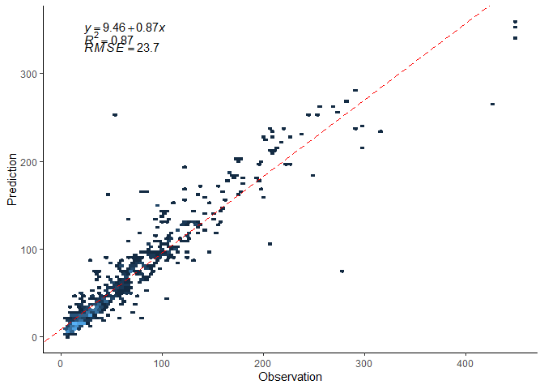

# R package ‘deeper’ install

Before installation, please make sure:

-   using R (&gt;= 3.5.0)

-   installed certain dependent R packages: devtools, SuperLearner(&gt;=
    2.0-28)

-   installed other suggested R packages depend on what ML model would
    be used, eg. ranger, gbm, xgboost, gam et al.

The developing version of deeper can be found from
[github](https://github.com/Alven8816/deeper).

Using the following syntax to install:

    library(devtools)
    install_github("Alven8816/deeper")

## Activity

Install deeper R package.

# The advantage of DEML

-   Outstanding model performance. DEML is an extension of a
    SuperLearner(SL) ensemble algorithm (Naimi and Balzer 2018; Polley
    and Van Der Laan 2010; Van der Laan et al. 2007) by introducing the
    neural network hierarchy structure. Generally, it achieved higher
    estimation accuracy than SL and other single ML models.

-   Assessing constructed individual models simultaneously. DEML can
    evaluate the performance of all constructed individual models
    simultaneously and generate the optimal weights for each model.

-   Customizing the model structure and algorithms. You can modify the
    structure of DEML and achieve the best one for your tasks.

-   Minimizing errors from empirical experience. DEML not only evaluates
    the performance of all constructed models simultaneously but also
    automatically selects an optimal integration, as well as the
    selection of hyper-parameters.

-   Easy to use and extent. You do not need to have a high-steep
    learning curve to learn how it works.

The details about the DEML can be found
[here](https://ehp.niehs.nih.gov/doi/full/10.1289/EHP9752).

# The DEML framework

The DEML framework proposed above is a three-level stacked ensemble
approach. It is based on the SuperLearner(SL) ensemble algorithm (Naimi
and Balzer 2018; Polley and Van Der Laan 2010; Van der Laan et al. 2007)
introduced in the neural network hierarchy structure.

# Basic steps for DEML

1.  Data preparation
2.  Establish base models
3.  Stacking meta models
4.  Prediction based on new data set

# Example:

To estimate the daily ambient PM2.5 in the northeast of China in
2015-2016

## 1. Data preparation

    # load library
    library(ggplot2)
    library(caret)
    library(skimr)
    library(CAST)
    library(SuperLearner)

    library(deeper)

    data("envir_example")

<table>
<thead>
<tr class="header">
<th style="text-align: left;">date</th>
<th style="text-align: left;">code</th>
<th style="text-align: left;">year</th>
<th style="text-align: left;">month</th>
<th style="text-align: left;">week</th>
<th style="text-align: right;">PM2.5</th>
<th style="text-align: right;">c_AOD</th>
<th style="text-align: right;">TEMP</th>
</tr>
</thead>
<tbody>
<tr class="odd">
<td style="text-align: left;">2/01/2015</td>
<td style="text-align: left;">1001A</td>
<td style="text-align: left;">2015</td>
<td style="text-align: left;">1</td>
<td style="text-align: left;">5</td>
<td style="text-align: right;">51.26</td>
<td style="text-align: right;">0.22</td>
<td style="text-align: right;">-2.76</td>
</tr>
<tr class="even">
<td style="text-align: left;">3/01/2015</td>
<td style="text-align: left;">1001A</td>
<td style="text-align: left;">2015</td>
<td style="text-align: left;">1</td>
<td style="text-align: left;">6</td>
<td style="text-align: right;">154.04</td>
<td style="text-align: right;">0.92</td>
<td style="text-align: right;">-3.76</td>
</tr>
<tr class="odd">
<td style="text-align: left;">4/01/2015</td>
<td style="text-align: left;">1001A</td>
<td style="text-align: left;">2015</td>
<td style="text-align: left;">1</td>
<td style="text-align: left;">0</td>
<td style="text-align: right;">151.92</td>
<td style="text-align: right;">0.39</td>
<td style="text-align: right;">-1.30</td>
</tr>
<tr class="even">
<td style="text-align: left;">6/01/2015</td>
<td style="text-align: left;">1001A</td>
<td style="text-align: left;">2015</td>
<td style="text-align: left;">1</td>
<td style="text-align: left;">2</td>
<td style="text-align: right;">39.55</td>
<td style="text-align: right;">0.30</td>
<td style="text-align: right;">-2.22</td>
</tr>
<tr class="odd">
<td style="text-align: left;">8/01/2015</td>
<td style="text-align: left;">1001A</td>
<td style="text-align: left;">2015</td>
<td style="text-align: left;">1</td>
<td style="text-align: left;">4</td>
<td style="text-align: right;">148.38</td>
<td style="text-align: right;">1.05</td>
<td style="text-align: right;">-3.52</td>
</tr>
<tr class="even">
<td style="text-align: left;">9/01/2015</td>
<td style="text-align: left;">1001A</td>
<td style="text-align: left;">2015</td>
<td style="text-align: left;">1</td>
<td style="text-align: left;">5</td>
<td style="text-align: right;">87.78</td>
<td style="text-align: right;">0.18</td>
<td style="text-align: right;">-1.59</td>
</tr>
</tbody>
</table>

## 1.1 Data clean

The basic data clean strategies include:

1.  Variable type setting

2.  Extreme value (outliers) detection

3.  Missing value operation (imputation, drop)

4.  Data transforming (normalization/standardization, eg. scale,
    centralize,log-transform and others)

<!-- -->

    # skim the data missing value and distribution
    skimr::skim(envir_example)

<table>
<thead>
<tr class="header">
<th style="text-align: left;">skim_type</th>
<th style="text-align: left;">skim_variable</th>
<th style="text-align: right;">n_missing</th>
<th style="text-align: right;">complete_rate</th>
<th style="text-align: right;">numeric.mean</th>
<th style="text-align: right;">numeric.sd</th>
</tr>
</thead>
<tbody>
<tr class="odd">
<td style="text-align: left;">numeric</td>
<td style="text-align: left;">RH</td>
<td style="text-align: right;">0</td>
<td style="text-align: right;">1</td>
<td style="text-align: right;">50.6</td>
<td style="text-align: right;">17.3</td>
</tr>
<tr class="even">
<td style="text-align: left;">numeric</td>
<td style="text-align: left;">elevation</td>
<td style="text-align: right;">0</td>
<td style="text-align: right;">1</td>
<td style="text-align: right;">90.4</td>
<td style="text-align: right;">108.0</td>
</tr>
<tr class="odd">
<td style="text-align: left;">numeric</td>
<td style="text-align: left;">WS</td>
<td style="text-align: right;">0</td>
<td style="text-align: right;">1</td>
<td style="text-align: right;">2.0</td>
<td style="text-align: right;">0.8</td>
</tr>
<tr class="even">
<td style="text-align: left;">numeric</td>
<td style="text-align: left;">a_buffer10</td>
<td style="text-align: right;">0</td>
<td style="text-align: right;">1</td>
<td style="text-align: right;">103.3</td>
<td style="text-align: right;">29.1</td>
</tr>
</tbody>
</table>

## 1.2 Data split

We randomly select 20% of the data as independent testing dataset, and
the remainder were used as the training dataset.

The split strategy is based on the size of your sample as well as your
question.

    set.seed(1234) # to achieve a repeatable results

    size <-
      caret::createDataPartition(y = envir_example$PM2.5,
                                 p = 0.8, list = FALSE)
    trainset <- envir_example[size, ]
    testset <- envir_example[-size, ]

Identify the dependence and independence variables

    y <- c("PM2.5")
    x <- colnames(envir_example[-c(1, 6)]) # except "date" and "PM2.5"

## Challenging 1

Q: Estimate annual average NO2 in Sydney in 2005-2018

Download the Sydney NO2 data in the
[CloudStor](https://www.aarnet.edu.au/cloudstor)

Tasks:

1.  Setting the dependence (“no2\_annual”) and others as independent
    variables

2.  Split 10% of data as testing data set

<!-- -->

    #try it here

## 2. Establish base models

## 2.1 Single base model training

Q: How to select the best parameter for a single base model?

We can set or adjust the parameters of a base model using ‘tuningModel’
function.

    ranger <-
      tuningModel(
        basemodel  = 'SL.ranger',
        params = list(num.trees = 100),
        tune = list(mtry = c(1, 3, 7))
      )

Here we will train a Random Forest (RF) model with the specific
parameters and using 5-fold Cross validation (CV) to assess the model
performance.

    # training the RF model with different parameters simultaneously

    start_time <- Sys.time()
    model1 <-
      predictModel(
        Y = trainset[, y],
        X = trainset[, x],
        base_model = c(ranger),
        cvControl = list(V = 5)
      )

    ## 
    ## 
    ## The base models Cross validation result:
    ## 
    ##        SL.ranger_1_All SL.ranger_2_All SL.ranger_3_All
    ## weight       0.0000000       0.3004660       0.6995340
    ## R2           0.7978256       0.8749765       0.8752692
    ## RMSE        35.2163342      23.8228438      23.2379626

    end_time <- Sys.time()
    end_time - start_time

    ## Time difference of 4.059626 secs

    #print(model1$base_ensemble_value)

The training results show that ‘mtry = 7’ could achieve a better RF
model performance.

## 2.2 Model prediction

After training a base ML model, we can use it to estimate the
independent testing dataset by using ‘predict’ function.

Note: ’predict()’function was recommended to limit its sources
(namespace) to reduce the conflict with other R package such as
stats::predict()

    # compare the model performance in the independent testing dataset
    pred_model1 <- deeper::predict(object = model1, newX = testset[, x])

    # get each base model prediction
    head(pred_model1$pre_base$library.predict)

    ##      SL.ranger_1_All SL.ranger_2_All SL.ranger_3_All
    ## [1,]        52.90729        47.68343        48.09790
    ## [2,]        61.50432        66.76404        67.36444
    ## [3,]        68.93616        77.79895        62.86596
    ## [4,]        66.66083        73.91816        77.26067
    ## [5,]       147.77336       177.64796       174.72512
    ## [6,]        56.60838        51.01905        49.36100

    # calculate model performance in testing dataset
    print(apply(
      X = pred_model1$pre_base$library.predict,
      MARGIN = 2,
      FUN = caret::R2,
      obs = testset[, y]
    ))

    ## SL.ranger_1_All SL.ranger_2_All SL.ranger_3_All 
    ##       0.7843890       0.8562903       0.8780889

After examine the model performance in an independent testing dataset,
we may finally select the RF model with mtry = 7 as the best parameters.

## Challenging 2

Tasks:

1.  Establish a Random Forest model with parameter: mtry = 7 and leave
    others as default

2.  Establish another base model ‘xgboost’ simultaneously by setting
    base\_model = “SL.xgboost”

<!-- -->

    #try it here

## 2.3 Establish base model with parallel computing

Considering the time-consuming of running several base models
simultaneously, we can select using parallel computing to help improve
the computational efficiency.

We can identify the index in the cross validation(CV) to conduct the
spatial (cluster) or temporal CV

    # there are 7 stations in the trainset
    unique(trainset$code) 

    ## [1] 1001A 1002A 1003A 1004A 1005A 1006A 1007A
    ## Levels: 1001A 1002A 1003A 1004A 1005A 1006A 1007A

    # Create a list with 7 (folds) elements (each element contains index of rows to be considered on each fold)

    ## conduct the spatial CV
    indices <-
      CAST::CreateSpacetimeFolds(trainset, spacevar = "code", k = 7)

    # Rows of validation set on each fold

    v_raw <- indices$indexOut
    names(v_raw) <- seq(1:7)

    start_time <- Sys.time()

    model2 <- predictModel_parallel(
      Y = trainset[, y],
      X = trainset[, x],
      base_model = c("SL.xgboost", "SL.ranger"),
      cvControl = list(V = length(v_raw), validRows = v_raw),
      number_cores = 4,
      seed = 1234
    )

    ## 
    ## 
    ## The base models Cross validation result:
    ## 
    ##        SL.xgboost_All SL.ranger_All SL.predict
    ## weight      0.3776465     0.6223535   1.000000
    ## R2          0.8596721     0.8769333   0.988768
    ## RMSE       24.3083180    23.5561368   7.618139

    end_time <- Sys.time()
    end_time - start_time

    ## Time difference of 13.89589 secs

    ## when number_cores is missing, it will indicate user to set one based on the operation system.

    # pred_m3 <- predictModel_parallel(
    #     Y = trainset[,y],
    #     X = trainset[,x],
    #     base_model = c("SL.xgboost",ranger),
    #     cvControl = list(V = length(v_raw), validRows = v_raw),
    #     seed = 1
    #   )

    #You have 8 cpu cores, How many cpu core you want to use:
    # type the number to continue the process.

    # prediction
    pred_model2 <- deeper::predict(object = model2, newX = testset[, x])

## 3. Stacking meta models

After assessing the performances of base models, we now can move forward
to the DEML by stacking meta models on it.

    #Do include original feature
    #object do not include newX dataset
    model3_stack <-
      stack_ensemble(
        object = model1,
        meta_model = c("SL.ranger", "SL.xgboost", "SL.glm"),
        original_feature = FALSE,
        X = trainset[, x]
      )

    ## 
    ## The meta models cross validation results:
    ## 
    ##        SL.ranger_All SL.xgboost_All SL.glm_All
    ## weight     0.1322739      0.0000000  0.8677261
    ## R2         0.8707404      0.8490553  0.8815373
    ## RMSE      23.3403989     25.3698735 22.3156117

    ## the training results
    #model3_stack$stack_ensemble_value

    # achieving independent testing results
    model3_DEML <-
      deeper::predict(object = model3_stack, newX = testset[, x])

    print(apply(
      X = cbind(model3_DEML$pre_meta$library.predict,
            model3_DEML$pre_meta$pred),
      MARGIN = 2,
      FUN = caret::R2,
      obs = testset[, y]
    ))

    ##  SL.ranger_All SL.xgboost_All     SL.glm_All                
    ##      0.8648366      0.8537735      0.8738125      0.8738318

    print(apply(
      X = cbind(model3_DEML$pre_meta$library.predict,
            model3_DEML$pre_meta$pred),
      MARGIN = 2,
      FUN = caret::RMSE,
      obs = testset[, y]
    ))

    ##  SL.ranger_All SL.xgboost_All     SL.glm_All                
    ##       24.53393       25.59143       23.70075       23.69987

## 3.1 Stacked meta models from scratch

We can create DEML directly by setting the base models and meta models.
But considering the unknown impact of the underlying model and
computation time, this is not recommended.

    model4_stack <-
      stack_ensemble.fit(
        Y = trainset[, y],
        X = trainset[, x],
        base_model = c("SL.xgboost", ranger),
        meta_model = c("SL.ranger", "SL.xgboost", "SL.glm"),
        original_feature = FALSE
      )

    ## 
    ## 
    ## The base models Cross validation result:
    ## 
    ##        SL.xgboost_All SL.ranger_1_All SL.ranger_2_All SL.ranger_3_All
    ## weight      0.5093405       0.0000000       0.1946900       0.2959695
    ## R2          0.8843921       0.8020241       0.8840721       0.8842767
    ## RMSE       22.0529810      34.4452850      22.8514683      22.3367349
    ## 
    ## The meta models cross validation results:
    ## 
    ##        SL.ranger_All SL.xgboost_All SL.glm_All
    ## weight     0.3955923     0.09226124  0.5121465
    ## R2         0.8976871     0.88606742  0.8980186
    ## RMSE      20.7446071    21.90717443 20.7052018

## 3.2 Stacked meta models with paralleling computing

We also accelerate the calculation with paralleling computing in DEML.

Several key points are worthy to note:

-   If the base model used parallel computing, the meta-model also needs
    to be parallel.

-   When setting a specific CV index, please be consistent in meta-model
    training.

-   Do not use all of your computation cores to do paralleling. Leave at
    least one for your operating system.

-   ‘Original\_feature’ is optional. It may generally improve your model
    performance but increase the computational complexity.

<!-- -->

    #Do not include original feature
    model5_stack <-
      stack_ensemble_parallel(
        object = model2,
        Y = trainset[, y],
        meta_model = c("SL.ranger", "SL.xgboost", "SL.glm"),
        original_feature = FALSE,
        cvControl = list(V = length(v_raw), validRows = v_raw),
        number_cores = 4
      )

    ## 
    ## The stack ensemble cross validation value:
    ## 
    ##        SL.ranger_All SL.xgboost_All SL.glm_All     deeper
    ## weight     0.1747935      0.0000000  0.8252065  1.0000000
    ## R2         0.8615084      0.8463332  0.8729455  0.9019219
    ## RMSE      24.1577567     25.4904753 23.1140687 20.3172672

    # the training results

    # the testing results
    pred_model5_stack <-
      deeper::predict(object = model5_stack, newX = testset[, x])

## Challenging 3

Tasks:

1.  Stacking meta models using RF and Xgboost (with original features)
    in Sydeny data to conduct DEML model

2.  Achieving the final DEML model performance in testing dataset

<!-- -->

    #try it here

## Challenging 4

Download the Sydney NO2 data in the
[CloudStor](https://www.aarnet.edu.au/cloudstor)

Task:

To estimate 10km grid cell yearly NO2 in Sydney.

    #try it here

## 4. Plot the results

We can finally have the scatter plot using ‘assess.plot’ function in
deeper.

    plot_DEML <-
      assess.plot(pre = model3_DEML$pre_meta$pred, obs = testset[, y])

    print(plot_DEML$plot)

## 5. Citation

Wenhua Yu, Shanshan Li, Tingting Ye,Rongbin Xu, Jiangning Song, Yuming
Guo (2022) Deep ensemble machine learning framework for the estimation
of PM2.5 concentrations,Environmental health perspectives:
<https://doi.org/10.1289/EHP9752>
